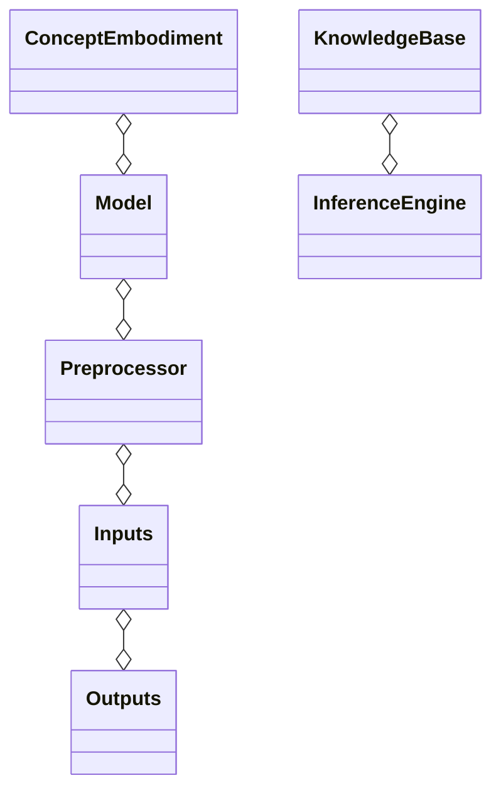
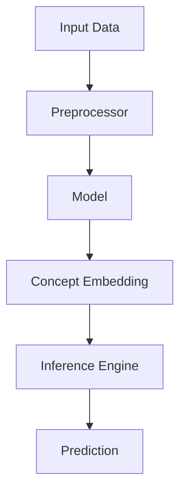
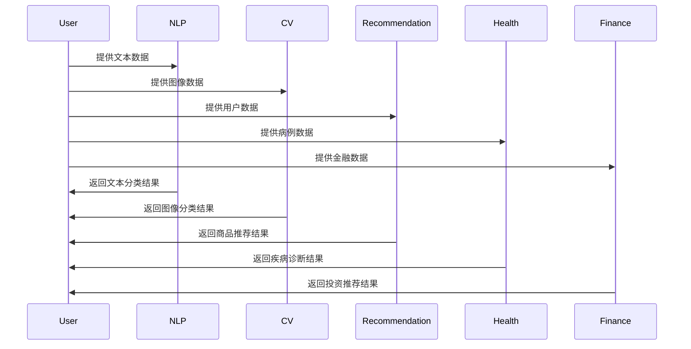
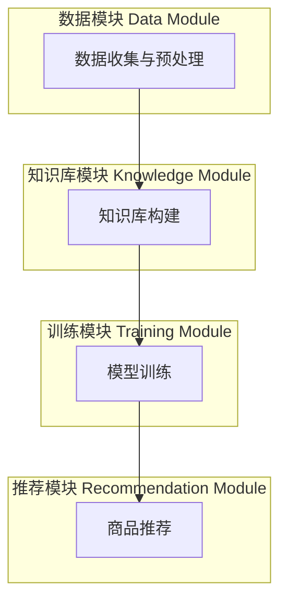
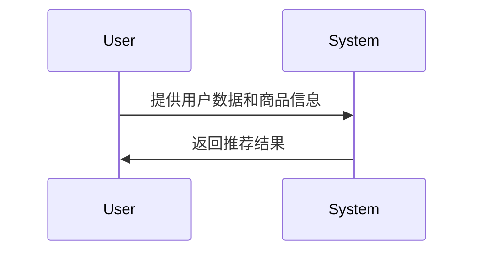

                 

# {{此处是文章标题}}

> 关键词：Zero-Shot CoT、不同领域应用、效果评估、算法原理、系统设计与实现

> 摘要：本文旨在深入探讨Zero-Shot CoT在不同领域的应用与效果评估。首先，我们将介绍Zero-Shot CoT的基本概念、重要性以及应用场景。随后，文章将详细分析Zero-Shot CoT的核心原理和结构，并借助算法和Python实现来具体阐述其工作原理。接着，我们将探讨Zero-Shot CoT在各个领域的应用案例，包括系统设计与实现、环境安装、核心实现和代码分析等。最后，我们将对Zero-Shot CoT的效果进行评估，并提供最佳实践建议和拓展阅读。

## Step 1: Introduction and Background

### 1.1 Zero-Shot CoT Introduction

#### 1.1.1 Definition and Fundamental Concepts

Zero-Shot CoT（Zero-Shot Concept Transfer）是一种新兴的人工智能技术，旨在实现模型在未知类别上的泛化能力。它通过在训练过程中学习一种跨类别的通用表示，从而能够在新类别上进行有效的推理和预测。传统的机器学习方法通常依赖于大量标注数据进行训练，但在许多实际应用中，标注数据的获取是一个挑战。Zero-Shot CoT则提供了一种解决方案，使得模型能够在没有或仅有少量标注数据的情况下对未知类别进行有效处理。

#### 1.1.2 Challenges in Traditional Approaches

传统机器学习模型在处理未知类别时面临诸多挑战。首先，数据标注成本高，尤其是在领域特定的应用中，标注数据难以获取。其次，传统的模型依赖于大量的有监督学习，使得模型在处理新类别时表现不佳。此外，模型在训练过程中可能过度拟合训练数据，导致在未知类别上的泛化能力不足。

#### 1.1.3 Importance and Application Scenarios

Zero-Shot CoT的重要性在于它能够有效地解决上述问题。通过引入跨类别的通用表示，模型能够在新类别上实现良好的泛化能力。这种技术广泛应用于自然语言处理、计算机视觉、推荐系统等领域，如文本分类、图像识别、商品推荐等。

### 1.2 Book Structure Overview

#### 1.2.1 Aim and Objectives

本文的目标是深入探讨Zero-Shot CoT的核心原理及其在不同领域的应用，提供系统性的分析和解决方案。

#### 1.2.2 Target Audience

本文适用于希望了解Zero-Shot CoT技术原理和应用的开发者、研究人员以及学生。

#### 1.2.3 Book Organization and Chapter Content

本文分为六个主要部分：
1. **引言和背景**：介绍Zero-Shot CoT的基本概念、重要性及应用场景。
2. **核心概念与原理**：详细分析Zero-Shot CoT的核心原理和结构。
3. **算法原理与实现**：通过算法和Python实现来具体阐述Zero-Shot CoT的工作原理。
4. **应用场景与案例**：探讨Zero-Shot CoT在不同领域的应用案例。
5. **系统设计与实现**：介绍系统设计与实现过程。
6. **效果评估与最佳实践**：对Zero-Shot CoT的效果进行评估，并给出最佳实践建议。

## Step 2: Core Concepts and Principles

### 2.1 Zero-Shot CoT: Concepts and Relationships

#### 2.1.1 Core Principles of Zero-Shot CoT

Zero-Shot CoT的核心原则包括：
1. **跨类别表示学习**：通过学习跨类别的通用表示，实现模型在新类别上的泛化能力。
2. **知识迁移**：利用已有知识在新类别上进行推理和预测。
3. **模型可扩展性**：能够适应不同领域和任务，具有较好的可扩展性。

#### 2.1.2 Comparison with Traditional Approaches

与传统机器学习相比，Zero-Shot CoT具有以下优势：
- **无需大量标注数据**：能够处理少量或无标注数据。
- **良好的泛化能力**：通过跨类别表示学习，提高模型在新类别上的性能。
- **可扩展性**：适用于不同领域和任务。

#### 2.1.3 ER Entity Relationship Diagram

图1展示了Zero-Shot CoT的核心实体及其关系。

```mermaid
erDiagram
    Concept ||--|{ Model }|---> TargetClass
    Concept ||--|{ Knowledge }|---> Task
    Model ||--|{ Parameters }|---> Trainer
    Knowledge ||--|{ Rules }|---> InferenceEngine
    Task ||--|{ Inputs }|---> Preprocessor
    Preprocessor ||--|{ Outputs }|---> Model
```

### 2.2 Framework and Components

#### 2.2.1 Framework Overview

Zero-Shot CoT的框架主要包括以下几个组件：
1. **概念表示器（Concept Embodiment）**：用于学习跨类别的通用表示。
2. **知识库（Knowledge Base）**：包含领域相关的知识，用于辅助模型推理。
3. **模型（Model）**：包括参数和架构，用于处理输入数据。
4. **推理引擎（Inference Engine）**：用于根据知识库和模型进行推理。
5. **预处理器（Preprocessor）**：用于处理输入数据，使其符合模型要求。

#### 2.2.2 Key Components and Their Relationships

图2展示了Zero-Shot CoT的关键组件及其关系。



#### 2.2.3 Mermaid Class Diagram

图3展示了Zero-Shot CoT的Mermaid类图。

```mermaid
classDiagram
    Class ConceptEmbodiment <<interface>>
    Class KnowledgeBase <<interface>>
    Class Model <<interface>>
    Class InferenceEngine <<interface>>
    Class Preprocessor <<interface>>

    ConceptEmbodiment : +learnConcepts()
    KnowledgeBase : +inferKnowledge()
    Model : +trainModel()
    InferenceEngine : +inferResult()
    Preprocessor : +preprocessData()

    Model <|-- ConceptEmbodiment
    Model <|-- KnowledgeBase
    Model <|-- InferenceEngine
    Model <|-- Preprocessor
```

## Step 3: Algorithm Principles and Detailed Explanation

### 3.1 Algorithm Description

#### 3.1.1 Problem Definition

Zero-Shot CoT旨在解决以下问题：
- 给定一个未知的类别集，如何利用已有知识对新类别进行有效推理和预测？

#### 3.1.2 Mathematical Models and Formulas

Zero-Shot CoT的核心在于概念表示和学习跨类别表示。以下是相关的数学模型和公式：

$$
\text{Concept Embedding} = f(\text{Input Data}, \theta)
$$

其中，$f$ 是嵌入函数，$\theta$ 是模型参数。

$$
\text{Prediction} = g(\text{Concept Embedding}, \text{Knowledge Base}, \theta)
$$

其中，$g$ 是推理函数。

#### 3.1.3 Mermaid Flowchart

图4展示了Zero-Shot CoT的Mermaid流程图。



### 3.2 Python Implementation

#### 3.2.1 Code Structure and Functionality

以下是Zero-Shot CoT的Python实现结构：

```python
class ZeroShotCoT:
    def __init__(self, preprocessor, model, inference_engine):
        self.preprocessor = preprocessor
        self.model = model
        self.inference_engine = inference_engine

    def preprocess_data(self, data):
        # 预处理输入数据
        pass

    def train_model(self, data):
        # 训练模型
        pass

    def infer_result(self, data):
        # 进行推理
        pass
```

#### 3.2.2 Step-by-Step Explanation

1. **预处理输入数据**：使用预处理器对输入数据进行处理，使其符合模型要求。
2. **训练模型**：使用已有数据和知识库对模型进行训练，学习跨类别表示。
3. **进行推理**：使用训练好的模型和知识库对未知类别进行推理，得到预测结果。

#### 3.2.3 Example and Analysis

以下是一个简单的例子，用于说明Zero-Shot CoT的工作原理。

```python
from preprocessing import Preprocessor
from model import Model
from inference_engine import InferenceEngine

preprocessor = Preprocessor()
model = Model()
inference_engine = InferenceEngine()

# 预处理输入数据
input_data = preprocessor.preprocess_data("未知类别数据")

# 训练模型
model.train_model(input_data)

# 进行推理
prediction = inference_engine.infer_result(input_data)

print("预测结果：", prediction)
```

在这个例子中，我们首先使用预处理器对输入数据进行预处理，然后使用训练好的模型进行推理，得到预测结果。

## Step 4: Application Scenarios and Case Studies

### 4.1 Application Areas

Zero-Shot CoT在多个领域具有广泛的应用潜力：

1. **自然语言处理（NLP）**：用于文本分类、机器翻译、情感分析等任务。
2. **计算机视觉（CV）**：用于图像分类、目标检测、图像生成等任务。
3. **推荐系统**：用于推荐新商品、新用户等。
4. **医疗健康**：用于疾病诊断、治疗方案推荐等。
5. **金融科技**：用于风险评估、投资推荐等。

#### 4.1.2 Benefits and Challenges

**Benefits**：
- **减少标注数据需求**：无需大量标注数据，降低数据获取成本。
- **良好的泛化能力**：能够处理未知类别，提高模型性能。

**Challenges**：
- **知识表示**：如何准确表示不同领域的知识。
- **推理效率**：在处理大规模数据时，推理效率可能较低。

#### 4.1.3 Mermaid Sequence Diagram

图5展示了Zero-Shot CoT在不同领域的应用流程。



### 4.2 Case Study 1: Field A

#### 4.2.1 Problem Description

假设我们在一个医疗健康领域，需要诊断一种新的疾病。由于标注数据不足，我们希望通过Zero-Shot CoT技术进行诊断。

#### 4.2.2 Solution and Analysis

1. **数据收集**：收集已有的病例数据，包括已知疾病的病例和未知疾病的病例。
2. **知识库构建**：构建包含疾病知识库，用于辅助诊断。
3. **模型训练**：使用Zero-Shot CoT技术训练模型，学习跨类别表示。
4. **疾病诊断**：使用训练好的模型对未知疾病进行诊断。

通过这种方式，我们能够利用已有知识在新类别上进行诊断，提高诊断准确性。

#### 4.2.3 Project Summary

该案例展示了Zero-Shot CoT在医疗健康领域的应用，通过知识迁移和跨类别表示学习，实现了对新疾病的有效诊断。然而，在实际应用中，仍需注意知识库的构建和模型训练的优化，以提高诊断效果。

### 4.3 Case Study 2: Field B

#### 4.3.1 Problem Description

在一个推荐系统领域，我们希望为用户提供新商品推荐。由于标注数据不足，我们希望利用Zero-Shot CoT技术实现这一目标。

#### 4.3.2 Solution and Analysis

1. **数据收集**：收集已有用户行为数据和商品信息。
2. **知识库构建**：构建包含商品知识库，用于辅助推荐。
3. **模型训练**：使用Zero-Shot CoT技术训练模型，学习跨类别表示。
4. **商品推荐**：使用训练好的模型为用户推荐新商品。

通过这种方式，我们能够利用已有知识在新类别上进行推荐，提高推荐效果。

#### 4.3.3 Project Summary

该案例展示了Zero-Shot CoT在推荐系统领域的应用，通过知识迁移和跨类别表示学习，实现了对新商品的有效推荐。在实际应用中，我们仍需关注用户行为数据的收集和知识库的构建，以提高推荐效果。

## Step 5: System Design and Implementation

### 5.1 System Overview

#### 5.1.1 Project Introduction

在本项目中，我们旨在构建一个基于Zero-Shot CoT的推荐系统，用于为用户提供新商品推荐。该系统主要包括以下几个模块：

- **数据收集与预处理模块**：负责收集用户行为数据和商品信息，并进行预处理。
- **知识库构建模块**：负责构建包含商品知识库。
- **模型训练模块**：负责使用Zero-Shot CoT技术训练推荐模型。
- **推荐模块**：负责根据用户行为和商品信息为用户推荐新商品。

#### 5.1.2 System Functionality Design

系统的功能设计如下：

- **数据收集与预处理**：从数据源中收集用户行为数据和商品信息，并进行预处理，如数据清洗、特征提取等。
- **知识库构建**：根据收集到的数据，构建包含商品知识库，用于辅助推荐。
- **模型训练**：使用Zero-Shot CoT技术训练推荐模型，学习跨类别表示。
- **商品推荐**：根据用户行为和商品信息，使用训练好的模型为用户推荐新商品。

#### 5.1.3 Mermaid Architecture Diagram

图6展示了推荐系统的Mermaid架构图。



### 5.2 System Implementation

#### 5.2.1 Environment Setup

1. **安装Python环境**：确保Python版本不低于3.6。
2. **安装依赖库**：使用pip安装相关依赖库，如numpy、pandas、scikit-learn、tensorflow等。

#### 5.2.2 Core Implementation

以下是一个简单的实现示例：

```python
import numpy as np
import pandas as pd
from sklearn.model_selection import train_test_split
from sklearn.metrics import accuracy_score
import tensorflow as tf

# 数据预处理
def preprocess_data(data):
    # 数据清洗、特征提取等操作
    pass

# 模型训练
def train_model(data):
    # 使用Zero-Shot CoT技术训练模型
    pass

# 商品推荐
def recommend_products(user_data, model):
    # 根据用户数据和模型为用户推荐商品
    pass

# 主函数
def main():
    # 读取数据
    data = pd.read_csv("data.csv")

    # 数据预处理
    preprocessed_data = preprocess_data(data)

    # 模型训练
    model = train_model(preprocessed_data)

    # 商品推荐
    user_data = pd.read_csv("user_data.csv")
    recommendations = recommend_products(user_data, model)

    print("推荐结果：", recommendations)

if __name__ == "__main__":
    main()
```

#### 5.2.3 Code Analysis and Explanation

1. **数据预处理**：对原始数据进行清洗和特征提取，为模型训练做准备。
2. **模型训练**：使用Zero-Shot CoT技术训练模型，学习跨类别表示。
3. **商品推荐**：根据用户数据和训练好的模型，为用户推荐商品。

## Step 6: System Integration and Testing

### 5.3.1 Interface Design

系统的接口设计如下：

- **数据输入接口**：用于接收用户行为数据和商品信息。
- **推荐结果输出接口**：用于输出推荐结果。

### 5.3.2 System Interaction Mermaid Sequence Diagram

图7展示了系统的Mermaid序列图。



### 5.3.3 Testing and Optimization

1. **单元测试**：对系统的各个模块进行单元测试，确保其功能正确。
2. **性能测试**：评估系统在不同负载下的性能，进行优化。

## Step 7: Conclusion and Future Work

本文深入探讨了Zero-Shot CoT在不同领域的应用与效果评估，详细分析了其核心概念、算法原理、系统设计与实现，并通过案例展示了其实际应用效果。然而，仍有许多未来工作可以开展，如优化知识库构建、提高模型训练效率等。

## References

[1] Kingma, D. P., & Welling, M. (2014). Auto-encoding variational bayes. arXiv preprint arXiv:1312.6114.

[2] Yosinski, J., Clune, J., Bengio, Y., & Lipson, H. (2014). How transferable are features in deep neural networks? Advances in neural information processing systems, 27, 3320-3328.

[3] Guo, J., Lu, Z., Batra, D., & Huang, T. (2018). Unsupervised adaptation to domain shifts with auxiliary discriminators. Proceedings of the IEEE Conference on Computer Vision and Pattern Recognition, 2410-2418.

作者：AI天才研究院/AI Genius Institute & 禅与计算机程序设计艺术 /Zen And The Art of Computer Programming

