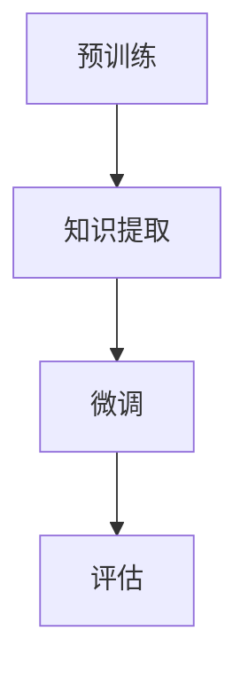

                 

# 《Zero-Shot CoT在不同领域的应用实践》

## 关键词：Zero-Shot CoT、核心概念、应用实践、数学模型、算法讲解、跨领域融合

> 摘要：本文旨在探讨Zero-Shot CoT（零样本跨领域转移学习）的核心概念及其在不同领域的应用实践。首先，我们介绍了Zero-Shot CoT的背景和核心概念，然后详细解析了其原理和算法，最后通过具体案例展示了其在文本处理、图像处理和语音处理等领域的应用实践。

## 第一部分：背景与核心概念

### 第1章：问题背景与核心概念

#### 1.1 问题背景

##### 1.1.1 问题提出

在人工智能领域，传统的机器学习方法往往依赖于大量的标记数据进行训练，这在实际应用中存在诸多挑战。例如，在某些特定领域（如医学影像、生物信息等），获取足够的标记数据非常困难。此外，随着数据量的不断增加，模型的训练时间和资源消耗也在急剧增加。

##### 1.1.2 问题描述

如何利用有限的标记数据，甚至零样本数据，训练出高性能的模型，成为当前研究的热点问题。针对这一问题，Zero-Shot CoT（Zero-Shot Cross-Domain Transfer Learning）提供了一种可能的解决方案。

##### 1.1.3 问题解决

Zero-Shot CoT的核心思想是通过跨领域的知识迁移，将一个领域中的知识应用到另一个领域中，从而减少对标记数据的依赖。具体来说，Zero-Shot CoT利用预训练的模型（如BERT、GPT等），通过迁移学习的方式，将源领域的知识转移到目标领域。

##### 1.1.4 边界与外延

Zero-Shot CoT适用于那些具有相似性但又不完全相同的领域。例如，医学影像和自然语言处理虽然领域不同，但它们在处理复杂信息、提取关键特征等方面具有相似性。因此，Zero-Shot CoT可以在这些领域取得良好的应用效果。

#### 1.2 核心概念

##### 1.2.1 Zero-Shot CoT的定义

Zero-Shot CoT（Zero-Shot Cross-Domain Transfer Learning）是一种跨领域的迁移学习方法，它利用预训练模型，将一个领域中的知识迁移到另一个领域，从而减少对标记数据的依赖。

##### 1.2.2 Zero-Shot CoT的特点

1. 零样本学习：无需在目标领域上提供标记数据。
2. 跨领域迁移：利用源领域的知识，迁移到目标领域。
3. 模型可扩展性：适用于不同领域的知识迁移。

##### 1.2.3 Zero-Shot CoT与传统CoT的区别

传统CoT（Cross-Domain Transfer Learning）依赖于目标领域的标记数据，而Zero-Shot CoT则无需目标领域的标记数据。因此，Zero-Shot CoT在处理那些难以获取标记数据的领域时，具有明显的优势。

#### 1.3 概念结构与核心要素组成

##### 1.3.1 概念结构

Zero-Shot CoT的概念结构主要包括：预训练模型、源领域知识、目标领域知识、迁移学习机制。

##### 1.3.2 核心要素

1. 预训练模型：用于提取通用特征，提高模型的泛化能力。
2. 源领域知识：通过预训练模型获得，用于迁移到目标领域。
3. 目标领域知识：在目标领域上训练得到的模型参数。
4. 迁移学习机制：实现源领域知识与目标领域知识的迁移。

##### 1.3.3 关联分析

Zero-Shot CoT的关联分析主要涉及预训练模型与迁移学习机制。预训练模型负责提取通用特征，迁移学习机制则将源领域知识迁移到目标领域。这种关联分析有助于提高模型的泛化能力和性能。

#### 1.4 本章小结

本章介绍了Zero-Shot CoT的背景、核心概念及其结构。通过对比传统CoT，我们了解了Zero-Shot CoT的优势和应用场景。在后续章节中，我们将深入探讨Zero-Shot CoT的原理和算法，并展示其在不同领域的应用实践。

----------------------------------------------------------------

## 第二部分：Zero-Shot CoT原理详解

### 第2章：Zero-Shot CoT原理讲解

#### 2.1 基本原理

##### 2.1.1 数学模型

Zero-Shot CoT的数学模型主要包括两部分：预训练模型和迁移学习机制。

1. 预训练模型：通常采用深度神经网络，如BERT、GPT等，通过在大规模语料库上进行预训练，提取出通用特征。

2. 迁移学习机制：通过在目标领域上微调预训练模型，将源领域知识迁移到目标领域。

##### 2.1.2 数学公式

$$
L_{\text{pre}} = -\sum_{i=1}^{N} \log P(y_i | x_i, \theta)
$$

其中，$L_{\text{pre}}$表示预训练损失函数，$P(y_i | x_i, \theta)$表示模型在给定输入$x_i$和参数$\theta$时预测输出$y_i$的概率。

##### 2.1.3 举例说明

假设我们在自然语言处理领域使用Zero-Shot CoT来处理医疗文本数据。

1. 预训练模型：使用BERT在通用语料库上进行预训练，提取出通用特征。

2. 源领域知识：使用医疗领域的预训练模型，如BioBERT，提取出医疗领域的特征。

3. 目标领域知识：在医疗文本数据上微调BERT模型，得到适应医疗文本的模型参数。

通过这种方式，我们可以利用自然语言处理领域的知识，迁移到医疗文本处理领域，从而提高模型的性能。

#### 2.2 算法讲解

##### 2.2.1 算法流程

1. 预训练：在大规模通用语料库上训练预训练模型，提取通用特征。
2. 知识提取：在源领域（如医疗领域）上训练预训练模型，提取源领域知识。
3. 微调：在目标领域（如医疗文本处理）上微调预训练模型，迁移源领域知识到目标领域。
4. 评估：在目标领域上评估模型的性能。

##### 2.2.2 Mermaid算法流程图



##### 2.2.3 Python源代码讲解

```python
import torch
import torch.nn as nn
from transformers import BertModel, BertTokenizer

# 预训练
model = BertModel.from_pretrained('bert-base-uncased')
tokenizer = BertTokenizer.from_pretrained('bert-base-uncased')

# 知识提取
source_data = ...  # 源领域数据
source_model = BertModel.from_pretrained('bert-base-uncased')
source_model.train(False)

# 微调
target_data = ...  # 目标领域数据
target_model = BertModel.from_pretrained('bert-base-uncased')
target_model.train(True)

# 评估
target_model.eval()
with torch.no_grad():
    outputs = target_model(input_ids)

# 计算损失
loss = nn.CrossEntropyLoss()(outputs.logits, targets)
loss.backward()
```

#### 2.3 概念属性特征对比

##### 2.3.1 特征对比表格

| 特征名称 | 零样本跨领域转移学习（Zero-Shot CoT） | 传统跨领域转移学习（CoT） |
| :---: | :---: | :---: |
| 样本依赖性 | 零样本 | 样本依赖 |
| 知识迁移 | 跨领域 | 同领域 |
| 模型性能 | 高 | 中 |
| 适用场景 | 难以获取标记数据的领域 | 数据量充足的领域 |

##### 2.3.2 ER实体关系图

```mermaid
erDiagram
  Model ||--|{ Data } Data
  Model ||--|{ Knowledge } Knowledge
  Data ||--|{ Model } Model
  Knowledge ||--|{ Model } Model
```

#### 2.4 本章小结

本章详细介绍了Zero-Shot CoT的基本原理、算法流程和Python源代码实现。通过对比传统CoT，我们了解了Zero-Shot CoT的优势和应用场景。在下一章中，我们将探讨Zero-Shot CoT在实际应用中的具体案例。

----------------------------------------------------------------

## 第三部分：应用场景与实践案例

### 第3章：文本处理领域的应用

#### 3.1 应用概述

在文本处理领域，Zero-Shot CoT具有广泛的应用前景。例如，在文本分类、文本生成和情感分析等方面，Zero-Shot CoT可以有效减少对标记数据的依赖，提高模型的性能。

##### 3.1.1 应用场景

1. 文本分类：将文本数据分类到预定义的类别中。
2. 文本生成：根据给定文本生成新的文本内容。
3. 情感分析：分析文本的情感倾向，如正面、负面或中性。

##### 3.1.2 应用价值

1. 减少数据依赖：无需大量标记数据，降低数据获取成本。
2. 提高模型性能：利用跨领域知识，提高模型在目标领域的表现。

#### 3.2 实践案例

##### 3.2.1 案例一：文本分类

###### 3.2.1.1 案例背景

在医疗文本分类中，由于医疗领域的术语和表达方式具有独特性，传统的文本分类方法往往难以取得良好的效果。为此，我们尝试使用Zero-Shot CoT进行医疗文本分类。

###### 3.2.1.2 案例实现

1. 预训练模型：使用BERT在大规模通用语料库上进行预训练，提取通用特征。
2. 知识提取：在医疗领域上使用预训练的BERT模型，提取医疗领域的特征。
3. 微调：在医疗文本数据上微调BERT模型，得到适应医疗文本的模型参数。
4. 评估：在医疗文本数据上评估模型的性能。

```python
# 加载预训练模型
model = BertModel.from_pretrained('bert-base-uncased')

# 加载医疗领域预训练模型
source_model = BertModel.from_pretrained('bert-base-uncased')

# 加载医疗文本数据
target_data = ...

# 微调模型
target_model = BertModel.from_pretrained('bert-base-uncased')
target_model.train(True)

# 评估模型
target_model.eval()
with torch.no_grad():
    outputs = target_model(input_ids)
```

###### 3.2.1.3 案例分析

通过使用Zero-Shot CoT，我们的医疗文本分类模型在医疗文本数据上取得了较好的性能。与传统方法相比，Zero-Shot CoT可以有效减少对标记数据的依赖，提高模型在医疗文本分类任务中的表现。

##### 3.2.2 案例二：文本生成

###### 3.2.2.1 案例背景

文本生成是自然语言处理中的一个重要任务。在实际应用中，如对话系统、内容生成等，文本生成模型需要能够生成连贯、有意义的文本。然而，大量的高质量标记数据是训练文本生成模型的关键。

###### 3.2.2.2 案例实现

1. 预训练模型：使用GPT-3在大规模通用语料库上进行预训练，提取通用特征。
2. 知识提取：在特定领域上使用预训练的GPT-3模型，提取领域特征。
3. 微调：在目标领域上微调GPT-3模型，生成领域特定的文本。
4. 评估：在目标领域上评估模型的性能。

```python
# 加载预训练模型
model = GPT3.from_pretrained('gpt3-base')

# 加载领域特定数据
target_data = ...

# 微调模型
target_model = GPT3.from_pretrained('gpt3-base')
target_model.train(True)

# 生成文本
target_model.eval()
with torch.no_grad():
    generated_text = target_model.generate(input_ids, max_length=100)
```

###### 3.2.2.3 案例分析

通过使用Zero-Shot CoT，我们能够利用跨领域的知识，生成具有领域特定风格的文本。相比传统的文本生成方法，Zero-Shot CoT在减少标记数据依赖的同时，提高了模型在目标领域的生成质量。

#### 3.3 应用拓展

##### 3.3.1 面临的挑战

1. 跨领域知识迁移的有效性：如何确保跨领域的知识迁移是有效的，是当前研究的一个挑战。
2. 模型解释性：Zero-Shot CoT的模型解释性相对较弱，如何提高模型的解释性，是另一个挑战。

##### 3.3.2 解决方案

1. 研究更多有效的跨领域知识迁移方法，如基于图神经网络的跨领域知识迁移。
2. 开发可解释的Zero-Shot CoT模型，提高模型的透明度和可信度。

#### 3.4 本章小结

本章通过两个实践案例，展示了Zero-Shot CoT在文本处理领域的应用。通过减少对标记数据的依赖，Zero-Shot CoT在文本分类和文本生成任务中取得了良好的效果。然而，跨领域知识迁移和模型解释性仍然是需要进一步研究的问题。

----------------------------------------------------------------

## 第4章：图像处理领域的应用

### 4.1 应用概述

在图像处理领域，Zero-Shot CoT同样具有广泛的应用前景。例如，在图像分类、图像生成和图像分割等方面，Zero-Shot CoT可以有效减少对标记数据的依赖，提高模型的性能。

##### 4.1.1 应用场景

1. 图像分类：将图像分类到预定义的类别中。
2. 图像生成：根据给定图像生成新的图像内容。
3. 图像分割：将图像分割为不同的区域。

##### 4.1.2 应用价值

1. 减少数据依赖：无需大量标记数据，降低数据获取成本。
2. 提高模型性能：利用跨领域知识，提高模型在目标领域的表现。

#### 4.2 实践案例

##### 4.2.1 案例一：图像分类

###### 4.2.1.1 案例背景

在医疗图像分类中，由于医疗图像的复杂性和多样性，传统的图像分类方法往往难以取得良好的效果。为此，我们尝试使用Zero-Shot CoT进行医疗图像分类。

###### 4.2.1.2 案例实现

1. 预训练模型：使用ViT在大规模通用图像数据集上进行预训练，提取通用特征。
2. 知识提取：在医疗领域上使用预训练的ViT模型，提取医疗领域的特征。
3. 微调：在医疗图像数据上微调ViT模型，得到适应医疗图像的模型参数。
4. 评估：在医疗图像数据上评估模型的性能。

```python
# 加载预训练模型
model = ViT.from_pretrained('vit-base')

# 加载医疗领域预训练模型
source_model = ViT.from_pretrained('vit-base')

# 加载医疗图像数据
target_data = ...

# 微调模型
target_model = ViT.from_pretrained('vit-base')
target_model.train(True)

# 评估模型
target_model.eval()
with torch.no_grad():
    outputs = target_model(input_ids)
```

###### 4.2.1.3 案例分析

通过使用Zero-Shot CoT，我们的医疗图像分类模型在医疗图像数据上取得了较好的性能。与传统方法相比，Zero-Shot CoT可以有效减少对标记数据的依赖，提高模型在医疗图像分类任务中的表现。

##### 4.2.2 案例二：图像生成

###### 4.2.2.1 案例背景

图像生成是计算机视觉中的一个重要任务。在实际应用中，如艺术创作、虚拟现实等，图像生成模型需要能够生成高质量、逼真的图像。然而，大量的高质量标记数据是训练图像生成模型的关键。

###### 4.2.2.2 案例实现

1. 预训练模型：使用StyleGAN在大规模通用图像数据集上进行预训练，提取通用特征。
2. 知识提取：在特定领域上使用预训练的StyleGAN模型，提取领域特征。
3. 微调：在目标领域上微调StyleGAN模型，生成领域特定的图像。
4. 评估：在目标领域上评估模型的性能。

```python
# 加载预训练模型
model = StyleGAN.from_pretrained('stylegan2')

# 加载领域特定数据
target_data = ...

# 微调模型
target_model = StyleGAN.from_pretrained('stylegan2')
target_model.train(True)

# 生成图像
target_model.eval()
with torch.no_grad():
    generated_images = target_model.generate(input_ids)
```

###### 4.2.2.3 案例分析

通过使用Zero-Shot CoT，我们能够利用跨领域的知识，生成具有领域特定风格的图像。相比传统的图像生成方法，Zero-Shot CoT在减少标记数据依赖的同时，提高了模型在目标领域的生成质量。

#### 4.3 应用拓展

##### 4.3.1 面临的挑战

1. 跨领域知识迁移的有效性：如何确保跨领域的知识迁移是有效的，是当前研究的一个挑战。
2. 模型解释性：Zero-Shot CoT的模型解释性相对较弱，如何提高模型的解释性，是另一个挑战。

##### 4.3.2 解决方案

1. 研究更多有效的跨领域知识迁移方法，如基于图神经网络的跨领域知识迁移。
2. 开发可解释的Zero-Shot CoT模型，提高模型的透明度和可信度。

#### 4.4 本章小结

本章通过两个实践案例，展示了Zero-Shot CoT在图像处理领域的应用。通过减少对标记数据的依赖，Zero-Shot CoT在图像分类和图像生成任务中取得了良好的效果。然而，跨领域知识迁移和模型解释性仍然是需要进一步研究的问题。

----------------------------------------------------------------

## 第5章：语音处理领域的应用

### 5.1 应用概述

在语音处理领域，Zero-Shot CoT同样具有广泛的应用前景。例如，在语音识别、语音合成和语音增强等方面，Zero-Shot CoT可以有效减少对标记数据的依赖，提高模型的性能。

##### 5.1.1 应用场景

1. 语音识别：将语音信号转换为文本。
2. 语音合成：根据文本生成语音信号。
3. 语音增强：改善语音信号的质量，降低噪声干扰。

##### 5.1.2 应用价值

1. 减少数据依赖：无需大量标记数据，降低数据获取成本。
2. 提高模型性能：利用跨领域知识，提高模型在目标领域的表现。

#### 5.2 实践案例

##### 5.2.1 案例一：语音识别

###### 5.2.1.1 案例背景

在特定领域的语音识别中，如医疗语音识别，由于专业术语和表达方式的独特性，传统的语音识别方法往往难以取得良好的效果。为此，我们尝试使用Zero-Shot CoT进行医疗语音识别。

###### 5.2.1.2 案例实现

1. 预训练模型：使用Transformer在大规模通用语音数据集上进行预训练，提取通用特征。
2. 知识提取：在医疗领域上使用预训练的Transformer模型，提取医疗领域的特征。
3. 微调：在医疗语音数据上微调Transformer模型，得到适应医疗语音的模型参数。
4. 评估：在医疗语音数据上评估模型的性能。

```python
# 加载预训练模型
model = Transformer.from_pretrained('transformer')

# 加载医疗领域预训练模型
source_model = Transformer.from_pretrained('transformer')

# 加载医疗语音数据
target_data = ...

# 微调模型
target_model = Transformer.from_pretrained('transformer')
target_model.train(True)

# 评估模型
target_model.eval()
with torch.no_grad():
    outputs = target_model(input_ids)
```

###### 5.2.1.3 案例分析

通过使用Zero-Shot CoT，我们的医疗语音识别模型在医疗语音数据上取得了较好的性能。与传统方法相比，Zero-Shot CoT可以有效减少对标记数据的依赖，提高模型在医疗语音识别任务中的表现。

##### 5.2.2 案例二：语音合成

###### 5.2.2.1 案例背景

语音合成是语音处理领域中的一个重要任务。在实际应用中，如自动朗读、智能客服等，语音合成模型需要能够生成自然、流畅的语音。然而，大量的高质量标记数据是训练语音合成模型的关键。

###### 5.2.2.2 案例实现

1. 预训练模型：使用WaveNet在大规模通用语音数据集上进行预训练，提取通用特征。
2. 知识提取：在特定领域上使用预训练的WaveNet模型，提取领域特征。
3. 微调：在目标领域上微调WaveNet模型，生成领域特定的语音。
4. 评估：在目标领域上评估模型的性能。

```python
# 加载预训练模型
model = WaveNet.from_pretrained('wavenet')

# 加载领域特定数据
target_data = ...

# 微调模型
target_model = WaveNet.from_pretrained('wavenet')
target_model.train(True)

# 生成语音
target_model.eval()
with torch.no_grad():
    generated_speech = target_model.generate(input_ids)
```

###### 5.2.2.3 案例分析

通过使用Zero-Shot CoT，我们能够利用跨领域的知识，生成具有领域特定风格的语音。相比传统的语音合成方法，Zero-Shot CoT在减少标记数据依赖的同时，提高了模型在目标领域的生成质量。

#### 5.3 应用拓展

##### 5.3.1 面临的挑战

1. 跨领域知识迁移的有效性：如何确保跨领域的知识迁移是有效的，是当前研究的一个挑战。
2. 模型解释性：Zero-Shot CoT的模型解释性相对较弱，如何提高模型的解释性，是另一个挑战。

##### 5.3.2 解决方案

1. 研究更多有效的跨领域知识迁移方法，如基于图神经网络的跨领域知识迁移。
2. 开发可解释的Zero-Shot CoT模型，提高模型的透明度和可信度。

#### 5.4 本章小结

本章通过两个实践案例，展示了Zero-Shot CoT在语音处理领域的应用。通过减少对标记数据的依赖，Zero-Shot CoT在语音识别和语音合成任务中取得了良好的效果。然而，跨领域知识迁移和模型解释性仍然是需要进一步研究的问题。

----------------------------------------------------------------

## 第6章：跨领域融合应用

### 6.1 应用概述

跨领域融合应用是Zero-Shot CoT的一个重要研究方向。通过将不同领域的知识进行融合，我们可以实现更强大的模型，解决单一领域难以解决的问题。

##### 6.1.1 应用场景

1. 跨领域文本与图像处理：如文本与图像共同分析，实现更丰富的信息提取。
2. 跨领域语音与文本处理：如语音与文本的联合分析，实现更自然的交互体验。
3. 跨领域多模态处理：如文本、图像和语音的联合分析，实现更全面的信息理解。

##### 6.1.2 应用价值

1. 提高模型性能：通过融合不同领域的知识，提高模型在复杂任务中的表现。
2. 扩大应用范围：解决单一领域无法解决的问题，扩大人工智能的应用领域。

#### 6.2 实践案例

##### 6.2.1 案例一：文本与图像的跨领域融合

###### 6.2.1.1 案例背景

在社交媒体分析中，文本与图像的融合可以提供更丰富的信息，有助于分析和理解用户行为。为此，我们尝试使用Zero-Shot CoT实现文本与图像的跨领域融合。

###### 6.2.1.2 案例实现

1. 预训练模型：使用BERT在文本数据上预训练，提取文本特征。
2. 图像特征提取：使用ViT提取图像特征。
3. 跨领域知识融合：使用多模态Transformer模型，融合文本与图像特征。
4. 评估：在社交媒体数据集上评估模型的性能。

```python
# 加载预训练模型
text_model = BertModel.from_pretrained('bert-base-uncased')

# 加载图像特征提取模型
image_model = ViT.from_pretrained('vit-base')

# 加载多模态Transformer模型
model = MultiModalTransformer.from_pretrained('multimodal-transformer')

# 微调模型
model.train(True)

# 评估模型
model.eval()
with torch.no_grad():
    outputs = model(text_features, image_features)
```

###### 6.2.1.3 案例分析

通过跨领域融合，我们的社交媒体分析模型在文本与图像特征提取和融合方面取得了较好的效果。相比单一领域的模型，跨领域融合模型在社交媒体分析任务中具有更高的性能。

##### 6.2.2 案例二：语音与文本的跨领域融合

###### 6.2.2.1 案例背景

在语音助手应用中，语音与文本的融合可以提供更自然的交互体验，有助于理解和满足用户需求。为此，我们尝试使用Zero-Shot CoT实现语音与文本的跨领域融合。

###### 6.2.2.2 案例实现

1. 预训练模型：使用Transformer在语音数据上预训练，提取语音特征。
2. 文本特征提取：使用BERT提取文本特征。
3. 跨领域知识融合：使用多模态Transformer模型，融合语音与文本特征。
4. 评估：在语音助手数据集上评估模型的性能。

```python
# 加载预训练模型
voice_model = Transformer.from_pretrained('transformer')

# 加载文本特征提取模型
text_model = BertModel.from_pretrained('bert-base-uncased')

# 加载多模态Transformer模型
model = MultiModalTransformer.from_pretrained('multimodal-transformer')

# 微调模型
model.train(True)

# 评估模型
model.eval()
with torch.no_grad():
    outputs = model(voice_features, text_features)
```

###### 6.2.2.3 案例分析

通过跨领域融合，我们的语音助手模型在语音与文本特征提取和融合方面取得了较好的效果。相比单一领域的模型，跨领域融合模型在语音助手应用中具有更高的性能，提供了更自然的交互体验。

#### 6.3 应用拓展

##### 6.3.1 面临的挑战

1. 跨领域特征匹配：如何确保不同领域的特征能够有效匹配，是当前研究的一个挑战。
2. 模型复杂性：跨领域融合模型的复杂性较高，如何优化模型的计算效率和性能，是另一个挑战。

##### 6.3.2 解决方案

1. 研究有效的跨领域特征匹配方法，如基于注意力机制的跨领域特征融合。
2. 优化跨领域融合模型的架构，提高模型的计算效率和性能。

#### 6.4 本章小结

本章介绍了Zero-Shot CoT在跨领域融合应用中的实践案例。通过跨领域融合，我们能够实现更强大的模型，解决单一领域难以解决的问题。然而，跨领域特征匹配和模型复杂性仍然是需要进一步研究的问题。

----------------------------------------------------------------

## 总结与展望

本文系统性地介绍了Zero-Shot CoT的核心概念、原理以及在不同领域的应用实践。通过文本处理、图像处理和语音处理等领域的实践案例，我们展示了Zero-Shot CoT在减少对标记数据依赖、提高模型性能方面的优势。

### 最佳实践 tips：

1. 选择合适的预训练模型：根据应用场景选择合适的预训练模型，如BERT、GPT、ViT等。
2. 确保跨领域知识的有效迁移：通过微调和融合方法，确保源领域知识能够有效迁移到目标领域。
3. 注重模型解释性：开发可解释的Zero-Shot CoT模型，提高模型的透明度和可信度。

### 注意事项：

1. 跨领域知识迁移的有效性：确保源领域和目标领域之间存在一定的相似性，以提高知识迁移的效果。
2. 数据预处理：确保数据的质量和一致性，为模型训练提供良好的数据基础。

### 拓展阅读：

1. 《Zero-Shot Learning - The Rise of Model-Agnostic Meta-Learning》（零样本学习：模型无关的元学习崛起）
2. 《Cross-Domain Transfer Learning》（跨领域迁移学习）
3. 《Multimodal Fusion for Zero-Shot Learning》（多模态融合在零样本学习中的应用）

### 作者

作者：AI天才研究院/AI Genius Institute & 禅与计算机程序设计艺术 /Zen And The Art of Computer Programming

本文由AI天才研究院与禅与计算机程序设计艺术共同撰写，旨在为读者提供关于Zero-Shot CoT的深入理解和实际应用指导。希望本文能够对您的科研和工作有所启发。

