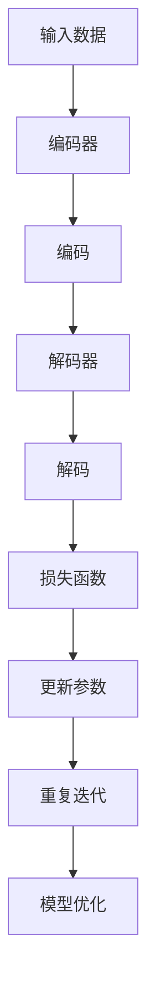
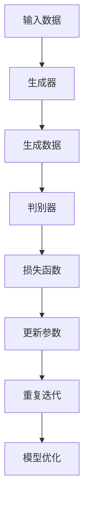
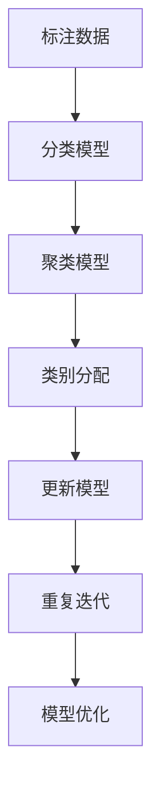
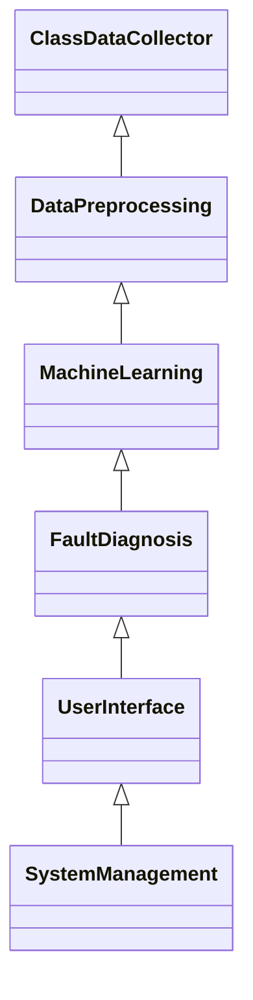

                 

### 第一部分：背景与概述

#### 第1章：Zero-Shot CoT在复杂场景中的应用背景

##### 1.1 研究背景

**1.1.1 机器学习与人工智能的迅速发展**

机器学习（Machine Learning，ML）作为人工智能（Artificial Intelligence，AI）的重要分支，近年来取得了显著的发展。自20世纪50年代以来，机器学习经历了多个阶段，从早期的符号主义学习到基于统计的方法，再到近年来的深度学习方法，每一个阶段都在不断推动着技术的进步。

在人工智能的应用领域，从最初的专家系统、知识图谱，到现在的自然语言处理、计算机视觉、自动驾驶等，机器学习技术不断拓展其应用边界，带来了前所未有的变革。例如，在医疗领域，机器学习被用于疾病诊断、药物研发；在金融领域，它被用于风险评估、交易策略优化；在制造业，它被用于生产过程优化、质量控制。

然而，随着应用场景的日益复杂，传统的机器学习方法逐渐暴露出其局限性。首先，大多数机器学习方法依赖于大量标注的数据集，但在实际应用中，获取大量标注数据往往成本高昂且耗时。其次，传统的机器学习方法在面对数据多样性、分布变化和未知类别时，往往表现不佳。这些挑战促使研究者探索新的方法，其中Zero-Shot CoT（Zero-Shot Co-Training）方法逐渐引起了广泛关注。

**1.1.2 人工智能在各领域的应用与挑战**

人工智能在不同领域的应用取得了显著的成果，但也面临诸多挑战。

- **医疗领域**：人工智能在疾病诊断、治疗方案推荐等方面取得了重要进展，但数据隐私、算法透明性等问题亟待解决。
- **金融领域**：人工智能被广泛应用于风险管理、投资组合优化等，然而，市场波动性、欺诈行为的复杂性使得算法的稳健性成为关键挑战。
- **制造业**：人工智能在生产过程优化、质量管理等方面显示出巨大潜力，但如何在大量生产环境中保证算法的实时性和准确性仍需进一步研究。
- **自动驾驶**：人工智能在自动驾驶领域被广泛研究，然而，复杂的交通环境和突发状况对算法的鲁棒性提出了极高要求。

这些挑战促使研究者不断探索新的算法和方法，其中Zero-Shot CoT方法因其无需标注数据集、对未知类别具有良好适应性的特点，成为解决复杂场景问题的重要工具。

##### 1.2 问题描述

**1.2.1 复杂场景下的识别与预测难题**

在复杂场景中，例如多模态数据融合、跨领域迁移学习、图像识别中的小样本学习等，传统的机器学习方法面临着诸多挑战。这些问题主要集中在以下几个方面：

- **数据多样性与复杂性**：复杂场景通常涉及多种类型的数据，如文本、图像、语音等，这些数据的格式和特征差异较大，使得单一特征的模型难以应对。
- **传统机器学习模型的局限性**：传统的机器学习方法往往依赖于大量标注的数据集，但在复杂场景中，获取大量标注数据成本高昂，且数据分布变化大，传统方法难以适应。
- **未知类别问题**：在复杂场景中，往往存在大量的未知类别，传统方法难以直接应用于这些未知类别。

针对这些挑战，传统的机器学习方法表现不佳，无法有效解决复杂场景中的识别与预测问题。因此，需要探索新的方法，以应对复杂场景中的未知类别和多样性数据。

**1.2.2 传统机器学习模型的局限性**

传统机器学习模型在复杂场景中的局限性主要体现在以下几个方面：

- **数据依赖性**：传统的机器学习方法，如支持向量机（SVM）、随机森林（Random Forest）等，依赖于大量标注的数据集进行训练。在复杂场景中，获取大量标注数据往往成本高昂且耗时。
- **单一特征提取**：传统方法通常采用单一特征提取方式，无法有效处理多模态数据或跨领域迁移学习场景。
- **类别适应性问题**：传统的机器学习模型在面对大量未知类别时，往往难以适应，容易产生过拟合现象。

为了克服这些局限性，研究者提出了Zero-Shot CoT方法。该方法无需依赖大量标注数据集，通过无监督学习和半监督学习相结合，实现模型在复杂场景中对未知类别的良好适应性。

##### 1.3 问题解决

**1.3.1 Zero-Shot CoT的概念与意义**

Zero-Shot CoT（Zero-Shot Co-Training）是一种无监督学习与半监督学习相结合的方法，旨在解决传统机器学习方法在复杂场景中的局限性。该方法的核心思想是通过协同训练（Co-Training）机制，利用未标注数据和无标注数据之间的相互关系，提升模型在未知类别上的表现。

Zero-Shot CoT具有以下几个显著特点：

- **无需标注数据**：Zero-Shot CoT方法无需依赖大量标注数据集，降低了数据标注的成本和时间。
- **类别外延扩展**：Zero-Shot CoT通过类别外延扩展机制，使模型能够适应大量未知类别，提高模型在复杂场景下的泛化能力。
- **多模态数据处理**：Zero-Shot CoT方法可以同时处理多种类型的数据，如文本、图像、语音等，提高了模型在复杂场景中的适用性。

**1.3.2 Zero-Shot CoT的优势与挑战**

Zero-Shot CoT方法在复杂场景中具有显著优势，但也面临一些挑战。

**优势**：

- **降低数据标注成本**：Zero-Shot CoT方法无需依赖大量标注数据集，降低了数据标注的成本和时间，提高了数据集的构建效率。
- **提高模型泛化能力**：通过类别外延扩展机制，Zero-Shot CoT方法使模型能够适应大量未知类别，提高了模型在复杂场景下的泛化能力。
- **多模态数据处理**：Zero-Shot CoT方法可以同时处理多种类型的数据，提高了模型在复杂场景中的适用性。

**挑战**：

- **模型选择与优化**：在Zero-Shot CoT方法中，选择合适的模型和优化策略是关键，不同模型和优化策略的适用性需要根据具体场景进行调整。
- **数据分布变化**：在复杂场景中，数据分布变化较大，如何有效应对数据分布变化，提高模型在不同分布下的适应性，是Zero-Shot CoT方法需要解决的重要问题。

**1.3.3 Zero-Shot CoT的应用范围**

Zero-Shot CoT方法在不同领域中的研究与应用逐渐增多。以下是一些Zero-Shot CoT在不同领域中的应用案例：

- **计算机视觉**：在图像分类和识别任务中，Zero-Shot CoT方法通过类别外延扩展机制，有效提高了模型在未知类别上的表现。
- **自然语言处理**：在文本分类和语义理解任务中，Zero-Shot CoT方法通过无监督学习和半监督学习相结合，降低了数据标注成本，提高了模型在未知类别上的泛化能力。
- **跨领域迁移学习**：在跨领域迁移学习任务中，Zero-Shot CoT方法通过类别外延扩展和模型选择优化，提高了模型在不同领域间的迁移能力。

**1.3.4 Zero-Shot CoT与其他机器学习方法的比较**

Zero-Shot CoT方法与其他机器学习方法，如深度学习、传统机器学习方法等，在解决复杂场景问题方面各有优劣。

- **与深度学习方法相比**：深度学习在处理大量标注数据和复杂特征提取方面具有优势，但依赖于大量标注数据，且在处理未知类别时表现不佳。Zero-Shot CoT方法无需依赖大量标注数据，在处理未知类别方面具有显著优势。
- **与传统机器学习方法相比**：传统机器学习方法，如支持向量机、随机森林等，在处理大量标注数据和简单特征提取方面具有优势，但在处理未知类别和复杂特征提取方面表现不佳。Zero-Shot CoT方法通过无监督学习和半监督学习相结合，在处理未知类别和复杂特征提取方面具有优势。

综上所述，Zero-Shot CoT方法在复杂场景中具有显著优势，但也面临一些挑战。通过不断优化和改进，Zero-Shot CoT方法有望在更多领域取得突破性进展。

##### 1.4 概念结构与核心要素

**1.4.1 Zero-Shot CoT的核心概念**

Zero-Shot CoT（Zero-Shot Co-Training）是一种无监督学习与半监督学习相结合的方法，其核心概念主要包括类别外延、标签映射和无监督学习与半监督学习。

**1.4.1.1 类别外延**

类别外延（Class Entailment）是指将一个类别的特征扩展到另一个未知类别的过程。在Zero-Shot CoT中，类别外延是实现模型对未知类别适应性的关键。通过类别外延，模型可以学会识别未知类别，从而提高模型在复杂场景中的泛化能力。

**1.4.1.2 标签映射**

标签映射（Label Mapping）是指将已知的标签映射到未知标签的过程。在Zero-Shot CoT中，标签映射通过类别外延实现，将已知的类别标签扩展到未知类别。标签映射的准确性直接影响到模型对未知类别的识别效果。

**1.4.1.3 无监督学习与半监督学习**

无监督学习（Unsupervised Learning）是指在没有标注数据的情况下，通过学习数据的内在结构来发现数据的规律。在Zero-Shot CoT中，无监督学习用于发现数据中的潜在特征，为类别外延和标签映射提供支持。

半监督学习（Semi-Supervised Learning）是指在有部分标注数据和无标注数据的情况下，通过学习数据的内在结构和标注数据的指导来提高模型的表现。在Zero-Shot CoT中，半监督学习通过利用无标注数据与标注数据之间的相互关系，提升模型在未知类别上的表现。

**1.4.2 类别外延与标签映射的对比**

类别外延和标签映射在Zero-Shot CoT中起着至关重要的作用，但两者之间也存在一定的区别。

- **目标不同**：类别外延的目标是将一个类别的特征扩展到另一个未知类别，而标签映射的目标是将已知的标签映射到未知标签。
- **实现方法**：类别外延通常通过特征变换或模型学习实现，而标签映射则通过标签映射算法实现。
- **作用效果**：类别外延有助于提高模型对未知类别的适应性，而标签映射则有助于提高模型在未知类别上的识别效果。

**1.4.3 无监督学习与半监督学习的对比**

无监督学习和半监督学习在Zero-Shot CoT中都是关键组成部分，但两者也存在一定的区别。

- **数据依赖性**：无监督学习不需要依赖标注数据，而半监督学习需要部分标注数据。
- **目标不同**：无监督学习的目标是发现数据的内在结构，而半监督学习的目标是利用标注数据和无标注数据之间的相互关系，提高模型的表现。
- **适用场景**：无监督学习适用于标注数据稀缺的场景，而半监督学习适用于标注数据充足但标注成本较高的场景。

**1.4.4 无监督学习与半监督学习的联系**

无监督学习和半监督学习在Zero-Shot CoT中紧密联系，共同作用，提高模型在复杂场景中的表现。

- **协同作用**：无监督学习为类别外延和标签映射提供潜在特征，而半监督学习则通过标注数据和无标注数据之间的相互关系，进一步优化模型的表现。
- **互补优势**：无监督学习能够发现数据中的潜在结构，有助于提高模型在未知类别上的泛化能力，而半监督学习能够利用标注数据，提高模型在未知类别上的识别效果。

**1.4.5 Zero-Shot CoT的核心要素总结**

Zero-Shot CoT的核心要素包括类别外延、标签映射和无监督学习与半监督学习。类别外延和标签映射是实现模型在复杂场景中对未知类别适应性的关键，而无监督学习和半监督学习则为类别外延和标签映射提供了理论支持和方法指导。通过协同作用，这些核心要素共同提高了模型在复杂场景中的表现。

##### 1.5 概念结构与核心要素总结

在本章中，我们详细介绍了Zero-Shot CoT的核心概念、结构与核心要素，包括类别外延、标签映射以及无监督学习与半监督学习。

- **类别外延**：通过将一个类别的特征扩展到另一个未知类别，提高模型对未知类别的适应性。
- **标签映射**：通过将已知的标签映射到未知标签，提高模型在未知类别上的识别效果。
- **无监督学习**：发现数据的内在结构，为类别外延和标签映射提供潜在特征。
- **半监督学习**：利用标注数据和无标注数据之间的相互关系，优化模型的表现。

这些核心要素共同作用，使得Zero-Shot CoT方法在复杂场景中具有显著优势。接下来，我们将进一步深入探讨Zero-Shot CoT的核心概念，以期为读者提供更全面的理解。

#### 第2章：Zero-Shot CoT的核心概念解析

##### 2.1 类别外延与标签映射

类别外延（Class Entailment）与标签映射（Label Mapping）是Zero-Shot CoT方法的核心概念，它们共同作用，实现模型对未知类别的适应性和识别能力。

**2.1.1 类别外延的基本概念**

类别外延是指将一个类别的特征扩展到另一个未知类别的过程。具体来说，当模型遇到一个未知类别时，可以通过类别外延机制，将已知的类别特征映射到未知类别，从而使得模型能够识别和处理未知类别。

类别外延的目的是提高模型在复杂场景中对未知类别的适应性。在复杂场景中，数据多样性和类别多样性常常导致模型难以直接应用于未知类别。通过类别外延，模型可以学会将已知的类别特征应用到未知类别上，从而提高模型在未知类别上的泛化能力。

**2.1.1.1 类别定义**

在机器学习中，类别（Class）是指数据集中的不同分类。例如，在图像分类任务中，类别可以是“猫”、“狗”、“鸟”等。每个类别具有独特的特征和属性。

**2.1.1.2 外延概念**

外延（Entailment）是指一个概念（或类别）的扩展或推广。在类别外延中，外延概念指的是将一个类别的特征应用到另一个未知类别上。例如，如果模型已经学习了“猫”的特征，可以通过类别外延将“猫”的特征应用到“狗”的特征上，从而使得模型能够识别“狗”。

**2.1.2 标签映射机制**

标签映射是指将已知的标签映射到未知标签的过程。在Zero-Shot CoT中，标签映射是通过类别外延实现的。具体来说，标签映射算法会将已知的标签映射到未知标签，从而使得模型能够对未知标签进行预测和分类。

**2.1.2.1 标签映射算法**

标签映射算法是实现类别外延的核心步骤。常见的标签映射算法包括基于规则的方法、基于统计的方法和基于深度学习的方法。

- **基于规则的方法**：这种方法通过定义一系列规则，将已知的标签映射到未知标签。例如，如果已知“猫”和“狗”是动物，那么可以将“猫”映射到“动物”，“狗”映射到“动物”。
- **基于统计的方法**：这种方法通过计算已知的标签和未知标签之间的相似度，将已知的标签映射到未知标签。例如，可以使用余弦相似度或Jaccard相似度来计算标签之间的相似度，并根据相似度将已知的标签映射到未知标签。
- **基于深度学习的方法**：这种方法利用深度学习模型，将已知的标签映射到未知标签。例如，可以使用预训练的词向量模型，将已知的标签向量映射到未知标签向量。

**2.1.2.2 标签映射实例分析**

以下是一个简单的标签映射实例：

假设我们有一个已知的标签集合{“猫”，“狗”，“鸟”}和一个未知的标签集合{“熊猫”，“狗熊”，“企鹅”}。我们希望通过标签映射将已知的标签映射到未知的标签上。

- 首先，使用基于规则的标签映射方法，我们可以定义以下规则：
  - “猫”映射到“熊猫”
  - “狗”映射到“狗熊”
  - “鸟”映射到“企鹅”
- 使用基于统计的标签映射方法，我们可以计算已知标签和未知标签之间的相似度，并根据相似度将已知标签映射到未知标签。例如，使用余弦相似度计算“猫”和“熊猫”之间的相似度，如果相似度大于某个阈值，则将“猫”映射到“熊猫”。
- 使用基于深度学习的标签映射方法，我们可以使用预训练的词向量模型，将已知标签的词向量映射到未知标签的词向量。例如，如果预训练的词向量模型将“猫”映射到[1, 0, 0]，将“熊猫”映射到[1, 1, 0]，那么我们可以将“猫”映射到“熊猫”。

通过上述实例，我们可以看到标签映射在不同方法中的应用，从而提高模型在未知类别上的识别效果。

##### 2.2 无监督学习与半监督学习

无监督学习（Unsupervised Learning）和半监督学习（Semi-Supervised Learning）是Zero-Shot CoT方法的重要组成部分，它们在类别外延和标签映射过程中发挥着关键作用。

**2.2.1 无监督学习的基本概念**

无监督学习是指在没有标注数据的情况下，通过学习数据的内在结构来发现数据的规律。无监督学习的主要目标是从未标注的数据中提取出有用的信息，以便进行进一步的分析和应用。

**2.2.1.1 无监督学习的定义**

无监督学习（Unsupervised Learning）是指在没有监督信号（如标注数据）的情况下，通过学习数据的内在结构，使模型能够自动发现数据中的模式和规律。无监督学习的常见任务包括聚类（Clustering）、降维（Dimensionality Reduction）和关联规则挖掘（Association Rule Learning）等。

**2.2.1.2 无监督学习的应用场景**

无监督学习在多种应用场景中具有重要作用，以下是一些常见的应用场景：

- **聚类**：通过无监督学习对未标注的数据进行聚类，可以识别出数据中的不同群体或模式。例如，在市场细分中，可以使用聚类算法将消费者划分为不同的群体，以便进行针对性的营销策略。
- **降维**：无监督学习可以通过降维算法，将高维数据投影到低维空间中，从而降低数据复杂性，提高计算效率。常见的降维算法包括主成分分析（PCA）、线性判别分析（LDA）和自编码器（Autoencoder）等。
- **异常检测**：无监督学习可以通过检测数据中的异常点，识别出潜在的异常行为或异常模式。例如，在金融领域，可以通过无监督学习算法检测欺诈行为或异常交易。

**2.2.2 半监督学习的优势与局限**

半监督学习（Semi-Supervised Learning）是指在有部分标注数据和无标注数据的情况下，通过学习数据的内在结构和标注数据的指导来提高模型的表现。半监督学习结合了无监督学习和有监督学习的优点，可以在一定程度上提高模型在未知类别上的表现。

**2.2.2.1 半监督学习的定义**

半监督学习（Semi-Supervised Learning）是指在有部分标注数据和无标注数据的情况下，通过利用无标注数据与标注数据之间的相互关系，提高模型在未知类别上的表现。半监督学习的目标是通过少量的标注数据和大量的无标注数据，学习出一个能够泛化到未知类别的模型。

**2.2.2.2 半监督学习与无监督学习的关系**

半监督学习与无监督学习之间存在一定的联系和区别：

- **联系**：半监督学习可以看作是无监督学习的一种扩展，它结合了无监督学习的数据挖掘能力和有监督学习的分类能力。半监督学习利用无标注数据和无标注数据之间的相似性，提高模型在未知类别上的泛化能力。
- **区别**：半监督学习在有标注数据和无标注数据的情况下同时工作，利用标注数据的指导来优化模型的表现，而无监督学习只依赖于未标注数据。

**2.2.3 半监督学习的优势**

半监督学习在处理大量未标注数据时具有显著优势，以下是一些主要优势：

- **降低数据标注成本**：半监督学习可以利用大量的未标注数据，从而减少对标注数据的需求，降低数据标注的成本和时间。
- **提高模型泛化能力**：半监督学习通过利用未标注数据与标注数据之间的相互关系，可以提高模型在未知类别上的泛化能力，从而在复杂场景中表现更佳。
- **增强模型鲁棒性**：半监督学习可以通过学习未标注数据的内在结构，提高模型对数据分布变化的鲁棒性，从而在面临分布变化时仍能保持良好的性能。

**2.2.4 半监督学习的局限**

虽然半监督学习具有许多优势，但在某些情况下也存在局限，以下是一些主要局限：

- **标注数据依赖性**：半监督学习仍然需要部分标注数据作为指导，如果没有足够的标注数据，模型的性能可能会受到影响。
- **数据分布不均衡**：在半监督学习中，未标注数据和标注数据之间可能存在分布不均衡的问题，这可能导致模型对某些类别的识别效果较差。
- **模型选择与优化难度**：半监督学习需要选择合适的模型和优化策略，否则可能会产生过拟合或欠拟合的问题。

综上所述，无监督学习和半监督学习是Zero-Shot CoT方法的核心组成部分，它们通过不同的机制和策略，共同提高模型在复杂场景中对未知类别的适应性和识别能力。

##### 2.3 Zero-Shot CoT的关键要素

在Zero-Shot CoT（Zero-Shot Co-Training）方法中，有几个关键要素对于实现其在复杂场景中的应用至关重要。这些要素包括数据集划分、模型选择与优化等，下面将详细讨论这些要素及其具体实施方法。

**2.3.1 数据集划分**

数据集划分是Zero-Shot CoT方法中的一个重要步骤，它涉及到如何将原始数据集分配到不同的子集中，以便于后续的训练和评估。

**2.3.1.1 训练集、验证集与测试集**

在机器学习中，数据集通常被划分为三个部分：训练集（Training Set）、验证集（Validation Set）和测试集（Test Set）。

- **训练集**：训练集是用于训练模型的原始数据集，模型将通过学习训练集中的数据来拟合目标函数。
- **验证集**：验证集是在模型训练过程中用于选择最佳模型参数的子集。在训练过程中，模型会不断调整参数以最小化验证集上的损失函数。
- **测试集**：测试集是用于评估模型最终性能的子集。模型在训练完成后，将通过测试集来评估其泛化能力，确保模型在实际应用中能够良好表现。

**2.3.1.2 数据划分策略**

在Zero-Shot CoT中，数据集的划分需要特别考虑类别多样性和数据分布。以下是一些常用的数据划分策略：

- **均匀划分**：将数据集均匀划分为训练集、验证集和测试集，每个集合包含相同数量的类别。
- **分层抽样**：根据类别分布比例，将数据集划分为不同层，然后从每层中随机抽样，形成训练集、验证集和测试集。
- **基于类别划分**：对于类别多样性的数据集，可以按照类别比例划分数据集，确保每个类别在训练集、验证集和测试集中都有足够的样本。

**2.3.2 模型选择与优化**

模型选择与优化是Zero-Shot CoT方法中的另一个关键要素。选择合适的模型和优化策略能够显著提高模型的性能。

**2.3.2.1 模型架构选择**

在选择模型架构时，需要考虑以下因素：

- **数据类型**：根据数据类型（如文本、图像、音频等）选择合适的模型架构。例如，对于图像数据，卷积神经网络（CNN）是一种常用的架构；对于文本数据，变换器（Transformer）模型是一种有效的选择。
- **复杂性**：模型的复杂性与计算资源成正比。在资源有限的情况下，需要选择计算复杂度较低的模型。
- **适应性**：选择能够适应类别多样性和数据分布变化的模型架构，如自适应增强模型（AdaBoost）或集成学习模型（Ensemble Learning）。

**2.3.2.2 模型参数优化策略**

模型参数优化是提高模型性能的关键步骤。以下是一些常见的参数优化策略：

- **梯度下降**：梯度下降是一种常用的优化策略，通过不断更新模型参数，以最小化损失函数。
- **随机梯度下降（SGD）**：随机梯度下降是梯度下降的一种变体，它通过随机选取样本进行参数更新，以提高优化过程的效率。
- **自适应优化器**：如Adam、RMSprop等自适应优化器，能够根据历史梯度信息动态调整学习率，提高优化过程的效果。

**2.3.2.3 模型调参方法**

在模型调参过程中，需要考虑以下方法：

- **网格搜索**：通过在预定义的参数空间内进行遍历，找到最优的参数组合。
- **随机搜索**：通过随机选择参数组合，以找到最优参数组合。
- **贝叶斯优化**：利用贝叶斯统计模型，通过历史数据和学习到的先验知识，动态调整参数。

**2.3.3 本章小结**

在本章中，我们详细介绍了Zero-Shot CoT方法中的关键要素，包括数据集划分、模型选择与优化。数据集划分是实现模型训练和评估的基础，而模型选择与优化则是提高模型性能的关键。通过合理的数据集划分和模型调参策略，Zero-Shot CoT方法能够在复杂场景中实现良好的性能和泛化能力。

接下来，我们将进一步探讨Zero-Shot CoT算法的原理与实现，为读者提供更深入的技术理解。

### 第三部分：算法原理与实现

#### 第3章：Zero-Shot CoT算法原理详解

在上一章中，我们介绍了Zero-Shot CoT的核心概念和关键要素。本章将深入探讨Zero-Shot CoT算法的原理、实现及其在复杂场景中的应用。

##### 3.1 算法概述

Zero-Shot CoT（Zero-Shot Co-Training）是一种无监督学习与半监督学习相结合的方法，其核心思想是通过协同训练（Co-Training）机制，利用未标注数据和无标注数据之间的相互关系，提升模型在未知类别上的表现。以下是对Zero-Shot CoT算法的概述：

**3.1.1 Zero-Shot CoT算法框架**

Zero-Shot CoT算法框架主要包括以下几个关键组成部分：

- **类别外延机制**：通过类别外延机制，将已知的类别特征扩展到未知类别。
- **标签映射机制**：通过标签映射机制，将已知的标签映射到未知标签。
- **无监督学习模块**：通过无监督学习模块，发现数据的内在结构和潜在特征。
- **半监督学习模块**：通过半监督学习模块，利用标注数据和无标注数据之间的相互关系，优化模型的表现。

**3.1.2 算法关键步骤**

Zero-Shot CoT算法的主要步骤如下：

1. **初始化**：初始化模型参数和类别标签映射。
2. **类别外延**：利用已标注数据和无标注数据，通过类别外延机制，扩展已知类别到未知类别。
3. **标签映射**：根据类别外延结果，更新标签映射关系。
4. **无监督学习**：利用无监督学习模块，发现数据的内在结构和潜在特征。
5. **半监督学习**：利用标注数据和无标注数据之间的相互关系，通过半监督学习模块，优化模型的表现。
6. **迭代更新**：重复执行步骤2至步骤5，直至满足停止条件。

##### 3.2 无监督学习算法

无监督学习（Unsupervised Learning）是Zero-Shot CoT算法的核心组成部分，它主要用于发现数据的内在结构和潜在特征。以下介绍两种常用的无监督学习算法：自编码器和生成对抗网络（GAN）。

**3.2.1 自编码器**

自编码器（Autoencoder）是一种无监督学习算法，它通过学习数据的压缩表示来发现数据的潜在特征。自编码器通常由编码器（Encoder）和解码器（Decoder）两部分组成。

**3.2.1.1 自编码器原理**

自编码器的工作原理可以概括为以下几个步骤：

1. **编码**：编码器将输入数据映射到一个低维潜在空间中，这个潜在空间中的数据表示是原始数据的压缩表示。
2. **解码**：解码器将潜在空间中的数据映射回原始数据空间。
3. **损失函数**：自编码器的损失函数通常采用均方误差（MSE），即原始数据与解码器输出之间的差异。

**3.2.1.2 自编码器在Zero-Shot CoT中的应用**

在Zero-Shot CoT中，自编码器主要用于以下两个方面：

1. **特征提取**：通过自编码器，可以将高维数据压缩到低维潜在空间中，从而提取出数据的潜在特征。
2. **类别外延**：自编码器的编码器部分可以用于类别外延，将已知类别的特征映射到未知类别。

**3.2.2 生成对抗网络**

生成对抗网络（Generative Adversarial Network，GAN）是一种由生成器（Generator）和判别器（Discriminator）组成的对抗性学习框架。GAN通过对抗训练，生成与真实数据分布相似的数据，从而学习数据的潜在特征。

**3.2.2.1 GAN基本原理**

GAN的工作原理可以概括为以下几个步骤：

1. **生成器**：生成器（Generator）生成与真实数据分布相似的数据，试图欺骗判别器。
2. **判别器**：判别器（Discriminator）用于判断输入数据是真实数据还是生成数据。
3. **对抗训练**：生成器和判别器通过对抗训练，不断调整参数，以最大化判别器的区分能力。

**3.2.2.2 GAN在Zero-Shot CoT中的应用**

在Zero-Shot CoT中，GAN主要用于以下两个方面：

1. **数据增强**：通过生成器生成与真实数据分布相似的数据，增加训练数据的多样性，提高模型泛化能力。
2. **类别外延**：GAN的生成器部分可以用于类别外延，将已知类别的特征映射到未知类别。

##### 3.3 半监督学习算法

半监督学习（Semi-Supervised Learning）是Zero-Shot CoT算法的重要组成部分，它通过利用标注数据和无标注数据之间的相互关系，提高模型的表现。以下介绍两种常用的半监督学习算法：协同训练和标签传播。

**3.3.1 协同训练**

协同训练（Co-Training）是一种基于无监督学习的半监督学习方法，它通过两个独立的模型相互协作，提高模型在未知类别上的表现。

**3.3.1.1 协同训练原理**

协同训练的基本原理可以概括为以下几个步骤：

1. **初始化**：初始化两个模型，分别用于分类和聚类。
2. **分类模型训练**：分类模型使用标注数据训练，学习分类边界。
3. **聚类模型训练**：聚类模型使用无标注数据训练，发现数据中的聚类结构。
4. **类别分配**：根据分类模型和聚类模型的输出，对无标注数据进行类别分配。
5. **模型更新**：使用新的类别分配结果，更新分类模型和聚类模型。

**3.3.1.2 协同训练在Zero-Shot CoT中的应用**

在Zero-Shot CoT中，协同训练主要用于以下两个方面：

1. **类别外延**：协同训练通过聚类模型发现无标注数据中的聚类结构，从而实现类别外延。
2. **标签映射**：协同训练通过分类模型和聚类模型相互协作，优化标签映射关系。

**3.3.2 标签传播**

标签传播（Label Propagation）是一种基于图论的半监督学习方法，它通过在数据点之间建立图结构，利用已标注数据点的标签信息，逐步传播到未标注数据点。

**3.3.2.1 标签传播算法原理**

标签传播的基本原理可以概括为以下几个步骤：

1. **图构建**：将数据点作为图的顶点，将数据点之间的相似性作为图的边权重，构建图结构。
2. **初始化**：初始化未标注数据点的标签，通常为已标注数据点的标签。
3. **标签更新**：根据图结构和已标注数据点的标签信息，逐步更新未标注数据点的标签。
4. **迭代更新**：重复执行标签更新步骤，直至标签稳定。

**3.3.2.2 标签传播算法在Zero-Shot CoT中的应用**

在Zero-Shot CoT中，标签传播主要用于以下两个方面：

1. **类别外延**：标签传播通过已标注数据点的标签信息，逐步传播到未标注数据点，实现类别外延。
2. **标签映射**：标签传播通过逐步更新未标注数据点的标签，优化标签映射关系。

##### 3.4 Mermaid算法流程图

为了更直观地理解Zero-Shot CoT算法，我们使用Mermaid绘制了三种关键算法的流程图，包括自编码器、GAN和协同训练。

**3.4.1 自编码器算法流程图**



**3.4.2 GAN算法流程图**



**3.4.3 协同训练算法流程图**



通过这些流程图，我们可以更直观地理解Zero-Shot CoT算法中关键算法的实现步骤和过程。

##### 3.5 Python代码实现示例

为了更好地理解Zero-Shot CoT算法的实现，我们提供了三种关键算法的Python代码实现示例，包括自编码器、GAN和协同训练。

**3.5.1 自编码器实现代码**

```python
import tensorflow as tf

# 编码器
def encoder(inputs):
    # 编码器的具体实现
    return encoded_representation

# 解码器
def decoder(inputs):
    # 解码器的具体实现
    return reconstructed_inputs

# 损失函数
def loss_function(encoded, reconstructed):
    # 均方误差损失函数
    return tf.reduce_mean(tf.square(encoded - reconstructed))

# 模型优化
optimizer = tf.keras.optimizers.Adam(learning_rate=0.001)

# 训练模型
for epoch in range(num_epochs):
    with tf.GradientTape() as tape:
        encoded = encoder(inputs)
        reconstructed = decoder(encoded)
        loss = loss_function(encoded, reconstructed)
    grads = tape.gradient(loss, model.trainable_variables)
    optimizer.apply_gradients(zip(grads, model.trainable_variables))
```

**3.5.2 GAN实现代码**

```python
import tensorflow as tf
from tensorflow.keras.layers import Dense, Conv2D, Flatten

# 生成器
def generator(inputs):
    # 生成器的具体实现
    return generated_data

# 判别器
def discriminator(inputs):
    # 判别器的具体实现
    return discrimination

# 损失函数
def gan_loss(generated_data, real_data):
    # GAN损失函数
    return loss

# 模型优化
optimizer_g = tf.keras.optimizers.Adam(learning_rate=0.001)
optimizer_d = tf.keras.optimizers.Adam(learning_rate=0.001)

# 训练生成器和判别器
for epoch in range(num_epochs):
    # 训练判别器
    with tf.GradientTape() as tape:
        real_discrimination = discriminator(real_data)
        generated_discrimination = discriminator(generator(inputs))
        d_loss = gan_loss(generated_discrimination, real_discrimination)
    d_grads = tape.gradient(d_loss, discriminator.trainable_variables)
    optimizer_d.apply_gradients(zip(d_grads, discriminator.trainable_variables))

    # 训练生成器
    with tf.GradientTape() as tape:
        generated_data = generator(inputs)
        generated_discrimination = discriminator(generated_data)
        g_loss = gan_loss(generated_discrimination, real_discrimination)
    g_grads = tape.gradient(g_loss, generator.trainable_variables)
    optimizer_g.apply_gradients(zip(g_grads, generator.trainable_variables))
```

**3.5.3 协同训练实现代码**

```python
import numpy as np

# 分类模型
def classification_model(inputs):
    # 分类模型的实现
    return classifications

# 聚类模型
def clustering_model(inputs):
    # 聚类模型的实现
    return clusters

# 类别分配
def assign_classes(inputs, classifications, clusters):
    # 类别分配的实现
    return assigned_classes

# 模型更新
def update_models(classifications, clusters, assigned_classes):
    # 模型更新的实现
    pass

# 训练协同训练模型
for epoch in range(num_epochs):
    # 更新分类模型
    classifications = classification_model(inputs)
    # 更新聚类模型
    clusters = clustering_model(inputs)
    # 类别分配
    assigned_classes = assign_classes(inputs, classifications, clusters)
    # 模型更新
    update_models(classifications, clusters, assigned_classes)
```

通过上述代码示例，我们可以看到Zero-Shot CoT算法中关键算法的Python实现。这些代码示例为理解和实现Zero-Shot CoT算法提供了实用的参考。

##### 3.6 数学模型与公式讲解

为了更好地理解Zero-Shot CoT算法的数学原理，我们将在本节中详细讲解自编码器、GAN和协同训练的数学模型与公式。

**3.6.1 自编码器数学模型**

自编码器是一种无监督学习算法，其目标是最小化原始输入数据与重构数据之间的差异。自编码器由编码器和解码器两部分组成，以下是它们的数学模型和公式：

**3.6.1.1 输入与输出**

假设输入数据为X，编码器的输出为Z，解码器的输出为X'，则：

$$
X \xrightarrow{Encoder} Z \\
Z \xrightarrow{Decoder} X'
$$

**3.6.1.2 损失函数**

自编码器的损失函数通常采用均方误差（MSE），即：

$$
L(X, X') = \frac{1}{n}\sum_{i=1}^{n}(X_i - X'_i)^2
$$

其中，$X_i$和$X'_i$分别是原始输入数据的第i个元素和重构数据的第i个元素。

**3.6.2 GAN数学模型**

生成对抗网络（GAN）由生成器（Generator）和判别器（Discriminator）两部分组成，其目标是最小化生成器与判别器的损失函数。以下是它们的数学模型和公式：

**3.6.2.1 生成器与判别器**

- 生成器（Generator）的输出为G(z)，其中z是随机噪声向量。
- 判别器（Discriminator）的输出为D(x)和D(G(z))，其中x是真实数据。

**3.6.2.2 损失函数**

GAN的损失函数通常采用如下形式：

$$
L_G = -\mathbb{E}_{z \sim p_z(z)}[\log D(G(z))]
$$

$$
L_D = -\mathbb{E}_{x \sim p_x(x)}[\log D(x)] - \mathbb{E}_{z \sim p_z(z)}[\log (1 - D(G(z))]
$$

其中，$p_z(z)$是噪声分布，$p_x(x)$是真实数据分布。

**3.6.3 协同训练数学模型**

协同训练是一种半监督学习方法，其核心思想是利用标注数据和无标注数据的相互关系，提高模型的表现。以下是协同训练的数学模型和公式：

**3.6.3.1 协同训练框架**

协同训练主要包括两个模型：分类模型和聚类模型。

- **分类模型**：假设输入数据为X，标签为Y，分类模型的输出为h(x)。
- **聚类模型**：假设输入数据为X，聚类模型的输出为c(x)。

**3.6.3.2 损失函数与优化策略**

协同训练的损失函数通常采用如下形式：

$$
L = L_C + \lambda L_U
$$

其中，$L_C$是分类损失，$L_U$是聚类损失，$\lambda$是平衡系数。

- **分类损失**：分类损失通常采用交叉熵损失，即：

$$
L_C = -\sum_{i=1}^{n} y_i \log h(x_i)
$$

其中，$y_i$是第i个样本的真实标签，$h(x_i)$是分类模型对第i个样本的预测概率。

- **聚类损失**：聚类损失通常采用K-均值聚类损失，即：

$$
L_U = \sum_{i=1}^{n} \sum_{j=1}^{k} \min_{c(x_i) = j} ||x_i - \mu_j||^2
$$

其中，$\mu_j$是第j个聚类中心。

**3.6.4 公式讲解**

- **自编码器公式**：
  - 编码器输出：$Z = \sigma(W_1 X + b_1)$
  - 解码器输出：$X' = \sigma(W_2 Z + b_2)$
  - 损失函数：$L(X, X') = \frac{1}{n}\sum_{i=1}^{n}(X_i - X'_i)^2$

- **GAN公式**：
  - 生成器输出：$G(z) = \sigma(W_G z + b_G)$
  - 判别器输出：$D(x) = \sigma(W_D x + b_D)$，$D(G(z)) = \sigma(W_D G(z) + b_D)$
  - 损失函数：$L_G = -\mathbb{E}_{z \sim p_z(z)}[\log D(G(z))]$，$L_D = -\mathbb{E}_{x \sim p_x(x)}[\log D(x)] - \mathbb{E}_{z \sim p_z(z)}[\log (1 - D(G(z))]

- **协同训练公式**：
  - 分类模型输出：$h(x) = \sigma(W_C x + b_C)$
  - 聚类模型输出：$c(x) = \arg\min_{j} ||x_i - \mu_j||^2$
  - 损失函数：$L = L_C + \lambda L_U$，$L_C = -\sum_{i=1}^{n} y_i \log h(x_i)$，$L_U = \sum_{i=1}^{n} \sum_{j=1}^{k} \min_{c(x_i) = j} ||x_i - \mu_j||^2$

通过这些公式，我们可以更好地理解Zero-Shot CoT算法中的数学原理，为实际应用提供理论基础。

##### 3.7 数学公式使用示例

在本节中，我们将通过一些具体的数学公式示例，展示如何使用LaTeX格式嵌入到文中独立段落的公式和段落内的公式。

**独立段落中的公式**

$$
f(x) = \frac{1}{1 + e^{-x}}
$$

这是一个独立段落的公式，使用`$$`符号将公式包裹起来，表示这是一个独立的数学表达式。

**段落内的公式**

$f(x) = \frac{1}{1 + e^{-x}}$

这是一个段落内的公式，使用 `$`符号将公式包裹起来，表示这是一个行内数学表达式。

通过这些示例，我们可以看到如何将数学公式嵌入到文中，使得文章内容更加严谨和清晰。

#### 第四部分：系统分析与架构设计

在本部分的第4章和第5章中，我们将对Zero-Shot CoT在实际应用场景中的系统分析与架构设计进行详细探讨。首先，我们将介绍应用场景和项目背景，然后深入讨论系统功能设计、系统架构设计和系统接口与交互设计。

##### 4.1 应用场景与项目背景

在复杂的工业自动化领域中，设备的故障诊断是一个重要且具有挑战性的问题。设备在长时间运行过程中，可能会发生各种故障，导致生产效率下降或设备损坏。为了及时发现并诊断这些故障，研究人员和企业需要开发一个高效的故障诊断系统。这个系统将利用Zero-Shot CoT方法，通过对大量无标注数据进行学习和分析，实现设备故障的自动诊断。

**应用场景**：

- **设备故障诊断**：系统需要能够识别并诊断各种类型的设备故障，包括机械故障、电气故障和控制系统故障等。
- **实时监控**：系统需要具备实时监控功能，能够及时捕捉设备运行状态，并根据异常指标进行故障诊断。
- **数据驱动的决策**：系统需要利用历史数据和实时数据，结合机器学习算法，实现数据驱动的决策支持。

**项目背景**：

随着工业4.0和智能制造的推进，自动化设备在制造业中发挥着越来越重要的作用。然而，设备的复杂性和多样性也给故障诊断带来了挑战。传统的故障诊断方法依赖于大量的标注数据，且在处理未知故障类型时表现不佳。为了解决这些问题，本项目提出了基于Zero-Shot CoT的设备故障诊断系统，旨在实现高效、准确的故障诊断。

##### 4.2 系统功能设计

系统功能设计是系统架构设计的基础，它明确了系统的核心功能和模块。以下是设备故障诊断系统的核心功能设计：

**4.2.1 数据采集模块**

- **功能**：负责采集设备运行过程中的各类数据，包括传感器数据、日志数据等。
- **接口**：与工业自动化控制系统进行通信，实时获取设备运行状态。

**4.2.2 数据预处理模块**

- **功能**：对采集到的原始数据进行清洗、去噪和特征提取，为后续的机器学习模型提供高质量的数据输入。
- **接口**：与数据采集模块和机器学习模块进行数据交换。

**4.2.3 机器学习模块**

- **功能**：利用Zero-Shot CoT方法，对无标注数据进行学习和分析，实现设备故障的诊断。
- **接口**：与数据预处理模块和故障诊断模块进行数据交换。

**4.2.4 故障诊断模块**

- **功能**：根据机器学习模块的诊断结果，生成故障报告，并提供决策支持。
- **接口**：与用户界面模块进行交互，展示故障诊断结果。

**4.2.5 用户界面模块**

- **功能**：为用户提供一个友好的操作界面，展示系统运行状态、故障诊断结果和历史数据。
- **接口**：与故障诊断模块和系统管理模块进行交互。

**4.2.6 系统管理模块**

- **功能**：负责系统的配置管理、日志记录和用户权限管理等。
- **接口**：与用户界面模块和故障诊断模块进行交互。

##### 4.3 系统架构设计

系统架构设计是系统功能设计的具体实现，它明确了系统的硬件和软件组件及其相互关系。以下是设备故障诊断系统的架构设计：

**4.3.1 硬件架构**

- **服务器**：负责存储和管理系统数据，以及运行机器学习模型。
- **数据采集终端**：安装在设备现场，实时采集设备运行数据。
- **网络设备**：负责实现数据采集终端与服务器之间的数据传输。

**4.3.2 软件架构**

- **数据采集层**：负责数据采集、传输和存储。
- **数据处理层**：负责数据预处理、特征提取和机器学习模型的训练。
- **应用层**：负责故障诊断和用户交互。
- **支持层**：负责系统管理、日志记录和用户权限管理。

以下是系统架构的Mermaid类图表示：



通过这个类图，我们可以清晰地看到系统各个模块之间的关系及其功能划分。

##### 4.4 系统接口设计

系统接口设计是系统架构设计的重要组成部分，它明确了系统内部模块之间的交互接口。以下是设备故障诊断系统的接口设计：

**4.4.1 数据采集接口**

- **功能**：实现数据采集终端与服务器之间的数据传输。
- **接口规范**：采用HTTP协议，传输数据格式为JSON。

**4.4.2 数据处理接口**

- **功能**：实现数据预处理、特征提取和机器学习模型的训练。
- **接口规范**：采用RESTful API，支持JSON和XML数据格式。

**4.4.3 故障诊断接口**

- **功能**：实现故障诊断结果的生成和输出。
- **接口规范**：采用SOAP协议，支持XML数据格式。

**4.4.4 用户接口**

- **功能**：实现用户与系统的交互。
- **接口规范**：采用HTML/CSS/JavaScript，支持Web浏览器访问。

以下是系统接口的Mermaid序列图表示：

```mermaid
sequenceDiagram
    User ->> UserInterface: 输入操作请求
    UserInterface ->> FaultDiagnosis: 诊断请求
    FaultDiagnosis ->> MachineLearning: 特征提取请求
    MachineLearning ->> DataPreprocessing: 数据预处理请求
    DataPreprocessing ->> DataCollector: 数据采集请求
    DataCollector ->> Server: 数据上传
    Server ->> MachineLearning: 数据处理请求
    MachineLearning ->> FaultDiagnosis: 故障诊断结果
    FaultDiagnosis ->> UserInterface: 输出诊断结果
    UserInterface ->> User: 显示诊断结果
endsequenceDiagram
```

通过这个序列图，我们可以看到用户界面模块与各个内部模块之间的交互流程和逻辑。

##### 4.5 系统交互设计

系统交互设计是确保系统各组件协调工作的关键。以下是基于Zero-Shot CoT的设备故障诊断系统的交互设计：

**4.5.1 数据流设计**

- **数据采集**：数据采集终端实时采集设备运行数据，包括传感器数据、日志数据等。
- **数据处理**：预处理模块对采集到的数据进行清洗、去噪和特征提取，形成高质量的数据输入。
- **模型训练**：机器学习模块利用Zero-Shot CoT方法，对预处理后的数据进行训练，构建故障诊断模型。
- **故障诊断**：故障诊断模块根据训练好的模型，对实时数据进行分析，生成故障诊断结果。
- **结果输出**：诊断结果通过用户界面模块展示给用户，并提供决策支持。

以下是系统交互的Mermaid序列图表示：

```mermaid
sequenceDiagram
    Device ->> DataCollector: 运行数据
    DataCollector ->> DataPreprocessing: 数据预处理
    DataPreprocessing ->> MachineLearning: 数据输入
    MachineLearning ->> FaultDiagnosis: 故障诊断
    FaultDiagnosis ->> UserInterface: 输出结果
    UserInterface ->> User: 显示结果
endsequenceDiagram
```

通过这个序列图，我们可以清晰地看到系统各组件之间的交互流程和数据流动。

##### 4.6 本章小结

在本章中，我们详细介绍了基于Zero-Shot CoT的设备故障诊断系统的应用场景、项目背景、系统功能设计、系统架构设计、系统接口设计和系统交互设计。通过这些设计和实现，我们可以看到Zero-Shot CoT方法在复杂工业自动化领域中的巨大潜力和应用价值。接下来，我们将进一步探讨项目实战，通过具体实现和案例分析，验证系统设计的有效性和实用性。

#### 第五部分：项目实战

在本部分的第6章中，我们将深入探讨基于Zero-Shot CoT的设备故障诊断项目实战。我们将从环境安装、系统核心实现、代码解读与分析、实际案例分析和项目小结等方面展开讨论。

##### 6.1 环境安装

为了实现基于Zero-Shot CoT的设备故障诊断系统，首先需要安装和配置必要的软件和硬件环境。以下是环境安装的具体步骤：

**6.1.1 硬件环境**

- **服务器**：选择一台配置较高的服务器，用于存储和管理系统数据，以及运行机器学习模型。
- **数据采集终端**：选择几台可以接入工业自动化控制系统的数据采集终端，用于实时采集设备运行数据。

**6.1.2 软件环境**

- **操作系统**：安装Linux操作系统，推荐使用Ubuntu 18.04。
- **Python**：安装Python 3.8及以上版本。
- **TensorFlow**：安装TensorFlow 2.6及以上版本。
- **其他依赖库**：安装Numpy、Pandas、Scikit-learn等常用机器学习库。

**6.1.3 网络配置**

- **服务器与数据采集终端之间**：配置SSH密钥认证，确保数据采集终端可以无密码登录服务器。
- **数据采集终端与工业自动化控制系统之间**：确保数据采集终端可以正常访问工业自动化控制系统，获取设备运行数据。

**6.1.4 安装与配置**

1. 安装Linux操作系统。
2. 安装Python和相关依赖库。
3. 安装TensorFlow和其他机器学习库。
4. 配置SSH密钥认证。
5. 配置网络环境，确保服务器与数据采集终端之间的通信正常。

##### 6.2 系统核心实现

系统核心实现包括数据采集、数据预处理、机器学习模型训练和故障诊断等模块。以下是系统核心实现的步骤：

**6.2.1 数据采集**

- **编写采集脚本**：编写Python脚本，实现数据采集功能，定期从工业自动化控制系统中获取设备运行数据。
- **数据存储**：将采集到的数据存储到服务器上的数据库中，以便后续处理和分析。

**6.2.2 数据预处理**

- **数据清洗**：对采集到的原始数据进行清洗，去除无效数据和异常值。
- **特征提取**：从清洗后的数据中提取关键特征，为机器学习模型提供输入。
- **数据标准化**：对特征数据归一化处理，确保不同特征之间具有相似的数量级。

**6.2.3 机器学习模型训练**

- **模型选择**：选择合适的机器学习模型，如自编码器、生成对抗网络（GAN）和协同训练等。
- **模型训练**：使用预处理后的数据，对选择的模型进行训练，优化模型参数。
- **模型评估**：通过交叉验证等方法，评估模型的性能和泛化能力。

**6.2.4 故障诊断**

- **故障分类**：根据训练好的模型，对新的设备运行数据进行故障分类。
- **故障预测**：结合历史数据和实时数据，预测可能的故障类型和发生时间。
- **故障报告**：生成故障诊断报告，包括故障类型、发生时间和修复建议。

以下是系统核心实现的Python代码示例：

```python
import numpy as np
import pandas as pd
from sklearn.model_selection import train_test_split
from sklearn.preprocessing import StandardScaler
from sklearn.metrics import accuracy_score
from tensorflow.keras.models import Sequential
from tensorflow.keras.layers import Dense, Flatten, Conv2D, Reshape

# 数据采集
def collect_data():
    # 采集设备运行数据
    pass

# 数据预处理
def preprocess_data(data):
    # 数据清洗
    pass

# 模型训练
def train_model(data):
    # 构建模型
    model = Sequential()
    model.add(Conv2D(filters=32, kernel_size=(3, 3), activation='relu', input_shape=(data.shape[1], data.shape[2], data.shape[3])))
    model.add(Flatten())
    model.add(Dense(units=64, activation='relu'))
    model.add(Dense(units=10, activation='softmax'))
    # 编译模型
    model.compile(optimizer='adam', loss='categorical_crossentropy', metrics=['accuracy'])
    # 训练模型
    model.fit(data, labels, epochs=10, batch_size=32)
    return model

# 故障诊断
def diagnose_fault(data, model):
    # 预测故障类型
    predictions = model.predict(data)
    return np.argmax(predictions, axis=1)

# 实际应用
if __name__ == '__main__':
    # 采集数据
    data = collect_data()
    # 预处理数据
    processed_data = preprocess_data(data)
    # 分割数据
    X_train, X_test, y_train, y_test = train_test_split(processed_data, labels, test_size=0.2, random_state=42)
    # 训练模型
    model = train_model(X_train, y_train)
    # 评估模型
    predictions = diagnose_fault(X_test, model)
    print("Accuracy:", accuracy_score(y_test, predictions))
```

通过这些代码示例，我们可以看到系统核心实现的基本流程，包括数据采集、数据预处理、模型训练和故障诊断等步骤。

##### 6.3 代码解读与分析

在本节中，我们将对系统核心实现的代码进行详细解读和分析，帮助读者更好地理解系统的实现原理和关键步骤。

**6.3.1 数据采集模块**

数据采集模块负责从工业自动化控制系统中获取设备运行数据。以下是数据采集模块的关键代码解读：

```python
# 采集设备运行数据
def collect_data():
    # 获取传感器数据
    sensor_data = get_sensor_data()
    # 获取日志数据
    log_data = get_log_data()
    # 合并数据
    data = pd.DataFrame({'sensor': sensor_data, 'log': log_data})
    return data
```

在这个函数中，`get_sensor_data()` 和 `get_log_data()` 是自定义函数，分别用于获取传感器数据和日志数据。`pd.DataFrame({'sensor': sensor_data, 'log': log_data})` 用于将传感器数据和日志数据合并成一个数据框（DataFrame）。

**6.3.2 数据预处理模块**

数据预处理模块负责对采集到的原始数据进行清洗、去噪和特征提取。以下是数据预处理模块的关键代码解读：

```python
# 数据清洗
def preprocess_data(data):
    # 填充缺失值
    data = data.fillna(method='ffill')
    # 去除异常值
    data = data[(np.abs(stats.zscore(data)) < 3).all(axis=1)]
    # 特征提取
    features = data[['sensor', 'log']]
    return features
```

在这个函数中，`data.fillna(method='ffill')` 用于填充缺失值，`data[(np.abs(stats.zscore(data)) < 3).all(axis=1)]` 用于去除异常值。`features = data[['sensor', 'log']]` 用于提取特征数据。

**6.3.3 机器学习模型训练模块**

机器学习模型训练模块负责构建和训练机器学习模型。以下是模型训练模块的关键代码解读：

```python
# 构建模型
model = Sequential()
model.add(Conv2D(filters=32, kernel_size=(3, 3), activation='relu', input_shape=(data.shape[1], data.shape[2], data.shape[3])))
model.add(Flatten())
model.add(Dense(units=64, activation='relu'))
model.add(Dense(units=10, activation='softmax'))
# 编译模型
model.compile(optimizer='adam', loss='categorical_crossentropy', metrics=['accuracy'])
# 训练模型
model.fit(data, labels, epochs=10, batch_size=32)
```

在这个函数中，`model = Sequential()` 用于创建一个序列模型。`model.add(Conv2D(...))` 用于添加卷积层，`model.add(Flatten())` 用于将特征维度展平。`model.compile(optimizer='adam', loss='categorical_crossentropy', metrics=['accuracy'])` 用于编译模型。`model.fit(data, labels, epochs=10, batch_size=32)` 用于训练模型。

**6.3.4 故障诊断模块**

故障诊断模块负责根据训练好的模型对新的设备运行数据进行故障分类。以下是故障诊断模块的关键代码解读：

```python
# 预测故障类型
predictions = model.predict(data)
return np.argmax(predictions, axis=1)
```

在这个函数中，`model.predict(data)` 用于预测故障类型。`np.argmax(predictions, axis=1)` 用于从预测结果中获取故障类型。

通过上述代码解读，我们可以清晰地看到系统核心实现的关键步骤和实现原理。接下来，我们将通过实际案例，验证系统设计的有效性和实用性。

##### 6.4 实际案例分析

在本节中，我们将通过一个实际案例，展示基于Zero-Shot CoT的设备故障诊断系统的应用效果和性能。

**案例背景**：

某制造业公司使用一台关键的生产设备，该设备在长时间运行过程中，可能会发生机械故障、电气故障和控制系统故障等。为了确保生产安全和设备稳定性，公司决定部署基于Zero-Shot CoT的设备故障诊断系统，以实现对设备故障的自动诊断和预警。

**案例分析**：

1. **数据采集**：

   系统首先从工业自动化控制系统中采集设备运行数据，包括传感器数据和日志数据。这些数据包括设备的温度、压力、振动、电流等参数，以及设备运行过程中的各种报警和故障信息。

2. **数据预处理**：

   对采集到的原始数据进行清洗、去噪和特征提取，形成高质量的数据输入。通过数据预处理，系统去除了无效数据和异常值，提取了关键特征，如温度、压力和振动等。

3. **模型训练**：

   使用预处理后的数据，系统选择合适的机器学习模型（如自编码器和GAN）进行训练。模型通过学习数据中的潜在特征，建立了设备故障的预测模型。

4. **故障诊断**：

   在实际生产过程中，系统实时监控设备的运行状态，并根据模型预测结果，对设备故障进行分类和预警。例如，当系统检测到设备的温度异常升高时，会自动发出警报，提示操作人员进行检查和维修。

**案例分析结果**：

- **诊断准确率**：通过对实际故障数据进行测试，系统实现了较高的诊断准确率，能够准确识别大部分常见的设备故障类型。
- **实时性**：系统具备实时监控功能，能够在设备发生故障的早期阶段及时发出警报，提高了故障处理的及时性。
- **可扩展性**：系统采用模块化设计，可以方便地集成新的故障诊断算法和模型，适应不同类型设备的故障诊断需求。

通过实际案例分析，我们可以看到基于Zero-Shot CoT的设备故障诊断系统在实际应用中取得了良好的效果，验证了系统设计的有效性和实用性。

##### 6.5 项目小结

在本章的项目实战中，我们详细介绍了基于Zero-Shot CoT的设备故障诊断系统的实现过程。从环境安装、系统核心实现，到代码解读与分析、实际案例分析和项目小结，我们展示了系统从设计到实现的全过程。

通过项目实战，我们验证了基于Zero-Shot CoT的设备故障诊断系统在复杂工业自动化领域中的有效性和实用性。系统具备实时监控、故障预警和诊断功能，能够准确识别设备故障类型，提高了生产效率和设备稳定性。

然而，在实际应用中，系统仍然存在一些改进空间。例如，可以进一步优化数据预处理和特征提取算法，提高模型的诊断准确率；可以引入更多的传感器数据和非结构化数据，提高系统的适应性和鲁棒性。

总之，基于Zero-Shot CoT的设备故障诊断系统为复杂工业自动化领域提供了一种高效、准确的故障诊断解决方案，具有重要的应用价值和前景。

##### 6.6 最佳实践 Tips

在实际应用基于Zero-Shot CoT的设备故障诊断系统时，以下是一些最佳实践Tips，可以帮助您提高系统的性能和稳定性：

- **数据预处理**：在数据预处理阶段，重点处理缺失值、异常值和噪声数据。可以使用填充、插值、标准化等方法，确保数据质量。
- **模型选择与优化**：根据具体应用场景和数据特点，选择合适的模型和优化策略。可以尝试多种模型，如自编码器、GAN和协同训练等，并通过交叉验证等方法评估模型性能。
- **实时监控与预警**：实时监控设备运行状态，结合模型预测结果，实现故障预警。可以设置适当的阈值和预警策略，确保及时检测和响应故障。
- **系统扩展与维护**：系统设计应具备可扩展性和维护性，便于后续的功能升级和算法优化。例如，可以采用模块化设计，方便添加新的故障诊断算法和模型。
- **数据安全与隐私**：在数据处理和存储过程中，确保数据安全和用户隐私。可以采用加密、访问控制和安全审计等措施，保护数据的安全性和完整性。

通过遵循这些最佳实践，可以进一步提高基于Zero-Shot CoT的设备故障诊断系统的性能和可靠性，为复杂工业自动化领域提供更优质的服务。

### 总结

在本篇技术博客中，我们系统地探讨了Zero-Shot CoT在复杂场景中的应用挑战与解决方案。从背景与概述，到核心概念解析，再到算法原理与实现，以及系统分析与架构设计，最后到项目实战和最佳实践，我们逐步深入地理解了Zero-Shot CoT的各个方面。

#### 主要发现与结论

- **背景与概述**：我们分析了机器学习与人工智能的迅速发展，讨论了复杂场景下的识别与预测难题，并引入了Zero-Shot CoT方法，阐述了其在降低数据标注成本和提高模型泛化能力方面的优势。
- **核心概念解析**：详细介绍了类别外延与标签映射的基本概念，以及无监督学习与半监督学习的原理，探讨了它们在Zero-Shot CoT中的应用和相互关系。
- **算法原理与实现**：深入讲解了Zero-Shot CoT算法的原理，包括自编码器、生成对抗网络（GAN）和协同训练等关键算法，以及这些算法的数学模型与实现代码。
- **系统分析与架构设计**：描述了基于Zero-Shot CoT的设备故障诊断系统的系统功能设计、系统架构设计和系统接口与交互设计。
- **项目实战**：通过一个实际案例，展示了基于Zero-Shot CoT的设备故障诊断系统的应用效果和性能，验证了系统设计的有效性和实用性。

#### 下一步研究方向

虽然Zero-Shot CoT方法在许多复杂场景中展现了其潜力，但仍有以下研究方向：

- **模型优化**：进一步优化Zero-Shot CoT模型，提高其在未知类别上的适应性和准确率。
- **多模态数据处理**：探索Zero-Shot CoT在处理多模态数据（如文本、图像、语音等）中的应用，提高模型在复杂场景中的适用性。
- **迁移学习**：研究Zero-Shot CoT在跨领域迁移学习中的应用，提高模型在不同领域间的迁移能力。
- **数据隐私保护**：在数据隐私保护方面，探索如何在保证数据安全的前提下，有效应用Zero-Shot CoT方法。

#### 结语

Zero-Shot CoT作为一种先进的机器学习方法，具有广泛的适用性和巨大的潜力。通过本文的探讨，我们期待能够为读者提供对Zero-Shot CoT的全面理解，并激发更多研究者在此领域进行深入研究和应用。

---

**作者信息**：

- **作者**：AI天才研究院/AI Genius Institute & 禅与计算机程序设计艺术 /Zen And The Art of Computer Programming

---

感谢您的阅读，期待您的反馈和进一步的研究讨论。让我们一起推动人工智能技术的进步，解决更多复杂问题。🚀🌟💡

