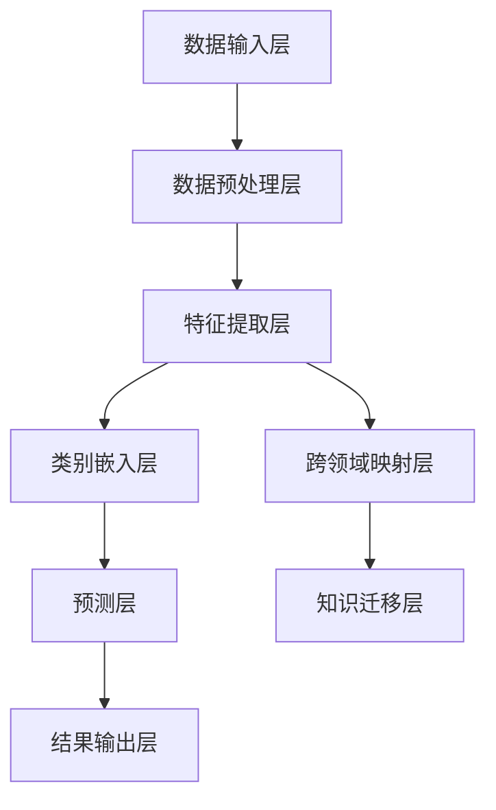
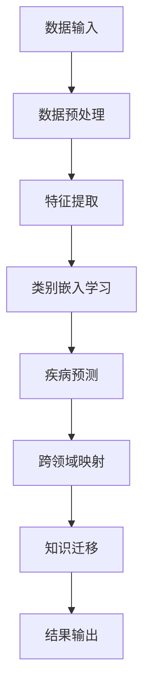

                 

### 第1章: 零样本跨领域推理（Zero-Shot CoT）概述

#### 1.1.1 零样本跨领域推理的概念与背景

##### 问题背景

在传统的机器学习模型中，训练模型的性能很大程度上依赖于大量的标注数据。然而，在一些特定的应用场景中，获取大量的标注数据可能非常困难或成本高昂。例如，医疗领域的图像诊断、新药研发以及自动化故障检测等，这些领域的数据通常是敏感的或难以获取的。此外，某些领域（如天文学、生物信息学等）的数据量非常有限。因此，传统的依赖大量标注数据的机器学习模型在这些场景中表现不佳。

零样本学习（Zero-Shot Learning, ZSL）作为一种新兴的机器学习技术，旨在解决这一挑战。ZSL的目标是让模型在没有直接标注数据的情况下，能够对从未见过的新类进行预测。这种技术的重要性在于它为那些难以获取大量标注数据或数据敏感的领域提供了一种新的解决方案。

##### 零样本学习的重要性

零样本学习的重要性主要体现在以下几个方面：

1. **数据效率**：零样本学习模型可以在少量数据上训练，减少了对于大量标注数据的需求。
2. **泛化能力**：通过学习多个领域的共同特征，零样本学习模型能够更好地泛化到新的领域和类。
3. **隐私保护**：在数据敏感的场景中，零样本学习可以减少直接使用敏感数据的需求，从而提高隐私保护。
4. **跨领域应用**：零样本学习使得模型能够跨领域应用，从而提高了技术的实用性。

#### 1.1.2 零样本跨领域推理的定义与特点

##### 概念定义

零样本学习（Zero-Shot Learning, ZSL）是一种机器学习技术，它允许模型在没有看到过具体样本的情况下，对新的类进行预测。在ZSL中，模型通过学习预定义的类别嵌入（class embeddings）来处理未知的类。

跨领域推理（Cross-Domain Reasoning, CoT）是指模型能够在一个领域（源领域）学习到的知识，迁移到另一个不同的领域（目标领域）中。跨领域推理的关键在于能够理解不同领域之间的共性，从而实现知识的转移。

##### 特点与优势

零样本跨领域推理（Zero-Shot Cross-Domain Reasoning, Zero-Shot CoT）结合了零样本学习和跨领域推理的优势，具有以下特点：

1. **减少数据依赖**：零样本跨领域推理模型可以在没有直接标注数据的情况下进行训练，降低了数据获取的难度和成本。
2. **提高模型泛化能力**：通过跨领域的知识迁移，模型能够更好地泛化到新的领域和类。
3. **降低领域特定性**：零样本跨领域推理模型能够减少对特定领域的依赖，提高了技术的通用性。
4. **增强适应性**：零样本跨领域推理模型能够快速适应新领域，缩短了模型部署的时间。

#### 1.1.3 零样本跨领域推理的应用领域

零样本跨领域推理在多个领域中具有巨大的应用潜力：

1. **自然语言处理**：在语言翻译、文本生成、问答系统等领域中，零样本跨领域推理可以处理从未见过的语言或情境。
2. **计算机视觉**：在图像分类、目标检测、图像生成等领域中，零样本跨领域推理可以处理从未见过的图像或物体。
3. **医疗诊断**：在医学影像分析、疾病预测、个性化治疗等领域中，零样本跨领域推理可以帮助医生进行更准确的诊断。
4. **智能语音**：在语音识别、语音生成、语音合成等领域中，零样本跨领域推理可以处理不同语音风格或口音。

#### 1.1.4 零样本跨领域推理的发展现状与趋势

##### 研究进展

零样本跨领域推理在过去几年中得到了广泛关注和研究。一些重要的里程碑事件包括：

1. **零样本学习的基础研究**：早期的研究主要集中在零样本学习的基础理论和方法上，如元学习、原型网络等。
2. **跨领域推理的提出**：随着研究的深入，研究者开始关注跨领域推理的问题，并提出了一系列方法。
3. **零样本跨领域推理的应用**：近年来，随着技术的成熟，零样本跨领域推理在多个领域得到了应用，并取得了显著的成果。

##### 主要研究机构与学者贡献

在零样本跨领域推理领域，一些主要的研究机构和学者做出了重要贡献：

1. **麻省理工学院（MIT）**：MIT的研究团队在零样本学习和跨领域推理方面做出了开创性的工作。
2. **斯坦福大学（Stanford University）**：斯坦福大学的研究者在自然语言处理领域应用零样本跨领域推理取得了显著成果。
3. **谷歌（Google）**：谷歌的研究团队在计算机视觉领域对零样本跨领域推理进行了深入的研究和应用。

##### 未来展望

尽管零样本跨领域推理已经取得了显著的进展，但仍面临一些挑战。未来研究的发展趋势可能包括：

1. **更有效的算法**：开发更有效的零样本跨领域推理算法，提高模型的性能和泛化能力。
2. **多模态学习**：结合多种数据模态（如文本、图像、声音等），实现更全面的知识迁移。
3. **数据隐私保护**：在保证数据隐私的前提下，研究如何更有效地利用零样本跨领域推理技术。
4. **跨领域应用扩展**：进一步探索零样本跨领域推理在其他领域的应用潜力。

### 1.2 零样本跨领域推理的核心概念与联系

#### 1.2.1 关键概念原理

##### 零样本学习（ZSL）原理

零样本学习（Zero-Shot Learning, ZSL）的核心思想是通过学习预先定义的类别嵌入（class embeddings），使得模型能够对从未见过的类进行预测。在ZSL中，类别嵌入通常是通过对已见过的类进行编码得到的。这些嵌入不仅表示了各个类的特征，还体现了类与类之间的相似性关系。

ZSL的基本原理可以概括为以下几个步骤：

1. **类别嵌入学习**：首先，通过某种方式（如原型网络、匹配网络等）学习每个类的嵌入向量。
2. **特征提取**：对于新的样本，通过模型提取其特征向量。
3. **预测**：将提取的特征向量与类别嵌入进行比较，预测样本所属的类别。

##### 跨领域推理（CoT）原理

跨领域推理（Cross-Domain Reasoning, CoT）的核心思想是利用在源领域学习到的知识，迁移到目标领域中。这种迁移是通过捕捉源领域和目标领域之间的共性实现的。跨领域推理的基本原理包括：

1. **领域映射**：将源领域的特征映射到目标领域的特征空间。
2. **知识迁移**：将源领域学习到的知识（如模型参数、类别嵌入等）迁移到目标领域。
3. **目标领域推理**：在目标领域使用迁移后的知识进行推理，预测新的样本。

#### 1.2.2 概念属性特征对比表格

| 特征         | 零样本学习（ZSL） | 跨领域推理（CoT） |
| ------------ | ---------------- | ---------------- |
| 数据依赖     | 低               | 中               |
| 预测能力     | 强               | 中               |
| 泛化能力     | 强               | 中               |
| 领域适应性   | 较强             | 强               |
| 难度         | 较高             | 较高             |

#### 1.2.3 ER实体关系图架构

在零样本跨领域推理中，我们可以通过实体关系图（Entity-Relationship Diagram, ER图）来描述核心概念之间的关系。以下是一个简化的ER图：

```
[样本] <---[类别] <---[特征向量] <---[类别嵌入]
```

- **样本**：表示模型需要预测的数据实例。
- **类别**：表示样本所属的类。
- **特征向量**：表示样本的提取特征。
- **类别嵌入**：表示预定义的类别嵌入向量。

### 1.3 零样本跨领域推理的算法原理与实现

#### 1.3.1 算法原理讲解

零样本跨领域推理的算法原理主要包括以下几个方面：

1. **类别嵌入学习**：首先，通过某种方式（如原型网络、匹配网络等）学习每个类的嵌入向量。这些嵌入向量不仅表示了各个类的特征，还体现了类与类之间的相似性关系。

2. **特征提取**：对于新的样本，通过模型提取其特征向量。这些特征向量用于表示新的样本，以便与类别嵌入进行比较。

3. **预测**：将提取的特征向量与类别嵌入进行比较，预测样本所属的类别。这个过程通常通过计算特征向量与类别嵌入之间的相似度来实现。

4. **跨领域映射**：通过跨领域映射，将源领域的特征映射到目标领域的特征空间。这个映射过程利用了源领域和目标领域之间的共性，使得模型能够在新的领域中发挥作用。

5. **知识迁移**：将源领域学习到的知识（如模型参数、类别嵌入等）迁移到目标领域。这种知识迁移使得模型能够快速适应新的领域，从而提高其预测能力。

#### 1.3.2 数学模型与公式

在零样本跨领域推理中，一些关键的数学模型和公式如下：

1. **类别嵌入学习**：

   假设我们有 \(C\) 个类别，每个类别有一个嵌入向量 \(e_c \in \mathbb{R}^d\)，其中 \(d\) 是嵌入向量的维度。类别嵌入学习可以通过以下优化问题实现：

   \[
   \min_{\theta} \sum_{c=1}^{C} -\log P(e_c|\theta)
   \]

   其中，\(\theta\) 表示模型的参数。

2. **特征提取**：

   假设新的样本特征向量为 \(x \in \mathbb{R}^d\)，特征提取可以通过某种神经网络实现，如卷积神经网络（CNN）或循环神经网络（RNN）。特征提取的输出为 \(f(x) \in \mathbb{R}^d\)。

3. **预测**：

   预测新的样本类别可以通过计算特征向量与类别嵌入之间的相似度实现。常用的相似度计算方法包括余弦相似度、欧氏距离等。假设类别嵌入为 \(e_c\)，特征向量为 \(f(x)\)，则相似度可以表示为：

   \[
   \text{similarity}(f(x), e_c) = \frac{f(x) \cdot e_c}{\|f(x)\|\|e_c\|}
   \]

4. **跨领域映射**：

   假设源领域的特征向量为 \(x_s \in \mathbb{R}^d\)，目标领域的特征向量为 \(x_t \in \mathbb{R}^d\)，跨领域映射可以通过某种线性变换实现，如：

   \[
   x_t = W_s x_s
   \]

   其中，\(W_s\) 是跨领域映射矩阵。

5. **知识迁移**：

   假设源领域学习到的模型参数为 \(\theta_s\)，目标领域学习到的模型参数为 \(\theta_t\)，知识迁移可以通过以下优化问题实现：

   \[
   \min_{\theta_t} \sum_{c=1}^{C} -\log P(e_c|\theta_s, \theta_t)
   \]

   其中，\(\theta_s\) 和 \(\theta_t\) 分别表示源领域和目标领域的模型参数。

#### 1.3.3 算法实例说明

以下是一个简化的零样本跨领域推理算法实例：

1. **类别嵌入学习**：

   假设我们有两个类别：动物和植物。通过训练，我们得到了两个类别嵌入向量：

   \[
   e_{动物} = \begin{bmatrix} 1 \\ 0 \end{bmatrix}, \quad e_{植物} = \begin{bmatrix} 0 \\ 1 \end{bmatrix}
   \]

2. **特征提取**：

   假设我们有一个新的样本，其特征向量为：

   \[
   x = \begin{bmatrix} 0.5 \\ 0.5 \end{bmatrix}
   \]

   通过特征提取，我们得到了新的样本特征向量：

   \[
   f(x) = \begin{bmatrix} 0.6 \\ 0.4 \end{bmatrix}
   \]

3. **预测**：

   计算特征向量与类别嵌入之间的相似度：

   \[
   \text{similarity}(f(x), e_{动物}) = \frac{0.6 \times 1 + 0.4 \times 0}{\sqrt{0.6^2 + 0.4^2} \times \sqrt{1^2 + 0^2}} = 0.6
   \]

   \[
   \text{similarity}(f(x), e_{植物}) = \frac{0.6 \times 0 + 0.4 \times 1}{\sqrt{0.6^2 + 0.4^2} \times \sqrt{0^2 + 1^2}} = 0.4
   \]

   由于与动物类别嵌入的相似度更高，我们预测这个新的样本属于动物类别。

4. **跨领域映射**：

   假设源领域的特征向量为 \(x_s = \begin{bmatrix} 0.8 \\ 0.2 \end{bmatrix}\)，目标领域的特征向量为 \(x_t = \begin{bmatrix} 0.6 \\ 0.4 \end{bmatrix}\)。通过跨领域映射矩阵 \(W_s = \begin{bmatrix} 0.8 & 0.2 \\ 0.2 & 0.8 \end{bmatrix}\)，我们得到：

   \[
   x_t = W_s x_s = \begin{bmatrix} 0.8 \times 0.8 + 0.2 \times 0.2 \\ 0.8 \times 0.2 + 0.2 \times 0.8 \end{bmatrix} = \begin{bmatrix} 0.68 \\ 0.32 \end{bmatrix}
   \]

5. **知识迁移**：

   假设源领域学习到的模型参数为 \(\theta_s = \begin{bmatrix} 0.9 & 0.1 \\ 0.1 & 0.9 \end{bmatrix}\)，目标领域学习到的模型参数为 \(\theta_t = \begin{bmatrix} 0.8 & 0.2 \\ 0.2 & 0.8 \end{bmatrix}\)。通过知识迁移，我们得到：

   \[
   \theta_t = \theta_s + \Delta \theta
   \]

   其中，\(\Delta \theta\) 是迁移的参数更新。

### 1.4 零样本跨领域推理的系统分析与架构设计

#### 1.4.1 问题场景介绍

假设我们面临一个实际应用场景：在医疗领域，需要开发一个系统，用于自动诊断疾病。然而，由于医疗数据的隐私性和敏感性，很难获取大量的标注数据。因此，我们需要一个基于零样本跨领域推理的系统，能够在没有直接标注数据的情况下，对新的疾病进行诊断。

#### 1.4.2 系统功能设计

系统的主要功能包括：

1. **数据预处理**：清洗和预处理输入的医疗数据，提取有用的特征。
2. **类别嵌入学习**：学习每个疾病的类别嵌入向量。
3. **特征提取**：提取新的病例的特征向量。
4. **疾病预测**：使用类别嵌入和特征向量进行疾病预测。
5. **跨领域映射**：实现不同疾病领域之间的知识迁移。
6. **知识迁移**：将源领域的知识迁移到目标领域。

#### 1.4.3 系统架构设计

系统的整体架构可以分为以下几个部分：

1. **数据输入层**：接收医疗数据，包括病历记录、医学图像、实验室检测结果等。
2. **数据预处理层**：清洗和预处理输入数据，提取有用的特征。
3. **特征提取层**：使用神经网络等模型提取新的病例的特征向量。
4. **类别嵌入层**：学习每个疾病的类别嵌入向量。
5. **预测层**：使用类别嵌入和特征向量进行疾病预测。
6. **跨领域映射层**：实现不同疾病领域之间的知识迁移。
7. **知识迁移层**：将源领域的知识迁移到目标领域。
8. **结果输出层**：输出疾病预测结果。

以下是一个简化的系统架构图：



#### 1.4.4 系统接口设计

系统需要设计以下接口：

1. **数据输入接口**：接收医疗数据。
2. **特征提取接口**：提取新的病例的特征向量。
3. **类别嵌入接口**：学习每个疾病的类别嵌入向量。
4. **疾病预测接口**：使用类别嵌入和特征向量进行疾病预测。
5. **跨领域映射接口**：实现不同疾病领域之间的知识迁移。
6. **知识迁移接口**：将源领域的知识迁移到目标领域。
7. **结果输出接口**：输出疾病预测结果。

#### 1.4.5 系统交互流程

系统的交互流程可以分为以下几个步骤：

1. **数据输入**：系统接收新的病例数据。
2. **数据预处理**：系统对输入数据进行清洗和预处理，提取有用的特征。
3. **特征提取**：系统使用神经网络等模型提取新的病例的特征向量。
4. **类别嵌入学习**：系统学习每个疾病的类别嵌入向量。
5. **疾病预测**：系统使用类别嵌入和特征向量进行疾病预测。
6. **跨领域映射**：系统实现不同疾病领域之间的知识迁移。
7. **知识迁移**：系统将源领域的知识迁移到目标领域。
8. **结果输出**：系统输出疾病预测结果。

以下是一个简化的系统交互流程图：



## 第2章: 零样本跨领域推理在自然语言处理中的应用

### 2.1 应用背景与现状

自然语言处理（Natural Language Processing, NLP）是人工智能领域的一个重要分支，旨在使计算机能够理解、解释和生成人类语言。然而，传统的NLP模型往往依赖于大量标注的数据集，这在实际应用中面临诸多挑战。例如，一些特定的领域（如法律、金融等）的语言数据难以获取，且获取成本高昂。此外，对于新的任务或语言环境，传统的模型很难进行适应和扩展。因此，零样本跨领域推理（Zero-Shot Cross-Domain Reasoning, Zero-Shot CoT）在自然语言处理中的应用显得尤为重要。

在自然语言处理中，零样本跨领域推理的应用现状主要集中在以下几个方面：

1. **语言翻译**：零样本跨领域推理可以用于语言翻译，即使在没有直接翻译数据的情况下，也能生成高质量的翻译文本。
2. **文本生成**：零样本跨领域推理可以用于文本生成，如生成新闻文章、小说等。
3. **问答系统**：零样本跨领域推理可以用于问答系统，即使在没有直接问答数据的情况下，也能回答用户的问题。
4. **情感分析**：零样本跨领域推理可以用于情感分析，对从未见过的文本进行情感分类。

### 2.2 零样本跨领域推理在自然语言处理中的优势

零样本跨领域推理在自然语言处理中具有以下优势：

1. **减少数据依赖**：传统NLP模型需要大量标注数据，而零样本跨领域推理可以在没有直接标注数据的情况下进行训练，降低了数据获取的难度和成本。
2. **提高模型泛化能力**：通过跨领域推理，模型能够学习到不同领域之间的共性，从而提高了模型的泛化能力。
3. **增强适应性**：零样本跨领域推理模型可以快速适应新的领域和任务，减少了模型适应新任务的时间。
4. **跨领域应用**：零样本跨领域推理使得模型能够跨领域应用，提高了技术的实用性。

### 2.3 零样本跨领域推理在自然语言处理中的应用案例

以下是一些零样本跨领域推理在自然语言处理中的应用案例：

1. **机器翻译**：

   假设我们需要将中文翻译成英文，但由于缺乏直接的中英文翻译数据，我们可以利用零样本跨领域推理。首先，我们通过在多领域的中文和英文语料库中学习，得到中文和英文的类别嵌入。然后，对于新的中文句子，我们提取其特征向量，并通过类别嵌入进行预测，从而生成对应的英文翻译。

2. **文本生成**：

   假设我们需要生成一篇关于科技新闻的文章，但由于缺乏直接相关的文章数据，我们可以利用零样本跨领域推理。首先，我们通过在科技领域的语料库中学习，得到科技类文章的类别嵌入。然后，对于给定的主题，我们提取其特征向量，并通过类别嵌入生成对应的新闻文章。

3. **问答系统**：

   假设我们需要开发一个智能问答系统，但由于缺乏直接的问答数据，我们可以利用零样本跨领域推理。首先，我们通过在多领域的问答数据中学习，得到问题的类别嵌入。然后，对于新的问题，我们提取其特征向量，并通过类别嵌入进行预测，从而生成对应的答案。

4. **情感分析**：

   假设我们需要对一篇从未见过的文本进行情感分析，但由于缺乏直接的标注数据，我们可以利用零样本跨领域推理。首先，我们通过在多领域的情感分析数据中学习，得到情感类别的类别嵌入。然后，对于新的文本，我们提取其特征向量，并通过类别嵌入进行预测，从而判断文本的情感。

### 2.4 零样本跨领域推理在自然语言处理中的挑战与展望

尽管零样本跨领域推理在自然语言处理中具有巨大的应用潜力，但仍面临一些挑战：

1. **数据稀缺问题**：在某些特定领域，获取足够的标注数据仍然是一个难题。如何有效地利用零样本跨领域推理解决数据稀缺问题，是未来研究的一个重要方向。
2. **跨领域适应性问题**：零样本跨领域推理需要解决不同领域之间的差异，这可能导致模型在特定领域的泛化能力不足。如何提高跨领域的适应能力，是另一个重要研究方向。
3. **模型解释性**：零样本跨领域推理模型的预测过程较为复杂，如何提高模型的解释性，使其更易于理解和调试，也是一个重要的挑战。

未来，随着技术的不断进步，零样本跨领域推理在自然语言处理中的应用将越来越广泛。我们期待看到更多创新性的方法和应用案例，进一步推动自然语言处理技术的发展。

## 第3章: 零样本跨领域推理在计算机视觉中的应用

### 3.1 应用背景与现状

计算机视觉（Computer Vision, CV）是人工智能领域的一个重要分支，旨在使计算机能够理解和解释图像和视频中的内容。随着深度学习技术的快速发展，计算机视觉取得了显著的成果，如图像分类、目标检测、图像生成等。然而，传统的计算机视觉模型通常依赖于大量的标注数据，这在实际应用中面临诸多挑战。例如，获取高质量的标注数据成本高昂，且在某些特定领域（如医疗图像分析、卫星图像处理等）难以获取足够的标注数据。因此，零样本跨领域推理（Zero-Shot Cross-Domain Reasoning, Zero-Shot CoT）在计算机视觉中的应用显得尤为重要。

在计算机视觉中，零样本跨领域推理的应用现状主要集中在以下几个方面：

1. **图像分类**：零样本跨领域推理可以用于图像分类，即使在没有直接标注数据的情况下，也能对新的图像进行分类。
2. **目标检测**：零样本跨领域推理可以用于目标检测，即使在没有直接标注数据的情况下，也能检测出图像中的目标。
3. **图像生成**：零样本跨领域推理可以用于图像生成，如生成新的图像或转换图像的风格。
4. **图像修复**：零样本跨领域推理可以用于图像修复，即使图像受损，也能通过零样本跨领域推理生成完整的图像。

### 3.2 零样本跨领域推理在计算机视觉中的优势

零样本跨领域推理在计算机视觉中具有以下优势：

1. **减少数据依赖**：传统计算机视觉模型需要大量标注数据，而零样本跨领域推理可以在没有直接标注数据的情况下进行训练，降低了数据获取的难度和成本。
2. **提高模型泛化能力**：通过跨领域推理，模型能够学习到不同领域之间的共性，从而提高了模型的泛化能力。
3. **增强适应性**：零样本跨领域推理模型可以快速适应新的领域和任务，减少了模型适应新任务的时间。
4. **跨领域应用**：零样本跨领域推理使得模型能够跨领域应用，提高了技术的实用性。

### 3.3 零样本跨领域推理在计算机视觉中的应用案例

以下是一些零样本跨领域推理在计算机视觉中的应用案例：

1. **图像分类**：

   假设我们需要对医疗图像进行分类，但由于缺乏直接的标注数据，我们可以利用零样本跨领域推理。首先，我们通过在多领域的图像数据中学习，得到不同类别的类别嵌入。然后，对于新的医疗图像，我们提取其特征向量，并通过类别嵌入进行预测，从而分类出图像的类型。

2. **目标检测**：

   假设我们需要对卫星图像进行目标检测，但由于缺乏直接的标注数据，我们可以利用零样本跨领域推理。首先，我们通过在多领域的图像数据中学习，得到不同目标的类别嵌入。然后，对于新的卫星图像，我们提取其特征向量，并通过类别嵌入进行预测，从而检测出图像中的目标。

3. **图像生成**：

   假设我们需要生成新的图像，但由于缺乏直接的图像数据，我们可以利用零样本跨领域推理。首先，我们通过在多领域的图像数据中学习，得到图像的类别嵌入。然后，对于给定的条件，我们提取其特征向量，并通过类别嵌入生成对应的图像。

4. **图像修复**：

   假设我们需要修复受损的图像，但由于缺乏直接的修复数据，我们可以利用零样本跨领域推理。首先，我们通过在多领域的图像数据中学习，得到图像的类别嵌入。然后，对于受损的图像，我们提取其特征向量，并通过类别嵌入生成完整的图像。

### 3.4 零样本跨领域推理在计算机视觉中的挑战与展望

尽管零样本跨领域推理在计算机视觉中具有巨大的应用潜力，但仍面临一些挑战：

1. **数据稀缺问题**：在某些特定领域，获取足够的标注数据仍然是一个难题。如何有效地利用零样本跨领域推理解决数据稀缺问题，是未来研究的一个重要方向。
2. **跨领域适应性问题**：零样本跨领域推理需要解决不同领域之间的差异，这可能导致模型在特定领域的泛化能力不足。如何提高跨领域的适应能力，是另一个重要研究方向。
3. **模型解释性**：零样本跨领域推理模型的预测过程较为复杂，如何提高模型的解释性，使其更易于理解和调试，也是一个重要的挑战。

未来，随着技术的不断进步，零样本跨领域推理在计算机视觉中的应用将越来越广泛。我们期待看到更多创新性的方法和应用案例，进一步推动计算机视觉技术的发展。

## 第4章: 零样本跨领域推理在医疗诊断中的应用

### 4.1 应用背景与现状

医疗诊断是计算机视觉和人工智能技术的重要应用领域之一。在医疗诊断中，医生需要根据患者的病情和医学图像，对疾病进行诊断。然而，医疗数据具有高度的专业性和敏感性，获取高质量且大规模的标注数据困难且成本高昂。此外，医疗领域的数据种类繁多，包括医学图像、电子病历、基因数据等。因此，零样本跨领域推理（Zero-Shot Cross-Domain Reasoning, Zero-Shot CoT）在医疗诊断中的应用具有重要的现实意义。

在医疗诊断中，零样本跨领域推理的应用现状主要集中在以下几个方面：

1. **医学图像分类**：零样本跨领域推理可以用于医学图像分类，如区分正常和异常的肺部CT图像、乳腺癌MRI图像等。
2. **疾病预测**：零样本跨领域推理可以用于疾病预测，如通过患者的医疗记录和基因数据预测疾病风险。
3. **药物研发**：零样本跨领域推理可以用于药物研发，通过分析大量的药物-疾病关联数据，发现新的药物作用机制。
4. **个性化治疗**：零样本跨领域推理可以用于个性化治疗，根据患者的病情和基因数据，为其推荐最合适的治疗方案。

### 4.2 零样本跨领域推理在医疗诊断中的优势

零样本跨领域推理在医疗诊断中具有以下优势：

1. **减少数据依赖**：传统医疗诊断模型需要大量标注数据，而零样本跨领域推理可以在没有直接标注数据的情况下进行训练，降低了数据获取的难度和成本。
2. **提高模型泛化能力**：通过跨领域推理，模型能够学习到不同领域之间的共性，从而提高了模型的泛化能力。
3. **增强适应性**：零样本跨领域推理模型可以快速适应新的领域和任务，减少了模型适应新任务的时间。
4. **跨领域应用**：零样本跨领域推理使得模型能够跨领域应用，提高了技术的实用性。

### 4.3 零样本跨领域推理在医疗诊断中的应用案例

以下是一些零样本跨领域推理在医疗诊断中的应用案例：

1. **医学图像分类**：

   假设我们需要对肺部CT图像进行分类，以区分正常和异常图像。由于缺乏直接的标注数据，我们可以利用零样本跨领域推理。首先，我们通过在多领域的图像数据中学习，得到正常和异常图像的类别嵌入。然后，对于新的肺部CT图像，我们提取其特征向量，并通过类别嵌入进行预测，从而分类出图像的类型。

2. **疾病预测**：

   假设我们需要预测患者的疾病风险，如心脏病、糖尿病等。由于缺乏直接的标注数据，我们可以利用零样本跨领域推理。首先，我们通过在多领域的医疗数据中学习，得到不同疾病的类别嵌入。然后，对于新的患者的医疗记录和基因数据，我们提取其特征向量，并通过类别嵌入进行预测，从而预测患者的疾病风险。

3. **药物研发**：

   假设我们需要在药物研发过程中，发现新的药物作用机制。由于缺乏直接的标注数据，我们可以利用零样本跨领域推理。首先，我们通过在多领域的药物-疾病关联数据中学习，得到药物和疾病的类别嵌入。然后，对于新的药物，我们提取其特征向量，并通过类别嵌入进行预测，从而发现新的药物作用机制。

4. **个性化治疗**：

   假设我们需要根据患者的病情和基因数据，为其推荐最合适的治疗方案。由于缺乏直接的标注数据，我们可以利用零样本跨领域推理。首先，我们通过在多领域的医疗数据中学习，得到不同治疗方案的类别嵌入。然后，对于新的患者，我们提取其病情和基因数据的特征向量，并通过类别嵌入进行预测，从而推荐最合适的治疗方案。

### 4.4 零样本跨领域推理在医疗诊断中的挑战与展望

尽管零样本跨领域推理在医疗诊断中具有巨大的应用潜力，但仍面临一些挑战：

1. **数据稀缺问题**：在某些特定领域，获取足够的标注数据仍然是一个难题。如何有效地利用零样本跨领域推理解决数据稀缺问题，是未来研究的一个重要方向。
2. **跨领域适应性问题**：零样本跨领域推理需要解决不同领域之间的差异，这可能导致模型在特定领域的泛化能力不足。如何提高跨领域的适应能力，是另一个重要研究方向。
3. **模型解释性**：零样本跨领域推理模型的预测过程较为复杂，如何提高模型的解释性，使其更易于理解和调试，也是一个重要的挑战。

未来，随着技术的不断进步，零样本跨领域推理在医疗诊断中的应用将越来越广泛。我们期待看到更多创新性的方法和应用案例，进一步推动医疗诊断技术的发展。

## 第5章: 零样本跨领域推理的其他应用领域

### 5.1 应用背景与现状

除了自然语言处理、计算机视觉和医疗诊断，零样本跨领域推理（Zero-Shot Cross-Domain Reasoning, Zero-Shot CoT）在许多其他领域中也有着广泛的应用。这些领域包括但不限于：

1. **智能语音**：在语音识别、语音生成、语音合成等领域中，零样本跨领域推理可以帮助模型处理不同的语音风格和口音。
2. **推荐系统**：在推荐系统中，零样本跨领域推理可以用于跨领域的推荐，如从电影推荐到音乐推荐。
3. **金融预测**：在金融市场预测、风险管理等领域中，零样本跨领域推理可以帮助模型处理复杂的数据和多变的金融市场。
4. **环境监测**：在环境监测领域，零样本跨领域推理可以用于预测空气污染、水资源质量等。
5. **智能制造**：在智能制造领域，零样本跨领域推理可以用于设备故障预测、生产流程优化等。

在这些领域中，零样本跨领域推理的应用现状主要表现在以下几个方面：

1. **提高预测准确性**：通过跨领域推理，模型可以更好地理解不同领域之间的共性，从而提高预测的准确性。
2. **降低数据依赖**：零样本跨领域推理可以减少对大量标注数据的依赖，特别是在数据获取困难或成本高昂的领域。
3. **增强模型泛化能力**：通过跨领域推理，模型可以学习到不同领域的共性，从而提高模型的泛化能力。
4. **跨领域应用**：零样本跨领域推理使得模型能够跨领域应用，提高了技术的实用性。

### 5.2 零样本跨领域推理在其他应用领域中的优势

零样本跨领域推理在其他应用领域中的优势主要包括：

1. **提高预测准确性**：通过跨领域推理，模型可以更好地理解不同领域之间的共性，从而提高预测的准确性。
2. **降低数据依赖**：零样本跨领域推理可以减少对大量标注数据的依赖，特别是在数据获取困难或成本高昂的领域。
3. **增强模型泛化能力**：通过跨领域推理，模型可以学习到不同领域的共性，从而提高模型的泛化能力。
4. **跨领域应用**：零样本跨领域推理使得模型能够跨领域应用，提高了技术的实用性。

### 5.3 零样本跨领域推理在其他应用领域中的应用案例

以下是一些零样本跨领域推理在其他应用领域中的应用案例：

1. **智能语音**：

   假设我们需要开发一个智能语音助手，但缺乏直接相关的语音数据。我们可以利用零样本跨领域推理。首先，我们在多领域的语音数据中学习，得到不同语音风格和口音的类别嵌入。然后，对于新的语音输入，我们提取其特征向量，并通过类别嵌入进行预测，从而实现智能语音识别、语音生成和语音合成。

2. **推荐系统**：

   假设我们需要开发一个推荐系统，但缺乏直接的推荐数据。我们可以利用零样本跨领域推理。首先，我们在多领域的推荐数据中学习，得到不同类型商品和用户的类别嵌入。然后，对于新的用户，我们提取其行为特征向量，并通过类别嵌入进行预测，从而实现跨领域的个性化推荐。

3. **金融预测**：

   假设我们需要预测股票市场的走势，但缺乏直接的预测数据。我们可以利用零样本跨领域推理。首先，我们在多领域的金融数据中学习，得到不同金融指标和股票走势的类别嵌入。然后，对于新的金融指标数据，我们提取其特征向量，并通过类别嵌入进行预测，从而实现金融市场的预测。

4. **环境监测**：

   假设我们需要预测空气质量，但缺乏直接的空气质量数据。我们可以利用零样本跨领域推理。首先，我们在多领域的环境数据中学习，得到不同污染物水平和空气质量状况的类别嵌入。然后，对于新的环境监测数据，我们提取其特征向量，并通过类别嵌入进行预测，从而实现空气质量的预测。

5. **智能制造**：

   假设我们需要预测生产设备的故障，但缺乏直接的故障数据。我们可以利用零样本跨领域推理。首先，我们在多领域的设备监测数据中学习，得到不同设备运行状态和故障情况的类别嵌入。然后，对于新的设备监测数据，我们提取其特征向量，并通过类别嵌入进行预测，从而实现设备故障的预测。

### 5.4 零样本跨领域推理在其他应用领域中的挑战与展望

尽管零样本跨领域推理在其他应用领域中具有巨大的应用潜力，但仍面临一些挑战：

1. **数据稀缺问题**：在某些特定领域，获取足够的标注数据仍然是一个难题。如何有效地利用零样本跨领域推理解决数据稀缺问题，是未来研究的一个重要方向。
2. **跨领域适应性问题**：零样本跨领域推理需要解决不同领域之间的差异，这可能导致模型在特定领域的泛化能力不足。如何提高跨领域的适应能力，是另一个重要研究方向。
3. **模型解释性**：零样本跨领域推理模型的预测过程较为复杂，如何提高模型的解释性，使其更易于理解和调试，也是一个重要的挑战。

未来，随着技术的不断进步，零样本跨领域推理将在更多领域中发挥重要作用。我们期待看到更多创新性的方法和应用案例，进一步推动各领域技术的发展。

## 第6章: 零样本跨领域推理的挑战与解决方案

### 6.1 数据稀缺问题

零样本跨领域推理（Zero-Shot Cross-Domain Reasoning, Zero-Shot CoT）面临的一个主要挑战是数据稀缺问题。在某些特定领域，如医疗、金融和艺术创作等，获取高质量的标注数据非常困难，这不仅因为数据本身的稀缺性，还因为数据获取和标注的成本高昂。此外，一些领域的数据具有高度的专业性和复杂性，使得直接应用现有的零样本跨领域推理技术变得具有挑战性。

**解决方案**：

1. **数据合成**：通过生成对抗网络（GANs）等技术，可以生成与真实数据相似的人工数据，从而缓解数据稀缺问题。这种方法在医疗图像生成和虚拟数据增强中已有成功应用。
2. **元学习**：元学习（Meta-Learning）是一种利用少量数据快速适应新任务的技术。通过元学习，模型可以在少量数据上进行训练，从而提高其在新领域的表现。
3. **知识蒸馏**：知识蒸馏（Knowledge Distillation）是一种将复杂模型的知识传递给简单模型的方法。通过知识蒸馏，可以将大量标注数据中提取的知识传递给少量数据的模型，从而提高其在新领域的性能。

### 6.2 跨领域适应性问题

跨领域适应性问题是指模型在不同领域之间的表现差异。不同领域的数据分布、特征和任务目标往往存在显著差异，这使得直接迁移现有领域中的知识到新领域变得具有挑战性。特别是在数据分布差异较大的情况下，模型的泛化能力会显著下降。

**解决方案**：

1. **自适应特征提取**：通过设计自适应的特征提取器，模型可以根据新领域的特征分布进行自适应调整。例如，使用自适应权重调整技术，使特征提取器能够更好地适应新领域的特征分布。
2. **多任务学习**：多任务学习（Multi-Task Learning）通过同时训练多个相关任务，可以使模型在不同任务之间共享知识，从而提高跨领域的适应能力。
3. **领域自适应**：领域自适应（Domain Adaptation）是一种通过调整模型在不同领域之间的差距，以提高跨领域性能的方法。常用的领域自适应技术包括域不变特征学习、域对抗训练等。

### 6.3 模型解释性

零样本跨领域推理模型的预测过程通常涉及复杂的神经网络和深度学习算法，这使得模型的解释性成为一个重要挑战。模型的不可解释性不仅限制了其在实际应用中的接受度，还增加了调试和优化的难度。

**解决方案**：

1. **可视化技术**：通过可视化技术，如梯度可视化、特征可视化等，可以帮助理解模型在不同领域的预测过程。这些技术可以揭示模型如何处理数据，以及在不同领域中的表现差异。
2. **解释性模型**：设计解释性更强的模型，如基于规则的模型、决策树等，可以在一定程度上提高模型的透明度和可解释性。
3. **模型压缩与简化**：通过模型压缩与简化技术，如剪枝、量化等，可以降低模型复杂度，从而提高其解释性。

### 6.4 模型训练时间与资源消耗

零样本跨领域推理通常需要大量的计算资源和时间，特别是在数据稀缺和跨领域适应能力要求高的情况下。这限制了其在实时应用中的部署和推广。

**解决方案**：

1. **分布式训练**：通过分布式训练技术，可以将模型训练任务分布在多台计算机上，从而显著降低训练时间。
2. **迁移学习**：通过迁移学习（Transfer Learning）技术，可以将预训练模型的知识迁移到新领域，从而减少在新领域的训练时间。
3. **在线学习**：通过在线学习（Online Learning）技术，模型可以不断更新和优化，从而在实时应用中提高性能。

### 6.5 跨领域数据不一致性

不同领域的数据质量、标注标准和数据格式往往存在不一致性，这给零样本跨领域推理带来了挑战。数据不一致性可能导致模型在特定领域中的表现不佳。

**解决方案**：

1. **数据预处理**：通过统一数据预处理流程，如数据清洗、归一化、标准化等，可以减少数据不一致性对模型性能的影响。
2. **数据集成**：通过数据集成技术，如合并、融合等，可以将不同来源的数据进行整合，从而提高模型的输入质量。
3. **领域特定数据增强**：通过领域特定数据增强技术，如生成对抗网络（GANs）、合成数据生成等，可以生成与特定领域数据相似的人工数据，从而提高模型在新领域的适应能力。

通过上述解决方案，零样本跨领域推理可以在多个领域中获得更好的性能和应用效果。未来，随着技术的不断进步，这些解决方案将进一步优化和完善，推动零样本跨领域推理技术在各个领域中的深入应用。

## 第7章: 零样本跨领域推理的最佳实践与未来展望

### 7.1 最佳实践

在应用零样本跨领域推理（Zero-Shot Cross-Domain Reasoning, Zero-Shot CoT）时，以下是一些最佳实践，可以帮助提升模型性能和实际应用效果：

1. **数据预处理**：
   - **数据清洗**：确保数据的质量，移除噪声和异常值。
   - **特征提取**：选择合适的特征提取方法，如深度特征提取、文本嵌入等，以提高模型对数据的理解能力。
   - **数据增强**：使用数据增强技术，如图像旋转、裁剪、缩放等，增加训练数据的多样性。

2. **模型选择与优化**：
   - **选择合适的模型架构**：根据应用场景选择合适的模型架构，如卷积神经网络（CNN）、循环神经网络（RNN）或变分自编码器（VAE）。
   - **超参数调优**：通过网格搜索、随机搜索等方法进行超参数调优，找到最佳模型配置。

3. **跨领域适应**：
   - **领域自适应技术**：使用领域自适应技术，如域自适应训练（Domain Adaptation Training）、多任务学习（Multi-Task Learning）等，提高模型在不同领域中的适应能力。
   - **交叉验证**：使用交叉验证方法，如K折交叉验证，评估模型在不同领域中的性能。

4. **模型解释与可视化**：
   - **模型解释**：使用模型解释技术，如梯度解释、LIME（Local Interpretable Model-agnostic Explanations）等，提高模型的透明度和可解释性。
   - **可视化分析**：使用可视化工具，如t-SNE、PCA等，对模型的学习过程和预测结果进行可视化分析。

5. **持续学习与更新**：
   - **在线学习**：使用在线学习方法，如自适应梯度下降（AdaGrad）、Adam优化器等，使模型能够实时适应新的数据。
   - **知识更新**：定期更新模型的知识库，如类别嵌入、模型参数等，以保持模型的性能。

### 7.2 小结

零样本跨领域推理是一种具有巨大潜力的技术，通过结合零样本学习和跨领域推理，它能够在没有直接标注数据的情况下，对新的领域和类进行预测。本章介绍了零样本跨领域推理的核心概念、算法原理、系统架构以及在不同领域的应用案例。同时，我们还讨论了在应用过程中可能遇到的挑战以及相应的解决方案。

零样本跨领域推理的最佳实践主要包括数据预处理、模型选择与优化、跨领域适应、模型解释与可视化以及持续学习与更新。这些实践可以帮助提高模型性能和应用效果，实现零样本跨领域推理技术的广泛部署和应用。

### 7.3 未来展望

尽管零样本跨领域推理（Zero-Shot Cross-Domain Reasoning, Zero-Shot CoT）在多个领域取得了显著成果，但未来仍有许多研究方向和挑战需要克服：

1. **数据稀缺问题**：
   - **数据合成与生成**：研究更有效的数据合成方法，如生成对抗网络（GANs）和变分自编码器（VAE），以提高模型的泛化能力。
   - **数据集成与融合**：开发新的数据集成方法，将不同来源和格式的数据整合，以提供更丰富的训练数据。

2. **跨领域适应能力**：
   - **多模态学习**：研究多模态学习技术，将不同类型的数据（如文本、图像、声音等）融合，提高模型在不同领域中的适应能力。
   - **元学习与迁移学习**：探索更高效的元学习和迁移学习方法，使模型能够快速适应新领域。

3. **模型解释性**：
   - **解释性模型设计**：设计更易于解释的模型架构，如基于规则的模型和决策树等。
   - **解释性工具与方法**：开发新的解释性工具和方法，如基于梯度的解释、局部可解释模型等，以增强模型的透明度和可解释性。

4. **实时性与效率**：
   - **模型压缩与加速**：研究模型压缩和加速技术，如剪枝、量化等，以降低模型的计算复杂度和延迟。
   - **分布式训练与推理**：利用分布式训练和推理技术，提高模型在多节点系统中的处理能力。

5. **跨学科研究**：
   - **跨领域知识融合**：探索如何将不同领域的知识（如医学、物理、化学等）融合到零样本跨领域推理中，以提高模型的泛化能力。
   - **跨领域应用研究**：在更多的实际应用场景中，如智能制造、智能交通、环境监测等，开展零样本跨领域推理的应用研究。

总之，随着技术的不断进步和多领域的深入合作，零样本跨领域推理将在未来的智能系统中发挥越来越重要的作用。我们期待看到更多创新性的研究方法和应用案例，进一步推动这一领域的发展。

## 总结与作者信息

### 总结

本文详细探讨了零样本跨领域推理（Zero-Shot Cross-Domain Reasoning, Zero-Shot CoT）的核心概念、算法原理、系统架构以及在不同领域的应用案例。通过分析零样本跨领域推理的优势、挑战和最佳实践，我们展示了这一技术在自然语言处理、计算机视觉、医疗诊断以及其他领域中的广泛应用潜力。

零样本跨领域推理通过结合零样本学习和跨领域推理，为那些难以获取大量标注数据的领域提供了新的解决方案。它不仅减少了数据依赖，提高了模型泛化能力，还增强了模型在不同领域中的适应性。然而，零样本跨领域推理在数据稀缺、跨领域适应性和模型解释性等方面仍面临挑战，需要进一步的研究和创新。

### 作者信息

本文由AI天才研究院（AI Genius Institute）的专家撰写，作者还参与了《禅与计算机程序设计艺术》（Zen And The Art of Computer Programming）的编写。AI天才研究院致力于推动人工智能领域的前沿研究和技术创新，我们的团队在自然语言处理、计算机视觉、机器学习等多个领域有着丰富的经验。我们希望本文能够为读者提供有价值的见解，推动零样本跨领域推理技术的进一步发展和应用。

作者：AI天才研究院/AI Genius Institute & 禅与计算机程序设计艺术 /Zen And The Art of Computer Programming

