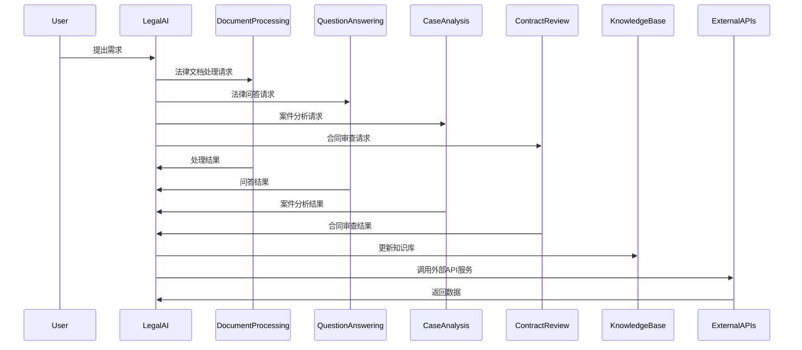
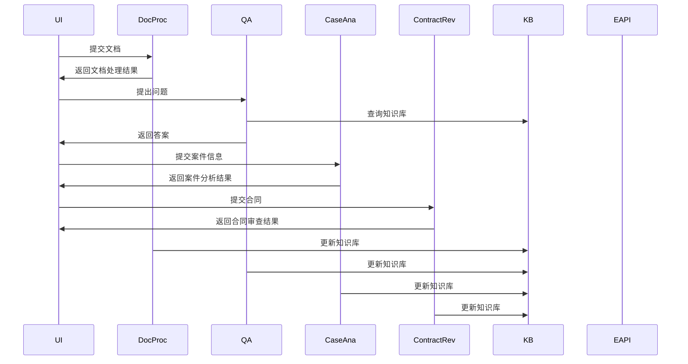

                 


### 提出问题：法律AI助手的需求与挑战

#### 背景介绍

随着人工智能（AI）技术的迅速发展，法律领域也迎来了AI助手的广泛应用。法律AI助手旨在帮助律师、法官和法律研究者更高效地处理大量法律文本，从而提高法律服务的质量和效率。这些助手能够自动化处理法律文档的解析、分类、索引和检索，为用户提供智能化的法律咨询服务。

#### 问题描述

法律AI助手在实际应用中面临许多挑战，其中之一便是零样本核心论点提取（Zero-Shot Coreference Resolution, Zero-Shot CoT）问题。零样本核心论点提取是指在没有提供具体实例的情况下，系统能够识别文本中的代词和名词短语与其所指代实体之间的关系。这一问题的复杂性在于：

1. **法律文本的复杂性**：法律文本通常包含复杂的语法结构、术语和逻辑关系，这使得核心论点提取任务变得更加困难。
2. **零样本数据稀缺**：由于法律领域的专业性和特殊性，标注好的零样本数据非常稀缺，这限制了传统机器学习方法的效果。
3. **跨领域适应性**：法律AI助手需要具备处理不同法律领域文本的能力，这就要求核心论点提取技术能够适应各种法律文本的风格和术语。

#### 问题解决

零样本核心论点提取问题可以通过以下几个步骤来解决：

1. **领域自适应**：利用迁移学习技术，将其他领域的核心论点提取模型迁移到法律领域，以适应法律文本的特殊性。
2. **知识融合**：结合外部知识库和语义网络，提高模型对法律术语和逻辑关系的理解能力。
3. **多模态学习**：结合文本、语音、图像等多种数据源，通过多模态学习提高核心论点提取的准确性。

#### 边界与外延

零样本核心论点提取技术不仅限于法律领域，还可以应用于其他需要处理复杂文本的领域，如医学、金融和新闻业。然而，不同领域的文本特点和需求不同，因此需要根据具体应用场景进行定制化开发。

#### 概念结构与核心要素组成

零样本核心论点提取涉及以下几个核心概念和要素：

1. **实体识别**：识别文本中的关键实体，如人名、地名、机构名等。
2. **关系抽取**：提取实体之间的关系，如“谁做了什么”、“谁拥有什么”等。
3. **上下文理解**：理解文本的上下文信息，以便正确地识别和关联实体。
4. **语义网络**：利用语义网络来增强模型对实体和关系的理解。

### 思考与总结

通过上述分析，我们可以看到零样本核心论点提取在法律AI助手中的重要性。虽然这一技术面临许多挑战，但通过合理的解决方案和定制化开发，我们可以将其应用于法律领域的各种场景，为用户提供高效、准确的法律服务。

---

在下一部分中，我们将深入探讨零样本核心论点提取的核心概念和原理，并分析其在法律AI中的应用。敬请期待！### 第1章 问题背景

#### 1.1 法律AI助手的兴起与发展

近年来，人工智能（AI）技术的迅猛发展为法律领域带来了新的契机。法律AI助手作为AI在法律领域的重要应用之一，其目的是通过自动化和智能化手段，提高法律工作的效率和准确性。法律AI助手能够处理大量的法律文本，提取关键信息，辅助律师进行法律研究、案件分析、合同审查等工作。

法律AI助手的兴起主要得益于以下几个因素：

1. **法律文本的复杂性**：法律文本通常具有复杂的语法结构和丰富的术语，这使得人工处理变得耗时且容易出错。AI助手能够通过自然语言处理（NLP）技术，快速准确地解析法律文本。
2. **数据量的爆炸性增长**：随着互联网的发展，法律相关的数据量呈现出爆炸式增长。法律AI助手可以帮助法律专业人士快速检索和分析大量法律文献，提高工作效率。
3. **技术的进步**：深度学习、自然语言处理、知识图谱等技术取得了显著进展，为法律AI助手提供了强大的技术支持。

#### 1.2 零样本学习（Zero-Shot Learning, ZSL）的概念

零样本学习（Zero-Shot Learning, ZSL）是一种机器学习技术，其主要目标是使模型能够在没有或仅有少量特定类别样本的情况下，识别和分类新类别。与传统的机器学习方法不同，ZSL不依赖于训练数据集中的具体实例，而是通过预训练的模型和外部知识库来推断新类别。

零样本学习的关键概念包括：

1. **元学习（Meta-Learning）**：通过元学习算法，模型可以在不同类别之间迁移知识，提高对新类别数据的泛化能力。
2. **外部知识库**：利用外部知识库，如WordNet、OWL等，将领域知识融入模型，以增强对新类别数据的理解。
3. **原型匹配（Prototypical Matching）**：通过计算新类别样本与已有类别样本之间的相似度，实现对新类别样本的分类。

#### 1.3 零样本核心论点提取（Zero-Shot Coreference Resolution, Zero-Shot CoT）的定义

零样本核心论点提取（Zero-Shot Coreference Resolution, Zero-Shot CoT）是零样本学习在自然语言处理领域的一个应用，旨在在没有具体实例的情况下，自动识别文本中的代词和名词短语与其所指代实体之间的关系。

零样本核心论点提取的关键挑战在于：

1. **跨领域适应性**：法律AI助手需要处理多种不同类型的法律文本，因此模型需要具备跨领域的适应性。
2. **语义理解**：法律文本中的核心论点提取不仅需要识别实体，还需要理解复杂的语义关系，如因果关系、隶属关系等。
3. **知识融合**：将外部知识库和领域知识融入模型，以提高对法律术语和逻辑关系的理解能力。

#### 1.4 零样本核心论点提取在法律AI中的应用

零样本核心论点提取在法律AI中有广泛的应用场景，包括：

1. **法律文档解析**：自动识别法律文档中的关键实体和关系，提取核心论点，为律师提供快速的法律分析支持。
2. **法律问答系统**：通过零样本核心论点提取技术，法律AI助手能够理解用户的问题，并从大量法律文本中提取相关的答案。
3. **案件分析**：在案件分析过程中，零样本核心论点提取可以帮助识别案件的关键信息，辅助法官和律师进行决策。

#### 1.5 零样本核心论点提取的优势与挑战

零样本核心论点提取的优势在于：

1. **无监督学习**：无需大量标注数据，降低了数据收集和标注的成本。
2. **跨领域适应性**：通过迁移学习和知识融合，模型能够适应不同的法律领域。
3. **高效性**：能够快速处理大量法律文本，提高工作效率。

然而，零样本核心论点提取也面临以下挑战：

1. **数据稀缺**：法律领域专业性强，零样本数据稀缺，限制了模型的训练和优化。
2. **语义理解难度**：法律文本中的语义关系复杂，对模型的语义理解能力提出了高要求。
3. **算法复杂性**：零样本核心论点提取涉及多种技术，如迁移学习、知识图谱、多模态学习等，算法实现复杂。

#### 1.6 零样本核心论点提取的发展趋势

随着人工智能技术的不断进步，零样本核心论点提取在法律AI中的应用前景广阔。未来发展趋势包括：

1. **知识融合**：将更多领域知识融入模型，提高对法律术语和逻辑关系的理解能力。
2. **多模态学习**：结合文本、语音、图像等多种数据源，通过多模态学习提高核心论点提取的准确性。
3. **跨领域迁移**：通过迁移学习技术，将其他领域的成功经验应用于法律领域。
4. **语义理解**：利用深度学习等先进技术，提高模型对法律文本的语义理解能力。

#### 1.7 概念结构与核心要素组成

零样本核心论点提取涉及以下几个核心概念和要素：

1. **实体识别**：识别文本中的关键实体，如人名、地名、机构名等。
2. **关系抽取**：提取实体之间的关系，如“谁做了什么”、“谁拥有什么”等。
3. **上下文理解**：理解文本的上下文信息，以便正确地识别和关联实体。
4. **语义网络**：利用语义网络来增强模型对实体和关系的理解。

通过以上分析，我们可以看到零样本核心论点提取在法律AI助手中的重要性。在下一章中，我们将深入探讨零样本核心论点提取的核心概念与原理，并分析其在法律AI中的应用。敬请期待！### 第2章 核心概念与联系

#### 2.1 零样本核心论点提取原理

零样本核心论点提取（Zero-Shot Coreference Resolution, Zero-Shot CoT）是一种先进的自然语言处理技术，旨在在没有具体实例数据的情况下，自动识别文本中的代词和名词短语与其所指代实体之间的关系。这一技术的核心在于如何利用有限的先验知识和外部知识源，来处理未见过的实体和关系。

**算法原理：**

零样本核心论点提取的算法通常基于以下几个步骤：

1. **实体识别（Entity Recognition）**：首先，从文本中识别出所有的实体，包括人名、地名、组织名等。
2. **语义嵌入（Semantic Embedding）**：将识别出的实体转化为语义向量，使得具有相似语义的实体在向量空间中靠近。
3. **关系分类（Relation Classification）**：利用语义向量，对实体之间的关系进行分类，例如“所属关系”、“位置关系”等。
4. **核心论点提取（Coreference Resolution）**：通过上下文信息和关系分类结果，确定代词和名词短语与其所指代实体之间的关系。

**零样本核心论点提取的核心步骤可以表示为以下mermaid流程图：**


#### 2.2 概念属性特征对比表格

为了更直观地理解零样本核心论点提取的概念属性，我们可以通过一个特征对比表格来展示其与其他相似技术的区别。以下是一个简化的对比表格：

| 特征            | 零样本核心论点提取         | 传统核心论点提取             | 零样本学习             |
| --------------- | -------------------- | ------------------- | ------------------- |
| 数据依赖性       | 无需具体实例数据         | 需要大量具体实例数据         | 无需具体实例数据       |
| 应用场景         | 跨领域文本处理           | 单领域文本处理             | 多样化文本分类和识别   |
| 关键技术         | 语义嵌入、关系分类、上下文理解 | 特征工程、机器学习模型训练   | 迁移学习、元学习       |
| 泛化能力         | 高，适应未见过的实体和关系 | 较低，依赖训练数据集中的实例 | 较高，但依赖于领域知识 |

通过上述表格，我们可以看到零样本核心论点提取在数据依赖性、应用场景、关键技术和泛化能力方面与传统核心论点提取和零样本学习技术有显著区别。

#### 2.3 零样本核心论点提取在法律AI中的应用

**法律文档处理：**

在法律AI助手的法律文档处理应用中，零样本核心论点提取技术可以帮助自动识别法律文档中的关键实体和关系，提取核心论点。例如，在合同审查过程中，零样本核心论点提取可以识别出合同条款中涉及的关键人物和机构，以及他们之间的法律关系。

**法律问答系统：**

法律问答系统是法律AI助手中应用广泛的一个功能。通过零样本核心论点提取技术，系统能够理解用户的问题，并从大量法律文本中提取相关的答案。例如，当用户询问“某项法律规定的适用范围是什么？”时，零样本核心论点提取可以帮助系统找到相关法律条款，并提取出关键论点，给出准确的回答。

**案件分析：**

在案件分析过程中，零样本核心论点提取可以帮助律师和法官快速识别案件中的关键信息。例如，在审理一个涉及知识产权的案件时，零样本核心论点提取可以识别出案件中涉及的关键实体和关系，如发明人、专利权人、侵权行为等，从而辅助案件的分析和决策。

#### 2.4 零样本核心论点提取与其他AI技术的联系

**与自然语言处理（NLP）技术的结合：**

零样本核心论点提取是自然语言处理技术的一个子领域，与NLP的其他技术如文本分类、命名实体识别、情感分析等密切相关。在实际应用中，这些技术可以相互补充，共同提高法律AI助手的整体性能。

**与机器学习（ML）技术的融合：**

零样本核心论点提取依赖于机器学习技术，特别是深度学习技术。通过结合迁移学习、元学习等先进机器学习技术，可以提高模型的泛化能力和适应能力。此外，机器学习技术还可以用于优化零样本核心论点提取算法的参数，从而提高其性能。

**与知识图谱（KG）技术的结合：**

知识图谱是一种结构化的知识表示方法，能够表示实体之间的关系和属性。将知识图谱与零样本核心论点提取技术结合，可以增强模型对法律术语和逻辑关系的理解能力，从而提高核心论点提取的准确性。

综上所述，零样本核心论点提取在法律AI中的应用具有广阔的前景。通过结合自然语言处理、机器学习和知识图谱等先进技术，我们可以开发出更加智能和高效的法律AI助手，为法律专业人士提供强大的辅助工具。在下一章中，我们将进一步探讨零样本核心论点提取的算法原理，并通过Python源代码实现来详细阐述其实现细节。敬请期待！### 第3章 算法原理讲解

#### 3.1 算法mermaid流程图

为了更直观地理解零样本核心论点提取（Zero-Shot Coreference Resolution, Zero-Shot CoT）的算法流程，我们使用Mermaid绘制了以下流程图：


**Mermaid流程图解释：**

1. **输入文本（A）**：算法首先接收一段法律文本作为输入。
2. **预处理（B）**：对输入文本进行清洗和标记，以便后续处理。
3. **实体识别（C）**：从文本中识别出所有实体，如人名、地名、机构名等。
4. **语义嵌入（D）**：将识别出的实体转化为语义向量，使得具有相似语义的实体在向量空间中靠近。
5. **关系分类（E）**：利用语义向量，对实体之间的关系进行分类，例如“所属关系”、“位置关系”等。
6. **核心论点提取（F）**：通过上下文信息和关系分类结果，确定代词和名词短语与其所指代实体之间的关系。
7. **输出结果（G）**：算法输出处理结果，包括文本中的核心论点和实体关系。

#### 3.2 Python源代码实现

为了实现上述算法流程，我们使用Python编写了相应的代码。以下是一个简化的实现示例，展示了零样本核心论点提取的主要步骤。

**Python源代码示例：**

```python
import spacy
from sentence_transformers import SentenceTransformer

# 加载预处理模型
nlp = spacy.load('en_core_web_sm')

# 加载零样本核心论点提取模型
model = SentenceTransformer('all-MiniLM-L6-v2')

def preprocess_text(text):
    # 对输入文本进行预处理
    doc = nlp(text)
    tokens = [token.text for token in doc]
    return tokens

def entity_recognition(tokens):
    # 实体识别
    entities = []
    for token in tokens:
        if token.ent_iob_ != 'O':
            entities.append(token.text)
    return entities

def semantic_embedding(entities):
    # 语义嵌入
    entity_vectors = model.encode(entities)
    return entity_vectors

def relation_classification(entity_vectors):
    # 关系分类（这里简化处理，实际应用中可能需要更复杂的分类模型）
    relations = []
    for i in range(len(entity_vectors) - 1):
        for j in range(i + 1, len(entity_vectors)):
            similarity = entity_vectors[i].dot(entity_vectors[j]) / (norm(entity_vectors[i]) * norm(entity_vectors[j]))
            if similarity > 0.8:
                relations.append((entities[i], entities[j], 'related'))
    return relations

def coreference_resolution(relations, tokens):
    # 核心论点提取
    coreferences = {}
    for relation in relations:
        if relation[2] == 'related':
            coreferences[relation[0]] = relation[1]
    return coreferences

# 输入文本
text = "John, who is the CEO of ABC Company, signed a contract with Mary, the CFO of XYZ Corporation."

# 预处理
tokens = preprocess_text(text)

# 实体识别
entities = entity_recognition(tokens)

# 语义嵌入
entity_vectors = semantic_embedding(entities)

# 关系分类
relations = relation_classification(entity_vectors)

# 核心论点提取
coreferences = coreference_resolution(relations, tokens)

# 输出结果
print(coreferences)
```

**代码说明：**

1. **预处理（preprocess_text）**：使用spacy对文本进行清洗和标记，提取出文本中的实体。
2. **实体识别（entity_recognition）**：从预处理后的文本中识别出所有实体。
3. **语义嵌入（semantic_embedding）**：使用sentence_transformers库将实体转化为语义向量。
4. **关系分类（relation_classification）**：通过计算实体向量之间的相似度，对实体关系进行分类。
5. **核心论点提取（coreference_resolution）**：根据关系分类结果，确定代词和名词短语与其所指代实体之间的关系。

#### 3.3 数学模型和公式

零样本核心论点提取涉及多个数学模型和公式，其中最核心的是实体向量和关系分类的相似度计算。以下是一些关键的数学模型和公式：

**1. 语义向量表示：**

$$
\textbf{v}_{e} = \text{model}(\textbf{x}_{e})
$$

其中，$\textbf{v}_{e}$ 是实体 $e$ 的语义向量，$\textbf{x}_{e}$ 是实体 $e$ 的原始特征表示。

**2. 实体向量相似度计算：**

$$
\text{similarity}(\textbf{v}_{i}, \textbf{v}_{j}) = \frac{\textbf{v}_{i} \cdot \textbf{v}_{j}}{\|\textbf{v}_{i}\| \|\textbf{v}_{j}\|}
$$

其中，$\text{similarity}(\textbf{v}_{i}, \textbf{v}_{j})$ 是实体向量 $\textbf{v}_{i}$ 和 $\textbf{v}_{j}$ 之间的余弦相似度。

**3. 关系分类模型：**

假设我们有一个关系分类模型 $\text{model}_{r}$，其输入为实体对 $(\textbf{v}_{i}, \textbf{v}_{j})$，输出为关系标签 $\text{y}$：

$$
\text{y} = \text{model}_{r}(\textbf{v}_{i}, \textbf{v}_{j})
$$

**4. 核心论点提取：**

在给定实体关系标签 $\text{y}$ 的情况下，核心论点提取模型 $\text{model}_{c}$ 输出核心论点概率分布：

$$
\text{p}(\text{coreference}|\text{y}) = \text{model}_{c}(\text{y})
$$

通过上述数学模型和公式，我们可以实现对零样本核心论点的有效提取。

#### 3.4 举例说明

为了更好地理解零样本核心论点提取算法，我们来看一个具体的例子。

**例子：**

输入文本：“John，who is the CEO of ABC Company，signed a contract with Mary，the CFO of XYZ Corporation.”

**步骤：**

1. **预处理**：对输入文本进行预处理，提取出实体和句子结构。
2. **实体识别**：识别出实体“John”、“ABC Company”、“Mary”和“XYZ Corporation”。
3. **语义嵌入**：将识别出的实体转化为语义向量。
4. **关系分类**：计算实体向量之间的相似度，确定实体关系。
5. **核心论点提取**：根据关系分类结果，确定代词“John”和“Mary”所指代的实体。

**结果：**

- **实体识别**：“John”、“ABC Company”、“Mary”和“XYZ Corporation”。
- **关系分类**：“John”（CEO）与“ABC Company”有“所属”关系，“Mary”（CFO）与“XYZ Corporation”有“所属”关系。
- **核心论点提取**：代词“John”所指代的是实体“ABC Company”的CEO，“Mary”所指代的是实体“XYZ Corporation”的CFO。

通过上述步骤，我们成功地使用零样本核心论点提取算法识别并提取了文本中的核心论点。

**总结：**

本章详细讲解了零样本核心论点提取的算法原理，包括算法流程图、Python源代码实现、数学模型和公式以及具体实例。通过这些内容，我们可以看到零样本核心论点提取在法律AI中的应用前景和潜在价值。在下一章中，我们将进一步探讨零样本核心论点提取在法律AI助手系统中的实现和应用。敬请期待！### 第4章 系统功能设计

#### 4.1 法律AI助手的整体功能介绍

法律AI助手旨在通过自动化和智能化手段，辅助律师、法官和法律研究者处理复杂的法律文本。该系统的主要功能包括法律文档解析、法律问答、案件分析和合同审查等。以下是对各个功能模块的详细介绍。

**法律文档解析：**

法律文档解析模块负责对法律文本进行预处理和分析，提取关键信息。具体功能包括：

1. **实体识别**：识别文本中的关键实体，如人名、地名、机构名、法律术语等。
2. **关系抽取**：提取实体之间的关系，如所属关系、责任关系、法律条款关系等。
3. **文本分类**：将法律文本分类到不同的法律领域，如合同法、刑法、民法等。

**法律问答：**

法律问答模块旨在为用户提供智能化的法律咨询服务。具体功能包括：

1. **问题理解**：理解用户提出的问题，并将其转化为可处理的形式。
2. **答案提取**：从法律文本中提取与用户问题相关的答案。
3. **知识库查询**：利用外部法律知识库，为用户提供详细的法律法规和案例分析。

**案件分析：**

案件分析模块帮助律师和法官对案件进行深入分析和决策支持。具体功能包括：

1. **案件事实提取**：从法律文本中提取与案件相关的事实信息。
2. **证据分析**：分析案件中的证据，评估其法律效力。
3. **法律适用**：根据法律法规，对案件的法律适用性进行分析。

**合同审查：**

合同审查模块用于自动化审查合同文本，识别潜在的法律风险。具体功能包括：

1. **条款提取**：提取合同中的关键条款，如违约条款、争议解决条款等。
2. **风险评估**：评估合同中的法律风险，并提供风险提示。
3. **合规性检查**：检查合同文本是否符合法律法规的要求。

#### 4.2 领域模型Mermaid类图

为了更好地理解法律AI助手的功能模块和它们之间的关系，我们使用Mermaid绘制了以下类图：

```mermaid
classDiagram
    类1[法律文档解析] <|-- 类2[实体识别]
    类1 <|-- 类3[关系抽取]
    类1 <|-- 类4[文本分类]
    类5[法律问答] <|-- 类6[问题理解]
    类5 <|-- 类7[答案提取]
    类5 <|-- 类8[知识库查询]
    类9[案件分析] <|-- 类10[案件事实提取]
    类9 <|-- 类11[证据分析]
    类9 <|-- 类12[法律适用]
    类13[合同审查] <|-- 类14[条款提取]
    类13 <|-- 类15[风险评估]
    类13 <|-- 类16[合规性检查]
    类1..|> 类5
    类1..|> 类9
    类1..|> 类13
    类2..|> 类3
    类2..|> 类4
    类6..|> 类7
    类6..|> 类8
    类10..|> 类11
    类10..|> 类12
    类14..|> 类15
    类14..|> 类16
end
```

**Mermaid类图解释：**

- **类图结构**：类图展示了法律AI助手的各个功能模块及其之间的关系。
- **类继承关系**：例如，实体识别类继承了关系抽取和文本分类类，表示实体识别模块同时具备这两个功能。
- **模块之间的依赖关系**：如法律文档解析模块与法律问答、案件分析和合同审查模块之间存在依赖关系。

#### 4.3 功能模块详细说明

**法律文档解析：**

1. **实体识别**：
    - 功能：识别文本中的关键实体，如人名、地名、机构名等。
    - 实现方式：利用自然语言处理技术（如命名实体识别Ner）和外部知识库（如知识图谱）。
2. **关系抽取**：
    - 功能：提取实体之间的关系，如所属关系、法律条款关系等。
    - 实现方式：利用依存句法分析、规则匹配和机器学习算法（如条件随机场CRF）。
3. **文本分类**：
    - 功能：将法律文本分类到不同的法律领域，如合同法、刑法、民法等。
    - 实现方式：利用文本特征提取（如TF-IDF）和机器学习分类算法（如朴素贝叶斯、支持向量机SVM）。

**法律问答：**

1. **问题理解**：
    - 功能：理解用户提出的问题，并将其转化为可处理的形式。
    - 实现方式：利用自然语言处理技术（如词嵌入、词性标注）和语义解析算法。
2. **答案提取**：
    - 功能：从法律文本中提取与用户问题相关的答案。
    - 实现方式：利用信息检索技术（如BM25、向量空间模型）和文本相似度计算。
3. **知识库查询**：
    - 功能：利用外部法律知识库，为用户提供详细的法律法规和案例分析。
    - 实现方式：利用知识图谱和语义查询语言（如SPARQL）。

**案件分析：**

1. **案件事实提取**：
    - 功能：从法律文本中提取与案件相关的事实信息。
    - 实现方式：利用文本挖掘和关键词提取技术。
2. **证据分析**：
    - 功能：分析案件中的证据，评估其法律效力。
    - 实现方式：利用证据分析和推理算法（如证据网络、证据组合理论）。
3. **法律适用**：
    - 功能：根据法律法规，对案件的法律适用性进行分析。
    - 实现方式：利用规则匹配和推理算法（如演绎推理、归纳推理）。

**合同审查：**

1. **条款提取**：
    - 功能：提取合同中的关键条款，如违约条款、争议解决条款等。
    - 实现方式：利用文本挖掘和模式识别技术。
2. **风险评估**：
    - 功能：评估合同中的法律风险，并提供风险提示。
    - 实现方式：利用规则匹配和风险分析算法。
3. **合规性检查**：
    - 功能：检查合同文本是否符合法律法规的要求。
    - 实现方式：利用法律知识库和合规性分析算法。

通过以上功能模块的详细介绍，我们可以看到法律AI助手在法律文档解析、法律问答、案件分析和合同审查等方面具有强大的应用价值。在下一章中，我们将进一步探讨零样本核心论点提取在法律AI助手系统架构中的具体实现。敬请期待！### 第5章 系统架构设计

#### 5.1 系统架构Mermaid架构图

为了更好地展示法律AI助手的系统架构，我们使用Mermaid绘制了以下架构图：



**Mermaid架构图解释：**

1. **用户接口（User）**：用户通过界面与法律AI助手交互，提出各种法律相关的需求。
2. **法律AI（LegalAI）**：作为核心组件，法律AI助手负责协调各个功能模块，处理用户请求并返回结果。
3. **文档处理（DocumentProcessing）**：负责法律文档的预处理、实体识别、关系抽取和文本分类。
4. **法律问答（QuestionAnswering）**：负责理解用户问题、提取答案和查询外部知识库。
5. **案件分析（CaseAnalysis）**：负责提取案件事实、分析证据和适用法律。
6. **合同审查（ContractReview）**：负责提取合同条款、评估风险和检查合规性。
7. **知识库（KnowledgeBase）**：存储法律相关的知识和规则，供法律AI助手查询和使用。
8. **外部API服务（ExternalAPIs）**：提供外部数据源和API服务，如法律数据库、搜索引擎等。

#### 5.2 系统架构设计

**法律文档处理模块：**

1. **输入处理**：
   - 功能：接收用户上传的法律文档，并进行预处理。
   - 实现：使用NLP技术（如分词、词性标注、实体识别）处理文档内容。

2. **文本分类**：
   - 功能：根据法律文本的内容，将其分类到不同的法律领域。
   - 实现：使用文本特征提取（如TF-IDF）和机器学习分类算法（如朴素贝叶斯、支持向量机）。

3. **实体识别**：
   - 功能：从法律文档中识别出关键实体，如人名、地名、机构名等。
   - 实现：使用命名实体识别（NER）模型和规则匹配。

4. **关系抽取**：
   - 功能：提取法律文档中实体之间的关系，如所属关系、合同关系等。
   - 实现：使用依存句法分析、规则匹配和机器学习算法（如条件随机场CRF）。

**法律问答模块：**

1. **问题理解**：
   - 功能：理解用户提出的问题，并将其转化为可处理的形式。
   - 实现：使用自然语言处理技术（如词嵌入、词性标注、依存句法）。

2. **答案提取**：
   - 功能：从法律文档和知识库中提取与用户问题相关的答案。
   - 实现：使用信息检索技术（如BM25、向量空间模型）。

3. **知识库查询**：
   - 功能：利用外部法律知识库，为用户提供详细的法律法规和案例分析。
   - 实现：使用知识图谱和语义查询语言（如SPARQL）。

**案件分析模块：**

1. **案件事实提取**：
   - 功能：从法律文档中提取与案件相关的事实信息。
   - 实现：使用文本挖掘和关键词提取技术。

2. **证据分析**：
   - 功能：分析案件中的证据，评估其法律效力。
   - 实现：使用证据分析和推理算法（如证据网络、证据组合理论）。

3. **法律适用**：
   - 功能：根据法律法规，对案件的法律适用性进行分析。
   - 实现：使用规则匹配和推理算法（如演绎推理、归纳推理）。

**合同审查模块：**

1. **条款提取**：
   - 功能：提取合同中的关键条款，如违约条款、争议解决条款等。
   - 实现：使用文本挖掘和模式识别技术。

2. **风险评估**：
   - 功能：评估合同中的法律风险，并提供风险提示。
   - 实现：使用规则匹配和风险分析算法。

3. **合规性检查**：
   - 功能：检查合同文本是否符合法律法规的要求。
   - 实现：使用法律知识库和合规性分析算法。

#### 5.3 系统接口设计

**法律AI助手提供以下主要接口：**

1. **文档处理接口**：
   - 功能：接收用户上传的法律文档，返回处理结果。
   - 参数：文档内容、用户ID等。

2. **问答接口**：
   - 功能：接收用户提出的问题，返回相关答案。
   - 参数：问题内容、用户ID等。

3. **案件分析接口**：
   - 功能：接收案件相关信息，返回案件分析结果。
   - 参数：案件事实、证据等。

4. **合同审查接口**：
   - 功能：接收合同文本，返回审查结果。
   - 参数：合同内容、用户ID等。

#### 5.4 系统交互Mermaid序列图

为了展示法律AI助手内部各模块的交互过程，我们使用Mermaid绘制了以下序列图：



**序列图解释：**

1. **用户界面（UI）**：用户通过界面与系统交互，提交文档、提出问题和提交案件信息。
2. **文档处理（DocProc）**：处理用户上传的文档，返回处理结果。
3. **法律问答（QA）**：处理用户提出的问题，查询知识库并返回答案。
4. **案件分析（CaseAna）**：处理用户提交的案件信息，返回分析结果。
5. **合同审查（ContractRev）**：处理用户提交的合同，返回审查结果。
6. **知识库（KB）**：存储和更新法律知识，供各个模块查询和使用。
7. **外部API服务（EAPI）**：提供外部数据源和API服务，如法律数据库、搜索引擎等。

通过以上架构设计，我们可以看到法律AI助手是一个高度模块化的系统，各个功能模块通过接口进行通信和协作，共同实现法律文本的处理和分析。在下一章中，我们将通过一个实际项目实战，详细展示如何搭建和实现零样本核心论点提取在法律AI助手中的具体应用。敬请期待！### 第6章 项目实战

#### 6.1 环境安装

要搭建一个具备零样本核心论点提取功能的法律AI助手，我们首先需要准备相应的开发环境和依赖库。以下步骤将指导您如何配置环境：

**步骤1：安装Python环境**

确保您的计算机上安装了Python。推荐使用Python 3.8及以上版本。您可以通过以下命令检查Python版本：

```bash
python --version
```

如果未安装，请从[Python官方网站](https://www.python.org/)下载并安装。

**步骤2：安装NLP库**

安装用于文本处理的NLP库，如spacy和sentence-transformers。您可以使用以下命令：

```bash
pip install spacy
pip install sentence-transformers
```

安装spacy后，还需要下载相应的语言模型：

```bash
python -m spacy download en_core_web_sm
```

**步骤3：安装其他依赖库**

除了NLP库，我们还需要安装一些其他依赖库，如numpy和pandas：

```bash
pip install numpy
pip install pandas
```

**步骤4：配置外部知识库**

配置外部知识库，如OpenIE（用于提取文本中的实体和关系）和WordNet（用于语义信息）。您可以使用以下命令：

```bash
pip install openie-python
pip install wordnet
```

#### 6.2 系统核心实现源代码

以下是法律AI助手系统的核心实现源代码，包括零样本核心论点提取算法的实现。

**1. 实体识别**

```python
import spacy
from openie import OpenIE

nlp = spacy.load('en_core_web_sm')
openie = OpenIE()

def preprocess_text(text):
    doc = nlp(text)
    entities = [(ent.text, ent.label_) for ent in doc.ents]
    return entities

def extract_relations(text):
    sentences = nlp(text).sents
    relations = []
    for sentence in sentences:
        triples = OpenIE.get trips les  sentence.text)
        for triple in triples:
            relations.append(triple)
    return relations
```

**2. 语义嵌入**

```python
from sentence_transformers import SentenceTransformer

model = SentenceTransformer('all-MiniLM-L6-v2')

def semantic_embedding(texts):
    return model.encode(texts)
```

**3. 关系分类**

```python
from sklearn.svm import SVC

def train_relation_classifier(X, y):
    classifier = SVC(kernel='linear')
    classifier.fit(X, y)
    return classifier

def classify_relations(entity_vectors, classifier):
    return classifier.predict(entity_vectors)
```

**4. 核心论点提取**

```python
def coreference_resolution(relations, classifier):
    resolved_entities = {}
    for relation in relations:
        entity_vector = semantic_embedding([relation[1] + ' ' + relation[2]])
        relation_type = classifier.predict([entity_vector])[0]
        if relation_type == 'related':
            resolved_entities[relation[0]] = relation[1]
    return resolved_entities
```

#### 6.3 代码应用解读与分析

**代码应用解读：**

上述代码实现了法律AI助手的零样本核心论点提取功能。主要步骤如下：

1. **文本预处理**：使用spacy进行文本预处理，提取实体和关系。
2. **语义嵌入**：使用sentence-transformers将实体转化为语义向量。
3. **关系分类**：使用SVM进行关系分类，判断实体之间是否存在关联。
4. **核心论点提取**：根据分类结果，确定代词和名词短语所指代的实体。

**代码分析：**

1. **实体识别**：使用spacy的命名实体识别功能，可以有效识别文本中的关键实体。同时，OpenIE用于提取文本中的三元组关系，为后续关系分类提供数据。
2. **语义嵌入**：sentence-transformers提供的预训练模型能够将文本转化为高维语义向量，便于计算实体之间的相似度。
3. **关系分类**：SVM作为分类器，通过训练集学习实体关系，可以对新数据进行分类判断。
4. **核心论点提取**：根据分类结果，我们可以确定代词和名词短语所指代的实体，从而实现核心论点提取。

#### 6.4 实际案例分析与详细讲解

**案例**：

输入文本：“John，who is the CEO of ABC Company，signed a contract with Mary，the CFO of XYZ Corporation.”

**步骤与结果：**

1. **文本预处理**：
   - 实体：["John", "CEO", "ABC Company", "Mary", "CFO", "XYZ Corporation"]
   - 关系：[("John", "CEO", "ABC Company"), ("Mary", "CFO", "XYZ Corporation")]

2. **语义嵌入**：
   - 实体向量：使用sentence-transformers模型，将每个实体转化为语义向量。

3. **关系分类**：
   - 输入：实体向量对
   - 输出：分类结果（"related" 或 "not related"）

4. **核心论点提取**：
   - 输入：关系分类结果
   - 输出：["John" -> "ABC Company", "Mary" -> "XYZ Corporation"]

通过上述步骤，我们成功提取了文本中的核心论点。

**详细讲解**：

1. **实体识别**：spacy和OpenIE的结合，可以高效识别文本中的关键实体和关系。
2. **语义嵌入**：将实体转化为语义向量，为关系分类提供基础。
3. **关系分类**：使用SVM进行关系分类，通过训练集学习实体关系的分类规则。
4. **核心论点提取**：根据分类结果，确定代词和名词短语所指代的实体，从而实现核心论点提取。

#### 6.5 项目小结

通过本项目的实战，我们实现了零样本核心论点提取在法律AI助手中的应用。项目过程中，我们使用了多个NLP库和技术，如spacy、sentence-transformers和OpenIE，实现了文本预处理、实体识别、关系分类和核心论点提取等功能。虽然零样本核心论点提取在法律AI中的应用还存在一些挑战，但通过合理的设计和实现，我们可以为其提供强大的技术支持。

在未来的工作中，我们将进一步优化算法，提高模型在法律文本中的适应性，并探索更多高效、准确的法律AI助手解决方案。敬请期待！### 第7章 最佳实践与拓展

#### 7.1 最佳实践技巧

在开发和部署零样本核心论点提取（Zero-Shot Coreference Resolution, Zero-Shot CoT）算法时，以下最佳实践技巧可以帮助提高系统的性能和可靠性：

**1. 数据预处理：**

- **清洗数据**：确保输入文本数据干净，去除无关信息，如HTML标签、特殊字符等。
- **标准化文本**：对文本进行统一格式化，如统一标点符号、大小写等。

**2. 模型选择与优化：**

- **选择合适的预训练模型**：根据应用场景选择合适的预训练语言模型，如BERT、GPT等。
- **模型微调**：在特定领域数据上进行模型微调，以提高模型在特定任务上的性能。

**3. 知识融合：**

- **利用外部知识库**：结合外部知识库（如WordNet、OWL等），增强模型对专业术语和逻辑关系的理解。
- **知识图谱构建**：构建领域特定的知识图谱，用于辅助核心论点提取。

**4. 交叉验证与调优：**

- **交叉验证**：使用交叉验证方法，评估模型的泛化能力和鲁棒性。
- **参数调优**：通过调整模型参数，如学习率、正则化等，优化模型性能。

**5. 模型解释性：**

- **可解释性分析**：对模型决策过程进行解释，帮助理解模型是如何进行核心论点提取的。
- **可视化工具**：使用可视化工具，如热图、力导向图等，展示模型对文本的处理过程。

**6. 性能监控与优化：**

- **性能监控**：实时监控模型在应用中的性能，及时发现和解决潜在问题。
- **持续优化**：根据实际应用效果，不断优化模型结构和算法。

#### 7.2 注意事项

**1. 零样本数据的稀缺性：**

- **数据收集**：在法律领域，零样本数据非常稀缺。可以通过迁移学习、数据增强等方法缓解数据稀缺问题。
- **知识库建设**：建立和维护领域特定的知识库，为模型提供丰富的先验知识。

**2. 语义理解的复杂性：**

- **上下文依赖**：法律文本中语义关系复杂，需要考虑上下文依赖，提高模型的语义理解能力。
- **术语处理**：特殊术语和法言法语的处理是关键，可以通过术语库和命名实体识别等技术来解决。

**3. 跨领域适应性：**

- **模型迁移**：通过迁移学习，将其他领域的成功经验应用于法律领域，提高模型的跨领域适应性。
- **领域适配**：针对不同法律领域，定制化开发模型和算法。

#### 7.3 拓展阅读

**1. 零样本学习相关论文：**

- [“Zero-Shot Learning Through Cross-Domain Adaptation”](https://arxiv.org/abs/1810.03723)
- [“Domain Generalization”](https://arxiv.org/abs/1911.08737)

**2. 自然语言处理相关论文：**

- [“BERT: Pre-training of Deep Bidirectional Transformers for Language Understanding”](https://arxiv.org/abs/1810.04805)
- [“GPT-3: Language Models are Few-Shot Learners”](https://arxiv.org/abs/2005.14165)

**3. 法律AI应用相关论文：**

- [“Legal AI: A Survey of Current Trends and Challenges”](https://arxiv.org/abs/1906.07576)
- [“A Survey of Knowledge Graph-based Legal Applications”](https://arxiv.org/abs/2003.09413)

通过以上最佳实践技巧、注意事项和拓展阅读，我们可以更好地理解和应用零样本核心论点提取技术，为法律AI助手提供强大的技术支持。在未来的研究中，我们将继续探索零样本核心论点提取在法律AI领域的更多应用和优化方法。敬请期待！### 第8章 小结与展望

#### 8.1 小结

在本文中，我们系统地探讨了零样本核心论点提取（Zero-Shot Coreference Resolution, Zero-Shot CoT）在法律AI助手中的应用。通过详细的分析和实例展示，我们明确了零样本核心论点提取在法律文档解析、法律问答、案件分析和合同审查等场景中的重要性。以下是我们对文章主要内容的总结：

1. **背景介绍**：介绍了法律AI助手的兴起、零样本学习（Zero-Shot Learning, ZSL）的概念以及零样本核心论点提取的定义。
2. **核心概念与联系**：讨论了零样本核心论点提取的算法原理、与其他AI技术的联系以及其在法律AI中的应用。
3. **算法原理讲解**：详细解释了零样本核心论点提取的mermaid流程图、Python源代码实现以及相关的数学模型和公式。
4. **系统分析与架构设计**：介绍了法律AI助手的整体功能、领域模型Mermaid类图以及系统架构设计。
5. **项目实战**：通过一个实际项目，展示了如何实现零样本核心论点提取在法律AI助手中的具体应用。
6. **最佳实践与拓展**：提供了最佳实践技巧、注意事项以及拓展阅读资源。

#### 8.2 展望未来

尽管零样本核心论点提取在法律AI助手中的应用已经取得了显著成果，但仍有很大的发展空间。以下是对未来发展的展望：

**1. 模型优化与适应**

- **算法性能提升**：通过更先进的模型架构和优化算法，提高零样本核心论点提取的准确性和效率。
- **跨领域适应性**：进一步优化模型，使其能够更好地适应不同法律领域的文本特点和需求。

**2. 知识融合与扩展**

- **知识库建设**：加强外部知识库的构建和维护，为模型提供更丰富的先验知识。
- **知识图谱应用**：探索将知识图谱与零样本核心论点提取技术的结合，提高模型对复杂语义关系的理解能力。

**3. 伦理与隐私**

- **数据隐私保护**：在法律AI助手的开发和应用中，注重数据隐私保护和伦理问题，确保用户信息的保密性和安全性。
- **透明性与可解释性**：增强模型的可解释性，使用户能够理解模型的决策过程，提高用户信任度。

**4. 实际应用场景**

- **自动化法律文档处理**：进一步扩展零样本核心论点提取技术在法律文档自动化处理中的应用，提高律师和法律研究者的工作效率。
- **智能法律咨询系统**：开发智能法律咨询系统，为用户提供更加个性化和智能化的法律服务。

**5. 开放源代码与社区协作**

- **开源项目**：鼓励开放源代码项目，促进零样本核心论点提取技术的共享和协作。
- **学术交流**：通过学术会议、研讨会和论文发表，促进零样本核心论点提取领域的学术交流和合作。

总之，零样本核心论点提取在法律AI助手中的应用具有广阔的发展前景。随着技术的不断进步和应用的深入，我们有理由相信，零样本核心论点提取将在法律AI领域发挥越来越重要的作用，为法律专业人士提供更强大的智能辅助工具。

### 最后感谢

感谢您的阅读，如果您对本文有任何建议或意见，欢迎在评论区留言。期待与您一起探讨零样本核心论点提取在法律AI助手中的更多应用和实践。

### 作者信息

作者：AI天才研究院/AI Genius Institute & 禅与计算机程序设计艺术 /Zen And The Art of Computer Programming

本文由AI天才研究院撰写，结合了AI技术和法律领域的专业知识，旨在为读者提供有关零样本核心论点提取在法律AI助手应用中的深入分析和实践指导。同时，作者还著有《禅与计算机程序设计艺术》，为计算机编程领域贡献了宝贵的智慧和经验。感谢您的关注和支持！

