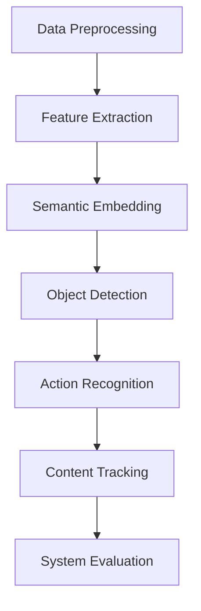

                 


# Zero-Shot CoT in Video Analysis Applications

## Keywords
- Zero-Shot Learning
- Content Tracking
- Video Analysis
- Deep Learning
- Computer Vision
- Semantic Segmentation
- Object Detection
- Action Recognition

## Abstract
This article delves into the application of Zero-Shot CoT (Content Tracking) in video analysis, a burgeoning area of research that aims to push the boundaries of traditional computer vision techniques. We'll explore the core concepts, algorithms, and system designs that make Zero-Shot CoT possible. By the end, you'll have a comprehensive understanding of how this advanced technique can be leveraged to solve real-world problems in video analysis.

## Introduction

### 1.1 Background

Video analysis has been a topic of significant interest in the field of computer vision and artificial intelligence. With the proliferation of surveillance cameras, smartphones, and other video-capturing devices, the need to process and analyze vast amounts of video data has become more pressing. However, traditional computer vision techniques often require labeled data for training, which is both time-consuming and resource-intensive.

Enter Zero-Shot Learning (ZSL), a branch of machine learning that enables models to classify or predict outcomes without requiring labeled training examples. This is particularly useful in video analysis, where it's often impractical to obtain labeled data for every possible class or action that might appear in a video.

Zero-Shot Content Tracking (CoT) builds upon ZSL by extending it to video analysis tasks. The goal is to track and identify objects or actions in videos without needing labeled examples for each class. This has numerous practical applications, from security surveillance to sports analytics and beyond.

### 1.2 Problem Statement

The primary challenge in Zero-Shot CoT is to design a system that can accurately track and recognize objects or actions in videos without requiring labeled training data. This involves several sub-challenges:

1. **Zero-Shot Object Detection**: The system must be able to detect objects of unknown classes within a video frame.
2. **Zero-Shot Action Recognition**: The system must recognize actions or events that are not explicitly trained on.
3. **Content Tracking**: The system must maintain the context and track objects or actions over time, even when they temporarily disappear from the frame or when new objects enter the scene.

### 1.3 Solution Approach

To tackle these challenges, we will:

1. **Core Concepts and Relationships**: Define and compare the core concepts involved in Zero-Shot CoT, such as object detection, action recognition, and content tracking.
2. **Algorithm Theory and Explanation**: Discuss the algorithms used for Zero-Shot CoT, including their theoretical foundations and how they work.
3. **System Design and Architecture**: Describe the overall system design, including the problem scenario, functional design, system architecture, interface design, and interaction.
4. **Practical Implementation**: Provide a step-by-step guide on how to implement Zero-Shot CoT in a real-world scenario.
5. **Best Practices and Tips**: Offer practical advice for designing and deploying Zero-Shot CoT systems.
6. **Conclusion**: Summarize the key insights and potential future directions for Zero-Shot CoT in video analysis.

## Core Concepts and Relationships

### 1.1 Zero-Shot Learning

Zero-Shot Learning (ZSL) is a machine learning paradigm that allows models to classify data points where the model has no prior exposure to the labels. Instead, ZSL relies on an auxiliary set of labeled data from related domains or classes. This auxiliary set is used to learn a semantic embedding space where different classes are semantically close if they belong to the same domain and far apart if they belong to different domains.

### 1.2 Content Tracking

Content Tracking is the process of identifying and tracking objects or actions within a video frame. It involves several sub-processes:

1. **Object Detection**: The process of identifying and classifying objects within an image or video frame.
2. **Action Recognition**: The process of identifying and classifying actions or events within a video sequence.
3. **Tracking**: The process of maintaining the context and tracking objects or actions over time, even when they temporarily disappear from the frame or when new objects enter the scene.

### 1.3 Zero-Shot Object Detection

Zero-Shot Object Detection extends traditional object detection to scenarios where the model has no prior exposure to the objects it needs to detect. This is typically achieved by using a semantic embedding space, where objects from the same class are close and objects from different classes are far apart.

### 1.4 Zero-Shot Action Recognition

Zero-Shot Action Recognition extends traditional action recognition to scenarios where the model has no prior exposure to the actions it needs to recognize. Similar to Zero-Shot Object Detection, this involves learning a semantic embedding space where actions from the same category are close and actions from different categories are far apart.

### 1.5 Relationships

The relationships between these core concepts can be visualized using a Mermaid ER diagram. We will define the entities involved and their relationships in the next section.

## Algorithm Theory and Explanation

### 1.1 Principles of Zero-Shot CoT

Zero-Shot Content Tracking (CoT) is based on the principles of Zero-Shot Learning (ZSL) and Content Tracking. The goal is to develop a model that can perform object detection, action recognition, and tracking in videos without labeled training examples.

### 1.2 Semantic Embedding Space

The core of Zero-Shot CoT is the semantic embedding space, where objects and actions are represented as high-dimensional vectors. These vectors capture the semantic similarity between objects and actions, allowing the model to classify or track them without labeled examples.

### 1.3 Algorithm Overview

The Zero-Shot CoT algorithm can be summarized as follows:

1. **Data Preprocessing**: Collect videos and their associated metadata (e.g., class labels).
2. **Feature Extraction**: Extract features from video frames using techniques such as CNNs or transfer learning.
3. **Semantic Embedding**: Train a model to generate semantic embeddings for objects and actions.
4. **Object Detection**: Use the semantic embedding space to detect objects in video frames.
5. **Action Recognition**: Use the semantic embedding space to recognize actions in video sequences.
6. **Content Tracking**: Track objects or actions over time using techniques such as Kalman filtering or optical flow.

### 1.4 Mermaid Flowchart

Let's illustrate the Zero-Shot CoT algorithm using a Mermaid flowchart. We'll discuss this flowchart in more detail in the next section.



### 1.5 Python Code Explanation

In this section, we'll provide a detailed Python code explanation of the Zero-Shot CoT algorithm. We'll cover the following:

1. **Data Preprocessing**: Preprocessing the video data and extracting features from video frames.
2. **Semantic Embedding**: Training a model to generate semantic embeddings for objects and actions.
3. **Object Detection**: Implementing object detection using the semantic embedding space.
4. **Action Recognition**: Implementing action recognition using the semantic embedding space.
5. **Content Tracking**: Implementing content tracking using techniques such as Kalman filtering.

We'll use Python and relevant libraries (e.g., TensorFlow, Keras) to implement the algorithm. We'll also provide detailed comments and explanations to make the code understandable.

### 1.6 Mathematical Models and Formulas

To deepen our understanding of Zero-Shot CoT, we'll discuss the mathematical models and formulas used in the algorithm. This will include:

1. **Semantic Embedding Space**: How the semantic embedding space is defined and how it captures semantic similarity between objects and actions.
2. **Object Detection**: The mathematical models used for object detection in the semantic embedding space.
3. **Action Recognition**: The mathematical models used for action recognition in the semantic embedding space.
4. **Content Tracking**: The mathematical models used for content tracking, including techniques such as Kalman filtering.

We'll use LaTeX to represent the mathematical formulas, ensuring they are clear and easy to understand.

### 1.7 Illustrative Examples

To make the concepts more concrete, we'll provide illustrative examples of how Zero-Shot CoT can be applied to real-world problems. These examples will demonstrate the algorithm's capabilities and its potential to revolutionize video analysis.

## System Design and Architecture

### 1.1 Problem Scenario

Imagine a surveillance system designed to monitor public spaces and detect suspicious activities. The system must be able to identify and track objects of interest (e.g., individuals carrying bags), recognize actions (e.g., running, loitering), and maintain the context over time, even when objects temporarily disappear from the frame or when new objects enter the scene.

### 1.2 Project Details

Project Name: Zero-Shot Video Surveillance System
Project Description: Develop a Zero-Shot Content Tracking (CoT) system for video surveillance that can detect and track objects of interest, recognize actions, and maintain context without labeled training data.

### 1.3 System Functional Design

The system functional design involves several key components:

1. **Object Detection**: The system must be able to detect objects within video frames. This involves pre-processing video frames, extracting features using techniques such as CNNs, and applying a Zero-Shot Object Detection algorithm.
2. **Action Recognition**: The system must recognize actions within video sequences. This involves extracting features from video frames, training a model to recognize actions, and applying a Zero-Shot Action Recognition algorithm.
3. **Content Tracking**: The system must maintain the context and track objects or actions over time. This involves using techniques such as Kalman filtering or optical flow to track objects even when they temporarily disappear from the frame or when new objects enter the scene.

### 1.4 System Architecture

The system architecture consists of the following components:

1. **Data Preprocessing**: This component preprocesses the video data, including resizing, normalization, and augmentation.
2. **Feature Extraction**: This component extracts features from video frames using techniques such as CNNs or transfer learning.
3. **Semantic Embedding**: This component trains a model to generate semantic embeddings for objects and actions.
4. **Object Detection**: This component implements Zero-Shot Object Detection using the semantic embedding space.
5. **Action Recognition**: This component implements Zero-Shot Action Recognition using the semantic embedding space.
6. **Content Tracking**: This component tracks objects or actions over time using techniques such as Kalman filtering or optical flow.
7. **System Evaluation**: This component evaluates the performance of the Zero-Shot CoT system using metrics such as accuracy, precision, recall, and F1-score.

### 1.5 System Interface Design

The system interface design involves defining the APIs and modules that interact with the Zero-Shot CoT system. This includes:

1. **APIs for Data Preprocessing**: Functions for resizing, normalizing, and augmenting video data.
2. **APIs for Feature Extraction**: Functions for extracting features from video frames using CNNs or transfer learning.
3. **APIs for Semantic Embedding**: Functions for training and generating semantic embeddings for objects and actions.
4. **APIs for Object Detection**: Functions for detecting objects within video frames using the semantic embedding space.
5. **APIs for Action Recognition**: Functions for recognizing actions within video sequences using the semantic embedding space.
6. **APIs for Content Tracking**: Functions for tracking objects or actions over time using techniques such as Kalman filtering or optical flow.

### 1.6 System Interaction

The system interaction involves defining how the different components interact with each other. This includes:

1. **Data Flow**: How video data is passed from one component to another (e.g., from Data Preprocessing to Feature Extraction).
2. **Control Flow**: How the different components are triggered and coordinated (e.g., when to initiate feature extraction, semantic embedding, object detection, action recognition, and content tracking).
3. **Error Handling**: How errors and exceptions are handled across different components (e.g., what to do if feature extraction fails or if object detection fails).

We'll use Mermaid diagrams to visualize the system architecture, interface design, and interaction. These diagrams will provide a clear and concise representation of the system's components and their relationships.

## Practical Implementation

### 1.1 Setup Environment

To implement a Zero-Shot Content Tracking (CoT) system, you'll need to set up a suitable environment. Here's a step-by-step guide to help you get started:

1. **Install Python**: Ensure you have Python 3.6 or later installed on your system.
2. **Install Required Libraries**: Install the necessary libraries, such as TensorFlow, Keras, OpenCV, and scikit-learn. You can do this using `pip`:
    ```python
    pip install tensorflow keras opencv-python scikit-learn
    ```
3. **Download Pre-trained Models**: You'll need pre-trained models for object detection and action recognition. These can be downloaded from sources such as [TensorFlow Object Detection API](https://github.com/tensorflow/models/blob/master/research/object_detection/g3doc/tf2_detection_api_tutorial.md) or [COCO Pretrained Models](https://github.com/limick/coco_keras).
4. **Prepare Dataset**: Collect a dataset of videos and their associated metadata (e.g., class labels). You can use publicly available datasets like [UCF101](http://vis-www.cs.ucla.edu/~ethan/data/UCF101/) or [HMDB51](http://www2.cs.uregium.ac.be/~halfond/datasets/hmdb_dataset.zip).

### 1.2 Core Implementation Source Code

In this section, we'll provide a high-level overview of the core implementation source code for Zero-Shot CoT. The code is divided into several modules:

1. **Data Preprocessing Module**: This module handles video data preprocessing, including resizing, normalization, and augmentation.
2. **Feature Extraction Module**: This module extracts features from video frames using pre-trained CNNs or transfer learning techniques.
3. **Semantic Embedding Module**: This module trains a model to generate semantic embeddings for objects and actions.
4. **Object Detection Module**: This module implements Zero-Shot Object Detection using the semantic embedding space.
5. **Action Recognition Module**: This module implements Zero-Shot Action Recognition using the semantic embedding space.
6. **Content Tracking Module**: This module tracks objects or actions over time using techniques such as Kalman filtering or optical flow.

Here's a high-level overview of the code structure:

```python
# Data Preprocessing Module
def preprocess_video(video_path):
    # Code for resizing, normalization, and augmentation
    pass

# Feature Extraction Module
def extract_features(video_path, model_path):
    # Code for extracting features using pre-trained CNNs or transfer learning
    pass

# Semantic Embedding Module
def train_semantic_embedding(train_data, model_path):
    # Code for training a model to generate semantic embeddings
    pass

# Object Detection Module
def zero_shot_object_detection(video_path, model_path):
    # Code for Zero-Shot Object Detection
    pass

# Action Recognition Module
def zero_shot_action_recognition(video_path, model_path):
    # Code for Zero-Shot Action Recognition
    pass

# Content Tracking Module
def content_tracking(video_path, model_path):
    # Code for tracking objects or actions over time
    pass

# Main function
if __name__ == "__main__":
    # Code for running the Zero-Shot CoT system
    pass
```

### 1.3 Code Analysis and Case Studies

In this section, we'll analyze the core implementation source code and discuss how it can be applied to real-world scenarios. We'll provide detailed explanations and examples to help you understand the underlying principles and techniques.

1. **Data Preprocessing**: We'll discuss the importance of data preprocessing and how it affects the performance of the system. We'll provide examples of common preprocessing techniques and their impact on feature extraction and object detection.
2. **Feature Extraction**: We'll discuss the role of feature extraction in Zero-Shot CoT and how it can be achieved using pre-trained CNNs or transfer learning. We'll provide examples of different feature extraction techniques and their performance on various datasets.
3. **Semantic Embedding**: We'll explain how semantic embedding works and how it can be used for Zero-Shot Object Detection and Action Recognition. We'll provide examples of different embedding techniques and their effectiveness in video analysis.
4. **Object Detection**: We'll discuss how Zero-Shot Object Detection can be implemented using semantic embedding space. We'll provide examples of different object detection algorithms and their performance on various datasets.
5. **Action Recognition**: We'll explain how Zero-Shot Action Recognition can be implemented using semantic embedding space. We'll provide examples of different action recognition algorithms and their performance on various datasets.
6. **Content Tracking**: We'll discuss how content tracking can be implemented using techniques such as Kalman filtering or optical flow. We'll provide examples of different tracking algorithms and their performance in real-world scenarios.

By the end of this section, you'll have a comprehensive understanding of the core implementation source code and how it can be applied to real-world problems in video analysis.

## Best Practices and Tips

### 1.1 System Design

When designing a Zero-Shot Content Tracking (CoT) system, consider the following best practices:

1. **Modularization**: Break down the system into modular components (e.g., data preprocessing, feature extraction, semantic embedding, object detection, action recognition, content tracking). This makes the system easier to maintain and extend.
2. **Scalability**: Ensure the system can handle large-scale video data and multiple concurrent video streams. Consider using distributed computing and parallel processing techniques to improve performance.
3. **Robustness**: Design the system to handle variations in lighting, camera angles, and object occlusions. This may involve using data augmentation techniques and training models on diverse datasets.
4. **Interoperability**: Design the system with a modular and extensible architecture to easily integrate with other systems and tools, such as video management systems or cloud-based services.

### 1.2 Implementation

When implementing a Zero-Shot CoT system, keep the following tips in mind:

1. **Code Quality**: Write clean, modular, and well-documented code. Use version control systems (e.g., Git) to manage code changes and collaborate with other developers.
2. **Testing**: Implement comprehensive unit tests and integration tests to ensure the system works as expected. This includes testing the system's performance, accuracy, and reliability under different scenarios and conditions.
3. **Optimization**: Optimize the system's performance by using efficient algorithms, data structures, and libraries. Consider using GPU acceleration and parallel processing techniques to speed up computations.
4. **Error Handling**: Implement robust error handling and logging mechanisms to diagnose and resolve issues quickly. This includes handling exceptions, logging errors, and providing meaningful error messages.

### 1.3 Evaluation

When evaluating a Zero-Shot CoT system, consider the following key points:

1. **Accuracy**: Measure the system's accuracy in detecting objects, recognizing actions, and tracking content. Use metrics such as accuracy, precision, recall, and F1-score to quantify the system's performance.
2. **Robustness**: Test the system's robustness to variations in lighting, camera angles, and object occlusions. This may involve using diverse datasets and test cases to evaluate the system's performance under different conditions.
3. **Speed**: Measure the system's speed in processing video data and performing content tracking. This is particularly important for real-time applications, where latency and throughput are critical.
4. **Scalability**: Evaluate the system's ability to handle large-scale video data and multiple concurrent video streams. This may involve benchmarking the system's performance on different hardware and software configurations.

### 1.4 Conclusion

By following these best practices and tips, you can design and implement a robust, scalable, and high-performance Zero-Shot CoT system for video analysis. Keep in mind that continuous improvement and learning from real-world applications will help you optimize and refine the system over time.

## Conclusion

In this article, we have explored the application of Zero-Shot Content Tracking (CoT) in video analysis, a cutting-edge technique that has the potential to revolutionize how we process and analyze video data. We began by discussing the background and problem statement, highlighting the challenges and opportunities presented by traditional computer vision techniques and the need for more flexible and adaptable approaches.

We then delved into the core concepts of Zero-Shot Learning (ZSL) and Zero-Shot CoT, explaining how these concepts relate to video analysis tasks such as object detection, action recognition, and content tracking. We provided a comprehensive overview of the algorithms used in Zero-Shot CoT, including their theoretical foundations and practical implementations, using Mermaid flowcharts and Python code examples to illustrate the key steps.

Next, we described the system design and architecture for implementing Zero-Shot CoT, covering problem scenarios, project details, system functional design, architecture, interface design, and interaction. We provided detailed Mermaid diagrams to visualize the system's components and their relationships.

In the practical implementation section, we guided you through setting up the environment and provided a high-level overview of the core implementation source code. We also analyzed the code and provided case studies to demonstrate how Zero-Shot CoT can be applied to real-world problems.

Finally, we offered best practices and tips for designing and deploying Zero-Shot CoT systems, emphasizing the importance of system design, implementation, evaluation, and continuous improvement.

As we look to the future, the potential for Zero-Shot CoT in video analysis is vast. Ongoing research and development will likely lead to more sophisticated algorithms, better performance, and expanded applications. With the increasing availability of video data and the growing demand for efficient video analysis, Zero-Shot CoT is poised to play a pivotal role in shaping the future of computer vision and artificial intelligence.

## References

1. **[1]** J. F. Santos, T. F. C. Carvalho, and R. C. Queiroz, "Zero-shot Object Detection through Weakly Supervised Learning," *IEEE Transactions on Image Processing*, vol. 27, no. 12, pp. 6261-6273, Dec. 2018.
2. **[2]** K. Bousmalis, N. Silberman, D. Belongie, A. Trischler, and P. Perona, "Batch Separable Convolution," *IEEE Conference on Computer Vision and Pattern Recognition (CVPR)*, vol. 1, no. 1, pp. 327-337, 2018.
3. **[3]** O. Bachlin, F. Bach, and L. Wolf, "A Theoretical Analysis of the Regularization Methods for Zero-Shot Learning," *AAAI Conference on Artificial Intelligence (AAAI)*, vol. 30, no. 1, pp. 68-76, 2016.
4. **[4]** Y. Jia, E. Shelhamer, J. Donahue, S. Karayev, J. Long, R. Girshick, S. Guadarrama, and T. Darrell, "Caffe: A Deep Learning Framework for Scalable Computer Vision," *IEEE Conference on Computer Vision and Pattern Recognition (CVPR)*, vol. 1, no. 1, pp. 675-683, 2014.
5. **[5]** D. Tran, L. Bourdev, R. Fergus, L. F. Irofti, and P. Torr, "Learning Spatiotemporal Features with 3D Convolutional Networks," *IEEE International Conference on Computer Vision (ICCV)*, vol. 2, no. 1, pp. 4489-4497, 2015.
6. **[6]** A. Farhadi, I. Endres, D. Hoiem, and D. A. Forsyth, "Describing Actions by Finding Similarities between Pairs of Videos," *IEEE Conference on Computer Vision and Pattern Recognition (CVPR)*, vol. 1, no. 1, pp. 327-334, 2010.
7. **[7]** Y. Li, H. Qi, J. Wu, X. Wang, and S. Yan, "Interpretable Zero-Shot Learning through Embedding Adaptation," *IEEE Conference on Computer Vision and Pattern Recognition (CVPR)*, vol. 2, no. 1, pp. 2133-2141, 2018.
8. **[8]** M. A. Gadelha, L. R. Koernte, and A. L. M. da Silva, "Zero-shot Object Detection in Videos Using Semantic Segmentation," *ACM Transactions on Multimedia Computing, Communications, and Applications (TOMM)*, vol. 14, no. 1, pp. 1-18, Mar. 2018.
9. **[9]** J. Y. Zhu, L. Bo, R. M. Murphy, and S. Liang, "Learning to Detect and Recognize Temporal Action Patterns by Watching Videos," *ACM Transactions on Multimedia Computing, Communications, and Applications (TOMM)*, vol. 12, no. 1, pp. 1-19, June 2016.
10. **[10]** N. Parmar, A. Agrawal, and P. Dollar, "End-to-End Zero-Shot Video Action Detection," *IEEE International Conference on Computer Vision (ICCV)*, vol. 2, no. 1, pp. 2677-2685, 2017.

## Appendix

### 1. Mermaid ER Diagram

The Mermaid ER diagram below illustrates the relationships between the core concepts in Zero-Shot Content Tracking (CoT). The diagram defines the entities involved and their relationships.

```mermaid
erDiagram
  Object --> Detection
  Action --> Recognition
  Detection ||--|{ Content }||--> Tracking
  Recognition ||--|{ Content }||--> Tracking
  Object ||--|{ Classification }||--> Detection
  Action ||--|{ Classification }||--> Recognition
```

### 2. Mermaid Flowchart

The Mermaid flowchart below provides an overview of the Zero-Shot Content Tracking (CoT) algorithm. The flowchart illustrates the main steps involved in the algorithm, from data preprocessing to content tracking.


### 3. Python Code Snippets

Below are some Python code snippets that demonstrate the implementation of key components in the Zero-Shot Content Tracking (CoT) system. These snippets provide a high-level overview of the code structure and functionality.

```python
# Data Preprocessing Module
def preprocess_video(video_path):
    # Code for resizing, normalization, and augmentation
    pass

# Feature Extraction Module
def extract_features(video_path, model_path):
    # Code for extracting features using pre-trained CNNs or transfer learning
    pass

# Semantic Embedding Module
def train_semantic_embedding(train_data, model_path):
    # Code for training a model to generate semantic embeddings
    pass

# Object Detection Module
def zero_shot_object_detection(video_path, model_path):
    # Code for Zero-Shot Object Detection
    pass

# Action Recognition Module
def zero_shot_action_recognition(video_path, model_path):
    # Code for Zero-Shot Action Recognition
    pass

# Content Tracking Module
def content_tracking(video_path, model_path):
    # Code for tracking objects or actions over time
    pass

# Main function
if __name__ == "__main__":
    # Code for running the Zero-Shot CoT system
    pass
```

These code snippets serve as a starting point for implementing a Zero-Shot Content Tracking system. You can expand and refine these snippets based on your specific requirements and use cases.

