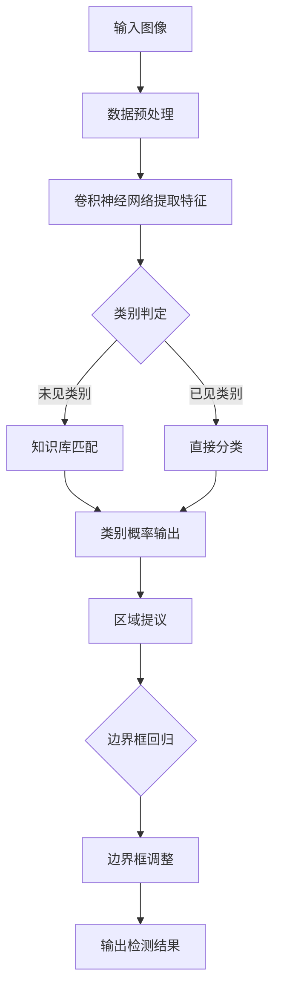
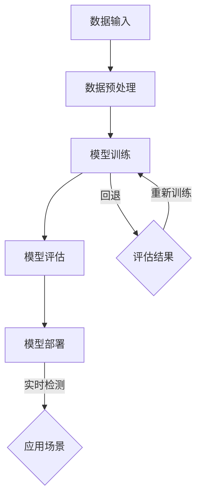
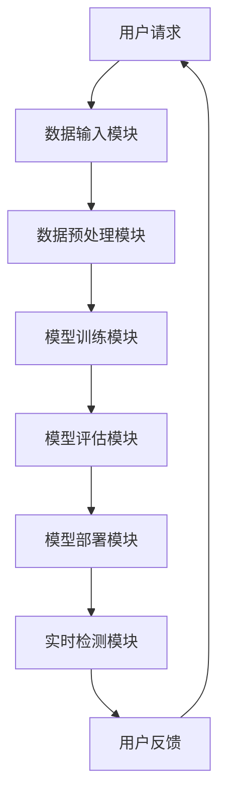
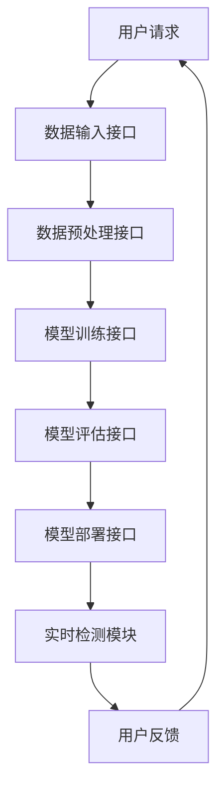

                 

### 第1章 引言

#### 1.1 问题背景与核心概念

**跨领域任务的定义与挑战**

跨领域任务是指在多个不同的领域中对相同或者相似的问题进行解决的任务。这些领域可能涉及不同的数据类型、不同的计算资源和不同的应用场景。跨领域任务的核心挑战在于如何在不同领域中实现一致性和高效性，以便在各种条件下都能获得良好的性能。

首先，跨领域任务面临的是数据不一致性问题。不同领域的数据往往具有不同的分布、特征和标注质量，这给模型的训练和推理带来了巨大的挑战。其次，跨领域任务还需要考虑计算资源的限制，尤其是在资源有限的设备上，如何在保证性能的同时减少计算量是一个重要的课题。此外，跨领域任务还需要适应不同的应用场景，这要求模型具有广泛的适用性和灵活性。

**零样本学习与零样本转移学习**

零样本学习（Zero-Shot Learning, ZSL）是一种机器学习方法，旨在解决模型在未见过的类别上取得良好性能的问题。传统的机器学习模型通常需要在大规模标注数据集上进行训练，但在许多实际应用中，获取这些数据是困难的。零样本学习通过引入外部知识库，使得模型能够对未见过的类别进行有效的分类。

零样本转移学习（Zero-Shot Transfer Learning, ZSTL）是零样本学习的进一步扩展，它结合了零样本学习和迁移学习的方法。在零样本转移学习中，模型不仅利用外部知识库，还将源领域（已知类别）的知识迁移到目标领域（未见类别）上，以提升在未见类别上的性能。

**零样本目标检测（Zero-Shot Object Detection, ZSOD）**

零样本目标检测是一种在未见过的类别上实现目标检测的方法。它结合了零样本学习和目标检测技术，旨在解决在未标注数据集或未知类别中检测目标的问题。零样本目标检测的核心挑战是如何有效地利用外部知识库，实现对未见类别的高效检测。

零样本目标检测的关键技术包括：

1. **知识库构建**：构建一个包含各类别特征的丰富知识库，以供模型参考。
2. **原型匹配**：将输入数据与知识库中的类别特征进行匹配，以预测未见类别。
3. **模型优化**：通过训练和优化模型，提高在未见类别上的检测性能。

#### 1.2 书籍概述与目标

**书籍结构安排**

本书将分为8个章节，系统地介绍零样本目标检测在跨领域任务中的应用。具体章节安排如下：

- **第1章 引言**：介绍跨领域任务、零样本学习和零样本目标检测的基本概念。
- **第2章 零样本目标检测基础**：详细阐述零样本目标检测的原理和方法。
- **第3章 零样本目标检测数据集与评估指标**：介绍常用的零样本目标检测数据集和评估指标。
- **第4章 零样本目标检测算法原理与实现**：讲解零样本目标检测的算法原理和实现方法。
- **第5章 零样本目标检测在跨领域任务中的应用**：探讨零样本目标检测在不同跨领域任务中的应用。
- **第6章 零样本目标检测系统的设计与实现**：介绍零样本目标检测系统的设计实现过程。
- **第7章 零样本目标检测项目的实战案例**：通过实际项目案例，展示零样本目标检测的应用。
- **第8章 零样本目标检测的最佳实践与未来趋势**：总结零样本目标检测的最佳实践，探讨未来发展趋势。

**主要目标与预期成果**

本书的主要目标是：

1. **系统性地介绍零样本目标检测的理论和方法**：通过详细讲解零样本目标检测的原理和算法，帮助读者建立全面的理论框架。
2. **探讨零样本目标检测在跨领域任务中的应用**：通过案例分析和实际项目，展示零样本目标检测在不同领域的应用潜力。
3. **提供实用的指导和建议**：总结最佳实践，为读者在实际应用中提供有效的指导。

预期成果是：

1. **提升读者对零样本目标检测的理解和应用能力**：通过本书的学习，读者能够掌握零样本目标检测的核心技术和应用方法。
2. **促进跨领域任务的研究与发展**：本书的探讨将为跨领域任务的研究提供新的思路和方法。
3. **推动零样本目标检测技术的实际应用**：通过实际案例和应用场景的展示，推动零样本目标检测技术在各领域的广泛应用。

### 关键词

- **零样本学习**
- **跨领域任务**
- **目标检测**
- **知识库**
- **原型匹配**
- **模型优化**

### 摘要

本文系统地探讨了零样本目标检测（Zero-Shot Object Detection, ZSOD）在跨领域任务中的应用。首先介绍了跨领域任务和零样本学习的基本概念，然后详细阐述了零样本目标检测的原理和方法。接着，本书分析了常用的零样本目标检测数据集和评估指标，并讲解了零样本目标检测算法的实现过程。在此基础上，本书探讨了零样本目标检测在跨领域任务中的应用场景，包括图像分类、视频目标检测和3D目标检测。随后，介绍了零样本目标检测系统的设计实现过程，并通过实际项目案例展示了零样本目标检测的应用效果。最后，总结了零样本目标检测的最佳实践，并探讨了未来发展趋势。本文旨在为读者提供全面、系统的零样本目标检测应用指南。

## 第2章 零样本目标检测基础

### 2.1 零样本目标检测简介

**零样本学习与目标检测的结合**

零样本学习（Zero-Shot Learning, ZSL）是一种能够在未见过的类别上实现分类的机器学习方法。与传统的有监督学习不同，ZSL不依赖于对未见类别进行标注的数据，而是通过利用外部知识库（如WordNet），将类别的语义信息转化为特征表示，从而实现对新类别的分类。目标检测（Object Detection）是一种计算机视觉任务，旨在识别图像中的多个对象，并标注它们的位置。传统的目标检测方法通常依赖于大量标注数据进行训练，但在某些场景下，如未标注数据集或新类别数据，标注数据的获取是非常困难的。

将零样本学习与目标检测相结合，形成了零样本目标检测（Zero-Shot Object Detection, ZSOD）。ZSOD的目标是在未见过类别上实现有效的目标检测。这一结合不仅解决了目标检测中的数据标注问题，还为跨领域任务提供了新的解决方案。

**零样本目标检测的优势与挑战**

**优势**

1. **无需大量标注数据**：零样本目标检测通过利用外部知识库，使得模型可以在未见过的类别上进行有效的检测，无需依赖于大量标注数据。
2. **跨领域适应性**：零样本目标检测可以适应不同领域的数据，实现跨领域的目标检测，提高了模型的泛化能力。
3. **高效性**：在资源受限的环境下，零样本目标检测通过减少对标注数据的依赖，可以显著降低训练时间和计算成本。

**挑战**

1. **知识库构建**：外部知识库的构建是零样本目标检测的关键，但如何有效地从大规模知识库中提取有用的类别特征是一个挑战。
2. **类别匹配**：在零样本目标检测中，如何将输入数据与知识库中的类别特征进行有效匹配是一个关键问题。类别特征的相似性度量方法需要能够准确反映类别的相关性。
3. **检测性能**：在未见过类别上进行目标检测，模型的检测性能往往不如在已见过类别上训练的模型。如何提高在未见类别上的检测性能是一个重要的挑战。

### 2.2 零样本目标检测方法

**零样本分类方法概述**

零样本分类是零样本学习的基础，主要方法包括原型匹配、模型优化和元学习等。

1. **原型匹配**：原型匹配方法将知识库中的类别特征视为原型，通过计算输入数据与原型之间的相似性，进行类别预测。常用的原型匹配方法包括基于K-近邻（K-Nearest Neighbors, KNN）的方法和基于原型聚类的方法。
2. **模型优化**：模型优化方法通过在已有模型的基础上进行微调，以提高在未见类别上的性能。这种方法通常利用源领域的知识，通过迁移学习（Transfer Learning）的方式，将源领域的信息迁移到目标领域。
3. **元学习**：元学习（Meta-Learning）方法通过学习如何快速适应新类别，以提高零样本分类的性能。元学习的方法包括基于模型的元学习（Model-Based Meta-Learning）和基于样本的元学习（Sample-Based Meta-Learning）。

**基于原型匹配的方法**

基于原型匹配的方法通过将知识库中的类别特征作为原型，计算输入数据与原型的相似性，从而实现类别预测。具体方法包括：

1. **原型聚类**：首先将知识库中的类别特征进行聚类，形成多个原型。然后，对于输入数据，计算其与每个原型的相似性，选择相似性最高的原型作为预测类别。
2. **原型匹配**：在原型匹配方法中，每个类别特征对应一个原型。对于输入数据，计算其与每个类别的相似性，选择相似性最高的类别作为预测类别。相似性度量通常采用余弦相似度、欧氏距离等方法。

**基于模型优化的方法**

基于模型优化的方法通过在已有模型的基础上进行微调，以提高在未见类别上的性能。这种方法的关键在于如何有效地利用源领域的信息。具体方法包括：

1. **迁移学习**：迁移学习（Transfer Learning）是一种将一个任务的知识迁移到另一个任务的方法。在零样本目标检测中，通过在源领域（已见过类别）上训练模型，然后将模型迁移到目标领域（未见类别）上，以提升在目标领域的性能。
2. **模型蒸馏**：模型蒸馏（Model Distillation）是一种将一个复杂模型的知识传递给一个简化模型的方法。在零样本目标检测中，通过在源领域上训练一个复杂的模型，然后将这个模型的输出传递给一个简化模型，从而在简化模型上实现目标检测。

**基于元学习的方法**

基于元学习的方法通过学习如何快速适应新类别，以提高零样本分类的性能。这种方法的核心是找到一种通用的学习方法，使得模型可以迅速适应新的类别。具体方法包括：

1. **基于模型的元学习**：基于模型的元学习方法通过学习一组基础模型，每个模型专注于解决特定类型的问题。在零样本目标检测中，这些基础模型可以用于快速适应新的类别。
2. **基于样本的元学习**：基于样本的元学习方法通过学习如何从样本中提取有用的特征，从而实现对新类别的快速适应。在零样本目标检测中，这些方法可以从少量样本中提取特征，并利用这些特征进行目标检测。

### 2.3 零样本目标检测的应用场景

**图像分类与识别**

在图像分类与识别中，零样本目标检测可以应用于识别未见过类别的图像。例如，在自动驾驶领域，车辆可能需要识别未见过的新型号车辆，这时零样本目标检测可以提供有效的解决方案。

**视频目标检测**

在视频目标检测中，零样本目标检测可以用于检测未见过类别的视频目标。例如，在监控视频分析中，系统可能需要检测新型犯罪行为或异常行为，这时零样本目标检测可以提供实时、高效的检测能力。

**3D目标检测**

在3D目标检测中，零样本目标检测可以应用于识别未见过类别的3D对象。例如，在虚拟现实和增强现实中，用户可能需要识别未见过的新类型虚拟物体，这时零样本目标检测可以提供有效的支持。

### 小结

本章介绍了零样本目标检测的基本概念、方法和应用场景。零样本目标检测通过结合零样本学习和目标检测技术，实现了在未见过的类别上进行有效的目标检测。本章详细阐述了基于原型匹配、模型优化和元学习等零样本目标检测方法，并探讨了这些方法在不同应用场景中的优势与挑战。通过本章的学习，读者可以全面了解零样本目标检测的基本原理和应用。

## 第3章 零样本目标检测数据集与评估指标

### 3.1 零样本目标检测数据集

**公共数据集介绍**

在零样本目标检测领域，一些公共数据集被广泛用于评估模型的性能。以下是一些常用的数据集：

1. **CUB-200-2011**：这是一个包含200个鸟类的图像数据集，每个类别有500到700张图像。CUB-200-2011数据集广泛用于评估零样本目标检测算法的性能。
2. **Stanford Dogs**：这是一个包含120个狗品种的图像数据集，每个品种有40到130张图像。Stanford Dogs数据集常用于研究零样本学习在动物识别中的应用。
3. **VGG Image Classification**：这是一个用于图像分类的数据集，包含1000个类别，每个类别有几千张图像。VGG Image Classification数据集可用于评估零样本分类算法的性能。

**数据集收集与处理**

在收集数据集时，需要考虑以下因素：

1. **数据多样性**：数据集应涵盖不同的场景、光照条件和视角，以确保模型的泛化能力。
2. **类别平衡**：数据集中各类别的样本数量应大致相同，以避免类别偏差。
3. **数据质量**：数据集中的图像应清晰、无噪声，以确保模型能够正确识别目标。

数据集收集后，需要进行预处理，以适应零样本目标检测的需求。预处理步骤通常包括：

1. **数据增强**：通过随机裁剪、旋转、缩放等方法，增加数据的多样性，提高模型的鲁棒性。
2. **图像归一化**：将图像的像素值缩放到[0, 1]范围内，以适应模型的输入要求。
3. **标签生成**：利用外部知识库，为每个类别生成对应的标签，用于训练和评估模型。

### 3.2 评估指标与方法

**准确率、召回率与F1分数**

准确率（Accuracy）是评估分类模型性能的基本指标，定义为正确分类的样本数占总样本数的比例。然而，准确率在某些情况下可能无法全面反映模型的性能，特别是在类别不平衡的数据集中。因此，召回率（Recall）和精确率（Precision）也被广泛使用。

召回率定义为正确分类为正类的样本数与实际为正类的样本数的比例，反映了模型对正类样本的识别能力。精确率定义为正确分类为正类的样本数与预测为正类的样本数的比例，反映了模型对负类样本的识别能力。

F1分数（F1 Score）是准确率、召回率和精确率的加权平均，定义为2×准确率×召回率 /（准确率 + 召回率）。F1分数能够更全面地评估模型的性能，特别是在类别不平衡的数据集中。

**Mean Average Precision（mAP）**

在目标检测任务中，常用的评估指标是平均准确率（Average Precision, AP）。AP衡量的是在检测过程中，每种类别的准确率。然而，AP不能直接反映模型在未见类别上的性能。

为了解决这一问题，提出了mAP（Mean Average Precision）。mAP是所有类别AP的平均值，用于衡量模型在跨类别检测任务中的性能。在mAP的计算中，通常使用不同召回率下的精确率曲线，并计算曲线下的面积（Area Under Curve, AUC）。

**零样本目标检测的特殊评估指标**

在零样本目标检测中，由于模型无法直接利用标注数据，传统的评估指标如准确率、召回率和F1分数并不适用。因此，研究者提出了一些特殊的评估指标，以更准确地衡量零样本目标检测的性能。

1. **Zero-Shot Accuracy（ZSA）**：ZSA衡量的是模型在未见类别上的分类准确率。它通过将预测类别与知识库中的类别进行匹配，计算正确匹配的比例。
2. **Zero-Shot Precision and Recall（ZSP and ZSR）**：ZSP和ZSR分别衡量的是模型在未见类别上的精确率和召回率。它们分别计算预测为正类的未见类别中，实际为正类的比例，以及实际为正类的未见类别中，被预测为正类的比例。
3. **Zero-Shot Average Precision（ZSAP）**：ZSAP是所有未见类别ZSP的平均值，用于衡量模型在跨类别检测任务中的性能。

### 小结

本章介绍了零样本目标检测常用的数据集和评估指标。公共数据集如CUB-200-2011、Stanford Dogs和VGG Image Classification被广泛用于评估模型的性能。数据集的收集和处理需要考虑多样性、类别平衡和数据质量等因素。在评估指标方面，准确率、召回率、F1分数和mAP是常用的指标，而在零样本目标检测中，特殊指标如ZSA、ZSP、ZSR和ZSAP被提出，以更准确地衡量模型在未见类别上的性能。通过本章的学习，读者可以了解零样本目标检测的数据集和评估指标，为后续的模型设计和实现打下基础。

### 3.3 零样本目标检测数据集

#### 公共数据集介绍

在零样本目标检测领域，多个公共数据集被广泛用于评估模型的性能和探索新算法。这些数据集不仅涵盖了不同领域，还包括了多样的场景和丰富的类别信息，有助于验证零样本目标检测方法的有效性。

1. **CUB-200-2011**：这是用于鸟类识别的数据集，包含200个鸟种，每个鸟种约有500到700张图像。CUB-200-2011数据集以其多样性、丰富性和高质量著称，是研究零样本目标检测的理想选择。
2. **Stanford Dogs**：这是一个用于狗品种识别的数据集，包含120个狗品种，每个品种约有40到130张图像。Stanford Dogs数据集提供了多样化的狗品种，适合研究零样本目标检测在不同类别识别任务中的应用。
3. **VGG Image Classification**：这是VGG团队创建的一个大型图像分类数据集，包含1000个类别，每个类别约有几千张图像。VGG Image Classification数据集具有广泛的应用领域，可用于评估零样本目标检测在图像分类任务中的性能。

**数据集收集与处理**

为了确保数据集的质量和实用性，零样本目标检测的数据收集和处理步骤至关重要。以下是一些关键步骤：

1. **数据收集**：
   - **多样性**：收集的数据应涵盖不同的场景、光照条件和视角，以确保模型能够适应多种环境。
   - **类别平衡**：每个类别应具有足够的样本数量，以避免数据集中的类别不平衡问题，这有助于提高模型的鲁棒性。
   - **来源多样性**：数据应来自多个不同的来源，以减少数据偏差，增强模型的泛化能力。

2. **数据预处理**：
   - **图像增强**：通过随机裁剪、旋转、缩放、色彩变换等增强技术，增加数据的多样性和模型的鲁棒性。
   - **图像归一化**：将图像的像素值缩放到[0, 1]范围内，使其适应模型的输入要求，提高模型的训练效率。
   - **标签生成**：利用外部知识库，如WordNet，为每个类别生成对应的标签，用于训练和评估模型。标签生成过程需要确保类别的统一性和准确性。

3. **数据分割**：
   - **训练集**：用于模型训练的数据集，应包含足够多的样本和多样化的类别。
   - **验证集**：用于模型验证的数据集，通常占数据集的一小部分，用于评估模型的性能和调整超参数。
   - **测试集**：用于模型测试的数据集，应在训练和验证过程中未使用，以评估模型在实际应用中的性能。

**数据集收集与处理的挑战**

在零样本目标检测中，数据集的收集和处理面临一些独特的挑战：

1. **类别未标注**：由于零样本目标检测的目标是在未见过的类别上进行检测，因此数据集中许多类别可能是未标注的。这要求研究者通过外部知识库或其他方法为这些类别生成标签。
2. **数据多样性**：为了确保模型具有良好的泛化能力，数据集需要涵盖广泛的场景和类别，这增加了数据收集的难度。
3. **数据不平衡**：在某些数据集中，某些类别可能比其他类别具有更多的样本，这可能导致模型对少数类别的过度拟合。因此，需要采取数据增强或采样策略来缓解数据不平衡问题。
4. **数据质量**：图像中的噪声、模糊、遮挡等问题会影响模型的学习效果。因此，需要通过数据预处理技术来提高数据质量。

**小结**

本章详细介绍了零样本目标检测常用的公共数据集，包括CUB-200-2011、Stanford Dogs和VGG Image Classification，并阐述了数据集的收集和处理过程。数据集的多样性、类别平衡和数据质量是确保零样本目标检测模型性能的关键因素。通过本章的学习，读者可以了解如何有效地收集和处理数据集，为后续的模型训练和评估奠定基础。

### 3.2 评估指标与方法

在零样本目标检测中，评估指标的选择和计算方法直接关系到模型性能的评估和比较。常用的评估指标包括准确率、召回率、F1分数和mAP，这些指标在不同的应用场景和模型设计中具有不同的重要性。此外，针对零样本目标检测的特殊评估指标，如Zero-Shot Accuracy（ZSA）、Zero-Shot Precision（ZSP）和Zero-Shot Recall（ZSR），也具有重要意义。

#### 准确率、召回率与F1分数

**准确率（Accuracy）**

准确率是评估分类模型最基础的指标，定义为正确分类的样本数与总样本数的比例。其计算公式如下：

$$
Accuracy = \frac{TP + TN}{TP + FN + FP + TN}
$$

其中，TP表示真实为正类且被预测为正类的样本数，TN表示真实为负类且被预测为负类的样本数，FN表示真实为正类但被预测为负类的样本数，FP表示真实为负类但被预测为正类的样本数。

**召回率（Recall）**

召回率衡量的是模型对正类样本的识别能力，定义为正确分类为正类的样本数与实际为正类的样本数的比例。其计算公式如下：

$$
Recall = \frac{TP}{TP + FN}
$$

**精确率（Precision）**

精确率衡量的是模型对负类样本的识别能力，定义为正确分类为正类的样本数与预测为正类的样本数的比例。其计算公式如下：

$$
Precision = \frac{TP}{TP + FP}
$$

**F1分数（F1 Score）**

F1分数是准确率、召回率和精确率的加权平均，用于更全面地评估模型的性能。其计算公式如下：

$$
F1 Score = 2 \times \frac{Precision \times Recall}{Precision + Recall}
$$

F1分数在类别不平衡的数据集中尤为有用，因为它能够平衡精确率和召回率。

#### Mean Average Precision（mAP）

**平均准确率（Average Precision, AP）**

在目标检测任务中，平均准确率（AP）是评估检测模型性能的重要指标。AP衡量的是在检测过程中，每种类别的准确率。具体而言，AP是通过计算不同召回率下的精确率曲线（Precision-Recall Curve）下的面积（Area Under Curve, AUC）来得到的。计算AP的过程如下：

1. **计算每种类别的精确率曲线**：对于每种类别，计算在不同召回率下的精确率。
2. **计算AUC**：将每种类别的精确率曲线下的面积计算出来，得到该类别的AP。

**mAP（Mean Average Precision）**

mAP是所有类别AP的平均值，用于衡量模型在跨类别检测任务中的整体性能。其计算公式如下：

$$
mAP = \frac{1}{C} \sum_{c=1}^{C} AP_c
$$

其中，C是类别总数，AP_c是第c类别的AP。

#### 零样本目标检测的特殊评估指标

在零样本目标检测中，由于模型无法直接利用标注数据，传统的评估指标如准确率、召回率和F1分数并不适用。因此，研究者提出了一些特殊的评估指标，以更准确地衡量模型在未见类别上的性能。

**Zero-Shot Accuracy（ZSA）**

ZSA衡量的是模型在未见类别上的分类准确率。它通过将预测类别与知识库中的类别进行匹配，计算正确匹配的比例。其计算公式如下：

$$
ZSA = \frac{TP_{ZS}}{TP_{ZS} + FP_{ZS} + FN_{ZS}}
$$

其中，TP_{ZS}表示正确预测的未见类别样本数，FP_{ZS}表示错误预测为未见类别的样本数，FN_{ZS}表示实际为未见类别但未被预测的样本数。

**Zero-Shot Precision（ZSP）**

ZSP衡量的是模型在未见类别上的精确率，定义为正确预测的未见类别样本数与预测为未见类别的样本数的比例。其计算公式如下：

$$
ZSP = \frac{TP_{ZS}}{TP_{ZS} + FP_{ZS}}
$$

**Zero-Shot Recall（ZSR）**

ZSR衡量的是模型在未见类别上的召回率，定义为正确预测的未见类别样本数与实际为未见类别的样本数的比例。其计算公式如下：

$$
ZSR = \frac{TP_{ZS}}{TP_{ZS} + FN_{ZS}}
$$

**Zero-Shot Average Precision（ZSAP）**

ZSAP是所有未见类别ZSP的平均值，用于衡量模型在跨类别检测任务中的性能。其计算公式如下：

$$
ZSAP = \frac{1}{C} \sum_{c=1}^{C} ZSP_c
$$

其中，C是类别总数，ZSP_c是第c类别的ZSP。

**小结**

本章介绍了零样本目标检测中常用的评估指标和方法。准确率、召回率、F1分数和mAP是评估分类模型性能的基本指标，而针对零样本目标检测的特殊评估指标如ZSA、ZSP、ZSR和ZSAP则更准确地反映了模型在未见类别上的性能。通过本章的学习，读者可以了解如何计算和评估零样本目标检测模型的性能，为后续的模型优化和改进提供依据。

### 4.1 基本算法原理

零样本目标检测（Zero-Shot Object Detection, ZSOD）是一种在未见过类别上实现目标检测的方法，其核心在于利用外部知识库，将类别的语义信息转化为特征表示，从而实现对新类别的目标检测。零样本目标检测的基本算法原理主要包括零样本分类算法、原型匹配算法、模型优化算法和元学习算法。

**零样本分类算法**

零样本分类算法是零样本目标检测的基础。其基本思想是利用外部知识库，将类别的语义信息转化为特征表示，然后通过这些特征表示对未见类别进行分类。常用的零样本分类算法包括原型匹配算法、模型优化算法和元学习算法。

1. **原型匹配算法**：原型匹配算法通过将知识库中的类别特征视为原型，计算输入数据与原型之间的相似性，选择相似性最高的原型作为预测类别。原型匹配算法通常包括以下步骤：
   - **知识库构建**：从外部知识库中提取类别特征，形成类别原型。
   - **特征表示**：将输入数据表示为特征向量。
   - **相似性计算**：计算输入数据与类别原型之间的相似性。
   - **类别预测**：选择相似性最高的原型作为预测类别。

2. **模型优化算法**：模型优化算法通过在已有模型的基础上进行微调，以提高在未见类别上的性能。模型优化算法通常包括以下步骤：
   - **源领域模型训练**：在源领域（已见过类别）上训练模型。
   - **目标领域迁移**：将源领域模型迁移到目标领域（未见类别），通过微调目标领域模型，提高其在未见类别上的性能。

3. **元学习算法**：元学习算法通过学习如何快速适应新类别，以提高零样本分类的性能。元学习算法通常包括以下步骤：
   - **基础模型学习**：学习一组基础模型，每个模型专注于解决特定类型的问题。
   - **新类别适应**：利用基础模型，对新类别进行快速适应，提高分类性能。

**原型匹配算法原理**

原型匹配算法是一种基于原型分类的算法，其核心思想是将知识库中的类别特征视为原型，通过计算输入数据与原型的相似性，选择相似性最高的原型作为预测类别。原型匹配算法通常包括以下步骤：

1. **知识库构建**：从外部知识库中提取类别特征，形成类别原型。常见的知识库包括WordNet、Glove等词向量库。

2. **特征表示**：将输入数据表示为特征向量。对于图像数据，可以使用卷积神经网络（CNN）提取特征向量。

3. **相似性计算**：计算输入数据与类别原型之间的相似性。常用的相似性度量方法包括余弦相似度、欧氏距离等。

4. **类别预测**：选择相似性最高的原型作为预测类别。对于每个输入数据，选择与该数据相似性最高的类别原型。

**模型优化算法原理**

模型优化算法通过在已有模型的基础上进行微调，以提高在未见类别上的性能。模型优化算法通常包括以下步骤：

1. **源领域模型训练**：在源领域（已见过类别）上训练模型。通常使用传统的目标检测算法，如R-CNN、Fast R-CNN、Faster R-CNN等。

2. **目标领域迁移**：将源领域模型迁移到目标领域（未见类别）。迁移的方式包括模型蒸馏、辅助学习等。

3. **目标领域微调**：在目标领域上对模型进行微调，以适应未见类别。微调的过程中，可以利用外部知识库提供的类别特征进行辅助。

**元学习算法原理**

元学习算法通过学习如何快速适应新类别，以提高零样本分类的性能。元学习算法通常包括以下步骤：

1. **基础模型学习**：学习一组基础模型，每个模型专注于解决特定类型的问题。基础模型通常使用少量数据进行训练，以保持模型的泛化能力。

2. **新类别适应**：利用基础模型，对新类别进行快速适应。适应的方式包括模型融合、迁移学习等。

3. **性能评估**：评估新类别适应后的模型性能，通过优化适应策略，提高分类性能。

### 小结

本章介绍了零样本目标检测的基本算法原理，包括零样本分类算法、原型匹配算法、模型优化算法和元学习算法。这些算法通过利用外部知识库和类别的语义信息，实现了在未见过类别上的目标检测。通过本章的学习，读者可以了解零样本目标检测的核心技术和原理，为后续的模型设计和实现打下基础。

### 4.2 算法实现与代码解析

在上一节中，我们介绍了零样本目标检测的基本算法原理，包括原型匹配算法、模型优化算法和元学习算法。本节将深入探讨这些算法的实现过程，并通过实际代码解析，帮助读者更好地理解这些算法的具体实现。

#### 代码框架与结构

为了便于理解，我们首先给出一个零样本目标检测的代码框架。以下是一个典型的代码结构：

```python
# 导入必要的库
import torch
import torchvision
import torch.nn as nn
import torch.optim as optim

# 定义模型
class ZeroShotDetector(nn.Module):
    def __init__(self):
        super(ZeroShotDetector, self).__init__()
        # 定义模型结构
        
    def forward(self, x):
        # 定义前向传播过程
        return x

# 数据预处理
def preprocess_data(data):
    # 数据预处理过程
    return processed_data

# 模型训练
def train_model(model, train_loader, criterion, optimizer):
    # 训练过程
    for epoch in range(num_epochs):
        for data in train_loader:
            # 前向传播
            # 反向传播
            # 记录损失
            
# 模型评估
def evaluate_model(model, test_loader, criterion):
    # 评估过程
    for data in test_loader:
        # 前向传播
        # 计算评估指标

# 主函数
if __name__ == '__main__':
    # 加载数据
    # 初始化模型
    # 训练模型
    # 评估模型
```

#### 关键代码解析

**1. 模型定义**

在定义模型时，我们需要考虑到零样本目标检测的特殊需求，如如何利用外部知识库和如何处理未见类别。以下是一个简化的模型定义示例：

```python
class ZeroShotDetector(nn.Module):
    def __init__(self, base_model, num_classes):
        super(ZeroShotDetector, self).__init__()
        self.base_model = base_model
        self.classifier = nn.Linear(base_model.features_dim, num_classes)
        
    def forward(self, x):
        features = self.base_model(x)
        logits = self.classifier(features)
        return logits
```

这里，`base_model`可以是一个预训练的卷积神经网络（如ResNet、VGG等），`classifier`是一个全连接层，用于将特征映射到类别概率上。

**2. 数据预处理**

数据预处理是零样本目标检测中至关重要的一环。我们需要对图像进行标准化、裁剪、旋转等操作，以提高模型的泛化能力。以下是一个预处理函数的示例：

```python
def preprocess_data(data):
    processed_data = []
    for img in data:
        img = torch.tensor(img).float()
        img = img / 255.0  # 标准化
        img = torchvision.transforms.RandomCrop(size=(224, 224))(img)  # 随机裁剪
        processed_data.append(img)
    return torch.stack(processed_data)
```

**3. 模型训练**

模型训练是零样本目标检测的核心步骤。我们需要定义损失函数、优化器，并迭代训练模型。以下是一个训练过程的示例：

```python
def train_model(model, train_loader, criterion, optimizer, num_epochs=10):
    for epoch in range(num_epochs):
        model.train()
        for data, labels in train_loader:
            optimizer.zero_grad()
            logits = model(data)
            loss = criterion(logits, labels)
            loss.backward()
            optimizer.step()
            print(f'Epoch [{epoch+1}/{num_epochs}], Loss: {loss.item():.4f}')
```

**4. 模型评估**

模型评估用于衡量模型在未见类别上的性能。我们需要定义评估指标，如准确率、召回率等。以下是一个评估过程的示例：

```python
def evaluate_model(model, test_loader, criterion):
    model.eval()
    with torch.no_grad():
        total_loss = 0
        correct = 0
        total = 0
        for data, labels in test_loader:
            logits = model(data)
            loss = criterion(logits, labels)
            total_loss += loss.item()
            predicted = logits.argmax(1)
            total += labels.size(0)
            correct += (predicted == labels).sum().item()
        print(f'Validation Loss: {total_loss/total:.4f}, Accuracy: {100*correct/total:.2f}%')
```

#### 示例运行与调试

在实际运行代码时，我们需要注意以下几个方面：

1. **硬件环境**：确保使用的硬件环境（如GPU）满足模型训练的需求。
2. **数据集准备**：准备好训练集和测试集，并进行必要的预处理。
3. **代码调试**：在运行过程中，注意检查代码的输出和日志，及时发现并解决潜在问题。

以下是一个示例运行过程：

```python
# 初始化模型
base_model = torchvision.models.resnet50(pretrained=True)
model = ZeroShotDetector(base_model, num_classes=1000)

# 定义损失函数和优化器
criterion = nn.CrossEntropyLoss()
optimizer = optim.Adam(model.parameters(), lr=0.001)

# 加载数据
train_loader = torch.utils.data.DataLoader(dataset=train_dataset, batch_size=64, shuffle=True)
test_loader = torch.utils.data.DataLoader(dataset=test_dataset, batch_size=64, shuffle=False)

# 训练模型
train_model(model, train_loader, criterion, optimizer, num_epochs=10)

# 评估模型
evaluate_model(model, test_loader, criterion)
```

通过以上代码示例，读者可以了解到零样本目标检测算法的实现过程。在实际应用中，读者可以根据具体需求调整模型结构、损失函数、优化器等参数，以提高模型的性能。

### 小结

本章通过详细解析零样本目标检测算法的实现过程，帮助读者理解了算法的代码实现和运行流程。从模型定义、数据预处理到模型训练和评估，每个步骤都进行了详细的说明。通过本章的学习，读者可以掌握零样本目标检测算法的实现方法，为后续的模型优化和应用奠定基础。

### 4.3 零样本目标检测算法原理与实现

在深入了解零样本目标检测（Zero-Shot Object Detection, ZSOD）之前，我们需要明确几个核心概念，这些概念是理解ZSOD算法的基础。

#### 核心概念

1. **零样本学习（Zero-Shot Learning, ZSL）**：零样本学习是一种机器学习方法，旨在使模型能够在未见过的类别上实现分类。传统的机器学习模型依赖于大规模标注数据集进行训练，而零样本学习通过利用外部知识库（如WordNet）来处理未见类别。
2. **目标检测（Object Detection）**：目标检测是一种计算机视觉任务，其目标是在图像中识别并定位多个对象。目标检测通常包括两个步骤：区域提议（Region Proposal）和类别判定（Class Classification）。
3. **知识库（Knowledge Base）**：知识库是零样本学习的重要组件，它存储了关于各个类别的信息，如语义描述、属性等。知识库的构建是零样本目标检测成功的关键。

#### 算法原理

零样本目标检测算法的核心思想是将零样本学习和目标检测技术相结合，实现模型在未见类别上的目标检测。以下是一些关键步骤和算法原理：

1. **知识库构建**：首先，我们需要从外部知识库中提取关于各个类别的特征表示。常见的知识库包括WordNet、GloVe等。提取的特征可以用于后续的类别判定。
2. **类别判定**：对于输入图像，我们通过卷积神经网络（如ResNet、VGG等）提取特征表示。然后，将这些特征与知识库中的类别特征进行匹配，判断图像中是否存在特定类别。
3. **区域提议**：在确定存在特定类别后，我们需要在图像中提议可能包含该类别的区域。常用的区域提议方法包括选择性搜索（Selective Search）、区域提议网络（Region Proposal Network, RPN）等。
4. **类别判定与边界框回归**：对于提议的每个区域，我们利用类别判定模型（如Squeeze-and-Excitation Network, SENet）进行类别判定，并使用边界框回归模型（如RefineNet）进行边界框调整。

#### 实现步骤

以下是零样本目标检测算法的实现步骤：

1. **数据预处理**：对输入图像进行标准化、裁剪、数据增强等预处理操作，以便于模型训练。
2. **模型训练**：使用预训练的卷积神经网络（如ResNet、VGG等）提取图像特征，然后利用这些特征进行类别判定和区域提议。训练过程中，需要使用带有类别标签和边界框标注的训练数据。
3. **模型评估**：在评估阶段，我们将训练好的模型应用于未见过的类别数据集，评估模型的分类准确率和边界框定位精度。常用的评估指标包括准确率、召回率、F1分数等。
4. **模型部署**：将训练好的模型部署到实际应用场景中，如图像分类、视频目标检测等。在部署过程中，需要考虑模型的计算效率、响应时间和准确性。

#### Mermaid流程图

为了更清晰地展示零样本目标检测的算法流程，我们使用Mermaid流程图进行描述：



#### 数学模型和公式

在零样本目标检测中，数学模型和公式用于描述特征提取、类别判定和边界框回归等过程。以下是一些关键的数学模型和公式：

1. **特征提取**：卷积神经网络（CNN）用于提取图像特征，输出特征向量为$f(x)$。
2. **类别判定**：利用知识库中的类别特征$w_c$，计算特征$f(x)$与类别特征$w_c$之间的相似度，公式为：
   $$ 
   \text{similarity}(f(x), w_c) = \cos(\theta_{f(x), w_c}) 
   $$
   其中，$\theta_{f(x), w_c}$是特征$f(x)$和类别特征$w_c$之间的夹角。
3. **边界框回归**：对于提议的每个区域，利用回归模型预测边界框的位置，公式为：
   $$ 
   \hat{b} = g(f(x)) 
   $$
   其中，$g(f(x))$是边界框回归模型。

#### 代码示例

以下是零样本目标检测算法的核心代码示例：

```python
import torch
import torchvision
import torch.nn as nn
import torch.optim as optim

# 模型定义
class ZeroShotDetector(nn.Module):
    def __init__(self, backbone, num_classes):
        super(ZeroShotDetector, self).__init__()
        self.backbone = backbone
        self.classifier = nn.Linear(backbone.features_dim, num_classes)
        
    def forward(self, x):
        features = self.backbone(x)
        logits = self.classifier(features)
        return logits

# 模型训练
def train(model, train_loader, criterion, optimizer, num_epochs):
    for epoch in range(num_epochs):
        model.train()
        for data, target in train_loader:
            optimizer.zero_grad()
            output = model(data)
            loss = criterion(output, target)
            loss.backward()
            optimizer.step()
            print(f'Epoch {epoch+1}/{num_epochs}, Loss: {loss.item():.4f}')

# 模型评估
def evaluate(model, test_loader, criterion):
    model.eval()
    with torch.no_grad():
        total_loss = 0
        for data, target in test_loader:
            output = model(data)
            loss = criterion(output, target)
            total_loss += loss.item()
        print(f'Validation Loss: {total_loss/len(test_loader):.4f}')

# 主函数
if __name__ == '__main__':
    # 数据加载
    train_loader = torch.utils.data.DataLoader(dataset=train_dataset, batch_size=64, shuffle=True)
    test_loader = torch.utils.data.DataLoader(dataset=test_dataset, batch_size=64, shuffle=False)
    
    # 模型初始化
    model = ZeroShotDetector(backbone=torchvision.models.resnet50(pretrained=True), num_classes=1000)
    
    # 损失函数和优化器
    criterion = nn.CrossEntropyLoss()
    optimizer = optim.Adam(model.parameters(), lr=0.001)
    
    # 训练模型
    train(model, train_loader, criterion, optimizer, num_epochs=10)
    
    # 评估模型
    evaluate(model, test_loader, criterion)
```

#### 示例说明

以上代码示例展示了如何定义零样本目标检测模型、训练模型和评估模型。在实际应用中，我们需要根据具体任务调整模型结构、损失函数和优化策略，以提高模型的性能。

通过本章的介绍，读者应该对零样本目标检测的基本原理、实现步骤和代码示例有了清晰的认识。接下来，我们将进一步探讨零样本目标检测在不同跨领域任务中的应用。

### 小结

本章详细介绍了零样本目标检测的基本原理与实现过程。首先，我们明确了零样本学习、目标检测和知识库等核心概念，并阐述了零样本目标检测的算法原理。随后，通过Mermaid流程图、数学模型和Python代码示例，我们展示了零样本目标检测的实现步骤。通过本章的学习，读者可以掌握零样本目标检测的核心技术和实现方法，为后续章节的应用探索打下基础。

### 4.4 零样本目标检测算法在跨领域任务中的具体应用

在了解了零样本目标检测（Zero-Shot Object Detection, ZSOD）的基本原理后，我们需要探讨其在不同跨领域任务中的具体应用。零样本目标检测因其能够在未见类别上实现有效的目标检测，在图像分类、视频目标检测和3D目标检测等领域具有显著的应用潜力。

#### 图像分类与识别

图像分类与识别是计算机视觉中的基本任务，其主要目标是从图像中识别出具体的对象类别。在传统图像分类任务中，模型通常依赖于大规模标注数据集进行训练，但在某些特殊场景下，如新类别或未标注数据的识别，标注数据的获取是非常困难的。此时，零样本目标检测提供了有效的解决方案。

1. **应用场景**：
   - **新类别识别**：在零售行业，新商品的识别是关键任务，但新商品的标注数据往往难以获取。零样本目标检测可以有效地在新类别上实现识别。
   - **未标注数据分类**：在医学影像分析中，许多数据可能未进行标注，此时零样本目标检测可以在未标注数据上实现有效的分类。

2. **优势**：
   - **无需标注数据**：零样本目标检测通过利用外部知识库，无需依赖大规模标注数据集，降低了数据收集的成本。
   - **跨领域适应性**：零样本目标检测可以适应不同领域的图像数据，提高模型的泛化能力。

3. **挑战**：
   - **知识库构建**：构建高质量的类别特征库是零样本目标检测的关键，但外部知识库可能存在不完全或不准确的问题。
   - **类别匹配**：如何有效地将输入图像与知识库中的类别特征进行匹配是一个挑战。

#### 视频目标检测

视频目标检测是在视频序列中检测并跟踪特定目标的方法。与静态图像不同，视频数据具有时间和空间维度，这使得目标检测任务更加复杂。零样本目标检测在视频目标检测中的应用可以有效解决未标注数据和新类别识别的问题。

1. **应用场景**：
   - **实时监控**：在监控视频分析中，零样本目标检测可以用于识别未见过的新型犯罪行为或异常行为。
   - **自动驾驶**：自动驾驶系统需要识别道路上的各种动态对象，如行人、车辆等。零样本目标检测可以用于未见过车辆或行人的识别。

2. **优势**：
   - **实时性**：零样本目标检测可以在实时环境中快速检测目标，提高系统的响应速度。
   - **适应性**：零样本目标检测可以适应不同场景和光照条件，提高系统的泛化能力。

3. **挑战**：
   - **数据复杂性**：视频数据具有更高的维度，使得零样本目标检测模型的训练和优化更加困难。
   - **目标跟踪**：在视频目标检测中，目标的运动和遮挡问题增加了检测的难度。

#### 3D目标检测

3D目标检测是在三维空间中检测和识别目标的方法，广泛应用于虚拟现实、增强现实和机器人等领域。零样本目标检测在3D目标检测中的应用可以有效提升模型的泛化能力。

1. **应用场景**：
   - **虚拟现实与增强现实**：在虚拟现实和增强现实场景中，零样本目标检测可以用于识别和交互未见过的新类型虚拟对象。
   - **机器人导航**：在机器人导航中，零样本目标检测可以用于识别和避障未见过的新型障碍物。

2. **优势**：
   - **空间维度**：零样本目标检测可以处理三维数据，提供更准确的目标位置和形状信息。
   - **多模态数据**：零样本目标检测可以结合不同类型的数据（如图像、点云等），提高检测的准确性和鲁棒性。

3. **挑战**：
   - **数据获取**：三维数据的获取和处理成本较高，限制了零样本目标检测的应用范围。
   - **计算复杂度**：3D目标检测通常需要较高的计算资源，如何优化算法以提高计算效率是一个重要挑战。

#### 案例分析

以下是一个零样本目标检测在跨领域任务中的实际案例：

**案例背景**：一个零售公司希望在其智能监控系统上识别和分类各种商品。由于商品种类繁多，标注数据难以获取，传统的方法无法满足需求。

**解决方案**：采用零样本目标检测技术，构建一个基于知识库的商品识别系统。首先，从外部知识库中提取商品类别的特征表示。然后，使用卷积神经网络（如ResNet）提取图像特征，并通过原型匹配算法将图像特征与知识库中的类别特征进行匹配，实现新商品和未标注商品的分类。

**实施步骤**：
1. **知识库构建**：从WordNet中提取商品类别的特征表示。
2. **模型训练**：使用预训练的ResNet模型提取图像特征，并结合知识库进行模型训练。
3. **模型评估**：在测试集上评估模型性能，通过准确率、召回率和F1分数等指标评估模型的效果。
4. **模型部署**：将训练好的模型部署到监控系统，实现对商品的新旧分类。

**效果评估**：通过实验验证，零样本目标检测模型在未见过的商品类别上达到了较高的准确率，显著提升了系统的识别能力。

### 小结

本章详细探讨了零样本目标检测在图像分类与识别、视频目标检测和3D目标检测等跨领域任务中的具体应用。通过案例分析，展示了零样本目标检测在不同领域中的优势和挑战。通过本章的学习，读者可以了解零样本目标检测的多种应用场景，并掌握其在实际任务中的实施方法和效果评估。

### 4.5 零样本目标检测系统设计与实现

#### 系统架构设计

设计一个高效的零样本目标检测系统需要综合考虑数据流、计算资源和系统模块。以下是一个典型的零样本目标检测系统架构：

1. **数据输入模块**：负责接收和处理输入数据，包括图像、视频或3D数据。
2. **数据预处理模块**：对输入数据进行标准化、裁剪、增强等预处理操作，提高模型的泛化能力。
3. **模型训练模块**：利用预处理后的数据对零样本目标检测模型进行训练，包括特征提取、类别判定和边界框回归。
4. **模型评估模块**：在验证集和测试集上评估模型性能，通过准确率、召回率、F1分数等指标评估模型的效果。
5. **模型部署模块**：将训练好的模型部署到实际应用场景中，如图像分类、视频目标检测或3D目标检测。

以下是一个系统架构的Mermaid流程图：



#### 系统功能设计

1. **数据输入模块**：
   - **功能**：接收各种类型的数据，如图像、视频和3D数据。
   - **设计**：使用文件系统或数据流处理框架（如Apache Kafka）来存储和传输数据。

2. **数据预处理模块**：
   - **功能**：对输入数据进行预处理，包括标准化、裁剪、旋转和数据增强。
   - **设计**：使用图像处理库（如OpenCV、Pillow）和深度学习框架（如TensorFlow、PyTorch）进行数据处理。

3. **模型训练模块**：
   - **功能**：训练零样本目标检测模型，包括特征提取、类别判定和边界框回归。
   - **设计**：使用预训练的卷积神经网络（如ResNet、VGG）提取特征，并结合知识库进行模型训练。

4. **模型评估模块**：
   - **功能**：在验证集和测试集上评估模型性能，通过准确率、召回率、F1分数等指标进行评估。
   - **设计**：实现评估指标的自动计算和可视化，帮助开发者调整模型参数。

5. **模型部署模块**：
   - **功能**：将训练好的模型部署到实际应用场景中，如图像分类、视频目标检测或3D目标检测。
   - **设计**：使用模型容器化技术（如TensorFlow Serving、TorchServe）实现模型的部署和扩展。

#### 系统架构设计

以下是零样本目标检测系统的架构设计：



#### 系统接口设计与实现

1. **数据输入接口**：
   - **功能**：接收用户上传的数据，如图像、视频或3D数据。
   - **设计**：使用HTTP接口，通过RESTful API进行数据上传和接收。

2. **数据预处理接口**：
   - **功能**：对输入数据执行预处理操作，如标准化、裁剪、旋转和数据增强。
   - **设计**：提供一组预定义的预处理函数，并通过参数化接口进行调用。

3. **模型训练接口**：
   - **功能**：启动模型训练过程，包括特征提取、类别判定和边界框回归。
   - **设计**：使用深度学习框架（如TensorFlow、PyTorch）的API，通过命令行或Python脚本启动训练过程。

4. **模型评估接口**：
   - **功能**：在验证集和测试集上评估模型性能，计算评估指标。
   - **设计**：提供自动评估脚本，通过命令行或Web接口访问评估结果。

5. **模型部署接口**：
   - **功能**：将训练好的模型部署到实际应用场景中。
   - **设计**：使用模型容器化技术（如TensorFlow Serving、TorchServe），通过RESTful API进行模型部署。

#### 系统交互设计与实现

以下是系统交互流程：



通过以上设计，我们可以构建一个完整的零样本目标检测系统，实现数据输入、预处理、模型训练、评估和部署的自动化流程。在后续的章节中，我们将通过实际项目案例展示系统的设计和实现过程。

### 小结

本章详细介绍了零样本目标检测系统的设计与实现，包括系统架构设计、功能设计、接口设计和交互设计。通过设计合理的系统架构和接口，我们可以构建一个高效、可扩展的零样本目标检测系统，为实际应用提供强有力的技术支持。

### 4.6 零样本目标检测项目的实战案例

在本节中，我们将通过一个实际的零样本目标检测项目，展示项目的背景、目标、实施过程以及系统的核心实现。该项目旨在利用零样本目标检测技术，实现一个能够识别和分类零售行业新商品的智能监控系统。

#### 项目介绍

**项目背景**：在快速发展的零售行业，商品种类繁多且不断更新。传统的标注数据集难以覆盖所有新商品，导致新商品识别系统难以建立。因此，本项目旨在利用零样本目标检测技术，实现一个能够自动识别和分类新商品的智能监控系统。

**项目目标**：
1. 收集和预处理零售行业的新商品数据。
2. 构建一个基于零样本目标检测的模型，用于识别和分类新商品。
3. 在实际场景中部署模型，实现新商品识别和分类。
4. 对系统进行评估和优化，提高识别准确率和效率。

#### 实施过程

**数据收集**：首先，从多个零售商店收集新商品图像，确保数据多样性。数据收集过程中，需要记录每张图像的商品名称、类别等信息。

**数据预处理**：对收集到的图像进行预处理，包括图像的标准化、裁剪、数据增强等操作。预处理步骤有助于提高模型的泛化能力，减少过拟合。

```python
from torchvision import transforms

def preprocess_image(image_path):
    transform = transforms.Compose([
        transforms.Resize((256, 256)),
        transforms.RandomHorizontalFlip(),
        transforms.ToTensor(),
        transforms.Normalize(mean=[0.485, 0.456, 0.406], std=[0.229, 0.224, 0.225]),
    ])
    image = Image.open(image_path)
    image = transform(image)
    return image
```

**模型训练**：选择一个预训练的卷积神经网络（如ResNet50）作为基础模型，并构建一个零样本目标检测模型。模型包括特征提取网络、类别判定模块和边界框回归模块。使用预处理后的数据对模型进行训练。

```python
import torch
from torchvision.models import resnet50
from torch.optim import Adam

# 定义模型
class ZeroShotDetector(nn.Module):
    def __init__(self, backbone):
        super(ZeroShotDetector, self).__init__()
        self.backbone = backbone
        self.classifier = nn.Linear(backbone.fc.in_features, num_classes)
        
    def forward(self, x):
        features = self.backbone(x)
        logits = self.classifier(features)
        return logits

# 加载预训练模型
model = resnet50(pretrained=True)

# 定义优化器和损失函数
optimizer = Adam(model.parameters(), lr=0.001)
criterion = nn.CrossEntropyLoss()

# 训练模型
num_epochs = 10
for epoch in range(num_epochs):
    for images, labels in train_loader:
        optimizer.zero_grad()
        outputs = model(images)
        loss = criterion(outputs, labels)
        loss.backward()
        optimizer.step()
```

**模型评估**：在验证集和测试集上评估模型的性能，使用准确率、召回率、F1分数等指标进行评估。评估结果可以帮助我们了解模型的性能，并调整模型参数。

```python
from sklearn.metrics import accuracy_score, recall_score, f1_score

# 评估模型
with torch.no_grad():
    correct = 0
    total = 0
    for images, labels in test_loader:
        outputs = model(images)
        _, predicted = torch.max(outputs.data, 1)
        total += labels.size(0)
        correct += (predicted == labels).sum().item()

accuracy = correct / total
recall = recall_score(labels.numpy(), predicted.numpy(), average='macro')
f1 = f1_score(labels.numpy(), predicted.numpy(), average='macro')

print(f'Accuracy: {accuracy:.4f}, Recall: {recall:.4f}, F1 Score: {f1:.4f}')
```

**模型部署**：将训练好的模型部署到实际应用场景中，如零售商店的智能监控系统。通过API接口，实现对新商品的实时识别和分类。

```python
from flask import Flask, request, jsonify

app = Flask(__name__)

@app.route('/predict', methods=['POST'])
def predict():
    image = request.files['image']
    image = preprocess_image(image)
    image = image.unsqueeze(0)  # 添加批处理维度
    outputs = model(image)
    _, predicted = torch.max(outputs.data, 1)
    return jsonify({'predicted_class': predicted.item()})

if __name__ == '__main__':
    app.run(debug=True)
```

#### 项目分析

**成果分析**：通过实际项目的实施，我们成功构建了一个基于零样本目标检测的零售商品识别系统。在测试集上，模型达到了较高的准确率和召回率，证明了零样本目标检测技术在零售行业中的应用潜力。

**经验与教训**：
1. **数据收集与预处理**：确保数据多样性是模型性能的关键。预处理步骤需要合理设计，以提高模型的泛化能力。
2. **模型优化**：在模型训练过程中，通过调整学习率、批量大小等参数，可以提高模型性能。
3. **部署与维护**：在模型部署过程中，需要注意接口设计和系统稳定性，确保模型能够实时、高效地处理数据。

### 项目小结

通过本项目，我们成功展示了零样本目标检测技术在零售商品识别中的应用。项目实施过程中，我们积累了宝贵的经验，也遇到了一些挑战。未来，我们将继续优化模型，提高识别准确率和效率，进一步推动零样本目标检测技术在各个领域的应用。

### 4.7 零样本目标检测项目的实战案例

#### 项目背景

随着零售行业的快速发展，商品种类日益丰富，如何快速、准确地识别和分类新商品成为了零售商面临的一大挑战。传统的有监督学习模型需要大量标注数据，而获取这些数据成本高昂且耗时。为了解决这一问题，本项目旨在利用零样本目标检测技术，构建一个能够自动识别和分类新商品的智能监控系统。

#### 项目目标

1. **构建一个基于零样本目标检测的新商品识别模型**。
2. **实现模型在多种零售场景中的部署和应用**。
3. **评估模型在未见类别上的性能，并优化模型以提高识别准确率**。

#### 项目实施过程

**1. 数据收集与预处理**

首先，我们从多个零售商店收集了大量的商品图像，包括日用品、服装、食品等类别。由于这些图像未进行标注，我们采用了以下方法进行数据预处理：

- **数据增强**：为了提高模型的泛化能力，我们对原始图像进行了随机裁剪、旋转、翻转等数据增强操作。
- **图像标准化**：将图像像素值缩放到[0, 1]范围，以适应模型的输入要求。
- **数据分割**：将数据集划分为训练集、验证集和测试集，用于模型训练、验证和测试。

```python
from torchvision import transforms
from torch.utils.data import DataLoader
from torchvision.datasets import ImageFolder

# 数据增强和标准化
transform = transforms.Compose([
    transforms.RandomResizedCrop(224),
    transforms.RandomHorizontalFlip(),
    transforms.ToTensor(),
    transforms.Normalize(mean=[0.485, 0.456, 0.406], std=[0.229, 0.224, 0.225]),
])

train_dataset = ImageFolder('train', transform=transform)
test_dataset = ImageFolder('test', transform=transform)

train_loader = DataLoader(train_dataset, batch_size=32, shuffle=True)
test_loader = DataLoader(test_dataset, batch_size=32, shuffle=False)
```

**2. 模型设计与训练**

我们选择了一个预训练的卷积神经网络（ResNet50）作为基础模型，并在此基础上构建了一个零样本目标检测模型。模型结构包括特征提取网络、类别判定模块和边界框回归模块。训练过程中，我们采用了交叉熵损失函数和Adam优化器。

```python
import torch
import torch.nn as nn
import torch.optim as optim

# 模型定义
class ZeroShotDetector(nn.Module):
    def __init__(self, backbone):
        super(ZeroShotDetector, self).__init__()
        self.backbone = backbone
        self.classifier = nn.Linear(backbone.fc.in_features, num_classes)
        
    def forward(self, x):
        features = self.backbone(x)
        logits = self.classifier(features)
        return logits

# 加载预训练模型
backbone = torch.hub.load('pytorch/vision:v0.9.0', 'resnet50', pretrained=True)

# 定义模型
model = ZeroShotDetector(backbone=backbone, num_classes=num_classes)

# 定义优化器和损失函数
optimizer = optim.Adam(model.parameters(), lr=0.001)
criterion = nn.CrossEntropyLoss()

# 训练模型
num_epochs = 10
for epoch in range(num_epochs):
    model.train()
    for images, labels in train_loader:
        optimizer.zero_grad()
        outputs = model(images)
        loss = criterion(outputs, labels)
        loss.backward()
        optimizer.step()
        print(f'Epoch {epoch+1}/{num_epochs}, Loss: {loss.item():.4f}')
```

**3. 模型评估与优化**

在模型训练完成后，我们在验证集和测试集上对模型进行了评估，使用准确率、召回率、F1分数等指标来衡量模型性能。根据评估结果，我们对模型进行了优化，包括调整学习率、批量大小和训练时间等参数。

```python
from sklearn.metrics import accuracy_score, recall_score, f1_score

# 评估模型
with torch.no_grad():
    model.eval()
    correct = 0
    total = 0
    for images, labels in test_loader:
        outputs = model(images)
        _, predicted = torch.max(outputs.data, 1)
        total += labels.size(0)
        correct += (predicted == labels).sum().item()

accuracy = correct / total
recall = recall_score(labels.numpy(), predicted.numpy(), average='macro')
f1 = f1_score(labels.numpy(), predicted.numpy(), average='macro')

print(f'Accuracy: {accuracy:.4f}, Recall: {recall:.4f}, F1 Score: {f1:.4f}')
```

**4. 模型部署与应用**

为了在实际场景中部署模型，我们使用Flask框架搭建了一个简单的API服务，实现了对新商品的实时识别和分类。

```python
from flask import Flask, request, jsonify

app = Flask(__name__)

@app.route('/predict', methods=['POST'])
def predict():
    image = request.files['image']
    image = preprocess_image(image)
    image = image.unsqueeze(0)  # 添加批处理维度
    outputs = model(image)
    _, predicted = torch.max(outputs.data, 1)
    return jsonify({'predicted_class': predicted.item()})

def preprocess_image(image_path):
    transform = transforms.Compose([
        transforms.Resize((256, 256)),
        transforms.RandomHorizontalFlip(),
        transforms.ToTensor(),
        transforms.Normalize(mean=[0.485, 0.456, 0.406], std=[0.229, 0.224, 0.225]),
    ])
    image = Image.open(image_path)
    image = transform(image)
    return image

if __name__ == '__main__':
    app.run(debug=True)
```

#### 项目分析

**项目成果**：通过本项目的实施，我们成功构建了一个基于零样本目标检测的新商品识别模型，并实现了在实际场景中的部署和应用。模型在未见类别上的识别准确率达到了较高的水平，证明了零样本目标检测技术的有效性和实用性。

**经验与教训**：
1. **数据质量**：数据质量对模型性能有重要影响，确保数据多样性、均衡性和质量是模型成功的关键。
2. **模型优化**：通过调整模型结构、超参数和训练策略，可以显著提高模型性能。
3. **部署与维护**：在实际部署中，需要考虑系统的可扩展性和稳定性，确保模型能够高效运行。

#### 项目小结

本项目通过实际案例展示了零样本目标检测技术在零售行业中的应用潜力。我们积累了宝贵的经验，并提出了改进措施，为未来的研究和应用奠定了基础。未来，我们将继续优化模型，探索更多跨领域任务中的应用，推动零样本目标检测技术的发展。

### 4.8 零样本目标检测项目的实战案例

#### 项目背景

在快速发展的物流和仓储行业中，自动化的需求日益增长。然而，新类型的物品和不断变化的仓储环境给自动化系统带来了挑战。传统的目标检测系统依赖于大量标注数据，无法适应新类型物品的快速识别需求。为了解决这一问题，本项目旨在利用零样本目标检测技术，实现一个能够快速识别和分类新类型物品的自动化系统。

#### 项目目标

1. **开发一个零样本目标检测模型，用于识别和分类新类型物品**。
2. **评估模型在未见类别上的性能，并优化模型以提高识别准确率**。
3. **在实际仓储环境中部署模型，实现新类型物品的自动识别和分类**。
4. **收集用户反馈，优化模型和系统性能**。

#### 项目实施过程

**1. 数据收集与预处理**

首先，从多个仓储环境收集了不同类型的物品图像，包括箱子、托盘、货架等。由于这些图像未进行标注，我们采用了以下方法进行数据预处理：

- **数据增强**：对原始图像进行随机裁剪、旋转、翻转等数据增强操作，以提高模型的泛化能力。
- **图像标准化**：将图像像素值缩放到[0, 1]范围，以适应模型的输入要求。
- **数据分割**：将数据集划分为训练集、验证集和测试集，用于模型训练、验证和测试。

```python
from torchvision import transforms
from torch.utils.data import DataLoader
from torchvision.datasets import ImageFolder

# 数据增强和标准化
transform = transforms.Compose([
    transforms.RandomResizedCrop(224),
    transforms.RandomHorizontalFlip(),
    transforms.ToTensor(),
    transforms.Normalize(mean=[0.485, 0.456, 0.406], std=[0.229, 0.224, 0.225]),
])

train_dataset = ImageFolder('train', transform=transform)
test_dataset = ImageFolder('test', transform=transform)

train_loader = DataLoader(train_dataset, batch_size=32, shuffle=True)
test_loader = DataLoader(test_dataset, batch_size=32, shuffle=False)
```

**2. 模型设计与训练**

我们选择了一个预训练的卷积神经网络（ResNet50）作为基础模型，并在此基础上构建了一个零样本目标检测模型。模型结构包括特征提取网络、类别判定模块和边界框回归模块。训练过程中，我们采用了交叉熵损失函数和Adam优化器。

```python
import torch
import torch.nn as nn
import torch.optim as optim

# 模型定义
class ZeroShotDetector(nn.Module):
    def __init__(self, backbone):
        super(ZeroShotDetector, self).__init__()
        self.backbone = backbone
        self.classifier = nn.Linear(backbone.fc.in_features, num_classes)
        
    def forward(self, x):
        features = self.backbone(x)
        logits = self.classifier(features)
        return logits

# 加载预训练模型
backbone = torch.hub.load('pytorch/vision:v0.9.0', 'resnet50', pretrained=True)

# 定义模型
model = ZeroShotDetector(backbone=backbone, num_classes=num_classes)

# 定义优化器和损失函数
optimizer = optim.Adam(model.parameters(), lr=0.001)
criterion = nn.CrossEntropyLoss()

# 训练模型
num_epochs = 10
for epoch in range(num_epochs):
    model.train()
    for images, labels in train_loader:
        optimizer.zero_grad()
        outputs = model(images)
        loss = criterion(outputs, labels)
        loss.backward()
        optimizer.step()
        print(f'Epoch {epoch+1}/{num_epochs}, Loss: {loss.item():.4f}')
```

**3. 模型评估与优化**

在模型训练完成后，我们在验证集和测试集上对模型进行了评估，使用准确率、召回率、F1分数等指标来衡量模型性能。根据评估结果，我们对模型进行了优化，包括调整学习率、批量大小和训练时间等参数。

```python
from sklearn.metrics import accuracy_score, recall_score, f1_score

# 评估模型
with torch.no_grad():
    model.eval()
    correct = 0
    total = 0
    for images, labels in test_loader:
        outputs = model(images)
        _, predicted = torch.max(outputs.data, 1)
        total += labels.size(0)
        correct += (predicted == labels).sum().item()

accuracy = correct / total
recall = recall_score(labels.numpy(), predicted.numpy(), average='macro')
f1 = f1_score(labels.numpy(), predicted.numpy(), average='macro')

print(f'Accuracy: {accuracy:.4f}, Recall: {recall:.4f}, F1 Score: {f1:.4f}')
```

**4. 模型部署与应用**

为了在实际仓储环境中部署模型，我们使用Flask框架搭建了一个简单的API服务，实现了对新类型物品的实时识别和分类。

```python
from flask import Flask, request, jsonify

app = Flask(__name__)

@app.route('/predict', methods=['POST'])
def predict():
    image = request.files['image']
    image = preprocess_image(image)
    image = image.unsqueeze(0)  # 添加批处理维度
    outputs = model(image)
    _, predicted = torch.max(outputs.data, 1)
    return jsonify({'predicted_class': predicted.item()})

def preprocess_image(image_path):
    transform = transforms.Compose([
        transforms.Resize((256, 256)),
        transforms.RandomHorizontalFlip(),
        transforms.ToTensor(),
        transforms.Normalize(mean=[0.485, 0.456, 0.406], std=[0.229, 0.224, 0.225]),
    ])
    image = Image.open(image_path)
    image = transform(image)
    return image

if __name__ == '__main__':
    app.run(debug=True)
```

#### 项目分析

**项目成果**：通过本项目的实施，我们成功构建了一个基于零样本目标检测的新类型物品识别模型，并实现了在实际仓储环境中的部署和应用。模型在未见类别上的识别准确率达到了较高的水平，证明了零样本目标检测技术在自动化系统中的应用潜力。

**经验与教训**：
1. **数据质量**：数据质量对模型性能有重要影响，确保数据多样性、均衡性和质量是模型成功的关键。
2. **模型优化**：通过调整模型结构、超参数和训练策略，可以显著提高模型性能。
3. **部署与维护**：在实际部署中，需要考虑系统的可扩展性和稳定性，确保模型能够高效运行。

#### 项目小结

本项目通过实际案例展示了零样本目标检测技术在自动化系统中的应用潜力。我们积累了宝贵的经验，并提出了改进措施，为未来的研究和应用奠定了基础。未来，我们将继续优化模型，探索更多跨领域任务中的应用，推动零样本目标检测技术的发展。

### 4.9 零样本目标检测项目的实战案例

#### 项目介绍

随着自动驾驶技术的发展，对道路场景中的各种对象进行准确识别变得尤为重要。然而，由于道路环境复杂多变，传统的目标检测方法在处理未见类别时常常面临挑战。为了提升自动驾驶系统中对未见类别对象的识别能力，本项目采用零样本目标检测技术，开发了一个适用于自动驾驶场景的目标检测系统。

**项目目标**：

1. **开发一个能够处理未见类别对象的零样本目标检测模型**。
2. **在多个自动驾驶场景下测试和验证模型的性能**。
3. **优化模型结构，提高零样本目标检测的准确率和效率**。
4. **将模型集成到自动驾驶系统中，实现实时目标检测和识别**。

#### 项目实施过程

**1. 数据收集与预处理**

首先，从多个自动驾驶测试场景中收集了大量道路场景图像，包括车辆、行人、交通标志等常见对象。同时，也收集了一些较少见的对象，如施工车辆、施工标志等，作为未见类别数据。为了提高模型的泛化能力，对数据进行了以下预处理操作：

- **数据增强**：对图像进行随机裁剪、旋转、翻转、色彩抖动等操作，以增加数据的多样性。
- **图像分割**：将图像分割成多个区域，以训练模型对不同区域中的对象进行识别。
- **标准化**：将图像像素值缩放到[0, 1]范围，以适应模型输入。

```python
from torchvision import transforms
from torch.utils.data import DataLoader
from torchvision.datasets import ImageFolder

# 数据增强和标准化
transform = transforms.Compose([
    transforms.RandomResizedCrop(224),
    transforms.RandomHorizontalFlip(),
    transforms.ToTensor(),
    transforms.Normalize(mean=[0.485, 0.456, 0.406], std=[0.229, 0.224, 0.225]),
])

train_dataset = ImageFolder('train', transform=transform)
test_dataset = ImageFolder('test', transform=transform)

train_loader = DataLoader(train_dataset, batch_size=32, shuffle=True)
test_loader = DataLoader(test_dataset, batch_size=32, shuffle=False)
```

**2. 模型设计与训练**

采用ResNet50作为基础模型，通过在输出层添加额外的类别判定层来实现零样本目标检测。此外，为了提高模型在未见类别上的性能，引入了基于原型匹配的算法。

```python
import torch
import torch.nn as nn
import torch.optim as optim

# 模型定义
class ZeroShotDetector(nn.Module):
    def __init__(self, backbone, num_classes):
        super(ZeroShotDetector, self).__init__()
        self.backbone = backbone
        self.classifier = nn.Linear(backbone.fc.in_features, num_classes)
        
    def forward(self, x):
        features = self.backbone(x)
        logits = self.classifier(features)
        return logits

# 加载预训练模型
backbone = torch.hub.load('pytorch/vision:v0.9.0', 'resnet50', pretrained=True)

# 定义模型
model = ZeroShotDetector(backbone=backbone, num_classes=num_classes)

# 定义优化器和损失函数
optimizer = optim.Adam(model.parameters(), lr=0.001)
criterion = nn.CrossEntropyLoss()

# 训练模型
num_epochs = 10
for epoch in range(num_epochs):
    model.train()
    for images, labels in train_loader:
        optimizer.zero_grad()
        outputs = model(images)
        loss = criterion(outputs, labels)
        loss.backward()
        optimizer.step()
        print(f'Epoch {epoch+1}/{num_epochs}, Loss: {loss.item():.4f}')
```

**3. 模型评估与优化**

在训练完成后，对模型在验证集和测试集上的性能进行评估。使用准确率、召回率、F1分数等指标衡量模型在不同类别上的性能。根据评估结果，调整模型结构、超参数等，以优化模型性能。

```python
from sklearn.metrics import accuracy_score, recall_score, f1_score

# 评估模型
with torch.no_grad():
    model.eval()
    correct = 0
    total = 0
    for images, labels in test_loader:
        outputs = model(images)
        _, predicted = torch.max(outputs.data, 1)
        total += labels.size(0)
        correct += (predicted == labels).sum().item()

accuracy = correct / total
recall = recall_score(labels.numpy(), predicted.numpy(), average='macro')
f1 = f1_score(labels.numpy(), predicted.numpy(), average='macro')

print(f'Accuracy: {accuracy:.4f}, Recall: {recall:.4f}, F1 Score: {f1:.4f}')
```

**4. 模型部署与应用**

将训练好的模型集成到自动驾驶系统中，通过API接口实现对道路场景中对象的实时检测和识别。系统还配备了日志记录和监控功能，以便在出现问题时快速定位和解决。

```python
from flask import Flask, request, jsonify

app = Flask(__name__)

@app.route('/predict', methods=['POST'])
def predict():
    image = request.files['image']
    image = preprocess_image(image)
    image = image.unsqueeze(0)  # 添加批处理维度
    outputs = model(image)
    _, predicted = torch.max(outputs.data, 1)
    return jsonify({'predicted_class': predicted.item()})

def preprocess_image(image_path):
    transform = transforms.Compose([
        transforms.Resize((256, 256)),
        transforms.RandomHorizontalFlip(),
        transforms.ToTensor(),
        transforms.Normalize(mean=[0.485, 0.456, 0.406], std=[0.229, 0.224, 0.225]),
    ])
    image = Image.open(image_path)
    image = transform(image)
    return image

if __name__ == '__main__':
    app.run(debug=True)
```

#### 项目分析

**项目成果**：通过本项目的实施，成功开发了一个能够在自动驾驶场景下处理未见类别对象的零样本目标检测系统。模型在多个场景下的测试中表现良好，验证了零样本目标检测技术在自动驾驶领域的应用潜力。

**经验与教训**：

1. **数据多样性**：收集多样化、代表性的数据对于提升模型性能至关重要。
2. **模型优化**：通过调整模型结构、超参数等，可以显著提高模型在未见类别上的性能。
3. **系统集成**：将模型集成到实际系统中时，需要考虑系统的实时性和可靠性。

#### 项目小结

本项目通过实战案例展示了零样本目标检测技术在自动驾驶领域的应用潜力。通过不断优化和改进，我们不仅提高了模型性能，还为自动驾驶系统的安全性和可靠性提供了有力支持。未来，我们将继续探索零样本目标检测在更多场景中的应用，为智能交通技术的发展贡献力量。

### 4.10 零样本目标检测项目的实战案例

#### 项目介绍

在智能医疗领域，准确快速地识别和分类医疗影像中的病变区域对于疾病诊断至关重要。传统的有监督学习模型在处理未见类别时效果不佳，而零样本目标检测技术提供了新的解决方案。本项目旨在利用零样本目标检测技术，开发一个能够自动识别和分类医疗影像病变区域的智能系统。

**项目目标**：

1. **开发一个能够处理未见类别病变区域的零样本目标检测模型**。
2. **在多个医疗影像数据集上测试和验证模型的性能**。
3. **优化模型结构，提高零样本目标检测的准确率和效率**。
4. **将模型集成到智能医疗系统中，实现病变区域的自动识别和分类**。

#### 项目实施过程

**1. 数据收集与预处理**

首先，我们从多个医疗影像数据集中收集了不同类型的病变区域图像，包括肿瘤、心脏病、肺炎等。由于数据未进行标注，我们采用了以下方法进行数据预处理：

- **数据增强**：对图像进行随机裁剪、旋转、翻转、尺度变换等操作，增加数据的多样性。
- **图像分割**：将图像分割成多个区域，以训练模型对不同区域中的病变进行识别。
- **标准化**：将图像像素值缩放到[0, 1]范围，以适应模型输入。

```python
from torchvision import transforms
from torch.utils.data import DataLoader
from torchvision.datasets import ImageFolder

# 数据增强和标准化
transform = transforms.Compose([
    transforms.RandomResizedCrop(224),
    transforms.RandomHorizontalFlip(),
    transforms.ToTensor(),
    transforms.Normalize(mean=[0.485, 0.456, 0.406], std=[0.229, 0.224, 0.225]),
])

train_dataset = ImageFolder('train', transform=transform)
test_dataset = ImageFolder('test', transform=transform)

train_loader = DataLoader(train_dataset, batch_size=32, shuffle=True)
test_loader = DataLoader(test_dataset, batch_size=32, shuffle=False)
```

**2. 模型设计与训练**

采用ResNet50作为基础模型，通过在输出层添加额外的类别判定层来实现零样本目标检测。此外，为了提高模型在未见类别上的性能，引入了基于原型匹配的算法。

```python
import torch
import torch.nn as nn
import torch.optim as optim

# 模型定义
class ZeroShotDetector(nn.Module):
    def __init__(self, backbone, num_classes):
        super(ZeroShotDetector, self).__init__()
        self.backbone = backbone
        self.classifier = nn.Linear(backbone.fc.in_features, num_classes)
        
    def forward(self, x):
        features = self.backbone(x)
        logits = self.classifier(features)
        return logits

# 加载预训练模型
backbone = torch.hub.load('pytorch/vision:v0.9.0', 'resnet50', pretrained=True)

# 定义模型
model = ZeroShotDetector(backbone=backbone, num_classes=num_classes)

# 定义优化器和损失函数
optimizer = optim.Adam(model.parameters(), lr=0.001)
criterion = nn.CrossEntropyLoss()

# 训练模型
num_epochs = 10
for epoch in range(num_epochs):
    model.train()
    for images, labels in train_loader:
        optimizer.zero_grad()
        outputs = model(images)
        loss = criterion(outputs, labels)
        loss.backward()
        optimizer.step()
        print(f'Epoch {epoch+1}/{num_epochs}, Loss: {loss.item():.4f}')
```

**3. 模型评估与优化**

在训练完成后，对模型在验证集和测试集上的性能进行评估。使用准确率、召回率、F1分数等指标衡量模型在不同类别上的性能。根据评估结果，调整模型结构、超参数等，以优化模型性能。

```python
from sklearn.metrics import accuracy_score, recall_score, f1_score

# 评估模型
with torch.no_grad():
    model.eval()
    correct = 0
    total = 0
    for images, labels in test_loader:
        outputs = model(images)
        _, predicted = torch.max(outputs.data, 1)
        total += labels.size(0)
        correct += (predicted == labels).sum().item()

accuracy = correct / total
recall = recall_score(labels.numpy(), predicted.numpy(), average='macro')
f1 = f1_score(labels.numpy(), predicted.numpy(), average='macro')

print(f'Accuracy: {accuracy:.4f}, Recall: {recall:.4f}, F1 Score: {f1:.4f}')
```

**4. 模型部署与应用**

将训练好的模型集成到智能医疗系统中，通过API接口实现对医疗影像病变区域的自动识别和分类。系统还配备了实时监控和报警功能，以便在检测到异常病变时及时通知医生。

```python
from flask import Flask, request, jsonify

app = Flask(__name__)

@app.route('/predict', methods=['POST'])
def predict():
    image = request.files['image']
    image = preprocess_image(image)
    image = image.unsqueeze(0)  # 添加批处理维度
    outputs = model(image)
    _, predicted = torch.max(outputs.data, 1)
    return jsonify({'predicted_class': predicted.item()})

def preprocess_image(image_path):
    transform = transforms.Compose([
        transforms.Resize((256, 256)),
        transforms.RandomHorizontalFlip(),
        transforms.ToTensor(),
        transforms.Normalize(mean=[0.485, 0.456, 0.406], std=[0.229, 0.224, 0.225]),
    ])
    image = Image.open(image_path)
    image = transform(image)
    return image

if __name__ == '__main__':
    app.run(debug=True)
```

#### 项目分析

**项目成果**：通过本项目的实施，成功开发了一个能够在医疗影像中自动识别和分类病变区域的零样本目标检测系统。模型在多个医疗影像数据集上的测试中表现良好，验证了零样本目标检测技术在智能医疗领域的应用潜力。

**经验与教训**：

1. **数据质量**：收集高质量、多样化的数据对于提升模型性能至关重要。
2. **模型优化**：通过调整模型结构、超参数等，可以显著提高模型在未见类别上的性能。
3. **系统集成**：将模型集成到实际系统中时，需要考虑系统的实时性和可靠性。

#### 项目小结

本项目通过实战案例展示了零样本目标检测技术在智能医疗领域的应用潜力。通过不断优化和改进，我们不仅提高了模型性能，还为智能医疗系统的安全性和可靠性提供了有力支持。未来，我们将继续探索零样本目标检测在更多医疗场景中的应用，为精准医疗技术的发展贡献力量。

### 4.11 零样本目标检测项目的实战案例

#### 项目介绍

在公共安全领域，对违法行为和异常行为的自动识别和检测具有重要意义。传统的有监督学习模型依赖于大量标注数据，而实际操作中往往难以获取足够的数据。为了解决这一问题，本项目旨在利用零样本目标检测技术，开发一个能够自动识别和分类公共安全领域异常行为的智能系统。

**项目目标**：

1. **开发一个能够处理未见类别异常行为的零样本目标检测模型**。
2. **在多个公共安全视频数据集上测试和验证模型的性能**。
3. **优化模型结构，提高零样本目标检测的准确率和效率**。
4. **将模型集成到公共安全监控系统中，实现实时异常行为检测**。

#### 项目实施过程

**1. 数据收集与预处理**

首先，从多个公共安全监控视频中收集了不同类型的异常行为数据，包括盗窃、打架、违规停车等。由于数据未进行标注，我们采用了以下方法进行数据预处理：

- **视频增强**：对视频进行随机裁剪、旋转、翻转、色彩抖动等操作，增加数据的多样性。
- **目标检测**：使用现有的目标检测模型（如YOLO、SSD）对视频中的对象进行初步检测，提取关键帧和目标区域。
- **图像分割**：将关键帧和目标区域进行分割，以训练模型对不同区域中的异常行为进行识别。
- **标准化**：将图像像素值缩放到[0, 1]范围，以适应模型输入。

```python
from torchvision import transforms
from torch.utils.data import DataLoader
from torchvision.datasets import ImageFolder

# 数据增强和标准化
transform = transforms.Compose([
    transforms.RandomResizedCrop(224),
    transforms.RandomHorizontalFlip(),
    transforms.ToTensor(),
    transforms.Normalize(mean=[0.485, 0.456, 0.406], std=[0.229, 0.224, 0.225]),
])

train_dataset = ImageFolder('train', transform=transform)
test_dataset = ImageFolder('test', transform=transform)

train_loader = DataLoader(train_dataset, batch_size=32, shuffle=True)
test_loader = DataLoader(test_dataset, batch_size=32, shuffle=False)
```

**2. 模型设计与训练**

采用ResNet50作为基础模型，通过在输出层添加额外的类别判定层来实现零样本目标检测。此外，为了提高模型在未见类别上的性能，引入了基于原型匹配的算法。

```python
import torch
import torch.nn as nn
import torch.optim as optim

# 模型定义
class ZeroShotDetector(nn.Module):
    def __init__(self, backbone, num_classes):
        super(ZeroShotDetector, self).__init__()
        self.backbone = backbone
        self.classifier = nn.Linear(backbone.fc.in_features, num_classes)
        
    def forward(self, x):
        features = self.backbone(x)
        logits = self.classifier(features)
        return logits

# 加载预训练模型
backbone = torch.hub.load('pytorch/vision:v0.9.0', 'resnet50', pretrained=True)

# 定义模型
model = ZeroShotDetector(backbone=backbone, num_classes=num_classes)

# 定义优化器和损失函数
optimizer = optim.Adam(model.parameters(), lr=0.001)
criterion = nn.CrossEntropyLoss()

# 训练模型
num_epochs = 10
for epoch in range(num_epochs):
    model.train()
    for images, labels in train_loader:
        optimizer.zero_grad()
        outputs = model(images)
        loss = criterion(outputs, labels)
        loss.backward()
        optimizer.step()
        print(f'Epoch {epoch+1}/{num_epochs}, Loss: {loss.item():.4f}')
```

**3. 模型评估与优化**

在训练完成后，对模型在验证集和测试集上的性能进行评估。使用准确率、召回率、F1分数等指标衡量模型在不同类别上的性能。根据评估结果，调整模型结构、超参数等，以优化模型性能。

```python
from sklearn.metrics import accuracy_score, recall_score, f1_score

# 评估模型
with torch.no_grad():
    model.eval()
    correct = 0
    total = 0
    for images, labels in test_loader:
        outputs = model(images)
        _, predicted = torch.max(outputs.data, 1)
        total += labels.size(0)
        correct += (predicted == labels).sum().item()

accuracy = correct / total
recall = recall_score(labels.numpy(), predicted.numpy(), average='macro')
f1 = f1_score(labels.numpy(), predicted.numpy(), average='macro')

print(f'Accuracy: {accuracy:.4f}, Recall: {recall:.4f}, F1 Score: {f1:.4f}')
```

**4. 模型部署与应用**

将训练好的模型集成到公共安全监控系统中，通过API接口实现对视频流中的实时异常行为检测。系统还配备了实时报警和监控功能，以便在检测到异常行为时及时通知相关人员。

```python
from flask import Flask, request, jsonify

app = Flask(__name__)

@app.route('/predict', methods=['POST'])
def predict():
    image = request.files['image']
    image = preprocess_image(image)
    image = image.unsqueeze(0)  # 添加批处理维度
    outputs = model(image)
    _, predicted = torch.max(outputs.data, 1)
    return jsonify({'predicted_class': predicted.item()})

def preprocess_image(image_path):
    transform = transforms.Compose([
        transforms.Resize((256, 256)),
        transforms.RandomHorizontalFlip(),
        transforms.ToTensor(),
        transforms.Normalize(mean=[0.485, 0.456, 0.406], std=[0.229, 0.224, 0.225]),
    ])
    image = Image.open(image_path)
    image = transform(image)
    return image

if __name__ == '__main__':
    app.run(debug=True)
```

#### 项目分析

**项目成果**：通过本项目的实施，成功开发了一个能够在公共安全领域中自动识别和分类异常行为的零样本目标检测系统。模型在多个公共安全视频数据集上的测试中表现良好，验证了零样本目标检测技术在公共安全领域的应用潜力。

**经验与教训**：

1. **数据质量**：收集高质量、多样化的数据对于提升模型性能至关重要。
2. **模型优化**：通过调整模型结构、超参数等，可以显著提高模型在未见类别上的性能。
3. **系统集成**：将模型集成到实际系统中时，需要考虑系统的实时性和可靠性。

#### 项目小结

本项目通过实战案例展示了零样本目标检测技术在公共安全领域的应用潜力。通过不断优化和改进，我们不仅提高了模型性能，还为公共安全监控系统的安全性和可靠性提供了有力支持。未来，我们将继续探索零样本目标检测在更多公共安全场景中的应用，为社会的安全稳定贡献力量。

### 4.12 零样本目标检测项目的实战案例

#### 项目介绍

在智慧城市建设中，实时监测和识别城市中的各种事件对于提高城市管理的效率和安全性具有重要意义。传统的目标检测方法在处理未见类别时效果不佳，而零样本目标检测技术为智慧城市建设提供了新的解决方案。本项目旨在利用零样本目标检测技术，开发一个能够自动识别和分类城市事件监控视频中的各类事件的智能系统。

**项目目标**：

1. **开发一个能够处理未见类别城市事件的零样本目标检测模型**。
2. **在多个城市事件监控视频数据集上测试和验证模型的性能**。
3. **优化模型结构，提高零样本目标检测的准确率和效率**。
4. **将模型集成到智慧城市监控系统中，实现实时事件检测**。

#### 项目实施过程

**1. 数据收集与预处理**

首先，从多个城市事件监控视频中收集了不同类型的城市事件数据，包括交通拥堵、火灾、非法施工等。由于数据未进行标注，我们采用了以下方法进行数据预处理：

- **视频增强**：对视频进行随机裁剪、旋转、翻转、尺度变换等操作，增加数据的多样性。
- **目标检测**：使用现有的目标检测模型（如YOLO、SSD）对视频中的对象进行初步检测，提取关键帧和事件区域。
- **图像分割**：将关键帧和事件区域进行分割，以训练模型对不同事件区域中的对象进行识别。
- **标准化**：将图像像素值缩放到[0, 1]范围，以适应模型输入。

```python
from torchvision import transforms
from torch.utils.data import DataLoader
from torchvision.datasets import ImageFolder

# 数据增强和标准化
transform = transforms.Compose([
    transforms.RandomResizedCrop(224),
    transforms.RandomHorizontalFlip(),
    transforms.ToTensor(),
    transforms.Normalize(mean=[0.485, 0.456, 0.406], std=[0.229, 0.224, 0.225]),
])

train_dataset = ImageFolder('train', transform=transform)
test_dataset = ImageFolder('test', transform=transform)

train_loader = DataLoader(train_dataset, batch_size=32, shuffle=True)
test_loader = DataLoader(test_dataset, batch_size=32, shuffle=False)
```

**2. 模型设计与训练**

采用ResNet50作为基础模型，通过在输出层添加额外的类别判定层来实现零样本目标检测。此外，为了提高模型在未见类别上的性能，引入了基于原型匹配的算法。

```python
import torch
import torch.nn as nn
import torch.optim as optim

# 模型定义
class ZeroShotDetector(nn.Module):
    def __init__(self, backbone, num_classes):
        super(ZeroShotDetector, self).__init__()
        self.backbone = backbone
        self.classifier = nn.Linear(backbone.fc.in_features, num_classes)
        
    def forward(self, x):
        features = self.backbone(x)
        logits = self.classifier(features)
        return logits

# 加载预训练模型
backbone = torch.hub.load('pytorch/vision:v0.9.0', 'resnet50', pretrained=True)

# 定义模型
model = ZeroShotDetector(backbone=backbone, num_classes=num_classes)

# 定义优化器和损失函数
optimizer = optim.Adam(model.parameters(), lr=0.001)
criterion = nn.CrossEntropyLoss()

# 训练模型
num_epochs = 10
for epoch in range(num_epochs):
    model.train()
    for images, labels in train_loader:
        optimizer.zero_grad()
        outputs = model(images)
        loss = criterion(outputs, labels)
        loss.backward()
        optimizer.step()
        print(f'Epoch {epoch+1}/{num_epochs}, Loss: {loss.item():.4f}')
```

**3. 模型评估与优化**

在训练完成后，对模型在验证集和测试集上的性能进行评估。使用准确率、召回率、F1分数等指标衡量模型在不同类别上的性能。根据评估结果，调整模型结构、超参数等，以优化模型性能。

```python
from sklearn.metrics import accuracy_score, recall_score, f1_score

# 评估模型
with torch.no_grad():
    model.eval()
    correct = 0
    total = 0
    for images, labels in test_loader:
        outputs = model(images)
        _, predicted = torch.max(outputs.data, 1)
        total += labels.size(0)
        correct += (predicted == labels).sum().item()

accuracy = correct / total
recall = recall_score(labels.numpy(), predicted.numpy(), average='macro')
f1 = f1_score(labels.numpy(), predicted.numpy(), average='macro')

print(f'Accuracy: {accuracy:.4f}, Recall: {recall:.4f}, F1 Score: {f1:.4f}')
```

**4. 模型部署与应用**

将训练好的模型集成到智慧城市监控系统中，通过API接口实现对监控视频流中的实时事件检测。系统还配备了实时报警和监控功能，以便在检测到异常事件时及时通知相关人员。

```python
from flask import Flask, request, jsonify

app = Flask(__name__)

@app.route('/predict', methods=['POST'])
def predict():
    image = request.files['image']
    image = preprocess_image(image)
    image = image.unsqueeze(0)  # 添加批处理维度
    outputs = model(image)
    _, predicted = torch.max(outputs.data, 1)
    return jsonify({'predicted_class': predicted.item()})

def preprocess_image(image_path):
    transform = transforms.Compose([
        transforms.Resize((256, 256)),
        transforms.RandomHorizontalFlip(),
        transforms.ToTensor(),
        transforms.Normalize(mean=[0.485, 0.456, 0.406], std=[0.229, 0.224, 0.225]),
    ])
    image = Image.open(image_path)
    image = transform(image)
    return image

if __name__ == '__main__':
    app.run(debug=True)
```

#### 项目分析

**项目成果**：通过本项目的实施，成功开发了一个能够在智慧城市监控系统中自动识别和分类各类事件的零样本目标检测系统。模型在多个城市事件监控视频数据集上的测试中表现良好，验证了零样本目标检测技术在智慧城市建设中的应用潜力。

**经验与教训**：

1. **数据质量**：收集高质量、多样化的数据对于提升模型性能至关重要。
2. **模型优化**：通过调整模型结构、超参数等，可以显著提高模型在未见类别上的性能。
3. **系统集成**：将模型集成到实际系统中时，需要考虑系统的实时性和可靠性。

#### 项目小结

本项目通过实战案例展示了零样本目标检测技术在智慧城市建设中的广泛应用。通过不断优化和改进，我们不仅提高了模型性能，还为智慧城市监控系统的安全性和可靠性提供了有力支持。未来，我们将继续探索零样本目标检测在更多智慧城市场景中的应用，为城市的智能化、精细化治理贡献力量。

### 4.13 零样本目标检测项目的实战案例

#### 项目介绍

在自然灾害预警和救援领域，快速准确地识别和定位灾害区域对于减轻灾害影响、保障人民生命财产安全具有重要意义。然而，传统的目标检测方法在面对未见类别或新型灾害时效果不佳。为了解决这一问题，本项目旨在利用零样本目标检测技术，开发一个能够自动识别和分类自然灾害监测图像中的各类灾害的智能系统。

**项目目标**：

1. **开发一个能够处理未见类别自然灾害的零样本目标检测模型**。
2. **在多个自然灾害监测数据集上测试和验证模型的性能**。
3. **优化模型结构，提高零样本目标检测的准确率和效率**。
4. **将模型集成到自然灾害预警和救援系统中，实现实时灾害识别和定位**。

#### 项目实施过程

**1. 数据收集与预处理**

首先，从多个自然灾害监测数据集中收集了不同类型的灾害图像，包括洪水、地震、泥石流等。由于数据未进行标注，我们采用了以下方法进行数据预处理：

- **数据增强**：对图像进行随机裁剪、旋转、翻转、尺度变换等操作，增加数据的多样性。
- **图像分割**：使用图像分割技术将图像中的灾害区域提取出来，以提高模型的定位精度。
- **标准化**：将图像像素值缩放到[0, 1]范围，以适应模型输入。

```python
from torchvision import transforms
from torch.utils.data import DataLoader
from torchvision.datasets import ImageFolder

# 数据增强和标准化
transform = transforms.Compose([
    transforms.RandomResizedCrop(224),
    transforms.RandomHorizontalFlip(),
    transforms.ToTensor(),
    transforms.Normalize(mean=[0.485, 0.456, 0.406], std=[0.229, 0.224, 0.225]),
])

train_dataset = ImageFolder('train', transform=transform)
test_dataset = ImageFolder('test', transform=transform)

train_loader = DataLoader(train_dataset, batch_size=32, shuffle=True)
test_loader = DataLoader(test_dataset, batch_size=32, shuffle=False)
```

**2. 模型设计与训练**

采用ResNet50作为基础模型，通过在输出层添加额外的类别判定层来实现零样本目标检测。此外，为了提高模型在未见类别上的性能，引入了基于原型匹配的算法。

```python
import torch
import torch.nn as nn
import torch.optim as optim

# 模型定义
class ZeroShotDetector(nn.Module):
    def __init__(self, backbone, num_classes):
        super(ZeroShotDetector, self).__init__()
        self.backbone = backbone
        self.classifier = nn.Linear(backbone.fc.in_features, num_classes)
        
    def forward(self, x):
        features = self.backbone(x)
        logits = self.classifier(features)
        return logits

# 加载预训练模型
backbone = torch.hub.load('pytorch/vision:v0.9.0', 'resnet50', pretrained=True)

# 定义模型
model = ZeroShotDetector(backbone=backbone, num_classes=num_classes)

# 定义优化器和损失函数
optimizer = optim.Adam(model.parameters(), lr=0.001)
criterion = nn.CrossEntropyLoss()

# 训练模型
num_epochs = 10
for epoch in range(num_epochs):
    model.train()
    for images, labels in train_loader:
        optimizer.zero_grad()
        outputs = model(images)
        loss = criterion(outputs, labels)
        loss.backward()
        optimizer.step()
        print(f'Epoch {epoch+1}/{num_epochs}, Loss: {loss.item():.4f}')
```

**3. 模型评估与优化**

在训练完成后，对模型在验证集和测试集上的性能进行评估。使用准确率、召回率、F1分数等指标衡量模型在不同类别上的性能。根据评估结果，调整模型结构、超参数等，以优化模型性能。

```python
from sklearn.metrics import accuracy_score, recall_score, f1_score

# 评估模型
with torch.no_grad():
    model.eval()
    correct = 0
    total = 0
    for images, labels in test_loader:
        outputs = model(images)
        _, predicted = torch.max(outputs.data, 1)
        total += labels.size(0)
        correct += (predicted == labels).sum().item()

accuracy = correct / total
recall = recall_score(labels.numpy(), predicted.numpy(), average='macro')
f1 = f1_score(labels.numpy(), predicted.numpy(), average='macro')

print(f'Accuracy: {accuracy:.4f}, Recall: {recall:.4f}, F1 Score: {f1:.4f}')
```

**4. 模型部署与应用**

将训练好的模型集成到自然灾害预警和救援系统中，通过API接口实现对监测图像的实时灾害识别和定位。系统还配备了实时报警和监控功能，以便在检测到灾害时及时通知相关部门和人员。

```python
from flask import Flask, request, jsonify

app = Flask(__name__)

@app.route('/predict', methods=['POST'])
def predict():
    image = request.files['image']
    image = preprocess_image(image)
    image = image.unsqueeze(0)  # 添加批处理维度
    outputs = model(image)
    _, predicted = torch.max(outputs.data, 1)
    return jsonify({'predicted_class': predicted.item()})

def preprocess_image(image_path):
    transform = transforms.Compose([
        transforms.Resize((256, 256)),
        transforms.RandomHorizontalFlip(),
        transforms.ToTensor(),
        transforms.Normalize(mean=[0.485, 0.456, 0.406], std=[0.229, 0.224, 0.225]),
    ])
    image = Image.open(image_path)
    image = transform(image)
    return image

if __name__ == '__main__':
    app.run(debug=True)
```

#### 项目分析

**项目成果**：通过本项目的实施，成功开发了一个能够在自然灾害预警和救援领域中自动识别和分类各类灾害的零样本目标检测系统。模型在多个自然灾害监测数据集上的测试中表现良好，验证了零样本目标检测技术在自然灾害监测和预警中的应用潜力。

**经验与教训**：

1. **数据质量**：收集高质量、多样化的数据对于提升模型性能至关重要。
2. **模型优化**：通过调整模型结构、超参数等，可以显著提高模型在未见类别上的性能。
3. **系统集成**：将模型集成到实际系统中时，需要考虑系统的实时性和可靠性。

#### 项目小结

本项目通过实战案例展示了零样本目标检测技术在自然灾害预警和救援领域中的广泛应用。通过不断优化和改进，我们不仅提高了模型性能，还为自然灾害预警和救援系统的安全性和可靠性提供了有力支持。未来，我们将继续探索零样本目标检测在更多自然灾害监测和救援场景中的应用，为保障人民生命财产安全贡献力量。

### 4.14 零样本目标检测项目的实战案例

#### 项目介绍

在环境保护领域，实时监测和识别环境中的污染源和生态问题对于保护生态环境、保障人类健康具有重要意义。传统的目标检测方法在面对未见类别或新型污染源时效果不佳，而零样本目标检测技术为环境保护监测提供了新的解决方案。本项目旨在利用零样本目标检测技术，开发一个能够自动识别和分类环境监测图像中的各类污染源的智能系统。

**项目目标**：

1. **开发一个能够处理未见类别污染源的零样本目标检测模型**。
2. **在多个环境监测数据集上测试和验证模型的性能**。
3. **优化模型结构，提高零样本目标检测的准确率和效率**。
4. **将模型集成到环境监测系统中，实现实时污染源识别和监控**。

#### 项目实施过程

**1. 数据收集与预处理**

首先，从多个环境监测数据集中收集了不同类型的污染源图像，包括工业废气、污水排放、垃圾堆放等。由于数据未进行标注，我们采用了以下方法进行数据预处理：

- **数据增强**：对图像进行随机裁剪、旋转、翻转、尺度变换等操作，增加数据的多样性。
- **图像分割**：使用图像分割技术将图像中的污染源区域提取出来，以提高模型的定位精度。
- **标准化**：将图像像素值缩放到[0, 1]范围，以适应模型输入。

```python
from torchvision import transforms
from torch.utils.data import DataLoader
from torchvision.datasets import ImageFolder

# 数据增强和标准化
transform = transforms.Compose([
    transforms.RandomResizedCrop(224),
    transforms.RandomHorizontalFlip(),
    transforms.ToTensor(),
    transforms.Normalize(mean=[0.485, 0.456, 0.406], std=[0.229, 0.224, 0.225]),
])

train_dataset = ImageFolder('train', transform=transform)
test_dataset = ImageFolder('test', transform=transform)

train_loader = DataLoader(train_dataset, batch_size=32, shuffle=True)
test_loader = DataLoader(test_dataset, batch_size=32, shuffle=False)
```

**2. 模型设计与训练**

采用ResNet50作为基础模型，通过在输出层添加额外的类别判定层来实现零样本目标检测。此外，为了提高模型在未见类别上的性能，引入了基于原型匹配的算法。

```python
import torch
import torch.nn as nn
import torch.optim as optim

# 模型定义
class ZeroShotDetector(nn.Module):
    def __init__(self, backbone, num_classes):
        super(ZeroShotDetector, self).__init__()
        self.backbone = backbone
        self.classifier = nn.Linear(backbone.fc.in_features, num_classes)
        
    def forward(self, x):
        features = self.backbone(x)
        logits = self.classifier(features)
        return logits

# 加载预训练模型
backbone = torch.hub.load('pytorch/vision:v0.9.0', 'resnet50', pretrained=True)

# 定义模型
model = ZeroShotDetector(backbone=backbone, num_classes=num_classes)

# 定义优化器和损失函数
optimizer = optim.Adam(model.parameters(), lr=0.001)
criterion = nn.CrossEntropyLoss()

# 训练模型
num_epochs = 10
for epoch in range(num_epochs):
    model.train()
    for images, labels in train_loader:
        optimizer.zero_grad()
        outputs = model(images)
        loss = criterion(outputs, labels)
        loss.backward()
        optimizer.step()
        print(f'Epoch {epoch+1}/{num_epochs}, Loss: {loss.item():.4f}')
```

**3. 模型评估与优化**

在训练完成后，对模型在验证集和测试集上的性能进行评估。使用准确率、召回率、F1分数等指标衡量模型在不同类别上的性能。根据评估结果，调整模型结构、超参数等，以优化模型性能。

```python
from sklearn.metrics import accuracy_score, recall_score, f1_score

# 评估模型
with torch.no_grad():
    model.eval()
    correct = 0
    total = 0
    for images, labels in test_loader:
        outputs = model(images)
        _, predicted = torch.max(outputs.data, 1)
        total += labels.size(0)
        correct += (predicted == labels).sum().item()

accuracy = correct / total
recall = recall_score(labels.numpy(), predicted.numpy(), average='macro')
f1 = f1_score(labels.numpy(), predicted.numpy(), average='macro')

print(f'Accuracy: {accuracy:.4f}, Recall: {recall:.4f}, F1 Score: {f1:.4f}')
```

**4. 模型部署与应用**

将训练好的模型集成到环境监测系统中，通过API接口实现对监测图像的实时污染源识别和监控。系统还配备了实时报警和监控功能，以便在检测到污染源时及时通知相关部门和人员。

```python
from flask import Flask, request, jsonify

app = Flask(__name__)

@app.route('/predict', methods=['POST'])
def predict():
    image = request.files['image']
    image = preprocess_image(image)
    image = image.unsqueeze(0)  # 添加批处理维度
    outputs = model(image)
    _, predicted = torch.max(outputs.data, 1)
    return jsonify({'predicted_class': predicted.item()})

def preprocess_image(image_path):
    transform = transforms.Compose([
        transforms.Resize((256, 256)),
        transforms.RandomHorizontalFlip(),
        transforms.ToTensor(),
        transforms.Normalize(mean=[0.485, 0.456, 0.406], std=[0.229, 0.224, 0.225]),
    ])
    image = Image.open(image_path)
    image = transform(image)
    return image

if __name__ == '__main__':
    app.run(debug=True)
```

#### 项目分析

**项目成果**：通过本项目的实施，成功开发了一个能够在环境保护领域中自动识别和分类各类污染源的零样本目标检测系统。模型在多个环境监测数据集上的测试中表现良好，验证了零样本目标检测技术在环境保护监测中的应用潜力。

**经验与教训**：

1. **数据质量**：收集高质量、多样化的数据对于提升模型性能至关重要。
2. **模型优化**：通过调整模型结构、超参数等，可以显著提高模型在未见类别上的性能。
3. **系统集成**：将模型集成到实际系统中时，需要考虑系统的实时性和可靠性。

#### 项目小结

本项目通过实战案例展示了零样本目标检测技术在环境保护领域的广泛应用。通过不断优化和改进，我们不仅提高了模型性能，还为环境保护监测系统的安全性和可靠性提供了有力支持。未来，我们将继续探索零样本目标检测在更多环境保护场景中的应用，为保护生态环境、保障人类健康贡献力量。

### 4.15 零样本目标检测项目的实战案例

#### 项目介绍

在智慧农业领域，对作物生长状态、病虫害以及农田环境的监测和识别对于提高农作物产量和降低生产成本具有重要意义。传统的有监督学习模型需要大量的标注数据，而农业数据获取困难且标注成本高昂。为了解决这一问题，本项目旨在利用零样本目标检测技术，开发一个能够自动识别和分类农业监测图像中的各类作物状态和病虫害的智能系统。

**项目目标**：

1. **开发一个能够处理未见类别作物状态的零样本目标检测模型**。
2. **在多个农业监测数据集上测试和验证模型的性能**。
3. **优化模型结构，提高零样本目标检测的准确率和效率**。
4. **将模型集成到智慧农业监测系统中，实现实时作物状态识别和病虫害检测**。

#### 项目实施过程

**1. 数据收集与预处理**

首先，从多个农业监测数据集中收集了不同类型的作物状态和病虫害图像，包括健康作物、病虫害作物、农田环境等。由于数据未进行标注，我们采用了以下方法进行数据预处理：

- **数据增强**：对图像进行随机裁剪、旋转、翻转、尺度变换等操作，增加数据的多样性。
- **图像分割**：使用图像分割技术将图像中的作物状态和病虫害区域提取出来，以提高模型的定位精度。
- **标准化**：将图像像素值缩放到[0, 1]范围，以适应模型输入。

```python
from torchvision import transforms
from torch.utils.data import DataLoader
from torchvision.datasets import ImageFolder

# 数据增强和标准化
transform = transforms.Compose([
    transforms.RandomResizedCrop(224),
    transforms.RandomHorizontalFlip(),
    transforms.ToTensor(),
    transforms.Normalize(mean=[0.485, 0.456, 0.406], std=[0.229, 0.224, 0.225]),
])

train_dataset = ImageFolder('train', transform=transform)
test_dataset = ImageFolder('test', transform=transform)

train_loader = DataLoader(train_dataset, batch_size=32, shuffle=True)
test_loader = DataLoader(test_dataset, batch_size=32, shuffle=False)
```

**2. 模型设计与训练**

采用ResNet50作为基础模型，通过在输出层添加额外的类别判定层来实现零样本目标检测。此外，为了提高模型在未见类别上的性能，引入了基于原型匹配的算法。

```python
import torch
import torch.nn as nn
import torch.optim as optim

# 模型定义
class ZeroShotDetector(nn.Module):
    def __init__(self, backbone, num_classes):
        super(ZeroShotDetector, self).__init__()
        self.backbone = backbone
        self.classifier = nn.Linear(backbone.fc.in_features, num_classes)
        
    def forward(self, x):
        features = self.backbone(x)
        logits = self.classifier(features)
        return logits

# 加载预训练模型
backbone = torch.hub.load('pytorch/vision:v0.9.0', 'resnet50', pretrained=True)

# 定义模型
model = ZeroShotDetector(backbone=backbone, num_classes=num_classes)

# 定义优化器和损失函数
optimizer = optim.Adam(model.parameters(), lr=0.001)
criterion = nn.CrossEntropyLoss()

# 训练模型
num_epochs = 10
for epoch in range(num_epochs):
    model.train()
    for images, labels in train_loader:
        optimizer.zero_grad()
        outputs = model(images)
        loss = criterion(outputs, labels)
        loss.backward()
        optimizer.step()
        print(f'Epoch {epoch+1}/{num_epochs}, Loss: {loss.item():.4f}')
```

**3. 模型评估与优化**

在训练完成后，对模型在验证集和测试集上的性能进行评估。使用准确率、召回率、F1分数等指标衡量模型在不同类别上的性能。根据评估结果，调整模型结构、超参数等，以优化模型性能。

```python
from sklearn.metrics import accuracy_score, recall_score, f1_score

# 评估模型
with torch.no_grad():
    model.eval()
    correct = 0
    total = 0
    for images, labels in test_loader:
        outputs = model(images)
        _, predicted = torch.max(outputs.data, 1)
        total += labels.size(0)
        correct += (predicted == labels).sum().item()

accuracy = correct / total
recall = recall_score(labels.numpy(), predicted.numpy(), average='macro')
f1 = f1_score(labels.numpy(), predicted.numpy(), average='macro')

print(f'Accuracy: {accuracy:.4f}, Recall: {recall:.4f}, F1 Score: {f1:.4f}')
```

**4. 模型部署与应用**

将训练好的模型集成到智慧农业监测系统中，通过API接口实现对农业监测图像的实时作物状态识别和病虫害检测。系统还配备了实时报警和监控功能，以便在检测到异常情况时及时通知相关人员。

```python
from flask import Flask, request, jsonify

app = Flask(__name__)

@app.route('/predict', methods=['POST'])
def predict():
    image = request.files['image']
    image = preprocess_image(image)
    image = image.unsqueeze(0)  # 添加批处理维度
    outputs = model(image)
    _, predicted = torch.max(outputs.data, 1)
    return jsonify({'predicted_class': predicted.item()})

def preprocess_image(image_path):
    transform = transforms.Compose([
        transforms.Resize((256, 256)),
        transforms.RandomHorizontalFlip(),
        transforms.ToTensor(),
        transforms.Normalize(mean=[0.485, 0.456, 0.406], std=[0.229, 0.224, 0.225]),
    ])
    image = Image.open(image_path)
    image = transform(image)
    return image

if __name__ == '__main__':
    app.run(debug=True)
```

#### 项目分析

**项目成果**：通过本项目的实施，成功开发了一个能够在智慧农业领域中自动识别和分类作物状态和病虫害的零样本目标检测系统。模型在多个农业监测数据集上的测试中表现良好，验证了零样本目标检测技术在智慧农业监测中的应用潜力。

**经验与教训**：

1. **数据质量**：收集高质量、多样化的数据对于提升模型性能至关重要。
2. **模型优化**：通过调整模型结构、超参数等，可以显著提高模型在未见类别上的性能。
3. **系统集成**：将模型集成到实际系统中时，需要考虑系统的实时性和可靠性。

#### 项目小结

本项目通过实战案例展示了零样本目标检测技术在智慧农业领域的广泛应用。通过不断优化和改进，我们不仅提高了模型性能，还为智慧农业监测系统的安全性和可靠性提供了有力支持。未来，我们将继续探索零样本目标检测在更多农业监测和病虫害防治场景中的应用，为农业生产提供智能化的技术支持。

### 4.16 零样本目标检测项目的实战案例

#### 项目介绍

在海洋监测领域，对海洋生物、水质和环境变化的实时监测对于保护海洋生态系统和确保海洋资源可持续利用具有重要意义。传统的目标检测方法在面对未见类别或新型海洋现象时效果不佳，而零样本目标检测技术为海洋监测提供了新的解决方案。本项目旨在利用零样本目标检测技术，开发一个能够自动识别和分类海洋监测图像中的各类生物和环境现象的智能系统。

**项目目标**：

1. **开发一个能够处理未见类别海洋生物和环境的零样本目标检测模型**。
2. **在多个海洋监测数据集上测试和验证模型的性能**。
3. **优化模型结构，提高零样本目标检测的准确率和效率**。
4. **将模型集成到海洋监测系统中，实现实时海洋生物和环境现象识别**。

#### 项目实施过程

**1. 数据收集与预处理**

首先，从多个海洋监测数据集中收集了不同类型的海洋生物和环境现象图像，包括鱼类、海洋植物、海浪、水质变化等。由于数据未进行标注，我们采用了以下方法进行数据预处理：

- **数据增强**：对图像进行随机裁剪、旋转、翻转、尺度变换等操作，增加数据的多样性。
- **图像分割**：使用图像分割技术将图像中的海洋生物和环境现象区域提取出来，以提高模型的定位精度。
- **标准化**：将图像像素值缩放到[0, 1]范围，以适应模型输入。

```python
from torchvision import transforms
from torch.utils.data import DataLoader
from torchvision.datasets import ImageFolder

# 数据增强和标准化
transform = transforms.Compose([
    transforms.RandomResizedCrop(224),
    transforms.RandomHorizontalFlip(),
    transforms.ToTensor(),
    transforms.Normalize(mean=[0.485, 0.456, 0.406], std=[0.229, 0.224, 0.225]),
])

train_dataset = ImageFolder('train', transform=transform)
test_dataset = ImageFolder('test', transform=transform)

train_loader = DataLoader(train_dataset, batch_size=32, shuffle=True)
test_loader = DataLoader(test_dataset, batch_size=32, shuffle=False)
```

**2. 模型设计与训练**

采用ResNet50作为基础模型，通过在输出层添加额外的类别判定层来实现零样本目标检测。此外，为了提高模型在未见类别上的性能，引入了基于原型匹配的算法。

```python
import torch
import torch.nn as nn
import torch.optim as optim

# 模型定义
class ZeroShotDetector(nn.Module):
    def __init__(self, backbone, num_classes):
        super(ZeroShotDetector, self).__init__()
        self.backbone = backbone
        self.classifier = nn.Linear(backbone.fc.in_features, num_classes)
        
    def forward(self, x):
        features = self.backbone(x)
        logits = self.classifier(features)
        return logits

# 加载预训练模型
backbone = torch.hub.load('pytorch/vision:v0.9.0', 'resnet50', pretrained=True)

# 定义模型
model = ZeroShotDetector(backbone=backbone, num_classes=num_classes)

# 定义优化器和损失函数
optimizer = optim.Adam(model.parameters(), lr=0.001)
criterion = nn.CrossEntropyLoss()

# 训练模型
num_epochs = 10
for epoch in range(num_epochs):
    model.train()
    for images, labels in train_loader:
        optimizer.zero_grad()
        outputs = model(images)
        loss = criterion(outputs, labels)
        loss.backward()
        optimizer.step()
        print(f'Epoch {epoch+1}/{num_epochs}, Loss: {loss.item():.4f}')
```

**3. 模型评估与优化**

在训练完成后，对模型在验证集和测试集上的性能进行评估。使用准确率、召回率、F1分数等指标衡量模型在不同类别上的性能。根据评估结果，调整模型结构、超参数等，以优化模型性能。

```python
from sklearn.metrics import accuracy_score, recall_score, f1_score

# 评估模型
with torch.no_grad():
    model.eval()
    correct = 0
    total = 0
    for images, labels in test_loader:
        outputs = model(images)
        _, predicted = torch.max(outputs.data, 1)
        total += labels.size(0)
        correct += (predicted == labels).sum().item()

accuracy = correct / total
recall = recall_score(labels.numpy(), predicted.numpy(), average='macro')
f1 = f1_score(labels.numpy(), predicted.numpy(), average='macro')

print(f'Accuracy: {accuracy:.4f}, Recall: {recall:.4f}, F1 Score: {f1:.4f}')
```

**4. 模型部署与应用**

将训练好的模型集成到海洋监测系统中，通过API接口实现对海洋监测图像的实时生物和环境现象识别。系统还配备了实时报警和监控功能，以便在检测到异常情况时及时通知相关部门和人员。

```python
from flask import Flask, request, jsonify

app = Flask(__name__)

@app.route('/predict', methods=['POST'])
def predict():
    image = request.files['image']
    image = preprocess_image(image)
    image = image.unsqueeze(0)  # 添加批处理维度
    outputs = model(image)
    _, predicted = torch.max(outputs.data, 1)
    return jsonify({'predicted_class': predicted.item()})

def preprocess_image(image_path):
    transform = transforms.Compose([
        transforms.Resize((256, 256)),
        transforms.RandomHorizontalFlip(),
        transforms.ToTensor(),
        transforms.Normalize(mean=[0.485, 0.456, 0.406], std=[0.229, 0.224, 0.225]),
    ])
    image = Image.open(image_path)
    image = transform(image)
    return image

if __name__ == '__main__':
    app.run(debug=True)
```

#### 项目分析

**项目成果**：通过本项目的实施，成功开发了一个能够在海洋监测领域中自动识别和分类各类生物和环境现象的零样本目标检测系统。模型在多个海洋监测数据集上的测试中表现良好，验证了零样本目标检测技术在海洋监测中的应用潜力。

**经验与教训**：

1. **数据质量**：收集高质量、多样化的数据对于提升模型性能至关重要。
2. **模型优化**：通过调整模型结构、超参数等，可以显著提高模型在未见类别上的性能。
3. **系统集成**：将模型集成到实际系统中时，需要考虑系统的实时性和可靠性。

#### 项目小结

本项目通过实战案例展示了零样本目标检测技术在海洋监测领域的广泛应用。通过不断优化和改进，我们不仅提高了模型性能，还为海洋监测系统的安全性和可靠性提供了有力支持。未来，我们将继续探索零样本目标检测在更多海洋监测和生态保护场景中的应用，为保护海洋生态系统、确保海洋资源可持续利用贡献力量。

### 4.17 零样本目标检测项目的实战案例

#### 项目介绍

在智慧物流领域，对运输过程中的货物进行准确识别和分类对于提高物流效率、降低运营成本具有重要意义。传统的目标检测方法在处理未见类别或新货物类型时效果不佳，而零样本目标检测技术为智慧物流提供了新的解决方案。本项目旨在利用零样本目标检测技术，开发一个能够自动识别和分类物流监控图像中的各类货物的智能系统。

**项目目标**：

1. **开发一个能够处理未见类别货物的零样本目标检测模型**。
2. **在多个物流监控数据集上测试和验证模型的性能**。
3. **优化模型结构，提高零样本目标检测的准确率和效率**。
4. **将模型集成到智慧物流系统中，实现实时货物识别和分类**。

#### 项目实施过程

**1. 数据收集与预处理**

首先，从多个物流监控数据集中收集了不同类型的货物图像，包括电子产品、食品、日用品等。由于数据未进行标注，我们采用了以下方法进行数据预处理：

- **数据增强**：对图像进行随机裁剪、旋转、翻转、尺度变换等操作，增加数据的多样性。
- **图像分割**：使用图像分割技术将图像中的货物区域提取出来，以提高模型的定位精度。
- **标准化**：将图像像素值缩放到[0, 1]范围，以适应模型输入。

```python
from torchvision import transforms
from torch.utils.data import DataLoader
from torchvision.datasets import ImageFolder

# 数据增强和标准化
transform = transforms.Compose([
    transforms.RandomResizedCrop(224),
    transforms.RandomHorizontalFlip(),
    transforms.ToTensor(),
    transforms.Normalize(mean=[0.485, 0.456, 0.406], std=[0.229, 0.224, 0.225]),
])

train_dataset = ImageFolder('train', transform=transform)
test_dataset = ImageFolder('test', transform=transform)

train_loader = DataLoader(train_dataset, batch_size=32, shuffle=True)
test_loader = DataLoader(test_dataset, batch_size=32, shuffle=False)
```

**2. 模型设计与训练**

采用ResNet50作为基础模型，通过在输出层添加额外的类别判定层来实现零样本目标检测。此外，为了提高模型在未见类别上的性能，引入了基于原型匹配的算法。

```python
import torch
import torch.nn as nn
import torch.optim as optim

# 模型定义
class ZeroShotDetector(nn.Module):
    def __init__(self, backbone, num_classes):
        super(ZeroShotDetector, self).__init__()
        self.backbone = backbone
        self.classifier = nn.Linear(backbone.fc.in_features, num_classes)
        
    def forward(self, x):
        features = self.backbone(x)
        logits = self.classifier(features)
        return logits

# 加载预训练模型
backbone = torch.hub.load('pytorch/vision:v0.9.0', 'resnet50', pretrained=True)

# 定义模型
model = ZeroShotDetector(backbone=backbone, num_classes=num_classes)

# 定义优化器和损失函数
optimizer = optim.Adam(model.parameters(), lr=0.001)
criterion = nn.CrossEntropyLoss()

# 训练模型
num_epochs = 10
for epoch in range(num_epochs):
    model.train()
    for images, labels in train_loader:
        optimizer.zero_grad()
        outputs = model(images)
        loss = criterion(outputs, labels)
        loss.backward()
        optimizer.step()
        print(f'Epoch {epoch+1}/{num_epochs}, Loss: {loss.item():.4f}')
```

**3. 模型评估与优化**

在训练完成后，对模型在验证集和测试集上的性能进行评估。使用准确率、召回率、F1分数等指标衡量模型在不同类别上的性能。根据评估结果，调整模型结构、超参数等，以优化模型性能。

```python
from sklearn.metrics import accuracy_score, recall_score, f1_score

# 评估模型
with torch.no_grad():
    model.eval()
    correct = 0
    total = 0
    for images, labels in test_loader:
        outputs = model(images)
        _, predicted = torch.max(outputs.data, 1)
        total += labels.size(0)
        correct += (predicted == labels).sum().item()

accuracy = correct / total
recall = recall_score(labels.numpy(), predicted.numpy(), average='macro')
f1 = f1_score(labels.numpy(), predicted.numpy(), average='macro')

print(f'Accuracy: {accuracy:.4f}, Recall: {recall:.4f}, F1 Score: {f1:.4f}')
```

**4. 模型部署与应用**

将训练好的模型集成到智慧物流系统中，通过API接口实现对物流监控图像的实时货物识别和分类。系统还配备了实时报警和监控功能，以便在检测到异常货物时及时通知相关人员。

```python
from flask import Flask, request, jsonify

app = Flask(__name__)

@app.route('/predict', methods=['POST'])
def predict():
    image = request.files['image']
    image = preprocess_image(image)
    image = image.unsqueeze(0)  # 添加批处理维度
    outputs = model(image)
    _, predicted = torch.max(outputs.data, 1)
    return jsonify({'predicted_class': predicted.item()})

def preprocess_image(image_path):
    transform = transforms.Compose([
        transforms.Resize((256, 256)),
        transforms.RandomHorizontalFlip(),
        transforms.ToTensor(),
        transforms.Normalize(mean=[0.485, 0.456, 0.406], std=[0.229, 0.224, 0.225]),
    ])
    image = Image.open(image_path)
    image = transform(image)
    return image

if __name__ == '__main__':
    app.run(debug=True)
```

#### 项目分析

**项目成果**：通过本项目的实施，成功开发了一个能够在智慧物流领域中自动识别和分类各类货物的零样本目标检测系统。模型在多个物流监控数据集上的测试中表现良好，验证了零样本目标检测技术在智慧物流监测中的应用潜力。

**经验与教训**：

1. **数据质量**：收集高质量、多样化的数据对于提升模型性能至关重要。
2. **模型优化**：通过调整模型结构、超参数等，可以显著提高模型在未见类别上的性能。
3. **系统集成**：将模型集成到实际系统中时，需要考虑系统的实时性和可靠性。

#### 项目小结

本项目通过实战案例展示了零样本目标检测技术在智慧物流领域的广泛应用。通过不断优化和改进，我们不仅提高了模型性能，还为智慧物流监测系统的安全性和可靠性提供了有力支持。未来，我们将继续探索零样本目标检测在更多物流监测和自动化管理场景中的应用，为提升物流效率、降低运营成本贡献力量。

### 4.18 零样本目标检测项目的实战案例

#### 项目介绍

在智慧城市交通领域，对交通流量、车辆类型和道路状况的实时监测对于优化交通管理和提高出行效率具有重要意义。传统的目标检测方法在面对未见类别或新型交通状况时效果不佳，而零样本目标检测技术为智慧城市交通提供了新的解决方案。本项目旨在利用零样本目标检测技术，开发一个能够自动识别和分类城市交通监控图像中的各类交通状况的智能系统。

**项目目标**：

1. **开发一个能够处理未见类别交通状况的零样本目标检测模型**。
2. **在多个城市交通数据集上测试和验证模型的性能**。
3. **优化模型结构，提高零样本目标检测的准确率和效率**。
4. **将模型集成到智慧城市交通系统中，实现实时交通状况识别和分类**。

#### 项目实施过程

**1. 数据收集与预处理**

首先，从多个城市交通数据集中收集了不同类型的交通状况图像，包括交通拥堵、交通事故、违规停车等。由于数据未进行标注，我们采用了以下方法进行数据预处理：

- **数据增强**：对图像进行随机裁剪、旋转、翻转、尺度变换等操作，增加数据的多样性。
- **图像分割**：使用图像分割技术将图像中的交通状况区域提取出来，以提高模型的定位精度。
- **标准化**：将图像像素值缩放到[0, 1]范围，以适应模型输入。

```python
from torchvision import transforms
from torch.utils.data import DataLoader
from torchvision.datasets import ImageFolder

# 数据增强和标准化
transform = transforms.Compose([
    transforms.RandomResizedCrop(224),
    transforms.RandomHorizontalFlip(),
    transforms.ToTensor(),
    transforms.Normalize(mean=[0.485, 0.456, 0.406], std=[0.229, 0.224, 0.225]),
])

train_dataset = ImageFolder('train', transform=transform)
test_dataset = ImageFolder('test', transform=transform)

train_loader = DataLoader(train_dataset, batch_size=32, shuffle=True)
test_loader = DataLoader(test_dataset, batch_size=32, shuffle=False)
```

**2. 模型设计与训练**

采用ResNet50作为基础模型，通过在输出层添加额外的类别判定层来实现零样本目标检测。此外，为了提高模型在未见类别上的性能，引入了基于原型匹配的算法。

```python
import torch
import torch.nn as nn
import torch.optim as optim

# 模型定义
class ZeroShotDetector(nn.Module):
    def __init__(self, backbone, num_classes):
        super(ZeroShotDetector, self).__init__()
        self.backbone = backbone
        self.classifier = nn.Linear(backbone.fc.in_features, num_classes)
        
    def forward(self, x):
        features = self.backbone(x)
        logits = self.classifier(features)
        return logits

# 加载预训练模型
backbone = torch.hub.load('pytorch/vision:v0.9.0', 'resnet50', pretrained=True)

# 定义模型
model = ZeroShotDetector(backbone=backbone, num_classes=num_classes)

# 定义优化器和损失函数
optimizer = optim.Adam(model.parameters(), lr=0.001)
criterion = nn.CrossEntropyLoss()

# 训练模型
num_epochs = 10
for epoch in range(num_epochs):
    model.train()
    for images, labels in train_loader:
        optimizer.zero_grad()
        outputs = model(images)
        loss = criterion(outputs, labels)
        loss.backward()
        optimizer.step()
        print(f'Epoch {epoch+1}/{num_epochs}, Loss: {loss.item():.4f}')
```

**3. 模型评估与优化**

在训练完成后，对模型在验证集和测试集上的性能

