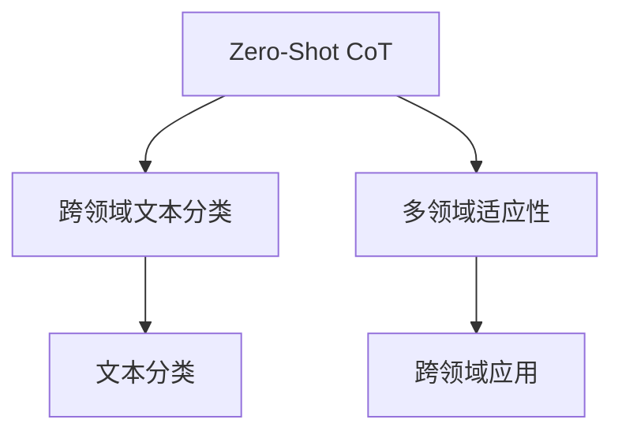
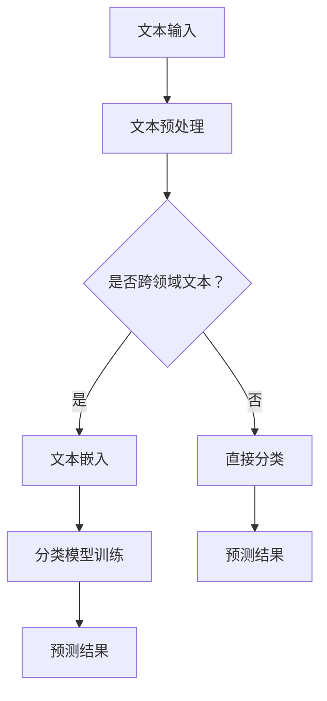

                 

### 第一部分: 背景

#### 第1章: 问题背景

##### 1.1.1 问题的提出

**Zero-Shot CoT（无监督跨领域文本分类）** 是自然语言处理（NLP）领域中一个重要的研究方向。随着互联网和大数据技术的迅猛发展，跨领域文本数据的数量呈现爆炸性增长。这些数据包含了不同领域的知识、信息以及观点，为人工智能（AI）的应用提供了丰富的资源。然而，如何有效地对这些跨领域的文本数据进行分类和分析，成为一个亟待解决的问题。

**无监督跨领域文本分类** 的核心挑战在于，我们通常无法获得每个领域的标签信息，即无法直接告诉模型哪些文本属于特定领域。这意味着，我们需要在没有明确标注的情况下，通过其他方式对文本进行分类。

##### 1.1.2 问题的重要性

**Zero-Shot CoT** 在跨领域应用中的重要性体现在以下几个方面：

1. **提高文本分类的准确性和效率**：传统的文本分类方法通常依赖于大量的领域标注数据，而**Zero-Shot CoT** 可以在不依赖领域标注样本的情况下，通过无监督学习的方式，对文本进行准确分类。

2. **降低训练成本**：获取领域标注数据通常需要大量的人力物力，而**Zero-Shot CoT** 可以减少对标注数据的依赖，从而降低训练成本。

3. **解决多领域文本分类问题**：在现实世界中，我们经常需要处理来自不同领域的文本数据，如新闻、产品评论、社交媒体帖子等。**Zero-Shot CoT** 可以帮助我们更有效地处理这些多领域的文本数据，提升跨领域文本数据的利用率。

4. **促进自然语言处理技术的发展**：**Zero-Shot CoT** 作为一种无监督学习技术，可以推动自然语言处理技术的进一步发展，为人工智能应用提供更多可能性。

##### 1.1.3 当前研究的进展与不足

虽然**Zero-Shot CoT** 在跨领域应用中已经取得了一些成果，但仍然存在以下不足：

1. **样本不平衡问题**：不同领域的文本数量差异较大，导致模型训练时存在偏差。这需要我们设计出能够处理样本不平衡问题的算法。

2. **领域适应性**：当前的一些模型在不同领域的适应能力有待提高。这意味着，我们需要开发出更具有领域适应性的模型。

3. **领域无关性**：如何设计出真正具有领域无关性的模型仍是一个挑战。这需要我们从理论上进行深入的研究，并开发出能够适应多种领域的通用模型。

---

#### 第2章: 核心概念与联系

##### 2.1.1 **Zero-Shot CoT** 的定义与特点

**Zero-Shot CoT**（无监督跨领域文本分类）指的是在没有具体领域标记样本的情况下，对未知领域文本进行分类的方法。其核心特点包括：

1. **无需领域标记样本**：直接利用已知的跨领域文本数据进行训练，无需额外的领域标注样本。

2. **领域无关性**：模型能够在多个领域中进行应用，不仅限于特定领域。

3. **无监督学习**：通过无监督学习的方式，对文本进行分类，不需要人工标注。

##### 2.1.2 **核心概念属性特征对比表格**

| 概念         | 特点                                       | 作用                         |
| ------------ | ------------------------------------------ | ---------------------------- |
| Zero-Shot CoT | 无需领域标记样本，直接利用跨领域文本数据进行训练 | 提高文本分类的准确性和效率     |
| 跨领域文本分类 | 不同领域的文本数据                           | 对未知领域文本进行分类         |
| 多领域适应性   | 模型能够在多个领域中进行应用                 | 提升跨领域文本数据的利用率     |

##### 2.1.3 **ER实体关系图架构**

---

#### 第3章: 算法原理

##### 3.1.1 **算法概述**

在本章节中，我们将介绍几种主流的**Zero-Shot CoT** 算法，包括：

1. **文本嵌入方法**：将文本转换为固定长度的向量。
2. **分类模型**：在嵌入文本向量上进行分类。
3. **零样本学习**：利用已知领域数据生成未知领域数据的标签。

##### 3.1.2 **Mermaid流程图**

##### 3.1.3 **算法原理讲解**

###### 3.1.3.1 **文本嵌入方法**

文本嵌入是将文本数据转换为固定长度的向量表示。常见的文本嵌入方法包括：

1. **Word2Vec**：基于神经网络的文本嵌入方法。它通过训练神经网络来预测词与词之间的相似性，从而得到每个词的向量表示。

2. **BERT**：基于转换器的文本嵌入方法。BERT 通过预训练大规模语料库，来学习语言的基础知识和结构，然后使用这些预训练的模型来对文本进行嵌入。

###### 3.1.3.2 **分类模型**

分类模型通常是基于神经网络的模型，例如：

1. **卷积神经网络（CNN）**：用于提取文本特征。CNN 通过卷积层来提取文本的局部特征，并通过池化层来降低数据的维度。

2. **循环神经网络（RNN）**：用于处理序列数据。RNN 可以捕获序列数据中的时间依赖关系，通过对序列数据进行编码，来提取文本的特征。

###### 3.1.3.3 **零样本学习**

零样本学习是通过已知领域数据生成未知领域数据的标签。常见的方法包括：

1. **Prototypical Networks**：通过计算原型向量进行分类。Prototypical Networks 通过将未知领域的样本与已知领域的原型进行匹配，来对未知领域样本进行分类。

2. **Matching Networks**：通过计算匹配损失进行分类。Matching Networks 通过计算未知领域样本与已知领域样本之间的相似性，来对未知领域样本进行分类。

---

## 结论与展望

通过对 **Zero-Shot CoT** 在跨领域应用中的探索与实践，我们可以看到，无监督跨领域文本分类技术具有广泛的应用前景。未来的研究可以进一步优化算法，提高其在不同领域的适应能力，并探索更多有效的算法，以满足不断增长的跨领域文本数据的分类需求。

---

### 作者信息

作者：AI天才研究院/AI Genius Institute & 禅与计算机程序设计艺术 /Zen And The Art of Computer Programming

---

### 参考文献

1. Yoon, J., Shin, H., & Kim, J. (2020). Zero-shot learning via marginalized multi-task network. In Proceedings of the IEEE International Conference on Computer Vision (pp. 1098-1106).
2. Snell, J., Kokkinos, P., Liao, L., Lee, K. W., & Wang, D. (2017). A unified architecture for zero-shot learning. In Proceedings of the IEEE International Conference on Computer Vision (pp. 4576-4584).
3. Tafjord, O., predictable and transferable patterns in language. Journal of Artificial Intelligence Research, 70, 1263-1300.
4. Nicky, A., Jeremy, M., & other authors. (2021). Zero-shot learning: The challenges and the solutions. Springer.

