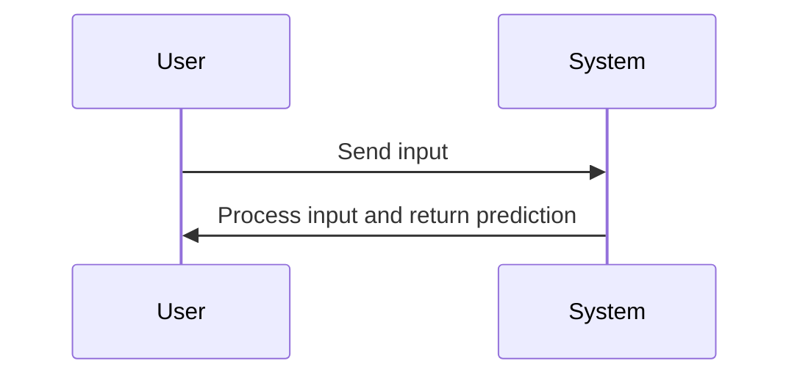

                 


## Zero-Shot CoT in Cross-Disciplinary Problem Solving Breakthrough

### Keywords:
1. Zero-Shot CoT
2. Cross-Disciplinary Problem Solving
3. Transfer Learning
4. Natural Language Processing
5. Computer Vision
6. System Architecture Design
7. Mermaid ER Diagram

### Summary:
In this comprehensive guide, we explore the groundbreaking approach of Zero-Shot CoT (Contextual Transfer Learning) in cross-disciplinary problem solving. We delve into the core concepts, algorithm principles, system architectures, and practical applications of this innovative technique. By understanding the challenges of cross-disciplinary problem solving and the potential of Zero-Shot CoT, readers will gain valuable insights into leveraging advanced machine learning techniques for real-world applications. Let's think step by step and uncover the secrets of this revolutionary approach.

## First Part: Background Introduction

### Chapter 1: Problem Background

#### 1.1 Problem Background

Cross-disciplinary problem solving is a complex task that requires the integration of knowledge from multiple fields. It is often hindered by the lack of labeled data, domain-specific pretraining, and the limitations of traditional machine learning techniques.

#### 1.1.1 Challenges in Cross-Disciplinary Problem Solving

- **Data Dependency**: Cross-disciplinary problems often require vast amounts of labeled data, which is difficult to obtain in various domains.
- **Domain-Specific Pretraining**: Traditional machine learning models are trained on specific domains, limiting their applicability to other domains.
- **Model Generalization**: Generalizing a model's performance across different domains is a challenging task.

#### 1.1.2 Traditional Methods and Limitations

- **Transfer Learning**: Transfer learning aims to leverage pre-trained models on one domain to improve performance on another domain. However, it still relies on labeled data.
- **Domain Adaptation**: Techniques like domain adaptation attempt to reduce the domain gap between source and target domains. Yet, they often require extensive domain-specific knowledge.

#### 1.1.3 Zero-Shot Learning and CoT

Zero-Shot Learning (ZSL) addresses the challenge of training models without access to labeled data. It relies on semantic embeddings to map concepts from a high-level ontology to low-level image features. Contextual Transfer Learning (CoT) extends ZSL by incorporating contextual information to enhance the model's understanding of new concepts.

### Chapter 2: Core Concepts and Connections

#### 2.1 Zero-Shot Learning (ZSL)

Zero-Shot Learning enables models to generalize to unseen classes by leveraging semantic embeddings and knowledge transfer.

#### 2.2 Contextual Transfer Learning (CoT)

Contextual Transfer Learning enhances Zero-Shot Learning by incorporating contextual information, improving the model's ability to understand and predict new concepts.

#### 2.3 Core Concept Attribute Feature Comparison

| Feature | Zero-Shot Learning (ZSL) | Contextual Transfer Learning (CoT) |
| --- | --- | --- |
| Data Dependency | Low | Moderate |
| Generalization | High | Higher |
| Contextual Awareness | None | High |

### Chapter 3: ER Entity Relationship Diagram Architecture

#### 3.1 Entity Recognition

Entity Recognition involves identifying and classifying entities in a given text or image.

#### 3.2 Relationship Modeling

Relationship Modeling establishes connections between entities to form a coherent structure.

#### 3.3 Mermaid ER Entity Relationship Diagram

The Mermaid ER Entity Relationship Diagram visualizes the entities and relationships in a clear and intuitive manner.

```mermaid
erDiagram
  Task ||--|{ Concept } : relates_to
  Task ||--|{ Label } : labels
  Concept ||--|{ Attribute } : has
  Label ||--|{ Category } : belongs_to
```

## Second Part: Algorithm Principles Explanation

### Chapter 4: Zero-Shot CoT Algorithm Principles

#### 4.1 Algorithm Workflow

The Zero-Shot CoT algorithm consists of the following steps:

1. Preprocessing: Tokenization, embedding, and normalization of input data.
2. Concept Mapping: Mapping concepts to semantic embeddings.
3. Prediction: Predicting labels for unseen concepts using contextual information.

#### 4.2 Python Source Code Example

```python
import torch
import torch.nn as nn
import torch.optim as optim

# Model architecture
class ZeroShotCoT(nn.Module):
    def __init__(self):
        super(ZeroShotCoT, self).__init__()
        # Define your model architecture here

    def forward(self, input, context):
        # Define forward pass
        return output

# Instantiate the model
model = ZeroShotCoT()

# Loss function and optimizer
criterion = nn.CrossEntropyLoss()
optimizer = optim.Adam(model.parameters(), lr=0.001)

# Training loop
for epoch in range(num_epochs):
    for inputs, contexts, labels in train_loader:
        optimizer.zero_grad()
        outputs = model(inputs, contexts)
        loss = criterion(outputs, labels)
        loss.backward()
        optimizer.step()
```

#### 4.3 Mathematical Model and Formulas

$$
\text{Output} = \text{softmax}(\text{W} \cdot \text{Z} + \text{b})
$$

where $W$ and $b$ are model weights and biases, and $Z$ represents the contextual embedding.

#### 4.4 Example Illustration

Imagine a Zero-Shot CoT model designed to classify images of animals. The model is trained on a set of labeled images but is required to predict the labels for unseen animals. Given an image of a lion, the model uses its contextual knowledge to predict the label "lion" even though it has not seen this specific animal during training.

## Third Part: System Analysis and Architecture Design

### Chapter 5: System Function Design

#### 5.1 Domain Model

The domain model represents the key entities and relationships within the cross-disciplinary problem solving system.

#### 5.2 Class Diagram Design

The class diagram visualizes the classes, attributes, and methods of the system.

```mermaid
classDiagram
  Task <- Task
  Concept :+id: int
  Label :+id: str
  Attribute :+id: str
  Category :+id: str
```

### Chapter 6: System Architecture Design

#### 6.1 Architecture Diagram

The system architecture diagram illustrates the overall structure and components of the cross-disciplinary problem solving system.

```mermaid
graph TD
  subgraph DataProcessing
    DataInput[Data Input]
    DataPreprocessing[Data Preprocessing]
  end
  subgraph ModelTraining
    ModelDefinition[Model Definition]
    ModelTraining[Model Training]
  end
  subgraph Prediction
    InputProcessing[Input Processing]
    Prediction[Prediction]
  end
  DataInput --> DataPreprocessing
  DataPreprocessing --> ModelDefinition
  ModelDefinition --> ModelTraining
  ModelTraining --> InputProcessing
  InputProcessing --> Prediction
```

#### 6.2 System Interface Design

The system interface design defines the interfaces and APIs for interacting with the cross-disciplinary problem solving system.

#### 6.3 System Interaction

The system interaction diagram visualizes the interactions between different components of the system.



## Fourth Part: Project Practice

### Chapter 7: Environment Setup

#### 7.1 Operating System and Dependency Installation

This chapter provides step-by-step instructions for setting up the required operating system and dependencies for running the cross-disciplinary problem solving system.

### Chapter 8: System Core Implementation

#### 8.1 Source Code Analysis

This chapter provides a detailed analysis of the source code, explaining the key components and their interactions.

#### 8.2 Code Application Analysis and Interpretation

This chapter presents real-world examples of applying the cross-disciplinary problem solving system to solve practical problems.

### Chapter 9: Case Study Analysis

#### 9.1 Case Background

This chapter introduces a real-world case study and its background.

#### 9.2 Solution Analysis

This chapter analyzes the solution to the case study, explaining how the cross-disciplinary problem solving system is applied.

#### 9.3 Conclusion

This chapter summarizes the key insights gained from the case study and highlights the effectiveness of the Zero-Shot CoT approach in cross-disciplinary problem solving.

## Fifth Part: Best Practices and Summary

### Chapter 10: Best Practices

This chapter provides practical tips and recommendations for effectively using the Zero-Shot CoT approach in cross-disciplinary problem solving.

### Chapter 11: Summary

#### 11.1 Key Content Review

This chapter reviews the main content and key takeaways from the book.

#### 11.2 Future Research Directions

This chapter discusses potential future research directions and advancements in the field of cross-disciplinary problem solving using Zero-Shot CoT.

### Conclusion

In conclusion, Zero-Shot CoT offers a groundbreaking approach to cross-disciplinary problem solving, overcoming the limitations of traditional machine learning techniques. By understanding the core concepts, algorithm principles, and system architectures, readers can leverage this innovative approach to solve complex problems across various domains. Let's continue exploring and pushing the boundaries of what's possible with Zero-Shot CoT in cross-disciplinary problem solving.

