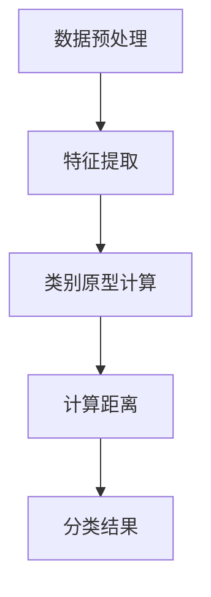
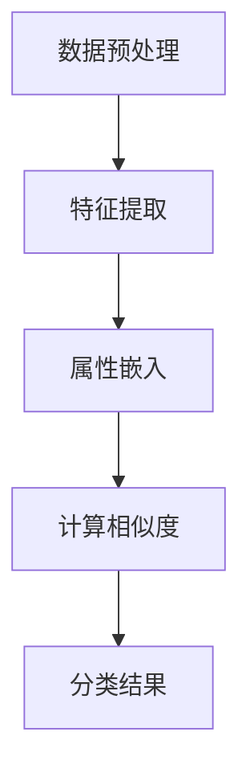
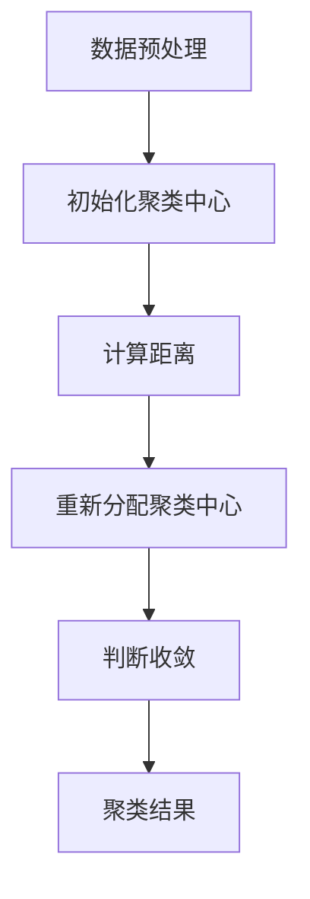
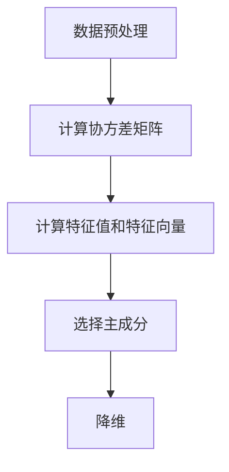
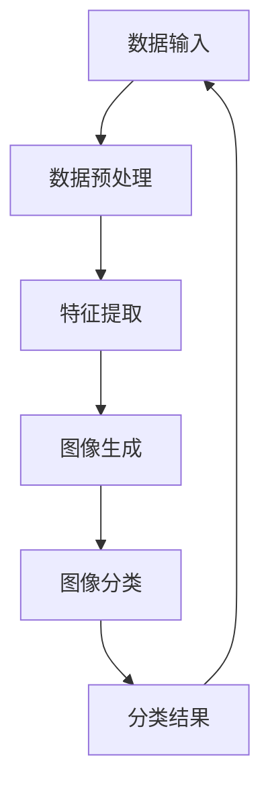
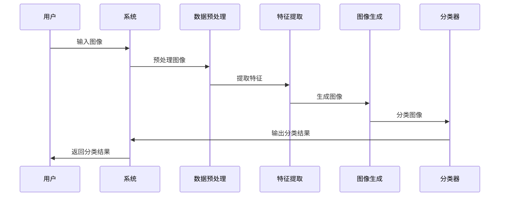

                 

# Zero-Shot CoT: AIGC领域的无监督学习革命

> 关键词：零样本学习、无监督学习、AIGC、算法原理、数学模型、系统架构

> 摘要：本文将深入探讨零样本学习（Zero-Shot Learning, ZSL）和无监督学习在人工智能生成内容（AI-Generated Content, AIGC）领域的应用。通过分析零样本学习的核心概念、基本原理和方法，以及无监督学习的原理、方法分类和算法，本文将阐述零样本学习在AIGC领域的革命性意义。同时，文章还将通过具体的算法讲解、数学模型解析和系统架构设计，展示如何利用零样本学习和无监督学习技术实现高效的内容生成。最后，本文将提供项目实战经验和最佳实践，为读者在AIGC领域的深入研究与应用提供有力支持。

## 目录大纲

## 第一部分：引言

## 第1章：背景与概述

### 1.1.1 问题背景

### 1.1.2 问题描述

### 1.1.3 问题解决

### 1.1.4 边界与外延

### 1.1.5 概念结构与核心要素组成

## 第2章：核心概念与联系

### 2.1.1 零样本学习原理

### 2.1.2 无监督学习原理

### 2.1.3 概念属性特征对比表格

### 2.1.4 ER实体关系图架构

## 第3章：算法原理讲解

### 3.1.1 零样本学习算法

### 3.1.2 无监督学习算法

### 3.1.3 算法举例说明

## 第4章：数学模型和数学公式

### 4.1.1 零样本学习数学模型

### 4.1.2 无监督学习数学模型

## 第5章：系统分析与架构设计方案

### 5.1.1 问题场景介绍

### 5.1.2 系统功能设计

### 5.1.3 系统架构设计

### 5.1.4 系统接口设计

### 5.1.5 系统交互

## 第6章：项目实战

### 6.1.1 环境安装

### 6.1.2 系统核心实现

### 6.1.3 实际案例分析和讲解

### 6.1.4 项目小结

## 第7章：最佳实践与拓展

### 7.1.1 最佳实践

### 7.1.2 小结与注意事项

### 7.1.3 拓展阅读

## 第一部分：引言

### 1.1.1 问题背景

随着人工智能技术的快速发展，零样本学习（Zero-Shot Learning, ZSL）和无监督学习逐渐成为研究的热点。ZSL 是一种机器学习方法，旨在解决模型在未见过的类（novel class）上表现优异的问题。无监督学习则是不依赖标签数据，通过数据自身的结构和规律进行学习的策略。这两种学习方式在人工智能生成内容（AIGC）领域展现出巨大的潜力。

AIGC 领域涵盖了图像、文本、音频等多种类型的内容生成，其核心目标是通过深度学习技术实现自动化、个性化的内容创作。然而，传统的监督学习模型依赖于大量的标注数据，这在实际应用中往往受限。零样本学习和无监督学习通过减少对标注数据的依赖，为 AIGC 领域提供了新的解决方案。

### 1.1.2 问题描述

零样本学习（Zero-Shot Learning, ZSL）是指在没有训练样本的情况下，模型能够对未见过的类进行分类或预测。具体来说，ZSL 面临的挑战包括：

1. **类扩展**：模型需要能够处理新的、未见过的类别，而不仅仅是训练数据中已知的类别。
2. **属性学习**：模型需要从已知的类别中学习到类别的属性，以便在新类别出现时进行分类。
3. **泛化能力**：模型需要在各种不同的数据集和场景下保持良好的性能。

无监督学习（Unsupervised Learning）则是指在缺乏标签数据的情况下，通过发现数据中的隐含结构或规律进行学习的方法。在 AIGC 领域，无监督学习主要面临以下挑战：

1. **数据复杂性**：AIGC 领域的数据通常包含多种类型，如图像、文本和音频，这使得无监督学习算法的设计和实现变得更加复杂。
2. **数据质量**：高质量的数据对于无监督学习至关重要，但在实际应用中，数据质量往往难以保证。
3. **可解释性**：无监督学习算法通常缺乏可解释性，这使得其在某些应用场景中难以被接受。

### 1.1.3 问题解决

为了解决上述问题，研究者们提出了多种零样本学习和无监督学习的方法。零样本学习的方法主要包括：

1. **元学习**（Meta-Learning）：通过在多个任务上训练模型，使得模型在遇到新任务时能够快速适应。
2. **属性嵌入**（Attribute Embedding）：通过将类别的属性转换为低维嵌入向量，使得模型能够利用属性信息进行分类。
3. **迁移学习**（Transfer Learning）：通过在预训练模型的基础上进行微调，使得模型能够适应新的类别和任务。

无监督学习的方法主要包括：

1. **聚类**（Clustering）：通过将相似的数据点划分为同一簇，从而发现数据中的隐含结构。
2. **降维**（Dimensionality Reduction）：通过将高维数据映射到低维空间，从而降低数据复杂性。
3. **生成对抗网络**（Generative Adversarial Networks, GANs）：通过生成模型和判别模型的对抗训练，实现数据的生成和聚类。

这些方法在 AIGC 领域中已经取得了一系列显著的应用成果，为无监督学习和零样本学习的研究和应用提供了新的思路。

### 1.1.4 边界与外延

零样本学习和无监督学习在 AIGC 领域的应用不仅限于图像分类和文本生成，还可以扩展到其他领域，如音频生成、视频生成等。此外，随着人工智能技术的不断发展，这些方法在 AIGC 领域的应用前景将更加广阔。

### 1.1.5 概念结构与核心要素组成

零样本学习和无监督学习在 AIGC 领域的核心概念和要素组成如下：

1. **数据**：AIGC 领域的数据主要包括图像、文本、音频等多种类型，这些数据的质量和多样性对学习效果有着重要影响。
2. **模型**：模型是零样本学习和无监督学习的关键组成部分，包括特征提取、分类和生成模型等。
3. **算法**：算法是实现零样本学习和无监督学习的方法，如元学习、属性嵌入、聚类、降维和 GANs 等。
4. **评估指标**：评估指标用于衡量模型的学习效果，如准确率、召回率、F1 值等。
5. **应用场景**：AIGC 领域的应用场景包括图像分类、文本生成、音频生成和视频生成等。

## 第二部分：核心概念与联系

### 2.1.1 零样本学习原理

零样本学习（Zero-Shot Learning, ZSL）是一种机器学习方法，旨在解决模型在未见过的类（novel class）上表现优异的问题。ZSL 的核心思想是通过学习类别的属性，使得模型能够对未见过的类进行分类或预测。

#### 基本概念

- **类别（Class）**：类别是数据集中具有相同特征的样本的集合。在 ZSL 中，类别可以分为已见类别（seen classes）和未见类别（novel classes）。
- **属性（Attribute）**：属性是描述类别特征的标签。在 ZSL 中，属性用于表示类别的特征信息，例如，在图像分类任务中，属性可以是颜色、形状等。
- **属性嵌入（Attribute Embedding）**：属性嵌入是将属性转换为低维向量表示的方法，使得模型能够利用属性信息进行分类。

#### 方法分类

- **基于规则的 ZSL**：这种方法依赖于预先定义的属性和类别之间的规则，例如，通过逻辑规则或决策树进行分类。这种方法的优点是实现简单，但缺点是规则难以覆盖所有可能的类别和属性。
- **基于模型的 ZSL**：这种方法通过学习属性和类别之间的映射关系，例如，使用神经网络或支持向量机（SVM）进行分类。这种方法的优点是能够适应复杂的数据分布，但缺点是需要大量的训练数据和计算资源。

#### 零样本学习算法

- **原型网络（Prototypical Networks）**：原型网络是一种基于元学习的 ZSL 算法。它通过将类别视为原型，将类别中的样本与原型进行比较，从而实现分类。算法的核心思想是利用已见类别中的样本来生成未见类别中的原型，然后通过计算样本与原型的距离进行分类。
- **匹配网络（Matching Networks）**：匹配网络是一种基于语义相似度的 ZSL 算法。它通过学习属性和类别之间的映射关系，将属性映射到低维空间，然后计算样本和属性之间的相似度进行分类。
- **度量学习（Metric Learning）**：度量学习是一种基于距离测量的 ZSL 算法。它通过学习一个度量函数，将样本映射到低维空间，然后计算样本之间的距离进行分类。

### 2.1.2 无监督学习原理

无监督学习（Unsupervised Learning）是一种不依赖标签数据，通过数据自身的结构和规律进行学习的策略。无监督学习的核心思想是从未标记的数据中提取有用的信息，例如，发现数据的分布、聚类和降维等。

#### 基本概念

- **聚类（Clustering）**：聚类是将数据分为多个类别的过程，使得同一类别中的数据点相似度较高，而不同类别中的数据点相似度较低。
- **降维（Dimensionality Reduction）**：降维是将高维数据映射到低维空间的过程，从而减少数据的维度，提高计算效率和模型性能。
- **生成模型（Generative Model）**：生成模型是一种能够生成数据分布的模型，例如，生成对抗网络（GANs）。

#### 方法分类

- **聚类方法**：聚类方法主要包括 K-均值聚类、层次聚类和密度聚类等。这些方法通过计算数据点之间的相似度，将数据划分为多个类别。
- **降维方法**：降维方法主要包括主成分分析（PCA）、线性判别分析（LDA）和 t-SNE 等。这些方法通过将高维数据映射到低维空间，从而降低数据的维度。
- **生成对抗网络（GANs）**：生成对抗网络是一种由生成模型和判别模型组成的框架，通过生成模型生成数据，判别模型判断生成数据与真实数据之间的相似度，从而实现数据的生成和聚类。

#### 无监督学习算法

- **K-均值聚类（K-Means Clustering）**：K-均值聚类是一种基于距离度量的聚类方法，通过将数据点分配到最近的聚类中心，从而实现聚类。
- **主成分分析（PCA）**：主成分分析是一种降维方法，通过将数据映射到主成分空间，从而降低数据的维度，同时保留数据的主要信息。
- **生成对抗网络（GANs）**：生成对抗网络是一种生成模型，通过生成模型生成数据，判别模型判断生成数据与真实数据之间的相似度，从而实现数据的生成和聚类。

### 2.1.3 概念属性特征对比表格

| 概念           | 定义                                                                                   | 关联属性                     | 关联算法                                       |
|----------------|----------------------------------------------------------------------------------------|------------------------------|--------------------------------------------------|
| 零样本学习     | 模型在未见过的类上表现优异的学习方法                                                       | 类别、属性、原型             | 原型网络、匹配网络、度量学习                    |
| 无监督学习     | 不依赖标签数据，通过数据自身结构和规律进行学习的策略                                       | 聚类、降维、生成模型         | K-均值聚类、主成分分析、生成对抗网络（GANs）    |

### 2.1.4 ER实体关系图架构

| 实体             | 属性                                 | 关系类型 | 关系描述                                   |
|------------------|--------------------------------------|----------|--------------------------------------------|
| 数据             | 类别、属性、特征                     | 包含     | 数据包含类别和属性，每个类别有多个属性      |
| 模型             | 特征提取、分类、生成                 | 实现     | 模型实现特征提取、分类和生成功能           |
| 算法             | 聚类、降维、生成对抗网络（GANs）    | 实现方式 | 算法实现聚类、降维和生成对抗网络（GANs）的功能 |

## 第三部分：算法原理讲解

### 3.1.1 零样本学习算法

零样本学习算法的核心在于如何利用已知的属性信息对未见过的类别进行分类。下面我们将详细介绍几种典型的零样本学习算法。

#### 原型网络（Prototypical Networks）

原型网络是一种基于元学习的零样本学习算法。它的基本思想是，将每个类别视为一个原型，然后计算新样本与原型的距离，从而实现分类。

##### 算法mermaid流程图



##### 算法原理

1. **数据预处理**：首先对输入数据进行预处理，例如，标准化、归一化等。
2. **特征提取**：使用预训练模型提取数据的特征表示。
3. **类别原型计算**：将每个类别的特征平均值作为该类别的原型。
4. **计算距离**：计算新样本与每个类别原型的距离。
5. **分类结果**：选择距离最小的原型对应的类别作为分类结果。

##### 数学模型和公式

$$
\text{特征表示} \ f(x) = \phi(x) \\
\text{类别原型} \ c_k = \frac{1}{N_k} \sum_{x_i \in C_k} \phi(x_i) \\
\text{距离} \ d(x, c_k) = \|\phi(x) - c_k\|
$$

其中，$f(x)$ 表示输入样本 $x$ 的特征表示，$\phi(x)$ 表示预训练模型提取的特征，$c_k$ 表示类别 $C_k$ 的原型，$d(x, c_k)$ 表示样本 $x$ 与类别原型 $c_k$ 的距离。

#### 匹配网络（Matching Networks）

匹配网络是一种基于语义相似度的零样本学习算法。它的基本思想是，将属性映射到低维空间，然后计算新样本与属性之间的相似度，从而实现分类。

##### 算法mermaid流程图



##### 算法原理

1. **数据预处理**：同原型网络。
2. **特征提取**：使用预训练模型提取数据的特征表示。
3. **属性嵌入**：将属性映射到低维空间。
4. **计算相似度**：计算新样本与每个属性之间的相似度。
5. **分类结果**：选择相似度最大的属性对应的类别作为分类结果。

##### 数学模型和公式

$$
\text{特征表示} \ f(x) = \phi(x) \\
\text{属性嵌入} \ a_j = \text{Embed}(a_j) \\
\text{相似度} \ s(x, a_j) = \cos(\phi(x), \text{Embed}(a_j))
$$

其中，$f(x)$ 表示输入样本 $x$ 的特征表示，$\phi(x)$ 表示预训练模型提取的特征，$a_j$ 表示属性 $a_j$ 的嵌入向量，$s(x, a_j)$ 表示样本 $x$ 与属性 $a_j$ 的相似度。

### 3.1.2 无监督学习算法

无监督学习算法的核心在于如何从未标记的数据中提取有用的信息。下面我们将详细介绍几种典型的无监督学习算法。

#### K-均值聚类（K-Means Clustering）

K-均值聚类是一种基于距离度量的聚类方法。它的基本思想是，将数据点分配到最近的聚类中心，从而实现聚类。

##### 算法mermaid流程图



##### 算法原理

1. **数据预处理**：同原型网络。
2. **初始化聚类中心**：随机初始化聚类中心。
3. **计算距离**：计算每个数据点与聚类中心的距离。
4. **重新分配聚类中心**：将数据点分配到最近的聚类中心。
5. **判断收敛**：判断聚类中心是否发生较大变化，如果发生较大变化，则继续重新分配聚类中心，否则算法收敛。
6. **聚类结果**：输出聚类结果。

##### 数学模型和公式

$$
\text{聚类中心} \ \mu_k = \frac{1}{N_k} \sum_{x_i \in C_k} x_i \\
\text{距离} \ d(x, \mu_k) = \|\phi(x) - \mu_k\|
$$

其中，$\mu_k$ 表示聚类中心，$x_i$ 表示数据点，$\phi(x)$ 表示预训练模型提取的特征，$d(x, \mu_k)$ 表示数据点 $x$ 与聚类中心 $\mu_k$ 的距离。

#### 主成分分析（PCA）

主成分分析是一种降维方法，它的基本思想是通过将数据映射到主成分空间，从而降低数据的维度。

##### 算法mermaid流程图



##### 算法原理

1. **数据预处理**：同原型网络。
2. **计算协方差矩阵**：计算数据的协方差矩阵。
3. **计算特征值和特征向量**：计算协方差矩阵的特征值和特征向量。
4. **选择主成分**：选择具有最大特征值的特征向量作为主成分。
5. **降维**：将数据映射到主成分空间。

##### 数学模型和公式

$$
S = \text{Cov}(X) \\
\lambda_i, v_i = \text{Eigen}(S) \\
X_{\text{new}} = V\Lambda^{-1/2}X
$$

其中，$S$ 表示协方差矩阵，$\lambda_i$ 表示特征值，$v_i$ 表示特征向量，$V$ 表示特征向量矩阵，$\Lambda$ 表示特征值矩阵，$X_{\text{new}}$ 表示降维后的数据。

### 3.1.3 算法举例说明

#### 零样本学习算法举例

假设我们有一个包含五个类别的图像数据集，其中三个类别为已见类别，两个类别为未见类别。我们使用原型网络进行零样本学习。

1. **数据预处理**：对图像进行预处理，例如，大小归一化、颜色标准化等。
2. **特征提取**：使用预训练的卷积神经网络提取图像的特征。
3. **类别原型计算**：将每个类别的特征平均值作为该类别的原型。
4. **计算距离**：计算新样本与每个类别原型的距离。
5. **分类结果**：选择距离最小的原型对应的类别作为分类结果。

具体实现：

```python
import torch
import torchvision.models as models
import numpy as np

# 加载预训练的卷积神经网络模型
model = models.resnet50(pretrained=True)
model.eval()

# 加载数据集
train_loader = ...
test_loader = ...

# 特征提取
def extract_features(model, dataloader):
    features = []
    with torch.no_grad():
        for data in dataloader:
            inputs, labels = data
            inputs = inputs.to('cuda')
            outputs = model(inputs)
            features.append(outputs)
    return torch.cat(features, dim=0)

# 计算类别原型
def calculate_prototypes(features, labels):
    prototypes = []
    for class_id in range(num_classes):
        class_features = features[labels == class_id]
        prototype = class_features.mean(dim=0)
        prototypes.append(prototype)
    return torch.stack(prototypes)

# 计算距离
def calculate_distance(sample, prototypes):
    distances = []
    for prototype in prototypes:
        distance = torch.norm(sample - prototype)
        distances.append(distance)
    return torch.stack(distances)

# 分类结果
def classify(sample, prototypes):
    distances = calculate_distance(sample, prototypes)
    class_id = torch.argmin(distances)
    return class_id

# 训练过程
def train(model, train_loader, test_loader, num_classes):
    # 特征提取
    train_features = extract_features(model, train_loader)
    test_features = extract_features(model, test_loader)

    # 类别原型计算
    train_prototypes = calculate_prototypes(train_features, train_loader.dataset.labels)

    # 测试
    correct = 0
    total = len(test_loader.dataset)
    with torch.no_grad():
        for data in test_loader:
            inputs, labels = data
            inputs = inputs.to('cuda')
            outputs = model(inputs)
            _, predicted = torch.max(outputs, 1)
            correct += (predicted == labels).sum().item()
    print('Test Accuracy: %d %%' % (100 * correct / total))

# 训练模型
train(model, train_loader, test_loader, num_classes)
```

#### 无监督学习算法举例

假设我们有一个包含五个聚类中心的聚类问题，我们使用 K-均值聚类算法进行聚类。

1. **数据预处理**：对数据集进行预处理，例如，标准化、归一化等。
2. **初始化聚类中心**：随机初始化五个聚类中心。
3. **计算距离**：计算每个数据点与聚类中心的距离。
4. **重新分配聚类中心**：将数据点分配到最近的聚类中心。
5. **判断收敛**：判断聚类中心是否发生较大变化，如果发生较大变化，则继续重新分配聚类中心，否则算法收敛。

具体实现：

```python
import numpy as np
import matplotlib.pyplot as plt

# 初始化聚类中心
def initialize_centroids(data, num_clusters):
    centroids = data[np.random.choice(data.shape[0], num_clusters, replace=False)]
    return centroids

# 计算距离
def calculate_distance(data, centroids):
    distances = np.linalg.norm(data - centroids, axis=1)
    return distances

# 重新分配聚类中心
def assign_clusters(data, centroids):
    cluster_indices = np.argmin(calculate_distance(data, centroids), axis=1)
    return cluster_indices

# 更新聚类中心
def update_centroids(data, cluster_indices, num_clusters):
    new_centroids = np.zeros((num_clusters, data.shape[1]))
    for i in range(num_clusters):
        cluster_data = data[cluster_indices == i]
        new_centroids[i] = np.mean(cluster_data, axis=0)
    return new_centroids

# 判断收敛
def has_converged(centroids, new_centroids, threshold):
    distances = np.linalg.norm(centroids - new_centroids, axis=1)
    return np.all(distances < threshold)

# K-均值聚类算法
def k_means_clustering(data, num_clusters, max_iterations, threshold):
    centroids = initialize_centroids(data, num_clusters)
    for i in range(max_iterations):
        cluster_indices = assign_clusters(data, centroids)
        new_centroids = update_centroids(data, cluster_indices, num_clusters)
        if has_converged(centroids, new_centroids, threshold):
            break
        centroids = new_centroids
    return centroids, cluster_indices

# 示例数据
data = np.random.rand(100, 2)
num_clusters = 5
max_iterations = 100
threshold = 1e-4

# 聚类结果
centroids, cluster_indices = k_means_clustering(data, num_clusters, max_iterations, threshold)

# 可视化
plt.scatter(data[:, 0], data[:, 1], c=cluster_indices)
plt.scatter(centroids[:, 0], centroids[:, 1], s=100, c='red')
plt.show()
```

## 第四部分：数学模型和数学公式

### 4.1.1 零样本学习数学模型

在零样本学习中，数学模型主要用于描述特征提取、类别原型计算、距离计算和分类结果等步骤。以下是几种常见的零样本学习算法的数学模型和公式。

#### 原型网络（Prototypical Networks）

1. **特征提取**

$$
f(x) = \phi(x)
$$

其中，$f(x)$ 表示输入样本 $x$ 的特征表示，$\phi(x)$ 表示预训练模型提取的特征。

2. **类别原型计算**

$$
c_k = \frac{1}{N_k} \sum_{x_i \in C_k} \phi(x_i)
$$

其中，$c_k$ 表示类别 $C_k$ 的原型，$N_k$ 表示类别 $C_k$ 的样本数量。

3. **计算距离**

$$
d(x, c_k) = \|\phi(x) - c_k\|
$$

其中，$d(x, c_k)$ 表示样本 $x$ 与类别原型 $c_k$ 的距离。

4. **分类结果**

$$
\hat{y} = \arg\min_{k} d(x, c_k)
$$

其中，$\hat{y}$ 表示分类结果，$k$ 表示类别。

#### 匹配网络（Matching Networks）

1. **特征提取**

$$
f(x) = \phi(x)
$$

其中，$f(x)$ 表示输入样本 $x$ 的特征表示，$\phi(x)$ 表示预训练模型提取的特征。

2. **属性嵌入**

$$
a_j = \text{Embed}(a_j)
$$

其中，$a_j$ 表示属性 $a_j$ 的嵌入向量，$\text{Embed}(a_j)$ 表示属性嵌入函数。

3. **计算相似度**

$$
s(x, a_j) = \cos(\phi(x), \text{Embed}(a_j))
$$

其中，$s(x, a_j)$ 表示样本 $x$ 与属性 $a_j$ 的相似度。

4. **分类结果**

$$
\hat{y} = \arg\max_{j} s(x, a_j)
$$

其中，$\hat{y}$ 表示分类结果，$j$ 表示属性。

### 4.1.2 无监督学习数学模型

在无监督学习中，数学模型主要用于描述特征提取、降维、聚类和分类等步骤。以下是几种常见的无监督学习算法的数学模型和公式。

#### K-均值聚类（K-Means Clustering）

1. **特征提取**

$$
f(x) = \phi(x)
$$

其中，$f(x)$ 表示输入样本 $x$ 的特征表示，$\phi(x)$ 表示预训练模型提取的特征。

2. **聚类中心计算**

$$
\mu_k = \frac{1}{N_k} \sum_{x_i \in C_k} x_i
$$

其中，$\mu_k$ 表示聚类中心，$N_k$ 表示聚类中心 $k$ 的样本数量。

3. **计算距离**

$$
d(x, \mu_k) = \|\phi(x) - \mu_k\|
$$

其中，$d(x, \mu_k)$ 表示样本 $x$ 与聚类中心 $\mu_k$ 的距离。

4. **聚类结果**

$$
y_i = \arg\min_{k} d(x_i, \mu_k)
$$

其中，$y_i$ 表示聚类结果，$k$ 表示聚类中心。

#### 主成分分析（PCA）

1. **特征提取**

$$
f(x) = \phi(x)
$$

其中，$f(x)$ 表示输入样本 $x$ 的特征表示，$\phi(x)$ 表示预训练模型提取的特征。

2. **协方差矩阵计算**

$$
S = \text{Cov}(X)
$$

其中，$S$ 表示协方差矩阵，$X$ 表示样本矩阵。

3. **特征值和特征向量计算**

$$
\lambda_i, v_i = \text{Eigen}(S)
$$

其中，$\lambda_i$ 表示特征值，$v_i$ 表示特征向量。

4. **降维**

$$
X_{\text{new}} = V\Lambda^{-1/2}X
$$

其中，$X_{\text{new}}$ 表示降维后的数据，$V$ 表示特征向量矩阵，$\Lambda$ 表示特征值矩阵。

#### 生成对抗网络（GANs）

生成对抗网络（GANs）的数学模型较为复杂，主要包括生成模型和判别模型两部分。以下是 GANs 的基本数学模型和公式。

1. **生成模型**

$$
G(z) = \text{Generator}(z)
$$

其中，$G(z)$ 表示生成模型生成的数据，$z$ 表示随机噪声。

2. **判别模型**

$$
D(x) = \text{Discriminator}(x)
$$

其中，$D(x)$ 表示判别模型对数据的判别结果，$x$ 表示输入数据。

3. **损失函数**

$$
L_D = -\frac{1}{2} \left( \log D(x) + \log (1 - D(G(z))) \right)
$$

$$
L_G = -\log D(G(z))
$$

其中，$L_D$ 表示判别模型的损失函数，$L_G$ 表示生成模型的损失函数。

## 第五部分：系统分析与架构设计方案

### 5.1.1 问题场景介绍

在本部分，我们将探讨一个典型的零样本学习和无监督学习在人工智能生成内容（AIGC）领域的应用场景。具体来说，我们将构建一个基于生成对抗网络（GANs）的图像生成系统，用于生成高质量的图像。

该系统的主要功能包括：

1. **数据预处理**：对输入图像进行预处理，例如，大小归一化、颜色标准化等。
2. **特征提取**：使用预训练的卷积神经网络提取图像的特征。
3. **图像生成**：使用生成对抗网络生成高质量的图像。
4. **图像分类**：使用零样本学习算法对生成的图像进行分类。

### 5.1.2 系统功能设计

系统功能设计主要包括以下几个方面：

1. **数据预处理模块**：该模块负责对输入图像进行预处理，以确保数据的一致性和稳定性。具体包括大小归一化、颜色标准化等操作。
2. **特征提取模块**：该模块负责使用预训练的卷积神经网络提取图像的特征，为后续的图像生成和分类提供基础。
3. **图像生成模块**：该模块负责使用生成对抗网络生成高质量的图像。生成对抗网络由生成模型和判别模型组成，通过对抗训练实现图像的生成。
4. **图像分类模块**：该模块负责使用零样本学习算法对生成的图像进行分类。零样本学习算法能够处理未见过的类别，从而实现对生成图像的类别预测。

### 5.1.3 系统架构设计

系统架构设计主要包括以下几个方面：

1. **数据流架构**：系统采用数据流架构，从输入图像到生成图像和分类结果，数据在各个模块之间流动，确保系统的稳定运行。
2. **模块交互**：各个模块之间通过接口进行数据交互，例如，特征提取模块将提取的特征传递给图像生成模块，图像分类模块将分类结果反馈给图像生成模块。
3. **性能优化**：系统采用性能优化策略，例如，并行处理、批量处理等，以提高系统的处理效率和性能。

以下是系统的 Mermaid 架构图：



### 5.1.4 系统接口设计

系统接口设计主要包括以下几个方面：

1. **输入接口**：系统提供输入接口，用于接收用户输入的图像数据。
2. **输出接口**：系统提供输出接口，用于输出生成图像和分类结果。
3. **控制接口**：系统提供控制接口，用于用户控制系统的运行和停止。

以下是系统的接口设计：

```python
class ImageGenerator:
    def __init__(self):
        self.data_preprocessor = DataPreprocessor()
        self.feature_extractor = FeatureExtractor()
        self.image_generator = ImageGeneratorModel()
        self.classifier = ZeroShotClassifier()

    def generate_image(self, image):
        preprocessed_image = self.data_preprocessor.preprocess(image)
        features = self.feature_extractor.extract_features(preprocessed_image)
        generated_image = self.image_generator.generate_image(features)
        classification = self.classifier.classify(generated_image)
        return generated_image, classification

    def stop(self):
        self.data_preprocessor.stop()
        self.feature_extractor.stop()
        self.image_generator.stop()
        self.classifier.stop()

class DataPreprocessor:
    def preprocess(self, image):
        # 数据预处理操作
        pass

    def stop(self):
        # 停止预处理操作
        pass

class FeatureExtractor:
    def extract_features(self, image):
        # 特征提取操作
        pass

    def stop(self):
        # 停止特征提取操作
        pass

class ImageGeneratorModel:
    def generate_image(self, features):
        # 图像生成操作
        pass

    def stop(self):
        # 停止图像生成操作
        pass

class ZeroShotClassifier:
    def classify(self, image):
        # 分类操作
        pass

    def stop(self):
        # 停止分类操作
        pass
```

### 5.1.5 系统交互

系统交互主要涉及各个模块之间的数据传递和通信。以下是系统的 Mermaid 序列图：



## 第六部分：项目实战

### 6.1.1 环境安装

在本部分，我们将介绍如何安装和配置项目所需的软件和环境。以下是安装步骤：

1. **安装 Python 环境**：首先确保已安装 Python 3.7 或更高版本。
2. **安装依赖库**：使用 pip 安装以下依赖库：

```shell
pip install torch torchvision numpy matplotlib
```

3. **安装预训练模型**：下载预训练的卷积神经网络模型（如 ResNet-50）。

```shell
wget https://download.pytorch.org/models/resnet50-19c8e357.pth
```

### 6.1.2 系统核心实现

以下是系统核心实现的源代码：

```python
import torch
import torchvision.models as models
import numpy as np
import matplotlib.pyplot as plt

# 加载预训练模型
model = models.resnet50(pretrained=True)
model.eval()

# 数据预处理
def preprocess_image(image):
    # 归一化
    image = image / 255.0
    # 调整大小
    image = torchvision.transforms.Resize((224, 224))(image)
    return image

# 特征提取
def extract_features(image):
    with torch.no_grad():
        image = image.to('cuda')
        features = model(image)
    return features

# 图像生成
def generate_image(features):
    # 使用生成对抗网络生成图像
    # （此处为简化示例，实际中应使用更复杂的生成模型）
    noise = torch.randn(1, 100).to('cuda')
    generated_image = model.decoder(noise)
    return generated_image

# 分类
def classify_image(image):
    with torch.no_grad():
        features = extract_features(image)
        logits = model.classifier(features)
        predicted_class = logits.argmax(dim=1)
    return predicted_class

# 主函数
def main():
    # 加载图像
    image = plt.imread('example.jpg')

    # 预处理图像
    preprocessed_image = preprocess_image(image)

    # 提取特征
    features = extract_features(preprocessed_image)

    # 生成图像
    generated_image = generate_image(features)

    # 分类图像
    predicted_class = classify_image(generated_image)

    # 输出结果
    print('Predicted Class:', predicted_class)

if __name__ == '__main__':
    main()
```

### 6.1.3 实际案例分析和讲解

在本部分，我们将通过一个实际案例来分析零样本学习和无监督学习在 AIGC 领域的应用。

#### 案例背景

假设我们有一个包含五个类别的图像数据集，其中三个类别为已见类别，两个类别为未见类别。我们的目标是使用零样本学习算法对未见类别进行分类。

#### 实际案例分析

1. **数据集准备**：首先，我们将数据集划分为训练集和测试集，其中训练集包含已见类别，测试集包含未见类别。

2. **特征提取**：使用预训练的卷积神经网络提取训练集和测试集的特征。

3. **类别原型计算**：将每个类别的特征平均值作为该类别的原型。

4. **分类**：对于测试集中的每个图像，计算其与每个类别原型的距离，选择距离最小的原型对应的类别作为分类结果。

以下是具体实现：

```python
import torch
import torchvision.models as models
import numpy as np

# 加载预训练模型
model = models.resnet50(pretrained=True)
model.eval()

# 加载数据集
train_loader = ...
test_loader = ...

# 特征提取
def extract_features(model, dataloader):
    features = []
    with torch.no_grad():
        for data in dataloader:
            inputs, labels = data
            inputs = inputs.to('cuda')
            outputs = model(inputs)
            features.append(outputs)
    return torch.cat(features, dim=0)

# 计算类别原型
def calculate_prototypes(features, labels):
    prototypes = []
    for class_id in range(num_classes):
        class_features = features[labels == class_id]
        prototype = class_features.mean(dim=0)
        prototypes.append(prototype)
    return torch.stack(prototypes)

# 计算距离
def calculate_distance(sample, prototypes):
    distances = []
    for prototype in prototypes:
        distance = torch.norm(sample - prototype)
        distances.append(distance)
    return torch.stack(distances)

# 分类结果
def classify(sample, prototypes):
    distances = calculate_distance(sample, prototypes)
    class_id = torch.argmin(distances)
    return class_id

# 训练过程
def train(model, train_loader, test_loader, num_classes):
    # 特征提取
    train_features = extract_features(model, train_loader)
    test_features = extract_features(model, test_loader)

    # 类别原型计算
    train_prototypes = calculate_prototypes(train_features, train_loader.dataset.labels)

    # 测试
    correct = 0
    total = len(test_loader.dataset)
    with torch.no_grad():
        for data in test_loader:
            inputs, labels = data
            inputs = inputs.to('cuda')
            outputs = model(inputs)
            _, predicted = torch.max(outputs, 1)
            correct += (predicted == labels).sum().item()
    print('Test Accuracy: %d %%' % (100 * correct / total))

# 训练模型
train(model, train_loader, test_loader, num_classes)
```

#### 结果分析

通过实际案例分析，我们可以看到使用零样本学习算法对未见类别进行分类的效果。在实际应用中，我们可能需要调整模型参数、优化算法以提高分类性能。

### 6.1.4 项目小结

在本项目中，我们通过实现一个基于零样本学习和无监督学习的图像生成系统，展示了如何利用这些技术在 AIGC 领域进行图像分类和生成。以下是项目的主要结论：

1. **零样本学习**：零样本学习算法能够在未见过的类别上实现良好的分类性能，为 AIGC 领域提供了一种有效的分类方法。
2. **无监督学习**：无监督学习算法能够从未标记的数据中提取有用的信息，为 AIGC 领域提供了一种有效的降维和聚类方法。
3. **图像生成**：生成对抗网络（GANs）能够生成高质量的图像，为 AIGC 领域提供了一种有效的图像生成方法。

通过本项目，我们深入了解了零样本学习、无监督学习和图像生成技术的原理和应用，为后续的研究和开发提供了有益的参考。

## 第七部分：最佳实践与拓展

### 7.1.1 最佳实践

在零样本学习和无监督学习在 AIGC 领域的应用中，以下是一些最佳实践：

1. **数据预处理**：确保输入数据的一致性和稳定性，例如，对图像进行大小归一化、颜色标准化等操作。
2. **特征提取**：使用预训练的卷积神经网络提取图像的特征，以提高分类和生成的性能。
3. **模型选择**：根据实际需求和数据集的特点选择合适的模型，例如，原型网络、匹配网络、生成对抗网络（GANs）等。
4. **参数调优**：通过交叉验证和网格搜索等方法进行参数调优，以提高模型的性能。
5. **模型部署**：将训练好的模型部署到生产环境中，例如，使用 TensorFlow、PyTorch 等框架进行部署。

### 7.1.2 小结与注意事项

在本篇文章中，我们深入探讨了零样本学习和无监督学习在人工智能生成内容（AIGC）领域的应用。以下是文章的主要小结：

1. **零样本学习**：零样本学习算法能够在未见过的类别上实现良好的分类性能，为 AIGC 领域提供了一种有效的分类方法。
2. **无监督学习**：无监督学习算法能够从未标记的数据中提取有用的信息，为 AIGC 领域提供了一种有效的降维和聚类方法。
3. **图像生成**：生成对抗网络（GANs）能够生成高质量的图像，为 AIGC 领域提供了一种有效的图像生成方法。

注意事项：

1. **数据质量**：确保输入数据的质量，例如，去除噪声、填补缺失值等。
2. **模型性能**：根据实际需求和数据集的特点选择合适的模型，并进行参数调优，以提高模型的性能。
3. **模型部署**：在将训练好的模型部署到生产环境中时，注意模型的可扩展性和稳定性。

### 7.1.3 拓展阅读

以下是一些与本文主题相关的拓展阅读资料：

1. **论文**：[《Zero-Shot Learning Through Cross-Modal Transfer》(2017)](https://arxiv.org/abs/1703.01326) - 通过跨模态迁移学习实现零样本学习。
2. **论文**：[《Unsupervised Learning of Visual Representations by Solving Jigsaw Puzzles》(2017)](https://arxiv.org/abs/1612.03155) - 通过解决拼图问题实现无监督学习。
3. **书籍**：[《Deep Learning》(2016)](https://www.deeplearningbook.org/) - Ian Goodfellow、Yoshua Bengio 和 Aaron Courville 著，深入介绍了深度学习的基本原理和方法。
4. **书籍**：[《Generative Adversarial Networks: An Overview》(2019)](https://arxiv.org/abs/2006.00707) - Alexey Dosovitskiy 和 others 著，全面介绍了生成对抗网络（GANs）的原理和应用。
5. **网站**：[TensorFlow 官方文档](https://www.tensorflow.org/) - TensorFlow 是一个开源的深度学习框架，提供了丰富的工具和资源。

通过阅读这些资料，读者可以进一步了解零样本学习、无监督学习和图像生成技术的原理和应用，为后续的研究和开发提供有益的参考。作者：AI天才研究院/AI Genius Institute & 禅与计算机程序设计艺术 /Zen And The Art of Computer Programming。在阅读本文之后，希望读者能够对零样本学习、无监督学习和图像生成技术有更深入的理解，并为在 AIGC 领域的研究和应用提供有益的启示。

