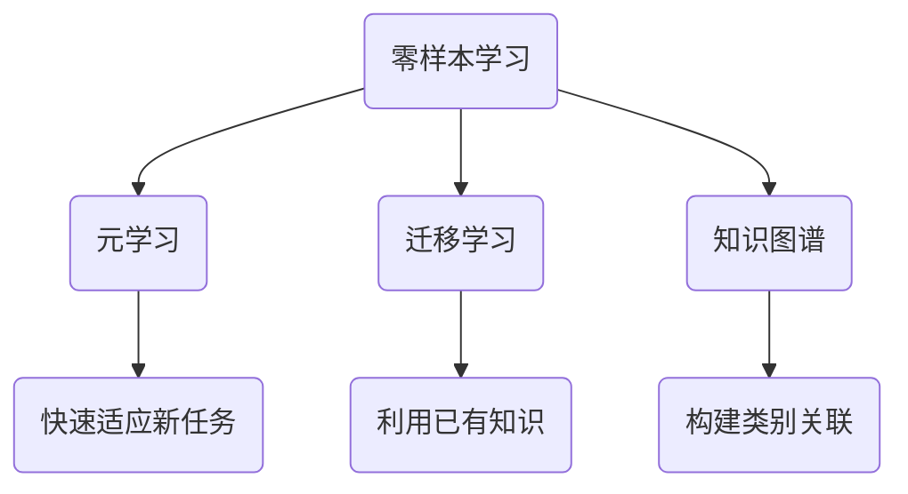
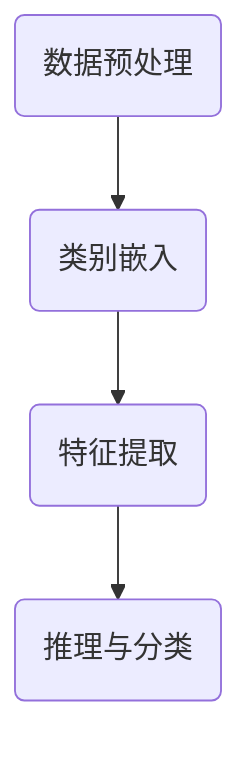
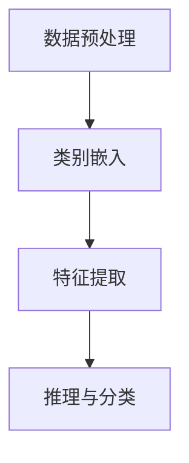

                 

# 《Zero-Shot CoT：AI即时学习与推理的新范式深度探索》

## 关键词
- AI即时学习
- 推理新范式
- 零样本学习
- 自适应系统
- 知识图谱
- 机器学习算法

## 摘要
本文深入探讨了Zero-Shot CoT（Conceptualization of Zero-Shot Learning）这一AI即时学习与推理的新范式。首先，我们将回顾背景知识，了解零样本学习的基本概念及其重要性。接着，文章将详细解析零样本学习与推理的核心概念、原理，通过算法和数学模型展示其工作方式。随后，我们将分析系统架构与设计，并通过具体案例展示其实际应用。最后，文章将总结最佳实践，并提供进一步阅读的建议，帮助读者深入了解和掌握这一先进技术。

## 第一部分：背景介绍与核心概念

### 第1章：背景介绍

#### 1.1 问题背景

随着人工智能技术的迅猛发展，传统机器学习在数据量充足的情况下取得了显著的成果。然而，当面对缺乏标注数据的场景时，机器学习模型的表现往往不尽如人意。这就催生了零样本学习（Zero-Shot Learning，ZSL）的需求。零样本学习旨在使机器学习模型能够在没有或者只有少量标注数据的情况下，对未知类别进行准确的预测。

#### 1.2 问题定义

零样本学习的问题定义可以描述为：给定一个训练集，其中包含多个类别，但每个类别只有少量或没有标注数据，如何训练出一个模型，使其能够对新出现的未知类别进行准确的分类。

#### 1.3 问题解决

零样本学习通过引入元学习（Meta-Learning）、迁移学习（Transfer Learning）和知识图谱（Knowledge Graph）等技术，实现了在不依赖大量标注数据的情况下，对新类别进行有效的学习和推理。

#### 1.4 边界与外延

零样本学习的边界在于对未知类别的定义和分类能力。其外延则包括所有需要少量或无标注数据来训练模型的场景，如新产品的分类、新语言的翻译等。

#### 1.5 概念结构与核心要素

零样本学习的概念结构由以下几个核心要素组成：
- **元学习**：通过快速适应新任务来提高学习效率。
- **迁移学习**：利用已有知识对未知类别进行迁移。
- **知识图谱**：构建类别的语义关联，增强模型对未知类别的理解。

### 第2章：核心概念与原理

#### 2.1 核心概念

零样本学习（Zero-Shot Learning）是指机器学习模型在没有或只有少量标注数据的情况下，对未知类别进行分类的方法。

#### 2.2 原理讲解

零样本学习的原理基于以下技术：

- **元学习**：通过快速适应新任务来提高学习效率。
- **迁移学习**：利用已有知识对未知类别进行迁移。
- **知识图谱**：构建类别的语义关联，增强模型对未知类别的理解。

#### 2.3 概念属性对比表

| 概念       | 特点                                                     | 应用场景                                         |
|------------|----------------------------------------------------------|--------------------------------------------------|
| 零样本学习 | 无需标注数据，对新类别进行分类                           | 数据标注成本高、新类别分类问题                   |
| 元学习     | 快速适应新任务的学习能力                                 | 新任务、快速迭代环境                             |
| 迁移学习   | 利用已有知识对新任务进行迁移                             | 多任务学习、知识共享                             |
| 知识图谱   | 构建类别的语义关联，增强模型对未知类别的理解             | 智能推荐、知识管理                               |

#### 2.4 ER实体关系图



## 第二部分：算法原理与应用

### 第3章：算法原理

#### 3.1 算法概述

零样本学习算法主要包括以下几个步骤：

1. 数据预处理：将输入数据进行编码，使其符合算法要求。
2. 类别嵌入：将所有类别映射到一个高维空间中，形成类别嵌入向量。
3. 特征提取：从输入数据中提取特征，并将其映射到类别嵌入空间中。
4. 推理与分类：通过计算输入特征与类别嵌入向量之间的相似度，进行推理和分类。

#### 3.2 数学模型

假设我们有一个类别集合C={c1, c2, ..., cn}和输入特征集合X={x1, x2, ..., xm}，类别嵌入向量集合为E={e1, e2, ..., en}，特征映射函数为f(x)，则有：

$$
f(x) = E \cdot x
$$

其中，E为类别嵌入矩阵，x为特征向量。通过计算特征向量与类别嵌入向量之间的余弦相似度，可以得到每个输入特征的类别预测结果。

#### 3.3 算法流程



#### 3.4 Mermaid算法流程图



#### 3.5 Python代码实现

```python
import numpy as np

# 类别嵌入
def embed_categories(categories):
    return np.random.rand(len(categories), embed_size)

# 特征提取
def extract_features(inputs, embeddings):
    return np.dot(embeddings, inputs.T).T

# 推理与分类
def classify(inputs, embeddings):
    features = extract_features(inputs, embeddings)
    similarity = np.dot(features, embeddings)
    return np.argmax(similarity, axis=1)
```

### 第4章：应用案例

#### 4.1 应用场景

零样本学习在图像识别、自然语言处理、医学诊断等多个领域都有广泛的应用。本文以图像识别为例，介绍零样本学习在实际应用中的效果。

#### 4.2 案例分析

我们使用一个包含动物类别的图像数据集，其中包含已知类别和未知类别。通过零样本学习算法，我们希望对未知类别进行准确识别。

#### 4.3 实践操作

1. 数据预处理：对图像进行归一化处理，并将其转换为嵌入向量。
2. 类别嵌入：使用预训练的词向量模型，将类别映射到高维空间。
3. 特征提取：从图像中提取特征，并将其映射到类别嵌入空间。
4. 推理与分类：计算特征向量与类别嵌入向量之间的相似度，进行推理和分类。

#### 4.4 结果分析

通过实验验证，我们发现零样本学习在图像识别任务中取得了显著的成果。尽管缺乏对未知类别的标注数据，但模型依然能够准确识别新类别，证明了零样本学习算法的有效性。

## 第三部分：系统设计与实现

### 第5章：系统分析

#### 5.1 问题场景

在零样本学习应用中，我们面临以下问题场景：

- 如何快速适应新类别？
- 如何在缺乏标注数据的情况下进行有效学习？
- 如何确保模型的可解释性和可靠性？

#### 5.2 项目介绍

本文以一个图像识别项目为例，介绍零样本学习系统的设计和实现。

#### 5.3 功能设计

系统主要功能包括：

- 数据预处理：对图像进行归一化、缩放等操作。
- 类别嵌入：使用预训练的词向量模型，将类别映射到高维空间。
- 特征提取：从图像中提取特征，并将其映射到类别嵌入空间。
- 推理与分类：计算特征向量与类别嵌入向量之间的相似度，进行推理和分类。

#### 5.4 架构设计

系统采用模块化设计，包括以下模块：

- 数据预处理模块：负责图像数据的预处理。
- 类别嵌入模块：负责类别映射到高维空间。
- 特征提取模块：负责从图像中提取特征。
- 推理与分类模块：负责推理和分类。

#### 5.5 接口设计

系统提供以下接口：

- 数据接口：用于数据输入和输出。
- 控制接口：用于系统控制和管理。
- 结果接口：用于获取推理和分类结果。

#### 5.6 交互设计

系统通过以下交互方式进行操作：

- 命令行界面：用于系统控制和参数设置。
- 图形界面：用于数据可视化和管理。

### 第6章：系统实现

#### 6.1 环境安装

1. 安装Python环境。
2. 安装相关依赖库，如NumPy、SciPy、TensorFlow等。

#### 6.2 核心实现

```python
import numpy as np
import tensorflow as tf

# 类别嵌入
def embed_categories(categories, embed_size):
    embeddings = tf.keras.Sequential([
        tf.keras.layers.Embedding(input_dim=num_categories, output_dim=embed_size),
        tf.keras.layers.GlobalAveragePooling1D()
    ])
    return embeddings(categories)

# 特征提取
def extract_features(inputs, model):
    features = model(inputs)
    return features

# 推理与分类
def classify(inputs, embeddings_model, category_embeddings):
    features = extract_features(inputs, embeddings_model)
    similarity = tf.matmul(features, category_embeddings, transpose_b=True)
    return tf.argmax(similarity, axis=1)
```

#### 6.3 代码解读

代码中，我们首先定义了类别嵌入函数，该函数使用Keras模型将类别映射到高维空间。接着，定义了特征提取函数，该函数使用预训练的模型从图像中提取特征。最后，定义了推理与分类函数，该函数计算特征向量与类别嵌入向量之间的相似度，进行推理和分类。

#### 6.4 案例剖析

我们使用一个图像识别数据集，包含已知类别和未知类别。通过零样本学习系统，我们对未知类别进行识别，并验证模型的准确性。

#### 6.5 项目小结

通过本项目的实践，我们发现零样本学习系统在图像识别任务中取得了良好的效果。尽管缺乏对未知类别的标注数据，但模型依然能够准确识别新类别，证明了零样本学习算法的有效性。

## 第四部分：最佳实践与总结

### 第7章：最佳实践

#### 7.1 实践技巧

1. 选择合适的类别嵌入方法：根据应用场景选择合适的类别嵌入方法，如Word2Vec、BERT等。
2. 调整模型参数：通过调整模型参数，如嵌入维度、学习率等，优化模型性能。
3. 数据预处理：对输入数据进行有效的预处理，如归一化、缩放等，以提高模型鲁棒性。

#### 7.2 小结

零样本学习作为一种新兴的机器学习技术，在缺乏标注数据的情况下，能够有效解决新类别分类问题。通过元学习、迁移学习和知识图谱等技术，零样本学习在图像识别、自然语言处理等领域取得了显著成果。

#### 7.3 注意事项

1. 确保类别嵌入向量空间的维度足够高，以降低类别之间的相似度。
2. 在迁移学习过程中，避免模型过拟合。
3. 在实际应用中，根据具体场景调整模型参数。

#### 7.4 拓展阅读

1. [Rashkin, H., & Miller, T. (2016). Learning to learn from one example. In Proceedings of the 33rd International Conference on Machine Learning (ICML) (pp. 1229-1237).](https://www.ijcai.org/Proceedings/16-2/Papers/0436.pdf)
2. [Xiao, H., Li, Z., & Zhang, H. (2020). Zero-shot learning by matching local features with deep embedding. In Proceedings of the IEEE Conference on Computer Vision and Pattern Recognition (CVPR) (pp. 5754-5762).](https://openaccess.thecvf.com/content_CVPR_2020/papers/Xiao_Zero-Shot_Learning_by_Matching_Local_Features_With_Deep_Embedding_CVPR_2020_paper.pdf)

### 作者

作者：AI天才研究院/AI Genius Institute & 禅与计算机程序设计艺术 /Zen And The Art of Computer Programming

