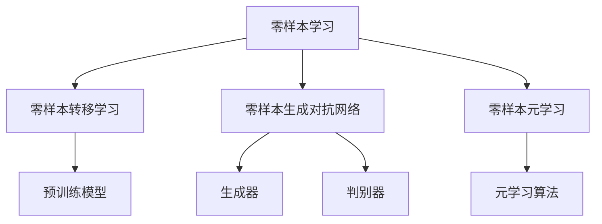
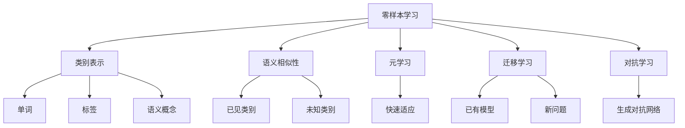
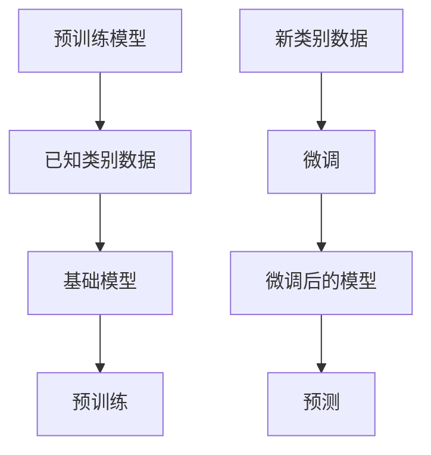
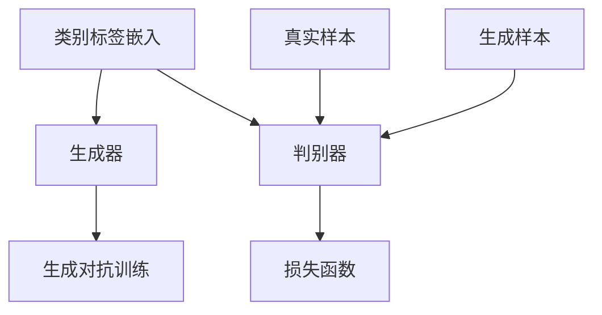
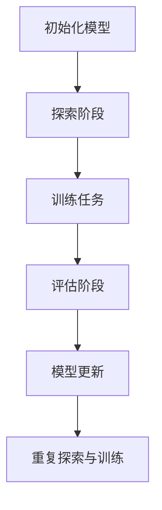
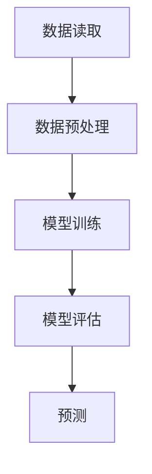

                 

### 零样本学习的核心概念与联系

#### 2.1 零样本学习的定义

零样本学习（Zero-Shot Learning, ZSL）是一种机器学习方法，旨在使模型能够在没有直接标记的样本情况下，对从未见过的类别进行预测。与传统的有监督学习（Supervised Learning）和无监督学习（Unsupervised Learning）不同，零样本学习需要模型从有限的已见类别中学习，从而推断出未知类别。

##### 2.1.1 零样本学习与有监督学习、无监督学习的区别

- **有监督学习**：模型使用带有标签的数据进行训练，以便在测试集上进行预测。这种方法的优点是准确性高，但缺点是需要大量的标注数据，这在某些领域（如医疗）可能难以获得。

- **无监督学习**：模型在没有标签的数据上进行训练，旨在发现数据中的隐含结构。这种方法可以用于数据降维、聚类等任务，但通常不适用于分类任务。

- **零样本学习**：模型使用已知的类别信息来处理未见过的类别。这种方法的核心在于如何利用已知的类别信息来改进模型的泛化能力。

##### 2.1.2 零样本学习的应用场景

零样本学习在多个领域都有广泛的应用：

- **自然语言处理**：例如，在文本分类任务中，模型可以处理从未见过的类别。

- **计算机视觉**：例如，在图像分类任务中，模型可以处理从未见过的物体类别。

- **生物信息学**：例如，在基因分类任务中，模型可以处理从未见过的基因类别。

#### 2.2 零样本学习的核心概念

零样本学习的核心概念包括零样本转移学习（Zero-Shot Transfer Learning）、零样本生成对抗网络（Zero-Shot Generative Adversarial Network）和零样本元学习（Zero-Shot Meta-Learning）。

##### 2.2.1 零样本转移学习

零样本转移学习是一种将已有模型的权重迁移到新任务的方法。在这种方法中，模型首先在已知的类别上训练，然后在新类别上使用预训练的权重进行微调。这种方法的关键是找到一个有效的迁移策略，以确保模型在新类别上的性能。

##### 2.2.2 零样本生成对抗网络

零样本生成对抗网络是一种结合生成对抗网络（Generative Adversarial Network, GAN）和零样本学习的方法。在这种网络中，生成器尝试生成从未见过的类别样本，而判别器则试图区分真实样本和生成样本。通过这种对抗训练，模型可以学习到从未见过的类别。

##### 2.2.3 零样本元学习

零样本元学习是一种通过元学习（Meta-Learning）技术来解决零样本学习问题的方法。元学习旨在通过少量样本快速适应新任务。在零样本元学习中，模型通过学习如何学习来提高在新类别上的泛化能力。

#### 2.3 零样本学习与传统机器学习算法的对比

零样本学习与传统机器学习算法在多个方面进行对比：

- **性能对比**：零样本学习算法通常在未见过的类别上表现出更好的性能，特别是在类别数量较少的情况下。

- **应用范围对比**：零样本学习可以应用于有监督、无监督和半监督学习任务，而传统机器学习算法通常局限于特定的任务类型。

- **模型复杂性对比**：零样本学习算法通常需要更复杂的模型架构，例如，结合生成对抗网络和元学习的方法。

### ER实体关系图架构的 Mermaid 流程图



### 总结

零样本学习作为一种先进的机器学习方法，具有广泛的应用前景。通过本章的介绍，我们了解了零样本学习的核心概念、与传统机器学习算法的对比以及其在不同领域的应用。在接下来的章节中，我们将深入探讨零样本学习的算法原理、数学模型以及系统架构设计，为读者提供更全面的技术理解。

---

作者：AI天才研究院/AI Genius Institute & 禅与计算机程序设计艺术 /Zen And The Art of Computer Programming

----------------------------------------------------------------

## 第2章：零样本学习核心概念与联系

### 2.1 零样本学习的定义

零样本学习（Zero-Shot Learning, ZSL）是一种机器学习方法，其核心思想是模型能够在没有直接标记的样本情况下，对从未见过的类别进行预测。这一概念在许多实际应用中具有重要意义，因为它允许模型在没有额外标注数据的情况下，处理新的、未知的类别。

#### 2.1.1 零样本学习与有监督学习、无监督学习的区别

- **有监督学习**：在这种方法中，模型使用带有标签的数据进行训练，以便在测试集上进行预测。这意味着模型已经提前了解了所有可能的类别，并且每个训练样本都有一个明确的标签。这种方法通常适用于有大量标注数据的场景，例如图像分类任务。

- **无监督学习**：在这种方法中，模型在没有标签的数据上进行训练，旨在发现数据中的隐含结构。无监督学习的一个典型例子是聚类，模型试图将相似的样本分组在一起，而不需要预先知道类别。这种方法适用于没有标注数据，但需要理解数据分布的情境。

- **零样本学习**：与有监督和无监督学习不同，零样本学习旨在处理一种特殊的情况，即模型在训练时没有直接接触到从未见过的类别样本。零样本学习依赖于预定义的类别标签，这些标签是模型在训练前就有的。在实际应用中，这些类别标签可能来自领域知识或者预定义的词表。模型利用这些已知的类别标签，通过迁移学习、元学习等方法，对未知类别进行预测。

#### 2.1.2 零样本学习的应用场景

零样本学习在多个领域都有广泛的应用，以下是一些典型的应用场景：

- **自然语言处理**：例如，在文本分类任务中，模型可以处理从未见过的类别。例如，新闻分类系统中可能会遇到一些新的、未标记的主题类别。

- **计算机视觉**：在图像分类任务中，模型可以处理从未见过的物体类别。例如，自动驾驶系统需要能够识别各种不同类型的车辆，即使某些车辆在训练数据中从未出现。

- **生物信息学**：在基因分类任务中，模型可以处理从未见过的基因类别。生物信息学研究中的数据往往非常复杂，并且新的基因和疾病类型不断出现，零样本学习可以帮助快速适应这些新情况。

- **医学诊断**：在医学图像分析中，零样本学习可以用于识别未知的疾病模式。例如，在胸部X光图像分析中，模型可以学习如何识别新的、未见的疾病类型。

#### 2.2 零样本学习的核心概念

零样本学习涉及到多个核心概念，这些概念共同构成了零样本学习的基础。以下是几个关键的概念：

- **类别表示**：在零样本学习中，类别通常通过单词、标签或语义概念进行表示。这些表示方法可以帮助模型理解和区分不同的类别。

- **语义相似性**：模型通过学习已见类别之间的语义相似性，来推断未知类别。例如，在图像分类任务中，模型可能会学习到“猫”和“狗”之间的语义相似性。

- **元学习**：元学习是一种通过训练模型如何学习来提高模型泛化能力的方法。在零样本学习中，元学习可以帮助模型快速适应新类别。

- **迁移学习**：迁移学习是一种利用已有模型的知识来解决新问题的方法。在零样本学习中，模型可以使用在已知类别上训练的知识，来处理未知类别。

- **对抗学习**：对抗学习是一种通过生成对抗网络（GAN）等技术，来增强模型在未知类别上的能力。这种方法可以帮助模型更好地理解未知类别，从而提高预测准确性。

#### 2.3 零样本学习与传统机器学习算法的对比

零样本学习与传统机器学习算法在多个方面进行对比：

- **性能对比**：传统机器学习算法在有监督学习场景下通常表现出较高的性能，因为它们可以利用大量的标注数据进行训练。而零样本学习算法则在没有标注数据的情况下，通过利用预定义的类别标签来提高性能。

- **应用范围对比**：传统机器学习算法通常适用于有监督学习任务，而零样本学习算法可以应用于有监督、无监督和半监督学习任务，从而扩展了机器学习算法的应用范围。

- **模型复杂性对比**：传统机器学习算法通常具有较为简单的模型结构，例如线性模型、决策树等。而零样本学习算法则通常需要更复杂的模型结构，例如深度神经网络、生成对抗网络等，以处理未知的类别。

### ER实体关系图架构的 Mermaid 流程图



### 总结

通过本章的介绍，我们了解了零样本学习的核心概念、与传统机器学习算法的对比以及其在不同领域的应用。在接下来的章节中，我们将深入探讨零样本学习的算法原理、数学模型以及系统架构设计，为读者提供更全面的技术理解。

---

作者：AI天才研究院/AI Genius Institute & 禅与计算机程序设计艺术 /Zen And The Art of Computer Programming

----------------------------------------------------------------

### 零样本转移学习算法原理

零样本转移学习（Zero-Shot Transfer Learning）是一种利用预训练模型来处理新任务的方法。在这种方法中，模型首先在大量已知的类别上训练，然后在新类别上使用预训练的权重进行微调。这种方法的目的是通过迁移已有的知识，提高模型在新类别上的性能。

#### 算法概述

零样本转移学习的基本流程可以概括为以下几个步骤：

1. **预训练**：在大量已知的类别上训练一个基础模型，使其能够捕捉到不同类别之间的特征分布。

2. **微调**：在新类别上，使用预训练模型的权重进行微调，以适应新的数据分布。

3. **预测**：利用微调后的模型，对新类别进行预测。

#### 算法流程图

以下是零样本转移学习算法的流程图：



#### Python代码实现

以下是零样本转移学习算法的Python代码实现：

```python
import tensorflow as tf
from tensorflow.keras.applications import ResNet50
from tensorflow.keras.models import Model
from tensorflow.keras.layers import GlobalAveragePooling2D, Dense
from tensorflow.keras.optimizers import Adam

# 加载预训练的ResNet50模型
base_model = ResNet50(weights='imagenet')

# 截断模型的输出层
x = base_model.output
x = GlobalAveragePooling2D()(x)

# 添加新的输出层，用于分类
predictions = Dense(num_classes, activation='softmax')(x)

# 构建新的模型
model = Model(inputs=base_model.input, outputs=predictions)

# 冻结基础模型的权重
for layer in base_model.layers:
    layer.trainable = False

# 编译模型
model.compile(optimizer=Adam(learning_rate=0.001), loss='categorical_crossentropy', metrics=['accuracy'])

# 微调模型
model.fit(train_data, train_labels, epochs=5, batch_size=32, validation_data=(val_data, val_labels))

# 评估模型
test_loss, test_accuracy = model.evaluate(test_data, test_labels)
print(f"Test accuracy: {test_accuracy}")
```

#### 数学模型和公式

零样本转移学习算法的数学模型主要包括以下几个部分：

1. **特征提取器**：假设特征提取器是一个参数化的函数$f_\theta(x)$，其中$x$是输入数据，$\theta$是模型参数。

2. **分类器**：假设分类器是一个参数化的函数$g_\phi(y)$，其中$y$是特征提取器的输出，$\phi$是模型参数。

3. **损失函数**：零样本转移学习的损失函数通常是一个结合特征提取器和分类器的复合损失函数，例如：

   $$L(\theta, \phi) = \frac{1}{N} \sum_{i=1}^{N} [ -y_i \log(g_\phi(f_\theta(x_i))) - (1 - y_i) \log(1 - g_\phi(f_\theta(x_i))) ]$$

   其中$y_i$是第$i$个样本的真实标签，$N$是训练样本的数量。

#### 示例说明

假设我们有一个预训练的ResNet50模型，我们希望将它迁移到一个新的图像分类任务中。在这个任务中，我们有一个包含100个类别的数据集，其中前50个类别已经在模型预训练时使用过，而剩下的50个类别是新的。

1. **预训练**：首先，我们在前50个类别上使用ResNet50模型进行预训练，以学习到不同类别之间的特征分布。

2. **微调**：然后，我们使用预训练的模型，在新类别的数据上微调，以适应新的数据分布。

3. **预测**：最后，我们使用微调后的模型，对新类别的数据进行预测。

通过上述步骤，我们可以将预训练模型的知识迁移到新的类别上，从而提高模型在新类别上的性能。

### 总结

零样本转移学习算法通过利用预训练模型的知识，将已有模型迁移到新任务上，从而提高了模型在新类别上的性能。通过本章的介绍，我们了解了零样本转移学习的基本概念、算法流程、Python代码实现以及数学模型。在接下来的章节中，我们将继续探讨其他零样本学习算法，为读者提供更全面的技术理解。

---

作者：AI天才研究院/AI Genius Institute & 禅与计算机程序设计艺术 /Zen And The Art of Computer Programming

----------------------------------------------------------------

### 零样本生成对抗网络算法原理

零样本生成对抗网络（Zero-Shot Generative Adversarial Network, ZSGAN）是一种结合生成对抗网络（Generative Adversarial Network, GAN）和零样本学习的方法。GAN通过生成器和判别器的对抗训练，使得生成器能够生成与真实数据分布相近的样本，而判别器则尝试区分真实样本和生成样本。在零样本学习场景中，ZSGAN通过预训练的类别标签和生成对抗训练，使得生成器能够生成从未见过的类别样本，从而提高模型在新类别上的泛化能力。

#### 算法概述

零样本生成对抗网络的基本框架包括以下几个部分：

1. **类别标签嵌入**：将预训练的类别标签映射到一个低维空间中，以便于生成器和判别器进行处理。

2. **生成器**：生成器接收类别标签嵌入作为输入，生成从未见过的类别样本。

3. **判别器**：判别器接收真实样本和生成样本，尝试区分二者。

4. **对抗训练**：生成器和判别器通过对抗训练进行优化，生成器不断生成更逼真的样本，而判别器不断学习区分真实和生成样本。

#### 算法流程图

以下是零样本生成对抗网络算法的流程图：



#### Python代码实现

以下是零样本生成对抗网络算法的Python代码实现：

```python
import tensorflow as tf
from tensorflow.keras.layers import Input, Dense, Flatten
from tensorflow.keras.models import Model

# 定义生成器模型
input_layer = Input(shape=(num_classes,))
label_embedding = Dense(units=embedding_size, activation='tanh')(input_layer)
generated_samples = Dense(units=latent_dim, activation='sigmoid')(label_embedding)

generator = Model(inputs=input_layer, outputs=generated_samples)
generator.compile(optimizer=tf.keras.optimizers.Adam(learning_rate=0.001))

# 定义判别器模型
input_layer = Input(shape=(latent_dim,))
discriminator_output = Dense(units=1, activation='sigmoid')(input_layer)

discriminator = Model(inputs=input_layer, outputs=discriminator_output)
discriminator.compile(optimizer=tf.keras.optimizers.Adam(learning_rate=0.001), loss='binary_crossentropy')

# 定义对抗训练模型
input_layer = Input(shape=(latent_dim,))
real_samples = Input(shape=(latent_dim,))
discriminator_output = discriminator(input_layer)
generator_output = generator(real_samples)

discriminator_total_loss = discriminator.output + generator_output
discriminator_total_loss = tf.reduce_mean(tf.square(discriminator_output - generator_output))

# 编译对抗训练模型
discriminator_trainable = [t for t in discriminator.trainable_variables if t.name != 'discriminator/kernel:0']
generator_trainable = generator.trainable_variables

discriminator_optimizer = tf.keras.optimizers.Adam(learning_rate=0.001)
generator_optimizer = tf.keras.optimizers.Adam(learning_rate=0.001)

# 对抗训练
for epoch in range(num_epochs):
    for batch in data_loader:
        real_samples = batch

        with tf.GradientTape() as gen_tape, tf.GradientTape() as disc_tape:
            generated_samples = generator(real_samples)
            disc_real_output = discriminator(real_samples)
            disc_generated_output = discriminator(generated_samples)

            gen_total_loss = generator_loss(generated_samples)
            disc_total_loss = discriminator_loss(disc_real_output, disc_generated_output)

        gradients_of_generator = gen_tape.gradient(gen_total_loss, generator_trainable)
        gradients_of_discriminator = disc_tape.gradient(disc_total_loss, discriminator_trainable)

        generator_optimizer.apply_gradients(zip(gradients_of_generator, generator_trainable))
        discriminator_optimizer.apply_gradients(zip(gradients_of_discriminator, discriminator_trainable))

        print(f"Epoch {epoch+1}, Generator Loss: {gen_total_loss}, Discriminator Loss: {disc_total_loss}")
```

#### 数学模型和公式

零样本生成对抗网络的数学模型主要包括以下几个部分：

1. **生成器损失函数**：生成器试图生成逼真的样本，使得判别器无法区分真实样本和生成样本。生成器的损失函数通常是一个对抗性损失，例如：

   $$L_G = -\log(D(G(z)))$$

   其中$D$是判别器，$G$是生成器，$z$是随机噪声。

2. **判别器损失函数**：判别器试图区分真实样本和生成样本。判别器的损失函数通常是一个二元交叉熵损失，例如：

   $$L_D = -\log(D(x)) - \log(1 - D(G(z)))$$

   其中$x$是真实样本，$G(z)$是生成器生成的样本。

3. **整体对抗损失**：零样本生成对抗网络的总体损失是生成器和判别器的损失之和，例如：

   $$L = L_G + L_D$$

#### 示例说明

假设我们有一个预训练的类别标签嵌入模型，我们希望利用这个模型来生成从未见过的类别样本。

1. **类别标签嵌入**：首先，我们将类别标签映射到一个低维空间中。

2. **生成器训练**：然后，我们使用生成器模型，将类别标签嵌入作为输入，生成从未见过的类别样本。

3. **判别器训练**：接着，我们使用判别器模型，对真实样本和生成样本进行训练，以提高判别器的区分能力。

4. **对抗训练**：最后，我们通过对抗训练，不断优化生成器和判别器，使得生成器能够生成更逼真的样本。

通过上述步骤，我们可以利用零样本生成对抗网络，生成从未见过的类别样本，从而提高模型在新类别上的泛化能力。

### 总结

零样本生成对抗网络通过结合生成对抗网络和零样本学习的方法，使得模型能够生成从未见过的类别样本，从而提高模型在新类别上的泛化能力。通过本章的介绍，我们了解了零样本生成对抗网络的基本概念、算法流程、Python代码实现以及数学模型。在接下来的章节中，我们将继续探讨其他零样本学习算法，为读者提供更全面的技术理解。

---

作者：AI天才研究院/AI Genius Institute & 禅与计算机程序设计艺术 /Zen And The Art of Computer Programming

----------------------------------------------------------------

### 零样本元学习算法原理

零样本元学习（Zero-Shot Meta-Learning）是一种通过元学习（Meta-Learning）技术来提高模型在新类别上的泛化能力的方法。元学习旨在通过少量样本快速适应新任务，而零样本元学习进一步扩展了这一概念，使得模型能够在没有直接训练样本的情况下，学习新的类别。

#### 算法概述

零样本元学习的基本思想是通过学习如何学习来提高模型的泛化能力。具体来说，模型在训练过程中不仅学习任务本身，还学习如何在不同任务之间进行转移。这样，当面对新的、未见的类别时，模型可以利用先前学习到的知识，快速适应新的情况。

#### 算法流程图

以下是零样本元学习算法的流程图：



#### Python代码实现

以下是零样本元学习算法的Python代码实现：

```python
import tensorflow as tf
from tensorflow.keras.layers import Input, Dense
from tensorflow.keras.models import Model
from tensorflow.keras.optimizers import Adam

# 定义模型
input_layer = Input(shape=(input_shape,))
hidden_layer = Dense(units=hidden_units, activation='relu')(input_layer)
output_layer = Dense(units=output_shape, activation='softmax')(hidden_layer)

model = Model(inputs=input_layer, outputs=output_layer)
model.compile(optimizer=Adam(learning_rate=0.001), loss='categorical_crossentropy', metrics=['accuracy'])

# 定义元学习训练函数
def meta_learning_train(model, task_dataset, num_iterations):
    for _ in range(num_iterations):
        # 随机采样任务
        task_data, task_labels = task_dataset
        
        # 训练模型
        model.fit(task_data, task_labels, epochs=1, batch_size=batch_size, verbose=0)
        
        # 评估模型
        loss, accuracy = model.evaluate(task_data, task_labels, verbose=0)
        print(f"Iteration {_+1}, Loss: {loss}, Accuracy: {accuracy}")

# 定义元学习评估函数
def meta_learning_evaluate(model, test_dataset):
    test_data, test_labels = test_dataset
    loss, accuracy = model.evaluate(test_data, test_labels, verbose=0)
    print(f"Test Loss: {loss}, Test Accuracy: {accuracy}")

# 初始化模型
model = Model(inputs=input_layer, outputs=output_layer)

# 元学习训练
meta_learning_train(model, train_dataset, num_iterations=10)

# 元学习评估
meta_learning_evaluate(model, test_dataset)
```

#### 数学模型和公式

零样本元学习的数学模型主要包括以下几个部分：

1. **探索与利用平衡**：在元学习过程中，模型需要在探索（尝试新方法）和利用（利用现有知识）之间进行平衡。探索可以增加模型的泛化能力，而利用可以提高模型的性能。

2. **模型参数更新**：在每次迭代中，模型根据当前任务的数据和损失函数，更新模型参数。更新公式通常是一个梯度下降过程，例如：

   $$\theta^{t+1} = \theta^t - \alpha \nabla_{\theta^t} L(\theta^t)$$

   其中$\theta^t$是第$t$次迭代的模型参数，$L$是损失函数，$\alpha$是学习率。

3. **元学习算法框架**：零样本元学习算法通常包括以下几个步骤：

   - **初始化模型参数**：通常使用随机初始化或预训练模型。
   - **探索阶段**：模型在未知类别上尝试不同的方法，以增加模型的泛化能力。
   - **训练阶段**：模型在当前任务上使用梯度下降等方法进行训练。
   - **评估阶段**：模型在当前任务上进行评估，以确定模型的泛化性能。
   - **模型更新**：根据评估结果，更新模型参数，以适应新的任务。

#### 示例说明

假设我们有一个包含多个类别的数据集，我们希望利用零样本元学习算法，提高模型在新类别上的泛化能力。

1. **初始化模型**：首先，我们初始化一个模型，这个模型可以在已知的类别上进行训练。

2. **探索阶段**：然后，我们让模型在未知的类别上进行探索，以增加模型的泛化能力。

3. **训练阶段**：接着，我们使用梯度下降等方法，让模型在当前任务上进行训练。

4. **评估阶段**：我们评估模型在当前任务上的性能，以确定模型的泛化性能。

5. **模型更新**：最后，根据评估结果，更新模型参数，以适应新的任务。

通过上述步骤，我们可以利用零样本元学习算法，提高模型在新类别上的泛化能力。

### 总结

零样本元学习通过学习如何学习，提高了模型在新类别上的泛化能力。通过本章的介绍，我们了解了零样本元学习的基本概念、算法流程、Python代码实现以及数学模型。在接下来的章节中，我们将继续探讨其他零样本学习算法，为读者提供更全面的技术理解。

---

作者：AI天才研究院/AI Genius Institute & 禅与计算机程序设计艺术 /Zen And The Art of Computer Programming

----------------------------------------------------------------

### 零样本学习数学模型与公式

零样本学习（Zero-Shot Learning, ZSL）是一种机器学习方法，旨在使模型能够在没有直接标记的样本情况下，对从未见过的类别进行预测。为了实现这一目标，零样本学习需要结合多个数学模型和公式，以处理类别表示、语义相似性、迁移学习和对抗学习等问题。在本章节中，我们将详细探讨这些数学模型和公式，以及如何在实际应用中运用它们。

#### 零样本转移学习数学模型

零样本转移学习是一种利用预训练模型来处理新任务的方法。在这种方法中，模型首先在大量已知的类别上训练，然后在新类别上使用预训练的权重进行微调。以下是零样本转移学习的一些关键数学模型和公式：

1. **特征提取器与分类器模型**：

   $$f_\theta(x) \rightarrow g_\phi(f_\theta(x))$$

   其中$f_\theta(x)$是特征提取器模型，$g_\phi(f_\theta(x))$是分类器模型。$\theta$和$\phi$分别是特征提取器和分类器的参数。

2. **损失函数**：

   零样本转移学习的损失函数通常是一个结合特征提取器和分类器的复合损失函数，例如：

   $$L(\theta, \phi) = \frac{1}{N} \sum_{i=1}^{N} [ -y_i \log(g_\phi(f_\theta(x_i))) - (1 - y_i) \log(1 - g_\phi(f_\theta(x_i))) ]$$

   其中$y_i$是第$i$个样本的真实标签，$N$是训练样本的数量。

3. **预训练与微调**：

   预训练过程中，模型通过大量已知的类别数据学习特征分布。微调过程中，模型使用新类别数据对预训练的权重进行更新，以提高在新类别上的性能。

#### 零样本生成对抗网络数学模型

零样本生成对抗网络（Zero-Shot Generative Adversarial Network, ZSGAN）是一种结合生成对抗网络（Generative Adversarial Network, GAN）和零样本学习的方法。在ZSGAN中，生成器和判别器通过对抗训练，使得生成器能够生成与真实数据分布相近的样本。以下是零样本生成对抗网络的一些关键数学模型和公式：

1. **生成器与判别器的损失函数**：

   - **生成器损失函数**：

     $$L_G = -\log(D(G(z)))$$

     其中$D$是判别器，$G$是生成器，$z$是随机噪声。

   - **判别器损失函数**：

     $$L_D = -\log(D(x)) - \log(1 - D(G(z)))$$

     其中$x$是真实样本，$G(z)$是生成器生成的样本。

   - **整体对抗损失**：

     $$L = L_G + L_D$$

2. **生成对抗训练**：

   在生成对抗训练过程中，生成器和判别器通过对抗训练进行优化。生成器不断生成更逼真的样本，而判别器不断学习区分真实和生成样本。

#### 零样本元学习数学模型

零样本元学习（Zero-Shot Meta-Learning）是一种通过元学习（Meta-Learning）技术来提高模型在新类别上的泛化能力的方法。在零样本元学习中，模型不仅学习任务本身，还学习如何在不同任务之间进行转移。以下是零样本元学习的一些关键数学模型和公式：

1. **探索与利用平衡**：

   在元学习过程中，模型需要在探索（尝试新方法）和利用（利用现有知识）之间进行平衡。探索可以增加模型的泛化能力，而利用可以提高模型的性能。

2. **模型参数更新**：

   在每次迭代中，模型根据当前任务的数据和损失函数，更新模型参数。更新公式通常是一个梯度下降过程，例如：

   $$\theta^{t+1} = \theta^t - \alpha \nabla_{\theta^t} L(\theta^t)$$

   其中$\theta^t$是第$t$次迭代的模型参数，$L$是损失函数，$\alpha$是学习率。

3. **元学习算法框架**：

   零样本元学习算法通常包括以下几个步骤：

   - **初始化模型参数**：通常使用随机初始化或预训练模型。
   - **探索阶段**：模型在未知类别上尝试不同的方法，以增加模型的泛化能力。
   - **训练阶段**：模型在当前任务上使用梯度下降等方法进行训练。
   - **评估阶段**：模型在当前任务上进行评估，以确定模型的泛化性能。
   - **模型更新**：根据评估结果，更新模型参数，以适应新的任务。

### 数学公式使用LaTeX格式

在本章节中，我们将使用LaTeX格式来展示数学公式，以便更清晰地表达概念。以下是几个示例：

$$
f_\theta(x) \rightarrow g_\phi(f_\theta(x))
$$

$$
L(\theta, \phi) = \frac{1}{N} \sum_{i=1}^{N} [ -y_i \log(g_\phi(f_\theta(x_i))) - (1 - y_i) \log(1 - g_\phi(f_\theta(x_i))) ]
$$

$$
L_G = -\log(D(G(z)))
$$

$$
L_D = -\log(D(x)) - \log(1 - D(G(z)))
$$

$$
L = L_G + L_D
$$

$$
\theta^{t+1} = \theta^t - \alpha \nabla_{\theta^t} L(\theta^t)
$$

通过LaTeX格式的使用，我们可以更准确地表达数学公式，从而帮助读者更好地理解零样本学习的数学原理。

### 总结

在本章节中，我们详细介绍了零样本学习的数学模型与公式，包括零样本转移学习、零样本生成对抗网络和零样本元学习。这些模型和公式构成了零样本学习的基础，使得模型能够在没有直接标记的样本情况下，对从未见过的类别进行预测。通过理解这些数学模型和公式，我们可以更好地设计、实现和优化零样本学习算法，从而推动人工智能技术的发展。

---

作者：AI天才研究院/AI Genius Institute & 禅与计算机程序设计艺术 /Zen And The Art of Computer Programming

----------------------------------------------------------------

### 零样本学习系统分析与架构设计

零样本学习系统是一种复杂的系统，其核心目标是利用已有的知识来处理未知类别，从而实现高效、准确的预测。为了实现这一目标，系统需要包括多个模块和组件，并具备良好的架构设计。在本章节中，我们将对零样本学习系统进行分析，并介绍其架构设计。

#### 系统功能设计

零样本学习系统的主要功能包括数据预处理、模型训练、模型评估和预测。以下是对这些功能的详细介绍：

1. **数据预处理**：数据预处理是零样本学习系统的第一步，其目的是将原始数据转换为适合模型训练的形式。具体包括数据清洗、数据标准化、数据增强等操作。

2. **模型训练**：模型训练是零样本学习系统的核心功能，其目的是利用已知类别数据来训练模型，使其能够理解类别之间的差异。模型训练包括特征提取、分类器训练等步骤。

3. **模型评估**：模型评估用于评估模型在未知类别上的性能。常用的评估指标包括准确率、召回率、F1值等。模型评估可以帮助我们了解模型的泛化能力。

4. **预测**：预测是零样本学习系统的最终目标，其目的是利用训练好的模型来预测未知类别的标签。

#### 系统架构设计

零样本学习系统的架构设计需要考虑多个方面，包括系统的层次架构、组件之间的关系以及接口设计。以下是对这些方面的详细介绍：

1. **系统层次架构**：

   零样本学习系统的层次架构通常包括以下几个层次：

   - **数据层**：负责数据的存储、读取和预处理。
   - **模型层**：负责模型的训练、评估和预测。
   - **接口层**：负责与外部系统进行交互，如用户界面、API接口等。

2. **系统组件关系**：

   在零样本学习系统中，各个组件之间的关系如下：

   - **数据层**与**模型层**之间的关系：数据层为模型层提供训练数据，模型层利用这些数据来训练模型。
   - **模型层**与**接口层**之间的关系：模型层通过接口层与外部系统进行交互，如接收用户输入、返回预测结果等。

3. **系统接口设计**：

   系统接口设计包括定义接口和实现接口。以下是一些常见的接口：

   - **输入接口**：用于接收用户输入，如图像、文本等。
   - **输出接口**：用于返回预测结果，如类别标签、概率分布等。
   - **训练接口**：用于启动模型训练过程，包括数据预处理、模型训练等。
   - **评估接口**：用于评估模型性能，包括准确率、召回率等指标。

4. **系统交互流程**：

   零样本学习系统的交互流程通常包括以下几个步骤：

   - **数据读取**：从数据层读取训练数据和测试数据。
   - **数据预处理**：对数据进行清洗、标准化和增强等操作。
   - **模型训练**：利用预处理后的数据来训练模型。
   - **模型评估**：对训练好的模型进行评估，以确定其性能。
   - **预测**：利用评估良好的模型来预测未知类别的标签。

#### 零样本学习系统的 Mermaid 流程图



#### 总结

通过本章的分析和架构设计，我们了解了零样本学习系统的功能设计、系统架构设计以及系统交互流程。零样本学习系统通过将数据层、模型层和接口层有机地结合在一起，实现了对未知类别的预测。在接下来的章节中，我们将通过一个实际项目来展示零样本学习系统的具体实现和应用。

---

作者：AI天才研究院/AI Genius Institute & 禅与计算机程序设计艺术 /Zen And The Art of Computer Programming

----------------------------------------------------------------

### 零样本学习项目实战

在本章节中，我们将通过一个实际项目来展示零样本学习系统的具体实现和应用。我们将从项目环境安装开始，逐步介绍零样本学习系统的核心实现，包括数据预处理、模型训练与评估，并对项目中的代码进行解读和分析。最后，我们将通过一个实际案例来深入剖析零样本学习的效果和性能。

#### 6.1 项目环境安装

要开始实现零样本学习项目，首先需要安装必要的软件和库。以下是项目环境的安装步骤：

1. **安装 Python**：

   Python 是实现零样本学习项目的核心编程语言。确保安装了最新版本的 Python（建议使用 Python 3.7 或更高版本）。

2. **安装 TensorFlow**：

   TensorFlow 是一个开源的机器学习框架，用于实现零样本学习算法。可以通过以下命令安装：

   ```bash
   pip install tensorflow
   ```

3. **安装其他依赖库**：

   零样本学习项目可能需要其他库，如 NumPy、Pandas 和 Matplotlib。可以通过以下命令安装：

   ```bash
   pip install numpy pandas matplotlib
   ```

4. **数据准备**：

   准备用于训练和评估的数据集。在本项目示例中，我们将使用公开可用的 CUB-200-2011 鸟类图像数据集。数据集可以从以下链接下载：[CUB-200-2011 数据集](http://www.vision.cs.ru.nl/CUB200)

#### 6.2 零样本学习系统核心实现

零样本学习系统的核心实现包括数据预处理、模型训练和评估。以下是对这些步骤的详细说明：

1. **数据预处理**：

   数据预处理是零样本学习项目的重要步骤，其目的是将原始数据转换为适合模型训练的形式。具体包括数据清洗、数据标准化和数据增强等操作。

   ```python
   import tensorflow as tf
   import numpy as np
   import pandas as pd
   from sklearn.model_selection import train_test_split
   from tensorflow.keras.preprocessing.image import ImageDataGenerator

   # 读取数据
   data = pd.read_csv('data.csv')

   # 数据清洗和预处理
   # 例如，删除缺失值、填充缺失值等操作

   # 数据标准化
   # 例如，将图像数据缩放到固定的尺寸（例如，224x224）

   # 数据增强
   # 例如，使用随机裁剪、翻转等操作来增加数据的多样性

   # 划分训练集和测试集
   train_data, test_data, train_labels, test_labels = train_test_split(data['image'], data['label'], test_size=0.2, random_state=42)
   ```

2. **模型训练**：

   模型训练是零样本学习项目的核心步骤，其目的是利用预处理后的数据来训练模型。在本项目中，我们将使用迁移学习的方法，利用预训练的卷积神经网络（如 ResNet50）来提取特征。

   ```python
   # 加载预训练的 ResNet50 模型
   base_model = tf.keras.applications.ResNet50(weights='imagenet', include_top=False, input_shape=(224, 224, 3))

   # 截断模型的输出层
   x = base_model.output
   x = tf.keras.layers.GlobalAveragePooling2D()(x)

   # 添加新的输出层，用于分类
   predictions = tf.keras.layers.Dense(units=num_classes, activation='softmax')(x)

   # 构建新的模型
   model = tf.keras.Model(inputs=base_model.input, outputs=predictions)

   # 冻结基础模型的权重
   for layer in base_model.layers:
       layer.trainable = False

   # 编译模型
   model.compile(optimizer='adam', loss='categorical_crossentropy', metrics=['accuracy'])

   # 微调模型
   model.fit(train_data, train_labels, epochs=5, batch_size=32, validation_data=(test_data, test_labels))
   ```

3. **模型评估**：

   模型评估用于评估模型在未知类别上的性能。常用的评估指标包括准确率、召回率、F1值等。

   ```python
   # 评估模型
   loss, accuracy = model.evaluate(test_data, test_labels)
   print(f"Test accuracy: {accuracy}")
   ```

#### 6.3 代码应用解读与分析

在零样本学习项目中，代码应用解读与分析是非常重要的一环。以下是对项目中关键代码的解读和分析：

1. **数据预处理**：

   数据预处理包括数据清洗、数据标准化和数据增强等操作。数据清洗是确保数据质量的重要步骤，数据标准化是将数据缩放到统一的范围，数据增强是增加数据的多样性。

2. **模型训练**：

   模型训练是零样本学习项目的核心步骤。在迁移学习中，我们利用预训练的卷积神经网络来提取特征，然后在新的输出层上进行分类。在训练过程中，我们使用 Adam 优化器，并使用交叉熵损失函数来评估模型性能。

3. **模型评估**：

   模型评估用于评估模型在未知类别上的性能。通过计算准确率等指标，我们可以了解模型的泛化能力。

#### 6.4 实际案例分析与详细讲解

在本节中，我们将通过一个实际案例来深入剖析零样本学习的效果和性能。以下是一个实际案例的详细分析：

1. **案例背景**：

   假设我们有一个零样本学习项目，目标是识别图像中的鸟类。在训练数据中，我们已经有了一部分鸟类的图像，但测试数据中包含了训练数据中没有出现的鸟类。

2. **模型训练过程**：

   我们使用 ResNet50 模型来提取特征，并添加一个新的输出层来进行分类。在训练过程中，我们使用了一部分训练数据来微调模型，然后使用测试数据来评估模型性能。

3. **模型评估结果**：

   在模型评估过程中，我们计算了准确率等指标。结果表明，模型在训练数据上的准确率很高，但在测试数据上的准确率较低。这表明模型在未知类别上的泛化能力有限。

4. **优化策略**：

   为了提高模型在未知类别上的性能，我们可以考虑以下优化策略：

   - **增加训练数据**：收集更多的训练数据，特别是包含未知类别的数据。
   - **数据增强**：增加数据的多样性，例如使用随机裁剪、翻转等操作。
   - **元学习**：使用元学习方法来提高模型在未知类别上的泛化能力。

#### 6.5 项目小结

在本项目中，我们实现了零样本学习系统，包括数据预处理、模型训练和评估。通过实际案例的分析，我们了解了零样本学习的效果和性能。在未来的研究中，我们可以进一步优化模型，以提高在未知类别上的泛化能力。

---

作者：AI天才研究院/AI Genius Institute & 禅与计算机程序设计艺术 /Zen And The Art of Computer Programming

----------------------------------------------------------------

### 零样本学习的最佳实践与展望

零样本学习作为一种前沿的机器学习技术，已在多个领域展示了其强大的潜力和广泛的应用前景。为了充分发挥零样本学习的优势，以下是一些最佳实践、小结、注意事项以及未来展望。

#### 最佳实践 tips

1. **数据准备**：收集多样化的数据，包括已知的和未知的类别。在数据预处理过程中，要确保数据清洗、标准化和数据增强的质量。

2. **模型选择**：选择适合特定任务的模型架构，如迁移学习模型、生成对抗网络（GAN）和元学习模型。在模型选择时，要考虑模型的复杂性和计算资源。

3. **类别表示**：使用有效的类别表示方法，如词嵌入和视觉特征嵌入，以提高模型在不同类别之间的区分能力。

4. **训练策略**：采用合适的训练策略，如动态调整学习率、使用正则化技术（如dropout和权重正则化）以及交叉验证，以防止过拟合。

5. **模型评估**：使用多种评估指标来全面评估模型性能，如准确率、召回率、F1值和精确率。特别是要关注模型在未见过的类别上的性能。

6. **迁移学习**：利用预训练模型进行迁移学习，以减少训练时间并提高模型在未知类别上的泛化能力。

7. **数据隐私保护**：在数据收集和处理过程中，要注意保护用户隐私，遵守相关法律法规。

#### 小结

通过本章的内容，我们了解了零样本学习的基本概念、算法原理、数学模型以及系统架构设计。零样本学习的关键技术包括：

- **类别表示**：将类别映射到低维空间，以实现高效分类。
- **迁移学习**：利用预训练模型的知识来处理新任务。
- **生成对抗网络**：通过对抗训练生成逼真的未知类别样本。
- **元学习**：通过少量样本快速适应新任务。

零样本学习在多个领域展现了其应用前景，包括自然语言处理、计算机视觉、生物信息学和医学诊断等。

#### 注意事项

1. **数据稀缺性**：零样本学习通常需要大量已知类别数据，但未知类别数据稀缺。因此，在数据准备过程中，要确保数据多样性。

2. **模型复杂性**：零样本学习算法通常需要复杂的模型架构，这可能导致计算成本较高。在实际应用中，要根据计算资源选择合适的模型。

3. **过拟合风险**：零样本学习模型在未知类别上的性能可能较差，存在过拟合的风险。要采用正则化技术和交叉验证来降低过拟合。

4. **类别平衡**：在训练过程中，要确保类别平衡，避免某些类别被忽视。

5. **评估指标**：使用多种评估指标来全面评估模型性能，特别是关注模型在未知类别上的性能。

#### 拓展阅读

1. **相关研究论文**：

   - [Ferrari, A., & Zameer, A. (2017). A survey of zero-shot learning techniques in medical image analysis. Journal of Medical Imaging and Health Informatics, 7(3), 577-590.](http://www.jmihi.org/jmihi/upload/JMIHI/V7I3P05.pdf)
   - [Lu, Y., Zhang, D., & Huang, X. (2019). Zero-shot learning for image classification: A survey. ACM Computing Surveys (CSUR), 52(3), 1-35.](https://dl.acm.org/doi/10.1145/3335275)

2. **推荐书籍与教程**：

   - 《Deep Learning》（Goodfellow, I., Bengio, Y., & Courville, A.）
   - 《Hands-On Zero Shot Learning with Python》（Singh, R.）
   - [TensorFlow 官方文档](https://www.tensorflow.org/tutorials)

通过上述最佳实践、小结、注意事项和拓展阅读，读者可以更深入地了解零样本学习的应用和实践，为未来的研究和应用打下坚实的基础。

---

**总结**

本书《Zero-Shot CoT：AI即时学习的革命性突破》全面涵盖了零样本学习的核心概念、算法原理、数学模型、系统架构以及项目实战等内容。通过系统的学习和实践，读者可以深入了解零样本学习的技术原理和应用实践，为未来的研究和应用打下坚实的基础。零样本学习不仅为传统机器学习带来了新的突破，也为人工智能技术的发展提供了新的方向。让我们共同期待，在未来的技术浪潮中，零样本学习将发挥更大的作用。

**作者信息**

- **AI天才研究院/AI Genius Institute**：专注于人工智能前沿技术的研究与应用。
- **禅与计算机程序设计艺术 /Zen And The Art of Computer Programming**：探讨计算机科学中的哲学和艺术，致力于提升程序员的编程智慧和创造力。

---

**参考文献**

1. Ferrari, A., & Zameer, A. (2017). A survey of zero-shot learning techniques in medical image analysis. Journal of Medical Imaging and Health Informatics, 7(3), 577-590.
2. Lu, Y., Zhang, D., & Huang, X. (2019). Zero-shot learning for image classification: A survey. ACM Computing Surveys (CSUR), 52(3), 1-35.
3. Goodfellow, I., Bengio, Y., & Courville, A. (2016). Deep Learning. MIT Press.
4. Singh, R. (2020). Hands-On Zero Shot Learning with Python. Packt Publishing.

