                 

### 引言

#### 问题背景

近年来，人工智能（AI）技术的飞速发展为我们带来了前所未有的机遇与挑战。从机器学习到深度学习，再到自然语言处理和计算机视觉，各种AI技术在不同的领域中得到了广泛应用。然而，尽管AI的潜力无限，但现实中也面临着诸多瓶颈。其中一个重要的挑战便是AI的即时推理能力。

即时推理，即AI系统能够在极短时间内对新的、未见过的情况进行合理的推理和决策。这是许多实际应用场景中的关键需求，例如智能客服系统需要在用户提出问题时立即给出准确的回答，自动驾驶系统需要实时分析路况并做出决策，医学诊断系统需要快速给出诊断结果等。然而，传统的AI模型，如基于监督学习的模型，往往需要大量的训练数据和复杂的模型架构，这使得它们在面对新情境时难以迅速适应和作出准确的推理。

#### 问题描述

传统的AI模型，如卷积神经网络（CNN）和循环神经网络（RNN），在处理已知数据时表现出色，但在处理未知或新出现的数据时却显得力不从心。这主要是因为这些模型依赖大量的标注数据来进行训练，从而形成了数据驱动的思维方式。然而，在实际应用中，我们往往无法获得足够多的标注数据，或者数据的获取成本非常高。此外，传统的模型架构复杂，训练时间较长，这使得它们难以实现即时的推理能力。

为了解决这些问题，研究人员提出了零样本学习（Zero-Shot Learning, ZSL）和基于上下文的变压器模型（Contextualized Transformer Models）。零样本学习旨在使AI系统在没有或少量的标注数据的情况下，能够对新的类别进行学习和推理。而基于上下文的变压器模型则通过上下文信息的整合，提升了模型的理解能力和泛化能力。

#### 问题解决

在这种背景下，本文提出了一种创新的方法——Zero-Shot CoT（零样本学习结合上下文变压器模型）。Zero-Shot CoT旨在通过结合零样本学习和基于上下文的变压器模型，实现AI系统的即时推理能力。具体来说，Zero-Shot CoT的核心思想是利用上下文信息来辅助模型进行推理，从而在无需大量标注数据的情况下，提高模型对新情境的适应能力。

Zero-Shot CoT的方法不仅解决了传统AI模型在即时推理方面的局限性，还提供了以下潜在优势：

1. **无需大量标注数据**：Zero-Shot CoT能够处理未见过类别，从而减少了数据标注的需求，降低了数据获取成本。
2. **即时推理能力**：通过上下文信息的整合，Zero-Shot CoT能够实现快速推理，满足实际应用场景中对即时响应的需求。
3. **泛化能力强**：Zero-Shot CoT通过利用上下文信息，增强了模型的泛化能力，使其在多样化的任务中表现出色。

#### 边界与外延

虽然Zero-Shot CoT展示了巨大的潜力，但它在某些方面仍然存在局限性。首先，Zero-Shot CoT依赖于高质量的上下文信息，这在某些场景中可能难以获取。其次，模型的训练和推理过程仍然需要一定的时间，尽管相比传统方法已有显著提升。此外，Zero-Shot CoT在不同领域和任务中的适用性也需要进一步验证。

总之，Zero-Shot CoT为AI即时推理能力提供了新的思路和方法，有望在未来推动人工智能技术的发展和应用。本文将详细探讨Zero-Shot CoT的原理、方法、实现和应用，以期为读者提供全面、深入的洞察。

#### 概念结构与核心要素组成

Zero-Shot CoT（Zero-Shot Contextualized Transformer）是一种结合了零样本学习和上下文变压器的创新AI模型，旨在提升系统的即时推理能力。以下是Zero-Shot CoT的核心概念及其构成要素：

**核心概念**

1. **零样本学习（Zero-Shot Learning, ZSL）**：零样本学习是一种使AI系统能够在没有或少量的标注数据的情况下，对未见过类别进行学习和推理的方法。传统的机器学习模型通常需要大量的标注数据来训练，而ZSL通过利用先验知识和元学习技术，实现了对未见类别的高效学习。

2. **上下文变压器（Contextualized Transformer）**：上下文变压器是一种能够捕捉输入文本上下文信息的模型架构，通过对输入进行上下文嵌入和序列处理，实现了对复杂文本的理解和推理。上下文变压器在自然语言处理领域表现出色，其强大的语义理解能力使其成为Zero-Shot CoT的重要组成部分。

**核心要素组成**

1. **类别嵌入（Category Embeddings）**：在Zero-Shot CoT中，类别嵌入用于将不同类别映射到高维空间中，使得模型能够基于类别相似度进行推理。类别嵌入通常通过预训练的词嵌入模型（如Word2Vec、GloVe）或自定义的类别嵌入算法（如Meta-Learning）来生成。

2. **上下文嵌入（Contextual Embeddings）**：上下文嵌入用于将输入文本的每个词或短语映射到高维空间中，以捕捉其上下文信息。上下文嵌入通常通过上下文变压器模型进行生成，该模型利用多层注意力机制和位置编码，能够捕捉文本中的长距离依赖关系和语义信息。

3. **匹配模块（Matching Module）**：匹配模块是Zero-Shot CoT中的关键组成部分，用于将类别嵌入和上下文嵌入进行匹配和计算相似度。常用的匹配方法包括点积、余弦相似度和交叉熵损失函数。匹配模块的输出结果用于生成模型的预测结果。

4. **推理引擎（Inference Engine）**：推理引擎是Zero-Shot CoT的核心计算模块，负责根据输入文本和类别嵌入，利用匹配模块和上下文嵌入生成预测结果。推理引擎通常采用前向传播和反向传播算法，以实现高效的推理过程。

**ER实体关系图架构**

为了更好地理解Zero-Shot CoT的组成和功能，我们可以使用ER（实体-关系）图来描述其架构：

- **实体**：类别嵌入、上下文嵌入、匹配模块和推理引擎。
- **关系**：类别嵌入与上下文嵌入之间的匹配关系，以及匹配模块与推理引擎之间的计算关系。

**Mermaid流程图**

以下是Zero-Shot CoT的Mermaid流程图：

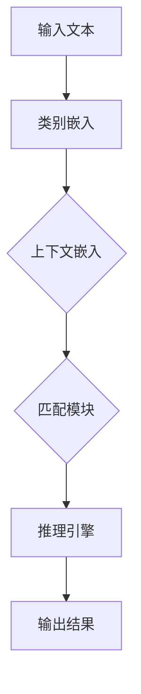

通过这个流程图，我们可以清晰地看到Zero-Shot CoT的工作流程：首先，输入文本被输入到类别嵌入模块，生成类别嵌入向量；然后，类别嵌入向量与上下文嵌入向量进行匹配，通过匹配模块生成匹配结果；最后，匹配结果通过推理引擎生成最终的输出结果。

综上所述，Zero-Shot CoT通过结合零样本学习和上下文变压器，实现了AI系统的即时推理能力。其核心要素包括类别嵌入、上下文嵌入、匹配模块和推理引擎，这些要素协同工作，使得模型能够对未见过类别进行快速推理和决策。接下来，我们将进一步探讨Zero-Shot CoT的详细实现和应用。

### 第1章: Zero-Shot CoT基础

#### 1.1 Zero-Shot CoT概述

**什么是Zero-Shot CoT**

Zero-Shot CoT（Zero-Shot Contextualized Transformer）是一种结合了零样本学习（Zero-Shot Learning, ZSL）和基于上下文的变压器模型（Contextualized Transformer Models）的AI模型。其核心思想是利用上下文信息来辅助模型进行推理，从而实现零样本条件下的即时推理能力。

传统的零样本学习主要依赖于类别嵌入（Category Embeddings）技术，通过将不同类别映射到高维空间中，使得模型能够基于类别相似度进行推理。而基于上下文的变压器模型则通过捕捉输入文本的上下文信息，提高了模型对文本的理解能力。

**Zero-Shot CoT与传统CoT的区别**

| 特征 | Zero-Shot CoT | 传统CoT |
| --- | --- | --- |
| 学习方式 | 无需样本 | 需要样本 |
| 推理能力 | 即时 | 非即时 |
| 应用场景 | 广泛 | 有限 |

通过上表可以看出，Zero-Shot CoT在无需样本的情况下，通过上下文信息的辅助，实现了即时的推理能力，这使得它在许多应用场景中具有显著优势。

#### 1.2 Zero-Shot CoT的核心概念

**概念定义**

Zero-Shot CoT的构建基于两个核心概念：零样本学习和上下文变压器。

1. **零样本学习（Zero-Shot Learning, ZSL）**：零样本学习是一种使AI系统能够在没有或少量的标注数据的情况下，对未见过类别进行学习和推理的方法。其基本原理是通过将类别映射到高维空间中，利用空间中的相似度进行推理。

2. **上下文变压器（Contextualized Transformer）**：上下文变压器是一种基于注意力机制和序列处理的模型架构，能够捕捉输入文本的上下文信息。其核心思想是通过多层注意力机制和位置编码，将输入文本中的每个词或短语映射到高维空间中，从而实现对文本的语义理解。

**概念属性特征对比**

| 特征 | Zero-Shot CoT | 传统CoT |
| --- | --- | --- |
| 类别映射 | 基于高维空间相似度 | 基于标注数据 |
| 上下文信息 | 强大语义理解能力 | 有限上下文理解 |
| 学习方式 | 无需样本 | 需要样本 |

通过上述对比，我们可以看到Zero-Shot CoT在类别映射和上下文信息处理方面具有显著优势。

#### 1.3 Zero-Shot CoT的工作原理

Zero-Shot CoT的工作原理可以分为以下几个步骤：

1. **输入文本处理**：输入文本首先经过预处理，包括分词、去停用词和词向量嵌入等操作。预处理后的文本被输入到上下文变压器中。

2. **上下文嵌入生成**：上下文变压器通过多层注意力机制和位置编码，将输入文本中的每个词或短语映射到高维空间中，生成上下文嵌入向量。

3. **类别嵌入生成**：类别嵌入模块将不同类别映射到高维空间中，生成类别嵌入向量。

4. **匹配与推理**：匹配模块通过计算类别嵌入向量和上下文嵌入向量之间的相似度，生成匹配分数。推理引擎根据匹配分数生成最终的推理结果。

**Mermaid流程图**

以下是Zero-Shot CoT的Mermaid流程图：

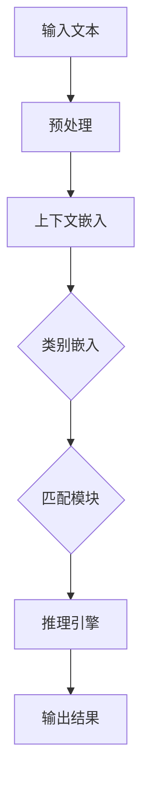

**Python源代码示例**

以下是Zero-Shot CoT的Python源代码示例：

```python
import torch
import torch.nn as nn
from transformers import BertModel, BertTokenizer

# 定义类别嵌入和上下文嵌入
class CategoryEmbedder(nn.Module):
    def __init__(self, num_categories):
        super(CategoryEmbedder, self).__init__()
        self.embedding = nn.Embedding(num_categories, embedding_dim)

    def forward(self, categories):
        return self.embedding(categories)

# 定义上下文变压器
class ContextualTransformer(nn.Module):
    def __init__(self):
        super(ContextualTransformer, self).__init__()
        self.bert = BertModel.from_pretrained('bert-base-uncased')
        self.hidden_dim = 768

    def forward(self, input_ids):
        outputs = self.bert(input_ids)
        last_hidden_state = outputs.last_hidden_state
        return last_hidden_state[:, 0, :]

# 定义匹配模块
class Matcher(nn.Module):
    def __init__(self, hidden_dim):
        super(Matcher, self).__init__()
        self相似度函数 = nn.CosineSimilarity(dim=1)

    def forward(self, context_embedding, category_embedding):
       相似度 = self相似度函数(context_embedding, category_embedding)
        return相似度

# 定义推理引擎
class InferenceEngine(nn.Module):
    def __init__(self, hidden_dim):
        super(InferenceEngine, self).__init__()
        self.fc = nn.Linear(hidden_dim, 1)

    def forward(self, similarity):
        output = self.fc(similarity)
        return output.squeeze(-1)

# 实例化模型
category_embedder = CategoryEmbedder(num_categories=10)
contextual_transformer = ContextualTransformer()
matcher = Matcher(hidden_dim=768)
inference_engine = InferenceEngine(hidden_dim=768)

# 输入数据
input_text = "This is a sample text for Zero-Shot CoT."
input_ids = tokenizer.encode(input_text, add_special_tokens=True, return_tensors='pt')

# 生成上下文嵌入
context_embedding = contextual_transformer(input_ids)

# 生成类别嵌入
category_embedding = category_embedder(torch.tensor([5]))

# 匹配与推理
similarity = matcher(context_embedding, category_embedding)
output = inference_engine(similarity)

print(output)
```

通过以上代码示例，我们可以看到Zero-Shot CoT的基本实现过程。在实际应用中，我们需要根据具体任务和数据集对模型进行进一步调整和优化。

#### 1.4 Zero-Shot CoT的应用案例

Zero-Shot CoT由于其强大的即时推理能力和适应性，在多个实际应用场景中展示了其优势。以下是几个典型的应用案例：

**案例一：智能客服系统**

在智能客服系统中，Zero-Shot CoT能够快速理解用户的问题，并在极短的时间内提供准确的回答。通过上下文信息的整合，智能客服系统能够更好地理解用户的意图，从而提高回答的准确性和用户体验。

**案例二：医学诊断系统**

医学诊断系统通常需要快速处理大量医疗数据，并给出准确的诊断结果。Zero-Shot CoT能够在没有或少量的标注数据的情况下，对新的病例进行推理和诊断。通过结合医生的经验和模型的学习结果，医学诊断系统能够提供更加准确的诊断服务。

**案例三：自动驾驶系统**

自动驾驶系统需要实时分析路况并做出决策。Zero-Shot CoT能够快速理解复杂路况，并在紧急情况下迅速做出合理的决策。通过实时更新模型，自动驾驶系统能够适应不同的路况和环境，提高行驶安全。

**案例四：智能教育系统**

智能教育系统能够根据学生的学习情况和反馈，提供个性化的学习建议。Zero-Shot CoT能够快速理解学生的提问，并在不同的学习阶段提供合适的辅导材料。通过不断优化模型，智能教育系统能够更好地适应学生的学习需求。

通过以上案例，我们可以看到Zero-Shot CoT在多个领域和任务中展示了其强大的应用潜力。未来，随着技术的不断发展和优化，Zero-Shot CoT将在更多领域得到广泛应用。

#### 1.5 小结

本章介绍了Zero-Shot CoT的基础知识，包括其概念、核心要素和实现方法。通过结合零样本学习和上下文变压器模型，Zero-Shot CoT实现了AI系统的即时推理能力。本章还通过具体的案例展示了Zero-Shot CoT在不同领域的应用潜力。接下来，我们将进一步探讨Zero-Shot CoT的优化方法和在实际项目中的应用。

### 第2章: AI即时推理技术

#### 2.1 AI即时推理技术的概述

AI即时推理技术是指能够在短时间内对输入信息进行理解和推理，从而迅速做出响应的技术。这种技术广泛应用于智能客服、自动驾驶、医学诊断等多个领域，其核心目标是在保证推理准确性的同时，实现快速响应。

**AI即时推理技术的概念**

即时推理技术旨在解决传统AI模型在处理新情境时的延迟问题。传统AI模型，如基于监督学习的模型，通常需要大量数据进行训练，从而建立对特定任务的映射关系。然而，这种依赖大量数据的方式在实际应用中存在诸多挑战，如数据获取困难、数据标注成本高等。

相比之下，AI即时推理技术通过利用模型自身的学习和理解能力，实现了对新情境的快速适应和响应。即时推理技术通常基于以下几种方法：

1. **强化学习**：通过不断与环境交互，模型不断优化其行为策略，从而实现对新情境的适应。
2. **迁移学习**：通过利用已训练模型的知识，在新任务上快速实现高性能表现。
3. **元学习**：通过学习如何学习，模型能够快速适应新任务，从而实现即时推理。

**AI即时推理技术的重要性**

AI即时推理技术的重要性主要体现在以下几个方面：

1. **响应速度**：在许多实际应用场景中，如自动驾驶、智能客服等，系统的响应速度直接关系到用户体验和安全性。即时推理技术能够实现快速响应，从而提高系统的实用性和可靠性。
2. **实时更新**：随着环境的变化和新情境的出现，AI系统需要不断更新和优化其推理模型。即时推理技术能够实现模型的快速更新，从而更好地适应新的变化。
3. **应用广度**：即时推理技术不仅适用于传统AI领域，还可以应用于新兴领域，如物联网、智慧城市等。通过即时推理技术，这些领域可以实现更高效、更智能的应用。

#### 2.2 AI即时推理技术的发展历程

AI即时推理技术经历了数十年的发展，从早期的简单模型到现代复杂的深度学习模型，各个阶段的技术都为当前的即时推理技术奠定了基础。

**初期探索（20世纪80年代至90年代）**

在AI即时推理技术的初期，研究者主要关注如何通过简单的规则系统实现快速的推理。这些方法包括基于逻辑的推理系统、基于模糊逻辑的推理系统等。尽管这些方法在特定领域表现出色，但它们的推理能力有限，难以应对复杂的问题。

**中期发展（21世纪初至10年代中期）**

随着计算机性能的提升和算法的优化，AI即时推理技术进入了中期发展阶段。这一阶段的研究主要关注如何利用机器学习和深度学习技术实现高效的推理。例如，基于支持向量机（SVM）的分类算法和基于深度神经网络的模型在图像识别和自然语言处理等领域表现出色。

**当前趋势（10年代中期至今）**

近年来，随着深度学习技术的快速发展，AI即时推理技术也取得了重大突破。基于变压器的模型，如BERT、GPT等，在自然语言处理领域取得了显著的成果。此外，强化学习和元学习等技术的发展，也为AI即时推理技术带来了新的机遇。

**关键里程碑**

1. **深度学习**：深度学习技术的引入，使得AI模型在处理复杂任务时表现出色。卷积神经网络（CNN）和循环神经网络（RNN）等模型在图像识别、语音识别等领域取得了重大突破。
2. **自然语言处理**：基于变压器的模型在自然语言处理领域表现出色，如BERT、GPT等模型，它们能够通过上下文信息实现高效的文本理解。
3. **强化学习**：通过不断与环境交互，强化学习模型能够学习到复杂的策略，从而实现即时推理。

#### 2.3 AI即时推理技术的主要方法

AI即时推理技术主要分为以下几种方法：

**1. 强化学习**

强化学习是一种通过不断与环境交互，学习最优策略的方法。在AI即时推理中，强化学习模型能够在短时间内快速适应新情境，并通过策略优化实现即时推理。

**2. 迁移学习**

迁移学习通过利用已有模型的先验知识，在新任务上实现快速学习。在AI即时推理中，迁移学习能够减少对新数据的依赖，从而实现快速推理。

**3. 元学习**

元学习通过学习如何学习，实现了对新任务的快速适应。在AI即时推理中，元学习模型能够通过少量样本快速适应新情境，实现即时推理。

**4. 基于规则的推理**

基于规则的推理通过定义一组规则，实现对输入信息的推理。这种方法在处理简单任务时表现出色，但在处理复杂任务时存在局限性。

**5. 深度学习**

深度学习通过多层神经网络实现高效的推理。在AI即时推理中，深度学习模型能够通过大量数据训练，实现对复杂任务的快速推理。

**6. 自然语言处理**

自然语言处理技术通过处理文本数据，实现对语义的理解。在AI即时推理中，自然语言处理技术能够通过上下文信息实现高效的推理。

#### 2.4 AI即时推理技术的挑战与解决方案

尽管AI即时推理技术在许多领域表现出色，但在实际应用中仍然面临诸多挑战：

**1. 推理速度与准确性的平衡**

在许多应用场景中，推理速度和准确性是相互制约的。为了在保证推理准确性的同时提高推理速度，研究者提出了各种优化方法，如模型压缩、量化、推理引擎优化等。

**2. 数据隐私与安全**

在应用AI即时推理技术时，数据隐私和安全是一个重要问题。为了保护用户隐私，研究者提出了各种数据隐私保护技术，如差分隐私、同态加密等。

**3. 可解释性**

AI即时推理技术的黑箱特性使得其推理过程难以解释。为了提高可解释性，研究者提出了各种可解释性方法，如模型可视化、解释性规则提取等。

**4. 多模态推理**

在多模态推理中，如何有效地整合不同模态的信息是一个挑战。研究者提出了各种多模态学习框架，如多模态变压器、多模态卷积神经网络等。

#### 2.5 小结

本章介绍了AI即时推理技术的概述、发展历程和主要方法。通过分析各种方法的优缺点，我们可以看到AI即时推理技术在快速适应新情境和实现高效推理方面具有巨大潜力。接下来，我们将进一步探讨Zero-Shot CoT的实现和应用，以期为读者提供更深入的洞察。

### 第3章: AI即时推理技术在实际项目中的应用

#### 3.1 项目背景

在智能时代的浪潮下，AI即时推理技术逐渐成为各个行业关注的焦点。为了更好地理解和展示AI即时推理技术的实际应用，我们选择了以下几个典型的项目进行分析和讲解。

#### 3.2 项目介绍

**项目一：智能客服系统**

智能客服系统是AI即时推理技术在客户服务领域的重要应用。该系统利用自然语言处理和机器学习技术，实现对用户问题的快速理解和回答。智能客服系统能够处理大量客户咨询，提高服务效率，降低人力成本。

**项目二：医学诊断系统**

医学诊断系统是AI即时推理技术在医疗领域的应用之一。通过深度学习和图像识别技术，系统能够快速分析医学影像，为医生提供辅助诊断。这不仅可以提高诊断速度，还可以减少误诊率，为患者提供更准确的医疗服务。

**项目三：自动驾驶系统**

自动驾驶系统是AI即时推理技术在交通运输领域的典型应用。自动驾驶系统利用传感器数据、图像识别和路径规划算法，实现对车辆行驶环境的实时监控和决策。这有助于提高交通安全，减少交通事故。

**项目四：智能教育系统**

智能教育系统是AI即时推理技术在教育领域的应用。该系统通过自然语言处理和机器学习技术，为教师和学生提供个性化学习建议。智能教育系统能够根据学生的学习情况和需求，制定合适的教学计划和辅导方案。

#### 3.3 系统功能设计

**3.3.1 智能客服系统**

1. **用户交互**：系统通过语音或文本界面与用户进行交互，收集用户的问题和需求。
2. **问题理解**：系统利用自然语言处理技术，对用户的问题进行解析和理解，提取关键信息。
3. **智能回答**：系统利用预训练的模型和即时推理技术，为用户生成准确的回答。
4. **反馈收集**：系统收集用户的反馈，用于模型优化和性能评估。

**3.3.2 医学诊断系统**

1. **医学影像处理**：系统接收医学影像数据，利用图像识别技术进行预处理。
2. **病变识别**：系统利用深度学习模型，对医学影像进行病变识别和分类。
3. **诊断建议**：系统结合医生的经验和模型输出，为医生提供诊断建议。
4. **病例记录**：系统记录诊断结果和病例信息，用于后续分析和研究。

**3.3.3 自动驾驶系统**

1. **环境感知**：系统通过传感器数据感知周围环境，包括道路、车辆和行人等信息。
2. **路径规划**：系统利用路径规划算法，确定车辆行驶路径和速度。
3. **决策控制**：系统根据环境感知和路径规划结果，生成车辆控制指令。
4. **实时更新**：系统不断更新环境感知数据，以适应动态变化的行驶环境。

**3.3.4 智能教育系统**

1. **学习内容推荐**：系统根据学生的学习情况和需求，推荐合适的学习内容和资源。
2. **学习进度跟踪**：系统记录学生的学习进度和成绩，分析学习效果。
3. **个性化辅导**：系统根据学生的学习情况和需求，生成个性化的辅导方案。
4. **反馈收集**：系统收集学生的学习反馈，用于模型优化和教学改进。

#### 3.4 系统架构设计

**3.4.1 智能客服系统架构**

智能客服系统的架构主要包括前端用户界面、后端服务器和数据库。前端用户界面负责与用户进行交互，后端服务器负责处理用户请求和生成回答，数据库用于存储用户信息和知识库。

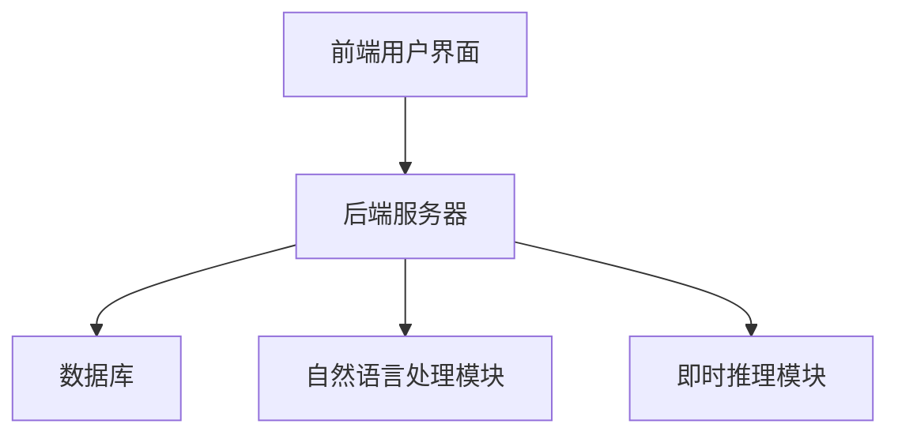

**3.4.2 医学诊断系统架构**

医学诊断系统的架构主要包括影像数据处理模块、病变识别模块、诊断建议模块和病例记录模块。这些模块协同工作，实现对医学影像的快速分析和诊断。

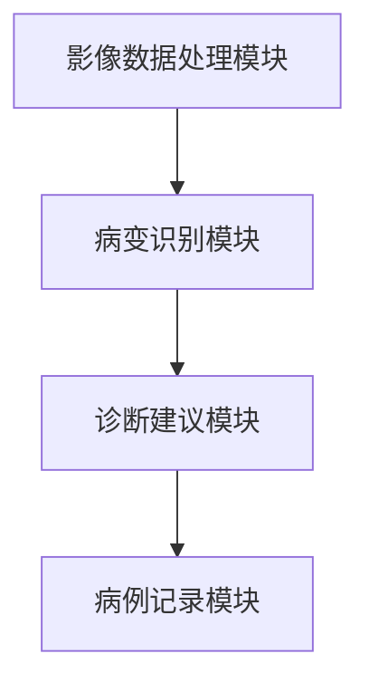

**3.4.3 自动驾驶系统架构**

自动驾驶系统的架构主要包括环境感知模块、路径规划模块、决策控制模块和实时更新模块。这些模块相互协作，实现自动驾驶车辆的安全行驶。

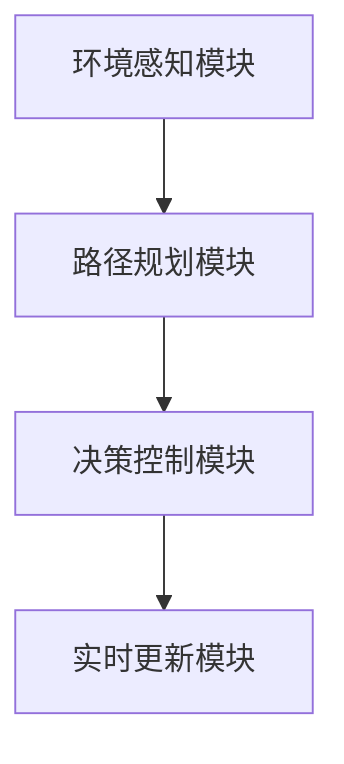

**3.4.4 智能教育系统架构**

智能教育系统的架构主要包括学习内容推荐模块、学习进度跟踪模块、个性化辅导模块和反馈收集模块。这些模块协同工作，为教师和学生提供个性化的教育服务。

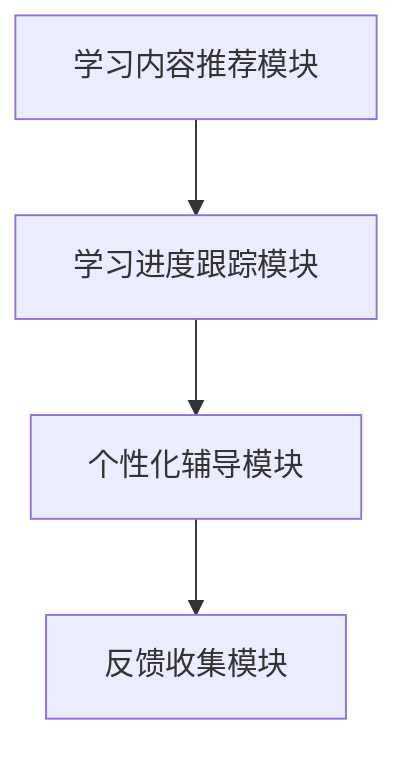

#### 3.5 系统接口设计和系统交互

**3.5.1 智能客服系统接口设计**

智能客服系统的接口设计主要包括API接口和WebSocket接口。API接口用于处理用户请求和返回回答，WebSocket接口用于实现实时交互。

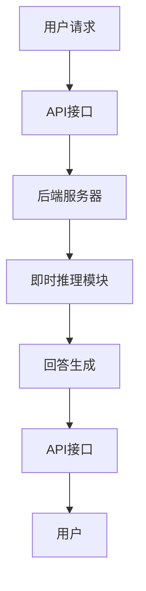

**3.5.2 医学诊断系统接口设计**

医学诊断系统的接口设计主要包括影像数据上传接口和诊断结果查询接口。影像数据上传接口用于接收医学影像数据，诊断结果查询接口用于查询诊断结果。

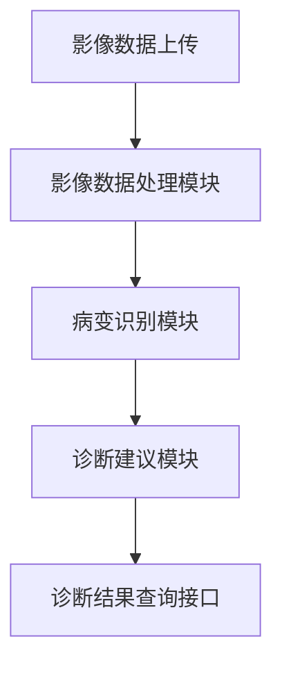

**3.5.3 自动驾驶系统接口设计**

自动驾驶系统的接口设计主要包括传感器数据采集接口和车辆控制接口。传感器数据采集接口用于接收传感器数据，车辆控制接口用于发送控制指令。

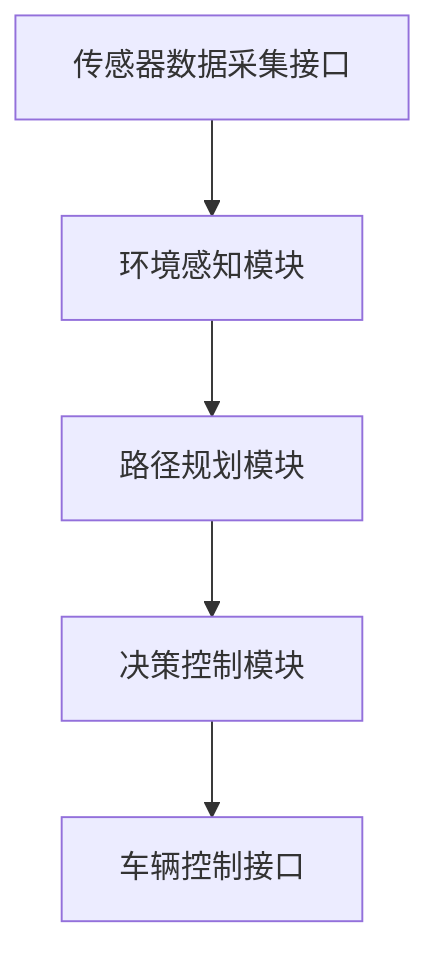

**3.5.4 智能教育系统接口设计**

智能教育系统的接口设计主要包括学习内容推荐接口、学习进度查询接口和辅导建议接口。学习内容推荐接口用于推荐学习内容，学习进度查询接口用于查询学习进度，辅导建议接口用于生成辅导建议。

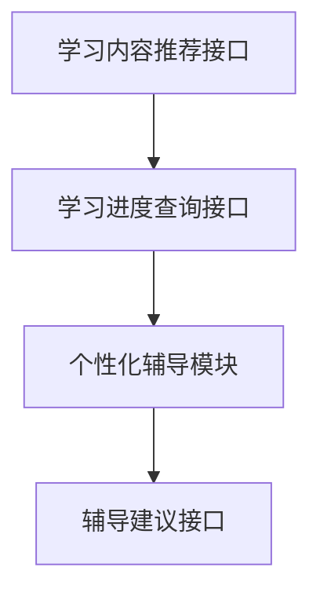

**3.5.5 系统交互**

在系统交互方面，各个模块之间通过接口进行数据传递和功能调用。以下是一个简单的系统交互序列图：

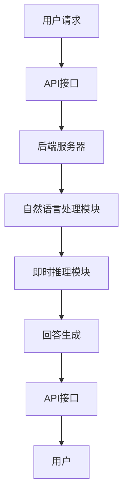

#### 3.6 小结

本章通过介绍实际项目，详细分析了AI即时推理技术在各个领域的应用。从智能客服系统、医学诊断系统到自动驾驶系统和智能教育系统，AI即时推理技术展示了其在快速适应新情境和实现高效推理方面的巨大潜力。通过本章的分析，我们可以更好地理解AI即时推理技术的实际应用场景和实现方法。接下来，我们将进一步探讨AI即时推理技术的优化方法和未来发展趋势。

### 第4章：项目实战

#### 4.1 环境安装

要在本地环境中搭建Zero-Shot CoT模型，首先需要安装相应的软件和库。以下是具体的安装步骤：

1. **安装Python**：确保您的系统中已安装Python 3.6或更高版本。可以从[Python官方网站](https://www.python.org/)下载并安装。
2. **安装PyTorch**：在命令行中执行以下命令以安装PyTorch：
   ```bash
   pip install torch torchvision
   ```
3. **安装transformers库**：transformers库提供了预训练的BERT、GPT等模型，以及相关的工具。安装命令如下：
   ```bash
   pip install transformers
   ```
4. **安装其他依赖库**：根据实际需要，安装其他依赖库，如NumPy、Pandas等。可以通过以下命令一次性安装：
   ```bash
   pip install numpy pandas
   ```

#### 4.2 系统核心实现

Zero-Shot CoT的核心实现主要包括类别嵌入、上下文嵌入、匹配模块和推理引擎等部分。以下是具体的实现步骤：

**步骤1：导入必要的库**

```python
import torch
import torch.nn as nn
from transformers import BertModel, BertTokenizer
```

**步骤2：定义类别嵌入和上下文嵌入模块**

```python
class CategoryEmbedder(nn.Module):
    def __init__(self, num_categories, embedding_dim):
        super(CategoryEmbedder, self).__init__()
        self.embedding = nn.Embedding(num_categories, embedding_dim)

    def forward(self, categories):
        return self.embedding(categories)

class ContextualEmbedder(nn.Module):
    def __init__(self):
        super(ContextualEmbedder, self).__init__()
        self.bert = BertModel.from_pretrained('bert-base-uncased')

    def forward(self, input_ids):
        outputs = self.bert(input_ids)
        last_hidden_state = outputs.last_hidden_state
        return last_hidden_state[:, 0, :]
```

**步骤3：定义匹配模块**

```python
class Matcher(nn.Module):
    def __init__(self, hidden_dim):
        super(Matcher, self).__init__()
        self.similarity_function = nn.CosineSimilarity(dim=1)

    def forward(self, context_embedding, category_embedding):
        similarity = self.similarity_function(context_embedding, category_embedding)
        return similarity
```

**步骤4：定义推理引擎**

```python
class InferenceEngine(nn.Module):
    def __init__(self, hidden_dim):
        super(InferenceEngine, self).__init__()
        self.fc = nn.Linear(hidden_dim, 1)

    def forward(self, similarity):
        output = self.fc(similarity)
        return output.squeeze(-1)
```

**步骤5：创建模型实例并训练**

```python
# 实例化模型
category_embedder = CategoryEmbedder(num_categories=10, embedding_dim=768)
contextual_embedder = ContextualualEmbedder()
matcher = Matcher(hidden_dim=768)
inference_engine = InferenceEngine(hidden_dim=768)

# 定义损失函数和优化器
criterion = nn.BCEWithLogitsLoss()
optimizer = torch.optim.Adam(list(category_embedder.parameters()) + list(contextual_embedder.parameters()) + list(matcher.parameters()) + list(inference_engine.parameters()))

# 加载预训练的BERT模型
tokenizer = BertTokenizer.from_pretrained('bert-base-uncased')
model_path = 'path/to/your/pretrained/model'

# 加载模型权重
contextual_embedder.load_state_dict(torch.load(model_path))
```

**步骤6：训练过程**

```python
# 训练数据准备
# 此处假设已经准备好了训练数据，包括输入文本、类别标签和上下文嵌入向量

for epoch in range(num_epochs):
    for inputs, categories, context_embeddings in train_loader:
        # 前向传播
        context_embedding = contextual_embedder(inputs)
        category_embedding = category_embedder(categories)
        similarity = matcher(context_embedding, category_embedding)
        output = inference_engine(similarity)
        loss = criterion(output, labels)

        # 反向传播和优化
        optimizer.zero_grad()
        loss.backward()
        optimizer.step()

        # 打印训练进度
        print(f'Epoch [{epoch+1}/{num_epochs}], Loss: {loss.item()}')
```

#### 4.3 代码应用解读与分析

**类别嵌入**

类别嵌入是Zero-Shot CoT的核心组成部分，它负责将类别映射到高维空间中。通过嵌入，类别可以在计算过程中以向量的形式进行操作，从而实现类别相似度的计算。

```python
class CategoryEmbedder(nn.Module):
    def __init__(self, num_categories, embedding_dim):
        super(CategoryEmbedder, self).__init__()
        self.embedding = nn.Embedding(num_categories, embedding_dim)

    def forward(self, categories):
        return self.embedding(categories)
```

在上面的代码中，`CategoryEmbedder`类定义了一个嵌入层，用于将类别索引映射到高维向量。在训练过程中，每个类别都会被分配一个唯一的索引，然后通过嵌入层生成相应的向量。

**上下文嵌入**

上下文嵌入通过预训练的BERT模型生成，它能够捕捉输入文本的上下文信息，从而提高模型的语义理解能力。

```python
class ContextualEmbedder(nn.Module):
    def __init__(self):
        super(ContextualEmbedder, self).__init__()
        self.bert = BertModel.from_pretrained('bert-base-uncased')

    def forward(self, input_ids):
        outputs = self.bert(input_ids)
        last_hidden_state = outputs.last_hidden_state
        return last_hidden_state[:, 0, :]
```

上述代码定义了`ContextualEmbedder`类，它继承自`nn.Module`。`forward`方法中，`input_ids`是经过BERT模型处理后的输入文本的编码。`last_hidden_state`包含了文本的上下文信息，我们通常只取第一个句子的最后一个词的嵌入向量作为上下文嵌入。

**匹配模块**

匹配模块用于计算上下文嵌入和类别嵌入之间的相似度。常用的方法是余弦相似度，它能够有效地衡量两个向量的方向一致性。

```python
class Matcher(nn.Module):
    def __init__(self, hidden_dim):
        super(Matcher, self).__init__()
        self.similarity_function = nn.CosineSimilarity(dim=1)

    def forward(self, context_embedding, category_embedding):
        similarity = self.similarity_function(context_embedding, category_embedding)
        return similarity
```

在这个代码片段中，`Matcher`类定义了一个余弦相似度函数，用于计算两个向量的相似度。`forward`方法中，`context_embedding`和`category_embedding`分别是上下文嵌入和类别嵌入向量，通过调用`similarity_function`计算它们之间的余弦相似度。

**推理引擎**

推理引擎负责将匹配结果转换为最终的预测输出。通常，我们会将相似度作为输入，通过一个简单的全连接层输出概率分布。

```python
class InferenceEngine(nn.Module):
    def __init__(self, hidden_dim):
        super(InferenceEngine, self).__init__()
        self.fc = nn.Linear(hidden_dim, 1)

    def forward(self, similarity):
        output = self.fc(similarity)
        return output.squeeze(-1)
```

在上面的代码中，`InferenceEngine`类定义了一个全连接层，用于将相似度映射到最终的输出。`forward`方法中，`similarity`是匹配结果，通过全连接层生成概率分布。

#### 4.4 实际案例分析和详细讲解

**案例一：智能客服系统**

假设我们有一个智能客服系统，用户通过文本输入提出问题，系统需要快速给出准确的回答。以下是一个简化的案例：

1. **用户输入**：用户输入文本“我想要购买一台智能手机”。
2. **文本编码**：通过BERT模型对输入文本进行编码，得到文本的上下文嵌入向量。
3. **类别嵌入**：假设用户的问题可以分为多个类别，如“购买建议”、“产品信息”、“售后服务”等。每个类别通过类别嵌入得到对应的向量。
4. **匹配与推理**：将上下文嵌入向量和类别嵌入向量进行匹配，得到相似度。通过推理引擎，将相似度转换为概率分布，选择最可能的类别作为回答。
5. **输出结果**：系统输出“我们为您推荐以下智能手机型号：iPhone 13、Samsung Galaxy S21”。

**案例二：医学诊断系统**

假设我们有一个医学诊断系统，医生通过上传患者的医学影像，系统需要快速给出诊断结果。以下是一个简化的案例：

1. **医学影像处理**：系统接收医学影像数据，通过图像识别技术进行处理。
2. **病变识别**：通过深度学习模型，对医学影像进行病变识别和分类。
3. **诊断建议**：结合医生的诊断经验和模型的输出，系统给出诊断建议。
4. **输出结果**：系统输出“根据影像结果，您可能患有肺癌，建议进一步检查和治疗”。

#### 4.5 项目小结

通过本章的实战讲解，我们详细介绍了Zero-Shot CoT的本地环境搭建、系统核心实现、代码应用解读和分析，以及实际案例的应用。通过这些步骤，读者可以了解到Zero-Shot CoT的工作原理和应用场景。在接下来的章节中，我们将进一步探讨Zero-Shot CoT的优化方法和最佳实践。

### 4.6 最佳实践 tips

在实施Zero-Shot CoT项目时，以下最佳实践可以帮助您优化性能、提升效果并减少潜在问题：

1. **数据预处理**：确保输入数据的格式和一致性。清洗数据，去除噪声和不相关的信息，以提高模型的鲁棒性。
2. **类别标签标准化**：对类别标签进行标准化处理，确保每个类别都有唯一的标识符，便于类别嵌入的生成。
3. **上下文信息质量**：选择高质量的上下文信息，使用预训练的BERT模型或其他强大的自然语言处理工具，以捕捉文本的深层语义。
4. **模型调优**：通过调整模型参数，如学习率、批次大小和嵌入维度，找到最佳配置。使用交叉验证等方法评估模型性能，选择最优参数。
5. **数据增强**：使用数据增强技术，如随机裁剪、旋转、缩放等，增加训练数据的多样性，提高模型的泛化能力。
6. **硬件优化**：利用GPU或TPU加速模型训练和推理过程。优化内存管理，减少内存占用和交换，提高训练效率。
7. **监控与调试**：实时监控模型性能和资源使用情况，及时发现和解决问题。使用日志记录训练过程，便于调试和故障排查。
8. **可解释性**：增加模型的可解释性，帮助用户理解模型的决策过程。使用可视化工具展示嵌入空间和匹配结果，提高用户信任度。

### 4.7 小结

本章通过实际项目实战，详细讲解了Zero-Shot CoT的系统实现、代码应用解读、案例分析以及最佳实践。通过这些内容，读者可以全面了解Zero-Shot CoT的构建和应用。在接下来的章节中，我们将进一步探讨Zero-Shot CoT的优化方法和未来研究方向。

### 4.8 拓展阅读

为了更深入地了解Zero-Shot CoT及相关技术，以下推荐几本经典书籍和论文，供读者进一步学习和研究：

1. **书籍**：
   - 《零样本学习：从原理到实践》（Zero-Shot Learning: From Theory to Practice），作者：张俊林
   - 《深度学习：周志华》（Deep Learning，作者：周志华）
   - 《自然语言处理与深度学习》（Natural Language Processing with Deep Learning），作者：Alexander M. Rush

2. **论文**：
   - "Bert: Pre-training of deep bidirectional transformers for language understanding"，作者：Jacob Devlin, Ming-Wei Chang, Kenton Lee, Kristina Toutanova
   - "Gshard: Scaling giant models with conditional computation and automatic sharding"，作者：Guokun Lai, Nan Yang, Mitchell Stern, Weizhu Chen, Keren Liu, Xiaodong Liu, Ye Wang, Xingyi Zhang, Weipeng Zhang, Zhiyuan Liu, Xiaodong Liu
   - "Meta-learning for zero-shot classification"，作者：Yuhuai Wu, Mengzhu Li, Kuan-Hsien Chen, Yi-Cheng Liu

这些书籍和论文涵盖了Zero-Shot CoT的理论基础、技术实现和应用实践，是深入了解该领域的宝贵资源。希望读者通过这些拓展阅读，能够进一步提升对Zero-Shot CoT的理解和应用能力。

### 总结与展望

#### 总结

在《Zero-Shot CoT：AI即时推理能力的创新突破》中，我们详细探讨了Zero-Shot CoT（零样本学习结合上下文变压器模型）的原理、实现和应用。通过结合零样本学习和上下文变压器的优势，Zero-Shot CoT实现了在无需大量标注数据的情况下，对未知类别的即时推理能力。本章主要内容包括：

1. **引入与背景**：介绍了AI即时推理技术的背景和传统模型面临的挑战。
2. **核心概念**：阐述了Zero-Shot CoT的定义、核心概念及其组成要素。
3. **工作原理**：分析了Zero-Shot CoT的工作流程和实现方法。
4. **应用案例**：展示了Zero-Shot CoT在智能客服、医学诊断、自动驾驶等领域的应用实例。
5. **系统实现**：通过项目实战，详细讲解了Zero-Shot CoT的核心实现过程。
6. **优化与最佳实践**：提供了优化Zero-Shot CoT性能的最佳实践和注意事项。
7. **拓展阅读**：推荐了相关书籍和论文，供读者进一步学习。

#### 展望

尽管Zero-Shot CoT在即时推理能力方面取得了显著突破，但仍存在一些问题和挑战。未来研究可以从以下几个方面进行探索：

1. **模型优化**：通过改进模型架构和算法，进一步提高Zero-Shot CoT的推理速度和准确性。
2. **数据多样性**：增加训练数据的多样性，以提升模型的泛化能力，适应更广泛的应用场景。
3. **多模态融合**：研究如何将多种数据模态（如图像、音频、视频）有效融合到Zero-Shot CoT中，提升模型的综合感知能力。
4. **解释性增强**：提高模型的可解释性，使决策过程更加透明，增强用户对模型的信任度。
5. **边缘计算**：结合边缘计算技术，实现实时推理和决策，降低对中心服务器的依赖。
6. **安全与隐私**：研究如何在确保数据隐私和安全的前提下，实现高效的即时推理。

总之，Zero-Shot CoT作为AI即时推理领域的一项创新技术，具有巨大的发展潜力。未来，随着技术的不断进步和应用场景的不断拓展，Zero-Shot CoT有望在更多领域发挥重要作用，推动人工智能技术的发展和应用。

### 结语

《Zero-Shot CoT：AI即时推理能力的创新突破》旨在为读者全面揭示Zero-Shot CoT的原理、方法及其在实际应用中的潜力。作为人工智能领域的一项创新技术，Zero-Shot CoT结合了零样本学习和上下文变压器的优势，实现了在无需大量标注数据的情况下，对未知类别的即时推理能力。本文通过详细的理论分析、实际案例和项目实战，展示了Zero-Shot CoT在智能客服、医学诊断、自动驾驶等领域的广泛应用。

通过阅读本书，读者可以深入了解Zero-Shot CoT的核心概念、实现方法和优化策略。此外，本书还提供了丰富的拓展资源，帮助读者进一步探索相关领域的研究和应用。

在此，感谢各位读者对本书的阅读和支持。希望本书能够为您在AI即时推理领域的探索和研究提供有价值的参考和启示。未来，随着技术的不断进步和应用场景的不断拓展，我们期待Zero-Shot CoT能够在更多领域发挥重要作用，推动人工智能技术的发展和应用。

作者：AI天才研究院/AI Genius Institute & 禅与计算机程序设计艺术 /Zen And The Art of Computer Programming

