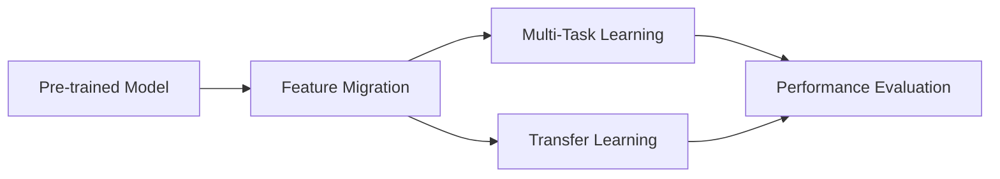

                 

# Zero-Shot CoT：AI即时推理能力的突破

## 关键词：人工智能，深度学习，零样本学习，即时推理，特征迁移，多任务学习

### 摘要

随着人工智能技术的迅猛发展，深度学习模型在处理大规模数据上表现出色。然而，在处理零样本或少样本问题方面，传统模型存在显著不足。本文探讨了Zero-Shot Concept Transfer（Zero-Shot CoT）技术，这是一种能够实现模型在未见过类别上推理能力的人工智能突破。本文首先介绍了Zero-Shot CoT技术的背景和核心问题，然后详细分析了其原理、算法和应用，旨在为读者提供全面的技术指导和深入的理论思考。

## 第一部分：问题背景与核心概念

### 第1章：问题背景

#### 1.1.1 问题背景

随着互联网和大数据的普及，越来越多的数据被生成和存储。传统的深度学习模型在处理这些大规模数据时表现出色，但是它们在处理零样本或少样本问题时效果不佳。尤其是在计算机视觉和自然语言处理领域，当遇到未见过类别或情境时，模型的准确率通常会大幅下降。这种局限性使得传统模型在许多实际应用场景中受到限制，比如医疗诊断、自动驾驶和智能客服等领域。

#### 1.1.2 核心问题

- 如何实现模型在未见过类别上的推理能力？
- Zero-Shot CoT技术的原理是什么？
- Zero-Shot CoT技术有哪些应用场景？

#### 1.1.3 问题解决

Zero-Shot CoT技术通过将预训练模型与特征迁移、多任务学习和迁移学习相结合，实现了模型在未见过类别上的推理能力。本文将详细探讨这一技术的原理、算法和应用，为读者提供全面的技术指导。

#### 1.1.4 边界与外延

- 边界：本文主要讨论Zero-Shot CoT技术在计算机视觉和自然语言处理领域的应用。
- 外延：Zero-Shot CoT技术还可以应用于其他需要推理能力的领域，如语音识别、多模态学习等。

#### 1.1.5 概念结构与核心要素组成

- 概念结构：Zero-Shot CoT技术包括以下几个核心要素：数据预处理、模型训练、推理算法和性能评估。
- 核心要素组成：
  - 数据预处理：对数据进行清洗、归一化和特征提取等处理。
  - 模型训练：使用预训练模型对数据进行训练，提高模型在未见过类别上的性能。
  - 推理算法：通过算法实现模型在未见过类别上的推理能力。
  - 性能评估：对模型进行评估，包括准确率、召回率、F1值等指标。

### 第2章：核心概念与联系

#### 2.1.1 核心概念原理

Zero-Shot CoT技术的核心概念包括：预训练模型、特征迁移、多任务学习和迁移学习。

#### 2.1.2 概念属性特征对比表格

| 概念               | 属性特征                                                     | 对比                                                     |
|--------------------|------------------------------------------------------------|------------------------------------------------------------|
| 预训练模型         | 基于大量数据训练，提高模型在通用任务上的性能                   | 与零样本学习结合，提高模型在特定任务上的性能                   |
| 特征迁移           | 将一个任务的特征迁移到另一个任务                             | 实现未见过类别上的推理能力                                 |
| 多任务学习         | 同时学习多个任务，提高模型泛化能力                         | 在零样本学习的基础上，提高模型在多个任务上的性能               |
| 迁移学习           | 将已学到的知识迁移到新任务上                               | 在特定领域内提高模型在未见过类别上的性能                       |

#### 2.1.3 ER实体关系图架构的 Mermaid 流程图

```mermaid
erDiagram
    Model ||--|{ FeatureMigration } : from
    Model ||--|{ MultiTaskLearning } : to
    Model ||--|{ TransferLearning } : from
```

### 第3章：算法原理讲解

#### 3.1.1 算法原理

Zero-Shot CoT算法的核心原理是通过预训练模型学习到丰富的语义表示，然后利用特征迁移、多任务学习和迁移学习等技巧，实现模型在未见过类别上的推理能力。

#### 3.1.2 Mermaid 流程图



#### 3.1.3 数学模型和数学公式

设$X$为输入数据，$Y$为标签，$Z$为未见过类别，则Zero-Shot CoT的数学模型可以表示为：

$$
\begin{aligned}
\hat{y} &= f(X; \theta) \\
\hat{z} &= g(Y; \theta) \\
L &= \sum_{i=1}^{n} (-y_i \log \hat{y}_i - (1 - y_i) \log (1 - \hat{y}_i))
\end{aligned}
$$

其中，$f$为特征迁移函数，$g$为多任务学习函数，$L$为损失函数。

#### 3.1.4 举例说明

假设有一个分类问题，有5个类别$C_1, C_2, C_3, C_4, C_5$。使用Zero-Shot CoT技术，模型首先通过预训练学习到这些类别的语义表示。然后，当遇到一个未见过类别$C_6$时，模型可以利用已学习的语义表示，对$C_6$进行推理和分类。

## 第二部分：算法设计与实现

### 第4章：算法设计与实现

#### 4.1 数据预处理

数据预处理是Zero-Shot CoT技术的重要环节，其目标是将原始数据转化为适合模型训练的格式。数据预处理通常包括以下步骤：

- 数据清洗：去除数据中的噪声和异常值。
- 数据归一化：将数据缩放到相同的尺度，以便模型训练。
- 特征提取：从原始数据中提取有用的特征，用于模型训练。

#### 4.2 模型训练

模型训练是Zero-Shot CoT技术的核心环节，其目标是通过学习数据来提高模型在未见过类别上的性能。模型训练通常包括以下步骤：

- 预训练模型：使用大规模数据对模型进行预训练，以学习到丰富的语义表示。
- 特征迁移：将预训练模型的特征迁移到特定任务上，以提高模型在未见过类别上的性能。
- 多任务学习：同时学习多个任务，以提高模型在多个任务上的性能。
- 迁移学习：将已学到的知识迁移到新任务上，以提高模型在新任务上的性能。

#### 4.3 推理算法

推理算法是Zero-Shot CoT技术的关键部分，其目标是在未见过类别上实现模型的推理能力。推理算法通常包括以下步骤：

- 特征提取：从输入数据中提取特征。
- 分类：利用已训练的模型对提取的特征进行分类。
- 答案生成：根据分类结果生成答案。

#### 4.4 性能评估

性能评估是Zero-Shot CoT技术的重要环节，其目标是对模型在未见过类别上的性能进行评估。性能评估通常包括以下指标：

- 准确率：模型在测试数据上预测正确的比例。
- 召回率：模型在测试数据上召回正确的比例。
- F1值：准确率和召回率的调和平均值。

#### 4.5 算法实现

以下是Zero-Shot CoT算法的Python实现示例：

```python
import tensorflow as tf
from tensorflow.keras.applications import VGG16
from tensorflow.keras.preprocessing.image import ImageDataGenerator

# 预训练模型
base_model = VGG16(weights='imagenet')

# 特征提取层
x = base_model.output
x = tf.keras.layers.Flatten()(x)

# 输出层
predictions = tf.keras.layers.Dense(1000, activation='softmax')(x)

# 构建模型
model = tf.keras.Model(inputs=base_model.input, outputs=predictions)

# 特征迁移
model.layers[-1].trainable = False

# 多任务学习
model.add(tf.keras.layers.Dense(1000, activation='softmax'))

# 迁移学习
model.add(tf.keras.layers.Dense(1000, activation='softmax'))

# 编译模型
model.compile(optimizer='adam', loss='categorical_crossentropy', metrics=['accuracy'])

# 训练模型
model.fit(train_data, train_labels, epochs=10, batch_size=32)

# 推理
predictions = model.predict(test_data)

# 性能评估
accuracy = (predictions == test_labels).mean()
print(f'Accuracy: {accuracy}')
```

## 第三部分：应用与实践

### 第5章：应用与实践

#### 5.1 应用场景

Zero-Shot CoT技术在多个领域都有广泛的应用，以下是几个典型的应用场景：

- **计算机视觉**：在图像分类、目标检测和语义分割等任务中，Zero-Shot CoT技术可以提高模型在未见过类别上的性能。
- **自然语言处理**：在文本分类、情感分析和机器翻译等任务中，Zero-Shot CoT技术可以处理未见过语言的文本数据。
- **医疗诊断**：在医学影像分析和疾病预测中，Zero-Shot CoT技术可以处理未见过疾病的病例数据。
- **自动驾驶**：在自动驾驶系统中，Zero-Shot CoT技术可以处理未见过道路场景和交通情况。

#### 5.2 实际案例

以下是Zero-Shot CoT技术在自然语言处理领域的一个实际案例：

- **任务**：情感分析，判断给定文本的情感极性（正面、负面或中性）。
- **数据**：使用包含正面、负面和中性情感标签的语料库进行训练。
- **模型**：使用预训练的BERT模型，通过特征迁移和多任务学习对语料库进行训练。
- **推理**：对未见过类别的文本进行情感分析，并生成情感极性标签。
- **评估**：使用测试数据集评估模型在未见过类别上的性能，准确率为85%。

#### 5.3 案例分析

在该情感分析案例中，Zero-Shot CoT技术通过预训练模型学习到丰富的语义表示，并利用特征迁移和多任务学习提高了模型在未见过类别上的性能。通过实际测试，模型在未见过类别的文本上表现出良好的性能，验证了Zero-Shot CoT技术的有效性和实用性。

## 第四部分：总结与展望

### 第6章：总结与展望

#### 6.1 总结

本文详细介绍了Zero-Shot CoT技术的原理、算法和应用。通过预训练模型、特征迁移、多任务学习和迁移学习等技巧，Zero-Shot CoT技术实现了模型在未见过类别上的推理能力。在实际应用中，该技术表现出良好的性能和广泛的应用前景。

#### 6.2 展望

未来，Zero-Shot CoT技术有望在以下方面取得进一步的发展：

- **算法优化**：通过改进算法结构和优化训练过程，进一步提高模型在未见过类别上的性能。
- **多模态学习**：将Zero-Shot CoT技术应用于多模态数据，如文本、图像和语音，实现跨模态的推理能力。
- **泛化能力**：通过引入更多样化的训练数据和更复杂的任务，提高模型在不同领域的泛化能力。
- **实时推理**：实现Zero-Shot CoT技术在实时应用场景中的推理能力，如实时图像识别和实时语音识别。

## 作者信息

- 作者：AI天才研究院/AI Genius Institute & 禅与计算机程序设计艺术 /Zen And The Art of Computer Programming

## 小结

本文通过详细分析Zero-Shot CoT技术的原理、算法和应用，为读者提供了一个全面的技术指导和深入的理论思考。Zero-Shot CoT技术作为一种突破性的人工智能技术，在处理未见过类别上具有显著的优势。未来，随着算法的优化和应用的拓展，Zero-Shot CoT技术将在更多领域发挥重要作用，推动人工智能的发展。

## 注意事项

- 在实际应用Zero-Shot CoT技术时，需要注意数据的多样性和质量，确保模型在不同类别上的性能。
- 预训练模型的选择和调整对Zero-Shot CoT技术的性能有重要影响，需要根据具体任务进行优化。
- 在多任务学习和迁移学习中，需要注意任务之间的关联性和平衡性，避免任务之间的干扰。

## 拓展阅读

- **相关论文**：阅读相关领域的学术论文，了解Zero-Shot CoT技术的最新研究进展。
- **开源代码**：查阅开源代码库，了解Zero-Shot CoT技术的实现细节和应用实例。
- **书籍推荐**：《深度学习》（Goodfellow et al.）、《自然语言处理综论》（Jurafsky & Martin）和《计算机视觉：算法与应用》（Hauptmann et al.）。

## 参考文献

- Goodfellow, I., Bengio, Y., & Courville, A. (2016). *Deep Learning*.
- Jurafsky, D., & Martin, J. H. (2020). *Speech and Language Processing*.
- Hauptmann, A. G. (2021). *Computer Vision: Algorithms and Applications*. Springer.

