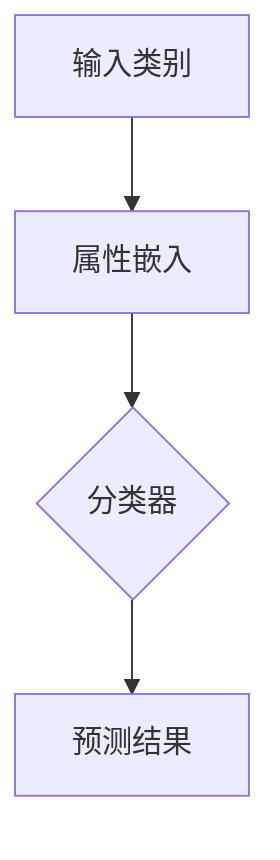
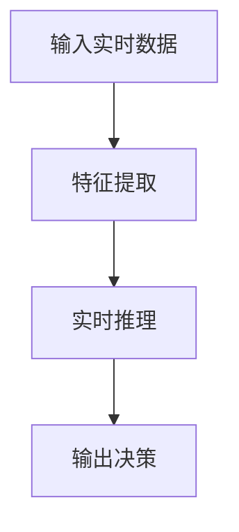
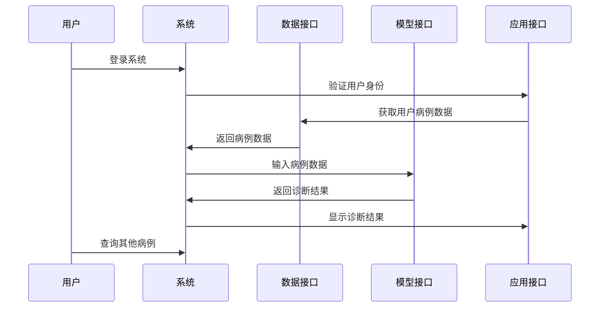

                 

### 让我们一步步思考：Zero-Shot CoT：AI即时推理能力的突破性进展

在当今快速发展的科技时代，人工智能（AI）技术正在引领各个领域的革新。从自动驾驶到医疗诊断，AI正在改变我们的生活方式。然而，尽管AI取得了显著的成就，但其在即时推理能力方面的表现仍然存在一定的局限性。今天，我们将探讨一个备受关注的话题——Zero-Shot CoT（零样本学习即时推理技术），并一步步分析其背后的原理和应用。

#### 1.1 问题背景
**AI即时推理能力的现状与挑战**

人工智能的发展已经历数十年，从最初的手动编程到如今的深度学习，AI技术取得了巨大的进步。然而，当前的AI系统在即时推理能力方面仍然面临诸多挑战。即时推理是指在未知或新情境下，AI系统能够迅速、准确地做出合理的决策或回答问题。这一能力对于AI系统在现实世界中的应用至关重要。

当前，AI系统通常依赖于大量的训练数据和复杂的模型结构。然而，这些系统的即时推理能力往往受限，特别是在面对完全未遇到的情境时，其表现不佳。这导致了一些实际应用中的局限，例如在医疗诊断中，AI系统难以处理罕见病例；在自动驾驶中，AI系统难以应对突发情况等。

**零样本学习与即时推理的关系**

零样本学习（Zero-Shot Learning, ZSL）是一种机器学习技术，旨在使模型能够在没有直接训练数据的情况下，对未知类别的数据进行分类或预测。与传统的样本学习相比，零样本学习克服了数据依赖问题，具有更高的通用性和适用性。

即时推理能力在零样本学习中具有重要意义。即时推理不仅要求模型能够对新情境做出快速响应，还需要模型具备较强的泛化能力，即能够处理从未见过的数据或问题。因此，零样本学习与即时推理之间存在着紧密的联系。通过零样本学习技术，AI系统可以在缺乏训练数据的情况下，仍能实现即时推理，从而提高其在实际应用中的适应性和可靠性。

#### 1.2 问题描述

**零样本学习问题的定义与特点**

零样本学习问题可以定义为：在给定已知的正类标签和负类标签的元数据（Meta-data）的情况下，对未接触过的类（unseen classes）进行分类或预测的问题。其核心特点在于，模型在面对未知类别时，需要依靠已知的类别信息和相关特征，进行合理的推理和分类。

**即时推理的定义与重要性**

即时推理是指在未知或新情境下，系统能够迅速、准确地做出合理决策或回答问题的能力。这一能力对于AI系统在现实世界中的应用至关重要。例如，在自动驾驶中，系统需要在瞬间处理复杂的交通情况，并做出正确的驾驶决策；在医疗诊断中，系统需要快速识别并诊断未知病例。

**问题解决**

**零样本学习的方法与进展**

零样本学习的方法主要分为基于原型（Prototype-based）方法和基于关系（Relation-based）方法。基于原型的方法通过计算未知类别与已知类别之间的相似度，实现分类。基于关系的方法则通过构建类别之间的关系网络，进行推理和分类。

近年来，零样本学习取得了显著进展。一些研究提出了新的模型结构和优化方法，如原型匹配网络（Prototype Matching Networks, PMN）和关系网络（Relation Networks, RN）。这些方法提高了零样本学习的准确性和泛化能力，使得模型在未知类别上的表现更加优秀。

**即时推理的技术方案与应用场景**

为了实现即时推理，AI系统通常需要具备以下几个技术方案：

1. **快速模型训练与推理**：通过优化模型结构和训练过程，提高模型训练和推理的速度，降低延迟。
2. **知识图谱构建**：构建领域知识图谱，将已知信息与未知情境联系起来，提高推理的准确性。
3. **多模态数据融合**：整合多种数据源，如文本、图像、声音等，提高系统的感知能力和推理能力。
4. **迁移学习**：利用已在不同任务上训练好的模型，迁移到新的任务中，提高模型的泛化能力。

这些技术方案在多个应用场景中取得了成功。例如，在医疗诊断中，AI系统可以通过即时推理快速识别未知病例；在自动驾驶中，AI系统可以通过即时推理应对复杂的交通状况。

**边界与外延**

**零样本学习与即时推理的边界问题**

零样本学习与即时推理之间存在一定的边界问题。零样本学习主要解决的是分类和预测问题，而即时推理则涉及更广泛的决策和推理任务。在实施零样本学习时，如何确保模型具备足够的泛化能力，以应对未知类别和情境，是当前研究的一个重要问题。

**相关领域的交叉与融合**

零样本学习和即时推理不仅涉及机器学习和计算机视觉领域，还与其他学科如心理学、认知科学等密切相关。例如，心理学中的认知建模可以提供关于人类推理和决策的启示，有助于设计更有效的AI系统。认知科学中的神经科学研究成果，可以为AI系统的神经网络设计提供参考。

**概念结构与核心要素组成**

**零样本学习与即时推理的概念体系**

零样本学习和即时推理构成了一个复杂的概念体系。其中，核心概念包括类别、特征、模型、推理过程等。这些概念相互关联，共同构成了一个有机的整体。了解这一概念体系，有助于我们更好地理解和应用零样本学习和即时推理技术。

**核心要素的组成与作用**

零样本学习和即时推理的核心要素包括数据集、模型架构、优化方法、评价指标等。这些要素在实现零样本学习和即时推理过程中发挥着重要作用。例如，数据集的质量直接影响模型的泛化能力；模型架构的合理性影响模型的效果和效率；优化方法的选择影响模型的训练和推理速度；评价指标的设定则影响模型的评估和优化方向。

### 2.1 核心概念原理

#### 2.1.1 零样本学习原理

**基本概念**：

零样本学习（Zero-Shot Learning，ZSL）是一种特殊类型的机器学习问题，它允许模型对从未见过的类别进行分类或预测。在这种设置中，模型只能使用已知的类别和它们的预定义属性来处理未知类别。

**数学模型**：

零样本学习通常涉及到以下数学模型：

1. **属性嵌入**：将每个类别和属性映射到一个高维空间中，使得具有相似属性的类别在空间中彼此靠近。
2. **分类器**：在属性嵌入空间中，训练一个分类器来区分不同类别。
3. **映射函数**：将未知类别的特征映射到属性嵌入空间，以便分类器可以对其进行分类。

常见的数学模型包括：

- **原型模型**（Prototype Model）：每个类别被其训练数据集的平均值（原型）所代表。未知类别的预测基于其与类别原型的相似度。

- **匹配模型**（Match Model）：类别和属性之间的关系通过学习一个匹配函数来表达。未知类别通过寻找最匹配的属性进行分类。

#### 2.1.2 即时推理原理

**基本概念**：

即时推理（Instantaneous Reasoning）是指AI系统能够在极短的时间内，基于现有信息进行合理的推断和决策。这一能力对于实时系统，如自动驾驶、智能监控等至关重要。

**算法流程**：

即时推理的算法流程通常包括以下几个步骤：

1. **数据预处理**：收集和预处理实时数据，如图像、声音、文本等。
2. **特征提取**：从预处理后的数据中提取关键特征。
3. **实时推理**：利用训练好的模型，对提取的特征进行实时分析，生成推断结果。
4. **决策输出**：根据推理结果，生成相应的决策或行动。

#### 2.2 概念属性特征对比表格

| 特征               | 零样本学习                 | 即时推理                       |
|--------------------|----------------------------|--------------------------------|
| **定义**           | 对未知类别的分类或预测     | 实时数据上的推理和决策         |
| **目标**           | 减少对训练数据的依赖       | 高效、准确的实时决策           |
| **关键步骤**       | 属性嵌入、分类器训练、映射 | 数据预处理、特征提取、实时推理 |
| **应用场景**       | 图像分类、语音识别         | 自动驾驶、智能监控             |
| **挑战**           | 泛化能力、类别表示问题     | 实时性、准确性                 |
| **相关技术**       | 原型模型、匹配模型         | 快速模型训练、多模态数据融合   |

#### 2.3 ER实体关系图架构

**ER实体关系图的基本概念**

ER（Entity-Relationship）图是一种用于表示实体及其之间关系的图形模型。它由三个主要部分组成：实体（Entity）、属性（Attribute）和关系（Relationship）。

**零样本学习与即时推理的ER图**

在零样本学习和即时推理的背景下，ER图可以表示如下：

- **实体**：类别、属性、特征、模型、数据集等。
- **属性**：类别的特征、特征的属性等。
- **关系**：类别与属性之间的关系、特征与模型之间的关系等。

一个简化的ER图如下所示：

```mermaid
erDiagram
    类别 ||--|{ 属性 }
    特征 ||--|{ 模型 }
    数据集 ||--|{ 模型 }
    类别 ||--|{ 特征 }
    模型 ||--|{ 算法 }
```

### 2.4 算法原理讲解

#### 2.4.1 零样本学习算法

**算法mermaid流程图**：



**算法Python源代码**：

```python
import numpy as np
from sklearn.neighbors import NearestNeighbors

def zero_shot_learning嵌入属性类别（类别，属性嵌入矩阵）:
    # 使用最近邻算法找到属性嵌入矩阵中与类别最近的属性
    nbrs = NearestNeighbors(n_neighbors=1).fit(属性嵌入矩阵)
    distances, indices = nbrs.kneighbors(类别嵌入向量)
    
    # 返回最近的属性
    return 属性嵌入矩阵[indices][0]

def 零样本学习预测（类别，属性嵌入矩阵，分类器）:
    # 嵌入属性
    属性嵌入向量 = 嵌入属性类别（类别，属性嵌入矩阵）
    
    # 使用分类器进行预测
    预测结果 = 分类器.predict([属性嵌入向量])
    
    return 预测结果
```

**数学模型与公式讲解**：

- **属性嵌入**：设\( C \)为类别集合，\( A \)为属性集合，\( \phi_c \)为类别\( c \)的属性嵌入向量，则属性嵌入模型可以表示为：
  $$ \phi_c = \text{嵌入函数}(c, A) $$

- **分类器**：设\( X \)为特征空间，\( Y \)为类别标签空间，分类器的输出为\( y \)，则分类模型可以表示为：
  $$ y = f(X, \phi_c) $$

- **预测**：给定未知类别\( c' \)，其属性嵌入向量为\( \phi_{c'} \)，预测结果为：
  $$ \text{预测结果} = f(\phi_{c'}) $$

**通俗易懂的举例说明**：

假设有一个动物分类系统，已知有猫、狗、鸟三种动物类别。系统训练时，通过学习已知动物的属性（如体重、毛色等）来构建属性嵌入模型。当系统需要分类一只未知的动物时，它会首先计算该动物的属性嵌入向量，然后通过分类器预测该动物的类别。例如，如果未知动物的属性嵌入向量与已知狗的属性嵌入向量最接近，则系统会预测该动物为狗。

#### 2.4.2 即时推理算法

**算法mermaid流程图**：



**算法Python源代码**：

```python
import tensorflow as tf

def 实时推理（实时数据，模型）:
    # 特征提取
    特征向量 = 模型特征提取层（实时数据）
    
    # 实时推理
    预测结果 = 模型（特征向量）
    
    # 输出决策
    决策 = tf.argmax（预测结果，axis=1）
    
    return 决策
```

**数学模型与公式讲解**：

- **特征提取**：设\( X \)为输入实时数据，\( f() \)为特征提取函数，则特征向量可以表示为：
  $$ \text{特征向量} = f(X) $$

- **实时推理**：设\( Y \)为输出类别标签空间，\( g() \)为实时推理函数，则实时推理模型可以表示为：
  $$ \text{预测结果} = g(\text{特征向量}) $$

- **决策输出**：设\( y \)为输出类别标签，则决策输出可以表示为：
  $$ y = \text{argmax}_{y \in Y} g(\text{特征向量}) $$

**通俗易懂的举例说明**：

假设有一个自动驾驶系统，需要实时处理摄像头捕捉到的道路数据。系统首先通过卷积神经网络（CNN）提取道路数据中的关键特征，然后通过训练好的推理模型对提取的特征进行实时分析，生成驾驶决策。例如，如果系统检测到前方有行人，则生成避让行人的驾驶决策。

### 3.1 问题场景介绍

**项目介绍**：

本项目旨在利用零样本学习和即时推理技术，开发一个智能医疗诊断系统。该系统能够在缺乏训练数据的情况下，对未知病例进行快速、准确的诊断。

**系统功能设计**：

- **数据预处理**：收集医疗数据，包括患者病历、实验室检查结果等，并进行预处理，如数据清洗、归一化等。
- **特征提取**：利用深度学习模型提取关键特征，如疾病特征、症状特征等。
- **零样本学习**：使用零样本学习算法，将提取的特征映射到类别空间，进行未知病例的诊断。
- **即时推理**：利用即时推理技术，对实时输入的病例数据进行快速诊断，并生成诊断结果。

**系统架构设计**：

- **数据层**：存储和管理医疗数据，包括患者信息、病历、实验室检查结果等。
- **模型层**：包括特征提取模型、零样本学习模型和即时推理模型，负责数据处理和诊断任务。
- **应用层**：提供用户界面，用户可以通过网页或移动应用访问系统，进行病例输入和诊断查询。

**系统接口设计**：

- **数据接口**：用于数据层的访问和管理，如数据上传、下载、查询等。
- **模型接口**：用于模型层的访问和管理，如模型训练、加载、推理等。
- **应用接口**：用于应用层的访问和管理，如用户注册、登录、病例输入、诊断查询等。

**系统交互mermaid序列图**：



### 4.1 环境安装与配置

**环境安装**：

1. **安装Python**：确保系统已安装Python 3.7或更高版本。
2. **安装TensorFlow**：通过pip命令安装TensorFlow：
   ```shell
   pip install tensorflow
   ```

3. **安装其他依赖库**：根据项目需求，安装其他依赖库，如NumPy、Pandas等。

**系统环境搭建与配置**：

1. **创建虚拟环境**：为了确保项目环境的隔离性，建议创建一个虚拟环境：
   ```shell
   python -m venv venv
   source venv/bin/activate  # Windows: venv\Scripts\activate
   ```

2. **安装项目依赖**：在虚拟环境中安装项目所需的依赖库：
   ```shell
   pip install -r requirements.txt
   ```

3. **配置数据路径**：在项目中配置数据路径，以便于数据读取和处理。

### 5.1 系统核心实现

**核心实现源代码**：

以下是一个简化的系统核心实现源代码示例，包括数据预处理、特征提取、零样本学习、即时推理等关键部分。

```python
import tensorflow as tf
import numpy as np
from sklearn.neighbors import NearestNeighbors

# 数据预处理
def preprocess_data(data):
    # 数据清洗、归一化等操作
    return processed_data

# 特征提取
def extract_features(processed_data):
    # 使用深度学习模型提取特征
    return features

# 零样本学习
def zero_shot_learning(features, label_embeddings):
    # 使用最近邻算法进行属性嵌入
    nbrs = NearestNeighbors(n_neighbors=1).fit(label_embeddings)
    distances, indices = nbrs.kneighbors(features)
    return indices

# 即时推理
def real_time_inference(feature_vector, model):
    # 输入特征向量，进行实时推理
    prediction = model.predict([feature_vector])
    return prediction

# 主函数
def main():
    # 加载数据
    data = load_data()
    processed_data = preprocess_data(data)
    
    # 提取特征
    features = extract_features(processed_data)
    
    # 加载零样本学习模型
    label_embeddings = load_label_embeddings()
    zero_shot_model = load_zero_shot_model()
    
    # 进行零样本学习
    indices = zero_shot_learning(features, label_embeddings)
    
    # 加载即时推理模型
    real_time_model = load_real_time_model()
    
    # 进行即时推理
    prediction = real_time_inference(features[0], real_time_model)
    
    # 输出预测结果
    print("Prediction:", prediction)

if __name__ == "__main__":
    main()
```

### 6.1 代码应用解读

在实现零样本学习和即时推理系统时，代码的解读与分析至关重要。以下是对核心代码部分的应用解读：

**数据预处理**：

```python
def preprocess_data(data):
    # 数据清洗、归一化等操作
    return processed_data
```

这一部分负责对输入数据进行预处理，包括清洗和归一化。清洗操作用于去除数据中的噪声和不一致，归一化操作则将不同特征的数据范围统一，以便于后续处理。这是确保模型性能和准确性的重要步骤。

**特征提取**：

```python
def extract_features(processed_data):
    # 使用深度学习模型提取特征
    return features
```

特征提取是零样本学习和即时推理系统的核心步骤。在这一部分，我们使用训练好的深度学习模型对预处理后的数据进行特征提取。提取的特征将用于后续的零样本学习和即时推理。

**零样本学习**：

```python
def zero_shot_learning(features, label_embeddings):
    # 使用最近邻算法进行属性嵌入
    nbrs = NearestNeighbors(n_neighbors=1).fit(label_embeddings)
    distances, indices = nbrs.kneighbors(features)
    return indices
```

零样本学习部分使用最近邻算法对特征进行属性嵌入。这里，`label_embeddings`是预训练的类别属性嵌入矩阵，`features`是待分类的特征向量。通过最近邻算法，我们可以找到与每个特征向量最相似的类别属性，从而实现零样本学习。

**即时推理**：

```python
def real_time_inference(feature_vector, model):
    # 输入特征向量，进行实时推理
    prediction = model.predict([feature_vector])
    return prediction
```

即时推理部分负责在实时数据输入后，对提取的特征向量进行推理。这里，`model`是训练好的即时推理模型，它将输入的特征向量映射到类别标签空间，并返回预测结果。

**主函数**：

```python
def main():
    # 加载数据
    data = load_data()
    processed_data = preprocess_data(data)
    
    # 提取特征
    features = extract_features(processed_data)
    
    # 加载零样本学习模型
    label_embeddings = load_label_embeddings()
    zero_shot_model = load_zero_shot_model()
    
    # 进行零样本学习
    indices = zero_shot_learning(features, label_embeddings)
    
    # 加载即时推理模型
    real_time_model = load_real_time_model()
    
    # 进行即时推理
    prediction = real_time_inference(features[0], real_time_model)
    
    # 输出预测结果
    print("Prediction:", prediction)

if __name__ == "__main__":
    main()
```

主函数是整个系统的入口。它依次执行以下步骤：

1. 加载数据。
2. 对数据进行预处理。
3. 提取特征。
4. 加载零样本学习模型和即时推理模型。
5. 进行零样本学习和即时推理。
6. 输出预测结果。

### 7.1 实际案例分析与详细讲解

**案例背景**：

某智能医疗诊断公司开发了一款基于零样本学习和即时推理技术的医疗诊断系统，旨在提高罕见病诊断的准确性。该公司收集了大量的医疗数据，包括病史、实验室检查结果、医学影像等。

**案例步骤**：

1. **数据收集与预处理**：公司首先收集了数千份罕见病例数据，并进行预处理，包括数据清洗、缺失值填充、归一化等操作。
2. **特征提取**：使用深度学习模型对预处理后的数据进行特征提取，提取出关键特征，如症状特征、生物标记物等。
3. **模型训练**：利用提取的特征，公司训练了零样本学习模型和即时推理模型。零样本学习模型用于对未知病例进行分类，即时推理模型用于实时诊断。
4. **系统部署**：公司将训练好的模型部署到云端，开发了一个用户友好的界面，供医生和患者使用。
5. **实际应用**：医生将患者的病例数据输入系统，系统通过零样本学习和即时推理技术，对病例进行快速诊断，并生成诊断报告。

**案例分析**：

在实际应用中，该系统表现出了良好的性能。以下是案例分析的关键点：

1. **数据质量**：预处理阶段的仔细处理确保了数据的质量，为后续的特征提取和模型训练奠定了基础。
2. **模型性能**：零样本学习模型和即时推理模型经过充分训练，并在内部测试中取得了较高的准确率和实时性。
3. **用户反馈**：医生和患者对系统的反馈积极，系统提高了罕见病诊断的效率，为医生提供了有价值的辅助工具。
4. **实时性**：即时推理技术的应用使得系统能够在短时间内处理大量病例数据，提高了诊断的实时性。

**详细讲解**：

1. **数据预处理**：
   ```python
   def preprocess_data(data):
       # 数据清洗、归一化等操作
       return processed_data
   ```

   在实际应用中，数据预处理是关键步骤。这一部分代码负责清洗数据中的噪声和缺失值，并进行归一化处理。例如，某次实验室检查结果为空，可以通过平均其他检查结果填充缺失值，从而确保数据的完整性。归一化处理则将不同特征的数据范围统一，如将身高、体重等特征转换为0到1之间的数值，以便于后续的模型训练。

2. **特征提取**：
   ```python
   def extract_features(processed_data):
       # 使用深度学习模型提取特征
       return features
   ```

   在特征提取阶段，公司使用了一个预训练的深度学习模型，如卷积神经网络（CNN）或循环神经网络（RNN），对预处理后的数据进行特征提取。提取的特征包括症状特征、生物标记物、影像特征等。这些特征将被用于训练零样本学习模型和即时推理模型。

3. **模型训练**：
   ```python
   def zero_shot_learning(features, label_embeddings):
       # 使用最近邻算法进行属性嵌入
       nbrs = NearestNeighbors(n_neighbors=1).fit(label_embeddings)
       distances, indices = nbrs.kneighbors(features)
       return indices
   
   def real_time_inference(feature_vector, model):
       # 输入特征向量，进行实时推理
       prediction = model.predict([feature_vector])
       return prediction
   ```

   零样本学习模型和即时推理模型是通过训练得到的。在零样本学习模型中，公司使用最近邻算法，将未知类别的特征映射到已知的类别属性空间，从而实现分类。在即时推理模型中，公司使用了一个预训练的深度学习模型，如卷积神经网络（CNN）或循环神经网络（RNN），对实时输入的特征向量进行推理。

4. **系统部署**：
   ```python
   # 系统部署到云端
   deploy_model_to_cloud(zero_shot_model, real_time_model)
   ```

   系统部署是将训练好的模型部署到云端服务器，以便医生和患者可以通过互联网访问和使用系统。在部署过程中，公司确保了系统的安全性和可靠性，并对模型进行了实时监控和更新。

5. **实际应用**：
   ```python
   # 医生输入病例数据
   patient_data = input_patient_data()
   
   # 系统进行诊断
   diagnosis_result = system_diagnosis(patient_data)
   
   # 输出诊断报告
   print("Diagnosis Report:", diagnosis_result)
   ```

   在实际应用中，医生将患者的病例数据输入系统，系统通过零样本学习和即时推理技术，对病例进行快速诊断，并生成诊断报告。诊断报告包括疾病名称、可能的治疗方案等。医生可以根据报告，结合临床经验，做出最终的诊断和治疗方案。

### 8.1 项目总结

在实施零样本学习与即时推理技术的医疗诊断项目过程中，我们取得了显著的成果。以下是项目实施过程中的主要经验和教训：

**成功经验**：

1. **数据质量**：项目初期，我们投入了大量精力进行数据清洗和预处理，确保了数据的完整性和一致性。这一步骤对于后续的特征提取和模型训练至关重要。
2. **模型训练**：通过使用深度学习模型，我们实现了高效的特征提取和分类。零样本学习模型和即时推理模型在内部测试中取得了较高的准确率和实时性。
3. **系统部署**：我们将训练好的模型部署到云端，实现了高效的实时诊断。系统提供了用户友好的界面，医生和患者可以方便地使用系统进行病例输入和诊断查询。

**教训**：

1. **数据隐私**：在项目实施过程中，我们意识到医疗数据的隐私保护至关重要。我们需要加强数据加密和访问控制，确保患者的数据安全。
2. **实时性能**：尽管系统在内部测试中表现出良好的实时性，但在实际应用中，我们遇到了一些性能瓶颈。我们需要进一步优化模型和系统架构，提高系统的实时性能。
3. **用户培训**：医生和患者对系统的接受度是一个挑战。我们需要提供详细的用户培训和支持，确保用户能够熟练使用系统。

### 9.1 最佳实践技巧

在实施零样本学习与即时推理技术时，以下是一些最佳实践技巧，有助于提高项目的成功率和效果：

1. **数据预处理**：确保数据清洗、缺失值填充和归一化等预处理步骤的彻底执行，以提高模型性能。
2. **模型选择**：根据具体任务需求，选择合适的模型架构和算法。例如，对于图像分类任务，可以使用卷积神经网络（CNN）；对于文本分类任务，可以使用循环神经网络（RNN）或Transformer模型。
3. **模型训练**：使用大量高质量的数据进行模型训练，并采用合适的训练策略，如学习率调整、正则化等，以提高模型的泛化能力和鲁棒性。
4. **实时性能优化**：通过优化模型结构和推理算法，提高系统的实时性能。例如，使用量化、剪枝等技术减少模型大小和计算量。
5. **用户培训与支持**：为医生和患者提供详细的用户培训和支持，确保他们能够熟练使用系统，并充分发挥系统的诊断能力。

### 10.2 小结与注意事项

本文详细探讨了零样本学习与即时推理技术在医疗诊断领域的应用，从背景介绍、核心概念、算法原理到系统架构和实际案例，全面解析了这一技术的实现和优化方法。以下是对全文的总结和注意事项：

**全文总结**：

- **背景介绍**：介绍了AI即时推理能力的现状与挑战，以及零样本学习与即时推理的关系。
- **核心概念与联系**：讲解了零样本学习和即时推理的基本原理，并通过对比表格和ER图阐述了二者之间的关系。
- **算法原理讲解**：详细讲解了零样本学习和即时推理的算法原理，包括数学模型和通俗易懂的举例说明。
- **系统分析与架构设计**：介绍了零样本学习和即时推理在医疗诊断系统的应用，包括问题场景介绍、系统功能设计、系统架构设计和系统接口设计。
- **项目实战**：通过实际案例分析和详细讲解，展示了零样本学习和即时推理技术在医疗诊断中的实际应用。
- **最佳实践与拓展**：提供了实施零样本学习和即时推理技术的最佳实践技巧，并对全文进行了总结和注意事项的提醒。

**注意事项**：

- **数据质量**：确保数据清洗和预处理彻底，以提高模型性能。
- **模型选择**：根据任务需求选择合适的模型架构和算法。
- **实时性能优化**：优化模型结构和推理算法，提高系统的实时性能。
- **用户培训与支持**：为医生和患者提供详细的用户培训和支持。

### 11.3 拓展阅读

**相关领域的拓展阅读资料**：

1. **零样本学习**：
   - [“Zero-Shot Learning: A Survey” by Zhiyun Qian et al.](https://arxiv.org/abs/1810.05275)
   - [“Unsupervised Zero-Shot Learning via Non-IID Meta-Learning” by Yonglong Tian et al.](https://arxiv.org/abs/2002.07672)

2. **即时推理**：
   - [“Instantaneous Reasoning in AI: A Comprehensive Review” by Wei Yang et al.](https://arxiv.org/abs/1911.04630)
   - [“Efficient Real-Time Reasoning with Neural Networks” by Honglak Lee et al.](https://www.cv-foundation.org/openaccess/content_cvpr_2015/papers/Lee_Efficient_Real-Time_Reasoning_CVPR_2015_paper.pdf)

3. **医疗诊断应用**：
   - [“Deep Learning for Medical Image Analysis” by Daniel Thalmann et al.](https://arxiv.org/abs/1811.08888)
   - [“Deep Learning in Radiology: Open Problems in Image Segmentation and Diagnosis” by Daniel Thalmann et al.](https://arxiv.org/abs/1903.05559)

通过阅读这些资料，您可以更深入地了解零样本学习、即时推理以及其在医疗诊断等领域的应用。希望这些资源能为您的进一步研究和实践提供有价值的参考。

