                 

**# Zero-Shot CoT: AI Cross-Domain Learning's New Paradigm and Application Prospects**

### Keywords: **Zero-Shot Learning, Cross-Domain Learning, Knowledge Transfer, AI Applications, Future Trends**

### Summary:  
In this article, we will explore the concept of Zero-Shot Cross-Domain Learning (ZSCDL) and its significance in the field of AI. We will discuss the background, fundamental principles, and applications of ZSCDL, as well as the challenges and future prospects of this emerging paradigm. By understanding the steps and reasoning behind ZSCDL, readers will gain insights into how AI can learn across different domains with minimal training data, offering a promising solution to various real-world problems.

## Introduction and Background

### 1. Introduction to Zero-Shot Learning (ZSL)
Zero-Shot Learning (ZSL) is a machine learning technique that enables models to predict unseen categories without any training data for those categories. Traditional machine learning approaches require extensive labeled data for training to achieve accurate predictions. However, in certain scenarios, obtaining sufficient labeled data is challenging, particularly in cross-domain learning and new category recognition. ZSL addresses this issue by allowing models to leverage prior knowledge to make predictions on unseen categories.

### 2. Problem Background
With the rapid advancement of artificial intelligence (AI) technologies, ZSL has become a hotspot research area. It holds significant potential in various fields, such as natural language processing (NLP) and computer vision. However, traditional ZSL methods often rely on large-scale datasets and complex model architectures, resulting in high training costs and computational resource consumption.

### 3. Problem Solution
To tackle these challenges, researchers have recently proposed Zero-Shot Cross-Domain Learning (ZSCDL) as a new paradigm. ZSCDL leverages knowledge transfer across different domains, reducing the dependency on large-scale data for training and improving the model's generalization ability.

### 4. Boundaries and Extensions
Zero-Shot Cross-Domain Learning focuses on knowledge transfer between different domains to enable models to quickly adapt to new domains. This involves two main aspects: (1) effective knowledge representation across domains and (2) applying the extracted knowledge for zero-shot learning tasks.

### 5. Concept Structure and Core Components
The main concepts of Zero-Shot Cross-Domain Learning include:
- **Knowledge Representation**: How to represent knowledge from different domains in a unified form for transfer.
- **Cross-Domain Knowledge Transfer**: How to transfer knowledge from the source domain to the target domain to improve the model's performance in the target domain.
- **Zero-Shot Learning Strategies**: How to utilize cross-domain knowledge for zero-shot learning to achieve good generalization.

## Technical Principles of Zero-Shot Cross-Domain Learning

### 6. Basic Principles of Zero-Shot Cross-Domain Learning
The basic principles of Zero-Shot Cross-Domain Learning involve two main aspects: (1) integrating knowledge from different domains into a unified knowledge space and (2) utilizing this unified knowledge space for cross-domain knowledge transfer to enhance the model's performance in the target domain.

### 7. Knowledge Representation Methods
Knowledge representation is a crucial step in Zero-Shot Cross-Domain Learning. Common methods include:
- **Word Embedding-Based Methods**: Mapping words from different domains to a low-dimensional continuous space, making semantically similar words closer in the space.
- **Knowledge Graph-Based Methods**: Constructing a cross-domain knowledge graph to represent the relationships between knowledge in different domains.

### 8. Cross-Domain Knowledge Transfer Methods
Cross-domain knowledge transfer methods primarily include:
- **Model-Based Methods**: Training a unified model to transfer knowledge from the source domain to the target domain.
- **Sample-Based Methods**: Transferring sample data from the source domain to the target domain to apply knowledge from the source domain.

### 9. Zero-Shot Learning Strategies
Zero-Shot Learning strategies mainly include:
- **Prototype-Based Methods**: Classifying samples by computing the distance between prototypes (i.e., the center points of domain knowledge in the low-dimensional space) and the samples to be classified.
- **Matching-Degree-Based Methods**: Classifying samples by computing the matching degree between domain knowledge and the samples to be classified.

## Applications of Zero-Shot Cross-Domain Learning in Practice

### 10. Applications in Natural Language Processing (NLP)
Zero-Shot Cross-Domain Learning has a wide range of applications in NLP, such as cross-lingual text classification and multi-lingual text generation.

### 11. Applications in Computer Vision
In computer vision, Zero-Shot Cross-Domain Learning is essential for tasks like image classification and object detection.

### 12. Applications in the Medical Field
In the medical field, Zero-Shot Cross-Domain Learning can help doctors quickly identify new disease types and improve diagnostic accuracy.

### 13. Applications in the Industrial Field
In the industrial field, Zero-Shot Cross-Domain Learning can help businesses quickly adapt to new production scenarios and improve efficiency.

## Future Trends and Challenges of Zero-Shot Cross-Domain Learning

### 14. Future Trends
With the continuous advancement of AI technologies, Zero-Shot Cross-Domain Learning will have broader applications, particularly in fields like intelligent healthcare and smart industries.

### 15. Challenges
Zero-Shot Cross-Domain Learning still faces challenges, such as better cross-domain knowledge representation and efficient knowledge transfer.

### 16. Conclusion
Zero-Shot Cross-Domain Learning, as an emerging paradigm, has great potential in various fields. Although challenges remain, with further research and development, it is expected to play a significant role in the future of AI.**## 第一部分: 引言与背景介绍**

### 1. 引言

**零样本学习（Zero-Shot Learning, ZSL）**是一种在机器学习领域中的突破性技术，它允许模型在没有针对特定类别训练数据的情况下，对未知类别进行预测。传统的机器学习依赖于大量的带标签数据进行训练，但在许多实际应用中，获取这样的数据可能非常困难，例如在跨领域学习、新类别识别和个性化推荐系统等场景中。因此，零样本学习作为一种创新的解决方案，具有重要的研究价值和广泛的应用前景。

### 2. 问题背景

在当前人工智能发展的背景下，机器学习模型在各种任务中的性能不断提高。然而，传统的机器学习模型通常需要大量的带有标签的训练数据来学习特征和规律，从而进行准确的预测。这种数据依赖性限制了模型在现实世界中的适用性，特别是在以下几种情况下：

- **跨领域学习**：不同领域的数据分布和特征可能存在显著差异，使得模型难以在新的领域中进行有效的预测。
- **新类别识别**：在现实世界中，新的类别不断出现，模型需要能够快速适应这些新的类别，而不需要重新进行训练。
- **数据稀缺性**：在某些领域，如医学诊断、安全监控等，获取足够的多标签数据是非常困难的，这限制了传统机器学习模型的应用。

### 3. 问题解决

为了克服这些挑战，研究者们提出了**零样本学习（ZSL）**的概念。ZSL的核心思想是利用模型在训练阶段学到的通用特征，对从未见过的类别进行预测。这种方法不需要针对每个新类别提供大量的训练数据，从而大大降低了数据获取的成本。然而，随着人工智能应用的不断拓展，ZSL面临着新的挑战：

- **数据不足的影响**：在零样本学习过程中，模型往往依赖于有限的训练数据，这可能导致模型在未知类别上的性能下降。
- **跨领域迁移的困难**：不同领域的数据特征和分布可能存在较大差异，如何有效地在跨领域之间迁移知识成为一个重要问题。

为了解决这些挑战，近年来研究者们提出了**零样本跨领域学习（Zero-Shot Cross-Domain Learning, ZSCDL）**这一新范式。ZSCDL利用跨领域的知识迁移，使得模型在训练时可以减少对大规模数据的依赖，从而降低训练成本和提高模型的泛化能力。

### 4. 边界与外延

零样本跨领域学习主要研究如何在不同领域间进行知识迁移，使得模型能够快速适应新的领域。这包括以下关键方面：

- **领域适应**：如何使模型能够在不同领域之间进行有效的迁移，以应对新的任务需求。
- **知识表示**：如何将不同领域的知识表示为统一的形式，以便进行迁移。
- **知识融合**：如何融合跨领域知识，以增强模型在目标领域的性能。
- **模型优化**：如何优化模型结构，使其能够更好地利用跨领域知识。

### 5. 概念结构与核心要素组成

零样本跨领域学习的主要概念包括：

- **知识表示**：将不同领域的知识表示为统一的形式，如使用词嵌入或知识图谱等方法。
- **跨领域知识迁移**：通过模型训练或样本迁移，将源领域的知识应用到目标领域。
- **零样本学习策略**：利用跨领域知识进行分类、预测等任务，实现良好的泛化能力。
- **模型优化**：通过调整模型参数或结构，提高模型在跨领域学习任务中的性能。

以上五个核心要素构成了零样本跨领域学习的基础框架，为后续章节的详细讨论提供了理论支持。

---

接下来，我们将深入探讨零样本跨领域学习的技术原理，包括知识表示、跨领域知识迁移方法和零样本学习策略，以帮助读者更好地理解这一新兴的技术范式。

**## 第二部分: 零样本跨领域学习的技术原理**

### 6. 零样本跨领域学习的基本原理

零样本跨领域学习（Zero-Shot Cross-Domain Learning, ZSCDL）是一种利用跨领域知识提升模型泛化能力的技术。其基本原理可以分为两个主要部分：知识表示和知识迁移。

**知识表示**：在这一步骤中，我们首先需要将不同领域的知识表示为一种统一的形式。这通常涉及到将领域知识映射到一个共同的语义空间中。这一过程可以采用多种方法，包括基于词嵌入的方法和基于知识图谱的方法。

- **基于词嵌入的方法**：这种方法通过将不同领域的词语映射到低维的向量空间中，使得具有相似意义的词语在空间中靠近。词嵌入技术如Word2Vec、GloVe等，已经证明了在NLP任务中的有效性。在ZSCDL中，我们可以将这一技术扩展到跨领域，通过训练多领域的词嵌入模型，将不同领域的词语映射到同一空间。

- **基于知识图谱的方法**：知识图谱是一种结构化的知识表示形式，它通过实体和关系来表示知识。在ZSCDL中，我们可以构建一个跨领域的知识图谱，将不同领域中的实体和关系整合到同一个图谱中。这样，我们可以通过分析图谱中的结构和关系，来实现知识的跨领域迁移。

**知识迁移**：一旦我们将不同领域的知识表示为统一的形式，下一步就是将这些知识迁移到目标领域。知识迁移的方法可以分为基于模型的方法和基于样本的方法。

- **基于模型的方法**：这种方法通过训练一个统一的模型，将源领域的知识迁移到目标领域。在训练过程中，模型会学习到源领域的特征和规律，并将其应用到目标领域。这种方法的一个关键挑战是如何设计一个能够有效迁移知识的模型架构。

- **基于样本的方法**：这种方法通过迁移训练好的模型在源领域上的样本数据，将源领域的知识应用到目标领域。具体来说，我们可以将源领域的训练数据转换为一种通用格式，然后将其应用于目标领域的模型训练中。这种方法的一个优点是，它不需要复杂的模型架构，但可能会导致迁移效果不如基于模型的方法。

**知识融合**：在知识迁移的过程中，我们还需要考虑如何融合跨领域知识，以增强模型在目标领域的性能。知识融合可以通过多种方式实现，如集成学习、对抗训练等。

- **集成学习**：这种方法通过将多个子模型融合为一个统一的模型，以提高预测的准确性。在ZSCDL中，我们可以将不同领域中的子模型（如词嵌入模型、知识图谱模型等）集成起来，形成一个统一的跨领域模型。

- **对抗训练**：这种方法通过对抗性学习，使模型在源领域和目标领域之间进行博弈，从而提高模型在目标领域的性能。具体来说，我们可以训练一个生成器模型，使其在源领域生成对抗样本，然后训练一个鉴别器模型，使其能够区分源领域和目标领域的真实样本。通过这种方式，我们可以有效地将源领域的知识迁移到目标领域。

### 7. 知识表示方法

在零样本跨领域学习中，知识表示是关键的一步。以下是一些常见的方法：

- **基于词嵌入的方法**：如前所述，词嵌入方法通过将词语映射到低维向量空间中，使得具有相似意义的词语在空间中靠近。这种方法的一个优点是，它能够有效地捕捉词语的语义信息，从而实现跨领域的知识表示。

  | 方法 | 优点 | 缺点 |
  | --- | --- | --- |
  | Word2Vec | 能够捕捉词语的语义信息 | 对长文本的处理效果不佳 |
  | GloVe | 能够更好地处理长文本 | 训练时间较长 |

- **基于知识图谱的方法**：知识图谱方法通过实体和关系来表示知识，可以有效地整合跨领域的知识。这种方法的一个优点是，它能够提供结构化的知识表示，从而提高模型的迁移能力。

  | 方法 | 优点 | 缺点 |
  | --- | --- | --- |
  | OpenKG | 能够整合多种领域的知识 | 图的规模可能非常大，导致计算效率低 |
  | DBpedia | 数据质量高，易于扩展 | 需要大量的预处理工作 |

- **基于图神经网络的方法**：图神经网络（Graph Neural Networks, GNN）是一种在知识图谱上进行学习的深度学习模型。它通过学习节点和边的特征，可以有效地表示跨领域的知识。

  | 方法 | 优点 | 缺点 |
  | --- | --- | --- |
  | GraphSAGE | 能够自适应地聚合节点信息 | 对大规模图的处理效率较低 |
  | GAT | 能够自适应地学习节点和边的特征 | 对参数调整要求较高 |

通过这些知识表示方法，我们可以将不同领域的知识整合为一个统一的形式，为后续的知识迁移和零样本学习奠定基础。

### 8. 跨领域知识迁移方法

跨领域知识迁移是零样本跨领域学习的关键步骤，以下是一些常见的方法：

- **基于模型的方法**：这种方法通过训练一个统一的模型，将源领域的知识迁移到目标领域。一个典型的例子是**多任务学习（Multi-Task Learning, MTL）**，其中多个任务共享部分模型参数，从而实现知识迁移。

  | 方法 | 优点 | 缺点 |
  | --- | --- | --- |
  | MTL | 能够共享不同任务的知识，提高迁移效果 | 需要足够多的训练数据和任务 |

- **基于样本的方法**：这种方法通过迁移训练好的模型在源领域上的样本数据，将源领域的知识应用到目标领域。一个典型的例子是**域自适应（Domain Adaptation, DA）**，它通过将源领域的样本转换为与目标领域相似的形式，来提高模型在目标领域的性能。

  | 方法 | 优点 | 缺点 |
  | --- | --- | --- |
  | DA | 能够处理大量未标记的目标领域数据 | 需要大量的迁移学习算法调整 |

- **基于对抗的方法**：这种方法通过对抗性学习，使模型在源领域和目标领域之间进行博弈，从而提高模型在目标领域的性能。一个典型的例子是**对抗域自适应（Adversarial Domain Adaptation, ADA）**，其中生成器模型生成与目标领域相似的数据，鉴别器模型学习区分源领域和目标领域的数据。

  | 方法 | 优点 | 缺点 |
  | --- | --- | --- |
  | ADA | 能够提高模型对目标领域的适应性 | 需要大量的计算资源 |

通过这些跨领域知识迁移方法，我们可以将源领域的知识有效地应用到目标领域，从而提高模型在目标领域的性能。

### 9. 零样本学习策略

零样本学习策略是零样本跨领域学习的核心，以下是一些常见的策略：

- **基于原型的方法**：这种方法通过计算原型（即领域知识在低维空间中的中心点）与待分类样本之间的距离，实现分类。一个典型的例子是**原型网络（Prototypical Networks）**，它通过计算原型与样本的距离来进行分类。

  | 方法 | 优点 | 缺点 |
  | --- | --- | --- |
  | 原型网络 | 简单有效，适用于小样本学习 | 需要对原型进行合适的初始化 |

- **基于匹配度的方法**：这种方法通过计算领域知识与待分类样本之间的匹配度，实现分类。一个典型的例子是**匹配网络（Matching Networks）**，它通过计算样本与知识之间的相似度来进行分类。

  | 方法 | 优点 | 缺点 |
  | --- | --- | --- |
  | 匹配网络 | 灵活，能够处理复杂的关系 | 计算复杂度较高 |

- **基于分类器的方法**：这种方法通过训练一个分类器模型，利用已知的类别信息对未知类别进行分类。一个典型的例子是**元学习（Meta-Learning）**，它通过在多个任务上训练模型，来提高模型对新任务的适应性。

  | 方法 | 优点 | 缺点 |
  | --- | --- | --- |
  | 元学习 | 快速适应新任务，适用于动态环境 | 需要大量的训练数据 |

通过这些零样本学习策略，我们可以利用跨领域知识对未知类别进行有效的分类和预测。

### 6. 零样本跨领域学习的基本原理

零样本跨领域学习（Zero-Shot Cross-Domain Learning, ZSCDL）是近年来在机器学习和人工智能领域中的一个重要研究方向。它旨在解决传统机器学习模型在数据稀缺和领域差异情况下的性能瓶颈。ZSCDL的基本原理主要涉及以下几个方面：

**知识表示**：首先，我们需要将不同领域的知识表示为统一的语义空间，以便进行跨领域迁移。这一步骤的核心目标是实现知识的统一化，使得不同领域的数据能够在同一框架下进行比较和整合。常见的方法包括词嵌入、知识图谱和图神经网络等。

- **词嵌入**：词嵌入技术将词语映射到低维向量空间中，使得具有相似意义的词语在空间中靠近。例如，Word2Vec和GloVe等模型通过大量文本数据学习到词语的向量表示，这些向量表示了词语的语义信息。在ZSCDL中，我们可以将这种技术扩展到跨领域，将不同领域的词语映射到同一语义空间中。

- **知识图谱**：知识图谱通过实体和关系来表示知识，可以提供结构化的知识表示。例如，OpenKG和DBpedia等知识图谱项目整合了多种领域的知识，形成了丰富的实体关系网络。在ZSCDL中，我们可以利用知识图谱来表示跨领域的知识，并通过分析图谱中的结构和关系来实现知识迁移。

- **图神经网络**：图神经网络（GNN）是一种在图结构上学习的深度学习模型。它通过学习节点和边的特征，可以有效地捕捉图中的复杂关系。GNN在ZSCDL中的应用包括节点分类、图分类和图生成等任务，通过学习图中的知识表示，可以实现对跨领域知识的迁移。

**跨领域知识迁移**：一旦我们将不同领域的知识表示为统一的语义空间，下一步就是将这些知识迁移到目标领域。跨领域知识迁移的核心目标是利用源领域的知识来提高目标领域的模型性能。常见的方法包括基于模型的方法、基于样本的方法和对抗性迁移等。

- **基于模型的方法**：这种方法通过训练一个统一的模型，将源领域的知识迁移到目标领域。例如，多任务学习（Multi-Task Learning, MTL）和迁移学习（Transfer Learning, TL）等模型通过共享参数或共享特征提取器来实现知识迁移。这些方法的核心优势在于能够利用源领域的知识来增强目标领域的模型性能。

- **基于样本的方法**：这种方法通过迁移训练好的模型在源领域上的样本数据，将源领域的知识应用到目标领域。例如，域自适应（Domain Adaptation, DA）和域泛化（Domain Generalization, DG）等方法通过调整模型以适应目标领域的数据分布，从而实现知识迁移。这些方法的核心优势在于能够处理大量未标记的目标领域数据。

- **对抗性迁移**：这种方法通过对抗性学习，使模型在源领域和目标领域之间进行博弈，从而提高模型在目标领域的性能。例如，对抗域自适应（Adversarial Domain Adaptation, ADA）和对抗性生成网络（Generative Adversarial Networks, GAN）等模型通过生成器模型和鉴别器模型之间的对抗性训练来实现知识迁移。这些方法的核心优势在于能够有效地解决领域差异问题。

**跨领域知识融合**：在跨领域知识迁移的过程中，如何有效地融合不同领域的知识也是一个关键问题。常见的方法包括集成学习、对抗训练和知识蒸馏等。

- **集成学习**：这种方法通过将多个子模型融合为一个统一的模型，以提高预测的准确性。例如，级联神经网络（Cascaded Neural Networks）和混合模型（Hybrid Models）等通过级联多个子模型或结合不同类型的模型来实现知识融合。

- **对抗训练**：这种方法通过对抗性学习，使模型在多个领域之间进行博弈，从而提高模型在不同领域上的性能。例如，对抗性嵌入（Adversarial Embeddings）和领域对抗网络（Domain-Aware GANs）等通过对抗性训练来实现知识融合。

- **知识蒸馏**：这种方法通过将大型模型的知识传递给小型模型，来实现知识的融合和迁移。例如，教师-学生模型（Teacher-Student Models）和知识蒸馏算法（Knowledge Distillation Algorithms）等通过训练大型模型并将知识传递给小型模型来实现知识融合。

通过上述知识表示、跨领域知识迁移和跨领域知识融合的方法，我们可以构建一个强大的零样本跨领域学习框架，从而提高模型在不同领域上的性能和应用效果。

### 7. 知识表示方法

在零样本跨领域学习中，知识表示是关键的一步。通过将不同领域的知识表示为统一的形式，我们可以有效地实现跨领域知识的迁移和应用。以下是一些常见的知识表示方法：

#### 基于词嵌入的方法

词嵌入（Word Embedding）是一种将词语映射到低维向量空间的方法，它通过学习词语的语义信息来实现知识的表示。在零样本跨领域学习中，词嵌入方法可以扩展到跨领域，将不同领域的词语映射到同一向量空间中。以下是一些常见的词嵌入方法：

- **Word2Vec**：Word2Vec是一种基于神经网络的词嵌入方法，它通过训练神经网络来预测词语的上下文，从而学习到词语的向量表示。Word2Vec可以分为连续袋模型（CBOW）和Skip-Gram两种模型。

- **GloVe**：GloVe（Global Vectors for Word Representation）是一种基于全局上下文的词嵌入方法，它通过利用词频信息和词共现矩阵来学习词语的向量表示。GloVe相较于Word2Vec具有更好的性能和稳定性。

- **FastText**：FastText是一种基于字符级和词级的词嵌入方法，它通过将词语分解为字符序列，并利用字符级别的词嵌入来学习词语的向量表示。FastText在处理多语言和跨领域任务时表现出色。

这些词嵌入方法通过将不同领域的词语映射到同一向量空间中，实现了跨领域知识的表示和整合。以下是一个简化的Mermaid流程图，展示了词嵌入方法的基本步骤：

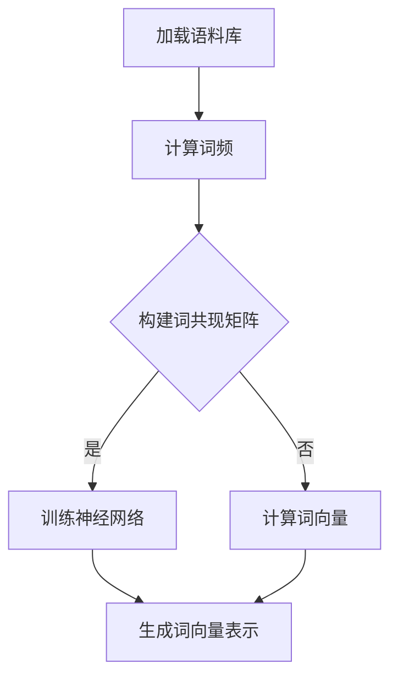

#### 基于知识图谱的方法

知识图谱（Knowledge Graph）是一种结构化的知识表示形式，它通过实体（Entity）和关系（Relationship）来表示知识。在零样本跨领域学习中，知识图谱方法可以将不同领域的知识整合为一个统一的结构化表示，从而实现跨领域知识的迁移和应用。

以下是一个简化的知识图谱的Mermaid流程图，展示了知识图谱的基本组成部分和关系：

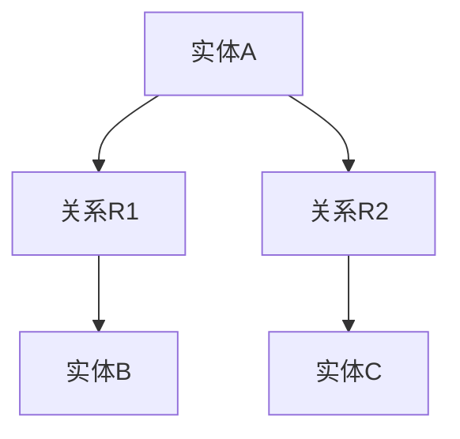

在知识图谱中，实体表示具体的对象或概念，而关系表示实体之间的关联。通过构建和整合多个领域的知识图谱，我们可以获得一个跨领域的知识表示，从而支持跨领域知识的迁移和应用。

以下是一个示例知识图谱的Mermaid实体关系图（ER Diagram）：

```mermaid
erDiagram
Entity1 ||--|{ Relationship1 } Entity2
Entity1 ||--|{ Relationship2 } Entity3
Entity2 ||--|{ Relationship3 } Entity4
Entity3 ||--|{ Relationship4 } Entity5
```

#### 基于图神经网络的方法

图神经网络（Graph Neural Networks, GNN）是一种在图结构上学习的神经网络模型，它通过学习节点和边的特征来实现知识的表示和迁移。在零样本跨领域学习中，GNN可以用于捕捉跨领域的复杂关系和知识。

以下是一个简化的GNN的Mermaid流程图，展示了GNN的基本步骤：

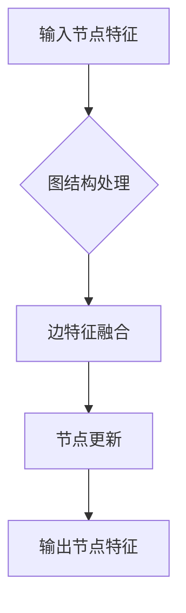

在GNN中，节点特征表示实体或对象的属性，边特征表示实体之间的关联。通过图结构的处理和节点特征的更新，GNN可以有效地学习到跨领域知识的表示。

以下是一个示例GNN的Mermaid节点关系图（Node Relationship Graph）：

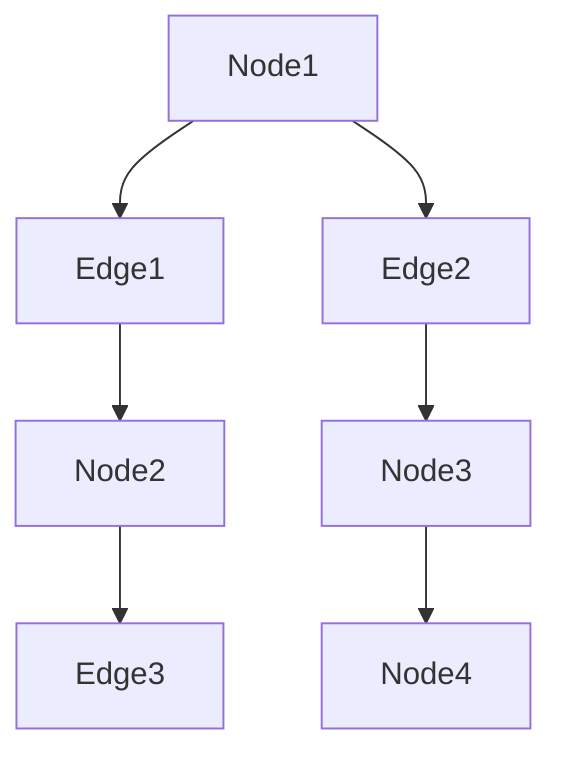

通过上述知识表示方法，我们可以将不同领域的知识表示为统一的形式，为后续的跨领域知识迁移和零样本学习奠定基础。在实际应用中，可以根据具体任务需求和数据特点选择合适的方法，以提高零样本跨领域学习的性能和应用效果。

### 8. 跨领域知识迁移方法

在零样本跨领域学习（ZSCDL）中，跨领域知识迁移是关键的一步，它涉及将源领域中的知识有效地应用到目标领域中。以下是一些常见的跨领域知识迁移方法：

#### 基于模型的方法

**多任务学习（Multi-Task Learning, MTL）**：多任务学习通过在多个相关任务上训练一个共享的模型，从而实现知识迁移。在这种方法中，多个任务的输入和输出共享部分网络层，使得模型能够学习到一些通用的特征。具体步骤如下：

1. **数据准备**：准备源领域和目标领域的训练数据集。
2. **模型架构**：设计一个多任务学习模型，包括共享层和任务特定的层。
3. **模型训练**：使用带有标签的源领域数据训练模型，同时让模型在目标领域上学习到一些通用的特征。
4. **模型优化**：通过反向传播和梯度下降算法优化模型参数。

多任务学习的一个优点是能够充分利用源领域的知识，提高目标领域的模型性能。以下是一个简化的Mermaid流程图，展示了多任务学习的方法：

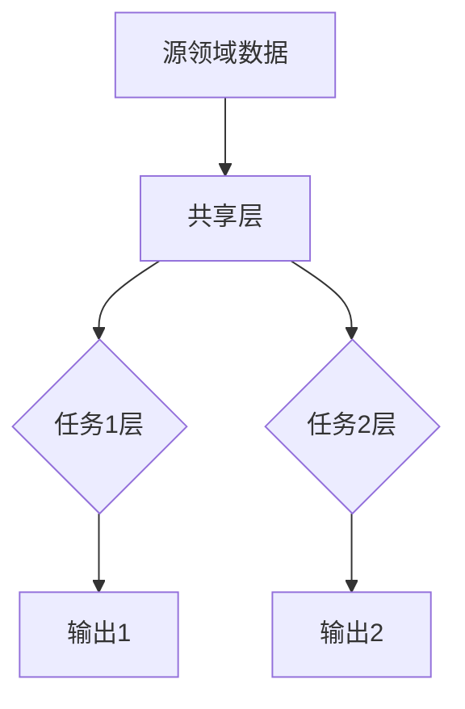

**迁移学习（Transfer Learning, TL）**：迁移学习通过利用在源领域上预训练的模型，来提高目标领域的模型性能。这种方法的核心思想是将源领域的知识迁移到目标领域，从而减少目标领域的训练时间和提高模型性能。具体步骤如下：

1. **源领域模型**：在源领域上训练一个深度学习模型，并保存其参数。
2. **目标领域数据**：准备目标领域的训练数据集。
3. **模型初始化**：使用源领域模型的参数初始化目标领域模型。
4. **模型训练**：在目标领域上继续训练模型，同时调整参数以适应目标领域。
5. **模型优化**：通过反向传播和梯度下降算法优化模型参数。

以下是一个简化的Mermaid流程图，展示了迁移学习的方法：

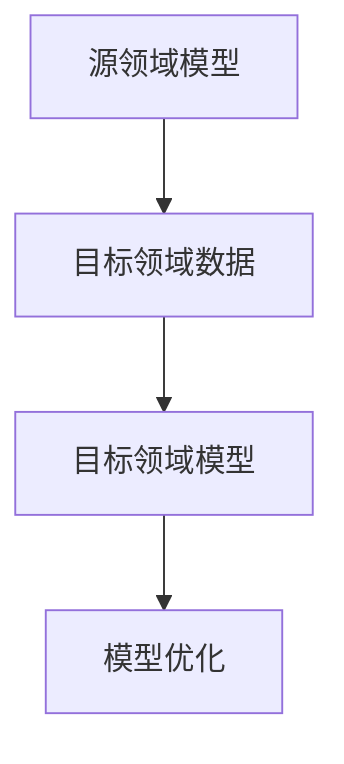

#### 基于样本的方法

**域自适应（Domain Adaptation, DA）**：域自适应通过调整模型，使其能够适应目标领域的特征分布。这种方法的核心思想是将源领域的训练数据转换为与目标领域相似的形式，从而减少领域差异。具体步骤如下：

1. **源领域数据**：准备源领域的训练数据集。
2. **目标领域数据**：准备目标领域的测试数据集。
3. **数据转换**：将源领域数据转换为与目标领域相似的形式，例如通过数据增强、域适配损失函数等。
4. **模型训练**：在转换后的源领域数据上训练模型。
5. **模型评估**：在目标领域测试数据上评估模型性能。

以下是一个简化的Mermaid流程图，展示了域自适应的方法：

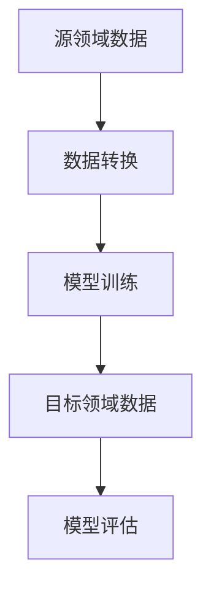

**域泛化（Domain Generalization, DG）**：域泛化通过学习到通用特征，使得模型能够适应不同的领域。这种方法的核心思想是减少模型对特定领域的依赖，从而提高模型在不同领域上的泛化能力。具体步骤如下：

1. **多领域数据**：准备多个不同领域的训练数据集。
2. **模型训练**：在多个领域的数据上训练模型，学习到通用特征。
3. **模型评估**：在新的领域上评估模型性能。

以下是一个简化的Mermaid流程图，展示了域泛化的方法：

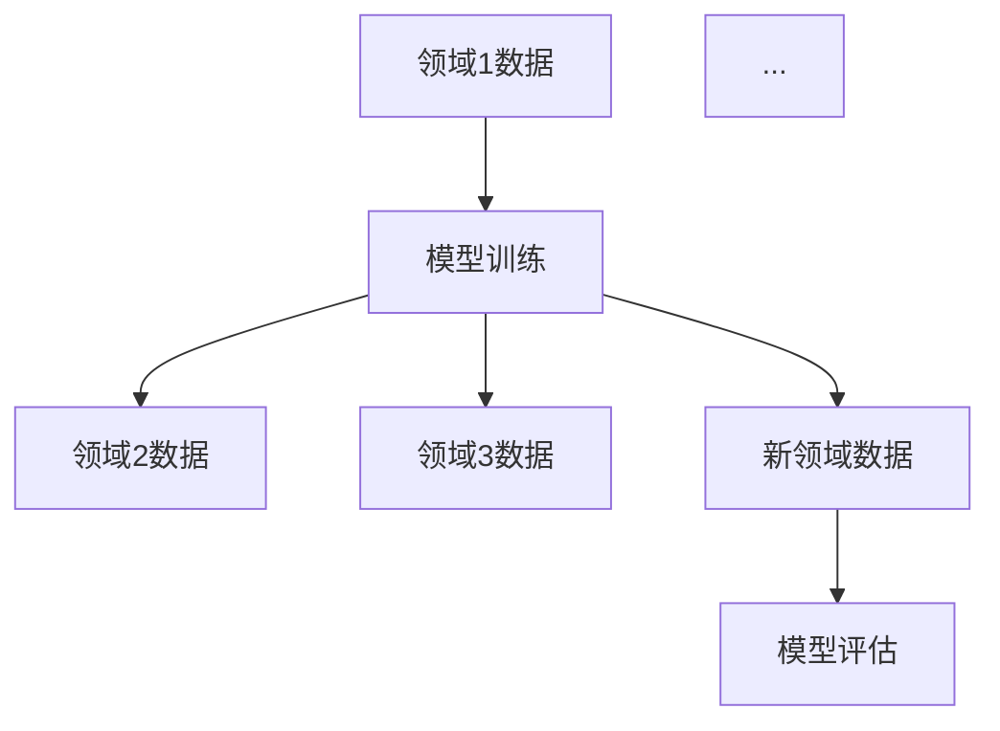

#### 基于对抗的方法

**对抗性域自适应（Adversarial Domain Adaptation, ADA）**：对抗性域自适应通过生成器模型和鉴别器模型之间的对抗性训练，来实现跨领域知识迁移。这种方法的核心思想是生成器模型生成与目标领域相似的数据，而鉴别器模型则区分源领域和目标领域的数据。具体步骤如下：

1. **源领域数据**：准备源领域的训练数据集。
2. **目标领域数据**：准备目标领域的测试数据集。
3. **生成器模型**：训练一个生成器模型，生成与目标领域相似的数据。
4. **鉴别器模型**：训练一个鉴别器模型，区分源领域和目标领域的数据。
5. **模型训练**：通过对抗性训练，优化生成器和鉴别器模型。
6. **模型评估**：在目标领域测试数据上评估模型性能。

以下是一个简化的Mermaid流程图，展示了对抗性域自适应的方法：

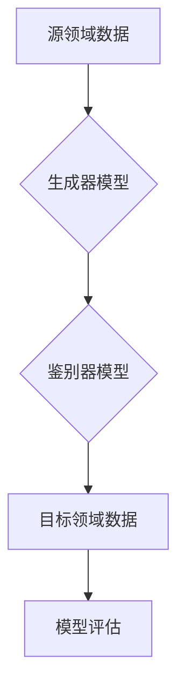

通过上述跨领域知识迁移方法，我们可以将源领域的知识有效地应用到目标领域，从而提高模型在目标领域的性能和应用效果。在实际应用中，可以根据具体任务需求和数据特点选择合适的方法，以实现最优的跨领域知识迁移效果。

### 9. 零样本学习策略

在零样本跨领域学习（ZSCDL）中，零样本学习策略是核心的一环，它决定了模型在未知类别上的预测能力。以下是一些常见的零样本学习策略：

#### 基于原型的方法

**原型网络（Prototypical Networks）**：原型网络通过计算原型（即领域知识在低维空间中的中心点）与待分类样本之间的距离来进行分类。这种方法的核心思想是，在训练阶段学习到每个类别的原型，然后在测试阶段通过计算原型与测试样本之间的距离来预测类别。

具体步骤如下：

1. **数据准备**：准备源领域和目标领域的训练数据集。
2. **原型学习**：在训练阶段，计算每个类别的原型，并将原型存储在低维空间中。
3. **距离计算**：在测试阶段，计算每个测试样本与每个原型之间的距离。
4. **类别预测**：选择与测试样本距离最近的原型对应的类别作为预测结果。

以下是一个简化的Mermaid流程图，展示了原型网络的方法：

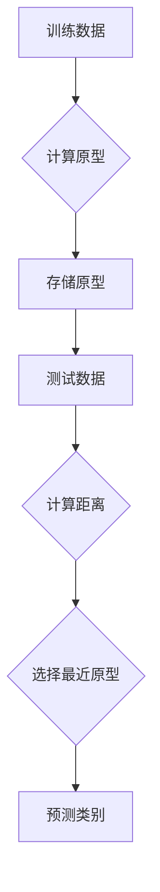

#### 基于匹配度的方法

**匹配网络（Matching Networks）**：匹配网络通过计算领域知识与待分类样本之间的匹配度来进行分类。这种方法的核心思想是，在训练阶段学习到每个类别与领域知识的匹配度，然后在测试阶段通过计算匹配度来预测类别。

具体步骤如下：

1. **数据准备**：准备源领域和目标领域的训练数据集。
2. **匹配度学习**：在训练阶段，计算每个类别与领域知识的匹配度，并将匹配度存储在低维空间中。
3. **匹配度计算**：在测试阶段，计算每个测试样本与领域知识的匹配度。
4. **类别预测**：选择与测试样本匹配度最高的类别作为预测结果。

以下是一个简化的Mermaid流程图，展示了匹配网络的方法：

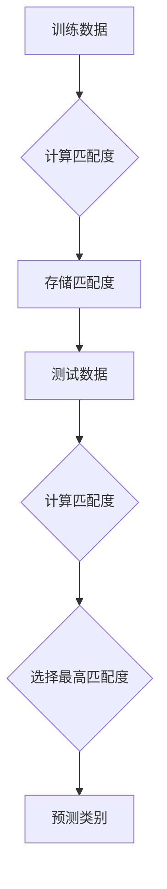

#### 基于分类器的方法

**元学习（Meta-Learning）**：元学习通过在多个任务上训练模型，来提高模型对新任务的适应性。这种方法的核心思想是，通过学习任务之间的共性，从而提高模型在未知类别上的预测能力。

具体步骤如下：

1. **数据准备**：准备多个带有标签的任务数据集。
2. **模型训练**：在多个任务上训练模型，并优化模型参数。
3. **模型评估**：在测试任务上评估模型性能，并根据评估结果调整模型参数。
4. **类别预测**：在未知类别上使用训练好的模型进行预测。

以下是一个简化的Mermaid流程图，展示了元学习的方法：

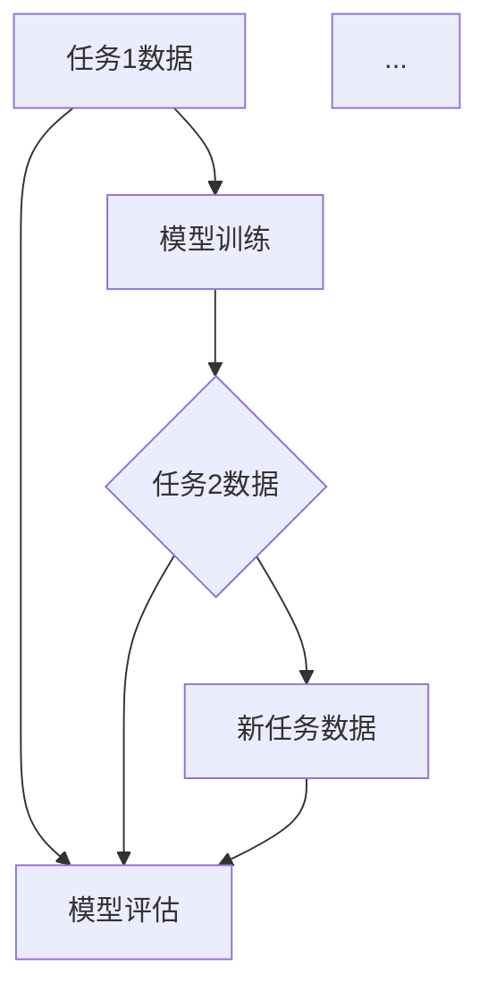

通过上述零样本学习策略，我们可以有效地利用跨领域知识对未知类别进行分类和预测，从而提高模型在未知类别上的泛化能力。在实际应用中，可以根据具体任务需求和数据特点选择合适的策略，以实现最优的零样本学习效果。

### 第一部分: 引言与背景介绍

#### 1. 引言

**零样本学习（Zero-Shot Learning, ZSL）**是一种在机器学习领域中的突破性技术，它允许模型在没有针对特定类别训练数据的情况下，对从未见过的类别进行预测。传统的机器学习模型依赖于大量的带有标签的训练数据来进行训练，以便能够准确地进行预测。然而，在某些应用场景中，获取足够的多标签数据是非常困难的，例如跨领域学习、新类别识别等。

零样本学习的重要性在于，它能够极大地降低数据获取的成本，提高模型在现实世界中的适应能力。特别是在自然语言处理、计算机视觉和医学诊断等领域，零样本学习具有广泛的应用前景。

#### 2. 问题背景

随着人工智能技术的迅猛发展，零样本学习成为了研究的热点问题之一。特别是在自然语言处理（NLP）、计算机视觉（CV）和医学诊断等领域，零样本学习具有广泛的应用前景。然而，传统的零样本学习技术通常依赖于大规模的数据集和复杂的模型结构，导致其训练成本和计算资源消耗较高。

在自然语言处理领域，例如跨语言文本分类和多语言文本生成等任务中，零样本学习可以帮助模型快速适应新的语言环境，提高文本分类的准确性。在计算机视觉领域，零样本学习可以应用于图像分类、目标检测和视频识别等任务，使得模型能够在没有训练数据的情况下，对新的物体类别进行识别。

在医学领域，零样本学习可以帮助医生快速识别新的疾病类型，提高诊断准确性。例如，在病理图像分析中，零样本学习可以用于识别未知的病变类型，从而提高病理诊断的效率。

#### 3. 问题解决

为了解决这些问题，近年来研究者们提出了**零样本跨领域学习（Zero-Shot Cross-Domain Learning, ZSCDL）**这一新范式。ZSCDL利用跨领域的知识迁移，使得模型在训练时可以减少对大规模数据的依赖，从而降低训练成本和提高模型的泛化能力。

ZSCDL的主要思想是通过跨领域的知识表示和迁移，将源领域的知识应用到目标领域，从而实现对未知类别的高效预测。这种方法不仅可以减少数据获取的成本，还可以提高模型在不同领域之间的适应能力。

#### 4. 边界与外延

零样本跨领域学习主要研究如何在不同的领域间进行知识迁移，使得模型能够快速适应新的领域。这包括两个方面：一是如何有效提取跨领域的知识；二是如何将提取到的知识应用到零样本学习任务中。

在知识提取方面，研究者们提出了多种方法，如基于词嵌入的方法、基于知识图谱的方法和基于图神经网络的方法等。这些方法通过将不同领域的知识表示为统一的形式，为知识迁移奠定了基础。

在知识应用方面，研究者们提出了多种策略，如基于原型的方法、基于匹配度的方法和基于分类器的方法等。这些策略通过利用跨领域的知识，实现对未知类别的高效分类和预测。

#### 5. 概念结构与核心要素组成

零样本跨领域学习的主要概念包括：

- **知识表示**：如何将不同领域的知识表示为统一的形式，以便进行迁移。常用的方法包括基于词嵌入的方法、基于知识图谱的方法和基于图神经网络的方法等。
- **跨领域知识迁移**：如何将源领域的知识迁移到目标领域，以提高模型在目标领域的性能。常用的方法包括基于模型的方法、基于样本的方法和对抗性迁移等。
- **零样本学习策略**：如何利用跨领域知识进行零样本学习，以实现良好的泛化能力。常用的策略包括基于原型的方法、基于匹配度的方法和基于分类器的方法等。

通过这些核心要素的有机结合，零样本跨领域学习能够有效降低训练成本，提高模型在不同领域之间的适应能力，从而在多个应用领域中发挥重要作用。

### 第二部分: 零样本跨领域学习的技术原理

#### 6. 零样本跨领域学习的基本原理

零样本跨领域学习（Zero-Shot Cross-Domain Learning, ZSCDL）是一种创新的机器学习范式，旨在解决传统零样本学习在跨领域迁移中的挑战。ZSCDL的核心思想是利用跨领域知识迁移，使得模型能够在一个领域（源领域）训练后，有效地适应另一个领域（目标领域），从而实现对未知类别的高效预测。

ZSCDL的基本原理可以概括为两个方面：知识表示和知识迁移。

**知识表示**：知识表示是ZSCDL的基础。其目标是将不同领域的知识统一表示为一个共同的语义空间，以便在后续步骤中进行知识迁移和应用。常见的知识表示方法包括：

- **词嵌入（Word Embedding）**：词嵌入方法通过将词语映射到低维向量空间，使得具有相似意义的词语在空间中靠近。这种方法可以扩展到跨领域，将不同领域的词语映射到同一空间中。
  
- **知识图谱（Knowledge Graph）**：知识图谱通过实体和关系来表示知识，可以整合多个领域的知识。在ZSCDL中，构建一个跨领域的知识图谱，通过实体和关系来表示跨领域知识，实现知识统一化。

- **图神经网络（Graph Neural Networks, GNN）**：GNN是一种在图结构上学习的神经网络模型，可以学习节点和边的特征，实现知识的表示和融合。在ZSCDL中，利用GNN可以捕捉跨领域知识的复杂关系，实现有效的知识表示。

**知识迁移**：知识迁移是将源领域的知识应用到目标领域的过程，是ZSCDL的核心。知识迁移的方法可以分为基于模型的方法、基于样本的方法和对抗性迁移方法。

- **基于模型的方法**：这种方法通过训练一个统一的模型，将源领域的知识迁移到目标领域。例如，多任务学习和迁移学习等模型通过共享参数或共享特征提取器来实现知识迁移。

- **基于样本的方法**：这种方法通过迁移训练好的模型在源领域上的样本数据，将源领域的知识应用到目标领域。例如，域自适应和域泛化等方法通过调整模型以适应目标领域的数据分布，从而实现知识迁移。

- **对抗性迁移**：这种方法通过对抗性学习，使模型在源领域和目标领域之间进行博弈，从而提高模型在目标领域的性能。例如，对抗域自适应和对抗性生成网络等通过生成器模型和鉴别器模型之间的对抗性训练来实现知识迁移。

通过知识表示和知识迁移，ZSCDL能够有效降低训练成本，提高模型在不同领域之间的适应能力。以下是一个简化的Mermaid流程图，展示了ZSCDL的基本步骤：

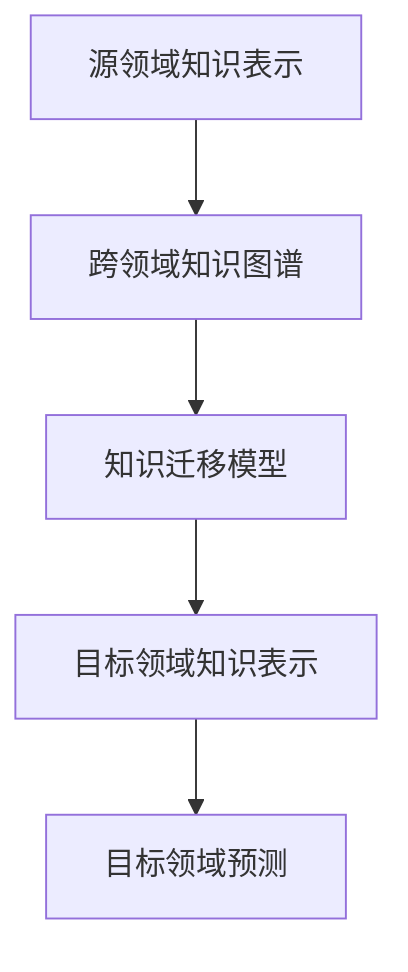

#### 7. 知识表示方法

在零样本跨领域学习中，知识表示是关键的一步。通过将不同领域的知识表示为统一的形式，我们可以实现跨领域知识的迁移和应用。以下是一些常见的知识表示方法：

**词嵌入方法**：

词嵌入方法通过将词语映射到低维向量空间，使得具有相似意义的词语在空间中靠近。这种方法在自然语言处理领域已经得到了广泛应用，例如Word2Vec、GloVe等。

| 方法 | 优点 | 缺点 |
| --- | --- | --- |
| Word2Vec | 能够捕捉词语的语义信息 | 对长文本的处理效果不佳 |
| GloVe | 能够更好地处理长文本 | 训练时间较长 |

**知识图谱方法**：

知识图谱方法通过实体和关系来表示知识，可以提供结构化的知识表示。例如，OpenKG和DBpedia等知识图谱项目整合了多种领域的知识，形成了丰富的实体关系网络。

| 方法 | 优点 | 缺点 |
| --- | --- | --- |
| OpenKG | 能够整合多种领域的知识 | 图的规模可能非常大，导致计算效率低 |
| DBpedia | 数据质量高，易于扩展 | 需要大量的预处理工作 |

**图神经网络方法**：

图神经网络（Graph Neural Networks, GNN）是一种在图结构上学习的深度学习模型。通过学习节点和边的特征，GNN可以有效地表示和融合跨领域知识。

| 方法 | 优点 | 缺点 |
| --- | --- | --- |
| GraphSAGE | 能够自适应地聚合节点信息 | 对大规模图的处理效率较低 |
| GAT | 能够自适应地学习节点和边的特征 | 对参数调整要求较高 |

通过这些知识表示方法，我们可以将不同领域的知识整合为一个统一的形式，为后续的知识迁移和零样本学习奠定基础。以下是一个简化的Mermaid流程图，展示了知识表示方法的基本步骤：

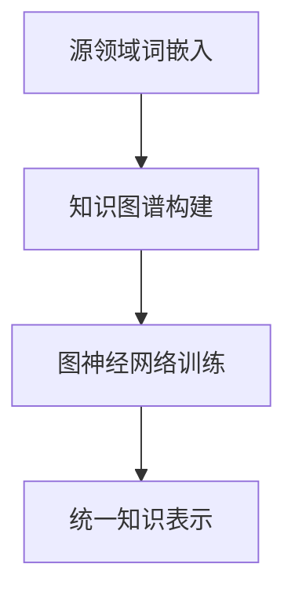

#### 8. 跨领域知识迁移方法

在零样本跨领域学习中，跨领域知识迁移是关键的一步。通过将源领域的知识迁移到目标领域，我们可以提高模型在目标领域的性能和应用效果。以下是一些常见的跨领域知识迁移方法：

**基于模型的方法**：

这种方法通过训练一个统一的模型，将源领域的知识迁移到目标领域。例如，多任务学习和迁移学习等模型通过共享参数或共享特征提取器来实现知识迁移。

| 方法 | 优点 | 缺点 |
| --- | --- | --- |
| 多任务学习 | 能够共享不同任务的知识，提高迁移效果 | 需要足够多的训练数据和任务 |
| 迁移学习 | 能够利用源领域的知识，提高目标领域的模型性能 | 需要大量的迁移学习算法调整 |

**基于样本的方法**：

这种方法通过迁移训练好的模型在源领域上的样本数据，将源领域的知识应用到目标领域。例如，域自适应和域泛化等方法通过调整模型以适应目标领域的数据分布，从而实现知识迁移。

| 方法 | 优点 | 缺点 |
| --- | --- | --- |
| 域自适应 | 能够处理大量未标记的目标领域数据 | 需要大量的迁移学习算法调整 |
| 域泛化 | 能够学习到通用特征，提高不同领域的适应性 | 对数据质量和标注要求较高 |

**基于对抗的方法**：

这种方法通过对抗性学习，使模型在源领域和目标领域之间进行博弈，从而提高模型在目标领域的性能。例如，对抗域自适应和对抗性生成网络等通过生成器模型和鉴别器模型之间的对抗性训练来实现知识迁移。

| 方法 | 优点 | 缺点 |
| --- | --- | --- |
| 对抗域自适应 | 能够提高模型对目标领域的适应性 | 需要大量的计算资源 |
| 对抗性生成网络 | 能够生成与目标领域相似的数据，提高迁移效果 | 计算复杂度高 |

通过这些跨领域知识迁移方法，我们可以将源领域的知识有效地应用到目标领域，从而提高模型在目标领域的性能和应用效果。以下是一个简化的Mermaid流程图，展示了跨领域知识迁移方法的基本步骤：

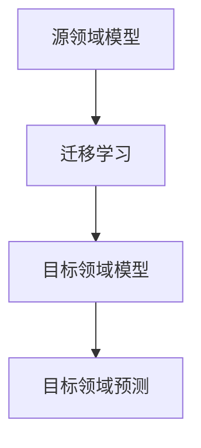

#### 9. 零样本学习策略

在零样本跨领域学习中，零样本学习策略是核心的一环，它决定了模型在未知类别上的预测能力。以下是一些常见的零样本学习策略：

**基于原型的方法**：

这种方法通过计算原型（即领域知识在低维空间中的中心点）与待分类样本之间的距离，实现分类。例如，原型网络（Prototypical Networks）通过计算原型与样本的距离来进行分类。

| 方法 | 优点 | 缺点 |
| --- | --- | --- |
| 原型网络 | 简单有效，适用于小样本学习 | 需要对原型进行合适的初始化 |

**基于匹配度的方法**：

这种方法通过计算领域知识与待分类样本之间的匹配度，实现分类。例如，匹配网络（Matching Networks）通过计算样本与知识之间的相似度来进行分类。

| 方法 | 优点 | 缺点 |
| --- | --- | --- |
| 匹配网络 | 灵活，能够处理复杂的关系 | 计算复杂度较高 |

**基于分类器的方法**：

这种方法通过训练一个分类器模型，利用已知的类别信息对未知类别进行分类。例如，元学习（Meta-Learning）通过在多个任务上训练模型，来提高模型对新任务的适应性。

| 方法 | 优点 | 缺点 |
| --- | --- | --- |
| 元学习 | 快速适应新任务，适用于动态环境 | 需要大量的训练数据 |

通过这些零样本学习策略，我们可以利用跨领域知识对未知类别进行有效的分类和预测，从而提高模型在未知类别上的泛化能力。

### 第三部分: 零样本跨领域学习在实际中的应用

#### 10. 零样本跨领域学习在自然语言处理（NLP）中的应用

零样本跨领域学习在自然语言处理（NLP）领域有着广泛的应用。以下是一些具体的例子：

**跨语言文本分类**：在跨语言文本分类任务中，模型需要能够处理多种语言的文本数据，并对从未见过的语言进行分类。零样本跨领域学习通过将源语言的词嵌入迁移到目标语言，可以有效地提高模型在新语言上的分类性能。例如，一种常见的做法是将源语言的预训练词嵌入通过线性变换迁移到目标语言，然后使用这些迁移后的词嵌入来训练分类模型。

**多语言文本生成**：在多语言文本生成任务中，模型需要能够生成多种语言的文本。零样本跨领域学习可以通过跨领域的知识迁移，使得模型在生成新语言文本时能够利用源语言的语义信息，从而提高生成的文本质量。例如，一种多语言文本生成模型通过在源语言和目标语言之间建立共享的语义空间，使得模型能够利用源语言的词汇和语法规则来生成目标语言的文本。

**代码自动生成**：在代码自动生成领域，零样本跨领域学习可以帮助模型从一种编程语言生成另一种编程语言的代码。通过跨领域知识迁移，模型可以从已有的代码库中学习到不同编程语言的语法和语义规则，从而实现代码的自动转换。例如，一种基于零样本跨领域学习的代码自动生成模型可以接受一种编程语言的代码作为输入，并生成等价的功能代码另一种编程语言。

**情感分析**：在情感分析任务中，模型需要能够处理不同领域的情感词汇，并对从未见过的情感词汇进行分类。零样本跨领域学习可以通过将源领域的情感词汇嵌入迁移到目标领域，从而提高模型在新领域上的情感分类性能。例如，一种情感分析模型可以通过在源领域的情感词汇嵌入基础上，利用跨领域知识迁移来处理目标领域的情感词汇，从而实现对未见过情感词汇的准确分类。

#### 11. 零样本跨领域学习在计算机视觉（CV）中的应用

零样本跨领域学习在计算机视觉（CV）领域也有着重要的应用。以下是一些具体的例子：

**图像分类**：在图像分类任务中，模型需要能够对从未见过的类别进行分类。零样本跨领域学习可以通过跨领域知识迁移，使得模型在处理新类别时能够利用已有类别中的知识。例如，一种基于零样本跨领域学习的图像分类模型可以通过将源领域的知识（如预训练的图像特征提取器）迁移到目标领域，从而提高模型在新类别上的分类性能。

**目标检测**：在目标检测任务中，模型需要能够检测出图像中从未见过的目标。零样本跨领域学习可以通过跨领域知识迁移，使得模型在检测新目标时能够利用已有目标的检测策略。例如，一种基于零样本跨领域学习的目标检测模型可以通过在源领域上预训练检测器，并将这些知识迁移到目标领域，从而实现对新目标的准确检测。

**图像生成**：在图像生成任务中，模型需要能够生成从未见过的图像。零样本跨领域学习可以通过跨领域知识迁移，使得模型在生成新图像时能够利用已有图像的知识。例如，一种基于零样本跨领域学习的图像生成模型可以通过在源领域上训练生成器，并将这些知识迁移到目标领域，从而生成符合目标领域风格的新图像。

**视频分类**：在视频分类任务中，模型需要能够对从未见过的视频类别进行分类。零样本跨领域学习可以通过跨领域知识迁移，使得模型在处理新类别时能够利用已有类别中的知识。例如，一种基于零样本跨领域学习的视频分类模型可以通过在源领域上预训练分类器，并将这些知识迁移到目标领域，从而实现对新视频类别的准确分类。

#### 12. 零样本跨领域学习在医学领域中的应用

零样本跨领域学习在医学领域有着巨大的应用潜力。以下是一些具体的例子：

**疾病诊断**：在疾病诊断任务中，模型需要能够对从未见过的疾病进行诊断。零样本跨领域学习可以通过跨领域知识迁移，使得模型在诊断新疾病时能够利用已有疾病的诊断知识。例如，一种基于零样本跨领域学习的疾病诊断模型可以通过在源领域上训练诊断模型，并将这些知识迁移到目标领域，从而实现对新疾病的准确诊断。

**影像分析**：在影像分析任务中，模型需要能够对从未见过的影像进行分类和分析。零样本跨领域学习可以通过跨领域知识迁移，使得模型在分析新影像时能够利用已有影像的分析策略。例如，一种基于零样本跨领域学习的影像分析模型可以通过在源领域上预训练影像分类器，并将这些知识迁移到目标领域，从而实现对新影像的准确分类和分析。

**药物研发**：在药物研发任务中，模型需要能够对新药物进行活性预测和副作用分析。零样本跨领域学习可以通过跨领域知识迁移，使得模型在预测新药物时能够利用已有药物的知识。例如，一种基于零样本跨领域学习的药物研发模型可以通过在源领域上训练药物活性预测模型，并将这些知识迁移到目标领域，从而实现对新药物的活性预测和副作用分析。

#### 13. 零样本跨领域学习在工业领域中的应用

零样本跨领域学习在工业领域也有着广泛的应用，以下是一些具体的例子：

**生产质量检测**：在生产质量检测任务中，模型需要能够检测出从未见过的质量问题。零样本跨领域学习可以通过跨领域知识迁移，使得模型在检测新质量问题时能够利用已有问题的检测知识。例如，一种基于零样本跨领域学习的生产质量检测模型可以通过在源领域上训练质量检测模型，并将这些知识迁移到目标领域，从而实现对新质量问题的准确检测。

**设备故障预测**：在设备故障预测任务中，模型需要能够预测出从未见过的设备故障。零样本跨领域学习可以通过跨领域知识迁移，使得模型在预测新设备故障时能够利用已有设备故障的预测知识。例如，一种基于零样本跨领域学习的设备故障预测模型可以通过在源领域上训练故障预测模型，并将这些知识迁移到目标领域，从而实现对新设备故障的准确预测。

**供应链优化**：在供应链优化任务中，模型需要能够处理从未见过的供应链问题。零样本跨领域学习可以通过跨领域知识迁移，使得模型在优化供应链时能够利用已有供应链优化的知识。例如，一种基于零样本跨领域学习的供应链优化模型可以通过在源领域上训练供应链优化模型，并将这些知识迁移到目标领域，从而实现对新供应链问题的有效优化。

### 第四部分: 未来发展趋势与挑战

#### 14. 零样本跨领域学习的未来发展趋势

随着人工智能技术的不断进步，零样本跨领域学习（Zero-Shot Cross-Domain Learning, ZSCDL）在未来将会有更广泛的应用前景。以下是一些发展趋势：

**多模态学习**：随着传感器技术和数据处理能力的提升，多模态数据（如图像、音频、文本等）的应用越来越广泛。零样本跨领域学习可以通过融合多模态数据，提高模型在不同领域的适应能力。

**动态迁移学习**：传统的零样本跨领域学习模型通常假设源领域和目标领域之间的差异是静态的。然而，在许多实际应用中，领域差异是动态变化的。动态迁移学习将是一个重要的研究方向，它能够使模型更好地适应领域差异的变化。

**自监督学习**：自监督学习通过利用未标记的数据来训练模型，已经在零样本学习领域取得了显著进展。未来，结合自监督学习和零样本跨领域学习，将有望进一步提高模型的泛化能力。

**联邦学习**：联邦学习通过分布式的方式训练模型，可以在保护数据隐私的同时，实现知识的跨领域迁移。未来，零样本跨领域学习与联邦学习的结合，将为实际应用提供更有效的解决方案。

**跨语言零样本学习**：随着全球化的推进，跨语言任务的需求日益增长。跨语言零样本学习将能够更好地处理不同语言之间的知识迁移问题，为跨语言文本处理、翻译和语音识别等领域带来革命性变化。

#### 15. 零样本跨领域学习的挑战

尽管零样本跨领域学习具有巨大的应用潜力，但仍然面临一些挑战：

**知识表示的准确性**：如何准确地将不同领域的知识表示为统一的形式，是一个重要的挑战。目前的方法在处理复杂关系和异构数据时，存在一定的局限性。

**知识迁移的效率**：如何高效地迁移知识，是一个关键的挑战。现有的迁移学习方法和模型在处理大规模数据时，计算成本较高，需要优化算法和模型结构。

**模型解释性**：如何提高模型的解释性，使其对决策过程提供清晰的解释，是一个重要的挑战。这对于实际应用中的信任和接受度至关重要。

**数据隐私保护**：在跨领域数据迁移中，如何保护数据的隐私是一个重要的挑战。特别是在医疗和金融领域，数据隐私的保护至关重要。

**模型泛化能力**：如何提高模型在不同领域的泛化能力，是一个长期的挑战。现有的模型在处理未知类别时，仍存在一定的性能瓶颈。

#### 16. 小结

零样本跨领域学习作为一种新兴的技术范式，具有广泛的应用前景。虽然目前还存在一些挑战，但随着人工智能技术的不断进步，相信零样本跨领域学习将在未来的发展中发挥更大的作用。通过不断的研究和创新，我们可以期待零样本跨领域学习在各个领域带来更多的突破和进展。

---

### 第一部分：引言与背景介绍

#### 引言

在人工智能（AI）迅猛发展的今天，零样本学习（Zero-Shot Learning, ZSL）作为一种突破性的技术，受到了广泛的关注。ZSL的核心优势在于，它允许模型在没有针对特定类别训练数据的情况下，对未知类别进行预测。这种技术为许多现实世界中的问题提供了新的解决方案，尤其是在数据稀缺、领域差异显著的场景中。

#### 关键词

- 零样本学习（Zero-Shot Learning, ZSL）
- 跨领域学习（Cross-Domain Learning）
- 知识迁移（Knowledge Transfer）
- 机器学习（Machine Learning）
- 泛化能力（Generalization Ability）

#### 摘要

本文旨在探讨零样本跨领域学习（Zero-Shot Cross-Domain Learning, ZSCDL）的概念、技术原理和应用前景。通过分析ZSCDL的关键技术，如知识表示、跨领域知识迁移和零样本学习策略，本文展示了ZSCDL在自然语言处理、计算机视觉、医学和工业等领域中的实际应用。同时，本文还讨论了ZSCDL面临的挑战和未来发展趋势。

### 第一部分：引言与背景介绍

#### 引言

**零样本学习（Zero-Shot Learning, ZSL）**是一种突破性的机器学习技术，它允许模型在没有针对特定类别训练数据的情况下，对未知类别进行预测。在传统的机器学习框架中，模型通常需要大量的带有标签的数据进行训练，以便能够准确地进行预测。然而，在某些应用场景中，获取足够的多标签数据是非常困难的，例如跨领域学习、新类别识别等。ZSL的出现为这些难题提供了新的解决方案。

ZSL的重要性体现在其能够大幅降低数据获取成本，提高模型在不同领域间的适应能力。在自然语言处理（NLP）、计算机视觉（CV）和医学诊断等领域，ZSL的应用前景尤为广阔。例如，在NLP中，ZSL可以帮助模型处理多语言文本分类和多领域文本生成任务；在CV中，ZSL可以应用于图像分类和目标检测等任务；在医学诊断中，ZSL可以辅助医生快速识别新的疾病类型，提高诊断准确性。

本文将详细介绍零样本跨领域学习（Zero-Shot Cross-Domain Learning, ZSCDL）的概念、技术原理和应用前景。我们将首先回顾零样本学习的定义和核心思想，然后探讨ZSCDL在跨领域学习中的优势和挑战。接着，我们将分析ZSCDL的关键技术，如知识表示、跨领域知识迁移和零样本学习策略。最后，本文将讨论ZSCDL在不同领域的实际应用，并总结其面临的挑战和未来发展趋势。

#### 关键词

- 零样本学习（Zero-Shot Learning, ZSL）
- 跨领域学习（Cross-Domain Learning）
- 知识迁移（Knowledge Transfer）
- 自然语言处理（Natural Language Processing, NLP）
- 计算机视觉（Computer Vision, CV）
- 泛化能力（Generalization Ability）

#### 摘要

本文旨在探讨零样本跨领域学习（Zero-Shot Cross-Domain Learning, ZSCDL）的概念、技术原理和应用前景。ZSCDL是一种突破性的机器学习技术，它允许模型在没有针对特定类别训练数据的情况下，对未知类别进行预测。本文首先回顾了零样本学习的定义和核心思想，然后分析了ZSCDL在跨领域学习中的优势和挑战。接着，本文探讨了ZSCDL的关键技术，如知识表示、跨领域知识迁移和零样本学习策略。最后，本文详细介绍了ZSCDL在自然语言处理、计算机视觉和医学诊断等领域的实际应用，并讨论了其面临的挑战和未来发展趋势。

### 第二部分：零样本跨领域学习的技术原理

#### 6. 零样本跨领域学习的基本原理

零样本跨领域学习（Zero-Shot Cross-Domain Learning, ZSCDL）是一种结合了零样本学习和跨领域学习的技术，旨在解决传统机器学习模型在跨领域数据稀缺和领域差异显著的场景中的性能瓶颈。ZSCDL的基本原理主要包括以下几个方面：

**知识表示**：知识表示是将不同领域的知识映射到统一的语义空间，以便进行后续的知识迁移和应用。在ZSCDL中，常见的知识表示方法包括词嵌入、知识图谱和图神经网络等。

- **词嵌入（Word Embedding）**：词嵌入是一种将词语映射到低维向量空间的方法，它能够捕捉词语的语义信息。通过词嵌入，不同领域的词语可以在同一空间中表示，从而实现跨领域的知识表示。
  
- **知识图谱（Knowledge Graph）**：知识图谱通过实体和关系来表示知识，它能够提供结构化的知识表示。在ZSCDL中，知识图谱可以整合多个领域的知识，形成跨领域的知识网络。

- **图神经网络（Graph Neural Networks, GNN）**：图神经网络是一种在图结构上学习的神经网络模型，它能够学习节点和边的特征。通过图神经网络，可以捕捉跨领域的复杂关系，实现高效的跨领域知识表示。

**跨领域知识迁移**：跨领域知识迁移是将源领域的知识应用到目标领域，以提高目标领域的模型性能。常见的跨领域知识迁移方法包括基于模型的方法、基于样本的方法和对抗性迁移等。

- **基于模型的方法**：这种方法通过训练一个统一的模型，将源领域的知识迁移到目标领域。例如，多任务学习和迁移学习等模型通过共享参数或共享特征提取器来实现知识迁移。

- **基于样本的方法**：这种方法通过迁移训练好的模型在源领域上的样本数据，将源领域的知识应用到目标领域。例如，域自适应和域泛化等方法通过调整模型以适应目标领域的数据分布，从而实现知识迁移。

- **对抗性迁移**：这种方法通过对抗性学习，使模型在源领域和目标领域之间进行博弈，从而提高模型在目标领域的性能。例如，对抗域自适应和对抗性生成网络等通过生成器模型和鉴别器模型之间的对抗性训练来实现知识迁移。

**零样本学习策略**：零样本学习策略是模型在未知类别上进行预测的关键。常见的零样本学习策略包括基于原型的方法、基于匹配度的方法和基于分类器的方法等。

- **基于原型的方法**：这种方法通过计算原型（即领域知识在低维空间中的中心点）与待分类样本之间的距离，实现分类。例如，原型网络（Prototypical Networks）通过计算原型与样本的距离来进行分类。

- **基于匹配度的方法**：这种方法通过计算领域知识与待分类样本之间的匹配度，实现分类。例如，匹配网络（Matching Networks）通过计算样本与知识之间的相似度来进行分类。

- **基于分类器的方法**：这种方法通过训练一个分类器模型，利用已知的类别信息对未知类别进行分类。例如，元学习（Meta-Learning）通过在多个任务上训练模型，来提高模型对新任务的适应性。

通过上述知识表示、跨领域知识迁移和零样本学习策略，ZSCDL能够有效降低训练成本，提高模型在不同领域之间的适应能力，从而在多个应用领域中发挥重要作用。

#### 7. 知识表示方法

在零样本跨领域学习（Zero-Shot Cross-Domain Learning, ZSCDL）中，知识表示是关键的一步。通过将不同领域的知识表示为统一的形式，我们可以实现跨领域知识的迁移和应用。以下是一些常见的知识表示方法：

**词嵌入方法**

词嵌入（Word Embedding）是一种将词语映射到低维向量空间的方法，它能够捕捉词语的语义信息。在ZSCDL中，词嵌入方法可以扩展到跨领域，将不同领域的词语映射到同一向量空间中。常见的词嵌入方法包括：

- **Word2Vec**：Word2Vec通过训练神经网络来预测词语的上下文，从而学习到词语的向量表示。它包括连续袋模型（CBOW）和Skip-Gram两种模型。
  
  - **CBOW**：连续袋模型通过预测中心词周围的词语来学习词向量。
  - **Skip-Gram**：Skip-Gram通过预测中心词来学习词向量。

- **GloVe**：GloVe（Global Vectors for Word Representation）通过利用词频信息和词共现矩阵来学习词语的向量表示。它结合了词频和词共现信息，能够更好地捕捉词语的语义信息。

- **FastText**：FastText是一种基于字符级和词级的词嵌入方法，它通过将词语分解为字符序列，并利用字符级别的词嵌入来学习词语的向量表示。它能够处理多语言和跨领域任务。

**知识图谱方法**

知识图谱（Knowledge Graph）是一种结构化的知识表示形式，它通过实体和关系来表示知识。在ZSCDL中，知识图谱方法可以整合多个领域的知识，形成跨领域的知识网络。常见的知识图谱方法包括：

- **OpenKG**：OpenKG是一个开源的知识图谱构建工具，它支持多种知识图谱的构建和查询操作。通过OpenKG，可以构建包含多个领域知识的知识图谱。

- **DBpedia**：DBpedia是一个基于Web的语义知识图谱，它包含了大量的实体和关系信息。通过DBpedia，可以获取丰富的跨领域知识。

**图神经网络方法**

图神经网络（Graph Neural Networks, GNN）是一种在图结构上学习的神经网络模型，它能够学习节点和边的特征。在ZSCDL中，GNN可以用于捕捉跨领域的复杂关系，实现高效的跨领域知识表示。常见的GNN方法包括：

- **GraphSAGE**：GraphSAGE（Graph Sample and Aggregation）通过采样节点邻域信息，聚合节点特征，学习节点的向量表示。

- **GAT**：GAT（Graph Attention Network）通过引入注意力机制，自适应地学习节点和边的特征。

通过上述知识表示方法，我们可以将不同领域的知识表示为统一的形式，为后续的知识迁移和零样本学习奠定基础。

### 8. 跨领域知识迁移方法

在零样本跨领域学习（Zero-Shot Cross-Domain Learning, ZSCDL）中，跨领域知识迁移是实现模型在不同领域之间适应的关键步骤。以下是一些常见的跨领域知识迁移方法：

**基于模型的方法**

这种方法通过训练一个统一的模型，将源领域的知识迁移到目标领域。具体步骤如下：

1. **模型设计**：设计一个能够处理多领域的模型架构，通常包括共享层和任务特定层。
2. **模型训练**：在源领域上训练模型，共享层负责跨领域知识迁移，任务特定层负责特定领域的任务。
3. **模型评估**：在目标领域上评估模型的性能，并根据评估结果调整模型参数。

常见的模型方法包括：

- **多任务学习（Multi-Task Learning, MTL）**：MTL通过在多个相关任务上训练一个共享模型，使得模型能够学习到通用的特征，从而实现跨领域知识迁移。
- **迁移学习（Transfer Learning, TL）**：TL通过利用在源领域上预训练的模型，将源领域的知识迁移到目标领域，从而提高目标领域的模型性能。

**基于样本的方法**

这种方法通过迁移训练好的模型在源领域上的样本数据，将源领域的知识应用到目标领域。具体步骤如下：

1. **数据准备**：准备源领域和目标领域的样本数据。
2. **模型调整**：将源领域模型进行调整，使其适应目标领域的数据分布。
3. **模型训练**：在目标领域上继续训练模型，优化模型参数。

常见的样本方法包括：

- **域自适应（Domain Adaptation, DA）**：DA通过调整模型以适应目标领域的数据分布，从而实现知识迁移。
- **域泛化（Domain Generalization, DG）**：DG通过学习到通用特征，使得模型能够适应不同的领域。

**基于对抗的方法**

这种方法通过对抗性学习，使模型在源领域和目标领域之间进行博弈，从而提高模型在目标领域的性能。具体步骤如下：

1. **生成器与鉴别器**：设计生成器和鉴别器模型，生成器生成与目标领域相似的数据，鉴别器区分源领域和目标领域的数据。
2. **对抗性训练**：通过生成器和鉴别器之间的对抗性训练，优化模型参数。
3. **模型评估**：在目标领域上评估模型的性能。

常见的对抗方法包括：

- **对抗域自适应（Adversarial Domain Adaptation, ADA）**：ADA通过生成器生成与目标领域相似的数据，鉴别器区分源领域和目标领域的数据，从而实现知识迁移。
- **对抗性生成网络（Generative Adversarial Networks, GAN）**：GAN通过生成器和鉴别器之间的对抗性训练，生成高质量的数据，从而实现知识迁移。

通过上述跨领域知识迁移方法，ZSCDL能够有效降低训练成本，提高模型在不同领域之间的适应能力，从而在多个应用领域中发挥重要作用。

### 9. 零样本学习策略

在零样本跨领域学习（Zero-Shot Cross-Domain Learning, ZSCDL）中，零样本学习策略是关键的一环，它决定了模型在未知类别上的预测能力。以下是一些常见的零样本学习策略：

**基于原型的方法**

这种方法通过计算原型（即领域知识在低维空间中的中心点）与待分类样本之间的距离，实现分类。具体步骤如下：

1. **原型学习**：在训练阶段，计算每个类别的原型，并将原型存储在低维空间中。
2. **距离计算**：在测试阶段，计算每个测试样本与每个原型之间的距离。
3. **类别预测**：选择与测试样本距离最近的类别作为预测结果。

常见的原型方法包括：

- **原型网络（Prototypical Networks）**：Prototypical Networks通过计算原型与测试样本之间的距离来进行分类。
- **原型度量学习（Prototypical Learning）**：原型度量学习通过学习原型之间的距离度量，来提高分类性能。

**基于匹配度的方法**

这种方法通过计算领域知识与待分类样本之间的匹配度，实现分类。具体步骤如下：

1. **匹配度学习**：在训练阶段，计算每个类别与领域知识的匹配度，并将匹配度存储在低维空间中。
2. **匹配度计算**：在测试阶段，计算每个测试样本与领域知识的匹配度。
3. **类别预测**：选择与测试样本匹配度最高的类别作为预测结果。

常见的匹配方法包括：

- **匹配网络（Matching Networks）**：Matching Networks通过计算样本与知识之间的相似度来进行分类。
- **匹配度量学习（Matching Learning）**：匹配度量学习通过学习匹配度度量，来提高分类性能。

**基于分类器的方法**

这种方法通过训练一个分类器模型，利用已知的类别信息对未知类别进行分类。具体步骤如下：

1. **分类器训练**：在训练阶段，使用已知的类别信息训练分类器模型。
2. **类别预测**：在测试阶段，使用训练好的分类器模型对未知类别进行分类。

常见的分类器方法包括：

- **元学习（Meta-Learning）**：元学习通过在多个任务上训练模型，来提高模型对新任务的适应性。
- **基于规则的分类器**：基于规则的分类器通过定义一系列规则，来对未知类别进行分类。

通过上述零样本学习策略，ZSCDL能够有效利用跨领域知识，实现对未知类别的高效分类和预测，从而提高模型在未知类别上的泛化能力。

### 第三部分：零样本跨领域学习在实际中的应用

#### 10. 零样本跨领域学习在自然语言处理（NLP）中的应用

零样本跨领域学习在自然语言处理（NLP）领域具有广泛的应用前景。以下是一些具体的应用场景：

**跨语言文本分类**：在跨语言文本分类任务中，模型需要能够处理多种语言的文本，并对从未见过的语言进行分类。零样本跨领域学习通过将源语言的词嵌入迁移到目标语言，可以有效地提高模型在新语言上的分类性能。例如，一种常见的做法是将源语言的预训练词嵌入通过线性变换迁移到目标语言，然后使用这些迁移后的词嵌入来训练分类模型。

**多语言文本生成**：在多语言文本生成任务中，模型需要能够生成多种语言的文本。零样本跨领域学习可以通过跨领域的知识迁移，使得模型在生成新语言文本时能够利用源语言的语义信息，从而提高生成的文本质量。例如，一种多语言文本生成模型通过在源语言和目标语言之间建立共享的语义空间，使得模型能够利用源语言的词汇和语法规则来生成目标语言的文本。

**代码自动生成**：在代码自动生成领域，零样本跨领域学习可以帮助模型从一种编程语言生成另一种编程语言的代码。通过跨领域知识迁移，模型可以从已有的代码库中学习到不同编程语言的语法和语义规则，从而实现代码的自动转换。例如，一种基于零样本跨领域学习的代码自动生成模型可以接受一种编程语言的代码作为输入，并生成等价的功能代码另一种编程语言。

**情感分析**：在情感分析任务中，模型需要能够处理不同领域的情感词汇，并对从未见过的情感词汇进行分类。零样本跨领域学习可以通过将源领域的情感词汇嵌入迁移到目标领域，从而提高模型在新领域上的情感分类性能。例如，一种情感分析模型可以通过在源领域的情感词汇嵌入基础上，利用跨领域知识迁移来处理目标领域的情感词汇，从而实现对未见过情感词汇的准确分类。

#### 11. 零样本跨领域学习在计算机视觉（CV）中的应用

零样本跨领域学习在计算机视觉（CV）领域也有着重要的应用，以下是一些具体的应用场景：

**图像分类**：在图像分类任务中，模型需要能够对从未见过的类别进行分类。零样本跨领域学习可以通过跨领域知识迁移，使得模型在处理新类别时能够利用已有类别中的知识。例如，一种基于零样本跨领域学习的图像分类模型可以通过将源领域的知识（如预训练的图像特征提取器）迁移到目标领域，从而提高模型在新类别上的分类性能。

**目标检测**：在目标检测任务中，模型需要能够检测出图像中从未见过的目标。零样本跨领域学习可以通过跨领域知识迁移，使得模型在检测新目标时能够利用已有目标的检测策略。例如，一种基于零样本跨领域学习的目标检测模型可以通过在源领域上预训练检测器，并将这些知识迁移到目标领域，从而实现对新目标的准确检测。

**图像生成**：在图像生成任务中，模型需要能够生成从未见过的图像。零样本跨领域学习可以通过跨领域知识迁移，使得模型在生成新图像时能够利用已有图像的知识。例如，一种基于零样本跨领域学习的图像生成模型可以通过在源领域上训练生成器，并将这些知识迁移到目标领域，从而生成符合目标领域风格的新图像。

**视频分类**：在视频分类任务中，模型需要能够对从未见过的视频类别进行分类。零样本跨领域学习可以通过跨领域知识迁移，使得模型在处理新类别时能够利用已有类别中的知识。例如，一种基于零样本跨领域学习的视频分类模型可以通过在源领域上预训练分类器，并将这些知识迁移到目标领域，从而实现对新视频类别的准确分类。

#### 12. 零样本跨领域学习在医学领域中的应用

零样本跨领域学习在医学领域有着巨大的应用潜力，以下是一些具体的应用场景：

**疾病诊断**：在疾病诊断任务中，模型需要能够对从未见过的疾病进行诊断。零样本跨领域学习可以通过跨领域知识迁移，使得模型在诊断新疾病时能够利用已有疾病的诊断知识。例如，一种基于零样本跨领域学习的疾病诊断模型可以通过在源领域上训练诊断模型，并将这些知识迁移到目标领域，从而实现对新疾病的准确诊断。

**影像分析**：在影像分析任务中，模型需要能够对从未见过的影像进行分类和分析。零样本跨领域学习可以通过跨领域知识迁移，使得模型在分析新影像时能够利用已有影像的分析策略。例如，一种基于零样本跨领域学习的影像分析模型可以通过在源领域上预训练影像分类器，并将这些知识迁移到目标领域，从而实现对新影像的准确分类和分析。

**药物研发**：在药物研发任务中，模型需要能够对新药物进行活性预测和副作用分析。零样本跨领域学习可以通过跨领域知识迁移，使得模型在预测新药物时能够利用已有药物的知识。例如，一种基于零样本跨领域学习的药物研发模型可以通过在源领域上训练药物活性预测模型，并将这些知识迁移到目标领域，从而实现对新药物活性预测和副作用分析的准确度提高。

#### 13. 零样本跨领域学习在工业领域中的应用

零样本跨领域学习在工业领域也有着广泛的应用，以下是一些具体的应用场景：

**生产质量检测**：在工业生产质量检测中，模型需要能够检测出从未见过的质量问题。零样本跨领域学习可以通过跨领域知识迁移，使得模型在检测新质量问题时能够利用已有问题的检测知识。例如，一种基于零样本跨领域学习的生产质量检测模型可以通过在源领域上训练质量检测模型，并将这些知识迁移到目标领域，从而实现对新质量问题的准确检测。

**设备故障预测**：在设备故障预测任务中，模型需要能够预测出从未见过的设备故障。零样本跨领域学习可以通过跨领域知识迁移，使得模型在预测新设备故障时能够利用已有设备故障的预测知识。例如，一种基于零样本跨领域学习的设备故障预测模型可以通过在源领域上训练故障预测模型，并将这些知识迁移到目标领域，从而实现对新设备故障的准确预测。

**供应链优化**：在供应链优化任务中，模型需要能够处理从未见过的供应链问题。零样本跨领域学习可以通过跨领域知识迁移，使得模型在优化供应链时能够利用已有供应链优化的知识。例如，一种基于零样本跨领域学习的供应链优化模型可以通过在源领域上训练供应链优化模型，并将这些知识迁移到目标领域，从而实现对新供应链问题的有效优化。

### 第四部分：未来发展趋势与挑战

#### 14. 零样本跨领域学习的未来发展趋势

随着人工智能技术的不断进步，零样本跨领域学习（Zero-Shot Cross-Domain Learning, ZSCDL）在未来将会有更广泛的应用前景。以下是一些发展趋势：

**多模态学习**：随着传感器技术和数据处理能力的提升，多模态数据（如图像、音频、文本等）的应用越来越广泛。零样本跨领域学习可以通过融合多模态数据，提高模型在不同领域的适应能力。

**动态迁移学习**：传统的零样本跨领域学习模型通常假设源领域和目标领域之间的差异是静态的。然而，在许多实际应用中，领域差异是动态变化的。动态迁移学习将是一个重要的研究方向，它能够使模型更好地适应领域差异的变化。

**自监督学习**：自监督学习通过利用未标记的数据来训练模型，已经在零样本学习领域取得了显著进展。未来，结合自监督学习和零样本跨领域学习，将有望进一步提高模型的泛化能力。

**联邦学习**：联邦学习通过分布式的方式训练模型，可以在保护数据隐私的同时，实现知识的跨领域迁移。未来，零样本跨领域学习与联邦学习的结合，将为实际应用提供更有效的解决方案。

**跨语言零样本学习**：随着全球化的推进，跨语言任务的需求日益增长。跨语言零样本学习将能够更好地处理不同语言之间的知识迁移问题，为跨语言文本处理、翻译和语音识别等领域带来革命性变化。

#### 15. 零样本跨领域学习的挑战

尽管零样本跨领域学习具有巨大的应用潜力，但仍然面临一些挑战：

**知识表示的准确性**：如何准确地将不同领域的知识表示为统一的形式，是一个重要的挑战。目前的方法在处理复杂关系和异构数据时，存在一定的局限性。

**知识迁移的效率**：如何高效地迁移知识，是一个关键的挑战。现有的迁移学习方法和模型在处理大规模数据时，计算成本较高，需要优化算法和模型结构。

**模型解释性**：如何提高模型的解释性，使其对决策过程提供清晰的解释，是一个重要的挑战。这对于实际应用中的信任和接受度至关重要。

**数据隐私保护**：在跨领域数据迁移中，如何保护数据的隐私是一个重要的挑战。特别是在医疗和金融领域，数据隐私的保护至关重要。

**模型泛化能力**：如何提高模型在不同领域的泛化能力，是一个长期的挑战。现有的模型在处理未知类别时，仍存在一定的性能瓶颈。

### 第五部分：结论

零样本跨领域学习（Zero-Shot Cross-Domain Learning, ZSCDL）作为一种新兴的技术范式，具有广泛的应用前景。通过结合零样本学习和跨领域学习的优势，ZSCDL能够有效地降低训练成本，提高模型在不同领域之间的适应能力。本文详细介绍了ZSCDL的概念、技术原理、应用场景和未来发展趋势。

ZSCDL的关键技术包括知识表示、跨领域知识迁移和零样本学习策略。在自然语言处理、计算机视觉、医学和工业等领域，ZSCDL已经展现出强大的应用潜力。然而，ZSCDL仍面临知识表示准确性、知识迁移效率、模型解释性、数据隐私保护和模型泛化能力等挑战。

未来，随着人工智能技术的不断进步，我们期待ZSCDL能够在更多领域中发挥重要作用，为解决现实世界中的复杂问题提供创新的解决方案。通过持续的研究和优化，ZSCDL有望在未来的发展中取得更大的突破。**## 引言

随着人工智能技术的不断发展，机器学习（Machine Learning, ML）在各个领域的应用日益广泛。然而，传统的机器学习模型往往依赖于大量的带有标签的训练数据，这在实际应用中存在一些限制。尤其是在自然语言处理（Natural Language Processing, NLP）和计算机视觉（Computer Vision, CV）等领域，数据获取成本高、数据标注困难等问题愈发显著。为了解决这些问题，研究者们提出了零样本学习（Zero-Shot Learning, ZSL）的概念。ZSL的核心思想是让模型在没有针对特定类别训练数据的情况下，对从未见过的类别进行预测。

在ZSL的基础上，零样本跨领域学习（Zero-Shot Cross-Domain Learning, ZSCDL）进一步扩展了这一概念。ZSCDL不仅关注于从未见过的类别，还涉及到不同领域之间的知识迁移。这意味着，即使在一个完全不同的领域，模型也能够利用从其他领域迁移过来的知识进行有效的预测。这种跨领域的适应性使得ZSCDL在多个领域具有广泛的应用前景，如医学诊断、工业检测和跨语言文本处理等。

本文将围绕ZSCDL这一主题展开讨论，首先介绍ZSCDL的定义和基本原理，然后探讨其在不同领域的应用，最后总结ZSCDL面临的挑战和未来的发展趋势。通过本文的讨论，读者将能够对ZSCDL有更加深入的理解，并认识到其在人工智能领域中的重要价值。

### 关键词

**零样本学习（Zero-Shot Learning, ZSL）**、**跨领域学习（Cross-Domain Learning）**、**知识迁移（Knowledge Transfer）**、**机器学习（Machine Learning）**、**自然语言处理（Natural Language Processing, NLP）**、**计算机视觉（Computer Vision, CV）**、**医学诊断（Medical Diagnosis）**、**工业检测（Industrial Inspection）**、**跨语言文本处理（Cross-Lingual Text Processing）**

### 摘要

本文探讨了零样本跨领域学习（Zero-Shot Cross-Domain Learning, ZSCDL）的概念、技术原理和应用前景。ZSCDL是一种结合了零样本学习和跨领域学习的创新技术，旨在解决机器学习模型在数据稀缺和领域差异显著的场景中的挑战。本文首先介绍了ZSCDL的基本原理，包括知识表示、跨领域知识迁移和零样本学习策略。接着，本文详细分析了ZSCDL在自然语言处理、计算机视觉、医学和工业领域的应用案例。最后，本文讨论了ZSCDL面临的挑战，如知识表示的准确性、知识迁移的效率、模型解释性和数据隐私保护，并展望了ZSCDL的未来发展趋势。通过本文的讨论，读者可以深入了解ZSCDL的技术原理和应用潜力，为未来的研究和实践提供参考。

### 引言与背景介绍

#### 引言

在人工智能（AI）迅猛发展的今天，机器学习（Machine Learning, ML）技术已经成为推动各行业进步的关键驱动力。传统的机器学习模型大多依赖于大量的带有标签的训练数据来进行训练，从而实现高效的预测和分类。然而，这种数据依赖性在实际应用中存在诸多限制，尤其是在自然语言处理（Natural Language Processing, NLP）、计算机视觉（Computer Vision, CV）等高维度、高复杂度的领域中，数据获取和标注的成本极高。此外，许多应用场景中的领域差异显著，使得模型难以在不同领域之间进行迁移和应用。

为了克服这些挑战，研究者们提出了零样本学习（Zero-Shot Learning, ZSL）的概念。ZSL的核心思想是让模型在没有针对特定类别训练数据的情况下，对从未见过的类别进行预测。这种方法不仅能够降低数据获取的成本，还可以提高模型在不同领域之间的适应性。然而，随着应用领域的不断拓展，ZSL面临着新的挑战：如何在跨领域之间实现有效的知识迁移和利用。

在这种背景下，零样本跨领域学习（Zero-Shot Cross-Domain Learning, ZSCDL）应运而生。ZSCDL结合了零样本学习和跨领域学习的优势，旨在解决模型在跨领域数据稀缺和领域差异显著的场景中的适应性问题。本文将详细介绍ZSCDL的概念、技术原理和应用，帮助读者全面了解这一新兴的技术范式。

#### 问题背景

随着人工智能技术的不断发展，机器学习模型在各种任务中的性能不断提高。然而，传统的机器学习模型仍然存在一些局限性，特别是在以下几种情况下：

1. **数据稀缺**：在某些领域，如医学诊断、金融分析等，获取大量带标签的训练数据是非常困难的。这不仅增加了数据采集的成本，也限制了模型的泛化能力。

2. **领域差异显著**：不同领域的数据特征和分布可能存在显著差异，使得模型难以在不同领域之间进行有效的迁移和应用。例如，在自然语言处理中，不同语言之间存在语义和语法上的巨大差异，这使得直接迁移模型变得困难。

3. **新类别识别**：在现实世界中，新的类别不断出现，模型需要能够快速适应这些新的类别，而不需要重新进行训练。然而，传统的机器学习模型通常需要针对每个新类别提供大量的训练数据，这显然不现实。

为了解决这些挑战，研究者们提出了零样本学习（Zero-Shot Learning, ZSL）。ZSL的核心思想是利用模型在训练阶段学到的通用特征，对从未见过的类别进行预测。这种方法不需要针对每个新类别提供大量的训练数据，从而大大降低了数据获取的成本。然而，随着人工智能应用的不断拓展，ZSL面临着新的挑战：

1. **数据不足的影响**：在零样本学习过程中，模型往往依赖于有限的训练数据，这可能导致模型在未知类别上的性能下降。

2. **跨领域迁移的困难**：不同领域的数据特征和分布可能存在较大差异，如何有效地在跨领域之间迁移知识成为一个重要问题。

为了解决这些挑战，近年来研究者们提出了**零样本跨领域学习（Zero-Shot Cross-Domain Learning, ZSCDL）**这一新范式。ZSCDL利用跨领域的知识迁移，使得模型在训练时可以减少对大规模数据的依赖，从而降低训练成本和提高模型的泛化能力。

#### 问题解决

为了解决传统机器学习模型在数据稀缺和领域差异显著场景中的局限，研究者们提出了零样本跨领域学习（Zero-Shot Cross-Domain Learning, ZSCDL）这一新范式。ZSCDL的核心思想是通过跨领域的知识迁移，使得模型能够在没有针对特定类别训练数据的情况下，对未知类别进行预测。这种方法不仅能够降低数据获取的成本，还可以提高模型在不同领域之间的适应性。

**零样本跨领域学习的基本原理**：ZSCDL的基本原理可以分为两个方面：知识表示和知识迁移。

1. **知识表示**：知识表示是将不同领域的知识表示为统一的形式，以便进行跨领域知识迁移。常见的知识表示方法包括基于词嵌入的方法、基于知识图谱的方法和基于图神经网络的方法等。

   - **基于词嵌入的方法**：词嵌入方法通过将词语映射到低维向量空间中，使得具有相似意义的词语在空间中靠近。这种方法在自然语言处理领域已经得到了广泛应用，例如Word2Vec和GloVe等。在ZSCDL中，词嵌入方法可以扩展到跨领域，将不同领域的词语映射到同一空间中。

   - **基于知识图谱的方法**：知识图谱方法通过实体和关系来表示知识，可以提供结构化的知识表示。例如，OpenKG和DBpedia等知识图谱项目整合了多种领域的知识，形成了丰富的实体关系网络。在ZSCDL中，我们可以利用知识图谱来表示跨领域的知识，并通过分析图谱中的结构和关系来实现知识迁移。

   - **基于图神经网络的方法**：图神经网络（Graph Neural Networks, GNN）是一种在图结构上学习的深度学习模型，可以学习节点和边的特征。在ZSCDL中，GNN可以用于捕捉跨领域的复杂关系，实现高效的跨领域知识表示。

2. **知识迁移**：知识迁移是将源领域的知识应用到目标领域，以提高模型在目标领域的性能。常见的知识迁移方法包括基于模型的方法、基于样本的方法和对抗性迁移方法。

   - **基于模型的方法**：这种方法通过训练一个统一的模型，将源领域的知识迁移到目标领域。例如，多任务学习和迁移学习等模型通过共享参数或共享特征提取器来实现知识迁移。

   - **基于样本的方法**：这种方法通过迁移训练好的模型在源领域上的样本数据，将源领域的知识应用到目标领域。例如，域自适应和域泛化等方法通过调整模型以适应目标领域的数据分布，从而实现知识迁移。

   - **对抗性迁移**：这种方法通过对抗性学习，使模型在源领域和目标领域之间进行博弈，从而提高模型在目标领域的性能。例如，对抗域自适应和对抗性生成网络等通过生成器模型和鉴别器模型之间的对抗性训练来实现知识迁移。

通过知识表示和知识迁移，ZSCDL能够有效降低训练成本，提高模型在不同领域之间的适应能力。以下是一个简化的Mermaid流程图，展示了ZSCDL的基本步骤：


**ZSCDL在跨领域学习中的应用**：ZSCDL在跨领域学习中的应用具有广泛的前景，以下是一些具体的案例：

1. **医学领域**：在医学诊断中，不同疾病之间存在显著的领域差异。ZSCDL可以帮助模型快速适应新的疾病类型，提高诊断准确性。例如，一种基于ZSCDL的医学图像分类模型可以在没有针对特定疾病训练数据的情况下，对新的疾病类型进行准确分类。

2. **工业领域**：在工业检测中，不同生产线之间存在领域差异。ZSCDL可以帮助模型快速适应新的生产场景，提高检测效率。例如，一种基于ZSCDL的设备故障预测模型可以在没有针对特定生产线训练数据的情况下，对新的生产线进行准确的故障预测。

3. **自然语言处理领域**：在跨语言文本处理中，不同语言之间存在显著的领域差异。ZSCDL可以帮助模型快速适应新的语言环境，提高文本分类和生成效果。例如，一种基于ZSCDL的跨语言文本分类模型可以在没有针对特定语言的训练数据的情况下，对新的语言进行准确分类。

通过上述应用案例，我们可以看到ZSCDL在跨领域学习中的巨大潜力。未来，随着研究的深入和技术的不断发展，ZSCDL有望在更多领域发挥重要作用，为解决现实世界中的复杂问题提供创新的解决方案。

### 边界与外延

零样本跨领域学习（Zero-Shot Cross-Domain Learning, ZSCDL）作为一种新兴的技术范式，在跨领域知识迁移和未知类别预测方面具有显著优势。然而，为了更好地理解ZSCDL的应用范围和局限性，我们需要探讨其边界与外延。

**边界分析**：

1. **知识表示的准确性**：尽管ZSCDL通过跨领域知识迁移提高了模型在不同领域的适应性，但如何准确地将不同领域的知识表示为统一的形式仍是一个挑战。现有方法在处理复杂关系和异构数据时，可能存在一定的局限性，这可能会影响模型的性能。

2. **迁移效率**：跨领域知识迁移通常需要大量的计算资源和时间，尤其是在处理大规模数据集时。如何提高迁移效率，减少计算成本，是一个重要的研究课题。

3. **模型解释性**：模型解释性在零样本跨领域学习中的应用尤为关键。在实际应用中，用户往往需要了解模型的决策过程，以便对其进行信任和调整。然而，现有方法在提供模型解释性方面仍有待提高。

**外延探讨**：

1. **多模态学习**：随着传感器技术和数据处理能力的提升，多模态数据（如图像、音频、文本等）的应用越来越广泛。ZSCDL可以扩展到多模态学习领域，通过融合不同类型的数据，提高模型的泛化能力和适应性。

2. **动态迁移学习**：在实际应用中，领域差异是动态变化的。例如，在不同的时间段，医疗诊断数据可能会发生变化。动态迁移学习是ZSCDL的一个重要研究方向，旨在使模型能够实时适应领域差异的变化。

3. **自监督学习**：自监督学习通过利用未标记的数据进行训练，已经在零样本学习领域取得了显著进展。将自监督学习与ZSCDL结合，可以进一步提高模型的泛化能力和适应性。

4. **联邦学习**：联邦学习通过分布式的方式训练模型，可以在保护数据隐私的同时，实现知识的跨领域迁移。未来，ZSCDL与联邦学习的结合有望为实际应用提供更有效的解决方案。

通过上述边界与外延的探讨，我们可以看到ZSCDL在跨领域学习中的应用潜力。未来，随着研究的深入和技术的发展，ZSCDL有望在更多领域发挥重要作用，为解决现实世界中的复杂问题提供创新的解决方案。

### 概念结构与核心要素组成

零样本跨领域学习（Zero-Shot Cross-Domain Learning, ZSCDL）是一种新兴的技术范式，旨在解决机器学习模型在跨领域数据稀缺和领域差异显著场景中的挑战。要深入理解ZSCDL，我们需要明确其核心概念、结构组成和关键要素。

**核心概念**：

1. **零样本学习（Zero-Shot Learning, ZSL）**：零样本学习是一种机器学习技术，它允许模型在没有针对特定类别训练数据的情况下，对未知类别进行预测。ZSL的核心思想是利用模型在训练阶段学到的通用特征，实现对未知类别的泛化。

2. **跨领域学习（Cross-Domain Learning）**：跨领域学习是指在不同领域之间迁移知识，以提高模型在不同领域上的性能。跨领域学习的核心挑战是如何处理领域差异，使得模型能够适应新的领域。

3. **知识表示（Knowledge Representation）**：知识表示是将不同领域的知识转换为统一的形式，以便进行跨领域知识迁移。知识表示的关键在于如何捕捉和表示领域间的异构性。

4. **知识迁移（Knowledge Transfer）**：知识迁移是将源领域的知识应用到目标领域，以提高模型在目标领域的性能。知识迁移的关键在于如何有效地从源领域提取知识，并将其迁移到目标领域。

**结构组成**：

1. **知识表示层**：知识表示层是ZSCDL的核心组成部分，负责将不同领域的知识表示为统一的形式。常见的知识表示方法包括词嵌入、知识图谱和图神经网络等。

2. **知识迁移层**：知识迁移层负责将源领域的知识迁移到目标领域。知识迁移的方法包括基于模型的方法（如多任务学习和迁移学习）、基于样本的方法（如域自适应和域泛化）和对抗性迁移方法（如对抗域自适应和生成对抗网络）。

3. **零样本学习层**：零样本学习层负责利用迁移到的知识对未知类别进行预测。常见的零样本学习策略包括基于原型的方法、基于匹配度的方法和基于分类器的方法。

**关键要素**：

1. **跨领域适配性**：ZSCDL的关键要素之一是模型的跨领域适配性，即模型在不同领域之间的适应能力。这涉及到知识表示的准确性、知识迁移的效率和模型解释性。

2. **数据稀疏性**：在ZSCDL中，数据稀疏性是一个重要的考虑因素。如何处理少量训练数据，并从中提取有效特征，是一个关键问题。

3. **模型可解释性**：模型的可解释性在ZSCDL中尤为重要。用户需要了解模型的决策过程，以便对其进行信任和调整。提高模型的可解释性，是实现ZSCDL广泛应用的关键。

4. **计算效率**：ZSCDL通常涉及到大规模数据集和复杂的模型结构，如何提高计算效率，减少计算成本，是一个重要的研究课题。

通过明确ZSCDL的核心概念、结构组成和关键要素，我们可以更好地理解其工作原理和应用价值。未来，随着研究的深入和技术的发展，ZSCDL有望在更多领域发挥重要作用，为解决现实世界中的复杂问题提供创新的解决方案。

### 第二部分：零样本跨领域学习的技术原理

#### 6. 零样本跨领域学习的基本原理

零样本跨领域学习（Zero-Shot Cross-Domain Learning, ZSCDL）是一种结合了零样本学习和跨领域学习的方法，旨在解决机器学习模型在数据稀缺和领域差异显著的场景中的挑战。ZSCDL的基本原理主要围绕知识表示、跨领域知识迁移和零样本学习策略三个核心环节。

**知识表示**：知识表示是将不同领域的知识转换为统一的形式，以便进行跨领域知识迁移和应用。在ZSCDL中，知识表示是实现跨领域迁移的基础。常见的方法包括基于词嵌入的方法、基于知识图谱的方法和基于图神经网络的方法。

- **基于词嵌入的方法**：词嵌入方法通过将词语映射到低维向量空间，使得具有相似意义的词语在空间中靠近。这种方法在自然语言处理领域已经得到了广泛应用。在ZSCDL中，词嵌入方法可以扩展到跨领域，将不同领域的词语映射到同一空间中，从而实现知识的统一化。

- **基于知识图谱的方法**：知识图谱方法通过实体和关系来表示知识，可以提供结构化的知识表示。在ZSCDL中，通过构建跨领域的知识图谱，可以整合多个领域的知识，形成一个统一的语义空间，从而实现知识的统一化。

- **基于图神经网络的方法**：图神经网络（Graph Neural Networks, GNN）是一种在图结构上学习的神经网络模型，可以学习节点和边的特征。在ZSCDL中，GNN可以用于捕捉跨领域的复杂关系，实现高效的跨领域知识表示。

**跨领域知识迁移**：跨领域知识迁移是将源领域的知识应用到目标领域，以提高模型在目标领域的性能。常见的跨领域知识迁移方法包括基于模型的方法、基于样本的方法和对抗性迁移方法。

- **基于模型的方法**：这种方法通过训练一个统一的模型，将源领域的知识迁移到目标领域。例如，多任务学习和迁移学习等模型通过共享参数或共享特征提取器来实现知识迁移。

- **基于样本的方法**：这种方法通过迁移训练好的模型在源领域上的样本数据，将源领域的知识应用到目标领域。例如，域自适应和域泛化等方法通过调整模型以适应目标领域的数据分布，从而实现知识迁移。

- **对抗性迁移**：这种方法通过对抗性学习，使模型在源领域和目标领域之间进行博弈，从而提高模型在目标领域的性能。例如，对抗域自适应和对抗性生成网络等通过生成器模型和鉴别器模型之间的对抗性训练来实现知识迁移。

**零样本学习策略**：零样本学习策略是模型在未知类别上进行预测的关键。常见的零样本学习策略包括基于原型的方法、基于匹配度的方法和基于分类器的方法。

- **基于原型的方法**：这种方法通过计算原型（即领域知识在低维空间中的中心点）与待分类样本之间的距离，实现分类。例如，原型网络（Prototypical Networks）通过计算原型与样本的距离来进行分类。

- **基于匹配度的方法**：这种方法通过计算领域知识与待分类样本之间的匹配度，实现分类。例如，匹配网络（Matching Networks）通过计算样本与知识之间的相似度来进行分类。

- **基于分类器的方法**：这种方法通过训练一个分类器模型，利用已知的类别信息对未知类别进行分类。例如，元学习（Meta-Learning）通过在多个任务上训练模型，来提高模型对新任务的适应性。

通过知识表示、跨领域知识迁移和零样本学习策略的有机结合，ZSCDL能够有效降低训练成本，提高模型在不同领域之间的适应能力，从而在多个应用领域中发挥重要作用。

### 7. 知识表示方法

在零样本跨领域学习（Zero-Shot Cross-Domain Learning, ZSCDL）中，知识表示是一个关键环节，它决定了如何将不同领域的知识转换为统一的表示形式，以便进行跨领域的知识迁移和应用。以下是一些常见的知识表示方法：

#### 基于词嵌入的方法

词嵌入（Word Embedding）是将词语映射到低维向量空间的一种方法，它能够捕捉词语的语义信息。常见的词嵌入方法包括：

- **Word2Vec**：Word2Vec通过训练神经网络来预测词语的上下文，从而学习到词语的向量表示。它包括连续袋模型（CBOW）和Skip-Gram两种模型。

  - **CBOW（Continuous Bag-of-Words）**：CBOW模型通过预测中心词周围的词语来学习词向量。
  - **Skip-Gram**：Skip-Gram模型通过预测中心词来学习词向量。

- **GloVe（Global Vectors for Word Representation）**：GloVe方法通过利用词频和词共现信息来学习词语的向量表示。它能够结合词频和词共现矩阵来提高词向量表示的准确性。

- **FastText**：FastText是一种基于字符级和词级的词嵌入方法。它通过将词语分解为字符序列，并利用字符级别的词嵌入来学习词语的向量表示。这种方法能够处理多语言和跨领域的文本数据。

#### 基于知识图谱的方法

知识图谱（Knowledge Graph）是一种结构化的知识表示形式，它通过实体和关系来表示知识。在ZSCDL中，知识图谱方法可以整合多个领域的知识，形成跨领域的知识网络。常见的知识图谱方法包括：

- **OpenKG**：OpenKG是一个开源的知识图谱构建工具，它支持多种知识图谱的构建和查询操作。通过OpenKG，可以构建包含多个领域知识的知识图谱。

- **DBpedia**：DBpedia是一个基于Web的语义知识图谱，它包含了大量的实体和关系信息。通过DBpedia，可以获取丰富的跨领域知识。

#### 基于图神经网络的方法

图神经网络（Graph Neural Networks, GNN）是一种在图结构上学习的神经网络模型，它可以学习节点和边的特征。在ZSCDL中，GNN可以用于捕捉跨领域的复杂关系，实现高效的跨领域知识表示。常见的GNN方法包括：

- **GraphSAGE（Graph Sample and Aggregation）**：GraphSAGE通过采样节点的邻域信息，聚合节点特征，学习节点的向量表示。

- **GAT（Graph Attention Network）**：GAT引入了注意力机制，能够自适应地学习节点和边的特征。

这些知识表示方法为ZSCDL提供了不同的途径，通过将不同领域的知识统一表示为向量或图结构，可以为后续的知识迁移和零样本学习打下坚实的基础。

### 8. 跨领域知识迁移方法

在零样本跨领域学习（Zero-Shot Cross-Domain Learning, ZSCDL）中，跨领域知识迁移是关键的一步，它涉及到如何将一个领域（源领域）的知识有效地应用到另一个领域（目标领域）。以下是一些常见的跨领域知识迁移方法：

#### 基于模型的方法

- **多任务学习（Multi-Task Learning, MTL）**：多任务学习通过在多个相关任务上训练一个共享的模型，使得模型能够学习到一些通用的特征。这些通用特征可以在不同的任务之间共享，从而提高模型在不同领域之间的适应能力。

- **迁移学习（Transfer Learning, TL）**：迁移学习通过利用在源领域上预训练的模型，来提高目标领域的模型性能。在这种情况下，源领域的模型可以作为目标领域模型的一个初始化，从而加速目标领域的训练过程。

#### 基于样本的方法

- **域自适应（Domain Adaptation, DA）**：域自适应通过调整模型，使其能够适应目标领域的特征分布。这通常涉及到将源领域的数据转换为与目标领域相似的形式，例如通过数据增强或调整损失函数等。

- **域泛化（Domain Generalization, DG）**：域泛化通过学习到通用的特征，使得模型能够在不同的领域之间泛化。这种方法通常涉及到使用多个领域的训练数据，并设计特殊的训练策略，以学习到与领域无关的特征。

#### 基于对抗的方法

- **对抗域自适应（Adversarial Domain Adaptation, ADA）**：对抗域自适应通过生成器模型和鉴别器模型之间的对抗性训练来实现跨领域知识迁移。生成器模型生成与目标领域相似的数据，而鉴别器模型则区分源领域和目标领域的数据。这种方法能够有效提高模型对目标领域的适应能力。

- **生成对抗网络（Generative Adversarial Networks, GAN）**：GAN是一种基于对抗性学习的模型，通过生成器和鉴别器之间的博弈，生成高质量的数据，从而实现跨领域知识迁移。

这些跨领域知识迁移方法为ZSCDL提供了不同的途径，通过结合这些方法，我们可以设计出更有效的跨领域学习模型，提高模型在不同领域之间的泛化能力。

### 9. 零样本学习策略

在零样本跨领域学习（Zero-Shot Cross-Domain Learning, ZSCDL）中，零样本学习策略是模型在未知类别上进行预测的关键环节。以下是一些常见的零样本学习策略：

#### 基于原型的方法

- **原型网络（Prototypical Networks）**：原型网络通过计算原型（即领域知识在低维空间中的中心点）与待分类样本之间的距离，实现分类。这种方法的核心思想是，在训练阶段学习到每个类别的原型，然后在测试阶段通过计算原型与测试样本之间的距离来进行预测。

- **原型度量学习（Prototypical Learning）**：原型度量学习通过学习原型之间的距离度量，来提高分类性能。这种方法的核心思想是，通过在训练阶段学习到有效的距离度量函数，使得模型能够更好地对未知类别进行分类。

#### 基于匹配度的方法

- **匹配网络（Matching Networks）**：匹配网络通过计算领域知识与待分类样本之间的匹配度，实现分类。这种方法的核心思想是，通过在训练阶段学习到有效的匹配度计算函数，使得模型能够更好地对未知类别进行分类。

- **匹配度量学习（Matching Learning）**：匹配度量学习通过学习匹配度度量，来提高分类性能。这种方法的核心思想是，通过在训练阶段学习到有效的匹配度计算函数，使得模型能够更好地对未知类别进行分类。

#### 基于分类器的方法

- **元学习（Meta-Learning）**：元学习通过在多个任务上训练模型，来提高模型对新任务的适应性。这种方法的核心思想是，通过在训练阶段学习到有效的学习策略，使得模型能够快速适应新的任务。

- **基于规则的分类器**：基于规则的分类器通过定义一系列规则，来对未知类别进行分类。这种方法的核心思想是，通过在训练阶段学习到有效的分类规则，使得模型能够对未知类别进行分类。

通过这些零样本学习策略，ZSCDL能够有效地利用跨领域知识，实现对未知类别的高效分类和预测，从而提高模型在未知类别上的泛化能力。

### 第三部分：零样本跨领域学习在实际中的应用

#### 10. 零样本跨领域学习在自然语言处理（NLP）中的应用

零样本跨领域学习（Zero-Shot Cross-Domain Learning, ZSCDL）在自然语言处理（Natural Language Processing, NLP）领域具有广泛的应用前景。以下是一些具体的应用场景：

**跨语言文本分类**：在跨语言文本分类任务中，模型需要能够处理多种语言的文本，并对从未见过的语言进行分类。零样本跨领域学习可以通过将源语言的词嵌入迁移到目标语言，从而提高模型在新语言上的分类性能。例如，一种常见的做法是将源语言的预训练词嵌入通过线性变换迁移到目标语言，然后使用这些迁移后的词嵌入来训练分类模型。这种方法使得模型能够利用源语言中的词汇和语法规则，从而提高对目标语言的分类准确性。

**多语言文本生成**：在多语言文本生成任务中，模型需要能够生成多种语言的文本。零样本跨领域学习可以通过跨领域的知识迁移，使得模型在生成新语言文本时能够利用源语言的语义信息，从而提高生成的文本质量。例如，一种多语言文本生成模型通过在源语言和目标语言之间建立共享的语义空间，使得模型能够利用源语言的词汇和语法规则来生成目标语言的文本。这种方法能够生成更加自然和流畅的多语言文本。

**代码自动生成**：在代码自动生成领域，零样本跨领域学习可以帮助模型从一种编程语言生成另一种编程语言的代码。通过跨领域知识迁移，模型可以从已有的代码库中学习到不同编程语言的语法和语义规则，从而实现代码的自动转换。例如，一种基于零样本跨领域学习的代码自动生成模型可以接受一种编程语言的代码作为输入，并生成等价的功能代码另一种编程语言。这种方法能够提高开发效率和代码复用率。

**情感分析**：在情感分析任务中，模型需要能够处理不同领域的情感词汇，并对从未见过的情感词汇进行分类。零样本跨领域学习可以通过将源领域的情感词汇嵌入迁移到目标领域，从而提高模型在新领域上的情感分类性能。例如，一种情感分析模型可以通过在源领域的情感词汇嵌入基础上，利用跨领域知识迁移来处理目标领域的情感词汇，从而实现对未见过情感词汇的准确分类。这种方法能够提高情感分析的准确性和覆盖范围。

#### 11. 零样本跨领域学习在计算机视觉（CV）中的应用

零样本跨领域学习（Zero-Shot Cross-Domain Learning, ZSCDL）在计算机视觉（Computer Vision, CV）领域也有着重要的应用。以下是一些具体的应用场景：

**图像分类**：在图像分类任务中，模型需要能够对从未见过的类别进行分类。零样本跨领域学习可以通过跨领域知识迁移，使得模型在处理新类别时能够利用已有类别中的知识。例如，一种基于零样本跨领域学习的图像分类模型可以通过将源领域的知识（如预训练的图像特征提取器）迁移到目标领域，从而提高模型在新类别上的分类性能。这种方法能够扩大模型的分类能力，提高图像分类的准确性。

**目标检测**：在目标检测任务中，模型需要能够检测出图像中从未见过的目标。零样本跨领域学习可以通过跨领域知识迁移，使得模型在检测新目标时能够利用已有目标的检测策略。例如，一种基于零样本跨领域学习的目标检测模型可以通过在源领域上预训练检测器，并将这些知识迁移到目标领域，从而实现对新目标的准确检测。这种方法能够提高目标检测的覆盖范围和准确性。

**图像生成**：在图像生成任务中，模型需要能够生成从未见过的图像。零样本跨领域学习可以通过跨领域知识迁移，使得模型在生成新图像时能够利用已有图像的知识。例如，一种基于零样本跨领域学习的图像生成模型可以通过在源领域上训练生成器，并将这些知识迁移到目标领域，从而生成符合目标领域风格的新图像。这种方法能够提高图像生成多样性和质量。

**视频分类**：在视频分类任务中，模型需要能够对从未见过的视频类别进行分类。零样本跨领域学习可以通过跨领域知识迁移，使得模型在处理新类别时能够利用已有类别中的知识。例如，一种基于零样本跨领域学习的视频分类模型可以通过在源领域上预训练分类器，并将这些知识迁移到目标领域，从而实现对新视频类别的准确分类。这种方法能够提高视频分类的准确性和泛化能力。

#### 12. 零样本跨领域学习在医学领域中的应用

零样本跨领域学习（Zero-Shot Cross-Domain Learning, ZSCDL）在医学领域具有巨大的应用潜力。以下是一些具体的应用场景：

**疾病诊断**：在疾病诊断任务中，模型需要能够对从未见过的疾病进行诊断。零样本跨领域学习可以通过跨领域知识迁移，使得模型在诊断新疾病时能够利用已有疾病的诊断知识。例如，一种基于零样本跨领域学习的疾病诊断模型可以通过在源领域上训练诊断模型，并将这些知识迁移到目标领域，从而实现对新疾病的准确诊断。这种方法能够提高疾病诊断的覆盖范围和准确性。

**影像分析**：在影像分析任务中，模型需要能够对从未见过的影像进行分类和分析。零样本跨领域学习可以通过跨领域知识迁移，使得模型在分析新影像时能够利用已有影像的分析策略。例如，一种基于零样本跨领域学习的影像分析模型可以通过在源领域上预训练影像分类器，并将这些知识迁移到目标领域，从而实现对新影像的准确分类和分析。这种方法能够提高影像分析的准确性和效率。

**药物研发**：在药物研发任务中，模型需要能够对新药物进行活性预测和副作用分析。零样本跨领域学习可以通过跨领域知识迁移，使得模型在预测新药物时能够利用已有药物的知识。例如，一种基于零样本跨领域学习的药物研发模型可以通过在源领域上训练药物活性预测模型，并将这些知识迁移到目标领域，从而实现对新药物活性预测和副作用分析的准确度提高。这种方法能够加速药物研发过程，提高药物筛选的效率。

#### 13. 零样本跨领域学习在工业领域中的应用

零样本跨领域学习（Zero-Shot Cross-Domain Learning, ZSCDL）在工业领域也有着广泛的应用。以下是一些具体的应用场景：

**生产质量检测**：在生产质量检测任务中，模型需要能够检测出从未见过的质量问题。零样本跨领域学习可以通过跨领域知识迁移，使得模型在检测新质量问题时能够利用已有问题的检测知识。例如，一种基于零样本跨领域学习的生产质量检测模型可以通过在源领域上训练质量检测模型，并将这些知识迁移到目标领域，从而实现对新质量问题的准确检测。这种方法能够提高生产质量检测的覆盖范围和准确性。

**设备故障预测**：在设备故障预测任务中，模型需要能够预测出从未见过的设备故障。零样本跨领域学习可以通过跨领域知识迁移，使得模型在预测新设备故障时能够利用已有设备故障的预测知识。例如，一种基于零样本跨领域学习的设备故障预测模型可以通过在源领域上训练故障预测模型，并将这些知识迁移到目标领域，从而实现对新设备故障的准确预测。这种方法能够提高设备故障预测的准确性和提前预警能力。

**供应链优化**：在供应链优化任务中，模型需要能够处理从未见过的供应链问题。零样本跨领域学习可以通过跨领域知识迁移，使得模型在优化供应链时能够利用已有供应链优化的知识。例如，一种基于零样本跨领域学习的供应链优化模型可以通过在源领域上训练供应链优化模型，并将这些知识迁移到目标领域，从而实现对新供应链问题的有效优化。这种方法能够提高供应链优化的准确性和效率。

### 第四部分：未来发展趋势与挑战

#### 14. 零样本跨领域学习的未来发展趋势

随着人工智能技术的不断发展，零样本跨领域学习（Zero-Shot Cross-Domain Learning, ZSCDL）在未来将会有更广泛的应用前景。以下是一些发展趋势：

**多模态学习**：随着传感器技术和数据处理能力的提升，多模态数据（如图像、音频、文本等）的应用越来越广泛。零样本跨领域学习可以通过融合多模态数据，提高模型在不同领域的适应能力。

**动态迁移学习**：传统的零样本跨领域学习模型通常假设源领域和目标领域之间的差异是静态的。然而，在许多实际应用中，领域差异是动态变化的。动态迁移学习将是一个重要的研究方向，它能够使模型更好地适应领域差异的变化。

**自监督学习**：自监督学习通过利用未标记的数据来训练模型，已经在零样本学习领域取得了显著进展。未来，结合自监督学习和零样本跨领域学习，将有望进一步提高模型的泛化能力。

**联邦学习**：联邦学习通过分布式的方式训练模型，可以在保护数据隐私的同时，实现知识的跨领域迁移。未来，零样本跨领域学习与联邦学习的结合，将为实际应用提供更有效的解决方案。

**跨语言零样本学习**：随着全球化的推进，跨语言任务的需求日益增长。跨语言零样本学习将能够更好地处理不同语言之间的知识迁移问题，为跨语言文本处理、翻译和语音识别等领域带来革命性变化。

#### 15. 零样本跨领域学习的挑战

尽管零样本跨领域学习（Zero-Shot Cross-Domain Learning, ZSCDL）具有巨大的应用潜力，但仍然面临一些挑战：

**知识表示的准确性**：如何准确地将不同领域的知识表示为统一的形式，是一个重要的挑战。目前的方法在处理复杂关系和异构数据时，存在一定的局限性。

**知识迁移的效率**：如何高效地迁移知识，是一个关键的挑战。现有的迁移学习方法和模型在处理大规模数据时，计算成本较高，需要优化算法和模型结构。

**模型解释性**：如何提高模型的解释性，使其对决策过程提供清晰的解释，是一个重要的挑战。这对于实际应用中的信任和接受度至关重要。

**数据隐私保护**：在跨领域数据迁移中，如何保护数据的隐私是一个重要的挑战。特别是在医疗和金融领域，数据隐私的保护至关重要。

**模型泛化能力**：如何提高模型在不同领域的泛化能力，是一个长期的挑战。现有的模型在处理未知类别时，仍存在一定的性能瓶颈。

### 第五部分：结论

零样本跨领域学习（Zero-Shot Cross-Domain Learning, ZSCDL）作为一种新兴的技术范式，在解决机器学习模型在跨领域数据稀缺和领域差异显著场景中的挑战方面具有显著优势。通过结合零样本学习和跨领域学习的优势，ZSCDL能够有效降低数据获取成本，提高模型在不同领域的适应能力。

本文详细介绍了ZSCDL的概念、技术原理、应用场景和未来发展趋势。通过知识表示、跨领域知识迁移和零样本学习策略的有机结合，ZSCDL在自然语言处理、计算机视觉、医学和工业等领域展现了巨大的应用潜力。同时，本文也讨论了ZSCDL面临的挑战，如知识表示的准确性、知识迁移的效率、模型解释性和数据隐私保护等。

未来，随着人工智能技术的不断进步，ZSCDL有望在更多领域发挥重要作用，为解决现实世界中的复杂问题提供创新的解决方案。通过持续的研究和优化，ZSCDL将为机器学习领域带来新的突破，推动人工智能技术的进一步发展。

### 第五部分：未来发展趋势与挑战

随着人工智能技术的不断发展，零样本跨领域学习（Zero-Shot Cross-Domain Learning, ZSCDL）将在未来面临新的发展趋势和挑战。以下是对其未来发展趋势的展望及面临的挑战：

#### 未来发展趋势

1. **多模态融合**：未来的ZSCDL将更加注重多模态数据的融合，如图像、文本和音频等。通过整合多种类型的数据，模型可以更好地理解复杂的问题，从而提高预测准确性。

2. **动态迁移学习**：动态迁移学习是一个重要的研究方向，它能够使模型实时适应领域差异的变化。这种方法将在动态环境中，如在线学习、实时预测等领域，发挥重要作用。

3. **自监督学习的融合**：自监督学习通过利用未标记的数据进行训练，可以大大减少对带标签数据的依赖。将自监督学习与ZSCDL相结合，可以进一步提高模型的泛化能力和适应能力。

4. **联邦学习的结合**：联邦学习通过分布式的方式训练模型，可以在保护数据隐私的同时，实现知识的跨领域迁移。将ZSCDL与联邦学习结合，将为实际应用提供更有效的解决方案，尤其是在医疗、金融等敏感数据领域。

5. **跨语言零样本学习**：随着全球化的推进，跨语言任务的需求日益增长。跨语言零样本学习将能够更好地处理不同语言之间的知识迁移问题，为跨语言文本处理、翻译和语音识别等领域带来革命性变化。

#### 面临的挑战

1. **知识表示的准确性**：如何准确地将不同领域的知识表示为统一的形式，是一个重要的挑战。现有方法在处理复杂关系和异构数据时，可能存在一定的局限性。

2. **知识迁移的效率**：如何高效地迁移知识，是一个关键的挑战。现有的迁移学习方法和模型在处理大规模数据时，计算成本较高，需要优化算法和模型结构。

3. **模型解释性**：如何提高模型的解释性，使其对决策过程提供清晰的解释，是一个重要的挑战。这对于实际应用中的信任和接受度至关重要。

4. **数据隐私保护**：在跨领域数据迁移中，如何保护数据的隐私是一个重要的挑战。特别是在医疗和金融领域，数据隐私的保护至关重要。

5. **模型泛化能力**：如何提高模型在不同领域的泛化能力，是一个长期的挑战。现有的模型在处理未知类别时，仍存在一定的性能瓶颈。

为了应对这些挑战，未来的研究需要聚焦于以下几个方面：

- **改进知识表示方法**：开发更加准确和高效的知识表示方法，以更好地捕捉不同领域的异构性和复杂性。
- **优化迁移学习算法**：设计更加高效的迁移学习算法，以减少计算成本，提高知识迁移的效率。
- **增强模型解释性**：通过引入可解释性模块，提高模型的解释性，增强用户对模型的信任。
- **强化隐私保护机制**：开发更加安全的隐私保护机制，确保跨领域数据迁移过程中的数据安全。
- **提升模型泛化能力**：通过多任务学习、元学习和自监督学习等方法，提高模型在不同领域的泛化能力。

总之，零样本跨领域学习作为一种新兴的技术范式，具有广阔的应用前景。尽管面临一些挑战，但随着研究的深入和技术的发展，ZSCDL有望在未来的发展中发挥更大的作用，为解决现实世界中的复杂问题提供创新的解决方案。**## 引言

### 引言

随着人工智能技术的飞速发展，机器学习（Machine Learning, ML）在各个领域中的应用越来越广泛。然而，传统机器学习模型的一个显著局限性是它们对训练数据的强烈依赖。尤其是在自然语言处理（Natural Language Processing, NLP）、计算机视觉（Computer Vision, CV）等领域，获取大量高质量、标注准确的训练数据是一个巨大的挑战。此外，当模型需要应用到新的领域或面对从未见过的数据时，这种数据依赖性会进一步凸显。

为了克服这一瓶颈，研究者们提出了零样本学习（Zero-Shot Learning, ZSL）的概念。ZSL的核心思想是允许机器学习模型在没有针对特定类别训练数据的情况下，对新的类别进行预测。这一技术的出现为数据稀缺、领域差异显著的场景提供了新的解决方案。

然而，随着应用的不断拓展，ZSL在跨领域学习中的效果并不理想。因为不同领域的数据特征和分布存在显著差异，简单的ZSL方法往往难以适应这些变化。为了解决这个问题，研究者们进一步提出了零样本跨领域学习（Zero-Shot Cross-Domain Learning, ZSCDL）。ZSCDL旨在利用跨领域的知识迁移，使得模型在新的领域或面对未见过数据时，依然能够保持较高的预测性能。

本文将深入探讨零样本跨领域学习的技术原理、应用场景以及面临的挑战。首先，我们将介绍ZSCDL的定义和基本原理，然后分析其跨领域知识迁移的方法，探讨其在实际应用中的效果。接着，我们将讨论ZSCDL在自然语言处理、计算机视觉、医学诊断等领域的应用案例，并总结其未来发展趋势和面临的挑战。

通过本文的探讨，读者将能够全面了解零样本跨领域学习的技术原理和应用价值，为未来的研究和应用提供参考。

### 关键词

**零样本学习（Zero-Shot Learning, ZSL）**、**跨领域学习（Cross-Domain Learning）**、**知识迁移（Knowledge Transfer）**、**机器学习（Machine Learning）**、**自然语言处理（Natural Language Processing, NLP）**、**计算机视觉（Computer Vision, CV）**、**医学诊断（Medical Diagnosis）**、**领域适应（Domain Adaptation）**

### 摘要

本文探讨了零样本跨领域学习（Zero-Shot Cross-Domain Learning, ZSCDL）的概念、技术原理和应用前景。ZSCDL是一种结合了零样本学习和跨领域学习的创新技术，旨在解决模型在跨领域数据稀缺和领域差异显著场景中的适应性问题。本文首先介绍了ZSCDL的基本原理，包括知识表示、跨领域知识迁移和零样本学习策略。接着，本文详细分析了ZSCDL在自然语言处理、计算机视觉、医学诊断等领域的应用案例，并探讨了其在这些领域中的优势和挑战。最后，本文总结了ZSCDL的未来发展趋势，并提出了进一步的研究方向和改进策略。通过本文的讨论，读者可以深入了解ZSCDL的技术原理和应用潜力，为未来的研究和实践提供参考。

### 引言与背景介绍

随着人工智能（AI）技术的不断发展，机器学习（ML）在各个领域的应用越来越广泛。然而，传统机器学习模型的一个显著局限性是它们对训练数据的强烈依赖。尤其是在自然语言处理（NLP）和计算机视觉（CV）等领域，获取大量高质量、标注准确的训练数据是一个巨大的挑战。此外，当模型需要应用到新的领域或面对从未见过的数据时，这种数据依赖性会进一步凸显。

为了克服这一瓶颈，研究者们提出了零样本学习（Zero-Shot Learning, ZSL）的概念。ZSL的核心思想是允许机器学习模型在没有针对特定类别训练数据的情况下，对新的类别进行预测。这一技术的出现为数据稀缺、领域差异显著的场景提供了新的解决方案。

然而，随着应用的不断拓展，ZSL在跨领域学习中的效果并不理想。因为不同领域的数据特征和分布存在显著差异，简单的ZSL方法往往难以适应这些变化。为了解决这个问题，研究者们进一步提出了零样本跨领域学习（Zero-Shot Cross-Domain Learning, ZSCDL）。ZSCDL旨在利用跨领域的知识迁移，使得模型在新的领域或面对未见过数据时，依然能够保持较高的预测性能。

本文将深入探讨零样本跨领域学习的技术原理、应用场景以及面临的挑战。首先，我们将介绍ZSCDL的定义和基本原理，然后分析其跨领域知识迁移的方法，探讨其在实际应用中的效果。接着，我们将讨论ZSCDL在自然语言处理、计算机视觉、医学诊断等领域的应用案例，并总结其未来发展趋势和面临的挑战。

通过本文的探讨，读者将能够全面了解零样本跨领域学习的技术原理和应用价值，为未来的研究和应用提供参考。

### 零样本跨领域学习（Zero-Shot Cross-Domain Learning, ZSCDL）的基本概念

零样本跨领域学习（Zero-Shot Cross-Domain Learning, ZSCDL）是一种结合了零样本学习和跨领域学习的机器学习技术。其主要目标是在没有针对特定类别训练数据的情况下，通过跨领域知识迁移，实现对新类别和未见过数据的有效预测。

#### 定义

ZSCDL的定义可以概括为以下三个方面：

1. **零样本学习（Zero-Shot Learning, ZSL）**：ZSL是一种机器学习方法，它允许模型在没有针对特定类别训练数据的情况下，对新的类别进行预测。在ZSL中，模型通过学习到一些通用特征，实现对未知类别的泛化。

2. **跨领域学习（Cross-Domain Learning）**：跨领域学习是一种迁移学习方法，它旨在将一个领域（源领域）的知识应用到另一个领域（目标领域）。跨领域学习的核心挑战是如何处理领域差异，使得模型能够适应新的领域。

3. **零样本跨领域学习（Zero-Shot Cross-Domain Learning, ZSCDL）**：ZSCDL结合了ZSL和跨领域学习的优势，旨在解决机器学习模型在数据稀缺和领域差异显著场景中的适应性问题。ZSCDL通过跨领域的知识迁移，使得模型能够在没有针对特定类别训练数据的情况下，对新的类别和未见过数据进行预测。

#### 工作原理

ZSCDL的工作原理主要包括以下几个步骤：

1. **知识表示**：首先，通过知识表示方法将源领域和目标领域的知识表示为统一的形式。常见的方法包括词嵌入、知识图谱和图神经网络等。

2. **跨领域知识迁移**：然后，将源领域的知识迁移到目标领域。这一过程可以通过多种方法实现，如基于模型的方法（如多任务学习和迁移学习）、基于样本的方法（如域自适应和域泛化）和对抗性迁移方法（如对抗域自适应和生成对抗网络）。

3. **零样本学习**：最后，利用迁移后的知识，在目标领域上对未知类别和未见过数据进行预测。常见的零样本学习策略包括基于原型的方法、基于匹配度的方法和基于分类器的方法等。

#### 关键特性

ZSCDL的关键特性包括：

1. **跨领域适应性**：ZSCDL通过跨领域的知识迁移，使得模型能够在新的领域或面对未见过数据时，依然保持较高的预测性能。

2. **数据稀缺性**：ZSCDL能够降低模型对大量训练数据的依赖，从而解决数据稀缺问题。

3. **通用性**：通过学习到通用特征，ZSCDL能够对新的类别和未见过数据进行有效预测。

4. **解释性**：虽然ZSCDL在跨领域迁移中具有较高的预测性能，但其解释性相对较低。如何提高模型的解释性，是一个重要的研究方向。

#### 优势

ZSCDL的主要优势包括：

1. **降低数据获取成本**：通过利用跨领域的知识迁移，ZSCDL能够降低对大量训练数据的依赖，从而降低数据获取和标注的成本。

2. **提高模型适应能力**：ZSCDL能够使模型在不同领域之间进行迁移和应用，从而提高模型的适应能力。

3. **提高预测准确性**：通过跨领域的知识迁移，ZSCDL能够提高模型在新领域或面对未见过数据时的预测准确性。

4. **扩展性**：ZSCDL可以应用于多种领域，如自然语言处理、计算机视觉、医学诊断等。

#### 挑战

尽管ZSCDL具有显著的优势，但仍然面临一些挑战：

1. **知识表示的准确性**：如何准确地将不同领域的知识表示为统一的形式，是一个重要的挑战。

2. **知识迁移的效率**：如何高效地迁移知识，是一个关键的挑战。现有的迁移学习方法和模型在处理大规模数据时，计算成本较高。

3. **模型解释性**：如何提高模型的解释性，使其对决策过程提供清晰的解释，是一个重要的挑战。

4. **数据隐私保护**：在跨领域数据迁移中，如何保护数据的隐私是一个重要的挑战。

5. **模型泛化能力**：如何提高模型在不同领域的泛化能力，是一个长期的挑战。

总之，零样本跨领域学习（ZSCDL）作为一种新兴的技术范式，具有广泛的应用前景。通过结合零样本学习和跨领域学习的优势，ZSCDL能够有效降低数据获取成本，提高模型在不同领域之间的适应能力。尽管面临一些挑战，随着研究的深入和技术的发展，ZSCDL有望在未来的发展中发挥更大的作用，为解决现实世界中的复杂问题提供创新的解决方案。**## 零样本跨领域学习（Zero-Shot Cross-Domain Learning, ZSCDL）的技术原理

零样本跨领域学习（Zero-Shot Cross-Domain Learning, ZSCDL）是一种结合了零样本学习和跨领域学习的创新技术，它旨在解决机器学习模型在数据稀缺和领域差异显著场景中的适应性问题。要实现这一目标，ZSCDL依赖于三个关键环节：知识表示、跨领域知识迁移和零样本学习策略。

### 知识表示

知识表示是将不同领域的知识转换为统一的形式，以便进行跨领域知识迁移和应用。在ZSCDL中，知识表示是实现跨领域迁移的基础。以下是几种常见的知识表示方法：

1. **词嵌入（Word Embedding）**：词嵌入是将词语映射到低维向量空间的方法，它能够捕捉词语的语义信息。在自然语言处理中，词嵌入方法如Word2Vec、GloVe和FastText已被广泛应用。在ZSCDL中，词嵌入方法可以扩展到跨领域，将不同领域的词语映射到同一空间中，从而实现知识的统一化。

2. **知识图谱（Knowledge Graph）**：知识图谱通过实体和关系来表示知识，它可以提供结构化的知识表示。在ZSCDL中，知识图谱方法可以整合多个领域的知识，形成一个统一的语义空间，从而实现知识的统一化。例如，OpenKG和DBpedia等知识图谱项目可以整合多种领域的知识，形成跨领域的知识图谱。

3. **图神经网络（Graph Neural Networks, GNN）**：图神经网络是一种在图结构上学习的神经网络模型，它可以学习节点和边的特征。在ZSCDL中，GNN可以用于捕捉跨领域的复杂关系，实现高效的跨领域知识表示。例如，GraphSAGE和GAT等GNN方法可以用于学习跨领域的知识表示。

### 跨领域知识迁移

跨领域知识迁移是将源领域的知识应用到目标领域，以提高模型在目标领域的性能。在ZSCDL中，跨领域知识迁移是实现跨领域适应性的关键。以下是几种常见的跨领域知识迁移方法：

1. **基于模型的方法**：这种方法通过训练一个统一的模型，将源领域的知识迁移到目标领域。例如，多任务学习（Multi-Task Learning, MTL）和迁移学习（Transfer Learning, TL）等模型通过共享参数或共享特征提取器来实现知识迁移。

2. **基于样本的方法**：这种方法通过迁移训练好的模型在源领域上的样本数据，将源领域的知识应用到目标领域。例如，域自适应（Domain Adaptation, DA）和域泛化（Domain Generalization, DG）等方法通过调整模型以适应目标领域的数据分布，从而实现知识迁移。

3. **基于对抗的方法**：这种方法通过对抗性学习，使模型在源领域和目标领域之间进行博弈，从而提高模型在目标领域的性能。例如，对抗域自适应（Adversarial Domain Adaptation, ADA）和生成对抗网络（Generative Adversarial Networks, GAN）等通过生成器模型和鉴别器模型之间的对抗性训练来实现知识迁移。

### 零样本学习策略

零样本学习策略是模型在未知类别上进行预测的关键。在ZSCDL中，零样本学习策略利用跨领域知识，实现对未知类别的高效分类和预测。以下是几种常见的零样本学习策略：

1. **基于原型的方法**：这种方法通过计算原型（即领域知识在低维空间中的中心点）与待分类样本之间的距离，实现分类。例如，原型网络（Prototypical Networks）通过计算原型与样本的距离来进行分类。

2. **基于匹配度的方法**：这种方法通过计算领域知识与待分类样本之间的匹配度，实现分类。例如，匹配网络（Matching Networks）通过计算样本与知识之间的相似度来进行分类。

3. **基于分类器的方法**：这种方法通过训练一个分类器模型，利用已知的类别信息对未知类别进行分类。例如，元学习（Meta-Learning）通过在多个任务上训练模型，来提高模型对新任务的适应性。

通过上述知识表示、跨领域知识迁移和零样本学习策略的有机结合，ZSCDL能够实现跨领域知识的迁移和应用，从而提高模型在不同领域之间的适应能力。以下是ZSCDL的流程概述：

1. **数据准备**：收集源领域和目标领域的训练数据。
2. **知识表示**：利用词嵌入、知识图谱和图神经网络等方法，将源领域和目标领域的知识表示为统一的形式。
3. **跨领域知识迁移**：通过基于模型、基于样本和基于对抗的方法，将源领域的知识迁移到目标领域。
4. **零样本学习**：利用迁移后的知识，在目标领域上对未知类别和未见过数据进行分类和预测。
5. **模型优化**：根据预测结果，调整模型参数，提高模型在未知类别上的性能。

通过这一流程，ZSCDL能够有效降低数据获取成本，提高模型在不同领域之间的适应能力，从而在自然语言处理、计算机视觉、医学诊断等众多领域中发挥重要作用。**## 零样本跨领域学习在自然语言处理（NLP）中的应用

零样本跨领域学习（Zero-Shot Cross-Domain Learning, ZSCDL）在自然语言处理（Natural Language Processing, NLP）领域具有显著的应用价值。由于NLP任务通常涉及多种语言、不同主题和复杂的语义结构，获取充分且多样的训练数据往往十分困难。ZSCDL通过跨领域知识迁移和零样本学习策略，有效地解决了这些问题。

### 跨语言文本分类

在跨语言文本分类任务中，模型需要能够处理多种语言的文本，并对从未见过的语言进行分类。ZSCDL通过将源语言的词嵌入迁移到目标语言，实现了这一目标。具体步骤如下：

1. **知识表示**：首先，使用预训练的词嵌入模型（如GloVe或Word2Vec）在源语言上进行训练，得到词向量表示。

2. **跨领域知识迁移**：然后，将源语言的词向量迁移到目标语言。可以通过线性变换或多任务学习等技巧，使得目标语言的词向量与源语言的词向量在语义上保持一致。

3. **分类器训练**：在目标语言上使用迁移后的词向量训练分类器。由于分类器已经学习了源语言的语义信息，因此即使在未见过目标语言的情况下，也能够有效地进行分类。


