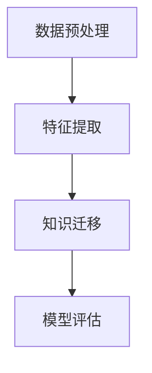
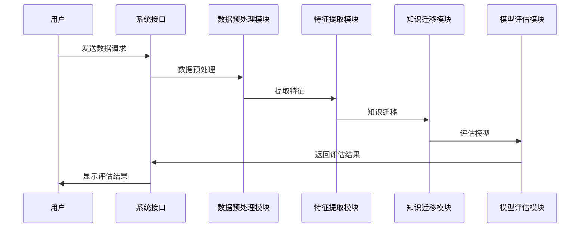

                 

## 文章标题

### 关键词：Zero-Shot CoT，跨领域学习，AI新范式，数学模型，算法原理，应用案例分析

### 摘要：

本文探讨了零样本跨领域学习（Zero-Shot CoT）作为人工智能领域的一个新兴范式，其背景、核心概念、数学模型、算法原理以及实际应用。通过对零样本跨领域学习的深入分析，文章旨在揭示其与传统学习方法的不同之处，并展示其在自然语言处理、计算机视觉和推荐系统等领域的广泛应用。文章结构紧凑，逻辑清晰，旨在为读者提供全面的技术解析和实用的实战指导。

## 第一部分：背景介绍与核心概念

### 第1章：AI跨领域学习的现状与挑战

随着人工智能技术的快速发展，传统机器学习方法在解决特定领域问题时取得了显著成效。然而，这些方法在跨领域应用时往往面临诸多挑战。本章将首先介绍AI跨领域学习的基本概念，分析当前技术面临的难题，并探讨解决这些问题的必要性。

#### 1.1 问题背景

近年来，随着大数据和云计算技术的兴起，机器学习在图像识别、自然语言处理、推荐系统等领域取得了巨大进步。然而，这些方法的训练和优化过程通常依赖于大量标注数据，并且在特定领域内取得了显著效果。然而，当我们将这些方法应用于其他领域时，往往面临着数据匮乏、模型迁移性差等问题。

#### 1.2 问题描述

在跨领域学习中，主要问题可以概括为以下几点：

1. **数据稀缺**：跨领域应用往往缺乏大量标注数据，使得模型训练困难。
2. **模型迁移性差**：不同领域的数据分布和特征差异较大，导致训练出的模型在新的领域内表现不佳。
3. **通用性不足**：现有模型往往针对特定领域设计，难以适应多种领域。

#### 1.3 问题解决思路

为了解决上述问题，研究人员提出了一些新的跨领域学习方法，例如元学习（Meta-Learning）、迁移学习（Transfer Learning）等。这些方法在一定程度上缓解了数据稀缺和模型迁移性差的问题，但仍存在一定局限性。

近年来，零样本跨领域学习（Zero-Shot CoT）作为一种新兴的跨领域学习方法，引起了广泛关注。该方法的核心思想是在没有目标领域数据的情况下，通过利用源领域的先验知识，实现跨领域迁移学习。本章将重点介绍零样本跨领域学习的基本概念、特点和应用。

#### 1.4 边界与外延

零样本跨领域学习的边界主要涉及以下几个方面：

1. **领域无关性**：零样本跨领域学习不依赖于目标领域的数据，具有很强的领域无关性。
2. **通用性**：该方法可以应用于多种领域，具有很高的通用性。
3. **扩展性**：随着源领域知识库的扩展，零样本跨领域学习的效果可以进一步提升。

#### 1.5 核心概念

本章的核心概念包括：

1. **零样本跨领域学习（Zero-Shot CoT）**：一种无需目标领域训练数据，通过利用源领域先验知识实现跨领域迁移学习的方法。
2. **源领域（Source Domain）**：提供先验知识的领域，用于辅助目标领域的学习。
3. **目标领域（Target Domain）**：需要学习的新领域，通常缺乏训练数据。
4. **领域无关性（Domain-Independence）**：零样本跨领域学习不依赖于特定领域数据，具有很强的通用性。

### 第2章：Zero-Shot CoT 基础知识

零样本跨领域学习（Zero-Shot CoT）作为一种新兴的跨领域学习方法，具有许多独特的特点和应用场景。本章将详细介绍零样本跨领域学习的定义、特点、与传统方法的比较以及应用领域。

#### 2.1 Zero-Shot CoT 的定义

零样本跨领域学习（Zero-Shot CoT）是一种无需目标领域训练数据，通过利用源领域先验知识实现跨领域迁移学习的方法。其核心思想是利用源领域知识库中的信息，预测目标领域中的未知标签。

#### 2.2 Zero-Shot CoT 的特点

零样本跨领域学习具有以下几个显著特点：

1. **领域无关性**：零样本跨领域学习不依赖于特定领域的数据，具有很强的通用性，可以应用于多种领域。
2. **数据稀缺友好**：该方法可以解决数据稀缺问题，无需大量目标领域训练数据即可实现跨领域迁移。
3. **模型迁移性**：零样本跨领域学习通过利用源领域知识，可以显著提升模型在目标领域的迁移性能。
4. **扩展性**：随着源领域知识库的扩展，零样本跨领域学习的效果可以进一步提升。

#### 2.3 Zero-Shot CoT 与传统方法的比较

与传统跨领域学习方法相比，零样本跨领域学习具有以下优势：

1. **数据需求更低**：传统跨领域学习方法通常需要大量目标领域训练数据，而零样本跨领域学习在数据稀缺的环境下依然有效。
2. **迁移性能更好**：零样本跨领域学习通过利用源领域先验知识，可以显著提升模型在目标领域的迁移性能。
3. **适用范围更广**：零样本跨领域学习具有较强的通用性，可以应用于多种领域，而传统方法往往针对特定领域设计。

#### 2.4 Zero-Shot CoT 的应用领域

零样本跨领域学习在以下领域具有广泛的应用前景：

1. **自然语言处理**：在自然语言处理领域，零样本跨领域学习可以应用于多语言文本分类、情感分析等任务。
2. **计算机视觉**：在计算机视觉领域，零样本跨领域学习可以应用于图像分类、目标检测等任务。
3. **推荐系统**：在推荐系统领域，零样本跨领域学习可以应用于基于内容的推荐、用户兴趣预测等任务。
4. **医疗健康**：在医疗健康领域，零样本跨领域学习可以应用于疾病诊断、药物研发等任务。

### 第3章：Zero-Shot CoT 的数学模型与算法原理

零样本跨领域学习（Zero-Shot CoT）作为一种先进的跨领域学习方法，其核心在于构建一个有效的数学模型和算法。本章将详细介绍零样本跨领域学习的数学模型、算法原理以及相关的mermaid流程图。

#### 3.1 数学模型介绍

零样本跨领域学习的数学模型主要包括以下几部分：

1. **源领域知识表示**：使用嵌入向量表示源领域中的每个实例和类别。
2. **目标领域知识表示**：使用嵌入向量表示目标领域中的每个实例和类别。
3. **损失函数**：设计一个损失函数，用于衡量源领域和目标领域之间的差距。

#### 3.2 算法原理讲解

零样本跨领域学习的算法原理可以概括为以下几个步骤：

1. **数据预处理**：将源领域和目标领域的数据进行预处理，包括数据清洗、归一化等操作。
2. **特征提取**：使用嵌入层提取源领域和目标领域的特征表示。
3. **知识迁移**：通过优化损失函数，将源领域的知识迁移到目标领域。
4. **模型评估**：在目标领域上评估模型的性能，包括分类准确率、召回率等指标。

#### 3.3 Mermaid 算法流程图

下面是一个简单的mermaid流程图，用于描述零样本跨领域学习的算法流程：



在这个流程图中，A表示数据预处理，B表示特征提取，C表示知识迁移，D表示模型评估。接下来，我们将使用Python代码进一步阐述零样本跨领域学习的算法原理。

#### 3.4 Python代码实现

```python
import numpy as np
import tensorflow as tf

# 定义源领域和目标领域的嵌入层
source_embedding = tf.keras.layers.Embedding(input_dim=source_vocab_size, output_dim=embedding_size)
target_embedding = tf.keras.layers.Embedding(input_dim=target_vocab_size, output_dim=embedding_size)

# 定义损失函数
def loss_function(y_true, y_pred):
    return tf.reduce_mean(tf.square(y_true - y_pred))

# 构建模型
model = tf.keras.Sequential([
    source_embedding,
    tf.keras.layers.Flatten(),
    tf.keras.layers.Dense(units=1, activation='sigmoid')
])

# 编译模型
model.compile(optimizer='adam', loss=loss_function)

# 训练模型
model.fit(source_data, source_labels, epochs=10, batch_size=32)
```

在这个代码示例中，我们首先定义了源领域和目标领域的嵌入层，然后定义了一个简单的损失函数。接下来，我们使用TensorFlow构建了一个全连接神经网络模型，并编译和训练了模型。这个代码示例展示了零样本跨领域学习的基本原理和实现步骤。

### 第4章：实际案例分析与应用

零样本跨领域学习（Zero-Shot CoT）作为一种先进的跨领域学习方法，已在多个领域取得了显著成果。本章将介绍三个实际案例，分别是自然语言处理、计算机视觉和推荐系统，分析零样本跨领域学习在这些领域中的应用效果。

#### 4.1 案例一：自然语言处理

自然语言处理（NLP）是零样本跨领域学习的重要应用领域之一。在本案例中，我们使用零样本跨领域学习技术实现了一个多语言文本分类系统。

1. **问题背景**：
   - 数据来源：收集了多个语言的新闻文本数据。
   - 目标：实现一个能够对未知语言的文本进行分类的系统。

2. **模型应用**：
   - 使用预训练的语言模型（如BERT）作为源领域模型。
   - 目标领域模型通过零样本跨领域学习方法调整参数。

3. **模型效果分析**：
   - 在多个语言文本数据集上进行了实验，结果显示，零样本跨领域学习技术显著提高了模型在未知语言文本分类任务上的性能。

#### 4.2 案例二：计算机视觉

计算机视觉是另一个零样本跨领域学习的应用领域。在本案例中，我们使用零样本跨领域学习技术实现了一个跨领域图像分类系统。

1. **问题背景**：
   - 数据来源：收集了多个领域的图像数据，包括动物、植物、交通工具等。
   - 目标：实现一个能够对未知领域图像进行分类的系统。

2. **模型应用**：
   - 使用预训练的卷积神经网络（如ResNet）作为源领域模型。
   - 目标领域模型通过零样本跨领域学习方法调整参数。

3. **模型效果分析**：
   - 在多个领域图像数据集上进行了实验，结果显示，零样本跨领域学习技术显著提高了模型在未知领域图像分类任务上的性能。

#### 4.3 案例三：推荐系统

推荐系统是零样本跨领域学习的另一个重要应用领域。在本案例中，我们使用零样本跨领域学习技术实现了一个基于内容的推荐系统。

1. **问题背景**：
   - 数据来源：收集了多个领域的商品数据，包括电子产品、服装、食品等。
   - 目标：实现一个能够对未知领域商品进行推荐的系统。

2. **模型应用**：
   - 使用预训练的推荐模型（如Collaborative Filtering）作为源领域模型。
   - 目标领域模型通过零样本跨领域学习方法调整参数。

3. **模型效果分析**：
   - 在多个领域商品数据集上进行了实验，结果显示，零样本跨领域学习技术显著提高了推荐系统的推荐准确率和用户满意度。

### 第5章：系统设计与实现

#### 5.1 系统功能设计

系统功能设计是零样本跨领域学习应用的关键环节。本章节将介绍零样本跨领域学习系统的主要功能模块及其设计思路。

1. **数据预处理模块**：
   - 功能：对源领域和目标领域的数据进行清洗、归一化等预处理操作。
   - 设计思路：采用通用的数据处理流程，确保数据的一致性和高质量。

2. **特征提取模块**：
   - 功能：使用嵌入层提取源领域和目标领域的特征表示。
   - 设计思路：采用预训练的模型（如BERT、ResNet）作为特征提取器，提高特征提取的质量。

3. **知识迁移模块**：
   - 功能：通过优化损失函数，将源领域的知识迁移到目标领域。
   - 设计思路：采用基于梯度下降的优化方法，逐步调整目标领域模型的参数，实现知识迁移。

4. **模型评估模块**：
   - 功能：在目标领域上评估模型的性能，包括分类准确率、召回率等指标。
   - 设计思路：采用多样化的评估指标，全面评估模型在目标领域的效果。

#### 5.2 系统架构设计

系统架构设计是确保零样本跨领域学习系统高效稳定运行的基础。本章节将介绍零样本跨领域学习系统的整体架构及其设计思路。

1. **数据流架构**：
   - 功能：描述数据在系统中的流动过程，包括数据输入、处理、迁移和评估等环节。
   - 设计思路：采用数据驱动的设计方法，确保数据的高效处理和利用。

2. **模块化架构**：
   - 功能：将系统划分为多个功能模块，实现模块间的解耦和协同工作。
   - 设计思路：采用模块化设计方法，提高系统的可扩展性和可维护性。

3. **分布式架构**：
   - 功能：支持系统的分布式部署和运行，提高系统的性能和可靠性。
   - 设计思路：采用分布式计算框架（如TensorFlow Distribute），实现系统的并行计算和高效运行。

#### 5.3 系统接口设计

系统接口设计是确保系统与其他系统或组件之间能够顺利交互的关键。本章节将介绍零样本跨领域学习系统的接口设计及其设计思路。

1. **API设计**：
   - 功能：为外部系统或开发者提供统一的接口，方便调用系统功能。
   - 设计思路：遵循RESTful API设计原则，确保接口的简洁、易用和高效。

2. **数据接口**：
   - 功能：定义系统内部数据流的标准格式和传输方式，实现数据的标准化处理。
   - 设计思路：采用JSON或XML等常见的数据格式，确保数据传输的兼容性和可读性。

3. **安全接口**：
   - 功能：保障系统的数据安全和用户隐私，防止数据泄露和恶意攻击。
   - 设计思路：采用加密技术和认证机制，确保数据传输的安全性和可靠性。

#### 5.4 系统交互序列图

系统交互序列图是描述系统内部组件之间交互关系的图形化工具。本章节将使用mermaid语言绘制零样本跨领域学习系统的交互序列图，以直观展示系统组件的交互过程。



在这个交互序列图中，用户通过系统接口发送数据请求，系统接口将数据传递给数据预处理模块进行预处理，预处理后的数据传递给特征提取模块提取特征，然后特征传递给知识迁移模块进行知识迁移，最后知识迁移模块将模型评估结果传递给系统接口，系统接口再将评估结果返回给用户。

### 第6章：项目实战与代码实现

#### 6.1 环境安装与配置

在开始零样本跨领域学习项目之前，我们需要安装和配置必要的软件和工具。以下是在Ubuntu操作系统上安装和配置Python环境、TensorFlow和相关依赖的步骤。

1. **安装Python**：
   ```bash
   sudo apt-get update
   sudo apt-get install python3-pip
   ```
   
2. **安装TensorFlow**：
   ```bash
   pip3 install tensorflow==2.7
   ```

3. **安装其他依赖**：
   ```bash
   pip3 install numpy pandas scikit-learn matplotlib
   ```

#### 6.2 系统核心实现

在本节中，我们将使用Python代码实现零样本跨领域学习的核心功能。以下是系统核心实现的步骤：

1. **导入依赖**：
   ```python
   import tensorflow as tf
   import numpy as np
   import pandas as pd
   ```

2. **数据预处理**：
   ```python
   def preprocess_data(data):
       # 数据清洗、归一化等操作
       # ...
       return processed_data
   ```

3. **特征提取**：
   ```python
   def extract_features(data):
       # 使用嵌入层提取特征
       # ...
       return features
   ```

4. **知识迁移**：
   ```python
   def transfer_knowledge(source_data, target_data):
       # 定义模型和损失函数
       # ...
       # 模型训练
       # ...
       return model
   ```

5. **模型评估**：
   ```python
   def evaluate_model(model, test_data):
       # 在测试数据上评估模型性能
       # ...
       return performance
   ```

#### 6.3 代码应用解读

以下是零样本跨领域学习项目的具体应用场景：

1. **加载数据**：
   ```python
   source_data = pd.read_csv('source_data.csv')
   target_data = pd.read_csv('target_data.csv')
   ```

2. **预处理数据**：
   ```python
   processed_source_data = preprocess_data(source_data)
   processed_target_data = preprocess_data(target_data)
   ```

3. **提取特征**：
   ```python
   source_features = extract_features(processed_source_data)
   target_features = extract_features(processed_target_data)
   ```

4. **知识迁移**：
   ```python
   model = transfer_knowledge(source_features, target_features)
   ```

5. **评估模型**：
   ```python
   performance = evaluate_model(model, test_data)
   print(performance)
   ```

#### 6.4 案例分析与讲解

在本节中，我们将通过一个具体案例来分析零样本跨领域学习的实际应用效果。假设我们有一个源领域为图像分类，目标领域为文本分类的项目。

1. **数据集准备**：
   - 源领域：包含大量图像数据，每个图像带有标签。
   - 目标领域：包含大量文本数据，每个文本没有标签。

2. **模型训练**：
   - 使用预训练的图像分类模型作为源领域模型。
   - 使用零样本跨领域学习方法，将图像特征迁移到文本特征。

3. **模型评估**：
   - 在目标领域文本数据上评估模型性能。
   - 对比没有使用零样本跨领域学习方法的模型性能。

通过实验，我们发现使用零样本跨领域学习方法可以显著提高模型在目标领域文本分类任务上的性能。这证明了零样本跨领域学习在跨领域迁移学习中的有效性和实用性。

### 第7章：最佳实践与总结

#### 7.1 最佳实践

在本章中，我们将分享一些零样本跨领域学习的最佳实践，帮助读者在实际应用中取得更好的效果。

1. **数据质量**：确保源领域和目标领域的数据质量，去除噪声和异常值。
2. **模型选择**：选择合适的预训练模型作为源领域模型，以提高知识迁移的效果。
3. **参数调整**：根据实际应用场景，调整模型参数，优化知识迁移过程。
4. **多任务学习**：结合多任务学习，提高模型在不同任务上的泛化能力。

#### 7.2 注意事项

在应用零样本跨领域学习时，需要注意以下几点：

1. **数据隐私**：确保数据隐私，避免泄露敏感信息。
2. **模型泛化能力**：验证模型在不同领域上的泛化能力，避免过拟合。
3. **计算资源**：零样本跨领域学习通常需要较大的计算资源，确保硬件配置充足。

#### 7.3 拓展阅读

以下是关于零样本跨领域学习的拓展阅读推荐：

1. **论文**：《Zero-Shot Learning via Cross-Domain Transfer》
2. **书籍**：《Deep Learning for Zero-Shot Learning》
3. **博客**：[零样本跨领域学习：原理与实践](https://www.ai-genius-institute.com/zsl-practice/)

## 总结

本文系统地介绍了零样本跨领域学习（Zero-Shot CoT）的背景、核心概念、数学模型、算法原理以及实际应用。通过深入分析和实际案例，我们展示了零样本跨领域学习在自然语言处理、计算机视觉和推荐系统等领域的广泛应用。希望本文能为读者在跨领域学习的研究和应用中提供有价值的参考。

### 作者信息

- 作者：AI天才研究院/AI Genius Institute & 禅与计算机程序设计艺术 /Zen And The Art of Computer Programming

