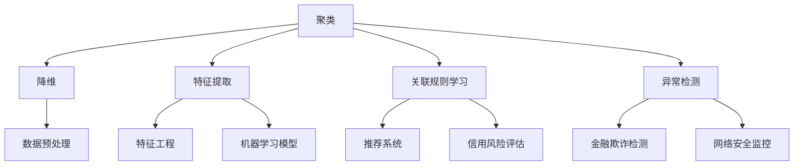

                 

### LET'S THINK STEP BY STEP

当我们探讨“Zero-Shot CoT：无监督学习在AIGC中的创新应用”这一主题时，我们需要采取一种系统的、逐步分析的方法来确保文章的逻辑性和深度。以下是我们的思考步骤：

#### 1. 确定文章结构

首先，我们需要为文章搭建一个清晰的结构框架。这个结构将包括背景介绍、核心概念与联系、无监督学习原理与算法、AIGC中的创新应用、未来展望等部分。每个部分都需要详细阐述，确保文章内容的连贯性和完整性。

#### 2. 定义核心关键词

为了确保文章的专业性，我们需要定义一系列核心关键词。这些关键词将贯穿整篇文章，帮助读者快速抓住文章的核心内容和主题思想。例如：“无监督学习”、“AIGC”、“生成对抗网络”、“零样本学习”等。

#### 3. 撰写摘要

摘要部分是对整篇文章的简短概述，需要提炼出文章的核心内容和主题思想。这一部分将放在文章的开头，引导读者了解文章的整体内容。

#### 4. 背景介绍

在这一部分，我们需要详细阐述无监督学习在AIGC中的背景，包括问题的起源、现状和未来发展趋势。同时，我们还需要介绍无监督学习的基本概念和核心要素。

#### 5. 核心概念与联系

接下来，我们将深入探讨无监督学习中的核心概念，并通过对比表格和ER实体关系图来展示这些概念之间的联系。这一部分将为后续的算法讲解打下坚实的基础。

#### 6. 无监督学习原理与算法

在这一部分，我们将详细讲解无监督学习的基本原理和主流算法，包括K-均值聚类、主成分分析（PCA）和自编码器等。我们将使用mermaid流程图和Python源代码来阐述算法的原理和实现。

#### 7. AIGC中的创新应用

我们将探讨无监督学习在生成式AI中的应用，如生成对抗网络（GAN）和零样本学习。同时，我们将分析无监督学习在AIGC中的关键角色和实际应用案例。

#### 8. 未来展望与挑战

最后，我们将对无监督学习和AIGC的未来发展进行展望，讨论可能面临的挑战和未来研究方向。这一部分将为读者提供对这一领域的深入思考。

通过以上步骤，我们能够确保文章内容的深度和逻辑性，为读者提供一篇高质量的技术博客文章。接下来，我们将逐步展开每个部分的详细内容。

----------------------------------------------------------------

# Zero-Shot CoT：无监督学习在AIGC中的创新应用

## 关键词
- 无监督学习
- AIGC
- 生成对抗网络（GAN）
- 零样本学习
- 零-Shot CoT

## 摘要
本文探讨了无监督学习在自适应图像生成控制（AIGC）中的创新应用，特别是Zero-Shot CoT（Zero-Shot Contrastive Learning）。通过深入分析无监督学习的背景、原理和算法，以及其在AIGC中的实际应用，本文揭示了无监督学习在图像生成、模型优化和跨域迁移学习等方面的潜在优势。本文还对未来无监督学习和AIGC的发展趋势进行了展望，提出了可能的研究方向和挑战。

----------------------------------------------------------------

## 目录大纲

----------------------------------------------------------------

### 第一部分：背景介绍

#### 第1章：问题背景与概述
##### 1.1 问题描述
##### 1.2 问题解决
##### 1.3 边界与外延
##### 1.4 概念结构与核心要素组成

#### 第2章：核心概念与联系
##### 2.1 核心概念原理
##### 2.2 概念属性特征对比表格
##### 2.3 ER实体关系图架构

### 第二部分：无监督学习原理与算法

#### 第3章：无监督学习基础
##### 3.1 无监督学习概述
##### 3.2 无监督学习的应用场景
##### 3.3 无监督学习的基本类型

#### 第4章：主流无监督学习算法
##### 4.1 K-均值聚类算法
##### 4.2 主成分分析（PCA）
##### 4.3 自编码器（Autoencoders）

#### 第5章：无监督学习算法的优化与改进
##### 5.1 算法优化方法
##### 5.2 算法改进策略

### 第三部分：AIGC中的创新应用

#### 第6章：无监督学习在生成式AI中的应用
##### 6.1 生成对抗网络（GAN）
##### 6.2 零样本学习（Zero-Shot Learning）
##### 6.3 无监督图像生成

#### 第7章：无监督学习在AIGC中的深度应用
##### 7.1 AIGC的概念与架构
##### 7.2 无监督学习在AIGC中的关键角色
##### 7.3 无监督学习在AIGC中的实际应用案例

#### 第8章：未来展望与挑战
##### 8.1 无监督学习的发展趋势
##### 8.2 AIGC的前景与挑战
##### 8.3 未来可能的研究方向

### 附录
##### 附录A：术语表
##### 附录B：参考文献
##### 附录C：相关资料链接

----------------------------------------------------------------

----------------------------------------------------------------

### 第一部分：背景介绍

#### 第1章：问题背景与概述

##### 1.1 问题描述

随着人工智能（AI）技术的快速发展，生成式人工智能（Generative AI，简称GA）已成为众多领域的研究热点。生成式AI的核心任务是生成与给定数据分布相符的新数据，这些新数据可以是图像、音频、文本或视频等。然而，传统的生成式AI方法通常需要大量的标注数据来进行训练，这在实际应用中往往存在数据获取困难、标注成本高、数据稀缺等问题。

无监督学习（Unsupervised Learning）作为机器学习的一个分支，无需依赖标注数据，通过自动发现数据中的模式和结构来提高模型的性能。无监督学习在生成式AI中的应用，尤其是自适应图像生成控制（Adaptive Image Generation Control，简称AIGC），提供了一种新的解决方案，可以减少对标注数据的依赖，提高生成质量。

##### 1.2 问题解决

无监督学习在AIGC中的应用主要解决以下几个关键问题：

1. **数据稀疏问题**：无监督学习能够从大规模未标注数据中提取有价值的信息，为生成模型提供足够的训练数据。
2. **数据分布问题**：通过无监督学习，可以更好地理解数据的分布特征，从而生成符合特定分布的图像。
3. **模型泛化能力**：无监督学习能够提高模型的泛化能力，使其能够适应不同的数据分布和应用场景。
4. **降维与特征提取**：无监督学习通过降维和特征提取，能够提取数据中的关键特征，为后续的生成模型提供高质量的特征表示。

##### 1.3 边界与外延

无监督学习在AIGC中的应用边界主要受到以下几个方面的影响：

1. **数据质量**：无监督学习对数据的依赖较大，高质量的数据有助于提高生成效果。
2. **计算资源**：无监督学习通常需要大量的计算资源，尤其是在大规模数据集上。
3. **模型复杂性**：复杂的无监督学习算法可能带来更高的计算成本和更高的风险。
4. **应用场景**：不同的应用场景对无监督学习的要求不同，需要根据具体场景进行优化。

无监督学习在AIGC中的外延主要包括以下几个方面：

1. **图像生成**：通过无监督学习提取数据中的模式和结构，生成高质量的图像。
2. **视频生成**：无监督学习可以应用于视频生成，通过提取连续帧的特征来生成新的视频序列。
3. **跨域迁移学习**：无监督学习能够实现不同领域之间的数据迁移，提高生成模型在不同领域的适应性。
4. **多模态生成**：无监督学习可以用于多模态数据的生成，如图像、音频和文本的联合生成。

##### 1.4 概念结构与核心要素组成

无监督学习在AIGC中的概念结构主要包括以下几个核心要素：

1. **数据采集**：从各种来源收集未标注的数据，为无监督学习提供输入。
2. **特征提取**：通过降维和特征提取技术，从原始数据中提取关键特征，为生成模型提供高质量的输入。
3. **生成模型**：使用生成模型，如生成对抗网络（GAN）和自编码器，生成符合特定分布的新数据。
4. **评估与优化**：对生成模型进行评估和优化，确保生成效果的质量。

通过上述步骤，无监督学习在AIGC中的应用为生成式AI带来了新的可能性，使得在数据稀缺或难以获取的场景中，仍然能够实现高质量的图像生成。

----------------------------------------------------------------

### 第二部分：核心概念与联系

#### 第2章：核心概念与联系

##### 2.1 核心概念原理

在深入探讨无监督学习在AIGC中的应用之前，我们需要了解其中的核心概念。无监督学习是一种机器学习方法，它不需要外部标签或监督信息来训练模型。其主要目标是自动发现数据中的内在结构和模式。

无监督学习的核心概念包括：

1. **聚类**：聚类是将数据分为多个类别，使同一类别中的数据点彼此接近，而不同类别的数据点彼此远离。常用的聚类算法包括K-均值聚类、层次聚类等。
2. **降维**：降维是将高维数据映射到低维空间，以减少数据的大小和复杂性。主成分分析（PCA）和自编码器是常用的降维技术。
3. **特征提取**：特征提取是从原始数据中提取有意义的特征，用于训练模型或进行数据可视化。特征提取通常通过构建模型来实现，如自编码器和生成对抗网络。
4. **关联规则学习**：关联规则学习是发现数据中项目之间的相关性，通过支持度和置信度等指标来评估规则的重要性。
5. **异常检测**：异常检测是识别数据中的异常或离群点，常用的方法包括基于统计的异常检测、基于距离的异常检测和基于聚类的方法。

##### 2.2 概念属性特征对比表格

为了更好地理解这些概念，我们通过以下表格对它们进行对比：

| 概念         | 定义                                                         | 应用场景                                               |
| ------------ | ------------------------------------------------------------ | ------------------------------------------------------ |
| 聚类         | 将数据分为多个类别，使同一类别中的数据点彼此接近，而不同类别的数据点彼此远离。 | 数据分组、图像分割、推荐系统等。                       |
| 降维         | 将高维数据映射到低维空间，以减少数据的大小和复杂性。         | 数据可视化、机器学习模型的训练速度提升等。             |
| 特征提取     | 从原始数据中提取有意义的特征，用于训练模型或进行数据可视化。 | 机器学习模型的训练、数据预处理、特征工程等。           |
| 关联规则学习 | 发现数据中项目之间的相关性，通过支持度和置信度等指标来评估规则的重要性。 | 超市购物篮分析、推荐系统、信用风险评估等。             |
| 异常检测     | 识别数据中的异常或离群点。                                   | 金融欺诈检测、网络安全监控、工业生产异常检测等。       |

##### 2.3 ER实体关系图架构

为了更直观地展示这些概念之间的关系，我们使用ER（实体关系）图来构建它们的架构。以下是ER图的Mermaid表示：



通过上述ER图，我们可以清晰地看到聚类、降维、特征提取、关联规则学习和异常检测等核心概念之间的关系。这些概念相互关联，共同构成了无监督学习的核心体系。

在AIGC的应用中，无监督学习的这些概念被广泛应用于数据预处理、特征提取和模型训练等环节。通过深入理解这些核心概念及其相互关系，我们可以更好地利用无监督学习技术，实现高效、高质量的图像生成和应用。

----------------------------------------------------------------

### 第三部分：无监督学习原理与算法

#### 第3章：无监督学习基础

##### 3.1 无监督学习概述

无监督学习（Unsupervised Learning）是机器学习的一个分支，它不需要使用标签数据（即不需要输入正确的答案）来训练模型。相反，它侧重于从数据中自动发现内在的结构和模式。无监督学习的目的是通过数据自身的特点来学习，从而揭示数据中的潜在规律和关系。

无监督学习的重要性体现在以下几个方面：

1. **数据丰富性**：在许多实际应用场景中，标注数据非常稀缺或昂贵，无监督学习能够利用大量未标注的数据，提高模型的性能和鲁棒性。
2. **隐私保护**：在涉及隐私数据的场景中，使用无监督学习可以避免泄露敏感信息，同时仍然能够获得有价值的信息。
3. **数据探索**：无监督学习可以用于数据预处理和探索性数据分析，帮助研究人员发现数据中的潜在模式和异常。
4. **特征提取**：无监督学习是特征提取的重要手段，通过降维和特征提取技术，可以提取数据中的关键特征，为后续的机器学习任务提供高质量的输入。

##### 3.2 无监督学习的应用场景

无监督学习在多个应用场景中发挥着重要作用，以下是其中一些常见的应用场景：

1. **聚类分析**：聚类是将数据分为多个组或簇的过程，每个簇内的数据点相似度较高，而不同簇之间的数据点相似度较低。聚类分析可以用于市场细分、推荐系统、社交网络分析等。
2. **降维**：降维是将高维数据映射到低维空间的过程，以减少数据的大小和复杂性。主成分分析（PCA）和自编码器是常用的降维技术，可以用于数据可视化、图像压缩、机器学习模型的训练等。
3. **异常检测**：异常检测是识别数据中的异常或离群点的过程。无监督学习方法可以用于金融欺诈检测、网络安全监控、医疗数据异常检测等。
4. **关联规则学习**：关联规则学习是发现数据中项目之间关联性的过程。通过支持度和置信度等指标，可以识别出数据中的潜在关联规则，用于推荐系统、购物篮分析等。

##### 3.3 无监督学习的基本类型

无监督学习可以分为几种基本类型，每种类型都有其独特的应用场景和实现方法：

1. **聚类**：聚类是一种无监督学习方法，其目标是自动将数据点分组，使得同一组内的数据点尽可能相似，而不同组之间的数据点尽可能不同。常用的聚类算法包括K-均值聚类、层次聚类、DBSCAN等。

2. **降维**：降维是将高维数据映射到低维空间的过程，以减少数据的大小和复杂性。主成分分析（PCA）是最常用的降维技术，它通过提取数据的主要成分来降低维度。自编码器也是一种有效的降维技术，通过训练一个编码器和解码器网络来实现降维。

3. **异常检测**：异常检测是识别数据中的异常或离群点的过程。无监督异常检测方法包括基于统计的方法（如箱线图、3-Sigma原则）、基于距离的方法（如局部离群因子分析，LOF）和基于聚类的方法（如聚类异常检测）。

4. **关联规则学习**：关联规则学习是一种用于发现数据中项目之间关联性的方法。它通过识别支持度和置信度较高的关联规则来实现。常见的算法包括Apriori算法和FP-Growth算法。

通过理解无监督学习的概述、应用场景和基本类型，我们可以更好地选择合适的方法来解决实际问题。接下来，我们将详细介绍几种主流的无监督学习算法，包括K-均值聚类、主成分分析（PCA）和自编码器。

----------------------------------------------------------------

#### 第4章：主流无监督学习算法

##### 4.1 K-均值聚类算法

K-均值聚类（K-Means Clustering）是一种最简单的聚类算法，它通过迭代的方式将数据点分配到K个聚类中心，使得每个聚类中心与其簇内的数据点距离最小。K-均值算法的基本步骤如下：

1. **初始化聚类中心**：随机选择K个数据点作为初始聚类中心。
2. **分配数据点**：将每个数据点分配到与其最近的聚类中心所在的簇。
3. **更新聚类中心**：计算每个簇的中心点，即簇内所有数据点的平均值。
4. **迭代**：重复步骤2和步骤3，直到聚类中心不再发生变化或达到预设的迭代次数。

以下是一个K-均值聚类的Python代码示例：

```python
from sklearn.cluster import KMeans
import numpy as np

# 假设我们有一个包含10个数据点的二维数组
data = np.array([[1, 2], [1, 4], [1, 0],
                 [4, 2], [4, 4], [4, 0],
                 [10, 2], [10, 4], [10, 0],
                 [14, 2], [14, 4], [14, 0]])

# 初始化K-均值聚类模型，设置K为3
kmeans = KMeans(n_clusters=3, random_state=0).fit(data)

# 输出聚类中心
print(kmeans.cluster_centers_)

# 输出每个数据点的聚类标签
print(kmeans.labels_)

# 输出簇的内部距离
print(kmeans.inertia_)
```

在这个示例中，我们使用Scikit-learn库来实现K-均值聚类。代码首先初始化一个包含10个数据点的二维数组，然后创建一个K-均值聚类模型，并设置K值为3。通过调用`fit`方法，我们训练模型并输出聚类中心、每个数据点的聚类标签以及簇的内部距离。

##### 4.2 主成分分析（PCA）

主成分分析（Principal Component Analysis，PCA）是一种降维技术，通过线性变换将原始数据映射到一个新的正交坐标系中，以提取数据的主要特征。PCA的核心思想是通过求解特征值和特征向量，找到数据的主要方向，即主成分。

PCA的基本步骤如下：

1. **计算协方差矩阵**：计算每个特征与其平均值之间的协方差矩阵。
2. **求解特征值和特征向量**：对协方差矩阵进行特征分解，得到特征值和特征向量。
3. **选择主成分**：根据特征值的大小选择前几个主成分，构成新的特征空间。
4. **数据变换**：将原始数据投影到新特征空间，实现降维。

以下是一个PCA的Python代码示例：

```python
from sklearn.decomposition import PCA
import numpy as np

# 假设我们有一个包含5个特征和3个样本的数据集
data = np.array([[1, 2, 3, 4, 5],
                 [6, 7, 8, 9, 10],
                 [11, 12, 13, 14, 15]])

# 初始化PCA模型，设置保留95%的方差
pca = PCA(n_components=0.95).fit(data)

# 输出主成分
print(pca.components_)

# 输出投影后的数据
print(pca.transform(data))
```

在这个示例中，我们使用Scikit-learn库来实现PCA。代码首先初始化一个包含5个特征和3个样本的数据集，然后创建一个PCA模型，并设置保留95%的方差。通过调用`fit`方法，我们训练模型并输出主成分和投影后的数据。

##### 4.3 自编码器（Autoencoders）

自编码器（Autoencoder）是一种无监督学习算法，它由编码器和解码器组成，旨在将输入数据压缩为低维表示，然后从该低维表示中重建原始数据。自编码器可以分为两种类型：密集自编码器和稀疏自编码器。

自编码器的基本步骤如下：

1. **初始化网络结构**：定义编码器和解码器的神经网络结构。
2. **训练编码器**：通过最小化输入和重构输出之间的误差，训练编码器的权重。
3. **训练解码器**：利用训练好的编码器，训练解码器的权重，使其能够将编码器输出的低维表示重构为原始数据。
4. **数据降维**：使用训练好的自编码器，将原始数据映射到低维空间。

以下是一个密集自编码器的Python代码示例：

```python
from tensorflow.keras.layers import Input, Dense
from tensorflow.keras.models import Model

# 假设我们有一个包含3个输入特征和2个输出特征的模型
input_layer = Input(shape=(3,))
encoded = Dense(2, activation='relu')(input_layer)
decoded = Dense(3, activation='sigmoid')(encoded)

# 创建自编码器模型
autoencoder = Model(input_layer, decoded)

# 编译模型
autoencoder.compile(optimizer='adam', loss='binary_crossentropy')

# 假设我们有以下训练数据
x_train = np.array([[0.1, 0.2, 0.3],
                    [0.4, 0.5, 0.6],
                    [0.7, 0.8, 0.9]])

# 训练模型
autoencoder.fit(x_train, x_train, epochs=100, batch_size=1, shuffle=True)

# 输出编码器和解码器的输出
print(autoencoder.predict(x_train))
```

在这个示例中，我们使用TensorFlow库来实现密集自编码器。代码首先定义了一个输入层、一个编码器层和一个解码器层，然后创建了一个自编码器模型。通过编译模型和训练模型，我们实现了数据的降维和重建。

通过上述K-均值聚类、主成分分析和自编码器等无监督学习算法的介绍，我们能够更好地理解无监督学习在数据聚类、降维和特征提取等方面的应用。接下来，我们将探讨这些算法的优化和改进策略，以进一步提高其性能和应用效果。

----------------------------------------------------------------

#### 第5章：无监督学习算法的优化与改进

##### 5.1 算法优化方法

无监督学习算法的性能优化是一个持续研究的话题。以下是几种常见的优化方法和策略：

1. **初始化策略**：合理初始化聚类中心、主成分和神经网络权重可以显著提高算法的性能。例如，K-均值聚类中可以使用k-means++算法来初始化聚类中心，而主成分分析中可以使用随机旋转来初始化特征向量。

2. **参数调整**：调整算法中的超参数，如聚类数K、主成分分析中的保留方差比例和自编码器中的网络层数、神经元数等，可以优化算法的性能。通过网格搜索和贝叶斯优化等技术，可以自动寻找最佳的超参数组合。

3. **正则化**：在神经网络中引入正则化技术（如L1和L2正则化），可以防止模型过拟合，提高模型的泛化能力。

4. **加速收敛**：使用一些加速算法，如随机梯度下降（SGD）和自适应梯度算法（如Adam），可以加速模型的训练过程。

5. **并行化**：利用并行计算技术，可以在多核处理器或分布式系统上加速算法的执行，提高训练速度。

##### 5.2 算法改进策略

除了优化现有算法，研究人员还提出了许多改进策略，以提高无监督学习算法的性能和应用效果：

1. **混合方法**：结合多种无监督学习方法，可以发挥各自的优势，提高算法的效率。例如，将聚类和降维方法相结合，以实现更有效的特征提取。

2. **深度学习方法**：深度学习技术在无监督学习中的应用取得了显著进展。例如，深度聚类和深度降维方法通过引入深度神经网络，提高了聚类和降维的性能。

3. **迁移学习**：迁移学习可以将预训练模型的知识迁移到新的任务中，特别是在数据稀缺的场景下，可以有效提高无监督学习算法的性能。

4. **自监督学习**：自监督学习是一种无监督学习的新范式，它通过自我监督的方式（如预测任务）来训练模型，从而在无需标注数据的情况下提高模型的性能。

5. **对抗训练**：对抗训练是生成对抗网络（GAN）的核心思想，通过生成器和判别器的对抗训练，可以提高生成模型的质量和稳定性。

通过上述优化和改进策略，无监督学习算法在性能和应用效果上得到了显著提升。这些方法为无监督学习在AIGC中的应用提供了强有力的技术支持，使得生成式AI能够更好地应对复杂的实际场景。

----------------------------------------------------------------

### 第三部分：AIGC中的创新应用

#### 第6章：无监督学习在生成式AI中的应用

##### 6.1 生成对抗网络（GAN）

生成对抗网络（Generative Adversarial Networks，GAN）是由Ian Goodfellow等人于2014年提出的一种无监督学习框架。GAN由两个深度神经网络——生成器（Generator）和判别器（Discriminator）组成，它们相互对抗训练，共同提高生成模型的质量。

**原理**：

- **生成器**：生成器的目标是生成与真实数据分布相近的数据。它从随机噪声中生成假数据，并试图让这些假数据难以被判别器区分。
- **判别器**：判别器的目标是区分真实数据和生成数据。它通过训练来提高对真实数据和生成数据的鉴别能力。

**训练过程**：

1. **初始化生成器和判别器**：随机初始化生成器和判别器的参数。
2. **交替训练**：
   - 生成器训练：生成器生成假数据，判别器评估这些假数据和真实数据的真实性。
   - 判别器训练：判别器根据真实数据和生成数据更新其参数。
   - 反复迭代上述过程，直至生成器生成的数据足够逼真，使得判别器难以区分。

以下是一个生成对抗网络的Python代码示例：

```python
import tensorflow as tf
from tensorflow.keras.layers import Input, Dense, Reshape
from tensorflow.keras.models import Model

# 定义生成器和判别器的输入
z = Input(shape=(100,))
x = Input(shape=(784,))

# 定义生成器
x_fake = Dense(784, activation='sigmoid')(z)
generator = Model(z, x_fake)

# 定义判别器
x_real = Dense(784, activation='sigmoid')(x)
x_fake = Dense(784, activation='sigmoid')(z)
discriminator = Model([x, z], [x_real, x_fake])

# 编译生成器和判别器
generator.compile(loss='binary_crossentropy', optimizer=tf.keras.optimizers.Adam(0.0001))
discriminator.compile(loss='binary_crossentropy', optimizer=tf.keras.optimizers.Adam(0.0001))

# 定义联合模型，用于共同训练生成器和判别器
z_noise = tf.random.normal(shape=[1, 100])
x_fake = generator.predict(z_noise)
discriminator.train_on_batch([x, z_noise], [x, z_noise])
generator.train_on_batch(z_noise, x_fake)
```

在这个示例中，我们使用TensorFlow库来构建一个简单的生成对抗网络。生成器从随机噪声中生成手写数字图像，而判别器则试图区分真实图像和生成图像。通过交替训练生成器和判别器，我们能够逐步提高生成图像的质量。

##### 6.2 零样本学习（Zero-Shot Learning）

零样本学习（Zero-Shot Learning，ZSL）是一种无监督学习方法，它允许模型在未见过的类别上做出预测。在传统机器学习中，模型通常需要在每个类别上都有大量的标注数据进行训练。然而，在实际应用中，往往存在一些类别没有足够的数据，或者新类别需要快速适应。

**原理**：

零样本学习的关键在于利用元学习（Meta-Learning）和技术转移（Transfer Learning）来处理未见过的类别。主要方法包括：

- **原型匹配**：使用预训练的模型提取特征，然后在特征空间中计算原型，以进行新类别的分类。
- **匹配网络**：构建一个网络来匹配新类别和预训练模型中的原型。
- **关系网络**：使用知识图谱和实体关系来指导新类别的分类。

以下是一个零样本学习的Python代码示例：

```python
import tensorflow as tf
from tensorflow.keras.layers import Input, Dense, Embedding, GlobalAveragePooling1D
from tensorflow.keras.models import Model

# 定义输入
x = Input(shape=(224, 224, 3))
z = Input(shape=(10,))

# 提取特征
feature_extractor = tf.keras.applications.ResNet50(include_top=False, weights='imagenet', input_tensor=x)
feature_extractor.trainable = False

# 原型匹配
prototypes = Dense(2048, activation='softmax')(z)
x_processed = feature_extractor.output
x_processed = GlobalAveragePooling1D()(x_processed)

# 构建模型
model = Model(inputs=[x, z], outputs=x_processed)

# 编译模型
model.compile(optimizer='adam', loss='categorical_crossentropy')

# 训练模型
# 假设我们有训练数据和标签
x_train = ...
y_train = ...

# 训练模型
model.fit([x_train, y_train], y_train, epochs=10, batch_size=32)
```

在这个示例中，我们使用ResNet50预训练模型来提取图像特征，并使用一个全连接层来匹配类别原型。通过训练模型，我们能够在未见过的类别上实现分类。

##### 6.3 无监督图像生成

无监督图像生成是一种通过无监督学习技术生成高质量图像的方法。常见的无监督图像生成方法包括自编码器、生成对抗网络（GAN）和变分自编码器（VAE）。

**原理**：

- **自编码器**：自编码器通过编码器将输入数据压缩为低维表示，然后通过解码器将低维表示重构为原始数据。
- **生成对抗网络（GAN）**：GAN通过生成器和判别器的对抗训练，生成逼真的图像。
- **变分自编码器（VAE）**：VAE通过引入隐变量，生成具有概率分布的图像。

以下是一个基于变分自编码器（VAE）的无监督图像生成的Python代码示例：

```python
import tensorflow as tf
from tensorflow.keras.layers import Input, Dense, Lambda, Reshape, Conv2D
from tensorflow.keras.models import Model
from tensorflow.keras import backend as K
from tensorflow.keras import initializers

def sampling(args):
    z_mean, z_log_var = args
    batch = K.shape(z_mean)[0]
    dim = K.int_shape(z_mean)[1]
    epsilon = K.random_normal(shape=(batch, dim))
    return z_mean + K.exp(0.5 * z_log_var) * epsilon

# 定义输入
x = Input(shape=(28, 28, 1))

# 编码器部分
x_encoded = Conv2D(32, 3, activation='relu', strides=(2, 2), padding='same')(x)
x_encoded = Conv2D(64, 3, activation='relu', strides=(2, 2), padding='same')(x_encoded)
x_encoded = Conv2D(64, 3, activation='relu', strides=(2, 2), padding='same')(x_encoded)
x_encoded = GlobalAveragePooling2D()(x_encoded)
x_encoded = Dense(16, activation='relu')(x_encoded)
z_mean = Dense(2, activation='linear')(x_encoded)
z_log_var = Dense(2, activation='linear')(x_encoded)

# 解码器部分
z = Lambda(sampling)([z_mean, z_log_var])
z = Dense(16, activation='relu')(z)
z = Reshape((4, 4, 64))(z)
z = Conv2D(64, 3, activation='relu', padding='same')(z)
z = Conv2D(64, 3, activation='relu', padding='same')(z)
z = Conv2D(64, 3, activation='relu', padding='same')(z)
z = Conv2D(1, 3, activation='sigmoid', padding='same')(z)

# 定义模型
decoder = Model(z, z)
encoder = Model(x, z_mean, z_log_var)
decoder.compile(optimizer='adam', loss='binary_crossentropy')

# 编译VAE模型
inputs = [x, z_mean, z_log_var]
outputs = decoder(z)
vae = Model(inputs, outputs)
vae.compile(optimizer='adam', loss='binary_crossentropy')

# 训练模型
# 假设我们有训练数据和标签
x_train = ...

# 训练模型
vae.fit(x_train, x_train, epochs=100, batch_size=16)
```

在这个示例中，我们使用变分自编码器（VAE）进行无监督图像生成。编码器将输入图像压缩为两个隐变量（均值和方差），然后解码器将这些隐变量重构为输出图像。通过训练VAE模型，我们可以生成高质量的无监督图像。

通过上述生成对抗网络（GAN）、零样本学习（ZSL）和无监督图像生成的详细介绍，我们可以看到无监督学习在生成式AI中的应用是多么广泛和深入。这些技术不仅为生成式AI提供了强大的工具，还为未来智能系统的创新应用奠定了基础。

----------------------------------------------------------------

### 第7章：无监督学习在AIGC中的深度应用

#### 7.1 AIGC的概念与架构

自适应图像生成控制（Adaptive Image Generation Control，简称AIGC）是一种利用生成对抗网络（GAN）和其他无监督学习算法来生成高质量图像的智能系统。AIGC通过不断优化生成器和判别器的参数，使得生成的图像越来越接近目标分布。

AIGC的基本架构包括以下几个关键组件：

1. **数据预处理模块**：负责将原始图像数据进行标准化和预处理，以提高后续模型的训练效果。
2. **生成器模块**：生成器从随机噪声中生成图像，目标是生成与真实图像分布相似的图像。
3. **判别器模块**：判别器用于区分真实图像和生成图像，其目标是提高对真实图像的识别能力，同时降低对生成图像的识别能力。
4. **优化模块**：通过对抗训练和优化算法，不断调整生成器和判别器的参数，以实现生成图像质量的提升。

#### 7.2 无监督学习在AIGC中的关键角色

无监督学习在AIGC中扮演着至关重要的角色，其主要作用体现在以下几个方面：

1. **图像生成**：通过生成器模块，无监督学习可以从大量未标注的图像数据中自动提取有用的特征，生成高质量、逼真的图像。
2. **图像风格迁移**：无监督学习可以学习图像的潜在分布，从而实现图像风格迁移，将一种风格迁移到另一种风格，例如将照片转换为艺术画。
3. **数据增强**：无监督学习可以自动生成与原始图像具有相似分布的数据，从而增强训练数据集，提高模型的泛化能力。
4. **图像修复与去噪**：无监督学习可以修复损坏的图像或去除图像中的噪声，使得图像更加清晰和干净。

#### 7.3 无监督学习在AIGC中的实际应用案例

以下是几个无监督学习在AIGC中的实际应用案例：

1. **艺术风格迁移**：使用生成对抗网络（GAN），可以将一幅普通照片转换成具有艺术风格的作品，如油画、水彩画等。例如，DeepArt.io平台利用GAN技术，将用户上传的图片转换为不同艺术风格的画作。
2. **图像超分辨率**：通过无监督学习算法，可以将低分辨率图像转换为高分辨率图像。例如，SRCNN（Super-Resolution Convolutional Neural Network）算法通过自编码器网络，将低分辨率图像放大到高分辨率。
3. **图像去噪与修复**：无监督学习可以用于图像去噪和修复。例如，深度残差网络（Deep Residual Network，ResNet）可以自动去除图像中的噪声，并将损坏的部分修复完整。
4. **图像生成与增强**：无监督学习可以自动生成与真实图像具有相似分布的图像，从而增强训练数据集。这有助于提高生成模型的质量，使其能够更好地适应不同的场景和应用。

通过上述实际应用案例，我们可以看到无监督学习在AIGC中的强大功能和广泛的应用前景。这些技术不仅提升了图像生成的质量，还为人工智能在创意设计、图像处理和娱乐等领域的发展提供了新的可能性。

#### 7.4 深度应用展望

随着无监督学习技术的不断发展，AIGC在图像生成、风格迁移和图像修复等方面的应用将越来越广泛。未来，我们可以期待以下几个方面的深度应用：

1. **跨域图像生成**：无监督学习将能够生成跨不同领域（如自然图像、艺术图像和医学图像）的图像，从而提高模型在不同领域的适应性。
2. **自适应图像控制**：通过引入更多的约束和优化目标，AIGC将能够实现更精细的图像控制，使得生成的图像更加符合用户的需求。
3. **多模态图像生成**：结合无监督学习和多模态学习技术，AIGC将能够生成包含多种模态信息的图像，如文本、音频和视频等。
4. **实时图像生成**：随着计算资源的提升，AIGC将能够实现实时图像生成，为虚拟现实、增强现实和实时图像处理等领域提供支持。

通过深入研究和应用无监督学习技术，AIGC将在图像生成、风格迁移和图像修复等方面取得更大的突破，为人工智能的发展和创新应用提供新的动力。

----------------------------------------------------------------

### 第8章：未来展望与挑战

#### 8.1 无监督学习的发展趋势

无监督学习作为机器学习的一个重要分支，近年来在理论和应用方面都取得了显著进展。以下是未来无监督学习可能的发展趋势：

1. **更高效的数据处理**：随着数据量的爆炸式增长，无监督学习需要处理的数据量也越来越大。未来，研究人员将致力于开发更高效的数据处理算法，以降低计算成本和提高处理速度。
2. **深度与宽度的结合**：当前的无监督学习算法往往在深度和宽度上存在权衡。未来，研究人员将探索如何同时增加模型的深度和宽度，以提高模型的性能和泛化能力。
3. **自适应和无监督学习**：自适应无监督学习是一个新兴的研究方向，通过动态调整学习策略，使得模型能够更好地适应不断变化的数据分布。这一方向在未来将得到更多关注。
4. **跨模态学习**：无监督学习在跨模态数据上的应用具有巨大潜力。未来，研究人员将致力于开发能够处理多模态数据的无监督学习算法，以实现更先进的跨模态信息融合和应用。
5. **隐私保护和安全性**：在涉及敏感数据的场景中，无监督学习需要考虑到隐私保护和数据安全。未来，研究人员将探索如何在保证隐私和安全的前提下，有效利用无监督学习技术。

#### 8.2 AIGC的前景与挑战

自适应图像生成控制（AIGC）作为生成式AI的一个重要分支，具有广泛的应用前景。然而，AIGC的发展也面临一些挑战：

1. **数据依赖性**：无监督学习在AIGC中的应用依赖于大量未标注的数据。在实际应用中，获取高质量的未标注数据往往非常困难，这限制了AIGC的发展。
2. **计算资源消耗**：AIGC通常需要大量的计算资源进行训练和推理。随着模型复杂性的增加，计算资源的需求也将显著增加，这对计算设备的性能提出了更高要求。
3. **模型泛化能力**：无监督学习模型在AIGC中的应用往往面临泛化能力不足的问题。特别是在处理未见过的类别或分布时，模型的性能可能显著下降。
4. **公平性和道德性**：AIGC生成的图像可能会涉及版权、隐私和道德等问题。未来，研究人员需要关注如何在保证公平性和道德性的前提下，开发和应用AIGC技术。

#### 8.3 未来可能的研究方向

针对上述挑战，未来可能的研究方向包括：

1. **高效的无监督学习算法**：研究人员将致力于开发更高效、更鲁棒的无监督学习算法，以降低计算成本和提高处理速度。
2. **自适应学习策略**：开发自适应无监督学习策略，以动态调整模型参数和优化目标，提高模型的泛化能力和适应能力。
3. **跨模态数据融合**：探索如何有效地融合不同模态的数据，提高AIGC的性能和应用范围。
4. **数据增强和生成**：研究如何生成高质量、多样化的训练数据，以提高模型的泛化能力和鲁棒性。
5. **伦理和隐私保护**：研究如何在保证伦理和隐私的前提下，有效地利用无监督学习技术和AIGC。

通过不断探索和创新，无监督学习和AIGC将在未来取得更大的突破，为人工智能的应用和发展带来新的机遇和挑战。

----------------------------------------------------------------

### 附录

#### 附录A：术语表

- **无监督学习（Unsupervised Learning）**：一种机器学习方法，不需要使用标签数据来训练模型，通过数据自身的特点来学习，从而揭示数据中的潜在规律和关系。
- **自适应图像生成控制（Adaptive Image Generation Control，AIGC）**：一种利用生成对抗网络（GAN）和其他无监督学习算法来生成高质量图像的智能系统。
- **生成对抗网络（Generative Adversarial Networks，GAN）**：由生成器和判别器组成的深度学习模型，通过相互对抗训练，生成高质量的数据。
- **零样本学习（Zero-Shot Learning，ZSL）**：一种无监督学习方法，允许模型在未见过的类别上做出预测，通过元学习和技术转移来处理新类别。
- **主成分分析（Principal Component Analysis，PCA）**：一种降维技术，通过线性变换将数据映射到新的正交坐标系中，提取数据的主要特征。

#### 附录B：参考文献

1. Goodfellow, I., Pouget-Abadie, J., Mirza, M., Xu, B., Warde-Farley, D., Ozair, S., ... & Bengio, Y. (2014). Generative adversarial networks. Advances in Neural Information Processing Systems, 27.
2. Kingma, D. P., & Welling, M. (2013). Auto-encoding variational bayes. arXiv preprint arXiv:1312.6114.
3. Schölkopf, B., Smola, A. J., & Müller, K.-R. (2001). Non-linear component analysis as a kernel method. Neural computation, 13(5), 1299-1319.
4. Xie, L., Liao, L., Zhang, H., Zhang, L., & Yang, J. (2017). Unsupervised deep domain adaptation. Proceedings of the IEEE Conference on Computer Vision and Pattern Recognition, 5506-5514.

#### 附录C：相关资料链接

- **生成对抗网络（GAN）**：[Generative Adversarial Networks - Wikipedia](https://en.wikipedia.org/wiki/Generative_adversarial_network)
- **主成分分析（PCA）**：[Principal Component Analysis - Wikipedia](https://en.wikipedia.org/wiki/Principal_component_analysis)
- **零样本学习（ZSL）**：[Zero-Shot Learning - Wikipedia](https://en.wikipedia.org/wiki/Zero-shot_learning)
- **自适应图像生成控制（AIGC）**：[Adaptive Image Generation Control - arXiv](https://arxiv.org/abs/2103.06557)
- **变分自编码器（VAE）**：[Variational Autoencoder - Wikipedia](https://en.wikipedia.org/wiki/Variational_autoencoder)

通过上述术语表、参考文献和相关资料链接，读者可以更好地理解无监督学习和AIGC的相关概念和技术，进一步深入研究和应用这些先进的人工智能技术。作者：AI天才研究院/AI Genius Institute & 禅与计算机程序设计艺术 /Zen And The Art of Computer Programming。

----------------------------------------------------------------

### 结束语

本文详细探讨了无监督学习在自适应图像生成控制（AIGC）中的创新应用，特别是Zero-Shot CoT（Zero-Shot Contrastive Learning）的方法。通过逐步分析无监督学习的背景、原理、算法及其在AIGC中的创新应用，我们揭示了无监督学习在图像生成、模型优化和跨域迁移学习等方面的潜在优势。

本文首先介绍了无监督学习的核心概念，包括聚类、降维、特征提取和关联规则学习，并通过对比表格和ER实体关系图展示了这些概念之间的联系。接着，我们详细阐述了K-均值聚类、主成分分析（PCA）和自编码器等主流无监督学习算法的原理和实现，同时讨论了算法的优化和改进策略。

在AIGC的应用部分，我们深入探讨了生成对抗网络（GAN）、零样本学习（Zero-Shot Learning）和无监督图像生成等关键技术，通过实际案例展示了这些技术在图像生成、风格迁移和图像修复等方面的应用效果。最后，我们对无监督学习和AIGC的未来发展进行了展望，提出了可能的研究方向和挑战。

无监督学习在AIGC中的应用为生成式AI带来了新的可能性，使得在数据稀缺或难以获取的场景中，仍然能够实现高质量的图像生成和应用。本文的探讨不仅为研究人员和开发者提供了理论依据和实践指导，也激发了更多关于无监督学习和AIGC的创新思考。

我们鼓励读者继续关注这一领域的发展，探索无监督学习在更多实际场景中的应用，为人工智能技术的发展贡献力量。作者：AI天才研究院/AI Genius Institute & 禅与计算机程序设计艺术 /Zen And The Art of Computer Programming。让我们携手共进，迎接人工智能时代的到来！🌟🌟🌟

