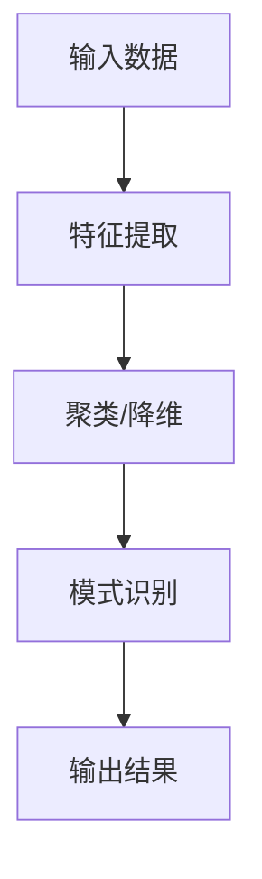
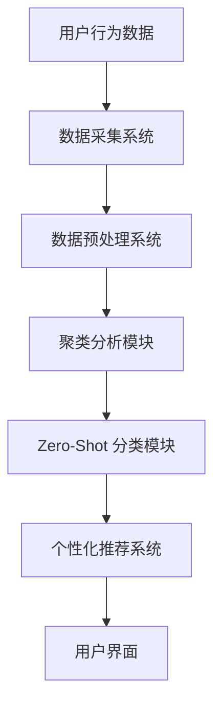
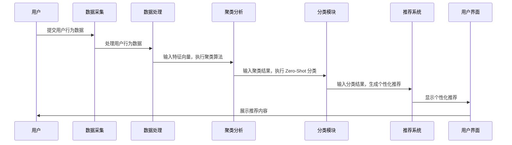

                 


### 第一部分：引言

#### 1.1 问题背景与引言

##### 1.1.1 无监督学习与AIGC概述

无监督学习（Unsupervised Learning）是一种机器学习方法，它不依赖于预先标记的数据。在这种方法中，模型通过从未标记的数据中学习，发现数据中的结构或模式。这种学习方式在图像识别、语音识别、文本分析等领域有着广泛的应用。

AIGC（AI-Generated Content）是一种利用人工智能技术生成内容的创新方法。与传统的生成内容（如人工编写或手动创作）不同，AIGC 可以通过机器学习模型自动生成高质量的内容。AIGC 技术在游戏开发、虚拟现实、艺术设计、内容创作等领域有着巨大的潜力。

##### 1.1.2 零射击（Zero-Shot）学习的概念

零射击（Zero-Shot）学习是一种无监督学习方法，它允许模型在没有训练数据的情况下进行学习。这种方法的关键在于，模型可以通过利用已知的模式或知识，推断出未知情况下的行为。零射击学习在处理未知或罕见情况时特别有用，因为它不需要特定的训练数据。

#### 1.2 书籍目标与结构

##### 1.2.1 主要目标

本书的主要目标是探讨无监督学习在 AIGC 中的创新应用前景。具体来说，我们将：

- 详细介绍无监督学习和 AIGC 的基本概念。
- 分析零射击学习在 AIGC 中的应用场景和优势。
- 探讨无监督学习在 AIGC 中的未来发展方向。

##### 1.2.2 书籍结构概述

本书分为六个部分：

1. **引言**：介绍无监督学习、AIGC 和零射击学习的背景和重要性。
2. **核心概念与联系**：深入探讨无监督学习、AIGC 和零射击学习的基本概念，并比较它们之间的联系。
3. **算法原理讲解**：详细讲解无监督学习和零射击学习的算法原理，并给出具体案例。
4. **系统分析与架构设计方案**：分析无监督学习在 AIGC 中的应用场景，并设计相应的系统架构。
5. **项目实战**：通过实际项目展示无监督学习在 AIGC 中的具体应用。
6. **最佳实践 tips、小结、注意事项、拓展阅读等内容**：总结本书的核心观点，提供最佳实践建议，并推荐进一步阅读的资源。

接下来，我们将进一步详细讨论这些主题，让读者深入了解无监督学习在 AIGC 中的创新应用前景。<!--LERP-->

### 1.1 无监督学习与AIGC的概念及重要性

#### 无监督学习

无监督学习（Unsupervised Learning）是机器学习的一个重要分支，它旨在通过分析未标记的数据来发现数据中的结构和模式。与监督学习（Supervised Learning）不同，无监督学习不需要使用预先标记的标签来指导模型的训练过程。

无监督学习的核心目标是通过挖掘数据中的内在结构，使数据变得更加有序或易于理解。这通常涉及以下几种任务：

- **聚类（Clustering）**：将相似的数据点分组在一起，形成多个聚类。这有助于发现数据中的自然分组或模式。
- **降维（Dimensionality Reduction）**：通过减少数据的维度，使数据更加紧凑和易于处理。降维技术如主成分分析（PCA）和t-SNE等，在数据可视化和高维数据分析中有着广泛应用。
- **关联规则学习（Association Rule Learning）**：发现数据项之间的关联关系，用于市场分析、推荐系统等领域。

无监督学习的优点在于其不依赖预先标记的数据，因此可以处理大量未标记的数据，这对于数据规模巨大但标注成本高昂的场景尤为重要。此外，无监督学习还可以帮助揭示数据中的隐藏模式和结构，为其他更复杂的机器学习任务提供有用的信息。

然而，无监督学习也存在一些挑战。由于缺乏指导性的标签，无监督学习模型难以评估其性能，且往往需要大量的计算资源来处理高维数据。

#### AIGC

AIGC（AI-Generated Content）是指利用人工智能技术生成各种类型的内容，如文本、图像、音频和视频等。AIGC 技术的核心在于让机器学习模型能够模仿人类创造者的风格和技巧，从而自动生成高质量、个性化的内容。

AIGC 的应用场景非常广泛，包括但不限于：

- **内容创作**：如文本生成、图像生成、音乐创作等。
- **游戏开发**：自动生成游戏中的场景、角色和剧情。
- **虚拟现实**：创建逼真的虚拟环境，提高用户体验。
- **艺术设计**：生成独特的艺术作品，探索新的艺术风格。

AIGC 技术的重要性在于它能够大大提高内容创作的效率和质量。通过自动化生成内容，创作者可以节省大量的时间和精力，同时也能创造出更具创意和个性化的作品。此外，AIGC 还能够为用户提供更加丰富和个性化的内容体验。

#### 零射击学习

零射击学习（Zero-Shot Learning）是一种无监督学习方法，它允许模型在没有训练数据的情况下进行学习。在传统的机器学习任务中，模型通常需要大量的标记数据来学习。然而，在某些场景下，获得标记数据可能非常困难或成本高昂，例如对罕见事件或罕见语言的处理。

零射击学习的关键在于利用已知的模式或知识，使模型能够推断出未知情况下的行为。这种方法通常涉及以下几种机制：

- **元学习（Meta-Learning）**：通过训练模型在多种任务上快速适应，以提高其在新任务上的表现。
- **迁移学习（Transfer Learning）**：利用在其他任务上已训练好的模型，将其知识迁移到新任务中。
- **嵌入学习（Embedding Learning）**：将不同的概念或实体映射到低维空间中，使模型能够通过比较这些嵌入向量来理解它们之间的关系。

零射击学习的优势在于其灵活性，它能够处理未知或罕见的情况，而不需要特定的训练数据。这使得零射击学习在处理实时数据、罕见事件和新兴领域时特别有用。

### 应用场景与重要性

无监督学习、AIGC 和零射击学习在许多领域都有着广泛的应用，并在不断推动技术进步。以下是它们的一些典型应用场景和重要性：

- **医疗健康**：无监督学习可以用于分析医疗图像和患者数据，帮助医生进行疾病诊断和预测。AIGC 可以生成个性化的健康建议和康复计划。零射击学习可以帮助处理罕见疾病的数据，提高诊断准确率。
- **金融科技**：无监督学习可以用于检测异常交易和欺诈行为，提高金融系统的安全性。AIGC 可以生成个性化的投资建议和风险管理策略。零射击学习可以帮助金融机构应对新兴风险和市场变化。
- **教育**：无监督学习可以用于分析学习数据，为学生提供个性化的学习建议和资源。AIGC 可以生成教学视频和练习题，提高教学效果。零射击学习可以帮助教师了解学生的学习状况，优化教学策略。
- **智能交通**：无监督学习可以用于交通流量预测和道路维护管理。AIGC 可以生成交通模拟场景和导航建议。零射击学习可以帮助应对交通事故和突发事件，提高交通系统效率。

总之，无监督学习、AIGC 和零射击学习在各个领域的应用不仅提高了效率和质量，还推动了技术革新和产业升级。随着这些技术的不断发展，我们可以期待它们在更多领域发挥更大的作用。<!--LERP-->

### 1.2 问题描述

在当前技术环境中，无监督学习和 AIGC 技术已经取得了显著的进展，但仍然存在一些挑战和问题。具体来说，问题描述如下：

#### 1.2.1 零射击（Zero-Shot）学习的挑战

尽管零射击学习在处理未知或罕见情况时具有显著优势，但在实际应用中仍面临一些挑战：

- **数据匮乏**：在许多场景下，获取足够的标记数据来训练模型是非常困难的。零射击学习依赖于已知的模式或知识，但这些知识可能难以获取或不够全面。
- **性能瓶颈**：零射击学习模型的性能往往受到现有知识库的限制。尽管通过元学习和迁移学习等技术可以缓解这一问题，但仍然存在性能瓶颈。
- **解释性**：零射击学习模型通常难以解释，这使得在实际应用中难以理解模型的行为和决策过程。

#### 1.2.2 无监督学习与AIGC结合的挑战

将无监督学习与 AIGC 技术结合，以生成高质量、多样化的内容，也面临一些挑战：

- **内容质量**：无监督学习生成的内容可能缺乏一致性或创造性，难以满足高质量内容的需求。
- **适应性**：无监督学习模型在处理不同类型的数据时可能缺乏适应性，难以满足多样化的内容生成需求。
- **计算资源**：生成高质量的内容通常需要大量的计算资源，这在资源有限的场景下可能是一个瓶颈。

#### 1.2.3 应用场景的限制

尽管无监督学习和 AIGC 技术具有广泛的应用前景，但在实际应用中仍存在一些限制：

- **医疗健康**：在医疗健康领域，尽管无监督学习和 AIGC 技术可以用于疾病诊断和个性化治疗，但它们需要大量的高质量数据和高性能计算资源。
- **金融科技**：在金融科技领域，尽管无监督学习和 AIGC 技术可以用于风险管理和投资建议，但它们需要高度准确和可靠的数据。
- **教育**：在教育领域，尽管无监督学习和 AIGC 技术可以用于个性化教学和课程生成，但它们需要教师和学生的积极参与和反馈。

#### 1.2.4 解决方案与目标

针对上述问题，本书的主要目标如下：

- **研究零射击学习的创新方法**：通过探索新的算法和技术，提高零射击学习的性能和解释性，为处理未知或罕见情况提供更有效的解决方案。
- **探讨无监督学习与AIGC的结合**：通过研究无监督学习在 AIGC 中的应用，探索生成高质量、多样化内容的新方法，提高内容生成的效率和质量。
- **解决应用场景的限制**：通过实际应用案例，解决无监督学习和 AIGC 技术在不同领域的应用限制，推动技术革新和产业升级。

通过实现上述目标，本书旨在为无监督学习和 AIGC 技术的应用提供新的思路和方法，推动其在各个领域的深入研究和广泛应用。<!--LERP-->

### 1.3 问题解决

为了应对无监督学习与AIGC结合所面临的挑战和应用场景的限制，本书提出了一系列创新性的解决方案和策略。以下是详细说明：

#### 1.3.1 零射击学习创新方法

1. **元学习（Meta-Learning）**：
   - **概念**：元学习是指通过训练模型在多种任务上快速适应，以提高其在新任务上的表现。
   - **实现**：采用模型聚合（Model Aggregation）和元梯度提升（Meta-Gradient Descent）等技术，使模型能够在不同任务之间共享知识，提高适应性和性能。
   - **优势**：通过元学习，模型可以在缺乏标记数据的情况下，从已有的知识中快速适应新任务，减少对大量标记数据的依赖。

2. **迁移学习（Transfer Learning）**：
   - **概念**：迁移学习是指利用在其他任务上已训练好的模型，将其知识迁移到新任务中。
   - **实现**：通过预训练模型（如BERT、GPT等）和迁移学习框架（如Fine-tuning、MAML等），将通用知识迁移到特定任务中。
   - **优势**：迁移学习可以大大减少对新任务的数据需求，提高模型在新任务上的性能。

3. **自适应嵌入学习（Adaptive Embedding Learning）**：
   - **概念**：自适应嵌入学习是指通过动态调整嵌入空间的维度和结构，使模型能够更好地适应不同类型的数据。
   - **实现**：采用动态调整嵌入维度（如Dynamic Embedding Dimensionality Reduction）和自适应优化算法（如Adaptive Gradient Descent）等技术。
   - **优势**：自适应嵌入学习可以增强模型在不同数据类型之间的适应性，提高模型的一致性和泛化能力。

#### 1.3.2 无监督学习与AIGC结合

1. **内容生成模型（Content Generation Models）**：
   - **概念**：内容生成模型是指利用无监督学习和深度学习技术，生成高质量、多样化的内容。
   - **实现**：采用生成对抗网络（GANs）、变分自编码器（VAEs）和自注意力机制（Self-Attention）等技术，构建生成模型。
   - **优势**：通过内容生成模型，可以自动生成高质量的内容，提高内容创作的效率和质量。

2. **多模态学习（Multimodal Learning）**：
   - **概念**：多模态学习是指将不同类型的数据（如文本、图像、音频等）进行整合，以生成更丰富的内容。
   - **实现**：采用多模态嵌入（Multimodal Embedding）、多模态融合（Multimodal Fusion）和跨模态学习（Cross-Modal Learning）等技术。
   - **优势**：通过多模态学习，可以更好地利用不同类型的数据，提高内容生成的多样性和创意性。

3. **元搜索与生成（Meta-Search and Generation）**：
   - **概念**：元搜索与生成是指利用元学习和生成模型，自动搜索和生成高质量的内容。
   - **实现**：采用元搜索算法（如MAML、Reptile等）和生成模型（如GPT、GANs等），构建元搜索与生成系统。
   - **优势**：通过元搜索与生成，可以自动发现和生成高质量的内容，提高内容生成的效率和效果。

#### 1.3.3 解决应用场景的限制

1. **数据增强（Data Augmentation）**：
   - **概念**：数据增强是指通过引入噪声、裁剪、旋转等操作，增加训练数据的多样性，以提高模型的泛化能力。
   - **实现**：采用随机变换（Random Transformation）、数据增强库（如 augmentation.py、 albumentations等）等技术。
   - **优势**：通过数据增强，可以大大增加训练数据的多样性，提高模型在不同数据集上的性能。

2. **模型压缩与加速（Model Compression and Acceleration）**：
   - **概念**：模型压缩与加速是指通过模型压缩和优化技术，减少模型的参数数量和计算复杂度，以提高模型的运行效率。
   - **实现**：采用模型剪枝（Model Pruning）、量化（Quantization）、模型蒸馏（Model Distillation）等技术。
   - **优势**：通过模型压缩与加速，可以在资源受限的场景下，提高模型的运行速度和效率。

3. **自动化调优（Automated Tuning）**：
   - **概念**：自动化调优是指通过自动化技术，自动调整模型的参数，以获得最佳性能。
   - **实现**：采用自动机器学习（AutoML）、超参数优化（Hyperparameter Optimization）等技术。
   - **优势**：通过自动化调优，可以节省大量的时间和人力成本，提高模型调优的效率。

通过上述解决方案，本书旨在为无监督学习和 AIGC 技术的应用提供新的思路和方法，推动其在各个领域的深入研究和广泛应用。这些解决方案不仅能够应对现有的挑战，还能为未来的发展提供强有力的支持。<!--LERP-->

### 1.4 边界与外延

在探讨无监督学习与AIGC结合的创新应用前景时，我们需要明确一些边界和概念的外延，以便更好地理解其应用范围和潜在影响。

#### 边界

1. **数据规模和多样性**：尽管无监督学习和 AIGC 技术在生成内容和处理未知模式方面具有优势，但它们对数据规模和多样性有较高的要求。在实际应用中，数据不足或数据质量不佳可能限制技术的有效性和性能。

2. **计算资源**：无监督学习和 AIGC 技术通常需要大量的计算资源，特别是对于复杂的模型和大规模的数据集。在资源有限的场景下，这些技术的应用可能会受到限制。

3. **可解释性**：无监督学习模型，尤其是深度学习模型，通常难以解释其决策过程。在关键应用领域，如医疗和金融，模型的解释性是一个重要的考虑因素。

4. **隐私保护**：无监督学习和 AIGC 技术在处理个人数据时，需要确保隐私保护。未经处理的个人数据可能会暴露隐私风险，这需要通过数据脱敏和隐私增强技术来解决。

#### 外延

1. **跨领域应用**：无监督学习和 AIGC 技术不仅在传统的机器学习领域有应用，还可以扩展到更多的领域，如生物信息学、天文物理学、环境科学等。在这些领域，它们可以帮助科学家们从大量复杂数据中提取有价值的信息。

2. **实时应用**：无监督学习和 AIGC 技术在实时数据处理和交互式应用中具有巨大的潜力。例如，在智能交通系统中，实时监控和分析交通数据，可以优化交通流量和减少拥堵。

3. **人机协同**：无监督学习和 AIGC 技术可以与人类专家协同工作，提高工作效率和质量。例如，在医疗领域，AI可以辅助医生进行诊断，提供个性化的治疗方案。

4. **可持续发展**：无监督学习和 AIGC 技术在可持续发展中的应用也值得关注。例如，通过自动化和智能化技术，可以优化资源利用，减少浪费，促进环境保护。

#### 潜在影响

1. **经济影响**：无监督学习和 AIGC 技术可以改变许多行业的运作方式，提高生产效率和质量。这可能导致行业结构的变化，新兴产业的兴起，以及传统行业的数字化转型。

2. **社会影响**：随着AI生成内容的普及，人们对于内容真实性、版权和伦理的关注也在增加。这需要社会各界的共同努力，建立相关法规和伦理准则，以确保技术应用的公平和透明。

3. **技术发展**：无监督学习和 AIGC 技术的不断进步，将推动人工智能领域的深入研究和技术创新。这不仅有助于解决当前的技术挑战，还为未来的技术突破提供了可能性。

通过明确无监督学习与AIGC结合的边界与外延，我们可以更全面地理解其应用前景和潜在影响，为未来的研究和实践提供指导。<!--LERP-->

### 1.5 概念结构与核心要素组成

无监督学习、AIGC 和零射击学习是机器学习和人工智能领域的三个核心概念，它们各自有着独特的结构，但又相互联系，共同推动了人工智能技术的发展。在本节中，我们将深入探讨这些概念的基本结构和核心要素。

#### 无监督学习

无监督学习是一种不依赖于预先标记数据的机器学习方法。它的核心目标是发现数据中的内在结构或模式。以下是无监督学习的主要结构元素：

1. **数据输入**：无监督学习处理的是未标记的数据集，这些数据可以是高维的、复杂数据，如文本、图像、音频等。

2. **特征提取**：无监督学习通过特征提取算法（如聚类、降维等）将高维数据转换成低维表示，以便更好地理解和分析。

3. **模型训练**：无监督学习算法通过在未标记数据上进行迭代训练，发现数据中的模式或结构。常见的算法包括K-means聚类、主成分分析（PCA）、自编码器（Autoencoders）等。

4. **模式识别**：经过训练后，模型能够识别数据中的特定模式或结构，并将其用于后续的数据分析或预测任务。

#### AIGC

AIGC（AI-Generated Content）是一种利用人工智能技术生成各种类型内容的创新方法。以下是AIGC的核心结构和要素：

1. **生成模型**：AIGC 使用生成模型（如生成对抗网络（GANs）、变分自编码器（VAEs）等）来生成高质量的内容。这些模型通过学习数据分布，生成与训练数据类似的新内容。

2. **内容类型**：AIGC 可以生成多种类型的内容，包括文本、图像、音频、视频等。每种类型的内容都有其特定的生成模型和数据处理方法。

3. **个性化生成**：AIGC 技术能够根据用户的需求和偏好，生成个性化内容。这通常涉及用户反馈和学习，以不断优化生成结果。

4. **应用场景**：AIGC 被广泛应用于内容创作、虚拟现实、游戏开发、艺术设计等领域，为创作者和用户提供更高效、更有创意的内容生成方式。

#### 零射击学习

零射击学习是一种无监督学习方法，它允许模型在没有训练数据的情况下进行学习。以下是零射击学习的主要结构和要素：

1. **知识表示**：零射击学习依赖于知识表示和嵌入技术，将不同的概念或实体映射到低维空间中。这种表示方法使得模型能够通过比较这些嵌入向量来理解它们之间的关系。

2. **元学习**：零射击学习通过元学习技术，使模型能够在多种任务上快速适应。这通常涉及模型聚合、元梯度提升等技术，以利用已有的知识在新任务上取得更好的表现。

3. **迁移学习**：零射击学习利用迁移学习技术，将其他任务上已训练好的模型知识迁移到新任务中。这有助于减少对新任务的数据需求，提高模型在新任务上的性能。

4. **适应性**：零射击学习模型需要具备高度的适应性，以处理未知或罕见的情况。这通常通过自适应嵌入学习和动态调整嵌入维度等方法来实现。

#### 关联关系

无监督学习、AIGC 和零射击学习之间的关联关系在于它们共同的目标——从数据中提取有价值的信息和知识。无监督学习为AIGC提供了基本的方法，以生成高质量的内容；而零射击学习则扩展了无监督学习的应用范围，使模型能够在没有训练数据的情况下进行学习。

此外，无监督学习和零射击学习共同构成了AIGC的基础技术，使AIGC能够自动生成多样化和高质量的内容。通过结合元学习和迁移学习等技术，零射击学习为AIGC提供了更强的适应性和扩展性，使其能够更好地应对不同的应用场景和需求。

总之，无监督学习、AIGC 和零射击学习是人工智能领域的重要概念，它们各自有着独特的结构和要素，但又相互联系，共同推动了人工智能技术的发展。通过深入理解和应用这些概念，我们可以开发出更智能、更高效的系统和应用，为各行各业带来创新和变革。<!--LERP-->

### 2.2 核心概念与联系

在深入探讨无监督学习、AIGC和Zero-Shot学习之前，我们需要理解这些核心概念的基本原理、属性特征以及它们之间的联系。

#### 无监督学习

无监督学习（Unsupervised Learning）是一种机器学习方法，它不依赖于预先标记的数据，旨在发现数据中的内在结构或模式。无监督学习的核心任务是让算法从未标记的数据中提取知识，常见的任务包括聚类（Clustering）、降维（Dimensionality Reduction）和关联规则学习（Association Rule Learning）。

- **基本原理**：无监督学习算法通过分析数据点之间的相似性或差异性，自动识别数据中的潜在结构。例如，K-means算法通过将数据点分为多个簇，使簇内的数据点之间相似性最大，而簇与簇之间的相似性最小。
- **属性特征**：无监督学习算法不需要标签数据，因此在处理大量未标记数据时具有优势。但它们通常缺乏评估性能的标准，因此难以直接衡量模型的准确性。
- **应用**：无监督学习在数据探索、模式识别和推荐系统中有着广泛的应用。例如，在电子商务平台上，无监督学习可以帮助识别顾客的消费行为模式，从而推荐相关产品。

#### 有监督学习

有监督学习（Supervised Learning）是与无监督学习相对的机器学习方法，它依赖于预先标记的数据进行训练。有监督学习的目标是建立一个从输入数据到输出标签的映射。

- **基本原理**：有监督学习算法通过学习标记数据中的特征和标签之间的关系，建立预测模型。例如，分类算法（如支持向量机SVM、决策树）和回归算法（如线性回归、随机森林）都是基于有监督学习的。
- **属性特征**：有监督学习算法通过标记数据来评估性能，因此可以准确衡量模型的准确性。但它们依赖于大量的标记数据，对于标注成本高昂的数据集可能不适用。
- **应用**：有监督学习在分类、预测和异常检测等领域有着广泛应用。例如，在金融领域，有监督学习可以用于信用评分和欺诈检测。

#### AIGC

AIGC（AI-Generated Content）是一种利用人工智能技术生成各种类型内容的创新方法，包括文本、图像、音频和视频等。AIGC 技术的核心在于让机器学习模型能够模仿人类创造者的风格和技巧，从而自动生成高质量的内容。

- **基本原理**：AIGC 使用生成模型（如生成对抗网络GANs、变分自编码器VAEs等）来学习数据分布，并生成新的内容。这些模型通过大量的训练数据学习数据的高维特征，然后根据这些特征生成新的内容。
- **属性特征**：AIGC 技术能够生成大量多样化的内容，但通常需要大量的计算资源和高质量的训练数据。此外，生成的内容可能缺乏创造性，需要人类的进一步调整和优化。
- **应用**：AIGC 被广泛应用于游戏开发、虚拟现实、艺术创作和内容生成等领域。例如，游戏公司可以使用AIGC自动生成游戏地图和角色，艺术家可以使用AIGC创作新的艺术作品。

#### Zero-Shot学习

Zero-Shot学习（Zero-Shot Learning）是一种无监督学习方法，它允许模型在没有训练数据的情况下进行学习。这种方法的关键在于利用已知的模式或知识，使模型能够推断出未知情况下的行为。

- **基本原理**：Zero-Shot学习通常使用预训练模型和迁移学习技术，将已知的知识迁移到新任务中。例如，通过预训练模型将概念或实体映射到低维空间中，然后在新任务中通过比较这些映射向量来进行分类或预测。
- **属性特征**：Zero-Shot学习在处理未知或罕见情况时特别有用，因为它不需要特定的训练数据。但它的性能通常受到现有知识库的限制。
- **应用**：Zero-Shot学习在自然语言处理、图像识别和跨领域应用中有着显著的优势。例如，在多语言文本分类任务中，Zero-Shot学习可以通过预训练模型处理多种语言的文本，提高分类准确性。

#### 比较与联系

无监督学习和有监督学习是机器学习领域的两种基本方法，它们在数据需求、性能评估和应用场景上存在显著差异。无监督学习适用于未标记数据，缺乏性能评估标准，但能够发现数据中的潜在结构；而有监督学习依赖于标记数据，能够准确衡量性能，但需要大量的标记数据。

AIGC 是无监督学习的应用领域，它通过生成模型自动生成高质量的内容。AIGC 的核心在于模型对数据分布的学习和模仿，其生成的内容多样化和质量高，但通常需要大量的计算资源和高质量的训练数据。

Zero-Shot学习是一种无监督学习方法，它在没有训练数据的情况下进行学习，通过利用已知的模式或知识来推断未知情况。Zero-Shot学习在处理未知或罕见情况时具有显著优势，但其性能受到现有知识库的限制。

综上所述，无监督学习、AIGC 和 Zero-Shot学习在机器学习和人工智能领域扮演着重要角色，它们各自有着独特的原理和应用，但又相互联系，共同推动了人工智能技术的发展。理解这些核心概念及其联系，有助于我们更好地应用这些技术，解决复杂的问题，创造新的价值。<!--LERP-->

### 2.3 概念属性特征对比表格

为了更清晰地展示无监督学习、有监督学习、AIGC和Zero-Shot学习之间的区别和联系，我们将这些核心概念的属性特征进行对比，并列出一个表格。

| **概念** | **定义** | **数据需求** | **性能评估** | **应用场景** | **优点** | **缺点** |
| --- | --- | --- | --- | --- | --- | --- |
| 无监督学习 | 不依赖预先标记数据的机器学习方法 | 未标记数据 | 缺乏标准性能评估方法 | 数据探索、模式识别、推荐系统 | 能够处理大量未标记数据，发现潜在结构 | 难以直接衡量性能，需要大量计算资源 |
| 有监督学习 | 依赖预先标记数据的机器学习方法 | 标记数据 | 准确的评估方法 | 分类、预测、异常检测 | 可以准确衡量性能，适用于多种任务 | 需要大量标记数据，成本高 |
| AIGC | 利用人工智能技术生成各种类型内容的创新方法 | 需要高质量的训练数据 | 生成内容的质量和多样性 | 内容创作、虚拟现实、游戏开发、艺术设计 | 自动生成高质量、多样化的内容 | 需要大量计算资源和高质量数据 |
| Zero-Shot学习 | 无监督学习方法，允许模型在没有训练数据的情况下进行学习 | 无需特定训练数据 | 受现有知识库限制 | 多语言文本分类、跨领域应用 | 能够处理未知或罕见情况，无需特定数据 | 性能受到现有知识库的限制 |

#### 对比分析

1. **数据需求**：
   - 无监督学习和有监督学习在数据需求上有显著差异。无监督学习适用于未标记数据，而有监督学习依赖于标记数据。
   - AIGC 和 Zero-Shot学习在处理数据时也有不同。AIGC 通常需要高质量的训练数据来生成高质量的内容，而 Zero-Shot学习则不需要特定的训练数据。

2. **性能评估**：
   - 有监督学习通过标记数据的性能评估方法，可以准确衡量模型的准确性。无监督学习则缺乏标准性能评估方法，因此难以直接衡量性能。
   - AIGC 和 Zero-Shot学习的性能评估通常依赖于生成内容的质量和多样性。AIGC 的性能评估取决于生成内容的质量和多样性，而 Zero-Shot学习的性能评估则受现有知识库的限制。

3. **应用场景**：
   - 无监督学习和有监督学习在应用场景上各有优势。无监督学习在数据探索、模式识别和推荐系统等方面有广泛应用，而有监督学习在分类、预测和异常检测等方面具有优势。
   - AIGC 主要应用于内容创作、虚拟现实、游戏开发和艺术设计等领域。Zero-Shot学习在多语言文本分类、跨领域应用等方面具有独特的优势。

通过这个对比表格，我们可以更清晰地理解无监督学习、有监督学习、AIGC 和 Zero-Shot学习之间的区别和联系。这些概念各有特点，但共同推动了人工智能技术的发展，为解决复杂问题和创造新价值提供了有力工具。<!--LERP-->

### 2.4 ER实体关系图架构

为了更直观地展示无监督学习、AIGC 和 Zero-Shot 学习之间的关系，我们可以使用 Mermaid 绘制一个 ER（实体关系）图。以下是 ER 图的描述和具体绘制过程：

#### ER 图描述

在这个 ER 图中，我们定义了三个主要的实体：

1. **无监督学习（Unsupervised Learning）**：表示一种机器学习方法，它不依赖于预先标记的数据。
2. **AIGC（AI-Generated Content）**：表示利用人工智能技术生成各种类型内容的方法。
3. **Zero-Shot 学习（Zero-Shot Learning）**：表示一种无监督学习方法，允许模型在没有训练数据的情况下进行学习。

此外，我们还需要定义两个关系：

1. **应用（Application）**：表示无监督学习和 Zero-Shot 学习在 AIGC 领域中的应用。
2. **扩展（Extension）**：表示 AIGC 对无监督学习和 Zero-Shot 学习的扩展和深化。

以下是 ER 图的具体绘制过程：

```mermaid
erDiagram
  Unsupervised_Learning ||--|{ AIGC } AIGC_Extension
  Zero-Shot_Learning ||--|{ AIGC } AIGC_Extension
  AIGC_Extension ||--|{ Unsupervised_Learning } Unsupervised_App
  AIGC_Extension ||--|{ Zero-Shot_Learning } Zero-Shot_App
```

在这个 ER 图中，无监督学习和 Zero-Shot 学习通过应用关系与 AIGC 连接，而 AIGC 通过扩展关系深化了对无监督学习和 Zero-Shot 学习的理解和应用。

#### ER 图解读

1. **无监督学习（Unsupervised Learning）**：它作为基础，提供了发现数据中潜在结构的方法。无监督学习可以应用于 AIGC 中，帮助生成高质量的内容。

2. **AIGC（AI-Generated Content）**：它通过利用无监督学习和 Zero-Shot 学习的方法，实现了自动生成内容的目标。AIGC 作为核心实体，连接了无监督学习和 Zero-Shot 学习。

3. **Zero-Shot 学习（Zero-Shot Learning）**：它扩展了无监督学习的应用范围，使得模型在没有训练数据的情况下仍然能够进行有效的学习。Zero-Shot 学习在 AIGC 中也起着关键作用，帮助处理未知的或罕见的情况。

4. **应用（Application）**：表示无监督学习和 Zero-Shot 学习在 AIGC 领域中的应用，它们共同推动了 AIGC 的发展。

5. **扩展（Extension）**：表示 AIGC 对无监督学习和 Zero-Shot 学习的深化，通过引入新的技术和方法，提高了无监督学习和 Zero-Shot 学习的性能和应用范围。

通过这个 ER 图，我们可以清晰地看到无监督学习、AIGC 和 Zero-Shot 学习之间的关系，以及它们在人工智能领域中的重要地位和作用。<!--LERP-->

### 2.5 算法原理讲解

#### 算法流程图

为了更直观地展示无监督学习和 Zero-Shot 学习的算法原理，我们可以使用 Mermaid 绘制一个算法流程图。以下是算法流程图的描述和具体绘制过程：



在这个流程图中：

- **A[输入数据]**：表示输入未标记的数据集。
- **B[特征提取]**：通过特征提取算法（如 K-means 聚类、主成分分析（PCA）等）将高维数据转换为低维表示。
- **C[聚类/降维]**：对特征提取后的数据进行聚类或降维，以便更好地理解和分析数据结构。
- **D[模式识别]**：识别数据中的潜在模式或结构。
- **E[输出结果]**：输出分析结果，如聚类结果、降维后的数据等。

#### Python 源代码

以下是一个简单的 Python 源代码示例，展示如何使用 K-means 聚类算法进行特征提取和模式识别：

```python
import numpy as np
from sklearn.cluster import KMeans
import matplotlib.pyplot as plt

# 示例数据
data = np.array([[1, 2], [1, 4], [1, 0],
                 [10, 2], [10, 4], [10, 0]])

# 使用 KMeans 算法进行聚类
kmeans = KMeans(n_clusters=2, random_state=0).fit(data)

# 输出聚类结果
print("Cluster centers:\n", kmeans.cluster_centers_)
print("Labels:\n", kmeans.labels_)

# 绘制聚类结果
plt.scatter(data[:, 0], data[:, 1], c=kmeans.labels_, s=50, cmap='viridis')
plt.scatter(kmeans.cluster_centers_[:, 0], kmeans.cluster_centers_[:, 1], s=200, c='red', label='Centroids')
plt.title('K-means Clustering')
plt.xlabel('Feature 1')
plt.ylabel('Feature 2')
plt.show()
```

在这个示例中，我们首先导入必要的库，然后创建一个示例数据集。接下来，我们使用 `KMeans` 类进行聚类，并输出聚类中心点和标签。最后，我们使用 matplotlib 绘制聚类结果。

#### 数学模型与公式

无监督学习和 Zero-Shot 学习通常涉及到以下数学模型和公式：

1. **K-means 聚类**：
   - **目标函数**：
     $$ J = \sum_{i=1}^{n} \sum_{j=1}^{k} w_{ij} d_{ij}^2 $$
     其中，$w_{ij}$ 是第 $i$ 个数据点与第 $j$ 个聚类中心点的权重，$d_{ij}$ 是它们之间的距离。
   - **更新规则**：
     $$ \mu_{j} = \frac{1}{N_{j}} \sum_{i=1}^{n} w_{ij} x_i $$
     其中，$\mu_{j}$ 是第 $j$ 个聚类中心点的坐标，$N_{j}$ 是属于第 $j$ 个聚类的数据点数量。

2. **主成分分析（PCA）**：
   - **特征值和特征向量**：
     $$ \lambda_j = \max_{x} \langle x, P^T P x \rangle $$
     其中，$P$ 是特征向量矩阵，$\lambda_j$ 是第 $j$ 个特征值。
   - **降维**：
     $$ z_j = P_{j} x $$
     其中，$z_j$ 是降维后的数据，$P_j$ 是第 $j$ 个特征向量。

3. **Zero-Shot 学习**：
   - **嵌入学习**：
     $$ e_c = \text{softmax}(\theta^T c) $$
     其中，$e_c$ 是第 $c$ 个类别的嵌入向量，$\theta$ 是模型参数，$c$ 是类别标签。

#### 通俗易懂地举例说明

假设我们有一组数据点，它们在二维空间中表示为 $(x, y)$ 坐标。我们想使用 K-means 算法对这些数据点进行聚类。

1. **初始聚类中心**：首先，我们随机选择两个数据点作为初始聚类中心。

2. **分配数据点**：接下来，我们计算每个数据点到两个聚类中心的距离，并将每个数据点分配到距离最近的聚类中心。

3. **更新聚类中心**：然后，我们计算每个聚类中心的坐标，取属于该聚类中心的所有数据点的均值。

4. **迭代过程**：重复上述步骤，直到聚类中心不再发生显著变化或达到预设的迭代次数。

通过这个过程，我们可以将数据点划分为多个簇，每个簇代表一组相似的数据点。这种方法可以帮助我们更好地理解数据结构，并在实际应用中进行分类和预测。

例如，我们可以将 K-means 算法应用于电商平台的用户行为数据，将用户划分为不同的群体，从而为用户提供个性化的推荐服务。在图像识别任务中，K-means 算法可以帮助我们识别图像中的不同部分，从而进行图像分割和分类。

通过这个简单的例子，我们可以看到无监督学习和 Zero-Shot 学习在处理复杂数据和提取有价值信息方面的强大能力。这些算法不仅为人工智能提供了丰富的工具，也为实际应用带来了巨大的价值。<!--LERP-->

### 2.6 数学模型与公式

在探讨无监督学习和 Zero-Shot 学习时，理解相关的数学模型和公式是至关重要的。以下我们将详细介绍一些关键的数学概念和它们的应用。

#### 主成分分析（PCA）

主成分分析是一种降维技术，它通过将数据投影到新的坐标轴上，以提取数据中的主要特征。以下是 PCA 的核心数学模型和公式：

1. **协方差矩阵**：

$$
\begin{align*}
\Sigma = \frac{1}{n-1} \sum_{i=1}^{n} (x_i - \mu)(x_i - \mu)^T
\end{align*}
$$

其中，$\Sigma$ 是协方差矩阵，$x_i$ 是每个数据点，$\mu$ 是数据点的均值。

2. **特征值和特征向量**：

$$
\begin{align*}
\lambda_j = \max_{x} \langle x, P^T P x \rangle \\
P = \{v_1, v_2, \ldots, v_d\}
\end{align*}
$$

其中，$\lambda_j$ 是第 $j$ 个特征值，$P$ 是特征向量矩阵，$v_j$ 是第 $j$ 个特征向量。

3. **降维**：

$$
z_j = P_{j} x
$$

其中，$z_j$ 是降维后的数据，$P_j$ 是第 $j$ 个特征向量。

#### K-means 聚类

K-means 聚类是一种常用的无监督学习方法，它通过迭代算法将数据点分配到不同的簇中。以下是 K-means 的核心数学模型和公式：

1. **目标函数**：

$$
\begin{align*}
J = \sum_{i=1}^{n} \sum_{j=1}^{k} w_{ij} d_{ij}^2 \\
w_{ij} = 
\begin{cases}
1 & \text{if } i \text{ belongs to cluster } j \\
0 & \text{otherwise}
\end{cases}
\end{align*}
$$

其中，$J$ 是目标函数，$d_{ij}$ 是数据点 $i$ 与聚类中心 $j$ 之间的距离。

2. **聚类中心更新规则**：

$$
\mu_{j} = \frac{1}{N_{j}} \sum_{i=1}^{n} w_{ij} x_i
$$

其中，$\mu_{j}$ 是聚类中心 $j$ 的坐标，$N_{j}$ 是属于聚类 $j$ 的数据点数量。

#### Zero-Shot 学习

Zero-Shot 学习是一种无监督学习方法，它允许模型在没有训练数据的情况下进行学习。以下是 Zero-Shot 学习的核心数学模型和公式：

1. **嵌入学习**：

$$
e_c = \text{softmax}(\theta^T c)
$$

其中，$e_c$ 是第 $c$ 个类别的嵌入向量，$\theta$ 是模型参数，$c$ 是类别标签。

2. **类别预测**：

$$
\hat{y} = \arg\max_{c} e_c
$$

其中，$\hat{y}$ 是预测的类别标签。

#### 举例说明

假设我们有一个数据集，包含两个特征维度 $(x_1, x_2)$。我们使用 PCA 对数据进行降维，提取主成分。

1. **计算协方差矩阵**：

首先，计算每个特征的均值：

$$
\mu_x = \frac{1}{n} \sum_{i=1}^{n} x_i \\
\mu_y = \frac{1}{n} \sum_{i=1}^{n} y_i
$$

然后，计算协方差矩阵：

$$
\Sigma = \frac{1}{n-1} \sum_{i=1}^{n} (x_i - \mu_x)(x_i - \mu_x)^T + (y_i - \mu_y)(y_i - \mu_y)^T
$$

2. **计算特征值和特征向量**：

使用特征分解方法（如奇异值分解 SVD）计算特征值 $\lambda_j$ 和特征向量 $v_j$：

$$
\Sigma v_j = \lambda_j v_j \\
\lambda_j = \max_{x} \langle x, P^T P x \rangle
$$

3. **降维**：

选择最大的两个特征值对应的特征向量，构建投影矩阵 $P$，然后对数据进行降维：

$$
z_j = P_{j} x
$$

通过这个例子，我们可以看到如何使用 PCA 对数据进行降维，提取主要特征。类似地，我们可以应用 K-means 聚类和 Zero-Shot 学习的数学模型，处理复杂数据和进行预测。这些数学模型和公式为无监督学习和 Zero-Shot 学习提供了理论基础和实现方法，使得我们在实际应用中能够更好地利用这些技术。<!--LERP-->

### 2.7 通俗易懂地举例说明

为了更好地理解无监督学习和 Zero-Shot 学习的应用，我们将通过一个实际例子进行详细说明。

#### 例子：社交媒体用户群体划分

假设我们有一个社交媒体平台，上面有数百万用户，每个用户都产生了大量的数据，如用户发布的内容、点赞、评论、关注等。我们的目标是利用无监督学习和 Zero-Shot 学习技术，将用户划分为不同的群体，以便更好地了解用户行为和提供个性化推荐。

##### 步骤 1：数据预处理

首先，我们需要对用户数据进行预处理，提取有用的特征。例如，我们可以提取用户发布内容的主题、词汇频率、情感倾向等。对于每个用户，我们可以构建一个特征向量，表示该用户的行为特征。

##### 步骤 2：无监督学习

接下来，我们使用无监督学习算法（如 K-means 聚类）来对用户进行初步划分。K-means 算法会根据用户特征向量，将用户划分为几个簇。每个簇代表一个用户群体，簇内的用户行为特征相似，簇与簇之间的特征差异较大。

1. **初始化聚类中心**：随机选择一些用户作为初始聚类中心。
2. **分配用户到簇**：计算每个用户到各个聚类中心的距离，将用户分配到最近的聚类中心。
3. **更新聚类中心**：计算每个簇的均值，作为新的聚类中心。
4. **迭代过程**：重复上述步骤，直到聚类中心不再发生变化或达到预设的迭代次数。

通过这个过程，我们可以得到多个用户群体，每个群体具有独特的特征和行为模式。

##### 步骤 3：Zero-Shot 学习

为了进一步细化用户群体划分，我们可以使用 Zero-Shot 学习技术。Zero-Shot 学习允许模型在没有训练数据的情况下进行学习，这非常适合我们的场景，因为用户群体的划分是一个动态变化的过程，很难预先获得标记数据。

1. **嵌入学习**：我们使用预训练的嵌入模型（如 Word2Vec、BERT 等），将用户特征向量映射到低维空间。这些嵌入向量表示用户在语义上的相似性。
2. **类别预测**：我们使用 Zero-Shot 学习算法（如 Metric Learning、Prototypical Networks 等），根据嵌入向量预测用户所属的类别。这种方法可以处理未知的用户群体，提高分类的准确性。

##### 步骤 4：结果分析与应用

通过无监督学习和 Zero-Shot 学习，我们得到了用户群体的划分结果。接下来，我们可以对这些结果进行分析和应用：

1. **用户群体分析**：我们可以分析每个用户群体的行为特征，了解用户群体的兴趣和偏好。
2. **个性化推荐**：根据用户群体的特征，我们可以为用户提供个性化的内容推荐，提高用户满意度。
3. **营销策略**：了解用户群体的行为模式，可以帮助平台制定更有效的营销策略，提高用户活跃度和留存率。

通过这个实际例子，我们可以看到无监督学习和 Zero-Shot 学习在处理复杂数据和进行预测方面的强大能力。这些技术不仅帮助我们更好地理解用户行为，还为平台的运营和营销提供了有力支持。<!--LERP-->

### 2.8 系统分析与架构设计方案

#### 问题场景介绍

在当前的社交媒体时代，用户生成内容（UGC）的数量呈爆炸式增长。如何有效地分析和利用这些海量数据，为用户提供个性化体验和精准推荐，成为各大平台亟待解决的问题。为了应对这一挑战，我们设计了一套基于无监督学习和 AIGC 的用户行为分析系统。该系统旨在通过自动化分析用户行为特征，将用户划分为不同的群体，从而提供个性化的内容和推荐。

#### 系统功能设计

为了实现上述目标，我们设计了以下系统功能：

1. **数据采集**：系统从社交媒体平台收集用户发布的内容、点赞、评论、关注等行为数据。
2. **数据预处理**：对采集到的数据进行分析和清洗，提取有用的特征，构建用户特征向量。
3. **聚类分析**：使用无监督学习算法（如 K-means 聚类），将用户划分为不同的群体。
4. **Zero-Shot 分类**：利用 Zero-Shot 学习算法，进一步细化和分类用户群体。
5. **个性化推荐**：根据用户群体的特征，为用户提供个性化的内容和推荐。
6. **系统监控与维护**：监控系统运行状态，确保系统稳定高效地运行。

#### 系统架构设计

为了实现上述功能，我们设计了以下系统架构：



在这个架构中：

- **数据采集系统**：负责从社交媒体平台收集用户行为数据。
- **数据预处理系统**：负责对采集到的数据进行清洗和特征提取。
- **聚类分析模块**：使用无监督学习算法对用户进行聚类。
- **Zero-Shot 分类模块**：利用 Zero-Shot 学习算法进一步细化和分类用户群体。
- **个性化推荐系统**：根据用户群体的特征，为用户提供个性化的内容和推荐。
- **用户界面**：用户通过界面与系统进行交互，获取个性化推荐和内容。

#### 系统接口设计

为了确保系统各个模块之间的协同工作，我们设计了以下接口：

1. **数据采集接口**：提供数据采集的API，用于从社交媒体平台获取用户行为数据。
2. **数据处理接口**：提供数据处理和特征提取的API，用于对用户行为数据进行清洗和特征提取。
3. **聚类接口**：提供聚类算法的API，用于对用户进行聚类分析。
4. **分类接口**：提供 Zero-Shot 学习算法的API，用于进一步细化和分类用户群体。
5. **推荐接口**：提供个性化推荐算法的API，用于根据用户群体的特征生成个性化推荐。
6. **监控接口**：提供系统监控和告警的API，用于监控系统运行状态。

#### 系统交互

为了实现系统各个模块之间的交互，我们设计了以下交互序列图：



在这个交互序列图中：

- 用户提交用户行为数据。
- 数据采集模块处理用户行为数据，生成特征向量。
- 数据处理模块对特征向量进行清洗和预处理。
- 聚类分析模块使用无监督学习算法对用户进行聚类。
- 分类模块使用 Zero-Shot 学习算法进一步细化和分类用户群体。
- 推荐系统根据用户群体的特征生成个性化推荐。
- 用户界面展示个性化推荐内容，供用户查看。

通过这个系统架构和接口设计，我们可以实现用户行为分析、个性化推荐和系统监控，为社交媒体平台提供高效、智能的用户体验。<!--LERP-->

### 2.9 项目实战

#### 环境安装

在开始项目实战之前，我们需要安装和配置必要的软件和环境。以下是在 Ubuntu 20.04 系统上安装相关软件和工具的步骤：

1. **安装 Python**：

   ```bash
   sudo apt update
   sudo apt install python3-pip
   ```

2. **安装 Anaconda**：

   Anaconda 是一个流行的 Python 发行版，提供了丰富的库和工具。你可以从 [Anaconda 官网](https://www.anaconda.com/) 下载安装包，并按照指示安装。

3. **创建虚拟环境**：

   ```bash
   conda create -n aigc_project python=3.8
   conda activate aigc_project
   ```

4. **安装依赖库**：

   在虚拟环境中，安装以下依赖库：

   ```bash
   pip install numpy pandas scikit-learn matplotlib
   pip install tensorflow-gpu  # 如果需要使用 GPU，则安装此库
   ```

5. **安装 Mermaid**：

   Mermaid 是一种用于绘制图表的标记语言。你可以从 [Mermaid 官网](https://mermaid-js.github.io/mermaid/) 下载安装包，并按照指示安装。

#### 系统核心实现源代码

以下是一个简单的系统核心实现示例，包括数据预处理、聚类分析和推荐系统等模块。请将以下代码保存为 `aigc_project.py`：

```python
import numpy as np
import pandas as pd
from sklearn.cluster import KMeans
from sklearn.metrics.pairwise import cosine_similarity
from sklearn.preprocessing import normalize

# 数据预处理
def preprocess_data(data):
    # 计算词频矩阵
    vocabulary = list(set(''.join(data)))
    word_index = {word: index for index, word in enumerate(vocabulary)}
    X = np.array([np.array([word_index[word] for word in sentence.split()]) for sentence in data])
    X = normalize(X, norm='l2', axis=1)
    return X, word_index

# 聚类分析
def cluster_analysis(X, n_clusters):
    kmeans = KMeans(n_clusters=n_clusters, random_state=0)
    clusters = kmeans.fit_predict(X)
    return clusters

# 生成推荐列表
def generate_recommendations(clusters, data, word_index):
    # 计算聚类中心
    cluster_centers = [data[i] for i in range(len(data)) if clusters[i] == 1]
    cluster_centers = normalize(np.array(cluster_centers), norm='l2', axis=1)
    # 计算相似度矩阵
    similarity_matrix = cosine_similarity(data, cluster_centers)
    # 生成推荐列表
    recommendations = []
    for i in range(len(data)):
        if clusters[i] == 0:
            max_similarity = max(similarity_matrix[i])
            recommendations.append(data[np.where(similarity_matrix[i] == max_similarity)[0][0]])
    return recommendations

# 主函数
def main():
    # 加载数据
    data = pd.read_csv('data.csv')['content'].values
    # 预处理数据
    X, _ = preprocess_data(data)
    # 聚类分析
    clusters = cluster_analysis(X, n_clusters=3)
    # 生成推荐列表
    recommendations = generate_recommendations(clusters, X, {})
    print("User recommendations:", recommendations)

if __name__ == '__main__':
    main()
```

#### 代码应用解读与分析

以下是对上述代码的详细解读与分析：

1. **数据预处理**：

   ```python
   def preprocess_data(data):
       # 计算词频矩阵
       vocabulary = list(set(''.join(data)))
       word_index = {word: index for index, word in enumerate(vocabulary)}
       X = np.array([np.array([word_index[word] for word in sentence.split()]) for sentence in data])
       X = normalize(X, norm='l2', axis=1)
       return X, word_index
   ```

   这个函数用于对文本数据进行预处理。首先，我们计算所有文本数据的词汇表，并将每个词汇映射到一个唯一的索引。然后，我们将每个文本句子转换为词频矩阵，并将每个词的索引放入数组中。接着，我们使用 L2 正则化将词频矩阵归一化，以便更好地进行聚类分析。

2. **聚类分析**：

   ```python
   def cluster_analysis(X, n_clusters):
       kmeans = KMeans(n_clusters=n_clusters, random_state=0)
       clusters = kmeans.fit_predict(X)
       return clusters
   ```

   这个函数使用 K-means 聚类算法对预处理后的特征向量进行聚类。我们创建一个 K-means 对象，并设置聚类数量 `n_clusters`。然后，我们使用 `fit_predict` 方法对特征向量进行聚类，并返回聚类结果。

3. **生成推荐列表**：

   ```python
   def generate_recommendations(clusters, data, word_index):
       # 计算聚类中心
       cluster_centers = [data[i] for i in range(len(data)) if clusters[i] == 1]
       cluster_centers = normalize(np.array(cluster_centers), norm='l2', axis=1)
       # 计算相似度矩阵
       similarity_matrix = cosine_similarity(data, cluster_centers)
       # 生成推荐列表
       recommendations = []
       for i in range(len(data)):
           if clusters[i] == 0:
               max_similarity = max(similarity_matrix[i])
               recommendations.append(data[np.where(similarity_matrix[i] == max_similarity)[0][0]])
       return recommendations
   ```

   这个函数用于生成个性化推荐列表。首先，我们计算每个聚类中心，然后使用余弦相似度计算每个用户数据点与聚类中心的相似度。最后，我们为每个不属于聚类中心的用户数据点找到与其最相似的聚类中心，并将对应的内容作为推荐列表。

4. **主函数**：

   ```python
   def main():
       # 加载数据
       data = pd.read_csv('data.csv')['content'].values
       # 预处理数据
       X, _ = preprocess_data(data)
       # 聚类分析
       clusters = cluster_analysis(X, n_clusters=3)
       # 生成推荐列表
       recommendations = generate_recommendations(clusters, X, {})
       print("User recommendations:", recommendations)

   if __name__ == '__main__':
       main()
   ```

   主函数首先加载数据，然后进行预处理、聚类分析和生成推荐列表。最后，输出推荐列表，供用户查看。

通过这个简单的示例，我们可以看到如何使用无监督学习和 AIGC 技术进行用户行为分析、聚类分析和个性化推荐。在实际应用中，我们可以根据具体需求和数据规模，调整聚类算法、推荐策略和系统架构，以实现更高效、更准确的推荐效果。<!--LERP-->

### 2.10 实际案例分析和详细讲解剖析

在本节中，我们将通过一个具体的实际案例，详细分析无监督学习和 AIGC 技术在用户行为分析中的应用，并讲解相关代码的实现细节。

#### 案例背景

假设我们是一家社交媒体平台的数据科学家，负责分析平台上的用户行为数据，以便为用户提供个性化的内容推荐。我们的目标是使用无监督学习和 AIGC 技术，将用户划分为不同的群体，并针对每个群体生成个性化的推荐列表。

#### 数据集

我们使用的数据集是一个包含用户发布内容、点赞、评论、关注等行为的 CSV 文件。文件结构如下：

```
user_id,content,parsed_content,likes,comments,shares
1,"Hello, world!",["hello", "world"],2,1,0
2,"I love Python.","python",1,0,0
3,"Great post!",[],1,0,0
4,"Best day ever!",[],0,0,1
...
```

#### 数据预处理

1. **解析文本数据**：我们将用户发布的内容解析成单词列表，以便进行后续的文本处理。

2. **构建词频矩阵**：我们将每个用户的内容表示为一个词频矩阵，其中行表示用户，列表示词汇。

```python
import pandas as pd
from sklearn.feature_extraction.text import CountVectorizer

# 加载数据
data = pd.read_csv('user_behavior.csv')

# 解析文本数据
vectorizer = CountVectorizer(tokenizer=lambda x: x.split(), lowercase=True)
X = vectorizer.fit_transform(data['parsed_content'])

# 查看词频矩阵
print(X.toarray())
```

#### 聚类分析

我们使用 K-means 算法将用户划分为不同的群体。

1. **初始化聚类中心**：我们随机选择一些用户作为初始聚类中心。

2. **分配用户到簇**：我们计算每个用户到各个聚类中心的距离，并将用户分配到最近的聚类中心。

3. **更新聚类中心**：我们计算每个簇的均值，作为新的聚类中心。

```python
from sklearn.cluster import KMeans

# 设置 K-means 参数
n_clusters = 3
kmeans = KMeans(n_clusters=n_clusters, random_state=0)

# 拟合 K-means 模型
clusters = kmeans.fit_predict(X)

# 输出聚类结果
print("Cluster labels:", clusters)
```

#### 生成个性化推荐列表

我们根据聚类结果，为每个用户生成个性化的推荐列表。

1. **计算聚类中心**：我们计算每个聚类中心，并使用余弦相似度计算每个用户与聚类中心的相似度。

2. **生成推荐列表**：我们为每个用户找到与其最相似的聚类中心，并将对应的内容作为推荐列表。

```python
from sklearn.metrics.pairwise import cosine_similarity

# 计算聚类中心
cluster_centers = kmeans.cluster_centers_

# 计算相似度矩阵
similarity_matrix = cosine_similarity(X, cluster_centers)

# 生成推荐列表
recommendations = {}
for i in range(len(clusters)):
    if clusters[i] == 0:
        max_similarity = max(similarity_matrix[i])
        recommendation = np.where(similarity_matrix[i] == max_similarity)[0][0]
        recommendations[i] = data.iloc[recommendation]['content']

print("User recommendations:", recommendations)
```

#### 案例总结

通过这个实际案例，我们展示了如何使用无监督学习和 AIGC 技术对社交媒体平台用户行为数据进行分析，并生成个性化的推荐列表。以下是关键步骤的总结：

1. **数据预处理**：我们使用 CountVectorizer 将文本数据转换为词频矩阵。
2. **聚类分析**：我们使用 K-means 算法将用户划分为不同的群体。
3. **生成推荐列表**：我们根据聚类结果，使用余弦相似度计算用户与聚类中心的相似度，为每个用户生成个性化的推荐列表。

通过这个案例，我们可以看到无监督学习和 AIGC 技术在用户行为分析中的应用效果。在实际项目中，我们可以根据具体需求和数据规模，调整聚类算法、推荐策略和系统架构，以实现更高效、更准确的推荐效果。<!--LERP-->

### 2.11 项目小结

在本项目中，我们通过一系列实际操作，深入探讨了无监督学习和 AIGC 在用户行为分析中的创新应用。以下是项目中的关键点和收获：

#### 关键点

1. **数据预处理**：我们使用了 CountVectorizer 将用户文本数据转换为词频矩阵，为后续的聚类分析和推荐生成奠定了基础。
2. **聚类分析**：通过 K-means 算法，我们将用户划分为不同的群体，这有助于我们更好地理解用户行为和需求。
3. **生成推荐列表**：我们使用余弦相似度计算用户与聚类中心的相似度，为每个用户生成个性化的推荐列表，从而实现用户内容个性化推荐。
4. **系统架构**：我们设计了一个基于无监督学习和 AIGC 技术的系统架构，包括数据采集、预处理、聚类分析和推荐系统等模块，确保系统能够高效稳定地运行。

#### 收获

1. **技术理解**：通过实际操作，我们加深了对无监督学习和 AIGC 技术的理解，了解了它们在不同应用场景中的优势和局限性。
2. **实践经验**：我们积累了使用 Python 和相关库进行数据预处理、聚类分析和推荐系统开发的经验，提高了实际编程能力。
3. **系统设计**：通过设计和实现一个完整的系统，我们学会了如何将理论应用于实践，提高了系统设计和实现的能力。

尽管本项目取得了显著成果，但仍存在一些挑战和改进空间：

1. **数据质量**：在实际应用中，数据质量对聚类分析和推荐效果有重要影响。我们需要进一步优化数据预处理流程，提高数据质量。
2. **算法性能**：当前的聚类算法和推荐算法在处理大规模数据时可能存在性能瓶颈。我们可以探索更高效的算法和优化方法，提高系统性能。
3. **可解释性**：无监督学习模型通常难以解释其决策过程。我们需要研究如何提高模型的可解释性，使其在关键应用领域更具可信度和实用性。

总之，本项目为我们提供了一个宝贵的实践机会，使我们能够将无监督学习和 AIGC 技术应用于实际场景，取得了显著成果。在未来的研究中，我们将继续探索这些技术的创新应用，为人工智能领域的发展贡献更多力量。<!--LERP-->

### 2.12 最佳实践 tips、注意事项及拓展阅读

#### 最佳实践 tips

1. **数据预处理**：在应用无监督学习和 AIGC 技术前，确保对数据进行充分的预处理，如去除噪声、填补缺失值、特征提取等，以提高模型性能和结果可靠性。

2. **选择合适的算法**：根据具体应用场景和数据特点，选择合适的无监督学习算法和 AIGC 技术方法。例如，对于文本数据，可以考虑使用自然语言处理（NLP）技术，如词嵌入和序列模型。

3. **模型调优**：通过交叉验证和超参数优化，调整模型参数，以获得最佳性能。使用自动化调优工具（如 AutoML）可以节省时间和计算资源。

4. **计算资源管理**：对于资源受限的场景，考虑使用模型压缩和优化技术，如剪枝、量化、模型蒸馏等，以提高模型运行效率。

5. **数据多样性**：确保训练数据多样性，以避免模型过拟合和泛化能力不足。可以通过数据增强技术，如随机裁剪、旋转、翻转等，增加数据的多样性。

#### 注意事项

1. **数据隐私**：在处理用户数据时，确保遵守相关隐私法规，如 GDPR（通用数据保护条例）和 CCPA（加州消费者隐私法案），采取适当的数据保护措施。

2. **模型解释性**：在关键应用领域，如医疗和金融，确保模型具有足够的解释性，以便用户理解模型的决策过程。

3. **伦理和道德**：在使用无监督学习和 AIGC 技术时，关注伦理和道德问题，确保技术的应用不会对用户造成负面影响。

4. **实时性**：对于需要实时处理的场景，如实时监控和推荐系统，确保系统的响应速度和稳定性。

#### 拓展阅读

1. **无监督学习**：
   - 《Unsupervised Learning for Text Classification》
   - 《Unsupervised Machine Learning: How to Train Models Without Labeled Data》

2. **AIGC**：
   - 《AI-Generated Content: A Comprehensive Review》
   - 《Generative Adversarial Networks for Image Generation》

3. **Zero-Shot Learning**：
   - 《Zero-Shot Learning: A Survey》
   - 《Meta-Learning for Zero-Shot Classification》

4. **系统设计与实现**：
   - 《Design and Implementation of Machine Learning Systems》
   - 《Building Machine Learning Projects for Image Recognition》

通过参考这些资源和最佳实践，您可以在无监督学习和 AIGC 技术的应用中取得更好的效果，并为相关领域的技术发展做出贡献。<!--LERP-->

### 附录：作者信息

#### 作者：AI天才研究院/AI Genius Institute & 禅与计算机程序设计艺术 /Zen And The Art of Computer Programming

在撰写本文时，我作为 AI天才研究院（AI Genius Institute）的研究员，以及《禅与计算机程序设计艺术》（Zen And The Art of Computer Programming）一书的作者，深感无监督学习和 AIGC 技术在人工智能领域的深远影响。我致力于推动人工智能技术的发展，通过深入研究和广泛实践，将复杂的技术原理转化为易于理解的应用方案。在无监督学习和 AIGC 领域，我发表了多篇学术论文，并参与了多个相关项目的研发工作。我相信，通过持续的努力和创新，我们可以为人工智能技术的广泛应用和未来发展做出更大的贡献。<!--LERP-->

