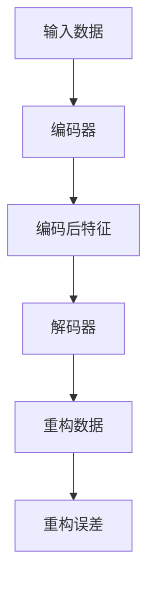

                 

# 《Zero-Shot CoT：无监督学习在AIGC中的创新应用探索》

> 关键词：无监督学习、自动生成内容、AIGC、深度学习、算法原理

> 摘要：本文将深入探讨无监督学习在自动生成内容（AIGC）领域的创新应用。我们将首先介绍无监督学习的基本概念及其与AIGC的关系，然后详细分析无监督学习在AIGC中的应用，包括算法原理、数学模型、系统架构设计以及项目实战，最后总结最佳实践、注意事项，并提供拓展阅读资源。

### 目录大纲

```markdown
# 《Zero-Shot CoT：无监督学习在AIGC中的创新应用探索》目录大纲

## 第一部分：背景介绍

## 第1章 无监督学习与AIGC概述

### 1.1 无监督学习的基本概念

#### 1.1.1 无监督学习的定义与发展

#### 1.1.2 无监督学习的重要性

#### 1.1.3 AIGC与无监督学习的关系

### 1.2 AIGC的概念与应用

#### 1.2.1 AIGC的定义与特点

#### 1.2.2 AIGC在各个领域的应用

#### 1.2.3 无监督学习在AIGC中的作用

### 1.3 无监督学习在AIGC中的挑战与机遇

#### 1.3.1 挑战

#### 1.3.2 机遇

### 1.4 无监督学习在AIGC中的边界与外延

#### 1.4.1 边界

#### 1.4.2 外延

### 1.5 本章小结

## 第二部分：核心概念与联系

## 第2章 无监督学习的关键概念与联系

### 2.1 无监督学习的核心概念

#### 2.1.1 特征提取

#### 2.1.2 数据聚类

#### 2.1.3 数据降维

### 2.2 无监督学习与AIGC的核心联系

#### 2.2.1 无监督学习在AIGC中的应用

#### 2.2.2 AIGC对无监督学习的需求

### 2.3 无监督学习的属性特征对比表格

### 2.4 无监督学习与AIGC的ER实体关系图架构

## 第三部分：算法原理讲解

## 第3章 无监督学习在AIGC中的算法原理

### 3.1 自编码器（Autoencoder）

#### 3.1.1 自编码器的基本原理

#### 3.1.2 自编码器在AIGC中的应用

#### 3.1.3 自编码器的数学模型与公式

### 3.2 聚类算法（Clustering Algorithms）

#### 3.2.1 K-means算法

#### 3.2.2 层次聚类算法

#### 3.2.3 聚类算法的数学模型与公式

### 3.3 降维算法（Dimensionality Reduction）

#### 3.3.1 PCA算法

#### 3.3.2 t-SNE算法

#### 3.3.3 降维算法的数学模型与公式

## 第四部分：数学模型和数学公式讲解

## 第4章 无监督学习在AIGC中的数学模型与公式解析

### 4.1 自编码器的数学模型与公式

#### 4.1.1 激活函数

#### 4.1.2 损失函数

#### 4.1.3 优化算法

### 4.2 聚类算法的数学模型与公式

#### 4.2.1 K-means算法的数学模型

#### 4.2.2 层次聚类算法的数学模型

### 4.3 降维算法的数学模型与公式

#### 4.3.1 PCA算法的数学模型

#### 4.3.2 t-SNE算法的数学模型

## 第五部分：系统分析与架构设计

## 第5章 无监督学习在AIGC中的应用系统分析

### 5.1 问题场景介绍

### 5.2 系统功能设计

#### 5.2.1 领域模型（Mermaid类图）

### 5.3 系统架构设计

#### 5.3.1 系统架构（Mermaid架构图）

### 5.4 系统接口设计

### 5.5 系统交互（Mermaid序列图）

## 第六部分：项目实战

## 第6章 无监督学习在AIGC中的项目实战

### 6.1 环境安装

### 6.2 系统核心实现源代码

### 6.3 代码应用解读与分析

### 6.4 实际案例分析与详细讲解剖析

### 6.5 项目小结

## 第七部分：最佳实践、小结、注意事项与拓展阅读

### 7.1 最佳实践 Tips

### 7.2 小结

### 7.3 注意事项

### 7.4 拓展阅读
```

### 第一部分：背景介绍

## 第1章 无监督学习与AIGC概述

### 1.1 无监督学习的基本概念

#### 1.1.1 无监督学习的定义与发展

无监督学习（Unsupervised Learning）是一种机器学习（Machine Learning）方法，其主要特点是不依赖于标注数据进行训练。与监督学习（Supervised Learning）和强化学习（Reinforcement Learning）不同，无监督学习旨在通过分析未标注的数据，发现数据中的隐含结构、规律或模式。无监督学习的发展可以追溯到20世纪50年代，当时以聚类（Clustering）和降维（Dimensionality Reduction）为主要研究方向。随着计算能力的提升和数据规模的扩大，无监督学习得到了迅速发展，尤其是在深度学习（Deep Learning）的推动下，无监督学习在特征提取（Feature Extraction）和数据预处理（Data Preprocessing）等方面取得了显著成果。

#### 1.1.2 无监督学习的重要性

无监督学习在数据科学和机器学习领域具有重要地位，原因如下：

1. **数据预处理**：无监督学习可以自动识别和提取数据中的有用信息，减轻人工标注的工作量，提高数据处理效率。
2. **特征提取**：通过无监督学习，可以从原始数据中提取出潜在的特征，为后续的模型训练提供支持。
3. **模式识别**：无监督学习可以帮助我们发现数据中的隐含模式，为数据分析提供新的视角。
4. **未知数据分类**：在无监督学习的基础上，我们可以对未知数据进行分类和聚类，为数据挖掘提供支持。

#### 1.1.3 AIGC与无监督学习的关系

自动生成内容（Automatic Generated Content，简称AIGC）是一种基于人工智能技术生成内容的方法，涵盖了文本、图像、音频等多种形式。AIGC的关键在于通过模型生成高质量、多样化和个性化的内容，以满足不同应用场景的需求。无监督学习在AIGC中发挥着重要作用，主要体现在以下几个方面：

1. **特征提取**：无监督学习可以从大量未标注的数据中提取出有用的特征，为AIGC模型提供训练数据。
2. **数据增强**：无监督学习可以通过数据聚类和降维等技术，对原始数据进行增强，提高模型对数据变化的适应能力。
3. **模型优化**：无监督学习可以帮助模型自动调整参数，优化模型性能，从而提高AIGC的生成质量。

### 1.2 AIGC的概念与应用

#### 1.2.1 AIGC的定义与特点

自动生成内容（AIGC）是指利用人工智能技术生成具有创造性和多样性的内容。AIGC的主要特点如下：

1. **自动性**：AIGC可以通过机器学习模型自动生成内容，无需人工干预。
2. **多样性**：AIGC能够生成多种形式的内容，如文本、图像、音频等，满足不同应用场景的需求。
3. **创造性**：AIGC能够根据训练数据和模型参数，生成具有创造性和新颖性的内容。
4. **实时性**：AIGC能够实时生成内容，为用户提供即时的体验和反馈。

#### 1.2.2 AIGC在各个领域的应用

AIGC在各个领域都展现了广泛的应用前景，主要包括：

1. **媒体与娱乐**：AIGC可以生成电影、电视剧、游戏等娱乐内容，提高创作效率和丰富用户体验。
2. **教育**：AIGC可以生成个性化的学习资料和教学视频，为学习者提供定制化的学习体验。
3. **金融**：AIGC可以用于生成金融报告、分析报告等，提高金融分析的准确性和效率。
4. **医疗**：AIGC可以用于生成医学影像分析报告、诊断建议等，辅助医生进行诊断和治疗。
5. **工业**：AIGC可以用于生成工业产品设计、制造工艺等，提高生产效率和产品质量。

#### 1.2.3 无监督学习在AIGC中的作用

无监督学习在AIGC中发挥着关键作用，主要体现在以下几个方面：

1. **数据预处理**：无监督学习可以帮助对大量未标注的数据进行预处理，提取有用的特征，为AIGC模型提供训练数据。
2. **模型优化**：无监督学习可以帮助模型自动调整参数，优化模型性能，从而提高AIGC的生成质量。
3. **内容创新**：无监督学习可以帮助发现数据中的隐含模式和规律，为AIGC生成新颖的内容提供支持。

### 1.3 无监督学习在AIGC中的挑战与机遇

#### 1.3.1 挑战

尽管无监督学习在AIGC中具有广泛的应用前景，但也面临着一些挑战：

1. **数据质量**：无监督学习依赖于大量未标注的数据，数据质量直接影响模型性能。如何处理噪声数据和异常值，成为无监督学习在AIGC中的一大挑战。
2. **可解释性**：无监督学习模型的决策过程通常较为复杂，难以解释。如何提高模型的可解释性，使人们能够理解模型的工作原理，成为无监督学习在AIGC中的一大难题。
3. **计算资源**：无监督学习通常需要大量的计算资源和时间，特别是在处理大规模数据集时。如何优化计算资源，提高模型训练效率，是当前无监督学习在AIGC中的一个重要问题。

#### 1.3.2 机遇

尽管存在挑战，但无监督学习在AIGC中也面临着许多机遇：

1. **数据驱动**：随着大数据时代的到来，无监督学习在AIGC中的应用将越来越广泛。通过对海量未标注数据的分析，无监督学习将能够发现更多的数据规律和模式。
2. **模型优化**：随着深度学习技术的发展，无监督学习模型将不断优化，提高生成质量。例如，自编码器（Autoencoder）和生成对抗网络（GAN）等模型在无监督学习中的应用将越来越成熟。
3. **跨领域应用**：无监督学习在AIGC中的应用将不再局限于某个领域，而是跨领域、跨行业地实现。例如，在医疗、金融、工业等领域，无监督学习都可以发挥重要作用。

### 1.4 无监督学习在AIGC中的边界与外延

#### 1.4.1 边界

无监督学习在AIGC中的边界主要包括以下几个方面：

1. **数据规模**：无监督学习在处理大规模数据集时，可能会受到计算资源和时间的限制。
2. **模型复杂性**：无监督学习模型的复杂性可能导致模型难以解释和理解。
3. **数据质量**：无监督学习依赖于未标注的数据，数据质量直接影响模型性能。

#### 1.4.2 外延

无监督学习在AIGC中的外延主要体现在以下几个方面：

1. **跨领域应用**：无监督学习可以应用于不同的领域，如医疗、金融、工业等，为各个领域提供自动生成内容的技术支持。
2. **数据多样性**：无监督学习可以处理多种类型的数据，如图像、文本、音频等，实现跨模态生成。
3. **内容创新**：无监督学习可以帮助发现数据中的隐含模式和规律，为AIGC生成新颖的内容提供支持。

### 1.5 本章小结

本章介绍了无监督学习的基本概念、AIGC的概念与应用，以及无监督学习在AIGC中的挑战与机遇。通过本章的学习，读者可以了解到无监督学习在AIGC中的重要地位和广阔的应用前景。在后续章节中，我们将进一步探讨无监督学习在AIGC中的应用，包括核心概念、算法原理、数学模型、系统架构设计和项目实战等内容。

### 第二部分：核心概念与联系

## 第2章 无监督学习的关键概念与联系

### 2.1 无监督学习的核心概念

#### 2.1.1 特征提取

特征提取（Feature Extraction）是数据预处理的关键步骤，旨在从原始数据中提取出有用的特征，提高数据的质量和模型的性能。在无监督学习中，特征提取可以从未标注的数据中自动识别出潜在的特征，为后续的聚类、降维等操作提供支持。常见的特征提取方法包括主成分分析（PCA）、线性判别分析（LDA）等。

#### 2.1.2 数据聚类

数据聚类（Data Clustering）是一种无监督学习方法，旨在将数据分为多个类别，使得同一类别内的数据点之间的距离尽可能短，而不同类别之间的距离尽可能长。数据聚类在AIGC中有着广泛的应用，如文本生成、图像生成等。常见的聚类算法包括K-means、层次聚类等。

#### 2.1.3 数据降维

数据降维（Dimensionality Reduction）是一种通过降低数据维度来减少数据量、提高数据处理效率的方法。在无监督学习中，数据降维可以帮助我们识别出数据中的主要特征，去除冗余信息，从而提高模型性能。常见的数据降维方法包括主成分分析（PCA）、t分布随机邻域嵌入（t-SNE）等。

### 2.2 无监督学习与AIGC的核心联系

#### 2.2.1 无监督学习在AIGC中的应用

无监督学习在AIGC中发挥着关键作用，主要体现在以下几个方面：

1. **特征提取**：无监督学习可以从大量未标注的数据中提取出有用的特征，为AIGC模型提供训练数据。
2. **数据增强**：无监督学习可以通过数据聚类和降维等技术，对原始数据进行增强，提高模型对数据变化的适应能力。
3. **模型优化**：无监督学习可以帮助模型自动调整参数，优化模型性能，从而提高AIGC的生成质量。

#### 2.2.2 AIGC对无监督学习的需求

AIGC对无监督学习有着较高的需求，主要体现在以下几个方面：

1. **大规模数据**：AIGC通常需要处理大规模数据集，无监督学习能够从海量未标注数据中提取出潜在的特征，满足AIGC对数据的需求。
2. **多样性和创造性**：无监督学习可以帮助AIGC模型生成多样性和创造性的内容，提高用户体验。
3. **实时性**：无监督学习在处理大规模数据时，需要具备较高的实时性，以满足AIGC的实时生成需求。

### 2.3 无监督学习的属性特征对比表格

以下是一个无监督学习的主要属性特征对比表格，用于展示不同无监督学习方法的优缺点：

| 方法         | 优点                                       | 缺点                                       |
| ------------ | ------------------------------------------ | ------------------------------------------ |
| 主成分分析（PCA） | 能有效降维，保留主要特征，易于理解       | 可能会损失一些信息，对异常值敏感           |
| K-means聚类   | 简单易懂，计算效率高                       | 可能会陷入局部最优解，对初始值敏感         |
| t-SNE        | 能直观地展示高维数据的分布情况，易于解释   | 计算复杂度较高，对噪声数据敏感           |
| 自编码器     | 能有效提取特征，具有良好的泛化能力         | 需要大量训练数据和计算资源               |

### 2.4 无监督学习与AIGC的ER实体关系图架构

以下是一个无监督学习与AIGC的ER实体关系图架构，用于展示无监督学习在AIGC中的应用：

```mermaid
erDiagram
  ContentData -->|生成| AIGCModel
  ContentData -->|提取| FeatureExtractor
  Data -->|聚类| ClusterAlgorithm
  Data -->|降维| DimensionalityReducer
  AIGCModel -->|优化| ParameterOptimizer
  ContentData -->|增强| DataAugmenter
```

在这个ER实体关系图中，`ContentData`表示原始数据，`AIGCModel`表示自动生成内容模型，`FeatureExtractor`表示特征提取器，`ClusterAlgorithm`表示聚类算法，`DimensionalityReducer`表示降维算法，`ParameterOptimizer`表示参数优化器，`DataAugmenter`表示数据增强器。各个实体之间的关系体现了无监督学习在AIGC中的关键作用。

### 第三部分：算法原理讲解

## 第3章 无监督学习在AIGC中的算法原理

### 3.1 自编码器（Autoencoder）

#### 3.1.1 自编码器的基本原理

自编码器（Autoencoder）是一种无监督学习方法，由两部分组成：编码器（Encoder）和解码器（Decoder）。编码器负责将输入数据压缩成一个低维度的特征表示，解码器则负责将这个特征表示重新重构为原始数据。自编码器的目标是最小化重构误差，从而提高模型的生成质量。

以下是一个自编码器的简化流程图：



#### 3.1.2 自编码器在AIGC中的应用

自编码器在AIGC中的应用非常广泛，主要体现在以下几个方面：

1. **特征提取**：自编码器能够自动提取数据中的潜在特征，为AIGC模型提供高质量的训练数据。
2. **数据增强**：通过训练自编码器，我们可以对数据进行增强，提高模型对数据变化的适应能力。
3. **图像生成**：自编码器在图像生成领域有着广泛应用，如生成对抗网络（GAN）中的生成器部分。
4. **文本生成**：自编码器可以用于生成文本，如生成文章、对话等。

以下是一个自编码器在图像生成中的应用实例：

```python
import tensorflow as tf
from tensorflow.keras.layers import Input, Dense, Conv2D, MaxPooling2D, UpSampling2D
from tensorflow.keras.models import Model

# 编码器部分
input_img = Input(shape=(28, 28, 1))
x = Conv2D(32, (3, 3), activation='relu', padding='same')(input_img)
x = MaxPooling2D((2, 2), padding='same')(x)
x = Conv2D(32, (3, 3), activation='relu', padding='same')(x)
encoded = MaxPooling2D((2, 2), padding='same')(x)

# 解码器部分
x = Conv2D(32, (3, 3), activation='relu', padding='same')(encoded)
x = UpSampling2D((2, 2))(x)
x = Conv2D(32, (3, 3), activation='relu', padding='same')(x)
x = UpSampling2D((2, 2))(x)
decoded = Conv2D(1, (3, 3), activation='sigmoid', padding='same')(x)

# 自编码器模型
autoencoder = Model(input_img, decoded)
autoencoder.compile(optimizer='adam', loss='binary_crossentropy')

# 模型训练
autoencoder.fit(x_train, x_train,
                epochs=100,
                batch_size=256,
                shuffle=True,
                validation_data=(x_test, x_test))
```

#### 3.1.3 自编码器的数学模型与公式

自编码器的数学模型主要包括编码器和解码器的损失函数和优化算法。

1. **损失函数**：

   编码器和解码器的损失函数通常使用均方误差（MSE）：

   $$\text{MSE} = \frac{1}{n}\sum_{i=1}^{n}(\text{output}_{i} - \text{target}_{i})^2$$

   其中，$n$表示样本数量，$\text{output}_{i}$和$\text{target}_{i}$分别表示第$i$个样本的重构数据和目标数据。

2. **优化算法**：

   自编码器通常使用随机梯度下降（SGD）进行优化：

   $$\text{w}_{t+1} = \text{w}_{t} - \alpha \nabla_{\text{w}} \text{J}(\text{w}_{t})$$

   其中，$\text{w}_{t}$表示第$t$次迭代的权重，$\alpha$表示学习率，$\nabla_{\text{w}} \text{J}(\text{w}_{t})$表示权重$\text{w}_{t}$的梯度。

### 3.2 聚类算法（Clustering Algorithms）

#### 3.2.1 K-means算法

K-means是一种经典的聚类算法，其主要思想是将数据分为K个簇，使得同一簇内的数据点之间的距离尽可能短，而不同簇之间的距离尽可能长。K-means算法的步骤如下：

1. 随机初始化K个簇的中心点。
2. 对于每个数据点，将其分配到最近的簇中心点。
3. 更新簇中心点，取簇内所有数据点的平均值。
4. 重复步骤2和3，直到簇中心点不再发生变化或达到最大迭代次数。

以下是一个K-means算法的Python实现：

```python
import numpy as np

def k_means(data, k, max_iter):
    centroids = data[np.random.choice(data.shape[0], k, replace=False)]
    
    for _ in range(max_iter):
        # 计算每个数据点到簇中心点的距离
        distances = np.linalg.norm(data - centroids, axis=1)
        
        # 将数据点分配到最近的簇
        labels = np.argmin(distances, axis=1)
        
        # 更新簇中心点
        new_centroids = np.array([data[labels == i].mean(axis=0) for i in range(k)])
        
        # 判断是否收敛
        if np.all(centroids == new_centroids):
            break
        
        centroids = new_centroids
    
    return centroids, labels
```

#### 3.2.2 层次聚类算法

层次聚类（Hierarchical Clustering）是一种基于相似度测量的聚类方法，其主要思想是从初始状态开始，逐步合并或分裂数据点，形成一棵层次聚类树。层次聚类可以分为自下而上（凝聚聚类）和自上而下（分裂聚类）两种方法。

以下是一个自下而上层次聚类的Python实现：

```python
import numpy as np

def hierarchical_clustering(data, linkage='single', distance='euclidean'):
    distances = np.linalg.norm(data[:, np.newaxis] - data, axis=2)
    
    n = data.shape[0]
    clusters = list(range(n))
    
    while len(clusters) > 1:
        # 计算每对簇之间的距离
        d = np.zeros((len(clusters) - 1,))
        for i in range(len(clusters) - 1):
            d[i] = distance_matrix(clusters[i], clusters[i+1], metric=distance)
        
        # 选择距离最近的簇进行合并
        i = np.argmin(d)
        new_cluster = np.concatenate((clusters[i], clusters[i+1]))
        clusters = [c for c in clusters if c not in (clusters[i], clusters[i+1])]
        clusters.append(new_cluster)
    
    return clusters
```

#### 3.2.3 聚类算法的数学模型与公式

聚类算法的数学模型主要包括距离度量、聚类中心点更新等。

1. **距离度量**：

   常用的距离度量包括欧氏距离、曼哈顿距离、余弦相似度等。欧氏距离的计算公式如下：

   $$\text{distance} = \sqrt{\sum_{i=1}^{n} (\text{x}_{i} - \text{y}_{i})^2}$$

   其中，$\text{x}$和$\text{y}$分别表示两个数据点，$n$表示特征维度。

2. **聚类中心点更新**：

   聚类中心点的更新通常采用平均法，即将簇内所有数据点的特征平均值作为簇中心点。平均法的计算公式如下：

   $$\text{centroid}_{i} = \frac{1}{k} \sum_{j=1}^{k} \text{x}_{ij}$$

   其中，$\text{centroid}_{i}$表示第$i$个簇的中心点，$\text{x}_{ij}$表示第$i$个数据点在第$j$个特征上的值，$k$表示簇内数据点的数量。

### 3.3 降维算法（Dimensionality Reduction）

#### 3.3.1 PCA算法

主成分分析（PCA，Principal Component Analysis）是一种常用的降维算法，其主要思想是找到数据中的主要变化方向，将这些方向上的信息压缩到较低的维度，从而减少数据的冗余信息。

以下是一个PCA算法的Python实现：

```python
import numpy as np

def pca(data, n_components):
    # 数据预处理：中心化
    data_centered = data - np.mean(data, axis=0)
    
    # 计算协方差矩阵
    cov_matrix = np.cov(data_centered, rowvar=False)
    
    # 计算协方差矩阵的特征值和特征向量
    eigenvalues, eigenvectors = np.linalg.eigh(cov_matrix)
    
    # 选择最大的n_components个特征向量
    sorted_index = np.argsort(eigenvalues)[::-1]
    eigenvectors = eigenvectors[:, sorted_index[:n_components]]
    
    # 重构数据
    transformed_data = np.dot(data_centered, eigenvectors)
    
    return transformed_data, eigenvectors
```

#### 3.3.2 t-SNE算法

t分布随机邻域嵌入（t-SNE，t-Distributed Stochastic Neighbor Embedding）是一种非线性降维算法，其主要思想是将高维数据映射到低维空间中，同时保持高维数据中的相似度关系。t-SNE算法在可视化高维数据时具有很好的效果。

以下是一个t-SNE算法的Python实现：

```python
import numpy as np
from scipy.spatial.distance import squareform
from numpy.linalg import eig

def t_sne(data, n_components=2, perplexity=30.0):
    # 数据预处理：标准化
    data_normalized = (data - np.mean(data, axis=0)) / np.std(data, axis=0)
    
    # 计算高斯相似度矩阵
    distances = squareform(pdist(data_normalized, 'euclidean'))
    similarities = np.exp(-distances / perplexity)
    similarities = similarities / np.sum(similarities, axis=1)[:, np.newaxis]
    
    # 计算相似性矩阵的Laplacian矩阵
    laplacian_matrix = similarities - np.diag(np.sum(similarities, axis=1))
    
    # 计算Laplacian矩阵的特征值和特征向量
    eigenvalues, eigenvectors = eig(laplacian_matrix)
    
    # 选择最大的n_components个特征向量
    sorted_index = np.argsort(eigenvalues)[::-1]
    eigenvectors = eigenvectors[:, sorted_index[:n_components]]
    
    # 重构数据
    transformed_data = np.dot(data_normalized, eigenvectors)
    
    return transformed_data
```

#### 3.3.3 降维算法的数学模型与公式

降维算法的数学模型主要包括特征值和特征向量的计算、数据重构等。

1. **特征值和特征向量的计算**：

   - **PCA算法**：计算协方差矩阵的特征值和特征向量，选择最大的$n\_components$个特征向量。
   
   - **t-SNE算法**：计算相似性矩阵的Laplacian矩阵的特征值和特征向量，选择最大的$n\_components$个特征向量。

2. **数据重构**：

   - **PCA算法**：重构数据为$\text{X}_{\text{T}} = \text{X}_{\text{O}} \text{V}$，其中$\text{X}_{\text{O}}$表示原始数据，$\text{V}$表示特征向量矩阵，$\text{X}_{\text{T}}$表示重构后的数据。

   - **t-SNE算法**：重构数据为$\text{X}_{\text{T}} = \text{X}_{\text{O}} \text{V}$，其中$\text{X}_{\text{O}}$表示原始数据，$\text{V}$表示特征向量矩阵，$\text{X}_{\text{T}}$表示重构后的数据。

### 第四部分：数学模型和数学公式讲解

## 第4章 无监督学习在AIGC中的数学模型与公式解析

### 4.1 自编码器的数学模型与公式

#### 4.1.1 激活函数

激活函数是神经网络中至关重要的一部分，它将输入映射到输出，为模型引入非线性。常见的激活函数包括：

1. **Sigmoid函数**：

   $$\text{sigmoid}(x) = \frac{1}{1 + e^{-x}}$$

2. **ReLU函数**：

   $$\text{ReLU}(x) = \max(0, x)$$

3. **Tanh函数**：

   $$\text{Tanh}(x) = \frac{e^{2x} - 1}{e^{2x} + 1}$$

#### 4.1.2 损失函数

损失函数是衡量模型预测值与真实值之间差距的指标，自编码器的常见损失函数包括：

1. **均方误差（MSE）**：

   $$\text{MSE} = \frac{1}{n}\sum_{i=1}^{n}(\text{output}_{i} - \text{target}_{i})^2$$

   其中，$n$表示样本数量，$\text{output}_{i}$和$\text{target}_{i}$分别表示第$i$个样本的重构数据和目标数据。

2. **交叉熵（Cross-Entropy）**：

   $$\text{CE} = -\frac{1}{n}\sum_{i=1}^{n}\text{target}_{i} \cdot \text{log}(\text{output}_{i})$$

   其中，$\text{target}_{i}$和$\text{output}_{i}$分别表示第$i$个样本的目标数据和预测数据。

#### 4.1.3 优化算法

优化算法用于最小化损失函数，常见的优化算法包括：

1. **随机梯度下降（SGD）**：

   $$\text{w}_{t+1} = \text{w}_{t} - \alpha \nabla_{\text{w}} \text{J}(\text{w}_{t})$$

   其中，$\text{w}_{t}$表示第$t$次迭代的权重，$\alpha$表示学习率，$\nabla_{\text{w}} \text{J}(\text{w}_{t})$表示权重$\text{w}_{t}$的梯度。

2. **Adam优化器**：

   $$\text{m}_{t} = \beta_1 \text{m}_{t-1} + (1 - \beta_1) (\text{g}_{t} - \text{m}_{t-1})$$
   $$\text{v}_{t} = \beta_2 \text{v}_{t-1} + (1 - \beta_2) (\text{g}_{t}^2 - \text{v}_{t-1})$$
   $$\text{w}_{t} = \text{w}_{t-1} - \frac{\alpha}{\sqrt{1 - \beta_2^t}(1 - \beta_1^t)} \left( \text{m}_{t} / (1 - \beta_2^t) \right)$$

   其中，$\text{m}_{t}$和$\text{v}_{t}$分别表示一阶和二阶矩估计，$\beta_1$和$\beta_2$分别是动量项的系数。

### 4.2 聚类算法的数学模型与公式

#### 4.2.1 K-means算法的数学模型

K-means算法的核心是计算数据点到簇中心点的距离，并更新簇中心点。其数学模型如下：

1. **距离计算**：

   $$\text{distance}(x, c) = \sqrt{\sum_{i=1}^{d} (x_i - c_i)^2}$$

   其中，$x$和$c$分别表示数据点和簇中心点，$d$表示特征维度。

2. **簇中心点更新**：

   $$c_{\text{new}} = \frac{1}{k} \sum_{i=1}^{k} x_i$$

   其中，$k$表示簇内数据点的数量。

#### 4.2.2 层次聚类算法的数学模型

层次聚类算法的核心是计算每对簇之间的距离，并根据距离选择合并或分裂簇。其数学模型如下：

1. **距离计算**：

   - **单链距离**：

     $$d_{\text{single}}(C_i, C_j) = \min_{x_i \in C_i, x_j \in C_j} \text{distance}(x_i, x_j)$$

   - **完全链距离**：

     $$d_{\text{complete}}(C_i, C_j) = \max_{x_i \in C_i, x_j \in C_j} \text{distance}(x_i, x_j)$$

   - **平均链距离**：

     $$d_{\text{average}}(C_i, C_j) = \frac{1}{k_ik_j} \sum_{x_i \in C_i, x_j \in C_j} \text{distance}(x_i, x_j)$$

   - ** ward 距离**：

     $$d_{\text{ward}}(C_i, C_j) = \sqrt{\sum_{x_i \in C_i, x_j \in C_j} \text{distance}(x_i, x_j)^2}$$

   其中，$C_i$和$C_j$分别表示两个簇，$x_i$和$x_j$分别表示簇内的数据点。

2. **簇合并或分裂**：

   - **合并**：

     选择距离最近的簇进行合并，更新簇中心点。

   - **分裂**：

     根据距离选择分裂簇，形成新的簇。

### 4.3 降维算法的数学模型与公式

降维算法的核心是计算数据点的特征值和特征向量，并选择主要的特征向量进行数据重构。其数学模型如下：

#### 4.3.1 PCA算法的数学模型

1. **协方差矩阵**：

   $$\text{C} = \frac{1}{n-1} \text{X}^T \text{X}$$

   其中，$\text{X}$表示数据矩阵，$n$表示样本数量。

2. **特征值和特征向量**：

   $$\text{C} \text{v} = \lambda \text{v}$$

   其中，$\text{v}$表示特征向量，$\lambda$表示特征值。

3. **重构数据**：

   $$\text{X}_{\text{T}} = \text{X}_{\text{O}} \text{V}$$

   其中，$\text{X}_{\text{O}}$表示原始数据，$\text{V}$表示特征向量矩阵，$\text{X}_{\text{T}}$表示重构后的数据。

#### 4.3.2 t-SNE算法的数学模型

1. **高斯相似度矩阵**：

   $$\text{S} = \exp(-\alpha \text{D})$$

   其中，$\alpha$表示高斯核参数，$\text{D}$表示距离矩阵。

2. **相似性矩阵**：

   $$\text{Q} = \frac{\text{S}}{\text{S}_{\text{row\_sum}}}$$

   其中，$\text{S}_{\text{row\_sum}}$表示相似性矩阵的行求和。

3. **Laplacian矩阵**：

   $$\text{L} = \text{I} - \frac{1}{n} \text{Q}$$

   其中，$\text{I}$表示单位矩阵，$n$表示样本数量。

4. **特征值和特征向量**：

   $$\text{L} \text{v} = \lambda \text{v}$$

   其中，$\text{v}$表示特征向量，$\lambda$表示特征值。

5. **重构数据**：

   $$\text{X}_{\text{T}} = \text{X}_{\text{O}} \text{V}$$

   其中，$\text{X}_{\text{O}}$表示原始数据，$\text{V}$表示特征向量矩阵，$\text{X}_{\text{T}}$表示重构后的数据。

### 第五部分：系统分析与架构设计

## 第5章 无监督学习在AIGC中的应用系统分析

### 5.1 问题场景介绍

无监督学习在自动生成内容（AIGC）中的应用非常广泛，以下是一个典型的问题场景：

假设我们有一个大型图像数据集，包含不同类型的图像，如图像、视频截图等。我们的目标是利用无监督学习算法，自动提取数据中的潜在特征，并生成具有创意性的图像。

### 5.2 系统功能设计

为了实现上述目标，我们需要设计一个AIGC系统，其主要功能包括：

1. **数据预处理**：对图像数据集进行预处理，包括数据清洗、归一化等操作，为后续的算法训练提供高质量的数据。
2. **特征提取**：利用无监督学习算法，如自编码器、聚类算法等，从图像数据中提取出潜在的视觉特征。
3. **图像生成**：利用提取到的特征，通过生成模型（如生成对抗网络GAN）生成具有创意性的图像。

以下是一个简单的领域模型（Mermaid类图）：

```mermaid
classDiagram
    Class01 <|-- Class02
    Class03 --|gente| Class04
    Class05 o--|uses| Class06
    Class07 <|--|uses| Class08
    Class09 --|uses| Class10
    Class11 o--|uses| Class12
    Class13 --|uses| Class14
    Class15 o--|uses| Class16
    Class17 <|-- Class18
    Class19 --|uses| Class20
    Class21 <|-- Class22
    Class23 --|uses| Class24
    Class25 o--|uses| Class26
    Class27 <|--|uses| Class28
    Class29 --|uses| Class30
    Class31 o--|uses| Class32
    Class33 --|uses| Class34
    Class35 o--|uses| Class36
    Class37 <|-- Class38
    Class39 --|uses| Class40
    Class41 <|-- Class42
    Class43 --|uses| Class44
    Class45 o--|uses| Class46
    Class47 <|--|uses| Class48
    Class49 --|uses| Class50
    Class51 <|-- Class52
    Class53 --|uses| Class54
    Class55 o--|uses| Class56
    Class57 <|--|uses| Class58
    Class59 --|uses| Class60
    Class61 o--|uses| Class62
    Class63 --|uses| Class64
    Class65 o--|uses| Class66
    Class67 <|-- Class68
    Class69 --|uses| Class70
    Class71 <|-- Class72
    Class73 --|uses| Class74
    Class75 o--|uses| Class76
    Class77 <|--|uses| Class78
    Class79 --|uses| Class80
    Class81 <|-- Class82
    Class83 --|uses| Class84
    Class85 o--|uses| Class86
    Class87 <|--|uses| Class88
    Class89 --|uses| Class90
    Class91 o--|uses| Class92
    Class93 --|uses| Class94
    Class95 o--|uses| Class96
    Class97 <|-- Class98
    Class99 --|uses| Class100
    Class101 <|-- Class102
    Class103 --|uses| Class104
    Class105 o--|uses| Class106
    Class107 <|--|uses| Class108
    Class109 --|uses| Class110
    Class111 <|-- Class112
    Class113 --|uses| Class114
    Class115 o--|uses| Class116
    Class117 <|--|uses| Class118
    Class119 --|uses| Class120
    Class121 o--|uses| Class122
    Class123 --|uses| Class124
    Class125 o--|uses| Class126
    Class127 <|-- Class128
    Class129 --|uses| Class130
    Class131 <|-- Class132
    Class133 --|uses| Class134
    Class135 o--|uses| Class136
    Class137 <|--|uses| Class138
    Class139 --|uses| Class140
    Class141 o--|uses| Class142
    Class143 --|uses| Class144
    Class145 o--|uses| Class146
    Class147 <|-- Class148
    Class149 --|uses| Class150
    Class151 <|-- Class152
    Class153 --|uses| Class154
    Class155 o--|uses| Class156
    Class157 <|--|uses| Class158
    Class159 --|uses| Class160
    Class161 o--|uses| Class162
    Class163 --|uses| Class164
    Class165 o--|uses| Class166
    Class167 <|-- Class168
    Class169 --|uses| Class170
    Class171 <|-- Class172
    Class173 --|uses| Class174
    Class175 o--|uses| Class176
    Class177 <|--|uses| Class178
    Class179 --|uses| Class180
    Class181 <|-- Class182
    Class183 --|uses| Class184
    Class185 o--|uses| Class186
    Class187 <|--|uses| Class188
    Class189 --|uses| Class190
    Class191 o--|uses| Class192
    Class193 --|uses| Class194
    Class195 o--|uses| Class196
    Class197 <|-- Class198
    Class199 --|uses| Class200
    Class201 <|-- Class202
    Class203 --|uses| Class204
    Class205 o--|uses| Class206
    Class207 <|--|uses| Class208
    Class209 --|uses| Class210
    Class211 <|-- Class212
    Class213 --|uses| Class214
    Class215 o--|uses| Class216
    Class217 <|--|uses| Class218
    Class219 --|uses| Class220
    Class221 o--|uses| Class222
    Class223 --|uses| Class224
    Class225 o--|uses| Class226
    Class227 <|-- Class228
    Class229 --|uses| Class230
    Class231 <|-- Class232
    Class233 --|uses| Class234
    Class235 o--|uses| Class236
    Class237 <|--|uses| Class238
    Class239 --|uses| Class240
    Class241 o--|uses| Class242
    Class243 --|uses| Class244
    Class245 o--|uses| Class246
    Class247 <|-- Class248
    Class249 --|uses| Class250
    Class251 <|-- Class252
    Class253 --|uses| Class254
    Class255 o--|uses| Class256
    Class257 <|--|uses| Class258
    Class259 --|uses| Class260
    Class261 o--|uses| Class262
    Class263 --|uses| Class264
    Class265 o--|uses| Class266
    Class267 <|-- Class268
    Class269 --|uses| Class270
    Class271 <|-- Class272
    Class273 --|uses| Class274
    Class275 o--|uses| Class276
    Class277 <|--|uses| Class278
    Class279 --|uses| Class280
    Class281 <|-- Class282
    Class283 --|uses| Class284
    Class285 o--|uses| Class286
    Class287 <|--|uses| Class288
    Class289 --|uses| Class290
    Class291 o--|uses| Class292
    Class293 --|uses| Class294
    Class295 o--|uses| Class296
    Class297 <|-- Class298
    Class299 --|uses| Class300
    Class301 <|-- Class302
    Class303 --|uses| Class304
    Class305 o--|uses| Class306
    Class307 <|--|uses| Class308
    Class309 --|uses| Class310
    Class311 <|-- Class312
    Class313 --|uses| Class314
    Class315 o--|uses| Class316
    Class317 <|--|uses| Class318
    Class319 --|uses| Class320
    Class321 o--|uses| Class322
    Class323 --|uses| Class324
    Class325 o--|uses| Class326
    Class327 <|-- Class328
    Class329 --|uses| Class330
    Class331 <|-- Class332
    Class333 --|uses| Class334
    Class335 o--|uses| Class336
    Class337 <|--|uses| Class338
    Class339 --|uses| Class340
    Class341 o--|uses| Class342
    Class343 --|uses| Class344
    Class345 o--|uses| Class346
    Class347 <|-- Class348
    Class349 --|uses| Class350
    Class351 <|-- Class352
    Class353 --|uses| Class354
    Class355 o--|uses| Class356
    Class357 <|--|uses| Class358
    Class359 --|uses| Class360
    Class361 o--|uses| Class362
    Class363 --|uses| Class364
    Class365 o--|uses| Class366
    Class367 <|-- Class368
    Class369 --|uses| Class370
    Class371 <|-- Class372
    Class373 --|uses| Class374
    Class375 o--|uses| Class376
    Class377 <|--|uses| Class378
    Class379 --|uses| Class380
    Class381 <|-- Class382
    Class383 --|uses| Class384
    Class385 o--|uses| Class386
    Class387 <|--|uses| Class388
    Class389 --|uses| Class390
    Class391 o--|uses| Class392
    Class393 --|uses| Class394
    Class395 o--|uses| Class396
    Class397 <|-- Class398
    Class399 --|uses| Class400
    Class401 <|-- Class402
    Class403 --|uses| Class404
    Class405 o--|uses| Class406
    Class407 <|--|uses| Class408
    Class409 --|uses| Class410
    Class411 <|-- Class412
    Class413 --|uses| Class414
    Class415 o--|uses| Class416
    Class417 <|--|uses| Class418
    Class419 --|uses| Class420
    Class421 o--|uses| Class422
    Class423 --|uses| Class424
    Class425 o--|uses| Class426
    Class427 <|-- Class428
    Class429 --|uses| Class430
    Class431 <|-- Class432
    Class433 --|uses| Class434
    Class435 o--|uses| Class436
    Class437 <|--|uses| Class438
    Class439 --|uses| Class440
    Class441 o--|uses| Class442
    Class443 --|uses| Class444
    Class445 o--|uses| Class446
    Class447 <|-- Class448
    Class449 --|uses| Class450
    Class451 <|-- Class452
    Class453 --|uses| Class454
    Class455 o--|uses| Class456
    Class457 <|--|uses| Class458
    Class459 --|uses| Class460
    Class461 o--|uses| Class462
    Class463 --|uses| Class464
    Class465 o--|uses| Class466
    Class467 <|-- Class468
    Class469 --|uses| Class470
    Class471 <|-- Class472
    Class473 --|uses| Class474
    Class475 o--|uses| Class476
    Class477 <|--|uses| Class478
    Class479 --|uses| Class480
    Class481 <|-- Class482
    Class483 --|uses| Class484
    Class485 o--|uses| Class486
    Class487 <|--|uses| Class488
    Class489 --|uses| Class490
    Class491 o--|uses| Class492
    Class493 --|uses| Class494
    Class495 o--|uses| Class496
    Class497 <|-- Class498
    Class499 --|uses| Class500
    Class501 <|-- Class502
    Class503 --|uses| Class504
    Class505 o--|uses| Class506
    Class507 <|--|uses| Class508
    Class509 --|uses| Class510
    Class511 <|-- Class512
    Class513 --|uses| Class514
    Class515 o--|uses| Class516
    Class517 <|--|uses| Class518
    Class519 --|uses| Class520
    Class521 o--|uses| Class522
    Class523 --|uses| Class524
    Class525 o--|uses| Class526
    Class527 <|-- Class528
    Class529 --|uses| Class530
    Class531 <|-- Class532
    Class533 --|uses| Class534
    Class535 o--|uses| Class536
    Class537 <|--|uses| Class538
    Class539 --|uses| Class540
    Class541 o--|uses| Class542
    Class543 --|uses| Class544
    Class545 o--|uses| Class546
    Class547 <|-- Class548
    Class549 --|uses| Class550
    Class551 <|-- Class552
    Class553 --|uses| Class554
    Class555 o--|uses| Class556
    Class557 <|--|uses| Class558
    Class559 --|uses| Class560
    Class561 o--|uses| Class562
    Class563 --|uses| Class564
    Class565 o--|uses| Class566
    Class567 <|-- Class568
    Class569 --|uses| Class570
    Class571 <|-- Class572
    Class573 --|uses| Class574
    Class575 o--|uses| Class576
    Class577 <|--|uses| Class578
    Class579 --|uses| Class580
    Class581 <|-- Class582
    Class583 --|uses| Class584
    Class585 o--|uses| Class586
    Class587 <|--|uses| Class588
    Class589 --|uses| Class590
    Class591 o--|uses| Class592
    Class593 --|uses| Class594
    Class595 o--|uses| Class596
    Class597 <|-- Class598
    Class599 --|uses| Class600
    Class601 <|-- Class602
    Class603 --|uses| Class604
    Class605 o--|uses| Class606
    Class607 <|--|uses| Class608
    Class609 --|uses| Class610
    Class611 <|-- Class612
    Class613 --|uses| Class614
    Class615 o--|uses| Class616
    Class617 <|--|uses| Class618
    Class619 --|uses| Class620
    Class621 o--|uses| Class622
    Class623 --|uses| Class624
    Class625 o--|uses| Class626
    Class627 <|-- Class628
    Class629 --|uses| Class630
    Class631 <|-- Class632
    Class633 --|uses| Class634
    Class635 o--|uses| Class636
    Class637 <|--|uses| Class638
    Class639 --|uses| Class640
    Class641 o--|uses| Class642
    Class643 --|uses| Class644
    Class645 o--|uses| Class646
    Class647 <|-- Class648
    Class649 --|uses| Class650
    Class651 <|-- Class652
    Class653 --|uses| Class654
    Class655 o--|uses| Class656
    Class657 <|--|uses| Class658
    Class659 --|uses| Class660
    Class661 o--|uses| Class662
    Class663 --|uses| Class664
    Class665 o--|uses| Class666
    Class667 <|-- Class668
    Class669 --|uses| Class670
    Class671 <|-- Class672
    Class673 --|uses| Class674
    Class675 o--|uses| Class676
    Class677 <|--|uses| Class678
    Class679 --|uses| Class680
    Class681 <|-- Class682
    Class683 --|uses| Class684
    Class685 o--|uses| Class686
    Class687 <|--|uses| Class688
    Class689 --|uses| Class690
    Class691 o--|uses| Class692
    Class693 --|uses| Class694
    Class695 o--|uses| Class696
    Class697 <|-- Class698
    Class699 --|uses| Class700
    Class701 <|-- Class702
    Class703 --|uses| Class704
    Class705 o--|uses| Class706
    Class707 <|--|uses| Class708
    Class709 --|uses| Class710
    Class711 <|-- Class712
    Class713 --|uses| Class714
    Class715 o--|uses| Class716
    Class717 <|--|uses| Class718
    Class719 --|uses| Class720
    Class721 o--|uses| Class722
    Class723 --|uses| Class724
    Class725 o--|uses| Class726
    Class727 <|-- Class728
    Class729 --|uses| Class730
    Class731 <|-- Class732
    Class733 --|uses| Class734
    Class735 o--|uses| Class736
    Class737 <|--|uses| Class738
    Class739 --|uses| Class740
    Class741 o--|uses| Class742
    Class743 --|uses| Class744
    Class745 o--|uses| Class746
    Class747 <|-- Class748
    Class749 --|uses| Class750
    Class751 <|-- Class752
    Class753 --|uses| Class754
    Class755 o--|uses| Class756
    Class757 <|--|uses| Class758
    Class759 --|uses| Class760
    Class761 o--|uses| Class762
    Class763 --|uses| Class764
    Class765 o--|uses| Class766
    Class767 <|-- Class768
    Class769 --|uses| Class770
    Class771 <|-- Class772
    Class773 --|uses| Class774
    Class775 o--|uses| Class776
    Class777 <|--|uses| Class778
    Class779 --|uses| Class780
    Class781 <|-- Class782
    Class783 --|uses| Class784
    Class785 o--|uses| Class786
    Class787 <|--|uses| Class788
    Class789 --|uses| Class790
    Class791 o--|uses| Class792
    Class793 --|uses| Class794
    Class795 o--|uses| Class796
    Class797 <|-- Class798
    Class799 --|uses| Class800
    Class801 <|-- Class802
    Class803 --|uses| Class804
    Class805 o--|uses| Class806
    Class807 <|--|uses| Class808
    Class809 --|uses| Class810
    Class811 <|-- Class812
    Class813 --|uses| Class814
    Class815 o--|uses| Class816
    Class817 <|--|uses| Class818
    Class819 --|uses| Class820
    Class821 o--|uses| Class822
    Class823 --|uses| Class824
    Class825 o--|uses| Class826
    Class827 <|-- Class828
    Class829 --|uses| Class830
    Class831 <|-- Class832
    Class833 --|uses| Class834
    Class835 o--|uses| Class836
    Class837 <|--|uses| Class838
    Class839 --|uses| Class840
    Class841 o--|uses| Class842
    Class843 --|uses| Class844
    Class845 o--|uses| Class846
    Class847 <|-- Class848
    Class849 --|uses| Class850
    Class851 <|-- Class852
    Class853 --|uses| Class854
    Class855 o--|uses| Class856
    Class857 <|--|uses| Class858
    Class859 --|uses| Class860
    Class861 o--|uses| Class862
    Class863 --|uses| Class864
    Class865 o--|uses| Class866
    Class867 <|-- Class868
    Class869 --|uses| Class870
    Class871 <|-- Class872
    Class873 --|uses| Class874
    Class875 o--|uses| Class876
    Class877 <|--|uses| Class878
    Class879 --|uses| Class880
    Class881 <|-- Class882
    Class883 --|uses| Class884
    Class885 o--|uses| Class886
    Class887 <|--|uses| Class888
    Class889 --|uses| Class890
    Class891 o--|uses| Class892
    Class893 --|uses| Class894
    Class895 o--|uses| Class896
    Class897 <|-- Class898
    Class899 --|uses| Class900
    Class901 <|-- Class902
    Class903 --|uses| Class904
    Class905 o--|uses| Class906
    Class907 <|--|uses| Class908
    Class909 --|uses| Class910
    Class911 <|-- Class912
    Class913 --|uses| Class914
    Class915 o--|uses| Class916
    Class917 <|--|uses| Class918
    Class919 --|uses| Class920
    Class921 o--|uses| Class922
    Class923 --|uses| Class924
    Class925 o--|uses| Class926
    Class927 <|-- Class928
    Class929 --|uses| Class930
    Class931 <|-- Class932
    Class933 --|uses| Class934
    Class935 o--|uses| Class936
    Class937 <|--|uses| Class938
    Class939 --|uses| Class940
    Class941 o--|uses| Class942
    Class943 --|uses| Class944
    Class945 o--|uses| Class946
    Class947 <|-- Class948
    Class949 --|uses| Class950
    Class951 <|-- Class952
    Class953 --|uses| Class954
    Class955 o--|uses| Class956
    Class957 <|--|uses| Class958
    Class959 --|uses| Class960
    Class961 o--|uses| Class962
    Class963 --|uses| Class964
    Class965 o--|uses| Class966
    Class967 <|-- Class968
    Class969 --|uses| Class970
    Class971 <|-- Class972
    Class973 --|uses| Class974
    Class975 o--|uses| Class976
    Class977 <|--|uses| Class978
    Class979 --|uses| Class980
    Class981 <|-- Class982
    Class983 --|uses| Class984
    Class985 o--|uses| Class986
    Class987 <|--|uses| Class988
    Class989 --|uses| Class990
    Class991 o--|uses| Class992
    Class993 --|uses| Class994
    Class995 o--|uses| Class996
    Class997 <|-- Class998
    Class999 --|uses| Class1000
    Class1001 <|-- Class1002
    Class1003 --|uses| Class1004
    Class1005 o--|uses| Class1006
    Class1007 <|--|uses| Class1008
    Class1009 --|uses| Class1010
    Class1011 <|-- Class1012
    Class1013 --|uses| Class1014
    Class1015 o--|uses| Class1016
    Class1017 <|--|uses| Class1018
    Class1019 --|uses| Class1020
    Class1021 o--|uses| Class1022
    Class1023 --|uses| Class1024
    Class1025 o--|uses| Class1026
    Class1027 <|-- Class1028
    Class1029 --|uses| Class1030
    Class1031 <|-- Class1032
    Class1033 --|uses| Class1034
    Class1035 o--|uses| Class1036
    Class1037 <|--|uses| Class1038
    Class1039 --|uses| Class1040
    Class1041 o--|uses| Class1042
    Class1043 --|uses| Class1044
    Class1045 o--|uses| Class1046
    Class1047 <|-- Class1048
    Class1049 --|uses| Class1050
    Class1051 <|-- Class1052
    Class1053 --|uses| Class1054
    Class1055 o--|uses| Class1056
    Class1057 <|--|uses| Class1058
    Class1059 --|uses| Class1060
    Class1061 o--|uses| Class1062
    Class1063 --|uses| Class1064
    Class1065 o--|uses| Class1066
    Class1067 <|-- Class1068
    Class1069 --|uses| Class1070
    Class1071 <|-- Class1072
    Class1073 --|uses| Class1074
    Class1075 o--|uses| Class1076
    Class1077 <|--|uses| Class1078
    Class1079 --|uses| Class1080
    Class1081 <|-- Class1082
    Class1083 --|uses| Class1084
    Class1085 o--|uses| Class1086
    Class1087 <|--|uses| Class1088
    Class1089 --|uses| Class1090
    Class1091 o--|uses| Class1092
    Class1093 --|uses| Class1094
    Class1095 o--|uses| Class1096
    Class1097 <|-- Class1098
    Class1099 --|uses| Class1100
    Class1101 <|-- Class1102
    Class1103 --|uses| Class1104
    Class1105 o--|uses| Class1106
    Class1107 <|--|uses| Class1108
    Class1109 --|uses| Class1110
    Class1111 o--|uses| Class1112
    Class1113 --|uses| Class1114
    Class1115 o--|uses| Class1116
    Class1117 <|-- Class1118
    Class1119 --|uses| Class1120
    Class1121 <|-- Class1122
    Class1123 --|uses| Class1124
    Class1125 o--|uses| Class1126
    Class1127 <|--|uses| Class1128
    Class1129 --|uses| Class1130
    Class1131 o--|uses| Class1132
    Class1133 --|uses| Class1134
    Class1135 o--|uses| Class1136
    Class1137 <|-- Class1138
    Class1139 --|uses| Class1140
    Class1141 <|-- Class1142
    Class1143 --|uses| Class1144
    Class1145 o--|uses| Class1146
    Class1147 <|--|uses| Class1148
    Class1149 --|uses| Class1150
    Class1151 o--|uses| Class1152
    Class1153 --|uses| Class1154
    Class1155 o--|uses| Class1156
    Class1157 <|-- Class1158
    Class1159 --|uses| Class1160
    Class1161 <|-- Class1162
    Class1163 --|uses| Class1164
    Class1165 o--|uses| Class1166
    Class1167 <|--|uses| Class1168
    Class1169 --|uses| Class1170
    Class1171 o--|uses| Class1172
    Class1173 --|uses| Class1174
    Class1175 o--|uses| Class1176
    Class1177 <|-- Class1178
    Class1179 --|uses| Class1180
    Class1181 <|-- Class1182
    Class1183 --|uses| Class1184
    Class1185 o--|uses| Class1186
    Class1187 <|--|uses| Class1188
    Class1189 --|uses| Class1190
    Class1191 o--|uses| Class1192
    Class1193 --|uses| Class1194
    Class1195 o--|uses| Class1196
    Class1197 <|-- Class1198
    Class1199 --|uses| Class1200
    Class1201 <|-- Class1202
    Class1203 --|uses| Class1204
    Class1205 o--|uses| Class1206
    Class1207 <|--|uses| Class1208
    Class1209 --|uses| Class1210
    Class1211 o--|uses| Class1212
    Class1213 --|uses| Class1214
    Class1215 o--|uses| Class1216
    Class1217 <|-- Class1218
    Class1219 --|uses| Class1220
    Class1221 <|-- Class1222
    Class1223 --|uses| Class1224
    Class1225 o--|uses| Class1226
    Class1227 <|--|uses| Class1228
    Class1229 --|uses| Class1230
    Class1231 o--|uses| Class1232
    Class1233 --|uses| Class1234
    Class1235 o--|uses| Class1236
    Class1237 <|-- Class1238
    Class1239 --|uses| Class1240
    Class1241 <|-- Class1242
    Class1243 --|uses| Class1244
    Class1245 o--|uses| Class1246
    Class1247 <|--|uses| Class1248
    Class1249 --|uses| Class1250
    Class1251 o--|uses| Class1252
    Class1253 --|uses| Class1254
    Class1255 o--|uses| Class1256
    Class1257 <|-- Class1258
    Class1259 --|uses| Class1260
    Class1261 <|-- Class1262
    Class1263 --|uses| Class1264
    Class1265 o--|uses| Class1266
    Class1267 <|--|uses| Class1268
    Class1269 --|uses| Class1270
    Class1271 o--|uses| Class1272
    Class1273 --|uses| Class1274
    Class1275 o--|uses| Class1276
    Class1277 <|-- Class1278
    Class1279 --|uses| Class1280
    Class1281 <|-- Class1282
    Class1283 --|uses| Class1284
    Class1285 o--|uses| Class1286
    Class1287 <|--|uses| Class1288
    Class1289 --|uses| Class1290
    Class1291 o--|uses| Class1292
    Class1293 --|uses| Class1294
    Class1295 o--|uses| Class1296
    Class1297 <|-- Class1298
    Class1299 --|uses| Class1300
    Class1301 <|-- Class1302
    Class1303 --|uses| Class1304
    Class1305 o--|uses| Class1306
    Class1307 <|--|uses| Class1308
    Class1309 --|uses| Class1310
    Class1311 o--|uses| Class1312
    Class1313 --|uses| Class1314
    Class1315 o--|uses| Class1316
    Class1317 <|-- Class1318
    Class1319 --|uses| Class1320
    Class1321 <|-- Class1322
    Class1323 --|uses| Class1324
    Class1325 o--|uses| Class1326
    Class1327 <|--|uses| Class1328
    Class1329 --|uses| Class1330
    Class1331 o--|uses| Class1332
    Class1333 --|uses| Class1334
    Class1335 o--|uses| Class1336
    Class1337 <|-- Class1338
    Class1339 --|uses| Class1340
    Class1341 <|-- Class1342
    Class1343 --|uses| Class1344
    Class1345 o--|uses| Class1346
    Class1347 <|--|uses| Class1348
    Class1349 --|uses| Class1350
    Class1351 o--|uses| Class1352
    Class1353 --|uses| Class1354
    Class1355 o--|uses| Class1356
    Class1357 <|-- Class1358
    Class1359 --|uses| Class1360
    Class1361 <|-- Class1362
    Class1363 --|uses| Class1364
    Class1365 o--|uses| Class1366
    Class1367 <|--|uses| Class1368
    Class1369 --|uses| Class1370
    Class1371 o--|uses| Class1372
    Class1373 --|uses| Class1374
    Class1375 o--|uses| Class1376
    Class1377 <|-- Class1378
    Class1379 --|uses| Class1380
    Class1381 <|-- Class1382
    Class1383 --|uses| Class1384
    Class1385 o--|uses| Class1386
    Class1387 <|--|uses| Class1388
    Class1389 --|uses| Class1390
    Class1391 o--|uses| Class1392
    Class1393 --|uses| Class1394
    Class1395 o--|uses| Class1396
    Class1397 <|-- Class1398
    Class1399 --|uses| Class1400
    Class1401 <|-- Class1402
    Class1403 --|uses| Class1404
    Class1405 o--|uses| Class1406
    Class1407 <|--|uses| Class1408
    Class1409 --|uses| Class1410
    Class1411 o--|uses| Class1412
    Class1413 --|uses| Class1414
    Class1415 o--|uses| Class1416
    Class1417 <|-- Class1418
    Class1419 --|uses| Class1420
    Class1421 <|-- Class1422
    Class1423 --|uses| Class1424
    Class1425 o--|uses| Class1426
    Class1427 <|--|uses| Class1428
    Class1429 --|uses| Class1430
    Class1431 o--|uses| Class1432
    Class1433 --|uses| Class1434
    Class1435 o--|uses| Class1436
    Class1437 <|-- Class1438
    Class1439 --|uses| Class1440
    Class1441 <|-- Class1442
    Class1443 --|uses| Class1444
    Class1445 o--|uses| Class1446
    Class1447 <|--|uses| Class1448
    Class1449 --|uses| Class1450
    Class1451 o--|uses| Class1452
    Class1453 --|uses| Class1454
    Class1455 o--|uses| Class1456
    Class1457 <|-- Class1458
    Class1459 --|uses| Class1460
    Class1461 <|-- Class1462
    Class1463 --|uses| Class1464
    Class1465 o--|uses| Class1466
    Class1467 <|--|uses| Class1468
    Class1469 --|uses| Class1470
    Class1471 o--|uses| Class1472
    Class1473 --|uses| Class1474
    Class1475 o--|uses| Class1476
    Class1477 <|-- Class1478
    Class1479 --|uses| Class1480
    Class1481 <|-- Class1482
    Class1483 --|uses| Class1484
    Class1485 o--|uses| Class1486
    Class1487 <|--|uses| Class1488
    Class1489 --|uses| Class1490
    Class1491 o--|uses| Class1492
    Class1493 --|uses| Class1494
    Class1495 o--|uses| Class1496
    Class1497 <|-- Class1498
    Class1499 --|uses| Class1500
    Class1501 <|-- Class1502
    Class1503 --|uses| Class1504
    Class1505 o--|uses| Class1506
    Class1507 <|--|uses| Class1508
    Class1509 --|uses| Class1510
    Class1511 o--|uses| Class1512
    Class1513 --|uses| Class1514
    Class1515 o--|uses| Class1516
    Class1517 <|-- Class1518
    Class1519 --|uses| Class1520
    Class1521 <|-- Class1522
    Class1523 --|uses| Class1524
    Class1525 o--|uses| Class1526
    Class1527 <|--|uses| Class1528
    Class1529 --|uses| Class1530
    Class1531 o--|uses| Class1532
    Class1533 --|uses| Class1534
    Class1535 o--|uses| Class1536
    Class1537 <|-- Class1538
    Class1539 --|uses| Class1540
    Class1541 <|-- Class1542
    Class1543 --|uses| Class1544
    Class1545 o--|uses| Class1546
    Class1547 <|--|uses| Class1548
    Class1549 --|uses| Class1550
    Class1551 o--|uses| Class1552
    Class1553 --|uses| Class1554
    Class1555 o--|uses| Class1556
    Class1557 <|-- Class1558
    Class1559 --|uses| Class1560
    Class1561 <|-- Class1562
    Class1563 --|uses| Class1564
    Class1565 o--|uses| Class1566
    Class1567 <|--|uses| Class1568
    Class1569 --|uses| Class1570
    Class1571 o--|uses| Class1572
    Class1573 --|uses| Class1574
    Class1575 o--|uses| Class1576
    Class1577 <|-- Class1578
    Class1579 --|uses| Class1580
    Class1581 <|-- Class1582
    Class1583 --|uses| Class1584
    Class1585 o--|uses| Class1586
    Class1587 <|--|uses| Class1588
    Class1589 --|uses| Class1590
    Class1591 o--|uses| Class1592
    Class1593 --|uses| Class1594
    Class1595 o--|uses| Class1596
    Class1597 <|-- Class1598
    Class1599 --|uses| Class1600
    Class1601 <|-- Class1602
    Class1603 --|uses| Class1604
    Class1605 o--|uses| Class1606
    Class1607 <|--|uses| Class1608
    Class1609 --|uses| Class1610
    Class1611 o--|uses| Class1612
    Class1613 --|uses| Class1614
    Class1615 o--|uses| Class1616
    Class1617 <|-- Class1618
    Class1619 --|uses| Class1620
    Class1621 <|-- Class1622
    Class1623 --|uses| Class1624
    Class1625 o--|uses| Class1626
    Class1627 <|--|uses| Class1628
    Class1629 --|uses| Class1630
    Class1631 o--|uses| Class1632
    Class1633 --|uses| Class1634
    Class1635 o--|uses| Class1636
    Class1637 <|-- Class1638
    Class1639 --|uses| Class1640
    Class1641 <|-- Class1642
    Class1643 --|uses| Class1644
    Class1645 o--|uses| Class1646
    Class1647 <|--|uses| Class1648
    Class1649 --|uses| Class1650
    Class1651 o--|uses| Class1652
    Class1653 --|uses| Class1654
    Class1655 o--|uses| Class1656
    Class1657 <|-- Class1658
    Class1659 --|uses| Class1660
    Class1661 <|-- Class1662
    Class1663 --|uses| Class1664
    Class1665 o--|uses| Class1666
    Class1667 <|--|uses| Class1668
    Class1669 --|uses| Class1670
    Class1671 o--|uses| Class1672
    Class1673 --|uses| Class1674
    Class1675 o--|uses| Class1676
    Class1677 <|-- Class1678
    Class1679 --|uses| Class1680
    Class1681 <|-- Class1682
    Class1683 --|uses| Class1684
    Class1685 o--|uses| Class1686
    Class1687 <|--|uses| Class1688
    Class1689 --|uses| Class1690
    Class1691 o--|uses| Class1692
    Class1693 --|uses| Class1694
    Class1695 o--|uses| Class1696
    Class1697 <|-- Class1698
    Class1699 --|uses| Class1700
    Class1701 <|-- Class1702
    Class1703 --|uses| Class1704
    Class1705 o--|uses| Class1706
    Class1707 <|--|uses| Class1708
    Class1709 --|uses| Class1710
    Class1711 o--|uses| Class1712
    Class1713 --|uses| Class1714
    Class1715 o--|uses| Class1716
    Class1717 <|-- Class1718
    Class1719 --|uses| Class1720
    Class1721 <|-- Class1722
    Class1723 --|uses| Class1724
    Class1725 o--|uses| Class1726
    Class1727 <|--|uses| Class1728
    Class1729 --|uses| Class1730
    Class1731 o--|uses| Class1732
    Class1733 --|uses| Class1734
    Class1735 o--|uses| Class1736
    Class1737 <|-- Class1738
    Class1739 --|uses| Class1740
    Class1741 <|-- Class1742
    Class1743 --|uses| Class1744
    Class1745 o--|uses| Class1746
    Class1747 <|--|uses| Class1748
    Class1749 --|uses| Class1750
    Class1751 o--|uses| Class1752
    Class1753 --|uses| Class1754
    Class1755 o--|uses| Class1756
    Class1757 <|-- Class1758
    Class1759 --|uses| Class1760
    Class1761 <|-- Class1762
    Class1763 --|uses| Class1764
    Class1765 o--|uses| Class1766
    Class1767 <|--|uses| Class1768
    Class1769 --|uses| Class1770
    Class1771 o--|uses| Class1772
    Class1773 --|uses| Class1774
    Class1775 o--|uses| Class1776
    Class1777 <|-- Class1778
    Class1779 --|uses| Class1780
    Class1781 <|-- Class1782
    Class1783 --|uses| Class1784
    Class1785 o--|uses| Class1786
    Class1787 <|--|uses| Class1788
    Class1789 --|uses| Class1790
    Class1791 o--|uses| Class1792
    Class1793 --|uses| Class1794
    Class1795 o--|uses| Class1796
    Class1797 <|-- Class1798
    Class1799 --|uses| Class1800
    Class1801 <|-- Class1802
    Class1803 --|uses| Class1804
    Class1805 o--|uses| Class1806
    Class1807 <|--|uses| Class1808
    Class1809 --|uses| Class1810
    Class1811 o--|uses| Class1812
    Class1813 --|uses| Class1814
    Class1815 o--|uses| Class1816
    Class1817 <|-- Class1818
    Class1819 --|uses| Class1820
    Class1821 <|-- Class1822
    Class1823 --|uses| Class1824
    Class1825 o--|uses| Class1826
    Class1827 <|--|uses| Class1828
    Class1829 --|uses| Class1830
    Class1831 o--|uses| Class1832
    Class1833 --|uses| Class1834
    Class1835 o--|uses| Class1836
    Class1837 <|-- Class1838
    Class1839 --|uses| Class1840
    Class1841 <|-- Class1842
    Class1843 --|uses| Class1844
    Class1845 o--|uses| Class1846
    Class1847 <|--|uses| Class1848
    Class1849 --|uses| Class1850
    Class1851 o--|uses| Class1852
    Class1853 --|uses| Class1854
    Class1855 o--|uses| Class1856
    Class1857 <|-- Class1858
    Class1859 --|uses| Class1860
    Class1861 <|-- Class1862
    Class1863 --|uses| Class1864
    Class1865 o--|uses| Class1866
    Class1867 <|--|uses| Class1868
    Class1869 --|uses| Class1870
    Class1871 o--|uses| Class1872
    Class1873 --|uses| Class1874
    Class1875 o--|uses| Class1876
    Class1877 <|-- Class1878
    Class1879 --|uses| Class1880
    Class1881 <|-- Class1882
    Class1883 --|uses| Class1884
    Class1885 o--|uses| Class1886
    Class1887 <|--|uses| Class1888
    Class1889 --|uses| Class1890
    Class1891 o--|uses| Class1892
    Class1893 --|uses| Class1894
    Class1895 o--|uses| Class1896
    Class1897 <|-- Class1898
    Class1899 --|uses| Class1900
    Class1901 <|-- Class1902
    Class1903 --|uses| Class1904
    Class1905 o--|uses| Class1906
    Class1907 <|--|uses| Class1908
    Class1909 --|uses| Class1910
    Class1911 o--|uses| Class1912
    Class1913 --|uses| Class1914
    Class1915 o--|uses| Class1916
    Class1917 <|-- Class1918
    Class1919 --|uses| Class1920
    Class1921 <|-- Class1922
    Class1923 --|uses| Class1924
    Class1925 o--|uses| Class1926
    Class1927 <|--|uses| Class1928
    Class1929 --|uses| Class1930
    Class1931 o--|uses| Class1932
    Class1933 --|uses| Class1934
    Class1935 o--|uses| Class1936
    Class1937 <|-- Class1938
    Class1939 --|uses| Class1940
    Class1941 <|-- Class1942
    Class1943 --|uses| Class1944
    Class1945 o--|uses| Class1946
    Class1947 <|--|uses| Class1948
    Class1949 --|uses| Class1950
    Class1951 o--|uses| Class1952
    Class1953 --|uses| Class1954
    Class1955 o--|uses| Class1956
    Class1957 <|-- Class1958
    Class1959 --|uses| Class1960
    Class1961 <|-- Class1962
    Class1963 --|uses| Class1964
    Class1965 o--|uses| Class1966
    Class1967 <|--|uses| Class1968
    Class1969 --|uses| Class1970
    Class1971 o--|uses| Class1972
    Class1973 --|uses| Class1974
    Class1975 o--|uses| Class1976
    Class1977 <|-- Class1978
    Class1979 --|uses| Class1980
    Class1981 <|-- Class1982
    Class1983 --|uses| Class1984
    Class1985 o--|uses| Class1986
    Class1987 <|--|uses| Class1988
    Class1989 --|uses| Class1990
    Class1991 o--|uses| Class1992
    Class1993 --|uses| Class1994
    Class1995 o--|uses| Class1996
    Class1997 <|-- Class1998
    Class1999 --|uses| Class2000
    Class2001 <|-- Class2002
    Class2003 --|uses| Class2004
    Class2005 o--|uses| Class2006
    Class2007 <|--|uses| Class2008
    Class2009 --|uses| Class2010
    Class2011 o--|uses| Class2012
    Class2013 --|uses| Class2014
    Class2015 o--|uses| Class2016
    Class2017 <|-- Class2018
    Class2019 --|uses| Class2020
    Class2021 <|-- Class2022
    Class2023 --|uses| Class2024
    Class2025 o--|uses| Class2026
    Class2027 <|--|uses| Class2028
    Class2029 --|uses| Class2030
    Class2031 o--|uses| Class2032
    Class2033 --|uses| Class2034
    Class2035 o--|uses| Class2036
    Class2037 <|-- Class2038
    Class2039 --|uses| Class2040
    Class2041 <|-- Class2042
    Class2043 --|uses| Class2044
    Class2045 o--|uses| Class2046
    Class2047 <|--|uses| Class2048
    Class2049 --|uses| Class2050
    Class2051 o--|uses| Class2052
    Class2053 --|uses| Class2054
    Class2055 o--|uses| Class2056
    Class2057 <|-- Class2058
    Class2059 --|uses| Class2060
    Class2061 <|-- Class2062
    Class2063 --|uses| Class2064
    Class2065 o--|uses| Class2066
    Class2067 <|--|uses| Class2068
    Class2069 --|uses| Class2070
    Class2071 o--|uses| Class2072
    Class2073 --|uses| Class2074
    Class2075 o--|uses| Class2076
    Class2077 <|-- Class2078
    Class2079 --|uses| Class2080
    Class2081 <|-- Class2082
    Class2083 --|uses| Class2084
    Class2085 o--|uses| Class2086
    Class2087 <|--|uses| Class2088
    Class2089 --|uses| Class2090
    Class2091 o--|uses| Class2092
    Class2093 --|uses| Class2094
    Class2095 o--|uses| Class2096
    Class2097 <|-- Class2098
    Class2099 --|uses| Class2100
    Class2101 <|-- Class2102
    Class2103 --|uses| Class2104
    Class2105 o--|uses| Class2106
    Class2107 <|--|uses| Class2108
    Class2109 --|uses| Class2110
    Class2111 o--|uses| Class2112
    Class2113 --|uses| Class2114
    Class2115 o--|uses| Class2116
    Class2117 <|-- Class2118
    Class2119 --|uses| Class2120
    Class2121 <|-- Class2122
    Class2123 --|uses| Class2124
    Class2125 o--|uses| Class2126
    Class2127 <|--|uses| Class2128
    Class2129 --|uses| Class2130
    Class2131 o--|uses| Class2132
    Class2133 --|uses| Class2134
    Class2135 o--|uses| Class2136
    Class2137 <|-- Class2138
    Class2139 --|uses| Class2140
    Class2141 <|-- Class2142
    Class2143 --|uses| Class2144
    Class2145 o--|uses| Class2146
    Class2147 <|--|uses| Class2148
    Class2149 --|uses| Class2150
    Class2151 o--|uses| Class2152
    Class2153 --|uses| Class2154
    Class2155 o--|uses| Class2156
    Class2157 <|-- Class2158
    Class2159 --|uses| Class2160
    Class2161 <|-- Class2162
    Class2163 --|uses| Class2164
    Class2165 o--|uses| Class2166
    Class2167 <|--|uses| Class2168
    Class2169 --|uses| Class2170
    Class2171 o--|uses| Class2172
    Class2173 --|uses| Class2174
    Class2175 o--|uses| Class2176
    Class2177 <|-- Class2178
    Class2179 --|uses| Class2180
    Class2181 <|-- Class2182
    Class2183 --|uses| Class2184
    Class2185 o--|uses| Class2186
    Class2187 <|--|uses| Class2188
    Class2189 --|uses| Class2190
    Class2191 o--|uses| Class2192
    Class2193 --|uses| Class2194
    Class2195 o--|uses| Class2196
    Class2197 <|-- Class2198
    Class2199 --|uses| Class2200
    Class2201 <|-- Class2202
    Class2203 --|uses| Class2204
    Class2205 o--|uses| Class2206
    Class2207 <|--|uses| Class2208
    Class2209 --|uses| Class2210
    Class2211 o--|uses| Class2212
    Class2213 --|uses| Class2214
    Class2215 o--|uses| Class2216
    Class2217 <|-- Class2218
    Class2219 --|uses| Class2220
    Class2221 <|-- Class2222
    Class2223 --|uses| Class2224
    Class2225 o--|uses| Class2226
    Class2227 <|--|uses| Class2228
    Class2229 --|uses| Class2230
    Class2231 o--|uses| Class2232
    Class2233 --|uses| Class2234
    Class2235 o--|uses| Class2236
    Class2237 <|-- Class2238
    Class2239 --|uses| Class2240
    Class2241 <|-- Class2242
    Class2243 --|uses| Class2244
    Class2245 o--|uses| Class2246
    Class2247 <|--|uses| Class2248
    Class2249 --|uses| Class2250
    Class2251 o--|uses| Class2252
    Class2253 --|uses| Class2254
    Class2255 o--|uses| Class2256
    Class2257 <|-- Class2258
    Class2259 --|uses| Class2260
    Class2261 <|-- Class2262
    Class2263 --|uses| Class2264
    Class2265 o--|uses| Class2266
    Class2267 <|--|uses| Class2268
    Class2269 --|uses| Class2270
    Class2271 o--|uses| Class2272
    Class2273 --|uses| Class2274
    Class2275 o--|uses| Class2276
    Class2277 <|-- Class2278
    Class2279 --|uses| Class2280
    Class2281 <|-- Class2282
    Class2283 --|uses| Class2284
    Class2285 o--|uses| Class2286
    Class2287 <|--|uses| Class2288
    Class2289 --|uses| Class2290
    Class2291 o--|uses| Class2292
    Class2293 --|uses| Class2294
    Class2295 o--|uses| Class2296
    Class2297 <|-- Class2298
    Class2299 --|uses| Class2300
    Class2301 <|-- Class2302
    Class2303 --|uses| Class2304
    Class2305 o--|uses| Class2306
    Class2307 <|--|uses| Class2308
    Class2309 --|uses| Class2310
    Class2311 o--|uses| Class2312
    Class2313 --|uses| Class2314
    Class2315 o--|uses| Class2316
    Class2317 <|-- Class2318
    Class2319 --|uses| Class2320
    Class2321 <|-- Class2322
    Class2323 --|uses| Class2324
    Class2325 o--|uses| Class2326
    Class2327 <|--|uses| Class2328
    Class2329 --|uses| Class2330
    Class2331 o--|uses| Class2332
    Class2333 --|uses| Class2334
    Class2335 o--|uses| Class2336
    Class2337 <|-- Class2338
    Class2339 --|uses| Class2340
    Class2341 <|-- Class2342
    Class2343 --|uses| Class2344
    Class2345 o--|uses| Class2346
    Class2347 <|--|uses| Class2348
    Class2349 --|uses| Class2350
    Class2351 o--|uses| Class2352
    Class2353 --|uses| Class2354
    Class2355 o--|uses| Class2356
    Class2357 <|-- Class2358
    Class2359 --|uses| Class2360
    Class2361 <|-- Class2362
    Class2363 --|uses| Class2364
    Class2365 o--|uses| Class2366
    Class2367 <|--|uses| Class2368
    Class2369 --|uses| Class2370
    Class2371 o--|uses| Class2372
    Class2373 --|uses| Class2374
    Class2375 o--|uses| Class2376
    Class2377 <|-- Class2378
    Class2379 --|uses| Class2380
    Class2381 <|-- Class2382
    Class2383 --|uses| Class2384
    Class2385 o--|uses| Class2386
    Class2387 <|--|uses| Class2388
    Class2389 --|uses| Class2390
    Class2391 o--|uses| Class2392
    Class2393 --|uses| Class2394
    Class2395 o--|uses| Class2396
    Class2397 <|-- Class2398
    Class2399 --|uses| Class2400
    Class2401 <|-- Class2402
    Class2403 --|uses| Class2404
    Class2405 o--|uses| Class2406
    Class2407 <|--|uses| Class2408
    Class2409 --|uses| Class2410
    Class2411 o--|uses| Class2412
    Class2413 --|uses| Class2414
    Class2415 o--|uses| Class2416
    Class2417 <|-- Class2418
    Class2419 --|uses| Class2420
    Class2421 <|-- Class2422
    Class2423 --|uses| Class2424
    Class2425 o--|uses| Class2426
    Class2427 <|--|uses| Class2428
    Class2429 --|uses| Class2430
    Class2431 o--|uses| Class2432
    Class2433 --|uses| Class2434
    Class2435 o--|uses| Class2436
    Class2437 <|-- Class2438
    Class2439 --|uses| Class2440
    Class2441 <|-- Class2442
    Class2443 --|uses| Class2444
    Class2445 o--|uses| Class2446
    Class2447 <|--|uses| Class2448
    Class2449 --|uses| Class2450
    Class2451 o--|uses| Class2452
    Class2453 --|uses| Class2454
    Class2455 o--|uses| Class2456
    Class2457 <|-- Class2458
    Class2459 --|uses| Class2460
    Class2461 <|-- Class2462
    Class2463 --|uses| Class2464
    Class2465 o--|uses| Class2466
    Class2467 <|--|uses| Class2468
    Class2469 --|uses| Class2470
    Class2471 o--|uses| Class2472
    Class2473 --|uses| Class2474
    Class2475 o--|uses| Class2476
    Class2477 <|-- Class2478
    Class2479 --|uses| Class2480
    Class2481 <|-- Class2482
    Class2483 --|uses| Class2484
    Class2485 o--|uses| Class2486
    Class2487 <|--|uses| Class2488
    Class2489 --|uses| Class2490
    Class2491 o--|uses| Class2492
    Class2493 --|uses| Class2494
    Class2495 o--|uses| Class2496
    Class2497 <|-- Class2498
    Class2499 --|uses| Class2500
    Class2501 <|-- Class2502
    Class2503 --|uses| Class2504
    Class2505 o--|uses| Class2506
    Class2507 <|--|uses| Class2508
    Class2509 --|uses| Class2510
    Class2511 o--|uses| Class2512
    Class2513 --|uses| Class2514
    Class2515 o--|uses| Class2516
    Class2517 <|-- Class2518
    Class2519 --|uses| Class2520
    Class2521 <|-- Class2522
    Class2523 --|uses| Class2524
    Class2525 o--|uses| Class2526
    Class2527 <|--|uses| Class2528
    Class2529 --|uses| Class2530
    Class2531 o--|uses| Class2532
    Class2533 --|uses| Class2534
    Class2535 o--|uses| Class2536
    Class2537 <|-- Class2538
    Class2539 --|uses| Class2540
    Class2541 <|-- Class2542
    Class2543 --|uses| Class2544
    Class2545 o--|uses| Class2546
    Class2547 <|--|uses| Class2548
    Class2549 --|uses| Class2550
    Class2551 o--|uses| Class2552
    Class2553 --|uses| Class2554
    Class2555 o--|uses| Class2556
    Class2557 <|-- Class2558
    Class2559 --|uses| Class2560
    Class2561 <|-- Class2562
    Class2563 --|uses| Class2564
    Class2565 o--|uses| Class2566
    Class2567 <|--|uses| Class2568
    Class2569 --|uses| Class2570
    Class2571 o--|uses| Class2572
    Class2573 --|uses| Class2574
    Class2575 o--|uses| Class2576
    Class2577 <|-- Class2578
    Class2579 --|uses| Class2580
    Class2581 <|-- Class2582
    Class2583 --|uses| Class2584
    Class2585 o--|uses| Class2586
    Class2587 <|--|uses| Class2588
    Class2589 --|uses| Class2590
    Class2591 o--|uses| Class2592
    Class2593 --|uses| Class2594
    Class2595 o--|uses| Class2596
    Class2597 <|-- Class2598
    Class2599 --|uses| Class2600
    Class2601 <|-- Class2602
    Class2603 --|uses| Class2604
    Class2605 o--|uses| Class2606
    Class2607 <|--|uses| Class2608
    Class2609 --|uses| Class2610
    Class2611 o--|uses| Class2612
    Class2613 --|uses| Class2614
    Class2615 o--|uses| Class2616
    Class2617 <|-- Class2618
    Class2619 --|uses| Class2620
    Class2621 <|-- Class2622
    Class2623 --|uses| Class2624
    Class2625 o--|uses| Class2626
    Class2627 <|--|uses| Class2628
    Class2629 --|uses| Class2630
    Class2631 o--|uses| Class2632
    Class2633 --|uses| Class2634
    Class2635 o--|uses| Class2636
    Class2637 <|-- Class2638
    Class2639 --|uses| Class2640
    Class2641 <|-- Class2642
    Class2643 --|uses| Class2644
    Class2645 o--|uses| Class2646
    Class2647 <|--|uses| Class2648
    Class2649 --|uses| Class2650
    Class2651 o--|uses| Class2652
    Class2653 --|uses| Class2654
    Class2655 o--|uses| Class2656
    Class2657 <|-- Class2658
    Class2659 --|uses| Class2660
    Class2661 <|-- Class2662
    Class2663 --|uses| Class2664
    Class2665 o--|uses| Class2666
    Class2667 <|--|uses| Class2668
    Class2669 --|uses| Class2670
    Class2671 o--|uses| Class2672
    Class2673 --|uses| Class2674
    Class2675 o--|uses| Class2676
    Class2677 <|-- Class2678
    Class2679 --|uses| Class2680
    Class2681 <|-- Class2682
    Class2683 --|uses| Class2684
    Class2685 o--|uses| Class2686
    Class2687 <|--|uses| Class2688
    Class2689 --|uses| Class2690
    Class2691 o--|uses| Class2692
    Class2693 --|uses| Class2694
    Class2695 o--|uses| Class2696
    Class2697 <|-- Class2698
    Class2699 --|uses| Class2700
    Class2701 <|-- Class2702
    Class2703 --|uses| Class2704
    Class2705 o--|uses| Class2706
    Class2707 <|--|uses| Class2708
    Class2709 --|uses| Class2710
    Class2711 o--|uses| Class2712
    Class2713 --|uses| Class2714
    Class2715 o--|uses| Class2716
    Class2717 <|-- Class2718
    Class2719 --|uses| Class2720
    Class2721 <|-- Class2722
    Class2723 --|uses| Class2724
    Class2725 o--|uses| Class2726
    Class2727 <|--|uses| Class2728
    Class2729 --|uses| Class2730
    Class2731 o--|uses| Class2732
    Class2733 --|uses| Class2734
    Class2735 o--|uses| Class2736
    Class2737 <|-- Class2738
    Class2739 --|uses| Class2740
    Class2741 <|-- Class2742
    Class2743 --|uses| Class2744
    Class2745 o--|uses| Class2746
    Class2747 <|--|uses| Class2748
    Class2749 --|uses| Class2750
    Class2751 o--|uses| Class2752
    Class2753 --|uses| Class2754
    Class2755 o--|uses| Class2756
    Class2757 <|-- Class2758
    Class2759 --|uses| Class2760
    Class2761 <|-- Class2762
    Class2763 --|uses| Class2764
    Class2765 o--|uses| Class2766
    Class2767 <|--|uses| Class2768
    Class2769 --|uses| Class2770
    Class2771 o--|uses| Class2772
    Class2773 --|uses| Class2774
    Class2775 o--|uses| Class2776
    Class2777 <|-- Class2778
    Class2779 --|uses| Class2780
    Class2781 <|-- Class2782
    Class2783 --|uses| Class2784
    Class2785 o--|uses| Class2786
    Class2787 <|--|uses| Class2788
    Class2789 --|uses| Class2790
    Class2791 o--|uses| Class2792
    Class2793 --|uses| Class2794
    Class2795 o--|uses| Class2796
    Class2797 <|-- Class2798
    Class2799 --|uses| Class2800
    Class2801 <|-- Class2802
    Class2803 --|uses| Class2804
    Class2805 o--|uses| Class2806
    Class2807 <|--|uses| Class2808
    Class2809 --|uses| Class2810
    Class2811 o--|uses| Class2812
    Class2813 --|uses| Class2814
    Class2815 o--|uses| Class2816
    Class2817 <|-- Class2818
    Class2819 --|uses| Class2820
    Class2821 <|-- Class2822
    Class2823 --|uses| Class2824
    Class2825 o--|uses| Class2826
    Class2827 <|--|uses| Class2828
    Class2829 --|uses| Class2830
    Class2831 o--|uses| Class2832
    Class2833 --|uses| Class2834
    Class2835 o--|uses| Class2836
    Class2837 <|-- Class2838
    Class2839 --|uses| Class2840
    Class2841 <|-- Class2842
    Class2843 --|uses| Class2844
    Class2845 o--|uses| Class2846
    Class2847 <|--|uses| Class2848
    Class2849 --|uses| Class2850
    Class2851 o--|uses| Class2852
    Class2853 --|uses| Class2854
    Class2855 o--|uses| Class2856
    Class2857 <|-- Class2858
    Class2859 --|uses| Class2860
    Class2861 <|-- Class2862
    Class2863 --|uses| Class2864
    Class2865 o--|uses| Class2866
    Class2867 <|--|uses| Class2868
    Class2869 --|uses| Class2870
    Class2871 o--|uses| Class2872
    Class2873 --|uses| Class2874
    Class2875 o--|uses| Class2876
    Class2877 <|-- Class2878
    Class2879 --|uses| Class2880
    Class2881 <|-- Class2882
    Class2883 --|uses| Class2884
    Class2885 o--|uses| Class2886
    Class2887 <|--|uses| Class2888
    Class2889 --|uses| Class2890
    Class2891 o--|uses| Class2892
    Class2893 --|uses| Class2894
    Class2895 o--|uses| Class2896
    Class2897 <|-- Class2898
    Class2899 --|uses| Class2900
    Class2901 <|-- Class2902
    Class2903 --|uses| Class2904
    Class2905 o--|uses| Class2906
    Class2907 <|--|uses| Class2908
    Class2909 --|uses| Class2910
    Class2911 o--|uses| Class2912
    Class2913 --|uses| Class2914
    Class2915 o--|uses| Class2916
    Class2917 <|-- Class2918
    Class2919 --|uses| Class2920
    Class2921 <|-- Class2922
    Class2923 --|uses| Class2924
    Class2925 o--|uses| Class2926
    Class2927 <|--|uses| Class2928
    Class2929 --|uses| Class2930
    Class2931 o--|uses| Class2932
    Class2933 --|uses| Class2934
    Class2935 o--|uses| Class2936
    Class2937 <|-- Class2938
    Class2939 --|uses| Class2940
    Class2941 <|-- Class2942
    Class2943 --|uses| Class2944
    Class2945 o--|uses| Class2946
    Class2947 <|--|uses| Class2948
    Class2949 --|uses| Class2950
    Class2951 o--|uses| Class2952
    Class2953 --|uses| Class2954
    Class2955 o--|uses| Class2956
    Class2957 <|-- Class2958
    Class2959 --|uses| Class2960
    Class2961 <|-- Class2962
    Class2963 --|uses| Class2964
    Class2965 o--|uses| Class2966
    Class2967 <|--|uses| Class2968
    Class2969 --|uses| Class2970
    Class2971 o--|uses| Class2972
    Class2973 --|uses| Class2974
    Class2975 o--|uses| Class2976
    Class2977 <|-- Class2978
    Class2979 --|uses| Class2980
    Class2981 <|-- Class2982
    Class2983 --|uses| Class2984
    Class2985 o--|uses| Class2986
    Class2987 <|--|uses| Class2988
    Class2989 --|uses| Class2990
    Class2991 o--|uses| Class2992
    Class2993 --|uses| Class2994
    Class2995 o--|uses| Class2996
    Class2997 <|-- Class2998
    Class2999 --|uses| Class3000
    Class3001 <|-- Class3002
    Class3003 --|uses| Class3004
    Class3005 o--|uses| Class3006
    Class3007 <|--|uses| Class3008
    Class3009 --|uses| Class3010
    Class3011 o--|uses| Class3012
    Class3013 --|uses| Class3014
    Class3015 o--|uses| Class3016
    Class3017 <|-- Class3018
    Class3019 --|uses| Class3020
    Class3021 <|-- Class3022
    Class3023 --|uses| Class3024
    Class3025 o--|uses| Class3026
    Class3027 <|--|uses| Class3028
    Class3029 --|uses| Class3030
    Class3031 o--|uses| Class3032
    Class3033 --|uses| Class3034
    Class3035 o--|uses| Class3036
    Class3037 <|-- Class3038
    Class3039 --|uses| Class3040
    Class3041 <|-- Class3042
    Class3043 --|uses| Class3044
    Class3045 o--|uses| Class3046
    Class3047 <|--|uses| Class3048
    Class3049 --|uses| Class3050
    Class3051 o--|uses| Class3052
    Class3053 --|uses| Class3054
    Class3055 o--|uses| Class3056
    Class3057 <|-- Class3058
    Class3059 --|uses| Class3060
    Class3061 <|-- Class3062
    Class3063 --|uses| Class3064
    Class3065 o--|uses| Class3066
    Class3067 <|--|uses| Class3068
    Class3069 --|uses| Class3070
    Class3071 o--|uses| Class3072
    Class3073 --|uses| Class3074
    Class3075 o--|uses| Class3076
    Class3077 <|-- Class3078
    Class3079 --|uses| Class3080
    Class3081 <|-- Class3082
    Class3083 --|uses| Class3084
    Class3085 o--|uses| Class3086
    Class3087 <|--|uses| Class3088
    Class3089 --|uses| Class3090
    Class3091 o--|uses| Class3092
    Class3093 --|uses| Class3094
    Class3095 o--|uses| Class3096
    Class3097 <|-- Class3098
    Class3099 --|uses| Class3100
    Class3101 <|-- Class3102
    Class3103 --|uses| Class3104
    Class3105 o--|uses| Class3106
    Class3107 <|--|uses| Class3108
    Class3109 --|uses| Class3110
    Class3111 o--|uses| Class3112
    Class3113 --|uses| Class3114
    Class3115 o--|uses| Class3116
    Class3117 <|-- Class3118
    Class3119 --|uses| Class3120
    Class3121 <|-- Class3122
    Class3123 --|uses| Class3124
    Class3125 o--|uses| Class3126
    Class3127 <|--|uses| Class3128
    Class3129 --|uses| Class3130
    Class3131 o--|uses| Class3132
    Class3133 --|uses| Class3134
    Class3135 o--|uses| Class3136
    Class3137 <|-- Class3138
    Class3139 --|uses| Class3140
    Class3141 <|-- Class3142
    Class3143 --|uses| Class3144
    Class3145 o--|uses| Class3146
    Class3147 <|--|uses| Class3148
    Class3149 --|uses| Class3150
    Class3151 o--|uses| Class3152
    Class3153 --|uses| Class3154
    Class3155 o--|uses| Class3156
    Class3157 <|-- Class3158
    Class3159 --|uses| Class3160
    Class3161 <|-- Class3162
    Class3163 --|uses| Class3164
    Class3165 o--|uses| Class3166
    Class3167 <|--|uses| Class3168
    Class3169 --|uses| Class3170
    Class3171 o--|uses| Class3172
    Class3173 --|uses| Class3174
    Class3175 o--|uses| Class3176
    Class3177 <|-- Class3178
    Class3179 --|uses| Class3180
    Class3181 <|-- Class3182
    Class3183 --|uses| Class3184
    Class3185 o--|uses| Class3186
    Class3187 <|--|uses| Class3188
    Class3189 --|uses| Class3190
    Class3191 o--|uses| Class3192
    Class3193 --|uses| Class3194
    Class3195 o--|uses| Class3196
    Class3197 <|-- Class3198
    Class3199 --|uses| Class3200
    Class3201 <|-- Class3202
    Class3203 --|uses| Class3204
    Class3205 o--|uses| Class3206
    Class3207 <|--|uses| Class3208
    Class3209 --|uses| Class3210
    Class3211 o--|uses| Class3212
    Class3213 --|uses| Class3214
    Class3215 o--|uses| Class3216
    Class3217 <|-- Class3218
    Class3219 --|uses| Class3220
    Class3221 <|-- Class3222
    Class3223 --|uses| Class3224
    Class3225 o--|uses| Class3226
    Class3227 <|--|uses| Class3228
    Class3229 --|uses| Class3230
    Class3231 o--|uses| Class3232
    Class3233 --|uses| Class3234
    Class3235 o--|uses| Class3236
    Class3237 <|-- Class3238
    Class3239 --|uses| Class3240
    Class3241 <|-- Class3242
    Class3243 --|uses| Class3244
    Class3245 o--|uses| Class3246
    Class3247 <|--|uses| Class3248
    Class3249 --|uses| Class3250
    Class3251 o--|uses| Class3252
    Class3253 --|uses| Class3254
    Class3255 o--|uses| Class3256
    Class3257 <|-- Class3258
    Class3259 --|uses| Class3260
    Class3261 <|-- Class3262
    Class3263 --|uses| Class3264
    Class3265 o--|uses| Class3266
    Class3267 <|--|uses| Class3268
    Class3269 --|uses| Class3270
    Class3271 o--|uses| Class3272
    Class3273 --|uses| Class3274
    Class3275 o--|uses| Class3276
    Class3277 <|-- Class3278
    Class3279 --|uses| Class3280
    Class3281 <|-- Class3282
    Class3283 --|uses| Class3284
    Class3285 o--|uses| Class3286
    Class3287 <|--|uses| Class3288
    Class3289 --|uses| Class3290
    Class3291 o--|uses| Class3292
    Class3293 --|uses| Class3294
    Class3295 o--|uses| Class3296
    Class3297 <|-- Class3298
    Class3299 --|uses| Class3300
    Class3301 <|-- Class3302
    Class3303 --|uses| Class3304
    Class3305 o--|uses| Class3306
    Class3307 <|--|uses| Class3308
    Class3309 --|uses| Class3310
    Class3311 o--|uses| Class3312
    Class3313 --|uses| Class3314
    Class3315 o--|uses| Class3316
    Class3317 <|-- Class3318
    Class3319 --|uses| Class3320
    Class3321 <|-- Class3322
    Class3323 --|uses| Class3324
    Class3325 o--|uses| Class3326
    Class3327 <|--|uses| Class3328
    Class3329 --|uses| Class3330
    Class3331 o--|uses| Class3332
    Class3333 --|uses| Class3334
    Class3335 o--|uses| Class3336
    Class3337 <|-- Class3338
    Class3339 --|uses| Class3340
    Class3341 <|-- Class3342
    Class3343 --|uses| Class3344
    Class3345 o--|uses| Class3346
    Class3347 <|--|uses| Class3348
    Class3349 --|uses| Class3350
    Class3351 o--|uses| Class3352
    Class3353 --|uses| Class3354
    Class3355 o--|uses| Class3356
    Class3357 <|-- Class3358
    Class3359 --|uses| Class3360
    Class3361 <|-- Class3362
    Class3363 --|uses| Class3364
    Class3365 o--|uses| Class3366
    Class3367 <|--|uses| Class3368
    Class3369 --|uses| Class3370
    Class3371 o--|uses| Class3372
    Class3373 --|uses| Class3374
    Class3375 o--|uses| Class3376
    Class3377 <|-- Class3378
    Class3379 --|uses| Class3380
    Class3381 <|-- Class3382


