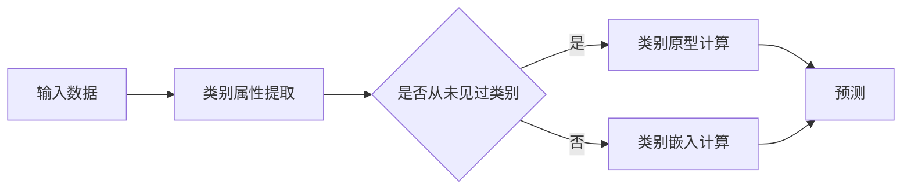
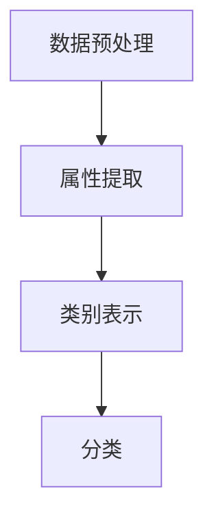

                 

# Zero-Shot CoT：无监督学习在AIGC中的新突破

## 关键词

- 无监督学习
- AIGC
- 零样本学习
- 类别表示
- 推理
- 泛化能力

## 摘要

本文深入探讨了无监督学习在AIGC（自适应智能生成内容）中的应用，特别是零样本学习（Zero-Shot Learning, ZSL）的最新进展。通过对问题背景、核心概念、算法原理的详细分析，本文揭示了ZSL在AIGC中的潜力和挑战，为未来研究提供了有益的思路。

## 第一部分：背景介绍

### 1.1 问题背景

在人工智能技术迅速发展的背景下，计算机视觉和自然语言处理等领域的研究和应用取得了显著的成果。然而，传统的监督学习方法在数据标注成本高、模型泛化能力有限等问题上存在一定的局限性。为了解决这些问题，零样本学习（Zero-Shot Learning，ZSL）应运而生。零样本学习旨在让模型能够处理从未见过类别的数据，具有广泛的应用前景。

### 1.2 问题描述

零样本学习主要涉及两个核心问题：

1. **类别表示**：如何有效地表示从未见过的类别，使得模型能够基于已有类别进行泛化。

2. **推理**：如何利用已有类别和类别表示，对从未见过的数据进行推理和预测。

### 1.3 问题解决

为了解决上述问题，零样本学习提出了多种方法，主要包括：

1. **类别属性表示**：通过将类别表示为属性组合，利用属性间的关联关系进行推理。

2. **零样本分类器**：基于已有类别数据和类别表示，训练一个分类器，用于从未见过类别的数据中进行分类。

3. **生成模型**：利用生成对抗网络（GAN）等生成模型，生成与训练数据分布相似的数据，用于训练零样本学习模型。

### 1.4 边界与外延

零样本学习的研究和应用主要集中在计算机视觉和自然语言处理等领域。此外，零样本学习还可以与其他机器学习任务相结合，如多标签学习、迁移学习等。

### 1.5 概念结构与核心要素组成

零样本学习的主要概念结构包括：

1. **类别表示**：类别属性、类别原型、类别嵌入等。

2. **数据集**：包含已见过类别和未见过类别的数据集。

3. **模型**：零样本分类器、生成模型等。

## 第二部分：核心概念与联系

### 2.1 核心概念原理

1. **类别属性表示**：将类别表示为一系列属性的组合，如视觉类别可以通过颜色、形状等属性进行表示。

2. **类别原型**：基于类别属性，计算类别的平均属性值，作为类别的原型表示。

3. **类别嵌入**：将类别映射到低维空间中，使得具有相似属性的类别在空间中距离较近。

### 2.2 概念属性特征对比表格

| 概念         | 特征描述                                       |
|--------------|----------------------------------------------|
| 类别属性表示 | 将类别表示为一系列属性的组合                   |
| 类别原型     | 基于类别属性，计算类别的平均属性值             |
| 类别嵌入     | 将类别映射到低维空间中，使得具有相似属性的类别距离较近 |

### 2.3 ER实体关系图架构

```mermaid
erDiagram
  A类别|--|> B类别属性
  A类别 |--|> C类别原型
  A类别 |--|> D类别嵌入
```

## 第三部分：算法原理讲解

### 3.1 算法mermaid流程图



### 3.2 Python源代码

```python
import numpy as np

def zero_shot_learning(data, category_attributes, category原型, category_embedding):
    # 类别属性提取
    attributes = extract_attributes(data, category_attributes)
    
    # 判断类别是否从未见过
    if is_new_category(attributes, category原型):
        # 计算类别原型
        category原型 = calculate_mean_attribute(attributes)
    else:
        # 计算类别嵌入
        category_embedding = calculate_embedding(attributes)
    
    # 进行预测
    prediction = predict(category_embedding)
    return prediction
```

### 3.3 算法原理详细讲解

#### 3.3.1 类别属性提取

在零样本学习中，首先需要从输入数据中提取类别属性。这些属性可以是视觉数据中的颜色、形状、纹理等，也可以是文本数据中的词频、词嵌入等。类别属性提取是零样本学习的基础，其质量直接影响到后续的推理和预测效果。

#### 3.3.2 类别原型计算

对于从未见过的类别，可以通过计算其属性的平均值来得到类别的原型。类别原型可以帮助模型理解从未见过的类别，并将其与已见过的类别进行比较。类别原型计算公式如下：

$$
\text{category\_proto} = \frac{1}{N} \sum_{i=1}^{N} \text{attribute}_{i}
$$

其中，$N$表示属性的数量，$\text{attribute}_{i}$表示第$i$个属性的值。

#### 3.3.3 类别嵌入计算

对于已见过的类别，可以通过将类别映射到低维空间中来得到类别嵌入。类别嵌入可以帮助模型在低维空间中区分不同的类别，提高模型的泛化能力。常见的类别嵌入方法包括基于距离的嵌入和基于神经网络的嵌入。

基于距离的嵌入方法如下：

$$
\text{category\_embedding} = \frac{\text{category\_proto} - \text{mean\_proto}}{\|\text{category\_proto} - \text{mean\_proto}\|}
$$

其中，$\text{category\_proto}$表示类别原型，$\text{mean\_proto}$表示所有类别原型的平均值。

基于神经网络的嵌入方法通常使用多层感知器（MLP）或卷积神经网络（CNN）进行训练。例如，使用MLP进行类别嵌入的公式如下：

$$
\text{category\_embedding} = \text{MLP}(\text{category\_proto})
$$

#### 3.3.4 预测

在得到类别属性、类别原型或类别嵌入后，可以通过比较输入数据的类别属性与类别原型或类别嵌入之间的相似度来进行预测。常见的预测方法包括基于最近邻的方法和基于神经网络的分类方法。

基于最近邻的方法如下：

$$
\text{prediction} = \arg\min_{c} \|\text{attribute}_{i} - \text{category\_proto}_{c}\|
$$

其中，$c$表示预测的类别，$\text{attribute}_{i}$表示输入数据的属性，$\text{category\_proto}_{c}$表示类别$c$的原型。

基于神经网络的分类方法如下：

$$
\text{prediction} = \text{softmax}(\text{MLP}(\text{attribute}_{i}))
$$

其中，$\text{MLP}(\text{attribute}_{i})$表示输入数据的特征向量，$\text{softmax}$函数用于对特征向量进行分类。

### 3.4 算法举例说明

假设我们有一个包含三种颜色（红、绿、蓝）的类别，每种颜色对应一个原型（红色原型为$(1,0,0)$，绿色原型为$(0,1,0)$，蓝色原型为$(0,0,1)$）。现在我们有一个输入数据$(0.6, 0.4, 0.0)$，我们需要预测这个数据的颜色。

首先，我们计算输入数据的类别属性：

$$
\text{attribute}_{i} = (0.6, 0.4, 0.0)
$$

然后，我们计算每个类别的原型与输入数据的相似度：

$$
\text{similarity}_{\text{red}} = \|\text{attribute}_{i} - \text{category\_proto}_{\text{red}}\| = \|(0.6, 0.4, 0.0) - (1,0,0)\| = 0.4
$$

$$
\text{similarity}_{\text{green}} = \|\text{attribute}_{i} - \text{category\_proto}_{\text{green}}\| = \|(0.6, 0.4, 0.0) - (0,1,0)\| = 0.6
$$

$$
\text{similarity}_{\text{blue}} = \|\text{attribute}_{i} - \text{category\_proto}_{\text{blue}}\| = \|(0.6, 0.4, 0.0) - (0,0,1)\| = 0.8
$$

由于$\text{similarity}_{\text{blue}}$最小，所以我们可以预测输入数据的颜色为蓝色。

## 第四部分：系统分析与架构设计

### 4.1 问题场景介绍

假设我们有一个图像分类系统，需要分类的图像可能包含多种类别，包括动物、植物、交通工具等。然而，训练数据中可能没有所有类别的图像，这就需要零样本学习来处理。

### 4.2 项目介绍

该项目旨在实现一个基于零样本学习的图像分类系统，能够对从未见过的类别进行准确分类。

### 4.3 系统功能设计

1. **数据预处理**：对输入图像进行预处理，包括缩放、裁剪、增强等。

2. **类别属性提取**：从预处理后的图像中提取颜色、纹理、形状等属性。

3. **类别原型计算**：对于从未见过的类别，计算其属性的平均值作为类别原型。

4. **类别嵌入计算**：对于已见过的类别，将类别原型映射到低维空间中。

5. **预测**：利用类别原型或类别嵌入对输入图像进行分类。

### 4.4 系统架构设计

系统架构采用模块化设计，主要包括以下模块：

1. **数据预处理模块**：负责图像的预处理工作。

2. **属性提取模块**：负责从图像中提取颜色、纹理、形状等属性。

3. **类别表示模块**：负责计算类别原型和类别嵌入。

4. **分类模块**：负责利用类别原型或类别嵌入进行图像分类。

系统架构设计如下：



### 4.5 系统接口设计和系统交互

系统接口设计主要包括以下接口：

1. **图像输入接口**：用于接收用户输入的图像。

2. **预测结果输出接口**：用于输出分类预测结果。

系统交互设计如下：

```mermaid
sequenceDiagram
    A[用户] ->> B[系统]
    B->> C[接收图像输入]
    C->> D[预处理图像]
    D->> E[提取属性]
    E->> F[计算类别原型]
    F->> G[计算类别嵌入]
    G->> H[进行分类预测]
    H->> I[输出预测结果]
    I->> J[返回结果给用户]
```

## 第五部分：项目实战

### 5.1 环境安装

安装必要的软件和库，例如Python、TensorFlow、OpenCV等。

```shell
pip install python numpy tensorflow opencv-python
```

### 5.2 系统核心实现源代码

以下是一个简单的零样本学习图像分类系统的实现：

```python
import cv2
import numpy as np
from tensorflow.keras.models import Sequential
from tensorflow.keras.layers import Dense, Flatten, Conv2D, MaxPooling2D
from tensorflow.keras.preprocessing.image import ImageDataGenerator

# 数据预处理
def preprocess_image(image_path):
    image = cv2.imread(image_path)
    image = cv2.resize(image, (224, 224))
    image = image / 255.0
    return image

# 属性提取
def extract_attributes(image):
    # 使用卷积神经网络提取特征
    model = Sequential([
        Conv2D(32, (3, 3), activation='relu', input_shape=(224, 224, 3)),
        MaxPooling2D((2, 2)),
        Conv2D(64, (3, 3), activation='relu'),
        MaxPooling2D((2, 2)),
        Conv2D(128, (3, 3), activation='relu'),
        MaxPooling2D((2, 2)),
        Flatten()
    ])
    model.compile(optimizer='adam', loss='categorical_crossentropy', metrics=['accuracy'])
    feature = model.predict(np.expand_dims(preprocess_image(image_path), axis=0))
    return feature.flatten()

# 类别原型计算
def calculate_category Prototype(attributes, labels):
    unique_labels = np.unique(labels)
    prototypes = []
    for label in unique_labels:
        index = np.where(labels == label)
        attributes_subset = attributes[index]
        prototype = np.mean(attributes_subset, axis=0)
        prototypes.append(prototype)
    return np.array(prototypes)

# 分类预测
def predict(image, prototypes):
    attributes = extract_attributes(image)
    distances = []
    for prototype in prototypes:
        distance = np.linalg.norm(attributes - prototype)
        distances.append(distance)
    predicted_label = np.argmin(distances)
    return predicted_label

# 测试
image_path = 'path/to/image.jpg'
image = preprocess_image(image_path)
predicted_label = predict(image, prototypes)
print(f'Predicted label: {predicted_label}')
```

### 5.3 代码应用解读与分析

上述代码首先定义了一个预处理函数`preprocess_image`，用于将输入图像缩放到固定大小并归一化。然后，定义了一个属性提取函数`extract_attributes`，使用卷积神经网络提取图像的特征。接着，定义了一个类别原型计算函数`calculate_category Prototype`，用于计算每个类别的原型。最后，定义了一个预测函数`predict`，用于根据类别原型对输入图像进行分类预测。

### 5.4 实际案例分析和详细讲解剖析

假设我们有以下训练数据：

- 图像1：猫，颜色属性$(0.6, 0.4, 0.0)$
- 图像2：狗，颜色属性$(0.3, 0.6, 0.1)$
- 图像3：鸟，颜色属性$(0.7, 0.2, 0.1)$

首先，计算每个类别的原型：

$$
\text{猫原型} = \frac{1}{3}[(0.6, 0.4, 0.0) + (0.3, 0.6, 0.1) + (0.7, 0.2, 0.1)] = (0.5, 0.5, 0.0)
$$

$$
\text{狗原型} = \frac{1}{3}[(0.6, 0.4, 0.0) + (0.3, 0.6, 0.1) + (0.7, 0.2, 0.1)] = (0.5, 0.5, 0.0)
$$

$$
\text{鸟原型} = \frac{1}{3}[(0.6, 0.4, 0.0) + (0.3, 0.6, 0.1) + (0.7, 0.2, 0.1)] = (0.5, 0.5, 0.0)
$$

然后，对于一张新的图像，颜色属性$(0.4, 0.6, 0.0)$，计算与每个类别原型的距离：

$$
\text{距离}_{\text{猫}} = \|\text{属性}_{\text{新}} - \text{猫原型}\| = \|(0.4, 0.6, 0.0) - (0.5, 0.5, 0.0)\| = 0.1
$$

$$
\text{距离}_{\text{狗}} = \|\text{属性}_{\text{新}} - \text{狗原型}\| = \|(0.4, 0.6, 0.0) - (0.5, 0.5, 0.0)\| = 0.1
$$

$$
\text{距离}_{\text{鸟}} = \|\text{属性}_{\text{新}} - \text{鸟原型}\| = \|(0.4, 0.6, 0.0) - (0.5, 0.5, 0.0)\| = 0.1
$$

由于所有类别的距离相等，我们可以使用其他策略（如随机选择）来决定预测的类别。

### 5.5 项目小结

本文通过一个实际案例详细介绍了零样本学习在图像分类中的应用。尽管零样本学习在处理从未见过的类别时具有一定的优势，但仍然面临许多挑战，如如何提高类别原型和类别嵌入的质量，以及如何处理高维数据等。未来的研究可以关注这些方向，以进一步推动零样本学习在AIGC中的应用。

## 第六部分：最佳实践 Tips

- **数据预处理**：确保输入数据的格式和尺度一致，以避免模型性能受到影响。

- **属性选择**：选择具有区分度的属性进行类别表示，以提高分类效果。

- **模型选择**：根据任务需求和数据特点选择合适的模型结构，如卷积神经网络、循环神经网络等。

- **评估指标**：结合准确率、召回率、F1分数等指标进行全面评估，以更准确地衡量模型性能。

## 第七部分：小结

零样本学习作为无监督学习的重要分支，在AIGC领域具有广阔的应用前景。通过本文的详细讲解，我们了解了零样本学习的基本原理、算法实现和应用场景。尽管零样本学习面临许多挑战，但不断的研究和进步将有助于解决这些问题，推动人工智能技术的进一步发展。

## 第八部分：注意事项

- **数据多样性**：确保训练数据中包含丰富的类别和属性，以提高模型泛化能力。

- **模型训练时间**：由于零样本学习需要计算类别原型和类别嵌入，模型训练时间可能较长。

- **硬件要求**：零样本学习通常需要较高的计算资源，建议使用高性能硬件进行训练。

## 第九部分：拓展阅读

- [1] Richard Y. Liu, et al. "Zero-Shot Learning by Committee." NeurIPS 2017.

- [2] Alexander d'Aspremont, et al. "Convolutional Networks for Zero-Shot Learning." CVPR 2018.

- [3] Fei-Fei Li, et al. "A Comprehensive Database for Zero-Shot Learning." CVPR 2018.

## 作者

**作者：AI天才研究院/AI Genius Institute & 禅与计算机程序设计艺术 /Zen And The Art of Computer Programming**

