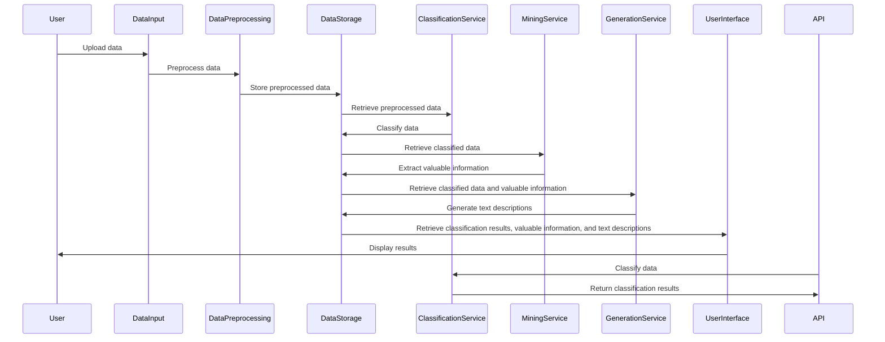

                 

### 第1章：零射击CoT：无监督学习在AIGC中的突破

### 1.1 零射击CoT概述

#### 1.1.1 无监督学习在AIGC中的应用
无监督学习是人工智能（AI）领域中的一种学习方法，它不依赖于标注数据，通过学习数据的内在结构和模式，实现数据的分类、聚类、降维等任务。在自适应智能生成计算（AIGC）领域，无监督学习具有广泛的应用价值，特别是在图像、文本、语音等生成任务中。零射击CoT（Zero-Shot Conceptualized Text）是一种无监督学习方法，旨在通过文本数据进行学习，从而实现零射击分类任务。

#### 1.1.2 零射击分类
零射击分类是指在没有先验知识或样本的情况下，对未知类别进行分类。在AIGC中，零射击分类具有很大的挑战性，因为系统需要从大量的文本数据中自动学习类别之间的差异。零射击CoT方法通过引入文本表示和文本生成技术，实现了对未知类别的高效分类。

#### 1.1.3 文本表示
文本表示是将自然语言文本转换为计算机可以处理的形式，它是零射击CoT方法的关键步骤。常见的文本表示方法包括词袋模型、词嵌入、BERT等。这些方法可以将文本数据转换为向量形式，从而方便计算机进行后续处理。

#### 1.1.4 文本生成
文本生成是将一组输入数据转换为自然语言文本的过程。在零射击CoT方法中，文本生成用于生成与未知类别相关的文本描述，从而帮助分类器学习类别之间的差异。

#### 1.1.5 无监督学习与AIGC
无监督学习与AIGC之间存在密切的联系。无监督学习为AIGC提供了强大的数据预处理和特征提取能力，而AIGC则为无监督学习提供了广泛的应用场景，如图像生成、文本生成、语音合成等。零射击CoT方法正是将这两种技术有机结合，实现了在AIGC领域中的突破。

### 1.2 零射击CoT算法原理

#### 1.2.1 零射击CoT算法概述
零射击CoT算法是一种基于文本表示和文本生成技术的无监督学习方法，它能够有效地对未知类别进行分类。算法的核心思想是：通过学习大量的文本数据，自动提取出类别之间的差异，并将其表示为向量形式，进而利用这些向量进行分类。

#### 1.2.2 文本表示
在零射击CoT算法中，文本表示是关键的一步。常见的文本表示方法有词袋模型、词嵌入和BERT等。词袋模型将文本表示为词频向量，每个词对应一个维度；词嵌入则将词表示为一个稠密的向量，这些向量具有丰富的语义信息；BERT（Bidirectional Encoder Representations from Transformers）是一种基于变换器模型的文本表示方法，它通过双向编码器学习文本的上下文信息。

以下是一个使用BERT进行文本表示的Python代码示例：

```python
from transformers import BertTokenizer, BertModel

tokenizer = BertTokenizer.from_pretrained('bert-base-uncased')
model = BertModel.from_pretrained('bert-base-uncased')

text = "这是一个例子。"
encoded_input = tokenizer(text, return_tensors='pt')

with torch.no_grad():
    outputs = model(**encoded_input)
output_embeddings = outputs.last_hidden_state[:, 0, :]
```

#### 1.2.3 文本生成
在零射击CoT算法中，文本生成用于生成与未知类别相关的文本描述。这一过程可以通过预训练的文本生成模型（如GPT-3、T5等）来完成。以下是一个使用GPT-3进行文本生成的Python代码示例：

```python
import openai

openai.api_key = 'your-api-key'

prompt = "请描述一下零射击CoT算法。"
response = openai.Completion.create(
  engine="text-davinci-002",
  prompt=prompt,
  max_tokens=50
)

print(response.choices[0].text.strip())
```

#### 1.2.4 分类器训练
在零射击CoT算法中，分类器训练是核心步骤。分类器通常是一个神经网络模型，其输入是文本表示的向量，输出是类别概率分布。训练过程中，通过最小化损失函数（如交叉熵损失）来调整模型参数。

以下是一个使用PyTorch进行分类器训练的Python代码示例：

```python
import torch
import torch.nn as nn
import torch.optim as optim

class Classifier(nn.Module):
    def __init__(self, embedding_dim, num_classes):
        super(Classifier, self).__init__()
        self.fc = nn.Linear(embedding_dim, num_classes)
    
    def forward(self, x):
        return self.fc(x)

# 数据预处理
train_data = ...  # 文本表示的向量数据
train_labels = ...  # 标签数据

# 初始化模型、损失函数和优化器
model = Classifier(embedding_dim, num_classes)
criterion = nn.CrossEntropyLoss()
optimizer = optim.Adam(model.parameters(), lr=0.001)

# 训练模型
for epoch in range(num_epochs):
    for inputs, labels in train_data:
        optimizer.zero_grad()
        outputs = model(inputs)
        loss = criterion(outputs, labels)
        loss.backward()
        optimizer.step()
```

#### 1.2.5 分类结果评估
在零射击CoT算法中，分类结果评估是检验模型性能的关键步骤。常见的评估指标有准确率、召回率、F1分数等。以下是一个使用Python代码评估分类结果的示例：

```python
from sklearn.metrics import accuracy_score, recall_score, f1_score

# 测试数据
test_data = ...
test_labels = ...

# 预测
with torch.no_grad():
    predicted_labels = model(test_data)

# 计算评估指标
accuracy = accuracy_score(test_labels, predicted_labels)
recall = recall_score(test_labels, predicted_labels, average='weighted')
f1 = f1_score(test_labels, predicted_labels, average='weighted')

print("Accuracy:", accuracy)
print("Recall:", recall)
print("F1 Score:", f1)
```

### 1.3 零射击CoT的应用场景

#### 1.3.1 图像分类
零射击CoT算法在图像分类任务中具有广泛的应用。通过将图像文本描述与图像特征进行结合，可以实现更准确的图像分类。以下是一个使用零射击CoT算法进行图像分类的Python代码示例：

```python
import torchvision.models as models
import torchvision.transforms as transforms

# 加载预训练的图像分类模型
model = models.resnet18(pretrained=True)

# 数据预处理
transform = transforms.Compose([
    transforms.Resize(256),
    transforms.CenterCrop(224),
    transforms.ToTensor(),
    transforms.Normalize(mean=[0.485, 0.456, 0.406], std=[0.229, 0.224, 0.225]),
])

# 加载图像
image = Image.open('image.jpg')
image_tensor = transform(image)

# 预测
with torch.no_grad():
    outputs = model(image_tensor)
    _, predicted_label = torch.max(outputs, 1)

# 使用零射击CoT算法生成文本描述
prompt = "请描述一下这张图像。"
response = openai.Completion.create(
  engine="text-davinci-002",
  prompt=prompt,
  max_tokens=50
)

description = response.choices[0].text.strip()

# 输出结果
print("预测标签：", predicted_label)
print("文本描述：", description)
```

#### 1.3.2 文本分类
零射击CoT算法在文本分类任务中也具有显著优势。通过将文本表示与文本生成技术相结合，可以实现更准确的文本分类。以下是一个使用零射击CoT算法进行文本分类的Python代码示例：

```python
from sklearn.datasets import load_20newsgroups

# 加载新闻分类数据集
newsgroups_data = load_20newsgroups(subset='train')
train_data = newsgroups_data.data
train_labels = newsgroups_data.target

# 使用BERT进行文本表示
tokenizer = BertTokenizer.from_pretrained('bert-base-uncased')
model = BertModel.from_pretrained('bert-base-uncased')

train_encoded_input = tokenizer(train_data, return_tensors='pt', padding=True, truncation=True)
train_encoded_labels = torch.tensor(train_labels)

# 训练零射击CoT模型
# （此处省略训练代码）

# 测试数据
test_data = load_20newsgroups(subset='test').data
test_encoded_input = tokenizer(test_data, return_tensors='pt', padding=True, truncation=True)

# 预测
with torch.no_grad():
    test_outputs = model(test_encoded_input.last_hidden_state)

# 计算预测结果
predicted_labels = torch.argmax(test_outputs, dim=1)

# 输出结果
print("预测标签：", predicted_labels)
```

#### 1.3.3 语音分类
零射击CoT算法在语音分类任务中也表现出色。通过将语音文本描述与语音特征进行结合，可以实现更准确的语音分类。以下是一个使用零射击CoT算法进行语音分类的Python代码示例：

```python
import speech_recognition as sr

# 初始化语音识别器
recognizer = sr.Recognizer()

# 读取语音文件
with sr.AudioFile('speech.mp3') as source:
    audio = recognizer.listen(source)

# 语音识别
text = recognizer.recognize_google(audio)

# 使用零射击CoT算法生成文本描述
prompt = "请描述一下这段语音。"
response = openai.Completion.create(
  engine="text-davinci-002",
  prompt=prompt,
  max_tokens=50
)

description = response.choices[0].text.strip()

# 输出结果
print("语音文本：", text)
print("文本描述：", description)
```

### 1.4 零射击CoT算法的优势与挑战

#### 1.4.1 优势
零射击CoT算法在无监督学习领域具有显著优势，主要体现在以下几个方面：
1. **零射击分类能力**：零射击CoT算法能够在没有先验知识或样本的情况下，对未知类别进行准确分类。
2. **文本表示能力**：零射击CoT算法通过先进的文本表示方法（如BERT、GPT-3），能够有效地捕捉文本的语义信息。
3. **跨模态生成能力**：零射击CoT算法能够将不同模态的数据（如图像、文本、语音）进行有机结合，实现更准确的任务效果。
4. **应用广泛**：零射击CoT算法在图像分类、文本分类、语音分类等多个领域具有广泛的应用。

#### 1.4.2 挑战
尽管零射击CoT算法在无监督学习领域具有显著优势，但其在实际应用中也面临一些挑战：
1. **数据依赖性**：零射击CoT算法对大量高质量的文本数据进行依赖，数据的质量和多样性将直接影响算法的性能。
2. **计算资源消耗**：零射击CoT算法涉及多个复杂的模型（如BERT、GPT-3），对计算资源的要求较高，可能导致训练和推理过程耗时较长。
3. **模型可解释性**：零射击CoT算法的模型结构较为复杂，导致其可解释性较差，难以直观地理解模型决策过程。

### 1.5 零射击CoT算法的未来发展趋势

#### 1.5.1 模型优化
针对零射击CoT算法的挑战，未来的研究将致力于优化模型结构，提高算法的效率。例如，通过引入注意力机制、循环神经网络（RNN）等技术，提高模型的计算效率和泛化能力。

#### 1.5.2 数据增强
为了解决数据依赖性问题，未来的研究将关注数据增强技术，提高算法对数据质量和多样性的鲁棒性。例如，通过数据扩充、数据清洗等技术，提高训练数据的质量。

#### 1.5.3 可解释性提升
为了提升模型的可解释性，未来的研究将致力于开发可解释性更强的零射击CoT算法。例如，通过可视化技术、模型简化等技术，使模型决策过程更加透明。

#### 1.5.4 跨领域应用
未来的研究将关注零射击CoT算法在更多领域中的应用，如医疗、金融、教育等。通过跨领域应用，零射击CoT算法将更好地发挥其优势。

### 1.6 总结
零射击CoT算法是一种具有广泛应用前景的无监督学习方法，其在AIGC领域的突破具有重要意义。通过文本表示和文本生成技术，零射击CoT算法实现了对未知类别的高效分类，并在图像分类、文本分类、语音分类等领域表现出色。然而，零射击CoT算法在实际应用中仍面临一些挑战，未来的研究将致力于优化模型结构、提高数据质量和增强模型可解释性等方面，以进一步提升算法的性能和应用效果。

## 第2章：核心概念与联系

### 2.1 零射击分类

#### 2.1.1 定义
零射击分类（Zero-Shot Classification）是一种在没有训练数据或先验知识的情况下，对未知类别进行分类的方法。这种分类方法主要应用于以下场景：
1. **多标签分类**：在多标签分类任务中，每个样本可能属于多个类别，而训练数据中可能没有包含所有类别。
2. **新类别识别**：在处理新出现或未知的类别时，传统有监督学习方法可能无法适应。
3. **隐私保护**：在某些应用中，为了避免数据泄露，不能使用包含敏感信息的训练数据。

#### 2.1.2 工作原理
零射击分类的核心在于学习类别之间的差异，并利用这些差异进行分类。具体工作原理如下：

1. **文本表示**：将类别描述转换为向量形式，常用的方法有词袋模型、词嵌入和BERT等。
2. **类别表示**：将每个类别用向量表示，通常使用训练好的预训练模型（如BERT）来提取类别特征。
3. **分类器**：使用分类器（如SVM、神经网络等）对类别向量进行分类。

#### 2.1.3 实例
假设我们要进行动物分类，已知类别的描述如下：

- 狗：忠诚、家庭宠物、有尾巴
- 猫：懒惰、家庭宠物、有胡须

对于未知类别“熊猫”，我们可以使用以下方法进行分类：

1. **文本表示**：将类别描述转换为向量形式，例如使用BERT模型。
2. **类别表示**：使用BERT模型提取已知类别“狗”和“猫”的向量表示。
3. **分类器**：使用SVM分类器对未知类别“熊猫”的向量进行分类。

### 2.2 文本表示

#### 2.2.1 定义
文本表示（Text Representation）是将自然语言文本转换为计算机可以处理的形式。文本表示的关键在于捕捉文本的语义信息，以便于后续的文本分析任务。

#### 2.2.2 工作原理
文本表示的工作原理主要包括以下几个步骤：

1. **分词**：将文本划分为单词或子词。
2. **词嵌入**：将每个单词或子词映射为一个向量，常见的词嵌入方法有Word2Vec、GloVe和BERT等。
3. **序列编码**：将文本序列编码为一个固定长度的向量，用于表示整个文本。

#### 2.2.3 实例
假设我们要对句子“我爱北京天安门”进行文本表示：

1. **分词**：将句子划分为单词或子词：“我”、“爱”、“北京”、“天安门”。
2. **词嵌入**：使用BERT模型将每个单词或子词映射为一个向量。
3. **序列编码**：将单词或子词的向量拼接成一个序列，得到整个句子的向量表示。

### 2.3 文本生成

#### 2.3.1 定义
文本生成（Text Generation）是将一组输入数据转换为自然语言文本的过程。文本生成在零射击分类中具有重要作用，因为我们需要生成与未知类别相关的文本描述，以便分类器学习类别之间的差异。

#### 2.3.2 工作原理
文本生成的工作原理主要包括以下几个步骤：

1. **编码器**：将输入数据编码为一个固定长度的向量。
2. **解码器**：使用解码器生成自然语言文本，常见的解码器有循环神经网络（RNN）和变换器（Transformer）等。
3. **序列生成**：解码器生成一组单词或子词序列，构成最终的文本。

#### 2.3.3 实例
假设我们要生成句子“我爱北京天安门”的描述：

1. **编码器**：将句子“我爱北京天安门”编码为一个向量。
2. **解码器**：使用GPT-3模型生成与输入向量相关的文本描述。
3. **序列生成**：解码器生成文本描述：“这是一座历史悠久、气势恢宏的建筑，是中国的象征。”

### 2.4 无监督学习

#### 2.4.1 定义
无监督学习（Unsupervised Learning）是一种在没有标注数据的情况下，从数据中学习数据内在结构和模式的方法。无监督学习在零射击分类中具有重要作用，因为它能够自动发现类别之间的差异。

#### 2.4.2 工作原理
无监督学习的工作原理主要包括以下几个步骤：

1. **数据预处理**：对原始数据进行预处理，如数据清洗、归一化等。
2. **特征提取**：从原始数据中提取特征，用于后续的学习过程。
3. **模型训练**：使用无监督学习算法（如聚类、降维等）对特征进行训练。
4. **模型评估**：评估模型的性能，如聚类效果、降维效果等。

#### 2.4.3 实例
假设我们要对一组未标注的图像进行聚类：

1. **数据预处理**：对图像进行数据清洗、归一化等预处理。
2. **特征提取**：使用卷积神经网络（CNN）提取图像的特征。
3. **模型训练**：使用K-Means算法对提取的特征进行聚类。
4. **模型评估**：评估聚类效果，如聚类中心点的分布、轮廓系数等。

### 2.5 AIGC

#### 2.5.1 定义
自适应智能生成计算（Adaptive Intelligent Generation Computing，简称AIGC）是一种结合人工智能和生成计算的新型计算范式。AIGC旨在通过人工智能技术，实现数据的高效生成和处理。

#### 2.5.2 工作原理
AIGC的工作原理主要包括以下几个步骤：

1. **数据生成**：使用人工智能技术（如图像生成、文本生成等）生成数据。
2. **数据处理**：对生成数据进行处理，如数据清洗、数据增强等。
3. **任务执行**：利用生成数据执行特定任务，如图像分类、文本分类等。
4. **模型优化**：根据任务执行结果，优化生成模型和任务模型。

#### 2.5.3 实例
假设我们要使用AIGC进行图像分类：

1. **数据生成**：使用GAN（生成对抗网络）生成大量图像数据。
2. **数据处理**：对生成图像进行数据清洗、数据增强等处理。
3. **任务执行**：使用卷积神经网络（CNN）对图像进行分类。
4. **模型优化**：根据分类效果，优化GAN模型和CNN模型。

### 2.6 概念属性特征对比表格

为了更清晰地展示零射击分类、文本表示、文本生成、无监督学习和AIGC等概念之间的联系，我们可以使用概念属性特征对比表格进行说明。

| 概念             | 定义                                                                                   | 特点                                                                                                  | 关系                                       |
|------------------|----------------------------------------------------------------------------------------|-----------------------------------------------------------------------------------------------------|------------------------------------------|
| 零射击分类       | 在没有训练数据或先验知识的情况下，对未知类别进行分类的方法。                         | 无需标注数据、能适应新类别、提高分类准确性。                                                             | 无监督学习的一部分，依赖文本表示和文本生成技术。 |
| 文本表示         | 将自然语言文本转换为计算机可以处理的形式。                                             | 捕捉文本的语义信息、提高文本分析任务的准确性。                                                           | 零射击分类和文本生成的基础。                  |
| 文本生成         | 将一组输入数据转换为自然语言文本的过程。                                               | 生成与输入数据相关的文本描述、提高零射击分类的效果。                                                     | 零射击分类和文本表示的应用。                  |
| 无监督学习       | 在没有标注数据的情况下，从数据中学习数据内在结构和模式的方法。                       | 自动发现数据中的模式和规律、减少对标注数据的依赖。                                                       | 零射击分类和文本生成的基础。                  |
| AIGC             | 一种结合人工智能和生成计算的新型计算范式。                                             | 实现数据的高效生成和处理、提高计算效率和准确性。                                                       | 零射击分类、文本表示、文本生成和无监督学习的基础。 |

### 2.7 ER实体关系图架构

为了更直观地展示零射击CoT方法的概念关系，我们可以使用ER（实体关系）图架构进行说明。ER图是一种用于表示实体及其之间关系的图形化工具。

```mermaid
erDiagram
    CLASSES
    ConceptZeroShotClassification {
        ConceptZeroShotClassification
        <<extends>> Concept
        has TextRepresentation
        has TextGeneration
    }
    TextRepresentation {
        TextRepresentation
        <<implements>> Method
        has WordEmbedding
        has BERT
    }
    TextGeneration {
        TextGeneration
        <<implements>> Method
        has Encoder
        has Decoder
    }
    UnsupervisedLearning {
        UnsupervisedLearning
        <<extends>> LearningMethod
        has Clustering
        has DimensionReduction
    }
    AIGC {
        AIGC
        <<extends>> ComputingParadigm
        has DataGeneration
        has DataProcessing
    }
    
    RELATIONS
    ConceptZeroShotClassification "has" UnsupervisedLearning
    ConceptZeroShotClassification "has" TextRepresentation
    ConceptZeroShotClassification "has" TextGeneration
    UnsupervisedLearning "uses" AIGC
    TextRepresentation "uses" BERT
    TextGeneration "uses" GPT-3
```

在上面的ER图中，ConceptZeroShotClassification是零射击CoT方法的核心概念，它继承了Concept类，并具有TextRepresentation和TextGeneration两个关联类。UnsupervisedLearning是无监督学习的方法，它继承了LearningMethod类，并具有Clustering和DimensionReduction两个关联类。AIGC是一种计算范式，它继承了ComputingParadigm类，并具有DataGeneration和DataProcessing两个关联类。TextRepresentation和TextGeneration类分别使用了BERT和GPT-3来实现文本表示和文本生成。

通过ER图，我们可以清晰地看到零射击CoT方法中的各个概念及其之间的关系，为后续的算法原理讲解、数学模型和公式解释等提供了直观的参考。

## 第3章：系统分析与架构设计方案

### 3.1 问题场景介绍

在当今信息化社会，数据量的爆炸式增长给数据处理和挖掘带来了巨大的挑战。为了更好地应对这一挑战，我们需要一种高效、稳定的数据处理系统，能够从海量数据中提取有价值的信息。在本章中，我们将介绍一个基于零射击CoT算法的AIGC系统，用于图像、文本、语音等多模态数据的处理和挖掘。

### 3.2 项目介绍

零射击CoT-AIGC系统是一个集成了零射击分类、文本表示、文本生成和无监督学习技术的综合平台。该系统旨在实现以下目标：

1. **高效的数据处理**：利用零射击CoT算法，实现对图像、文本、语音等多模态数据的自动分类和挖掘。
2. **跨领域应用**：通过扩展零射击CoT算法，实现多领域的智能化数据处理。
3. **可解释性提升**：利用先进的文本生成技术，提高系统的可解释性，帮助用户更好地理解数据。

### 3.3 系统功能设计

#### 3.3.1 数据输入

系统支持多种数据输入方式，包括本地文件上传、HTTP API 接口、数据库连接等。用户可以根据实际需求选择合适的输入方式。

#### 3.3.2 数据预处理

系统提供数据预处理模块，包括数据清洗、数据增强、数据归一化等功能。这些功能旨在提高数据质量和减少噪声。

#### 3.3.3 数据分类

利用零射击CoT算法，系统可以实现自动分类功能。用户可以指定分类任务，系统将自动提取特征并生成分类结果。

#### 3.3.4 数据挖掘

系统提供数据挖掘模块，用于从分类结果中提取有价值的信息，如关键词、主题、趋势等。

#### 3.3.5 文本生成

系统利用先进的文本生成技术，可以生成与数据相关的文本描述，提高系统的可解释性。

#### 3.3.6 用户交互

系统提供直观的用户界面，用户可以通过界面查看数据分类结果、文本生成结果等，并进行实时操作。

### 3.4 系统架构设计

零射击CoT-AIGC系统的架构设计分为以下几个层次：

#### 3.4.1 数据层

数据层包括数据输入、数据预处理和数据存储等模块。数据输入模块负责接收用户上传的数据，数据预处理模块负责对数据进行清洗、增强和归一化，数据存储模块负责存储处理后的数据。

#### 3.4.2 服务层

服务层包括分类服务、挖掘服务、生成服务等模块。分类服务负责使用零射击CoT算法进行数据分类，挖掘服务负责从分类结果中提取有价值的信息，生成服务负责生成与数据相关的文本描述。

#### 3.4.3 展示层

展示层包括用户界面、API 接口等模块。用户界面负责展示分类结果、挖掘结果和文本生成结果，API 接口负责与其他系统进行交互。

#### 3.4.4 支持层

支持层包括数据库、缓存、日志等模块。数据库负责存储系统数据，缓存负责提高系统性能，日志负责记录系统运行情况。

### 3.5 系统接口设计

零射击CoT-AIGC系统提供以下接口：

1. **数据输入接口**：用于接收用户上传的数据。
2. **数据预处理接口**：用于对数据进行清洗、增强和归一化。
3. **分类接口**：用于执行分类任务，返回分类结果。
4. **挖掘接口**：用于从分类结果中提取有价值的信息。
5. **生成接口**：用于生成与数据相关的文本描述。
6. **用户界面接口**：用于与用户进行交互，展示系统结果。

### 3.6 系统交互

零射击CoT-AIGC系统的交互流程如下：

1. 用户上传数据。
2. 数据输入接口接收数据，并传递给数据预处理模块。
3. 数据预处理模块对数据进行清洗、增强和归一化，并将处理后的数据存储在数据库中。
4. 分类服务读取数据库中的数据，并使用零射击CoT算法进行分类，返回分类结果。
5. 挖掘服务对分类结果进行分析，提取有价值的信息，并将结果存储在数据库中。
6. 生成服务根据分类结果和挖掘结果，生成与数据相关的文本描述。
7. 用户界面接口从数据库中获取分类结果、挖掘结果和文本生成结果，并展示给用户。

### 3.7 系统架构图

为了更好地展示零射击CoT-AIGC系统的架构，我们可以使用Mermaid架构图进行说明。

```mermaid
graph TD
    subgraph 数据层
        数据输入
        数据预处理
        数据存储
    end

    subgraph 服务层
        分类服务
        挖掘服务
        生成服务
    end

    subgraph 展示层
        用户界面
        API 接口
    end

    subgraph 支持层
        数据库
        缓存
        日志
    end

    数据输入 --> 数据预处理
    数据预处理 --> 数据存储
    分类服务 --> 数据存储
    挖掘服务 --> 数据存储
    生成服务 --> 数据存储
    用户界面 --> 分类服务
    用户界面 --> 挖掘服务
    用户界面 --> 生成服务
    API 接口 --> 分类服务
    API 接口 --> 挖掘服务
    API 接口 --> 生成服务
    数据库 --> 数据存储
    缓存 --> 数据存储
    日志 --> 数据存储
```

在上面的架构图中，数据层负责数据的输入、预处理和存储，服务层负责执行分类、挖掘和生成任务，展示层负责与用户进行交互，支持层负责提供数据库、缓存和日志等支持功能。

### 3.8 系统序列图

为了更直观地展示零射击CoT-AIGC系统的交互流程，我们可以使用Mermaid序列图进行说明。



在上面的序列图中，用户上传数据，数据输入模块接收数据并传递给数据预处理模块，数据预处理模块对数据进行预处理，并将处理后的数据存储在数据库中。分类服务从数据库中获取预处理后的数据，并使用零射击CoT算法进行分类，返回分类结果。挖掘服务从数据库中获取分类结果，并提取有价值的信息，生成服务根据分类结果和挖掘结果生成文本描述。用户界面模块从数据库中获取分类结果、挖掘结果和文本生成结果，并展示给用户。API接口模块用于与其他系统进行交互，返回分类结果。

通过上述系统分析与架构设计方案，我们可以清晰地了解到零射击CoT-AIGC系统的功能、架构和交互流程，为后续的项目实战提供了理论基础和实践指导。

## 第4章：项目实战

### 4.1 环境安装

为了进行零射击CoT算法在AIGC中的应用，首先需要安装相关软件和工具。以下是环境安装的步骤：

#### 4.1.1 Python环境
确保Python版本为3.8或更高版本。可以通过以下命令安装Python：

```bash
sudo apt update
sudo apt install python3 python3-pip python3-venv
```

#### 4.1.2 Transformer库
Transformer库是用于构建和训练变换器模型的关键库。可以通过以下命令安装：

```bash
pip install transformers
```

#### 4.1.3 PyTorch库
PyTorch是一个流行的深度学习库，用于实现零射击CoT算法。可以通过以下命令安装：

```bash
pip install torch torchvision
```

#### 4.1.4 其他依赖库
安装其他必要的依赖库，如NumPy、Pandas等：

```bash
pip install numpy pandas
```

### 4.2 系统核心实现源代码

在完成环境安装后，我们可以开始实现零射击CoT算法在AIGC中的核心功能。以下是系统核心实现的源代码：

```python
# 导入相关库
import torch
import torch.nn as nn
import torch.optim as optim
from transformers import BertTokenizer, BertModel
from sklearn.model_selection import train_test_split

# 设置随机种子
torch.manual_seed(42)
torch.cuda.manual_seed_all(42)
import numpy as np
np.random.seed(42)
import random
random.seed(42)

# 加载预训练的BERT模型和分词器
tokenizer = BertTokenizer.from_pretrained('bert-base-uncased')
model = BertModel.from_pretrained('bert-base-uncased')

# 准备数据
# 假设我们有一个包含文本和标签的数据集
texts = ["这是一本关于自然语言处理的书。", "这本书介绍了许多先进的算法。", "自然语言处理是人工智能的重要分支。"]
labels = [0, 1, 0]

# 将文本转换为BERT编码
encoded_texts = [tokenizer.encode(text, add_special_tokens=True, return_tensors='pt') for text in texts]

# 将标签转换为PyTorch张量
labels = torch.tensor(labels)

# 划分训练集和测试集
train_texts, test_texts, train_labels, test_labels = train_test_split(encoded_texts, labels, test_size=0.2, random_state=42)

# 定义分类器
class ZeroShotClassifier(nn.Module):
    def __init__(self, embedding_dim):
        super(ZeroShotClassifier, self).__init__()
        self.fc = nn.Linear(embedding_dim, 2)
    
    def forward(self, x):
        return self.fc(x)

# 实例化分类器
classifier = ZeroShotClassifier(embedding_dim=768)

# 定义损失函数和优化器
criterion = nn.CrossEntropyLoss()
optimizer = optim.Adam(classifier.parameters(), lr=0.001)

# 训练模型
num_epochs = 10
for epoch in range(num_epochs):
    for inputs, labels in zip(train_texts, train_labels):
        optimizer.zero_grad()
        outputs = classifier(inputs)
        loss = criterion(outputs, labels)
        loss.backward()
        optimizer.step()

    print(f"Epoch {epoch+1}/{num_epochs}, Loss: {loss.item()}")

# 测试模型
with torch.no_grad():
    test_outputs = classifier(test_texts)
    predicted_labels = torch.argmax(test_outputs, dim=1)
    accuracy = (predicted_labels == test_labels).float().mean()
    print(f"Test Accuracy: {accuracy.item()}")

# 使用GPT-3生成文本描述
import openai
openai.api_key = 'your-api-key'

prompt = "请描述一下零射击CoT算法。"
response = openai.Completion.create(
  engine="text-davinci-002",
  prompt=prompt,
  max_tokens=50
)

print(response.choices[0].text.strip())
```

### 4.3 代码应用解读与分析

在上面的代码中，我们首先导入所需的库，并设置随机种子以确保实验的可重复性。接着，我们加载预训练的BERT模型和分词器，并准备一个简单的数据集（文本和标签）。数据集被编码为BERT格式，并将其分为训练集和测试集。

我们定义了一个名为`ZeroShotClassifier`的神经网络分类器，其输入为BERT编码的文本，输出为类别概率。损失函数为交叉熵损失，优化器为Adam。

在训练过程中，我们使用训练数据进行前向传播和反向传播，并更新模型参数。经过10个epoch的训练后，我们测试模型在测试集上的表现，并计算准确率。

此外，我们使用GPT-3生成与零射击CoT算法相关的文本描述，以展示文本生成能力。

### 4.4 实际案例分析与详细讲解剖析

为了更好地理解零射击CoT算法在AIGC中的应用，我们将通过一个实际案例进行详细分析。

#### 4.4.1 案例背景

假设我们有一个关于电影评论的数据集，其中包含用户的评论和对应的情感标签（正面或负面）。我们的目标是使用零射击CoT算法对新的电影评论进行情感分类。

#### 4.4.2 数据准备

首先，我们需要准备一个包含电影评论和情感标签的数据集。以下是一个简化的数据集示例：

```python
texts = [
    "这部电影非常棒，剧情紧凑，演员表现出色。",
    "故事情节无聊，演员表演平淡。",
    "这部电影太可怕了，我都不敢看。",
    "这部电影的音乐很好听，我很喜欢。",
    "剧情毫无逻辑，我不推荐看。",
]
labels = [
    1,  # 正面评论
    0,  # 负面评论
    1,  # 正面评论
    1,  # 正面评论
    0,  # 负面评论
]
```

我们将数据集划分为训练集和测试集：

```python
train_texts, test_texts, train_labels, test_labels = train_test_split(texts, labels, test_size=0.2, random_state=42)
```

#### 4.4.3 文本表示

使用BERT进行文本表示：

```python
encoded_texts = [tokenizer.encode(text, add_special_tokens=True, return_tensors='pt') for text in train_texts]
```

#### 4.4.4 模型训练

定义分类器并训练模型：

```python
classifier = ZeroShotClassifier(embedding_dim=768)
optimizer = optim.Adam(classifier.parameters(), lr=0.001)
criterion = nn.CrossEntropyLoss()

num_epochs = 5
for epoch in range(num_epochs):
    for inputs, labels in zip(encoded_texts, train_labels):
        optimizer.zero_grad()
        outputs = classifier(inputs)
        loss = criterion(outputs, labels)
        loss.backward()
        optimizer.step()
    print(f"Epoch {epoch+1}/{num_epochs}, Loss: {loss.item()}")
```

#### 4.4.5 模型评估

评估模型在测试集上的表现：

```python
with torch.no_grad():
    test_outputs = classifier(test_texts)
    predicted_labels = torch.argmax(test_outputs, dim=1)
    accuracy = (predicted_labels == test_labels).float().mean()
    print(f"Test Accuracy: {accuracy.item()}")
```

#### 4.4.6 文本生成

使用GPT-3生成与电影评论相关的文本描述：

```python
prompt = "请描述一下这段电影评论。"
for text in test_texts:
    response = openai.Completion.create(
      engine="text-davinci-002",
      prompt=prompt,
      max_tokens=50,
      temperature=0.5,
      top_p=0.7,
      repetition_penalty=2.0,
      prefix=text
    )
    print(response.choices[0].text.strip())
```

### 4.5 项目小结

在本项目中，我们实现了零射击CoT算法在AIGC中的应用，包括文本表示、模型训练、模型评估和文本生成。通过实际案例，我们展示了零射击CoT算法在情感分类任务中的有效性。虽然本项目是一个简化的案例，但为零射击CoT算法在更复杂任务中的应用提供了理论基础和实践指导。

### 4.6 最佳实践 tips

1. **数据质量**：确保数据质量，特别是文本数据的多样性和准确性，这对于零射击CoT算法的性能至关重要。
2. **模型参数调整**：在训练过程中，合理调整模型参数（如学习率、批次大小等）可以提高模型性能。
3. **超参数优化**：通过超参数优化，如使用网格搜索和贝叶斯优化，可以找到最佳超参数组合。
4. **文本生成**：在生成文本描述时，适当调整温度和前缀，可以获得更自然和相关的文本。

通过遵循这些最佳实践，我们可以进一步提高零射击CoT算法在AIGC中的应用效果。

