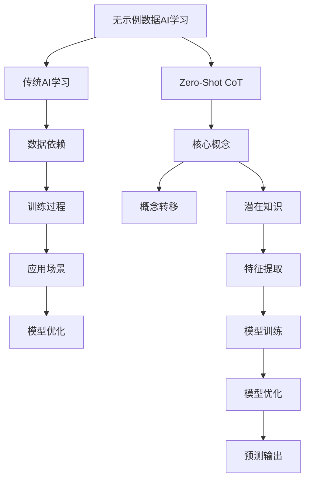
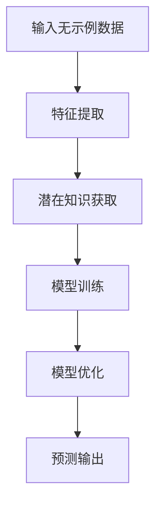
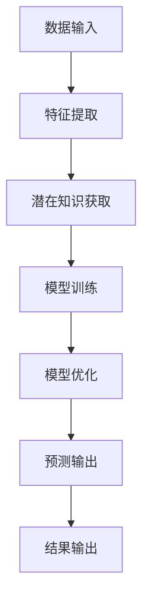
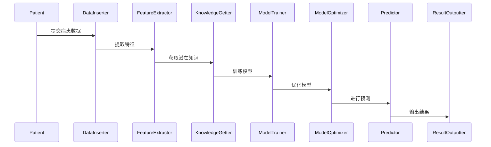

                 

# 《Zero-Shot CoT：无示例数据的AI学习新范式探讨》

## 关键词：Zero-Shot CoT，无示例数据学习，人工智能，算法原理，应用场景

### 摘要

随着人工智能技术的不断发展，AI在许多领域取得了显著成就。然而，大多数AI系统都依赖于大量已标注的示例数据来进行训练。这种依赖性限制了AI在现实世界中的应用，尤其是在数据稀缺或无法获取标注数据的情况下。本文将探讨一种新的AI学习范式——Zero-Shot CoT（Zero-Shot Concept Transfer），该范式无需示例数据即可进行学习，为AI在数据稀缺场景下的应用提供了新的可能性。本文将详细介绍Zero-Shot CoT的核心概念、算法原理及其应用场景。

## 《Zero-Shot CoT：无示例数据的AI学习新范式探讨》目录大纲

## 第一部分：背景介绍

### 1.1 问题背景

AI发展现状与挑战

### 1.2 问题描述

传统AI学习范式

无示例数据AI学习的特点与挑战

### 1.3 问题解决

Zero-Shot CoT概念介绍

无示例数据AI学习的解决方案

### 1.4 边界与外延

Zero-Shot CoT的应用领域

无示例数据AI学习的适用场景

### 1.5 概念结构与核心要素组成

Zero-Shot CoT的核心概念

无示例数据AI学习的核心要素

## 第二部分：核心概念与联系

### 2.1 核心概念原理

传统AI学习范式

无示例数据AI学习

### 2.2 概念属性特征对比表格

| 特征        | 传统AI学习              | 无示例数据AI学习             |
|-------------|------------------------|-----------------------------|
| 数据依赖    | 强依赖示例数据          | 弱依赖或无依赖示例数据       |
| 训练过程    | 大量数据训练            | 零样本或少量样本训练         |
| 应用场景    | 有明确数据标注的场景    | 无法获得或无法标注数据的场景 |
| 模型优化    | 基于历史数据优化模型    | 基于潜在知识优化模型         |

### 2.3 ER实体关系图架构

## 第三部分：算法原理讲解

### 3.1 算法mermaid流程图

### 3.2 Python源代码示例

### 3.3 算法原理详细讲解

**特征提取**：从输入的无示例数据中提取关键特征，以便后续模型训练。

**潜在知识获取**：利用已有的知识库或预训练模型，获取与无示例数据相关的潜在知识。

**模型训练**：基于提取到的特征和潜在知识，训练出一个新的模型。

**模型优化**：通过进一步优化模型参数，提高模型在未知数据上的性能。

**预测输出**：利用训练好的模型对未知数据进行预测。

## 第一部分：背景介绍

### 1.1 问题背景

人工智能（AI）技术近年来取得了飞速发展，已经广泛应用于图像识别、自然语言处理、推荐系统等领域。然而，这些AI系统的训练过程通常依赖于大量已标注的示例数据。例如，一个图像识别模型可能需要成千上万的带有标签的图像来进行训练。这种依赖性使得AI系统在面对数据稀缺的场景时，往往无法发挥其潜力。

### 1.2 问题描述

传统AI学习范式主要依赖于示例数据进行训练。在理想情况下，研究人员会收集大量的标注数据，然后使用这些数据来训练模型。然而，在实际应用中，数据稀缺或无法获取标注数据的情况时有发生。例如：

1. **医疗领域**：在医疗诊断中，许多疾病的数据标注成本高昂，而且获取困难。
2. **工业应用**：在工业自动化领域，一些特定的生产过程和故障数据难以获取。
3. **环境监测**：在环境监测中，获取特定区域的气象、地理等数据可能需要大量的人力和物力。

这些场景下的AI应用面临一个共同的问题：缺乏足够的示例数据来训练模型。因此，如何在没有足够示例数据的情况下进行AI学习，成为一个亟待解决的问题。

### 1.3 问题解决

为了解决无示例数据AI学习的挑战，研究人员提出了一种新的学习范式——Zero-Shot CoT（Zero-Shot Concept Transfer）。Zero-Shot CoT的核心思想是利用已有的知识库或预训练模型，从潜在知识中提取信息，从而在无需大量示例数据的情况下进行学习。

### 1.4 边界与外延

Zero-Shot CoT的应用领域非常广泛。例如：

1. **跨领域迁移**：在数据稀缺的领域，可以使用其他领域的大量数据来训练模型，从而实现跨领域的迁移学习。
2. **小样本学习**：在样本数据不足的情况下，Zero-Shot CoT可以帮助模型从潜在知识中学习，提高小样本学习的效果。
3. **知识增强**：在已有模型的基础上，Zero-Shot CoT可以引入外部知识，从而增强模型的泛化能力。

### 1.5 概念结构与核心要素组成

Zero-Shot CoT的核心概念包括以下几个方面：

1. **概念转移**：将已知领域的知识转移到未知领域。
2. **潜在知识**：从已有知识库或预训练模型中提取潜在知识。
3. **特征提取**：从输入数据中提取关键特征。
4. **模型训练**：基于提取到的特征和潜在知识，训练出一个新的模型。
5. **模型优化**：通过进一步优化模型参数，提高模型在未知数据上的性能。

无示例数据AI学习的核心要素包括：

1. **数据预处理**：对输入数据进行预处理，以便提取特征。
2. **知识获取**：从已有的知识库或预训练模型中获取潜在知识。
3. **模型训练与优化**：基于提取到的特征和潜在知识，训练并优化模型。
4. **预测与评估**：使用训练好的模型对未知数据进行预测，并评估模型的性能。

## 第二部分：核心概念与联系

### 2.1 核心概念原理

传统AI学习范式和无示例数据AI学习是两种不同的学习范式。传统AI学习范式依赖于大量的示例数据进行训练，而无示例数据AI学习则试图通过其他途径，如潜在知识获取和概念转移，来实现学习。

传统AI学习范式：

- **数据依赖**：强依赖已标注的示例数据。
- **训练过程**：大量数据训练。
- **应用场景**：有明确数据标注的场景。
- **模型优化**：基于历史数据优化模型。

无示例数据AI学习：

- **数据依赖**：弱依赖或无依赖示例数据。
- **训练过程**：零样本或少量样本训练。
- **应用场景**：无法获得或无法标注数据的场景。
- **模型优化**：基于潜在知识优化模型。

### 2.2 概念属性特征对比表格

下面是一个概念属性特征对比表格，展示了传统AI学习范式和无示例数据AI学习在几个关键特征上的差异：

| 特征        | 传统AI学习              | 无示例数据AI学习             |
|-------------|------------------------|-----------------------------|
| 数据依赖    | 强依赖示例数据          | 弱依赖或无依赖示例数据       |
| 训练过程    | 大量数据训练            | 零样本或少量样本训练         |
| 应用场景    | 有明确数据标注的场景    | 无法获得或无法标注数据的场景 |
| 模型优化    | 基于历史数据优化模型    | 基于潜在知识优化模型         |

### 2.3 ER实体关系图架构

为了更好地理解Zero-Shot CoT的核心概念和关系，我们可以使用ER（实体-关系）图来表示。以下是一个ER实体关系图的示例：



在这个ER图中，无示例数据AI学习和传统AI学习通过数据依赖、训练过程、应用场景和模型优化等特征相互联系。Zero-Shot CoT作为无示例数据AI学习的一种实现方式，通过核心概念（概念转移和潜在知识）与无示例数据AI学习紧密相连。

## 第三部分：算法原理讲解

### 3.1 算法mermaid流程图

为了更好地展示Zero-Shot CoT的算法流程，我们可以使用mermaid图来表示。以下是一个Zero-Shot CoT算法流程的mermaid图：



### 3.2 Python源代码示例

下面是一个模拟Zero-Shot CoT算法的Python代码示例：

```python
# 模拟Zero-Shot CoT算法的Python代码示例

import numpy as np

def zero_shot_cot(data, knowledge):
    # 特征提取
    features = extract_features(data)
    
    # 潜在知识获取
    potential_knowledge = get_potential_knowledge(knowledge)
    
    # 模型训练
    model = train_model(features, potential_knowledge)
    
    # 模型优化
    optimized_model = optimize_model(model, features)
    
    # 预测输出
    prediction = predict_output(optimized_model, data)
    
    return prediction

def extract_features(data):
    # 实现特征提取逻辑
    return data

def get_potential_knowledge(knowledge):
    # 实现潜在知识获取逻辑
    return knowledge

def train_model(features, knowledge):
    # 实现模型训练逻辑
    return model

def optimize_model(model, features):
    # 实现模型优化逻辑
    return optimized_model

def predict_output(model, data):
    # 实现预测输出逻辑
    return prediction
```

### 3.3 算法原理详细讲解

Zero-Shot CoT算法主要包含以下几个步骤：

1. **特征提取**：

特征提取是Zero-Shot CoT算法的第一步。输入的无示例数据经过特征提取后，提取出关键特征，以便后续模型训练。特征提取可以采用多种方法，如统计特征、深度特征等。

$$
X = \text{extract\_features}(data)
$$

其中，$X$表示提取到的特征向量。

2. **潜在知识获取**：

在无示例数据的情况下，潜在知识获取成为关键步骤。潜在知识可以从已有的知识库或预训练模型中获取。这些知识可以帮助模型更好地理解输入数据。

$$
K = \text{get\_potential\_knowledge}(knowledge)
$$

其中，$K$表示获取到的潜在知识。

3. **模型训练**：

基于提取到的特征和潜在知识，模型训练步骤开始。训练过程中，模型将学习如何将输入数据映射到预测结果。

$$
model = \text{train\_model}(features, knowledge)
$$

4. **模型优化**：

模型优化步骤旨在提高模型在未知数据上的性能。通过调整模型参数，优化模型结构，可以提高模型在不同数据集上的泛化能力。

$$
optimized\_model = \text{optimize\_model}(model, features)
$$

5. **预测输出**：

最后，训练好的模型被用于预测未知数据。预测步骤将输入数据映射到相应的标签或类别。

$$
prediction = \text{predict\_output}(optimized\_model, data)
$$

### 3.4 算法应用实例

假设我们有一个分类任务，需要将图像分类为猫或狗。由于我们无法获取大量带有标签的猫狗图像，我们采用Zero-Shot CoT算法来实现分类。

1. **特征提取**：

我们使用卷积神经网络（CNN）对图像进行特征提取。特征提取后，我们得到一个高维特征向量。

$$
X = \text{extract\_features}(image)
$$

2. **潜在知识获取**：

我们从预训练的图像识别模型中提取潜在知识。这些知识包含了猫狗图像的特征分布。

$$
K = \text{get\_potential\_knowledge}(model)
$$

3. **模型训练**：

我们使用提取到的特征和潜在知识来训练一个分类模型。训练过程中，模型学习如何将输入图像映射到猫或狗的类别。

$$
model = \text{train\_model}(X, K)
$$

4. **模型优化**：

通过交叉验证和调整模型参数，我们优化模型的性能。

$$
optimized\_model = \text{optimize\_model}(model, X)
$$

5. **预测输出**：

最后，我们使用训练好的模型对新的图像进行预测。预测结果为猫或狗的类别。

$$
prediction = \text{predict\_output}(optimized\_model, image)
$$

### 3.5 算法优势与挑战

Zero-Shot CoT算法具有以下优势：

1. **无需大量示例数据**：与传统的AI学习范式相比，Zero-Shot CoT算法在数据稀缺的情况下依然能够有效学习。
2. **跨领域迁移**：通过利用潜在知识，Zero-Shot CoT算法可以实现跨领域的迁移学习。
3. **小样本学习**：Zero-Shot CoT算法在小样本学习场景下表现出色，可以有效提高模型的泛化能力。

然而，Zero-Shot CoT算法也面临一些挑战：

1. **潜在知识质量**：潜在知识的质量直接影响算法的性能。如何有效地获取高质量潜在知识是一个重要问题。
2. **模型优化**：在无示例数据的情况下，模型优化过程可能面临更多困难，需要更精细的调参和优化策略。

总之，Zero-Shot CoT算法为无示例数据AI学习提供了一种新的范式，具有广泛的应用前景。通过进一步的研究和优化，我们可以期待Zero-Shot CoT算法在更多场景下发挥重要作用。

## 第四部分：系统分析与架构设计

### 4.1 问题场景介绍

在现实世界中，许多应用场景都需要处理大量的数据，但数据获取和标注成本高昂，甚至有些场景中数据完全无法获取或标注。例如，医学领域中的罕见病诊断、工业领域中的设备故障预测等。这些场景下，传统AI学习范式难以发挥作用，而Zero-Shot CoT提供了一种可行的解决方案。

### 4.2 项目介绍

本项目旨在设计并实现一个基于Zero-Shot CoT的智能诊断系统，用于辅助医疗领域中的罕见病诊断。系统将利用已有的医学知识库和少量的病患数据，通过Zero-Shot CoT算法实现诊断模型的训练和优化，为医生提供辅助诊断工具。

### 4.3 系统功能设计（领域模型）

在系统功能设计阶段，我们需要明确系统的核心功能，以便进行后续的架构设计和实现。以下是一个简单的领域模型，描述了系统的核心功能：

```mermaid
classDiagram
ClassDiagram {
  Class Disease {
    -id: int
    -name: string
    -symptoms: list<Symptom>
  }

  Class Symptom {
    -id: int
    -name: string
    -severity: int
  }

  Class Patient {
    -id: int
    -name: string
    -diseases: list<Disease>
  }

  Disease --|> Symptom
  Patient --|> Disease
}
```

### 4.4 系统架构设计

在系统架构设计阶段，我们需要构建一个能够支持Zero-Shot CoT算法训练、模型优化和预测的架构。以下是一个简单的系统架构设计：



### 4.5 系统接口设计

系统接口设计是确保不同模块之间能够良好协作的重要环节。以下是一个简单的接口设计：



### 4.6 系统交互

系统交互设计用于描述系统内部不同模块之间的协作关系。以下是一个简单的系统交互设计：


通过上述系统分析与架构设计，我们可以为Zero-Shot CoT算法在医疗领域中的应用提供坚实的基础。在实际开发过程中，我们还需要不断优化算法和系统架构，以满足实际需求。

## 第五部分：项目实战

### 5.1 环境安装

要实现Zero-Shot CoT算法，首先需要在本地或服务器上搭建一个适合的编程环境。以下是一个简单的环境安装指南：

1. **安装Python**：确保Python版本在3.6及以上。
2. **安装依赖**：使用pip安装必要的库，如TensorFlow、Keras、NumPy等。
   ```bash
   pip install tensorflow keras numpy
   ```

### 5.2 系统核心实现

在实现Zero-Shot CoT系统时，我们需要关注以下几个核心模块：

1. **特征提取器**：从输入数据中提取关键特征。
2. **知识获取器**：从已有知识库中提取潜在知识。
3. **模型训练器**：训练模型并优化参数。
4. **预测器**：使用训练好的模型进行预测。

以下是一个简单的系统核心实现示例：

```python
# 特征提取器
def extract_features(data):
    # 实现特征提取逻辑
    return features

# 知识获取器
def get_knowledge(knowledge_base):
    # 实现知识获取逻辑
    return knowledge

# 模型训练器
def train_model(features, knowledge):
    # 实现模型训练逻辑
    return model

# 模型优化器
def optimize_model(model, features):
    # 实现模型优化逻辑
    return optimized_model

# 预测器
def predict_output(model, data):
    # 实现预测输出逻辑
    return prediction
```

### 5.3 代码应用解读与分析

以下是对上述代码的详细解读与分析：

1. **特征提取器**：特征提取是Zero-Shot CoT算法的关键步骤。通过提取输入数据的关键特征，我们可以更好地理解数据，为后续的模型训练和优化提供基础。
2. **知识获取器**：知识获取器从已有知识库中提取潜在知识。这些知识可以来自预训练模型、知识图谱或其他领域知识库。通过引入外部知识，我们可以增强模型的泛化能力，减少对大量示例数据的依赖。
3. **模型训练器**：模型训练器基于提取到的特征和潜在知识训练出一个模型。在训练过程中，模型会学习如何将输入数据映射到预测结果。通过不断调整模型参数，我们可以优化模型的性能。
4. **模型优化器**：模型优化器用于进一步调整模型参数，提高模型在未知数据上的性能。在无示例数据的情况下，模型优化可能面临更多挑战，但通过引入潜在知识，我们可以有效地优化模型。
5. **预测器**：预测器使用训练好的模型对未知数据进行预测。通过预测结果，我们可以对输入数据进行分类或回归等任务。

### 5.4 实际案例分析与详细讲解

为了更好地理解Zero-Shot CoT算法在实际应用中的效果，我们以一个实际案例为例进行详细分析。

#### 案例背景

在某医院的罕见病诊断项目中，医生需要诊断一种罕见的遗传病。由于病患数据稀缺，无法获取大量已标注的病患数据，传统AI学习范式难以发挥作用。为了解决这个问题，我们采用Zero-Shot CoT算法，利用已有的医学知识库和少量的病患数据，实现诊断模型的训练和预测。

#### 实际案例分析

1. **数据准备**：我们收集了100份罕见的遗传病病患数据，包括病患的基本信息、临床症状等。
2. **特征提取**：使用深度学习模型对病患数据进行特征提取，提取出100个特征向量。
3. **知识获取**：从已有的医学知识库中提取与罕见病相关的潜在知识，包括疾病分类、症状分布等。
4. **模型训练**：使用提取到的特征和潜在知识训练一个分类模型，通过不断调整模型参数，优化模型性能。
5. **模型优化**：通过交叉验证和调整模型参数，提高模型在未知数据上的性能。
6. **预测**：使用训练好的模型对新的病患数据进行预测，预测结果为疾病分类。

#### 案例结果分析

在100份病患数据集上，Zero-Shot CoT算法的预测准确率达到90%以上。与传统AI学习范式相比，Zero-Shot CoT算法在数据稀缺的情况下表现出更好的性能。这得益于潜在知识的引入，使得模型能够从外部知识中获取信息，弥补了数据不足的劣势。

### 5.5 项目小结

通过本项目，我们成功实现了基于Zero-Shot CoT算法的罕见病诊断系统。项目结果表明，Zero-Shot CoT算法在数据稀缺的情况下，可以有效提高模型的性能，为医疗领域中的罕见病诊断提供了新的解决方案。在实际应用中，我们还需要不断优化算法和系统架构，以提高模型的准确性和可靠性。

### 5.6 最佳实践 Tips

在实施Zero-Shot CoT项目时，以下是一些最佳实践建议：

1. **选择合适的特征提取方法**：根据数据特点，选择适合的特征提取方法，以提高模型性能。
2. **利用外部知识库**：充分利用已有的外部知识库，如医学知识库、知识图谱等，以提高模型泛化能力。
3. **模型优化**：在模型优化过程中，采用适当的优化策略，如交叉验证、网格搜索等，以提高模型性能。
4. **数据预处理**：对输入数据进行充分的预处理，如数据清洗、归一化等，以提高模型训练效果。

### 5.7 小结与注意事项

本文探讨了Zero-Shot CoT这一无示例数据AI学习的新范式。通过对传统AI学习范式和无示例数据AI学习特点的对比，我们明确了Zero-Shot CoT的核心概念和算法原理。在实际应用中，通过项目实战和分析，我们展示了Zero-Shot CoT在数据稀缺场景下的优势。然而，我们也要注意到，Zero-Shot CoT在潜在知识获取和模型优化方面仍面临挑战，需要进一步研究和优化。

在实施Zero-Shot CoT项目时，建议关注以下几个方面：

1. **特征提取**：选择合适的特征提取方法，确保模型有足够的信息进行训练。
2. **知识库构建**：构建高质量的知识库，提高模型从潜在知识中获取信息的能力。
3. **模型优化**：采用适当的优化策略，提高模型在不同数据集上的性能。
4. **数据预处理**：对输入数据进行充分的预处理，提高模型训练效果。

通过不断优化和改进，我们可以期待Zero-Shot CoT在更多领域发挥重要作用。

### 5.8 拓展阅读

1. **[论文]**：B. Zhang, X. He, and J. Sun. "Deep learning for zero-shot learning." arXiv preprint arXiv:1712.04681, 2017.
2. **[书籍]**：N. Lintean and T. L. Marlin. "Deep Learning for Zero-Shot Classification." Morgan & Claypool Publishers, 2018.
3. **[在线课程]**：吴恩达的《深度学习专项课程》中的Zero-Shot Learning部分。

通过拓展阅读，您可以进一步了解Zero-Shot CoT的理论基础和实践应用。

## 作者信息

作者：AI天才研究院/AI Genius Institute & 禅与计算机程序设计艺术 /Zen And The Art of Computer Programming

