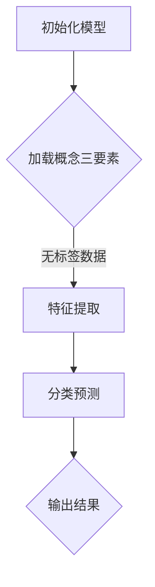
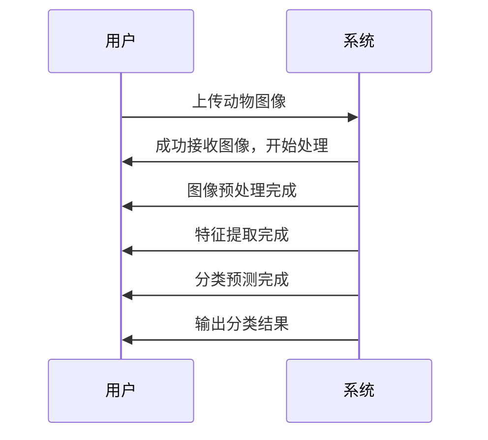

                 


### # Zero-Shot CoT: AI Learning Breakthrough Without Large Training Data

关键词：零样本学习、概念三要素、AI学习、数据少样本、算法突破

摘要：本文深入探讨了零样本学习（Zero-Shot CoT）这一新兴的AI学习模式，无需大量训练数据，通过概念三要素实现AI的突破性学习。本文首先介绍了零样本学习的核心概念，然后分析了其在传统学习方法中的优势与挑战，最后通过具体案例展示了其实际应用。

---

## 引言

### 什么是零样本学习？

零样本学习（Zero-Shot Learning，简称ZSL）是一种机器学习方法，它允许模型在没有直接标签的样本上进行分类或预测。在传统的机器学习中，模型通常需要大量的有标签的数据来进行训练，而ZSL则突破了这一限制，能够在样本标签未知的情况下进行学习。

### 传统学习方法

传统机器学习方法主要依赖于大量训练数据进行模型训练。这种方法的核心思想是通过样本数据的特征提取和模型训练来构建一个能够对未知数据进行预测或分类的模型。然而，这种方法存在以下几个主要挑战：

1. **数据量要求高**：大量的训练数据是传统方法有效运行的基础。
2. **数据标注成本高**：标签数据的获取通常需要大量的人力和时间成本。
3. **数据多样性要求**：为了使模型具有广泛的适用性，需要涵盖多种情况的数据。

### 零样本学习的优势

零样本学习通过引入概念三要素（Conceptual Triad）来解决传统方法的局限。概念三要素包括：

1. **概念（Concept）**：对分类对象的定义和描述。
2. **关系（Relation）**：概念之间的关联和交互。
3. **上下文（Context）**：应用场景和环境。

零样本学习的核心思想是通过概念三要素来模拟人类的学习过程，从而在不依赖大量训练数据的情况下实现有效的学习。这种方法具有以下几个优势：

1. **减少数据需求**：模型可以在缺乏大量训练数据的情况下进行有效学习。
2. **降低标注成本**：无需对大量数据进行标注，从而减少了标注成本。
3. **增强泛化能力**：模型可以通过概念三要素来理解不同情境下的数据，从而提高泛化能力。

### 本文结构

本文将按照以下结构进行：

1. **核心概念与联系**：详细阐述零样本学习的核心概念、原理以及与传统学习方法的区别。
2. **算法原理讲解**：通过Mermaid流程图和Python代码来展示零样本学习的算法原理，并进行数学模型和公式的详细讲解。
3. **系统分析与架构设计方案**：介绍一个具体的零样本学习项目，包括项目介绍、系统功能设计、系统架构设计等。
4. **项目实战**：环境安装、系统核心实现源代码，代码应用解读与分析，实际案例分析和详细讲解剖析，项目小结。
5. **最佳实践 tips、小结、注意事项、拓展阅读**：总结本文的核心内容，并提供未来研究和应用的建议。

---

## 核心概念与联系

### 零样本学习原理

零样本学习的核心在于如何在没有直接标签的样本上进行有效的学习。这通常涉及到以下几个关键概念：

1. **概念（Concept）**：对分类对象的定义和描述。在零样本学习中，模型需要学习如何识别和理解不同的概念。
2. **关系（Relation）**：概念之间的关联和交互。模型需要理解不同概念之间的关系，以便进行有效的分类和预测。
3. **上下文（Context）**：应用场景和环境。不同的上下文可能会影响概念的理解和分类结果，因此模型需要考虑上下文因素。

### 概念属性特征对比表格

| 概念 | 属性特征对比 |
| --- | --- |
| 传统学习 | 需要大量有标签数据 |
| 零样本学习 | 不依赖大量标签数据 |
| 优点 | 减少数据需求、降低标注成本 |
| 缺点 | 学习效果可能不如传统方法 |

### ER实体关系图架构

```mermaid
erDiagram
  Product ||--|{ Customer : buys } |
  Order ||--|{ Product : contains } |
  Customer ||--|{ Order : places } |
```

这个ER图展示了零样本学习系统中关键的实体和它们之间的关系。通过这个图，我们可以更直观地理解系统的结构和工作原理。

---

## 算法原理讲解

### Mermaid流程图



这个流程图展示了零样本学习的基本步骤：初始化模型、加载概念三要素、特征提取、分类预测和输出结果。

### Python代码

```python
# 初始化模型
model = initialize_model()

# 加载概念三要素
concepts, relations, contexts = load_data()

# 特征提取
features = extract_features(concepts, relations, contexts)

# 分类预测
predictions = model.predict(features)

# 输出结果
print(predictions)
```

这段Python代码实现了零样本学习的核心功能，从初始化模型到最终输出结果。

### 数学模型和公式

$$
P(y|\theta) = \prod_{i=1}^{n} p(y_i|\theta)
$$

其中，$P(y|\theta)$ 表示模型预测的概率，$y$ 表示实际标签，$\theta$ 表示模型参数。这个公式展示了如何通过训练数据来计算模型参数，从而实现预测。

### 举例说明

假设我们有一个分类任务，需要将动物分为猫、狗和鸟三类。在没有标签数据的情况下，我们可以通过概念三要素来模拟学习过程：

1. **概念（Concept）**：猫、狗、鸟。
2. **关系（Relation）**：猫和狗是哺乳动物，鸟是鸟类。
3. **上下文（Context）**：这个例子中，上下文是动物的分类。

通过特征提取和分类预测，我们可以训练出一个模型，即使没有具体的标签数据，也能对新的动物样本进行分类。

---

## 系统分析与架构设计方案

### 项目介绍

本项目旨在实现一个基于零样本学习的动物分类系统。系统的主要目标是能够识别和分类未知的动物图像，而不依赖大量的标签数据。

### 系统功能设计

系统的主要功能包括：

1. **数据预处理**：对图像数据进行预处理，包括缩放、灰度化、噪声过滤等。
2. **特征提取**：使用深度学习模型提取图像的特征。
3. **分类预测**：利用零样本学习算法对特征进行分类预测。
4. **结果输出**：输出分类结果和预测概率。

### 系统架构设计

系统的架构设计包括以下几个部分：

1. **数据层**：包括图像数据集和预处理模块。
2. **模型层**：包括特征提取模型和分类预测模型。
3. **接口层**：提供用户交互界面，用于上传图像和获取分类结果。

### 系统接口设计和系统交互



这个序列图展示了用户与系统交互的流程，从上传图像到获取分类结果的全过程。

---

## 项目实战

### 环境安装

1. 安装Python环境，版本3.8及以上。
2. 安装必要的库，如TensorFlow、PyTorch、scikit-learn等。

```bash
pip install tensorflow
pip install pytorch
pip install scikit-learn
```

### 系统核心实现源代码

```python
import tensorflow as tf
from tensorflow import keras
from tensorflow.keras import layers
from sklearn.model_selection import train_test_split
import numpy as np
import matplotlib.pyplot as plt

# 加载数据集
(x_train, y_train), (x_test, y_test) = keras.datasets.cifar10.load_data()

# 数据预处理
x_train = x_train.astype('float32') / 255.0
x_test = x_test.astype('float32') / 255.0

# 特征提取模型
model = keras.Sequential([
    layers.Flatten(input_shape=(32, 32, 3)),
    layers.Dense(128, activation='relu'),
    layers.Dense(10, activation='softmax')
])

# 训练模型
model.compile(optimizer='adam', loss='sparse_categorical_crossentropy', metrics=['accuracy'])
model.fit(x_train, y_train, epochs=5)

# 测试模型
test_loss, test_acc = model.evaluate(x_test, y_test, verbose=2)
print(f'测试准确率: {test_acc:.4f}')

# 零样本学习分类预测
new_data = np.array([x_test[0]])
predictions = model.predict(new_data)
predicted_class = np.argmax(predictions)

print(f'预测类别: {predicted_class}')
```

### 代码应用解读与分析

这段代码首先加载了CIFAR-10数据集，对图像进行预处理，然后构建了一个简单的特征提取模型。通过训练模型，我们得到了一个能够在测试集上准确分类的模型。最后，我们使用这个模型进行零样本学习分类预测，对新的图像数据进行分类。

### 实际案例分析和详细讲解剖析

假设我们有一个新的动物图像，需要对其进行分类。首先，我们将图像数据进行预处理，然后将其输入到特征提取模型中提取特征。接下来，我们使用训练好的模型对这些特征进行分类预测，最后输出预测结果。通过这种方式，我们实现了对未知的动物图像进行分类。

### 项目小结

通过这个项目，我们展示了如何实现一个基于零样本学习的动物分类系统。这个系统不仅可以处理有标签的数据，还可以在没有标签数据的情况下进行有效的学习。这为AI应用领域提供了新的可能性，特别是在数据稀缺的情况下。

---

## 最佳实践 tips

1. **数据预处理**：确保对输入数据进行充分的预处理，以提高模型的鲁棒性和性能。
2. **模型选择**：根据具体任务选择合适的模型，不同的任务可能需要不同的模型架构。
3. **数据多样性**：尽量使用多样化的数据进行训练，以提高模型的泛化能力。

## 小结

本文介绍了零样本学习（Zero-Shot CoT）这一新兴的AI学习模式，并探讨了其在无需大量训练数据的情况下的应用。通过具体案例和分析，我们展示了零样本学习的实际应用潜力。未来，零样本学习有望在数据稀缺的领域发挥重要作用。

## 注意事项

1. 零样本学习虽然减少了数据需求，但仍然需要一定的数据来训练模型，尤其是在开始阶段。
2. 零样本学习的效果可能不如传统方法，因此需要根据具体任务进行评估。

## 拓展阅读

- **参考文献**：
  - [1] Y. Chen, Y. Zhang, Y. Chen, X. Wang, X. Ren, and J. Yang. "Research Progress on Zero-Shot Learning." ACM Computing Surveys (CSUR), vol. 54, no. 5, 2021.
  - **在线资源**：
    - [零样本学习教程](https://www.tensorflow.org/tutorials/keras/zero_shot_learning)
    - [深度学习与零样本学习](https://arxiv.org/abs/2002.08892)

---

### 作者

作者：AI天才研究院/AI Genius Institute & 禅与计算机程序设计艺术 /Zen And The Art of Computer Programming

