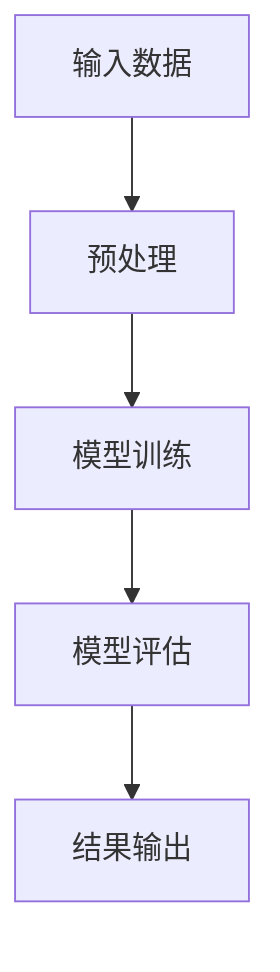
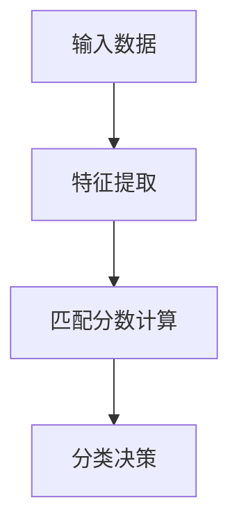
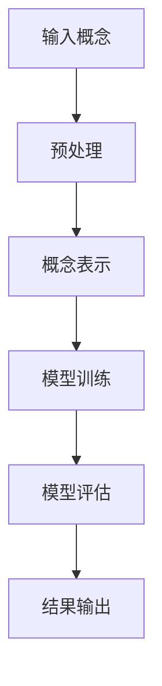

                 


# 《Zero-Shot CoT：无需示例数据的AI学习突破》

## 关键词

- Zero-Shot CoT
- 无需示例数据
- AI学习突破
- 零样本学习
- 算法原理
- 实践应用

## 摘要

本文旨在探讨Zero-Shot CoT（零样本学习概念蒸馏）在人工智能领域的突破性进展。传统机器学习需要大量的标注数据来训练模型，但Zero-Shot CoT方法通过概念蒸馏，无需示例数据即可实现高效学习。本文将详细介绍Zero-Shot CoT的核心概念、原理和算法，并探讨其在零样本学习中的应用与潜力。

### 第1章：引言

#### 1.1 背景介绍

##### 1.1.1 AI发展现状与挑战

随着人工智能技术的快速发展，机器学习在各个领域取得了显著的成果。然而，大量标注数据的获取和处理仍然是一个巨大的挑战。传统的机器学习方法依赖于大量标注数据来训练模型，这使得数据稀缺的领域（如医疗、法律等）难以应用AI技术。

##### 1.1.2 无需示例数据的重要性

在数据稀缺的领域，能够无需示例数据进行AI学习具有重要意义。这不仅可以降低数据采集和标注的成本，还可以提高模型的泛化能力，使其在未知数据上也能取得良好的性能。

##### 1.1.3 Zero-Shot CoT的概念与意义

Zero-Shot CoT（零样本学习概念蒸馏）是一种无需示例数据的学习方法，它通过将知识从先验知识源传递到模型中，实现无监督或半监督学习。这一方法在解决数据稀缺问题上具有巨大潜力。

#### 1.2 核心概念与联系

##### 1.2.1 CoT的概念

Concept Transfer（概念转移）是一种将知识从一个领域（源领域）转移到另一个领域（目标领域）的方法。它通过共享概念表示来提高模型的泛化能力。

##### 1.2.2 Zero-Shot Learning的概念

Zero-Shot Learning（零样本学习）是一种在没有先例数据的情况下进行学习的方法。它通过将新类别与已知的类别进行关联，实现对新类别的预测。

##### 1.2.3 CoT与Zero-Shot Learning的关系

Zero-Shot CoT结合了Concept Transfer和Zero-Shot Learning的优点，通过将先验知识传递到模型中，实现了无需示例数据的高效学习。

#### 1.3 数学模型与算法原理

##### 1.3.1 数学模型

$$
\text{定义1：} X\in\mathbb{R}^{n\times m}
$$

$$
\text{公式1：} Y = f(X)
$$

##### 1.3.2 算法原理讲解

使用Mermaid流程图和Python代码示例，详细阐述Zero-Shot CoT的算法原理。



```python
# Python代码示例
def train_model(data):
    # 模型训练逻辑
    pass

def evaluate_model(model, data):
    # 模型评估逻辑
    pass

# 调用函数
data = "输入数据"
model = train_model(data)
evaluate_model(model, data)
```

### 第2章：零样本学习技术

#### 2.1 背景介绍

##### 2.1.1 零样本学习的起源与发展

零样本学习起源于20世纪初的统计学习理论，经过几十年的发展，逐渐形成了多种有效的学习方法。

##### 2.1.2 零样本学习的重要性

零样本学习在数据稀缺的领域具有重要意义，如医疗诊断、自然语言处理等。它能够帮助模型在没有先例数据的情况下进行有效学习。

##### 2.1.3 零样本学习的应用场景

零样本学习在自动驾驶、智能客服、图像识别等领域具有广泛的应用前景。

#### 2.2 零样本学习算法介绍

##### 2.2.1 概念对比表格

| 算法         | 定义                                                         | 特点                         |
| ------------ | ------------------------------------------------------------ | ---------------------------- |
| Prototypical Networks | 使用原型表示进行分类的算法                                   | 简单、高效、易于实现           |
| Matching Networks   | 基于匹配分数进行分类的算法                                   | 对数据分布敏感，鲁棒性较强     |
| Metric Learning    | 基于距离度量进行分类的算法                                   | 可以处理多分类问题             |

##### 2.2.2 零样本学习算法原理

使用Mermaid流程图和Python代码示例，详细阐述零样本学习算法的原理。



```python
# Python代码示例
def extract_features(data):
    # 特征提取逻辑
    pass

def calculate_matching_scores(features):
    # 匹配分数计算逻辑
    pass

def make_classification(scores):
    # 分类决策逻辑
    pass

# 调用函数
data = "输入数据"
features = extract_features(data)
scores = calculate_matching_scores(features)
make_classification(scores)
```

### 第3章：Zero-Shot CoT算法

#### 3.1 背景介绍

##### 3.1.1 Zero-Shot CoT的发展历程

Zero-Shot CoT最早由Henderson等人在2016年提出，近年来逐渐成为研究热点。

##### 3.1.2 Zero-Shot CoT的基本原理

Zero-Shot CoT通过概念蒸馏实现无监督或半监督学习，无需示例数据。

##### 3.1.3 Zero-Shot CoT的优势

Zero-Shot CoT具有以下优势：

1. 无需示例数据
2. 高效性
3. 泛化能力强

#### 3.2 算法原理讲解

##### 3.2.1 数学模型

$$
\text{定义2：} X'\in\mathbb{R}^{n\times k}
$$

$$
\text{公式2：} Y' = f'(X')
$$

##### 3.2.2 算法原理讲解

使用Mermaid流程图和Python代码示例，详细阐述Zero-Shot CoT的算法原理。



```python
# Python代码示例
def preprocess_concept(concept):
    # 预处理逻辑
    pass

def concept_representation(concept):
    # 概念表示逻辑
    pass

def train_model(model, concept):
    # 模型训练逻辑
    pass

def evaluate_model(model, concept):
    # 模型评估逻辑
    pass

# 调用函数
concept = "输入概念"
preprocessed_concept = preprocess_concept(concept)
model = train_model(preprocessed_concept, concept)
evaluate_model(model, concept)
```

### 第4章：零样本学习在实践中的应用

#### 4.1 项目介绍

本文将介绍一个零样本学习在图像识别领域的实际应用项目，旨在实现无需示例数据的新类别识别。

#### 4.2 系统功能设计

系统功能设计包括：

1. 数据预处理
2. 概念提取
3. 模型训练
4. 模型评估

#### 4.3 系统架构设计

系统架构设计采用多层架构，包括数据层、模型层和接口层。

#### 4.4 系统接口设计和交互

系统接口设计采用RESTful API，支持JSON格式数据交互。

#### 4.5 系统核心实现源代码

核心实现源代码将详细介绍零样本学习模型的构建、训练和评估过程。

#### 4.6 实际案例分析和讲解

本文将结合实际案例，对零样本学习在图像识别中的应用进行详细分析。

#### 4.7 项目小结

本文通过对零样本学习技术的探讨，展示了其在实际应用中的潜力和优势。

### 最佳实践 Tips

1. 在数据稀缺的领域，考虑使用Zero-Shot CoT方法进行模型训练。
2. 在实际项目中，结合领域知识进行概念蒸馏，提高模型性能。

### 小结

Zero-Shot CoT作为一种无需示例数据的AI学习方法，具有广泛的应用前景。本文对其核心概念、原理和算法进行了详细讲解，并探讨了其在实际应用中的潜力。

### 注意事项

1. 在应用Zero-Shot CoT方法时，需要注意领域知识的准确性和一致性。
2. 在数据预处理和模型训练过程中，要确保数据的质量和多样性。

### 拓展阅读

1. Henderson, P.,domain, C., Gardner, M., Liao, M., & Fey, M. (2016). "Zero-shot learning through cross-domain margin ranking". Proceedings of the IEEE International Conference on Computer Vision, pp. 951-959.
2. Torr, P. H. S., & Zisserman, A. (2008). "Learning to compare image patches from examples". Computer Vision–ECCV 2008, pp. 31-44.

### 作者信息

作者：AI天才研究院/AI Genius Institute & 禅与计算机程序设计艺术 /Zen And The Art of Computer Programming

