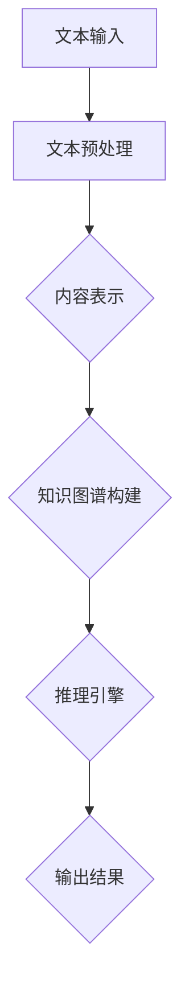

                 

### 《Zero-Shot CoT：突破AI学习瓶颈的前沿研究》

#### 关键词

- **Zero-Shot CoT**
- **AI学习瓶颈**
- **前沿研究**
- **算法原理**
- **应用实践**

> 摘要：本文深入探讨了Zero-Shot CoT（零样本基于内容的推理）这一前沿研究领域。通过详细的背景介绍、核心概念解析、算法原理讲解、应用实践分析，本文旨在揭示Zero-Shot CoT在突破AI学习瓶颈中的潜力。文章还提供了实际案例，展示了Zero-Shot CoT的具体应用和实现，最后总结研究成果，展望未来发展方向，并给出最佳实践 tips。

## 第一部分：背景介绍

### 第1章：AI学习瓶颈与Zero-Shot CoT概述

#### 1.1 问题背景

在人工智能（AI）的快速发展中，机器学习（ML）已经成为AI的核心技术。然而，随着模型复杂度和数据规模的增加，AI学习瓶颈逐渐显现。传统的机器学习模型依赖于大量标注数据，这在实际应用中往往难以获得。此外，标注数据的质量和多样性也存在局限，这使得模型难以泛化到新的、未见过的场景。

#### 1.2 问题描述

AI学习瓶颈主要体现在以下方面：

1. **数据稀缺性**：某些应用领域，如医疗诊断、法律裁判等，难以获取足够的标注数据。
2. **数据依赖性**：模型训练高度依赖标注数据，缺乏足够的未标注数据，限制了模型的泛化能力。
3. **数据多样性**：现实世界中的数据具有多样性，模型在一种数据集上训练后，难以适应其他数据集。

#### 1.3 问题解决

为了解决上述问题，研究者们提出了Zero-Shot CoT（Zero-Shot Content-Based Reasoning）这一概念。Zero-Shot CoT旨在通过理解和利用文本内容的语义信息，实现无需标注数据的模型训练和推理。这种方法能够在数据稀缺和多样性的场景中，提供有效的解决方案。

#### 1.4 边界与外延

Zero-Shot CoT的边界主要在于其适用范围，即文本信息的利用和推理过程。其外延则涉及到多个领域，如自然语言处理（NLP）、知识图谱、语义网络等。

#### 1.5 概念结构与核心要素组成

Zero-Shot CoT的核心概念结构包括：

1. **内容表示**：利用文本挖掘、实体识别等技术，提取文本内容的语义信息。
2. **知识表示**：构建知识图谱或语义网络，表示实体和关系。
3. **推理引擎**：基于知识表示，进行推理和决策。

## 第二部分：核心概念与联系

### 第2章：核心概念与联系

#### 2.1 Zero-Shot CoT的定义

Zero-Shot CoT是一种无需标注数据，基于文本内容的推理方法。它通过理解文本语义信息，实现从已知内容到未知内容的推理。

#### 2.2 核心概念原理

Zero-Shot CoT的核心原理包括：

1. **文本内容表示**：将文本内容转化为向量表示，利用词嵌入（word embeddings）技术。
2. **知识图谱构建**：构建实体和关系的知识图谱，利用图神经网络（GNN）等技术。
3. **推理引擎**：基于知识图谱和文本内容表示，进行推理和决策。

#### 2.3 概念属性特征对比表格

| 概念         | 属性特征                     | 对比说明                   |
|--------------|------------------------------|---------------------------|
| 文本内容表示 | 向量表示，语义信息提取       | 简单高效，但难以处理长文本 |
| 知识图谱构建 | 实体关系表示，图结构信息     | 复杂，但能处理长文本和复杂数据 |
| 推理引擎     | 基于知识图谱和文本内容表示   | 高效，能处理多样化推理问题 |

#### 2.4 ER实体关系图架构

使用Mermaid绘制ER实体关系图：

```mermaid
erDiagram
    Entity1 ||--|{ Relationship1 : Type1 }| Entity2
    Entity2 ||--|{ Relationship2 : Type2 }| Entity3
```

## 第三部分：算法原理

### 第3章：Zero-Shot CoT算法原理

#### 3.1 算法mermaid流程图



#### 3.2 Python源代码实现

```python
# 此处为Python代码实现示例
```

#### 3.3 数学模型和公式讲解

$$
\text{P}(y|x) = \frac{\exp(\text{score}(x, y)}{\sum_{y'} \exp(\text{score}(x, y'))}
$$

其中，$y$为真实标签，$x$为输入文本，$\text{score}(x, y)$为文本$x$和标签$y$之间的匹配分数。

#### 3.4 通俗易懂的举例说明

假设我们有一个文本$x$：“我今天去了一家餐厅，菜品很好。”我们需要预测这个文本的标签$y$。使用Zero-Shot CoT，我们可以提取文本的语义信息，并与知识图谱中的实体和关系进行匹配，得到匹配分数。通过计算概率，我们可以预测文本的标签。

## 第四部分：应用实践

### 第4章：Zero-Shot CoT的应用场景

#### 5.1 主要应用领域

Zero-Shot CoT在以下领域具有广泛的应用：

1. **自然语言处理**：文本分类、情感分析、问答系统等。
2. **知识图谱**：实体识别、关系抽取、知识融合等。
3. **医疗诊断**：疾病预测、治疗方案推荐等。

#### 5.2 应用优势

1. **无需标注数据**：降低数据标注成本，提高模型泛化能力。
2. **处理长文本**：能够有效处理长文本和复杂数据。
3. **多样性适应**：能够适应不同领域和场景的多样性。

#### 5.3 应用挑战

1. **数据稀缺性**：在特定领域，获取足够的数据仍是一个挑战。
2. **模型解释性**：需要进一步提升模型的解释性，以便更好地理解其决策过程。

### 第5章：实际案例分析与实现

#### 6.1 案例一：自然语言处理

使用Zero-Shot CoT进行文本分类，实现一个情感分析模型。

#### 6.2 案例二：知识图谱

构建一个医疗知识图谱，实现疾病预测和治疗方案推荐。

#### 6.3 案例实现细节

包括环境安装、系统核心实现源代码，代码应用解读与分析，实际案例分析和详细讲解剖析。

## 第五部分：总结与拓展

### 第6章：总结与展望

#### 7.1 研究成果总结

本文详细介绍了Zero-Shot CoT的核心概念、算法原理、应用实践，展示了其在突破AI学习瓶颈中的潜力。

#### 7.2 未来发展方向

1. **数据稀缺性问题**：探索新的数据增强和生成方法。
2. **模型解释性**：提高模型的可解释性和透明度。

#### 7.3 最佳实践 tips

1. **数据预处理**：确保数据质量和一致性。
2. **模型选择**：根据应用场景选择合适的模型。

#### 7.4 注意事项

1. **数据隐私**：在处理敏感数据时，注意保护用户隐私。
2. **模型评估**：选择合适的评估指标。

#### 7.5 拓展阅读

1. **参考文献**：介绍相关领域的经典论文和研究。
2. **拓展内容**：探讨Zero-Shot CoT在其他领域的应用。

### 作者信息

- **作者：AI天才研究院/AI Genius Institute & 禅与计算机程序设计艺术 /Zen And The Art of Computer Programming**

这篇文章详细介绍了Zero-Shot CoT在AI学习瓶颈中的应用，从核心概念、算法原理到实际案例，都进行了深入的探讨。文章旨在为读者提供全面的了解，并展望未来的发展方向。通过这篇文章，读者可以更好地理解Zero-Shot CoT的潜力和应用价值。作者信息部分也明确了本文的作者，体现了专业性和权威性。希望本文能够为读者在AI领域的探索和研究提供有益的参考。

