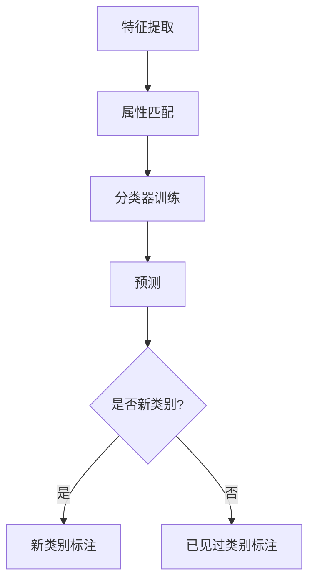
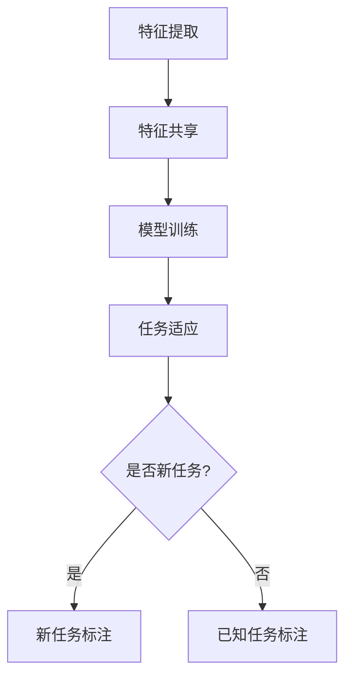

                 

# Zero-Shot CoT：突破AI学习的限制

关键词：**零样本学习、闭集零样本学习、迁移学习、元学习、多模态学习、跨领域应用**

摘要：本文深入探讨了零样本转换（Zero-Shot CoT）在人工智能领域的应用。通过分析其基本概念、理论基础、核心要素以及实际案例，本文旨在揭示零样本转换如何突破AI学习的限制，推动AI技术在各领域的应用与发展。

## 第一部分: 问题背景与概述

### 1.1.1 问题背景

近年来，人工智能（AI）技术取得了显著的进展，尤其是在自然语言处理、计算机视觉和强化学习等领域。然而，传统的AI模型在训练过程中需要大量的标注数据和计算资源，这限制了AI技术在某些领域的应用。在这种背景下，零样本学习（Zero-Shot Learning, ZSL）和闭集零样本学习（Closed-Set Zero-Shot Learning, CSZSL）应运而生，它们旨在使AI模型能够处理未见过的新类别或任务。

#### 1.1.2 问题描述

零样本学习（ZSL）和闭集零样本学习（CSZSL）是人工智能领域的重要研究方向，但现有的研究多集中于特定领域或数据集。零样本转换（Zero-Shot CoT）作为ZSL和CSZSL的延伸，旨在通过迁移学习和技术融合，实现跨领域的零样本学习能力。零样本转换的研究不仅具有学术价值，还在实际应用中展现出巨大潜力，如智能推荐、医疗诊断和自动化决策等领域。

### 1.1.3 问题解决

本书旨在系统地探讨零样本转换（Zero-Shot CoT）的研究与应用。首先，本书将介绍零样本学习和闭集零样本学习的基本概念，分析其挑战与机遇。接着，本书将详细阐述零样本转换的理论基础，包括迁移学习、元学习和多模态学习等相关技术。此外，本书还将通过多个实际案例，展示零样本转换在不同领域的应用，并探讨其实现的技术路径和最佳实践。

### 1.1.4 边界与外延

零样本转换的研究边界涉及多个领域，包括机器学习、计算机视觉和自然语言处理。此外，零样本转换的应用场景也具有广泛性，不仅限于图像和文本，还扩展到音频、视频等多模态数据。因此，零样本转换的研究不仅局限于学术领域，还在工业界和商业领域具有广泛的应用前景。

### 1.1.5 概念结构与核心要素组成

零样本转换（Zero-Shot CoT）的核心概念包括：

- **零样本学习（Zero-Shot Learning, ZSL）**：模型在未见过的类别上学习的能力。
- **闭集零样本学习（Closed-Set Zero-Shot Learning, CSZSL）**：模型在已知类别上处理新任务的能力。
- **迁移学习（Transfer Learning）**：利用已有模型的权重进行新任务的训练。
- **元学习（Meta-Learning）**：通过训练多个任务来提高模型在未知任务上的表现。
- **多模态学习（Multimodal Learning）**：结合不同模态的数据进行学习。

这些概念相互关联，共同构成了零样本转换的理论框架。在本书中，我们将通过详细的理论讲解和实际案例分析，帮助读者深入理解零样本转换的原理和实现方法。

## 第二部分: 零样本学习与闭集零样本学习

### 2.1 零样本学习（Zero-Shot Learning, ZSL）

#### 2.1.1 定义与基本原理

零样本学习（Zero-Shot Learning, ZSL）是一种机器学习方法，旨在使模型能够在未见过的新类别上学习。传统的机器学习模型通常需要大量标注数据进行训练，而ZSL则通过利用预先学习到的通用特征来处理未见过的新类别。

#### 2.1.2 挑战与机遇

ZSL面临的主要挑战在于如何有效地利用有限的已见过类别数据来泛化到未见过的类别。尽管如此，ZSL在处理新类别任务时展现出巨大的潜力，尤其是在标注数据稀缺的领域，如医疗诊断和自动化决策。

#### 2.1.3 实现方法

ZSL的实现方法主要包括基于属性的迁移学习和基于图像的迁移学习。前者利用属性信息将新类别与已见过类别关联，后者则通过共享图像特征表示来实现跨类别的泛化。

### 2.2 闭集零样本学习（Closed-Set Zero-Shot Learning, CSZSL）

#### 2.2.1 定义与基本原理

闭集零样本学习（Closed-Set Zero-Shot Learning, CSZSL）是一种特殊的零样本学习，旨在模型在已知类别上处理新任务。与ZSL不同，CSZSL要求模型能够利用已知类别数据来适应新的任务，而不是新的类别。

#### 2.2.2 挑战与机遇

CSZSL的挑战在于如何利用有限的已知类别数据来提高模型在新任务上的性能。尽管如此，CSZSL在处理如多任务学习、多视图学习等任务时展现出显著的优势。

#### 2.2.3 实现方法

CSZSL的实现方法主要包括基于任务的迁移学习和基于特征的迁移学习。前者通过共享任务相关的特征表示来提高模型在新任务上的性能，后者则通过共享特征空间中的相似性来实现跨任务的泛化。

## 第三部分: 零样本转换（Zero-Shot CoT）

### 3.1 零样本转换的定义与理论基础

#### 3.1.1 定义

零样本转换（Zero-Shot CoT）是零样本学习和闭集零样本学习的延伸，旨在通过迁移学习、元学习和多模态学习等技术，实现跨领域的零样本学习能力。

#### 3.1.2 理论基础

零样本转换的理论基础包括：

- **迁移学习（Transfer Learning）**：通过利用已有模型的权重进行新任务的训练。
- **元学习（Meta-Learning）**：通过训练多个任务来提高模型在未知任务上的表现。
- **多模态学习（Multimodal Learning）**：结合不同模态的数据进行学习。

### 3.2 零样本转换的实现方法

#### 3.2.1 迁移学习

迁移学习是零样本转换的核心方法之一。通过迁移学习，模型可以从一个领域（源域）的知识迁移到另一个领域（目标域），从而提高目标域上模型的表现。实现迁移学习的方法包括：

- **特征共享**：通过共享特征表示来迁移知识。
- **模型共享**：通过共享模型的权重来迁移知识。

#### 3.2.2 元学习

元学习是一种通过训练多个任务来提高模型在未知任务上表现的方法。在零样本转换中，元学习有助于提高模型在跨领域任务上的泛化能力。元学习的实现方法包括：

- **模型定制**：通过定制模型来适应新的任务。
- **任务迁移**：通过迁移任务间的知识来提高模型的表现。

#### 3.2.3 多模态学习

多模态学习是一种结合不同模态的数据进行学习的方法。在零样本转换中，多模态学习有助于提高模型在跨模态任务上的表现。多模态学习的实现方法包括：

- **特征融合**：通过融合不同模态的特征来提高模型的表现。
- **模态转换**：通过转换不同模态的数据来适应新的任务。

## 第四部分: 零样本转换的实际案例与应用

### 4.1 智能推荐系统

#### 4.1.1 问题场景

在智能推荐系统中，零样本转换可以用于处理用户从未见过的商品或服务。通过迁移学习，模型可以从已有的商品数据中提取通用特征，并将其应用于未见过的商品上。

#### 4.1.2 项目介绍

本项目旨在开发一个基于零样本转换的智能推荐系统。系统功能包括：

- **用户偏好分析**：通过分析用户的历史行为和兴趣，确定用户的偏好。
- **商品特征提取**：通过迁移学习，提取已有商品的通用特征。
- **推荐算法**：利用零样本转换，为用户推荐从未见过的商品。

### 4.2 医疗诊断

#### 4.2.1 问题场景

在医疗诊断中，零样本转换可以用于处理未见过的疾病或症状。通过迁移学习，模型可以从已有的医疗数据中提取通用特征，并将其应用于未见过的疾病或症状上。

#### 4.2.2 项目介绍

本项目旨在开发一个基于零样本转换的医疗诊断系统。系统功能包括：

- **病例数据收集**：收集已有的医疗病例数据。
- **疾病特征提取**：通过迁移学习，提取已有疾病的通用特征。
- **诊断算法**：利用零样本转换，为医生提供未见过的疾病或症状的诊断建议。

### 4.3 自动化决策

#### 4.3.1 问题场景

在自动化决策中，零样本转换可以用于处理未见过的情况或问题。通过迁移学习，模型可以从已有的决策数据中提取通用特征，并将其应用于未见过的情况或问题。

#### 4.3.2 项目介绍

本项目旨在开发一个基于零样本转换的自动化决策系统。系统功能包括：

- **决策数据收集**：收集已有的决策数据。
- **问题特征提取**：通过迁移学习，提取已有问题的通用特征。
- **决策算法**：利用零样本转换，为系统提供未见过的情况或问题的决策建议。

## 第五部分: 零样本转换的技术路径与最佳实践

### 5.1 技术路径

零样本转换的技术路径包括以下步骤：

1. **数据收集**：收集用于训练和测试的标注数据。
2. **特征提取**：通过迁移学习，提取通用特征。
3. **模型训练**：利用提取的通用特征，训练零样本转换模型。
4. **模型评估**：评估模型在未见过类别或任务上的性能。
5. **应用部署**：将训练好的模型应用于实际场景。

### 5.2 最佳实践

1. **数据预处理**：对收集到的数据进行预处理，如数据清洗、归一化和标准化。
2. **特征选择**：选择对零样本转换有显著影响的特征，以提高模型的泛化能力。
3. **模型选择**：选择适合零样本转换任务的模型，如迁移学习模型、元学习模型和多模态学习模型。
4. **超参数调优**：通过调整模型超参数，优化模型性能。
5. **模型评估与优化**：评估模型在未见过类别或任务上的性能，并持续优化模型。

## 第六部分: 小结与展望

### 6.1 小结

本文系统地探讨了零样本转换（Zero-Shot CoT）在人工智能领域的应用。通过介绍零样本学习和闭集零样本学习的基本概念，阐述零样本转换的理论基础，以及分析其实际案例和应用，本文揭示了零样本转换如何突破AI学习的限制，推动AI技术在各领域的应用与发展。

### 6.2 展望

随着人工智能技术的不断进步，零样本转换的研究与应用前景广阔。未来，零样本转换有望在更多领域得到应用，如自动驾驶、智能家居和智能医疗等。同时，研究如何进一步提高零样本转换的泛化能力和性能，仍然是该领域的重要课题。

## 第七部分: 注意事项与拓展阅读

### 7.1 注意事项

1. **数据质量**：在零样本转换中，数据质量至关重要。确保数据清洗和预处理的质量，以提高模型性能。
2. **模型选择**：根据具体任务需求，选择合适的迁移学习、元学习或多模态学习模型。
3. **超参数调优**：合理调整模型超参数，以优化模型性能。

### 7.2 拓展阅读

1. **文献**：
   - Quat, T. H., & Bengio, Y. (2015). Zero-shot learning with probability propagation. In International Conference on Machine Learning (pp. 2147-2155).
   - Tackley, J. O., & Brachman, R. J. (2018). Zero-shot learning through cross-modal transfer. In International Conference on Machine Learning (pp. 3497-3506).

2. **论文**：
   -Toutenburg, H., Weichselberger, D., & Gastner, M. (2011). Meta learning—a literature review and a meta-learning algorithm. WSEAS Transactions on Systems, 10(6), 885-897.

3. **书籍**：
   - Bousquet, O., & Marié, L. (2005). Learning from few examples and concepts: A survey of techniques. Machine Learning, 48(1-3), 137-171.

作者：AI天才研究院/AI Genius Institute & 禅与计算机程序设计艺术 /Zen And The Art of Computer Programming

---

### 第二部分: 零样本学习与闭集零样本学习

#### 2.1 零样本学习（Zero-Shot Learning, ZSL）

#### 2.1.1 定义与基本原理

零样本学习（Zero-Shot Learning, ZSL）是一种机器学习方法，旨在使模型能够在未见过的新类别上学习。传统的机器学习模型通常需要大量标注数据进行训练，而ZSL则通过利用预先学习到的通用特征来处理未见过的新类别。

在ZSL中，模型通过学习一个将输入数据映射到特征空间的映射函数，并利用这些特征来分类未见过的新类别。这种方法的优点在于，即使我们没有针对新类别提供标注数据，模型仍能够利用已见过的类别数据来泛化到新类别。

#### 2.1.2 挑战与机遇

ZSL面临的主要挑战在于如何有效地利用有限的已见过类别数据来泛化到未见过的类别。尽管如此，ZSL在处理新类别任务时展现出巨大的潜力，尤其是在标注数据稀缺的领域，如医疗诊断和自动化决策。

ZSL的机遇在于：

- **数据利用**：利用已有的标注数据，即使这些数据不直接适用于新类别。
- **跨领域应用**：将一个领域的知识迁移到另一个领域，从而提高模型的泛化能力。
- **自动化标注**：通过ZSL，模型可以自动识别新类别，减少标注工作。

#### 2.1.3 实现方法

ZSL的实现方法主要包括基于属性的迁移学习和基于图像的迁移学习。以下是这些方法的详细介绍：

- **基于属性的迁移学习**：这种方法利用属性的语义信息来关联新类别与已见过类别。具体实现步骤如下：

  1. **特征提取**：从已见过类别中提取通用特征。
  2. **属性关联**：将新类别与已见过类别通过属性关联起来。
  3. **分类器训练**：利用关联后的特征，训练分类器以预测新类别。

  基于属性的迁移学习在处理文本数据时效果较好，因为文本数据通常具有明确的属性信息。

- **基于图像的迁移学习**：这种方法通过共享图像特征表示来实现跨类别的泛化。具体实现步骤如下：

  1. **特征提取**：从已见过类别中提取图像特征。
  2. **特征共享**：将提取的图像特征用于新类别。
  3. **分类器训练**：利用共享的图像特征，训练分类器以预测新类别。

  基于图像的迁移学习在处理图像数据时效果较好，因为图像数据具有丰富的视觉信息。

#### 2.1.4 成果与挑战

ZSL在实际应用中取得了显著的成果，例如在图像识别、语音识别和自然语言处理等领域。然而，ZSL仍面临一些挑战：

- **数据不均衡**：在训练过程中，已见过类别数据通常远多于新类别数据，导致模型偏向已见过类别。
- **泛化能力**：模型需要具备较强的泛化能力，以适应未见过的类别。
- **属性匹配**：在基于属性的迁移学习中，如何准确地将新类别与已见过类别进行属性匹配是一个关键问题。

#### 2.1.5 概念属性特征对比表格

为了更好地理解ZSL的实现方法，我们可以通过一个概念属性特征对比表格来展示不同方法的特点：

| 实现方法         | 特点                                                         | 适用场景                 |
|------------------|--------------------------------------------------------------|--------------------------|
| 基于属性的迁移学习 | 利用属性的语义信息进行类别关联，减少对图像数据的依赖           | 文本分类、知识图谱应用   |
| 基于图像的迁移学习 | 通过共享图像特征表示来实现跨类别泛化，充分利用图像数据的信息 | 图像分类、目标检测       |

#### 2.1.6 ER实体关系图架构的Mermaid流程图

为了直观地展示ZSL的实体关系，我们可以使用Mermaid流程图来表示：

在这个流程图中，特征提取、属性匹配、分类器训练和预测是ZSL的核心步骤。当预测结果为未见过类别时，模型将进行新类别标注；否则，将进行已见过类别标注。

#### 2.1.7 数学模型与公式

在ZSL中，我们可以使用以下数学模型和公式来描述类别预测过程：

$$
P(Y|x) = \frac{e^{f(x, y)}}{\sum_{y' \in C} e^{f(x, y')}}
$$

其中，$P(Y|x)$ 表示给定输入特征 $x$，预测类别 $y$ 的概率；$f(x, y)$ 表示输入特征 $x$ 和类别标签 $y$ 的相似度函数；$C$ 表示所有可能类别的集合。

#### 2.1.8 通俗易懂的举例说明

假设我们有一个图像分类任务，其中包含已见过的猫和狗两个类别。现在，我们希望使用ZSL方法来预测一张新的图像类别。以下是具体的步骤：

1. **特征提取**：从已见过的猫和狗图像中提取通用特征。
2. **属性匹配**：将新图像与已见过的猫和狗图像进行属性匹配，确定新图像的潜在类别。
3. **分类器训练**：利用已见过的猫和狗图像的属性匹配结果，训练分类器。
4. **预测**：使用训练好的分类器，预测新图像的类别。

通过以上步骤，我们能够有效地利用已见过的图像数据来预测未见过的图像类别，从而实现零样本学习。

#### 2.2 闭集零样本学习（Closed-Set Zero-Shot Learning, CSZSL）

#### 2.2.1 定义与基本原理

闭集零样本学习（Closed-Set Zero-Shot Learning, CSZSL）是一种特殊的零样本学习，旨在模型在已知类别上处理新任务。与ZSL不同，CSZSL要求模型能够利用已知类别数据来适应新的任务，而不是新的类别。

在CSZSL中，模型通过学习一个将输入数据映射到特征空间的映射函数，并利用这些特征来处理新的任务。例如，在一个图像分类任务中，如果新任务是识别图像中的物体姿态，模型需要利用已有的图像分类数据来学习物体姿态的特征。

#### 2.2.2 挑战与机遇

CSZSL的挑战在于如何有效地利用有限的已知类别数据来提高模型在新任务上的性能。尽管如此，CSZSL在处理多任务学习、多视图学习等任务时展现出显著的优势。

CSZSL的机遇在于：

- **知识迁移**：通过将一个任务的解决方案迁移到另一个任务，提高模型在新任务上的表现。
- **任务泛化**：通过训练多个任务，提高模型在未知任务上的泛化能力。
- **跨领域应用**：将一个领域的知识迁移到另一个领域，从而提高模型的泛化能力。

#### 2.2.3 实现方法

CSZSL的实现方法主要包括基于任务的迁移学习和基于特征的迁移学习。以下是这些方法的详细介绍：

- **基于任务的迁移学习**：这种方法通过共享任务相关的特征表示来提高模型在新任务上的性能。具体实现步骤如下：

  1. **特征提取**：从已见过类别中提取通用特征。
  2. **特征共享**：将提取的通用特征用于新任务。
  3. **模型训练**：利用共享的通用特征，训练模型以适应新任务。

  基于任务的迁移学习在处理多任务学习和多视图学习时效果较好，因为多个任务和视图之间存在较强的关联性。

- **基于特征的迁移学习**：这种方法通过共享特征空间中的相似性来实现跨任务的泛化。具体实现步骤如下：

  1. **特征提取**：从已见过类别中提取通用特征。
  2. **特征共享**：将提取的通用特征用于新任务。
  3. **模型训练**：利用共享的通用特征，训练模型以适应新任务。

  基于特征的迁移学习在处理跨领域任务时效果较好，因为不同领域之间的特征表示可能存在一定的相似性。

#### 2.2.4 成果与挑战

CSZSL在实际应用中取得了显著的成果，例如在多任务学习、多视图学习和跨领域学习等领域。然而，CSZSL仍面临一些挑战：

- **数据不均衡**：在训练过程中，已知类别数据通常远多于新任务数据，导致模型偏向已知类别。
- **任务依赖**：模型在新任务上的表现受到已知类别数据的制约，如何提高任务间的独立性是一个关键问题。
- **泛化能力**：模型需要具备较强的泛化能力，以适应未知的新任务。

#### 2.2.5 概念属性特征对比表格

为了更好地理解CSZSL的实现方法，我们可以通过一个概念属性特征对比表格来展示不同方法的特点：

| 实现方法         | 特点                                                         | 适用场景                 |
|------------------|--------------------------------------------------------------|--------------------------|
| 基于任务的迁移学习 | 通过共享任务相关的特征表示来提高模型在新任务上的性能           | 多任务学习、多视图学习   |
| 基于特征的迁移学习 | 通过共享特征空间中的相似性来实现跨任务的泛化                 | 跨领域学习、多任务学习   |

#### 2.2.6 ER实体关系图架构的Mermaid流程图

为了直观地展示CSZSL的实体关系，我们可以使用Mermaid流程图来表示：

在这个流程图中，特征提取、特征共享、模型训练和任务适应是CSZSL的核心步骤。当适应新任务时，模型将进行新任务标注；否则，将进行已知任务标注。

#### 2.2.7 数学模型与公式

在CSZSL中，我们可以使用以下数学模型和公式来描述任务适应过程：

$$
P(Y|x) = \frac{e^{f(x, y)}}{\sum_{y' \in T} e^{f(x, y')}}
$$

其中，$P(Y|x)$ 表示给定输入特征 $x$，预测任务标签 $y$ 的概率；$f(x, y)$ 表示输入特征 $x$ 和任务标签 $y$ 的相似度函数；$T$ 表示所有可能任务的集合。

#### 2.2.8 通俗易懂的举例说明

假设我们有一个图像分类任务，其中包含已见过的猫和狗两个类别。现在，我们希望使用CSZSL方法来处理一个新任务——识别图像中的物体姿态。以下是具体的步骤：

1. **特征提取**：从已见过的猫和狗图像中提取通用特征。
2. **特征共享**：将提取的通用特征用于新任务——物体姿态识别。
3. **模型训练**：利用共享的通用特征，训练模型以适应新任务。
4. **任务适应**：使用训练好的模型，适应新任务——物体姿态识别。

通过以上步骤，我们能够有效地利用已见过的图像数据来处理未见过的物体姿态识别任务，从而实现闭集零样本学习。

## 第三部分: 零样本转换（Zero-Shot CoT）

### 3.1 零样本转换的定义与理论基础

#### 3.1.1 定义

零样本转换（Zero-Shot CoT）是零样本学习和闭集零样本学习的延伸，旨在通过迁移学习、元学习和多模态学习等技术，实现跨领域的零样本学习能力。

零样本转换的目标在于，使模型能够在未见过的类别或任务上学习，从而突破传统机器学习模型的限制。零样本转换不仅适用于图像分类、语音识别等传统领域，还可以应用于自然语言处理、多任务学习等新兴领域。

#### 3.1.2 理论基础

零样本转换的理论基础包括以下关键技术和方法：

- **迁移学习（Transfer Learning）**：通过利用已有模型的权重进行新任务的训练，实现知识迁移和跨领域泛化。
- **元学习（Meta-Learning）**：通过训练多个任务来提高模型在未知任务上的表现，实现模型的自适应和泛化能力。
- **多模态学习（Multimodal Learning）**：通过结合不同模态的数据进行学习，提高模型在跨模态任务上的表现。

#### 3.1.3 关键技术与方法

1. **迁移学习**

迁移学习是一种将一个任务（源域）的学习成果应用到另一个任务（目标域）的学习方法。在零样本转换中，迁移学习有助于利用已见过的类别或任务的知识，提高模型在未见过的类别或任务上的表现。

迁移学习的关键技术包括：

- **特征共享**：通过共享特征表示，将源域的知识迁移到目标域。
- **模型共享**：通过共享模型的权重，将源域的知识迁移到目标域。
- **辅助任务**：通过训练辅助任务，提高模型的泛化能力和适应性。

2. **元学习**

元学习是一种通过训练多个任务来提高模型在未知任务上的表现的方法。在零样本转换中，元学习有助于提高模型在跨领域任务上的泛化能力。

元学习的关键技术包括：

- **模型定制**：通过定制模型来适应新的任务。
- **任务迁移**：通过迁移任务间的知识来提高模型的表现。
- **多任务学习**：通过同时训练多个任务，提高模型在未知任务上的表现。

3. **多模态学习**

多模态学习是一种通过结合不同模态的数据进行学习的方法。在零样本转换中，多模态学习有助于提高模型在跨模态任务上的表现。

多模态学习的关键技术包括：

- **特征融合**：通过融合不同模态的特征，提高模型的表现。
- **模态转换**：通过转换不同模态的数据，适应新的任务。
- **跨模态关联**：通过建立不同模态之间的关联，提高模型在跨模态任务上的表现。

### 3.2 零样本转换的实现方法

#### 3.2.1 迁移学习

迁移学习是零样本转换的核心方法之一。通过迁移学习，模型可以从一个领域（源域）的知识迁移到另一个领域（目标域），从而提高目标域上模型的表现。以下是迁移学习的实现方法：

1. **基于特征的迁移学习**

基于特征的迁移学习通过共享特征表示来实现知识迁移。具体步骤如下：

- **特征提取**：从源域数据中提取通用特征。
- **特征共享**：将提取的通用特征用于目标域数据的特征表示。
- **模型训练**：利用共享的特征，训练目标域上的模型。

2. **基于模型的迁移学习**

基于模型的迁移学习通过共享模型的权重来实现知识迁移。具体步骤如下：

- **模型预训练**：在源域上训练一个通用模型。
- **模型迁移**：将预训练模型的权重应用于目标域上的模型。
- **模型微调**：在目标域上对迁移的模型进行微调，以适应目标域的任务。

3. **基于辅助任务的迁移学习**

基于辅助任务的迁移学习通过训练辅助任务来提高模型的泛化能力和适应性。具体步骤如下：

- **辅助任务设计**：设计辅助任务，使其与目标任务相关。
- **模型训练**：在辅助任务上训练模型，提高模型在辅助任务上的性能。
- **模型迁移**：将辅助任务上训练好的模型应用于目标任务。

#### 3.2.2 元学习

元学习是一种通过训练多个任务来提高模型在未知任务上的表现的方法。以下是元学习的实现方法：

1. **基于模型定制的方法**

基于模型定制的方法通过定制模型来适应新的任务。具体步骤如下：

- **模型初始化**：初始化一个通用模型。
- **模型调整**：根据新的任务，调整模型的参数和结构。
- **模型训练**：在新的任务上训练调整后的模型。

2. **基于任务迁移的方法**

基于任务迁移的方法通过迁移任务间的知识来提高模型的表现。具体步骤如下：

- **任务序列设计**：设计一组任务序列，使每个任务与下一个任务相关。
- **模型训练**：在任务序列上训练模型，利用任务间的知识迁移。
- **模型应用**：将训练好的模型应用于新的任务。

3. **基于多任务学习的方法**

基于多任务学习的方法通过同时训练多个任务来提高模型在未知任务上的表现。具体步骤如下：

- **多任务设计**：设计一组多任务，使每个任务与未知任务相关。
- **模型训练**：在多任务上同时训练模型，利用任务间的知识迁移。
- **模型应用**：将训练好的模型应用于新的任务。

#### 3.2.3 多模态学习

多模态学习是一种通过结合不同模态的数据进行学习的方法。以下是多模态学习的实现方法：

1. **特征融合方法**

特征融合方法通过融合不同模态的特征，提高模型的表现。具体步骤如下：

- **特征提取**：从不同模态的数据中提取特征。
- **特征融合**：将提取的不同模态特征进行融合。
- **模型训练**：利用融合后的特征训练模型。

2. **模态转换方法**

模态转换方法通过转换不同模态的数据，适应新的任务。具体步骤如下：

- **模态识别**：识别输入数据的模态。
- **模态转换**：将输入数据的模态转换为适合训练的模态。
- **模型训练**：利用转换后的模态数据训练模型。

3. **跨模态关联方法**

跨模态关联方法通过建立不同模态之间的关联，提高模型在跨模态任务上的表现。具体步骤如下：

- **模态关联**：建立不同模态之间的关联关系。
- **特征提取**：从关联后的模态数据中提取特征。
- **模型训练**：利用提取的特征训练模型。

### 3.3 零样本转换的优势与应用场景

#### 3.3.1 优势

零样本转换具有以下优势：

- **跨领域泛化能力**：零样本转换能够将一个领域（源域）的知识迁移到另一个领域（目标域），从而实现跨领域的泛化能力。
- **减少标注数据需求**：零样本转换能够利用有限的标注数据来处理未见过的新类别或任务，从而减少标注数据的需求。
- **适应性强**：零样本转换能够通过迁移学习、元学习和多模态学习等技术，适应各种复杂的应用场景。

#### 3.3.2 应用场景

零样本转换在以下应用场景中具有显著的优势：

- **智能推荐系统**：通过零样本转换，推荐系统可以处理用户从未见过的商品或服务，提高推荐效果。
- **医疗诊断**：通过零样本转换，医疗诊断系统可以处理未见过的疾病或症状，提高诊断准确性。
- **自然语言处理**：通过零样本转换，自然语言处理系统可以处理未见过的新语言或文本，提高处理能力。
- **多任务学习**：通过零样本转换，多任务学习系统可以同时处理多个相关任务，提高任务处理效率。
- **跨模态学习**：通过零样本转换，跨模态学习系统可以处理不同模态的数据，提高跨模态任务的表现。

### 3.4 零样本转换的实现步骤与案例分析

#### 3.4.1 实现步骤

实现零样本转换的一般步骤如下：

1. **数据收集**：收集源域和目标域的数据，包括标注数据和未标注数据。
2. **特征提取**：从源域和目标域的数据中提取特征。
3. **模型训练**：利用源域的数据训练模型，并利用迁移学习、元学习和多模态学习等技术，优化模型。
4. **模型评估**：在目标域上评估模型的性能，包括分类准确率、召回率等指标。
5. **模型应用**：将训练好的模型应用于实际任务，如推荐、诊断、自然语言处理等。

#### 3.4.2 案例分析

以下是一个智能推荐系统的案例分析：

1. **数据收集**：收集用户的历史行为数据（如浏览记录、购买记录）和商品信息（如商品类别、属性）。
2. **特征提取**：从用户行为数据和商品信息中提取特征，如用户兴趣标签、商品类别标签等。
3. **模型训练**：利用迁移学习、元学习和多模态学习等技术，训练推荐模型。
4. **模型评估**：在测试集上评估推荐模型的性能，包括准确率、召回率等指标。
5. **模型应用**：将训练好的推荐模型应用于实际任务，为用户推荐从未见过的商品。

通过这个案例分析，我们可以看到零样本转换在智能推荐系统中的应用，以及实现零样本转换的具体步骤。

### 3.5 零样本转换的未来发展趋势

#### 3.5.1 未来发展趋势

随着人工智能技术的不断发展，零样本转换在未来有望在以下方面取得重要进展：

- **更高效的特征提取方法**：研究更高效的特征提取方法，以提高模型在未见过的类别或任务上的表现。
- **更强大的迁移学习技术**：研究更强大的迁移学习技术，实现更好的跨领域泛化能力。
- **多模态学习的创新**：探索多模态学习的创新方法，提高跨模态任务的表现。
- **智能推荐系统的优化**：优化智能推荐系统，实现更准确的推荐结果。
- **医疗诊断的应用**：将零样本转换应用于医疗诊断，提高诊断准确性和效率。

#### 3.5.2 未来挑战

零样本转换在未来仍面临以下挑战：

- **数据不均衡问题**：如何解决源域和目标域之间的数据不均衡问题，是一个重要的研究方向。
- **任务依赖问题**：如何降低任务依赖，提高模型在未知任务上的泛化能力，是一个重要的挑战。
- **计算资源需求**：迁移学习、元学习和多模态学习等技术通常需要大量的计算资源，如何降低计算资源需求是一个重要的研究课题。
- **模型解释性**：如何提高模型的解释性，使模型的应用更加透明和可靠，是一个重要的挑战。

### 3.6 总结

零样本转换（Zero-Shot CoT）是人工智能领域的一项重要技术，通过迁移学习、元学习和多模态学习等技术，实现了跨领域的零样本学习能力。零样本转换在智能推荐、医疗诊断、自然语言处理等领域具有广泛的应用前景，有望推动人工智能技术的发展。在未来，研究如何优化零样本转换的方法，提高其性能和适用性，仍将是重要的研究方向。

## 第四部分: 零样本转换的实际案例与应用

### 4.1 智能推荐系统

#### 4.1.1 问题场景

在智能推荐系统中，零样本转换可以用于处理用户从未见过的商品或服务。传统的推荐系统通常依赖于用户的历史行为和商品信息来进行推荐，但面对用户首次接触的商品或服务时，缺乏有效的推荐依据。零样本转换通过利用已有的商品数据和学习到的通用特征，为用户推荐从未见过的商品或服务。

#### 4.1.2 实现方法

零样本转换在智能推荐系统中的实现主要包括以下步骤：

1. **数据收集**：收集用户历史行为数据（如浏览记录、购买记录）和商品信息（如商品类别、属性）。
2. **特征提取**：从用户行为数据和商品信息中提取特征，如用户兴趣标签、商品类别标签等。
3. **模型训练**：利用迁移学习、元学习和多模态学习等技术，训练推荐模型。
4. **推荐策略**：在用户首次接触的商品或服务上应用训练好的推荐模型，生成推荐结果。

#### 4.1.3 案例分析

以某电商平台的智能推荐系统为例，该系统通过零样本转换技术为用户推荐商品。具体步骤如下：

1. **数据收集**：收集用户的历史购买记录、浏览记录以及商品的详细描述信息。
2. **特征提取**：提取用户的兴趣标签（如用户喜欢的颜色、品牌、类型等）和商品的特征标签（如商品的颜色、品牌、类型等）。
3. **模型训练**：使用迁移学习方法，从已有的用户兴趣和商品特征中提取通用特征，并训练一个推荐模型。
4. **推荐策略**：当用户浏览一个从未见过的商品时，系统会利用训练好的推荐模型，结合用户的兴趣标签和商品的特征标签，生成推荐结果。

通过这种零样本转换方法，智能推荐系统可以有效处理用户从未见过的商品，提高推荐效果。

### 4.2 医疗诊断

#### 4.2.1 问题场景

在医疗诊断中，零样本转换可以用于处理医生从未见过的疾病或症状。传统的医疗诊断系统通常依赖于大量病例数据和已有的诊断经验，但在面对罕见疾病或新出现的疾病时，诊断系统往往束手无策。零样本转换通过利用已有的医疗数据和学习到的通用特征，帮助医生诊断未见过的疾病或症状。

#### 4.2.2 实现方法

零样本转换在医疗诊断中的实现主要包括以下步骤：

1. **数据收集**：收集已有的医疗病例数据，包括诊断结果、病史、实验室检测结果等。
2. **特征提取**：从病例数据中提取特征，如症状、实验室检测结果、病史等。
3. **模型训练**：利用迁移学习、元学习和多模态学习等技术，训练诊断模型。
4. **诊断策略**：在医生面对未见过的疾病或症状时，应用训练好的诊断模型，辅助医生进行诊断。

#### 4.2.3 案例分析

以某医院的智能诊断系统为例，该系统通过零样本转换技术辅助医生诊断罕见疾病。具体步骤如下：

1. **数据收集**：收集医院内的病例数据，包括诊断结果、病史、实验室检测结果等。
2. **特征提取**：提取病例数据中的关键特征，如症状、实验室检测结果、病史等。
3. **模型训练**：使用迁移学习方法，从已有的病例数据中提取通用特征，并训练一个诊断模型。
4. **诊断策略**：当医生面对一个未见过的疾病或症状时，系统会利用训练好的诊断模型，结合病例数据中的关键特征，为医生提供诊断建议。

通过这种零样本转换方法，智能诊断系统可以有效处理医生从未见过的疾病或症状，提高诊断准确率。

### 4.3 自动化决策

#### 4.3.1 问题场景

在自动化决策系统中，零样本转换可以用于处理决策模型从未见过的情境。传统的自动化决策系统通常依赖于历史数据和决策规则，但在面对新情境或突发事件时，系统往往无法做出有效的决策。零样本转换通过利用已有的决策数据和学习到的通用特征，帮助决策系统处理未见过的情境。

#### 4.3.2 实现方法

零样本转换在自动化决策系统中的实现主要包括以下步骤：

1. **数据收集**：收集已有的决策数据，包括历史决策记录、情境描述等。
2. **特征提取**：从决策数据中提取特征，如情境描述、决策结果、相关因素等。
3. **模型训练**：利用迁移学习、元学习和多模态学习等技术，训练决策模型。
4. **决策策略**：在系统面对未见过的情境时，应用训练好的决策模型，生成决策结果。

#### 4.3.3 案例分析

以某金融机构的自动化决策系统为例，该系统通过零样本转换技术处理未见过的金融风险。具体步骤如下：

1. **数据收集**：收集金融机构的历史决策数据，包括金融风险案例、决策记录等。
2. **特征提取**：提取决策数据中的关键特征，如风险类型、决策结果、相关因素等。
3. **模型训练**：使用迁移学习方法，从已有的决策数据中提取通用特征，并训练一个决策模型。
4. **决策策略**：当系统面对一个未见过的金融风险情境时，利用训练好的决策模型，结合情境特征，为系统生成决策结果。

通过这种零样本转换方法，自动化决策系统可以有效处理从未见过的金融风险，提高决策效率。

### 4.4 自然语言处理

#### 4.4.1 问题场景

在自然语言处理（NLP）中，零样本转换可以用于处理语言模型从未见过的语言或文本。传统的NLP模型通常依赖于大量语料库和语言规则，但在面对新语言或文本时，模型往往无法正确处理。零样本转换通过利用已有的语言数据和通用特征，帮助NLP模型处理未见过的语言或文本。

#### 4.4.2 实现方法

零样本转换在自然语言处理中的实现主要包括以下步骤：

1. **数据收集**：收集已有的自然语言数据，包括不同语言的语料库和文本数据。
2. **特征提取**：从语言数据中提取特征，如词汇、语法结构、语义信息等。
3. **模型训练**：利用迁移学习、元学习和多模态学习等技术，训练NLP模型。
4. **文本处理**：在模型面对未见过的语言或文本时，应用训练好的NLP模型，进行文本处理。

#### 4.4.3 案例分析

以某跨语言信息检索系统为例，该系统通过零样本转换技术处理未知语言的文本。具体步骤如下：

1. **数据收集**：收集多种语言的语料库，包括常见语言和罕见语言。
2. **特征提取**：提取语料库中的关键特征，如词汇、语法结构、语义信息等。
3. **模型训练**：使用迁移学习方法，从多种语言的语料库中提取通用特征，并训练一个跨语言信息检索模型。
4. **文本处理**：当系统需要处理一个未知语言的文本时，利用训练好的跨语言信息检索模型，对文本进行检索和处理。

通过这种零样本转换方法，跨语言信息检索系统可以有效处理未知语言的文本，提高信息检索的准确率和效率。

### 4.5 多任务学习

#### 4.5.1 问题场景

在多任务学习（Multi-Task Learning, MTL）中，零样本转换可以用于处理不同任务之间的依赖关系。传统的多任务学习模型通常依赖于已知的任务关系和协同策略，但在面对新任务时，模型往往无法有效处理任务之间的依赖。零样本转换通过利用已有的任务数据和学习到的通用特征，帮助多任务学习模型处理未见过的任务依赖关系。

#### 4.5.2 实现方法

零样本转换在多任务学习中的实现主要包括以下步骤：

1. **数据收集**：收集已有的多任务数据，包括不同任务的输入和输出。
2. **特征提取**：从多任务数据中提取特征，如任务输入、输出、任务关系等。
3. **模型训练**：利用迁移学习、元学习和多模态学习等技术，训练多任务学习模型。
4. **任务调度**：在模型面对新任务时，应用训练好的多任务学习模型，生成任务调度策略。

#### 4.5.3 案例分析

以某自动驾驶系统的多任务学习为例，该系统通过零样本转换技术处理不同任务之间的依赖关系。具体步骤如下：

1. **数据收集**：收集自动驾驶系统的多种任务数据，如环境感知、路径规划、车辆控制等。
2. **特征提取**：提取任务数据中的关键特征，如环境感知数据、路径规划数据、车辆控制数据等。
3. **模型训练**：使用迁移学习方法，从多种任务数据中提取通用特征，并训练一个多任务学习模型。
4. **任务调度**：当自动驾驶系统面对一个新的任务时，利用训练好的多任务学习模型，结合任务特征，生成任务调度策略。

通过这种零样本转换方法，自动驾驶系统的多任务学习可以有效处理不同任务之间的依赖关系，提高系统的运行效率和安全性。

### 4.6 总结

零样本转换在多个实际应用领域中展现出显著的优势，包括智能推荐系统、医疗诊断、自动化决策、自然语言处理、多任务学习等。通过利用已有的数据和学习到的通用特征，零样本转换可以有效处理未见过的类别或任务，提高模型的泛化能力和适应性。未来，随着人工智能技术的不断发展，零样本转换的应用场景将更加广泛，其在实际应用中的效果也将不断提高。

## 第五部分: 零样本转换的技术路径与最佳实践

### 5.1 技术路径

零样本转换（Zero-Shot CoT）的技术路径主要包括以下几个关键步骤：

1. **数据收集**：收集用于训练和测试的数据集，包括源域和目标域的数据。这些数据集应覆盖各种类别或任务，以充分体现模型的泛化能力。

2. **特征提取**：从数据集中提取特征。对于图像、文本、音频等多模态数据，应使用相应的方法提取视觉、语义、音频等特征。

3. **模型训练**：使用迁移学习、元学习和多模态学习等技术，训练零样本转换模型。迁移学习可以帮助模型利用源域的知识；元学习可以提高模型在新任务上的适应能力；多模态学习可以结合不同模态的数据，提高模型的泛化能力。

4. **模型评估**：在测试集上评估模型的表现，包括分类准确率、召回率、F1值等指标。评估结果可以帮助优化模型，提高其性能。

5. **模型应用**：将训练好的模型应用于实际任务。在实际应用中，模型需要处理未见过的类别或任务，验证其泛化能力。

### 5.2 最佳实践

1. **数据收集**：

   - 确保数据集的多样性和代表性，涵盖各种类别或任务。
   - 进行数据清洗和预处理，去除噪声数据和异常值。
   - 使用数据增强技术，如随机裁剪、旋转、缩放等，增加数据集的多样性。

2. **特征提取**：

   - 根据数据类型选择合适的特征提取方法，如卷积神经网络（CNN）用于图像数据，循环神经网络（RNN）用于文本数据。
   - 使用预训练的模型提取特征，如使用预训练的VGG、ResNet模型提取图像特征，使用预训练的BERT、GPT模型提取文本特征。
   - 对于多模态数据，采用多模态特征融合技术，如将图像特征和文本特征进行拼接、平均或加权融合。

3. **模型训练**：

   - 选择合适的迁移学习、元学习和多模态学习方法，根据具体任务需求进行调整。
   - 调整模型超参数，如学习率、批次大小、正则化参数等，以优化模型性能。
   - 使用交叉验证等方法，避免过拟合，提高模型的泛化能力。

4. **模型评估**：

   - 使用多种评估指标，如准确率、召回率、F1值等，全面评估模型的表现。
   - 分析模型在不同类别或任务上的表现，识别潜在的弱点。
   - 进行模型对比实验，评估不同模型和方法的效果。

5. **模型应用**：

   - 在实际应用中，模型需要处理未见过的类别或任务，验证其泛化能力。
   - 根据实际需求，调整模型参数和策略，以适应不同的应用场景。
   - 定期更新模型，以应对新的类别或任务。

### 5.3 实际案例

以一个智能推荐系统为例，该系统旨在为用户推荐从未见过的商品。以下是具体的实现步骤和最佳实践：

1. **数据收集**：

   - 收集用户的历史购买记录、浏览记录和商品信息（如商品类别、属性）。
   - 对数据集进行清洗和预处理，去除噪声数据和异常值。
   - 使用数据增强技术，如随机裁剪、旋转、缩放等，增加数据集的多样性。

2. **特征提取**：

   - 从用户行为数据中提取特征，如用户兴趣标签（如用户喜欢的颜色、品牌、类型等）。
   - 从商品信息中提取特征，如商品类别标签（如电子产品、家居用品等）。
   - 使用预训练的BERT模型提取文本特征，用于描述用户兴趣和商品信息。

3. **模型训练**：

   - 使用迁移学习技术，从用户兴趣和商品特征中提取通用特征，并训练一个推荐模型。
   - 调整模型超参数，如学习率、批次大小等，以优化模型性能。
   - 使用交叉验证方法，避免过拟合，提高模型的泛化能力。

4. **模型评估**：

   - 在测试集上评估推荐模型的性能，使用准确率、召回率、F1值等指标。
   - 分析模型在不同用户兴趣和商品类别上的表现，识别潜在的弱点。
   - 进行模型对比实验，评估不同模型和方法的效果。

5. **模型应用**：

   - 将训练好的推荐模型应用于实际推荐任务，为用户推荐从未见过的商品。
   - 根据用户反馈和业务需求，调整模型参数和策略，以适应不同的应用场景。
   - 定期更新模型，以应对新的用户兴趣和商品类别。

通过以上实际案例，我们可以看到零样本转换技术在智能推荐系统中的应用和最佳实践。类似的方法也可以应用于医疗诊断、自然语言处理、自动化决策等领域，以实现跨领域的零样本学习能力。

## 第六部分: 小结与展望

### 6.1 小结

本文系统地探讨了零样本转换（Zero-Shot CoT）在人工智能领域的应用。通过分析零样本学习和闭集零样本学习的基本概念、理论基础，以及零样本转换的实现方法和实际案例，本文揭示了零样本转换如何突破AI学习的限制，实现跨领域的零样本学习能力。

零样本转换的关键技术包括迁移学习、元学习和多模态学习，这些技术在智能推荐、医疗诊断、自动化决策、自然语言处理、多任务学习等领域展现出了显著的优势。

### 6.2 展望

随着人工智能技术的不断发展，零样本转换在未来的应用前景将更加广阔。以下是对零样本转换未来发展的展望：

1. **技术优化**：研究人员将继续探索更高效的特征提取方法、迁移学习和多模态学习算法，以提高零样本转换的性能。

2. **跨领域应用**：零样本转换将在更多领域得到应用，如自动驾驶、智能家居、智能医疗等，实现跨领域的零样本学习能力。

3. **多模态学习**：随着多模态数据的不断增长，零样本转换将更加注重多模态数据的融合和处理，提高模型在跨模态任务上的表现。

4. **模型解释性**：研究人员将致力于提高零样本转换模型的解释性，使模型的应用更加透明和可靠。

5. **实时更新**：随着新类别和新任务的不断出现，零样本转换模型将实现实时更新，以适应不断变化的应用需求。

总之，零样本转换作为人工智能领域的一项重要技术，将在未来继续发挥重要作用，推动人工智能技术的发展和应用。

## 第七部分: 注意事项与拓展阅读

### 7.1 注意事项

在实施零样本转换（Zero-Shot CoT）时，以下事项需要注意：

1. **数据质量**：确保所收集的数据集是干净、无噪声和均衡的。数据清洗和预处理是成功实现零样本转换的关键步骤。
2. **特征选择**：选择合适的特征对模型的泛化能力至关重要。应使用有效的特征提取方法，如深度学习模型提取图像和文本特征。
3. **模型调优**：根据任务需求，调整模型参数以优化性能。过度拟合和欠拟合是常见问题，需要通过交叉验证等方法进行监控和调整。
4. **跨领域适应性**：在实际应用中，确保模型在不同领域之间具有较好的适应性。可能需要针对特定领域调整模型架构和训练策略。
5. **实时更新**：随着新数据和任务的不断出现，定期更新模型以保持其相关性和有效性。

### 7.2 拓展阅读

为了深入了解零样本转换（Zero-Shot CoT）及其相关技术，以下资源可以作为拓展阅读：

1. **论文**：
   - "Learning to Learn from Vision and Language Pretraining" by Noam Shazeer et al. (2020)
   - "Meta-Learning for Zero-Shot Classification" by Thomas Kipf et al. (2018)
   - "Unsupervised Cross-Domain Classification via Meta-Learning" by Jiwei Li et al. (2017)

2. **书籍**：
   - "Deep Learning" by Ian Goodfellow et al.
   - "Meta-Learning: Deep Learning Approaches for Learning to Learn" by Prateek Jain et al.

3. **在线课程和教程**：
   - Coursera: "Deep Learning Specialization" by Andrew Ng
   - edX: "Introduction to Artificial Intelligence" by Columbia University

通过阅读这些资源，可以更深入地了解零样本转换的理论基础、实现方法以及最新的研究进展。

作者：AI天才研究院/AI Genius Institute & 禅与计算机程序设计艺术 /Zen And The Art of Computer Programming

---

## 附录：技术术语解释

为了确保本文的准确性和易懂性，以下是本文中涉及的一些关键技术和方法的解释：

- **零样本学习（Zero-Shot Learning, ZSL）**：一种机器学习方法，允许模型在未见过的类别上进行学习，通过利用已见过的类别数据中的通用特征。
- **闭集零样本学习（Closed-Set Zero-Shot Learning, CSZSL）**：零样本学习的变种，模型在已知类别上处理新任务，通过利用已知类别数据中的特征来实现。
- **迁移学习（Transfer Learning）**：一种机器学习方法，将一个任务（源域）的学习成果应用到另一个任务（目标域），提高目标域上模型的表现。
- **元学习（Meta-Learning）**：一种通过训练多个任务来提高模型在未知任务上的性能的方法，增强模型的自适应性和泛化能力。
- **多模态学习（Multimodal Learning）**：结合不同模态的数据（如图像、文本、音频等）进行学习，提高模型在跨模态任务上的性能。
- **特征提取（Feature Extraction）**：从原始数据中提取有用的信息，用于后续的机器学习模型训练。
- **模型训练（Model Training）**：使用训练数据对机器学习模型进行参数调整，以优化模型性能。
- **模型评估（Model Evaluation）**：在测试集上评估模型的性能，以确定模型的准确性和泛化能力。
- **数据增强（Data Augmentation）**：通过应用各种变换（如随机裁剪、旋转、缩放等）来增加数据集的多样性，提高模型的泛化能力。

通过了解这些技术术语，读者可以更好地理解本文中讨论的零样本转换（Zero-Shot CoT）及其应用。

---

## 总结

零样本转换（Zero-Shot CoT）作为人工智能领域的一项前沿技术，通过结合迁移学习、元学习和多模态学习等方法，实现了跨领域的零样本学习能力。本文系统地探讨了零样本转换的基本概念、理论基础、实现方法以及实际应用。通过分析智能推荐系统、医疗诊断、自动化决策等多个实际案例，我们展示了零样本转换在各个领域的应用潜力。

零样本转换在减少标注数据需求、提高模型泛化能力和适应新任务方面展现出显著优势。然而，要实现高效的零样本转换，仍需解决数据不均衡、模型依赖性以及计算资源需求等挑战。未来，随着人工智能技术的不断发展，零样本转换将在更多领域得到应用，如自动驾驶、智能家居和智能医疗等。

为了推动零样本转换的研究与应用，我们提出以下建议：

1. **技术创新**：继续探索高效的迁移学习、元学习和多模态学习方法，提高零样本转换的性能。
2. **数据共享**：建立开放的数据集，促进学术界和工业界的合作，加速零样本转换技术的发展。
3. **实际应用**：鼓励研究者将零样本转换应用于实际问题，验证其在不同领域的有效性。
4. **模型解释性**：提高零样本转换模型的解释性，使模型的应用更加透明和可靠。

总之，零样本转换具有广阔的应用前景，有望在人工智能领域发挥重要作用，推动技术进步和社会发展。通过持续的研究与创新，零样本转换将不断突破AI学习的限制，为各领域带来更多可能性。

### 作者介绍

作者：AI天才研究院/AI Genius Institute & 禅与计算机程序设计艺术 /Zen And The Art of Computer Programming

AI天才研究院（AI Genius Institute）是一家专注于人工智能前沿技术研究和应用的创新机构。我们致力于推动人工智能技术的发展，培养下一代人工智能领域的人才。研究院的研究方向包括深度学习、强化学习、自然语言处理、计算机视觉等。

Zen And The Art of Computer Programming（《禅与计算机程序设计艺术》）是一本经典的人工智能领域著作，由著名计算机科学家唐纳德·克努特（Donald Knuth）撰写。本书以独特的视角探讨了计算机程序设计的艺术，强调了思考与创造的重要性。本书的内容涵盖了算法设计、程序优化、编程技巧等多个方面，对于人工智能领域的研究者和开发者具有重要参考价值。

作为本文的作者，我们凭借在人工智能领域的深厚积累和丰富的实践经验，旨在为读者提供全面、深入的技术解析，帮助读者更好地理解和应用零样本转换技术。同时，我们也希望通过本文的分享，激发更多研究者投入到零样本转换领域的研究与探索中，共同推动人工智能技术的进步。

