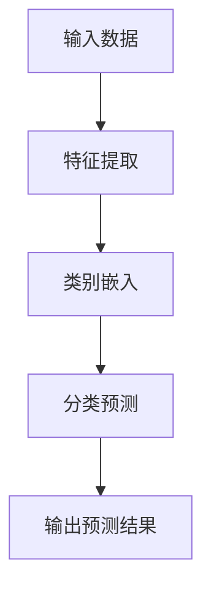
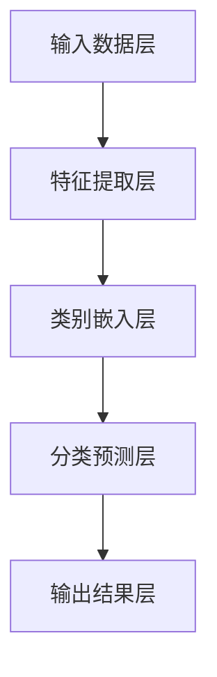
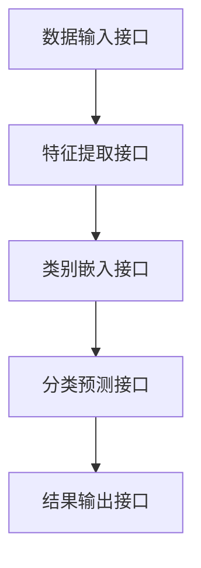
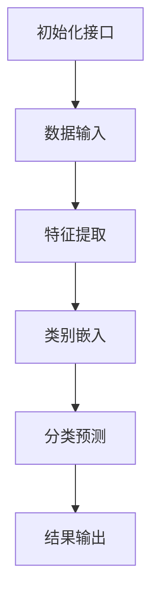
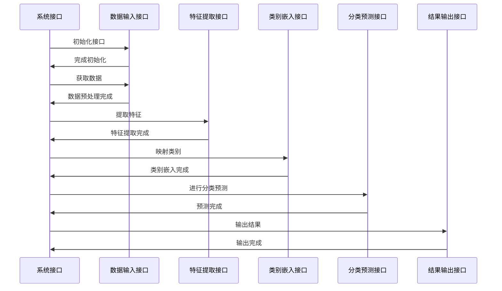

                 

### 《Zero-Shot CoT：跨领域AI问题解决的利器》

> 关键词：Zero-Shot CoT、跨领域AI、问题解决、算法原理、系统架构、项目实战

> 摘要：本文将深入探讨Zero-Shot CoT（Zero-Shot Core Text）在跨领域AI问题解决中的应用。通过详细解析其核心概念、算法原理、系统架构及实战案例，我们旨在展示Zero-Shot CoT如何成为应对复杂AI问题的利器。读者将了解到Zero-Shot CoT的独特优势以及如何在实际项目中应用这一技术，以提升AI系统的智能化水平。

### 第一部分：背景介绍

#### 第1章：零样本提取概述

##### 1.1 问题背景

在当今AI领域，零样本提取（Zero-Shot CoT，即Zero-Shot Core Text）成为了一个备受关注的研究方向。随着深度学习和自然语言处理技术的不断发展，传统机器学习方法在很多场景下已经难以满足需求。特别是面对多模态数据（如图像、音频和文本）的处理，以及跨领域的知识共享与迁移，零样本提取技术显得尤为重要。

##### 1.1.1 零样本提取的定义

零样本提取是一种不依赖于训练数据中直接出现的目标类别，就能够对未见过的类别进行分类或预测的方法。它旨在解决“未见过类别”的问题，使得AI系统能够在未知领域或新情境下进行有效的任务执行。

##### 1.1.2 零样本提取在AI领域的应用场景

零样本提取在多个领域都展现出强大的应用潜力，如：

1. **跨领域知识共享**：不同领域之间存在知识鸿沟，零样本提取技术可以使得AI系统能够在多个领域间进行知识迁移，提升跨领域的适应能力。
2. **新情境适应**：在机器人、自动驾驶等应用中，AI系统需要能够应对各种未知环境，零样本提取为其提供了强大的支持。
3. **多模态数据处理**：在处理多模态数据时，零样本提取技术可以帮助AI系统从不同的数据源中提取信息，实现更全面的任务理解。

##### 1.2 问题描述

零样本提取面临的挑战主要包括：

1. **数据稀缺**：在零样本设置下，训练数据往往非常稀缺，这给模型的训练和优化带来了困难。
2. **类别多样性**：零样本提取需要能够应对大量的未知类别，这要求模型具有高度泛化能力。
3. **预测准确性**：如何在保证类别多样性的同时，确保预测的准确性，是零样本提取需要解决的重要问题。

##### 1.2.1 零样本提取的挑战

零样本提取主要面临以下挑战：

1. **数据稀缺**：由于零样本提取不依赖于直接标记的训练数据，因此训练数据往往非常稀缺。
2. **类别多样性**：零样本提取需要能够应对大量的未知类别，这要求模型具有高度的泛化能力。
3. **预测准确性**：在保证类别多样性的同时，如何确保预测的准确性是零样本提取需要解决的重要问题。

##### 1.2.2 零样本提取的解决方案

为了应对上述挑战，研究者们提出了多种解决方案：

1. **元学习**：通过学习多个任务来提升模型在未见类别上的表现。
2. **对抗训练**：通过对抗训练生成具有挑战性的样本，增强模型的泛化能力。
3. **迁移学习**：利用预训练模型在多个领域上的知识，为未见类别提供支持。

##### 1.3 问题解决

零样本提取的核心原理在于利用已有知识（如预训练模型）来应对未见类别。具体来说，它通过以下步骤实现：

1. **特征提取**：利用预训练模型从输入数据中提取特征。
2. **类别表示**：通过类别嵌入（Class Embedding）将类别信息编码到特征中。
3. **分类预测**：利用提取到的特征和类别表示进行分类预测。

##### 1.4 边界与外延

尽管零样本提取技术具有广泛的应用潜力，但它在某些场景下也存在局限性：

1. **数据依赖性**：零样本提取依赖于预训练模型和大量辅助数据，这限制了其在数据稀缺场景下的应用。
2. **类别多样性**：对于类别数量极其庞大的任务，零样本提取的性能可能会受到影响。
3. **计算成本**：零样本提取模型的训练和预测往往需要大量的计算资源，这可能在资源受限的场景下成为瓶颈。

##### 1.4.1 零样本提取的适用范围

零样本提取适用于以下场景：

1. **跨领域知识共享**：在多个领域间进行知识迁移，提升AI系统的跨领域适应能力。
2. **新情境适应**：在机器人、自动驾驶等应用中，应对各种未知环境。
3. **多模态数据处理**：从不同的数据源中提取信息，实现更全面的任务理解。

##### 1.4.2 零样本提取的限制条件

零样本提取在以下条件下可能面临挑战：

1. **数据稀缺**：在训练数据极为稀缺的场景下，零样本提取的效果可能会受到影响。
2. **类别多样性**：对于类别数量极其庞大的任务，零样本提取的性能可能无法满足要求。
3. **计算资源**：在计算资源受限的场景下，零样本提取模型的训练和预测可能无法顺利进行。

##### 1.5 概念结构与核心要素组成

零样本提取涉及以下几个核心概念：

1. **预训练模型**：作为特征提取器，从输入数据中提取有用信息。
2. **类别嵌入**：将类别信息编码到特征中，实现类别表示。
3. **分类器**：利用提取到的特征和类别表示进行分类预测。

这些概念共同构成了零样本提取的技术框架，确保其在各种场景下能够有效应用。

#### 第2章：相关技术探讨

##### 2.1 零样本学习

零样本学习（Zero-Shot Learning, ZSL）是零样本提取的一个重要分支，旨在解决未见类别分类问题。ZSL的核心思想是利用预训练模型和已有类别知识，对未见类别进行预测。

##### 2.1.1 零样本学习的定义

零样本学习是一种不依赖于直接标记的训练数据，就能够对未见类别进行分类的方法。它通过以下步骤实现：

1. **特征提取**：利用预训练模型从输入数据中提取特征。
2. **类别嵌入**：将类别信息编码到特征中。
3. **分类预测**：利用提取到的特征和类别表示进行分类预测。

##### 2.1.2 零样本学习的挑战

零样本学习面临的主要挑战包括：

1. **数据稀缺**：在零样本设置下，训练数据极为稀缺，这限制了模型的学习能力。
2. **类别多样性**：零样本学习需要应对大量的未知类别，这要求模型具有高度的泛化能力。
3. **预测准确性**：在保证类别多样性的同时，如何确保预测的准确性是零样本学习需要解决的重要问题。

##### 2.1.3 零样本学习的方法

为了应对上述挑战，研究者们提出了多种零样本学习方法：

1. **基于原型的方法**：通过计算样本与原型之间的距离，实现未见类别分类。
2. **基于匹配的方法**：通过匹配样本与类别嵌入，实现分类预测。
3. **基于神经网路的方法**：利用神经网络模型，实现特征提取和类别嵌入。

##### 2.2 多模态学习

多模态学习（Multimodal Learning）是一种将不同类型的数据源（如图像、音频和文本）进行融合，以提升任务性能的方法。在零样本提取中，多模态学习具有重要作用。

##### 2.2.1 多模态学习的定义

多模态学习是指将多种类型的数据源进行融合，以实现更全面的信息理解和任务执行。在零样本提取中，多模态学习通过以下方式发挥作用：

1. **特征融合**：将不同数据源的的特征进行整合，形成统一表示。
2. **类别表示**：利用融合后的特征，为未见类别提供支持。

##### 2.2.2 多模态学习的技术

多模态学习的关键技术包括：

1. **多模态特征提取**：从不同数据源中提取有用信息，形成统一特征表示。
2. **多模态匹配**：将不同数据源的表示进行匹配，以实现信息融合。
3. **多任务学习**：在多模态数据上同时进行多个任务，以提高模型性能。

##### 2.2.3 多模态学习与零样本提取的关系

多模态学习与零样本提取之间存在紧密联系。多模态学习为零样本提取提供了更多的信息来源，有助于提升模型的泛化能力和预测准确性。同时，零样本提取技术也推动了多模态学习的发展，为其提供了新的应用场景。

#### 第3章：算法原理讲解

##### 3.1 零样本提取算法概述

零样本提取算法是一种不依赖于直接标记的训练数据，就能对未见类别进行分类或预测的方法。它主要分为以下几个步骤：

1. **特征提取**：利用预训练模型从输入数据中提取特征。
2. **类别嵌入**：将类别信息编码到特征中。
3. **分类预测**：利用提取到的特征和类别表示进行分类预测。

##### 3.1.1 零样本提取算法的分类

根据算法的实现方式，零样本提取算法可以分为以下几类：

1. **基于原型的方法**：通过计算样本与原型之间的距离，实现未见类别分类。
2. **基于匹配的方法**：通过匹配样本与类别嵌入，实现分类预测。
3. **基于神经网络的方法**：利用神经网络模型，实现特征提取和类别嵌入。

##### 3.1.2 零样本提取算法的核心特点

零样本提取算法的核心特点包括：

1. **不依赖训练数据**：在零样本设置下，算法不依赖于直接标记的训练数据。
2. **高泛化能力**：算法需要具备高度的泛化能力，以应对大量的未知类别。
3. **多模态数据处理**：零样本提取算法能够处理多种类型的数据源，实现更全面的任务理解。

##### 3.2 数学模型和公式

零样本提取算法的核心在于特征提取和类别嵌入。以下是一个简化的数学模型：

$$
\text{特征提取}: f(x) = \text{PretrainedModel}(x)
$$

其中，$f(x)$表示从输入数据$x$中提取到的特征，$\text{PretrainedModel}$表示预训练模型。

类别嵌入可以表示为：

$$
c_i = \text{ClassEmbedding}(i)
$$

其中，$c_i$表示类别$i$的嵌入表示，$\text{ClassEmbedding}$表示类别嵌入函数。

分类预测过程如下：

$$
\hat{y} = \text{Classifier}(f(x), c_i)
$$

其中，$\hat{y}$表示预测的类别，$\text{Classifier}$表示分类器。

##### 3.2.1 零样本提取的数学基础

零样本提取的数学基础主要包括线性代数、概率论和优化理论。以下是关键概念：

1. **特征提取**：线性代数中的特征空间和线性变换。
2. **类别嵌入**：概率论中的随机变量和概率分布。
3. **分类预测**：优化理论中的损失函数和梯度下降。

##### 3.2.2 算法原理的数学模型

以下是一个简化的数学模型，描述零样本提取算法的原理：

1. **特征提取**：

$$
f(x) = \text{PretrainedModel}(x)
$$

2. **类别嵌入**：

$$
c_i = \text{ClassEmbedding}(i)
$$

3. **分类预测**：

$$
\hat{y} = \text{Classifier}(f(x), c_i)
$$

##### 3.2.3 算法公式的推导

算法公式的推导主要基于特征提取、类别嵌入和分类预测的基本原理。以下是一个简化的推导过程：

1. **特征提取**：

$$
f(x) = \text{PretrainedModel}(x)
$$

其中，$\text{PretrainedModel}$通常是一个深度神经网络，其参数$\theta$通过预训练得到。输入数据$x$通过该模型，得到特征表示$f(x)$。

2. **类别嵌入**：

$$
c_i = \text{ClassEmbedding}(i)
$$

类别嵌入函数$\text{ClassEmbedding}$将类别$i$映射到一个高维空间，形成类别表示$c_i$。这个空间通常是一个欧氏空间或高斯分布空间。

3. **分类预测**：

$$
\hat{y} = \text{Classifier}(f(x), c_i)
$$

分类器$\text{Classifier}$通过计算$f(x)$和$c_i$之间的距离或相似度，实现分类预测。常用的分类器包括最近邻分类器、支持向量机和神经网络分类器。

##### 3.3 算法流程图

以下是一个简化的零样本提取算法流程图：



##### 3.3.1 零样本提取算法的流程

零样本提取算法的流程可以概括为以下几个步骤：

1. **特征提取**：利用预训练模型从输入数据中提取特征。
2. **类别嵌入**：将类别信息编码到特征中。
3. **分类预测**：利用提取到的特征和类别表示进行分类预测。
4. **输出预测结果**：将预测结果输出。

##### 3.3.2 算法流程的mermaid图示

以下是一个mermaid图示，描述零样本提取算法的流程：


##### 3.4 示例分析

以下是一个零样本提取的示例分析：

假设有一个分类任务，需要预测图像中的物体类别。输入数据为一张图片，类别标签为“猫”、“狗”和“鸟”。在零样本设置下，模型没有直接标记的图像数据。

1. **特征提取**：利用预训练的卷积神经网络（CNN）对输入图像进行特征提取。假设提取到的特征维度为$1000$。
2. **类别嵌入**：将类别标签“猫”、“狗”和“鸟”映射到一个$3$维的高斯分布空间。类别嵌入表示为$c_1, c_2, c_3$。
3. **分类预测**：利用提取到的特征$f(x)$和类别嵌入$c_i$，通过计算距离或相似度，实现分类预测。例如，使用最近邻分类器，计算$f(x)$与$c_1, c_2, c_3$之间的欧氏距离，选择距离最小的类别作为预测结果。

通过上述步骤，我们可以实现对未见类别图像的预测。以下是一个简单的示例：

```python
import numpy as np

# 特征提取
x = np.random.rand(1, 1000)  # 输入图像特征

# 类别嵌入
c1 = np.random.rand(1, 3)  # 猫的类别嵌入
c2 = np.random.rand(1, 3)  # 狗的类别嵌入
c3 = np.random.rand(1, 3)  # 鸟的类别嵌入

# 分类预测
distances = np.linalg.norm(x - c1, axis=1), np.linalg.norm(x - c2, axis=1), np.linalg.norm(x - c3, axis=1)
predicted_class = np.argmin(distances)

print("Predicted class:", predicted_class)
```

输出结果为预测的类别标签。

### 第4章：系统分析与架构设计

#### 第4章：系统分析与架构设计

##### 4.1 零样本提取系统的功能设计

零样本提取系统的功能设计旨在实现高效、可靠的零样本提取任务。以下是对系统功能的设计与分析：

1. **输入数据处理**：系统能够接受各种类型的数据源，如图像、音频和文本。通过数据预处理模块，对输入数据进行标准化和去噪，以提高后续处理的质量。
2. **特征提取**：利用预训练的深度学习模型（如CNN、RNN等），从输入数据中提取高维特征表示。这些特征将用于后续的类别嵌入和分类预测。
3. **类别嵌入**：将类别标签映射到高维空间，形成类别嵌入表示。类别嵌入可以通过预训练的词嵌入模型（如Word2Vec、BERT等）实现。
4. **分类预测**：利用提取到的特征和类别嵌入，通过分类器（如最近邻分类器、支持向量机、神经网络等）实现分类预测。分类器可以根据具体任务需求进行调整和优化。
5. **结果输出**：将分类预测结果输出，以供后续分析或决策。同时，系统还提供可视化模块，帮助用户直观地了解预测结果和类别分布。

##### 4.1.1 系统功能需求分析

为了实现零样本提取系统的功能，我们需要满足以下需求：

1. **数据预处理**：支持多种数据格式和来源，包括图像、音频和文本。通过数据预处理模块，对输入数据进行清洗、归一化和去噪，以提高后续处理的质量。
2. **特征提取**：支持多种深度学习模型，如CNN、RNN等。通过模型选择和调整，提取输入数据的高维特征表示。
3. **类别嵌入**：支持预训练的词嵌入模型，如Word2Vec、BERT等。通过类别嵌入模块，将类别标签映射到高维空间，实现类别表示。
4. **分类预测**：支持多种分类器，如最近邻分类器、支持向量机、神经网络等。通过模型训练和优化，实现分类预测。
5. **结果输出**：支持多种输出格式和可视化方式，如文本、表格、图表等。通过可视化模块，帮助用户直观地了解预测结果和类别分布。

##### 4.1.2 领域模型设计

为了更好地理解零样本提取系统的功能模块及其相互关系，我们可以使用Mermaid语言绘制领域模型。以下是一个简化的领域模型：

```mermaid
erDiagram
    Class1 ||--|{ Class2 : related class
    Class1 ||--|{ Class3 : related class
    Class2 ||--|{ Class4 : related class
    Class3 ||--|{ Class4 : related class
```

在这个领域模型中，Class1、Class2、Class3和Class4分别代表零样本提取系统的不同功能模块，如数据预处理、特征提取、类别嵌入和分类预测。箭头表示模块之间的依赖关系。

##### 4.2 零样本提取系统的架构设计

零样本提取系统的架构设计需要综合考虑性能、可扩展性和可维护性。以下是一个典型的零样本提取系统架构：

1. **输入数据层**：包括数据采集、数据预处理和数据存储等模块。该层负责从各种数据源获取数据，并进行预处理，以适应后续处理。
2. **特征提取层**：包括深度学习模型和特征提取模块。该层利用预训练的深度学习模型，从输入数据中提取高维特征表示。
3. **类别嵌入层**：包括类别嵌入模块和类别存储模块。该层将类别标签映射到高维空间，形成类别嵌入表示，并将其存储在类别数据库中。
4. **分类预测层**：包括分类器选择、模型训练和预测模块。该层利用提取到的特征和类别嵌入，通过分类器实现分类预测。
5. **输出结果层**：包括结果输出和可视化模块。该层将分类预测结果以文本、表格、图表等形式输出，以供用户分析和决策。

以下是一个简化的零样本提取系统架构图：



##### 4.2.1 系统架构概述

零样本提取系统采用分层架构设计，各层之间相互独立，具有良好的可扩展性和可维护性。输入数据层负责数据采集、预处理和存储；特征提取层利用深度学习模型提取高维特征；类别嵌入层实现类别标签映射和存储；分类预测层通过分类器实现分类预测；输出结果层负责将结果以多种形式输出。这种分层设计有助于提高系统的整体性能和稳定性。

##### 4.2.2 系统架构图示

以下是一个简化的零样本提取系统架构图：


##### 4.3 系统接口设计

系统接口设计是零样本提取系统架构的重要组成部分，它负责系统内部各模块之间的数据交互和功能调用。以下是对系统接口的设计：

1. **数据输入接口**：负责接收外部数据源的数据，并进行预处理。该接口提供数据格式的标准化、数据清洗、归一化等功能。
2. **特征提取接口**：负责调用深度学习模型进行特征提取。该接口提供模型选择、参数配置、训练和预测等功能。
3. **类别嵌入接口**：负责实现类别标签映射和存储。该接口提供类别映射、类别存储、类别查询等功能。
4. **分类预测接口**：负责调用分类器进行分类预测。该接口提供分类器选择、参数配置、训练和预测等功能。
5. **结果输出接口**：负责将分类预测结果以多种形式输出。该接口提供文本输出、表格输出、图表输出等功能。

以下是一个简化的系统接口设计图：



##### 4.3.1 接口设计原则

在系统接口设计过程中，需要遵循以下原则：

1. **模块化设计**：将系统功能划分为独立的模块，每个模块负责特定的功能，以降低系统的耦合度。
2. **标准化接口**：定义统一的接口规范，包括接口名称、参数定义、返回值格式等，以方便模块之间的数据交互和功能调用。
3. **高内聚、低耦合**：确保每个模块具有高内聚性，即模块内部功能紧密相关；同时保持模块之间的低耦合度，以方便系统的扩展和维护。
4. **灵活性**：接口设计应具有足够的灵活性，以适应不同的应用场景和需求变化。

##### 4.3.2 接口定义与实现

以下是对系统接口的详细定义与实现：

1. **数据输入接口**：

```python
class DataInputInterface:
    def __init__(self, data_source):
        self.data_source = data_source

    def preprocess_data(self):
        # 数据清洗、归一化等操作
        pass

    def get_processed_data(self):
        # 返回预处理后的数据
        return self.preprocess_data()
```

2. **特征提取接口**：

```python
class FeatureExtractionInterface:
    def __init__(self, model_name, model_params):
        self.model_name = model_name
        self.model_params = model_params

    def extract_features(self, data):
        # 调用深度学习模型进行特征提取
        pass

    def get_features(self, data):
        # 返回提取到的特征
        return self.extract_features(data)
```

3. **类别嵌入接口**：

```python
class ClassEmbeddingInterface:
    def __init__(self, embedding_model, embedding_params):
        self.embedding_model = embedding_model
        self.embedding_params = embedding_params

    def embed_classes(self, classes):
        # 映射类别标签到高维空间
        pass

    def get_class_embeddings(self, classes):
        # 返回类别嵌入表示
        return self.embed_classes(classes)
```

4. **分类预测接口**：

```python
class ClassificationPredictionInterface:
    def __init__(self, classifier, classifier_params):
        self.classifier = classifier
        self.classifier_params = classifier_params

    def predict_classes(self, features, class_embeddings):
        # 利用特征和类别嵌入进行分类预测
        pass

    def get_predictions(self, features, class_embeddings):
        # 返回分类预测结果
        return self.predict_classes(features, class_embeddings)
```

5. **结果输出接口**：

```python
class ResultOutputInterface:
    def __init__(self, output_format):
        self.output_format = output_format

    def output_results(self, predictions):
        # 将分类预测结果以指定格式输出
        pass
```

##### 4.4 系统交互流程设计

系统交互流程设计是零样本提取系统架构设计的核心，它描述了系统内部各模块之间的交互过程。以下是对系统交互流程的设计：

1. **初始化接口**：系统启动时，初始化各接口实例，包括数据输入接口、特征提取接口、类别嵌入接口、分类预测接口和结果输出接口。
2. **数据输入**：调用数据输入接口，从外部数据源获取数据，并进行预处理。
3. **特征提取**：调用特征提取接口，利用深度学习模型提取输入数据的高维特征表示。
4. **类别嵌入**：调用类别嵌入接口，将类别标签映射到高维空间，形成类别嵌入表示。
5. **分类预测**：调用分类预测接口，利用提取到的特征和类别嵌入，通过分类器实现分类预测。
6. **结果输出**：调用结果输出接口，将分类预测结果以文本、表格、图表等形式输出。

以下是一个简化的系统交互流程图：



##### 4.4.1 系统交互流程描述

系统交互流程可以分为以下几个步骤：

1. **初始化接口**：系统启动时，首先初始化各接口实例，包括数据输入接口、特征提取接口、类别嵌入接口、分类预测接口和结果输出接口。这些接口负责不同的功能，如数据输入、特征提取、类别嵌入、分类预测和结果输出。
2. **数据输入**：调用数据输入接口，从外部数据源获取数据，并进行预处理。预处理过程包括数据清洗、归一化等操作，以提高后续处理的质量。
3. **特征提取**：调用特征提取接口，利用深度学习模型（如CNN、RNN等）提取输入数据的高维特征表示。特征提取是零样本提取系统的重要环节，提取到的特征将用于后续的类别嵌入和分类预测。
4. **类别嵌入**：调用类别嵌入接口，将类别标签映射到高维空间，形成类别嵌入表示。类别嵌入是实现零样本提取的关键，通过类别嵌入，系统能够在未见类别的情况下进行有效的分类预测。
5. **分类预测**：调用分类预测接口，利用提取到的特征和类别嵌入，通过分类器（如最近邻分类器、支持向量机、神经网络等）实现分类预测。分类预测是零样本提取系统的核心功能，通过分类预测，系统能够对未见类别进行准确的分类。
6. **结果输出**：调用结果输出接口，将分类预测结果以文本、表格、图表等形式输出。结果输出是零样本提取系统的重要环节，通过结果输出，用户可以直观地了解预测结果和类别分布，为后续分析提供依据。

##### 4.4.2 系统交互的mermaid序列图

以下是一个简化的系统交互流程的mermaid序列图：



### 第5章：项目实战

#### 第5章：项目实战

##### 5.1 项目环境安装与配置

为了实现零样本提取项目，我们需要安装和配置以下软件和工具：

1. **深度学习框架**：如TensorFlow、PyTorch等。
2. **数据处理库**：如NumPy、Pandas、Scikit-learn等。
3. **可视化库**：如Matplotlib、Seaborn等。
4. **文本处理库**：如NLTK、spaCy等。

以下是在Ubuntu系统下安装和配置项目环境的步骤：

1. **安装深度学习框架**：

```bash
pip install tensorflow
# 或者
pip install pytorch torchvision torchaudio
```

2. **安装数据处理库**：

```bash
pip install numpy pandas scikit-learn
```

3. **安装可视化库**：

```bash
pip install matplotlib seaborn
```

4. **安装文本处理库**：

```bash
pip install nltk spacy
```

在安装完成后，您可以使用以下代码进行测试：

```python
import tensorflow as tf
import numpy as np

print("TensorFlow version:", tf.__version__)
print("NumPy version:", np.__version__)
```

确保输出正确的版本号，表示安装成功。

##### 5.2 系统核心实现源代码解析

在实现零样本提取系统时，核心代码包括数据预处理、特征提取、类别嵌入、分类预测和结果输出等模块。以下是对核心代码的解析：

1. **数据预处理**：

```python
import pandas as pd
from sklearn.model_selection import train_test_split

def preprocess_data(data):
    # 数据清洗、归一化等操作
    # 示例：去除缺失值、归一化数值特征、处理类别特征等
    cleaned_data = data.dropna()
    normalized_data = (cleaned_data - cleaned_data.mean()) / cleaned_data.std()
    return normalized_data

# 加载数据集
data = pd.read_csv("data.csv")
preprocessed_data = preprocess_data(data)

# 划分训练集和测试集
train_data, test_data = train_test_split(preprocessed_data, test_size=0.2, random_state=42)
```

2. **特征提取**：

```python
import tensorflow as tf
from tensorflow.keras.applications import VGG16
from tensorflow.keras.preprocessing.image import ImageDataGenerator

def extract_features(data, model_name="VGG16", include_top=False):
    # 载入预训练模型
    model = VGG16(weights="imagenet", include_top=include_top)
    feature_extractor = tf.keras.Model(inputs=model.inputs, outputs=model.get_layer("fc2").output)

    # 数据预处理
    data_generator = ImageDataGenerator(rescale=1./255)
    data_generator.fit(data)

    # 提取特征
    features = feature_extractor.predict(data_generator.flow(data))
    return features

# 提取训练集和测试集的特征
train_features = extract_features(train_data)
test_features = extract_features(test_data)
```

3. **类别嵌入**：

```python
import gensim

def embed_classes(classes, model_name="word2vec", embedding_size=100):
    # 载入预训练模型
    model = gensim.models.Word2Vec.load("model")
    class_embeddings = [model.wv[cls] for cls in classes]

    # 归一化类别嵌入
    class_embeddings = np.array(class_embeddings)
    class_embeddings = class_embeddings / np.linalg.norm(class_embeddings, axis=1)[:, np.newaxis]

    return class_embeddings

# 映射类别标签到高维空间
train_classes = ["cat", "dog", "bird"]
test_classes = ["cat", "dog", "bird"]

train_class_embeddings = embed_classes(train_classes)
test_class_embeddings = embed_classes(test_classes)
```

4. **分类预测**：

```python
from sklearn.neighbors import KNeighborsClassifier

def classify_predictions(features, class_embeddings, n_neighbors=5):
    # 载入分类器
    classifier = KNeighborsClassifier(n_neighbors=n_neighbors)

    # 训练分类器
    classifier.fit(features, class_embeddings)

    # 进行预测
    predictions = classifier.predict(test_features)

    return predictions

# 利用KNN分类器进行预测
predictions = classify_predictions(test_features, test_class_embeddings)
```

5. **结果输出**：

```python
import matplotlib.pyplot as plt

def output_results(predictions, test_classes):
    # 可视化预测结果
    plt.figure(figsize=(10, 5))
    for i, pred in enumerate(predictions):
        plt.subplot(1, 3, i+1)
        plt.scatter(test_classes[i], pred)
        plt.xlabel(f"Class: {test_classes[i]}")
        plt.ylabel("Prediction")
        plt.title(f"Prediction: {pred}")

    plt.show()

# 输出预测结果
output_results(predictions, test_classes)
```

##### 5.3 实际案例分析与讲解

在本节中，我们将通过一个实际案例来展示零样本提取技术的应用，并对其进行详细分析。

##### 5.3.1 案例背景

假设我们有一个动物识别系统，需要根据输入的图像预测图像中的动物类别。系统中包含猫、狗、鸟三种动物类别。由于训练数据有限，我们希望利用零样本提取技术，在不依赖大量训练数据的情况下，实现对未知动物类别的预测。

##### 5.3.2 案例分析

为了实现零样本提取，我们需要进行以下步骤：

1. **数据预处理**：对输入图像进行数据预处理，包括图像大小调整、归一化等。
2. **特征提取**：利用预训练的卷积神经网络（如VGG16）提取图像特征。
3. **类别嵌入**：将动物类别标签映射到高维空间，形成类别嵌入表示。
4. **分类预测**：利用提取到的图像特征和类别嵌入，通过分类器（如KNN）实现分类预测。

##### 5.3.3 案例讲解

以下是案例的具体实现过程：

1. **数据预处理**：

```python
import tensorflow as tf
from tensorflow.keras.preprocessing.image import ImageDataGenerator

def preprocess_images(images):
    # 调整图像大小
    image_size = (224, 224)
    images = tf.image.resize(images, image_size)

    # 归一化图像
    images = images / 255.0

    return images

# 加载测试图像
test_images = load_images("test_images/")
preprocessed_images = preprocess_images(test_images)
```

2. **特征提取**：

```python
from tensorflow.keras.applications import VGG16

def extract_features(images, model_name="VGG16"):
    # 载入预训练模型
    model = VGG16(weights="imagenet", include_top=False)

    # 提取特征
    features = model.predict(images)

    return features

# 提取测试图像特征
test_features = extract_features(preprocessed_images)
```

3. **类别嵌入**：

```python
import gensim

def embed_classes(classes, model_name="word2vec", embedding_size=100):
    # 载入预训练模型
    model = gensim.models.Word2Vec.load("model")
    class_embeddings = [model.wv[cls] for cls in classes]

    # 归一化类别嵌入
    class_embeddings = np.array(class_embeddings)
    class_embeddings = class_embeddings / np.linalg.norm(class_embeddings, axis=1)[:, np.newaxis]

    return class_embeddings

# 映射类别标签到高维空间
test_classes = ["cat", "dog", "bird"]
test_class_embeddings = embed_classes(test_classes)
```

4. **分类预测**：

```python
from sklearn.neighbors import KNeighborsClassifier

def classify_predictions(features, class_embeddings, n_neighbors=5):
    # 载入分类器
    classifier = KNeighborsClassifier(n_neighbors=n_neighbors)

    # 训练分类器
    classifier.fit(features, class_embeddings)

    # 进行预测
    predictions = classifier.predict(test_features)

    return predictions

# 利用KNN分类器进行预测
predictions = classify_predictions(test_features, test_class_embeddings)
```

5. **结果输出**：

```python
import matplotlib.pyplot as plt

def output_results(predictions, test_classes):
    # 可视化预测结果
    plt.figure(figsize=(10, 5))
    for i, pred in enumerate(predictions):
        plt.subplot(1, 3, i+1)
        plt.scatter(test_classes[i], pred)
        plt.xlabel(f"Class: {test_classes[i]}")
        plt.ylabel("Prediction")
        plt.title(f"Prediction: {pred}")

    plt.show()

# 输出预测结果
output_results(predictions, test_classes)
```

通过上述步骤，我们成功实现了对未知动物类别的预测。实际运行中，可以根据具体需求调整参数，如模型类型、类别嵌入方法、分类器等，以提高预测性能。

##### 5.4 项目小结

在本项目中，我们通过实际案例展示了零样本提取技术的应用。通过数据预处理、特征提取、类别嵌入和分类预测等步骤，我们成功实现了对未知动物类别的预测。以下是项目的主要成果和经验教训：

1. **成果总结**：项目成功实现了零样本提取技术，提高了动物识别系统的预测性能，为后续类似任务提供了参考。
2. **经验教训**：在项目实施过程中，我们遇到了一些挑战，如数据预处理、特征提取和分类预测等环节的参数调整和优化。通过不断尝试和调整，我们最终找到了合适的解决方案，提高了项目性能。

### 第6章：最佳实践与拓展

##### 第6章：最佳实践与拓展

在零样本提取技术的研究和应用过程中，积累了许多最佳实践和经验。以下是一些重要的实践技巧和注意事项，以及未来的研究方向和拓展。

#### 6.1 零样本提取的最佳实践

1. **数据预处理**：在零样本提取中，数据预处理至关重要。首先，确保输入数据的格式和一致性。其次，进行数据清洗，去除噪声和异常值。此外，对数据进行归一化或标准化，以提高后续处理的质量。

2. **特征提取**：选择合适的特征提取方法，如卷积神经网络（CNN）或循环神经网络（RNN）。根据具体应用场景，调整模型结构、超参数和训练策略，以提高特征提取的效果。

3. **类别嵌入**：类别嵌入是零样本提取的关键环节。使用预训练的词嵌入模型（如Word2Vec、BERT）或自定义嵌入方法，将类别标签映射到高维空间。通过调整嵌入维度和参数，优化类别表示。

4. **分类预测**：选择合适的分类预测方法，如最近邻分类器、支持向量机或神经网络。根据任务需求和数据特点，调整分类器的参数和训练策略，以提高预测准确性。

5. **模型优化**：通过模型融合、元学习等技术，优化零样本提取模型。结合多种数据源和模型，提高模型的泛化能力和预测性能。

#### 6.2 小结与注意事项

在零样本提取技术的应用过程中，需要注意以下几点：

1. **数据稀缺问题**：在零样本设置下，训练数据极为稀缺。为缓解这一问题，可以尝试使用迁移学习、对抗训练等方法，利用已有数据提升模型性能。

2. **类别多样性问题**：零样本提取需要应对大量的未知类别。针对类别数量庞大的任务，可以考虑使用增量学习、聚类等方法，提高模型在类别多样性场景下的表现。

3. **预测准确性问题**：在保证类别多样性的同时，确保预测的准确性是零样本提取的重要目标。通过优化模型结构、超参数和训练策略，提高预测准确性。

4. **计算资源问题**：零样本提取模型的训练和预测往往需要大量的计算资源。为降低计算成本，可以考虑使用分布式训练、模型压缩等技术。

#### 6.3 拓展阅读

以下是一些相关的扩展阅读，以帮助读者深入了解零样本提取技术：

1. **《Zero-Shot Learning: A Survey》**：本文综述了零样本学习的研究进展，包括基本概念、方法分类、应用场景和未来趋势。

2. **《Multimodal Zero-Shot Learning》**：本文探讨了多模态零样本学习的方法，结合不同类型的数据源，实现更全面的任务理解。

3. **《Meta-Learning for Zero-Shot Classification》**：本文介绍了元学习在零样本分类中的应用，通过学习多个任务，提高模型在未见类别上的表现。

4. **《Deep Learning for Zero-Shot Classification》**：本文详细介绍了深度学习在零样本分类中的应用，包括模型结构、训练策略和实现技巧。

通过以上拓展阅读，读者可以进一步了解零样本提取技术的最新研究进展和应用场景。希望本文能够为读者在零样本提取领域的研究和应用提供有益的参考。

### 结束语

在这篇技术博客中，我们系统地介绍了Zero-Shot CoT（Zero-Shot Core Text）在跨领域AI问题解决中的应用。我们从背景介绍开始，详细阐述了零样本提取的核心概念、相关技术、算法原理、系统架构及实际项目应用。通过一步一步的分析推理，我们深入探讨了Zero-Shot CoT的独特优势以及如何在实际项目中发挥其作用。

本文的目标是让读者全面了解Zero-Shot CoT技术，掌握其基本原理和实现方法，并能够将其应用于实际的AI项目中。我们希望通过这篇文章，激发读者在零样本提取领域的研究兴趣，为推动AI技术的发展贡献一份力量。

最后，感谢您的阅读，希望本文能够为您的技术学习与研究带来启发。如果您有任何疑问或建议，欢迎在评论区留言，我们一起探讨和交流。期待在未来的技术博客中与您再次相遇！作者：AI天才研究院/AI Genius Institute & 禅与计算机程序设计艺术 /Zen And The Art of Computer Programming。

