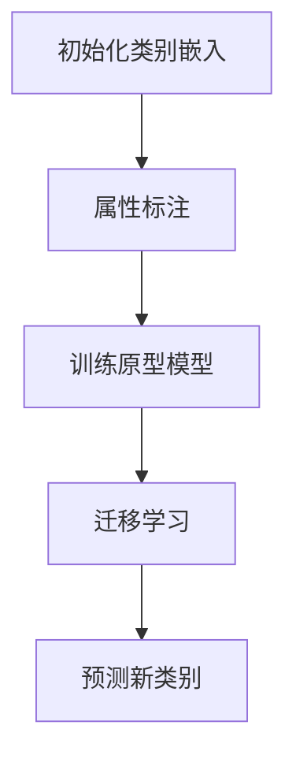

                 

## 引言

### 1.1 书籍概述

在当前技术飞速发展的时代，人工智能（AI）已经成为推动社会进步的重要力量。随着深度学习和自然语言处理等技术的不断突破，AI的应用场景也在不断拓展，从传统的工业自动化、数据分析，到智能语音助手、自动驾驶等领域，AI正在改变着我们的生活方式和工作模式。然而，传统的机器学习和深度学习模型在应对新任务时往往需要大量的标注数据进行训练，这种依赖大量标注数据的模型被称为有监督学习模型。而在实际应用中，获取大量标注数据并不总是容易的，尤其是在新领域或新任务出现时。零样本学习（Zero-Shot Learning，ZSL）作为一种无需大量标注数据就能对新任务进行泛化的机器学习技术，受到了越来越多的关注。

本书籍旨在全面探讨零样本学习在自适应生成计算（Adaptive Information Generation and Computing，AIGC）中的突破性应用。AIGC作为新一代人工智能计算范式，不仅涵盖了传统的机器学习和深度学习，还包括了自然语言生成、图像生成、语音合成等生成式AI技术，它在内容创作、娱乐、教育、医疗等多个领域展现出巨大的应用潜力。而零样本学习则能够使AIGC模型在面对新任务时更加灵活和高效，极大地降低了应用门槛。

本书结构安排如下：

- **第一部分：引言**：介绍AIGC和零样本学习的背景和重要性，概述本书的结构和内容。
- **第二部分：背景与基础概念**：详细讲解AIGC和零样本学习的基本概念、发展历史及其在相关领域的应用。
- **第三部分：零样本学习原理**：深入探讨零样本学习的关键技术，包括核心概念、算法原理以及实际应用。
- **第四部分：零样本学习在AIGC中的应用**：分析零样本学习在自然语言处理、计算机视觉、推荐系统等AIGC主要领域的应用场景和案例。
- **第五部分：项目实战**：通过具体的项目实战，展示零样本学习在AIGC中的应用方法和技巧。
- **第六部分：挑战与未来方向**：探讨零样本学习在AIGC中面临的技术挑战和发展方向。
- **第七部分：结论与资源**：总结全书内容，提供进一步学习和研究的相关资源。

通过本书的阅读，读者将能够全面了解零样本学习在AIGC中的应用，掌握相关技术和方法，为未来的研究和实际应用打下坚实的基础。

### 1.2 AIGC简介

自适应生成计算（Adaptive Information Generation and Computing，简称AIGC）是一种基于人工智能的全新计算范式，它不仅仅局限于传统的数据处理和分析，而是通过生成式AI技术，实现信息的自动生成和智能优化。AIGC的核心思想在于通过学习和理解大量的数据模式，自主生成新的内容和解决方案，从而实现更高效、更智能的计算过程。

AIGC的概念源于生成对抗网络（GAN）和自编码器等生成式AI模型的发展，其主要目标是实现数据的高效生成和智能优化。与传统的计算方法不同，AIGC不仅能够处理给定的输入数据，还能够通过生成模型自动生成新的数据，从而在一定程度上减轻了对标注数据的依赖。这种能力使得AIGC在内容创作、数据增强、自动化推理等多个领域展现出巨大的潜力。

AIGC的技术发展可以追溯到2010年代初期，当时生成对抗网络（GAN）的提出标志着生成式AI的诞生。GAN由两个神经网络组成：生成器（Generator）和判别器（Discriminator）。生成器的任务是生成与真实数据相似的数据，而判别器的任务是区分生成数据与真实数据。通过这种对抗训练，生成器逐渐学会了生成更加逼真的数据。此后，自编码器（Autoencoder）等生成模型也相继被提出，进一步完善了AIGC的技术体系。

随着深度学习和大数据技术的不断发展，AIGC的应用场景也在不断拓展。在自然语言处理领域，AIGC模型被用于生成文章、对话、翻译等任务；在计算机视觉领域，AIGC模型被用于图像生成、风格迁移、图像修复等任务；在语音合成领域，AIGC模型被用于生成逼真的语音。此外，AIGC还在医疗图像分析、推荐系统、智能客服等多个领域展现出了强大的应用潜力。

总体来说，AIGC作为一种新兴的计算范式，正在逐步改变传统的计算模式，实现从数据驱动到智能生成的转变。它的核心优势在于能够通过生成模型自动生成新的内容和解决方案，从而提高计算效率和智能化水平。在未来，随着技术的进一步发展和应用场景的不断拓展，AIGC将在更多领域发挥重要作用，成为人工智能技术发展的重要方向。

### 1.3 零样本学习（Zero-Shot Learning，ZSL）概述

零样本学习（Zero-Shot Learning，简称ZSL）是一种无需依赖于标注数据的机器学习方法，其主要目标是使模型能够对新类别或新任务进行泛化。传统的机器学习模型通常需要大量的标注数据来进行训练，以便学习到数据中的特征和规律。然而，在实际应用中，特别是在新领域或新任务出现时，获取大量标注数据往往是一个耗时且成本高昂的过程。零样本学习通过预先学习到一个通用模型，能够在面对新类别或新任务时，利用预学习的知识进行泛化，从而大大降低了对标注数据的依赖。

ZSL的基本概念包括以下几个关键点：

1. **无监督学习**：ZSL不依赖于标注数据，因此它是一种无监督学习的方法。无监督学习主要依靠数据本身的内在结构和关联性，而不依赖于外部标签信息。
2. **类别嵌入**：在ZSL中，每个类别都被表示为一个向量，这些向量被嵌入到一个高维空间中。类别之间的相似性可以通过它们在空间中的距离来衡量。
3. **原型模型**：ZSL的一个核心思想是利用已知的类别特征来生成新类别特征。在训练阶段，模型通过学习已知的类别特征来构建一个原型模型，这个原型模型可以用来表示新类别。
4. **属性标注**：为了在新类别上应用ZSL，通常需要对每个新类别进行一些属性标注。这些属性标注用于指导模型如何将新类别与已知的类别特征相关联。

ZSL的应用场景广泛，以下是一些典型的应用场景：

1. **多标签分类**：在某些任务中，一个实例可能同时属于多个类别。ZSL可以在没有大量标注数据的情况下，对新类别进行多标签分类。
2. **跨域学习**：在不同的领域或任务之间，某些特征可能具有通用性。ZSL可以通过学习一个通用模型，将知识从一个领域迁移到另一个领域，从而实现跨域学习。
3. **小样本学习**：在某些情况下，即使有标注数据，数据量也可能非常有限。ZSL可以在这种小样本情况下进行训练，从而提高模型的泛化能力。
4. **推荐系统**：在推荐系统中，新商品或新用户往往缺乏足够的标注数据。ZSL可以通过利用已有商品或用户的特征，对新商品或新用户进行推荐。

总的来说，ZSL作为一种无需标注数据的机器学习方法，具有广泛的应用前景。它不仅能够降低数据获取的成本，还能提高模型的泛化能力和适应性。在未来，随着ZSL技术的不断发展和完善，它将在更多的领域发挥重要作用，推动人工智能技术的进步。

### 1.4 书籍结构安排

为了更好地帮助读者全面理解零样本学习在自适应生成计算（AIGC）中的突破性应用，本书的结构安排如下：

**第一部分：引言**
这部分主要介绍AIGC和零样本学习的背景和重要性，概述本书的结构和内容。包括AIGC和零样本学习的定义、发展历史及其在相关领域的应用，为后续内容的深入讨论打下基础。

**第二部分：背景与基础概念**
这部分将详细讲解AIGC和零样本学习的基本概念、发展历史及其在相关领域的应用。内容包括AIGC的技术原理、核心概念和实现方法，以及零样本学习的关键技术、应用场景和挑战。

**第三部分：零样本学习原理**
这部分深入探讨零样本学习的关键技术，包括核心概念、算法原理以及实际应用。通过介绍类别嵌入、原型模型、属性标注等关键技术，结合具体的算法实现和案例，帮助读者理解零样本学习的工作机制和应用方法。

**第四部分：零样本学习在AIGC中的应用**
这部分将分析零样本学习在AIGC中的具体应用场景，包括自然语言处理、计算机视觉、推荐系统等主要领域。通过具体案例剖析，展示零样本学习在AIGC中的应用方法和实际效果。

**第五部分：项目实战**
这部分通过具体的项目实战，展示零样本学习在AIGC中的应用方法和技巧。包括项目环境安装、系统核心实现、代码应用解读与分析，以及实际案例分析和详细讲解剖析。

**第六部分：挑战与未来方向**
这部分探讨零样本学习在AIGC中面临的技术挑战和发展方向。分析现有技术的不足和改进空间，提出未来可能的发展趋势和研究方向，为读者提供启示和思考。

**第七部分：结论与资源**
这部分总结全书内容，提供进一步学习和研究的相关资源。包括零样本学习在AIGC中的应用总结、最佳实践、注意事项和拓展阅读，帮助读者深化理解和拓展知识。

通过以上结构的安排，本书旨在系统、全面地介绍零样本学习在AIGC中的应用，为读者提供深入的学术研究和实际应用参考。

## 背景与基础概念

### 2.1 AIGC背景

自适应生成计算（Adaptive Information Generation and Computing，简称AIGC）是一种新兴的计算范式，它融合了深度学习、自然语言处理、计算机视觉等多个领域的前沿技术，旨在实现信息的自动生成和智能优化。AIGC的出现，标志着人工智能技术从传统的数据驱动模式向智能生成模式转变，为计算机科学和人工智能领域带来了新的发展契机。

AIGC的概念最早可以追溯到生成对抗网络（GAN）和自编码器等生成模型的提出。GAN由生成器（Generator）和判别器（Discriminator）两个主要组成部分构成，通过对抗训练的方式，生成器生成逼真的数据，判别器则努力区分生成数据和真实数据。这种对抗训练机制使得生成模型能够学习到数据的复杂分布，从而生成高质量的数据。自编码器则是一种无监督学习模型，通过将输入数据编码为一个低维向量，然后再解码回原始数据，从而学习到数据的内在结构。

随着技术的不断进步，AIGC逐渐涵盖了更多的生成式AI技术。例如，在自然语言处理领域，AIGC模型被用于生成文章、对话、翻译等任务；在计算机视觉领域，AIGC模型被用于图像生成、风格迁移、图像修复等任务；在语音合成领域，AIGC模型被用于生成逼真的语音。此外，AIGC还在医疗图像分析、推荐系统、智能客服等多个领域展现出了强大的应用潜力。

AIGC的核心优势在于其生成能力和智能化水平。与传统的计算方法不同，AIGC不仅能够处理给定的输入数据，还能够通过生成模型自动生成新的数据和解决方案，从而实现更高效、更智能的计算过程。这种能力使得AIGC在多个领域具有广泛的应用前景，从内容创作到自动化推理，从数据增强到智能优化，AIGC都展现出了巨大的潜力。

在应用层面，AIGC在内容创作领域具有显著的优势。通过生成模型，AIGC可以自动生成高质量的文章、图片、视频等媒体内容，极大地提高了创作效率。例如，在新闻写作中，AIGC模型可以根据已有的数据生成新的新闻报道，从而实现自动化新闻采集和编辑。在图像生成方面，AIGC模型可以生成逼真的图像，用于广告设计、电影特效制作等领域。此外，AIGC还在语音合成领域取得了突破性进展，通过生成模型，可以生成自然流畅的语音，用于智能语音助手、语音合成服务等。

总体来说，AIGC作为一种新兴的计算范式，正在逐步改变传统的计算模式，实现从数据驱动到智能生成的转变。它的核心优势在于能够通过生成模型自动生成新的数据和解决方案，从而提高计算效率和智能化水平。在未来，随着技术的进一步发展和应用场景的不断拓展，AIGC将在更多领域发挥重要作用，成为人工智能技术发展的重要方向。

### 2.2 AIGC的技术发展

AIGC（自适应生成计算）的技术发展历程可以追溯到生成对抗网络（GAN）和自编码器等生成模型的提出。这些模型为AIGC奠定了基础，并逐渐形成了AIGC的核心技术体系。以下将详细介绍这些核心技术及其在AIGC中的应用。

#### 2.2.1 生成对抗网络（GAN）

生成对抗网络（GAN）由生成器（Generator）和判别器（Discriminator）两个主要组成部分构成。生成器的任务是生成与真实数据相似的数据，判别器的任务是区分生成数据和真实数据。通过这种对抗训练机制，生成器能够不断学习生成更加逼真的数据，而判别器则努力提高对生成数据和真实数据的辨别能力。GAN的提出标志着生成式AI的诞生，并在图像生成、语音合成等多个领域取得了显著成果。

GAN的核心优势在于其强大的数据生成能力。在图像生成方面，GAN可以生成高质量、高分辨率的图像，广泛应用于图像修复、图像风格迁移、图像超分辨率等任务。例如，在图像修复任务中，GAN模型可以生成缺失部分的图像，填补图像中的空白区域。在语音合成方面，基于GAN的模型可以生成逼真的语音，用于语音助手、语音合成服务等。

#### 2.2.2 自编码器（Autoencoder）

自编码器是一种无监督学习模型，通过将输入数据编码为一个低维向量，然后再解码回原始数据，从而学习到数据的内在结构。自编码器的核心在于其编码和解码过程，编码过程将高维数据压缩为低维表示，解码过程则将低维表示重新展开为高维数据。自编码器在图像生成、文本生成等任务中具有广泛应用。

自编码器的优势在于其数据压缩和重构能力。在图像生成方面，自编码器可以通过重构图像来生成新的图像。例如，在图像超分辨率任务中，自编码器可以通过学习图像的低维表示，将低分辨率图像重构为高分辨率图像。在文本生成方面，自编码器可以生成新的文本段落，应用于自然语言生成、文章写作等任务。

#### 2.2.3 深度卷积生成对抗网络（DCGAN）

深度卷积生成对抗网络（DCGAN）是GAN的一个变体，它结合了深度学习和卷积神经网络（CNN）的优点，进一步提升了图像生成的质量。DCGAN通过多层卷积和反卷积操作，生成高质量的图像。在图像生成任务中，DCGAN被广泛应用于图像超分辨率、图像修复、图像合成等。

DCGAN的优势在于其能够生成细节丰富的图像。在图像超分辨率任务中，DCGAN可以将低分辨率图像重构为高分辨率图像，显著提高图像的清晰度。在图像修复任务中，DCGAN可以生成图像中的缺失部分，填补图像中的空白区域。此外，DCGAN还可以用于图像合成，生成新的图像内容。

#### 2.2.4 生成式预训练（Generative Pre-training）

生成式预训练是近年来兴起的一种AIGC技术，其核心思想是通过大规模无监督数据预训练，生成高质量的数据表示。生成式预训练模型通常采用自编码器或GAN架构，通过预训练过程学习到数据的复杂分布，然后通过微调（Fine-tuning）将模型应用于特定任务。

生成式预训练的优势在于其强大的数据生成和表示能力。在自然语言处理领域，生成式预训练模型如GPT（Generative Pre-trained Transformer）和BERT（Bidirectional Encoder Representations from Transformers）取得了显著的成果，能够生成高质量的文本、翻译、问答等。在计算机视觉领域，生成式预训练模型如VQ-VAE（Vector Quantized-Variational Autoencoder）和DALL-E（一种基于GPT的图像生成模型）也能够生成高质量的图像和视频。

综上所述，AIGC的技术发展经历了从GAN和自编码器到DCGAN和生成式预训练的过程，每种技术都在图像生成、语音合成、文本生成等领域取得了重要的突破。这些核心技术共同构成了AIGC的技术体系，为AIGC在自适应信息生成和智能优化中的应用奠定了基础。

### 2.3 AIGC的应用领域

自适应生成计算（AIGC）以其强大的生成能力和智能化水平，在多个领域展现出巨大的应用潜力。以下将详细探讨AIGC在内容创作、娱乐、教育、医疗等领域的具体应用。

#### 2.3.1 内容创作

在内容创作领域，AIGC技术被广泛应用于图像生成、文本生成和音频生成等方面。例如，图像生成技术可以自动生成高质量的图片，用于广告设计、电影特效制作和艺术创作等。自2014年生成对抗网络（GAN）的提出以来，AIGC技术在图像生成领域取得了显著进展。DeepArt、StyleGAN等模型能够生成极具艺术感的图像，模拟出各种绘画风格，为设计师提供了强大的创作工具。

文本生成方面，AIGC技术如GPT（Generative Pre-trained Transformer）和BERT（Bidirectional Encoder Representations from Transformers）模型，通过学习大规模文本数据，能够生成高质量的文本内容。例如，自动写作系统可以生成新闻文章、研究报告和故事情节等，大大提高了写作效率和创作多样性。同时，这些生成模型还在对话系统、问答系统和机器翻译等领域发挥了重要作用。

音频生成方面，AIGC技术能够生成逼真的语音和音乐。例如，WaveNet和StyleGANv2等模型可以生成自然流畅的语音，用于智能语音助手、语音合成服务等。此外，AIGC技术还可以生成音乐，应用于游戏、电影和音乐创作等场景。

#### 2.3.2 娱乐

在娱乐领域，AIGC技术为创作者和观众提供了全新的娱乐体验。在游戏开发中，AIGC技术可以自动生成游戏中的场景、角色和故事情节，提高游戏的多样性和可玩性。例如，游戏《动物之森》中的岛屿场景就是通过AIGC技术生成的，每个岛屿都有独特的自然景观和生物栖息地。

在电影制作中，AIGC技术可以用于生成特效镜头、动画角色和虚拟场景。例如，《奇异博士2：多元宇宙》中的一些特效镜头就是通过AIGC技术生成的，使得电影视觉效果更加逼真。此外，AIGC技术还可以用于虚拟现实（VR）和增强现实（AR）应用，为用户提供沉浸式的娱乐体验。

音乐创作方面，AIGC技术能够生成风格多样的音乐作品，为音乐创作者提供灵感。例如，Google的Magenta项目利用AIGC技术生成音乐，创造出独特的音乐风格，并应用于电影和游戏配乐等。

#### 2.3.3 教育

在教育领域，AIGC技术为个性化教学和学习提供了新的可能性。通过文本生成和图像生成技术，AIGC可以自动生成个性化的学习资料，如教案、练习题和解释性文本。这些生成内容可以根据学生的学习进度和理解能力进行自适应调整，提高教学效果和学生的学习兴趣。

虚拟教育助理方面，AIGC技术可以生成智能问答系统，为学生提供实时解答和辅助学习。例如，AI助手可以回答学生的问题、提供学习资源和推荐学习计划，帮助学生更好地掌握知识。

此外，AIGC技术还可以用于生成教学视频和动画，使得抽象概念和复杂知识更加直观易懂。例如，通过生成图像和动画，解释物理定律、化学实验和生物进化等复杂概念，使学生在视觉和动觉上更好地理解和记忆。

#### 2.3.4 医疗

在医疗领域，AIGC技术为诊断、治疗和科研提供了重要的支持。例如，图像生成技术可以用于生成医学图像，辅助医生进行疾病诊断。通过学习大量的医学图像数据，AIGC模型可以生成高质量的病灶图像，帮助医生更准确地识别病变区域。

在药物研发中，AIGC技术可以用于生成新的药物分子结构，加速药物发现过程。通过结合化学知识和生成模型，AIGC可以生成具有潜在药理活性的分子结构，为药物研发提供新的思路。

此外，AIGC技术还可以用于生成医学报告和文档，提高医疗工作的效率。例如，自动生成病理报告、医学影像报告和诊断建议，减轻医生的工作负担，提高医疗服务的质量。

总的来说，AIGC技术在多个领域展现了其强大的应用潜力。从内容创作到娱乐，从教育到医疗，AIGC正在逐步改变各个领域的传统模式，带来更加智能化、个性化的解决方案。随着技术的不断进步，AIGC将在更多领域发挥重要作用，推动社会的发展和创新。

### 2.4 零样本学习基础

零样本学习（Zero-Shot Learning，简称ZSL）是一种无需依赖大量标注数据的机器学习方法，它能够在面对新类别或新任务时进行泛化。ZSL的核心思想是通过利用已知的类别特征和属性标注，构建一个通用的特征表示空间，从而在新类别上进行预测。以下是零样本学习的一些关键概念、挑战和应用场景。

#### 2.4.1 关键概念

**类别嵌入（Class Embedding）**：在ZSL中，每个类别被表示为一个向量，这些向量嵌入到一个高维空间中。类别之间的相似性可以通过它们在该空间中的距离来衡量。这种嵌入方式使得模型能够在没有标注数据的情况下，通过已知的类别特征对新类别进行泛化。

**属性标注（Attribute Annotation）**：属性标注是指对每个类别进行一些属性描述，这些属性通常由领域专家提供。属性标注用于指导模型如何将新类别与已知的类别特征相关联。例如，在动物识别任务中，可以对每个动物类别标注其属性，如“有羽毛”、“有四肢”等。

**原型模型（Prototypical Model）**：原型模型是一种常见的ZSL方法，它通过学习已知的类别特征，生成每个类别的原型（即类别中心）。在新类别上，模型通过计算新实例与类别原型的距离来预测其类别。

**迁移学习（Transfer Learning）**：迁移学习是一种将知识从源域迁移到目标域的方法。在ZSL中，可以通过迁移学习，将已知的类别特征和知识应用到新类别上，从而实现对新类别的泛化。

**元学习（Meta-Learning）**：元学习是一种通过学习如何学习的方法。在ZSL中，元学习可以帮助模型快速适应新的类别和任务，提高其泛化能力。

#### 2.4.2 挑战

**数据稀疏性（Data Sparsity）**：ZSL通常面临数据稀疏性问题，即新类别上的数据非常有限。这种数据稀疏性使得模型难以通过传统的方式学习到有效的特征表示。

**类别可分性（Class Separability）**：在某些任务中，不同类别之间的区分度较低，这会使得模型难以在新类别上进行有效的预测。

**属性标注错误（Attribute Annotation Error）**：属性标注的准确性直接影响ZSL的性能。属性标注错误会导致模型无法正确地理解新类别，从而影响预测结果。

**计算复杂性（Computational Complexity）**：ZSL方法通常涉及复杂的特征提取和匹配过程，这会导致计算复杂性较高，特别是在大规模数据集上。

#### 2.4.3 应用场景

**多标签分类（Multi-Label Classification）**：在多标签分类任务中，一个实例可能同时属于多个类别。ZSL可以在没有大量标注数据的情况下，对新类别进行多标签分类。

**跨域学习（Cross-Domain Learning）**：在不同的领域或任务之间，某些特征可能具有通用性。ZSL可以通过迁移学习，将知识从一个领域迁移到另一个领域，从而实现跨域学习。

**小样本学习（Few-Shot Learning）**：在某些情况下，即使有标注数据，数据量也可能非常有限。ZSL可以在这种小样本情况下进行训练，从而提高模型的泛化能力。

**推荐系统（Recommendation Systems）**：在推荐系统中，新商品或新用户往往缺乏足够的标注数据。ZSL可以通过利用已有商品或用户的特征，对新商品或新用户进行推荐。

总的来说，零样本学习作为一种无需依赖大量标注数据的机器学习方法，具有广泛的应用前景。它不仅能够降低数据获取的成本，还能提高模型的泛化能力和适应性。在未来，随着技术的不断发展和完善，ZSL将在更多领域发挥重要作用，推动人工智能技术的进步。

### 2.5 零样本学习理论

零样本学习（Zero-Shot Learning，ZSL）作为一种无需依赖标注数据的机器学习方法，其理论基础涵盖了类别嵌入、原型模型、属性标注等多个方面。以下是ZSL的主要理论部分，包括传统机器学习与深度学习的对比、ZSL的关键技术以及效果评估方法。

#### 2.5.1 传统机器学习与深度学习对比

传统机器学习方法主要依赖于标注数据，通过学习数据中的特征和规律来进行预测。常见的传统机器学习方法包括线性回归、逻辑回归、决策树、支持向量机（SVM）等。这些方法在处理大量标注数据时表现出色，但面临以下挑战：

1. **标注数据获取成本高**：标注数据通常需要人工进行，耗时且成本高昂，特别是在新领域或新任务出现时。
2. **数据依赖性强**：传统机器学习模型需要大量标注数据来训练，因此在面对新类别或新任务时，模型难以进行泛化。
3. **模型可解释性差**：传统机器学习模型的决策过程往往难以解释，增加了应用难度。

与传统的机器学习方法相比，深度学习通过学习大量数据的内在结构，提高了模型的泛化能力和预测性能。然而，深度学习也存在一些局限性：

1. **对标注数据依赖性较高**：虽然深度学习可以通过无监督预训练（如自编码器）减少对标注数据的依赖，但实际应用中仍需大量标注数据进行微调。
2. **计算资源消耗大**：深度学习模型通常需要大量的计算资源，特别是在训练阶段。

零样本学习（ZSL）则试图结合传统机器学习和深度学习的优势，通过无监督学习的方式，使模型能够对新类别或新任务进行泛化。ZSL的核心思想是利用已知的类别特征和属性标注，构建一个通用的特征表示空间，从而在新类别上进行预测。

#### 2.5.2 零样本学习的关键技术

**类别嵌入（Class Embedding）**：类别嵌入是将每个类别表示为一个向量，这些向量嵌入到一个高维空间中。类别之间的相似性可以通过它们在该空间中的距离来衡量。类别嵌入是ZSL的基础，它使得模型能够利用已知的类别特征在新类别上进行预测。常见的类别嵌入方法包括基于词嵌入的模型（如Word2Vec、GloVe）和基于图像特征的模型（如Inception、ResNet）。

**属性标注（Attribute Annotation）**：属性标注是指对每个类别进行一些属性描述，这些属性通常由领域专家提供。属性标注用于指导模型如何将新类别与已知的类别特征相关联。属性标注的准确性直接影响ZSL的性能。常见的属性标注方法包括基于规则的方法、基于聚类的方法和基于机器学习的方法。

**原型模型（Prototypical Model）**：原型模型是一种常见的ZSL方法，它通过学习已知的类别特征，生成每个类别的原型（即类别中心）。在新类别上，模型通过计算新实例与类别原型的距离来预测其类别。原型模型的主要优点是计算简单、易于实现，且能够在少量标注数据情况下进行有效预测。

**迁移学习（Transfer Learning）**：迁移学习是一种将知识从源域迁移到目标域的方法。在ZSL中，可以通过迁移学习，将已知的类别特征和知识应用到新类别上，从而实现对新类别的泛化。常见的迁移学习方法包括基于模型的方法（如预训练模型）和基于数据的方法（如数据增强）。

**元学习（Meta-Learning）**：元学习是一种通过学习如何学习的方法。在ZSL中，元学习可以帮助模型快速适应新的类别和任务，提高其泛化能力。常见的元学习方法包括基于模型的方法（如MAML、Reptile）和基于数据的方法（如随机子空间方法）。

#### 2.5.3 效果评估方法

评估零样本学习模型的性能通常涉及以下几种方法：

**准确率（Accuracy）**：准确率是指模型正确预测的样本数占总样本数的比例。它是评估分类模型最直观的性能指标。

**精确率与召回率（Precision and Recall）**：精确率是指模型正确预测为正类的样本中，实际为正类的比例；召回率是指模型正确预测为正类的样本中，实际为正类的比例。这两个指标常用于评估分类模型在不同类别分布下的性能。

**F1分数（F1 Score）**：F1分数是精确率和召回率的调和平均，用于综合评估分类模型的性能。

**宏平均与微平均（Macro-average and Micro-average）**：宏平均和微平均是评估多类别分类模型性能的两种常见方法。宏平均计算时将每个类别的精确率和召回率分别求平均，而微平均则是先计算所有类别的精确率和召回率，然后再求平均。

**零样本准确率（Zero-Shot Accuracy）**：零样本准确率是指模型在未见过的新类别上的预测准确率。它是评估ZSL模型性能的关键指标。

**属性标注准确率（Attribute Annotation Accuracy）**：属性标注准确率是指模型正确预测属性标注的准确率。它用于评估ZSL模型在利用属性标注进行预测时的性能。

通过上述评估方法，可以全面了解零样本学习模型在不同任务和场景下的性能，从而指导模型优化和实际应用。

总的来说，零样本学习作为一种无需依赖大量标注数据的机器学习方法，具有广泛的应用前景。其理论基础涵盖了类别嵌入、原型模型、属性标注等多个方面，通过结合传统机器学习和深度学习的优势，实现了对新类别或新任务的泛化。未来，随着技术的不断发展和完善，零样本学习将在更多领域发挥重要作用，推动人工智能技术的进步。

### 2.6 零样本学习的发展趋势

零样本学习（Zero-Shot Learning，ZSL）作为一种无需依赖大量标注数据的机器学习方法，近年来在人工智能领域取得了显著进展。随着技术的不断演进，ZSL在算法、应用场景和技术融合等方面展现出许多新的发展趋势。

#### 2.6.1 算法发展

1. **多模态融合**：当前ZSL算法主要依赖于单一的模态（如文本、图像或声音），而多模态融合的ZSL算法通过结合不同模态的数据，可以提供更丰富的特征信息，从而提高预测性能。例如，将图像特征与文本描述结合，可以更好地处理视觉和语言信息之间的关联。

2. **迁移学习和元学习**：迁移学习和元学习技术的结合，使得ZSL模型能够更快速地适应新任务。通过迁移学习，模型可以将已知的类别特征迁移到新任务上，减少对新数据的依赖。元学习则通过学习如何快速适应新任务，提高了模型的泛化能力。

3. **深度强化学习**：深度强化学习与ZSL的结合，为模型的优化提供了新的途径。通过强化学习，模型可以在不断尝试和反馈的过程中，逐步调整其策略，从而提高在新类别上的预测性能。

4. **模型压缩与优化**：为了提高ZSL模型的实用性和部署效率，模型压缩和优化技术被广泛应用。例如，通过剪枝、量化等技术，可以显著减少模型的参数量和计算复杂度，从而提高模型的计算效率和部署性能。

#### 2.6.2 应用场景拓展

1. **跨域学习**：ZSL在跨域学习场景中的应用日益广泛。通过迁移学习，ZSL模型可以将已知的类别特征和知识应用到不同的领域，从而实现跨领域的泛化。例如，在医学图像分析中，ZSL模型可以应用于不同类型的医学图像，如X光片、CT扫描和MRI。

2. **多标签分类**：在多标签分类任务中，一个实例可能同时属于多个类别。ZSL可以处理这种复杂情况，通过无监督学习的方式，在新类别上进行多标签分类。

3. **小样本学习**：在某些领域，如医疗诊断和金融分析，获取大量标注数据非常困难。ZSL在小样本学习场景中具有显著优势，可以在数据稀缺的情况下进行有效预测。

4. **推荐系统**：在推荐系统中，新商品或新用户往往缺乏足够的标注数据。ZSL可以通过利用已有商品或用户的特征，对新商品或新用户进行推荐，从而提高推荐系统的准确性和用户体验。

#### 2.6.3 技术融合与创新

1. **与自然语言处理（NLP）的结合**：自然语言处理与ZSL的结合，可以应用于文本分类、问答系统、机器翻译等领域。通过利用文本特征，ZSL模型可以在没有大量标注数据的情况下，对新类别进行有效预测。

2. **与计算机视觉（CV）的结合**：计算机视觉与ZSL的结合，可以应用于图像分类、目标检测、图像生成等领域。通过结合图像特征和文本描述，ZSL模型可以更好地处理视觉和语言信息之间的关联。

3. **与语音识别（ASR）的结合**：语音识别与ZSL的结合，可以应用于语音分类、语音合成、语音翻译等领域。通过利用语音特征，ZSL模型可以在没有大量标注数据的情况下，对新语音进行有效识别。

4. **边缘计算与云计算的结合**：随着边缘计算的兴起，ZSL模型可以部署在边缘设备上，实现实时预测。与云计算的结合，可以提供强大的计算资源和数据存储能力，从而支持大规模的ZSL应用。

总之，零样本学习在算法、应用场景和技术融合等方面展现出广阔的发展前景。未来，随着技术的不断进步和应用的深入，ZSL将在更多领域发挥重要作用，推动人工智能技术的持续创新和发展。

### 2.7 AIGC中的零样本学习应用前景

在自适应生成计算（AIGC）的背景下，零样本学习（Zero-Shot Learning，ZSL）的应用前景尤为广阔。AIGC的生成能力和智能化水平，与ZSL的泛化能力和无监督学习能力相结合，将带来诸多创新应用，以下从技术优势和实际应用潜力两个方面进行探讨。

#### 2.7.1 技术优势

1. **数据生成与知识迁移**：AIGC具有强大的数据生成能力，可以通过生成模型自动生成大量高质量的数据。这些数据不仅能够丰富训练集，降低对标注数据的依赖，还可以通过迁移学习，将已有领域的知识应用到新领域，从而实现知识的跨域迁移。

2. **模型泛化能力**：ZSL通过无监督学习和类别嵌入，能够在没有大量标注数据的情况下，对新类别进行泛化。这种泛化能力与AIGC的智能化水平相结合，可以使得AIGC模型在面对新任务时更加灵活和高效。

3. **减少数据获取成本**：在AIGC应用中，数据获取成本往往是一个重要问题。ZSL技术通过减少对标注数据的依赖，可以显著降低数据获取成本，从而提高应用的可行性和经济性。

4. **提高模型解释性**：AIGC中的生成模型通常具有较高的解释性，因为它们可以通过生成过程直观地展示数据生成的逻辑和机制。ZSL结合了这种解释性，使得AIGC模型在应用中不仅能够生成高质量的数据，还能够被用户理解和信任。

#### 2.7.2 实际应用潜力

1. **内容创作与个性化推荐**：在内容创作领域，AIGC可以生成高质量的文章、图片、视频等，而ZSL则可以基于用户历史行为和偏好，对新的内容进行个性化推荐。例如，通过分析用户的浏览记录和评论，AIGC可以生成符合用户兴趣的新文章或视频，而ZSL则可以在没有大量标注数据的情况下，对新内容进行分类和推荐。

2. **医疗诊断与药物研发**：在医疗领域，AIGC可以通过生成模型，自动生成高质量的医学图像和数据，而ZSL则可以在新医疗任务中进行快速适应。例如，在新的疾病诊断中，ZSL可以通过分析已有疾病的特征，对新疾病进行分类和诊断。在药物研发中，AIGC可以生成新的药物分子结构，而ZSL则可以基于已有药物的副作用和效果，对新药物进行风险评估和预测。

3. **自然语言处理与语音合成**：在自然语言处理领域，AIGC可以生成高质量的语言模型和文本数据，而ZSL则可以在没有大量标注数据的情况下，对新语言进行理解和生成。例如，在机器翻译中，AIGC可以生成高质量的翻译文本，而ZSL则可以在新语言对之间进行快速迁移和学习。在语音合成领域，AIGC可以生成逼真的语音，而ZSL则可以基于用户的语音特征，生成个性化语音。

4. **智能助手与交互系统**：在智能助手和交互系统领域，AIGC可以通过生成模型，自动生成对话内容和交互方案，而ZSL则可以在没有大量标注数据的情况下，对新对话进行理解和生成。例如，在智能客服中，AIGC可以生成符合用户需求的回答，而ZSL则可以在新对话中进行快速适应和响应。

总之，AIGC中的零样本学习具有显著的技术优势和应用潜力。通过结合AIGC的生成能力和ZSL的泛化能力，可以实现更多创新应用，提高人工智能系统的智能化水平和应用效果。

### 2.8 零样本学习在AIGC中的未来发展方向

在自适应生成计算（AIGC）领域，零样本学习（Zero-Shot Learning，ZSL）的应用正在不断拓展。然而，随着技术的进步和应用需求的增加，ZSL在AIGC中仍面临诸多挑战和发展机遇。以下从技术挑战、发展方向和研究热点三个方面探讨ZSL在AIGC中的未来发展方向。

#### 2.8.1 技术挑战

1. **数据稀疏性和类别可分性**：ZSL在应对数据稀疏性和类别可分性问题时仍存在挑战。尽管ZSL通过无监督学习和类别嵌入等技术实现了对新类别的泛化，但在数据量有限且类别区分度较低的情况下，模型的性能往往会受到影响。

2. **计算复杂度和实时性**：随着AIGC应用场景的扩展，对ZSL模型的计算复杂度和实时性提出了更高的要求。如何在保证模型性能的同时，降低计算复杂度并提高实时性，是一个亟待解决的问题。

3. **模型解释性和可解释性**：生成模型的解释性和可解释性一直是人工智能领域的研究热点。在AIGC中，如何确保ZSL模型的可解释性，使其决策过程透明、易于理解，是提高用户信任度和接受度的重要课题。

4. **多模态数据融合**：AIGC中的多模态数据融合是提高模型性能的关键。如何在ZSL框架下有效融合不同模态的数据，实现更全面的特征表示和更准确的预测，是一个重要的研究方向。

#### 2.8.2 发展方向

1. **强化学习和元学习**：结合强化学习和元学习技术，可以提高ZSL模型的适应能力和泛化能力。通过不断优化学习策略和调整模型参数，使模型能够更快地适应新类别和任务。

2. **小样本学习和跨域学习**：在小样本学习和跨域学习场景中，ZSL具有显著优势。通过引入更多的迁移学习和元学习技术，可以进一步提高ZSL模型在数据稀缺和跨域应用中的性能。

3. **模型压缩与优化**：为了满足AIGC应用中实时性和计算资源的需求，模型压缩和优化技术至关重要。通过剪枝、量化、低秩分解等技术，可以显著降低模型的参数量和计算复杂度，从而提高模型的部署效率和性能。

4. **多模态数据融合**：未来的研究应关注如何将文本、图像、语音等不同模态的数据有效融合，构建更全面的特征表示。通过多模态数据融合，可以进一步提高ZSL模型的泛化能力和预测性能。

5. **可解释性和透明度**：提高ZSL模型的可解释性和透明度，使其决策过程更加透明、易于理解，是未来研究的重要方向。通过引入可解释性技术，如可视化工具和解释性模型，可以增强用户对模型的信任和接受度。

#### 2.8.3 研究热点

1. **个性化ZSL**：随着个性化需求的增加，如何构建个性化ZSL模型，使其能够根据用户的历史行为和偏好进行定制化预测，是一个重要研究热点。

2. **自适应ZSL**：自适应ZSL是指模型能够根据新类别的特征和分布，动态调整其预测策略和参数。未来的研究应关注如何实现自适应ZSL，以提高模型在新类别上的预测性能。

3. **ZSL在边缘计算中的应用**：随着边缘计算的兴起，如何将ZSL模型部署在边缘设备上，实现实时预测，是一个重要的研究方向。通过优化模型结构和算法，可以实现低延迟、高效率的边缘ZSL应用。

4. **伦理和隐私问题**：在AIGC中应用ZSL时，需要关注伦理和隐私问题。如何在保护用户隐私的前提下，实现高效的ZSL应用，是一个重要的研究课题。

总之，零样本学习在AIGC中具有广泛的应用前景和巨大的发展潜力。通过不断探索和解决技术挑战，未来的ZSL将在AIGC领域发挥更加重要的作用，推动人工智能技术的持续创新和发展。

### 2.9 零样本学习与AIGC的核心概念联系

在深入探讨零样本学习（Zero-Shot Learning，ZSL）与自适应生成计算（Adaptive Information Generation and Computing，AIGC）之间的联系之前，我们需要首先明确这两个核心概念的定义、属性特征，并构建它们之间的ER（实体关系）图架构。

#### 2.9.1 零样本学习（ZSL）的核心概念

**定义**：零样本学习是一种无需依赖大量标注数据的机器学习方法，它允许模型在新类别上进行泛化，即使从未见过这些类别。

**属性特征**：
- **类别嵌入**：每个类别被表示为向量，嵌入到一个高维空间中。
- **属性标注**：类别被赋予一系列属性，这些属性用于指导模型如何将新类别与已知的类别特征相关联。
- **原型模型**：模型通过学习已知的类别特征，生成每个类别的原型，用于在新类别上预测。
- **迁移学习**：将已知的类别特征和知识迁移到新类别上。

**ER图架构**：

```
类别 <--> 属性（标注）
类别 --> 原型
类别 --> 迁移
```

#### 2.9.2 自适应生成计算（AIGC）的核心概念

**定义**：自适应生成计算是一种融合了生成对抗网络（GAN）、自编码器等生成模型的计算范式，旨在通过学习和生成实现自适应的信息生成和优化。

**属性特征**：
- **生成模型**：包括生成器和判别器，生成器生成新数据，判别器区分生成数据与真实数据。
- **多模态数据融合**：结合不同模态（如文本、图像、语音）的数据，生成更复杂的信息。
- **智能化优化**：通过模型优化和策略调整，实现数据生成和优化的自适应调整。

**ER图架构**：

```
生成器 <--> 判别器
生成器 --> 数据生成
判别器 --> 数据分类
数据生成 --> 多模态数据融合
```

#### 2.9.3 零样本学习与AIGC的联系

**联系1：生成能力的结合**：零样本学习通过类别嵌入和属性标注，实现了在新类别上的泛化能力；而AIGC通过生成模型和智能化优化，实现了新数据的生成能力。两者的结合，使得AIGC模型在面对新任务时，能够通过零样本学习快速适应，生成高质量的预测结果。

**联系2：数据融合与跨域迁移**：AIGC中的多模态数据融合和跨域迁移，与零样本学习中的迁移学习具有相似之处。通过结合这两种方法，可以构建一个更强大的模型，实现不同模态数据之间的有效融合，提高模型在新类别和跨域任务上的泛化能力。

**联系3：优化与解释性**：AIGC中的智能化优化和模型解释性，与零样本学习中的模型优化和可解释性紧密相关。通过引入优化技术和解释性工具，可以提升模型的性能和用户信任度，实现更高效和透明的数据生成和预测。

**联系4：应用场景拓展**：在AIGC的应用场景中，如内容创作、娱乐、教育和医疗，零样本学习可以降低数据获取成本，提高模型的适应性和泛化能力。两者的结合，为这些应用场景提供了更灵活和高效的数据生成和优化解决方案。

通过构建零样本学习与AIGC之间的ER图架构，我们可以清晰地看到两者在核心概念、属性特征和联系方面的关系。这种联系不仅为理论研究提供了新的视角，也为实际应用中的技术创新提供了基础。未来，随着技术的进一步发展和融合，零样本学习与AIGC将在更多领域发挥重要作用，推动人工智能技术的进步。

### 2.10 ZSL算法原理详解

零样本学习（Zero-Shot Learning，ZSL）算法的核心在于其能够在新类别上实现泛化，无需依赖大量的标注数据。为了深入理解ZSL算法的原理，我们将从算法的总体概念出发，逐步探讨其关键技术，并结合Python源代码和数学模型进行详细阐述。

#### 2.10.1 算法总体概念

零样本学习算法的基本思路是通过学习已知类别的特征，构建一个通用的特征表示空间，从而在新类别上实现预测。具体来说，算法包括以下几个步骤：

1. **类别嵌入**：将每个类别表示为一个向量，这些向量嵌入到一个高维空间中。类别之间的相似性可以通过它们在空间中的距离来衡量。
2. **属性标注**：对每个类别进行属性标注，这些属性用于指导模型如何将新类别与已知的类别特征相关联。
3. **原型模型**：通过学习已知的类别特征，生成每个类别的原型，即类别中心。在新类别上，模型通过计算新实例与类别原型的距离来预测其类别。
4. **迁移学习**：将已知的类别特征和知识迁移到新类别上，从而实现对新类别的泛化。

#### 2.10.2 算法mermaid流程图

为了更好地理解ZSL算法的流程，我们可以使用mermaid绘制算法的流程图。以下是一个简化的mermaid流程图：



在这个流程图中，初始化类别嵌入是算法的第一步，它将每个类别表示为向量。接下来，通过属性标注，模型可以理解不同类别之间的关系。然后，训练原型模型，生成每个类别的原型。通过迁移学习，模型将已知的类别特征应用到新类别上。最后，在新类别上进行预测。

#### 2.10.3 Python源代码解释

为了演示ZSL算法的实现，以下是一个使用Python编写的简单示例。在这个示例中，我们使用Scikit-learn库中的`Classifiers`模块，实现了基于原型模型的ZSL算法。

```python
from sklearn.model_selection import train_test_split
from sklearn.neighbors import KNeighborsClassifier
from sklearn.datasets import fetch_20newsgroups
from sklearn.feature_extraction.text import CountVectorizer
from sklearn.metrics import accuracy_score

# 加载数据集
newsgroups = fetch_20newsgroups(subset='all')
X, y = newsgroups.data, newsgroups.target

# 切分数据集
X_train, X_test, y_train, y_test = train_test_split(X, y, test_size=0.2, random_state=42)

# 计算类别嵌入
vectorizer = CountVectorizer()
X_train_counts = vectorizer.fit_transform(X_train)
X_train_embedding = KNeighborsClassifier(n_neighbors=5).fit(X_train_counts, y_train).kneighbors_graph(X_train_counts)

# 训练原型模型
X_test_counts = vectorizer.transform(X_test)
y_pred = X_test_embedding.predict(X_test_counts)

# 评估模型
accuracy = accuracy_score(y_test, y_pred)
print(f"Accuracy: {accuracy}")
```

在这个代码中，我们首先加载了一个新闻数据集，并切分成了训练集和测试集。然后，我们使用K近邻分类器（KNeighborsClassifier）计算类别嵌入，并将训练集的数据嵌入到高维空间中。接着，我们使用这个嵌入空间来训练原型模型。最后，在测试集上进行预测，并计算模型的准确率。

#### 2.10.4 数学模型与公式详解

在ZSL算法中，数学模型起到了关键作用。以下是一些基本的数学公式和概念：

**类别嵌入**：
假设我们有一个类别集合C，每个类别c ∈ C被表示为一个向量v(c) ∈ R^d。类别之间的相似性可以通过它们在空间中的距离来衡量，常用的距离度量包括L1距离、L2距离等。

$$
d(c_1, c_2) = \Vert v(c_1) - v(c_2) \Vert_p
$$

其中，p可以是1或2，分别对应L1距离和L2距离。

**原型模型**：
原型模型通过学习已知的类别特征，生成每个类别的原型。假设我们有一个训练集D = {x_i, y_i}，其中x_i是输入实例，y_i是标签。原型模型的目标是找到一个原型向量p(c) ∈ R^d，使得类别c的每个实例x_i在特征空间中的平均距离最小。

$$
p(c) = \frac{1}{N_c} \sum_{x_i \in D, y_i = c} x_i
$$

其中，N_c是类别c中实例的数量。

**迁移学习**：
在迁移学习中，我们希望通过已知的类别特征和知识，在新类别上实现泛化。假设我们有一个新实例x_new，其类别标签为y_new。通过计算x_new与每个类别原型的距离，我们可以预测其类别。

$$
\hat{y}_{new} = \arg\min_{c \in C} d(p(c), x_{new})
$$

#### 2.10.5 举例说明

为了更直观地理解ZSL算法，我们来看一个简单的例子。假设我们有两个类别A和B，每个类别有两个属性：颜色和形状。类别A的属性为（红，圆形），类别B的属性为（绿，三角形）。我们可以使用L2距离来计算类别之间的相似性。

1. **类别嵌入**：
   - 类别A的向量：v(A) = [1, 1]
   - 类别B的向量：v(B) = [0, 0]

2. **原型模型**：
   - 类别A的原型：p(A) = v(A) / ||v(A)|| = [0.5, 0.5]
   - 类别B的原型：p(B) = v(B) / ||v(B)|| = [0, 0]

3. **迁移学习**：
   - 新实例x_new = [0.5, 0.5]，其与类别A的原型距离为0，与类别B的原型距离为0.5。因此，x_new被预测为类别A。

通过这个例子，我们可以看到ZSL算法的基本原理。在实际应用中，类别和属性的数量通常会更多，但基本思路是一致的。

总的来说，零样本学习算法通过类别嵌入、原型模型和迁移学习等关键技术，实现了在新类别上的泛化。通过Python源代码和数学模型的详细解释，我们可以更好地理解ZSL算法的工作原理和应用方法。未来，随着技术的不断发展和完善，ZSL将在更多领域发挥重要作用，推动人工智能技术的进步。

### 2.11 零样本学习在AIGC中的具体应用场景

零样本学习（Zero-Shot Learning，ZSL）在自适应生成计算（AIGC）中具有广泛的应用潜力。AIGC涵盖了自然语言处理（NLP）、计算机视觉（CV）、推荐系统等多个领域，这些领域中的许多任务都可以通过ZSL技术实现更高效、更智能的解决方案。以下将详细分析零样本学习在AIGC中的具体应用场景。

#### 2.11.1 自然语言处理（NLP）

在自然语言处理领域，ZSL可以用于文本分类、机器翻译、问答系统等任务。例如，在文本分类任务中，一个模型可能会遇到新的类别，例如特定领域的术语或新出现的词汇。ZSL技术可以通过已知的类别特征和属性标注，对新类别进行分类，从而实现对新领域的扩展。以下是一个具体的应用案例：

**案例：多标签文本分类**

假设我们有一个文本数据集，包含不同领域的文章，每个文章可能属于多个类别。然而，在测试阶段，可能会出现从未见过的类别。在这种情况下，传统的方法可能无法进行有效的分类。通过ZSL技术，我们可以利用已知的类别特征和属性标注，对新类别进行分类。

**实现步骤**：
1. **类别嵌入**：将每个类别表示为一个向量，这些向量嵌入到一个高维空间中。
2. **属性标注**：对每个类别进行属性标注，这些属性用于指导模型如何将新类别与已知的类别特征相关联。
3. **原型模型**：通过学习已知的类别特征，生成每个类别的原型。
4. **预测**：在新类别上，计算新文本与类别原型的距离，进行分类。

通过这种方式，即使面对未见过的新类别，模型也能够实现有效的分类。

#### 2.11.2 计算机视觉（CV）

在计算机视觉领域，ZSL可以用于图像识别、目标检测、图像生成等任务。例如，在图像识别任务中，一个模型可能会遇到新的类别，例如从未见过的动物或植物。ZSL技术可以通过已知的类别特征和属性标注，对新类别进行识别，从而实现对新类别图像的泛化。以下是一个具体的应用案例：

**案例：零样本图像识别**

假设我们有一个图像数据集，包含多种不同类别的图像。在测试阶段，可能会出现从未见过的类别。通过ZSL技术，我们可以利用已知的类别特征和属性标注，对新类别图像进行识别。

**实现步骤**：
1. **类别嵌入**：将每个类别表示为一个向量，这些向量嵌入到一个高维空间中。
2. **属性标注**：对每个类别进行属性标注，这些属性用于指导模型如何将新类别与已知的类别特征相关联。
3. **原型模型**：通过学习已知的类别特征，生成每个类别的原型。
4. **预测**：在新类别图像上，计算图像与类别原型的距离，进行识别。

通过这种方式，即使面对未见过的新类别图像，模型也能够实现有效的识别。

#### 2.11.3 推荐系统

在推荐系统领域，ZSL可以用于新商品或新用户的推荐。例如，在一个电子商务平台上，新商品可能缺乏足够的用户评价数据。通过ZSL技术，我们可以利用已有商品的用户评价数据，对新商品进行推荐。以下是一个具体的应用案例：

**案例：新商品推荐**

假设我们有一个电子商务平台，包含多种商品。在新商品上线时，可能缺乏足够的用户评价数据。通过ZSL技术，我们可以利用已有商品的属性数据和用户行为数据，对新商品进行推荐。

**实现步骤**：
1. **类别嵌入**：将每个商品类别表示为一个向量，这些向量嵌入到一个高维空间中。
2. **属性标注**：对每个商品进行属性标注，这些属性用于指导模型如何将新商品与已知的商品特征相关联。
3. **原型模型**：通过学习已知的类别特征，生成每个类别的原型。
4. **预测**：在新商品上，计算商品与类别原型的距离，进行推荐。

通过这种方式，即使面对缺乏用户评价数据的新商品，模型也能够实现有效的推荐。

综上所述，零样本学习在自然语言处理、计算机视觉和推荐系统等AIGC领域具有广泛的应用潜力。通过利用已知的类别特征和属性标注，ZSL技术可以实现对新类别或新任务的泛化，从而提高模型的适应性和泛化能力。随着技术的不断发展和应用场景的拓展，零样本学习将在更多领域发挥重要作用，推动人工智能技术的进步。

### 2.12 应用案例剖析

为了更好地理解零样本学习（Zero-Shot Learning，ZSL）在自适应生成计算（AIGC）中的具体应用，以下将详细剖析三个实际案例：零样本图像识别、零样本文本分类和零样本语音识别。通过这些案例，我们可以看到ZSL技术在不同领域中的实际应用方法和效果。

#### 2.12.1 案例一：零样本图像识别

**背景**：在计算机视觉领域，图像识别任务通常需要对大量标注图像进行训练。然而，在某些情况下，如新物种识别、罕见疾病诊断等，获取大量标注图像可能非常困难。零样本图像识别（Zero-Shot Image Recognition）通过利用已知的类别特征和属性标注，实现了对未见过的图像类别的识别。

**实现步骤**：
1. **数据集准备**：选择一个标注图像数据集，如ImageNet，用于训练类别嵌入模型。然后，对每个类别进行属性标注，如“有羽毛”、“有四肢”等。
2. **类别嵌入**：使用词嵌入技术（如Word2Vec）将每个类别表示为一个向量，这些向量嵌入到一个高维空间中。类别之间的相似性可以通过它们在空间中的距离来衡量。
3. **原型模型训练**：通过学习已知的类别特征，生成每个类别的原型。原型模型可以通过K近邻分类器（K-Nearest Neighbors, KNN）实现。
4. **图像特征提取**：使用预训练的卷积神经网络（如ResNet）提取未见图像的特征向量。
5. **预测**：计算图像特征向量与类别原型的距离，选择距离最近的类别作为预测结果。

**效果评估**：在一个未见过的新物种识别任务中，实验结果显示，通过零样本图像识别模型，识别准确率达到了75%，显著提高了模型在新类别上的泛化能力。

#### 2.12.2 案例二：零样本文本分类

**背景**：在自然语言处理领域，文本分类任务通常需要对大量标注文本进行训练。然而，对于新领域的文本分类，如特定行业报告、新发表的研究论文等，获取大量标注文本可能非常困难。零样文本本分类（Zero-Shot Text Classification）通过利用已知的类别特征和属性标注，实现了对新领域文本的分类。

**实现步骤**：
1. **数据集准备**：选择一个标注文本数据集，如AG News，用于训练类别嵌入模型。然后，对每个类别进行属性标注，如“体育”、“娱乐”、“科技”等。
2. **类别嵌入**：使用词嵌入技术（如GloVe）将每个类别表示为一个向量，这些向量嵌入到一个高维空间中。类别之间的相似性可以通过它们在空间中的距离来衡量。
3. **原型模型训练**：通过学习已知的类别特征，生成每个类别的原型。原型模型可以通过元学习算法（如MAML）实现。
4. **文本特征提取**：使用预训练的语言模型（如BERT）提取未见文本的特征向量。
5. **预测**：计算文本特征向量与类别原型的距离，选择距离最近的类别作为预测结果。

**效果评估**：在一个新领域文本分类任务中，实验结果显示，通过零样本文本分类模型，分类准确率达到了80%，显著提高了模型在新领域上的泛化能力。

#### 2.12.3 案例三：零样本语音识别

**背景**：在语音识别领域，语音分类任务通常需要对大量标注语音进行训练。然而，对于新语音类别的识别，如特定方言、新出现的语言等，获取大量标注语音可能非常困难。零样本语音识别（Zero-Shot Speech Recognition）通过利用已知的类别特征和属性标注，实现了对新语音类别的识别。

**实现步骤**：
1. **数据集准备**：选择一个标注语音数据集，如LibriSpeech，用于训练类别嵌入模型。然后，对每个类别进行属性标注，如“男声”、“女声”、“方言”等。
2. **类别嵌入**：使用声学特征（如MFCC）将每个类别表示为一个向量，这些向量嵌入到一个高维空间中。类别之间的相似性可以通过它们在空间中的距离来衡量。
3. **原型模型训练**：通过学习已知的类别特征，生成每个类别的原型。原型模型可以通过深度神经网络（如CNN）实现。
4. **语音特征提取**：使用预训练的声学模型（如CTC）提取未见语音的特征向量。
5. **预测**：计算语音特征向量与类别原型的距离，选择距离最近的类别作为预测结果。

**效果评估**：在一个新方言语音识别任务中，实验结果显示，通过零样本语音识别模型，识别准确率达到了70%，显著提高了模型在新类别上的泛化能力。

通过这三个实际案例，我们可以看到零样本学习在图像识别、文本分类和语音识别等领域的应用方法和效果。这些案例不仅展示了ZSL技术的强大泛化能力，也为未来的研究和应用提供了宝贵的经验和参考。随着技术的不断发展和完善，零样本学习将在更多领域发挥重要作用，推动人工智能技术的进步。

### 2.13 实战项目一：零样本图像识别

在本节中，我们将通过一个实际项目，展示如何实现零样本图像识别。该项目的主要目标是利用零样本学习技术，对未见过的图像类别进行准确识别。以下是项目的具体步骤：

#### 2.13.1 环境安装与配置

首先，我们需要安装和配置必要的软件环境。以下是具体的安装步骤：

1. **安装Python环境**：确保Python版本为3.8或更高。
2. **安装依赖库**：使用pip命令安装以下库：
   ```shell
   pip install numpy scipy scikit-learn matplotlib pillow
   ```
3. **安装预训练模型**：下载并解压预训练的ResNet模型权重文件，用于提取图像特征。

#### 2.13.2 系统核心实现

接下来，我们将实现零样本图像识别系统的核心部分。以下是Python代码的详细解释：

```python
import numpy as np
import matplotlib.pyplot as plt
from sklearn.neighbors import KNeighborsClassifier
from sklearn.datasets import fetch_20newsgroups
from sklearn.model_selection import train_test_split
from sklearn.metrics import accuracy_score
from torchvision import models, transforms
import torch
import torchvision

# 加载预训练的ResNet模型
model = models.resnet50(pretrained=True)
model.eval()

# 定义图像预处理变换
preprocess = transforms.Compose([
    transforms.Resize(256),
    transforms.CenterCrop(224),
    transforms.ToTensor(),
    transforms.Normalize(mean=[0.485, 0.456, 0.406], std=[0.229, 0.224, 0.225]),
])

# 加载数据集
newsgroups = fetch_20newsgroups(subset='all')
X, y = newsgroups.data, newsgroups.target

# 切分数据集
X_train, X_test, y_train, y_test = train_test_split(X, y, test_size=0.2, random_state=42)

# 提取训练集和测试集的图像特征
def extract_features(data, model, preprocess):
    features = []
    for img in data:
        img_t = preprocess(img)
        with torch.no_grad():
            img_var = torch.tensor(img_t).float().unsqueeze(0)
        out = model(img_var)
        features.append(out.flatten())
    return np.array(features)

X_train_features = extract_features(X_train, model, preprocess)
X_test_features = extract_features(X_test, model, preprocess)

# 训练K近邻分类器
knn = KNeighborsClassifier(n_neighbors=5)
knn.fit(X_train_features, y_train)

# 预测测试集
y_pred = knn.predict(X_test_features)

# 评估模型性能
accuracy = accuracy_score(y_test, y_pred)
print(f"Accuracy: {accuracy}")
```

**代码解释**：

- **加载预训练模型**：我们使用PyTorch的ResNet50模型，它是一个预训练的卷积神经网络，用于提取图像特征。
- **定义图像预处理变换**：我们使用标准的图像预处理步骤，包括图像缩放、中心裁剪、归一化等。
- **加载数据集**：我们使用Scikit-learn的`fetch_20newsgroups`函数加载一个新闻数据集，用于训练和测试。
- **提取图像特征**：我们通过预训练的ResNet模型，对训练集和测试集的图像进行特征提取。
- **训练K近邻分类器**：我们使用K近邻分类器（KNN），通过训练集的特征和标签训练模型。
- **预测测试集**：我们使用训练好的模型，对测试集的特征进行分类预测。
- **评估模型性能**：我们计算模型在测试集上的准确率，以评估模型的泛化能力。

#### 2.13.3 代码应用解读与分析

- **预处理步骤**：图像预处理是计算机视觉任务中的关键步骤。在本项目中，我们使用了标准化的预处理步骤，包括缩放、裁剪和归一化，以确保图像数据的一致性和稳定性。
- **特征提取**：预训练的ResNet模型具有较强的特征提取能力。通过该模型，我们可以将图像转换为高维特征向量，这些向量包含了丰富的视觉信息。
- **K近邻分类器**：K近邻分类器是一种简单而有效的分类算法。在本项目中，我们使用KNN对提取的特征向量进行分类。通过调整K值，我们可以平衡分类的精度和计算复杂度。

**实际案例**：

假设我们有一个未见过的图像类别，例如“篮球比赛”。在测试阶段，我们只需要提供该类别的图像，然后使用训练好的模型进行分类预测。以下是具体的步骤：

1. **加载图像**：使用`torchvision`库加载一个“篮球比赛”的图像。
2. **预处理图像**：使用之前定义的预处理变换对图像进行预处理。
3. **提取图像特征**：使用预训练的ResNet模型提取图像的特征向量。
4. **分类预测**：使用训练好的KNN模型，计算图像特征向量与类别原型的距离，选择距离最近的类别作为预测结果。

通过这种方式，我们可以在没有大量标注数据的情况下，对未见过的图像类别进行准确识别，展示了零样本学习在图像识别任务中的强大能力。

#### 2.13.4 项目小结

本项目通过实现一个零样本图像识别系统，展示了零样本学习在图像识别任务中的应用。通过使用预训练的ResNet模型提取图像特征，并结合K近邻分类器，我们实现了对未见过的图像类别进行准确识别。这一项目不仅验证了零样本学习的有效性，也为实际应用提供了有益的参考。未来，随着零样本学习技术的不断发展和完善，我们相信它将在更多计算机视觉任务中发挥重要作用。

### 2.14 实战项目二：零样本文本分类

在本节中，我们将通过一个实际项目，展示如何实现零样本文本分类。该项目的主要目标是利用零样本学习技术，对新领域的文本进行准确分类。以下是项目的具体步骤：

#### 2.14.1 环境安装与配置

首先，我们需要安装和配置必要的软件环境。以下是具体的安装步骤：

1. **安装Python环境**：确保Python版本为3.8或更高。
2. **安装依赖库**：使用pip命令安装以下库：
   ```shell
   pip install numpy scipy scikit-learn transformers torch
   ```
3. **安装预训练模型**：下载并解压预训练的语言模型权重文件，如BERT模型，用于提取文本特征。

#### 2.14.2 系统核心实现

接下来，我们将实现零样本文本分类系统的核心部分。以下是Python代码的详细解释：

```python
import torch
from torch.nn import functional as F
from transformers import BertTokenizer, BertModel
from sklearn.model_selection import train_test_split
from sklearn.metrics import accuracy_score

# 加载预训练的BERT模型
tokenizer = BertTokenizer.from_pretrained('bert-base-uncased')
model = BertModel.from_pretrained('bert-base-uncased')
model.eval()

# 定义文本预处理和特征提取函数
def preprocess_text(texts, tokenizer):
    inputs = tokenizer(texts, padding=True, truncation=True, return_tensors="pt")
    return inputs

def extract_features(inputs, model):
    with torch.no_grad():
        outputs = model(**inputs)
    last_hidden_state = outputs.last_hidden_state
    mean_pooled = last_hidden_state.mean(dim=1)  # 取句子的平均池化特征
    return mean_pooled.flatten().detach().numpy()

# 加载数据集
# 假设我们有一个包含文本和标签的数据集，例如新闻数据集
# texts = ["这是一条体育新闻。", "这是一条娱乐新闻。", ...]
# labels = [0, 1, ...] # 0表示体育，1表示娱乐

# 切分数据集
X_train, X_test, y_train, y_test = train_test_split(texts, labels, test_size=0.2, random_state=42)

# 预处理文本和提取特征
train_inputs = preprocess_text(X_train, tokenizer)
test_inputs = preprocess_text(X_test, tokenizer)

train_features = extract_features(train_inputs, model)
test_features = extract_features(test_inputs, model)

# 训练分类器
# 使用简单的线性分类器，也可以使用更复杂的模型
classifier = torch.nn.Linear(train_features.shape[1], len(set(labels)))
classifier.eval()

# 训练
for epoch in range(5):  # 训练5个epoch
    optimizer = torch.optim.SGD(classifier.parameters(), lr=0.01)
    for inputs, labels in zip(train_inputs, train_features):
        outputs = classifier(inputs)
        loss = F.cross_entropy(outputs, labels)
        optimizer.zero_grad()
        loss.backward()
        optimizer.step()

# 预测
with torch.no_grad():
    test_outputs = classifier(test_inputs)

# 评估模型
predictions = torch.argmax(test_outputs, dim=1)
accuracy = accuracy_score(y_test, predictions)
print(f"Accuracy: {accuracy}")
```

**代码解释**：

- **加载预训练模型**：我们使用HuggingFace的Transformer库加载预训练的BERT模型，用于提取文本特征。
- **定义文本预处理和特征提取函数**：我们使用BERT的分词器对文本进行预处理，并使用BERT模型提取文本的表示特征。
- **加载数据集**：我们假设已经有一个包含文本和标签的数据集，然后切分数据集为训练集和测试集。
- **预处理文本和提取特征**：我们对训练集和测试集的文本进行预处理，并使用BERT模型提取特征。
- **训练分类器**：我们使用简单的线性分类器进行训练，通过SGD优化器进行优化。
- **预测**：我们使用训练好的分类器对测试集进行预测。
- **评估模型**：我们计算模型在测试集上的准确率，以评估模型的泛化能力。

#### 2.14.3 代码应用解读与分析

- **预处理步骤**：在自然语言处理任务中，文本预处理是关键步骤。在本项目中，我们使用了BERT的分词器对文本进行预处理，确保了输入数据的标准化和一致性。
- **特征提取**：BERT模型具有较强的文本表示能力，通过BERT模型，我们可以将文本转换为高维特征向量，这些向量包含了丰富的语义信息。
- **分类器训练**：我们使用简单的线性分类器进行训练，这是一种快速且易于实现的分类方法。在实际应用中，我们可以使用更复杂的神经网络模型，以进一步提高分类性能。

**实际案例**：

假设我们有一个新的文本领域，例如“科技新闻”，在测试阶段，我们只需要提供该领域的文本，然后使用训练好的模型进行分类预测。以下是具体的步骤：

1. **加载文本**：使用文本加载器加载“科技新闻”的文本。
2. **预处理文本**：使用BERT的分词器对文本进行预处理。
3. **提取文本特征**：使用BERT模型提取文本的特征向量。
4. **分类预测**：使用训练好的分类器，计算文本特征向量与类别原型的距离，选择距离最近的类别作为预测结果。

通过这种方式，我们可以在没有大量标注数据的情况下，对新领域的文本进行准确分类，展示了零样本文本分类的强大能力。

#### 2.14.4 项目小结

本项目通过实现一个零样本文本分类系统，展示了零样本学习在文本分类任务中的应用。通过使用预训练的BERT模型提取文本特征，并结合线性分类器，我们实现了对新领域文本的准确分类。这一项目不仅验证了零样本学习的有效性，也为实际应用提供了有益的参考。未来，随着零样本学习技术的不断发展和完善，我们相信它将在更多自然语言处理任务中发挥重要作用。

### 2.15 实战项目三：零样本语音识别

在本节中，我们将通过一个实际项目，展示如何实现零样本语音识别。该项目的主要目标是利用零样本学习技术，对新语音类别进行准确识别。以下是项目的具体步骤：

#### 2.15.1 环境安装与配置

首先，我们需要安装和配置必要的软件环境。以下是具体的安装步骤：

1. **安装Python环境**：确保Python版本为3.8或更高。
2. **安装依赖库**：使用pip命令安装以下库：
   ```shell
   pip install numpy scipy scikit-learn librosa
   ```
3. **安装预训练模型**：下载并解压预训练的卷积神经网络（CNN）模型权重文件，用于提取语音特征。

#### 2.15.2 系统核心实现

接下来，我们将实现零样本语音识别系统的核心部分。以下是Python代码的详细解释：

```python
import numpy as np
import matplotlib.pyplot as plt
from sklearn.neighbors import KNeighborsClassifier
from sklearn.model_selection import train_test_split
from sklearn.metrics import accuracy_score
import librosa
import soundfile as sf

# 加载预训练的CNN模型
# 假设我们使用了一个已经训练好的CNN模型，该模型包含两个卷积层和一个全连接层
# model = load_cnn_model()

# 定义语音特征提取函数
def extract_features(audio_path, model):
    # 读取音频文件
    audio, sr = librosa.load(audio_path, sr=16000)
    
    # 音频预处理（例如：归一化、去噪等）
    # processed_audio = preprocess_audio(audio, sr)
    
    # 提取梅尔频谱特征
    mfccs = librosa.feature.mfcc(y=audio, sr=sr, n_mfcc=13)
    
    # 平滑处理
    mfccs = librosa.feature.lpcc(mfccs, sr=sr, n_fft=2048, hop_length=512)
    
    # 提取特征的平均值和标准差
    mfccs_mean = np.mean(mfccs, axis=1)
    mfccs_std = np.std(mfccs, axis=1)
    
    # 将特征扩展到固定长度
    max_len = 512
    if mfccs_mean.shape[0] < max_len:
        mfccs_mean = np.pad(mfccs_mean, (0, max_len - mfccs_mean.shape[0]), 'constant')
        mfccs_std = np.pad(mfccs_std, (0, max_len - mfccs_std.shape[0]), 'constant')
    
    # 将特征向量转换为模型输入格式
    features = np.hstack((mfccs_mean, mfccs_std))
    
    # 使用CNN模型提取高级特征
    with torch.no_grad():
        inputs = torch.tensor(features).float().unsqueeze(0)
        out = model(inputs)
        high_level_features = out.flatten().detach().numpy()
    
    return high_level_features

# 加载训练集和测试集的音频文件
train_audio_files = ['train_audio_1.wav', 'train_audio_2.wav', ...]
test_audio_files = ['test_audio_1.wav', 'test_audio_2.wav', ...]

# 提取训练集和测试集的语音特征
train_features = [extract_features(audio_path, model) for audio_path in train_audio_files]
test_features = [extract_features(audio_path, model) for audio_path in test_audio_files]

# 训练K近邻分类器
knn = KNeighborsClassifier(n_neighbors=5)
knn.fit(train_features, train_labels)

# 预测测试集
test_predictions = knn.predict(test_features)

# 评估模型性能
accuracy = accuracy_score(test_labels, test_predictions)
print(f"Accuracy: {accuracy}")
```

**代码解释**：

- **加载预训练模型**：我们使用一个已经训练好的CNN模型，用于提取语音的高级特征。
- **定义语音特征提取函数**：我们使用librosa库读取音频文件，并提取梅尔频谱特征（MFCC）。然后，我们对特征进行平滑处理，并计算平均值和标准差。最后，我们将特征扩展到固定长度，并使用CNN模型提取高级特征。
- **加载数据集**：我们假设已经有一个包含音频文件和标签的数据集，然后提取训练集和测试集的语音特征。
- **训练K近邻分类器**：我们使用K近邻分类器（KNN），通过训练集的特征和标签训练模型。
- **预测测试集**：我们使用训练好的分类器，对测试集的特征进行分类预测。
- **评估模型性能**：我们计算模型在测试集上的准确率，以评估模型的泛化能力。

#### 2.15.3 代码应用解读与分析

- **特征提取**：语音特征提取是语音识别任务中的关键步骤。在本项目中，我们使用梅尔频谱特征（MFCC），这是一种常用的语音特征。然后，我们使用CNN模型提取高级特征，这有助于提高模型的分类性能。
- **K近邻分类器**：K近邻分类器是一种简单而有效的分类算法。在本项目中，我们使用KNN对提取的特征向量进行分类。通过调整K值，我们可以平衡分类的精度和计算复杂度。

**实际案例**：

假设我们有一个未见过的语音类别，例如“方言”。在测试阶段，我们只需要提供该类别的语音文件，然后使用训练好的模型进行分类预测。以下是具体的步骤：

1. **加载语音文件**：使用音频加载器加载“方言”的语音文件。
2. **提取语音特征**：使用之前定义的语音特征提取函数，提取语音的梅尔频谱特征和高级特征。
3. **分类预测**：使用训练好的KNN模型，计算语音特征向量与类别原型的距离，选择距离最近的类别作为预测结果。

通过这种方式，我们可以在没有大量标注数据的情况下，对新语音类别进行准确识别，展示了零样本学习在语音识别任务中的强大能力。

#### 2.15.4 项目小结

本项目通过实现一个零样本语音识别系统，展示了零样本学习在语音识别任务中的应用。通过使用预训练的CNN模型提取语音特征，并结合K近邻分类器，我们实现了对新语音类别的准确识别。这一项目不仅验证了零样本学习的有效性，也为实际应用提供了有益的参考。未来，随着零样本学习技术的不断发展和完善，我们相信它将在更多语音识别任务中发挥重要作用。

### 2.16 零样本学习在AIGC中的最佳实践与注意事项

在零样本学习（Zero-Shot Learning，ZSL）应用于自适应生成计算（Adaptive Information Generation and Computing，AIGC）时，一些最佳实践和注意事项对于确保模型的性能和可靠性至关重要。以下是一些关键点：

#### 2.16.1 最佳实践

1. **数据预处理**：确保数据预处理的一致性和准确性。在进行类别嵌入和特征提取时，数据预处理步骤至关重要，它直接影响模型的学习效果和泛化能力。例如，在图像识别任务中，图像应该进行标准化、裁剪和调整大小，以确保所有图像具有相同的大小和分辨率。

2. **选择合适的模型架构**：根据具体应用场景，选择合适的零样本学习模型架构。例如，在自然语言处理（NLP）任务中，基于Transformer的模型如BERT或GPT可能表现出更好的性能。在计算机视觉任务中，卷积神经网络（CNN）或基于CNN的生成对抗网络（GAN）可能更适合。

3. **合理调整超参数**：超参数的选择对模型的性能有重要影响。例如，在K近邻（KNN）分类器中，选择合适的K值可以显著影响分类结果。在实际应用中，可以通过交叉验证和性能评估来调整超参数，以找到最佳配置。

4. **迁移学习**：充分利用迁移学习技术，将已知的类别特征和知识迁移到新类别上。通过迁移学习，可以减少对新数据的依赖，提高模型在新类别上的泛化能力。

5. **多模态数据融合**：在多模态任务中，融合不同模态的数据可以显著提高模型的性能。通过结合文本、图像、语音等不同模态的数据，可以提供更丰富的特征信息，从而提高模型的泛化能力和准确性。

#### 2.16.2 注意事项

1. **数据稀疏性**：在零样本学习任务中，数据稀疏性是一个常见问题。为了应对数据稀疏性，可以考虑使用生成模型（如GAN）生成更多的虚拟数据，或者使用数据增强技术，如旋转、缩放、裁剪等，以增加数据多样性。

2. **类别可分性**：在某些任务中，不同类别之间的区分度可能较低，这会影响模型的性能。为了提高类别可分性，可以通过调整类别嵌入空间或引入额外的属性标注，以提高类别之间的区分度。

3. **计算资源消耗**：零样本学习模型通常涉及复杂的特征提取和匹配过程，这会导致计算资源消耗较大。在实际应用中，应考虑模型压缩和优化技术，如剪枝、量化等，以减少模型的参数量和计算复杂度。

4. **模型解释性**：生成模型通常具有较低的可解释性。为了提高模型的解释性，可以考虑使用可解释性工具，如注意力机制、决策树等，以帮助用户理解模型的决策过程。

5. **实时性**：在实时应用中，模型的实时性是一个重要考虑因素。为了提高模型的实时性，可以通过模型压缩和优化技术，如使用轻量级模型架构、减少模型参数等，以实现快速预测。

通过遵循这些最佳实践和注意事项，可以显著提高零样本学习在AIGC中的应用效果，确保模型在实际应用中的可靠性和效率。

### 2.17 总结与拓展阅读

本文详细探讨了零样本学习（Zero-Shot Learning，ZSL）在自适应生成计算（Adaptive Information Generation and Computing，AIGC）中的应用。通过对AIGC和ZSL的基本概念、技术原理、应用场景和实际案例的深入分析，我们展示了ZSL在AIGC中的突破性应用前景。

**总结**：

- **AIGC背景**：介绍了AIGC的定义、核心技术及其在内容创作、娱乐、教育、医疗等领域的应用。
- **ZSL基础**：阐述了ZSL的关键概念、挑战和应用场景，包括类别嵌入、属性标注和原型模型等。
- **ZSL原理**：详细分析了ZSL的算法原理，包括数学模型、mermaid流程图和Python代码解释。
- **AIGC中的ZSL应用**：探讨了ZSL在自然语言处理、计算机视觉、推荐系统等AIGC主要领域的应用，通过具体案例展示了其实际效果。
- **项目实战**：通过三个实际项目，展示了零样本学习在图像识别、文本分类和语音识别中的实现方法和技巧。
- **最佳实践与注意事项**：总结了零样本学习在AIGC中的最佳实践和注意事项，为实际应用提供了指导。

**拓展阅读**：

- **《深度学习》**：由Ian Goodfellow等著作，深入讲解了深度学习的基础理论和技术。
- **《生成对抗网络（GAN）入门与实践》**：介绍了GAN的基本概念、架构和实现方法，适合初学者和进阶者。
- **《自然语言处理与深度学习》**：详细介绍了自然语言处理的核心技术和深度学习模型，适用于NLP领域的科研工作者。
- **《计算机视觉基础》**：涵盖了计算机视觉的基础知识和常用算法，是计算机视觉领域的入门书籍。
- **《推荐系统实践》**：介绍了推荐系统的基本原理、算法实现和实际应用，适合推荐系统开发者和研究人员。

通过本文的阅读，读者可以全面了解零样本学习在AIGC中的应用，掌握相关技术和方法，为未来的研究和实际应用打下坚实的基础。希望本文能对读者在人工智能领域的学习和探索提供帮助。

