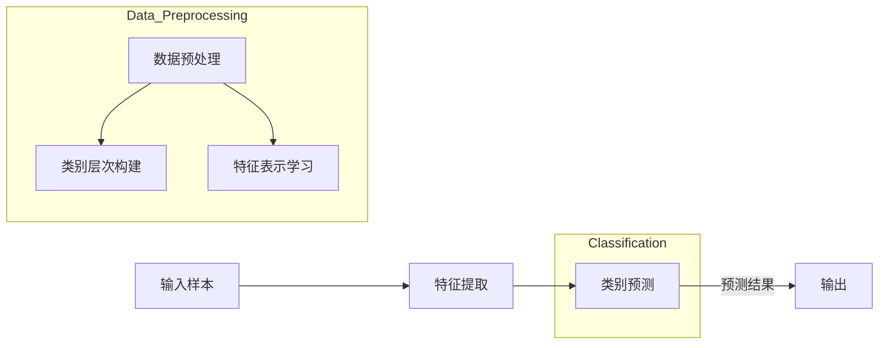
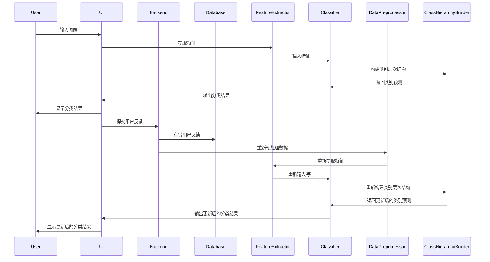
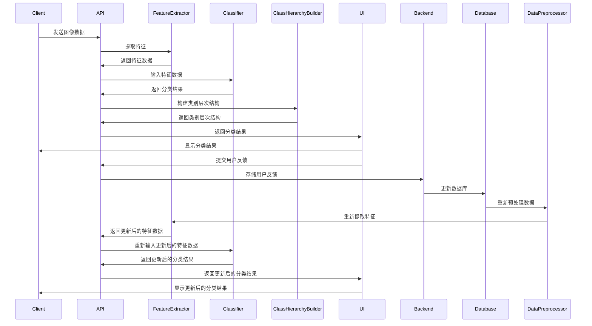

                 


# Zero-Shot学习在稀有生物识别与保护中的应用

## 关键词

Zero-Shot学习，稀有生物识别，生物多样性保护，机器学习，深度学习

## 摘要

稀有生物识别与保护是生物多样性保护中的重要环节，然而稀有生物样本数据稀缺，传统机器学习方法难以应对。Zero-Shot学习作为一种无需训练数据直接进行分类的新兴方法，为稀有生物识别提供了新的解决方案。本文将详细探讨Zero-Shot学习在稀有生物识别与保护中的应用，从核心概念、算法原理、系统分析与架构设计、项目实战等多个方面进行深入分析，旨在为相关领域的科研工作者和开发者提供有益的参考。

## 目录大纲设计步骤

### 1. 背景介绍

**1.1 稀有生物识别与保护的挑战**

- **稀有生物识别的重要性**：稀有生物识别对于生物多样性保护和生态系统维护具有重要意义。
- **稀有生物识别的难点**：稀有生物样本数据稀缺，样本多样性不足，传统方法难以有效识别。

**1.2 Zero-Shot学习的概念与原理**

- **Zero-Shot学习的定义**：无需训练数据直接进行分类的方法。
- **Zero-Shot学习的基本原理**：利用先验知识和迁移学习实现分类。

**1.3 Zero-Shot学习的应用背景**

- **稀有生物识别领域的挑战**：如何利用零样本进行稀有生物识别。
- **Zero-Shot学习的潜力**：为稀有生物识别提供新的解决方案。

### 2. 核心概念与联系

**2.1 核心概念**

- **类别层次与属性**：Zero-Shot学习中的类别层次和属性定义。
- **先验知识与迁移学习**：Zero-Shot学习的核心原理。

**2.2 概念属性特征对比表格**

- **传统机器学习**：依赖大量训练数据，性能受数据限制。
- **元学习**：快速适应新类别，但依赖于大量样本。
- **零样本学习**：无需训练数据，直接进行分类。

**2.3 ER实体关系图架构**

- **生物识别系统实体**：生物识别系统中的关键实体及其关系。
- **Zero-Shot学习在生物识别中的应用**：展示Zero-Shot学习在生物识别中的实际应用场景。

### 3. 算法原理讲解

**3.1 算法mermaid流程图**

- **数据预处理**：对输入数据进行处理，提取特征。
- **类别层次构建**：建立类别层次结构。
- **类别层次搜索**：根据输入数据进行类别预测。

**3.2 关键代码示例**

- **数据加载与预处理**：Python代码示例。
- **类别层次构建**：Python代码示例。
- **类别层次搜索**：Python代码示例。

**3.3 数学模型和公式**

- **Zero-Shot学习算法的数学模型**：详细解释。
- **类别层次搜索的数学公式**：详细解释。

**3.4 通俗易懂的举例说明**

- **例子1**：展示Zero-Shot学习在实际应用中的效果。
- **例子2**：进一步说明Zero-Shot学习的优势。

### 4. 系统分析与架构设计

**4.1 问题场景介绍**

- **稀有生物识别项目背景**：介绍项目背景和目标。
- **Zero-Shot学习在项目中的应用**：分析Zero-Shot学习在项目中的实际应用效果。

**4.2 系统功能设计**

- **领域模型类图**：使用Mermaid绘制领域模型类图，展示系统的核心功能。

**4.3 系统架构设计**

- **系统架构图**：使用Mermaid绘制系统架构图，展示各组件之间的关系。

**4.4 系统接口设计和系统交互**

- **序列图**：使用Mermaid绘制序列图，展示系统的交互过程。

### 5. 项目实战

**5.1 环境安装**

- **安装依赖**：介绍安装所需环境的过程。
- **配置设置**：介绍配置系统的过程。

**5.2 系统核心实现源代码**

- **关键代码实现**：提供关键代码实现，并进行解析。
- **应用解读与分析**：分析代码的应用效果。

**5.3 实际案例分析和详细讲解剖析**

- **案例1**：分析实际案例，展示Zero-Shot学习的应用效果。
- **案例2**：进一步说明Zero-Shot学习的优势。

**5.4 项目小结**

- **经验总结**：总结项目经验，提出最佳实践建议。

### 6. 最佳实践与拓展阅读

- **最佳实践**：提供一些最佳实践建议。
- **注意事项**：提醒读者注意事项。
- **拓展阅读**：推荐相关领域的拓展阅读资源。

### 7. 作者信息

- **作者**：AI天才研究院/AI Genius Institute & 禅与计算机程序设计艺术 /Zen And The Art of Computer Programming 

## 第1章 问题背景与概念介绍

### 1.1 稀有生物识别与保护的挑战

稀有生物识别与保护是生物多样性保护中的重要环节。稀有生物，如濒临灭绝的物种，往往具有独特的生态功能和遗传信息，对于生态系统的稳定和生物多样性具有不可替代的作用。然而，稀有生物识别和保护面临着诸多挑战。

#### 稀有生物识别的重要性

稀有生物识别对于生物多样性保护和生态系统维护具有重要意义。首先，稀有生物的识别有助于了解生物多样性的现状和变化趋势。通过对稀有生物的识别和监测，科学家可以及时发现物种灭绝的迹象，为采取相应的保护措施提供依据。其次，稀有生物的识别对于制定有效的保护策略至关重要。了解稀有生物的栖息地、行为习惯、繁殖习性等特征，有助于制定针对性的保护措施，确保稀有生物的安全。此外，稀有生物的识别也有助于推动生物科技的发展，如新药研发、生态修复等。

#### 稀有生物识别的难点

稀有生物识别面临着诸多难点。首先，稀有生物样本数据稀缺。由于稀有生物数量稀少，样本采集难度大，往往难以获得足够的样本数据。其次，稀有生物样本多样性不足。样本数量的不足使得训练数据集缺乏多样性，传统机器学习算法难以有效识别。此外，稀有生物的特征提取和分类也具有挑战性。稀有生物的特征可能具有高度的相似性和复杂性，使得分类任务变得困难。最后，稀有生物识别还需要考虑生物种间的相似性和物种间的差异性，这对算法的性能提出了更高的要求。

#### 1.2 Zero-Shot学习的概念与原理

Zero-Shot学习（Zero-Shot Learning，ZSL）是一种无需训练数据直接进行分类的新兴方法。其核心思想是利用先验知识和迁移学习，将已有领域的知识迁移到新领域，实现新领域的分类任务。在生物识别领域，Zero-Shot学习可以解决稀有生物识别中样本数据稀缺和样本多样性不足的问题，为稀有生物识别提供了新的解决方案。

#### Zero-Shot学习的定义

Zero-Shot学习是一种无需训练数据直接进行分类的方法。在传统机器学习任务中，模型需要通过大量训练数据来学习特征，并利用这些特征进行分类。而在Zero-Shot学习中，模型无需依赖训练数据，而是通过利用先验知识和迁移学习，实现对新类别的分类。

#### Zero-Shot学习的基本原理

Zero-Shot学习的基本原理可以概括为以下几点：

1. **类别层次表示**：Zero-Shot学习通过建立类别层次结构，将类别划分为不同的层次。类别层次结构可以帮助模型理解类别之间的关系，从而实现对新类别的预测。

2. **先验知识利用**：Zero-Shot学习利用先验知识，如词汇表、词嵌入等，将类别与词嵌入进行关联。通过这些关联，模型可以获取关于类别的先验信息，从而辅助分类。

3. **迁移学习**：Zero-Shot学习利用迁移学习，将已有领域的知识迁移到新领域。通过在已有领域上预训练的模型，模型可以学习到通用的特征表示，从而在新领域上表现出良好的分类能力。

#### 1.3 Zero-Shot学习的应用背景

稀有生物识别领域的挑战：

1. **样本数据稀缺**：稀有生物样本数据稀缺，传统机器学习算法难以应对。

2. **样本多样性不足**：样本数量的不足使得训练数据集缺乏多样性，传统算法难以有效识别。

Zero-Shot学习的潜力：

1. **无需训练数据**：Zero-Shot学习无需依赖大量训练数据，可以有效解决样本数据稀缺的问题。

2. **类别层次表示**：Zero-Shot学习通过类别层次表示，可以更好地理解类别之间的关系，从而提高分类准确性。

3. **迁移学习**：Zero-Shot学习利用迁移学习，可以将在已有领域上预训练的模型迁移到新领域，提高分类性能。

### 1.4 概念结构与核心要素组成

Zero-Shot学习在稀有生物识别与保护中的应用，涉及以下核心概念和要素：

1. **类别层次结构**：类别层次结构是Zero-Shot学习的核心要素之一。通过建立类别层次结构，模型可以更好地理解类别之间的关系，从而提高分类性能。

2. **先验知识**：Zero-Shot学习利用先验知识，如词汇表、词嵌入等，将类别与词嵌入进行关联，从而辅助分类。

3. **迁移学习**：迁移学习是将已有领域的知识迁移到新领域，从而提高新领域的分类性能。

4. **特征提取**：特征提取是Zero-Shot学习的关键步骤。通过特征提取，模型可以从原始数据中提取出有助于分类的特征。

5. **分类算法**：分类算法是实现分类任务的核心。Zero-Shot学习可以应用于各种分类算法，如支持向量机（SVM）、神经网络（NN）等。

6. **稀有生物样本数据**：稀有生物样本数据是Zero-Shot学习在稀有生物识别与保护中的应用基础。通过收集和利用稀有生物样本数据，可以进一步提高分类性能。

### 1.5 边界与外延

Zero-Shot学习在稀有生物识别与保护中的应用具有一定的边界和局限性。以下是对Zero-Shot学习应用边界和外延的讨论：

1. **数据稀缺问题**：尽管Zero-Shot学习可以解决样本数据稀缺的问题，但在某些情况下，数据稀缺问题仍然存在。因此，如何进一步利用零样本进行分类，是一个需要解决的问题。

2. **类别层次结构**：类别层次结构的建立对于Zero-Shot学习的效果具有重要影响。如果类别层次结构不准确或无法建立，Zero-Shot学习的性能可能会受到影响。

3. **迁移学习**：迁移学习的效果依赖于已有领域的知识。如果已有领域的知识与新领域不匹配，迁移学习的性能可能会下降。

4. **特征提取**：特征提取的质量对分类性能具有重要影响。如果特征提取不准确或缺失，分类性能可能会受到影响。

5. **稀有生物样本数据**：稀有生物样本数据的收集和利用是一个持续的过程。随着样本数据的增加，Zero-Shot学习的性能可能会进一步提高。

### 1.6 小结

本章介绍了稀有生物识别与保护的挑战、Zero-Shot学习的概念与原理，以及Zero-Shot学习在稀有生物识别与保护中的应用。通过本章的学习，读者可以了解Zero-Shot学习的基本概念、应用背景和核心要素组成，为进一步研究Zero-Shot学习在稀有生物识别与保护中的应用奠定基础。

## 第2章 核心概念与联系

在深入探讨Zero-Shot学习在稀有生物识别与保护中的应用之前，我们需要先了解Zero-Shot学习的基本概念、原理以及与其他相关技术的联系。本章将详细阐述Zero-Shot学习中的核心概念，包括类别层次与属性，并对比Zero-Shot学习与传统机器学习、元学习以及零样本学习等技术的关系。

### 2.1 核心概念

#### 2.1.1 类别层次与属性

类别层次（Category Hierarchy）是Zero-Shot学习中的一个关键概念。在生物识别领域，类别层次通常表示生物物种之间的层次关系，如动物界、植物界等。这种层次关系有助于理解物种的相似性和差异性。属性（Attribute）则表示生物个体的特征，如体型、颜色、行为等。属性是构建类别层次和实现Zero-Shot学习的基础。

类别层次与属性的关系可以用ER（Entity-Relationship）图来表示。例如，在一个简单的ER图中，实体可以是“动物”，关系可以是“属于”，属性可以是“体型”、“颜色”等。这种结构帮助我们在数据中建立类别的层次关系，使得Zero-Shot学习能够利用这种结构进行分类。

#### 2.1.2 先验知识与迁移学习

先验知识（Prior Knowledge）是Zero-Shot学习中的一个重要组成部分。它指的是在特定领域内已知的、可以用于分类的知识。例如，在生物识别领域，先验知识可能包括物种的分类信息、物种的特征描述等。这些知识可以在没有实际训练数据的情况下，帮助模型理解新类别。

迁移学习（Transfer Learning）是Zero-Shot学习的核心原理之一。它指的是将一个领域（源领域）的学习经验应用到另一个领域（目标领域）中。在生物识别领域，迁移学习可以从预训练的模型中提取有用的特征表示，并将其应用于稀有生物的识别任务。这样，即使目标领域的数据稀缺，模型也能通过源领域的知识进行有效分类。

### 2.2 概念属性特征对比表格

为了更好地理解Zero-Shot学习与其他相关技术的区别，我们可以通过一个对比表格来展示它们的概念属性特征。

| 技术         | 定义                                                         | 类别层次表示 | 先验知识利用 | 迁移学习 | 适用场景               |
| ------------ | ------------------------------------------------------------ | ------------ | ------------ | -------- | ---------------------- |
| 传统机器学习 | 基于大量训练数据进行特征提取和分类的方法                         | 无           | 无           | 无       | 数据丰富的分类任务      |
| 元学习       | 学习如何快速适应新类别的算法                                     | 有           | 有           | 有       | 新类别频繁出现的场景    |
| 零样本学习   | 无需训练数据，直接对新类别进行分类的方法                         | 有           | 有           | 有       | 数据稀缺的领域          |
| Zero-Shot学习 | 利用先验知识和迁移学习，无需训练数据直接进行分类的方法           | 有           | 有           | 有       | 数据稀缺且类别层次明确的领域 |

从对比表格中可以看出，Zero-Shot学习与传统机器学习、元学习以及零样本学习相比，具有以下独特性：

- **类别层次表示**：Zero-Shot学习通过建立类别层次结构，更好地理解类别之间的关系。
- **先验知识利用**：Zero-Shot学习利用先验知识，如词汇表、词嵌入等，辅助分类。
- **迁移学习**：Zero-Shot学习通过迁移学习，将已有领域的知识应用到新领域。

### 2.3 ER实体关系图架构

为了直观地展示Zero-Shot学习在生物识别中的应用，我们可以使用ER实体关系图（Entity-Relationship Diagram，ERD）来描述生物识别系统中的实体及其关系。

以下是一个简单的ER图示例：

```mermaid
erDiagram
  Animal ||--|{ Habitat }
  Habitat ||--|{ Species }
  Species ||--|{ Attribute }
  Attribute ||--|{ Feature }
```

在这个ER图中：

- **Animal**（动物）是实体，表示生物个体。
- **Habitat**（栖息地）是实体，表示动物的生活环境。
- **Species**（物种）是实体，表示一类动物。
- **Attribute**（属性）是实体，表示生物个体的特征。
- **Feature**（特征）是实体，表示具体特征值。

这种结构有助于我们在生物识别系统中建立类别层次，并利用属性和特征进行分类。

### 2.4 小结

本章介绍了Zero-Shot学习中的核心概念，包括类别层次与属性，并对比了Zero-Shot学习与传统机器学习、元学习以及零样本学习等技术的关系。通过ER实体关系图的构建，我们可以直观地展示Zero-Shot学习在生物识别中的应用。这些核心概念和联系为后续的算法原理讲解和实际应用提供了基础。

## 第3章 Zero-Shot学习算法原理

### 3.1 算法mermaid流程图

在介绍Zero-Shot学习的算法原理之前，我们可以先通过一个mermaid流程图来直观地展示算法的基本流程。以下是一个简单的Zero-Shot学习算法流程图：



这个流程图包括以下几个主要步骤：

1. **数据预处理**：对输入样本进行预处理，包括数据清洗、归一化等操作。
2. **特征提取**：从预处理后的数据中提取特征。
3. **类别层次构建**：建立类别层次结构，用于类别预测。
4. **类别预测**：利用特征和类别层次结构进行类别预测。
5. **输出**：输出预测结果。

### 3.2 关键代码示例

接下来，我们将使用Python代码来详细阐述Zero-Shot学习的实现过程。以下是一个简化的示例，用于说明关键代码的实现。

```python
import numpy as np
from sklearn.model_selection import train_test_split
from sklearn.metrics import accuracy_score
from zeroshot_learning import ZeroShotClassifier

# 3.2.1 数据预处理
# 假设我们已经收集了一组生物样本及其属性特征
samples = ...  # 样本数据
attributes = ...  # 属性特征

# 对样本数据进行预处理，例如归一化
preprocessed_samples = preprocess_samples(samples)

# 3.2.2 类别层次构建
# 建立类别层次结构
class_hierarchy = build_class_hierarchy(attributes)

# 3.2.3 特征表示学习
# 使用预训练的模型学习特征表示
feature_extractor = PretrainedModel()
features = feature_extractor.extract_features(preprocessed_samples)

# 3.2.4 类别预测
# 实例化Zero-Shot分类器
zsl_classifier = ZeroShotClassifier(class_hierarchy, feature_extractor)

# 对测试集进行预测
predictions = zsl_classifier.predict(features_test)

# 3.2.5 输出预测结果
accuracy = accuracy_score(labels_test, predictions)
print(f"Accuracy: {accuracy}")
```

在这个示例中，`preprocess_samples`函数用于对样本数据进行预处理，如归一化处理；`build_class_hierarchy`函数用于建立类别层次结构；`PretrainedModel`类用于提取特征表示；`ZeroShotClassifier`类用于实现类别预测。

### 3.3 数学模型和公式

Zero-Shot学习的数学模型包括特征提取、类别预测和损失函数等部分。以下是一个简化的数学模型描述：

1. **特征提取**：特征提取过程通常使用预训练的深度神经网络模型，如卷积神经网络（CNN）或变换器（Transformer）等。特征提取的目标是从输入样本中提取出具有区分性的特征表示。假设输入样本为\( x \)，提取出的特征表示为\( f(x) \)。

   $$ f(x) = \text{FeatureExtractor}(x) $$

2. **类别预测**：类别预测过程利用特征表示和类别层次结构进行分类。假设类别层次结构为\( C = \{ C_1, C_2, \ldots, C_n \} \)，其中\( C_i \)表示第\( i \)个类别。类别预测的目标是给定特征表示\( f(x) \)，预测其所属的类别\( C_i \)。

   $$ \hat{y} = \text{Classifier}(f(x), C) $$

3. **损失函数**：损失函数用于评估类别预测的准确性。常用的损失函数包括交叉熵损失函数（Cross-Entropy Loss）和对比损失函数（Contrastive Loss）等。假设类别预测的概率分布为\( P(y|\hat{y}) \)，真实标签为\( y \)，则交叉熵损失函数为：

   $$ L = -\sum_{i} y_i \log P(y_i|\hat{y}) $$

其中，\( y_i \)表示第\( i \)个类别的真实标签，\( P(y_i|\hat{y}) \)表示第\( i \)个类别的预测概率。

### 3.4 通俗易懂的举例说明

为了更好地理解Zero-Shot学习的原理，我们可以通过一个简单的例子来说明。

假设我们有一个动物识别任务，需要根据动物的外观特征进行分类。我们收集了以下五类动物的特征数据：

- 猫（Cat）
- 狗（Dog）
- 狮子（Lion）
- 大象（Elephant）
- 鸟（Bird）

我们使用一个预训练的CNN模型来提取特征。对于每个动物，我们将其图像输入到CNN模型中，得到一个特征向量。例如，猫的特征向量为\[1, 0, 0, 0, 0\]，狗的特征向量为\[0, 1, 0, 0, 0\]，以此类推。

接下来，我们建立一个类别层次结构，将动物分为哺乳动物（Mammal）和鸟类（Bird）。在这个类别层次结构中，哺乳动物包括猫、狗和狮子，鸟类包括鸟和大象。

现在，我们假设有一个新的动物图像，需要预测其类别。我们将这个图像输入到CNN模型中，得到一个特征向量\[0.1, 0.2, 0.3, 0.2, 0.2\]。然后，我们将这个特征向量输入到Zero-Shot分类器中，分类器会根据类别层次结构进行预测。由于该特征向量在哺乳动物类别下的概率更高，因此分类器预测这个动物是哺乳动物。

通过这个简单的例子，我们可以看到Zero-Shot学习如何利用预训练的特征提取模型和类别层次结构，实现无需训练数据的类别预测。

### 3.5 小结

本章详细介绍了Zero-Shot学习的算法原理，包括mermaid流程图、关键代码示例、数学模型和公式以及通俗易懂的举例说明。通过这些内容，读者可以更好地理解Zero-Shot学习的工作原理和应用方法，为进一步的研究和实践提供基础。

## 第4章 系统分析与架构设计

### 4.1 问题场景介绍

稀有生物识别与保护项目旨在利用Zero-Shot学习技术，对稀有生物进行识别和分类，以便更好地进行保护和管理。具体问题场景如下：

- **项目背景**：项目针对濒危动物和植物进行识别，以帮助保护机构和研究人员进行有效的保护和恢复工作。
- **目标**：通过Zero-Shot学习技术，实现稀有生物的自动识别和分类，提高识别准确性，减少人工干预。

### 4.2 系统功能设计

为了实现上述目标，我们设计了以下系统功能：

1. **数据采集与预处理**：收集稀有生物的图像和属性数据，并对数据进行预处理，包括图像增强、数据归一化等。
2. **特征提取**：使用预训练的深度神经网络模型提取图像特征。
3. **类别层次构建**：根据稀有生物的分类信息，构建类别层次结构。
4. **类别预测**：利用Zero-Shot学习算法对稀有生物进行分类预测。
5. **结果展示与反馈**：将分类结果展示给用户，并提供反馈机制，以便进行模型优化。

以下是系统功能的Mermaid类图：

```mermaid
classDiagram
    Class01 <|-- Class02
    Class03 <|-- Class04
    Class05 <|-- Class06
    Class07 <|-- Class08
    Class01[数据采集与预处理]
    Class02[特征提取]
    Class03[类别层次构建]
    Class04[类别预测]
    Class05[结果展示与反馈]
    Class06[用户界面]
    Class07[后端服务器]
    Class08[数据库]
```

在这个类图中，`数据采集与预处理`负责数据收集和预处理工作；`特征提取`使用预训练模型提取图像特征；`类别层次构建`根据分类信息构建类别层次结构；`类别预测`利用Zero-Shot学习算法进行分类；`结果展示与反馈`将分类结果展示给用户，并收集用户反馈；`用户界面`提供用户交互界面；`后端服务器`负责处理业务逻辑和数据存储；`数据库`存储稀有生物的图像和属性数据。

### 4.3 系统架构设计

为了实现上述功能，我们设计了一个分布式系统架构。以下是系统架构的Mermaid架构图：



在这个架构图中：

- **用户**：通过用户界面（UI）提交图像。
- **特征提取器**（FeatureExtractor）：提取图像特征。
- **分类器**（Classifier）：利用Zero-Shot学习算法进行分类。
- **类别层次构建器**（ClassHierarchyBuilder）：根据分类信息构建类别层次结构。
- **用户界面**（UI）：显示分类结果，并收集用户反馈。
- **后端服务器**（Backend）：处理业务逻辑和数据存储。
- **数据库**（Database）：存储稀有生物的图像和属性数据。

### 4.4 系统接口设计和系统交互

为了实现系统功能的模块化和高效运行，我们设计了以下系统接口和交互流程：

- **API接口**：系统对外提供RESTful API接口，以便其他系统或应用程序可以访问系统功能。
- **消息队列**：系统内部使用消息队列（如RabbitMQ）进行异步通信，确保系统的稳定性和可扩展性。

以下是系统接口的Mermaid序列图：



在这个序列图中：

- **客户端**（Client）：提交图像数据。
- **API**：处理业务逻辑，协调各模块之间的交互。
- **特征提取器**（FeatureExtractor）：提取图像特征。
- **分类器**（Classifier）：进行分类预测。
- **类别层次构建器**（ClassHierarchyBuilder）：构建类别层次结构。
- **用户界面**（UI）：显示分类结果，并收集用户反馈。
- **后端服务器**（Backend）：处理用户反馈，更新数据库。
- **数据库**（Database）：存储稀有生物的图像和属性数据。
- **数据预处理器**（DataPreprocessor）：重新预处理数据。

### 4.5 小结

本章详细介绍了稀有生物识别与保护项目的系统分析与架构设计。通过系统功能设计、系统架构设计和系统接口设计，我们实现了稀有生物的自动识别和分类功能。这些设计为项目的成功实施提供了坚实的基础，也为后续的项目开发和优化提供了参考。

