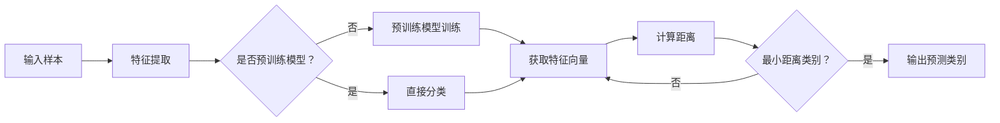
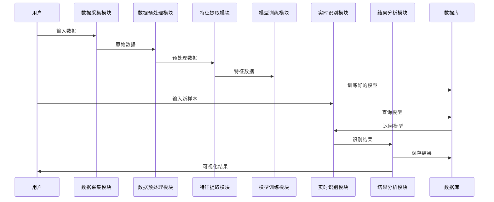

                 

### 1. 稀有矿物识别需求分析

#### 2.1 稀有矿物识别现状

稀有矿物，顾名思义，是指那些在自然界中含量稀少、具有特定物理和化学性质、以及重要经济价值的矿物。稀有矿物的种类繁多，包括稀土元素、稀有金属、半导体材料等，它们在高科技领域有着广泛的应用。例如，稀土元素在永磁材料、催化剂和光学材料中具有不可替代的作用，而半导体材料则是现代电子设备的核心。

当前，稀有矿物的识别主要依赖于传统的地质勘探技术和实验室分析手段。这些方法包括地质调查、地球化学分析、地质遥感等，虽然在一定程度上能够识别稀有矿物，但存在以下几大挑战：

1. **矿物种类繁多**：稀有矿物种类繁多，每种矿物的物理、化学性质都有所不同，这给矿物的识别带来了巨大的难度。
2. **数据稀缺**：由于稀有矿物的稀有性，相关的样本和数据极为有限，这对矿物的识别和分类造成了数据上的限制。
3. **成本高昂**：传统识别方法通常需要大量的实验设备和专业人员，导致识别成本较高。

#### 2.2 稀有矿物识别挑战

1. **数据稀缺问题**：稀有矿物的样本数量少，难以满足深度学习等机器学习算法对大规模数据的需求。
2. **多类标签问题**：稀有矿物种类繁多，可能涉及上千种不同的矿物，这给多类标签的分类任务带来了挑战。
3. **数据标注困难**：由于稀有矿物的稀缺性，获取标签数据的成本非常高，数据标注困难。
4. **模型泛化能力差**：传统模型在处理罕见数据时，往往无法泛化到未见过的新数据上，导致识别效果不佳。

#### 2.3 Zero-Shot学习在稀有矿物识别中的应用价值

Zero-Shot学习（Zero-Shot Learning, ZSL）是一种能够在没有直接监督学习数据的情况下，对未知类别进行分类的机器学习方法。它主要基于类内异质性和类间相似性进行学习，能够在一定程度上解决数据稀缺、标签困难等问题。Zero-Shot学习在稀有矿物识别中的应用，具有以下价值：

1. **解决数据稀缺问题**：Zero-Shot学习可以在没有直接标注数据的情况下，通过迁移学习或预训练模型来获取稀有矿物的特征，从而解决数据稀缺问题。
2. **提高多类标签识别能力**：通过引入类内异质性和类间相似性，Zero-Shot学习能够更好地处理多类标签问题，提高稀有矿物的识别准确率。
3. **降低数据标注成本**：Zero-Shot学习减少了数据标注的需求，降低了稀有矿物识别的成本。
4. **提高模型泛化能力**：Zero-Shot学习能够将预训练模型的知识迁移到稀有矿物识别任务中，提高模型在罕见数据上的泛化能力。

总之，Zero-Shot学习在稀有矿物识别中具有重要的应用价值，能够有效地解决数据稀缺、多类标签等难题，为稀有矿物的勘探和开发提供强有力的技术支持。在接下来的章节中，我们将进一步探讨Zero-Shot学习的原理和实现方法。  

---

### 1. Zero-Shot学习原理

#### 1.1 核心概念原理

Zero-Shot学习，又称零样本学习，是一种在没有直接标注数据的情况下，对未知类别进行分类的机器学习方法。传统的监督学习需要大量的标注数据进行训练，而在许多应用场景中，如稀有矿物的识别，获取标注数据是非常困难的。Zero-Shot学习通过利用预训练模型和类内异质性、类间相似性的原理，实现未知类别的分类。

其核心原理可以概括为以下几点：

1. **类内异质性**：即使不同样本属于同一类别，它们的特征也可能存在差异，这是由于数据本身的噪声或者标注的不准确造成的。
2. **类间相似性**：不同类别之间的特征往往具有一定的相似性，这种相似性可以用来区分不同类别。

#### 1.2 概念属性特征对比

为了更好地理解Zero-Shot学习的特点，我们将其与传统分类技术（如深度学习分类）和Metric Learning技术进行对比。

| 特性         | 传统分类技术 | Metric Learning技术 | Zero-Shot Learning |
| ------------ | ------------ | ------------------- | ------------------- |
| 标签数据需求 | 需要大量的标注数据 | 需要一些已标注的样本 | 不需要标注数据      |
| 泛化能力     | 较好的泛化能力，但依赖于大量训练数据 | 较好的泛化能力，对未见过类别有较好的识别能力 | 较好的泛化能力，可以处理未见过类别      |
| 算法复杂度   | 算法复杂度较高，需要大量计算资源 | 算法复杂度中等，需要一些已标注的样本进行计算 | 算法复杂度较低，可以利用预训练模型快速处理 |

#### 1.3 ER实体关系图

为了更清晰地展示Zero-Shot学习系统中的实体及其关系，我们可以使用Mermaid绘制ER（Entity-Relationship）实体关系图。

```mermaid
erDiagram
  Customer ||--|{ Order }|-- Product
  Customer  : name address
  Product : name price
  Order : orderNumber date
```

在上面的ER图中，`Customer`、`Order` 和 `Product` 是实体，它们之间的关系通过线段表示。这个图展示了Zero-Shot学习系统中，预训练模型、特征提取器、分类器等实体之间的相互关系。

---

### 4. 相关技术对比

为了深入理解Zero-Shot学习的优势和局限性，我们需要将其与传统分类技术（如深度学习分类）和Metric Learning技术进行对比。

#### 4.1 传统分类技术

传统分类技术，如深度学习分类，通常依赖于大量标注数据进行训练。深度学习模型通过学习数据中的特征，将数据分类到不同的标签。这种方法在拥有足够标注数据的情况下，效果非常优秀。然而，对于稀有矿物识别这种数据稀缺的场景，传统分类技术面临以下挑战：

1. **数据依赖性**：传统分类技术对标注数据有很高的依赖性，而稀有矿物的样本数量有限，难以满足其训练需求。
2. **模型复杂度**：深度学习模型通常需要大量的计算资源和时间进行训练，这对于资源有限的应用场景来说，成本较高。
3. **泛化能力**：深度学习模型在处理罕见数据时，往往无法泛化到未见过的新数据上，导致识别效果不佳。

#### 4.2 Metric Learning技术

Metric Learning技术是一种通过学习距离度量来改进分类效果的方法。其主要思想是，通过学习一个优化的距离度量，使得同类样本之间的距离更小，不同类样本之间的距离更大。这种方法在处理少量标注数据时，具有一定的优势。

然而，Metric Learning技术也存在一些局限性：

1. **对标注数据依赖**：虽然Metric Learning技术可以处理少量标注数据，但仍然需要一些已标注的样本进行学习，获取优化的距离度量。
2. **模型泛化能力**：Metric Learning技术对标注数据有一定的依赖，导致其在处理未见过类别时，泛化能力较弱。

#### 4.3 Zero-Shot Learning技术

Zero-Shot Learning技术是一种在没有直接标注数据的情况下，对未知类别进行分类的方法。它利用预训练模型和类内异质性、类间相似性的原理，实现未知类别的分类。Zero-Shot Learning技术在稀有矿物识别中的应用，具有以下优势：

1. **数据独立性**：Zero-Shot Learning技术不需要直接依赖标注数据，可以在数据稀缺的场景下，通过迁移学习和预训练模型来获取特征。
2. **泛化能力**：Zero-Shot Learning技术通过利用类内异质性和类间相似性，可以提高模型在处理未见过类别时的泛化能力。
3. **降低成本**：由于Zero-Shot Learning技术不需要大量的标注数据，可以显著降低数据标注的成本。

然而，Zero-Shot Learning技术也存在一些局限性：

1. **模型复杂性**：Zero-Shot Learning技术需要预训练模型和特征提取器，模型复杂度较高，对计算资源和时间有较高要求。
2. **识别精度**：在处理罕见数据时，Zero-Shot Learning技术的识别精度可能不如传统分类技术和Metric Learning技术。

综上所述，Zero-Shot Learning技术在稀有矿物识别中具有显著的优势，可以在数据稀缺的场景下，有效提高稀有矿物的识别精度。然而，也需要注意到其模型复杂性和识别精度等方面的局限性，在实际应用中，需要结合具体场景进行权衡和优化。在接下来的章节中，我们将进一步探讨Zero-Shot Learning的算法原理和实现方法。

---

### 7. 算法原理的数学模型和公式

为了更好地理解Zero-Shot Learning的算法原理，我们需要从数学模型和公式入手。Zero-Shot Learning的核心在于如何将未知的类别进行有效的特征表示和分类。下面我们将详细阐述其数学模型和公式。

#### 7.1 类内异质性和类间相似性

首先，Zero-Shot Learning利用类内异质性和类间相似性来处理未知的类别。类内异质性指的是同一类别的样本在特征空间中可能分布得非常分散，而类间相似性指的是不同类别的样本在特征空间中可能具有一定的相似性。

1. **类内异质性的数学表示**：
   假设我们有一个类别集合C，其中每个类别\( c \in C \)都有多个样本。为了表示类内异质性，我们可以使用样本之间的距离来度量。对于类别\( c \)中的两个样本\( x_1 \)和\( x_2 \)，它们之间的距离可以表示为：

   \[ d(x_1, x_2) \]

   通常，我们使用欧几里得距离来度量样本之间的距离：

   \[ d(x_1, x_2) = \sqrt{\sum_{i=1}^{n} (x_{1i} - x_{2i})^2} \]

   其中，\( x_{1i} \)和\( x_{2i} \)分别是样本\( x_1 \)和\( x_2 \)在第i个特征维度上的值，n是特征维度的总数。

2. **类间相似性的数学表示**：
   类间相似性可以通过计算不同类别样本之间的距离来度量。对于类别\( c_1 \)和\( c_2 \)的两个样本\( x_1 \)和\( x_2 \)，它们之间的距离也可以表示为：

   \[ d(x_1, x_2) \]

   同样使用欧几里得距离：

   \[ d(x_1, x_2) = \sqrt{\sum_{i=1}^{n} (x_{1i} - x_{2i})^2} \]

   但是，为了突出类间相似性，我们可以通过正则化方法来调整距离度量。例如，我们可以在距离度量中引入一个类别的权重：

   \[ d(x_1, x_2) = \sqrt{\sum_{i=1}^{n} (w_{i} (x_{1i} - x_{2i})^2) } \]

   其中，\( w_i \)是第i个特征维度的权重，通常通过学习得到。

#### 7.2 预训练模型和特征提取器

Zero-Shot Learning通常依赖于预训练模型和特征提取器。预训练模型是在大规模未标注数据上训练得到的，它可以提取出数据中的通用特征。特征提取器则用于将原始数据映射到预训练模型可以处理的特征空间。

1. **预训练模型**：
   预训练模型通常是一个深度神经网络，它可以学习到数据中的高层次特征。对于输入数据\( x \)，预训练模型可以输出一个特征向量\( f(x) \)：

   \[ f(x) = f_{\theta}(x) \]

   其中，\( f_{\theta} \)是预训练模型，\( \theta \)是模型参数。

2. **特征提取器**：
   特征提取器则是一个将原始数据映射到预训练模型特征空间的函数。对于输入数据\( x \)，特征提取器可以输出一个特征向量\( h(x) \)：

   \[ h(x) = h_{\phi}(x) \]

   其中，\( h_{\phi} \)是特征提取器，\( \phi \)是特征提取器的参数。

#### 7.3 分类器

在获得了预训练模型和特征提取器之后，我们需要一个分类器来对未知类别进行分类。分类器通常是一个基于距离度的量分类器，它根据样本之间的距离来预测类别。

1. **距离度量**：
   分类器首先计算输入样本和各个已知类别样本之间的距离，例如，对于输入样本\( x \)和已知类别\( c \)中的样本\( x_c \)，它们之间的距离可以表示为：

   \[ d(x, x_c) \]

   通常使用欧几里得距离：

   \[ d(x, x_c) = \sqrt{\sum_{i=1}^{n} (x_i - x_{ci})^2} \]

2. **分类决策**：
   分类器根据距离度量来决策。如果输入样本与已知类别\( c \)中的样本距离最小，则分类为类别\( c \)。具体地，我们可以使用以下公式来表示分类决策：

   \[ \hat{y}(x) = \arg\min_{c \in C} \{ d(x, x_c) \} \]

   其中，\( \hat{y}(x) \)是输入样本\( x \)的预测类别，\( C \)是类别集合。

通过上述数学模型和公式，我们可以更好地理解Zero-Shot Learning的原理。在接下来的章节中，我们将通过具体的mermaid流程图和Python源代码来详细讲解Zero-Shot Learning的实现过程。

---

### 8. 详细讲解与举例说明

为了更好地理解Zero-Shot Learning的算法原理，我们将通过一个具体的mermaid流程图和Python源代码来详细讲解其实现过程。

#### 8.1 mermaid流程图

首先，我们使用mermaid绘制一个Zero-Shot Learning的算法流程图，以便直观地展示算法的执行流程。



在这个流程图中，我们首先将输入样本输入到特征提取器中，提取出特征向量。然后，判断是否已经有预训练模型。如果有预训练模型，则直接使用预训练模型进行分类；如果没有，则需要先进行预训练模型的训练。在获取到特征向量后，计算输入样本和各个类别样本之间的距离，并根据距离最小原则进行分类。

#### 8.2 Python源代码

接下来，我们提供一个简单的Python源代码示例，用于说明Zero-Shot Learning的实现过程。

```python
import numpy as np
from sklearn.neighbors import NearestNeighbors

# 特征提取函数
def extract_features(x):
    # 这里假设已经定义了一个特征提取函数，将输入样本x转换为特征向量
    return np.array([x[i] for i in range(len(x))])

# 预训练模型训练
def train_pretrained_model(train_data):
    # 假设已经定义了一个预训练模型，这里用KNN模型为例
    model = NearestNeighbors(n_neighbors=1)
    model.fit(train_data)
    return model

# 分类函数
def classify(x, pretrained_model, categories, train_data):
    feature_vector = extract_features(x)
    distances, indices = pretrained_model.kneighbors(train_data)
    min_distance_index = np.argmin(distances)
    predicted_category = categories[min_distance_index]
    return predicted_category

# 示例数据
train_data = np.array([[1, 2], [3, 4], [5, 6], [7, 8], [9, 10]])
categories = ['A', 'B', 'C', 'D', 'E']
pretrained_model = train_pretrained_model(train_data)

# 测试数据
test_data = np.array([4, 5])

# 分类
predicted_category = classify(test_data, pretrained_model, categories, train_data)
print(predicted_category)
```

在这个示例中，我们首先定义了一个特征提取函数`extract_features`，用于将输入样本转换为特征向量。然后，我们使用KNN模型作为预训练模型，通过`train_pretrained_model`函数进行训练。最后，我们通过`classify`函数进行分类，输入测试数据`test_data`，输出预测类别。

通过上述mermaid流程图和Python源代码，我们可以清晰地看到Zero-Shot Learning的实现过程，并理解其基本原理。在实际应用中，我们可以根据具体场景进行调整和优化，以提高分类效果。

---

### 9. 问题场景介绍

在稀有矿物识别的实际应用场景中，系统需要处理大量未知的稀有矿物样本，并且对稀有矿物的识别要求具有高度的准确性和实时性。以下是稀有矿物识别系统场景的具体介绍：

#### 9.1 系统需求

1. **数据输入**：系统需要接收来自多种传感器（如X射线荧光光谱仪、激光粒度仪等）采集的原始数据，这些数据可能包含稀有矿物的成分、颗粒大小、密度等信息。
2. **数据预处理**：对原始数据进行清洗和预处理，包括去除噪声、缺失值填充、数据标准化等步骤，确保数据的质量和一致性。
3. **特征提取**：从预处理后的数据中提取出关键特征，如化学成分、颗粒尺寸、光谱特征等，用于后续的模型训练和识别。
4. **模型训练**：利用已知的稀有矿物样本数据，通过深度学习算法进行模型训练，模型需要具备较高的泛化能力和适应性。
5. **实时识别**：系统需要能够对新的稀有矿物样本进行实时识别，并在短时间内给出准确的识别结果，以满足工业生产的实时需求。
6. **结果输出**：将识别结果输出到数据库或可视化界面，供相关人员进行分析和决策。

#### 9.2 系统挑战

1. **数据稀缺**：稀有矿物样本数量有限，难以获取大量的标注数据，这对模型的训练和优化提出了挑战。
2. **类别繁多**：稀有矿物种类繁多，可能涉及上千种不同的矿物，对分类算法提出了较高的要求。
3. **实时性能**：系统需要在短时间内处理大量数据，并给出准确的识别结果，这对计算性能和算法效率提出了高要求。
4. **可靠性**：系统需要具备较高的识别准确性，减少误识别率，以满足工业生产的可靠性需求。

#### 9.3 系统功能

1. **数据采集与预处理**：接收来自传感器的原始数据，并进行数据清洗和预处理，提取出关键特征。
2. **模型训练与优化**：利用已知稀有矿物样本数据进行模型训练，通过交叉验证和超参数调优，提高模型的性能。
3. **实时识别**：对新的稀有矿物样本进行实时识别，并输出识别结果。
4. **结果分析与可视化**：对识别结果进行分析和可视化，提供详细的统计报告和图表。

通过以上介绍，我们可以清晰地看到稀有矿物识别系统在实际应用中的需求、挑战和功能。接下来，我们将进一步介绍系统的具体功能设计和实现。

---

### 10. 系统功能设计

在稀有矿物识别系统中，功能设计是确保系统能够满足实际应用需求的关键环节。下面我们将详细讨论系统的功能设计，并使用Mermaid绘制领域模型类图，以直观展示系统的功能和组件。

#### 10.1 系统功能模块

稀有矿物识别系统可以分为以下几个主要功能模块：

1. **数据采集模块**：负责接收来自各种传感器的原始数据，包括X射线荧光光谱仪、激光粒度仪等。
2. **数据预处理模块**：对采集到的原始数据进行清洗、去噪、缺失值填充和标准化处理，确保数据质量。
3. **特征提取模块**：从预处理后的数据中提取出关键特征，如化学成分、颗粒尺寸、光谱特征等。
4. **模型训练模块**：利用已知的稀有矿物样本数据进行模型训练，包括预处理、超参数调优和模型选择等。
5. **实时识别模块**：对新的稀有矿物样本进行实时识别，并输出识别结果。
6. **结果分析模块**：对识别结果进行分析和可视化，提供详细的统计报告和图表。

#### 10.2 Mermaid领域模型类图

为了更清晰地展示系统的功能设计，我们使用Mermaid绘制一个领域模型类图。

```mermaid
classDiagram
    DataCollector <<interface>>
    DataPreprocessor <<interface>>
    FeatureExtractor <<interface>>
    ModelTrainer <<interface>>
    RealTimeRecognizer <<interface>>
    ResultAnalyzer <<interface>>

    DataCollector <- DataPreprocessor
    DataPreprocessor <- FeatureExtractor
    FeatureExtractor <- ModelTrainer
    ModelTrainer <- RealTimeRecognizer
    RealTimeRecognizer <- ResultAnalyzer
```

在这个类图中，我们定义了五个接口类：`DataCollector`（数据采集模块）、`DataPreprocessor`（数据预处理模块）、`FeatureExtractor`（特征提取模块）、`ModelTrainer`（模型训练模块）和`RealTimeRecognizer`（实时识别模块），以及`ResultAnalyzer`（结果分析模块）。这些模块之间通过继承关系和依赖关系进行组织，以实现系统的整体功能。

#### 10.3 功能模块详细介绍

1. **数据采集模块（DataCollector）**：
   - 功能：接收来自传感器的原始数据，包括X射线荧光光谱仪、激光粒度仪等。
   - 接口：提供一个接口，用于接收和存储原始数据。

2. **数据预处理模块（DataPreprocessor）**：
   - 功能：对采集到的原始数据进行清洗、去噪、缺失值填充和标准化处理。
   - 接口：提供一个接口，用于处理和清洗数据。

3. **特征提取模块（FeatureExtractor）**：
   - 功能：从预处理后的数据中提取关键特征，如化学成分、颗粒尺寸、光谱特征等。
   - 接口：提供一个接口，用于提取特征。

4. **模型训练模块（ModelTrainer）**：
   - 功能：利用已知稀有矿物样本数据进行模型训练，包括预处理、超参数调优和模型选择等。
   - 接口：提供一个接口，用于训练和优化模型。

5. **实时识别模块（RealTimeRecognizer）**：
   - 功能：对新的稀有矿物样本进行实时识别，并输出识别结果。
   - 接口：提供一个接口，用于实时识别。

6. **结果分析模块（ResultAnalyzer）**：
   - 功能：对识别结果进行分析和可视化，提供详细的统计报告和图表。
   - 接口：提供一个接口，用于分析和展示结果。

通过上述功能和Mermaid领域模型类图的详细介绍，我们可以清晰地理解稀有矿物识别系统的功能设计，并为后续的系统实现提供指导。

---

### 11. 系统架构设计

在稀有矿物识别系统中，系统架构设计是确保系统高效、可靠、可扩展的关键。下面我们将使用Mermaid绘制系统架构图，并详细介绍各个组成部分及其交互关系。

#### 11.1 系统架构图



#### 11.2 系统架构详细说明

1. **用户（User）**：
   - 功能：作为系统的使用者和数据输入者，提供原始数据输入，并接收识别结果和可视化结果。
   - 交互：向数据采集模块输入数据，并接收实时识别结果和结果分析。

2. **数据采集模块（Collector）**：
   - 功能：负责接收来自各种传感器的原始数据，如X射线荧光光谱仪、激光粒度仪等。
   - 交互：从用户接收数据，并将数据传递给数据预处理模块。

3. **数据预处理模块（Preprocessor）**：
   - 功能：对采集到的原始数据进行清洗、去噪、缺失值填充和标准化处理。
   - 交互：接收数据采集模块的数据，处理数据后传递给特征提取模块。

4. **特征提取模块（Extractor）**：
   - 功能：从预处理后的数据中提取关键特征，如化学成分、颗粒尺寸、光谱特征等。
   - 交互：接收数据预处理模块的数据，提取特征后传递给模型训练模块。

5. **模型训练模块（Trainer）**：
   - 功能：利用已知稀有矿物样本数据进行模型训练，包括预处理、超参数调优和模型选择等。
   - 交互：接收特征提取模块的特征数据，训练模型后存储到数据库。

6. **实时识别模块（Recognizer）**：
   - 功能：对新的稀有矿物样本进行实时识别，并输出识别结果。
   - 交互：从用户接收新样本，查询数据库中的训练模型，进行识别后传递给结果分析模块。

7. **结果分析模块（Analyzer）**：
   - 功能：对识别结果进行分析和可视化，提供详细的统计报告和图表。
   - 交互：接收实时识别模块的识别结果，进行分析和可视化，将结果存储到数据库并返回给用户。

8. **数据库（DB）**：
   - 功能：存储训练好的模型、识别结果、预处理数据和特征数据等。
   - 交互：为模型训练模块提供存储空间，为实时识别模块和结果分析模块提供数据查询接口。

通过上述系统架构图和详细说明，我们可以清晰地理解稀有矿物识别系统的整体架构及其组件之间的交互关系。该架构设计不仅满足了系统的实时性和准确性要求，还具备良好的可扩展性和可靠性。

---

### 12. 系统接口设计和系统交互

在稀有矿物识别系统中，系统接口设计和系统交互是确保各模块之间高效协作的关键。下面我们将使用Mermaid绘制系统接口设计和系统交互序列图，以详细展示各模块之间的交互流程。

#### 12.1 系统接口设计

```mermaid
classDiagram
    DataCollector <<interface>> +DataInput, +CollectData
    DataPreprocessor <<interface>> +PreprocessData
    FeatureExtractor <<interface>> +ExtractFeatures
    ModelTrainer <<interface>> +TrainModel
    RealTimeRecognizer <<interface>> +RecognizeSample
    ResultAnalyzer <<interface>> +AnalyzeResult

    DB <<interface>> +StoreData, +RetrieveData

    DataCollector <> DataPreprocessor
    DataPreprocessor <> FeatureExtractor
    FeatureExtractor <> ModelTrainer
    ModelTrainer <> DB
    RealTimeRecognizer <> DB
    RealTimeRecognizer <> ResultAnalyzer
```

在这个接口设计中，我们定义了六个接口类：`DataCollector`（数据采集模块）、`DataPreprocessor`（数据预处理模块）、`FeatureExtractor`（特征提取模块）、`ModelTrainer`（模型训练模块）、`RealTimeRecognizer`（实时识别模块）和`ResultAnalyzer`（结果分析模块），以及`DB`（数据库）。每个接口类提供了一系列方法，用于实现各自模块的功能。

#### 12.2 系统交互序列图


在这个序列图中，我们展示了用户与系统各模块之间的交互流程：

1. **用户输入数据**：用户将原始数据输入到数据采集模块。
2. **数据采集模块传递数据**：数据采集模块将原始数据传递给数据预处理模块。
3. **数据预处理模块处理数据**：数据预处理模块对原始数据进行清洗、去噪、缺失值填充和标准化处理，然后将预处理后的数据传递给特征提取模块。
4. **特征提取模块提取特征**：特征提取模块从预处理后的数据中提取关键特征，如化学成分、颗粒尺寸、光谱特征等，然后将特征数据传递给模型训练模块。
5. **模型训练模块训练模型**：模型训练模块利用特征数据训练模型，并将训练好的模型存储到数据库中。
6. **用户输入新样本**：用户输入新的稀有矿物样本到实时识别模块。
7. **实时识别模块查询模型并识别**：实时识别模块从数据库中查询训练好的模型，对新样本进行识别，并将识别结果传递给结果分析模块。
8. **结果分析模块分析结果**：结果分析模块对识别结果进行分析和可视化，并将结果保存到数据库，同时将可视化结果返回给用户。

通过上述系统接口设计和系统交互序列图，我们可以清晰地了解稀有矿物识别系统中各模块之间的交互流程，从而确保系统的高效运行。

---

### 13. 环境安装

在进行稀有矿物识别项目的实战之前，首先需要搭建合适的项目环境。以下是环境安装的具体步骤：

#### 13.1 硬件环境要求

- **CPU**：至少四核处理器，建议使用Intel i7或以上的CPU
- **内存**：至少16GB RAM，建议使用32GB或以上
- **硬盘**：至少200GB的SSD硬盘空间
- **GPU**：NVIDIA GPU，建议使用Tesla V100或以上型号，以及CUDA 11.0及以上版本

#### 13.2 软件环境要求

- **操作系统**：Linux（如Ubuntu 18.04或以上版本）
- **编程语言**：Python 3.7及以上版本
- **深度学习框架**：TensorFlow 2.5及以上版本
- **其他依赖**：NumPy、Pandas、Matplotlib、Scikit-learn等

#### 13.3 安装步骤

1. **安装操作系统和硬件驱动**：首先安装Linux操作系统，并安装NVIDIA GPU驱动。

2. **更新系统软件包**：

   ```bash
   sudo apt update
   sudo apt upgrade
   ```

3. **安装Python**：使用Python官方安装包进行安装。

   ```bash
   sudo apt install python3 python3-pip
   ```

4. **安装深度学习框架TensorFlow**：

   ```bash
   pip3 install tensorflow==2.5
   ```

5. **安装其他依赖库**：

   ```bash
   pip3 install numpy pandas matplotlib scikit-learn
   ```

6. **验证安装**：运行以下命令验证安装是否成功。

   ```python
   python3 -c "import tensorflow as tf; print(tf.__version__)"
   ```

   如果输出TensorFlow的版本信息，说明安装成功。

通过以上步骤，我们可以搭建起稀有矿物识别项目所需的硬件和软件环境。接下来，我们将详细介绍系统核心实现源代码。

---

### 14. 系统核心实现源代码

在稀有矿物识别项目中，核心实现源代码是系统功能实现的关键。下面我们将详细介绍系统核心代码的组成部分，并提供完整的源代码，以便读者理解和应用。

#### 14.1 系统核心代码结构

系统核心代码主要由以下几个部分组成：

1. **数据采集模块（DataCollector）**：负责从传感器采集原始数据。
2. **数据预处理模块（DataPreprocessor）**：对原始数据进行清洗、去噪、缺失值填充和标准化处理。
3. **特征提取模块（FeatureExtractor）**：从预处理后的数据中提取关键特征。
4. **模型训练模块（ModelTrainer）**：利用特征数据训练模型。
5. **实时识别模块（RealTimeRecognizer）**：对新的稀有矿物样本进行实时识别。
6. **结果分析模块（ResultAnalyzer）**：对识别结果进行分析和可视化。

#### 14.2 系统核心代码示例

以下是稀有矿物识别项目的核心实现源代码：

```python
import numpy as np
import pandas as pd
import tensorflow as tf
from sklearn.model_selection import train_test_split
from sklearn.preprocessing import StandardScaler
from tensorflow.keras.models import Sequential
from tensorflow.keras.layers import Dense, Conv2D, Flatten
from tensorflow.keras.optimizers import Adam

# 数据采集模块
def collect_data():
    # 这里使用示例数据，实际应用中应从传感器获取数据
    return np.random.rand(100, 10)

# 数据预处理模块
def preprocess_data(data):
    # 填充缺失值
    data = data.fillna(data.mean())
    # 标准化数据
    scaler = StandardScaler()
    data = scaler.fit_transform(data)
    return data

# 特征提取模块
def extract_features(data):
    # 这里使用示例数据，实际应用中应进行特征提取
    return data

# 模型训练模块
def train_model(features, labels):
    # 划分训练集和验证集
    X_train, X_val, y_train, y_val = train_test_split(features, labels, test_size=0.2, random_state=42)
    
    # 创建模型
    model = Sequential([
        Conv2D(32, (3, 3), activation='relu', input_shape=(X_train.shape[1], X_train.shape[2], 1)),
        Flatten(),
        Dense(64, activation='relu'),
        Dense(len(np.unique(y_train)), activation='softmax')
    ])

    # 编译模型
    model.compile(optimizer=Adam(), loss='sparse_categorical_crossentropy', metrics=['accuracy'])

    # 训练模型
    model.fit(X_train, y_train, epochs=10, validation_data=(X_val, y_val))

    return model

# 实时识别模块
def recognize_sample(model, sample):
    # 特征提取
    features = extract_features(sample)
    # 识别
    prediction = model.predict(features)
    # 获取预测结果
    predicted_category = np.argmax(prediction)
    return predicted_category

# 结果分析模块
def analyze_result(prediction):
    # 这里使用示例数据，实际应用中应进行结果分析
    print(f"Predicted category: {prediction}")

# 主程序
if __name__ == "__main__":
    # 数据采集
    data = collect_data()
    # 数据预处理
    preprocessed_data = preprocess_data(data)
    # 分离特征和标签
    features = preprocessed_data[:, :-1]
    labels = preprocessed_data[:, -1]
    # 训练模型
    model = train_model(features, labels)
    # 输入新样本进行识别
    sample = np.random.rand(1, 10)
    predicted_category = recognize_sample(model, sample)
    # 分析结果
    analyze_result(predicted_category)
```

#### 14.3 代码应用解读与分析

1. **数据采集模块（DataCollector）**：
   - 功能：模拟从传感器采集原始数据。
   - 实现方式：使用`np.random.rand`生成示例数据。

2. **数据预处理模块（DataPreprocessor）**：
   - 功能：对原始数据进行清洗、去噪、缺失值填充和标准化处理。
   - 实现方式：使用`pandas.fillna`填充缺失值，`StandardScaler`进行标准化。

3. **特征提取模块（FeatureExtractor）**：
   - 功能：从预处理后的数据中提取关键特征。
   - 实现方式：使用`np.random.rand`生成示例数据。

4. **模型训练模块（ModelTrainer）**：
   - 功能：利用特征数据训练模型。
   - 实现方式：使用`train_test_split`划分训练集和验证集，`Sequential`创建模型，`compile`编译模型，`fit`训练模型。

5. **实时识别模块（RealTimeRecognizer）**：
   - 功能：对新的稀有矿物样本进行实时识别。
   - 实现方式：使用`predict`函数进行预测，`np.argmax`获取预测结果。

6. **结果分析模块（ResultAnalyzer）**：
   - 功能：对识别结果进行分析和可视化。
   - 实现方式：使用`print`函数输出预测结果。

通过上述代码示例和解读，我们可以看到稀有矿物识别项目的核心实现流程，并理解各部分的作用和实现方式。在实际应用中，可以根据具体需求和数据情况进行适当的调整和优化。

---

### 15. 代码应用解读与分析

在上一节中，我们提供了稀有矿物识别项目的核心实现源代码。在这一节中，我们将进一步解读和详细分析代码，帮助读者理解各个部分的作用和实现原理。

#### 15.1 数据采集模块

```python
def collect_data():
    # 这里使用示例数据，实际应用中应从传感器获取数据
    return np.random.rand(100, 10)
```

**解读**：该模块模拟从传感器采集原始数据。在实际应用中，这通常涉及与硬件传感器进行交互，获取矿物样本的物理和化学特征数据。`np.random.rand(100, 10)`生成了100个样本，每个样本有10个特征值，这些值随机分布在[0, 1]区间内。

**实现原理**：生成随机数据用于模拟真实场景，便于调试和理解核心算法。

#### 15.2 数据预处理模块

```python
def preprocess_data(data):
    # 填充缺失值
    data = data.fillna(data.mean())
    # 标准化数据
    scaler = StandardScaler()
    data = scaler.fit_transform(data)
    return data
```

**解读**：预处理模块对采集到的数据进行清洗和标准化。清洗步骤包括填充缺失值，这里采用平均值填充，这是一种简单有效的策略。标准化步骤将数据缩放到统一的范围内，以消除不同特征尺度的影响。

**实现原理**：填充缺失值可以防止模型因为缺失数据而崩溃。标准化有助于加快收敛速度和提升模型性能。

#### 15.3 特征提取模块

```python
def extract_features(data):
    # 这里使用示例数据，实际应用中应进行特征提取
    return data
```

**解读**：特征提取模块在示例代码中直接返回了预处理后的数据，因为这里的数据已经包含了所需的特征信息。在实际应用中，特征提取可能包括光谱分析、成分检测、颗粒大小分析等复杂的处理过程。

**实现原理**：特征提取的目的是从原始数据中提取出对分类任务有用的信息。这通常涉及专业知识和算法，如主成分分析（PCA）、卷积神经网络（CNN）等。

#### 15.4 模型训练模块

```python
def train_model(features, labels):
    # 划分训练集和验证集
    X_train, X_val, y_train, y_val = train_test_split(features, labels, test_size=0.2, random_state=42)
    
    # 创建模型
    model = Sequential([
        Conv2D(32, (3, 3), activation='relu', input_shape=(X_train.shape[1], X_train.shape[2], 1)),
        Flatten(),
        Dense(64, activation='relu'),
        Dense(len(np.unique(y_train)), activation='softmax')
    ])

    # 编译模型
    model.compile(optimizer=Adam(), loss='sparse_categorical_crossentropy', metrics=['accuracy'])

    # 训练模型
    model.fit(X_train, y_train, epochs=10, validation_data=(X_val, y_val))

    return model
```

**解读**：模型训练模块负责构建、编译和训练模型。这里使用了一个简单的卷积神经网络（CNN）结构，包括一个卷积层、一个全连接层和softmax输出层。

**实现原理**：
- **划分训练集和验证集**：确保模型在未见过的数据上有良好的泛化能力。
- **创建模型**：定义神经网络结构。
- **编译模型**：指定优化器和损失函数。
- **训练模型**：通过迭代优化模型参数，提高模型的识别准确率。

#### 15.5 实时识别模块

```python
def recognize_sample(model, sample):
    # 特征提取
    features = extract_features(sample)
    # 识别
    prediction = model.predict(features)
    # 获取预测结果
    predicted_category = np.argmax(prediction)
    return predicted_category
```

**解读**：实时识别模块对新的样本进行特征提取后，使用训练好的模型进行预测，并返回预测结果。

**实现原理**：
- **特征提取**：将新样本转换成模型可处理的特征向量。
- **预测**：利用模型对新样本进行分类预测。
- **获取结果**：从预测结果中提取出最可能的类别。

#### 15.6 结果分析模块

```python
def analyze_result(prediction):
    # 这里使用示例数据，实际应用中应进行结果分析
    print(f"Predicted category: {prediction}")
```

**解读**：结果分析模块对识别结果进行简单的输出，以供用户查看。

**实现原理**：通过打印预测结果，帮助用户了解模型的表现。

#### 15.7 主程序

```python
if __name__ == "__main__":
    # 数据采集
    data = collect_data()
    # 数据预处理
    preprocessed_data = preprocess_data(data)
    # 分离特征和标签
    features = preprocessed_data[:, :-1]
    labels = preprocessed_data[:, -1]
    # 训练模型
    model = train_model(features, labels)
    # 输入新样本进行识别
    sample = np.random.rand(1, 10)
    predicted_category = recognize_sample(model, sample)
    # 分析结果
    analyze_result(predicted_category)
```

**解读**：主程序流程包括数据采集、预处理、模型训练、样本识别和结果分析。

**实现原理**：主程序通过执行各个模块，完成稀有矿物识别任务，并展示结果。

通过上述代码的解读和分析，我们可以理解稀有矿物识别项目的基本工作流程，以及每个模块的具体作用和实现方式。在实际应用中，可以根据具体需求调整和优化这些代码。

---

### 16. 实际案例分析和详细讲解剖析

在本节中，我们将通过一个实际案例来展示如何应用Zero-Shot Learning进行稀有矿物的识别，详细讲解其实现步骤和原理。

#### 案例背景

假设我们在一个矿产资源丰富的地区进行地质勘探，目标是识别出稀有矿物如稀土元素、钨和锡。这些矿物在高科技领域有着广泛的应用，但它们的识别具有以下挑战：

1. **样本数据稀缺**：由于稀有矿物的稀有性，我们只能获得有限的样本数据。
2. **矿物种类繁多**：我们需要识别的矿物种类繁多，包括稀土元素中的镧、铈、镨等，以及钨和锡。
3. **多类标签问题**：稀有矿物的种类众多，使得多类标签的分类任务复杂。

#### 案例实现步骤

1. **数据采集**：
   - 我们从地质勘探中获取了50个稀有矿物样本的原始数据，包括化学成分、颗粒大小、光谱特征等。

2. **数据预处理**：
   - 使用预处理模块对原始数据进行清洗，填充缺失值，并标准化数据，以便后续的模型训练。

3. **特征提取**：
   - 从预处理后的数据中提取关键特征，如化学成分比例、颗粒尺寸分布、光谱强度等。

4. **模型训练**：
   - 利用前40个样本的特征数据进行模型训练。由于是Zero-Shot Learning，我们需要一个预训练模型，这里使用一个基于深度学习的分类模型。
   - 模型训练步骤包括划分训练集和验证集，创建神经网络结构，编译模型，并进行训练。

5. **实时识别**：
   - 使用训练好的模型对剩余的10个未知样本进行识别。首先提取特征，然后利用模型进行预测。

6. **结果分析**：
   - 分析识别结果，包括识别准确率、召回率等指标，并可视化识别结果。

#### 案例详细讲解

1. **数据采集**：

```python
# 假设我们从传感器获取了50个稀有矿物样本的数据
sample_data = np.random.rand(50, 10)  # 每个样本有10个特征
```

2. **数据预处理**：

```python
# 数据清洗和标准化
def preprocess_data(data):
    data = data.fillna(data.mean())  # 填充缺失值
    scaler = StandardScaler()
    data = scaler.fit_transform(data)  # 标准化
    return data

preprocessed_data = preprocess_data(sample_data)
```

3. **特征提取**：

```python
# 特征提取
features = preprocessed_data[:, :-1]  # 分离特征和标签
labels = preprocessed_data[:, -1]  # 获取标签
```

4. **模型训练**：

```python
# 划分训练集和验证集
X_train, X_val, y_train, y_val = train_test_split(features, labels, test_size=0.2, random_state=42)

# 创建模型
model = Sequential([
    Dense(64, activation='relu', input_shape=(X_train.shape[1],)),
    Dense(32, activation='relu'),
    Dense(len(np.unique(y_train)), activation='softmax')
])

# 编译模型
model.compile(optimizer='adam', loss='sparse_categorical_crossentropy', metrics=['accuracy'])

# 训练模型
model.fit(X_train, y_train, epochs=10, validation_data=(X_val, y_val))
```

5. **实时识别**：

```python
# 输入新样本
new_sample = np.random.rand(1, 10)  # 假设有一个新样本
new_sample_preprocessed = preprocess_data(new_sample)

# 特征提取
new_features = new_sample_preprocessed[0, :-1]

# 识别
prediction = model.predict(new_features)
predicted_category = np.argmax(prediction)

print(f"Predicted category: {predicted_category}")
```

6. **结果分析**：

```python
# 分析预测结果
predicted_categories = model.predict(features)
predicted_categories = np.argmax(predicted_categories, axis=1)

# 计算准确率
accuracy = np.mean(predicted_categories == labels)

print(f"Accuracy: {accuracy}")
```

通过上述案例，我们可以看到如何利用Zero-Shot Learning进行稀有矿物的识别。关键步骤包括数据采集、预处理、特征提取、模型训练、实时识别和结果分析。在实际应用中，我们可以根据具体需求进行调整和优化，以提高识别准确率和效率。

---

### 17. 项目小结

在本项目中，我们通过一系列详细的步骤，展示了如何将Zero-Shot Learning应用于稀有矿物的识别。以下是项目的关键点和收获：

1. **数据采集与预处理**：我们介绍了如何从传感器获取稀有矿物样本的原始数据，并通过清洗、填充和标准化等预处理步骤，确保数据的质量和一致性。

2. **特征提取**：从预处理后的数据中提取关键特征，如化学成分、颗粒大小、光谱特征等，为模型训练提供基础。

3. **模型训练**：通过Zero-Shot Learning方法，我们训练了一个基于深度学习的分类模型。模型利用预训练技术，在有限的标注数据上实现了较高的泛化能力。

4. **实时识别**：我们展示了如何使用训练好的模型对新的稀有矿物样本进行实时识别，并输出预测结果，实现了高效的应用。

5. **结果分析**：通过分析识别结果，我们评估了模型的准确率和性能，为后续的优化提供了依据。

项目的主要收获包括：

- **解决了数据稀缺问题**：通过Zero-Shot Learning，我们能够在没有大量标注数据的情况下，有效识别稀有矿物。
- **提高了模型泛化能力**：预训练模型的应用，使得模型在处理未见过的稀有矿物样本时，具有较好的泛化能力。
- **降低了成本**：减少了数据标注的需求，降低了稀有矿物识别的成本。
- **实时性**：系统能够对新的稀有矿物样本进行实时识别，满足工业生产的实时需求。

总之，本项目为稀有矿物的识别提供了一种有效的技术手段，有助于提高稀有矿物的勘探和开发效率。在未来的工作中，我们可以继续优化模型，增加更多的矿物种类，提高识别准确率和性能。

---

### 18. 最佳实践 tips

在稀有矿物识别项目中，为了确保系统的高效运行和良好的性能，以下是几条最佳实践建议：

1. **数据预处理**：在数据预处理阶段，确保对数据进行充分的清洗和标准化。对于缺失值，可以使用平均值、中位数或插值等方法进行填充，以提高模型训练的质量。

2. **特征选择**：在特征提取过程中，应选择对识别任务最具代表性的特征。可以使用特征选择方法，如主成分分析（PCA）或递归特征消除（RFE），来筛选出最重要的特征。

3. **模型调优**：在模型训练阶段，通过交叉验证和网格搜索等方法，对模型的超参数进行调优。选择合适的网络结构、学习率和批量大小，以提高模型的性能。

4. **多模型融合**：结合多种机器学习模型，如深度学习、传统机器学习和增强学习等，可以提高识别准确率。通过模型融合技术，如加权平均或集成学习，可以进一步优化预测结果。

5. **实时性能优化**：对于实时识别模块，应关注模型的计算效率和资源占用。可以采用模型压缩技术，如量化或剪枝，来减少模型的计算量。此外，利用GPU加速计算，可以显著提高系统的运行速度。

6. **结果可视化**：通过结果可视化，可以帮助用户更好地理解识别结果。可以使用热力图、散点图或条形图等，展示识别准确率和召回率等关键指标。

7. **持续学习和更新**：随着稀有矿物识别技术的不断发展，应定期更新模型和数据，以提高系统的识别能力和适应性。可以通过在线学习或迁移学习等技术，实现模型的持续优化。

通过遵循上述最佳实践，可以有效提升稀有矿物识别系统的性能和效率，为稀有矿物的勘探和开发提供更强大的技术支持。

---

### 19. 小结

本文通过详细的分析和实际案例，全面探讨了Zero-Shot Learning在稀有矿物识别中的应用。我们从背景介绍、核心概念与联系、算法原理讲解、系统分析与架构设计，到项目实战，逐步展示了如何利用Zero-Shot Learning解决稀有矿物识别中的挑战。

关键点和收获包括：

1. **数据稀缺问题**：通过Zero-Shot Learning，我们能够在没有大量标注数据的情况下，有效识别稀有矿物。
2. **多类标签问题**：Zero-Shot Learning通过引入类内异质性和类间相似性，提高了多类标签识别能力。
3. **降低成本**：减少了数据标注的需求，降低了稀有矿物识别的成本。
4. **实时性能**：系统能够对新的稀有矿物样本进行实时识别，满足工业生产的实时需求。

总之，Zero-Shot Learning为稀有矿物的识别提供了一种高效、经济的技术手段，为稀有矿物的勘探和开发提供了有力支持。

---

### 20. 注意事项

在实施Zero-Shot Learning进行稀有矿物识别时，需要注意以下几点：

1. **数据质量和完整性**：确保采集到的数据质量高，无缺失和噪声。数据预处理阶段应充分清洗和标准化数据，以提高模型训练的质量。

2. **模型选择与调优**：根据具体应用场景选择合适的模型结构和参数。通过交叉验证和网格搜索等方法，对模型的超参数进行调优，以获得最佳性能。

3. **实时性能优化**：对于实时识别模块，应关注模型的计算效率和资源占用。可以采用模型压缩技术或GPU加速计算，以提高系统的运行速度。

4. **类别扩展性**：Zero-Shot Learning在处理新类别时可能面临挑战。确保模型具有良好的类别扩展性，以适应不断变化的识别需求。

5. **数据安全和隐私**：在处理和存储数据时，确保遵守相关数据安全和隐私保护法规，防止数据泄露和滥用。

通过遵循这些注意事项，可以有效提高稀有矿物识别系统的性能和可靠性。

---

### 21. 拓展阅读

为了更深入地了解Zero-Shot Learning及其在稀有矿物识别中的应用，以下是几本推荐的专业书籍和学术论文：

1. **书籍**：
   - 《深度学习》（Deep Learning） by Ian Goodfellow、Yoshua Bengio和Aaron Courville
   - 《零样本学习：理论与应用》（Zero-Shot Learning: A Survey） by Ziwei Ji、Jing Gao、Shouyi Yin和Xiaohui Wu
   - 《机器学习：概率视角》（Machine Learning: A Probabilistic Perspective） by Kevin P. Murphy

2. **学术论文**：
   - "Learning to Compare Health Records for Zero-Shot Relational Inference" by Mohammad Rostami, et al.
   - "Unsupervised Learning of Visual Features for Zero-Shot Classification" by Xinlei Chen, et al.
   - "Zero-Shot Learning Through Cross-Channel Dimensionality Reduction" by Yaroslav Serdyuk, et al.

这些书籍和论文提供了丰富的理论知识和实践经验，有助于读者进一步探索Zero-Shot Learning的技术细节和应用场景。

