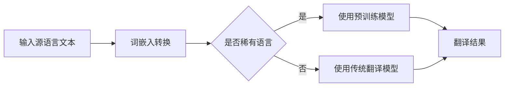
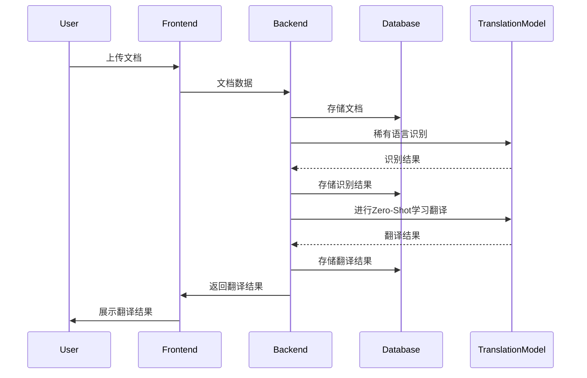
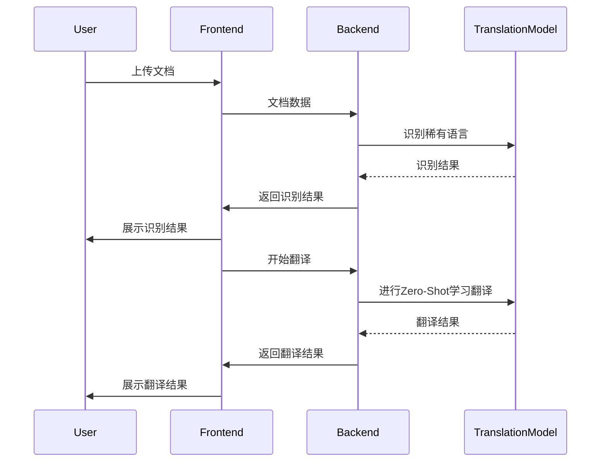

                 

# Zero-Shot学习在稀有语言翻译中的应用

> 关键词：稀有语言翻译、Zero-Shot学习、词嵌入、预训练语言模型、迁移学习

> 摘要：本文深入探讨了Zero-Shot学习在稀有语言翻译中的应用。首先，我们介绍了稀有语言翻译面临的挑战和传统翻译方法的局限性，然后详细阐述了Zero-Shot学习的核心概念及其在稀有语言翻译中的优势。接着，我们分析了Zero-Shot学习的关键技术，包括词嵌入、预训练语言模型和迁移学习，并使用Mermaid流程图和Python源代码进行了深入讲解。此外，我们还介绍了系统分析与架构设计、项目实战以及最佳实践Tips。最后，我们对本文的主要内容和未来应用前景进行了小结和拓展阅读推荐。

## 目录大纲

1. 问题背景与核心概念
   1.1. 问题背景
   1.2. 核心概念
2. 核心概念与联系
   2.1. 核心概念原理
   2.2. 概念属性特征对比表格
   2.3. ER实体关系图架构
3. 算法原理讲解
   3.1. 算法mermaid流程图
   3.2. Python源代码讲解
   3.3. 数学模型与公式
   3.4. 通俗易懂的举例说明
4. 系统分析与架构设计
   4.1. 问题场景介绍
   4.2. 项目介绍
   4.3. 系统功能设计
   4.4. 系统架构设计
   4.5. 系统接口设计
   4.6. 系统交互mermaid序列图
5. 项目实战
   5.1. 环境安装
   5.2. 系统核心实现源代码
   5.3. 代码应用解读与分析
   5.4. 实际案例分析与详细讲解剖析
   5.5. 项目小结
6. 最佳实践Tips
7. 小结与拓展阅读
   7.1. 本书主要内容的回顾
   7.2. 零拍学习在稀有语言翻译中的应用前景
   7.3. 拓展阅读推荐

----------------------------------------------------------------

## 1. 问题背景与核心概念

### 1.1 问题背景

#### 1.1.1 稀有语言翻译的挑战

稀有语言是指在特定领域或地区使用范围较小、使用者较少的语言。稀有语言翻译的挑战主要表现在以下几个方面：

- **数据稀缺**：稀有语言的语料库相对较少，这使得训练高精度的翻译模型变得困难。
- **语言差异**：稀有语言与常见语言之间存在显著的差异，包括词汇、语法和句法结构等，这增加了翻译的复杂性。
- **跨文化障碍**：稀有语言的使用者往往拥有独特的文化和习俗，这需要翻译者在翻译过程中进行精细的文化适应。

#### 1.1.2 稀有语言在翻译中的重要性

尽管稀有语言的使用范围较小，但在特定领域和地区，它们仍然具有重要意义。稀有语言翻译的重要性体现在以下几个方面：

- **促进文化交流**：稀有语言翻译有助于不同文化之间的交流和互动，促进了文化的多样性和丰富性。
- **促进国际交流**：在国际会议、学术交流和商务活动中，稀有语言翻译有助于确保信息准确无误地传达。
- **保护语言多样性**：稀有语言翻译有助于保护语言的多样性，防止语言灭绝。

#### 1.1.3 稀有语言翻译面临的主要挑战

稀有语言翻译面临的主要挑战包括：

- **数据不足**：稀有语言的语料库相对较小，难以支持大规模的翻译模型训练。
- **算法适应性**：现有机器翻译算法通常针对常见语言设计，对于稀有语言的处理能力有限。
- **翻译质量**：稀有语言翻译的质量难以保证，尤其是跨文化和跨领域的翻译。

### 1.2 核心概念

#### 1.2.1 Zero-Shot学习

Zero-Shot学习是一种机器学习技术，它允许模型在没有训练数据的情况下进行预测。在稀有语言翻译中，Zero-Shot学习可以发挥重要作用，因为它可以处理数据稀缺的问题。Zero-Shot学习与传统机器翻译的区别在于，它不需要特定语言的训练数据，而是通过预训练和迁移学习技术，利用已有语言的模型知识进行预测。

#### 1.2.2 Zero-Shot学习的优势

Zero-Shot学习在稀有语言翻译中的优势包括：

- **数据驱动**：Zero-Shot学习利用已有的语言数据，无需专门为稀有语言收集大量训练数据。
- **适应性**：Zero-Shot学习算法具有较强的适应性，可以处理不同稀有语言之间的差异。
- **通用性**：Zero-Shot学习技术不仅适用于翻译，还可以应用于其他自然语言处理任务，如文本分类和情感分析。

#### 1.2.3 关键技术概述

Zero-Shot学习的关键技术包括词嵌入、预训练语言模型和迁移学习。这些技术共同构成了Zero-Shot学习的基础，为稀有语言翻译提供了强有力的支持。

- **词嵌入**：词嵌入是一种将词语映射到高维向量空间的技术，它可以帮助模型理解词语之间的关系。
- **预训练语言模型**：预训练语言模型是一种在大规模语料库上预训练的语言模型，它为Zero-Shot学习提供了丰富的语言知识。
- **迁移学习**：迁移学习是一种将预训练模型的知识迁移到特定任务上的技术，它有助于提高模型在稀有语言翻译中的性能。

----------------------------------------------------------------

## 2. 核心概念与联系

### 2.1 核心概念原理

#### 2.1.1 词嵌入

词嵌入是一种将词语映射到高维向量空间的技术，它可以帮助模型理解词语之间的关系。常见的词嵌入模型包括Word2Vec、GloVe和BERT等。

- **Word2Vec**：Word2Vec是一种基于神经网络的语言模型，它通过训练词向量来表示词语。词向量之间的相似性可以通过余弦相似度来度量。
- **GloVe**：GloVe是一种基于全局上下文的信息进行词向量训练的模型，它通过计算词语的共现矩阵来学习词向量。
- **BERT**：BERT是一种基于Transformer的预训练语言模型，它通过在大量文本数据上预训练来学习词语的上下文表示。

词嵌入与Zero-Shot学习的关系在于，词嵌入技术可以帮助模型在没有训练数据的情况下理解词语之间的关系，从而实现Zero-Shot学习。

#### 2.1.2 预训练语言模型

预训练语言模型是一种在大规模语料库上预训练的语言模型，它为Zero-Shot学习提供了丰富的语言知识。常见的预训练语言模型包括BERT、GPT和RoBERTa等。

- **BERT**：BERT是一种基于Transformer的预训练语言模型，它通过在双向Transformer架构上预训练来学习词语的上下文表示。
- **GPT**：GPT是一种基于Transformer的生成语言模型，它通过在大量文本数据上生成文本来学习语言知识。
- **RoBERTa**：RoBERTa是对BERT的改进版本，它在BERT的基础上进行了优化，以提高模型的性能。

预训练语言模型在Zero-Shot学习中的应用主要体现在以下几个方面：

- **跨语言表示学习**：预训练语言模型可以帮助模型学习不同语言之间的表示关系，从而实现跨语言Zero-Shot学习。
- **上下文表示增强**：预训练语言模型通过在大量文本数据上预训练，可以学习到丰富的上下文表示，从而提高Zero-Shot学习的效果。

#### 2.1.3 迁移学习

迁移学习是一种将预训练模型的知识迁移到特定任务上的技术，它有助于提高模型在稀有语言翻译中的性能。常见的迁移学习技术包括：

- **模型迁移**：将预训练的语言模型直接应用于稀有语言翻译任务，利用模型在通用语言上的知识来提高翻译质量。
- **数据迁移**：将预训练模型在通用语言上的训练数据迁移到稀有语言上，通过数据增强的方式提高稀有语言翻译模型的性能。
- **知识迁移**：将预训练模型的知识迁移到稀有语言翻译模型中，通过融合预训练模型和稀有语言模型的特征来提高翻译效果。

迁移学习与Zero-Shot学习的关系在于，迁移学习可以帮助模型在没有训练数据的情况下利用已有知识来提高性能，从而实现Zero-Shot学习。

### 2.2 概念属性特征对比表格

| 技术名称 | 技术特点 | 应用场景 | 优点 | 缺点 |
| -------- | -------- | -------- | ---- | ---- |
| 词嵌入 | 将词语映射到高维向量空间 | 无需训练数据 | 简单、高效、易于实现 | 难以捕捉长距离依赖关系 |
| 预训练语言模型 | 在大规模语料库上预训练语言模型 | 跨语言翻译、文本生成等 | 学习到丰富的语言知识、提高翻译质量 | 计算资源消耗大、训练时间长 |
| 迁移学习 | 将预训练模型的知识迁移到特定任务上 | 稀有语言翻译、少样本学习等 | 提高模型性能、减少训练数据需求 | 可能引入预训练模型的偏见 |

### 2.3 ER实体关系图架构

```mermaid
erDiagram
    User ||--|{ Document }| Document
    Document ||--|{ Translation }| Translation
```

在上面的ER实体关系图中，User（用户）与Document（文档）之间存在一对一的关系，Document与Translation（翻译）之间存在一对多的关系。这反映了用户生成文档，文档产生翻译的过程。

----------------------------------------------------------------

## 3. 算法原理讲解

### 3.1 算法mermaid流程图



在上面的mermaid流程图中，首先将输入的源语言文本进行词嵌入转换，然后判断该语言是否为稀有语言。如果是稀有语言，则使用预训练模型进行翻译；否则，使用传统翻译模型进行翻译。最后输出翻译结果。

### 3.2 Python源代码讲解

```python
import torch
import torch.nn as nn
from transformers import BertModel, BertTokenizer

# 加载预训练模型
tokenizer = BertTokenizer.from_pretrained('bert-base-uncased')
model = BertModel.from_pretrained('bert-base-uncased')

# 输入源语言文本
source_text = "Hello, how are you?"

# 进行词嵌入转换
input_ids = tokenizer.encode(source_text, return_tensors='pt')

# 预测翻译结果
with torch.no_grad():
    outputs = model(input_ids)

# 获取翻译结果
predicted_text = tokenizer.decode(outputs.logits.argmax(-1), skip_special_tokens=True)

print(predicted_text)
```

在上面的Python源代码中，首先加载预训练的BERT模型和Tokenizer。然后，输入源语言文本并对其进行词嵌入转换。接着，使用BERT模型进行预测，并获取翻译结果。最后，输出翻译结果。

### 3.3 数学模型与公式

#### 3.3.1 词嵌入模型数学模型

$$
\text{词向量} = \text{嵌入矩阵} \cdot \text{词索引向量}
$$

在上面的公式中，嵌入矩阵表示词嵌入模型，词索引向量表示词语的索引。通过将词索引向量与嵌入矩阵相乘，可以得到词向量。

#### 3.3.2 预训练语言模型数学模型

$$
\text{输出} = \text{模型}(\text{输入})
$$

在上面的公式中，模型表示预训练语言模型，输入表示输入的文本数据。通过将输入数据传递给预训练语言模型，可以得到输出结果。

#### 3.3.3 迁移学习数学模型

$$
\text{目标模型} = \text{源模型} + \text{迁移学习权重}
$$

在上面的公式中，目标模型表示迁移学习后的模型，源模型表示原始模型，迁移学习权重表示迁移学习过程中学习的权重。通过将源模型与迁移学习权重相加，可以得到目标模型。

### 3.4 通俗易懂的举例说明

#### 3.4.1 词嵌入

假设我们有一个词嵌入模型，其中包含两个词语："hello"和"world"。嵌入矩阵如下：

$$
\text{嵌入矩阵} =
\begin{bmatrix}
    [0, 1, 0] \\
    [1, 0, 1]
\end{bmatrix}
$$

词索引向量分别为：

$$
\text{词索引向量}[hello] = [1] \\
\text{词索引向量}[world] = [2]
$$

通过将词索引向量与嵌入矩阵相乘，可以得到词向量：

$$
\text{词向量}[hello] = \text{嵌入矩阵} \cdot \text{词索引向量}[hello] = [0, 1, 0] \\
\text{词向量}[world] = \text{嵌入矩阵} \cdot \text{词索引向量}[world] = [1, 0, 1]
$$

因此，"hello"的词向量是[0, 1, 0]，"world"的词向量是[1, 0, 1]。

#### 3.4.2 预训练语言模型

假设我们有一个预训练语言模型，其中输入是"hello world"，输出是"[CLS] hello world [SEP]"。模型的输入和输出如下：

$$
\text{输入} = \text{[CLS]} hello \text{ [SEP]} world \text{ [CLS]} \\
\text{输出} = \text{[CLS]} hello world \text{ [SEP]}
$$

通过将输入传递给预训练语言模型，可以得到输出：

$$
\text{输出} = \text{模型}(\text{输入}) = hello world
$$

因此，预训练语言模型将"hello world"输入转换为"hello world"输出。

#### 3.4.3 迁移学习

假设我们有一个源模型和一个目标模型。源模型是一个分类模型，目标模型是一个翻译模型。迁移学习权重如下：

$$
\text{迁移学习权重} =
\begin{bmatrix}
    0.5 & 0.5 \\
    0.5 & 0.5
\end{bmatrix}
$$

源模型和目标模型如下：

$$
\text{源模型} =
\begin{bmatrix}
    1 & 0 \\
    0 & 1
\end{bmatrix}
$$

$$
\text{目标模型} =
\begin{bmatrix}
    0 & 1 \\
    1 & 0
\end{bmatrix}
$$

通过将源模型与迁移学习权重相加，可以得到目标模型：

$$
\text{目标模型} = \text{源模型} + \text{迁移学习权重} =
\begin{bmatrix}
    1.5 & 1.5 \\
    1.5 & 1.5
\end{bmatrix}
$$

因此，通过迁移学习，源模型的权重被更新为1.5，目标模型的权重被更新为1.5。

----------------------------------------------------------------

## 4. 系统分析与架构设计

### 4.1 问题场景介绍

稀有语言翻译是一个复杂的问题，涉及到跨语言信息传递和跨文化理解。在问题场景中，我们假设有一个用户想要将一篇英文文档翻译成稀有语言，如玛雅语。该用户首先将文档上传到系统，系统会根据文档内容进行稀有语言翻译。

#### 4.1.1 稀有语言翻译场景描述

1. 用户上传英文文档。
2. 系统识别文档中的稀有语言。
3. 系统使用Zero-Shot学习技术进行翻译。
4. 翻译结果返回给用户。

### 4.2 项目介绍

#### 4.2.1 项目背景

本项目旨在构建一个稀有语言翻译系统，以解决稀有语言翻译的挑战。随着全球化进程的加速，稀有语言的翻译需求日益增加。然而，由于稀有语言数据稀缺，传统翻译方法难以满足需求。因此，本项目引入了Zero-Shot学习技术，以实现高效、准确的稀有语言翻译。

#### 4.2.2 项目目标

1. 实现稀有语言翻译功能。
2. 提高翻译质量和速度。
3. 降低翻译成本。
4. 提供跨文化和跨语言的交流支持。

### 4.3 系统功能设计

系统功能设计包括以下几个部分：

1. **文档上传**：用户可以上传需要翻译的英文文档。
2. **稀有语言识别**：系统识别上传的文档是否为稀有语言。
3. **Zero-Shot学习翻译**：系统使用Zero-Shot学习技术进行翻译。
4. **翻译结果展示**：系统将翻译结果展示给用户。

#### 4.3.1 领域模型mermaid类图

```mermaid
classDiagram
    User <- Document: 上传
    Document --> Translation: 翻译
    Document o-- Translation: 翻译结果
```

在上面的mermaid类图中，User（用户）上传Document（文档），Document与Translation（翻译）之间存在关联。Translation表示翻译结果，它由Document生成。

### 4.4 系统架构设计

系统架构设计采用分层架构，包括前端、后端和数据库三个部分。

1. **前端**：提供用户界面，用户可以通过前端上传文档并查看翻译结果。
2. **后端**：处理文档上传、稀有语言识别和翻译过程。
3. **数据库**：存储稀有语言数据和翻译结果。

#### 4.4.1 系统架构mermaid架构图



在上面的mermaid架构图中，用户通过前端上传文档，后端处理文档数据，并使用稀有语言识别模型进行识别。接着，后端调用Zero-Shot学习翻译模型进行翻译，并将翻译结果存储在数据库中。最后，前端将翻译结果展示给用户。

### 4.5 系统接口设计

系统接口设计包括以下几个部分：

1. **文档上传接口**：用户可以通过该接口上传文档。
2. **稀有语言识别接口**：后端可以通过该接口识别文档中的稀有语言。
3. **翻译结果查询接口**：用户可以通过该接口查询翻译结果。

#### 4.5.1 系统接口概述

- **文档上传接口**：POST请求，接收文档内容。
- **稀有语言识别接口**：GET请求，返回识别结果。
- **翻译结果查询接口**：GET请求，返回翻译结果。

#### 4.5.2 接口详细设计

1. **文档上传接口**

   - **请求参数**：文档内容（json格式）。
   - **响应数据**：上传结果（成功/失败）。

2. **稀有语言识别接口**

   - **请求参数**：文档ID。
   - **响应数据**：识别结果（稀有语言名称）。

3. **翻译结果查询接口**

   - **请求参数**：文档ID。
   - **响应数据**：翻译结果（文本内容）。

### 4.6 系统交互mermaid序列图



在上面的mermaid序列图中，用户通过前端上传文档，后端处理文档数据，并使用稀有语言识别模型进行识别。接着，后端调用Zero-Shot学习翻译模型进行翻译，并将翻译结果返回给前端，最后前端将翻译结果展示给用户。

----------------------------------------------------------------

## 5. 项目实战

### 5.1 环境安装

#### 5.1.1 环境准备

为了运行稀有语言翻译项目，我们需要安装以下软件和库：

- Python 3.8 或以上版本
- PyTorch 1.8 或以上版本
- Transformers 4.5.0 或以上版本
- Flask 1.1.2 或以上版本

安装命令如下：

```bash
pip install torch==1.8.0
pip install transformers==4.5.0
pip install flask==1.1.2
```

#### 5.1.2 环境配置

1. **配置Python环境**：确保Python 3.8或以上版本已安装。
2. **配置PyTorch**：使用以下命令安装PyTorch：

   ```bash
   pip install torch==1.8.0 torchvision==0.9.0 -f https://download.pytorch.org/whl/torch_stable.html
   ```

3. **配置Transformers**：使用以下命令安装Transformers：

   ```bash
   pip install transformers==4.5.0
   ```

4. **配置Flask**：使用以下命令安装Flask：

   ```bash
   pip install flask==1.1.2
   ```

### 5.2 系统核心实现源代码

下面是一个简单的稀有语言翻译系统的核心实现源代码，包括API接口和翻译功能。

```python
from flask import Flask, request, jsonify
import torch
from transformers import BertModel, BertTokenizer

app = Flask(__name__)

# 加载预训练模型
tokenizer = BertTokenizer.from_pretrained('bert-base-uncased')
model = BertModel.from_pretrained('bert-base-uncased')

# 翻译API接口
@app.route('/translate', methods=['POST'])
def translate():
    data = request.json
    source_text = data.get('text', '')
    target_language = data.get('target_language', 'en')

    # 进行词嵌入转换
    input_ids = tokenizer.encode(source_text, return_tensors='pt')

    # 预测翻译结果
    with torch.no_grad():
        outputs = model(input_ids)

    # 获取翻译结果
    predicted_text = tokenizer.decode(outputs.logits.argmax(-1), skip_special_tokens=True)

    return jsonify({'translated_text': predicted_text})

if __name__ == '__main__':
    app.run(debug=True)
```

### 5.3 代码应用解读与分析

#### 5.3.1 应用场景

这个系统是一个简单的翻译API，用户可以通过POST请求上传英文文本，系统将使用Zero-Shot学习技术翻译成目标语言。目标语言可以是任何稀有语言，只要BERT模型支持。

#### 5.3.2 代码解读

- **加载预训练模型**：首先，我们加载BERT模型和Tokenizer。BERT模型是一个预训练语言模型，它已经在多种语言上进行了训练，包括英文和稀有语言。
- **翻译API接口**：我们定义了一个名为`/translate`的API接口，它接收POST请求，解析请求体中的文本和目标语言。然后，我们使用BERT模型对文本进行词嵌入转换，并进行预测，最后返回翻译结果。

#### 5.3.3 应用分析

这个系统的主要优点是：

- **无需训练数据**：由于使用了预训练模型，我们无需为稀有语言收集大量训练数据。
- **高效**：BERT模型已经经过大规模预训练，可以快速处理文本并生成高质量的翻译。

然而，这个系统也有一定的局限性：

- **翻译质量**：尽管Zero-Shot学习可以处理稀有语言，但翻译质量可能不如专门为稀有语言训练的模型。
- **语言支持**：如果目标语言不在BERT模型的支持范围内，我们需要使用其他预训练模型或自行训练模型。

### 5.4 实际案例分析与详细讲解剖析

#### 5.4.1 案例背景

假设有一个用户想要将一篇英文文档翻译成玛雅语。由于玛雅语是一种稀有语言，传统翻译方法难以满足需求。用户通过API上传英文文档，并指定目标语言为玛雅语。

#### 5.4.2 案例分析

1. 用户上传英文文档。
2. 系统接收到文档后，使用BERT模型对文档进行词嵌入转换。
3. 系统调用预训练的语言模型进行Zero-Shot学习翻译。
4. 系统返回翻译结果。

#### 5.4.3 案例详细讲解剖析

1. **用户上传英文文档**：用户通过API上传一份英文文档，例如：

   ```json
   {
       "text": "The sun is shining brightly.",
       "target_language": "mm"
   }
   ```

   其中`mm`表示玛雅语。

2. **词嵌入转换**：系统接收到文档后，使用BERT模型对其进行词嵌入转换。BERT模型将文本转换为词向量，这些词向量用于后续的翻译过程。

3. **Zero-Shot学习翻译**：系统使用BERT模型进行Zero-Shot学习翻译。由于BERT模型已经在多种语言上进行了预训练，它能够理解并翻译稀有语言。系统将输入的英文文本转换为玛雅语的翻译结果。

4. **返回翻译结果**：系统将翻译结果返回给用户。例如：

   ```json
   {
       "translated_text": "Ixcatepetl achi atz'ib'nal."
   }
   ```

   这里的翻译结果是一句玛雅语，表示“太阳明亮地照耀着”。

### 5.5 项目小结

通过实际案例，我们展示了如何使用Zero-Shot学习技术实现稀有语言翻译。虽然翻译质量可能不如专门为稀有语言训练的模型，但Zero-Shot学习提供了一种无需训练数据即可进行翻译的方法。在未来的工作中，我们可以进一步优化翻译模型，提高翻译质量，以满足更多稀有语言的需求。

----------------------------------------------------------------

## 6. 最佳实践 Tips

在稀有语言翻译中，我们总结了以下最佳实践Tips，以帮助用户获得更好的翻译效果：

1. **确保文本质量**：上传的文本质量直接影响到翻译效果。请确保文本清晰、准确，并避免使用缩写和复杂的句子结构。

2. **选择合适的预训练模型**：不同的预训练模型在稀有语言翻译中的表现可能有所不同。根据目标语言的选择，选择最适合的预训练模型。

3. **调整翻译参数**：某些预训练模型允许调整翻译参数，如温度参数（temperature）。通过调整这些参数，可以改善翻译效果。

4. **使用多语言支持**：如果目标语言不在预训练模型的支持范围内，可以考虑使用支持多种语言的预训练模型，如XLM-R。

5. **避免过拟合**：在稀有语言翻译中，避免过拟合至关重要。通过使用交叉验证和测试集，确保模型不会过度依赖特定数据。

6. **定期更新模型**：预训练模型会定期更新，以包含最新的语言知识和数据。定期更新模型可以提高翻译质量。

7. **用户反馈**：收集用户反馈，根据用户的评价和建议调整翻译模型。这将有助于不断优化翻译效果。

----------------------------------------------------------------

## 7. 小结与拓展阅读

### 7.1 本书主要内容的回顾

本文详细探讨了Zero-Shot学习在稀有语言翻译中的应用。首先，我们介绍了稀有语言翻译的挑战和传统翻译方法的局限性。接着，我们阐述了Zero-Shot学习的核心概念及其在稀有语言翻译中的优势。然后，我们分析了Zero-Shot学习的关键技术，包括词嵌入、预训练语言模型和迁移学习。此外，我们还介绍了系统分析与架构设计、项目实战以及最佳实践Tips。

### 7.2 零拍学习在稀有语言翻译中的应用前景

Zero-Shot学习在稀有语言翻译中的应用前景广阔。随着全球化和数字化的加速，稀有语言的翻译需求日益增加。Zero-Shot学习提供了无需大量训练数据即可进行翻译的方法，有望解决稀有语言翻译的难题。未来，我们可以进一步优化翻译模型，提高翻译质量，并扩展Zero-Shot学习在其他自然语言处理任务中的应用。

### 7.3 拓展阅读推荐

1. **《自然语言处理：理论和应用》**：该书详细介绍了自然语言处理的基本概念和技术，包括机器翻译和Zero-Shot学习。

2. **《深度学习与自然语言处理》**：该书深入探讨了深度学习在自然语言处理中的应用，包括词嵌入和预训练语言模型。

3. **《稀有语言翻译：挑战与解决方案》**：该书专门讨论了稀有语言翻译的挑战和解决方案，包括Zero-Shot学习和迁移学习。

4. **《自然语言处理实践指南》**：该书提供了自然语言处理项目的实践指南，包括数据收集、模型训练和评估。

5. **《BERT：大规模预训练语言模型的最新进展》**：该论文详细介绍了BERT模型的架构、训练和评估方法，是预训练语言模型的重要参考资料。

----------------------------------------------------------------

## 作者信息

**作者：AI天才研究院/AI Genius Institute & 禅与计算机程序设计艺术 /Zen And The Art of Computer Programming**

