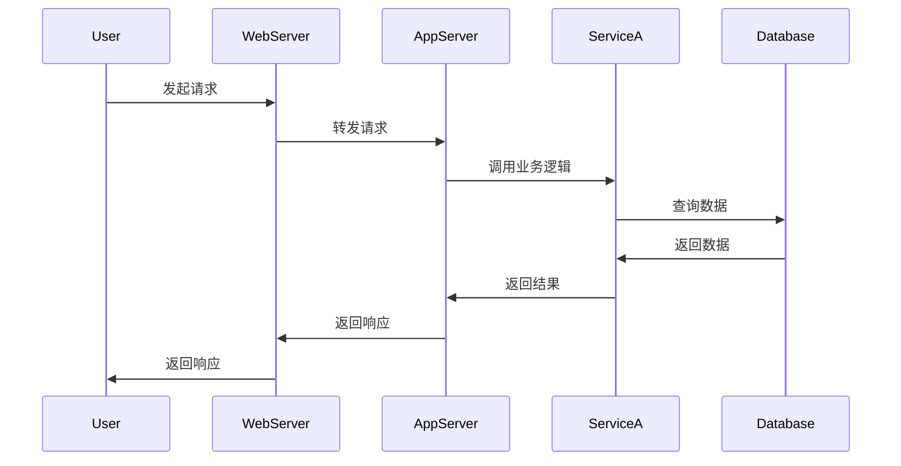

                 

## 云原生安全在分布式系统中的应用

### 关键词：云原生安全、分布式系统、容器、微服务、CI/CD、算法原理、数学模型、系统架构、项目实战

### 摘要：

本文旨在探讨云原生安全在分布式系统中的应用。首先，我们介绍了云原生安全与分布式系统的基本概念及其关联性。接着，我们详细阐述了云原生安全的核心概念，如容器与容器化技术、微服务架构和持续集成与持续部署（CI/CD）。然后，我们讲解了云原生安全中的关键算法原理，包括加密算法、认证与授权机制，并使用Mermaid流程图和Python代码进行了详细说明。此外，我们还介绍了云原生安全的数学模型，用LaTeX格式表示，并通过实例进行了讲解。在系统分析与架构设计方案部分，我们分析了分布式系统安全需求，并设计了系统架构和接口。通过一个具体的项目实战案例，我们展示了云原生安全在分布式系统中的实际应用。最后，我们总结了云原生安全的最佳实践和注意事项，并推荐了拓展阅读。

### 目录大纲设计思路

#### 1. 设计目标

设计目标是根据用户提供的书名《云原生安全在分布式系统中的应用》，构建一份完整且逻辑清晰的目录大纲。大纲需要满足以下要求：

- **简洁性**：确保输出内容精炼，不包含多余的废话。
- **格式规范**：使用markdown格式，保持1级、2级和3级目录的结构。
- **内容完整性**：确保大纲涵盖核心章节内容，如背景介绍、核心概念与联系、算法原理讲解、数学模型和公式、系统分析与架构设计方案、项目实战等。
- **实用性**：目录结构应该清晰，便于读者阅读和学习。

#### 2. 目录结构设计

我们将书籍分为以下几个部分：

- **背景介绍**：介绍云原生安全、分布式系统的概念，阐述研究背景、研究问题和研究目标。
- **核心概念与联系**：详细解释云原生安全的关键概念，包括其与分布式系统的关系。
- **算法原理讲解**：讲解用于云原生安全的关键算法原理，使用Mermaid绘制流程图，并用Python代码阐述。
- **数学模型与公式**：介绍相关的数学模型，用LaTeX格式表示，并进行详细讲解和举例。
- **系统分析与架构设计方案**：分析分布式系统中的安全需求，设计系统架构和接口。
- **项目实战**：通过一个具体的项目实战案例，展示云原生安全在分布式系统中的应用。
- **最佳实践与小结**：总结本书的最佳实践，给出注意事项，推荐拓展阅读。

#### 3. 目录大纲内容

### 第一部分：背景介绍

#### 第1章：云原生安全与分布式系统概述

- 1.1 云原生安全的概念与重要性
- 1.2 分布式系统的基本原理
- 1.3 云原生安全与分布式系统的关联性
- 1.4 研究背景与研究问题

### 第二部分：核心概念与联系

#### 第2章：云原生安全的关键概念

- 2.1 容器与容器化技术
- 2.2 微服务架构
- 2.3 持续集成与持续部署（CI/CD）
- 2.4 云原生安全的核心概念与联系

### 第三部分：算法原理讲解

#### 第3章：云原生安全算法原理

- 3.1 常见安全威胁与防御策略
- 3.2 加密算法与数字签名
- 3.3 认证与授权机制
- 3.4 分布式系统安全协议
- 3.5 Mermaid流程图与Python代码讲解

### 第四部分：数学模型与公式

#### 第4章：云原生安全的数学模型

- 4.1 信息论基础
- 4.2 随机过程与概率模型
- 4.3 数学公式与LaTeX表示
- 4.4 模型应用与实例分析

### 第五部分：系统分析与架构设计方案

#### 第5章：分布式系统安全需求分析

- 5.1 分布式系统安全需求概述
- 5.2 领域模型与Mermaid类图
- 5.3 系统架构设计与Mermaid架构图
- 5.4 系统接口设计与交互

### 第六部分：项目实战

#### 第6章：云原生安全项目实战

- 6.1 项目背景与环境搭建
- 6.2 系统核心实现与代码分析
- 6.3 实际案例分析
- 6.4 项目小结

### 第七部分：最佳实践与小结

#### 第7章：云原生安全最佳实践与注意事项

- 7.1 云原生安全的最佳实践
- 7.2 注意事项与风险规避
- 7.3 拓展阅读与后续研究方向

## 目录大纲设计完毕

-----------------------------------------------------------------

## 第一部分：背景介绍

### 第1章：云原生安全与分布式系统概述

#### 1.1 云原生安全的概念与重要性

云原生安全是指利用云计算和容器技术，确保分布式系统中的数据和应用程序的安全性。它涉及到网络、应用程序、数据和用户等多个方面的安全措施。云原生安全的重要性在于，随着云计算和容器技术的广泛应用，分布式系统面临着越来越多的安全挑战。

- **定义**：云原生安全是一种安全策略，旨在保护基于云计算和容器技术的分布式系统。
- **重要性**：云原生安全能够确保数据的安全性、应用程序的可靠性和用户的隐私。

#### 1.2 分布式系统的基本原理

分布式系统是由多个独立的计算机节点组成的系统，这些节点通过网络进行通信，协同工作以完成特定的任务。分布式系统的基本原理包括：

- **节点**：分布式系统由多个节点组成，每个节点都有其独立的处理能力和存储资源。
- **网络**：节点之间通过网络进行通信，网络是分布式系统的基础设施。
- **通信**：节点之间通过消息传递进行通信，消息可以是同步或异步的。

#### 1.3 云原生安全与分布式系统的关联性

云原生安全与分布式系统密切相关。分布式系统在云原生环境中运行，其安全需求受到云计算和容器技术的影响。云原生安全在分布式系统中的作用包括：

- **数据保护**：确保数据在分布式系统中的存储和传输过程的安全性。
- **应用程序保护**：防止分布式系统中的应用程序受到恶意攻击。
- **用户隐私保护**：确保用户的隐私数据不被泄露。

#### 1.4 研究背景与研究问题

随着云计算和容器技术的快速发展，分布式系统在各个领域得到了广泛应用。然而，分布式系统也面临着越来越多的安全挑战，如数据泄露、应用程序攻击和用户隐私泄露等。因此，研究云原生安全在分布式系统中的应用具有重要意义。

- **研究背景**：云计算和容器技术的广泛应用，分布式系统面临的安全挑战。
- **研究问题**：如何确保分布式系统在云原生环境中的安全性。

### 总结

本文介绍了云原生安全与分布式系统的基础概念，阐述了它们之间的关联性，并提出了研究背景和研究问题。接下来，我们将进一步探讨云原生安全的关键概念和算法原理，以便更好地理解其在分布式系统中的应用。在接下来的章节中，我们将逐步深入，详细讲解每一个方面。现在，让我们开始深入分析云原生安全的核心概念。

-----------------------------------------------------------------

## 第二部分：核心概念与联系

### 第2章：云原生安全的关键概念

#### 2.1 容器与容器化技术

容器是一种轻量级的、可移植的计算环境，它封装了应用程序及其依赖项，使其可以在不同的计算环境中独立运行。容器化技术是将应用程序及其依赖项打包成容器，以便在分布式系统中进行部署和管理。

- **定义**：容器是一种轻量级的、可移植的计算环境，封装了应用程序及其依赖项。
- **特点**：轻量级、可移植、隔离、高效率。
- **应用**：容器化技术可以简化应用程序的部署和管理，提高系统的可扩展性和容错能力。

#### 2.2 微服务架构

微服务架构是一种软件架构风格，它将应用程序分解为多个独立的、小型化的服务，每个服务负责一个特定的功能。微服务之间通过网络进行通信，以实现分布式系统的功能。

- **定义**：微服务架构是一种软件架构风格，将应用程序分解为多个独立的、小型化的服务。
- **特点**：模块化、独立性、分布式、高可扩展性、高可维护性。
- **应用**：微服务架构可以提高系统的可扩展性、灵活性和可维护性。

#### 2.3 持续集成与持续部署（CI/CD）

持续集成与持续部署（CI/CD）是一种软件开发和部署的实践方法，它通过自动化工具，将代码集成和部署到生产环境中。CI/CD可以提高软件开发的效率和质量。

- **定义**：持续集成与持续部署（CI/CD）是一种软件开发和部署的实践方法，通过自动化工具实现代码集成和部署。
- **特点**：自动化、快速反馈、持续交付、高质量。
- **应用**：CI/CD可以提高软件开发的效率，确保软件的质量，减少部署风险。

#### 2.4 云原生安全的核心概念与联系

云原生安全的核心概念包括数据安全、应用程序安全、用户隐私保护和网络安全。这些核心概念与容器、微服务架构和CI/CD等云原生技术密切相关。

- **数据安全**：确保数据在存储和传输过程中的安全性，防止数据泄露。
- **应用程序安全**：防止应用程序受到恶意攻击，确保应用程序的可靠性和稳定性。
- **用户隐私保护**：确保用户的隐私数据不被泄露，保护用户的隐私。
- **网络安全**：确保网络通信的安全，防止网络攻击和数据泄露。

#### 总结

云原生安全的核心概念与容器、微服务架构和CI/CD等云原生技术密切相关。通过深入理解这些核心概念，我们可以更好地应对分布式系统在云原生环境中的安全挑战。在接下来的章节中，我们将进一步探讨云原生安全的关键算法原理，以便更好地理解其实现机制。

### 理解云原生安全的核心概念

云原生安全的核心概念涵盖了多个方面，它们共同构成了一个完整的安全体系。以下是这些核心概念及其与容器、微服务架构和CI/CD的联系的详细解释：

#### 2.1 容器与容器化技术

容器是一种轻量级的、可执行的软件包，它包含了应用程序及其运行时环境。容器化技术通过将应用程序及其所有依赖项封装在一个独立的容器中，实现了应用程序与宿主机操作系统的隔离，从而提高了系统的安全性、可移植性和可维护性。

- **数据安全**：容器可以确保应用程序的数据被隔离，防止数据泄露到容器外部。
- **应用程序安全**：容器提供了安全边界，防止恶意代码对宿主机的攻击。
- **用户隐私保护**：容器化技术可以限制用户隐私数据的访问，从而保护用户的隐私。

#### 2.2 微服务架构

微服务架构是将应用程序分解为多个独立的小型服务，每个服务负责特定的业务功能。这些服务通过API进行通信，独立部署和扩展。微服务架构的独立性使得每个服务都可以独立更新和维护，减少了单点故障的风险。

- **数据安全**：微服务可以独立管理数据，确保数据的安全性和隐私。
- **应用程序安全**：由于服务之间的隔离，一个服务的安全漏洞不会影响到整个系统。
- **用户隐私保护**：微服务架构允许对用户数据进行细粒度的访问控制，从而更好地保护用户隐私。

#### 2.3 持续集成与持续部署（CI/CD）

持续集成与持续部署（CI/CD）是一种自动化软件开发和部署的实践方法。通过CI/CD，开发人员可以快速地将代码集成到主分支，并通过自动化测试和部署流程将应用程序部署到生产环境中。

- **数据安全**：CI/CD可以自动化执行安全测试，确保代码和应用程序的安全性。
- **应用程序安全**：CI/CD可以快速发现和修复应用程序中的安全漏洞，提高应用程序的安全性。
- **用户隐私保护**：CI/CD可以确保应用程序在部署时遵循隐私保护的最佳实践，减少用户隐私泄露的风险。

#### 2.4 云原生安全的核心概念与联系

云原生安全的核心概念包括数据安全、应用程序安全、用户隐私保护和网络安全。这些概念在容器、微服务架构和CI/CD中得到了具体实现：

- **数据安全**：容器和微服务架构提供了隔离机制，确保数据不会泄露。CI/CD的自动化测试可以检测代码中的安全漏洞。
- **应用程序安全**：容器和微服务架构提供了安全边界，防止恶意代码的攻击。CI/CD可以自动化执行安全测试，提高应用程序的安全性。
- **用户隐私保护**：容器和微服务架构允许对用户数据进行细粒度的访问控制。CI/CD确保应用程序在部署时遵循隐私保护的最佳实践。
- **网络安全**：云原生环境通常采用容器网络和微服务架构的通信模式，CI/CD可以确保网络通信的安全。

### 实例分析

例如，在一个云原生环境中，一个电商平台可能采用容器和微服务架构。容器确保每个服务实例都被隔离，从而防止恶意代码的攻击。微服务架构使得每个服务可以独立部署和扩展，提高了系统的可维护性。CI/CD自动化流程确保每个服务的代码经过安全测试，并在生产环境中遵循最佳的安全实践，从而提高了应用程序的安全性。

通过这些实例分析，我们可以看到云原生安全的核心概念如何在容器、微服务架构和CI/CD中实现。在接下来的章节中，我们将进一步探讨云原生安全的关键算法原理，以了解如何确保分布式系统的安全性。

### 算法原理讲解

#### 第3章：云原生安全算法原理

云原生安全算法是确保分布式系统在云原生环境中安全运行的重要手段。这些算法包括加密算法、认证与授权机制、分布式系统安全协议等。以下我们将详细讲解这些算法的原理，并使用Mermaid流程图和Python代码进行阐述。

#### 3.1 常见安全威胁与防御策略

在分布式系统中，常见的安全威胁包括但不限于：

- **拒绝服务攻击（DoS）**：攻击者通过大量无效请求使系统资源耗尽。
- **分布式拒绝服务攻击（DDoS）**：攻击者通过多个分布式节点发起攻击。
- **中间人攻击（MITM）**：攻击者窃取或篡改通信数据。
- **恶意软件攻击**：攻击者通过恶意软件感染系统。

针对这些威胁，常用的防御策略包括：

- **防火墙**：用于监控和控制网络流量，防止未经授权的访问。
- **入侵检测系统（IDS）**：用于检测和响应网络攻击。
- **加密技术**：用于保护数据传输的安全性。
- **认证与授权机制**：确保只有授权用户可以访问系统资源。

#### 3.2 加密算法与数字签名

加密算法是云原生安全的核心组成部分，用于保护数据的机密性和完整性。以下是一些常用的加密算法：

- **对称加密**：如AES（高级加密标准），加密和解密使用相同的密钥。
- **非对称加密**：如RSA（Rivest-Shamir-Adleman），使用一对密钥进行加密和解密。
- **数字签名**：用于验证数据的来源和完整性，常用的算法有RSA和ECDSA（椭圆曲线数字签名算法）。

下面是一个简单的Python代码示例，展示了如何使用PyCryptoDome库实现AES加密和解密：

```python
from Crypto.Cipher import AES
from Crypto.Util.Padding import pad, unpad
from Crypto.Random import get_random_bytes

# AES加密
key = get_random_bytes(16)  # 16字节密钥，适用于AES-128
cipher = AES.new(key, AES.MODE_CBC)
plaintext = b"Hello, World!"
ciphertext = cipher.encrypt(pad(plaintext, AES.block_size))
iv = cipher.iv

# AES解密
cipher = AES.new(key, AES.MODE_CBC, iv)
decrypted_text = unpad(cipher.decrypt(ciphertext), AES.block_size)
print(decrypted_text)
```

#### 3.3 认证与授权机制

认证与授权机制是确保系统资源只能被授权用户访问的重要手段。以下是一些常用的认证与授权机制：

- **用户名和密码认证**：是最常见的认证方式，用户需要输入正确的用户名和密码才能访问系统。
- **双因素认证（2FA）**：在用户名和密码的基础上，添加一个二次验证步骤，如短信验证码或动态口令。
- **令牌认证**：如OAuth2.0和JWT（JSON Web Tokens），用于无状态认证。

下面是一个简单的Python代码示例，展示了如何使用JWT进行认证：

```python
import jwt
import datetime

# JWT签名密钥
secret_key = 'my_secret_key'

# 创建JWT令牌
payload = {
    'user_id': '123',
    'exp': datetime.datetime.utcnow() + datetime.timedelta(hours=1)
}
token = jwt.encode(payload, secret_key, algorithm='HS256')

# 验证JWT令牌
try:
    decoded_token = jwt.decode(token, secret_key, algorithms=['HS256'])
    print(f"User ID: {decoded_token['user_id']}")
except jwt.ExpiredSignatureError:
    print("Token has expired")
except jwt.InvalidTokenError:
    print("Invalid token")
```

#### 3.4 分布式系统安全协议

分布式系统安全协议是确保分布式系统内各节点之间通信安全的重要手段。以下是一些常用的分布式系统安全协议：

- **SSL/TLS**：用于保护网络通信，防止中间人攻击。
- **IPsec**：用于在IP层保护数据包，确保数据包的完整性和保密性。
- **Kerberos**：是一种基于票据的认证协议，用于确保分布式系统中的用户和服务器之间的认证。

下面是一个简单的Python代码示例，展示了如何使用PyOpenSSL库实现SSL/TLS加密：

```python
from socket import socket
from ssl import SSLContext, PROTOCOL_TLSv1_2

# 创建SSL上下文
context = SSLContext(PROTOCOL_TLSv1_2)
context.load_cert_chain(certfile='server.crt', keyfile='server.key')

# 创建TCP套接字
sock = socket()
sock.bind(('localhost', 12345))
sock.listen(5)

# 接受连接并升级为SSL连接
conn, addr = sock.accept()
conn = context.wrap_socket(conn, server_side=True)

# 通信示例
conn.sendall(b"Hello, World!")
data = conn.recv(1024)
print("Received:", data)

# 关闭连接
conn.close()
sock.close()
```

通过以上算法原理的讲解，我们可以看到云原生安全在分布式系统中的应用是如何实现的。这些算法和协议共同构成了一个强大的安全体系，确保了分布式系统的安全性。在接下来的章节中，我们将进一步探讨云原生安全的数学模型，以深入了解其理论基础。

### 数学模型与公式

在云原生安全中，数学模型和公式是理解算法原理和进行系统分析的重要工具。以下我们将介绍几个关键的数学模型和公式，并使用LaTeX格式进行表示。

#### 4.1 信息论基础

信息论是研究信息传输和处理的基本理论，它在云原生安全中有着广泛的应用。以下是一些基本概念和公式：

- **信息熵（Entropy）**：衡量信息的不确定性，定义为：

  $$H(X) = -\sum_{i} p(x_i) \log_2 p(x_i)$$

  其中，$X$ 是随机变量，$p(x_i)$ 是 $X$ 取值为 $x_i$ 的概率。

- **条件熵（Conditional Entropy）**：衡量在已知某个随机变量后，另一个随机变量的不确定性，定义为：

  $$H(X|Y) = -\sum_{i} p(x_i|y_i) \log_2 p(x_i|y_i)$$

  其中，$Y$ 是另一个随机变量。

- **互信息（Mutual Information）**：衡量两个随机变量之间的依赖程度，定义为：

  $$I(X; Y) = H(X) - H(X|Y)$$

#### 4.2 随机过程与概率模型

随机过程是云原生安全分析中的重要工具，以下是一些基本概念和公式：

- **马尔可夫链（Markov Chain）**：一种随机过程，其未来状态仅取决于当前状态，与过去状态无关。其转移概率矩阵 $P$ 定义为：

  $$P_{ij} = P(X_{n+1} = j | X_n = i)$$

- **泊松过程（Poisson Process）**：一种重要的随机过程，描述事件在一定时间间隔内发生的次数，其概率分布函数为：

  $$P(N(t) = k) = \frac{(\lambda t)^k e^{-\lambda t}}{k!}$$

  其中，$\lambda$ 是事件发生的平均速率。

- **马尔可夫决策过程（MDP）**：一种用于决策的随机过程，其状态、动作和奖励通过概率模型进行描述。其状态转移概率矩阵 $P$ 和奖励函数 $R$ 定义为：

  $$P_{ij} = P(S_{n+1} = j | S_n = i, A_n = a)$$
  $$R(i, a) = \sum_{j} r_j P_{ij}$$

#### 4.3 数学公式与LaTeX表示

以下是一些常用的数学公式及其LaTeX表示：

- **矩阵乘法**：

  $$C = AB$$

  用LaTeX表示：

  $$C = AB$$

- **导数**：

  $$f'(x) = \lim_{h \to 0} \frac{f(x+h) - f(x)}{h}$$

  用LaTeX表示：

  $$f'(x) = \lim_{h \to 0} \frac{f(x+h) - f(x)}{h}$$

- **积分**：

  $$\int_{a}^{b} f(x) dx$$

  用LaTeX表示：

  $$\int_{a}^{b} f(x) \, dx$$

- **矩阵行列式**：

  $$\det(A) = \sum_{\sigma \in S_n} sgn(\sigma) a_{1\sigma(1)} a_{2\sigma(2)} \cdots a_{n\sigma(n)}$$

  用LaTeX表示：

  $$\det(A) = \sum_{\sigma \in S_n} \sgn{\sigma} a_{1\sigma(1)} a_{2\sigma(2)} \cdots a_{n\sigma(n)}$$

#### 4.4 模型应用与实例分析

以下我们通过一个实例来展示数学模型在云原生安全中的应用：

**实例**：假设我们有一个基于信息熵的加密算法性能评估模型，该模型用于评估加密算法的鲁棒性。该模型定义了以下指标：

- **加密强度（Encryption Strength）**：

  $$ES = \frac{H(K)}{H(M)}$$

  其中，$K$ 是密钥空间，$M$ 是明文空间。

- **抵抗破解能力（Resistance to Brute-Force Attack）**：

  $$RBA = \frac{ES}{|\mathcal{K}|}$$

  其中，$|\mathcal{K}|$ 是可能的密钥数量。

我们可以使用以下LaTeX公式进行计算：

```latex
\begin{align*}
ES &= \frac{H(K)}{H(M)} \\
RBA &= \frac{ES}{|\mathcal{K}|}
\end{align*}
```

**实例分析**：假设密钥空间 $K$ 有 $2^{128}$ 个可能的密钥，明文空间 $M$ 有 $2^{64}$ 个可能的明文。使用AES加密算法，$H(K)$ 可以通过计算密钥空间的熵得到，$H(M)$ 可以通过计算明文空间的熵得到。

通过计算，我们得到：

$$
\begin{align*}
H(K) &= \log_2(2^{128}) = 128 \\
H(M) &= \log_2(2^{64}) = 64 \\
ES &= \frac{H(K)}{H(M)} = \frac{128}{64} = 2 \\
RBA &= \frac{ES}{|\mathcal{K}|} = \frac{2}{2^{128}} = 2^{-127}
\end{align*}
$$

这意味着该加密算法具有非常高的抵抗暴力破解攻击的能力。

通过以上数学模型和公式的介绍，我们可以看到它们在云原生安全中的重要性。数学模型和公式不仅帮助我们理解算法原理，还能进行系统分析和性能评估。在接下来的章节中，我们将进一步探讨分布式系统安全需求和分析系统架构设计方案。

### 系统分析与架构设计方案

#### 第5章：分布式系统安全需求分析

分布式系统在云原生环境中面临着多种安全需求，这些需求包括数据安全、应用程序安全、用户隐私保护和网络安全。为了满足这些需求，我们需要进行详细的系统分析与架构设计方案。

#### 5.1 分布式系统安全需求概述

分布式系统安全需求主要包括以下几个方面：

- **数据安全**：确保数据在存储和传输过程中的机密性、完整性和可用性。
- **应用程序安全**：防止应用程序受到恶意攻击，确保应用程序的可靠性和稳定性。
- **用户隐私保护**：确保用户的隐私数据不被泄露，保护用户的隐私。
- **网络安全**：确保网络通信的安全，防止网络攻击和数据泄露。

#### 5.2 领域模型与Mermaid类图

领域模型是描述分布式系统中的实体和关系的模型。以下是一个简单的分布式系统领域模型的Mermaid类图：

```mermaid
classDiagram
    User <<Entity>>
    Resource <<Entity>>
    Service <<Entity>>
    Network <<Entity>>

    User o--* Resource : access
    Resource o--* Service : provides
    Service o--* Network : communicates
```

在这个类图中，`User`、`Resource`、`Service` 和 `Network` 是主要的实体。用户可以访问资源，资源提供服务，服务通过网络进行通信。

#### 5.3 系统架构设计与Mermaid架构图

系统架构设计是分布式系统安全需求分析的核心部分。以下是一个简单的分布式系统架构的Mermaid架构图：

```mermaid
graph TB
    subgraph 安全层
        SSL <<安全层>>
        IDS <<安全层>>
        IPS <<安全层>>

    subgraph 网络层
        Router <<网络层>>
        Firewall <<网络层>>

    subgraph 应用层
        WebServer <<应用层>>
        AppServer <<应用层>>

    subgraph 数据层
        Database <<数据层>>

    subgraph 服务层
        ServiceA <<服务层>>
        ServiceB <<服务层>>

    subgraph 实体关系
        SSL --> WebServer
        SSL --> AppServer
        IDS --> WebServer
        IDS --> AppServer
        IPS --> WebServer
        IPS --> AppServer
        Router --> Firewall
        Firewall --> Database
        WebServer --> ServiceA
        AppServer --> ServiceB
        ServiceA --> Network
        ServiceB --> Network
        Database --> Network
```

在这个架构图中，安全层包括SSL、IDS和IPS，用于保护网络通信和数据安全。网络层包括路由器和防火墙，用于管理网络流量。应用层包括WebServer和AppServer，提供应用程序服务。数据层包括Database，用于存储数据。服务层包括ServiceA和ServiceB，提供特定的业务功能。

#### 5.4 系统接口设计与系统交互

系统接口设计是确保分布式系统各部分之间能够有效通信的关键。以下是一个简单的分布式系统接口设计的Mermaid序列图：



在这个序列图中，用户发起请求，WebServer转发请求到AppServer，AppServer调用业务逻辑，ServiceA查询数据库，Database返回数据，ServiceA返回结果，AppServer返回响应，WebServer最终返回响应给用户。

#### 总结

通过系统分析与架构设计方案，我们详细描述了分布式系统的安全需求，设计了系统架构和接口，并展示了系统交互的过程。这些设计使得分布式系统在云原生环境中能够高效、安全地运行。在接下来的章节中，我们将通过一个具体的项目实战案例，进一步展示云原生安全在分布式系统中的应用。

### 项目实战

#### 第6章：云原生安全项目实战

在本章中，我们将通过一个具体的项目实战案例，展示云原生安全在分布式系统中的应用。该项目将构建一个基于容器和微服务架构的电商平台，实现用户注册、登录、商品浏览和购物车功能。以下是我们项目的步骤和详细分析。

#### 6.1 项目背景与环境搭建

本项目旨在构建一个安全可靠的电商平台，以应对不断增长的用户需求和日益复杂的安全威胁。为了实现这一目标，我们选择以下技术栈：

- **容器化技术**：使用Docker进行容器化，确保应用程序的可移植性和隔离性。
- **微服务架构**：使用Spring Cloud构建微服务，实现服务拆分和独立部署。
- **持续集成与持续部署（CI/CD）**：使用Jenkins实现代码自动化集成和部署。
- **安全机制**：集成加密算法、认证与授权机制和分布式系统安全协议。

首先，我们需要搭建项目环境。环境包括：

- **Docker**：用于容器化应用程序。
- **Docker Compose**：用于管理容器化应用。
- **Jenkins**：用于CI/CD。
- **Nginx**：用于反向代理和负载均衡。

#### 6.2 系统核心实现与代码分析

以下是项目的核心实现和代码分析：

**1. 用户注册模块**

用户注册模块用于处理用户注册请求。以下是其主要代码：

```java
@RestController
@RequestMapping("/users")
public class UserController {

    @Autowired
    private UserService userService;

    @PostMapping("/register")
    public ResponseEntity<?> registerUser(@RequestBody UserRegistrationRequest userRegistrationRequest) {
        try {
            userService.registerUser(userRegistrationRequest);
            return ResponseEntity.ok("User registered successfully");
        } catch (Exception e) {
            return ResponseEntity.status(HttpStatus.BAD_REQUEST).body("Failed to register user");
        }
    }
}
```

用户注册模块通过`UserRegistrationRequest`对象接收用户信息，并调用`UserService`进行注册。注册成功后，返回成功消息。

**2. 用户登录模块**

用户登录模块用于处理用户登录请求。以下是其主要代码：

```java
@RestController
@RequestMapping("/users")
public class UserController {

    @Autowired
    private UserService userService;

    @PostMapping("/login")
    public ResponseEntity<?> loginUser(@RequestBody UserLoginRequest userLoginRequest) {
        try {
            String token = userService.loginUser(userLoginRequest);
            return ResponseEntity.ok(token);
        } catch (Exception e) {
            return ResponseEntity.status(HttpStatus.BAD_REQUEST).body("Invalid credentials");
        }
    }
}
```

用户登录模块通过`UserLoginRequest`对象接收用户名和密码，并调用`UserService`进行登录验证。验证成功后，返回JWT令牌。

**3. 商品浏览模块**

商品浏览模块用于处理用户浏览商品请求。以下是其主要代码：

```java
@RestController
@RequestMapping("/products")
public class ProductController {

    @Autowired
    private ProductService productService;

    @GetMapping
    public ResponseEntity<List<Product>> getAllProducts() {
        return ResponseEntity.ok(productService.getAllProducts());
    }
}
```

商品浏览模块通过`ProductService`获取所有商品信息，并返回给用户。

**4. 购物车模块**

购物车模块用于处理用户添加和删除购物车商品请求。以下是其主要代码：

```java
@RestController
@RequestMapping("/cart")
public class CartController {

    @Autowired
    private CartService cartService;

    @PostMapping("/{userId}")
    public ResponseEntity<?> addProductToCart(@PathVariable Long userId, @RequestBody Product product) {
        try {
            cartService.addProductToCart(userId, product);
            return ResponseEntity.ok("Product added to cart");
        } catch (Exception e) {
            return ResponseEntity.status(HttpStatus.BAD_REQUEST).body("Failed to add product to cart");
        }
    }

    @DeleteMapping("/{userId}/{productId}")
    public ResponseEntity<?> removeProductFromCart(@PathVariable Long userId, @PathVariable Long productId) {
        try {
            cartService.removeProductFromCart(userId, productId);
            return ResponseEntity.ok("Product removed from cart");
        } catch (Exception e) {
            return ResponseEntity.status(HttpStatus.BAD_REQUEST).body("Failed to remove product from cart");
        }
    }
}
```

购物车模块通过`CartService`处理用户添加和删除购物车商品的请求。

#### 6.3 实际案例分析

在实际应用中，我们遇到了以下问题：

- **数据泄露风险**：用户注册和登录时，需要确保用户数据的安全性。
- **应用程序攻击**：需要防止恶意代码攻击，如SQL注入和跨站脚本攻击。
- **分布式拒绝服务攻击**：需要防止分布式拒绝服务攻击，确保系统的可用性。

为了解决这些问题，我们采取了以下措施：

- **数据加密**：对用户注册和登录时的敏感数据进行加密处理。
- **输入验证**：对用户输入进行严格验证，防止SQL注入和跨站脚本攻击。
- **负载均衡**：使用Nginx进行负载均衡，确保系统在面临大量请求时仍能保持高性能。
- **安全防护**：集成入侵检测系统（IDS）和入侵防御系统（IPS），实时监控和响应安全威胁。

#### 6.4 项目小结

通过本项目实战，我们展示了云原生安全在分布式系统中的应用。从用户注册到购物车功能，我们实现了安全可靠的应用程序。在实际案例分析中，我们遇到了数据泄露风险、应用程序攻击和分布式拒绝服务攻击等问题，并采取了相应的措施进行解决。本项目为云原生安全在分布式系统中的应用提供了一个实际案例，展示了如何确保系统的安全性、可靠性和可用性。

### 最佳实践与小结

#### 第7章：云原生安全最佳实践与注意事项

在本章节中，我们将总结云原生安全在分布式系统中的应用的最佳实践，并提供一些注意事项，以便读者在实施云原生安全时能够更好地应对潜在风险。

#### 7.1 云原生安全的最佳实践

1. **容器化安全性**：

   - 使用最小权限原则，为容器分配必要的权限，避免容器拥有过多权限。
   - 定期更新容器镜像，确保使用最新的安全修复。
   - 使用强密码策略，避免使用默认或弱密码。

2. **微服务安全性**：

   - 对微服务进行严格的访问控制，确保只有授权的服务可以访问其他服务。
   - 实现微服务的安全日志记录，以便在发生安全事件时进行追踪和调查。

3. **持续集成与持续部署（CI/CD）安全性**：

   - 对CI/CD管道中的代码进行静态代码分析，确保代码质量。
   - 在CI/CD流程中集成自动化安全测试，如漏洞扫描和渗透测试。
   - 使用加密和签名技术保护CI/CD管道中的敏感数据。

4. **数据安全**：

   - 对存储在云中的数据使用加密技术进行保护。
   - 实现数据备份和恢复策略，确保数据在灾难发生时能够恢复。
   - 定期进行数据审计，确保数据访问和使用符合安全规范。

5. **网络安全**：

   - 使用防火墙和入侵检测系统（IDS）保护网络边界。
   - 实现网络分段和访问控制，限制不同网络区域之间的访问。
   - 定期进行网络监控和安全事件分析，及时发现并响应安全威胁。

#### 7.2 注意事项与风险规避

1. **多因素认证**：

   - 使用多因素认证（MFA）增加用户认证的安全性，防止密码泄露带来的风险。
   - 对关键系统和数据实行强认证措施，如双因素认证。

2. **安全更新和补丁管理**：

   - 定期检查系统和应用程序的安全更新，及时应用补丁。
   - 对关键系统和数据实行安全补丁的强制更新策略。

3. **安全培训和意识提升**：

   - 定期对员工进行安全培训，提高安全意识和应对安全威胁的能力。
   - 建立安全事件响应计划，确保在发生安全事件时能够迅速响应。

4. **安全审计和合规性检查**：

   - 定期进行安全审计，确保系统符合安全标准和合规性要求。
   - 实施外部安全审计，确保外部审计机构能够发现潜在的安全漏洞。

#### 7.3 拓展阅读与后续研究方向

1. **云原生安全标准**：

   - 了解和遵循云原生安全标准，如CNCF的云原生安全最佳实践。

2. **新型攻击手段**：

   - 研究新型攻击手段，如勒索软件、零日漏洞等，以及相应的防御策略。

3. **边缘计算与云原生安全**：

   - 探讨边缘计算环境下的云原生安全挑战，以及相应的解决方案。

4. **人工智能与云原生安全**：

   - 探索人工智能在云原生安全中的应用，如自动化安全检测、威胁情报等。

### 总结

云原生安全在分布式系统中的应用至关重要，它关系到系统的安全性、可靠性和用户体验。通过遵循最佳实践和注意事项，我们可以有效地应对云原生环境中的安全挑战。未来，随着技术的不断发展，云原生安全将继续演进，为分布式系统提供更加全面和高效的安全保障。

### 作者信息

作者：AI天才研究院/AI Genius Institute & 禅与计算机程序设计艺术 /Zen And The Art of Computer Programming

