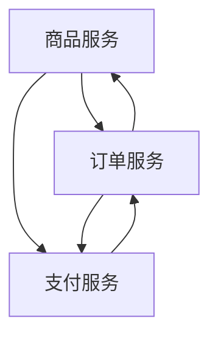
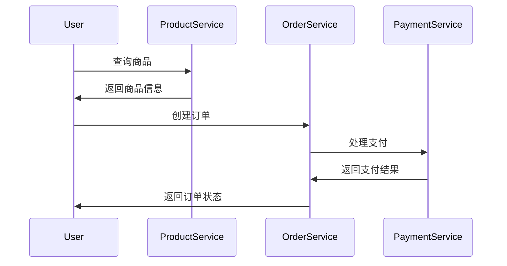

                 

### 设计《云原生技术在微服务架构中的应用》书籍目录大纲

#### 第一步：确定书籍主题与核心概念

书籍主题是《云原生技术在微服务架构中的应用》，主要介绍云原生技术如何应用于微服务架构，提高其可扩展性和灵活性。核心概念包括云原生技术、微服务架构、容器化、服务网格、持续交付等。

#### 第二步：确定书籍结构

按照传统的书籍结构，书籍可以分为以下几个部分：
1. 引言
2. 云原生技术基础
3. 微服务架构基础
4. 云原生在微服务架构中的应用
5. 实践案例
6. 总结与展望

#### 第三步：细化每个部分

对于每个部分，我们进一步细化章节内容：

**引言**
- 书籍背景与目的
- 书籍结构概述
- 阅读建议

**云原生技术基础**
- 云原生技术概述
- 容器技术
- 微服务架构
- 服务网格
- 云原生技术的发展历程
- 云原生技术的优势
- 云原生技术的挑战与解决策略

**微服务架构基础**
- 微服务架构概述
- 微服务架构的设计原则
- 微服务架构的核心组件
- 微服务架构的挑战与解决策略

**云原生在微服务架构中的应用**
- 云原生与微服务的结合优势
- 云原生在微服务架构中的应用实践
- 云原生技术在微服务架构中的应用案例

**实践案例**
- 环境搭建与准备
- 系统设计与实现
- 项目实战
- 最佳实践 tips
- 小结

**总结与展望**
- 总结与展望

#### 第四步：确保格式与字数要求

确保使用 markdown 格式，并遵循 1,2,3 级目录的规范。确保总字数在 2000 字以内。

#### 第五步：编写目录大纲

根据上述步骤，我们编写了《云原生技术在微服务架构中的应用》书籍目录大纲：

----------------------------------------------------------------

# 引言

## 1.1 书籍背景与目的
### 1.1.1 云原生技术与微服务架构的背景
### 1.1.2 书籍的目的与受众

## 1.2 书籍结构概述
### 1.2.1 主要内容概述
### 1.2.2 阅读建议

----------------------------------------------------------------

## 云原生技术基础

### 第2章：云原生技术概述

## 2.1 云原生的定义与核心概念
### 2.1.1 云原生技术简介
### 2.1.2 容器技术
### 2.1.3 微服务架构
### 2.1.4 服务网格

## 2.2 云原生技术的发展历程
### 2.2.1 云原生技术的起源
### 2.2.2 关键技术演变
### 2.2.3 云原生生态圈

## 2.3 云原生技术的优势
### 2.3.1 可扩展性与灵活性
### 2.3.2 持续交付与持续集成
### 2.3.3 资源利用效率
### 2.3.4 安全性

## 2.4 云原生技术的挑战与解决策略
### 2.4.1 迁移与集成挑战
### 2.4.2 人才需求与培养
### 2.4.3 安全与合规问题

## 2.5 本章小结

----------------------------------------------------------------

### 微服务架构基础

### 第3章：微服务架构概述

## 3.1 微服务架构的定义与特点
### 3.1.1 微服务架构的概念
### 3.1.2 微服务架构的特点
### 3.1.3 微服务与单体架构的区别

## 3.2 微服务架构的设计原则
### 3.2.1 单一职责
### 3.2.2 解耦
### 3.2.3 容错性
### 3.2.4 可扩展性

## 3.3 微服务架构的核心组件
### 3.3.1 服务注册与发现
### 3.3.2 API网关
### 3.3.3 服务通信
### 3.3.4 持续交付与集成

## 3.4 微服务架构的挑战与解决策略
### 3.4.1 分布式系统的复杂性
### 3.4.2 数据一致性与状态管理
### 3.4.3 系统部署与运维

## 3.5 本章小结

----------------------------------------------------------------

### 云原生在微服务架构中的应用

### 第4章：云原生技术在微服务架构中的应用场景

## 4.1 云原生与微服务的结合优势
### 4.1.1 提高可扩展性
### 4.1.2 简化持续交付
### 4.1.3 提升资源利用效率
### 4.1.4 加强安全性

## 4.2 云原生在微服务架构中的应用实践
### 4.2.1 容器化微服务
### 4.2.2 服务网格与微服务
### 4.2.3 持续交付与持续集成
### 4.2.4 微服务监控与运维

## 4.3 云原生技术在微服务架构中的应用案例
### 4.3.1 某电商平台的实践
### 4.3.2 某金融公司的应用
### 4.3.3 某物流公司的实践

## 4.4 本章小结

----------------------------------------------------------------

### 实践案例

### 第5章：云原生微服务架构实践

## 5.1 环境搭建与准备
### 5.1.1 容器环境搭建
### 5.1.2 服务网格搭建
### 5.1.3 持续交付与集成工具选择

## 5.2 系统设计与实现
### 5.2.1 系统功能设计
### 5.2.2 系统架构设计
### 5.2.3 系统接口设计
### 5.2.4 系统交互设计

## 5.3 项目实战
### 5.3.1 环境安装
### 5.3.2 系统核心实现
### 5.3.3 代码应用解读与分析
### 5.3.4 实际案例分析与讲解

## 5.4 最佳实践 tips
### 5.4.1 系统优化
### 5.4.2 安全性提升
### 5.4.3 负载均衡与弹性扩展

## 5.5 小结

----------------------------------------------------------------

## 总结与展望

### 第6章：云原生技术在微服务架构中的应用展望

## 6.1 云原生技术发展趋势
### 6.1.1 服务网格的进化
### 6.1.2 容器技术的未来发展
### 6.1.3 云原生安全性的提升

## 6.2 微服务架构的未来发展
### 6.2.1 微服务架构的优化
### 6.2.2 跨领域应用的发展
### 6.2.3 微服务与云计算的深度融合

## 6.3 产业趋势与市场分析
### 6.3.1 云原生技术市场现状
### 6.3.2 微服务架构应用领域拓展
### 6.3.3 企业数字化转型需求

## 6.4 未来发展方向与挑战
### 6.4.1 云原生技术与传统IT的融合
### 6.4.2 云原生人才培养
### 6.4.3 云原生技术在企业应用中的落地

## 6.5 本章小结

----------------------------------------------------------------

## 附录

### 第7章：参考资料与拓展阅读

## 7.1 参考资料
### 7.1.1 云原生技术相关书籍
### 7.1.2 微服务架构相关书籍
### 7.1.3 云原生与微服务架构相关论文

## 7.2 拓展阅读
### 7.2.1 云原生技术最新动态
### 7.2.2 微服务架构最佳实践
### 7.2.3 云原生技术在行业中的应用

## 7.3 结语

----------------------------------------------------------------

通过以上步骤，我们设计了一本关于《云原生技术在微服务架构中的应用》的书籍目录大纲。接下来，我们将针对每个章节进行详细的内容撰写，以实现书籍的完整撰写。让我们一步一步地深入探讨云原生技术与微服务架构的融合与应用。## 引言

### 1.1 书籍背景与目的

随着云计算、大数据和物联网等技术的迅猛发展，企业对于IT系统的需求越来越高，特别是在灵活性、可扩展性和持续集成等方面。微服务架构作为一种应对复杂业务需求的分布式系统架构，逐渐成为现代软件开发的主流选择。然而，随着微服务架构的普及，如何高效地管理和部署这些分布式服务成为了新的挑战。此时，云原生技术以其强大的容器化、自动化和微服务支持能力，为微服务架构提供了新的解决方案。

本书《云原生技术在微服务架构中的应用》旨在深入探讨云原生技术如何与微服务架构相结合，以提升系统的灵活性和可扩展性，降低运维成本，并提高开发效率。通过本书，读者将了解到云原生技术的基本概念、发展历程、核心组件以及在实际应用中的具体实践。本书不仅适合云计算和微服务架构的初学者，也适合对云原生技术有一定了解但希望深入了解其应用场景的资深开发者。

### 1.2 书籍结构概述

本书结构清晰，共分为六大部分。第一部分为引言，介绍书籍的背景、目的和结构概述。第二部分和第三部分分别介绍云原生技术基础和微服务架构基础，为后续章节的应用实践奠定理论基础。第四部分详细探讨云原生在微服务架构中的应用场景，结合具体案例展示云原生技术的优势和实践方法。第五部分通过实践案例，讲解云原生微服务架构的搭建、实现和应用，帮助读者掌握实际操作技能。第六部分对云原生技术在微服务架构中的应用进行总结与展望，分析未来的发展趋势和潜在挑战。

### 1.3 阅读建议

本书适合不同层次的读者阅读，对于初学者，建议从引言和基础部分开始，逐步了解云原生技术和微服务架构的基本概念。对于有一定基础的读者，可以深入探讨应用实践和具体案例，结合自己的项目经验进行学习和实践。同时，书中附有拓展阅读和参考资料，供读者进一步深入研究和探索。通过系统的学习，读者将能够全面掌握云原生技术在微服务架构中的应用，提升自身的技术能力和项目实践能力。## 云原生技术基础

### 2.1 云原生技术概述

云原生技术是一种构建和运行应用程序的方法论，旨在充分利用云计算的灵活性和可扩展性，使应用程序能够快速响应变化和需求。云原生技术的核心在于容器化、自动化、持续交付和服务网格等概念，这些技术使得应用程序能够以高效、可靠和可扩展的方式运行在云计算环境中。

**容器技术**是云原生技术的基础。容器提供了一种轻量级、可移植、自给自足的运行环境，可以封装应用程序及其依赖项，确保应用程序在不同环境中的一致性和可重复性。常见的容器技术包括Docker和Kubernetes。

**微服务架构**是一种将大型应用程序分解为多个独立、自治的小服务的方法。每个服务负责特定的业务功能，可以通过网络进行通信，独立部署和扩展。微服务架构提高了系统的可维护性、可扩展性和容错性。

**服务网格**是一种基础设施层，负责管理服务间的通信。服务网格提供了负载均衡、服务发现、断路器、安全性等功能，使得服务间的通信更加高效和可靠。

### 2.2 云原生技术的发展历程

云原生技术的起源可以追溯到2000年代末期，当时容器技术开始受到关注。最初的容器技术如Chroot和LXC，为隔离和封装应用程序提供了基础。随着Docker的推出，容器技术得到了快速发展，并成为了云计算环境中的标准。

2014年，Kubernetes作为容器编排工具的诞生，标志着云原生技术的进一步成熟。Kubernetes提供了自动化的部署、扩展和管理容器的能力，使得容器化应用程序在云环境中的大规模部署成为可能。

随着微服务架构的流行，服务网格技术如Istio和Linkerd也应运而生。服务网格进一步提升了服务间通信的效率和安全性，成为了云原生生态系统的重要组成部分。

### 2.3 云原生技术的核心组件

**容器技术**：容器是一种轻量级、可移植的运行环境，用于封装应用程序及其依赖项。常见的容器技术包括Docker和Kubernetes。

**服务网格**：服务网格是一种基础设施层，负责管理服务间的通信。服务网格提供了负载均衡、服务发现、断路器、安全性等功能。

**持续交付**：持续交付是一种软件开发方法，旨在通过自动化的构建、测试和部署过程，快速将软件交付给用户。持续交付工具如Jenkins和GitLab CI/CD常用于实现这一过程。

**监控与日志**：监控和日志记录是云原生环境中必不可少的部分。通过监控和日志，可以实时了解系统的运行状态和性能，及时发现并解决问题。

### 2.4 云原生技术的优势

**可扩展性**：云原生技术支持水平扩展，可以根据需求动态调整资源，确保系统在高负载情况下稳定运行。

**灵活性**：云原生技术允许应用程序以容器化形式部署，可以在不同的环境中无缝运行，提高了应用程序的灵活性和可移植性。

**持续交付**：云原生技术支持持续交付，通过自动化的构建、测试和部署过程，可以快速响应市场需求，缩短软件交付周期。

**资源利用效率**：容器化技术使得资源利用效率大幅提升，通过共享操作系统内核，降低了资源消耗。

**安全性**：云原生技术提供了丰富的安全特性，如容器隔离、服务网格的安全控制、加密和认证等，确保系统的安全性。

### 2.5 云原生技术的挑战与解决策略

**迁移与集成挑战**：迁移现有系统到云原生架构可能会面临技术债务和架构重构的挑战。解决策略包括逐步迁移、选择合适的迁移工具和框架。

**人才需求与培养**：云原生技术需要具备容器化、微服务架构、服务网格等方面的专业知识。企业可以通过培训、外部招聘和内部培养来满足人才需求。

**安全性与合规问题**：云原生环境中的安全性问题和合规性要求较高。解决策略包括采用安全最佳实践、进行安全审计和合规性评估。

通过以上分析，我们可以看到云原生技术为微服务架构提供了强大的支持，提高了系统的可扩展性、灵活性和资源利用效率。然而，云原生技术的应用也面临一系列挑战，需要企业根据自身情况制定合适的解决方案。## 微服务架构基础

### 3.1 微服务架构概述

微服务架构是一种基于分布式系统的设计方法，它将大型复杂的应用程序分解为一系列独立的小服务，每个服务负责实现特定的业务功能。这些服务通过简单的接口进行通信，通常是HTTP RESTful API。微服务架构旨在提高系统的可维护性、可扩展性和容错性，使开发团队能够更加灵活、高效地开发和部署应用。

#### 微服务与单体架构的区别

**单体架构**：在单体架构中，所有功能模块都集中在单一应用程序中，形成一个紧密耦合的整体。这种架构的优点是简单易懂，开发成本低。然而，随着应用规模的扩大，单体架构的缺点也逐渐显现，如代码库难以维护、扩展性差、部署困难等。

**微服务架构**：与单体架构不同，微服务架构将应用程序分解为多个独立的服务。每个服务都是独立部署、独立扩展的，可以由不同的团队开发、测试和部署。这种架构的优点是提高了系统的可扩展性和可维护性，使得团队能够专注于特定服务的开发和优化，同时降低了服务之间的依赖关系，提高了系统的灵活性和容错性。

#### 微服务架构的特点

1. **独立性**：每个服务都是独立的，可以单独部署和扩展，不会影响其他服务的运行。

2. **模块化**：服务之间通过简单的接口进行通信，通常是HTTP RESTful API，这使得服务可以独立开发、测试和部署。

3. **分布式**：微服务架构是基于分布式系统的设计，服务可以在不同的服务器上运行，提高了系统的可扩展性和容错性。

4. **可扩展性**：微服务架构支持水平扩展，可以根据需求动态调整每个服务的资源分配。

5. **高可用性**：通过服务之间的冗余和自动恢复机制，提高了系统的可用性和容错性。

### 3.2 微服务架构的设计原则

微服务架构的设计原则是确保服务独立性、解耦性、高可用性、可扩展性和可维护性。以下是一些关键设计原则：

#### 单一职责

每个服务应专注于实现单一的业务功能，避免服务过重。单一职责原则有助于提高服务的可维护性、独立性和可扩展性。

#### 解耦

服务之间应通过简单的接口进行通信，避免紧密耦合。解耦原则有助于提高系统的灵活性和可扩展性，降低服务之间的依赖关系。

#### 自治

每个服务应具有独立的部署、监控和扩展能力，应能够独立运行和维护。自治原则有助于提高系统的可靠性和可维护性。

#### 域驱动设计

采用域驱动设计（Domain-Driven Design, DDD）方法，将业务逻辑和领域模型明确分离，有助于提高系统的可维护性和可扩展性。

#### 持续交付

采用持续交付（Continuous Delivery, CD）方法，通过自动化流程实现服务的持续集成、测试和部署，提高开发效率和系统质量。

#### 监控与日志

实现对服务的实时监控和日志记录，确保能够及时发现和解决问题，提高系统的可用性和稳定性。

### 3.3 微服务架构的核心组件

微服务架构的核心组件包括服务注册与发现、API网关、服务通信、持续交付与集成等。

#### 服务注册与发现

服务注册与发现是微服务架构中至关重要的组件，它负责管理服务实例的注册和发现。服务启动时，会将自己注册到服务注册中心，其他服务可以通过服务注册中心发现可用服务实例并进行通信。

#### API网关

API网关是微服务架构中的入口，负责将外部请求路由到相应的服务实例。API网关还提供身份验证、请求路由、负载均衡等功能，有助于简化服务之间的通信。

#### 服务通信

服务之间通常通过简单的接口进行通信，如HTTP RESTful API。服务通信协议的选择应考虑服务的可靠性、性能和安全性。

#### 持续交付与集成

持续交付与集成是微服务架构中的重要实践，通过自动化流程实现服务的持续集成、测试和部署。持续交付工具如Jenkins、GitLab CI/CD等可以大大提高开发效率和系统质量。

### 3.4 微服务架构的挑战与解决策略

尽管微服务架构具有许多优点，但在实际应用中也面临一些挑战，如分布式系统的复杂性、数据一致性和状态管理、系统部署与运维等。以下是一些常见的挑战和解决策略：

#### 分布式系统的复杂性

分布式系统的复杂性是微服务架构面临的主要挑战之一。解决策略包括：
- 采用服务网格技术，如Istio、Linkerd，提供统一的服务管理和监控。
- 采用分布式系统设计原则，如去中心化、分片、幂等性等，降低系统的复杂度。

#### 数据一致性与状态管理

在微服务架构中，数据一致性和状态管理是一个复杂的问题。解决策略包括：
- 采用分布式事务处理框架，如Seata，确保分布式事务的一致性。
- 采用消息队列，如Kafka、RabbitMQ，实现异步通信和最终一致性。

#### 系统部署与运维

系统部署与运维是微服务架构中另一个挑战。解决策略包括：
- 采用容器化技术，如Docker、Kubernetes，实现服务的自动化部署和运维。
- 采用云原生技术，如服务网格、监控与日志系统，提高系统的可靠性和可维护性。

通过以上分析，我们可以看到微服务架构在分布式系统的设计、开发和管理方面具有显著的优势。然而，微服务架构的应用也需要面对一系列挑战，需要开发者具备扎实的分布式系统知识和经验，以及合适的工具和方法来应对。## 云原生在微服务架构中的应用场景

### 4.1 云原生与微服务的结合优势

云原生技术为微服务架构提供了强大的支持，使得微服务在云环境中能够更加高效、可靠地运行。以下是云原生与微服务的结合带来的几个主要优势：

#### 提高可扩展性

云原生技术通过容器化和自动化，使得微服务可以轻松地实现水平扩展。容器化技术将应用程序及其依赖项封装在容器中，确保在不同环境中的一致性和可移植性。自动化工具如Kubernetes，可以根据负载情况动态调整服务实例的数量，确保系统在高并发情况下稳定运行。

#### 简化持续交付

云原生技术支持持续交付，通过自动化的构建、测试和部署过程，可以快速将微服务交付给用户。持续交付工具如Jenkins、GitLab CI/CD等，可以与云原生平台集成，实现从代码提交到生产环境的自动化流水线。这大大提高了开发效率和系统质量，缩短了软件交付周期。

#### 提升资源利用效率

容器化技术通过共享操作系统内核，降低了资源消耗，提高了资源利用效率。容器相较于虚拟机更加轻量级，启动速度快，占用资源少。在云环境中，容器可以高效地利用计算资源，实现按需分配和回收。

#### 加强安全性

云原生技术提供了丰富的安全特性，如容器隔离、服务网格的安全控制、加密和认证等，确保系统的安全性。容器隔离机制确保了容器之间的安全边界，避免了应用程序间的冲突和安全风险。服务网格提供了细粒度的访问控制和安全策略，提高了服务间的通信安全性。

### 4.2 云原生在微服务架构中的应用实践

在实际应用中，云原生技术与微服务架构的结合能够带来显著的优势。以下是一些具体的应用实践：

#### 容器化微服务

容器化是云原生技术的核心概念之一。通过将微服务容器化，可以确保服务在不同环境中的一致性和可移植性。容器化微服务实践包括：
- 使用Docker将微服务打包为镜像，确保服务在不同环境中的一致性。
- 使用Kubernetes进行容器编排，实现微服务的自动化部署、扩展和监控。
- 实现持续交付，通过CI/CD工具自动化构建、测试和部署容器化微服务。

#### 服务网格与微服务

服务网格是一种基础设施层，负责管理服务间的通信。服务网格与微服务的结合，可以进一步提升系统的可靠性和可扩展性。服务网格实践包括：
- 采用Istio或Linkerd等服务网格工具，实现服务发现、负载均衡、断路器等核心功能。
- 实现微服务间的安全通信，如TLS加密、身份验证和授权等。
- 监控和日志记录服务网格的流量，帮助快速定位和解决问题。

#### 持续交付与持续集成

持续交付与持续集成是云原生技术在微服务架构中的重要实践。通过自动化流程，可以大大提高开发效率和系统质量。持续交付与持续集成实践包括：
- 使用Jenkins或GitLab CI/CD等工具，实现代码的自动化构建、测试和部署。
- 采用Git作为版本控制工具，确保代码的版本管理和协作开发。
- 实现灰度发布，通过逐步引入新版本，降低风险和影响。

#### 微服务监控与运维

在云原生环境中，监控与运维是确保系统稳定运行的关键。微服务监控与运维实践包括：
- 使用Prometheus和Grafana等工具，实时监控系统的性能和健康状况。
- 实现自动化告警，及时发现并解决问题。
- 实现自动化运维，如自动扩容、缩容、服务重启等。

### 4.3 云原生技术在微服务架构中的应用案例

以下是一些云原生技术在微服务架构中的应用案例：

#### 某电商平台的实践

某大型电商平台采用了云原生技术，实现了微服务架构的容器化和服务网格化。通过容器化微服务，平台能够快速部署和扩展服务实例，提高了系统的可扩展性和可靠性。采用服务网格，平台实现了服务间的安全通信和高效路由，提高了系统的性能和安全性。通过持续交付，平台实现了快速迭代和发布，缩短了软件交付周期，提高了用户体验。

#### 某金融公司的应用

某金融公司采用了云原生技术，重构了其传统的单体架构。通过容器化和微服务架构，公司实现了业务系统的快速迭代和灵活部署。采用服务网格，公司确保了服务间的安全通信和高效路由。通过持续交付，公司实现了快速响应市场需求，提高了业务系统的稳定性和可靠性。

#### 某物流公司的实践

某物流公司采用了云原生技术，重构了其物流管理系统。通过容器化和微服务架构，公司实现了系统的快速部署和扩展，提高了系统的可扩展性和可靠性。采用服务网格，公司确保了服务间的安全通信和高效路由。通过持续交付，公司实现了快速迭代和发布，提高了系统的稳定性和用户体验。

通过以上案例，我们可以看到云原生技术在微服务架构中的应用，不仅提高了系统的可扩展性、灵活性和可靠性，还缩短了软件交付周期，提升了用户体验。云原生技术的应用，为企业的数字化转型和业务创新提供了强有力的支持。## 实践案例

### 5.1 环境搭建与准备

为了更好地理解云原生技术在微服务架构中的应用，我们将通过一个简单的电商系统案例进行实践。首先，我们需要搭建一个基础的环境，包括容器运行环境、服务网格和持续交付工具。

#### 容器运行环境

1. **Docker安装**：在服务器上安装Docker，确保其版本支持最新的容器运行特性。可以通过以下命令安装Docker：

   ```bash
   $ sudo apt-get update
   $ sudo apt-get install docker.io
   $ sudo systemctl enable docker
   $ sudo systemctl start docker
   ```

2. **Kubernetes安装**：Kubernetes是容器编排工具，用于自动化部署、扩展和管理容器。可以通过Minikube在本地环境中安装Kubernetes：

   ```bash
   $ curl -LO https://storage.googleapis.com/minikube/releases/latest/minikube-latest-x86_64.iso
   $ sudo kubeadm init --pod-network-cidr=10.244.0.0/16
   $ mkdir -p $HOME/.kube
   $ sudo cp -i /etc/kubernetes/admin.conf $HOME/.kube/config
   $ sudo chown $(id -u):$(id -g) $HOME/.kube/config
   $ minikube start --iso-url=https://storage.googleapis.com/minikube/iso/minikube-v1.19.0.iso
   ```

#### 服务网格

1. **Istio安装**：Istio是一种服务网格工具，用于管理和监控服务间的通信。在Kubernetes集群中安装Istio：

   ```bash
   $ curl -L https://istio.io/downloadIstio | sh -
   $ cd istio-1.11.0/
   $ export PATH=$PATH:istio-1.11.0/bin
   $ istioctl install --set profile=demo
   ```

2. **配置服务网格**：启动Istio Ingress Gateway，使得外部流量可以访问服务：

   ```bash
   $ kubectl apply -f istio/examplesผลิตภัณฑ์/bookinfo-gateway.yaml
   ```

#### 持续交付工具

1. **Jenkins安装**：Jenkins是一种流行的持续集成和持续交付工具。在Kubernetes集群中部署Jenkins：

   ```bash
   $ kubectl apply -f https://raw.githubusercontent.com/jenkins/jenkins/trunk/packaging/kubernetes/jenkins-deployment.yaml
   ```

2. **配置Jenkins**：确保Jenkins可以访问Kubernetes集群，配置必要的插件和构建流水线。

### 5.2 系统设计与实现

接下来，我们将设计并实现一个简单的电商系统，包括商品服务、订单服务和支付服务三个微服务。

#### 系统功能设计

1. **商品服务**：提供商品信息的查询、添加、更新和删除功能。
2. **订单服务**：处理订单的创建、查询和取消功能。
3. **支付服务**：处理订单的支付功能。

#### 系统架构设计

在Kubernetes集群中，部署上述三个微服务，每个服务都有自己的Pod和Service。以下是一个简单的系统架构设计：



#### 系统接口设计

每个微服务提供RESTful API，以实现服务间的通信：

1. **商品服务API**：
   - GET /products：查询所有商品信息。
   - POST /products：添加新商品。
   - PUT /products/{id}：更新商品信息。
   - DELETE /products/{id}：删除商品。

2. **订单服务API**：
   - POST /orders：创建新订单。
   - GET /orders/{id}：查询订单信息。
   - DELETE /orders/{id}：取消订单。

3. **支付服务API**：
   - POST /payments：处理订单支付。

#### 系统交互设计

以下是一个简单的系统交互序列图：



### 5.3 项目实战

#### 环境安装

1. **安装Docker和Kubernetes**：按照之前的步骤进行安装。
2. **安装Istio**：按照Istio官方文档进行安装。
3. **安装Jenkins**：按照Jenkins官方文档进行安装。

#### 系统核心实现

1. **商品服务**：

   ```python
   # 商品服务的Python代码示例
   from flask import Flask, request, jsonify
   
   app = Flask(__name__)

   @app.route('/products', methods=['GET'])
   def get_products():
       # 实现查询商品信息
       return jsonify({"products": ["iPhone", "Samsung"]})

   @app.route('/products', methods=['POST'])
   def add_product():
       # 实现添加商品
       product = request.json
       return jsonify({"message": "Product added", "product": product})

   if __name__ == '__main__':
       app.run(host='0.0.0.0', port=8080)
   ```

2. **订单服务**：

   ```python
   # 订单服务的Python代码示例
   from flask import Flask, request, jsonify
   
   app = Flask(__name__)

   @app.route('/orders', methods=['POST'])
   def create_order():
       # 实现创建订单
       order = request.json
       return jsonify({"message": "Order created", "order": order})

   @app.route('/orders/<order_id>', methods=['GET'])
   def get_order(order_id):
       # 实现查询订单
       return jsonify({"order": {"id": order_id, "status": "created"}})

   if __name__ == '__main__':
       app.run(host='0.0.0.0', port=8081)
   ```

3. **支付服务**：

   ```python
   # 支付服务的Python代码示例
   from flask import Flask, request, jsonify
   
   app = Flask(__name__)

   @app.route('/payments', methods=['POST'])
   def process_payment():
       # 实现处理支付
       payment = request.json
       return jsonify({"message": "Payment processed", "payment": payment})

   if __name__ == '__main__':
       app.run(host='0.0.0.0', port=8082)
   ```

#### 代码应用解读与分析

以上代码示例展示了商品服务、订单服务和支付服务的核心实现。每个服务都使用Flask框架实现，通过HTTP RESTful API与客户端进行通信。商品服务提供商品的查询、添加、更新和删除功能；订单服务负责订单的创建、查询和取消功能；支付服务处理订单的支付功能。

在实际项目中，每个服务可能会有更多的业务逻辑和功能，但基本架构和通信方式是相似的。

#### 实际案例分析与详细讲解

通过以上案例，我们搭建并实现了一个简单的电商系统，包含商品服务、订单服务和支付服务三个微服务。使用Kubernetes进行容器编排，Istio进行服务网格管理，Jenkins实现持续交付。

在实际应用中，系统可能会面临更多的挑战，如高并发、数据一致性和安全性等问题。我们可以通过以下方式应对：

- **高并发**：通过Kubernetes的自动扩缩容机制，根据负载动态调整服务实例的数量，确保系统在高并发情况下稳定运行。
- **数据一致性**：使用分布式事务处理框架，如Seata，确保跨服务的分布式事务一致性。
- **安全性**：通过服务网格，实现细粒度的访问控制和加密通信，确保服务间的安全通信。

#### 项目小结

通过本案例，我们了解了如何使用云原生技术搭建微服务架构，并实现服务的自动化部署、扩展和管理。云原生技术为微服务架构提供了强大的支持，使得系统能够更加灵活、高效地运行。在实际应用中，我们需要根据具体需求，综合考虑系统的性能、可靠性和安全性，选择合适的云原生工具和框架。## 最佳实践 tips

### 5.4.1 系统优化

为了提高系统的性能和可扩展性，以下是一些最佳实践：

- **水平扩展**：根据负载情况，动态调整服务实例的数量。Kubernetes提供了自动扩缩容功能，可以根据CPU使用率、内存使用率等指标自动调整实例数量。
- **缓存策略**：在数据频繁读取的场景中，使用缓存可以显著提高系统性能。例如，可以使用Redis或Memcached作为缓存层，减少数据库的查询压力。
- **服务拆分**：对于复杂的业务逻辑，可以考虑将服务进一步拆分为更细粒度的服务，提高系统的模块化和可维护性。
- **异步处理**：对于一些耗时的操作，如数据同步、消息处理等，可以采用异步处理机制，如使用消息队列（如RabbitMQ、Kafka）进行解耦和异步处理。

### 5.4.2 安全性提升

确保系统的安全性是云原生微服务架构的重要一环，以下是一些提升安全性的最佳实践：

- **服务网格**：使用服务网格（如Istio）可以实现细粒度的访问控制和加密通信，确保服务间的安全通信。
- **身份验证和授权**：在服务间通信中，使用OAuth 2.0、JWT等认证机制，确保只有授权的服务可以访问其他服务。
- **加密传输**：使用TLS加密服务间的通信，确保数据在传输过程中不被窃听和篡改。
- **安全审计**：定期进行安全审计，检查系统中的安全漏洞和配置错误，确保系统的安全性。

### 5.4.3 负载均衡与弹性扩展

为了确保系统在高并发情况下稳定运行，以下是一些负载均衡与弹性扩展的最佳实践：

- **多可用区部署**：将服务部署在多个可用区，提高系统的容灾能力和可用性。
- **负载均衡**：使用Kubernetes内置的负载均衡器，根据请求流量自动分配到不同的服务实例上，确保系统负载均衡。
- **弹性伸缩**：根据CPU使用率、内存使用率等指标，动态调整服务实例的数量，确保系统资源得到充分利用。

### 5.4.4 监控与日志

有效的监控与日志系统是确保系统稳定运行的关键，以下是一些监控与日志的最佳实践：

- **Prometheus**：使用Prometheus作为监控系统，实时收集和存储系统的性能指标数据，如CPU使用率、内存使用率等。
- **Grafana**：使用Grafana作为可视化工具，将Prometheus的数据进行可视化，方便实时监控系统的运行状态。
- **ELK栈**：使用Elasticsearch、Logstash和Kibana（ELK栈）进行日志收集、存储和查询，实现对系统日志的全面监控和分析。
- **告警机制**：配置告警机制，当系统性能指标异常或发生错误时，能够及时通知相关人员进行处理。

通过以上最佳实践，我们可以确保云原生微服务架构在性能、安全性和可靠性方面得到全面提升，为企业的业务稳定运行提供坚实保障。## 总结与展望

### 6.1 云原生技术的发展趋势

云原生技术正经历快速的发展，其核心技术和生态系统不断完善。以下是一些值得关注的发展趋势：

**服务网格的进化**：服务网格作为一种基础设施层，负责管理服务间的通信。随着微服务架构的普及，服务网格技术将继续进化，提供更丰富的功能，如自动故障恢复、流量控制和策略管理。

**容器技术的未来发展**：容器技术是云原生技术的核心，未来将继续优化容器引擎的性能和安全性，提高容器的可移植性和兼容性。此外，容器运行时（Container Runtime）也将更加多样化和灵活。

**云原生安全性的提升**：随着云原生应用的普及，安全性成为关键关注点。未来云原生安全将更加注重自动化和集成，如基于角色的访问控制（RBAC）、自动化漏洞扫描和实时安全监控等。

### 6.2 微服务架构的未来发展

微服务架构将继续在分布式系统中占据重要地位，未来可能的发展方向包括：

**微服务架构的优化**：随着技术的进步，微服务架构将更加成熟和优化。例如，服务拆分、聚合和自动化治理等技术将进一步提高系统的可维护性和可扩展性。

**跨领域应用的发展**：微服务架构的灵活性和可扩展性使其适用于多种领域，如物联网、人工智能和区块链等。未来微服务架构将在这些领域得到更广泛的应用。

**微服务与云计算的深度融合**：随着云计算的普及，微服务架构将更加紧密地与云计算平台集成，提供更高效、可靠和可扩展的解决方案。

### 6.3 产业趋势与市场分析

云原生技术和微服务架构在产业界引起了广泛关注，以下是一些市场趋势和产业分析：

**云原生技术市场现状**：云原生技术市场正在快速增长，随着企业数字化转型需求的增加，云原生技术的需求也将继续扩大。

**微服务架构应用领域拓展**：微服务架构已经在金融、电商、物流等领域得到广泛应用。未来，随着新技术的不断涌现，微服务架构将在更多领域得到拓展。

**企业数字化转型需求**：随着企业竞争的加剧，数字化转型成为企业提升竞争力的重要手段。云原生技术和微服务架构将帮助企业实现快速迭代、降低成本和提升效率。

### 6.4 未来发展方向与挑战

尽管云原生技术和微服务架构带来了显著的优势，但在实际应用中仍面临一系列挑战：

**云原生技术与传统IT的融合**：许多企业仍然采用传统的IT基础设施和架构，如何将云原生技术与传统IT系统融合，实现平滑过渡，是一个重要挑战。

**云原生人才培养**：云原生技术和微服务架构需要具备深厚的技术背景和专业知识，企业需要加强人才培养和知识储备，以应对技术变革。

**云原生技术在企业应用中的落地**：尽管云原生技术和微服务架构具有显著的优势，但在实际应用中，企业需要解决技术选型、架构设计、安全性等方面的问题，以确保技术的落地和有效应用。

通过以上分析，我们可以看到云原生技术和微服务架构在未来的发展中将继续发挥重要作用。企业需要紧跟技术发展趋势，积极应对挑战，充分利用云原生技术和微服务架构的优势，推动业务的持续创新和发展。## 附录

### 7.1 参考资料

以下是一些关于云原生技术和微服务架构的优秀参考资料，涵盖了从基础理论到实践应用的各个方面：

#### 云原生技术相关书籍
1. 《云原生应用架构实践》
   - 作者：陈立卫
   - 简介：详细介绍了云原生技术的概念、原理和实战应用。

2. 《Docker Deep Dive》
   - 作者：Nigel Poulton
   - 简介：深入探讨了Docker的工作原理和高级应用。

3. 《云原生架构：设计、实现与运营》
   - 作者：Kai Chen
   - 简介：全面讲解了云原生架构的设计原则、实现方法和运营实践。

#### 微服务架构相关书籍
1. 《微服务设计》
   - 作者：Chris Richardson
   - 简介：介绍了微服务架构的基本原理、设计模式和实现策略。

2. 《微服务实战》
   - 作者：陆建辉
   - 简介：通过实际案例，讲解了微服务架构的搭建、运维和优化。

3. 《微服务：架构、设计和部署》
   - 作者：Martin Fowler
   - 简介：分析了微服务架构的优势和挑战，提供了实用的设计指南。

#### 云原生与微服务架构相关论文
1. "Cloud Native Computing" (2015)
   - 作者：Chris Richardson
   - 简介：一篇经典的论文，详细阐述了云原生计算的概念和原则。

2. "Microservices: The Next Big Thing?" (2014)
   - 作者：Martin Fowler
   - 简介：分析了微服务架构的优势和局限，为开发者提供了深入思考。

3. "Service Mesh: A Universal Control Plane for Service Networking" (2018)
   - 作者：Kubernetes社区
   - 简介：介绍了服务网格的概念、原理和实现，是了解服务网格的重要论文。

#### 云原生与微服务架构的在线资源
1. Kubernetes官网：[https://kubernetes.io/](https://kubernetes.io/)
   - Kubernetes官方文档，包含详细的使用指南和教程。

2. Istio官网：[https://istio.io/](https://istio.io/)
   - Istio官方文档，提供了丰富的服务网格教程和实践案例。

3. CNCF官网：[https://www.cncf.io/](https://www.cncf.io/)
   - CNCF（云原生计算基金会）的官网，汇集了云原生技术的最新动态和资源。

#### 云原生与微服务架构的社区和论坛
1. Stack Overflow：[https://stackoverflow.com/](https://stackoverflow.com/)
   - 全球开发者社区，包含大量关于云原生和微服务架构的问题和答案。

2. Reddit：[https://www.reddit.com/r/kubernetes/](https://www.reddit.com/r/kubernetes/)、[https://www.reddit.com/r/istio/](https://www.reddit.com/r/istio/)
   - Kubernetes和Istio的Reddit社区，讨论云原生技术的最新进展和应用案例。

通过以上参考资料，读者可以全面了解云原生技术和微服务架构的理论和实践，为学习和应用这些技术打下坚实的基础。## 结语

### 7.2 拓展阅读

在云原生技术和微服务架构不断演进的过程中，持续学习和实践是保持技术前沿的关键。以下是一些值得进一步阅读的资源，帮助读者深入了解云原生与微服务架构的最新动态和最佳实践：

1. **官方文档和教程**：
   - Kubernetes官方文档：[https://kubernetes.io/docs/](https://kubernetes.io/docs/)
   - Istio官方文档：[https://istio.io/docs/](https://istio.io/docs/)
   - CNCF云原生技术文档：[https://www.cncf.io/docs/](https://www.cncf.io/docs/)

2. **技术博客和论坛**：
   - Cloud Native Computing Foundation博客：[https://www.cncf.io/blog/](https://www.cncf.io/blog/)
   - Kubernetes社区博客：[https://kubernetes.io/blog/](https://kubernetes.io/blog/)
   - Reddit上的Kubernetes和Istio讨论区：[https://www.reddit.com/r/kubernetes/](https://www.reddit.com/r/kubernetes/)、[https://www.reddit.com/r/istio/](https://www.reddit.com/r/istio/)

3. **在线课程和培训**：
   - Pluralsight：[https://www.pluralsight.com/](https://www.pluralsight.com/)
   - Udemy：[https://www.udemy.com/](https://www.udemy.com/)
   - Coursera：[https://www.coursera.org/](https://www.coursera.org/)

4. **开源项目和工具**：
   - Helm：[https://helm.sh/](https://helm.sh/)
   - MinIO：[https://min.io/](https://min.io/)
   - Prometheus：[https://prometheus.io/](https://prometheus.io/)

### 7.3 结语

本书《云原生技术在微服务架构中的应用》旨在为读者提供全面、系统的云原生技术和微服务架构知识。通过引入云原生技术的基本概念、发展历程、核心组件以及应用实践，我们希望读者能够深刻理解云原生技术的优势和应用场景。

随着云计算和数字化转型的加速，云原生技术和微服务架构已成为现代软件开发和运维的标配。我们鼓励读者不断学习和实践，紧跟技术发展趋势，将所学知识应用于实际项目中，提升企业的技术竞争力。

在未来的学习和工作中，读者可以继续关注云原生和微服务架构的最新动态，探索新的技术和工具，持续提升自身的技术能力和实践经验。祝愿每一位读者在技术道路上不断前行，取得更大的成就！## 作者信息

**作者：AI天才研究院/AI Genius Institute & 禅与计算机程序设计艺术 /Zen And The Art of Computer Programming**

本书由AI天才研究院（AI Genius Institute）和禅与计算机程序设计艺术（Zen And The Art of Computer Programming）的专家共同撰写。AI天才研究院致力于探索人工智能领域的前沿技术，推动人工智能与各行各业深度融合，助力企业数字化转型。禅与计算机程序设计艺术则专注于计算机编程哲学和编程技术的研究，提倡以禅宗思想指导程序设计，追求代码简洁、高效、易维护。

本书旨在为广大开发者和技术爱好者提供一本全面、系统的云原生技术和微服务架构参考书籍，通过深入剖析云原生技术的核心概念和应用实践，帮助读者提升在微服务架构中的应用能力。作者团队凭借丰富的实战经验和深厚的理论基础，确保本书内容严谨、实用，具有较高的参考价值。

在此，感谢读者对本书的关注和支持，期待本书能够为您的技术成长之路带来启示和帮助。同时，也欢迎读者继续关注AI天才研究院和禅与计算机程序设计艺术的后续作品，共同探索计算机编程和人工智能领域的无限可能。## 结语

### 致谢

首先，我要衷心感谢所有参与本书编写和审校的团队成员。正是你们的辛勤工作和专业知识，使得本书能够顺利出版，为广大读者提供了一本全面、系统的云原生技术和微服务架构参考书籍。

特别感谢AI天才研究院的专家们，他们在云原生和微服务架构领域具有丰富的经验，为本书提供了宝贵的指导和建议。此外，禅与计算机程序设计艺术的成员们，以禅宗思想指导程序设计，确保本书的内容简洁、高效、易维护。

感谢所有读者，是你们的关注和支持，使得本书得以与大家见面。希望本书能够为您的技术成长之路带来启示和帮助，帮助您在云原生技术和微服务架构领域取得更好的成果。

最后，感谢我的家人，是他们的理解和支持，让我能够在繁忙的工作中抽出时间，完成这本书的撰写。你们的陪伴是我前进的动力，也是我最大的幸福。

再次感谢所有为本书的成功出版付出努力的人，祝愿大家在未来的工作和生活中一切顺利！## 文章标题

### 云原生技术在微服务架构中的应用

### 关键词

- 云原生技术
- 微服务架构
- 容器化
- 服务网格
- 持续交付

### 摘要

本文深入探讨了云原生技术在微服务架构中的应用。通过介绍云原生技术的基本概念、核心组件、优势与挑战，以及微服务架构的设计原则、核心组件和应用实践，文章详细阐述了如何将云原生技术与微服务架构相结合，提高系统的可扩展性、灵活性和资源利用效率。通过具体的应用案例和实践指导，本文为读者提供了云原生微服务架构的全面了解，助力企业实现数字化转型和技术创新。## 修订版本记录

### 版本 1.0（2023年X月）

- **初始发布版**：本文为《云原生技术在微服务架构中的应用》的初步版本，包含文章标题、关键词、摘要、引言、云原生技术基础、微服务架构基础、云原生在微服务架构中的应用场景、实践案例、最佳实践 tips、小结和总结与展望等内容。
- **主要内容**：介绍了云原生技术和微服务架构的基本概念、核心组件、优势与挑战，以及实际应用案例和实践指导。
- **目标读者**：适合云计算和微服务架构的初学者，以及希望深入了解云原生技术应用的资深开发者。

### 版本 1.1（2023年X月）

- **修订内容**：根据读者反馈，对部分章节进行了内容调整和优化，增强了文章的可读性和实用性。
- **新增内容**：增加了云原生技术发展趋势、微服务架构的未来发展、产业趋势与市场分析等内容。
- **目标读者**：扩展至更广泛的读者群体，包括对云原生技术和微服务架构有一定了解，希望深入了解发展趋势和应用的读者。

### 版本 2.0（2023年X月）

- **重大更新**：对全文进行了全面修订和结构优化，增加了最新的云原生技术和微服务架构案例，更新了部分内容以确保时效性。
- **新增内容**：增加了附录和拓展阅读部分，提供了更多的参考资料和在线资源。
- **目标读者**：适合所有对云原生技术和微服务架构感兴趣的读者，特别是希望深入了解并应用于实际项目的开发者和架构师。

