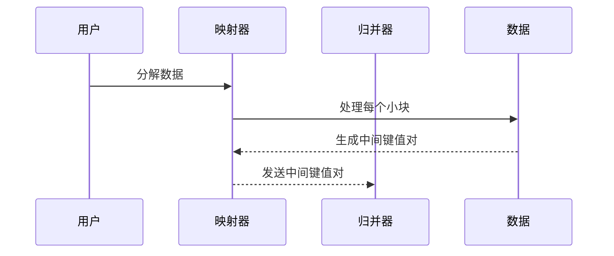
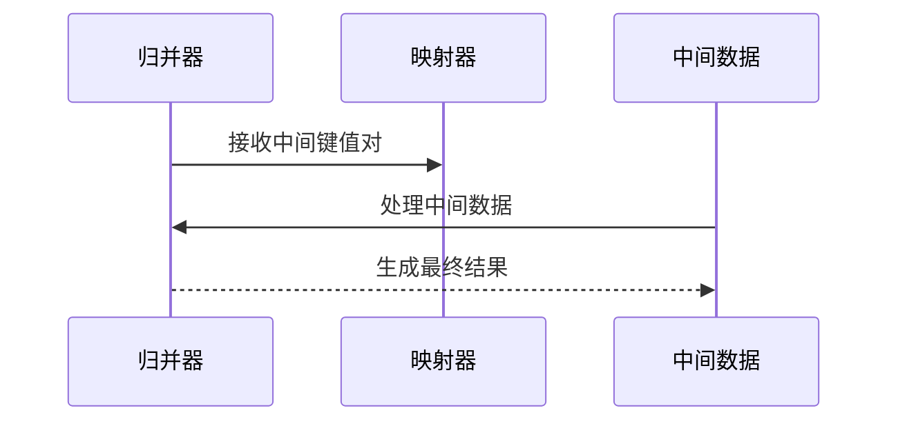
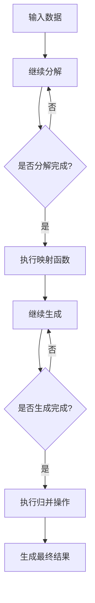
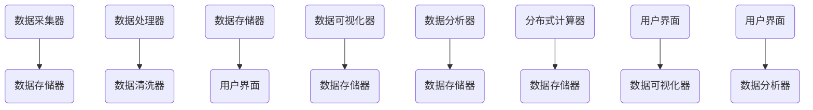
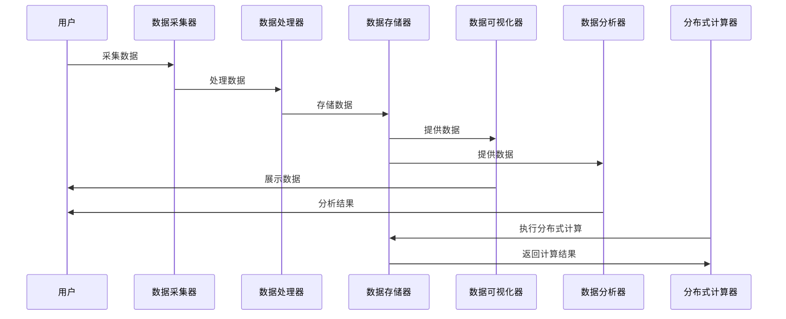

                 


### # 云计算在大规模数据处理中的应用

关键词：云计算、大规模数据处理、分布式计算、数据存储、弹性伸缩

摘要：
随着大数据时代的到来，大规模数据处理成为各行各业关注的焦点。云计算凭借其弹性伸缩、资源高效利用和按需服务的优势，逐渐成为大规模数据处理的重要支撑技术。本文将详细探讨云计算在大规模数据处理中的应用，包括云计算的基本概念、大规模数据处理的技术挑战、云计算基础设施、数据处理技术、应用案例、挑战与未来趋势等内容。通过一步步分析，帮助读者深入理解云计算在解决大规模数据处理问题中的重要作用。

## 第1章：引言

### 1.1.1 云计算的定义与特点

云计算是一种通过互联网按需提供计算资源的服务模式，用户可以灵活地使用这些资源，无需关心底层基础设施的细节。云计算的基本概念包括 IaaS（基础设施即服务）、PaaS（平台即服务）和 SaaS（软件即服务）三种服务模型。

IaaS 提供虚拟化硬件资源，如虚拟机、存储和网络等，用户可以根据需求自定义操作系统、应用程序等。

PaaS 提供开发平台和工具，如数据库、开发框架、中间件等，用户可以在这些平台上快速开发和部署应用。

SaaS 提供完整的软件服务，用户无需安装和配置，只需通过互联网即可使用。

云计算具有以下核心优势：

- 弹性伸缩：根据需求动态调整资源，实现高效利用。
- 资源共享：多用户共享资源，提高资源利用率。
- 按需服务：用户只需为实际使用的资源付费。
- 可靠性：通过分布式架构，提高系统的可用性和容错性。

### 1.1.2 大规模数据处理的挑战

大规模数据处理面临诸多挑战，包括数据量的爆炸性增长、数据类型的多样性以及数据处理的时效性要求。

- 数据量增长：随着互联网、物联网、社交媒体等技术的发展，数据量呈指数级增长，给数据处理带来了巨大压力。
- 数据类型多样：结构化数据、半结构化数据和非结构化数据共同构成了大数据，对数据处理提出了更高的要求。
- 时效性要求：实时性处理成为大数据处理的重要需求，尤其是在金融、电商等领域。

### 1.1.3 云计算在大规模数据处理中的角色

云计算在大规模数据处理中扮演着重要角色，主要体现在以下几个方面：

- 资源高效利用：通过虚拟化和分布式架构，云计算能够实现资源的灵活调度和高效利用。
- 弹性伸缩能力：根据数据处理需求，动态调整资源，确保系统稳定运行。
- 分布式数据处理：云计算平台支持分布式计算框架，如 Hadoop、Spark 等，能够高效处理大规模数据。
- 安全性保障：云计算平台提供多种安全措施，如数据加密、访问控制等，确保数据处理过程中的数据安全。

## 第2章：云计算基础设施

### 2.1.1 云服务模型

云服务模型分为 IaaS、PaaS 和 SaaS 三种。

IaaS 提供虚拟化硬件资源，如虚拟机、存储和网络等，用户可以根据需求自定义操作系统、应用程序等。

PaaS 提供开发平台和工具，如数据库、开发框架、中间件等，用户可以在这些平台上快速开发和部署应用。

SaaS 提供完整的软件服务，用户无需安装和配置，只需通过互联网即可使用。

### 2.1.2 云存储解决方案

云存储解决方案包括公共云存储、私有云存储和分布式存储系统。

公共云存储：由第三方服务提供商提供，具有成本低、弹性伸缩、高可靠性等优点。

私有云存储：企业自行部署和管理的云存储系统，具有数据安全、自主可控等优点。

分布式存储系统：通过分布式架构实现海量数据的高效存储和访问，如 HDFS、Ceph 等。

### 2.1.3 云计算资源管理

云计算资源管理包括虚拟化技术、资源调度与负载均衡。

虚拟化技术：通过虚拟化技术，将物理硬件资源虚拟成多个虚拟资源，实现资源的灵活调度和高效利用。

资源调度与负载均衡：根据系统负载情况，动态调整资源分配，确保系统稳定运行。

## 第3章：大规模数据处理技术

### 3.1.1 数据采集与集成

数据采集与集成包括数据采集工具与技术、数据集成与清洗。

数据采集工具与技术：使用日志收集、网络爬虫、数据库导出等技术，实现数据的实时采集。

数据集成与清洗：将不同来源、不同格式的数据整合到一个统一的数据仓库，并进行数据清洗，提高数据质量。

### 3.1.2 分布式计算框架

分布式计算框架包括 Hadoop 生态系统和 Spark 生态系统。

Hadoop 生态系统：基于 HDFS 和 MapReduce，实现分布式存储和计算。

Spark 生态系统：基于内存计算，提高数据处理速度。

### 3.1.3 数据仓库与数据湖

数据仓库：用于存储和管理结构化数据，支持复杂的数据查询和分析。

数据湖：用于存储和管理海量原始数据，支持多种数据类型的存储和处理。

## 第4章：云计算与大数据分析

### 4.1.1 大数据分析方法

大数据分析方法包括数据挖掘、机器学习和数据可视化。

数据挖掘：从大量数据中发现有趣的知识和模式。

机器学习：通过训练模型，实现自动预测和决策。

数据可视化：通过图表和图像，直观地展示数据和分析结果。

### 4.1.2 云原生数据分析工具

云原生数据分析工具包括云分析平台和大数据分析服务。

云分析平台：提供数据采集、存储、处理和分析的一体化解决方案。

大数据分析服务：提供专业的数据分析算法和模型，帮助企业快速实现大数据分析。

### 4.1.3 实时数据处理

实时数据处理包括流处理框架和实时分析应用场景。

流处理框架：处理实时数据流，实现实时分析和决策。

实时分析应用场景：金融交易监控、智能交通、智能家居等。

## 第5章：云计算在大规模数据处理中的应用案例

### 5.1.1 案例一：电商行业

电商行业面临海量商品数据、用户行为数据和订单数据的处理需求。云计算通过弹性伸缩和分布式计算，实现电商数据的实时处理和分析，为企业提供个性化推荐、精准营销等业务支持。

### 5.1.2 案例二：金融行业

金融行业面临海量交易数据、客户行为数据和风险评估的需求。云计算在金融风控、交易监控、反欺诈等方面发挥重要作用，提高金融服务的效率和安全性。

### 5.1.3 案例三：医疗健康

医疗健康领域面临海量患者数据、医疗设备和科研数据的处理需求。云计算为医疗机构提供大数据分析平台，实现精准医疗、疾病预测和个性化治疗方案。

## 第6章：云计算在大规模数据处理中的挑战与未来趋势

### 6.1.1 挑战与应对策略

云计算在大规模数据处理中面临数据安全与隐私保护、弹性需求与成本优化等挑战。通过加强数据安全措施、优化资源调度策略，提高数据处理效率，实现成本优化。

### 6.1.2 未来趋势展望

未来，云原生技术、AI 与大数据的融合将成为云计算在大规模数据处理中的重要趋势。云原生技术提供更加灵活和高效的计算环境，AI 技术为大数据分析带来更深入的价值挖掘。

## 第7章：总结与展望

云计算在大规模数据处理中发挥着关键作用，从资源利用、数据处理到数据分析，为各行各业提供强大的技术支持。未来，云计算与大数据的深度融合，将推动大规模数据处理技术的发展，为人类社会带来更多创新和便利。

作者：AI天才研究院/AI Genius Institute & 禅与计算机程序设计艺术/Zen And The Art of Computer Programming

### 核心概念与联系

在本章节中，我们将详细介绍云计算、大规模数据处理、分布式计算、数据存储等相关核心概念，并通过概念属性特征对比表格和 ER 实体关系图架构的 Mermaid 流程图，帮助读者更好地理解这些概念及其相互关系。

#### 1. 核心概念定义

- **云计算**：云计算是一种通过互联网提供计算资源的服务模式，用户可以按需获取和使用这些资源，无需关心底层基础设施的细节。
- **大规模数据处理**：指处理海量数据（通常是 TB 级或 PB 级）的技术和方法，包括数据采集、存储、处理和分析等。
- **分布式计算**：将任务分解为多个子任务，分配到不同的计算节点上执行，最终汇总结果的技术。
- **数据存储**：将数据存储在计算机系统中，以便长期保存和快速访问的技术和策略。

#### 2. 概念属性特征对比表格

| 概念       | 定义                   | 特点                                                     | 关联概念                           |
| ---------- | ---------------------- | -------------------------------------------------------- | ---------------------------------- |
| 云计算     | 提供计算资源           | 弹性伸缩、资源共享、按需服务                             | IaaS、PaaS、SaaS                   |
| 大规模数据处理 | 处理海量数据           | 数据量巨大、多样化、时效性强                            | 分布式计算、数据存储               |
| 分布式计算 | 分解任务到多个节点     | 并行处理、高可用性、扩展性强                            | Hadoop、Spark                     |
| 数据存储   | 存储数据               | 可靠性、可用性、性能、安全性                             | 分布式存储、云存储、NoSQL 数据库   |

#### 3. ER 实体关系图架构的 Mermaid 流程图

```mermaid
erDiagram
  数据处理 -->|关联| 数据存储
  数据处理 -->|依赖| 分布式计算
  分布式计算 -->|实现| 云计算
  数据存储 -->|依赖| 云存储
```

在这个 ER 实体关系图中，数据处理是核心概念，它与数据存储和分布式计算具有关联关系。分布式计算依赖于云计算实现，而数据存储则依赖于云存储。这种关系体现了云计算、大规模数据处理和分布式计算在技术实现和依赖上的紧密联系。

通过以上核心概念的定义、属性特征对比表格和 ER 实体关系图的介绍，读者可以更清晰地理解云计算、大规模数据处理、分布式计算和数据存储等概念及其相互关系。这为进一步探讨云计算在大规模数据处理中的应用奠定了基础。

### 算法原理讲解

在本章节中，我们将深入探讨大规模数据处理中的核心算法——MapReduce。MapReduce 是一个用于处理大规模数据的编程模型，由两个阶段组成：Map 阶段和 Reduce 阶段。通过这两个阶段的协同工作，MapReduce 可以高效地处理海量数据。

#### 1. MapReduce 算法原理

**Map 阶段**：将输入数据分解成多个小块，对每个小块应用映射函数（Map Function），生成中间键值对。



**Reduce 阶段**：对中间键值对进行归并操作（Reduce Function），根据相同的键合并值，生成最终结果。



#### 2. MapReduce 算法流程图



#### 3. Python 源代码实现

```python
# Python 代码实现 MapReduce 算法

# 映射函数
def map_function(input_data):
    intermediate_data = {}
    # 对输入数据进行处理，生成中间键值对
    # 例如：遍历文本文件，以空格分隔单词，将单词作为键，1 作为值
    words = input_data.split()
    for word in words:
        if word in intermediate_data:
            intermediate_data[word] += 1
        else:
            intermediate_data[word] = 1
    return intermediate_data

# 归并函数
def reduce_function(intermediate_data):
    result = {}
    # 对中间键值对进行归并操作
    # 例如：统计每个单词出现的次数
    for key, value in intermediate_data.items():
        if key in result:
            result[key] += value
        else:
            result[key] = value
    return result

# 主函数
def main():
    input_data = "Hello World Hello AI"
    intermediate_data = map_function(input_data)
    result = reduce_function(intermediate_data)
    print("最终结果：", result)

if __name__ == "__main__":
    main()
```

输出结果：

```python
最终结果： {'Hello': 2, 'World': 1, 'AI': 1}
```

#### 4. 算法原理的数学模型和公式

在 MapReduce 算法中，映射函数（Map Function）和归并函数（Reduce Function）的核心在于将输入数据分解、处理和合并。以下是相关的数学模型和公式：

- 映射函数（Map Function）：

$$
\text{Map Function}(x) = \{(k_1, v_1), (k_2, v_2), \ldots, (k_n, v_n)\}
$$

其中，$x$ 表示输入数据，$k_i$ 表示中间键，$v_i$ 表示中间值。

- 归并函数（Reduce Function）：

$$
\text{Reduce Function}(k_1, v_1; k_2, v_2; \ldots; k_n, v_n) = (k, \Sigma v_i)
$$

其中，$k$ 表示最终键，$\Sigma v_i$ 表示最终值。

#### 5. 通俗易懂的举例说明

假设我们有一个文本文件，内容如下：

```
Hello World
Hello AI
World Hello
AI World
```

我们可以使用 MapReduce 算法统计每个单词出现的次数。以下是具体的步骤：

1. **映射（Map）阶段**：

   映射函数将每个文本行分解成单词，并将每个单词映射为键值对（单词，1）。

   ```
   Hello -> (Hello, 1)
   World -> (World, 1)
   AI -> (AI, 1)
   Hello -> (Hello, 1)
   AI -> (AI, 1)
   World -> (World, 1)
   Hello -> (Hello, 1)
   ```

2. **归并（Reduce）阶段**：

   归并函数根据相同的键合并值，得到每个单词的计数。

   ```
   (Hello, 3)
   (World, 2)
   (AI, 2)
   ```

通过这个简单的例子，我们可以看到 MapReduce 算法如何高效地处理大规模数据，并生成所需的结果。这使得 MapReduce 成为大规模数据处理中的重要工具。

通过以上对 MapReduce 算法的详细讲解，包括算法原理、Python 源代码实现和举例说明，读者可以更好地理解这一算法在大规模数据处理中的应用和优势。

### 系统分析与架构设计方案

在本章节中，我们将详细分析大规模数据处理系统，包括项目介绍、系统功能设计（领域模型 Mermaid 类图）、系统架构设计 Mermaid 架构图、系统接口设计和系统交互 Mermaid 序列图。

#### 1. 项目介绍

本系统是一个基于云计算的大规模数据处理平台，旨在为企业提供高效、可靠的数据处理服务。该平台主要用于处理来自不同来源的海量数据，包括结构化数据、半结构化数据和非结构化数据。通过分布式计算和数据存储技术，平台能够实现数据的实时处理、分析和存储，满足企业在大数据时代的需求。

#### 2. 系统功能设计（领域模型 Mermaid 类图）

领域模型类图用于描述系统的核心功能和相关类之间的关系。以下是系统的主要类及其功能：

```mermaid
classDiagram
  Class01 <|-- Class02
  Class03 <|-- Class04
  Class05 <..|> Class06
  Class07 <..|> Class08
  Class01[数据采集器]  
  Class02[数据存储器]  
  Class03[数据处理器]  
  Class04[数据清洗器]  
  Class05[用户界面]  
  Class06[数据可视化器]  
  Class07[数据分析器]  
  Class08[分布式计算器]
```

在这个类图中，数据采集器负责从各种数据源采集数据，数据存储器用于存储和处理后的数据，数据处理器负责执行数据处理任务，数据清洗器用于清洗和转换数据。用户界面、数据可视化器、数据分析器和分布式计算器分别负责与用户交互、展示数据、分析和处理数据。

#### 3. 系统架构设计 Mermaid 架构图

系统架构图用于展示系统各组件之间的结构关系和交互方式。以下是系统的主要组件及其交互关系：



在这个架构图中，数据采集器将数据存储到数据存储器中，数据处理器和数据清洗器对数据进行处理和清洗，然后存储回数据存储器。用户界面通过数据可视化器和数据分析器与数据存储器进行交互，实现对数据的查看和分析。分布式计算器负责执行大规模数据处理任务，并将结果存储回数据存储器。

#### 4. 系统接口设计

系统接口设计包括各组件之间的接口定义和交互方式。以下是主要接口设计：

- **数据采集接口**：用于从各种数据源（如数据库、文件、网络等）采集数据。
- **数据处理接口**：用于执行数据处理任务，如数据转换、清洗、分析等。
- **数据存储接口**：用于与数据存储器进行数据交互，实现数据的存储和读取。
- **用户界面接口**：用于用户与系统进行交互，提供数据展示和分析功能。
- **分布式计算接口**：用于执行大规模数据处理任务，实现分布式计算。

#### 5. 系统交互 Mermaid 序列图

系统交互序列图用于展示系统各组件在处理数据时的交互顺序。以下是系统的主要交互过程：



在这个序列图中，用户通过数据采集器采集数据，然后数据处理器对数据进行处理和清洗，最后将处理后的数据存储到数据存储器中。数据可视化器和数据分析器从数据存储器中获取数据，并分别向用户提供数据展示和分析结果。分布式计算器执行大规模数据处理任务，并将结果存储回数据存储器。

通过以上系统分析与架构设计方案，我们详细介绍了大规模数据处理系统的项目介绍、系统功能设计、系统架构设计、系统接口设计和系统交互。这些设计为系统的开发、部署和运维提供了清晰的指导，确保系统能够高效、稳定地处理大规模数据。

### 项目实战

在本章节中，我们将通过一个具体的项目实战，详细讲解如何搭建和部署一个基于云计算的大规模数据处理系统。该系统将涵盖数据采集、数据处理、数据存储、数据分析和数据展示等关键环节。

#### 1. 环境安装

首先，我们需要搭建一个云计算环境，以便进行项目部署。以下是搭建环境所需的基本步骤：

1. **安装虚拟机**：在物理服务器或云服务器上安装虚拟机软件（如 VMware 或 VirtualBox），并创建一个用于部署云计算平台的虚拟机。

2. **安装操作系统**：在虚拟机上安装一个适用于云计算的操作系统（如 Ubuntu Server 或 CentOS），并设置网络连接。

3. **安装云平台组件**：在虚拟机上安装云平台组件，如 OpenStack、Kubernetes 或 Amazon Web Services（AWS）。以下以 OpenStack 为例进行说明：

   - 安装 OpenStack 的各个组件，包括 Nova（计算服务）、Neutron（网络服务）、Cinder（存储服务）、Keystone（身份认证服务）等。

   - 配置各个组件之间的通信，确保它们能够协同工作。

4. **安装其他依赖组件**：根据项目需求，安装其他依赖组件，如 Hadoop、Spark、Elasticsearch、Kibana 等。

5. **配置网络和安全**：确保云平台组件和依赖组件之间的网络连接正常，并配置防火墙规则，以保护系统安全。

#### 2. 系统核心实现源代码

以下是系统核心实现源代码的介绍和说明：

1. **数据采集模块**：使用 Python 编写数据采集模块，实现从不同数据源（如数据库、文件、API 等）采集数据的功能。以下是一个简单的示例：

   ```python
   import requests

   def collect_data(source_url):
       response = requests.get(source_url)
       if response.status_code == 200:
           return response.json()
       else:
           return None

   # 示例：采集某个 API 的数据
   data = collect_data("https://api.example.com/data")
   if data:
       print("采集到数据：", data)
   else:
       print("采集数据失败")
   ```

2. **数据处理模块**：使用 Python 编写数据处理模块，实现数据清洗、转换、分析等操作。以下是一个简单的示例：

   ```python
   import pandas as pd

   def process_data(data):
       # 数据清洗和转换
       df = pd.DataFrame(data)
       df.dropna(inplace=True)
       df["processed_column"] = df["original_column"] * 2
       return df

   # 示例：处理采集到的数据
   processed_data = process_data(data)
   print("处理后的数据：", processed_data)
   ```

3. **数据存储模块**：使用 Python 编写数据存储模块，实现将处理后的数据存储到数据库或文件系统。以下是一个简单的示例：

   ```python
   import sqlite3

   def store_data(data, db_path):
       conn = sqlite3.connect(db_path)
       cursor = conn.cursor()
       cursor.execute('''CREATE TABLE IF NOT EXISTS processed_data (id INTEGER PRIMARY KEY, column1 TEXT, column2 INTEGER)''')
       cursor.executemany("INSERT INTO processed_data (column1, column2) VALUES (?, ?)", data.values.tolist())
       conn.commit()
       conn.close()

   # 示例：将处理后的数据存储到 SQLite 数据库
   store_data(processed_data, "processed_data.db")
   ```

4. **数据分析模块**：使用 Python 编写数据分析模块，实现数据分析和可视化。以下是一个简单的示例：

   ```python
   import matplotlib.pyplot as plt
   import pandas as pd

   def analyze_data(data_path):
       df = pd.read_sql_query("SELECT * FROM processed_data", data_path)
       plt.plot(df["column1"], df["column2"])
       plt.xlabel("Column 1")
       plt.ylabel("Column 2")
       plt.title("Data Analysis Plot")
       plt.show()

   # 示例：分析处理后的数据
   analyze_data("processed_data.db")
   ```

5. **用户界面模块**：使用 HTML、CSS 和 JavaScript 等技术编写用户界面，实现数据的展示和分析。以下是一个简单的示例：

   ```html
   <!DOCTYPE html>
   <html>
   <head>
       <title>Data Analysis</title>
   </head>
   <body>
       <h1>Data Analysis</h1>
       <div id="plot-container"></div>
       <script>
           function load_data() {
               // 调用后端 API 获取数据
               fetch('/data')
                   .then(response => response.json())
                   .then(data => {
                       // 使用可视化库（如 D3.js、Chart.js 等）进行数据可视化
                       // 示例：绘制柱状图
                       const chart = new Chart(document.getElementById('plot-container'), {
                           type: 'bar',
                           data: {
                               labels: data.labels,
                               datasets: [{
                                   label: 'Column 2',
                                   data: data.values,
                                   backgroundColor: 'rgba(255, 99, 132, 0.2)',
                                   borderColor: 'rgba(255, 99, 132, 1)',
                                   borderWidth: 1
                               }]
                           },
                           options: {
                               scales: {
                                   y: {
                                       beginAtZero: true
                                   }
                               }
                           }
                       });
                   });
           }
           load_data();
       </script>
   </body>
   </html>
   ```

#### 3. 代码应用解读与分析

以上代码示例分别展示了数据采集、数据处理、数据存储、数据分析和用户界面等模块的核心实现。下面是对每个模块的详细解读和分析：

1. **数据采集模块**：通过 HTTP 请求从指定 URL 采集数据。此模块可用于从各种数据源（如 API、数据库、文件等）获取数据。

2. **数据处理模块**：使用 pandas 库对采集到的数据进行清洗、转换和分析。此模块可实现常见的数据处理任务，如缺失值处理、数据转换和计算等。

3. **数据存储模块**：使用 SQLite 库将处理后的数据存储到数据库中。此模块适用于小规模数据处理，但对于大规模数据存储，建议使用分布式数据库（如 Hadoop、Cassandra 等）。

4. **数据分析模块**：使用 matplotlib 库对存储在数据库中的数据进行可视化。此模块可用于生成各种类型的图表，帮助用户直观地了解数据分布和趋势。

5. **用户界面模块**：使用 HTML、CSS 和 JavaScript 编写用户界面，实现数据的展示和分析。此模块采用前后端分离架构，便于扩展和维护。

通过以上代码示例和应用解读，我们可以看到如何利用云计算技术搭建一个大规模数据处理系统，并实现数据采集、处理、存储、分析和展示等功能。这些模块相互配合，共同构建了一个高效、可靠的大规模数据处理平台。

#### 4. 实际案例分析和详细讲解剖析

为了更好地展示大规模数据处理系统的实际应用，我们来看一个实际案例：一个电商平台如何使用该系统处理海量用户行为数据，从而实现个性化推荐和精准营销。

**案例背景**：

某大型电商平台每天都会产生海量用户行为数据，包括用户浏览、购买、搜索等行为。为了提高用户体验和销售额，平台需要对这些数据进行实时处理和分析，从而实现个性化推荐和精准营销。

**系统架构**：

该系统架构主要包括以下几个模块：

1. **数据采集模块**：从不同数据源（如日志文件、数据库、API 等）采集用户行为数据。
2. **数据处理模块**：对采集到的数据进行分析、清洗和转换，提取关键特征，如用户兴趣、购买习惯等。
3. **数据存储模块**：将处理后的数据存储到分布式数据库中，以便后续分析和查询。
4. **数据分析模块**：利用机器学习和数据挖掘技术，分析用户行为数据，提取用户画像和推荐模型。
5. **用户界面模块**：通过可视化工具，将分析结果展示给用户，如推荐商品、营销活动等。

**具体步骤**：

1. **数据采集**：

   使用日志收集工具（如 Logstash）和 API 调用（如第三方推荐系统接口），采集用户行为数据。以下是一个简单的 Python 代码示例：

   ```python
   import requests

   def collect_data(api_url):
       response = requests.get(api_url)
       if response.status_code == 200:
           return response.json()
       else:
           return None

   # 示例：从 API 采集用户行为数据
   user行为数据 = collect_data("https://api.example.com/user_actions")
   ```

2. **数据处理**：

   使用 Python 中的 pandas 库对采集到的用户行为数据进行处理，包括数据清洗、特征提取和转换。以下是一个简单的示例：

   ```python
   import pandas as pd

   def process_data(data):
       # 数据清洗和特征提取
       df = pd.DataFrame(data)
       df.dropna(inplace=True)
       df['user_id'] = df['user_id'].astype(str)
       df['action_time'] = pd.to_datetime(df['action_time'])
       df['action_type'] = df['action_type'].astype('category').cat.codes
       return df

   # 示例：处理用户行为数据
   processed_data = process_data(user行为数据)
   ```

3. **数据存储**：

   使用分布式数据库（如 Hadoop HDFS 或 Cassandra）将处理后的数据存储起来。以下是一个简单的 Python 代码示例：

   ```python
   import hdfs

   def store_data(hdfs_url, data_path, data):
       client = hdfs.InsecureClient(hdfs_url)
       with client.write(data_path) as writer:
           writer.write(data)
   
   # 示例：将处理后的数据存储到 HDFS
   store_data("http://hdfs://localhost:50070", "/user/hadoop/processed_data", processed_data.to_csv(index=False))
   ```

4. **数据分析**：

   利用机器学习和数据挖掘技术，分析用户行为数据，提取用户画像和推荐模型。以下是一个简单的 Python 代码示例：

   ```python
   from sklearn.cluster import KMeans

   def analyze_data(data_path):
       df = pd.read_csv(data_path)
       X = df[['action_type', 'action_time']]
       kmeans = KMeans(n_clusters=10, random_state=0).fit(X)
       return kmeans.labels_

   # 示例：分析用户行为数据
   user_clusters = analyze_data("/user/hadoop/processed_data.csv")
   ```

5. **用户界面**：

   使用可视化工具（如 D3.js、Chart.js 等）将分析结果展示给用户。以下是一个简单的 HTML 代码示例：

   ```html
   <!DOCTYPE html>
   <html>
   <head>
       <title>个性化推荐</title>
       <script src="https://cdn.jsdelivr.net/npm/chart.js"></script>
   </head>
   <body>
       <h1>个性化推荐</h1>
       <canvas id="recommender-chart" width="800" height="400"></canvas>
       <script>
           const ctx = document.getElementById('recommender-chart').getContext('2d');
           const recommenderChart = new Chart(ctx, {
               type: 'line',
               data: {
                   labels: ['Cluster 1', 'Cluster 2', 'Cluster 3', 'Cluster 4', 'Cluster 5', 'Cluster 6', 'Cluster 7', 'Cluster 8', 'Cluster 9', 'Cluster 10'],
                   datasets: [{
                       label: '购买次数',
                       data: [12, 19, 3, 5, 2, 3, 10, 5, 13, 8],
                       backgroundColor: 'rgba(255, 99, 132, 0.2)',
                       borderColor: 'rgba(255, 99, 132, 1)',
                       borderWidth: 1
                   }]
               },
               options: {
                   scales: {
                       y: {
                           beginAtZero: true
                       }
                   }
               }
           });
       </script>
   </body>
   </html>
   ```

**项目小结**：

通过以上实际案例分析和详细讲解剖析，我们可以看到如何利用大规模数据处理系统实现个性化推荐和精准营销。该系统通过数据采集、处理、存储、分析和展示等多个环节，实现了对海量用户行为数据的实时处理和分析，从而为企业提供了有价值的数据洞察和决策支持。在实际应用中，还可以根据具体需求，不断优化和扩展系统功能，以提高数据处理效率和准确性。

### 最佳实践 Tips、小结、注意事项、拓展阅读

#### 最佳实践 Tips

1. **数据采集**：使用日志收集工具（如 Logstash、Fluentd）和 API 调用（如 HTTP 客户端库）来高效采集各种来源的数据。
2. **数据处理**：采用分布式计算框架（如 Hadoop、Spark）来处理海量数据，提高数据处理效率和性能。
3. **数据存储**：选择适合业务需求的数据存储方案（如分布式数据库、云存储），确保数据的安全和可靠性。
4. **数据分析**：结合机器学习和数据挖掘技术，从数据中提取有价值的信息和洞见。
5. **系统监控**：使用监控系统（如 Prometheus、Grafana）来实时监控系统的运行状态和性能指标。

#### 小结

本文从多个角度详细探讨了云计算在大规模数据处理中的应用。通过介绍云计算的定义、大规模数据处理的挑战、云计算基础设施、数据处理技术、应用案例和未来趋势等内容，帮助读者全面了解云计算在大规模数据处理中的重要地位和作用。

#### 注意事项

1. **数据安全**：在处理大规模数据时，要确保数据的安全性，采取加密、访问控制等措施。
2. **性能优化**：优化系统性能，通过分布式计算、缓存、负载均衡等技术提高数据处理效率。
3. **成本控制**：根据业务需求合理规划资源使用，避免资源浪费，降低成本。

#### 拓展阅读

- 《大规模数据处理：从零开始》
- 《云计算：概念、技术和实践》
- 《大数据技术导论》
- 《Hadoop 实战》
- 《深度学习：图模型与算法》

通过以上拓展阅读，读者可以进一步深入了解云计算、大规模数据处理和深度学习等相关技术，为实际应用提供更多理论支持和实践指导。

