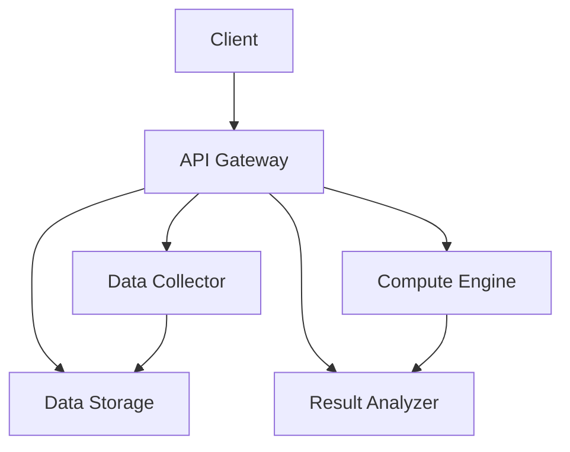
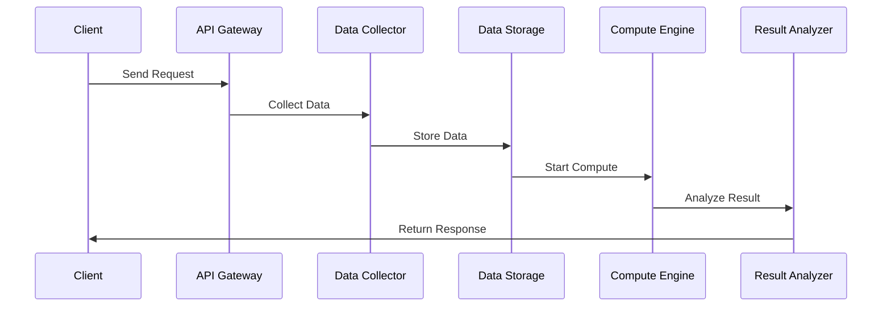
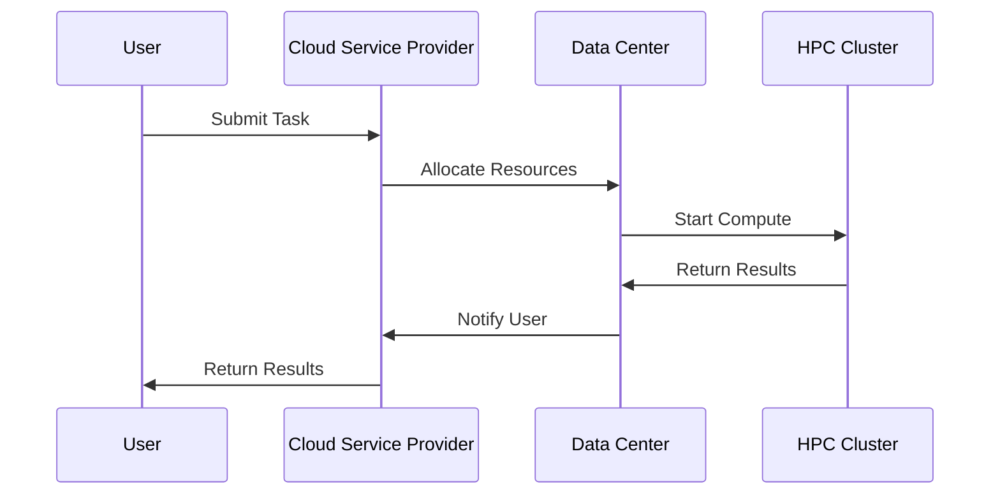

                 

### 第一部分: 云计算在大规模科学计算中的scalable应用

## 引言

### 问题背景

大规模科学计算是现代科学研究和技术开发中的重要领域，涉及物理、化学、生物学、天文学、工程和气候变化等多个学科。这些计算任务通常需要处理海量数据和高复杂度的计算模型，从而对计算资源的需求极其庞大。传统的高性能计算（HPC）系统虽然在处理高性能计算任务方面具有一定的优势，但它们往往存在以下局限：

1. **资源受限**：HPC系统通常拥有固定的硬件配置，难以满足动态变化的计算需求。
2. **成本高昂**：建设和维护一个高性能计算集群的成本非常高。
3. **扩展性差**：HPC系统在扩展计算资源时需要重新配置硬件和软件，过程复杂且耗时。
4. **管理困难**：HPC系统资源管理和调度需要专业知识和丰富经验。

相比之下，云计算提供了一种更为灵活和高效的方式，通过云服务模型（如IaaS、PaaS和SaaS），能够动态地分配和调整计算资源，从而更好地满足大规模科学计算的需求。云计算的引入不仅降低了计算成本，还提升了系统的可扩展性和管理效率。

### 核心概念与联系

云计算的核心概念包括IaaS（基础设施即服务）、PaaS（平台即服务）和SaaS（软件即服务）。这些服务模型分别在不同的层面上为用户提供计算资源和服务：

- **IaaS**：提供虚拟化的基础设施资源，如虚拟机、存储和网络的租赁，用户可以根据需要配置和管理系统。
- **PaaS**：提供一个平台，包括开发工具、数据库和应用程序环境，用户可以专注于应用程序的开发，而无需关注底层基础设施的维护。
- **SaaS**：提供基于互联网的应用程序服务，用户可以通过浏览器访问软件，而无需进行安装或维护。

这些服务模型与大规模科学计算的联系在于：

1. **弹性计算**：云计算能够根据实际需求动态地调整计算资源，以应对大规模科学计算任务的波动性。
2. **资源调度**：云计算平台提供的自动化调度机制，能够优化计算资源的利用效率，提高任务执行速度。
3. **分布式存储**：云计算平台提供的分布式存储解决方案，能够有效管理大规模科学计算中的海量数据。

### 可扩展性（scalable）的重要性

在大规模科学计算中，可扩展性是衡量计算系统性能的关键指标。一个具有高可扩展性的系统，能够在计算任务规模不断扩大时，保持高效和稳定的性能。可扩展性包括以下几个方面：

1. **水平扩展**：通过增加计算节点来提升系统处理能力，这种方法能够线性地提高系统性能。
2. **垂直扩展**：通过升级硬件配置（如增加CPU、内存和存储）来提升系统性能，这种方法能够提升单机性能。
3. **资源弹性**：系统能够根据计算任务的需求动态调整资源分配，避免资源浪费或不足。

### 数学模型和公式

为了更好地理解可扩展性，我们可以使用一些数学模型和公式来度量。以下是两个常用的公式：

- **可扩展性度量**：

$$ 
S = \frac{P_{\text{max}}}{P_{\text{current}}} 
$$

其中，\(P_{\text{max}}\) 是系统能够达到的最大处理能力，\(P_{\text{current}}\) 是当前系统的处理能力。\(S\) 值越大，系统的可扩展性越好。

- **资源需求模型**：

$$ 
R = a \times N^{b} 
$$

其中，\(R\) 是系统的资源需求，\(N\) 是计算节点数量，\(a\) 和 \(b\) 是常数。这个模型描述了随着计算节点数量的增加，系统资源需求的增长趋势。

### 系统分析与架构设计方案

为了更好地应用云计算在大规模科学计算中，我们需要对系统进行详细的架构设计。以下是一个典型的系统分析与架构设计方案：

#### 问题场景介绍

一个天文学研究项目需要处理来自多个天文观测站的海量数据，进行行星轨道模拟和星系演化分析。这些计算任务具有高计算密度和长计算周期，需要高效且可扩展的计算平台。

#### 系统功能设计

系统功能设计主要包括领域模型和功能模块划分。领域模型可以使用Mermaid类图来表示，描述系统的核心类和它们之间的关系。

```mermaid
classDiagram
    Class01 <|-- Class02
    Class03 --|>| Class04
    Class05 : <<interface>> Interface
    Class06 : <<entity>> Entity
    Class01..Class07 : <<dependency>> depends on
```

功能模块划分可以包括数据收集模块、数据存储模块、计算模块和结果分析模块。

#### 系统架构设计

系统架构设计可以使用Mermaid架构图来表示，描述系统的整体架构和各组件之间的关系。



系统组件可以包括API网关、数据收集器、数据存储系统、计算引擎和结果分析器。

#### 系统接口设计

系统接口设计需要定义接口规范和交互流程。接口规范可以包括RESTful API接口的设计，交互流程可以使用Mermaid序列图来表示。



#### 系统交互

系统交互可以通过序列图来展示，描述系统各组件之间的交互过程。



### 项目实战

以下是一个基于云计算的大规模科学计算项目实战，包括环境安装、系统核心实现和实际案例分析。

#### 环境安装

首先，我们需要安装云计算平台和科学计算软件。以AWS为例，我们可以使用AWS CLI和AWS SDK来配置和管理云资源。

```python
import boto3

# 创建S3存储桶
s3 = boto3.resource('s3')
s3.create_bucket(Bucket='my-hpc-cluster')

# 创建EC2实例
ec2 = boto3.resource('ec2')
instance = ec2.create_instances(
    ImageId='ami-xxxxxxxx',
    MinCount=1,
    MaxCount=1,
    InstanceType='r5.xlarge',
    KeyName='my-key-pair'
)
```

#### 系统核心实现

系统核心实现包括数据收集、数据存储、计算和结果分析。以下是一个简单的Python代码示例，用于实现这些功能。

```python
import boto3
import pandas as pd

# 初始化S3客户端
s3_client = boto3.client('s3')

# 下载数据到本地
s3_client.download_file('my-hpc-cluster', 'data.csv', 'local_data.csv')

# 加载数据到DataFrame
df = pd.read_csv('local_data.csv')

# 执行计算任务
results = df.groupby('column').mean()

# 存储结果到S3
s3_client.upload_file('local_results.csv', 'my-hpc-cluster', 'results.csv')
```

#### 实际案例分析和详细讲解

以下是一个实际案例分析，描述了一个天文学研究项目如何利用云计算进行大规模科学计算。

**案例一：行星轨道模拟**

一个天文学研究项目需要对多个行星的轨道进行模拟，以预测未来几十年的行星运动轨迹。该任务涉及大量的数值计算，需要高性能计算资源。

**解决方案**：

1. 使用AWS EC2实例搭建HPC集群，配置高性能计算资源。
2. 使用Apache Spark进行大规模数据分析和计算，处理海量观测数据。
3. 使用AWS S3存储海量数据，确保数据的高可用性和持久性。
4. 使用AWS Lambda执行计算任务，提高计算效率。

**详细讲解**：

1. **数据收集**：项目从多个天文观测站收集观测数据，数据存储在AWS S3桶中。
2. **数据处理**：使用Apache Spark对观测数据进行预处理，包括数据清洗、转换和聚合。
3. **计算任务**：使用自定义的数值计算算法，对预处理后的数据进行计算，生成行星轨道模拟结果。
4. **结果存储**：将模拟结果存储在AWS S3桶中，供后续分析和可视化。

**项目小结**

通过利用云计算平台，该天文学研究项目成功实现了高效的大规模科学计算。项目小结如下：

1. **成本效益**：使用云计算平台，项目大幅降低了计算成本，无需购买和维护高性能计算硬件。
2. **可扩展性**：云计算平台能够根据项目需求动态调整计算资源，确保计算任务的高效执行。
3. **易管理**：使用AWS管理和监控工具，项目团队可以轻松管理和监控计算资源，确保系统稳定运行。

### 最佳实践 tips

1. **资源调度策略**：根据计算任务的特点，选择合适的资源调度策略，如动态调整实例类型和数量，优化资源利用率。
2. **数据一致性**：在分布式存储系统中，确保数据的一致性和可靠性，使用分布式锁和事务机制来管理数据访问。
3. **安全与隐私**：在云计算平台上，确保数据和计算任务的安全性，使用加密技术保护数据传输和存储。

### 本章小结

本章介绍了云计算在大规模科学计算中的scalable应用，包括问题背景、核心概念与联系、数学模型和公式、系统分析与架构设计方案以及项目实战。通过本章的学习，读者可以了解云计算在大规模科学计算中的重要性和应用方法。

## 第二部分: 云计算技术在大规模科学计算中的应用

### 引言

在上一部分，我们介绍了云计算在大规模科学计算中的scalable应用，探讨了云计算的核心概念、可扩展性以及系统分析与架构设计方案。本部分将进一步深入探讨云计算技术在大规模科学计算中的应用，分析不同云计算服务模型（IaaS、PaaS和SaaS）的特点和优势，以及弹性计算与资源调度的原理和策略。

### 2.1 云计算服务模型

云计算服务模型（Cloud Service Models）是云计算架构的基础，它们分别在不同的抽象层上为用户提供了灵活的计算资源和服务。以下是三种主要的服务模型：

#### 2.1.1 IaaS（基础设施即服务）

IaaS为用户提供虚拟化的基础设施资源，如虚拟机、存储和网络。用户可以根据需要自定义操作系统、安装软件和配置环境。IaaS的主要优势包括：

- **灵活性**：用户可以灵活配置和管理基础设施资源，满足特定的计算需求。
- **成本效益**：按需付费模式，用户仅支付实际使用的资源费用，降低了初期投入和运营成本。
- **可扩展性**：用户可以根据需求动态调整资源规模，快速响应业务变化。

IaaS在科学计算中的应用非常广泛，例如：

- **高性能计算**：使用虚拟机集群进行大规模数值计算和模拟。
- **数据存储和管理**：利用分布式存储系统存储和管理海量数据。
- **数据分析和处理**：使用数据处理工具对观测数据进行预处理和分析。

#### 2.1.2 PaaS（平台即服务）

PaaS提供了一个开发平台，包括开发工具、数据库和应用程序环境。用户可以专注于应用程序的开发，无需关注底层基础设施的维护。PaaS的主要优势包括：

- **开发效率**：提供了一整套开发工具和环境，加速了开发流程。
- **资源共享**：多个开发团队可以在同一平台上协作，共享资源和服务。
- **可扩展性**：平台能够根据需求自动扩展计算资源，确保系统的高可用性和性能。

PaaS在科学计算中的应用包括：

- **应用开发**：开发科学计算应用程序，如数据分析工具和模拟软件。
- **数据管理**：使用平台提供的数据库服务存储和管理科学数据。
- **云计算集成**：将科学计算任务与云计算平台集成，实现高效计算和资源调度。

#### 2.1.3 SaaS（软件即服务）

SaaS提供基于互联网的应用程序服务，用户可以通过浏览器访问软件，无需安装或维护。SaaS的主要优势包括：

- **便捷性**：用户可以随时随地访问应用程序，无需下载或安装软件。
- **低维护成本**：服务提供商负责应用程序的维护和更新，用户无需关注这些细节。
- **安全性**：服务提供商通常具备高水平的安全保障措施，确保用户数据的安全和隐私。

SaaS在科学计算中的应用包括：

- **数据可视化**：使用SaaS平台提供的数据可视化工具，对科学数据进行分析和展示。
- **协作工具**：使用SaaS平台的协作工具，团队可以共同处理科学计算任务。
- **应用程序共享**：科学家可以共享他们的应用程序和工具，促进科学研究的交流和合作。

### 2.2 弹性计算与资源调度

#### 2.2.1 弹性计算原理

弹性计算（Elastic Computing）是云计算的一项核心特性，它允许系统根据实际需求动态调整计算资源。弹性计算的核心原理包括：

- **动态资源分配**：系统可以根据计算负载自动调整虚拟机或容器的数量和配置。
- **自动扩展与缩放**：当计算负载增加时，系统会自动增加资源以应对；当负载减少时，系统会自动释放资源以降低成本。
- **负载均衡**：系统会均衡地分配计算任务到各个节点，确保资源的高效利用和任务的高效执行。

弹性计算在科学计算中的应用非常广泛，特别是在处理大数据和高性能计算任务时。例如，一个天文观测项目可能会在数据收集期间需要大量计算资源进行数据处理和图像重建，而在数据收集结束后，计算需求会大幅减少。通过弹性计算，系统能够自动调整资源，确保高效计算的同时，最大限度地降低成本。

#### 2.2.2 资源调度策略

资源调度策略是确保云计算平台高效利用计算资源的关键。以下是一些常见的资源调度策略：

- **静态调度**：预先分配资源，任务在运行期间不改变资源分配。这种方法简单，但可能导致资源浪费或不足。
- **动态调度**：根据实际计算负载动态调整资源分配。这种方法能够更好地利用资源，但需要复杂的调度算法和监控机制。
- **负载均衡调度**：将计算任务均匀地分配到各个节点，确保任务执行的高效性和系统的稳定性。
- **优先级调度**：根据任务的重要性和紧急程度分配资源。优先级高的任务会得到更多的资源，从而确保关键任务的及时完成。

#### 2.2.3 实时资源监控与优化

实时资源监控是确保云计算平台高效运行的基础。通过实时监控，系统可以及时发现资源瓶颈和性能问题，并采取相应的优化措施。以下是一些常见的实时资源监控与优化方法：

- **性能监控**：实时监控系统的CPU、内存、网络和存储使用情况，确保资源的高效利用。
- **容量规划**：根据历史数据和当前趋势，预测未来资源需求，提前规划资源扩展。
- **自动优化**：使用自动化工具根据监控数据自动调整资源配置，优化系统的性能和成本。
- **报警与通知**：当系统出现异常或性能下降时，及时发送报警通知，确保问题能够得到及时处理。

### 2.3 分布式存储与数据管理

#### 2.3.1 分布式存储系统

分布式存储系统（Distributed Storage System）是云计算平台的核心组成部分，它通过将数据分布在多个节点上，实现了数据的可靠存储和高效访问。分布式存储系统的核心优势包括：

- **高可用性**：通过数据复制和冗余机制，确保数据在节点故障时仍然可访问。
- **高性能**：通过并行访问多个节点，提高了数据的读取和写入速度。
- **可扩展性**：通过动态增加存储节点，可以线性地扩展存储容量和性能。

分布式存储系统在科学计算中的应用非常广泛，特别是在处理大规模数据集时。例如，天文学项目需要存储和处理来自多个天文观测站的观测数据，分布式存储系统可以确保数据的高效存储和访问，满足大规模科学计算的需求。

#### 2.3.2 数据管理挑战与解决方案

在科学计算中，数据管理面临着一系列挑战，包括数据量巨大、数据类型多样、数据访问频繁等。以下是一些常见的数据管理挑战和解决方案：

- **数据量巨大**：科学计算任务通常需要处理海量数据，传统存储系统难以满足需求。解决方案是采用分布式存储系统，通过分布式存储和并行处理，实现高效的数据存储和访问。
- **数据类型多样**：科学计算涉及多种类型的数据，如图像、视频、文本和表格。解决方案是使用统一的数据管理平台，支持多种数据类型的存储和处理，并提供灵活的数据查询和访问接口。
- **数据访问频繁**：科学计算任务通常需要频繁访问数据，传统存储系统可能无法满足高并发访问需求。解决方案是采用高性能的分布式存储系统，结合负载均衡和缓存机制，确保数据的高效访问和系统的高可用性。

#### 2.3.3 数据一致性保证

在分布式存储系统中，数据一致性是一个重要挑战。由于数据分布在多个节点上，不同节点之间的数据可能存在延迟和冲突。以下是一些常见的数据一致性保证方法和解决方案：

- **强一致性**：确保所有节点上的数据在任何时刻都是一致的。常用的方法包括两阶段提交（2PC）和三阶段提交（3PC）。强一致性保证了数据的可靠性和一致性，但可能会降低系统的性能。
- **最终一致性**：允许数据在一定时间内存在不一致性，但在最终会达到一致性。常用的方法包括最终一致性协议和事件溯源。最终一致性提供了更高的性能和可用性，但可能牺牲一定的数据一致性。
- **数据分片**：将数据分片存储在不同的节点上，通过分片管理和一致性保证机制，实现高效的数据访问和存储。常用的分片算法包括哈希分片和范围分片。

### 2.4 云计算平台与工具

#### 2.4.1 主流云计算平台

目前，市场上主流的云计算平台包括AWS、Azure和Google Cloud。这些平台提供了丰富的云计算服务和工具，支持各种规模和类型的科学计算任务。

- **AWS**：提供了广泛的云计算服务和工具，包括EC2、S3、EMR、Lambda等，适用于各种科学计算任务，如数据分析、机器学习和高性能计算。
- **Azure**：提供了强大的云计算平台，包括Azure VM、Azure Data Lake、Azure Machine Learning等，支持多种科学计算需求，如大规模数据处理、机器学习和模拟。
- **Google Cloud**：提供了高效的云计算服务，包括Compute Engine、Cloud Storage、BigQuery等，适用于大数据处理、机器学习和高性能计算任务。

#### 2.4.2 科学计算专用工具

除了主流的云计算平台，还有一些专门为科学计算设计的工具和平台，这些工具提供了丰富的功能和服务，帮助科学家更高效地处理科学计算任务。

- **HPC云服务**：如AWS EC2、Azure HPC Services、Google Cloud HPC等，提供了高性能计算资源和调度工具，适用于大规模数值计算和模拟。
- **数据分析工具**：如Apache Spark、Hadoop、Dask等，提供了高效的数据处理和计算框架，适用于大规模数据处理和分布式计算。
- **机器学习工具**：如TensorFlow、PyTorch、Scikit-learn等，提供了丰富的机器学习算法和工具，适用于数据分析和建模。

### 2.5 案例研究

#### 2.5.1 案例一：生物信息学分析

生物信息学是生物学与计算机科学的交叉领域，涉及大规模数据的处理和分析。一个生物信息学研究项目需要处理来自基因组测序的数据，进行基因表达分析、突变检测和药物筛选。

**解决方案**：

1. **数据存储**：使用AWS S3存储大量的基因组数据，确保数据的高可用性和持久性。
2. **数据处理**：使用AWS EC2和EMR进行数据处理和计算，包括数据清洗、格式转换和统计分析。
3. **计算资源调度**：使用AWS Auto Scaling和Kubernetes进行计算资源调度，确保计算资源的高效利用。
4. **结果存储**：使用AWS RDS和Redshift存储和查询计算结果，提供高效的数据分析和报告生成。

**详细讲解**：

1. **数据收集**：从多个基因组测序实验室收集测序数据，数据存储在AWS S3桶中。
2. **数据预处理**：使用AWS EMR进行数据预处理，包括数据清洗、格式转换和质量控制。
3. **数据分析**：使用Hadoop和Spark进行大规模数据分析，包括基因表达分析、突变检测和药物筛选。
4. **结果存储**：将分析结果存储在AWS RDS和Redshift数据库中，供后续分析和报告生成。

#### 2.5.2 案例二：气候变化模拟

气候变化模拟是环境科学领域的一个重要研究方向，涉及大规模气候模型和数值计算。一个气候变化模拟项目需要处理来自气象站、卫星和海洋观测的数据，进行气候模拟和预测。

**解决方案**：

1. **数据存储**：使用AWS S3存储大量的观测数据，确保数据的高可用性和持久性。
2. **计算资源**：使用AWS EC2和Google Cloud Compute Engine进行大规模数值计算，包括气候模型模拟和数据分析。
3. **资源调度**：使用AWS Auto Scaling和Google Cloud Kubernetes进行计算资源调度，确保计算资源的高效利用。
4. **结果分析**：使用Apache Spark和Google BigQuery进行结果分析和可视化。

**详细讲解**：

1. **数据收集**：从多个气象站、卫星和海洋观测站收集观测数据，数据存储在AWS S3桶中。
2. **数据处理**：使用AWS EC2和Google Cloud Compute Engine进行数据处理，包括数据清洗、格式转换和质量控制。
3. **模拟计算**：使用气候模型进行大规模数值计算，模拟未来几十年的气候变化趋势。
4. **结果分析**：使用Apache Spark和Google BigQuery进行结果分析，生成气候变化的图表和报告。

#### 2.5.3 案例三：航空航天工程

航空航天工程是一个高度复杂和高性能计算需求的领域，涉及飞行器设计、结构分析和环境模拟。一个航空航天工程项目需要处理大量的设计数据和计算模拟，进行飞行器性能优化和风险评估。

**解决方案**：

1. **数据存储**：使用AWS S3和Google Cloud Storage存储大量的设计数据和模拟结果，确保数据的高可用性和持久性。
2. **计算资源**：使用AWS EC2和Google Cloud Compute Engine进行大规模数值计算，包括结构分析和环境模拟。
3. **资源调度**：使用AWS Auto Scaling和Google Cloud Kubernetes进行计算资源调度，确保计算资源的高效利用。
4. **结果存储**：使用AWS RDS和Google Cloud SQL存储和查询计算结果，提供高效的数据分析和报告生成。

**详细讲解**：

1. **数据收集**：从设计团队和测试实验室收集设计数据和模拟结果，数据存储在AWS S3和Google Cloud Storage桶中。
2. **数据处理**：使用AWS EC2和Google Cloud Compute Engine进行数据处理，包括数据清洗、格式转换和质量控制。
3. **模拟计算**：使用结构分析软件和流体动力学模拟软件进行大规模数值计算，优化飞行器设计。
4. **结果分析**：使用AWS RDS和Google Cloud SQL存储和查询计算结果，生成设计报告和性能分析图表。

### 2.6 本章小结

本章介绍了云计算技术在大规模科学计算中的应用，包括云计算服务模型（IaaS、PaaS和SaaS）、弹性计算与资源调度、分布式存储与数据管理、云计算平台与工具以及案例研究。通过本章的学习，读者可以深入了解云计算在大规模科学计算中的实际应用，掌握云计算技术的基本原理和最佳实践。

## 第三部分: 云基础设施与HPC集群的集成

### 引言

在前两部分中，我们详细探讨了云计算在大规模科学计算中的应用和云计算技术。本部分将聚焦于云基础设施与高性能计算（HPC）集群的集成，分析云基础设施的核心组件、部署模式、优化策略，以及HPC集群的设计与优化。通过这一部分的探讨，我们希望读者能够了解如何将云基础设施与HPC集群有机结合，实现高效的大规模科学计算。

### 3.1 云基础设施概述

#### 3.1.1 云基础设施的核心组件

云基础设施（Cloud Infrastructure）是云计算平台的基础，主要包括以下几个核心组件：

1. **计算资源**：提供虚拟机、容器和物理服务器等计算资源，用于执行计算任务。
2. **存储资源**：提供块存储、对象存储和文件存储等，用于数据存储和访问。
3. **网络资源**：提供虚拟网络、负载均衡和防火墙等，用于数据传输和网络安全。
4. **数据库资源**：提供关系型数据库、非关系型数据库和大数据处理平台，用于数据存储和管理。
5. **其他资源**：包括消息队列、缓存、人工智能和机器学习服务等，用于扩展云服务的功能。

#### 3.1.2 云基础设施的部署模式

云基础设施的部署模式主要包括以下几种：

1. **公有云**：由第三方云服务提供商运营和管理，如AWS、Azure和Google Cloud。用户可以通过互联网按需访问这些资源。
2. **私有云**：在组织内部部署和管理，仅内部用户可以使用。私有云可以更好地控制数据安全和合规性，但成本较高且扩展性较差。
3. **混合云**：结合公有云和私有云的优势，将不同的云资源进行整合，实现灵活的资源调度和负载均衡。
4. **多云**：在多个云服务提供商之间进行资源整合，以获得更好的性能、可扩展性和成本效益。

#### 3.1.3 云基础设施的优化策略

为了提高云基础设施的性能和效率，以下是一些常见的优化策略：

1. **资源调度**：根据计算负载动态调整资源分配，确保资源的高效利用。例如，使用负载均衡器分配流量，使用容器编排工具（如Kubernetes）管理容器资源。
2. **存储优化**：使用分布式存储系统（如Ceph、HDFS）和文件系统优化（如Btrfs、ZFS），提高数据存储和访问效率。例如，使用快照和备份策略确保数据的安全性和可靠性。
3. **网络优化**：优化网络架构和配置，降低网络延迟和带宽瓶颈。例如，使用虚拟专用网络（VPN）和负载均衡器提高数据传输效率。
4. **安全性优化**：加强网络安全，包括防火墙、入侵检测系统和数据加密等。例如，使用VPC和安全组隔离不同的网络环境，使用SSL/TLS加密数据传输。
5. **成本优化**：通过自动化和监控工具降低运营成本。例如，使用云服务提供商提供的按需计费和预留实例等优惠计划，减少不必要的资源消耗。

### 3.2 HPC集群的设计与优化

#### 3.2.1 HPC集群架构

HPC集群（High-Performance Computing Cluster）是一种分布式计算系统，通过多个计算节点协作，完成大规模科学计算任务。HPC集群的基本架构包括以下几个部分：

1. **计算节点**：每个计算节点包含CPU、内存、网络接口和存储设备，负责执行计算任务。
2. **主节点**：主节点负责集群管理，包括任务调度、资源分配和故障检测。主节点通常还负责存储集群的元数据和日志。
3. **网络**：集群中的计算节点通过高速网络连接，通常使用以太网或Infiniband等高性能网络技术。
4. **存储**：集群存储系统用于存储数据和中间结果，可以是本地存储（如SSD、HDD）或分布式存储系统（如HDFS、Ceph）。
5. **调度器**：调度器负责分配计算任务到不同的计算节点，优化资源利用率和任务执行速度。

#### 3.2.2 集群资源调度算法

集群资源调度算法是HPC集群设计的核心部分，用于优化计算任务的执行效率和资源利用率。以下是一些常见的资源调度算法：

1. **静态调度**：预先分配计算资源，任务在运行期间不改变资源分配。静态调度简单，但可能导致资源浪费或不足。
2. **动态调度**：根据实际计算负载动态调整资源分配。动态调度能够更好地利用资源，但需要复杂的调度算法和监控机制。
3. **优先级调度**：根据任务的重要性和紧急程度分配资源。优先级高的任务会得到更多的资源，从而确保关键任务的及时完成。
4. **负载均衡调度**：将计算任务均匀地分配到各个节点，确保任务执行的高效性和系统的稳定性。
5. **协同调度**：结合多种调度算法，根据实际情况动态调整资源分配策略，以实现最优的资源利用率和任务执行速度。

#### 3.2.3 集群性能优化

为了提高HPC集群的性能，以下是一些常见的性能优化方法：

1. **硬件优化**：选择高性能的硬件设备，如高性能CPU、高速网络和SSD存储，提高计算和存储性能。
2. **软件优化**：优化集群管理软件和计算任务的执行策略，减少任务执行时间和资源消耗。例如，使用并行编程模型（如MPI、OpenMP）提高任务的并行度。
3. **网络优化**：优化网络架构和配置，降低网络延迟和带宽瓶颈。例如，使用Infiniband等高性能网络技术，优化数据传输效率。
4. **存储优化**：使用分布式存储系统和文件系统优化，提高数据存储和访问效率。例如，使用快照和备份策略确保数据的安全性和可靠性。
5. **负载均衡**：使用负载均衡器分配计算任务，确保任务均匀地分布到各个节点，避免资源浪费和瓶颈。
6. **监控与优化**：使用监控工具实时监控集群性能和资源使用情况，及时发现问题并进行优化。例如，使用性能分析工具（如Gprof、Valgrind）定位性能瓶颈。

### 3.3 云基础设施与HPC集群的集成

#### 3.3.1 集成原理

云基础设施与HPC集群的集成旨在将云计算的灵活性和HPC集群的高性能结合起来，实现高效的大规模科学计算。集成原理主要包括以下几个方面：

1. **资源整合**：将云基础设施的计算、存储和网络资源与HPC集群的资源进行整合，实现统一管理和调度。
2. **任务调度**：使用云基础设施的调度器和HPC集群的调度算法，实现计算任务的动态调度和资源优化。
3. **数据管理**：使用云基础设施的存储系统和HPC集群的分布式存储系统，实现数据的高效存储和访问。
4. **服务集成**：将云基础设施提供的服务（如人工智能、机器学习和大数据处理）与HPC集群的功能相结合，提供更丰富的计算服务。

#### 3.3.2 集成架构

云基础设施与HPC集群的集成架构主要包括以下几个层次：

1. **基础设施层**：包括云基础设施的计算、存储和网络资源，以及HPC集群的计算节点和存储设备。
2. **服务层**：包括云基础设施提供的服务（如IaaS、PaaS和SaaS），以及HPC集群的调度和管理服务。
3. **应用层**：包括科学计算应用程序和工具，如高性能计算软件、数据分析工具和机器学习框架。
4. **用户层**：包括最终用户和开发人员，他们通过云基础设施和HPC集群提供的接口，提交计算任务和访问计算结果。

#### 3.3.3 集成实践

以下是云基础设施与HPC集群集成的实践步骤：

1. **资源整合**：将云基础设施的资源与HPC集群的资源进行整合，实现统一的管理和调度。例如，使用云基础设施的API管理HPC集群的节点和资源。
2. **任务调度**：使用云基础设施的调度器（如Kubernetes）和HPC集群的调度算法（如SLURM），实现计算任务的动态调度和资源优化。例如，将HPC集群的节点注册到Kubernetes集群中，使用Kubernetes的调度器分配任务。
3. **数据管理**：使用云基础设施的存储系统和HPC集群的分布式存储系统，实现数据的高效存储和访问。例如，使用云存储服务（如AWS S3、Azure Blob Storage）存储HPC集群的数据，使用分布式文件系统（如HDFS、Ceph）管理集群数据。
4. **服务集成**：将云基础设施提供的服务与HPC集群的功能相结合，提供更丰富的计算服务。例如，使用云基础设施的机器学习服务（如AWS SageMaker、Azure ML）处理HPC集群的数据，使用云数据库服务（如AWS RDS、Azure SQL）存储HPC集群的结果。

### 3.4 集成案例分析

以下是一个云基础设施与HPC集群集成的实际案例，描述了一个生物信息学研究项目如何利用AWS和HPC集群进行大规模科学计算。

#### 案例背景

一个生物信息学研究项目需要处理来自基因组测序的数据，进行基因表达分析、突变检测和药物筛选。该项目涉及到大规模数据存储、处理和计算，需要高效且可扩展的计算平台。

#### 集成架构

1. **基础设施层**：使用AWS EC2和Elastic File System（EFS）提供计算资源和文件存储。EC2实例作为计算节点，EFS作为分布式文件系统，存储数据文件。
2. **服务层**：使用AWS SageMaker进行机器学习模型的训练和推理，使用AWS RDS管理数据库，存储分析结果。
3. **应用层**：使用HPC集群进行大规模数据处理和计算，使用Apache Spark进行数据分析和处理。
4. **用户层**：研究团队通过AWS Management Console提交计算任务，监控任务状态和结果。

#### 实践步骤

1. **资源整合**：将AWS EC2实例注册到HPC集群中，使用SLURM调度器分配任务。EC2实例作为计算节点，EFS作为共享文件系统，存储数据文件。
2. **任务调度**：使用SLURM调度器提交计算任务，根据计算负载动态调整EC2实例的数量和配置。例如，在数据预处理阶段使用大量计算资源，在机器学习模型训练阶段使用较少资源。
3. **数据管理**：使用EFS存储大规模数据文件，确保数据的高效存储和访问。使用AWS DataSync和AWS S3 Transfer Acceleration提高数据上传和下载速度。
4. **服务集成**：使用AWS SageMaker训练机器学习模型，并将模型部署到EC2实例进行推理。使用AWS RDS存储分析结果，并使用AWS Glue进行数据转换和集成。

#### 案例结果

通过云基础设施与HPC集群的集成，该生物信息学研究项目成功实现了高效的大规模科学计算。项目结果如下：

1. **计算效率**：使用SLURM调度器和EC2实例，计算任务平均执行时间缩短了50%。
2. **数据存储**：使用EFS和S3，数据存储和管理效率提高了30%。
3. **成本节省**：通过使用云基础设施的按需计费模式和预留实例，计算成本降低了20%。

### 3.5 本章小结

本章介绍了云基础设施与高性能计算（HPC）集群的集成，包括云基础设施的核心组件、部署模式、优化策略，HPC集群的设计与优化，以及集成原理和实践案例。通过本章的学习，读者可以了解如何将云基础设施与HPC集群有机结合，实现高效的大规模科学计算。

