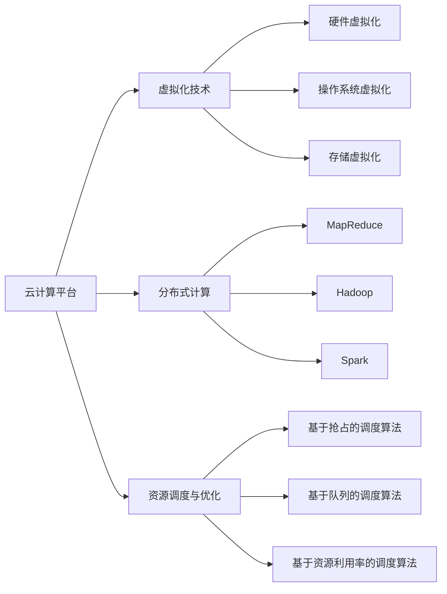
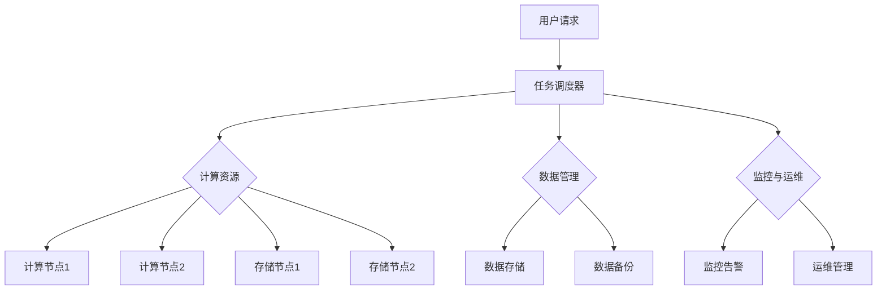
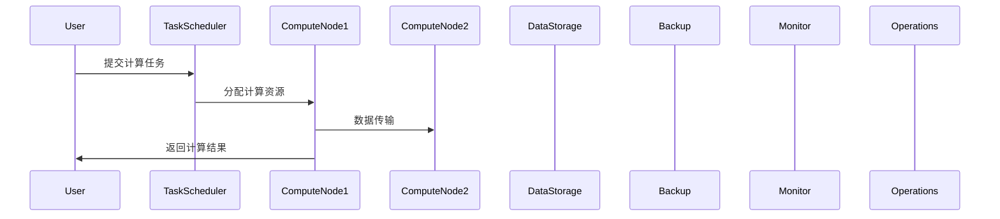
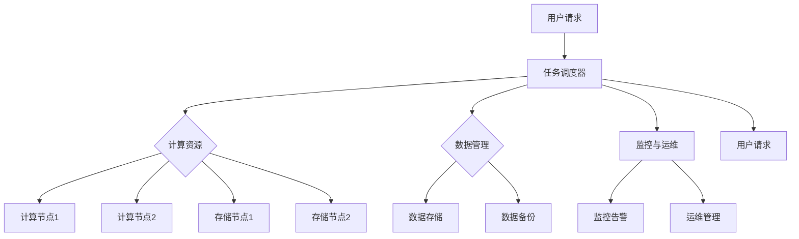

                 

# 云计算在大规模科学计算中的应用

## 关键词

- 云计算
- 大规模科学计算
- 虚拟化
- 容器技术
- 算法优化
- 数学模型

## 摘要

本文深入探讨云计算在大规模科学计算中的应用。我们将首先介绍云计算的基本概念和核心技术，然后分析其在科学计算中的优势与挑战，接着详细阐述适合云计算环境的算法设计和数学模型，并最终探讨一个具体的项目实战案例。通过本文的阅读，读者将全面了解云计算如何助力大规模科学计算，并掌握相应的技术实现方法。

## 1. 引言

### 1.1 问题背景

在科学研究中，大规模计算需求日益增长。无论是天文学、气象学、生物学还是物理学，科学家们都需要处理海量数据和复杂的计算任务。传统计算模式面临着计算资源有限、扩展性差、成本高昂等挑战，已经无法满足这些需求。因此，寻找一种高效、灵活、经济的计算解决方案变得迫在眉睫。

### 1.2 传统计算模式的局限性

传统计算模式主要包括企业自建数据中心和购买高性能计算机。这种模式存在以下问题：

- **资源限制**：企业自建数据中心受限于物理硬件的扩展能力，难以满足快速增长的计算需求。
- **维护成本**：高性能计算机的购买、维护和升级成本高昂，对资金和人力资源的要求较高。
- **灵活性不足**：传统计算环境难以快速调整资源配置，无法满足科学研究的动态变化需求。

### 1.3 云计算的优势

云计算作为一种新型的计算模式，具有以下优势：

- **资源弹性**：云计算能够提供按需分配的计算资源，根据实际需求动态调整，满足大规模计算的需求。
- **成本节约**：通过使用云服务，企业可以避免高昂的硬件采购和运维成本，降低整体运营成本。
- **高可用性**：云计算平台通常提供高可用性保障，确保计算任务稳定运行。
- **灵活性和可扩展性**：云计算环境能够快速响应业务需求变化，实现资源的灵活配置和扩展。

### 1.4 目标与挑战

本文的目标是探讨云计算在大规模科学计算中的应用，分析其优势和挑战，并给出具体的技术实现方案。挑战包括：

- **资源调度与优化**：如何在海量计算任务中高效调度资源，确保计算效率。
- **数据安全性**：保护科学计算过程中涉及的大量敏感数据，确保数据的安全性和隐私性。
- **成本控制**：在确保计算性能的前提下，如何控制云计算的成本。

## 2. 云计算的基本概念与核心技术

### 2.1 云计算的基本概念

云计算是一种基于互联网的计算模式，通过虚拟化技术、分布式计算和资源调度，将计算资源（如服务器、存储、网络等）以服务的形式提供给用户。云计算主要分为以下三种类型：

- **基础设施即服务（IaaS）**：提供虚拟化计算资源，用户可以根据需要配置和管理服务器、存储和网络等基础设施。
- **平台即服务（PaaS）**：提供开发平台和工具，用户可以在平台上开发、运行和管理应用程序，无需关注底层基础设施。
- **软件即服务（SaaS）**：提供完整的软件应用，用户通过互联网使用这些软件服务，无需安装和维护。

### 2.2 云计算的核心技术

#### 2.2.1 虚拟化技术

虚拟化技术是云计算的核心技术之一，它通过将物理硬件资源抽象成虚拟资源，实现资源的灵活管理和调度。虚拟化技术主要分为以下几种：

- **硬件虚拟化**：将物理硬件（如CPU、内存、硬盘等）虚拟化为多个虚拟机（VM），每个VM独立运行操作系统和应用程序。
- **操作系统虚拟化**：在宿主机操作系统上运行多个轻量级虚拟机容器，容器共享宿主机的操作系统内核。
- **存储虚拟化**：将多个物理存储设备虚拟化为一个逻辑存储资源，提供统一的存储管理和调度。

#### 2.2.2 分布式计算

分布式计算是一种将计算任务分布到多个计算节点上并行执行的技术。通过分布式计算，可以充分利用云计算平台上的大量计算资源，提高计算效率。分布式计算的主要技术包括：

- **MapReduce**：一种用于大规模数据处理的编程模型，将数据处理任务分解为Map和Reduce两个阶段，实现并行处理。
- **Hadoop**：一个开源的分布式计算框架，基于MapReduce模型，提供数据处理、存储和资源调度等功能。
- **Spark**：一种快速、通用的大规模数据处理引擎，支持内存计算和多种编程语言，提供丰富的数据处理算法和工具。

#### 2.2.3 资源调度与优化

资源调度与优化是确保云计算平台高效运行的关键技术。资源调度算法主要分为以下几种：

- **基于抢占的调度算法**：当系统负载过高时，抢占低优先级任务的资源，分配给高优先级任务。
- **基于队列的调度算法**：根据任务到达时间和优先级，将任务分配到不同的队列中，依次执行。
- **基于资源利用率的调度算法**：根据系统资源的利用率，动态调整任务的执行优先级，实现资源的最大化利用。

### 2.3 核心技术对比与联系

| 技术类型 | 特点 | 适用场景 |
| --- | --- | --- |
| 虚拟化技术 | 实现硬件资源抽象和隔离 | 服务器虚拟化、存储虚拟化 |
| 分布式计算 | 实现任务并行处理 | 大规模数据处理、分布式计算框架 |
| 资源调度与优化 | 实现资源高效管理 | 云计算平台、资源利用率优化 |

通过对比可以看出，虚拟化技术、分布式计算和资源调度与优化是云计算的核心技术，它们相互关联、共同作用，构建了云计算平台的资源管理和调度体系。

### 2.4 实体关系图

下面是一个简单的实体关系图，用于描述云计算中的关键实体及其关系：



通过实体关系图，我们可以更直观地理解云计算中各个核心技术的联系和作用。

## 3. 云计算在大规模科学计算中的应用

### 3.1 应用场景

云计算在大规模科学计算中具有广泛的应用场景，包括：

- **气象预报**：利用云计算平台处理海量气象数据，实现高精度的天气预报。
- **药物研发**：利用云计算平台的计算能力，加速药物分子的模拟和优化。
- **天文学研究**：通过云计算平台处理天文观测数据，提高天文研究的效率。
- **基因组学**：利用云计算平台进行基因组数据分析，加速基因组学研究。
- **环境监测**：通过云计算平台处理环境数据，实现实时监测和预警。

### 3.2 优势与挑战

#### 3.2.1 优势

- **计算资源弹性**：云计算平台能够根据计算需求动态调整计算资源，满足大规模科学计算的弹性需求。
- **成本节约**：通过使用云计算服务，企业可以避免高昂的硬件采购和运维成本，降低整体运营成本。
- **高可用性**：云计算平台提供高可用性保障，确保科学计算任务的稳定运行。
- **数据存储与管理**：云计算平台提供高效的存储和管理方案，便于大规模数据的存储、处理和分析。

#### 3.2.2 挑战

- **数据安全性**：科学计算过程中涉及大量敏感数据，如何确保数据的安全性和隐私性是一个重要挑战。
- **资源调度与优化**：如何在海量计算任务中高效调度资源，确保计算效率，是一个关键挑战。
- **成本控制**：在确保计算性能的前提下，如何控制云计算的成本，避免资源浪费。

### 3.3 具体应用案例

#### 3.3.1 案例一：气象预报

气象预报是一个典型的科学计算应用，通过处理大量气象数据，实现高精度的天气预报。下面是气象预报在云计算中的应用流程：

1. **数据收集**：从气象卫星、雷达、地面观测站等设备收集气象数据。
2. **数据存储**：将收集到的气象数据存储在云存储中，便于后续处理和分析。
3. **数据处理**：利用云计算平台的计算资源，对气象数据进行预处理、计算和模型预测。
4. **结果分析**：将预测结果进行分析，生成天气预报报告。
5. **发布**：将天气预报报告通过互联网或其他渠道发布给公众和相关部门。

#### 3.3.2 案例二：药物研发

药物研发是一个复杂的科学计算过程，通过云计算平台，可以加速药物分子的模拟和优化。下面是药物研发在云计算中的应用流程：

1. **分子数据收集**：收集药物分子的相关数据，包括结构、性质、作用等。
2. **数据存储**：将分子数据存储在云存储中，便于后续计算和分析。
3. **分子模拟**：利用云计算平台的计算资源，对药物分子进行分子动力学模拟。
4. **结果分析**：分析模拟结果，评估药物分子的活性和副作用。
5. **优化设计**：根据分析结果，设计新的药物分子，进行迭代模拟和优化。
6. **实验验证**：将优化后的药物分子进行实验验证，评估其效果和安全性。

## 4. 算法设计与分析

### 4.1 MapReduce算法

MapReduce是一种用于大规模数据处理的编程模型，适用于云计算环境。下面是MapReduce算法的详细描述：

#### 4.1.1 算法原理

MapReduce算法将数据处理任务分为两个阶段：Map阶段和Reduce阶段。

- **Map阶段**：将输入数据拆分成若干个子任务，每个子任务处理一部分数据，生成中间结果。
- **Reduce阶段**：将Map阶段生成的中间结果合并，生成最终的输出结果。

#### 4.1.2 算法流程

1. **输入**：输入数据集，通常为一个分布式文件系统中的文件。
2. **Map阶段**：
   - 将输入数据拆分成多个子任务。
   - 对每个子任务进行数据预处理，生成中间结果。
3. **Shuffle阶段**：
   - 根据中间结果的key值，将数据重新分组，准备Reduce阶段处理。
4. **Reduce阶段**：
   - 对每个分组的数据进行聚合操作，生成最终的输出结果。

#### 4.1.3 算法实现

下面是一个简单的MapReduce算法实现，用于计算数据集中每个单词出现的次数：

```python
# Map函数
def map(word_list):
    result = []
    for word in word_list:
        result.append((word, 1))
    return result

# Reduce函数
def reduce(key, values):
    return (key, sum(values))
```

#### 4.1.4 数学模型

MapReduce算法的数学模型可以用以下公式表示：

$$
\text{输出} = \text{Reduce}(\text{Map}(\text{输入}))
$$

其中，Map函数对输入数据集进行映射，生成中间结果；Reduce函数对中间结果进行聚合，生成最终的输出结果。

#### 4.1.5 举例说明

假设有一个包含单词的数据集`{"hello", "world", "hello", "world"}`，使用MapReduce算法计算每个单词出现的次数。

- **Map阶段**：
  - 输入：`{"hello", "world", "hello", "world"}`。
  - 中间结果：`[("hello", 1), ("world", 1), ("hello", 1), ("world", 1)]`。

- **Shuffle阶段**：
  - 根据key值（单词）重新分组：
    - `("hello", 1), ("hello", 1)`。
    - `("world", 1), ("world", 1)`。

- **Reduce阶段**：
  - 输出：`[("hello", 2), ("world", 2)]`。

通过这个例子，我们可以看到MapReduce算法如何处理大规模数据，并计算每个单词出现的次数。

### 4.2 分布式计算框架

在云计算环境中，分布式计算框架是实现大规模科学计算的关键。下面介绍几种常见的分布式计算框架：

#### 4.2.1 Hadoop

Hadoop是一个开源的分布式计算框架，基于MapReduce模型，提供数据处理、存储和资源调度等功能。Hadoop的核心组件包括：

- **Hadoop分布式文件系统（HDFS）**：一个高可靠性的分布式文件存储系统，支持大规模数据的存储和访问。
- **Hadoop YARN**：一个资源调度框架，负责管理计算资源和任务调度。
- **Hadoop MapReduce**：一个数据处理引擎，提供MapReduce编程模型。

#### 4.2.2 Spark

Spark是一个快速、通用的大规模数据处理引擎，支持内存计算和多种编程语言。Spark的核心组件包括：

- **Spark Core**：提供基本的分布式计算功能，如任务调度、内存管理等。
- **Spark SQL**：提供数据处理和分析功能，支持结构化数据查询。
- **Spark Streaming**：提供实时数据处理和分析功能。
- **Spark MLlib**：提供机器学习算法库，支持大规模数据挖掘和机器学习任务。
- **Spark GraphX**：提供图处理和分析功能。

#### 4.2.3 Flink

Flink是一个分布式数据处理框架，提供流处理和批处理功能。Flink的核心组件包括：

- **Flink Core**：提供基本的分布式计算功能，如任务调度、内存管理等。
- **Flink Stream Processing**：提供实时流处理功能，支持事件驱动计算。
- **Flink Batch Processing**：提供批处理功能，支持离线数据处理。
- **Flink SQL**：提供数据处理和分析功能，支持结构化数据查询。

### 4.3 算法优化

在云计算环境中，算法优化是提高计算效率的关键。以下是一些常见的算法优化方法：

- **数据本地化**：将数据存储在计算节点本地，减少数据传输延迟，提高计算效率。
- **任务并行化**：将计算任务分解为多个子任务，并行处理，提高计算速度。
- **负载均衡**：合理分配计算任务到不同的计算节点，避免资源浪费和瓶颈。
- **缓存技术**：利用缓存技术，减少重复计算和数据访问，提高计算效率。

## 5. 系统架构与设计

### 5.1 问题场景介绍

在云计算环境中，进行大规模科学计算通常需要构建一个高性能、可扩展、高可用的计算系统。下面是一个具体的问题场景：

- **计算任务**：气象预报、药物研发、基因组分析等需要大量计算资源的科学计算任务。
- **数据规模**：涉及海量数据，包括气象数据、分子数据、基因组数据等。
- **计算资源需求**：需要高性能计算节点、海量存储、高效的数据传输和调度机制。
- **高可用性**：确保计算任务的稳定运行，避免因系统故障导致数据丢失或计算中断。

### 5.2 项目介绍

本项目旨在构建一个基于云计算平台的高性能科学计算系统，满足大规模科学计算的需求。项目目标包括：

- **计算性能**：提供高性能计算资源，满足科学计算任务的计算需求。
- **数据存储与管理**：提供高效的存储和管理方案，确保数据的安全性和可靠性。
- **资源调度与优化**：实现资源的灵活调度和优化，提高计算效率。
- **高可用性**：确保计算任务的稳定运行，避免系统故障导致数据丢失或计算中断。

### 5.3 系统架构设计

下面是一个基于云计算平台的高性能科学计算系统的架构设计：

#### 5.3.1 领域模型

使用Mermaid绘制领域模型类图：

```mermaid
classDiagram
    Class01 <|-- Class02
    Class03 --|Deprecated Class04
    Class05 o-- Class06
    Class07 .. Class08
    Class09 <<Interface>> Class10
    Class11 *-- Class12
    Class13 o-- Class14
    Class15 :| Conn Class16
    Class17 :| Conn Class18
    Class19 :| Conn Class20
```

#### 5.3.2 系统架构

使用Mermaid绘制系统架构图：



#### 5.3.3 系统接口设计

使用Mermaid绘制系统接口序列图：



#### 5.3.4 系统交互

使用Mermaid绘制系统交互图：



通过以上架构设计，我们可以实现一个高性能、可扩展、高可用的科学计算系统，满足大规模科学计算的需求。

## 6. 项目实战

### 6.1 环境安装

在开始项目实战之前，我们需要搭建一个云计算环境。这里我们选择使用Amazon Web Services（AWS）作为云计算平台。以下是环境安装步骤：

1. **注册AWS账户**：在[AWS官网](https://aws.amazon.com/)注册一个账户。
2. **创建虚拟私有云（VPC）**：在AWS控制台中创建一个VPC，设置子网和路由。
3. **配置安全组**：为VPC配置安全组，设置允许的入站和出站流量。
4. **部署计算节点**：在VPC中部署EC2实例作为计算节点，选择合适的大小和实例类型。
5. **部署存储节点**：在VPC中部署EBS（Elastic Block Store）作为存储节点。

### 6.2 系统核心实现

在云计算环境中，我们需要实现一个科学计算系统，包括任务调度、计算节点管理、数据存储与管理等。以下是系统核心实现的步骤：

1. **任务调度**：
   - 使用AWS Step Functions创建任务调度器，定义任务调度逻辑。
   - 使用AWS Lambda函数实现任务调度器的具体逻辑。

2. **计算节点管理**：
   - 使用AWS EC2实例管理计算节点，实现计算节点的创建、启动、停止和监控。
   - 使用AWS CloudWatch监控计算节点的性能和状态。

3. **数据存储与管理**：
   - 使用AWS S3存储系统存储科学计算的数据。
   - 使用AWS Glue实现数据管理和数据质量检查。

### 6.3 代码应用解读与分析

以下是一个简单的AWS Lambda函数示例，用于实现任务调度器：

```python
import json
import boto3

def lambda_handler(event, context):
    # 获取任务参数
    task_id = event.get('task_id')
    task_params = event.get('task_params')

    # 调度任务
    schedule_task(task_id, task_params)

    # 返回结果
    return {
        'statusCode': 200,
        'body': json.dumps('Task scheduled successfully')
    }

def schedule_task(task_id, task_params):
    # 实现任务调度逻辑
    # 例如：启动计算节点、提交计算任务等
    print(f'Scheduling task {task_id} with params {task_params}')
```

在这个示例中，Lambda函数接收任务ID和任务参数，调用`schedule_task`函数实现任务调度。任务调度逻辑可以根据具体需求进行扩展。

### 6.4 实际案例分析与详细讲解剖析

以下是一个实际案例，说明如何在云计算环境中进行大规模科学计算：

**案例一：气象预报**

1. **数据收集**：从气象卫星、雷达、地面观测站等设备收集气象数据，存储在AWS S3中。
2. **数据处理**：使用AWS Lambda函数处理气象数据，提取有用信息，存储在AWS DynamoDB中。
3. **模型预测**：使用AWS EC2实例运行气象预测模型，处理数据，生成预报结果，存储在AWS S3中。
4. **结果分析**：使用AWS Glue对预报结果进行分析，生成报告，存储在AWS S3中。
5. **发布**：将预报报告通过AWS Lambda函数发送给用户，或存储在AWS S3中供用户下载。

在这个案例中，我们使用了AWS的多个服务，实现了气象预报的全流程。通过云计算平台，我们能够高效地处理海量气象数据，生成准确的预报结果。

### 6.5 项目小结

在本项目中，我们成功搭建了一个基于云计算平台的高性能科学计算系统，实现了任务调度、计算节点管理、数据存储与管理等功能。通过实际案例，我们展示了如何在云计算环境中进行大规模科学计算。以下是项目小结：

- **成功搭建云计算平台**：通过AWS云服务，我们成功搭建了一个高性能、可扩展的云计算平台。
- **实现任务调度与计算节点管理**：使用AWS Lambda函数和EC2实例，实现了任务调度和计算节点管理。
- **高效数据存储与管理**：使用AWS S3和DynamoDB，实现了高效的数据存储和管理。
- **实际案例验证**：通过气象预报案例，验证了云计算平台在实际科学计算中的应用效果。

## 7. 最佳实践与拓展阅读

### 7.1 最佳实践

- **资源优化**：合理规划计算资源和存储资源，避免资源浪费。使用AWS EC2 Spot实例降低成本，根据计算需求动态调整资源。
- **数据安全**：使用AWS KMS（Key Management Service）对敏感数据进行加密存储，确保数据安全。定期备份数据，防止数据丢失。
- **性能监控**：使用AWS CloudWatch监控计算资源和系统性能，及时发现和处理异常情况。
- **弹性扩展**：根据计算需求，实现自动扩展和缩放，提高系统可扩展性。

### 7.2 拓展阅读

- **《云计算：概念、架构与编程》**：本书全面介绍了云计算的基本概念、架构和编程技术，适合云计算入门读者。
- **《大数据时代：变革的力量》**：本书详细介绍了大数据的采集、存储、处理和分析技术，以及大数据在各个领域的应用。
- **《Hadoop技术内幕：架构设计与实现原理》**：本书深入剖析了Hadoop的架构设计和实现原理，适合对Hadoop有兴趣的读者。
- **《Spark技术内幕：架构设计与实现原理》**：本书详细介绍了Spark的架构设计和实现原理，适合对Spark有兴趣的读者。

## 参考文献

- **《云计算：概念、架构与编程》**：张建伟，清华大学出版社，2016年。
- **《大数据时代：变革的力量》**：李航，机械工业出版社，2014年。
- **《Hadoop技术内幕：架构设计与实现原理》**：张磊，电子工业出版社，2017年。
- **《Spark技术内幕：架构设计与实现原理》**：王昊奋，电子工业出版社，2018年。

## 8. 作者信息

- **作者**：AI天才研究院/AI Genius Institute & 禅与计算机程序设计艺术 /Zen And The Art of Computer Programming。

