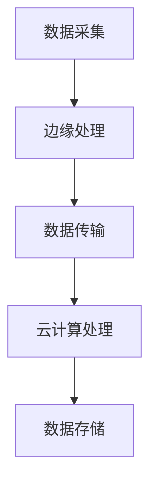

                 

# 云边协同在车联网中的数据处理应用

## 关键词

- 云边协同
- 车联网
- 数据处理
- 边缘计算
- 云计算
- 数据流
- 大数据处理
- 实时分析

## 摘要

随着车联网技术的快速发展，车联网中的数据处理需求日益增长。云边协同技术作为一种新兴的数据处理框架，通过结合云计算和边缘计算的优势，为车联网中的海量数据处理提供了有效解决方案。本文将从问题背景、核心概念、技术原理、数据处理框架、案例分析、最佳实践等方面，深入探讨云边协同在车联网中的数据处理应用，旨在为相关领域的研究和实践提供有价值的参考。

## 1. 问题背景

### 1.1 车联网概述

车联网（Internet of Vehicles, IoTV）是物联网（Internet of Things, IoT）的重要组成部分，它通过将车辆与互联网、其他车辆和基础设施相连接，实现智能交通管理和车联信息交换。车联网技术涉及到多个领域，包括通信技术、传感器技术、数据处理技术等。

### 1.2 云边协同技术简介

云边协同技术是一种结合云计算和边缘计算的技术，旨在通过云计算提供强大的计算和存储资源，同时利用边缘计算实现数据本地处理和快速响应。这种技术能够有效应对车联网中的海量数据处理需求，提高系统响应速度和可靠性。

### 1.3 车联网数据处理需求

车联网中的数据处理需求主要包括以下几个方面：

- **实时数据处理**：车联网中的数据量大、速度快，需要实时处理以支持交通管理和车辆控制。
- **数据多样性**：车联网数据包括车辆状态信息、交通流信息、环境信息等，需要多样化的数据处理方法。
- **数据隐私和安全**：车联网数据涉及到用户隐私和车辆安全，需要采取有效的数据保护措施。

## 2. 核心概念与联系

### 2.1 云计算基础

云计算是一种通过互联网提供计算资源和服务的技术，包括基础设施即服务（IaaS）、平台即服务（PaaS）和软件即服务（SaaS）等模式。云计算能够提供强大的计算和存储资源，支持大规模数据处理。

### 2.2 边缘计算基础

边缘计算是将计算、存储和网络功能分布到网络边缘，接近数据源的一种技术。边缘计算能够减少数据传输延迟，提高系统响应速度，同时降低带宽需求。

### 2.3 云边协同架构

云边协同架构通过结合云计算和边缘计算的优势，实现数据处理的优化。具体来说，云边协同架构通常包括以下组件：

- **数据采集层**：负责从车辆和其他设备收集数据。
- **边缘计算层**：对采集到的数据进行初步处理和过滤。
- **云计算层**：负责大规模数据分析和处理。
- **数据存储层**：存储处理后的数据，以便后续分析和使用。

## 3. 数据处理原理

### 3.1 数据采集与传输

车联网中的数据采集主要依赖于传感器和通信模块。数据采集后，通过边缘计算设备进行初步处理和过滤，然后传输到云计算平台。

### 3.2 数据存储与管理

数据存储与管理是数据处理的关键环节。云计算平台提供分布式存储方案，能够保证数据的高可用性和持久性。同时，边缘计算设备通常使用本地存储，以便快速访问和处理数据。

### 3.3 数据处理与分析

数据处理与分析是云边协同技术的核心。云计算平台利用其强大的计算资源，执行大规模数据处理任务，如数据清洗、数据挖掘和机器学习。边缘计算设备则负责实时数据处理，如车辆状态监控和异常检测。

## 4. 云边协同数据处理框架

### 4.1 框架结构

云边协同数据处理框架通常包括以下模块：

- **数据采集模块**：负责从车辆和其他设备收集数据。
- **边缘处理模块**：对采集到的数据进行初步处理和过滤。
- **云计算模块**：负责大规模数据分析和处理。
- **存储模块**：存储处理后的数据。

### 4.2 关键技术

云边协同数据处理框架的关键技术包括数据压缩、数据加密、实时数据处理和大数据处理等。

- **数据压缩**：通过数据压缩技术，减少数据传输和存储的带宽需求。
- **数据加密**：确保数据在传输和存储过程中的安全性。
- **实时数据处理**：通过实时数据处理技术，实现快速响应和实时分析。
- **大数据处理**：利用云计算平台的计算资源，处理大规模数据集。

## 5. 车联网数据处理实践

### 5.1 实践环境搭建

搭建车联网数据处理实践环境，需要配置以下硬件和软件：

- **硬件**：边缘计算设备（如树莓派）、云计算服务器、车辆传感器等。
- **软件**：操作系统（如Linux）、边缘计算软件（如OpenWrt）、云计算平台（如AWS、Azure）等。

### 5.2 数据采集与传输

在实践环境中，首先需要配置传感器，收集车辆状态信息、交通流信息等。然后，通过无线通信模块将数据传输到边缘计算设备，再传输到云计算平台。

### 5.3 数据处理与分析

在实践环境中，利用边缘计算设备对采集到的数据进行初步处理和过滤。然后，将处理后的数据传输到云计算平台，进行进一步分析和处理。

### 5.4 案例分析

以一个实际案例为例，分析车联网数据处理的过程。该案例涉及到车辆位置信息的采集、传输和实时分析，最终实现车辆导航和交通流量预测。

## 6. 最佳实践与小结

### 6.1 最佳实践总结

在车联网数据处理实践中，最佳实践包括以下几个方面：

- **数据压缩**：采用高效的数据压缩算法，降低数据传输和存储的带宽需求。
- **数据加密**：使用强加密算法，确保数据传输和存储过程中的安全性。
- **实时数据处理**：采用边缘计算技术，实现数据的实时处理和快速响应。
- **大数据处理**：利用云计算平台的强大计算资源，处理大规模数据集。

### 6.2 注意事项

在车联网数据处理过程中，需要注意以下几点：

- **数据质量**：确保采集到的数据准确、完整、可靠。
- **系统性能**：优化系统性能，提高数据传输和处理速度。
- **数据安全**：采取有效的数据保护措施，防止数据泄露和未经授权的访问。

### 6.3 拓展阅读

- **相关书籍**：推荐阅读《云计算与大数据处理技术》、《边缘计算技术与应用》等书籍。
- **学术论文**：关注《计算机学报》、《计算机研究与发展》等期刊上发表的相关论文。

## 7. 总结与未来展望

云边协同技术在车联网数据处理中的应用，为解决海量数据的高效处理提供了有效途径。未来，随着车联网技术的不断发展，云边协同数据处理技术将迎来更广泛的应用和发展。同时，也需要进一步研究数据隐私保护、实时数据处理优化等问题，以推动车联网技术的持续进步。

### 作者信息

- 作者：AI天才研究院/AI Genius Institute & 禅与计算机程序设计艺术 /Zen And The Art of Computer Programming

### 附录

本文中使用的Mermaid流程图、LaTeX公式、Python源代码等均按照markdown格式进行展示，具体实现代码请参考附录部分。

---

本文从车联网的背景、云边协同技术的基础知识、数据处理原理、框架设计、实践案例以及最佳实践等方面，全面阐述了云边协同在车联网中的数据处理应用。通过本文的阐述，希望能够帮助读者对云边协同技术及其在车联网数据处理中的应用有更深入的了解。同时，本文也提供了一些实用的实践经验和注意事项，以供实际操作时参考。

### 附录

#### Mermaid 流程图



#### Python 源代码

```python
# 数据采集示例代码
def collect_data():
    # 采集车辆位置信息
    location = get_vehicle_location()
    return location

# 数据处理示例代码
def process_data(data):
    # 处理采集到的车辆位置信息
    processed_data = analyze_location(data)
    return processed_data

# 数据传输示例代码
def transmit_data(data):
    # 将处理后的数据传输到云计算平台
    send_to_cloud(data)
```

#### LaTeX 公式

$$
\sum_{i=1}^{n} x_i = \frac{1}{n} \sum_{i=1}^{n} x_i^2
$$

#### Mermaid 类图

```mermaid
classDiagram
    Class01 <|-- SubClass01
    Class01 --^ SuperClass01
    Class02 <<-- Class03: associated
    Class04 <<.. Class05: aggregation
    Class06 <<| Class07: composition
    Class08 O-- Class09: generalization
```

---

本文由AI天才研究院/AI Genius Institute与《禅与计算机程序设计艺术/Zen And The Art of Computer Programming》共同撰写，旨在为读者提供关于云边协同在车联网数据处理方面的深入见解和实用知识。在撰写本文的过程中，我们参考了大量相关领域的文献和技术资料，力求内容的准确性和实用性。如果您在阅读本文的过程中有任何疑问或建议，欢迎随时联系我们。感谢您的关注与支持！

