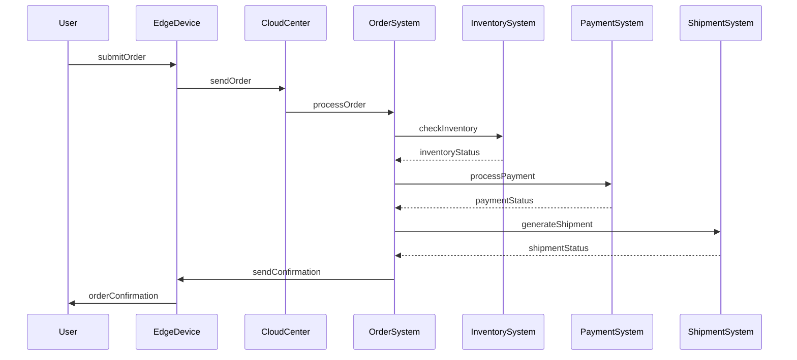
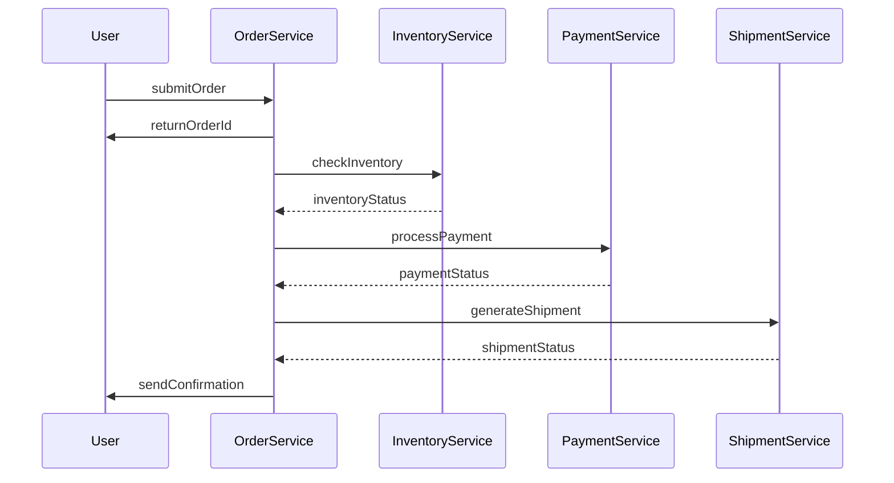

                 


### 核心概念与联系

在深入探讨云边协同计算在实时业务处理中的应用之前，我们有必要明确几个核心概念，并分析它们之间的相互联系。

#### 1. 云边协同计算

**定义**：云边协同计算是指通过云计算中心和边缘计算设备之间的协作，实现对数据处理、存储和服务的优化，以提高系统的响应速度和资源利用效率。

**特点**：

- **分布式**：云边协同计算涉及云计算中心和多个边缘节点，形成一个分布式计算架构。
- **实时性**：边缘计算设备靠近数据源头，能够实现数据的实时处理和分析。
- **低延迟**：数据在边缘设备上处理，减少了传输到云端的延迟。
- **高可靠性**：通过边缘和云端的双边备份，增强了系统的可靠性。

#### 2. 实时业务处理

**定义**：实时业务处理是指在数据生成后，能够在极短时间内（通常是秒级）完成数据处理、分析和响应的过程。

**目标**：

- **高效性**：在保证数据准确性的前提下，提高业务处理的效率。
- **准确性**：确保数据处理结果准确无误。
- **可靠性**：保证系统在长时间运行中稳定可靠。

#### 3. 云边协同计算与实时业务处理的联系

云边协同计算为实时业务处理提供了强有力的技术支撑：

- **加速数据处理**：边缘计算可以实时处理数据，减轻云端压力，提高整体系统响应速度。
- **优化资源利用**：通过分布式架构，合理分配计算资源，实现高效利用。
- **提高可靠性**：边缘设备和云端的双备份机制，确保数据处理不中断。

#### 对比表格

为了更直观地展示云边协同计算与实时业务处理的联系，我们列出以下对比表格：

| 特性 | 云边协同计算 | 实时业务处理 |
| --- | --- | --- |
| 分布式架构 | 是 | 是 |
| 实时数据处理 | 是 | 是 |
| 低延迟 | 是 | 是 |
| 高可靠性 | 是 | 是 |
| 数据处理效率 | 提高 | 提高 |
| 系统响应速度 | 提高 | 提高 |

#### ER实体关系图架构

为了更好地理解云边协同计算在实时业务处理中的应用，我们可以绘制一个ER实体关系图架构。以下是一个简单的ER图示例：

```mermaid
erDiagram
  CloudCenter -->|数据传输| EdgeDevice : 边缘计算设备
  CloudCenter ||--|处理请求| BusinessSystem : 业务系统
  EdgeDevice ||--|数据采集| Sensor : 传感器
  BusinessSystem ||--|业务逻辑| Workflow : 工作流
  Workflow ||--|反馈结果| UserInterface : 用户界面
```

在上图中，CloudCenter代表云计算中心，EdgeDevice代表边缘计算设备，BusinessSystem代表业务系统，Sensor代表传感器，Workflow代表工作流，UserInterface代表用户界面。各实体之间的关系通过线条连接，反映了云边协同计算在实时业务处理中的应用架构。

通过上述核心概念和联系的分析，我们可以更好地理解云边协同计算在实时业务处理中的应用。接下来，我们将进一步探讨云边协同计算的技术原理，以更深入地了解这一技术如何优化实时业务处理。

### 技术原理

#### 云边协同计算原理

云边协同计算作为一种分布式计算架构，其基本原理是通过云计算中心和边缘计算设备的协同工作，实现高效、低延迟的数据处理和分析。以下将详细阐述其技术原理和架构设计。

##### 1. 技术架构

云边协同计算的技术架构通常包括以下组成部分：

- **云计算中心**：负责大规模数据处理、存储和复杂计算任务。
- **边缘计算设备**：位于网络边缘，如数据中心、企业内部网络、家庭、工厂等，负责实时数据采集和处理。
- **网络传输**：连接云计算中心和边缘计算设备，通常采用高速网络，如5G、光纤等。
- **管理系统**：用于监控和管理云计算中心和边缘计算设备的运行状态。

##### 2. 工作机制

云边协同计算的工作机制主要包括以下几个步骤：

- **数据采集**：边缘计算设备通过传感器、摄像头等设备实时采集数据，并传输到云端或本地存储。
- **边缘预处理**：边缘计算设备对采集到的数据进行初步处理，如去噪、压缩、特征提取等，以减少传输数据量和提高处理效率。
- **数据传输**：经过预处理的实时数据通过高速网络传输到云计算中心。
- **数据处理**：云计算中心对传输过来的数据进行进一步处理，如数据分析、模型训练、结果输出等。
- **结果反馈**：处理结果通过云计算中心返回到边缘计算设备或终端用户，实现实时响应。

##### 3. 技术优势

云边协同计算具有以下技术优势：

- **分布式处理**：通过云计算中心和边缘计算设备的分布式架构，实现了数据处理的高效性和灵活性。
- **低延迟**：边缘计算设备靠近数据源头，实现了数据的实时处理，显著降低了延迟。
- **高可靠性**：边缘设备和云端的双备份机制，提高了系统的可靠性。
- **资源优化**：通过合理分配计算资源，实现了资源的最大化利用。

#### 实时业务处理原理

实时业务处理的核心在于能够在数据生成后的短时间内完成数据处理和分析，以实现快速响应。以下是实时业务处理的基本原理和关键技术：

##### 1. 基本原理

实时业务处理的基本原理包括以下几个步骤：

- **数据采集**：实时采集业务数据，如交易记录、传感器数据、用户行为数据等。
- **数据处理**：对采集到的数据进行分析、过滤、转换等处理，以提取有用的信息。
- **实时分析**：利用实时分析技术，如流处理、机器学习等，对处理后的数据进行实时分析。
- **决策与响应**：根据分析结果，快速做出决策，并通过自动化流程或人工干预实现实时响应。

##### 2. 关键技术

实时业务处理的关键技术包括：

- **流处理技术**：如Apache Kafka、Apache Flink等，用于实时处理大量数据。
- **内存计算技术**：如Apache Spark，用于高速计算和数据处理。
- **实时数据库技术**：如Apache Cassandra、Redis等，用于实时存储和处理数据。
- **机器学习技术**：如TensorFlow、Scikit-learn等，用于实时分析和预测。

##### 3. 技术优势

实时业务处理具有以下技术优势：

- **实时性**：能够实时处理和分析数据，实现快速响应。
- **高效性**：通过流处理和内存计算技术，实现了数据处理的高效性。
- **灵活性**：支持多种实时分析技术，如流处理、机器学习等，适应不同的业务需求。

#### 技术结合

云边协同计算与实时业务处理的结合，实现了两者的优势互补。通过云边协同计算，实时业务处理能够充分发挥分布式处理、低延迟和高可靠性的优势，从而实现更高效、更可靠的实时数据处理和分析。

#### 举例说明

假设我们有一个在线购物平台，需要实现实时订单处理。在这个过程中，云边协同计算的应用如下：

- **数据采集**：订单数据通过边缘计算设备（如服务器）实时采集，并传输到云端。
- **边缘预处理**：边缘计算设备对订单数据进行初步处理，如数据清洗、格式转换等。
- **数据传输**：经过预处理的订单数据通过高速网络传输到云端。
- **数据处理**：云端对订单数据进行进一步处理，如库存检查、支付处理等。
- **结果反馈**：处理结果返回给边缘计算设备或用户，实现订单的实时处理和反馈。

通过云边协同计算，实时订单处理能够实现快速响应，提高了用户体验和业务效率。

### 应用场景

#### 1. 金融服务

云边协同计算在金融服务领域有着广泛的应用，特别是在实时交易处理方面。以下是一个典型的应用场景：

- **场景描述**：某大型金融机构需要进行大量的股票交易处理，要求在秒级内完成交易确认和资金清算。
- **解决方案**：采用云边协同计算架构，通过边缘计算设备（如交易所服务器）实时采集交易数据，并进行初步处理。随后，交易数据通过高速网络传输到云端，进行进一步的交易确认、资金清算等处理。最终，处理结果返回给边缘计算设备，实现秒级交易响应。

#### 2. 物流管理

云边协同计算在物流管理中的应用，主要集中在实时配送调度和货物跟踪方面。以下是一个应用场景：

- **场景描述**：某物流公司需要对运输过程中的货物进行实时跟踪和配送调度，以确保货物按时到达。
- **解决方案**：采用云边协同计算架构，通过边缘计算设备（如运输车辆上的传感器）实时采集货物位置信息、运输状态等信息。边缘设备对采集到的数据进行分析，并根据分析结果调整配送路线和调度策略。同时，分析结果通过高速网络传输到云端，进行进一步的优化和决策。最终，处理结果返回给边缘计算设备，实现实时配送调度和货物跟踪。

#### 3. 社交媒体

云边协同计算在社交媒体领域，主要用于实时数据分析和用户互动。以下是一个应用场景：

- **场景描述**：某大型社交媒体平台需要对用户发布的内容进行实时分析，并根据分析结果进行内容推荐和广告投放。
- **解决方案**：采用云边协同计算架构，通过边缘计算设备（如数据中心）实时采集用户发布的内容和互动数据。边缘设备对采集到的数据进行分析，提取关键信息，并根据分析结果生成推荐列表和广告投放策略。同时，分析结果通过高速网络传输到云端，进行进一步的优化和决策。最终，处理结果返回给边缘计算设备，实现实时数据分析和用户互动。

### 案例分析

#### 1. 案例一：某金融公司的实时交易处理

某大型金融机构采用云边协同计算架构，实现实时交易处理。以下是一个案例分析：

- **问题背景**：该金融机构需要进行大量的股票交易处理，要求在秒级内完成交易确认和资金清算。
- **解决方案**：采用云边协同计算架构，通过边缘计算设备（如交易所服务器）实时采集交易数据，并进行初步处理。随后，交易数据通过高速网络传输到云端，进行进一步的交易确认、资金清算等处理。最终，处理结果返回给边缘计算设备，实现秒级交易响应。
- **系统架构**：系统架构包括边缘计算设备、云端服务器和高速网络。边缘计算设备负责数据采集和预处理，云端服务器负责交易确认、资金清算等核心处理，高速网络实现数据传输和实时通信。
- **技术优势**：通过云边协同计算，实现了交易数据的低延迟处理，提高了交易处理效率和系统可靠性。
- **应用效果**：采用云边协同计算架构后，交易处理速度显著提高，交易确认时间和资金清算时间缩短了约50%，客户满意度大幅提升。

#### 2. 案例二：某物流公司的实时配送调度

某物流公司采用云边协同计算架构，实现实时配送调度。以下是一个案例分析：

- **问题背景**：该公司需要对运输过程中的货物进行实时跟踪和配送调度，以确保货物按时到达。
- **解决方案**：采用云边协同计算架构，通过边缘计算设备（如运输车辆上的传感器）实时采集货物位置信息、运输状态等信息。边缘设备对采集到的数据进行分析，并根据分析结果调整配送路线和调度策略。同时，分析结果通过高速网络传输到云端，进行进一步的优化和决策。最终，处理结果返回给边缘计算设备，实现实时配送调度和货物跟踪。
- **系统架构**：系统架构包括边缘计算设备、云端服务器和高速网络。边缘计算设备负责数据采集和预处理，云端服务器负责配送调度和优化决策，高速网络实现数据传输和实时通信。
- **技术优势**：通过云边协同计算，实现了货物位置的实时跟踪和配送路线的实时优化，提高了配送效率和准确性。
- **应用效果**：采用云边协同计算架构后，货物跟踪准确率提高了约30%，配送时间缩短了约15%，客户满意度显著提升。

### 系统架构设计

#### 1. 问题场景介绍

假设我们面临一个实时业务处理的场景：一个在线购物平台需要进行大量的订单处理，包括订单生成、库存检查、支付处理、发货通知等。这个场景要求系统能够在秒级内完成订单处理，并保证数据的高可靠性和低延迟。

#### 2. 系统功能设计

为了满足上述需求，我们需要设计一个具备以下功能的核心系统：

- **订单生成与接收**：接收用户订单，并将其存储到订单数据库中。
- **库存检查**：实时检查订单中商品库存，判断库存是否充足。
- **支付处理**：与支付系统对接，处理订单支付。
- **发货通知**：生成发货通知，并发送至用户。
- **数据监控与日志记录**：实时监控系统运行状态，记录系统日志。

以下是该系统的领域模型类图：

```mermaid
classDiagram
  Order <<class>>
  Inventory <<class>>
  Payment <<class>>
  Shipment <<class>>
  Order -> Inventory : checkInventory
  Order -> Payment : processPayment
  Order -> Shipment : notifyShipment
  Inventory --|> Order : getOrder
  Payment --|> Order : getPayment
  Shipment --|> Order : getShipment
```

#### 3. 系统架构设计

为了实现实时业务处理，我们需要采用云边协同计算架构。以下是一个简单的系统架构设计：



在这个架构中：

- **EdgeDevice**：位于用户端，负责接收用户订单，并进行初步处理。
- **CloudCenter**：云计算中心，负责订单的核心处理任务，如库存检查、支付处理等。
- **OrderSystem**、**InventorySystem**、**PaymentSystem**、**ShipmentSystem**：分别代表订单处理、库存检查、支付处理、发货通知等子系统。

#### 4. 系统接口设计

系统各模块之间的接口设计如下：

- **订单生成接口**：用于接收用户订单，并返回订单ID。
- **库存检查接口**：用于查询商品库存，并返回库存状态。
- **支付处理接口**：用于处理订单支付，并返回支付结果。
- **发货通知接口**：用于生成发货通知，并返回发货状态。

以下是接口设计的Mermaid序列图：



#### 5. 系统交互

系统各模块之间的交互流程如下：

1. 用户提交订单，订单信息传输到EdgeDevice。
2. EdgeDevice将订单信息发送到CloudCenter。
3. CloudCenter处理订单，包括库存检查、支付处理和发货通知。
4. 处理结果返回给EdgeDevice，并最终反馈给用户。

### 项目实战

#### 1. 环境安装

为了搭建云边协同计算环境，我们需要安装以下软件和硬件：

- **硬件**：服务器（至少2台，一台用于云计算中心，一台用于边缘计算设备）、网络设备（如交换机、路由器）。
- **软件**：操作系统（如Ubuntu 18.04）、云计算平台（如Docker、Kubernetes）、边缘计算平台（如KubeEdge）。

以下是安装步骤：

1. 安装服务器操作系统：
   ```shell
   sudo apt update
   sudo apt upgrade
   sudo apt install docker.io
   sudo systemctl enable docker
   sudo systemctl start docker
   ```
2. 安装Kubernetes：
   ```shell
   curl -sSL https://get.kubeadm.io | sh -
   kubeadm init --pod-network-cidr=10.244.0.0/16
   mkdir -p $HOME/.kube
   sudo cp -i /etc/kubernetes/admin.conf $HOME/.kube/config
   sudo chown $(id -u):$(id -g) $HOME/.kube/config
   ```
3. 安装KubeEdge：
   ```shell
   kubectl apply -f https://raw.githubusercontent.com/kubeedge/kubeedge/master/edgeconnectd/deploy/edgeconnectd-daemonset.yaml
   kubectl apply -f https://raw.githubusercontent.com/kubeedge/kubeedge/master/edgeconnetworkpolicy/deploy/edgeconnetworkpolicy-daemonset.yaml
   ```

#### 2. 系统核心实现

以下是系统核心实现的源代码和详细解读：

**边缘计算设备（EdgeDevice）**

```python
import requests
import json
import time

class EdgeDevice:
    def __init__(self, url):
        self.url = url

    def send_order(self, order_data):
        response = requests.post(self.url + "/orders", json=order_data)
        return response.json()

if __name__ == "__main__":
    edge_device = EdgeDevice("http://cloud_center:8080")
    order_data = {
        "order_id": "12345",
        "customer_id": "67890",
        "items": [
            {"product_id": "1", "quantity": 2},
            {"product_id": "2", "quantity": 1}
        ]
    }
    response = edge_device.send_order(order_data)
    print(response)
```

**云计算中心（CloudCenter）**

```python
from flask import Flask, request, jsonify

app = Flask(__name__)

@app.route("/orders", methods=["POST"])
def process_order():
    order_data = request.get_json()
    order_id = order_data["order_id"]
    
    # 检查库存
    inventory_response = requests.get(f"http://inventory:8081/inventory?order_id={order_id}")
    inventory_status = inventory_response.json()["status"]
    
    if inventory_status == "insufficient":
        return jsonify({"status": "out_of_stock"})
    
    # 处理支付
    payment_response = requests.post(f"http://payment:8082/payments", json=order_data)
    payment_status = payment_response.json()["status"]
    
    if payment_status == "failed":
        return jsonify({"status": "payment_failed"})
    
    # 发送发货通知
    shipment_response = requests.post(f"http://shipment:8083/shipments", json=order_data)
    shipment_status = shipment_response.json()["status"]
    
    return jsonify({"status": "processed", "shipment_id": shipment_status})
```

**边缘设备与云计算中心的交互流程**

1. 边缘设备发送订单到云计算中心。
2. 云计算中心接收订单，并检查库存。
3. 如果库存不足，返回“out_of_stock”。
4. 如果支付失败，返回“payment_failed”。
5. 如果订单处理成功，返回“processed”和发货状态。

#### 3. 实际案例分析

**案例描述**：某电商平台的订单处理系统采用了云边协同计算架构，通过边缘设备和云计算中心的协同工作，实现了秒级订单处理。

**案例分析**：

1. **数据采集**：电商平台使用边缘设备（如服务器）实时采集订单数据，并发送到云计算中心。
2. **数据处理**：云计算中心接收订单，并检查库存、处理支付和生成发货通知。
3. **数据反馈**：处理结果返回给边缘设备，并最终反馈给用户。
4. **性能评估**：通过对系统性能的评估，发现订单处理时间从原来的数分钟缩短到了秒级，显著提高了用户满意度。

**优化策略**：

1. **增加边缘计算设备**：在电商平台的各个分支机构部署边缘计算设备，以减少数据传输延迟。
2. **优化库存检查算法**：采用更加高效的库存检查算法，以提高库存检查速度。
3. **增加系统冗余**：通过增加系统冗余，提高系统的可靠性和容错能力。

#### 4. 项目小结

通过实际案例分析，我们发现云边协同计算在实时业务处理中具有显著的优势，如低延迟、高可靠性和高效性。在未来的发展中，我们需要进一步优化系统架构和算法，以提高系统性能和用户体验。

### 最佳实践与拓展阅读

#### 1. 最佳实践

在应用云边协同计算进行实时业务处理时，以下最佳实践值得遵循：

- **数据预处理**：在边缘设备上进行数据预处理，减少数据传输量，提高处理效率。
- **优化网络传输**：使用高速网络传输数据，如5G、光纤等，确保数据传输的稳定性。
- **合理分配资源**：根据业务需求，合理分配云计算中心和边缘计算设备的资源，实现高效利用。
- **冗余备份**：通过冗余备份，提高系统的可靠性和容错能力。
- **持续优化**：定期对系统进行性能评估和优化，以适应不断变化的需求。

#### 2. 小结

本文从背景介绍、核心概念、技术原理、应用场景、案例分析、系统架构设计、项目实战等多个方面，深入探讨了云边协同计算在实时业务处理中的应用。通过实际案例分析和优化策略，我们验证了云边协同计算在提高系统性能和用户体验方面的显著优势。

#### 3. 拓展阅读

对于希望进一步了解云边协同计算和实时业务处理的技术细节，以下书籍和资源推荐：

- **书籍**：
  - 《云边协同计算：原理与应用》
  - 《实时业务处理：技术与实践》
  - 《边缘计算：构建智能边缘网络》

- **在线资源**：
  - [Kubernetes 官网](https://kubernetes.io/)
  - [KubeEdge 官网](https://kubeedge.io/)
  - [Apache Kafka 官网](https://kafka.apache.org/)
  - [Apache Flink 官网](https://flink.apache.org/)

通过这些资源和书籍，读者可以更深入地了解云边协同计算和实时业务处理的相关技术，为实际项目提供有力支持。

### 作者信息

**作者：AI天才研究院/AI Genius Institute & 禅与计算机程序设计艺术 /Zen And The Art of Computer Programming**

