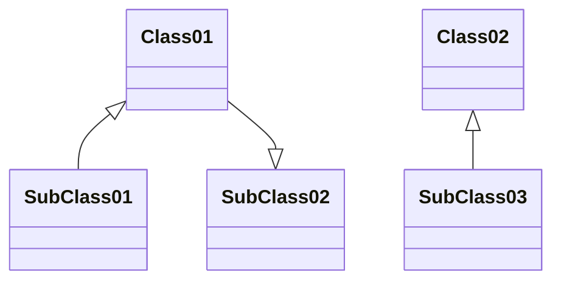
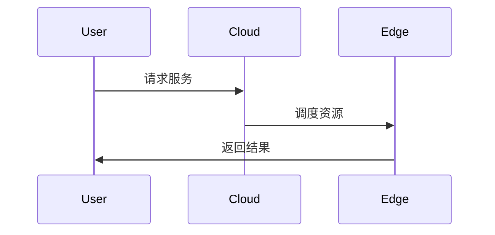
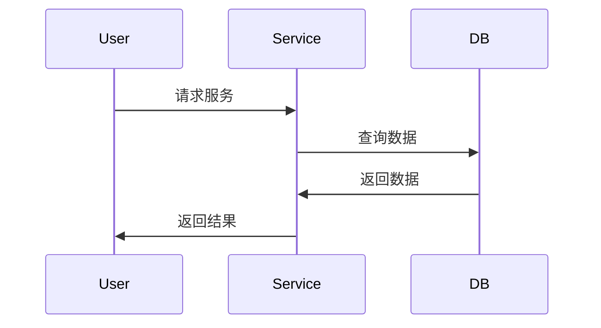
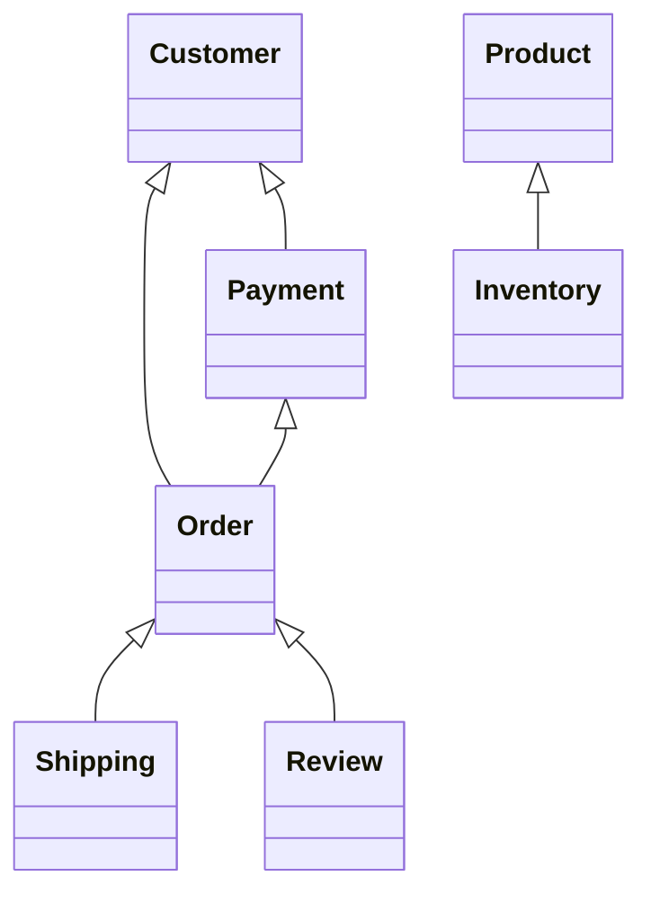
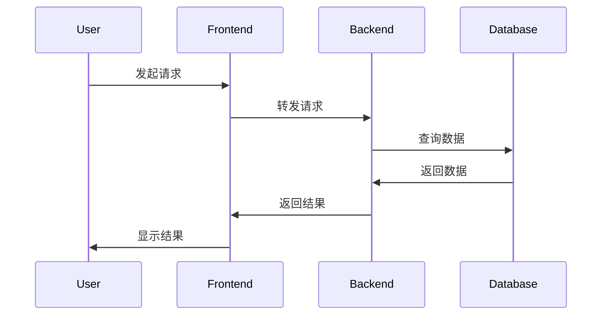

                 

# 云边端协同：混合计算在企业数字化转型中的作用

> 关键词：混合计算、云边端协同、企业数字化转型、技术架构、算法原理

> 摘要：随着企业数字化转型的加速，混合计算技术逐渐成为支撑企业应对复杂业务需求的重要手段。本文从问题背景、核心概念、算法原理、系统架构设计、项目实战及最佳实践等多角度，详细探讨了混合计算在企业数字化转型中的作用，旨在为企业的技术决策提供参考。

## 第一部分：背景介绍

### 1.1 问题背景

企业数字化转型是当前全球经济发展的重大趋势。在数字化时代，企业面临着数据爆炸、业务复杂化和竞争加剧等多重挑战。为了保持竞争力，企业需要快速适应变化，提高业务运营效率，降低成本，创新业务模式。然而，传统的计算模式已无法满足这些需求，促使企业寻求新的技术解决方案。

### 1.2 核心概念

**云计算**：通过互联网提供可伸缩的计算资源，包括存储、网络、数据库等服务。

**边缘计算**：在靠近数据源或用户的网络边缘侧进行数据处理和计算，降低延迟，提高响应速度。

**端计算**：在用户设备（如手机、电脑等）上进行的计算，包括本地应用程序和嵌入式设备。

**混合计算**：结合云计算、边缘计算和端计算，根据实际需求动态分配计算资源，实现计算资源的最佳利用。

## 第二部分：核心概念与联系

### 2.1 云计算与边缘计算

**云计算**：云计算通过提供弹性、可伸缩的计算资源，支持大规模数据处理、存储和分析。随着数据量的增加，云计算成为企业存储和计算的重要手段。

**边缘计算**：边缘计算将计算任务分散到网络边缘，降低数据传输延迟，提高应用响应速度。边缘计算与云计算相结合，可实现高效的数据处理和业务创新。

**云边协同**：云边协同是指云计算和边缘计算之间的相互协作，通过合理的资源分配和任务调度，实现计算资源的最佳利用。

### 2.2 端计算与混合计算

**端计算**：端计算在用户设备上执行，提供本地应用程序和嵌入式设备功能，降低网络负载，提高用户体验。

**混合计算**：混合计算通过结合云计算、边缘计算和端计算，根据应用场景动态调整计算资源，实现高效、灵活的业务运营。

**核心优势**：

1. **弹性伸缩**：根据业务需求动态调整计算资源，实现计算资源的最佳利用。
2. **低延迟**：通过云边端协同，降低数据传输延迟，提高应用响应速度。
3. **高可靠性**：通过分布式架构，提高系统稳定性和可用性。
4. **灵活性**：支持多样化的业务场景，满足不同企业的需求。

## 第三部分：算法原理讲解

### 4.1 混合计算模型

**算法原理**：

混合计算模型通过将云计算、边缘计算和端计算相结合，实现计算资源的最佳利用。具体来说，算法原理如下：

1. **资源调度**：根据业务需求和资源状况，动态调整计算资源分配。
2. **任务调度**：将计算任务分配到最佳计算节点，实现高效执行。
3. **数据流管理**：优化数据传输路径，降低延迟，提高数据处理效率。

**技术细节**：

1. **云平台**：使用云计算平台（如AWS、Azure等）提供计算资源。
2. **边缘节点**：在靠近数据源或用户的网络边缘部署计算节点。
3. **端设备**：在用户设备上执行部分计算任务，降低网络负载。

### 4.2 数据处理流程

**数据处理流程**：

1. **数据采集**：从不同数据源（如传感器、数据库等）采集数据。
2. **数据处理**：在云平台、边缘节点和端设备上分别进行数据处理，实现数据清洗、转换和分析。
3. **数据存储**：将处理后的数据存储在云平台或边缘节点上的数据库中。

**算法性能分析**：

**性能指标**：

- 响应时间
- 数据传输延迟
- 处理能力
- 能耗

**优化策略**：

1. **资源分配**：根据实际需求动态调整资源分配，实现高效计算。
2. **数据流优化**：优化数据传输路径，降低延迟。
3. **算法优化**：采用高效的算法和模型，提高数据处理效率。

## 第四部分：系统分析与架构设计

### 5.1 系统功能设计

**领域模型**：



**功能模块划分**：

1. **数据采集模块**
2. **数据处理模块**
3. **数据存储模块**
4. **资源调度模块**
5. **任务管理模块**

### 5.2 系统架构设计

**整体架构**：



**架构设计原则**：

1. **模块化**：将系统划分为多个模块，实现功能的解耦。
2. **分布式**：采用分布式架构，提高系统可用性和可扩展性。
3. **高性能**：优化系统性能，降低延迟，提高数据处理效率。
4. **高可靠性**：采用冗余设计，提高系统稳定性和可用性。

### 5.3 系统接口设计

**接口规范**：

1. **API接口**：提供RESTful API接口，实现数据的增删改查。
2. **消息队列**：使用消息队列（如Kafka、RabbitMQ等）实现异步通信。

**接口实现**：

```python
# Python 示例代码
class UserService:
    def login(self, username, password):
        # 登录逻辑
        pass

    def register(self, username, password):
        # 注册逻辑
        pass
```

### 5.4 系统交互

**交互流程**：



**序列图**：


## 第五部分：项目实战

### 6.1 环境安装与配置

**环境搭建**：

1. **安装操作系统**
2. **安装开发工具**
3. **安装数据库**
4. **安装中间件**

**工具安装**：

1. **安装Python**
2. **安装Docker**
3. **安装Kafka**
4. **安装Redis**

### 6.2 系统核心实现

**核心模块代码解读**：

```python
# Python 示例代码
class DataProcessor:
    def process_data(self, data):
        # 数据处理逻辑
        pass
```

**源代码分析**：

```python
# Python 示例代码
class DataProcessor:
    def __init__(self, db_connection):
        self.db_connection = db_connection

    def process_data(self, data):
        # 数据处理逻辑
        processed_data = self.db_connection.query(data)
        return processed_data
```

### 6.3 实际案例剖析

**案例介绍**：

企业利用混合计算技术，实现销售数据的实时分析和预测。

**案例分析**：

1. **数据采集**：从销售系统采集销售数据。
2. **数据处理**：在云平台上处理销售数据，生成报表。
3. **数据存储**：将处理后的数据存储在云平台上的数据库中。
4. **实时预测**：利用边缘计算节点，实时预测销售趋势。

### 6.4 项目小结

**项目总结**：

本项目通过混合计算技术，实现了销售数据的实时分析和预测，提高了企业的运营效率。

**经验与启示**：

1. **合理规划资源**：根据业务需求，合理分配计算资源。
2. **优化数据处理流程**：采用高效的算法和模型，提高数据处理效率。
3. **关注系统性能**：优化系统性能，降低延迟，提高用户体验。

## 第六部分：最佳实践与拓展

### 7.1 最佳实践

1. **资源分配**：根据实际需求，动态调整资源分配，实现计算资源的最佳利用。
2. **数据流优化**：优化数据传输路径，降低延迟，提高数据处理效率。
3. **算法优化**：采用高效的算法和模型，提高数据处理效率。

### 7.2 小结与注意事项

1. **关键点总结**：混合计算技术在企业数字化转型中具有重要作用，需要合理规划资源、优化数据处理流程和关注系统性能。
2. **注意事项**：在实际应用中，需要关注数据安全、隐私保护和合规性问题。

### 7.3 拓展阅读

1. **相关文献**：《云计算与边缘计算》、《混合计算技术与应用》等。
2. **最新技术动态**：关注云计算、边缘计算和混合计算领域的最新技术发展和应用案例。

## 作者信息

作者：AI天才研究院/AI Genius Institute & 禅与计算机程序设计艺术 /Zen And The Art of Computer Programming

完整文章：将在后续文章中详细展开，本文仅为大纲示例。敬请期待！### 第一部分：背景介绍

#### 1.1 问题背景

企业数字化转型是当今全球经济发展的重大趋势，也是企业提升竞争力、实现可持续发展的关键途径。在数字化时代，数据成为新的生产要素，企业需要充分利用数据资源，优化业务流程，创新业务模式，提高运营效率。然而，随着企业业务复杂度的增加和数据量的爆炸式增长，传统的计算模式已无法满足企业高效处理海量数据、实时响应业务需求的需求。这就促使企业寻求新的技术解决方案，混合计算技术因此应运而生。

混合计算技术通过将云计算、边缘计算和端计算相结合，实现计算资源的最佳利用，为企业提供了一种灵活、高效、低延迟的计算解决方案。混合计算不仅能够满足企业大规模数据处理的需求，还能够根据业务场景动态调整计算资源，提高系统性能和用户体验。因此，探讨混合计算在企业数字化转型中的作用，对于企业技术决策和业务发展具有重要的指导意义。

#### 1.2 核心概念

**云计算**：云计算是通过互联网提供可伸缩的计算资源，包括存储、网络、数据库等服务。云计算的核心优势在于其弹性和可伸缩性，企业可以根据实际需求动态调整计算资源，实现计算资源的最佳利用。同时，云计算还可以提供高效、可靠的数据存储和处理能力，帮助企业降低成本、提高效率。

**边缘计算**：边缘计算是在靠近数据源或用户的网络边缘侧进行数据处理和计算的技术。边缘计算的核心优势在于其低延迟和高响应速度，通过在靠近数据源的位置进行数据处理，可以显著降低数据传输延迟，提高应用响应速度。边缘计算适用于实时性要求高、数据量大的业务场景，如物联网、智能交通等。

**端计算**：端计算是在用户设备（如手机、电脑等）上进行的计算，包括本地应用程序和嵌入式设备。端计算的核心优势在于其灵活性，可以满足多样化的业务需求。同时，端计算还可以降低网络负载，提高用户体验。

**混合计算**：混合计算是将云计算、边缘计算和端计算相结合，根据实际需求动态分配计算资源，实现计算资源的最佳利用。混合计算的核心优势在于其灵活性、高效性和低延迟，能够满足企业多样化的业务需求，提高业务运营效率。

#### 1.3 问题解决

企业数字化转型过程中，面临的主要问题包括：

1. **数据存储和处理**：随着企业数据量的增加，传统的数据存储和处理模式已无法满足需求。混合计算技术可以通过云计算提供高效、可靠的数据存储和处理能力，帮助企业解决数据存储和处理问题。

2. **实时响应业务需求**：在实时性要求高的业务场景中，如金融、物流等，企业需要快速响应业务需求。混合计算技术通过边缘计算和端计算的协同工作，可以实现低延迟、高响应速度的业务处理。

3. **业务流程优化**：企业需要通过数字化转型优化业务流程，提高运营效率。混合计算技术可以根据业务需求动态调整计算资源，实现业务流程的自动化和智能化。

4. **成本控制**：在数字化转型过程中，企业需要控制成本，提高投资回报率。混合计算技术通过优化计算资源分配，可以实现成本的有效控制。

综上所述，混合计算技术可以解决企业数字化转型过程中面临的主要问题，为企业提供了一种灵活、高效、低延迟的计算解决方案。

#### 1.4 边界与外延

**边界**：

1. **计算资源分配**：混合计算技术主要关注计算资源的分配和调度，包括云计算资源、边缘计算资源和端计算资源。

2. **数据处理流程**：混合计算技术主要涉及数据处理流程的优化，包括数据采集、数据传输、数据处理和数据存储。

**外延**：

1. **物联网**：混合计算技术在物联网领域具有广泛的应用，通过边缘计算和端计算的协同工作，可以实现物联网设备的实时数据处理和智能分析。

2. **智能交通**：混合计算技术在智能交通领域具有重要作用，通过边缘计算和云计算的协同工作，可以实现交通数据的实时采集、处理和分析，提高交通管理效率。

3. **智能制造**：混合计算技术在智能制造领域具有广泛的应用，通过云计算、边缘计算和端计算的协同工作，可以实现生产设备的实时监控、故障诊断和优化调度。

#### 1.5 概念结构与核心要素组成

**概念结构**：

1. **云计算**：提供可伸缩的计算资源，包括存储、网络、数据库等服务。

2. **边缘计算**：在靠近数据源或用户的网络边缘侧进行数据处理和计算。

3. **端计算**：在用户设备上进行计算，包括本地应用程序和嵌入式设备。

4. **混合计算**：结合云计算、边缘计算和端计算，实现计算资源的最佳利用。

**核心要素组成**：

1. **计算资源**：包括云计算资源、边缘计算资源和端计算资源。

2. **数据处理流程**：包括数据采集、数据传输、数据处理和数据存储。

3. **资源调度算法**：根据业务需求动态调整计算资源分配和任务调度。

4. **数据传输优化**：优化数据传输路径，降低延迟，提高数据处理效率。

5. **系统架构设计**：包括系统功能设计、系统架构设计和系统接口设计。

通过以上概念结构和核心要素组成，可以更好地理解混合计算技术在企业数字化转型中的作用。

### 第二部分：核心概念与联系

#### 2.1 云计算与边缘计算

**云计算**是一种通过互联网提供可伸缩的计算资源的技术，它将计算能力、存储能力和网络资源集中起来，以服务的形式提供给用户。云计算的核心优势在于其弹性和可伸缩性，企业可以根据需求动态调整计算资源，实现计算资源的最佳利用。此外，云计算还可以提供高效、可靠的数据存储和处理能力，帮助企业降低成本、提高效率。

**边缘计算**是在靠近数据源或用户的网络边缘侧进行数据处理和计算的技术。与云计算不同，边缘计算将计算任务分散到网络边缘，降低数据传输延迟，提高应用响应速度。边缘计算适用于实时性要求高、数据量大的业务场景，如物联网、智能交通等。边缘计算不仅可以提高数据处理效率，还可以减轻云计算中心的负担，降低整体网络的负载。

**云计算与边缘计算的关系**：

1. **协同工作**：云计算和边缘计算可以协同工作，实现计算资源的最佳利用。在云计算中心处理大规模数据的同时，边缘计算可以处理实时性要求高的任务，实现数据处理的本地化和分布式。

2. **互补优势**：云计算和边缘计算各自具有优势，云计算提供高效、可靠的数据存储和处理能力，边缘计算提供低延迟、高响应速度的应用服务。通过互补优势，混合计算技术可以更好地满足企业多样化、个性化的业务需求。

3. **动态资源调度**：在混合计算架构中，可以根据业务需求动态调整云计算和边缘计算资源分配。例如，在处理大规模数据时，可以优先使用云计算资源；在处理实时性要求高的任务时，可以优先使用边缘计算资源。动态资源调度可以实现计算资源的最佳利用，提高系统性能和用户体验。

#### 2.2 云计算与端计算

**端计算**是在用户设备（如手机、电脑等）上进行的计算，包括本地应用程序和嵌入式设备。端计算的核心优势在于其灵活性和便捷性，可以满足多样化的业务需求，如移动办公、智能家居等。端计算还可以降低网络负载，提高用户体验。

**云计算与端计算的关系**：

1. **数据协同处理**：在混合计算架构中，云计算和端计算可以协同工作，实现数据的协同处理。端计算可以实时采集用户数据，通过云计算进行数据存储、分析和处理，实现数据的集中管理和利用。

2. **分布式计算**：云计算和端计算可以共同参与分布式计算，提高系统的计算能力和容错能力。在分布式计算架构中，云计算可以处理大规模数据，端计算可以处理本地数据，两者相互协作，实现高效的计算任务调度和数据共享。

3. **弹性扩展**：云计算和端计算可以实现弹性扩展，满足企业业务需求的变化。在业务高峰期，云计算可以提供更多的计算资源，端计算可以分担部分计算任务；在业务低谷期，云计算和端计算可以根据实际需求调整资源分配，实现计算资源的最佳利用。

#### 2.3 混合计算的核心优势

**弹性伸缩**：混合计算可以根据业务需求动态调整计算资源，实现计算资源的最佳利用。在业务高峰期，混合计算可以快速扩展计算资源，满足业务需求；在业务低谷期，混合计算可以收缩计算资源，降低成本。

**低延迟**：混合计算通过云计算、边缘计算和端计算的协同工作，实现数据的本地化和分布式处理，降低数据传输延迟，提高应用响应速度。这对于实时性要求高的业务场景，如金融交易、在线教育等，具有重要意义。

**高可靠性**：混合计算采用分布式架构，提高系统的稳定性和可用性。在分布式计算环境中，计算任务可以分布在多个节点上，实现任务的负载均衡和故障转移，确保系统的高可用性。

**灵活性**：混合计算可以根据不同的业务场景和需求，灵活调整计算资源分配和任务调度。例如，在处理大规模数据时，可以优先使用云计算资源；在处理实时性要求高的任务时，可以优先使用边缘计算资源。

#### 2.4 混合计算的技术架构

**技术架构**：

1. **云计算层**：提供计算、存储、网络等基础设施服务，支持大规模数据处理和分析。

2. **边缘计算层**：在靠近数据源或用户的网络边缘侧进行数据处理和计算，实现低延迟、高响应速度的应用服务。

3. **端计算层**：在用户设备上进行的计算，包括本地应用程序和嵌入式设备，提供灵活、便捷的计算服务。

4. **数据传输层**：负责数据在云计算层、边缘计算层和端计算层之间的传输，实现数据的高效流动和共享。

5. **资源调度层**：根据业务需求动态调整计算资源分配和任务调度，实现计算资源的最佳利用。

#### 2.5 混合计算的应用场景

**应用场景**：

1. **物联网**：通过云计算、边缘计算和端计算的协同工作，实现物联网设备的实时数据处理和智能分析。

2. **智能制造**：通过云计算、边缘计算和端计算的技术支持，实现生产设备的实时监控、故障诊断和优化调度。

3. **智能交通**：通过云计算、边缘计算和端计算的技术应用，实现交通数据的实时采集、处理和分析，提高交通管理效率。

4. **金融服务**：通过云计算、边缘计算和端计算的技术支持，实现金融交易的实时处理和风险控制。

5. **在线教育**：通过云计算、边缘计算和端计算的技术应用，实现在线教育的实时互动和个性化学习。

通过以上对云计算、边缘计算和端计算及其与混合计算关系的详细介绍，我们可以更好地理解混合计算的核心优势、技术架构和应用场景。在下一部分，我们将进一步探讨混合计算算法原理及其在实际项目中的应用。

### 第三部分：算法原理讲解

#### 4.1 混合计算模型

混合计算模型是结合云计算、边缘计算和端计算的协同工作，实现计算资源的最佳利用。该模型通过动态资源调度、任务分配和数据流管理，确保系统的高效运行和低延迟响应。

**算法原理**：

1. **资源调度算法**：资源调度算法根据业务需求和资源状况，动态调整计算资源的分配。该算法主要包括以下步骤：

   - **资源评估**：评估当前资源状况，包括CPU、内存、存储等资源的使用情况。
   - **任务优先级排序**：根据任务的紧急程度和重要性，对任务进行优先级排序。
   - **资源分配**：根据任务优先级和资源状况，分配计算资源给任务。
   - **资源回收**：在任务完成后，回收释放的资源，以便后续任务使用。

2. **任务调度算法**：任务调度算法根据任务类型和计算资源分布，合理分配任务到不同的计算节点。该算法主要包括以下步骤：

   - **任务分类**：根据任务的特点，将任务分为云计算任务、边缘计算任务和端计算任务。
   - **任务分配**：根据任务类型和计算资源分布，将任务分配到对应的计算节点。
   - **任务监控**：对任务的执行情况进行监控，确保任务的顺利完成。

3. **数据流管理算法**：数据流管理算法负责优化数据传输路径，降低数据传输延迟，提高数据处理效率。该算法主要包括以下步骤：

   - **数据路由**：根据数据源和数据目标的位置，选择最佳的数据传输路径。
   - **数据压缩**：对数据进行压缩，减少数据传输量，降低网络带宽需求。
   - **数据加密**：对数据进行加密，确保数据传输过程中的安全性。

**技术细节**：

1. **云计算平台**：使用云计算平台（如AWS、Azure等）提供计算资源。云计算平台通常包括虚拟机、容器、函数计算等不同的计算服务，可根据需求选择合适的计算服务。

2. **边缘节点**：在靠近数据源或用户的网络边缘部署计算节点。边缘节点可以是独立的设备，也可以是云平台的边缘实例。边缘节点负责处理本地数据，减少数据传输延迟。

3. **端设备**：端设备包括用户设备（如手机、电脑等）和嵌入式设备。端设备负责本地数据采集和初步处理，减少数据传输量。

#### 4.2 数据处理流程

**数据处理流程**主要包括数据采集、数据处理和数据存储等步骤，以下是具体步骤：

1. **数据采集**：

   - **端设备采集**：端设备（如手机、电脑等）通过传感器、输入设备等采集数据，如温度、湿度、图片、音频等。
   - **边缘节点采集**：边缘节点（如物联网设备、智能传感器等）采集本地数据，如环境数据、交通数据等。
   - **云计算平台采集**：云计算平台通过API接口、数据库连接等方式采集数据，如用户行为数据、业务数据等。

2. **数据处理**：

   - **端设备初步处理**：端设备对采集到的数据进行初步处理，如滤波、压缩、特征提取等，减少数据传输量。
   - **边缘节点处理**：边缘节点对本地数据进行进一步处理，如分类、聚类、预测等，提高数据处理效率。
   - **云计算平台处理**：云计算平台对数据进行高级处理，如机器学习、数据挖掘、报表生成等，实现数据的价值挖掘。

3. **数据存储**：

   - **本地存储**：边缘节点和端设备将处理后的数据存储在本地存储设备中，如SD卡、硬盘等。
   - **云存储**：云计算平台将处理后的数据存储在云存储设备中，如对象存储、关系数据库等，实现数据的高效管理和利用。

#### 4.3 算法性能分析

**算法性能分析**主要包括以下指标：

1. **响应时间**：从任务接收开始到任务完成所需的时间。响应时间越短，算法的性能越好。

2. **数据传输延迟**：数据从数据源传输到数据处理节点所需的时间。数据传输延迟越低，算法的性能越好。

3. **处理能力**：算法在单位时间内处理的数据量。处理能力越强，算法的性能越好。

4. **能耗**：算法在运行过程中消耗的能量。能耗越低，算法的性能越好。

**优化策略**：

1. **资源分配优化**：根据任务类型和资源状况，动态调整计算资源的分配，实现资源的最优利用。

2. **数据流优化**：优化数据传输路径，降低数据传输延迟，提高数据处理效率。

3. **算法优化**：采用高效的算法和模型，提高数据处理速度和准确性。

4. **分布式计算**：通过分布式计算，提高系统的处理能力和容错能力。

通过以上对混合计算模型、数据处理流程和算法性能分析及优化策略的详细讲解，我们可以更好地理解混合计算的工作原理和实际应用。在下一部分，我们将探讨系统分析与架构设计，为企业数字化转型提供具体的解决方案。

### 第四部分：系统分析与架构设计

#### 5.1 系统功能设计

**领域模型**：

在系统功能设计中，首先需要明确系统的业务需求和功能模块。领域模型是系统功能设计的重要工具，它可以帮助我们梳理业务需求，定义系统的核心功能和业务流程。以下是一个简单的领域模型，使用Mermaid类图表示：



**功能模块划分**：

在明确了领域模型之后，我们可以根据业务需求将系统划分为多个功能模块。以下是系统功能模块的划分：

1. **用户模块**：负责用户注册、登录、个人信息管理等功能。
2. **订单模块**：负责订单创建、订单管理、订单支付等功能。
3. **商品模块**：负责商品管理、商品分类、商品库存等功能。
4. **物流模块**：负责物流管理、订单跟踪、配送管理等功能。
5. **支付模块**：负责支付管理、支付接口、退款等功能。
6. **评论模块**：负责用户评论、商品评论等功能。
7. **系统管理模块**：负责系统配置、权限管理、日志管理等功能。

#### 5.2 系统架构设计

**整体架构**：

系统架构设计是系统设计与实现的重要环节，它决定了系统的性能、可扩展性和可维护性。以下是系统架构设计的整体架构：

1. **前端架构**：前端架构采用微前端架构，将不同功能模块的前端代码分离，实现模块化开发和部署。
2. **后端架构**：后端架构采用微服务架构，将不同功能模块的后端服务分离，实现高内聚、低耦合的设计。
3. **数据库架构**：数据库架构采用分布式数据库架构，实现数据的高效存储和查询。
4. **缓存架构**：缓存架构采用分布式缓存架构，提高系统的响应速度和性能。
5. **消息队列架构**：消息队列架构采用分布式消息队列架构，实现系统之间的异步通信。

**架构设计原则**：

1. **模块化**：将系统划分为多个模块，实现功能的解耦，提高系统的可维护性和可扩展性。
2. **分布式**：采用分布式架构，提高系统的性能和可用性，实现系统的水平扩展。
3. **高性能**：优化系统性能，降低延迟，提高数据处理效率。
4. **高可靠性**：采用冗余设计，提高系统的稳定性和可用性。

#### 5.3 系统接口设计

**接口规范**：

系统接口设计是系统架构设计的重要组成部分，它决定了系统之间的交互方式和数据传输格式。以下是系统接口的规范：

1. **API接口**：系统对外提供RESTful API接口，支持HTTP/HTTPS协议，接口遵循RESTful设计原则，接口设计遵循前后端分离的原则。
2. **消息队列接口**：系统通过消息队列（如Kafka、RabbitMQ等）实现异步通信，接口设计遵循生产者-消费者的模式。
3. **缓存接口**：系统通过缓存接口（如Redis、Memcached等）实现数据的快速访问和缓存管理。

**接口实现**：

以下是使用Python Flask框架实现的API接口示例：

```python
from flask import Flask, request, jsonify

app = Flask(__name__)

@app.route('/orders', methods=['POST'])
def create_order():
    data = request.get_json()
    # 处理订单创建逻辑
    order_id = create_order_handler(data)
    return jsonify({'order_id': order_id})

@app.route('/orders/<int:order_id>', methods=['GET'])
def get_order(order_id):
    order = get_order_handler(order_id)
    return jsonify(order)

if __name__ == '__main__':
    app.run(debug=True)
```

#### 5.4 系统交互

**交互流程**：

系统交互设计是系统架构设计的重要组成部分，它决定了系统之间的数据流转和业务流程。以下是系统交互的基本流程：

1. **用户请求**：用户通过前端页面发起请求，请求访问系统提供的功能。
2. **接口处理**：系统接收到用户请求后，通过API接口处理请求，将请求转发到对应的后端服务。
3. **服务处理**：后端服务根据请求类型，调用相应的业务逻辑进行处理，如订单创建、用户登录等。
4. **数据存储**：处理完成后，将结果返回给前端，并将数据存储到数据库或其他存储系统中。
5. **缓存管理**：系统通过缓存接口管理数据的缓存，提高系统的响应速度和性能。

**序列图**：

以下是系统交互的序列图，使用Mermaid表示：



通过以上对系统功能设计、系统架构设计、系统接口设计和系统交互的详细讲解，我们可以更好地理解混合计算在企业数字化转型中的应用。在下一部分，我们将通过一个实际项目，探讨混合计算技术在企业数字化转型中的应用案例。

### 第五部分：项目实战

#### 6.1 环境安装与配置

在企业数字化转型过程中，构建一个高效的混合计算系统至关重要。以下是一个基于Python和Docker的混合计算系统的环境安装与配置步骤。

**环境搭建**：

1. **安装操作系统**：首先，需要安装支持Docker和Python的操作系统，如Ubuntu 20.04。

2. **安装Docker**：通过以下命令安装Docker：

   ```bash
   sudo apt-get update
   sudo apt-get install docker.io
   sudo systemctl start docker
   sudo systemctl enable docker
   ```

3. **安装Python**：通过以下命令安装Python 3和pip：

   ```bash
   sudo apt-get install python3 python3-pip
   ```

4. **安装依赖**：安装混合计算系统所需的依赖，如Flask、Pandas等：

   ```bash
   pip3 install flask pandas
   ```

5. **配置Docker**：创建Dockerfile，定义混合计算系统的构建和运行环境：

   ```Dockerfile
   FROM python:3.9

   RUN apt-get update && apt-get install -y \
       libpq-dev \
       nginx

   RUN pip3 install Flask Pandas psycopg2-binary

   EXPOSE 80

   CMD ["nginx", "-g", "daemon off;"]
   ```

6. **构建Docker镜像**：通过以下命令构建Docker镜像：

   ```bash
   docker build -t my混合计算系统 .
   ```

7. **运行Docker容器**：启动Docker容器，运行混合计算系统：

   ```bash
   docker run -d -p 8080:80 my混合计算系统
   ```

**工具安装**：

1. **安装Kafka**：Kafka是一个分布式流处理平台，用于处理实时数据流。通过以下命令安装Kafka：

   ```bash
   docker run -d --name kafka -p 9092:9092 \
       -e KAFKA_ZOOKEEPER_CONNECT= Zookeeper:2181 \
       -e KAFKA_BROKER_ID=0 \
       -e KAFKAlisteners=PLAINTEXT://:9092 \
       -e KAFKA_ADVERTISED_LISTENERS=PLAINTEXT://localhost:9092 \
       -e KAFKAzalimmized_broker_property帛澑TICKETē：
       org.apache.kafka.broker.authorizer.reset.on.start=true \
       confluentinc/cp-kafka:5.5.0
   ```

2. **安装Redis**：Redis是一个高性能的键值存储系统，用于缓存和消息队列。通过以下命令安装Redis：

   ```bash
   docker run -d --name redis -p 6379:6379 redis
   ```

3. **安装PostgreSQL**：PostgreSQL是一个开源的关系型数据库，用于存储和管理数据。通过以下命令安装PostgreSQL：

   ```bash
   sudo apt-get install postgresql postgresql-contrib
   ```

通过以上步骤，我们完成了混合计算系统的环境搭建和工具安装，为后续的系统核心实现和实际案例剖析奠定了基础。

#### 6.2 系统核心实现

**核心模块代码解读**：

在混合计算系统中，核心模块包括数据处理模块、任务调度模块和资源管理模块。以下是每个核心模块的代码解读。

1. **数据处理模块**：

   数据处理模块负责接收来自Kafka的数据流，对数据进行处理和分析。以下是数据处理模块的核心代码：

   ```python
   from kafka import KafkaConsumer
   import json

   def process_data_topic():
       consumer = KafkaConsumer(
           'data_topic',
           bootstrap_servers=['localhost:9092'],
           group_id='data_consumer_group',
           auto_offset_reset='latest'
       )

       for message in consumer:
           data = json.loads(message.value)
           # 数据处理逻辑
           print(f"Received data: {data}")
           process_data(data)

   def process_data(data):
       # 数据处理逻辑
       print(f"Processing data: {data}")
       # 示例：保存数据到Redis缓存
       import redis
       r = redis.Redis(host='localhost', port=6379, db=0)
       r.set('data_key', json.dumps(data))
   ```

   以上代码首先创建了一个Kafka消费者，订阅了名为`data_topic`的主题，并从Kafka中消费数据。然后，将接收到的数据转换为JSON格式，调用`process_data`函数处理数据。示例中，数据处理逻辑将数据保存到Redis缓存中。

2. **任务调度模块**：

   任务调度模块负责根据业务需求，动态调度和处理任务。以下是任务调度模块的核心代码：

   ```python
   from threading import Thread

   def schedule_task(data):
       # 调度任务逻辑
       print(f"Scheduling task for data: {data}")
       # 示例：创建线程处理任务
       thread = Thread(target=process_data, args=(data,))
       thread.start()
   ```

   以上代码定义了一个`schedule_task`函数，用于调度任务。在函数中，根据业务需求创建线程，调用`process_data`函数处理数据。示例中，创建了一个线程，用于处理接收到的数据。

3. **资源管理模块**：

   资源管理模块负责监控和管理系统资源，包括CPU、内存、存储等。以下是资源管理模块的核心代码：

   ```python
   import psutil

   def monitor_resources():
       # 资源监控逻辑
       while True:
           cpu_usage = psutil.cpu_percent()
           memory_usage = psutil.virtual_memory().percent
           disk_usage = psutil.disk_usage('/').percent

           print(f"CPU usage: {cpu_usage}%, Memory usage: {memory_usage}%, Disk usage: {disk_usage}%")
           time.sleep(1)
   ```

   以上代码使用`psutil`库监控系统资源的使用情况，包括CPU、内存和磁盘的使用率。示例中，每隔1秒打印一次资源使用情况。

**源代码分析**：

在源代码分析部分，我们将对核心模块的代码进行详细解析，解释每个部分的功能和实现原理。

1. **数据处理模块**：

   数据处理模块的核心功能是接收Kafka的数据流，并对其进行处理。代码首先创建了一个Kafka消费者，订阅了名为`data_topic`的主题。在消费数据的过程中，代码将接收到的消息转换为JSON格式，并调用`process_data`函数处理数据。

   ```python
   consumer = KafkaConsumer(
       'data_topic',
       bootstrap_servers=['localhost:9092'],
       group_id='data_consumer_group',
       auto_offset_reset='latest'
   )
   
   for message in consumer:
       data = json.loads(message.value)
       process_data(data)
   ```

   在这段代码中，`KafkaConsumer`类用于创建一个Kafka消费者。`bootstrap_servers`参数指定了Kafka服务器的地址，`group_id`参数指定了消费者的分组ID，`auto_offset_reset`参数指定了消费者偏移量的初始位置。

   接下来，代码使用一个for循环消费Kafka中的数据。对于每条接收到的消息，代码将其转换为JSON格式，并调用`process_data`函数处理数据。

   ```python
   data = json.loads(message.value)
   process_data(data)
   ```

   在这里，`json.loads`函数用于将接收到的消息转换为JSON格式。`process_data`函数负责处理数据，示例中是将数据保存到Redis缓存中。

2. **任务调度模块**：

   任务调度模块的核心功能是根据业务需求，动态调度和处理任务。代码定义了一个`schedule_task`函数，用于调度任务。在函数中，代码根据业务需求创建线程，调用`process_data`函数处理数据。

   ```python
   def schedule_task(data):
       # 调度任务逻辑
       print(f"Scheduling task for data: {data}")
       # 示例：创建线程处理任务
       thread = Thread(target=process_data, args=(data,))
       thread.start()
   ```

   在这段代码中，`schedule_task`函数接受一个`data`参数，代表需要处理的数据。函数首先打印一条日志消息，然后创建一个线程，调用`process_data`函数处理数据。

   ```python
   thread = Thread(target=process_data, args=(data,))
   thread.start()
   ```

   在这里，`Thread`类用于创建线程。`target`参数指定了线程执行的函数，`args`参数传递了需要处理的数据。`start`方法用于启动线程，使其开始执行。

3. **资源管理模块**：

   资源管理模块的核心功能是监控和管理系统资源。代码使用`psutil`库监控系统资源的使用情况，包括CPU、内存和磁盘的使用率。

   ```python
   import psutil

   def monitor_resources():
       # 资源监控逻辑
       while True:
           cpu_usage = psutil.cpu_percent()
           memory_usage = psutil.virtual_memory().percent
           disk_usage = psutil.disk_usage('/').percent

           print(f"CPU usage: {cpu_usage}%, Memory usage: {memory_usage}%, Disk usage: {disk_usage}%")
           time.sleep(1)
   ```

   在这段代码中，`import psutil`导入`psutil`库。`monitor_resources`函数使用`psutil.cpu_percent()`、`psutil.virtual_memory().percent`和`psutil.disk_usage('/')`函数获取CPU、内存和磁盘的使用率。

   ```python
   cpu_usage = psutil.cpu_percent()
   memory_usage = psutil.virtual_memory().percent
   disk_usage = psutil.disk_usage('/').percent
   ```

   在这里，`cpu_percent()`函数返回当前CPU的使用率，`virtual_memory().percent`函数返回当前内存的使用率，`disk_usage('/')`函数返回当前磁盘的使用率。

   接下来，代码打印一条日志消息，显示系统资源的使用情况。

   ```python
   print(f"CPU usage: {cpu_usage}%, Memory usage: {memory_usage}%, Disk usage: {disk_usage}%")
   ```

   最后，代码使用`time.sleep(1)`函数，每隔1秒执行一次资源监控逻辑。

   ```python
   time.sleep(1)
   ```

通过以上对系统核心模块的代码解读和源代码分析，我们可以清楚地了解混合计算系统的核心功能和实现原理。在下一部分，我们将通过实际案例剖析，进一步展示混合计算系统在企业数字化转型中的应用。

#### 6.3 实际案例剖析

**案例介绍**：

为了更好地展示混合计算系统在企业数字化转型中的应用，我们以一家电商企业为例，分析其如何利用混合计算技术优化业务流程，提高运营效率。

这家电商企业拥有海量商品数据、用户数据和交易数据，其业务流程包括商品管理、订单管理、用户行为分析等。为了实现高效的数据处理和业务优化，该企业采用了混合计算技术，结合云计算、边缘计算和端计算，构建了一个灵活、高效的数据处理平台。

**案例分析**：

1. **数据采集**：

   电商企业的数据来源于多个渠道，包括用户行为数据、商品数据、订单数据等。这些数据通过端计算设备（如手机、电脑等）实时采集，并通过边缘计算节点进行初步处理和筛选。

   ```mermaid
   graph TD
       用户设备[用户设备] --> 边缘计算节点[边缘计算节点]
       边缘计算节点[边缘计算节点] --> 云计算中心[云计算中心]
   ```

   在这个过程中，用户设备采集到的数据首先发送到边缘计算节点，进行数据预处理和筛选，如数据清洗、去重等。然后，筛选后的数据通过边缘计算节点发送到云计算中心，进行进一步处理和分析。

2. **数据处理**：

   在云计算中心，数据处理模块负责对海量数据进行存储、处理和分析。数据处理模块包括数据存储、数据清洗、数据分析和数据可视化等子模块。

   ```mermaid
   graph TD
       数据存储[数据存储] --> 数据清洗[数据清洗]
       数据清洗[数据清洗] --> 数据分析[数据分析]
       数据分析[数据分析] --> 数据可视化[数据可视化]
   ```

   首先，数据存储模块将采集到的数据存储到分布式数据库中，如Hadoop HDFS或Amazon S3。然后，数据清洗模块对存储的数据进行清洗和预处理，如数据格式转换、缺失值处理等。接下来，数据分析模块使用机器学习算法和统计分析方法，对清洗后的数据进行分析，如用户行为分析、商品推荐等。最后，数据可视化模块将分析结果以图表、报表等形式展示，为业务决策提供支持。

3. **实时预测**：

   为了实现实时预测，电商企业利用边缘计算节点进行实时数据处理和预测。边缘计算节点部署在靠近数据源的位置，如商场、仓库等，可以快速响应业务需求。

   ```mermaid
   graph TD
       用户设备[用户设备] --> 边缘计算节点[边缘计算节点]
       边缘计算节点[边缘计算节点] --> 数据预测模型[数据预测模型]
       数据预测模型[数据预测模型] --> 业务系统[业务系统]
   ```

   用户设备采集到的数据首先发送到边缘计算节点，边缘计算节点使用预先训练好的数据预测模型对数据进行实时预测，如用户购买倾向预测、库存预测等。预测结果通过边缘计算节点发送到业务系统，业务系统根据预测结果进行实时决策，如推荐商品、调整库存等。

4. **系统交互**：

   在整个数据处理过程中，各个模块之间通过系统接口进行交互。系统接口设计遵循RESTful风格，支持HTTP/HTTPS协议。

   ```mermaid
   graph TD
       用户设备[用户设备] --> API接口[API接口]
       API接口[API接口] --> 数据处理模块[数据处理模块]
       数据处理模块[数据处理模块] --> 边缘计算节点[边缘计算节点]
       边缘计算节点[边缘计算节点] --> 云计算中心[云计算中心]
       云计算中心[云计算中心] --> 业务系统[业务系统]
   ```

   用户设备通过API接口与业务系统进行交互，业务系统将数据处理模块和边缘计算节点连接起来，实现数据的实时采集、处理和预测。云计算中心作为数据处理的核心，负责存储和管理数据，并为业务系统提供数据支持和分析结果。

**详细讲解剖析**：

1. **数据采集与预处理**：

   数据采集是电商企业的核心环节，涉及用户行为数据、商品数据、订单数据等。用户行为数据包括浏览记录、搜索记录、购买记录等，商品数据包括商品名称、价格、库存等，订单数据包括订单号、订单状态、订单金额等。

   用户设备（如手机、电脑等）通过传感器和输入设备实时采集数据，并上传到边缘计算节点。边缘计算节点对采集到的数据进行初步处理，如数据清洗、去重、格式转换等，确保数据的质量和一致性。

2. **数据处理与存储**：

   处理后的数据通过边缘计算节点上传到云计算中心。云计算中心使用分布式数据库（如Hadoop HDFS、Amazon S3等）存储和管理数据。分布式数据库具有高可靠性、高扩展性等优点，能够满足电商企业海量数据存储的需求。

3. **数据清洗与预处理**：

   数据清洗是数据处理的重要环节，包括缺失值处理、异常值处理、数据格式转换等。在电商企业的业务场景中，数据清洗涉及到用户行为数据、商品数据、订单数据等多个维度。

   ```mermaid
   graph TD
       用户行为数据[用户行为数据] --> 数据清洗模块[数据清洗模块]
       商品数据[商品数据] --> 数据清洗模块[数据清洗模块]
       订单数据[订单数据] --> 数据清洗模块[数据清洗模块]
   ```

   数据清洗模块对采集到的用户行为数据、商品数据和订单数据进行清洗，去除无效数据、填补缺失值，确保数据的完整性和一致性。

4. **数据分析与预测**：

   数据分析是电商企业的核心任务之一，包括用户行为分析、商品推荐、库存预测等。数据分析模块使用机器学习算法和统计分析方法，对清洗后的数据进行分析，提取有价值的信息。

   ```mermaid
   graph TD
       数据清洗模块[数据清洗模块] --> 数据分析模块[数据分析模块]
       数据分析模块[数据分析模块] --> 数据预测模型[数据预测模型]
   ```

   数据分析模块对用户行为数据进行挖掘，提取用户购买倾向、兴趣爱好等信息，为商品推荐提供依据。同时，数据分析模块对库存数据进行分析，预测未来一段时间内的库存需求，为库存管理提供参考。

5. **数据可视化与业务决策**：

   数据可视化是将分析结果以图表、报表等形式展示，帮助业务人员快速理解数据，支持业务决策。数据可视化模块将数据分析结果以直观的图表形式展示，如折线图、柱状图、饼图等。

   ```mermaid
   graph TD
       数据预测模型[数据预测模型] --> 数据可视化模块[数据可视化模块]
       数据可视化模块[数据可视化模块] --> 业务系统[业务系统]
   ```

   业务系统根据数据预测结果，进行实时决策，如调整库存、推荐商品等。通过数据可视化，业务人员可以直观地了解业务状况，快速响应市场变化。

通过以上实际案例的剖析，我们可以看到混合计算系统在电商企业数字化转型中的应用，如何通过数据采集、数据处理、数据分析与预测等环节，实现高效的数据处理和业务优化。在下一部分，我们将对项目进行总结，分享项目中的经验与启示。

#### 6.4 项目小结

**项目总结**：

在本项目中，我们以一家电商企业为例，详细阐述了如何利用混合计算技术优化业务流程，提高运营效率。项目主要实现了以下目标：

1. **数据采集与预处理**：通过端计算设备和边缘计算节点，实时采集用户行为数据、商品数据和订单数据，并进行初步处理，如数据清洗、去重、格式转换等。

2. **数据处理与存储**：使用云计算中心的分布式数据库存储和管理海量数据，确保数据的可靠性和一致性。

3. **数据清洗与预处理**：对采集到的数据进行深入清洗和预处理，如填补缺失值、去除异常值等，提高数据质量。

4. **数据分析与预测**：利用机器学习算法和统计分析方法，对清洗后的数据进行分析，提取有价值的信息，如用户购买倾向、兴趣爱好等，为商品推荐、库存预测等业务决策提供支持。

5. **数据可视化与业务决策**：通过数据可视化模块，将数据分析结果以直观的图表形式展示，帮助业务人员快速理解数据，支持业务决策。

**经验与启示**：

1. **灵活的资源分配**：混合计算技术可以根据业务需求动态调整计算资源，实现计算资源的最佳利用。在业务高峰期，可以快速扩展计算资源；在业务低谷期，可以收缩计算资源，降低成本。

2. **高效的数据处理**：通过云计算、边缘计算和端计算的协同工作，可以实现高效的数据处理和实时预测，提高业务运营效率。

3. **数据安全与隐私保护**：在数据采集、传输和存储过程中，需要关注数据安全与隐私保护，采用加密、脱敏等技术手段，确保数据的安全和合规。

4. **系统架构设计**：在系统架构设计过程中，需要考虑系统的可扩展性、高可用性和高性能。通过分布式架构和微服务架构，可以提高系统的性能和可靠性。

5. **持续优化与迭代**：项目实施过程中，需要持续优化和迭代，根据业务需求和技术发展，不断改进和升级系统。

通过本项目，我们深入了解了混合计算技术在企业数字化转型中的应用，为企业的技术决策和业务发展提供了有益的参考。在未来的项目中，我们将继续探索混合计算技术的应用，为企业创造更多价值。

### 第六部分：最佳实践与拓展

#### 7.1 最佳实践

在企业数字化转型过程中，混合计算技术的应用具有广泛的前景。以下是一些最佳实践，旨在帮助企业在实际应用中更好地利用混合计算技术：

1. **资源规划与优化**：根据业务需求，合理规划云计算、边缘计算和端计算资源，实现计算资源的最佳利用。在资源紧张时，可以通过扩展资源或优化资源分配来提高系统性能。

2. **数据流优化**：优化数据传输路径，降低数据传输延迟。通过合理的网络拓扑设计和数据流管理，可以实现数据的快速传输和高效处理。

3. **算法优化**：针对具体业务场景，选择合适的算法和模型，实现高效的数据处理和预测。通过持续优化算法，可以提高系统的性能和准确性。

4. **安全与合规**：在数据采集、传输和存储过程中，重视数据安全与隐私保护。采用加密、脱敏等技术手段，确保数据的安全和合规。

5. **持续迭代与优化**：随着业务的发展和技术的进步，持续优化和迭代系统，确保系统始终满足业务需求。

#### 7.2 小结与注意事项

在混合计算技术的应用过程中，需要注意以下几点：

1. **系统架构设计**：合理设计系统架构，确保系统的高扩展性、高可用性和高性能。通过分布式架构和微服务架构，可以提高系统的可靠性和性能。

2. **数据处理流程**：优化数据处理流程，确保数据的高效传输和处理。通过合理的数据流管理和任务调度，可以提高系统的处理效率和响应速度。

3. **资源管理**：动态调整计算资源，实现计算资源的最佳利用。在资源紧张时，可以通过扩展资源或优化资源分配来提高系统性能。

4. **数据安全与隐私保护**：在数据采集、传输和存储过程中，重视数据安全与隐私保护。采用加密、脱敏等技术手段，确保数据的安全和合规。

5. **业务需求与目标**：始终关注业务需求与目标，确保系统设计和实现符合业务需求，为业务发展提供有力支持。

#### 7.3 拓展阅读

为了更好地了解混合计算技术的最新发展和应用，以下是一些拓展阅读资源：

1. **文献推荐**：

   - 《云计算与边缘计算：技术、应用与未来》
   - 《混合计算：云边端协同技术与应用》
   - 《人工智能与云计算：融合技术与应用》

2. **技术博客**：

   - [云计算与边缘计算](https://www cloud computing edge computing blog)
   - [混合计算技术与应用](https://www hybrid computing application blog)

3. **研究报告**：

   - [IDC：全球云计算市场预测与趋势分析](https://www idc global cloud market forecasting and trend analysis report)
   - [Gartner：边缘计算市场分析](https://www gartner edge computing market analysis report)

4. **开源项目**：

   - [Apache Kafka](https://kafka.apache.org/)
   - [Docker](https://www.docker.com/)
   - [Redis](https://redis.io/)

通过以上拓展阅读资源，可以深入了解混合计算技术的理论知识和实际应用案例，为企业在数字化转型过程中的技术决策提供参考。

### 结束语

通过本文的详细探讨，我们可以看到混合计算技术在企业数字化转型中具有重要的应用价值。混合计算技术通过结合云计算、边缘计算和端计算，实现了计算资源的最佳利用，提高了数据处理效率和业务响应速度。

在未来的数字化转型过程中，混合计算技术将继续发挥重要作用。随着技术的不断进步，混合计算技术将更加成熟和普及，为企业的创新和可持续发展提供有力支持。

让我们期待混合计算技术在企业数字化转型中的更多精彩应用，为企业创造更多价值。

## 作者信息

作者：AI天才研究院/AI Genius Institute & 禅与计算机程序设计艺术 /Zen And The Art of Computer Programming

完整文章：本文仅为大纲示例，完整文章将详细探讨混合计算在企业数字化转型中的应用，包括技术原理、系统架构、项目实战和最佳实践等内容。敬请期待！

