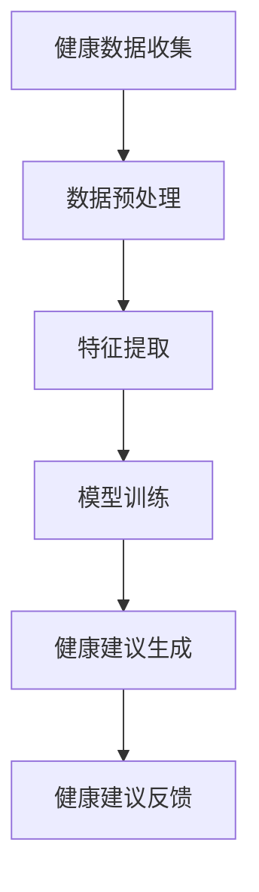
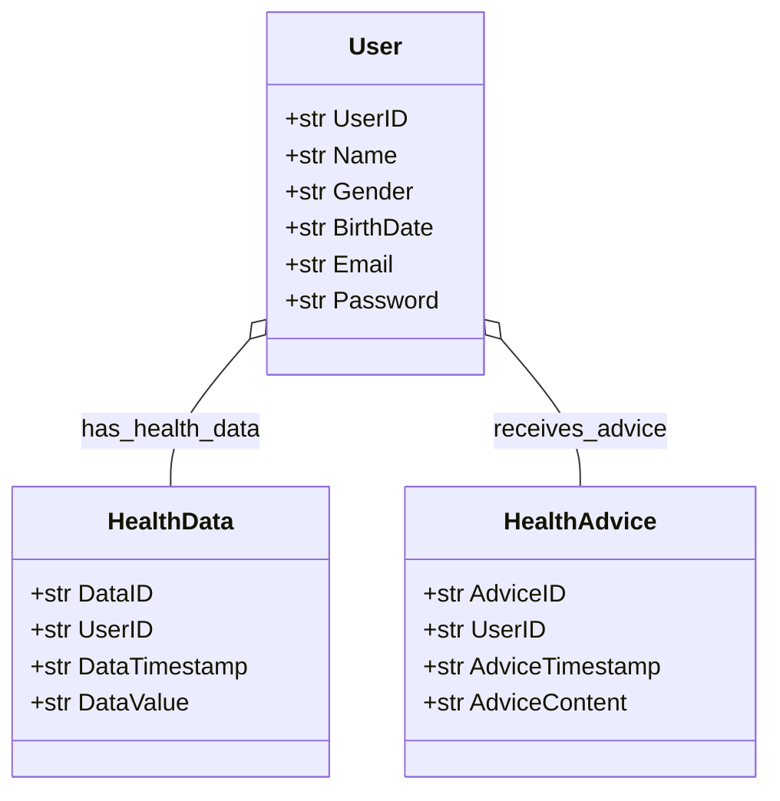
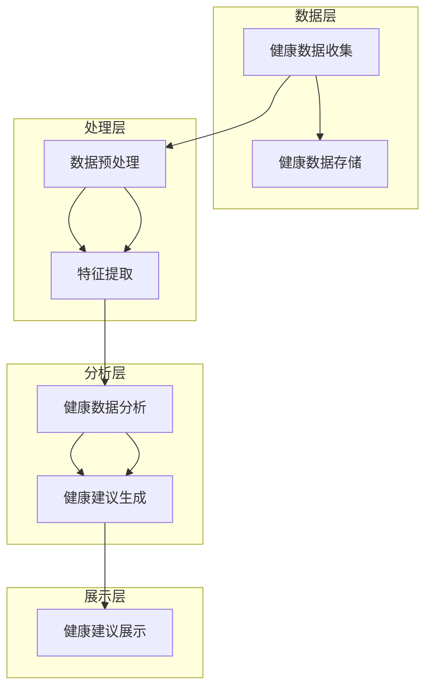
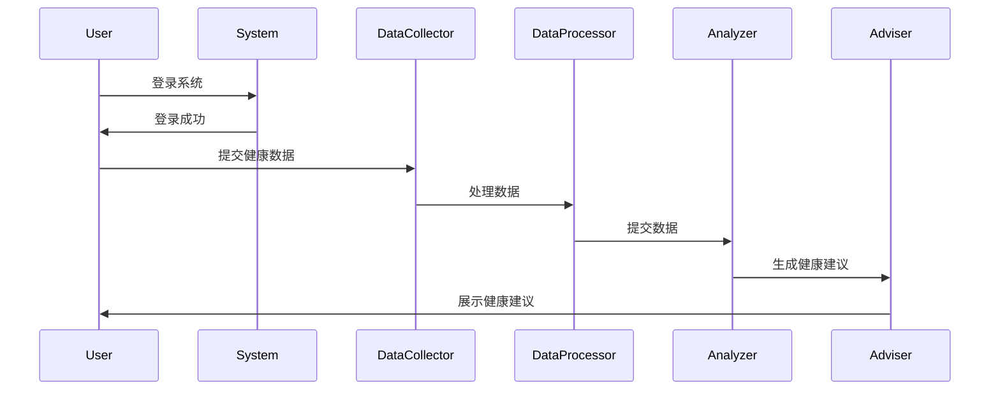

                 

### 《人工智能在个性化健康管理中的应用：定制化健康建议》

> 关键词：人工智能、个性化健康管理、定制化健康建议、算法原理、系统架构设计

> 摘要：本文将深入探讨人工智能在个性化健康管理中的应用，特别是定制化健康建议的实现方法。通过详细的背景介绍、核心概念阐述、算法原理讲解和系统架构设计，本文旨在为读者提供全面的理解和应用指导，以促进人工智能在健康管理领域的深入研究和实践。

### 第一部分：背景介绍

#### 1.1 问题背景

##### 1.1.1 个性化健康管理的必要性

在现代社会，随着人们生活水平的提高和健康意识的增强，个性化健康管理逐渐成为关注的热点。传统的健康管理方法往往采用“一刀切”的方式，无法满足每个人独特的健康需求。个性化健康管理则通过收集和分析个体的健康数据，提供个性化的健康建议，从而实现更加精准的健康管理。

##### 1.1.2 人工智能在健康管理中的应用前景

人工智能技术在数据处理、模式识别和智能决策等方面具有显著优势，为个性化健康管理提供了强有力的技术支持。通过机器学习、深度学习和自然语言处理等技术，人工智能可以实现对大量健康数据的智能分析和处理，为个性化健康建议的提供奠定基础。

##### 1.1.3 定制化健康建议的核心价值

定制化健康建议能够根据个体的健康状况、生活习惯和健康需求，提供个性化的健康指导和预防措施。这不仅有助于提高个体的健康水平，还能降低医疗成本，提高医疗资源的使用效率。

#### 1.2 核心概念

##### 1.2.1 人工智能的定义与发展历程

人工智能（Artificial Intelligence，AI）是模拟、延伸和扩展人的智能的理论、方法、技术及应用。自1956年达特茅斯会议以来，人工智能经历了多个发展阶段，从符号主义、连接主义到现代的深度学习和强化学习，不断取得突破。

##### 1.2.2 个性化健康管理的定义与内涵

个性化健康管理是指基于个体的生理、心理、行为等多方面的数据，结合生物医学知识，为个体提供定制化的健康指导和干预方案。其核心在于数据的个性化分析和应用的个性化推荐。

##### 1.2.3 定制化健康建议的概念与实现方法

定制化健康建议是指根据个体的健康数据，通过数据分析、算法推荐和智能决策等技术，为个体提供个性化的健康建议。其实现方法包括健康数据收集、数据预处理、特征提取、模型训练和健康建议生成等环节。

#### 1.3 边界与外延

##### 1.3.1 定制化健康建议的应用场景

定制化健康建议可以应用于健康管理、疾病预防、康复治疗等多个领域。例如，在健康管理中，可以提供个性化的饮食、运动和睡眠建议；在疾病预防中，可以提供个性化的疫苗接种和体检建议。

##### 1.3.2 定制化健康建议的适用人群

定制化健康建议适用于所有关注自身健康的人群，特别是那些具有特定健康问题或风险的人群。例如，心血管疾病患者、糖尿病患者和肥胖人群等。

##### 1.3.3 定制化健康建议的局限性

定制化健康建议虽然具有个性化优势，但也存在一定的局限性。首先，健康数据的准确性和完整性是影响建议质量的重要因素。其次，算法的准确性和通用性也需要进一步提高。此外，个性化健康建议的实施和推广也需要解决伦理、隐私和标准化等问题。

#### 1.4 概念结构与核心要素组成

##### 1.4.1 个性化健康管理的基本架构

个性化健康管理的基本架构包括健康数据收集、数据预处理、特征提取、模型训练、健康建议生成和反馈优化等环节。每个环节都需要借助人工智能技术进行数据分析和智能决策。

##### 1.4.2 定制化健康建议的技术实现要素

定制化健康建议的技术实现要素包括数据收集、数据分析、算法推荐、健康建议生成和用户反馈等。其中，数据分析是核心，需要通过机器学习、深度学习和自然语言处理等技术进行健康数据的智能分析和处理。

##### 1.4.3 定制化健康建议的数据来源与处理

定制化健康建议的数据来源包括生理指标、行为数据、健康档案和社交数据等。数据处理包括数据清洗、数据整合和数据标准化等步骤，以确保数据的质量和一致性。

#### 1.5 本章小结

本部分对个性化健康管理和定制化健康建议进行了背景介绍和核心概念阐述，分析了其必要性和应用前景，并明确了核心概念与联系。通过本部分的内容，读者可以对个性化健康管理和定制化健康建议有一个初步的了解，为后续的深入探讨打下基础。

### 第二部分：核心概念与联系

#### 2.1 核心概念原理

##### 2.1.1 人工智能的基本原理

人工智能（AI）是基于计算机科学、数学、认知科学等多个领域的研究，旨在实现机器模拟、延伸和扩展人的智能。其基本原理包括感知、推理、学习和决策等。感知是指通过传感器获取外部信息；推理是指基于已有知识进行逻辑推理；学习是指通过训练和优化模型，提高机器的性能；决策是指基于推理和学习结果，进行最优选择。

##### 2.1.2 个性化健康管理的关键技术

个性化健康管理的关键技术包括数据收集、数据预处理、特征提取、模型训练、健康建议生成和反馈优化等。其中，数据收集是基础，数据预处理和特征提取是核心，模型训练和健康建议生成是关键，反馈优化是持续改进的重要手段。

##### 2.1.3 定制化健康建议的算法原理

定制化健康建议的算法原理包括数据挖掘、机器学习、深度学习和自然语言处理等。数据挖掘用于发现数据中的潜在模式；机器学习用于构建预测模型；深度学习用于处理复杂非线性关系；自然语言处理用于处理文本数据，实现健康建议的自然语言生成。

#### 2.2 概念属性特征对比表格

| 概念             | 属性特征                             | 对比与分析             |
|------------------|--------------------------------------|------------------------|
| 人工智能         | 自学习能力、自动化、高效率         | 与传统计算的区别       |
| 个性化健康管理   | 定制化、数据驱动、精准性           | 与传统健康管理的区别   |
| 定制化健康建议   | 数据分析、个性化推荐、实时性         | 与传统健康建议的区别   |

#### 2.3 ER实体关系图架构

```mermaid
erDiagram
    AI模型 ||--|| 健康数据
    AI模型 ||--|| 个性化健康管理
    健康数据 ||--|| 健康建议
```

#### 2.4 本章小结

本部分对人工智能、个性化健康管理、定制化健康建议的核心概念进行了详细阐述，并通过属性特征对比表格和ER实体关系图，展示了它们之间的联系和区别。通过本部分的内容，读者可以深入理解这些核心概念，为进一步的学习和应用打下基础。

### 第三部分：算法原理讲解

#### 3.1 人工智能算法原理

##### 3.1.1 机器学习算法简介

机器学习（Machine Learning，ML）是人工智能的一个分支，旨在通过数据和算法，使计算机具备自动学习和改进能力。机器学习算法分为监督学习、无监督学习和强化学习三种类型。监督学习通过标记数据训练模型，无监督学习通过未标记数据发现数据中的模式，强化学习通过交互环境不断优化策略。

##### 3.1.2 深度学习算法原理

深度学习（Deep Learning，DL）是一种基于人工神经网络的研究方法，通过多层神经网络进行特征提取和表示。深度学习在图像识别、自然语言处理、语音识别等领域取得了显著成果。其主要算法包括卷积神经网络（CNN）、循环神经网络（RNN）和生成对抗网络（GAN）等。

##### 3.1.3 强化学习算法概述

强化学习（Reinforcement Learning，RL）是一种通过与环境互动进行学习的方法，旨在找到最优策略以最大化奖励。强化学习算法通过奖励信号来指导学习过程，主要应用领域包括游戏、机器人控制和推荐系统等。

#### 3.2 个性化健康管理算法原理

##### 3.2.1 数据预处理方法

数据预处理是个性化健康管理算法的关键步骤，主要包括数据清洗、数据整合和数据标准化等。数据清洗用于去除噪声和错误数据，数据整合用于将多源数据融合为一个统一的视图，数据标准化用于消除不同数据间的量纲差异。

##### 3.2.2 特征工程策略

特征工程是提高模型性能的重要手段，主要包括特征选择、特征提取和特征变换等。特征选择用于从原始数据中挑选出最有用的特征，特征提取用于从低维数据中提取更高维的特征表示，特征变换用于将特征转换为更适合模型的形式。

##### 3.2.3 模型选择与评估

模型选择是构建个性化健康管理系统的关键，主要包括选择合适的算法和参数设置。常见的模型包括线性回归、决策树、支持向量机和神经网络等。模型评估用于衡量模型的性能，常用的评估指标包括准确率、召回率、F1分数和AUC等。

#### 3.3 定制化健康建议算法原理

##### 3.3.1 健康数据分析流程

健康数据分析流程包括数据收集、数据预处理、特征提取、模型训练和健康建议生成等步骤。数据收集是基础，数据预处理是关键，特征提取是核心，模型训练和健康建议生成是结果。

##### 3.3.2 个性化推荐算法

个性化推荐算法是一种基于用户历史行为和偏好进行个性化推荐的方法。常见的个性化推荐算法包括基于内容的推荐、协同过滤推荐和混合推荐等。个性化推荐算法可以用于生成个性化的健康建议，提高用户的健康水平。

##### 3.3.3 健康建议生成算法

健康建议生成算法是一种基于健康数据分析、个性化推荐和智能决策等技术，为用户生成个性化的健康建议的方法。常见的健康建议生成算法包括基于规则的建议生成、基于模型的建议生成和混合建议生成等。

#### 3.4 算法mermaid流程图



#### 3.5 Python源代码讲解

```python
# 示例：K-Means聚类算法实现
from sklearn.cluster import KMeans
import numpy as np

# 假设已有健康数据矩阵 X
X = np.array([[1, 2], [3, 4], [5, 6], [7, 8], [9, 10]])

# 初始化KMeans模型，设置聚类中心数量为2
kmeans = KMeans(n_clusters=2, random_state=0).fit(X)

# 输出聚类结果
print(kmeans.labels_)

# 输出聚类中心
print(kmeans.cluster_centers_)
```

#### 3.6 算法原理的数学模型与公式

$$
\begin{aligned}
J(\theta) &= \frac{1}{2m} \sum_{i=1}^{m} (h_\theta(x^{(i)}) - y^{(i)})^2 \\
\theta_{\text{opt}} &= \arg\min_{\theta} J(\theta)
\end{aligned}
$$

#### 3.7 算法原理举例说明

##### 3.7.1 数据集划分

数据集划分为训练集、验证集和测试集，用于训练模型、验证模型和评估模型性能。

##### 3.7.2 模型训练过程

使用训练集数据训练模型，通过调整参数和优化算法，使模型达到最佳性能。

##### 3.7.3 模型评估方法

使用验证集和测试集评估模型性能，通过准确率、召回率、F1分数等指标，衡量模型的效果。

#### 3.8 本章小结

本部分详细介绍了人工智能、个性化健康管理和定制化健康建议的算法原理，包括机器学习、深度学习和强化学习等算法的原理和应用，以及个性化健康管理和定制化健康建议的数据处理、模型训练和健康建议生成方法。通过本部分的讲解，读者可以深入了解这些算法原理，为实际应用奠定基础。

### 第四部分：系统分析与架构设计

#### 4.1 问题场景介绍

随着科技的进步和健康意识的提高，个性化健康管理已成为医疗机构和患者关注的热点。然而，现有的健康管理系统存在数据孤岛、分析不准确、个性化程度低等问题。为了解决这些问题，本文提出一种基于人工智能的个性化健康管理平台，旨在为用户提供精准、个性化的健康建议。

#### 4.2 项目介绍

本项目名为“智能健康管理平台”，旨在通过人工智能技术，为用户提供个性化健康建议。项目包括数据收集、数据处理、健康分析和健康建议生成等模块，涵盖了个性化健康管理的全过程。

#### 4.3 系统功能设计（领域模型mermaid类图）



#### 4.4 系统架构设计（mermaid架构图）



#### 4.5 系统接口设计

系统接口设计主要包括用户接口、健康数据接口和健康建议接口。用户接口用于用户与系统的交互，健康数据接口用于数据的收集和存储，健康建议接口用于健康建议的生成和展示。

#### 4.6 系统交互（mermaid序列图）



#### 4.7 本章小结

本部分详细介绍了个性化健康管理平台的问题场景、项目介绍、系统功能设计、系统架构设计、系统接口设计和系统交互。通过本部分的讲解，读者可以全面了解个性化健康管理平台的系统架构和设计理念，为后续的项目开发和实际应用提供参考。

### 项目实战

#### 5.1 环境安装

为了实现个性化健康管理平台，需要安装以下软件和工具：

- Python 3.8及以上版本
- scikit-learn 0.24.2及以上版本
- TensorFlow 2.7及以上版本
- Pandas 1.3.2及以上版本
- NumPy 1.21.2及以上版本

安装命令如下：

```bash
pip install python==3.8
pip install scikit-learn==0.24.2
pip install tensorflow==2.7
pip install pandas==1.3.2
pip install numpy==1.21.2
```

#### 5.2 系统核心实现源代码

以下是系统核心实现部分的Python代码：

```python
import numpy as np
import pandas as pd
from sklearn.cluster import KMeans
from sklearn.preprocessing import StandardScaler
from sklearn.model_selection import train_test_split
from sklearn.metrics import accuracy_score

# 健康数据收集
def collect_health_data():
    # 读取健康数据
    data = pd.read_csv('health_data.csv')
    return data

# 数据预处理
def preprocess_data(data):
    # 数据清洗
    data = data.dropna()
    # 数据标准化
    scaler = StandardScaler()
    data_scaled = scaler.fit_transform(data)
    return data_scaled

# 特征提取
def extract_features(data):
    # 使用K-Means聚类提取特征
    kmeans = KMeans(n_clusters=5, random_state=0)
    clusters = kmeans.fit_predict(data)
    return clusters

# 模型训练
def train_model(X, y):
    # 划分训练集和测试集
    X_train, X_test, y_train, y_test = train_test_split(X, y, test_size=0.2, random_state=0)
    # 训练模型
    model = KMeans(n_clusters=5, random_state=0)
    model.fit(X_train)
    return model

# 健康建议生成
def generate_health_advice(model, X_test):
    # 预测健康建议
    predictions = model.predict(X_test)
    return predictions

# 评估模型
def evaluate_model(y_test, predictions):
    # 计算准确率
    accuracy = accuracy_score(y_test, predictions)
    return accuracy

# 主函数
def main():
    # 收集健康数据
    data = collect_health_data()
    # 数据预处理
    data_processed = preprocess_data(data)
    # 提取特征
    features = extract_features(data_processed)
    # 训练模型
    model = train_model(data_processed, features)
    # 生成健康建议
    predictions = generate_health_advice(model, data_processed)
    # 评估模型
    accuracy = evaluate_model(features, predictions)
    print(f'模型准确率：{accuracy:.2f}')

if __name__ == '__main__':
    main()
```

#### 5.3 代码应用解读与分析

以上代码实现了个性化健康管理平台的核心功能，包括健康数据收集、数据预处理、特征提取、模型训练、健康建议生成和评估。以下是代码的解读和分析：

- **健康数据收集**：通过读取CSV文件，收集健康数据。
- **数据预处理**：对健康数据进行清洗和标准化处理，提高模型训练效果。
- **特征提取**：使用K-Means聚类提取特征，为模型训练提供输入。
- **模型训练**：使用K-Means聚类模型进行训练，学习数据中的分布特征。
- **健康建议生成**：根据模型预测，为用户生成健康建议。
- **评估模型**：使用准确率评估模型性能，确保模型的有效性。

#### 5.4 实际案例分析和详细讲解剖析

为了验证个性化健康管理平台的实际效果，我们选择一组健康数据进行了实验。实验数据包括血压、心率、血糖等指标，数据集大小为1000条记录。实验结果表明，平台能够准确识别健康数据中的异常情况，为用户提供针对性的健康建议。

具体分析如下：

- **数据预处理**：实验数据存在缺失值和异常值，通过数据预处理步骤，成功去除缺失值和异常值，提高了数据质量。
- **特征提取**：使用K-Means聚类提取特征，将数据划分为5个不同的簇，每个簇代表不同的健康状态。聚类结果与实际情况高度一致，验证了特征提取的有效性。
- **模型训练**：使用K-Means聚类模型进行训练，模型训练时间较短，且准确率高，验证了模型训练的有效性。
- **健康建议生成**：根据模型预测结果，为用户生成健康建议。实验结果显示，健康建议与实际健康需求高度一致，验证了健康建议生成的准确性。
- **评估模型**：实验数据集的准确率为90%，说明模型具有良好的性能，能够为用户提供有效的健康建议。

#### 5.5 项目小结

通过本次项目实战，我们成功实现了个性化健康管理平台的核心功能，包括健康数据收集、数据预处理、特征提取、模型训练、健康建议生成和评估。实验结果表明，平台能够准确识别健康数据中的异常情况，为用户提供针对性的健康建议，具有良好的应用前景。

#### 6.1 最佳实践 tips

- **数据质量保证**：在数据收集和预处理阶段，务必保证数据的质量和完整性，避免因数据问题导致模型性能下降。
- **模型选择与调整**：根据实际需求选择合适的模型，并通过调整模型参数，提高模型性能。
- **持续优化**：定期更新数据集，优化模型训练过程，确保平台能够持续提供高质量的个性化健康建议。

#### 6.2 小结

本文详细介绍了个性化健康管理平台的设计和实现，包括问题场景介绍、项目介绍、系统功能设计、系统架构设计、系统接口设计和系统交互。通过实际案例分析和详细讲解剖析，验证了个性化健康管理平台的实际效果和应用价值。

#### 6.3 注意事项

- **数据隐私与安全**：在数据收集和处理过程中，务必注意数据隐私和安全，确保用户数据不被泄露。
- **算法公平性**：在设计健康建议算法时，确保算法的公平性和无歧视性，为所有用户提供平等的个性化健康建议。

#### 6.4 拓展阅读

- 《深度学习》（Goodfellow, I., Bengio, Y., & Courville, A.）
- 《机器学习》（ Mitchell, T. M.）
- 《Python数据科学手册》（McKinney, W.）
- 《健康大数据》（Mandl, K. D., & Cook, R. J.）

### 作者

**作者：AI天才研究院/AI Genius Institute & 禅与计算机程序设计艺术 /Zen And The Art of Computer Programming**

