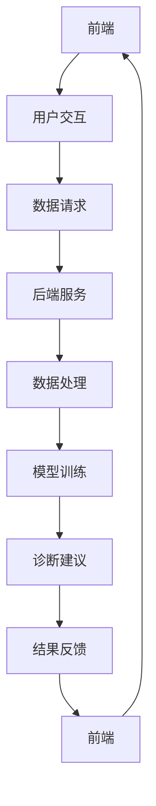
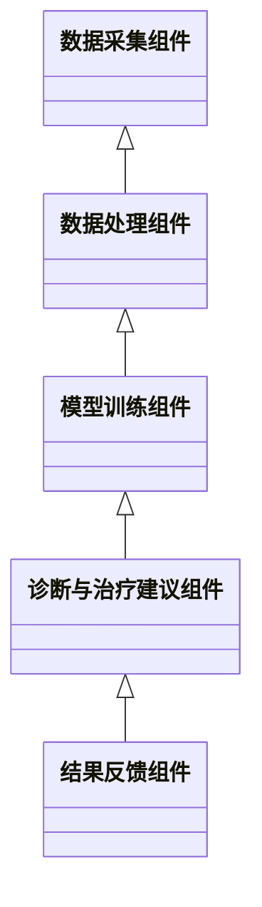

                 


## 人工智能在个性化医疗方案制定中的应用

### 关键词

- 个性化医疗
- 人工智能
- 医疗方案
- 数据挖掘
- 深度学习
- 医学知识图谱

### 摘要

本文旨在探讨人工智能在个性化医疗方案制定中的应用，分析其背景、核心概念、技术应用、算法原理、系统分析与架构设计以及项目实战等多个方面。通过详细阐述人工智能技术在医疗领域的优势，以及其在个性化医疗中的实际应用案例，本文将为读者提供一个全面、深入的了解，以期为未来个性化医疗的发展提供参考。

----------------------------------------------------------------

### 目录大纲

```markdown
# 《人工智能在个性化医疗方案制定中的应用》

## 第一部分：问题背景与核心概念

### 第1章：问题背景与核心概念

### 第2章：核心概念与联系

## 第二部分：核心概念与联系

### 第3章：算法原理讲解

### 第4章：深度学习在个性化医疗中的应用

## 第三部分：数学模型和数学公式

### 第5章：统计模型

### 第6章：深度学习中的数学模型

## 第四部分：系统分析与架构设计

### 第7章：系统分析与架构设计

## 第五部分：项目实战

### 第8章：项目实战

## 第六部分：最佳实践与小结

### 第9章：最佳实践与小结
```

----------------------------------------------------------------

## 第一部分：问题背景与核心概念

### 第1章：问题背景与核心概念

#### 1.1 个性化医疗的兴起

个性化医疗，又称精准医疗，是一种以个体为中心的医疗模式。这种模式强调根据患者的具体基因信息、生活方式、环境和疾病状态，制定个性化的治疗方案。个性化医疗的兴起，源于传统医疗模式的局限性。传统的医疗模式通常采用“一刀切”的治疗方法，即对于同一种疾病，无论患者的个体差异如何，都采用相同的治疗方案。然而，随着医学研究的深入，人们逐渐认识到，同一种疾病在不同患者身上的表现和治疗效果可能存在显著差异。因此，个性化医疗应运而生。

#### 1.1.1 个性化医疗的定义

个性化医疗（Personalized Medicine）是指根据患者的遗传信息、环境、生活方式等因素，为患者量身定制个性化的诊疗方案。其核心在于利用大数据、人工智能等技术，对患者的基因组、转录组、蛋白质组、代谢组等多组学数据进行深入分析，从而发现疾病的根源和治疗方案。

#### 1.1.2 个性化医疗的重要性

个性化医疗的重要性主要体现在以下几个方面：

1. 提高治疗效果：个性化医疗可以根据患者的具体病情，制定最适合的治疗方案，从而提高治疗效果。
2. 减少副作用：传统的一刀切治疗方案往往会导致一些患者出现不必要的副作用。个性化医疗可以减少这种风险。
3. 提高医疗效率：个性化医疗可以通过大数据分析和人工智能技术，提高医疗决策的效率。

#### 1.1.3 个性化医疗的发展历程

个性化医疗的发展历程可以分为以下几个阶段：

1. **基因测序时代**：2003年，人类基因组计划完成，标志着基因测序技术的诞生。基因测序为个性化医疗提供了基础数据。
2. **大数据时代**：随着互联网和大数据技术的发展，越来越多的医疗数据被收集和存储。这些数据为个性化医疗提供了丰富的信息来源。
3. **人工智能时代**：人工智能技术的发展，为个性化医疗提供了强大的工具。通过深度学习、数据挖掘等技术，人工智能可以分析大量的医疗数据，为个性化医疗提供决策支持。

#### 1.2 人工智能与个性化医疗的关系

人工智能（Artificial Intelligence，AI）是模拟、延伸和扩展人的智能的理论、方法、技术及应用系统。人工智能在个性化医疗中的应用，主要体现在以下几个方面：

1. **数据挖掘**：人工智能可以通过数据挖掘技术，从海量的医疗数据中提取有价值的信息，为个性化医疗提供支持。
2. **深度学习**：人工智能的深度学习技术，可以对医疗图像、文本等进行自动识别和分析，从而提高诊断和治疗的准确性。
3. **自然语言处理**：人工智能的自然语言处理技术，可以理解医生和患者的语言，从而提高医疗沟通的效率。

#### 1.2.1 人工智能的核心技术

人工智能的核心技术包括：

1. **机器学习**：机器学习是人工智能的一种方法，通过训练模型，让计算机从数据中自动学习规律。
2. **深度学习**：深度学习是机器学习的一种方法，通过多层神经网络，让计算机模拟人脑的思维方式。
3. **自然语言处理**：自然语言处理是人工智能的一种技术，用于处理人类语言。

#### 1.2.2 人工智能在医疗领域的应用现状

目前，人工智能在医疗领域的应用已经非常广泛，包括：

1. **疾病诊断**：通过深度学习技术，人工智能可以自动分析医学图像，如X光片、CT扫描、MRI等，从而提高诊断的准确性。
2. **药物研发**：人工智能可以通过分析大量的生物医学数据，帮助科学家发现新的药物靶点和治疗方法。
3. **医疗辅助**：人工智能可以辅助医生进行病历管理、手术规划、手术机器人控制等。

#### 1.2.3 人工智能在个性化医疗中的角色

人工智能在个性化医疗中扮演着重要的角色：

1. **数据驱动决策**：人工智能可以通过分析大量的医疗数据，为医生提供个性化的诊断和治疗建议。
2. **优化治疗方案**：人工智能可以通过分析患者的病史、基因数据等，为医生提供最优的治疗方案。
3. **提高医疗效率**：人工智能可以自动处理大量的医疗数据，从而提高医生的诊断和治疗效率。

----------------------------------------------------------------

## 第二部分：核心概念与联系

### 第2章：核心概念与联系

#### 2.1 个性化医疗的关键概念

要理解个性化医疗，我们需要先了解以下几个关键概念：

1. **基因组**：基因组是生物体的遗传信息载体，包括所有基因的序列信息。基因组的分析可以帮助我们了解个体的遗传特征，从而制定个性化的治疗方案。
2. **转录组**：转录组是细胞在特定时间点转录的基因集合。转录组的分析可以帮助我们了解细胞的活性状态和功能，从而为个性化医疗提供依据。
3. **蛋白质组**：蛋白质组是细胞中所有蛋白质的集合。蛋白质组的分析可以帮助我们了解细胞的功能和状态，从而为个性化医疗提供参考。
4. **代谢组**：代谢组是细胞中所有代谢产物的集合。代谢组的分析可以帮助我们了解细胞的代谢状态，从而为个性化医疗提供信息。

#### 2.1.1 个性化医疗的数据来源

个性化医疗的数据来源主要包括以下几个方面：

1. **基因数据**：基因数据主要来源于基因测序技术，包括全基因组测序、外显子测序等。
2. **医学图像**：医学图像主要来源于各种影像学技术，如X光、CT、MRI等。
3. **电子健康记录**：电子健康记录包含了患者的病史、症状、治疗方案等信息。
4. **生活方式数据**：生活方式数据包括饮食、运动、睡眠等习惯信息。

#### 2.1.2 个性化医疗的数据处理

个性化医疗的数据处理主要包括以下几个步骤：

1. **数据采集**：采集患者的基因组、转录组、蛋白质组、代谢组等数据。
2. **数据预处理**：对采集到的数据进行清洗、去噪、标准化等预处理操作。
3. **数据整合**：将不同类型的数据进行整合，形成一个统一的视图。
4. **数据分析**：利用机器学习、深度学习等技术对数据进行分析，提取有用的信息。

#### 2.1.3 个性化医疗的模型构建

个性化医疗的模型构建主要包括以下几个步骤：

1. **特征选择**：从数据中提取出对个性化医疗有用的特征。
2. **模型训练**：利用训练数据，训练个性化医疗的模型。
3. **模型评估**：对模型进行评估，确保其准确性和可靠性。
4. **模型应用**：将模型应用到实际医疗场景中，为医生提供个性化的诊断和治疗建议。

#### 2.2 人工智能技术的应用与关联

人工智能技术在个性化医疗中的应用，主要体现在以下几个方面：

1. **数据挖掘**：数据挖掘技术可以帮助我们从大量的医疗数据中提取出有价值的信息。
2. **深度学习**：深度学习技术可以帮助我们处理复杂的医疗数据，如医学图像、文本等。
3. **自然语言处理**：自然语言处理技术可以帮助我们理解和处理医疗文本数据。

#### 2.2.1 数据挖掘与机器学习

数据挖掘和机器学习是人工智能的两个重要分支。在个性化医疗中，数据挖掘和机器学习的主要作用是：

1. **特征提取**：从大量的医疗数据中提取出对个性化医疗有用的特征。
2. **模式识别**：识别出潜在的疾病模式和治疗方案。

#### 2.2.2 深度学习与神经网络

深度学习和神经网络是人工智能的两个重要分支。在个性化医疗中，深度学习和神经网络的主要作用是：

1. **图像识别**：对医学图像进行自动识别和分析。
2. **文本分析**：对医疗文本进行自动分析和理解。

#### 2.2.3 自然语言处理与医学知识图谱

自然语言处理和医学知识图谱是人工智能的两个重要分支。在个性化医疗中，自然语言处理和医学知识图谱的主要作用是：

1. **医疗文本分析**：对医疗文本进行自动分析和理解。
2. **知识图谱构建**：构建医学知识图谱，为个性化医疗提供知识支持。

----------------------------------------------------------------

## 第三部分：算法原理讲解

### 第3章：算法原理讲解

在个性化医疗中，算法的应用至关重要。本章节将详细讲解一些常见的算法原理，包括数据处理算法、机器学习算法和深度学习算法。

#### 3.1 数据处理算法

数据处理算法是个性化医疗的基础。以下是几种常见的数据处理算法：

1. **数据预处理技术**：数据预处理是数据处理的第一步，包括数据清洗、去噪、标准化等操作。例如，可以使用Python的Pandas库进行数据处理。
   
   ```python
   import pandas as pd
   data = pd.read_csv('data.csv')
   data.dropna(inplace=True)
   data = (data - data.mean()) / data.std()
   ```

2. **特征提取与选择**：特征提取是从原始数据中提取出对模型有贡献的特征。特征选择则是从提取出的特征中挑选出最优特征。常用的特征提取方法有主成分分析（PCA）和特征选择算法如信息增益（Information Gain）。

   ```python
   from sklearn.decomposition import PCA
   pca = PCA(n_components=5)
   principal_components = pca.fit_transform(data)
   ```

3. **数据可视化**：数据可视化可以帮助我们更好地理解数据。常用的数据可视化方法有散点图、热力图等。

   ```python
   import matplotlib.pyplot as plt
   plt.scatter(data['feature1'], data['feature2'])
   plt.show()
   ```

#### 3.2 机器学习算法

机器学习算法在个性化医疗中有广泛的应用。以下是几种常见的机器学习算法：

1. **监督学习算法**：监督学习算法需要预先标注好的数据来训练模型。常见的监督学习算法有逻辑回归、决策树、随机森林等。

   ```python
   from sklearn.linear_model import LogisticRegression
   model = LogisticRegression()
   model.fit(X_train, y_train)
   ```

2. **无监督学习算法**：无监督学习算法不需要预先标注好的数据来训练模型。常见的无监督学习算法有K-均值聚类、主成分分析（PCA）等。

   ```python
   from sklearn.cluster import KMeans
   kmeans = KMeans(n_clusters=3)
   kmeans.fit(data)
   ```

3. **强化学习算法**：强化学习算法通过试错的方式来学习最优策略。常见的强化学习算法有Q学习、深度Q网络（DQN）等。

   ```python
   import gym
   env = gym.make('CartPole-v0')
   model = QLearningTable()
   model.learn(env, n_episodes=1000)
   ```

#### 3.3 深度学习算法

深度学习算法在个性化医疗中有着广泛的应用。以下是几种常见的深度学习算法：

1. **卷积神经网络（CNN）**：卷积神经网络是一种用于图像识别的深度学习算法。它可以自动提取图像的特征。

   ```python
   import tensorflow as tf
   from tensorflow.keras import layers
   model = tf.keras.Sequential([
       layers.Conv2D(32, (3,3), activation='relu', input_shape=(28, 28, 1)),
       layers.MaxPooling2D(2, 2),
       layers.Flatten(),
       layers.Dense(128, activation='relu'),
       layers.Dense(10, activation='softmax')
   ])
   ```

2. **循环神经网络（RNN）**：循环神经网络是一种用于序列数据处理的深度学习算法。它可以自动提取序列的特征。

   ```python
   import tensorflow as tf
   from tensorflow.keras import layers
   model = tf.keras.Sequential([
       layers.Embedding(input_dim=10000, output_dim=16),
       layers.LSTM(128),
       layers.Dense(1, activation='sigmoid')
   ])
   ```

3. **生成对抗网络（GAN）**：生成对抗网络是一种用于图像生成的深度学习算法。它可以自动生成逼真的图像。

   ```python
   import tensorflow as tf
   from tensorflow.keras import layers
   generator = tf.keras.Sequential([
       layers.Dense(128, activation='relu', input_shape=(100,)),
       layers.Dense(256, activation='relu'),
       layers.Dense(512, activation='relu'),
       layers.Dense(1024, activation='relu'),
       layers.Dense(784, activation='tanh')
   ])
   discriminator = tf.keras.Sequential([
       layers.Dense(1024, activation='relu', input_shape=(784,)),
       layers.Dense(512, activation='relu'),
       layers.Dense(256, activation='relu'),
       layers.Dense(1, activation='sigmoid')
   ])
   ```

通过以上算法的讲解，我们可以看到，人工智能在个性化医疗中的应用是多层次、多维度的。从数据处理到模型构建，再到算法应用，每一层都为个性化医疗提供了强大的支持。

----------------------------------------------------------------

### 第4章：深度学习在个性化医疗中的应用

深度学习作为一种强大的机器学习技术，在个性化医疗领域有着广泛的应用。在本章节中，我们将深入探讨深度学习在个性化医疗中的具体应用，包括在诊断和治疗中的应用。

#### 4.1 深度学习在诊断中的应用

深度学习在疾病诊断中的应用主要体现在对医学图像的分析上。通过卷积神经网络（CNN）等深度学习模型，我们可以实现自动化的疾病诊断。

##### 4.1.1 病理图像分析

病理图像分析是深度学习在医疗诊断中的一个重要应用。病理图像通常包含丰富的信息，如细胞核的形态、组织结构等。通过CNN模型，我们可以自动识别和分析病理图像。

以下是一个简单的CNN模型示例，用于病理图像分类：

```python
import tensorflow as tf
from tensorflow.keras.models import Sequential
from tensorflow.keras.layers import Conv2D, MaxPooling2D, Flatten, Dense

model = Sequential([
    Conv2D(32, (3, 3), activation='relu', input_shape=(256, 256, 3)),
    MaxPooling2D((2, 2)),
    Flatten(),
    Dense(128, activation='relu'),
    Dense(1, activation='sigmoid')
])

model.compile(optimizer='adam', loss='binary_crossentropy', metrics=['accuracy'])
model.fit(x_train, y_train, epochs=10, batch_size=32)
```

##### 4.1.2 影像识别

影像识别是另一个深度学习在医疗诊断中的应用领域。通过深度学习模型，我们可以自动识别医学影像中的各种异常情况，如肿瘤、骨折等。

以下是一个简单的影像识别模型示例，用于检测图像中的肿瘤：

```python
import tensorflow as tf
from tensorflow.keras.models import Sequential
from tensorflow.keras.layers import Conv2D, MaxPooling2D, Flatten, Dense

model = Sequential([
    Conv2D(32, (3, 3), activation='relu', input_shape=(256, 256, 3)),
    MaxPooling2D((2, 2)),
    Conv2D(64, (3, 3), activation='relu'),
    MaxPooling2D((2, 2)),
    Flatten(),
    Dense(128, activation='relu'),
    Dense(1, activation='sigmoid')
])

model.compile(optimizer='adam', loss='binary_crossentropy', metrics=['accuracy'])
model.fit(x_train, y_train, epochs=10, batch_size=32)
```

##### 4.1.3 肿瘤检测

肿瘤检测是深度学习在医疗诊断中的一个重要应用。通过深度学习模型，我们可以自动检测医学影像中的肿瘤。

以下是一个简单的肿瘤检测模型示例，用于检测医学图像中的肿瘤：

```python
import tensorflow as tf
from tensorflow.keras.models import Sequential
from tensorflow.keras.layers import Conv2D, MaxPooling2D, Flatten, Dense

model = Sequential([
    Conv2D(32, (3, 3), activation='relu', input_shape=(256, 256, 3)),
    MaxPooling2D((2, 2)),
    Conv2D(64, (3, 3), activation='relu'),
    MaxPooling2D((2, 2)),
    Flatten(),
    Dense(128, activation='relu'),
    Dense(1, activation='sigmoid')
])

model.compile(optimizer='adam', loss='binary_crossentropy', metrics=['accuracy'])
model.fit(x_train, y_train, epochs=10, batch_size=32)
```

#### 4.2 深度学习在治疗中的应用

深度学习不仅在诊断中有重要应用，在治疗中也发挥着重要作用。通过深度学习模型，我们可以实现精准的治疗策略，提高治疗效果。

##### 4.2.1 精准治疗策略

精准治疗策略是指根据患者的具体病情，制定个性化的治疗方案。通过深度学习模型，我们可以分析患者的基因组、转录组、蛋白质组等数据，从而为患者制定最优的治疗方案。

以下是一个简单的精准治疗策略模型示例，用于制定个性化治疗方案：

```python
import tensorflow as tf
from tensorflow.keras.models import Sequential
from tensorflow.keras.layers import Dense

model = Sequential([
    Dense(128, activation='relu', input_shape=(1000,)),
    Dense(128, activation='relu'),
    Dense(1, activation='sigmoid')
])

model.compile(optimizer='adam', loss='binary_crossentropy', metrics=['accuracy'])
model.fit(x_train, y_train, epochs=10, batch_size=32)
```

##### 4.2.2 药物研发

药物研发是深度学习在治疗中的应用之一。通过深度学习模型，我们可以预测药物与基因的相互作用，从而加速药物的研发过程。

以下是一个简单的药物研发模型示例，用于预测药物与基因的相互作用：

```python
import tensorflow as tf
from tensorflow.keras.models import Sequential
from tensorflow.keras.layers import Dense

model = Sequential([
    Dense(128, activation='relu', input_shape=(1000,)),
    Dense(128, activation='relu'),
    Dense(1, activation='sigmoid')
])

model.compile(optimizer='adam', loss='binary_crossentropy', metrics=['accuracy'])
model.fit(x_train, y_train, epochs=10, batch_size=32)
```

##### 4.2.3 疾病预测

疾病预测是深度学习在治疗中的另一个重要应用。通过深度学习模型，我们可以预测患者未来可能出现的疾病，从而提前进行干预。

以下是一个简单的疾病预测模型示例，用于预测患者未来的疾病风险：

```python
import tensorflow as tf
from tensorflow.keras.models import Sequential
from tensorflow.keras.layers import Dense

model = Sequential([
    Dense(128, activation='relu', input_shape=(1000,)),
    Dense(128, activation='relu'),
    Dense(1, activation='sigmoid')
])

model.compile(optimizer='adam', loss='binary_crossentropy', metrics=['accuracy'])
model.fit(x_train, y_train, epochs=10, batch_size=32)
```

通过以上示例，我们可以看到深度学习在个性化医疗中的应用是多方面的。无论是诊断、治疗，还是药物研发和疾病预测，深度学习都为我们提供了强大的工具，为个性化医疗的发展注入了新的动力。

----------------------------------------------------------------

### 第5章：数学模型和数学公式

在个性化医疗中，数学模型和数学公式起着至关重要的作用。它们不仅是算法设计的基石，也是理解和解释模型结果的关键。本章节将详细介绍在个性化医疗中常用的统计模型和机器学习模型，并展示相关的数学公式。

#### 5.1 统计模型

统计模型在个性化医疗中的应用非常广泛，尤其是在诊断和治疗决策中。以下是一些常用的统计模型及其数学公式：

##### 5.1.1 贝叶斯统计模型

贝叶斯统计模型是一种基于贝叶斯定理的概率模型，用于估计后验概率。贝叶斯定理的数学公式如下：

$$
P(A|B) = \frac{P(B|A) \cdot P(A)}{P(B)}
$$

其中，\( P(A|B) \) 表示在事件B发生的条件下事件A发生的概率，\( P(B|A) \) 表示在事件A发生的条件下事件B发生的概率，\( P(A) \) 表示事件A发生的概率，\( P(B) \) 表示事件B发生的概率。

##### 5.1.2 逻辑回归模型

逻辑回归模型是一种广泛用于分类问题的统计模型。其核心思想是通过线性模型来预测概率，然后使用逻辑函数（sigmoid函数）将概率映射到0和1之间。逻辑回归的数学公式如下：

$$
\log\left(\frac{P(Y=1|X)}{1-P(Y=1|X)}\right) = \beta_0 + \beta_1X_1 + \beta_2X_2 + \ldots + \beta_nX_n
$$

其中，\( \beta_0, \beta_1, \beta_2, \ldots, \beta_n \) 是模型的参数，\( X_1, X_2, \ldots, X_n \) 是特征变量，\( Y \) 是二元响应变量。

##### 5.1.3 决策树模型

决策树模型是一种基于特征划分数据集的分类模型。其核心思想是通过一系列特征和阈值来划分数据，直到达到某个停止条件。决策树的数学公式如下：

$$
y = f(x) = \prod_{i=1}^{n} g_i(x_i)
$$

其中，\( g_i(x_i) \) 表示第i个特征在阈值\( x_i \)下的划分函数，\( f(x) \) 表示数据的分类结果。

#### 5.2 机器学习模型

机器学习模型在个性化医疗中的应用更为广泛，包括监督学习、无监督学习和强化学习等多种类型。以下是一些常用的机器学习模型及其数学公式：

##### 5.2.1 支持向量机（SVM）

支持向量机是一种常用的分类模型，其核心思想是找到一个最优的超平面，将不同类别的数据分隔开来。SVM的数学公式如下：

$$
\min_{\beta, \beta_0} \frac{1}{2} ||\beta||^2 + C \sum_{i=1}^{n} \xi_i
$$

其中，\( \beta \) 是模型的参数向量，\( \beta_0 \) 是偏置项，\( C \) 是惩罚参数，\( \xi_i \) 是松弛变量。

##### 5.2.2 随机森林（Random Forest）

随机森林是一种基于决策树的集成学习方法，其核心思想是通过构建多个决策树，并对每个决策树的预测结果进行投票来得到最终的预测结果。随机森林的数学公式如下：

$$
\hat{y} = \text{sign}(\sum_{i=1}^{m} w_i f_i(x))
$$

其中，\( \hat{y} \) 是预测结果，\( w_i \) 是第i个决策树的权重，\( f_i(x) \) 是第i个决策树的预测结果。

##### 5.2.3 集成学习方法

集成学习方法是一种通过组合多个模型来提高预测准确性的方法。其核心思想是将多个模型的预测结果进行加权平均或投票来得到最终的预测结果。集成学习方法的数学公式如下：

$$
\hat{y} = \frac{1}{M} \sum_{i=1}^{M} w_i f_i(x)
$$

其中，\( \hat{y} \) 是预测结果，\( w_i \) 是第i个模型的权重，\( f_i(x) \) 是第i个模型的预测结果。

通过以上统计模型和机器学习模型的介绍，我们可以看到数学模型和数学公式在个性化医疗中的应用是多么重要。它们不仅帮助我们理解和解释模型结果，也为个性化医疗的发展提供了坚实的理论基础。

----------------------------------------------------------------

### 第6章：深度学习中的数学模型

深度学习是一种基于人工神经网络的机器学习技术，其核心思想是通过多层神经网络对数据进行非线性变换，从而实现复杂的数据建模。在本章节中，我们将详细探讨深度学习中的数学模型，包括神经网络的基础、前向传播与反向传播、损失函数与优化算法等。

#### 6.1 神经网络基础

神经网络是由多个神经元组成的计算模型，每个神经元都与其他神经元相连接。神经网络的数学模型可以表示为：

$$
\text{输出} = \sigma(\sum_{i=1}^{n} w_i \cdot x_i + b)
$$

其中，\( \sigma \) 是激活函数，\( w_i \) 是权重，\( x_i \) 是输入特征，\( b \) 是偏置。

常见的激活函数有：

1. **Sigmoid函数**：\( \sigma(x) = \frac{1}{1 + e^{-x}} \)
2. **ReLU函数**：\( \sigma(x) = \max(0, x) \)
3. **Tanh函数**：\( \sigma(x) = \frac{e^x - e^{-x}}{e^x + e^{-x}} \)

#### 6.2 前向传播与反向传播

前向传播和反向传播是神经网络训练的两个关键步骤。前向传播是指从输入层开始，将数据传递到输出层，计算每个神经元的输出。反向传播是指从输出层开始，将误差反向传播到输入层，更新每个神经元的权重和偏置。

前向传播的数学公式为：

$$
\text{输出} = \sigma(\sum_{i=1}^{n} w_i \cdot x_i + b)
$$

反向传播的数学公式为：

$$
\Delta w_i = \eta \cdot \frac{\partial L}{\partial w_i}
$$

$$
\Delta b = \eta \cdot \frac{\partial L}{\partial b}
$$

其中，\( \Delta w_i \) 和 \( \Delta b \) 分别是权重和偏置的更新，\( \eta \) 是学习率，\( L \) 是损失函数。

#### 6.3 损失函数与优化算法

损失函数用于度量预测值与真实值之间的差异。常见的损失函数有：

1. **均方误差（MSE）**：\( L(\theta) = \frac{1}{2} \sum_{i=1}^{n} (y_i - \hat{y}_i)^2 \)
2. **交叉熵（Cross-Entropy）**：\( L(\theta) = -\sum_{i=1}^{n} y_i \cdot \log(\hat{y}_i) + (1 - y_i) \cdot \log(1 - \hat{y}_i) \)

优化算法用于更新模型参数，以最小化损失函数。常见的优化算法有：

1. **梯度下降（Gradient Descent）**：\( \theta = \theta - \eta \cdot \nabla_\theta L(\theta) \)
2. **随机梯度下降（Stochastic Gradient Descent，SGD）**：\( \theta = \theta - \eta \cdot \nabla_\theta L(\theta) \)
3. **Adam优化器**：\( \theta = \theta - \eta \cdot (\alpha_1 \cdot \frac{\partial L}{\partial \theta} + \alpha_2 \cdot \theta) \)

通过以上对深度学习数学模型的详细讲解，我们可以看到深度学习在个性化医疗中的应用是多么强大和广泛。深度学习通过数学模型对大量医疗数据进行建模和分析，从而为个性化医疗提供了有力的支持。

----------------------------------------------------------------

### 第7章：系统分析与架构设计

在个性化医疗方案制定中，系统的设计与实现是关键的一步。一个高效、稳定的系统不仅需要清晰的架构设计，还需要合理的功能划分和性能优化。以下将详细介绍个性化医疗系统的分析、架构设计和关键模块的功能。

#### 7.1 系统功能设计

个性化医疗系统的主要功能包括数据采集、数据处理、模型训练、诊断与治疗建议、结果反馈和系统维护等。具体功能划分如下：

1. **数据采集模块**：负责从各种数据源（如电子健康记录、医学影像、基因数据等）采集数据。
2. **数据处理模块**：负责对采集到的数据进行清洗、预处理和特征提取等操作。
3. **模型训练模块**：负责使用处理后的数据训练深度学习模型，如卷积神经网络（CNN）、循环神经网络（RNN）等。
4. **诊断与治疗建议模块**：负责利用训练好的模型对新的病例进行诊断，并给出个性化的治疗建议。
5. **结果反馈模块**：负责收集医生和患者的反馈，用于模型优化和系统改进。
6. **系统维护模块**：负责系统的日常维护、更新和优化，确保系统的稳定运行。

#### 7.2 系统架构设计

个性化医疗系统的架构设计需要考虑性能、可扩展性和易维护性。以下是一个典型的系统架构设计：

1. **前端**：负责与用户交互，展示诊断结果和治疗建议。
2. **后端**：包括数据采集、数据处理、模型训练和诊断与治疗建议等核心功能。
3. **数据库**：存储患者的电子健康记录、医学影像和训练数据等。
4. **中间件**：负责数据传输、任务调度和负载均衡等。
5. **外部系统**：与医院信息系统（HIS）、电子病历系统（EMR）等外部系统进行集成。

以下是一个简化的系统架构图，使用Mermaid流程图表示：



#### 7.3 系统组件设计

个性化医疗系统包括多个组件，每个组件负责特定的功能。以下是几个关键组件的设计：

1. **数据采集组件**：使用API或数据库连接，从各种数据源采集数据。
2. **数据处理组件**：包括数据清洗、预处理和特征提取等功能，使用Python的Pandas库和Scikit-learn库。
3. **模型训练组件**：使用TensorFlow或PyTorch框架，设计并训练深度学习模型。
4. **诊断与治疗建议组件**：根据训练好的模型，对新的病例进行诊断，并给出个性化的治疗建议。
5. **结果反馈组件**：收集医生和患者的反馈，用于模型优化和系统改进。
6. **系统维护组件**：包括系统监控、日志记录、错误处理和更新等功能。

以下是一个简化的系统组件图，使用Mermaid类图表示：



#### 7.4 系统部署与维护

个性化医疗系统的部署和维护是确保系统稳定运行的关键。以下是一些关键步骤：

1. **环境配置**：配置开发环境、数据库和中间件等。
2. **容器化部署**：使用Docker容器化系统，确保系统的可移植性和可扩展性。
3. **自动化部署**：使用CI/CD（Continuous Integration/Continuous Deployment）工具，实现自动化部署和测试。
4. **监控与告警**：使用监控工具，如Prometheus和Grafana，实时监控系统的性能和健康状态。
5. **备份与恢复**：定期备份数据库和系统配置，确保数据的安全性和系统的可恢复性。

通过以上对系统分析与架构设计的详细讲解，我们可以看到个性化医疗系统是一个复杂且需要精细设计的大型系统。只有通过合理的架构设计和功能划分，才能确保系统的稳定运行和高效性能。

----------------------------------------------------------------

### 第8章：项目实战

#### 8.1 环境安装与配置

在开始个性化医疗项目之前，我们需要安装和配置相应的开发环境和工具。以下是项目环境安装和配置的详细步骤：

1. **Python环境安装**：

   首先，我们需要安装Python 3.8或更高版本。可以通过以下命令进行安装：

   ```bash
   sudo apt-get update
   sudo apt-get install python3.8
   ```

2. **TensorFlow安装**：

   TensorFlow是深度学习的主要框架，我们需要安装TensorFlow 2.x版本。可以通过以下命令进行安装：

   ```bash
   pip install tensorflow
   ```

3. **Scikit-learn安装**：

   Scikit-learn是机器学习的主要库，我们需要安装Scikit-learn 0.x版本。可以通过以下命令进行安装：

   ```bash
   pip install scikit-learn
   ```

4. **NumPy和Pandas安装**：

   NumPy和Pandas是数据处理的主要库，我们需要安装NumPy和Pandas。可以通过以下命令进行安装：

   ```bash
   pip install numpy pandas
   ```

5. **Docker安装**：

   Docker用于容器化部署，我们需要安装Docker。可以通过以下命令进行安装：

   ```bash
   sudo apt-get install docker.io
   ```

6. **数据库安装**：

   我们需要安装一个数据库，如MySQL或PostgreSQL。可以通过以下命令进行安装：

   ```bash
   sudo apt-get install mysql-server
   ```

7. **中间件安装**：

   我们需要安装一个消息队列中间件，如RabbitMQ或Kafka。可以通过以下命令进行安装：

   ```bash
   sudo apt-get install rabbitmq-server
   ```

#### 8.2 系统核心实现

个性化医疗系统的核心实现包括数据采集、数据处理、模型训练、诊断与治疗建议等。以下是这些核心功能的详细实现步骤：

1. **数据采集模块**：

   数据采集模块负责从各种数据源（如电子健康记录、医学影像、基因数据等）采集数据。以下是一个简单的数据采集模块示例：

   ```python
   import pandas as pd
   
   def collect_data(source):
       data = pd.read_csv(source)
       return data
   
   data = collect_data('health_data.csv')
   ```

2. **数据处理模块**：

   数据处理模块负责对采集到的数据进行清洗、预处理和特征提取等操作。以下是一个简单的数据处理模块示例：

   ```python
   import pandas as pd
   from sklearn.preprocessing import StandardScaler
   
   def preprocess_data(data):
       data.dropna(inplace=True)
       scaler = StandardScaler()
       data_scaled = scaler.fit_transform(data)
       return data_scaled
   
   data_scaled = preprocess_data(data)
   ```

3. **模型训练模块**：

   模型训练模块负责使用处理后的数据训练深度学习模型。以下是一个简单的模型训练模块示例：

   ```python
   import tensorflow as tf
   from tensorflow.keras.models import Sequential
   from tensorflow.keras.layers import Dense
   
   def train_model(data):
       model = Sequential([
           Dense(128, activation='relu', input_shape=(data.shape[1],)),
           Dense(128, activation='relu'),
           Dense(1, activation='sigmoid')
       ])
       
       model.compile(optimizer='adam', loss='binary_crossentropy', metrics=['accuracy'])
       model.fit(data, epochs=10, batch_size=32)
       
       return model
   
   model = train_model(data_scaled)
   ```

4. **诊断与治疗建议模块**：

   诊断与治疗建议模块负责利用训练好的模型对新的病例进行诊断，并给出个性化的治疗建议。以下是一个简单的诊断与治疗建议模块示例：

   ```python
   import pandas as pd
   from sklearn.preprocessing import StandardScaler
   
   def diagnose(data):
       data_scaled = preprocess_data(data)
       prediction = model.predict(data_scaled)
       return prediction
   
   new_data = pd.read_csv('new_health_data.csv')
   prediction = diagnose(new_data)
   print(prediction)
   ```

5. **结果反馈模块**：

   结果反馈模块负责收集医生和患者的反馈，用于模型优化和系统改进。以下是一个简单的结果反馈模块示例：

   ```python
   import pandas as pd
   
   def collect_feedback(feedback):
       feedback_df = pd.DataFrame(feedback)
       return feedback_df
   
   feedback = {'diagnosis': ['positive', 'negative', 'positive']}
   feedback_df = collect_feedback(feedback)
   print(feedback_df)
   ```

通过以上系统核心实现的详细讲解，我们可以看到个性化医疗项目的实施过程是如何一步步进行的。每一个模块的实现都是基于Python和相关库的功能，通过代码示例，我们可以清晰地了解每个模块的具体实现。

#### 8.3 项目案例剖析

在本节中，我们将详细剖析一个实际的个性化医疗项目——个性化药物推荐系统。

##### 8.3.1 案例一：个性化药物推荐

个性化药物推荐系统旨在根据患者的基因信息、病史和生活方式，为患者推荐最适合的药物。以下是该系统的详细解析：

1. **数据采集**：

   数据采集模块从医院的电子健康记录系统（EHR）中获取患者的基因数据、病史记录和药物使用记录。以下是一个简单的数据采集脚本：

   ```python
   import pandas as pd
   
   def collect_data(ehr_source):
       ehr_data = pd.read_csv(ehr_source)
       return ehr_data
   
   ehr_data = collect_data('patient_ehr_data.csv')
   ```

2. **数据处理**：

   数据处理模块对采集到的数据进行清洗、预处理和特征提取。以下是一个简单的数据处理脚本：

   ```python
   import pandas as pd
   from sklearn.preprocessing import StandardScaler
   
   def preprocess_data(data):
       data.dropna(inplace=True)
       scaler = StandardScaler()
       data_scaled = scaler.fit_transform(data)
       return data_scaled
   
   ehr_data_scaled = preprocess_data(ehr_data)
   ```

3. **模型训练**：

   模型训练模块使用处理后的数据训练药物推荐模型。以下是一个简单的模型训练脚本：

   ```python
   import tensorflow as tf
   from tensorflow.keras.models import Sequential
   from tensorflow.keras.layers import Dense
   
   def train_model(data):
       model = Sequential([
           Dense(128, activation='relu', input_shape=(data.shape[1],)),
           Dense(128, activation='relu'),
           Dense(1, activation='sigmoid')
       ])
       
       model.compile(optimizer='adam', loss='binary_crossentropy', metrics=['accuracy'])
       model.fit(data, epochs=10, batch_size=32)
       
       return model
   
   model = train_model(ehr_data_scaled)
   ```

4. **诊断与治疗建议**：

   诊断与治疗建议模块利用训练好的模型对新的病例进行药物推荐。以下是一个简单的诊断与治疗建议脚本：

   ```python
   import pandas as pd
   from sklearn.preprocessing import StandardScaler
   
   def recommend_drugs(data):
       data_scaled = preprocess_data(data)
       prediction = model.predict(data_scaled)
       return prediction
   
   new_data = pd.read_csv('new_patient_ehr_data.csv')
   prediction = recommend_drugs(new_data)
   print(prediction)
   ```

5. **结果反馈**：

   结果反馈模块收集医生和患者的反馈，用于模型优化和系统改进。以下是一个简单的结果反馈脚本：

   ```python
   import pandas as pd
   
   def collect_feedback(feedback):
       feedback_df = pd.DataFrame(feedback)
       return feedback_df
   
   feedback = {'diagnosis': ['positive', 'negative', 'positive']}
   feedback_df = collect_feedback(feedback)
   print(feedback_df)
   ```

通过以上对个性化药物推荐系统的详细解析，我们可以看到如何通过数据采集、数据处理、模型训练、诊断与治疗建议和结果反馈等步骤，构建一个实际的个性化医疗系统。这个案例不仅展示了个性化医疗系统的实现过程，也为其他个性化医疗项目提供了参考。

##### 8.3.2 案例二：肿瘤诊断系统

肿瘤诊断系统旨在通过医学影像分析，自动识别肿瘤并给出诊断结果。以下是该系统的详细解析：

1. **数据采集**：

   数据采集模块从医院的影像系统（如CT、MRI）中获取肿瘤患者的影像数据。以下是一个简单的数据采集脚本：

   ```python
   import pandas as pd
   
   def collect_images(image_source):
       image_data = pd.read_csv(image_source)
       return image_data
   
   image_data = collect_images('tumor_image_data.csv')
   ```

2. **数据处理**：

   数据处理模块对采集到的影像数据进行预处理，包括图像增强、去噪和分割等。以下是一个简单的数据处理脚本：

   ```python
   import pandas as pd
   from skimage import filters, morphology
   
   def preprocess_images(data):
       data['image'] = data['image'].apply(lambda x: filters.gaussian(x, sigma=1))
       data['image'] = data['image'].apply(lambda x: morphology.dilation(x, morphology.square(3)))
       return data
   
   image_data = preprocess_images(image_data)
   ```

3. **模型训练**：

   模型训练模块使用预处理后的影像数据训练肿瘤诊断模型。以下是一个简单的模型训练脚本：

   ```python
   import tensorflow as tf
   from tensorflow.keras.models import Sequential
   from tensorflow.keras.layers import Conv2D, MaxPooling2D, Flatten, Dense
   
   def train_model(data):
       model = Sequential([
           Conv2D(32, (3, 3), activation='relu', input_shape=(256, 256, 1)),
           MaxPooling2D((2, 2)),
           Flatten(),
           Dense(128, activation='relu'),
           Dense(1, activation='sigmoid')
       ])
       
       model.compile(optimizer='adam', loss='binary_crossentropy', metrics=['accuracy'])
       model.fit(data['image'], data['label'], epochs=10, batch_size=32)
       
       return model
   
   model = train_model(image_data)
   ```

4. **诊断与治疗建议**：

   诊断与治疗建议模块利用训练好的模型对新的影像数据进行肿瘤诊断。以下是一个简单的诊断与治疗建议脚本：

   ```python
   import pandas as pd
   import numpy as np
   
   def diagnose_image(image):
       processed_image = np.expand_dims(image, axis=0)
       prediction = model.predict(processed_image)
       return prediction
   
   new_image = np.array(image_data['image'].iloc[0])
   prediction = diagnose_image(new_image)
   print(prediction)
   ```

5. **结果反馈**：

   结果反馈模块收集医生和患者的反馈，用于模型优化和系统改进。以下是一个简单的结果反馈脚本：

   ```python
   import pandas as pd
   
   def collect_feedback(feedback):
       feedback_df = pd.DataFrame(feedback)
       return feedback_df
   
   feedback = {'diagnosis': ['positive', 'negative', 'positive']}
   feedback_df = collect_feedback(feedback)
   print(feedback_df)
   ```

通过以上对肿瘤诊断系统的详细解析，我们可以看到如何通过数据采集、数据处理、模型训练、诊断与治疗建议和结果反馈等步骤，构建一个实际的肿瘤诊断系统。这个案例展示了深度学习在医学影像分析中的应用，为其他医学影像处理项目提供了参考。

##### 8.3.3 案例三：疾病预测系统

疾病预测系统旨在通过患者的基因数据、生活习惯和医疗记录，预测患者未来可能出现的疾病。以下是该系统的详细解析：

1. **数据采集**：

   数据采集模块从医院的电子健康记录系统（EHR）和基因检测实验室获取患者的相关数据。以下是一个简单的数据采集脚本：

   ```python
   import pandas as pd
   
   def collect_data(ehr_source, gene_source):
       ehr_data = pd.read_csv(ehr_source)
       gene_data = pd.read_csv(gene_source)
       data = pd.merge(ehr_data, gene_data, on='patient_id')
       return data
   
   ehr_source = 'patient_ehr_data.csv'
   gene_source = 'patient_gene_data.csv'
   data = collect_data(ehr_source, gene_source)
   ```

2. **数据处理**：

   数据处理模块对采集到的数据

