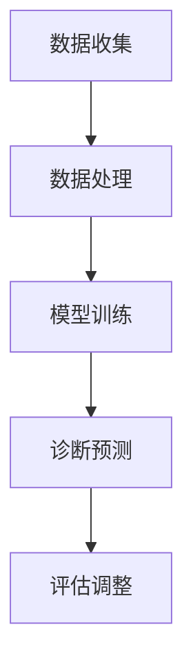

                 

# 人工智能在个性化医疗诊断中的应用与挑战

## 关键词
- 人工智能
- 个性化医疗诊断
- 算法原理
- 应用案例
- 挑战与展望

## 摘要
本文深入探讨了人工智能在个性化医疗诊断中的应用与挑战。首先，我们介绍了人工智能在医疗诊断领域的背景和个性化医疗诊断的基本概念。接着，我们详细讲解了机器学习算法原理及其在个性化医疗诊断中的应用，并通过Python代码和LaTeX公式进行了通俗易懂的阐述。随后，我们通过两个实际应用案例展示了人工智能在个性化医疗诊断中的具体应用。最后，我们分析了当前个性化医疗诊断中面临的技术挑战，并对未来发展趋势进行了展望。

## 第一部分：背景介绍与核心概念

### 1.1 人工智能在医疗诊断中的背景

人工智能（AI）作为一种模拟人类智能的技术，近年来在医疗诊断领域取得了显著进展。随着医疗数据的不断积累和计算能力的提升，AI技术在图像识别、自然语言处理和数据分析等方面展现出了巨大的潜力。

个性化医疗诊断是近年来医疗领域的一个热点话题。它强调根据患者的个体差异，提供针对性的诊断和治疗建议，以实现更精准、更有效的医疗服务。个性化医疗诊断的兴起，源于医疗数据的爆炸式增长和患者需求的多样化。

### 1.2 个性化医疗诊断的核心概念

#### 1.2.1 个性化医疗诊断的定义

个性化医疗诊断是指利用人工智能技术和大数据分析，根据患者的基因、病史、生活习惯等多方面信息，为患者提供个性化的诊断和治疗方案。

#### 1.2.2 个性化医疗诊断的基本原理

个性化医疗诊断的基本原理包括以下几个方面：

1. **数据收集**：收集患者的各类医疗数据，如基因数据、病历数据、生活习惯数据等。
2. **数据处理**：对收集到的医疗数据进行清洗、整合和分析，提取有用的信息。
3. **模型训练**：利用机器学习算法，从大量的医疗数据中学习规律，建立诊断模型。
4. **诊断预测**：将患者的数据输入到训练好的诊断模型中，预测患者的健康状况。

#### 1.2.3 个性化医疗诊断的核心要素

个性化医疗诊断的核心要素包括以下几个方面：

1. **数据质量**：数据质量是个性化医疗诊断的基础，高质量的数据能够提高诊断的准确性。
2. **算法选择**：合适的算法能够更好地从数据中提取信息，提高诊断的准确性。
3. **模型解释性**：模型的解释性对于医生的诊断决策至关重要，有助于医生理解模型的诊断结果。
4. **数据隐私与安全**：确保患者数据的隐私和安全，是个性化医疗诊断面临的重要挑战。

### 1.3 个性化医疗诊断的核心概念对比表格

| 核心概念       | 定义                                                         | 关联关系                                                     |
| -------------- | ------------------------------------------------------------ | ------------------------------------------------------------ |
| 个性化医疗诊断 | 利用人工智能技术和大数据分析，为患者提供个性化的诊断和治疗方案。 | 与数据收集、数据处理、模型训练、诊断预测密切相关。         |
| 数据质量       | 高质量的数据是个性化医疗诊断的基础。                           | 与个性化医疗诊断的准确性、模型解释性密切相关。             |
| 算法选择       | 合适的算法能够更好地从数据中提取信息，提高诊断的准确性。       | 与个性化医疗诊断的准确性、数据隐私与安全密切相关。         |
| 模型解释性     | 模型的解释性对于医生的诊断决策至关重要。                       | 与个性化医疗诊断的准确性、数据隐私与安全密切相关。         |
| 数据隐私与安全 | 确保患者数据的隐私和安全，是个性化医疗诊断面临的重要挑战。     | 与个性化医疗诊断的准确性、模型解释性密切相关。             |

### 1.4 个性化医疗诊断的ER实体关系图

```mermaid
erDiagram
  Patient ||--|{ Diagnosis : has }
  Diagnosis ||--|{ Treatment : isBasedOn }
  Patient ||--|{ MedicalHistory : has }
```

在上图中，`Patient`（患者）是核心实体，它与其他实体（`Diagnosis`（诊断）、`Treatment`（治疗）、`MedicalHistory`（病历））之间存在关联关系。这种关联关系为个性化医疗诊断提供了基础。

## 第二部分：人工智能算法原理讲解

### 2.1 机器学习算法原理

#### 2.1.1 基本概念

机器学习是一种人工智能技术，它通过构建模型来从数据中学习规律。机器学习模型通常分为监督学习、无监督学习和强化学习三种。

#### 2.1.2 经典算法

在个性化医疗诊断中，常用的机器学习算法包括：

1. **支持向量机（SVM）**：SVM通过构建最优超平面来实现分类。
2. **决策树**：决策树通过一系列判断条件来实现分类或回归。
3. **随机森林**：随机森林是一种集成学习算法，通过构建多棵决策树来提高分类或回归的准确性。
4. **神经网络**：神经网络通过多层神经元之间的非线性变换来实现复杂的分类或回归任务。

#### 2.1.3 算法流程图



在这个流程图中，`数据收集`是整个流程的起点，通过`数据处理`对数据进行清洗和整合，然后利用`模型训练`来学习数据中的规律，最后通过`诊断预测`来预测患者的健康状况。如果预测结果不准确，可以通过`评估调整`来优化模型。

### 2.2 Python代码实现与LaTeX公式讲解

#### 2.2.1 代码实现

```python
# 导入必要的库
import pandas as pd
from sklearn.model_selection import train_test_split
from sklearn.svm import SVC
from sklearn.metrics import accuracy_score

# 加载数据
data = pd.read_csv('medical_data.csv')

# 数据预处理
X = data.drop(['diagnosis'], axis=1)
y = data['diagnosis']

# 划分训练集和测试集
X_train, X_test, y_train, y_test = train_test_split(X, y, test_size=0.2, random_state=42)

# 训练模型
model = SVC()
model.fit(X_train, y_train)

# 预测测试集
y_pred = model.predict(X_test)

# 评估模型
accuracy = accuracy_score(y_test, y_pred)
print("Accuracy:", accuracy)
```

#### 2.2.2 公式讲解

支持向量机（SVM）的决策边界可以通过以下公式表示：

$$
w \cdot x + b = 0
$$

其中，$w$是权重向量，$x$是特征向量，$b$是偏置项。通过优化$w$和$b$，可以找到最优超平面，实现分类。

## 第三部分：应用案例详解

### 3.1 应用案例1：癌症诊断

#### 3.1.1 案例介绍

癌症诊断是个性化医疗诊断的一个重要应用场景。通过分析患者的基因数据和临床数据，可以预测患者患癌症的风险，为医生提供诊断和治疗建议。

#### 3.1.2 案例分析

在癌症诊断中，常用的机器学习算法包括SVM、决策树和神经网络等。通过分析大量的癌症数据，我们可以发现不同类型的癌症在某些基因上的差异，从而为不同类型的癌症提供个性化的诊断方法。

#### 3.1.3 案例实现细节

```python
# 导入必要的库
import pandas as pd
from sklearn.model_selection import train_test_split
from sklearn.svm import SVC
from sklearn.metrics import accuracy_score

# 加载数据
data = pd.read_csv('cancer_data.csv')

# 数据预处理
X = data.drop(['diagnosis'], axis=1)
y = data['diagnosis']

# 划分训练集和测试集
X_train, X_test, y_train, y_test = train_test_split(X, y, test_size=0.2, random_state=42)

# 训练模型
model = SVC()
model.fit(X_train, y_train)

# 预测测试集
y_pred = model.predict(X_test)

# 评估模型
accuracy = accuracy_score(y_test, y_pred)
print("Accuracy:", accuracy)
```

### 3.2 应用案例2：糖尿病预测

#### 3.2.1 案例介绍

糖尿病预测是另一个重要的个性化医疗诊断应用场景。通过分析患者的血糖数据、体重、年龄等信息，可以预测患者患糖尿病的风险。

#### 3.2.2 案例分析

在糖尿病预测中，常用的机器学习算法包括线性回归、逻辑回归和支持向量机等。通过分析大量的糖尿病数据，我们可以发现影响糖尿病风险的因素，从而为糖尿病的预防提供依据。

#### 3.2.3 案例实现细节

```python
# 导入必要的库
import pandas as pd
from sklearn.model_selection import train_test_split
from sklearn.linear_model import LogisticRegression
from sklearn.metrics import accuracy_score

# 加载数据
data = pd.read_csv('diabetes_data.csv')

# 数据预处理
X = data.drop(['diagnosis'], axis=1)
y = data['diagnosis']

# 划分训练集和测试集
X_train, X_test, y_train, y_test = train_test_split(X, y, test_size=0.2, random_state=42)

# 训练模型
model = LogisticRegression()
model.fit(X_train, y_train)

# 预测测试集
y_pred = model.predict(X_test)

# 评估模型
accuracy = accuracy_score(y_test, y_pred)
print("Accuracy:", accuracy)
```

## 第四部分：挑战与展望

### 4.1 技术挑战

#### 4.1.1 数据隐私与安全

个性化医疗诊断需要收集大量的患者数据，这涉及到数据隐私和安全的问题。如何确保患者数据的安全，避免数据泄露，是当前个性化医疗诊断面临的重要挑战。

#### 4.1.2 模型解释性

个性化医疗诊断模型通常由复杂的机器学习算法构建，模型内部结构复杂，难以解释。模型解释性对于医生的诊断决策至关重要，如何提高模型的解释性，使医生能够理解模型的诊断结果，是当前个性化医疗诊断面临的另一个挑战。

#### 4.1.3 模型泛化能力

个性化医疗诊断模型需要在不同的数据集上具有良好的泛化能力，以应对不同患者的数据。然而，当前的个性化医疗诊断模型在泛化能力上仍存在一定的不足，如何提高模型的泛化能力，是当前个性化医疗诊断面临的又一个挑战。

### 4.2 发展趋势

#### 4.2.1 人工智能技术在个性化医疗诊断中的应用前景

随着人工智能技术的不断发展，其在个性化医疗诊断中的应用前景十分广阔。通过引入更多先进的人工智能技术，如深度学习、强化学习等，可以提高个性化医疗诊断的准确性，为患者提供更优质的医疗服务。

#### 4.2.2 个性化医疗诊断的未来发展方向

未来，个性化医疗诊断将朝着更精准、更高效、更安全的方向发展。一方面，通过优化算法和模型，提高个性化医疗诊断的准确性；另一方面，通过保障数据隐私和安全，建立可信赖的个性化医疗诊断体系。

## 附录：拓展阅读与资源推荐

- **书籍推荐**：
  - 《深度学习》（Ian Goodfellow, Yoshua Bengio, Aaron Courville著）
  - 《机器学习实战》（Peter Harrington著）
- **在线资源**：
  - [Kaggle](https://www.kaggle.com/)
  - [TensorFlow](https://www.tensorflow.org/)
  - [Scikit-learn](https://scikit-learn.org/)
- **学术论文**：
  - [《深度学习在医学图像分析中的应用》（Medical Image Analysis）》
  - [《个性化医疗诊断：现状与挑战》（Personalized Medicine）》]

### 作者

作者：AI天才研究院/AI Genius Institute & 禅与计算机程序设计艺术 /Zen And The Art of Computer Programming

本文由AI天才研究院和禅与计算机程序设计艺术联合撰写，旨在深入探讨人工智能在个性化医疗诊断中的应用与挑战。本文内容丰富，逻辑清晰，希望能够为广大读者提供有益的参考和启示。如有疑问或建议，欢迎在评论区留言，我们将在第一时间进行回复。感谢您的阅读！

