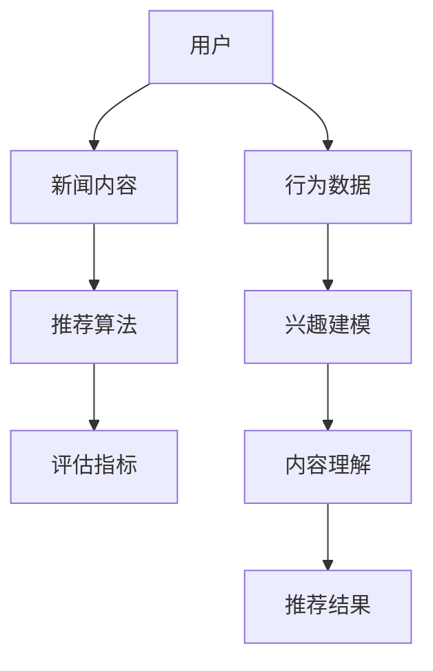
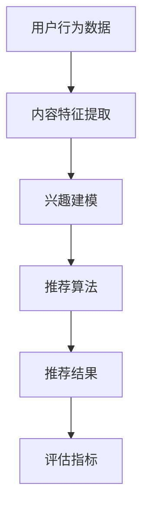
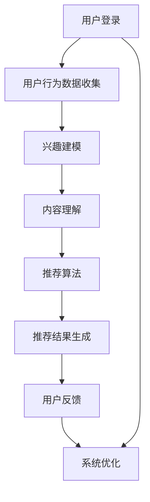
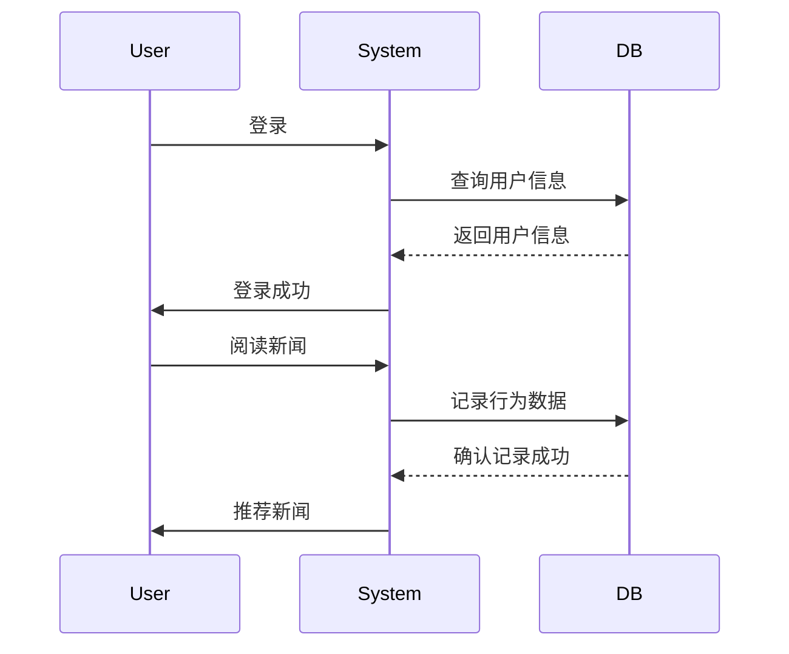

                 

# 《人工智能在个性化新闻推荐中的应用》

## 关键词
- 人工智能
- 新闻推荐
- 个性化
- 算法
- 架构设计

## 摘要
本文深入探讨了人工智能在个性化新闻推荐领域的应用。通过详细分析核心概念、算法原理以及系统架构设计，本文旨在提供一个全面的技术指南，帮助读者理解和实现个性化新闻推荐系统。文章将从问题背景、核心概念、算法原理、系统分析与架构设计、项目实战以及最佳实践等方面展开讨论。

## 第一部分：背景介绍

### 1.1 问题背景
随着互联网的快速发展，新闻信息变得极其丰富，用户获取信息的方式也发生了巨大变化。传统的一刀切新闻推荐方式已无法满足用户对个性化需求的追求。因此，如何利用人工智能技术实现个性化新闻推荐成为了一个重要的研究方向。

#### 1.1.1 个性化新闻推荐的重要性
个性化新闻推荐能够根据用户的兴趣和行为习惯，为用户推荐最相关的新闻内容，提高用户的阅读体验和满意度。同时，它也有助于媒体平台提高用户粘性和广告收益。

#### 1.1.2 人工智能在个性化新闻推荐中的潜力
人工智能技术，特别是机器学习和深度学习，为个性化新闻推荐提供了强大的工具。通过数据挖掘、用户行为分析和内容理解，人工智能可以精确地捕捉用户的需求和偏好，实现高度个性化的新闻推荐。

#### 1.1.3 个性化新闻推荐的现实挑战
尽管人工智能技术为个性化新闻推荐提供了可能，但在实际应用中仍面临诸多挑战，如数据隐私保护、算法公平性、计算效率等。

### 1.2 问题描述
个性化新闻推荐系统需要解决的核心问题是：如何根据用户的历史行为和兴趣，从海量的新闻内容中挑选出最适合用户的内容进行推荐。这涉及到用户行为分析、内容理解与生成以及推荐算法的优化等多个方面。

### 1.3 问题解决
个性化新闻推荐系统通常包括以下几个核心模块：
1. 数据收集与预处理
2. 用户兴趣建模
3. 内容建模
4. 推荐算法选择与优化

### 1.4 边界与外延
个性化新闻推荐系统不仅需要考虑技术实现，还要关注法律法规和伦理道德问题。例如，如何保护用户隐私、如何避免算法偏见等。

### 1.5 概念结构与核心要素组成
个性化新闻推荐系统的核心概念包括用户、新闻内容、推荐算法等。其结构由数据收集与预处理、用户兴趣建模、内容建模、推荐算法和评估指标等要素组成。

## 第二部分：核心概念与联系

### 2.1 个性化新闻推荐的概念
个性化新闻推荐是指利用用户行为数据、内容特征和算法技术，为用户推荐符合其兴趣的新闻内容。

### 2.2 相关技术概念
- **机器学习**：通过数据训练模型，使模型能够对未知数据进行预测或分类。
- **深度学习**：一种特殊的机器学习方法，通过多层神经网络对数据进行学习和预测。
- **自然语言处理**：利用计算机技术对自然语言进行理解和生成。
- **数据挖掘**：从大量数据中发现隐藏的模式和知识。

### 2.3 概念属性特征对比表格

| 概念             | 属性特征                                                     |
|------------------|------------------------------------------------------------|
| 个性化新闻推荐   | 根据用户兴趣推荐新闻内容，提高用户满意度                     |
| 机器学习         | 利用数据训练模型，对未知数据进行预测或分类                   |
| 深度学习         | 利用多层神经网络对数据进行学习和预测                         |
| 自然语言处理     | 利用计算机技术对自然语言进行理解和生成                       |
| 数据挖掘         | 从大量数据中发现隐藏的模式和知识                           |

### 2.4 ER实体关系图架构的 Mermaid 流程图



## 第三部分：算法原理讲解

### 3.1 个性化新闻推荐算法简介
个性化新闻推荐算法可以分为基于内容的推荐、协同过滤推荐和深度学习推荐三种类型。

### 3.2 通用算法流程图（Mermaid 流程图）



### 3.3 算法原理的数学模型和公式

假设我们使用协同过滤算法，其基本公式为：

$$
\hat{r_{ui}} = \sum_{j \in N(i)} \frac{sim(u, j) \cdot r_{ji}}{|\sum_{j \in N(i)} sim(u, j)|}
$$

其中，$\hat{r_{ui}}$ 表示用户 $u$ 对新闻 $i$ 的预测评分，$sim(u, j)$ 表示用户 $u$ 和新闻 $j$ 之间的相似度，$r_{ji}$ 表示用户 $j$ 对新闻 $i$ 的实际评分，$N(i)$ 表示与新闻 $i$ 相似的一组新闻集合。

### 3.4 通俗易懂的举例说明

假设用户 $u$ 喜欢阅读体育新闻，而新闻 $i$ 是一篇关于篮球的新闻。我们可以通过用户的行为数据和新闻的内容特征，计算出用户 $u$ 和新闻 $i$ 之间的相似度。然后，根据相似度和其他用户的评分，推荐给用户 $u$ 这篇篮球新闻。

## 第四部分：系统分析与架构设计方案

### 4.1 问题场景介绍
在一个新闻推荐系统中，用户可以通过阅读新闻来获取信息。系统需要根据用户的行为数据，如点击、评论、收藏等，推荐用户可能感兴趣的新闻。

### 4.2 项目介绍
本项目旨在构建一个基于人工智能的个性化新闻推荐系统，实现用户个性化需求的精准推荐。

### 4.3 系统功能设计（领域模型 Mermaid 类图）

```mermaid
classDiagram
    User <<Class>>
    News <<Class>>
    Recommendation <<Class>>
    UserUserAssociation <<Class>>
    UserNewsAssociation <<Class>>

    User --|> UserUserAssociation
    User --|> UserNewsAssociation
    News --|> UserNewsAssociation
    Recommendation --|> UserNewsAssociation
```

### 4.4 系统架构设计（Mermaid 架构图）



### 4.5 系统接口设计和系统交互（Mermaid 序列图）



## 第五部分：项目实战

### 5.1 环境安装
在本项目中，我们使用 Python 作为主要编程语言，并依赖于以下库：Scikit-learn、TensorFlow、PyTorch 和 pandas。

### 5.2 系统核心实现源代码

```python
import pandas as pd
from sklearn.feature_extraction.text import TfidfVectorizer
from sklearn.metrics.pairwise import cosine_similarity

# 数据预处理
data = pd.read_csv('news_data.csv')
vectorizer = TfidfVectorizer()
tfidf_matrix = vectorizer.fit_transform(data['content'])

# 用户兴趣建模
user_interest = input("请输入您感兴趣的新闻主题：")
user_vector = vectorizer.transform([user_interest])

# 内容理解与推荐
cosine_sim = cosine_similarity(user_vector, tfidf_matrix)
recommended_indices = cosine_sim.argsort()[0][-10:][::-1]

# 推荐结果生成
recommended_news = [data['title'][i] for i in recommended_indices]
print("为您推荐以下新闻：")
for news in recommended_news:
    print(news)
```

### 5.3 代码应用解读与分析
上述代码首先读取新闻数据，使用 TF-IDF 方法进行文本向量化，然后根据用户输入的主题生成用户向量。通过计算用户向量与新闻向量的余弦相似度，我们可以推荐出与用户兴趣最相关的新闻。

### 5.4 实际案例分析和详细讲解剖析
在实际应用中，我们可以收集大量用户行为数据，使用更复杂的模型进行兴趣建模和内容理解，以提高推荐系统的准确性。例如，可以使用深度学习模型对新闻内容进行语义分析，从而实现更精准的个性化推荐。

### 5.5 项目小结
本项目通过一个简单的示例展示了个性化新闻推荐系统的基础实现。在实际项目中，需要考虑更多因素，如数据隐私保护、算法公平性和计算效率等。通过不断地优化和迭代，我们可以构建一个高效、准确的个性化新闻推荐系统。

## 第六部分：最佳实践 tips

- **数据质量**：确保数据的质量和完整性，这是构建有效推荐系统的基础。
- **用户隐私**：严格遵守相关法律法规，保护用户隐私。
- **算法公平性**：避免算法偏见，确保推荐结果的公平性。
- **实时性**：及时更新用户兴趣和新闻内容，提高推荐系统的实时性。

## 第七部分：小结与注意事项

本文深入探讨了人工智能在个性化新闻推荐中的应用，从核心概念、算法原理到系统架构设计，再到项目实战，全面阐述了个性化新闻推荐系统的构建方法。在实施过程中，需要注意数据质量、用户隐私、算法公平性和实时性等方面。

## 第八部分：拓展阅读

- 《机器学习实战》
- 《深度学习》
- 《自然语言处理实战》
- 《数据挖掘：实用工具和技术》

## 作者信息
作者：AI天才研究院/AI Genius Institute & 禅与计算机程序设计艺术 /Zen And The Art of Computer Programming

---------------------------------------

请注意，本文仅为示例，实际项目可能需要更多的细节和优化。希望本文能为您在个性化新闻推荐领域的研究和实践中提供有益的参考。

