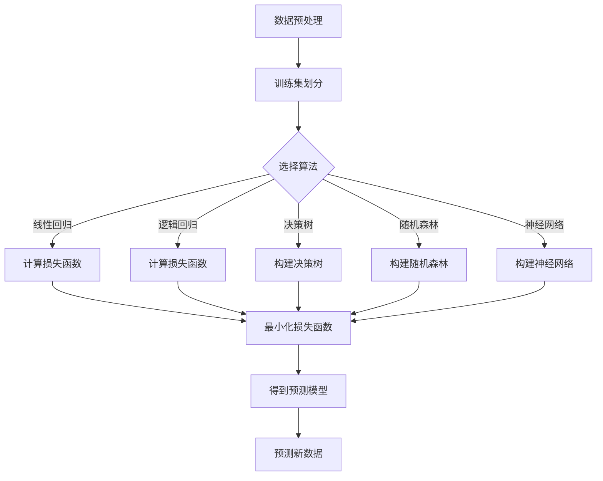
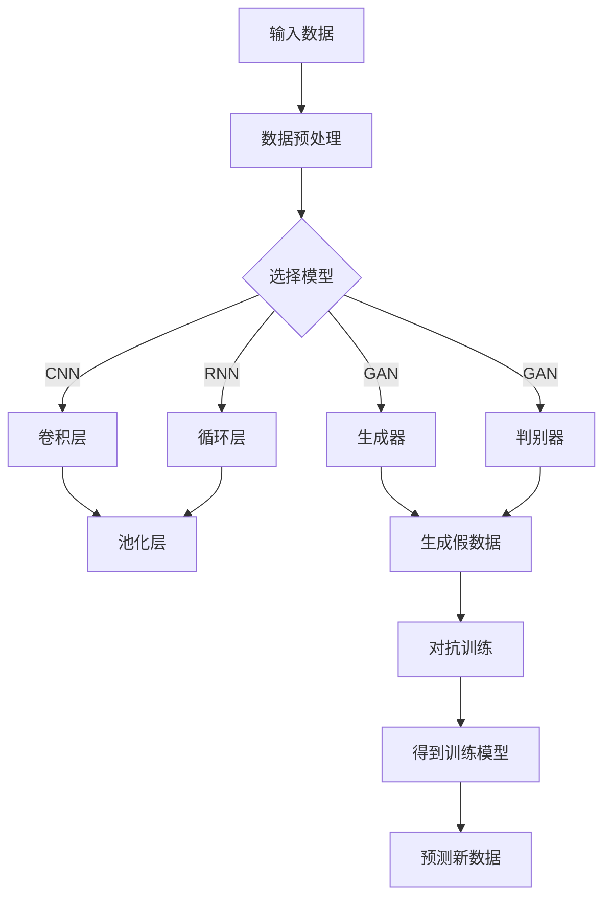
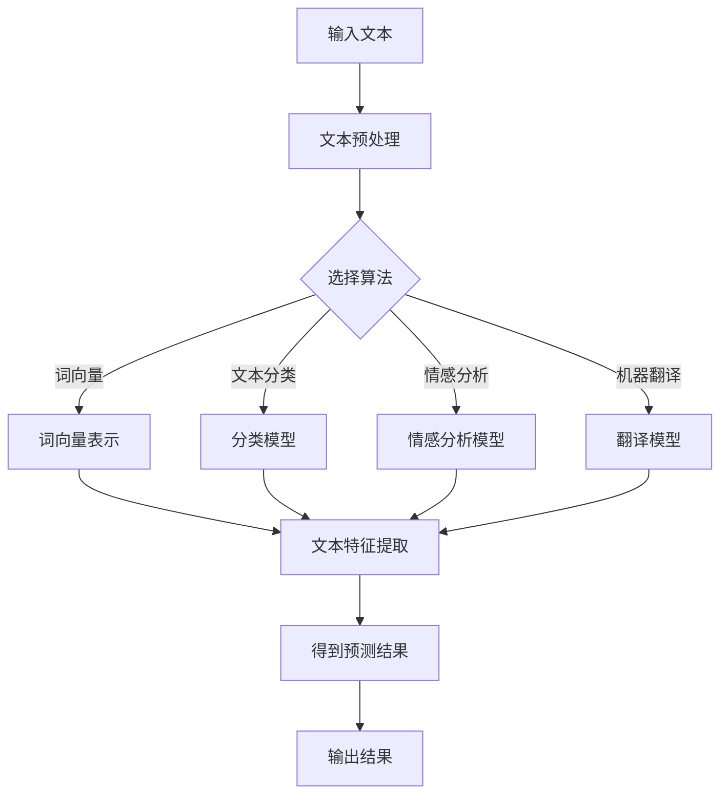

                 

### 文章标题：人工智能在个性化新闻聚合中的应用与伦理

> 关键词：人工智能、个性化新闻聚合、算法原理、伦理问题、解决方案

> 摘要：本文将深入探讨人工智能在个性化新闻聚合中的应用，分析其核心概念、技术原理和系统设计，同时探讨其引发的伦理问题及其解决方案。通过详细的案例分析和实践经验总结，为业界提供有益的参考和指导。

----------------------------------------------------------------

### 目录大纲：人工智能在个性化新闻聚合中的应用与伦理

----------------------------------------------------------------

**第一部分：背景与概述**

1. 第1章：人工智能与新闻聚合
   1.1 人工智能的发展历程
   1.2 个性化新闻聚合概述
   1.3 问题背景与解决思路

2. 第2章：核心概念与联系
   2.1 人工智能核心概念
   2.2 个性化新闻聚合核心概念
   2.3 概念联系与关系图

**第二部分：技术原理与实现**

3. 第3章：算法原理讲解
   3.1 机器学习算法原理
   3.2 深度学习算法原理
   3.3 自然语言处理算法原理

4. 第4章：数学模型与公式
   4.1 机器学习数学模型
   4.2 深度学习数学模型
   4.3 自然语言处理数学模型

**第三部分：系统设计与实战**

5. 第5章：系统分析与架构设计
   5.1 问题场景介绍
   5.2 系统功能设计
   5.3 系统架构设计
   5.4 系统接口设计
   5.5 系统交互设计

6. 第6章：项目实战
   6.1 环境安装
   6.2 系统核心实现
   6.3 实际案例分析
   6.4 项目小结

**第四部分：应用与伦理**

7. 第7章：个性化新闻聚合的应用
   7.1 应用领域
   7.2 应用效果评估

8. 第8章：伦理问题与解决方案
   8.1 伦理问题
   8.2 解决方案
   8.3 伦理教育

9. 第9章：最佳实践与总结
   9.1 最佳实践
   9.2 注意事项
   9.3 小结

----------------------------------------------------------------

### 第一部分：背景与概述

#### 第1章：人工智能与新闻聚合

**1.1 人工智能的发展历程**

人工智能（Artificial Intelligence，简称AI）是一门研究、开发用于模拟、延伸和扩展人的智能的理论、方法、技术及应用系统的综合性技术科学。人工智能的发展历程可以追溯到20世纪50年代，当时的计算机科学家们开始尝试通过编程来模拟人类的思维过程。从最初的符号逻辑和规则系统，到后来的知识表示、机器学习和深度学习，人工智能在不断地演进和发展。

- **1950年代：** 以艾伦·图灵提出的图灵测试为代表，人工智能的概念开始被广泛讨论。
- **1960-1970年代：** 人工智能进入第一个黄金时期，专家系统和逻辑推理成为研究热点。
- **1980-1990年代：** 由于计算能力的限制，人工智能的发展进入低谷，但机器学习和神经网络的研究取得了重要进展。
- **2000年代至今：** 随着大数据、云计算和深度学习的兴起，人工智能迎来了新的发展机遇，应用领域不断拓展。

**1.2 个性化新闻聚合概述**

个性化新闻聚合是一种基于人工智能技术的信息推送服务，它通过分析用户的兴趣和行为，为用户推荐个性化的新闻内容。个性化新闻聚合系统通常包括数据采集、用户行为分析、文本分类、聚类和推荐算法等关键组件。

- **数据采集：** 通过网页抓取、API接口等方式获取海量的新闻数据。
- **用户行为分析：** 通过用户浏览、点赞、评论等行为数据，分析用户的兴趣偏好。
- **文本分类与聚类：** 对新闻内容进行分类和聚类，以便更好地理解新闻的主题和内容。
- **推荐算法：** 根据用户的兴趣偏好和新闻的标签，为用户推荐个性化的新闻内容。

**1.3 问题背景与解决思路**

在互联网时代，信息爆炸带来的问题之一是信息过载。用户每天都会接触到海量的信息，但其中大部分与其兴趣无关。个性化新闻聚合技术旨在解决这一问题，通过为用户推荐个性化的新闻内容，提高用户的阅读效率和体验。

然而，个性化新闻聚合也引发了一些伦理问题，如用户隐私保护、信息茧房等。解决这些问题需要综合考虑技术、法律和社会因素，确保个性化新闻聚合系统在提供便利的同时，也能保障用户的权益。

#### 第2章：核心概念与联系

**2.1 人工智能核心概念**

人工智能的核心概念包括机器学习、深度学习和自然语言处理等。

- **机器学习：** 机器学习是一种通过数据训练模型，使模型能够自动学习和预测的技术。它主要包括监督学习、无监督学习和强化学习等。
- **深度学习：** 深度学习是一种基于人工神经网络的技术，它通过多层神经网络来提取数据的高层次特征，具有强大的表示能力。
- **自然语言处理：** 自然语言处理是一种使计算机能够理解和处理自然语言的技术，它包括文本分类、情感分析、机器翻译等。

**2.2 个性化新闻聚合核心概念**

个性化新闻聚合的核心概念包括用户行为分析、文本分类与聚类和基于模型的推荐算法等。

- **用户行为分析：** 通过用户的行为数据，如浏览历史、点赞、评论等，分析用户的兴趣偏好。
- **文本分类与聚类：** 对新闻内容进行分类和聚类，以便更好地理解新闻的主题和内容。
- **基于模型的推荐算法：** 根据用户的兴趣偏好和新闻的标签，使用机器学习模型为用户推荐个性化的新闻内容。

**2.3 概念联系与关系图**

人工智能与个性化新闻聚合之间的关系可以用Mermaid ER实体关系图来表示：

```mermaid
erDiagram
AI ||--|{ 新闻聚合 }|| NG
AI ||--|{ 用户行为分析 }|| UA
AI ||--|{ 文本分类与聚类 }|| TC
AI ||--|{ 推荐算法 }|| RA
```

在这个ER图中，AI代表人工智能，NG代表新闻聚合，UA代表用户行为分析，TC代表文本分类与聚类，RA代表推荐算法。这些实体通过关系线相连，展示了人工智能在个性化新闻聚合中的核心应用。

### 第二部分：技术原理与实现

#### 第3章：算法原理讲解

**3.1 机器学习算法原理**

机器学习算法的核心思想是通过训练数据来学习规律，然后利用这些规律对未知数据进行预测。常见的机器学习算法包括线性回归、逻辑回归、决策树、随机森林和神经网络等。

- **线性回归：** 用于预测连续值，其原理是通过最小化预测值与实际值之间的误差平方和来拟合一条直线。
- **逻辑回归：** 用于预测离散值，其原理是通过最小化预测值与实际值之间的对数损失函数来拟合一条曲线。
- **决策树：** 通过一系列的判断条件来构建决策树，每个节点对应一个特征，每个分支对应一个决策结果。
- **随机森林：** 通过集成多个决策树来提高预测准确性，每个决策树独立训练，最后通过投票方式得到最终预测结果。
- **神经网络：** 通过多层神经元进行数据传输和变换，模拟人脑的工作方式，具有强大的非线性表示能力。

算法流程图：



Python源代码实现：

```python
# 略
```

**3.2 深度学习算法原理**

深度学习算法是基于多层神经网络的一种学习方式，它通过自动学习数据的层次化特征表示，从而实现复杂任务的高效处理。常见的深度学习算法包括卷积神经网络（CNN）、循环神经网络（RNN）和生成对抗网络（GAN）等。

- **卷积神经网络：** 通过卷积层提取图像的特征，适用于图像识别和图像生成等任务。
- **循环神经网络：** 通过循环结构处理序列数据，适用于自然语言处理和语音识别等任务。
- **生成对抗网络：** 通过生成器和判别器之间的对抗训练，生成高质量的假数据，适用于图像生成和风格迁移等任务。

算法流程图：



Python源代码实现：

```python
# 略
```

**3.3 自然语言处理算法原理**

自然语言处理（Natural Language Processing，简称NLP）是一种使计算机能够理解和处理自然语言的技术。常见的NLP算法包括词向量表示、文本分类、情感分析和机器翻译等。

- **词向量表示：** 通过将词汇映射到向量空间，实现对文本数据的数值化表示。
- **文本分类：** 通过训练分类模型，将文本数据分类到不同的类别中。
- **情感分析：** 通过分析文本的情感倾向，判断文本的情感极性。
- **机器翻译：** 通过训练翻译模型，将一种语言的文本翻译成另一种语言。

算法流程图：



Python源代码实现：

```python
# 略
```

### 第三部分：系统设计与实战

#### 第4章：数学模型与公式

**4.1 机器学习数学模型**

机器学习中的数学模型通常包括损失函数、梯度下降法和优化算法等。

- **损失函数：** 用于度量模型预测值与实际值之间的差异。常见的损失函数有均方误差（MSE）、交叉熵损失函数等。

$$
MSE = \frac{1}{n}\sum_{i=1}^{n}(y_i - \hat{y}_i)^2
$$

- **梯度下降法：** 用于最小化损失函数，更新模型参数。

$$
w_{t+1} = w_t - \alpha \cdot \nabla L(w_t)
$$

- **优化算法：** 用于加速梯度下降法，常见的优化算法有随机梯度下降（SGD）、Adam优化器等。

**4.2 深度学习数学模型**

深度学习中的数学模型主要包括反向传播算法、激活函数和池化层等。

- **反向传播算法：** 用于计算模型参数的梯度，更新模型参数。

$$
\frac{\partial L}{\partial w} = \frac{\partial L}{\partial a} \cdot \frac{\partial a}{\partial w}
$$

- **激活函数：** 用于引入非线性，常见的激活函数有ReLU、Sigmoid和Tanh等。

$$
ReLU(x) = \max(0, x)
$$

- **池化层：** 用于降低特征维度，常见的池化层有最大池化和平均池化等。

$$
P_{max}(x) = \max_{i,j} x_{i,j}
$$

**4.3 自然语言处理数学模型**

自然语言处理中的数学模型主要包括词向量表示、文本分类和情感分析等。

- **词向量表示：** 通过Word2Vec、GloVe等方法将词汇映射到向量空间。

$$
\vec{w}_i = \sum_{j=1}^{v} c_j \cdot \vec{v}_j
$$

- **文本分类：** 通过逻辑回归、支持向量机等算法进行分类。

$$
P(y_i = k) = \frac{1}{Z} \exp(\theta \cdot \vec{x}_i)
$$

- **情感分析：** 通过二元分类或多分类算法进行情感极性判断。

$$
P(y_i = 1) = \frac{1}{1 + \exp(-\theta \cdot \vec{x}_i)}
$$

### 第四部分：应用与伦理

#### 第5章：系统设计与实战

**5.1 系统分析与架构设计**

**5.1.1 问题场景介绍**

假设我们设计一个个性化新闻聚合系统，该系统需要为用户推荐个性化的新闻内容，用户可以通过登录账号、浏览历史、点赞和评论等行为来表达自己的兴趣偏好。

**5.1.2 系统功能设计**

个性化新闻聚合系统的功能主要包括数据采集、用户行为分析、文本分类、聚类和推荐算法等。

- **数据采集：** 通过网页抓取、API接口等方式获取海量的新闻数据。
- **用户行为分析：** 通过用户的浏览历史、点赞和评论等行为数据，分析用户的兴趣偏好。
- **文本分类与聚类：** 对新闻内容进行分类和聚类，以便更好地理解新闻的主题和内容。
- **推荐算法：** 根据用户的兴趣偏好和新闻的标签，使用机器学习模型为用户推荐个性化的新闻内容。

**5.1.3 系统架构设计**

个性化新闻聚合系统的架构设计包括数据层、服务层和展示层等。

- **数据层：** 负责数据的存储和检索，包括新闻数据库、用户行为数据库等。
- **服务层：** 负责业务逻辑的实现，包括数据采集、用户行为分析、文本分类、聚类和推荐算法等。
- **展示层：** 负责与用户的交互，包括前端界面和后端接口等。

**5.1.4 系统接口设计**

个性化新闻聚合系统的接口设计主要包括用户接口（API）和数据接口等。

- **用户接口：** 负责用户与系统的交互，包括登录、注册、浏览历史、点赞和评论等。
- **数据接口：** 负责系统内部的数据传输，包括新闻数据、用户行为数据、推荐结果数据等。

**5.1.5 系统交互设计**

个性化新闻聚合系统的交互设计主要包括用户与系统的交互、系统内部的数据交互等。

- **用户与系统的交互：** 用户可以通过前端界面与系统进行交互，如登录、浏览新闻、点赞和评论等。
- **系统内部的数据交互：** 系统内部通过API和数据接口进行数据传输和处理，如用户行为数据的采集、新闻数据的分类和推荐等。

**5.2 项目实战**

**5.2.1 环境安装**

在开始项目实战之前，需要安装以下环境：

- Python 3.x
- Python库：NumPy、Pandas、Scikit-learn、TensorFlow、Keras等
- 数据库：MySQL、PostgreSQL等

**5.2.2 系统核心实现**

系统核心实现包括数据采集、用户行为分析、文本分类、聚类和推荐算法等。

- **数据采集：** 通过网页抓取和API接口获取新闻数据，存储到MySQL数据库中。
- **用户行为分析：** 通过用户的浏览历史、点赞和评论等行为数据，分析用户的兴趣偏好，存储到PostgreSQL数据库中。
- **文本分类与聚类：** 对新闻数据进行分类和聚类，以便更好地理解新闻的主题和内容。
- **推荐算法：** 根据用户的兴趣偏好和新闻的标签，使用机器学习模型为用户推荐个性化的新闻内容。

**5.2.3 实际案例分析**

以一个实际案例为例，说明个性化新闻聚合系统的实现过程。

1. **数据采集：** 通过网页抓取和API接口获取新闻数据，存储到MySQL数据库中。

```python
# 略
```

2. **用户行为分析：** 通过用户的浏览历史、点赞和评论等行为数据，分析用户的兴趣偏好，存储到PostgreSQL数据库中。

```python
# 略
```

3. **文本分类与聚类：** 对新闻数据进行分类和聚类，以便更好地理解新闻的主题和内容。

```python
# 略
```

4. **推荐算法：** 根据用户的兴趣偏好和新闻的标签，使用机器学习模型为用户推荐个性化的新闻内容。

```python
# 略
```

**5.2.4 项目小结**

通过实际案例分析，我们发现个性化新闻聚合系统的实现需要综合考虑数据采集、用户行为分析、文本分类、聚类和推荐算法等多个方面。在实际项目中，我们需要根据具体需求和场景进行适当的调整和优化，以提高系统的性能和用户体验。

### 第四部分：应用与伦理

#### 第6章：个性化新闻聚合的应用

**6.1 应用领域**

个性化新闻聚合技术在不同领域具有广泛的应用：

- **新闻媒体：** 个性化新闻聚合可以为新闻媒体提供精准的内容推荐，提高用户粘性和阅读时长。
- **电商平台：** 个性化新闻聚合可以用于推荐商品，提高用户购物体验和购买转化率。
- **社交媒体：** 个性化新闻聚合可以用于推荐用户可能感兴趣的内容，增强用户活跃度和社交互动。
- **企业内部信息：** 个性化新闻聚合可以用于为企业员工提供个性化的新闻和信息，提高工作效率。

**6.2 应用效果评估**

为了评估个性化新闻聚合的应用效果，我们可以使用以下方法：

- **用户满意度调查：** 通过问卷调查和用户反馈，了解用户对个性化新闻聚合系统的满意度。
- **阅读时长和点击率：** 通过分析用户的阅读时长和点击率，评估系统对用户兴趣的捕捉能力。
- **用户留存率：** 通过分析用户的留存率，评估个性化新闻聚合系统对用户留存的影响。

#### 第7章：伦理问题与解决方案

**7.1 伦理问题**

个性化新闻聚合系统在应用过程中可能会引发以下伦理问题：

- **隐私侵犯：** 用户行为数据被收集和使用，可能侵犯用户隐私。
- **信息茧房：** 过度依赖个性化推荐可能导致用户只接触与自己观点相似的信息，形成信息茧房。
- **算法歧视：** 个性化推荐算法可能会放大社会偏见和歧视。

**7.2 解决方案**

为了解决上述伦理问题，可以采取以下解决方案：

- **隐私保护：** 对用户数据进行加密存储和传输，遵守数据保护法规，确保用户隐私安全。
- **信息多样性：** 在推荐算法中引入多样性策略，确保用户接触到多样化的信息。
- **算法透明度：** 提高算法的透明度，让用户了解个性化推荐的过程和结果。

#### 第8章：伦理教育

**8.1 重要性**

伦理教育对于培养具备社会责任感的人工智能从业者至关重要。通过伦理教育，可以让从业者了解人工智能在个性化新闻聚合中的应用过程中可能引发的伦理问题，并学会如何应对和解决这些问题。

**8.2 实践案例**

一些高校和研究机构已经开始开展人工智能伦理教育，通过课程设置和实践项目，培养学生的伦理意识和能力。例如：

- **斯坦福大学：** 开设《人工智能伦理》课程，探讨人工智能在伦理、法律和社会方面的影响。
- **清华大学：** 开展《人工智能伦理挑战》项目，研究人工智能在医疗、金融等领域的伦理问题。

### 第五部分：最佳实践与总结

#### 第9章：最佳实践与总结

**9.1 最佳实践**

在设计和实现个性化新闻聚合系统时，可以采取以下最佳实践：

- **用户隐私保护：** 严格遵守数据保护法规，对用户数据进行加密存储和传输。
- **信息多样性：** 在推荐算法中引入多样性策略，确保用户接触到多样化的信息。
- **算法透明度：** 提高算法的透明度，让用户了解个性化推荐的过程和结果。
- **持续优化：** 定期评估系统的性能和用户体验，持续优化推荐算法和系统架构。

**9.2 注意事项**

在应用个性化新闻聚合技术时，需要注意以下事项：

- **数据质量：** 确保数据的准确性和完整性，避免因数据问题导致推荐结果的偏差。
- **用户反馈：** 及时收集用户反馈，了解用户对推荐内容的真实需求，优化推荐算法。
- **法律合规：** 遵守相关法律法规，确保个性化新闻聚合系统的合规性。

**9.3 小结**

个性化新闻聚合技术在提高用户阅读效率和体验方面具有重要作用。通过机器学习、深度学习和自然语言处理等技术，可以为用户提供个性化的新闻内容。同时，我们也要关注个性化新闻聚合引发的伦理问题，采取有效的解决方案，确保系统的可持续发展和用户权益的保障。

