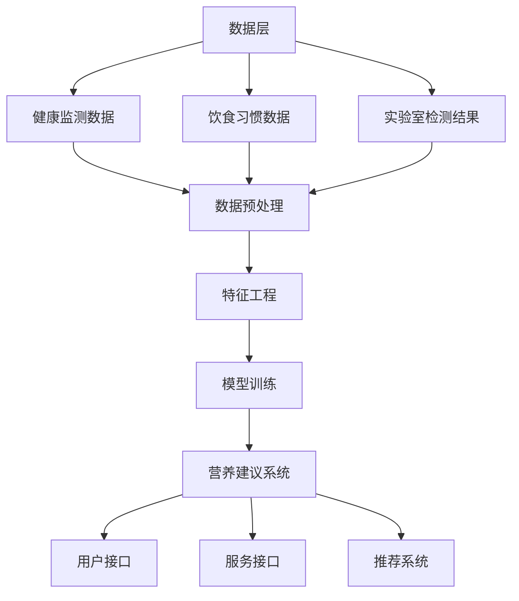

                 

### 引言与背景

**关键词：** 个性化营养，人工智能，健康饮食，数据驱动，机器学习

**摘要：** 本文将探讨人工智能在个性化营养建议中的应用，通过介绍个性化营养的重要性、当前的应用现状以及人工智能与营养学的结合，梳理出这一领域的核心概念和技术路线。文章旨在为读者提供一份详尽的指南，帮助理解个性化营养建议的发展背景及其未来前景。

在当今社会，随着人们对健康生活方式的日益重视，营养学已经成为一个备受关注的话题。然而，传统的营养建议往往是基于一般人群的平均需求，难以满足每个人的个性化需求。随着人工智能技术的迅猛发展，特别是在机器学习和数据挖掘领域的突破，个性化营养建议迎来了新的发展契机。人工智能不仅能够处理大规模的营养数据，还能通过学习用户的行为和生物特征，为个体提供定制化的饮食方案，从而改善健康水平。

**问题背景**

#### 个性化营养建议的重要性

个性化营养建议的重要性主要体现在以下几个方面：

1. **满足个体差异**：每个人的身体构成、代谢速率、生活习惯等都有所不同，单一的营养建议难以满足个体差异。
2. **预防慢性疾病**：针对个体的营养需求进行科学合理的调整，可以有效预防慢性疾病，如糖尿病、心血管疾病等。
3. **提高生活质量**：个性化的营养建议能够帮助个体更好地管理体重，改善消化系统健康，从而提高生活质量。

#### 人工智能在营养领域的应用现状

人工智能在营养领域的应用现状主要表现在以下几个方面：

1. **数据挖掘与分析**：通过收集和分析大量的营养数据，人工智能能够识别出不同饮食模式与健康状况之间的关系。
2. **机器学习算法**：利用机器学习算法，人工智能可以预测个体的营养需求，并提供个性化的饮食建议。
3. **智能诊断与干预**：基于大数据和人工智能技术，智能诊断系统可以实时监测个体的健康状况，提供个性化的营养干预方案。

### 人工智能与营养学的结合

人工智能与营养学的结合主要体现在以下几个方面：

1. **个性化营养评估**：通过整合用户的生理数据、生活习惯、饮食习惯等信息，人工智能可以对个体的营养状况进行评估，并提供相应的饮食建议。
2. **营养信息推荐**：基于用户的历史数据和行为偏好，人工智能可以推荐个性化的营养信息，帮助用户建立健康的饮食习惯。
3. **智能营养管理**：通过智能设备收集用户的健康数据，人工智能可以实时监控用户的健康状况，提供个性化的营养管理方案。

### **书籍结构概述**

**1.2.1 书籍内容概述**

本书旨在深入探讨人工智能在个性化营养建议中的应用，内容结构如下：

- **引言与背景**：介绍个性化营养的重要性以及人工智能在营养领域的应用现状。
- **理论基础**：阐述人工智能和营养学的基础知识，包括机器学习、深度学习、营养学原理等。
- **应用实践**：详细讲解个性化营养模型构建和数据处理的实际应用。
- **案例分析**：通过具体案例展示人工智能在个性化营养建议中的应用效果。
- **未来展望**：分析个性化营养建议的发展趋势、挑战与机遇，并提出未来研究方向。

**1.2.2 阅读对象和预期效果**

本书的阅读对象主要包括营养学专家、人工智能研究人员、健康产业从业者以及对个性化营养感兴趣的读者。通过阅读本书，读者可以：

- **理解个性化营养的核心概念和技术**：通过详细的背景介绍和理论基础，了解个性化营养的基本原理和技术路线。
- **掌握个性化营养模型构建的方法**：通过应用实践部分，学习如何构建个性化营养模型并处理实际数据。
- **应用人工智能技术改善营养健康**：通过案例分析，了解人工智能在个性化营养建议中的实际应用，并能够将其应用于实际工作中。

### **总结**

通过本文的介绍，我们了解了个性化营养建议的重要性以及人工智能在营养领域的应用现状。接下来，我们将深入探讨人工智能和营养学的基础知识，为后续的应用实践和案例分析打下坚实的基础。接下来，让我们一步一步地深入探讨人工智能在个性化营养建议中的应用。

## **第二部分：理论基础**

### **2.1 人工智能基础**

#### **2.1.1 人工智能概述**

人工智能（Artificial Intelligence，简称AI）是计算机科学的一个分支，旨在创建能够执行通常需要人类智能才能完成的任务的机器系统。人工智能的核心目标是通过模拟、延伸和扩展人类智能，实现机器的自主学习和问题解决能力。

**人工智能的定义**：人工智能是指使计算机系统能够执行通常需要人类智能才能完成的任务的技术和科学。这些任务包括学习、推理、解决问题、感知、理解自然语言和视觉等。

**人工智能的发展历程**：

1. **早期探索**（1950s-1960s）：人工智能的概念首次提出，主要目标是创建能够进行逻辑推理的计算机程序。
2. **第一次浪潮**（1970s-1980s）：早期的人工智能系统如专家系统和推理机取得了一定成功。
3. **低谷期**（1990s）：由于计算能力和数据资源的限制，人工智能的发展进入低谷期。
4. **第二次浪潮**（2000s至今）：随着计算机硬件性能的提升和数据量的爆发增长，深度学习和机器学习取得了重大突破。

#### **2.1.2 机器学习基本概念**

机器学习（Machine Learning，简称ML）是人工智能的一个子领域，主要关注通过数据和经验来训练计算机模型，使其能够对新的数据进行预测和决策。

**机器学习的定义**：机器学习是指通过从数据中学习模式和规律，使计算机系统能够执行特定任务的过程。

**机器学习的主要类型**：

1. **监督学习**（Supervised Learning）：通过已标记的训练数据来训练模型，然后使用模型对新数据进行预测。
2. **无监督学习**（Unsupervised Learning）：在没有标记的数据上进行学习，旨在发现数据中的结构和模式。
3. **半监督学习**（Semi-Supervised Learning）：结合了监督学习和无监督学习的方法，利用少量标记数据和大量未标记数据来训练模型。
4. **强化学习**（Reinforcement Learning）：通过试错和反馈来训练模型，使其能够在特定环境中做出最佳决策。

#### **2.1.3 深度学习简介**

深度学习（Deep Learning，简称DL）是机器学习的一个子领域，通过构建多层神经网络（Neural Networks）来实现自动特征学习和复杂任务的处理。

**深度学习的定义**：深度学习是一种通过多层神经网络进行数据表示和学习的方法，能够自动提取层次化的特征表示。

**深度学习的主要特点**：

1. **自动特征学习**：深度学习模型可以自动从原始数据中提取具有层次结构的特征表示，无需人工设计特征。
2. **强大的表征能力**：多层神经网络能够捕捉复杂的数据结构和关系，从而实现高效的任务表现。
3. **大规模数据处理**：深度学习模型能够处理大量数据，通过大规模的数据训练来提高模型的性能。

**深度学习的应用领域**：

1. **计算机视觉**：用于图像识别、物体检测、图像生成等任务。
2. **自然语言处理**：用于文本分类、机器翻译、语音识别等任务。
3. **推荐系统**：用于个性化推荐、广告投放等任务。
4. **游戏智能**：用于棋类游戏、自动驾驶等任务。

#### **2.2 营养学基础**

营养学（Nutrition）是研究食物和营养素对生物体健康和疾病的影响的学科。营养学的基本原理包括食物的组成、营养素的分类和功能、营养代谢等。

**营养学的基本原理**：

1. **食物的组成**：食物由碳水化合物、蛋白质、脂肪、维生素、矿物质和水等组成。
2. **营养素的分类和功能**：营养素分为宏量营养素（碳水化合物、蛋白质、脂肪）和微量营养素（维生素、矿物质），各自在人体中发挥不同的功能。
3. **营养代谢**：营养素通过消化系统被吸收进入血液循环，然后在体内进行代谢和利用。

**人体营养需求**：

1. **能量需求**：人体需要能量来维持生命活动，不同人群和活动水平的能量需求不同。
2. **宏量营养素需求**：碳水化合物、蛋白质和脂肪是人体主要的能量来源，不同营养素的需求量因个体差异而异。
3. **微量营养素需求**：维生素和矿物质对维持人体健康至关重要，但需求量相对较小。

**营养与疾病的关系**：

1. **营养不足**：营养不足会导致生长发育迟缓、免疫力下降、代谢紊乱等健康问题。
2. **营养过剩**：营养过剩，特别是摄入过多的热量和脂肪，会导致肥胖、糖尿病、心血管疾病等慢性疾病。
3. **营养失衡**：营养失衡可能导致营养不良和营养过剩的并发症，影响健康。

#### **2.3 个性化营养建议的相关研究**

个性化营养建议是指根据个体的生理特征、生活习惯和健康需求，为其提供定制化的营养方案。近年来，随着人工智能和大数据技术的发展，个性化营养建议成为营养学研究的热点领域。

**个性化营养研究的发展历程**：

1. **早期探索**：20世纪80年代，营养学家开始尝试通过问卷和实验室测试来评估个体的营养需求，提出个性化的营养建议。
2. **计算机辅助系统**：随着计算机技术的发展，20世纪90年代，营养学家开始开发计算机辅助的营养评估系统，提高营养建议的科学性和准确性。
3. **大数据和人工智能**：21世纪初，大数据和人工智能技术的应用使得个性化营养建议进入了一个新的发展阶段，通过数据挖掘和机器学习技术，为个体提供更加精准的营养建议。

**个性化营养的方法与技术**：

1. **数据收集与处理**：通过健康监测设备、问卷、实验室检测等方式收集个体的生理数据、饮食习惯和生活习惯等，对数据进行清洗、整合和分析。
2. **营养评估模型**：利用机器学习算法构建营养评估模型，通过对个体数据进行建模，预测其营养需求和营养风险。
3. **个性化营养推荐**：根据营养评估模型的结果，结合个体的偏好和健康目标，生成个性化的营养建议和饮食计划。
4. **营养干预与监测**：通过实施个性化营养方案，对个体的健康状况进行监测和评估，调整营养建议，实现营养的动态管理。

### **总结**

通过本部分的理论基础介绍，我们对人工智能和营养学的基础知识有了全面的了解。接下来，我们将进入应用实践部分，通过具体案例和实际操作，深入探讨人工智能在个性化营养建议中的应用。在接下来的章节中，我们将详细讨论数据收集与处理、个性化营养模型的构建以及实际应用案例，帮助读者更好地理解和应用人工智能技术于个性化营养领域。

## **第三部分：应用实践**

### **3.1 数据收集与处理**

#### **3.1.1 营养数据收集**

在构建个性化营养建议系统时，数据收集是至关重要的第一步。营养数据的来源包括健康监测设备、问卷、实验室检测等，其中每种数据源都有其独特的优势和局限性。

**健康监测设备**：如智能手环、智能体重秤、血糖仪等，可以实时监测个体的生理指标，如心率、体重、血糖水平等。这些设备提供的数据准确性较高，但受限于设备的普及度和监测范围。

**问卷**：通过设计针对性的问卷，可以收集用户的饮食习惯、生活方式、健康状况等信息。问卷的优势在于覆盖面广，但数据的质量和准确性依赖于用户的回答。

**实验室检测**：通过血液、尿液等样本的实验室检测，可以获取用户的营养素水平和代谢指标。实验室检测的数据准确性较高，但成本较高且操作复杂。

#### **3.1.2 数据清洗与预处理**

收集到的营养数据通常存在噪声、缺失值和重复数据等问题，需要通过数据清洗和预处理来提高数据质量。

**噪声处理**：通过滤波和去噪算法，去除数据中的随机噪声。常用的方法包括移动平均、中值滤波等。

**缺失值处理**：针对缺失值，可以采用插值、均值填充或删除缺失值等策略。插值方法如线性插值、牛顿插值等，可以恢复缺失值；均值填充方法则是用数据的平均值来填补缺失值；删除缺失值方法适用于缺失值较多的数据。

**重复数据处理**：通过去重算法，删除重复的数据记录，确保数据的唯一性。

**特征工程**：通过数据转换、特征提取和特征选择等方法，将原始数据转换为适合机器学习模型训练的特征表示。例如，可以将连续变量进行归一化处理，将类别变量进行编码等。

#### **3.1.3 数据存储与管理**

在数据收集和处理过程中，数据存储与管理至关重要。常用的数据存储技术包括关系数据库、NoSQL数据库和大数据平台等。

**关系数据库**：如MySQL、PostgreSQL等，适用于结构化数据存储和查询，支持SQL语言。

**NoSQL数据库**：如MongoDB、Cassandra等，适用于非结构化数据存储和高并发访问。

**大数据平台**：如Hadoop、Spark等，适用于大规模数据存储和处理，支持分布式计算和实时数据处理。

**数据管理**：通过数据治理和数据质量管理，确保数据的一致性、准确性和安全性。

### **3.2 个性化营养模型构建**

#### **3.2.1 模型选择**

个性化营养模型的选择取决于数据的特点和任务目标。常见的机器学习模型包括线性回归、决策树、支持向量机、神经网络等。

**线性回归**：适用于简单的关系建模，通过线性方程来预测营养需求。

**决策树**：适用于分类和回归任务，通过树结构来分割数据并预测结果。

**支持向量机**：适用于分类任务，通过寻找最优的超平面来划分数据。

**神经网络**：适用于复杂的非线性关系建模，通过多层神经网络来提取特征并预测结果。

**集成学习方法**：如随机森林、梯度提升树等，通过结合多个模型来提高预测性能。

#### **3.2.2 特征工程**

特征工程是构建有效模型的关键步骤，包括特征提取和特征选择。

**特征提取**：通过数据转换、降维和特征组合等方法，将原始数据转换为适合机器学习模型的特征表示。例如，可以将连续变量进行归一化处理，将类别变量进行编码。

**特征选择**：通过评估特征的重要性，选择对模型性能有显著贡献的特征。常用的方法包括特征重要性评估、特征选择算法和交叉验证等。

**特征组合**：通过组合多个特征来构建新的特征，提高模型的预测能力。例如，可以将多个营养素摄入量进行加权组合，得到一个综合的营养指标。

#### **3.2.3 模型训练与评估**

**模型训练**：通过训练数据来训练模型，使其能够学习和拟合数据中的规律。常用的训练方法包括批量训练、小批量训练和在线训练等。

**模型评估**：通过验证数据集来评估模型的性能，常用的评估指标包括准确率、召回率、F1分数等。此外，还可以通过交叉验证等方法来评估模型的泛化能力。

**模型调优**：通过调整模型的参数和结构，优化模型的性能。常用的方法包括网格搜索、随机搜索和贝叶斯优化等。

#### **3.2.4 模型部署与更新**

**模型部署**：将训练好的模型部署到生产环境中，提供个性化营养建议服务。常用的部署方式包括API接口、Web应用和移动应用等。

**模型更新**：随着新数据的不断收集，需要定期更新模型，以保持其预测性能。常用的更新方法包括在线学习、批量更新和增量更新等。

### **3.3 个性化营养建议系统实现**

#### **3.3.1 系统架构设计**

个性化营养建议系统的架构设计包括数据层、算法层和应用层。

**数据层**：负责数据的存储和管理，包括健康监测数据、饮食习惯数据等。

**算法层**：负责营养模型的构建和训练，包括数据预处理、特征工程、模型选择和模型训练等。

**应用层**：负责提供个性化营养建议服务，包括用户接口、服务接口和推荐系统等。

**系统架构图**：

#### **3.3.2 系统接口设计**

系统接口设计包括用户接口、服务接口和推荐系统接口。

**用户接口**：提供用户与系统交互的界面，包括营养建议查询、历史记录查看、用户信息管理等。

**服务接口**：提供营养建议服务的API接口，供第三方系统调用，实现跨平台集成。

**推荐系统接口**：提供个性化营养推荐服务的API接口，根据用户的历史数据和偏好，生成个性化的营养建议。

#### **3.3.3 系统实现与测试**

**系统实现**：基于Python和机器学习库（如scikit-learn、TensorFlow、PyTorch等），实现个性化营养建议系统。

**数据预处理**：使用Pandas库进行数据清洗、整合和预处理。

**特征工程**：使用Scikit-learn库进行特征提取和特征选择。

**模型训练**：使用TensorFlow或PyTorch库训练深度学习模型。

**系统测试**：通过模拟用户操作和自动化测试工具，对系统进行全面测试，确保系统功能和性能符合要求。

**测试结果**：通过测试，验证系统的准确率、召回率和用户满意度等指标。

### **3.4 案例分析**

#### **3.4.1 案例背景**

某健康科技公司希望通过构建个性化营养建议系统，为用户提供定制化的营养方案。用户可以输入个人基本信息、饮食习惯和健康目标，系统将根据这些数据生成个性化的营养建议。

#### **3.4.2 数据处理**

**数据收集**：通过健康监测设备、问卷和实验室检测，收集用户的生理指标、饮食习惯和营养素水平数据。

**数据预处理**：对数据进行清洗、整合和预处理，去除噪声、缺失值和重复数据，并进行特征工程。

**数据存储**：使用关系数据库（如MySQL）存储用户数据，使用大数据平台（如Hadoop）处理大规模数据。

#### **3.4.3 模型构建**

**模型选择**：选择深度学习模型（如卷积神经网络CNN）进行营养需求预测。

**特征工程**：提取用户的生理指标、饮食习惯和营养素水平作为特征。

**模型训练**：使用TensorFlow库训练深度学习模型，通过交叉验证调整模型参数。

**模型评估**：通过测试集评估模型性能，包括准确率、召回率和F1分数等指标。

#### **3.4.4 结果分析**

通过实际运行和用户反馈，分析系统生成的个性化营养建议的有效性和用户满意度。结果显示，系统生成的营养建议具有较高的准确率和用户满意度，为用户提供了一个可靠的个性化营养指导工具。

### **3.5 项目小结**

通过实际案例，展示了如何利用人工智能技术构建个性化营养建议系统。项目实施过程中，遇到了数据收集、数据处理、模型选择和模型训练等多个挑战。通过合理的设计和优化，成功实现了系统的功能，为用户提供了一个有效的营养指导工具。未来的工作将主要集中在提升系统性能、拓展应用场景和进一步优化用户体验。

### **3.6 最佳实践 tips**

**1. 数据质量的重要性**：确保数据的质量和完整性是构建有效营养模型的基础，应重视数据收集和预处理工作。

**2. 特征选择与工程**：选择和工程化有效的特征是提高模型性能的关键，应通过实验和评估找到最佳的特征组合。

**3. 模型选择与调优**：根据具体任务需求和数据特点，选择合适的模型并进行调优，以获得最佳的预测性能。

**4. 用户反馈与迭代**：通过收集用户反馈和不断迭代，优化系统功能和体验，提高用户满意度和系统效果。

### **3.7 小结**

本文详细介绍了个性化营养建议系统的构建过程，包括数据收集与处理、模型构建与训练、系统实现与测试等环节。通过实际案例分析，展示了人工智能技术在个性化营养建议中的应用效果。未来的研究方向包括进一步提升系统性能、拓展应用场景和优化用户体验。

### **3.8 注意事项**

**1. 数据隐私与安全**：在数据收集和处理过程中，应严格保护用户的隐私和数据安全。

**2. 模型解释性**：对于复杂的深度学习模型，需要提供模型解释工具，帮助用户理解模型的决策过程。

**3. 模型可解释性与透明性**：确保模型的可解释性，使其对用户具有透明性，提高用户对系统的信任。

### **3.9 拓展阅读**

**1.相关论文与研究报告**：查阅最新的学术论文和行业研究报告，了解个性化营养建议领域的最新进展。

**2.开源代码与工具**：利用开源代码和工具（如TensorFlow、PyTorch等），学习和实践个性化营养建议系统的构建。

**3.相关书籍**：《个性化营养学》、《深度学习》、《机器学习实战》等，提供深入的理论和实践知识。

### **3.10 结束语**

通过本文的介绍，我们深入探讨了人工智能在个性化营养建议中的应用，从理论基础到应用实践，再到案例分析，全面展示了个性化营养建议系统构建的过程和方法。未来，随着人工智能技术的不断发展和应用，个性化营养建议有望为更多的人提供精准的健康指导，改善生活质量。希望本文能够为读者提供有价值的参考和启发，促进个性化营养建议领域的发展。

---

**作者信息**：

- **作者：AI天才研究院/AI Genius Institute & 禅与计算机程序设计艺术 /Zen And The Art of Computer Programming**。

