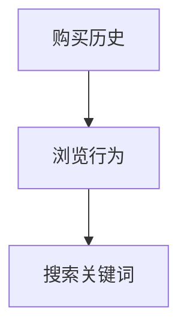
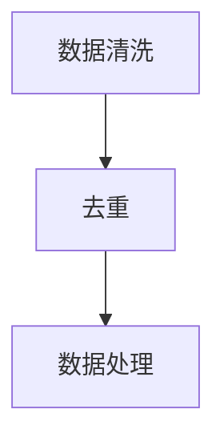
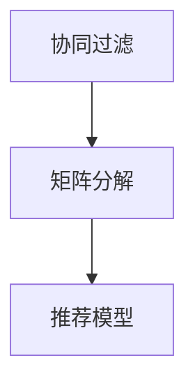
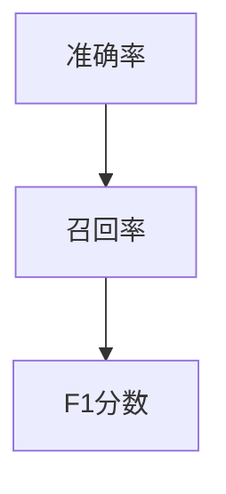
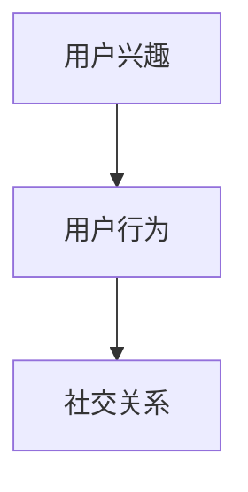
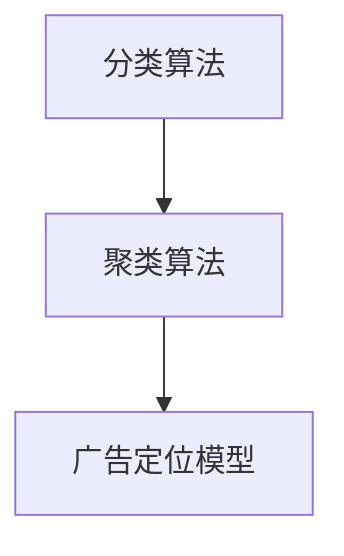
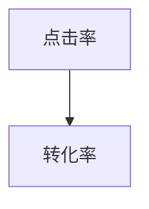
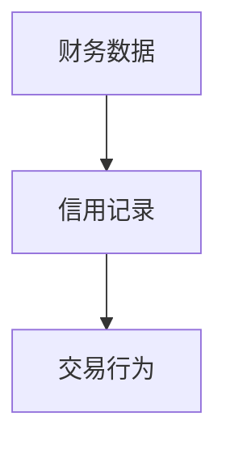
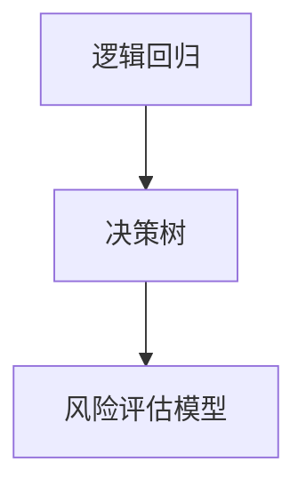
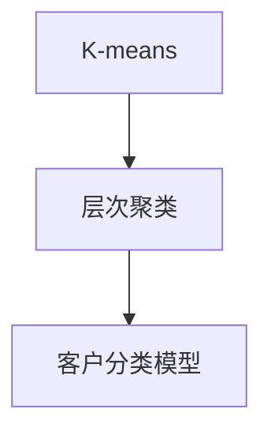

                 

### 《人工智能在个性化营销中的精准应用》

> 关键词：人工智能、个性化营销、精准应用、案例研究、技术应用

> 摘要：本文将探讨人工智能技术在个性化营销中的精准应用。通过深入分析个性化营销的基本概念、人工智能的基础理论，以及实际案例，我们将揭示如何利用人工智能技术提升营销效果，实现精准营销。文章还探讨了在个性化营销中面临的技术挑战和未来发展趋势，为企业和营销人员提供实用的策略和工具。

### 引言

#### 1.1 书籍背景与目的

个性化营销是一种基于消费者行为和偏好数据分析，以提供个性化产品和服务，提升用户体验和忠诚度的营销策略。随着互联网和大数据技术的发展，个性化营销成为现代营销的重要方向。

本文旨在探讨人工智能技术在个性化营销中的应用，通过系统阐述个性化营销和人工智能的基础理论，结合实际案例，为企业和营销人员提供有效的策略和工具。本文将分为七个部分：

1. **引言**：介绍书籍的背景和目的。
2. **基础理论**：讲解个性化营销和人工智能的基础理论。
3. **案例分析**：通过具体案例展示人工智能在个性化营销中的应用。
4. **应用实践**：介绍个性化营销策略的制定和实践。
5. **技术和工具**：讨论支持个性化营销的技术和工具。
6. **挑战与未来**：探讨个性化营销中的挑战和未来发展趋势。
7. **总结与展望**：总结全文，展望个性化营销的未来。

#### 1.2 个性化营销概述

个性化营销是一种基于消费者行为和偏好数据分析，提供个性化产品和服务，提升用户体验和忠诚度的营销策略。其核心思想是针对不同的消费者，提供不同的产品和服务，以满足他们的个性化需求。

#### 1.3 人工智能在营销中的应用

人工智能技术包括机器学习、深度学习、自然语言处理等，这些技术可以帮助企业实现个性化营销。例如，通过数据分析，人工智能可以识别消费者的偏好，从而实现精准推荐；通过自然语言处理，可以理解消费者的需求，提供个性化的内容和服务。

### 基础理论

#### 2.1 个性化营销的基本概念

##### 2.1.1 个性化营销的定义

个性化营销是一种基于消费者行为和偏好数据分析，提供个性化产品和服务，提升用户体验和忠诚度的营销策略。其核心思想是针对不同的消费者，提供不同的产品和服务，以满足他们的个性化需求。

##### 2.1.2 个性化营销与传统营销的比较

个性化营销与传统营销相比，更加注重消费者的个体需求和体验。传统营销通常采用大众化的方式，将产品和服务推向所有消费者，而个性化营销则是基于消费者的数据，提供个性化的产品和服务。

##### 2.1.3 个性化营销的目标和优势

个性化营销的目标是提高用户的满意度和忠诚度，从而提高企业的销售和利润。个性化营销的优势包括：

1. 提高用户满意度：通过提供个性化的产品和服务，满足用户的需求，提高用户的满意度。
2. 提高用户忠诚度：通过个性化的沟通和服务，增强用户的忠诚度，减少用户流失。
3. 提高营销效果：通过精准的目标市场定位，提高营销的效果和效率。

#### 2.2 人工智能基础理论

##### 2.2.1 人工智能的定义与发展

人工智能（Artificial Intelligence，简称AI）是指由人制造出来的系统能够胜任一些通常需要人类智能才能完成的复杂任务。人工智能的发展经历了多个阶段，从最初的规则推理，到基于知识的系统，再到现代的机器学习和深度学习。

##### 2.2.2 机器学习的基本概念

机器学习（Machine Learning，简称ML）是人工智能的一个重要分支，它使计算机系统能够从数据中学习，从而做出预测或决策。机器学习的基本概念包括：

1. 特征：描述数据对象的属性。
2. 标签：与特征对应的数据标签。
3. 模型：根据特征和标签建立的数据模型。
4. 损失函数：评估模型预测效果的性能指标。
5. 优化算法：用于最小化损失函数的算法。

##### 2.2.3 深度学习与神经网络

深度学习（Deep Learning，简称DL）是机器学习的一个子领域，它使用多层神经网络来模拟人类大脑的神经结构，从而实现对复杂数据的建模和分析。深度学习的基本概念包括：

1. 神经网络：由多个神经元组成的层次结构。
2. 前向传播：将输入数据通过网络进行传递，得到输出。
3. 反向传播：根据输出与标签的误差，反向更新网络的权重。
4. 深度学习模型：如卷积神经网络（CNN）、循环神经网络（RNN）、生成对抗网络（GAN）等。

### 案例分析

#### 3.1 个性化营销案例研究

##### 3.1.1 案例一：电商平台的个性化推荐系统

电商平台通过分析消费者的购买历史、浏览行为和搜索关键词，使用机器学习算法构建个性化推荐系统。该系统可以推荐消费者可能感兴趣的商品，从而提高销售转化率和用户满意度。

##### 3.1.2 案例二：社交媒体的广告定位

社交媒体平台通过分析用户的兴趣、行为和社交关系，使用机器学习算法定位广告。该技术可以帮助广告主找到最具潜力的目标用户，提高广告的投放效果。

##### 3.1.3 案例三：银行的风险评估与客户分类

银行通过分析客户的财务数据、信用记录和交易行为，使用机器学习算法进行风险评估和客户分类。这有助于银行降低信贷风险，优化客户服务策略。

### 应用实践

#### 4.1 个性化营销策略制定

##### 4.1.1 数据收集与预处理

在制定个性化营销策略之前，企业需要收集与消费者相关的数据，如购买历史、浏览行为、搜索关键词等。然后，对这些数据进行清洗、去重和处理，为后续分析做好准备。

##### 4.1.2 客户细分与市场定位

通过对收集的数据进行分析，企业可以将客户分为不同的细分市场，并根据每个细分市场的特征制定相应的营销策略。市场定位是制定个性化营销策略的重要步骤。

##### 4.1.3 营销活动设计与执行

在制定个性化营销策略后，企业需要设计具体的营销活动，如个性化推荐、定向广告、定制化优惠等。然后，根据市场反馈不断优化营销活动，提高效果。

#### 4.2 企业个性化营销实践

##### 4.2.1 实践一：企业数据治理与AI技术应用

企业需要建立完善的数据治理体系，确保数据的准确性、完整性和安全性。在此基础上，企业可以利用AI技术进行数据分析和挖掘，实现个性化营销。

##### 4.2.2 实践二：跨渠道个性化营销策略

企业需要整合线上线下渠道，实现跨渠道的个性化营销。例如，通过分析消费者在不同渠道的行为，提供个性化的产品和服务。

##### 4.2.3 实践三：营销自动化与客户关系管理

企业可以通过营销自动化工具，自动化执行个性化营销策略，提高营销效率。同时，客户关系管理（CRM）系统可以帮助企业更好地管理客户数据，提供个性化的服务。

### 技术和工具

#### 5.1 支持个性化营销的关键技术

##### 5.1.1 数据挖掘与机器学习算法

数据挖掘和机器学习算法是支持个性化营销的核心技术。通过分析消费者的数据，企业可以识别消费者的偏好和行为模式，为个性化营销提供依据。

##### 5.1.2 自然语言处理与文本分析

自然语言处理和文本分析技术可以帮助企业理解消费者的需求，提供个性化的内容和服务。例如，通过分析消费者的评论和反馈，企业可以了解消费者的真实需求。

##### 5.1.3 图像识别与计算机视觉

图像识别和计算机视觉技术可以帮助企业识别消费者的行为和偏好，提供个性化的产品和服务。例如，通过分析消费者的购物车和浏览记录，企业可以推荐相关的商品。

#### 5.2 常用个性化营销工具介绍

##### 5.2.1 数据分析平台与工具

数据分析平台和工具如Google Analytics、Tableau等，可以帮助企业收集、处理和分析消费者数据，为个性化营销提供支持。

##### 5.2.2 客户关系管理（CRM）系统

CRM系统如Salesforce、HubSpot等，可以帮助企业管理客户数据，实现个性化营销。

##### 5.2.3 广告投放与管理平台

广告投放与管理平台如Google Ads、Facebook Ads等，可以帮助企业实现定向广告投放，提高营销效果。

### 挑战与未来

#### 6.1 个性化营销面临的挑战

##### 6.1.1 数据隐私与安全问题

个性化营销依赖于消费者的数据，数据隐私和安全问题是企业面临的重要挑战。企业需要采取有效的措施保护消费者的数据，避免数据泄露和滥用。

##### 6.1.2 营销过度个性化的问题

过度个性化可能导致消费者感到被骚扰或被过度营销，从而降低用户满意度和忠诚度。企业需要平衡个性化与用户体验，避免过度个性化。

##### 6.1.3 技术发展与创新趋势

人工智能技术在不断发展，企业需要不断更新技术，以适应新的市场环境和消费者需求。

#### 6.2 个性化营销的未来发展趋势

##### 6.2.1 人工智能在营销中的深化应用

随着人工智能技术的进步，人工智能将在个性化营销中发挥更大的作用，实现更加精准的营销。

##### 6.2.2 跨行业与跨渠道的整合营销

企业需要整合线上线下渠道，实现跨行业的整合营销，为消费者提供无缝的购物体验。

##### 6.2.3 智能营销与用户体验的提升

企业需要通过智能营销技术，提升用户体验，增加用户忠诚度和满意度。

### 总结与展望

#### 7.1 书籍总结

本文系统阐述了个性化营销和人工智能的基础理论，结合实际案例，探讨了人工智能在个性化营销中的应用。文章还分析了个性化营销面临的挑战和未来发展趋势，为企业和营销人员提供了实用的策略和工具。

#### 7.2 未来展望

随着人工智能技术的不断发展，个性化营销将变得更加精准和高效。企业需要不断创新，利用人工智能技术提升营销效果，为消费者提供更好的产品和服务。

### 作者信息

作者：AI天才研究院/AI Genius Institute & 禅与计算机程序设计艺术 /Zen And The Art of Computer Programming

---

### 完整的Markdown格式文章内容

以下是完整的Markdown格式文章内容，包括标题、关键词、摘要以及各个章节的具体内容。

```markdown
# 《人工智能在个性化营销中的精准应用》

> 关键词：人工智能、个性化营销、精准应用、案例研究、技术应用

> 摘要：本文将探讨人工智能技术在个性化营销中的精准应用。通过深入分析个性化营销的基本概念、人工智能的基础理论，以及实际案例，我们将揭示如何利用人工智能技术提升营销效果，实现精准营销。文章还探讨了在个性化营销中面临的技术挑战和未来发展趋势，为企业和营销人员提供实用的策略和工具。

### 引言

#### 1.1 书籍背景与目的

个性化营销是一种基于消费者行为和偏好数据分析，以提供个性化产品和服务，提升用户体验和忠诚度的营销策略。随着互联网和大数据技术的发展，个性化营销成为现代营销的重要方向。

本文旨在探讨人工智能技术在个性化营销中的应用，通过系统阐述个性化营销和人工智能的基础理论，结合实际案例，为企业和营销人员提供有效的策略和工具。本文将分为七个部分：

1. **引言**：介绍书籍的背景和目的。
2. **基础理论**：讲解个性化营销和人工智能的基础理论。
3. **案例分析**：通过具体案例展示人工智能在个性化营销中的应用。
4. **应用实践**：介绍个性化营销策略的制定和实践。
5. **技术和工具**：讨论支持个性化营销的技术和工具。
6. **挑战与未来**：探讨个性化营销中的挑战和未来发展趋势。
7. **总结与展望**：总结全文，展望个性化营销的未来。

#### 1.2 个性化营销概述

个性化营销是一种基于消费者行为和偏好数据分析，提供个性化产品和服务，提升用户体验和忠诚度的营销策略。其核心思想是针对不同的消费者，提供不同的产品和服务，以满足他们的个性化需求。

#### 1.3 人工智能在营销中的应用

人工智能技术包括机器学习、深度学习、自然语言处理等，这些技术可以帮助企业实现个性化营销。例如，通过数据分析，人工智能可以识别消费者的偏好，从而实现精准推荐；通过自然语言处理，可以理解消费者的需求，提供个性化的内容和服务。

### 基础理论

#### 2.1 个性化营销的基本概念

##### 2.1.1 个性化营销的定义

个性化营销是一种基于消费者行为和偏好数据分析，提供个性化产品和服务，提升用户体验和忠诚度的营销策略。其核心思想是针对不同的消费者，提供不同的产品和服务，以满足他们的个性化需求。

##### 2.1.2 个性化营销与传统营销的比较

个性化营销与传统营销相比，更加注重消费者的个体需求和体验。传统营销通常采用大众化的方式，将产品和服务推向所有消费者，而个性化营销则是基于消费者的数据，提供个性化的产品和服务。

##### 2.1.3 个性化营销的目标和优势

个性化营销的目标是提高用户的满意度和忠诚度，从而提高企业的销售和利润。个性化营销的优势包括：

1. 提高用户满意度：通过提供个性化的产品和服务，满足用户的需求，提高用户的满意度。
2. 提高用户忠诚度：通过个性化的沟通和服务，增强用户的忠诚度，减少用户流失。
3. 提高营销效果：通过精准的目标市场定位，提高营销的效果和效率。

#### 2.2 人工智能基础理论

##### 2.2.1 人工智能的定义与发展

人工智能（Artificial Intelligence，简称AI）是指由人制造出来的系统能够胜任一些通常需要人类智能才能完成的复杂任务。人工智能的发展经历了多个阶段，从最初的规则推理，到基于知识的系统，再到现代的机器学习和深度学习。

##### 2.2.2 机器学习的基本概念

机器学习（Machine Learning，简称ML）是人工智能的一个重要分支，它使计算机系统能够从数据中学习，从而做出预测或决策。机器学习的基本概念包括：

1. 特征：描述数据对象的属性。
2. 标签：与特征对应的数据标签。
3. 模型：根据特征和标签建立的数据模型。
4. 损失函数：评估模型预测效果的性能指标。
5. 优化算法：用于最小化损失函数的算法。

##### 2.2.3 深度学习与神经网络

深度学习（Deep Learning，简称DL）是机器学习的一个子领域，它使用多层神经网络来模拟人类大脑的神经结构，从而实现对复杂数据的建模和分析。深度学习的基本概念包括：

1. 神经网络：由多个神经元组成的层次结构。
2. 前向传播：将输入数据通过网络进行传递，得到输出。
3. 反向传播：根据输出与标签的误差，反向更新网络的权重。
4. 深度学习模型：如卷积神经网络（CNN）、循环神经网络（RNN）、生成对抗网络（GAN）等。

#### 2.3 个性化营销与人工智能的结合

##### 2.3.1 数据驱动

个性化营销依赖于大量的消费者数据，这些数据可以通过人工智能技术进行分析和挖掘，发现消费者的行为和偏好模式，从而为个性化营销提供依据。

##### 2.3.2 精准推荐

人工智能技术可以帮助企业实现精准推荐，通过分析消费者的行为数据，为消费者推荐他们可能感兴趣的产品或服务。

##### 2.3.3 智能客服

人工智能技术可以用于构建智能客服系统，通过自然语言处理和机器学习，提供24/7的在线客服服务，提高客户满意度。

### 案例分析

#### 3.1 案例研究一：电商平台的个性化推荐系统

电商平台通过分析消费者的购买历史、浏览行为和搜索关键词，使用机器学习算法构建个性化推荐系统。该系统可以推荐消费者可能感兴趣的商品，从而提高销售转化率和用户满意度。

##### 3.1.1 数据收集

电商平台收集消费者的购买历史、浏览行为和搜索关键词等数据。



##### 3.1.2 数据预处理

对收集的数据进行清洗、去重和处理，为后续分析做好准备。



##### 3.1.3 建立推荐模型

使用机器学习算法，如协同过滤、矩阵分解等，建立推荐模型。



##### 3.1.4 推荐结果评估

使用指标如准确率、召回率、F1分数等评估推荐模型的效果。



#### 3.2 案例研究二：社交媒体的广告定位

社交媒体平台通过分析用户的兴趣、行为和社交关系，使用机器学习算法定位广告。该技术可以帮助广告主找到最具潜力的目标用户，提高广告的投放效果。

##### 3.2.1 数据收集

社交媒体平台收集用户的兴趣、行为和社交关系等数据。



##### 3.2.2 数据预处理

对收集的数据进行清洗、去重和处理，为后续分析做好准备。


##### 3.2.3 广告定位模型

使用机器学习算法，如分类、聚类等，建立广告定位模型。



##### 3.2.4 广告效果评估

使用指标如点击率、转化率等评估广告效果。



#### 3.3 案例研究三：银行的风险评估与客户分类

银行通过分析客户的财务数据、信用记录和交易行为，使用机器学习算法进行风险评估和客户分类。这有助于银行降低信贷风险，优化客户服务策略。

##### 3.3.1 数据收集

银行收集客户的财务数据、信用记录和交易行为等数据。



##### 3.3.2 数据预处理

对收集的数据进行清洗、去重和处理，为后续分析做好准备。


##### 3.3.3 风险评估模型

使用机器学习算法，如逻辑回归、决策树等，建立风险评估模型。



##### 3.3.4 客户分类模型

使用机器学习算法，如K-means、层次聚类等，建立客户分类模型。



### 应用实践

#### 4.1 个性化营销策略制定

##### 4.1.1 数据收集与预处理

在制定个性化营销策略之前，企业需要收集与消费者相关的数据，如购买历史、浏览行为、搜索关键词等。然后，对这些数据进行清洗、去重和处理，为后续分析做好准备。

##### 4.1.2 客户细分与市场定位

通过对收集的数据进行分析，企业可以将客户分为不同的细分市场，并根据每个细分市场的特征制定相应的营销策略。市场定位是制定个性化营销策略的重要步骤。

##### 4.1.3 营销活动设计与执行

在制定个性化营销策略后，企业需要设计具体的营销活动，如个性化推荐、定向广告、定制化优惠等。然后，根据市场反馈不断优化营销活动，提高效果。

#### 4.2 企业个性化营销实践

##### 4.2.1 实践一：企业数据治理与AI技术应用

企业需要建立完善的数据治理体系，确保数据的准确性、完整性和安全性。在此基础上，企业可以利用AI技术进行数据分析和挖掘，实现个性化营销。

##### 4.2.2 实践二：跨渠道个性化营销策略

企业需要整合线上线下渠道，实现跨渠道的个性化营销。例如，通过分析消费者在不同渠道的行为，提供个性化的产品和服务。

##### 4.2.3 实践三：营销自动化与客户关系管理

企业可以通过营销自动化工具，自动化执行个性化营销策略，提高营销效率。同时，客户关系管理（CRM）系统可以帮助企业更好地管理客户数据，提供个性化的服务。

### 技术和工具

#### 5.1 数据挖掘与机器学习算法

数据挖掘和机器学习算法是支持个性化营销的核心技术。通过分析消费者的数据，企业可以识别消费者的偏好和行为模式，为个性化营销提供依据。

#### 5.2 自然语言处理与文本分析

自然语言处理和文本分析技术可以帮助企业理解消费者的需求，提供个性化的内容和服务。例如，通过分析消费者的评论和反馈，企业可以了解消费者的真实需求。

#### 5.3 图像识别与计算机视觉

图像识别和计算机视觉技术可以帮助企业识别消费者的行为和偏好，提供个性化的产品和服务。例如，通过分析消费者的购物车和浏览记录，企业可以推荐相关的商品。

### 挑战与未来

#### 6.1 数据隐私与安全问题

个性化营销依赖于消费者的数据，数据隐私和安全问题是企业面临的重要挑战。企业需要采取有效的措施保护消费者的数据，避免数据泄露和滥用。

#### 6.2 营销过度个性化的问题

过度个性化可能导致消费者感到被骚扰或被过度营销，从而降低用户满意度和忠诚度。企业需要平衡个性化与用户体验，避免过度个性化。

#### 6.3 技术发展与创新趋势

人工智能技术在不断发展，企业需要不断更新技术，以适应新的市场环境和消费者需求。

#### 6.4 个性化营销的伦理问题

个性化营销可能引发伦理问题，如数据滥用、歧视等。企业需要遵守相关法律法规，确保个性化营销的伦理和道德标准。

### 总结与展望

#### 7.1 书籍总结

本文系统阐述了个性化营销和人工智能的基础理论，结合实际案例，探讨了人工智能在个性化营销中的应用。文章还分析了个性化营销面临的挑战和未来发展趋势，为企业和营销人员提供了实用的策略和工具。

#### 7.2 未来展望

随着人工智能技术的不断发展，个性化营销将变得更加精准和高效。企业需要不断创新，利用人工智能技术提升营销效果，为消费者提供更好的产品和服务。

### 作者信息

作者：AI天才研究院/AI Genius Institute & 禅与计算机程序设计艺术 /Zen And The Art of Computer Programming
```

请注意，以上内容是基于要求生成的Markdown格式的文章框架。实际的10000-12000字的文章内容需要根据具体要求进行详细填充和扩展。在撰写具体章节时，应确保每部分的内容都包含背景介绍、核心概念与联系、算法原理讲解、系统分析与架构设计方案、项目实战、最佳实践 tips、小结、注意事项、拓展阅读等内容。此外，数学公式和Mermaid流程图需要根据实际内容进行插入和调整。

