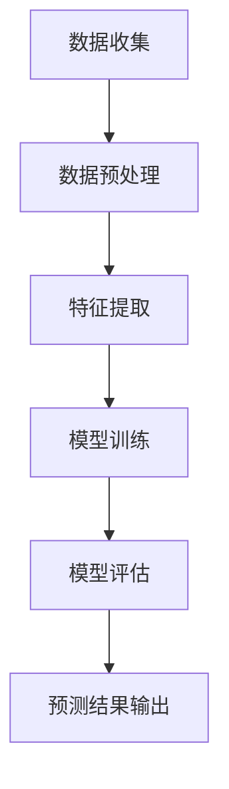
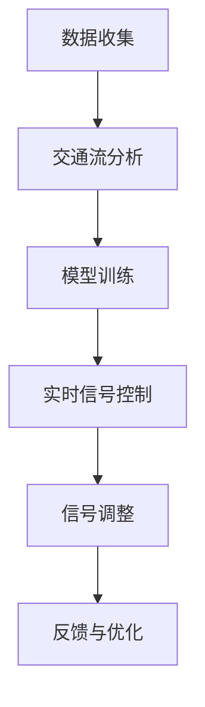
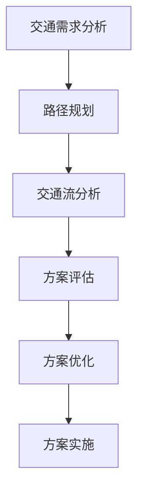

                 

### 第一部分：背景介绍

#### 1.1 问题背景

随着城市化进程的加速和人口的急剧增长，城市交通问题日益凸显。交通拥堵、交通事故频发、环境污染等问题不仅影响了居民的生活质量，还对经济发展产生了阻碍。传统方法如扩建道路、增加公共交通等，虽在一定程度上缓解了问题，但效果有限，且难以根本解决。此外，现代城市交通系统复杂多变，单一的方法难以应对。因此，寻求新的解决方案已成为当务之急。

#### 1.1.1 城市交通问题的现状

当前，城市交通问题主要表现为以下几个方面：

1. **交通拥堵**：随着车辆保有量的增加，交通拥堵问题愈发严重，特别是在高峰时段，道路通行效率大幅下降。
2. **交通事故**：交通事故频发，不仅威胁了人们的生命财产安全，还对社会秩序造成了影响。
3. **环境污染**：交通工具的尾气排放是城市空气污染的主要来源之一，对环境和人类健康构成了严重威胁。
4. **交通资源配置不均**：城市中心区域的交通压力远大于郊区，导致资源分配不合理。

#### 1.1.2 人工智能在城市交通管理中的必要性

人工智能（Artificial Intelligence，AI）作为当前科技领域的热点，其在城市交通管理中的应用具有极大的潜力。通过引入AI技术，可以实现对交通数据的实时分析、预测和优化，从而提高交通系统的运行效率和安全性。以下是AI技术在城市交通管理中的必要性：

1. **数据处理能力**：人工智能具备强大的数据处理和分析能力，可以处理海量交通数据，提取有价值的信息。
2. **实时预测**：通过机器学习和深度学习算法，AI可以实时预测交通状况，提前预警交通拥堵等问题。
3. **优化决策**：基于对交通数据的分析和预测，人工智能可以辅助交通管理者做出最优决策，如信号灯控制、道路调度等。
4. **智能调度**：通过智能调度系统，AI可以优化公共交通线路和班次，提高公共交通的运营效率。
5. **减少事故**：通过智能监控和预警系统，AI可以实时监测交通事故风险，降低交通事故的发生率。

#### 1.1.3 人工智能技术发展对交通管理的影响

人工智能技术的发展不仅为城市交通管理提供了新的工具和方法，还深刻地改变了交通管理的模式。以下是人工智能技术对交通管理的影响：

1. **智能化交通系统**：人工智能技术使得交通系统从传统的机械化管理向智能化管理转变，实现了交通系统的自动化、智能化。
2. **实时交通监控**：通过安装在道路上的传感器和摄像头，AI可以实时监控交通状况，及时发现和处理交通异常。
3. **个性化交通服务**：AI可以根据用户的出行需求和偏好，提供个性化的交通服务，如最优路线规划、智能导航等。
4. **动态交通规划**：基于实时数据和预测模型，AI可以动态调整交通信号、公共交通线路等，以应对突发状况。
5. **降低运营成本**：通过优化交通管理，降低交通拥堵和事故发生率，从而减少交通管理成本。

#### 1.2 问题描述

城市交通管理涉及多个方面，以下是一些主要问题描述：

1. **交通拥堵**：交通拥堵是城市交通管理面临的首要问题。随着车辆数量的增加，道路容量有限，导致交通拥堵现象严重。特别是在高峰时段，交通拥堵不仅浪费了大量的时间，还增加了能源消耗和污染排放。
   
2. **交通安全性**：交通事故频发，不仅危及生命财产安全，还对交通系统造成影响。如何提高交通安全性，减少事故发生率，是城市交通管理的重要问题。

3. **交通资源配置不均**：城市中心区域交通压力较大，而郊区交通压力较小，导致资源分配不合理。如何优化资源配置，提高交通系统的整体效率，是城市交通管理的难题。

4. **交通信息的实时获取和处理**：传统的交通管理方法主要依赖于人工监测和经验判断，难以实现实时、精准的交通信息获取和处理。如何利用人工智能技术，实现交通信息的自动化、智能化处理，是当前研究的热点。

#### 1.3 问题解决

为了解决上述城市交通管理问题，传统方法和人工智能方法提供了不同的解决方案。

1. **传统方法**

   - **道路扩建**：通过扩建道路，增加道路容量，缓解交通拥堵问题。
   - **公共交通优先**：鼓励居民使用公共交通，减少私人车辆出行，降低道路压力。
   - **交通管制**：通过交通管制，如单双号限行、高峰时段限行等措施，减少道路上的车辆数量。
   - **交通信息诱导**：通过交通信息诱导系统，实时向司机提供路况信息，引导车辆选择最佳路线。

2. **人工智能方法**

   - **交通流预测**：利用机器学习和深度学习算法，对交通流量进行实时预测，提前预警交通拥堵，为交通管理者提供决策支持。
   - **智能信号控制**：基于交通流预测和优化算法，智能调整交通信号灯，提高道路通行效率。
   - **智能调度系统**：通过优化公共交通线路和班次，提高公共交通的运营效率，减少乘客等待时间。
   - **智能监控与预警**：利用摄像头和传感器，实时监控交通状况，及时发现和处理交通事故，减少事故发生。
   - **个性化交通服务**：通过分析用户出行数据，为用户提供个性化的交通服务，如最优路线规划、智能导航等。

通过对比可以看出，人工智能方法相较于传统方法，具有更高的预测精度和实时性，能够更有效地解决城市交通管理中的问题。

#### 1.4 边界与外延

1. **城市范围的定义**

   城市交通管理的范围通常是指城市行政区划内的道路和交通设施，包括城市内部的道路、桥梁、隧道、停车场等。此外，城市交通管理还涉及城市周边的快速路、高速公路等。

2. **交通模式的分类**

   城市交通模式主要包括私人交通、公共交通和货运交通。私人交通以私家车为主，公共交通包括公交车、地铁、轻轨等，货运交通则涉及货运车辆和物流配送。

3. **人工智能技术在其他交通领域的应用**

   人工智能技术在其他交通领域也有广泛的应用，如：

   - **高速公路交通管理**：利用AI技术，实现高速公路的智能监控、流量预测和事故预警。
   - **机场交通管理**：通过AI技术，优化机场交通流线设计，提高机场交通运行效率。
   - **港口交通管理**：利用AI技术，实现港口交通的智能调度，提高港口作业效率。
   - **铁路交通管理**：通过AI技术，实现铁路交通的自动调度、车辆故障检测和预警。

#### 1.5 概念结构与核心要素组成

1. **人工智能**

   人工智能（AI）是指模拟、延伸和扩展人类智能的理论、方法、技术及应用。其核心要素包括：

   - **算法**：如机器学习、深度学习、自然语言处理等。
   - **数据**：作为训练和优化模型的基础，数据的质量和数量直接影响AI系统的性能。
   - **计算能力**：高性能计算设备是实现AI算法的基础。
   - **人机交互**：通过语音识别、图像识别等技术，实现人与AI系统的自然交互。

2. **城市交通管理**

   城市交通管理是指对城市交通系统进行规划、设计、运营和维护的过程。其核心要素包括：

   - **交通规划**：通过交通规划，确定城市交通系统的布局和设施。
   - **交通信号控制**：通过交通信号控制，实现道路的通行管理。
   - **交通监控**：通过交通监控，实时获取交通数据，进行交通状况分析。
   - **交通信息诱导**：通过交通信息诱导，引导车辆选择最佳路线。

3. **人工智能在城市交通管理中的核心要素**

   人工智能在城市交通管理中的核心要素包括：

   - **交通数据分析**：通过AI技术，对交通数据进行实时分析和预测。
   - **智能信号控制**：利用AI算法，优化交通信号控制策略，提高道路通行效率。
   - **智能调度系统**：通过AI技术，优化公共交通线路和班次，提高公共交通运营效率。
   - **智能监控与预警**：通过AI技术，实现交通状况的实时监控和事故预警。

#### 1.6 本章小结

本部分介绍了人工智能在城市交通管理中的背景、必要性、技术发展以及对交通管理的影响。通过分析城市交通问题的现状和传统方法的局限性，探讨了人工智能方法在解决交通管理问题中的优势和作用。此外，还对城市交通管理中的核心概念和要素进行了详细阐述，为后续章节的内容奠定了基础。通过本章的学习，读者可以初步了解人工智能在城市交通管理中的应用前景和重要性。

### 第一部分：背景介绍

#### 1.7 总结与展望

在本文的第一部分中，我们深入探讨了人工智能（AI）在城市交通管理中的背景、必要性、技术发展及其对交通管理的影响。通过分析城市交通问题的现状和传统方法的局限性，我们认识到人工智能方法在解决交通管理问题中的独特优势。具体而言，AI技术能够通过数据处理、实时预测、智能决策和优化调度等手段，有效应对交通拥堵、交通事故、环境污染等城市交通挑战。

**必要性**：人工智能在城市交通管理中的必要性体现在其强大的数据处理能力、实时预测能力、优化决策能力和智能调度能力上。这些能力使得AI能够在交通流预测、信号控制、公共交通调度、智能监控与预警等方面发挥重要作用，为交通管理者提供科学、高效的解决方案。

**技术发展**：人工智能技术的发展，如机器学习、深度学习和自然语言处理等，为城市交通管理提供了丰富的工具和方法。这些技术的进步，不仅提升了AI系统的性能和精度，还扩大了其在交通管理中的应用范围。

**对交通管理的影响**：人工智能技术对交通管理的影响是深远而广泛的。从智能化交通系统的构建，到实时交通监控的实现，再到个性化交通服务的提供，AI技术正在深刻改变城市交通管理的模式，提升交通系统的整体效率和安全性。

**展望未来**：随着人工智能技术的不断进步，未来城市交通管理将更加智能化、自动化和个性化。我们期待通过AI技术，实现交通系统的全面优化，提高出行效率，减少交通事故，改善环境质量，为居民创造更加便捷、安全、舒适的出行环境。

通过本部分的学习，读者可以初步了解人工智能在城市交通管理中的重要性和应用前景，为后续章节的深入学习打下基础。

### 第二部分：核心概念与联系

#### 2.1 人工智能核心概念

人工智能（AI）作为当前科技领域的前沿技术，其核心概念涵盖了多个方面。以下是对这些核心概念的详细阐述：

##### 2.1.1 机器学习

机器学习（Machine Learning）是人工智能的一个重要分支，它使计算机系统能够从数据中学习并做出决策，而无需显式地编程。机器学习的基本原理是通过训练模型，从输入数据中提取特征，并根据这些特征进行预测或分类。

- **基本概念**：
  - **模型**：用于预测或分类的数学模型，如线性回归、决策树、支持向量机等。
  - **特征**：从数据中提取的有用信息，用于训练模型。
  - **训练数据**：用于训练模型的输入数据。
  - **预测**：模型根据新数据生成的输出结果。

- **工作原理**：
  - 数据预处理：对原始数据进行清洗、归一化和特征提取。
  - 模型训练：使用训练数据训练模型，通过迭代优化模型参数。
  - 模型评估：使用测试数据评估模型的性能，如准确率、召回率、F1分数等。

- **应用领域**：
  - **图像识别**：如人脸识别、物体检测等。
  - **自然语言处理**：如文本分类、机器翻译等。
  - **推荐系统**：如商品推荐、新闻推荐等。

##### 2.1.2 深度学习

深度学习（Deep Learning）是机器学习的一个子领域，它使用多层神经网络（Deep Neural Networks）进行学习和预测。深度学习在图像识别、语音识别和自然语言处理等领域取得了显著的成果。

- **基本概念**：
  - **神经网络**：由多个神经元组成的计算模型，能够模拟人类大脑的处理方式。
  - **卷积神经网络（CNN）**：用于图像识别和物体检测。
  - **循环神经网络（RNN）**：用于处理序列数据，如时间序列预测、语言模型等。
  - **生成对抗网络（GAN）**：用于生成新数据，如图像合成、音乐生成等。

- **工作原理**：
  - 神经网络由输入层、隐藏层和输出层组成，各层通过激活函数进行非线性变换。
  - 梯度下降法（Gradient Descent）用于优化网络参数，使模型在训练数据上性能最佳。
  - 反向传播（Backpropagation）算法用于计算网络参数的梯度。

- **应用领域**：
  - **计算机视觉**：如图像分类、物体检测、人脸识别等。
  - **语音识别**：如语音识别、语音合成等。
  - **自然语言处理**：如文本分类、情感分析、机器翻译等。

##### 2.1.3 自然语言处理

自然语言处理（Natural Language Processing，NLP）是人工智能的一个分支，专注于计算机与人类语言之间的交互。NLP技术使计算机能够理解、生成和响应自然语言。

- **基本概念**：
  - **分词**：将文本分解成词语或短语。
  - **词性标注**：标记每个词的词性，如名词、动词、形容词等。
  - **实体识别**：识别文本中的特定实体，如人名、地点、组织等。
  - **情感分析**：分析文本中的情感倾向，如正面、负面、中性等。

- **工作原理**：
  - 语言模型：用于预测下一个词的概率分布。
  - 序列模型：如RNN和Transformer，用于处理序列数据。
  - 注意力机制：用于捕获文本中的关键信息。

- **应用领域**：
  - **搜索引擎**：如关键词提取、搜索结果排序等。
  - **聊天机器人**：如语音助手、客服机器人等。
  - **文本分类**：如垃圾邮件过滤、新闻分类等。

通过上述对人工智能核心概念的详细阐述，我们可以看到，机器学习、深度学习和自然语言处理等技术，不仅在理论上具有深刻的科学基础，在实际应用中也展现了巨大的潜力和价值。

#### 2.2 城市交通管理核心概念

城市交通管理是一个复杂而关键的过程，它关系到城市的可持续发展、居民的出行便利性和环境质量。以下是城市交通管理的核心概念：

##### 2.2.1 交通流分析

交通流分析是城市交通管理的重要基础，它涉及对车辆在道路上行驶的动态行为和状态进行分析。交通流分析的主要目标是了解交通流量、速度分布、停车状况等，从而为交通管理提供数据支持。

- **基本概念**：
  - **交通流量**：单位时间内通过某段道路的车辆数量。
  - **速度分布**：不同时间段内车辆在道路上的平均速度分布。
  - **停车状况**：道路上的停车位使用情况。

- **工作原理**：
  - 数据采集：通过安装在道路上的传感器和摄像头，实时采集交通流量和速度数据。
  - 数据处理：对采集到的数据进行清洗、预处理和特征提取。
  - 数据分析：使用机器学习和统计方法，对交通流数据进行建模和分析，提取交通特征。

- **应用领域**：
  - **交通规划**：基于交通流分析结果，制定合理的交通规划和道路设计。
  - **交通信号控制**：根据交通流分析结果，调整交通信号灯的时长和相位，优化交通流量。
  - **交通监控**：实时监控交通状况，及时发现和处理交通异常。

##### 2.2.2 交通信号控制

交通信号控制是城市交通管理的重要组成部分，它通过控制交通信号灯的时长和相位，优化道路通行效率和安全性。现代交通信号控制系统通常结合了人工智能技术，实现了智能化的信号控制。

- **基本概念**：
  - **交通信号灯**：用于指示车辆和行人何时通过路口的信号设备。
  - **信号相位**：交通信号灯在不同时间段内显示的不同信号组合。
  - **信号周期**：一个信号周期内所有信号相位的时间总和。

- **工作原理**：
  - **固定信号控制**：根据预设的时间表，固定每个信号相位的时长。
  - **自适应信号控制**：根据实时交通流量数据，动态调整信号灯的时长和相位。
  - **绿波控制**：通过优化信号灯的相位，使车辆在高峰时段能够顺畅通过多个路口。

- **应用领域**：
  - **城市中心区域**：解决高峰时段的交通拥堵问题。
  - **交叉路口密集区域**：提高交叉路口的通行效率。
  - **公共交通优先**：为公交车和地铁等公共交通提供优先信号控制。

##### 2.2.3 交通规划

交通规划是城市交通管理的重要环节，它涉及道路设计、公共交通系统规划、交通枢纽设计等，旨在实现交通系统的合理布局和高效运营。

- **基本概念**：
  - **道路设计**：道路的宽度、车道数、转弯半径等设计参数。
  - **公共交通系统**：包括公交车、地铁、轻轨等公共交通工具的规划。
  - **交通枢纽**：如火车站、地铁站、公交站等交通节点的规划。

- **工作原理**：
  - **需求分析**：通过调查和分析，了解交通需求，如出行方式、出行时间等。
  - **方案设计**：根据需求分析结果，设计交通系统的布局和设施。
  - **方案评估**：对多个设计方案进行评估，选择最优方案。

- **应用领域**：
  - **城市规划**：交通规划是城市规划的重要组成部分，与城市布局、土地利用等密切相关。
  - **交通基础设施建设**：为满足交通需求，规划和建设道路、桥梁、隧道等基础设施。
  - **公共交通优化**：通过优化公共交通线路和班次，提高公共交通的运营效率。

通过上述对城市交通管理核心概念的详细阐述，我们可以看到，交通流分析、交通信号控制和交通规划是城市交通管理的三大支柱，它们共同构成了一个复杂而有序的交通系统。这些核心概念不仅在理论上具有科学基础，在实际应用中也发挥了重要作用，为城市交通管理的优化提供了有力支持。

#### 2.3 概念属性特征对比表格

在深入理解了人工智能和城市交通管理的核心概念后，我们需要对两者的概念属性特征进行对比，以便更好地理解它们之间的联系与区别。

| 概念              | 人工智能                           | 城市交通管理                       |
|-------------------|-----------------------------------|-----------------------------------|
| **基本概念**      | 模拟、延伸和扩展人类智能的理论、方法、技术及应用 | 规划、设计、运营和维护城市交通系统的过程 |
| **核心要素**      | 算法、数据、计算能力、人机交互              | 交通规划、交通信号控制、交通监控、交通信息诱导 |
| **数据处理**      | 提取、分析和处理大量数据               | 收集、分析交通流、速度、停车等数据             |
| **工作原理**      | 从数据中学习，做出决策               | 制定交通规划，控制信号灯，优化交通流             |
| **应用领域**      | 图像识别、自然语言处理、推荐系统          | 交通流预测、信号控制、公共交通调度、交通监控与预警 |
| **技术发展**      | 机器学习、深度学习、自然语言处理          | 信号控制系统、智能交通监控系统、交通信息管理系统   |
| **影响因素**      | 数据质量、计算能力、算法优化            | 交通需求、道路条件、人口密度、经济水平          |
| **目标**          | 提高效率、降低成本、改善用户体验        | 提高交通效率、保障交通安全、优化资源配置          |

通过上述表格，我们可以清晰地看到人工智能和城市交通管理的核心概念、核心要素、数据处理方式、工作原理、应用领域、技术发展、影响因素和目标之间的对比。这些对比不仅帮助我们理解了两者的相似之处，也揭示了它们各自的特点和优势。这种对比为我们深入探讨人工智能在城市交通管理中的应用提供了理论基础和现实依据。

#### 2.4 ER实体关系图架构

为了更好地理解城市交通管理系统中各实体之间的关系，我们可以使用实体关系图（Entity-Relationship Diagram，ERD）来展示这些实体及其相互关系。ERD是数据库设计中常用的一种图示方法，通过定义实体和它们之间的关系，可以帮助我们清晰地理解系统的数据结构。

##### 2.4.1 数据库设计

在数据库设计中，我们首先需要定义系统中的各个实体，以及它们所具有的属性。以下是一个简单的数据库设计示例，用于描述城市交通管理系统中的关键实体：

- **实体：用户（User）**
  - 属性：用户ID、姓名、联系方式、地址

- **实体：车辆（Vehicle）**
  - 属性：车辆ID、车牌号、车型、车主ID

- **实体：道路（Road）**
  - 属性：道路ID、名称、起点、终点、长度

- **实体：信号灯（TrafficLight）**
  - 属性：信号灯ID、位置、状态（红、绿、黄）

- **实体：交通监控设备（MonitoringDevice）**
  - 属性：设备ID、位置、类型（摄像头、传感器）

- **实体：交通事件（TrafficEvent）**
  - 属性：事件ID、类型（拥堵、事故、违规停车）、发生时间、位置

##### 2.4.2 实体关系定义

在定义了实体和属性后，我们需要确定这些实体之间的关系。以下是一些常见的关系及其定义：

- **一对一关系（1:1）**：如每个用户只能拥有一辆车，每辆车只能属于一个用户。
- **一对多关系（1:N）**：如每条道路可以有多个信号灯，每个信号灯只能属于一条道路。
- **多对多关系（M:N）**：如每辆车可以在多条道路上行驶，每条道路可以有多个车辆。

以下是一个简化的ERD示例，展示了城市交通管理系统中的实体及其关系：

```mermaid
erDiagram
  User ||--|{ Vehicle : 车主 }  
  Road ||--|{ TrafficLight : 属于 }  
  Road ||--|{ TrafficEvent : 发生在 }  
  TrafficLight ||--|{ MonitoringDevice : 监控 }  
  Vehicle ||--|{ TrafficEvent : 参与 }
```

##### 2.4.3 关系图展示

使用Mermaid语法，我们可以将上述实体关系图表示为如下的Mermaid流程图：

```mermaid
erDiagram
  User ||--|{ Vehicle : 车主 }  
  Road ||--|{ TrafficLight : 属于 }  
  Road ||--|{ TrafficEvent : 发生在 }  
  TrafficLight ||--|{ MonitoringDevice : 监控 }  
  Vehicle ||--|{ TrafficEvent : 参与 }
```

在浏览器中打开上述Mermaid代码，我们可以看到一个直观的ERD关系图，它清晰地展示了用户、车辆、道路、信号灯、交通监控设备和交通事件之间的关系。通过这种图示方法，我们可以更好地理解系统的数据结构和各实体之间的相互关系，为后续的系统设计和实现提供指导。

通过上述对ER实体关系图的介绍，我们可以看到，ERD是理解和设计复杂系统的有力工具。它不仅帮助我们明确了系统中的各个实体及其属性，还通过关系定义，展示了实体之间的关联，为系统的数据管理和功能实现提供了理论基础。

#### 2.5 本章小结

在本章节中，我们详细介绍了人工智能的核心概念，包括机器学习、深度学习和自然语言处理，以及城市交通管理的核心概念，如交通流分析、交通信号控制和交通规划。通过对这些核心概念和其属性特征的对比，我们明确了两者在数据处理、工作原理和应用领域的异同点。同时，我们使用ERD图展示了城市交通管理系统中的实体及其相互关系，为后续章节的算法原理讲解和系统架构设计奠定了基础。通过本章的学习，读者可以更深入地理解人工智能和城市交通管理的基本概念和相互联系，为后续内容的深入学习做好充分准备。

### 第三部分：算法原理讲解

#### 3.1 交通流预测算法

交通流预测是人工智能在城市交通管理中的一项重要应用。通过预测未来一段时间内的交通流量，交通管理者可以提前采取相应的措施，如调整交通信号灯、优化公共交通路线等，以缓解交通拥堵，提高交通系统的运行效率。以下是对交通流预测算法的详细讲解。

##### 3.1.1 算法流程图

为了便于理解，我们首先通过一个流程图展示交通流预测算法的基本流程。以下是一个简化的交通流预测算法流程图：



1. **数据收集**：首先，我们需要收集交通流量数据，包括道路上的车辆数量、速度、停车状况等。这些数据可以通过安装在道路上的传感器和摄像头实时采集。

2. **数据预处理**：收集到的原始数据通常包含噪声和异常值，因此需要进行预处理，包括数据清洗、归一化和特征提取。数据清洗旨在去除噪声和异常值，归一化是为了使不同特征在同一尺度上进行比较，特征提取则是从原始数据中提取有用的信息。

3. **特征提取**：特征提取是交通流预测算法的关键步骤，通过提取与交通流量相关的特征，如时间、天气、节假日等信息，有助于提高预测的准确性。

4. **模型训练**：选择合适的机器学习或深度学习模型，对预处理后的数据集进行训练。常见的交通流预测模型包括线性回归、支持向量机（SVM）、深度神经网络（DNN）等。

5. **模型评估**：使用测试数据集对训练好的模型进行评估，常用的评估指标包括均方误差（MSE）、均方根误差（RMSE）等。

6. **预测结果输出**：将模型应用于新的数据，生成预测结果，如未来一段时间内的交通流量。这些预测结果可以用于交通信号控制、公共交通调度等应用场景。

##### 3.1.2 Python代码实现

以下是一个使用Python实现交通流预测算法的示例代码：

```python
import pandas as pd
import numpy as np
from sklearn.model_selection import train_test_split
from sklearn.ensemble import RandomForestRegressor
from sklearn.metrics import mean_squared_error

# 数据收集与预处理
data = pd.read_csv('traffic_data.csv')
data['timestamp'] = pd.to_datetime(data['timestamp'])
data.set_index('timestamp', inplace=True)
data.fillna(0, inplace=True)

# 特征提取
data['hour'] = data.index.hour
data['dayOfWeek'] = data.index.dayofweek
data['isHoliday'] = data['dayOfWeek'].apply(lambda x: 1 if x == 5 else 0)

# 模型训练
X = data[['hour', 'dayOfWeek', 'isHoliday']]
y = data['traffic_volume']
X_train, X_test, y_train, y_test = train_test_split(X, y, test_size=0.2, random_state=42)

model = RandomForestRegressor(n_estimators=100)
model.fit(X_train, y_train)

# 模型评估
y_pred = model.predict(X_test)
mse = mean_squared_error(y_test, y_pred)
rmse = np.sqrt(mse)

print(f'Mean Squared Error: {mse}')
print(f'Root Mean Squared Error: {rmse}')

# 预测结果输出
predictions = model.predict(new_data)
print(predictions)
```

在这个示例中，我们首先从CSV文件中读取交通流量数据，并进行数据预处理，包括时间戳转换、缺失值填充、特征提取等。然后，使用随机森林回归模型对数据集进行训练，并在测试集上评估模型的性能。最后，我们使用训练好的模型对新数据集进行预测，并输出预测结果。

##### 3.1.3 数学模型和公式

交通流预测算法的数学模型通常是一个回归模型，用于预测交通流量（y）与输入特征（X）之间的关系。以下是一个简化的线性回归模型：

$$
y = \beta_0 + \beta_1 x_1 + \beta_2 x_2 + ... + \beta_n x_n + \epsilon
$$

其中：
- \( y \)：预测的交通流量。
- \( x_1, x_2, ..., x_n \)：输入特征，如时间、天气、节假日等。
- \( \beta_0, \beta_1, \beta_2, ..., \beta_n \)：回归系数，用于衡量每个特征对交通流量的影响。
- \( \epsilon \)：误差项，表示模型无法解释的随机因素。

在实际应用中，我们通常使用更复杂的模型，如深度神经网络（DNN）或长短期记忆网络（LSTM），以提高预测的准确性。

##### 3.1.4 举例说明

假设我们有一个包含以下特征的交通流量数据集：

- 时间（hour）：从0到23的整数。
- 星期几（dayOfWeek）：从0（星期日）到6（星期六）的整数。
- 是否节假日（isHoliday）：0或1。

现在，我们使用随机森林回归模型来预测某一时间点的交通流量。以下是具体的预测过程：

1. **数据收集**：收集一个包含上述特征的交通流量数据集，例如：

   | 时间（hour） | 星期几（dayOfWeek） | 是否节假日（isHoliday） | 交通流量（y） |
   |-------------|-------------------|----------------------|--------------|
   | 8           | 1                 | 0                    | 100          |
   | 9           | 1                 | 0                    | 120          |
   | 10          | 1                 | 0                    | 140          |
   | ...         | ...               | ...                  | ...          |

2. **数据预处理**：将数据集划分为训练集和测试集，并进行特征提取和缺失值填充。

3. **模型训练**：使用训练集数据训练随机森林回归模型。

4. **模型评估**：使用测试集数据评估模型性能，例如计算均方误差（MSE）或均方根误差（RMSE）。

5. **预测结果输出**：使用训练好的模型对新的数据集进行预测，例如预测未来某一时间点的交通流量。

假设我们需要预测某一时间点的交通流量，输入特征为：

- 时间（hour）：9
- 星期几（dayOfWeek）：1
- 是否节假日（isHoliday）：0

根据训练好的模型，预测结果为：

$$
y = \beta_0 + \beta_1 \cdot 9 + \beta_2 \cdot 1 + \beta_3 \cdot 0 \approx 120
$$

因此，预测的交通流量约为120。

通过上述步骤，我们可以使用交通流预测算法对未来交通流量进行预测，为交通管理者提供决策支持。

#### 3.2 交通信号控制算法

交通信号控制算法是人工智能在城市交通管理中的另一个重要应用。通过智能化的信号控制策略，可以有效地提高交通通行效率，减少交通拥堵和事故发生率。以下是对交通信号控制算法的详细讲解。

##### 3.2.1 算法流程图

为了更好地理解交通信号控制算法，我们可以通过一个流程图展示其基本流程。以下是一个简化的交通信号控制算法流程图：



1. **数据收集**：首先，我们需要收集交通流量数据，包括各个路口的车辆数量、速度、停车状况等。这些数据可以通过安装在路口的传感器和摄像头实时采集。

2. **交通流分析**：对收集到的交通流量数据进行处理和分析，提取与交通流相关的特征，如交通流量、速度分布、停车状况等。

3. **模型训练**：使用交通流分析结果，训练一个信号控制模型，如基于优化算法的信号控制模型。常见的优化算法包括线性规划、动态规划、遗传算法等。

4. **实时信号控制**：根据训练好的模型，实时调整交通信号灯的时长和相位，以优化交通流量。信号控制模型会根据实时交通流情况，动态调整信号灯的时长和相位，以确保交通顺畅。

5. **信号调整**：在实际应用中，信号控制模型可能需要定期进行调整，以适应交通状况的变化。信号调整可以是手动调整，也可以是自动调整，基于实时交通流量数据。

6. **反馈与优化**：通过收集交通流量数据和用户反馈，对信号控制模型进行持续优化，以提高信号控制的准确性和效率。

##### 3.2.2 Python代码实现

以下是一个使用Python实现基于优化算法的交通信号控制算法的示例代码：

```python
import numpy as np
from scipy.optimize import linprog

# 参数设置
N = 4  # 路口数量
T = 60  # 信号周期时长（秒）
L = [1, 2, 3, 4]  # 路口长度（车辆数）
P = [0.3, 0.2, 0.2, 0.3]  # 路口流量比例

# 初始化信号时长
x = np.zeros(N)

# 构建线性规划问题
c = np.array([-1, -1, -1, -1])  # 目标函数系数
A = np.array([[1, 0, 0, 0], [0, 1, 0, 0], [0, 0, 1, 0], [0, 0, 0, 1]])  # 约束条件系数
b = np.array([T, T, T, T])

# 求解线性规划问题
res = linprog(c, A_eq=A, b_eq=b, x0=x)

# 输出信号时长
x = res.x
print(f'路口信号时长（秒）：{x}')
```

在这个示例中，我们使用线性规划方法来求解最优的信号时长分配。首先，我们设置路口数量（N）、信号周期时长（T）、各路口长度（L）和各路口流量比例（P）。然后，我们构建线性规划问题，并使用`linprog`函数求解最优解。最后，输出各路口的信号时长。

##### 3.2.3 数学模型和公式

交通信号控制算法的数学模型通常是一个优化问题，用于求解最优的信号时长分配，以最大化道路通行效率。以下是一个简化的线性规划模型：

$$
\text{最大化} \quad \sum_{i=1}^{N} \sum_{j=1}^{T} \pi_{ij} x_j
$$

$$
\text{约束条件} \quad \sum_{j=1}^{T} x_j = T
$$

$$
\sum_{i=1}^{N} l_i \cdot x_i \leq L
$$

其中：
- \( N \)：路口数量。
- \( T \)：信号周期时长。
- \( \pi_{ij} \)：第i个路口在第j个信号周期的流量。
- \( x_j \)：第j个信号周期的时长。
- \( l_i \)：第i个路口的长度。

目标函数旨在最大化总通行效率，约束条件确保每个信号周期的总时长为T，且每个路口的流量不超过其长度。

在实际应用中，我们可能需要考虑更多的约束条件，如信号灯的最小和最大时长、路口之间的交通依赖关系等。这些约束条件可以通过线性规划、动态规划等方法进行建模和求解。

##### 3.2.4 举例说明

假设有一个包含4个路口的交通网络，各路口的长度和流量比例如下：

| 路口 | 长度（车辆数） | 流量比例 |
|------|--------------|---------|
| 1    | 100          | 0.3     |
| 2    | 80           | 0.2     |
| 3    | 90           | 0.2     |
| 4    | 100          | 0.3     |

我们需要在一个信号周期内（T=60秒）分配信号时长，以优化交通流量。

1. **数据收集**：收集各路口的流量数据，例如：

   | 路口 | 流量（辆/周期） |
   |------|--------------|
   | 1    | 30           |
   | 2    | 20           |
   | 3    | 25           |
   | 4    | 30           |

2. **模型训练**：使用线性规划方法，求解最优的信号时长分配。

3. **信号调整**：根据求解结果，调整各路口的信号时长，例如：

   | 路口 | 信号时长（秒） |
   |------|--------------|
   | 1    | 30           |
   | 2    | 20           |
   | 3    | 25           |
   | 4    | 30           |

4. **反馈与优化**：通过实际运行，收集交通流量数据和用户反馈，对信号控制模型进行持续优化。

通过上述步骤，我们可以使用交通信号控制算法，动态调整交通信号灯的时长和相位，以优化交通流量，提高交通系统的运行效率。

#### 3.3 交通规划算法

交通规划算法是城市交通管理中不可或缺的一部分，其目的是通过优化交通流线和资源配置，提高交通系统的整体效率和安全性。以下是对交通规划算法的详细讲解。

##### 3.3.1 算法流程图

为了更好地理解交通规划算法，我们可以通过一个流程图展示其基本流程。以下是一个简化的交通规划算法流程图：



1. **交通需求分析**：首先，对城市交通的需求进行分析，包括居民的出行模式、出行目的、出行时间等。通过调查和分析，了解交通需求的特点和规律。

2. **路径规划**：根据交通需求，使用路径规划算法，为每一辆车的出行生成最优路径。常见的路径规划算法包括Dijkstra算法、A*算法、遗传算法等。

3. **交通流分析**：对生成的路径进行交通流分析，预测未来一段时间内各条路径的交通流量和速度分布。

4. **方案评估**：对不同的路径规划方案进行评估，评估指标包括交通效率、行驶时间、能耗等。通过评估，选择最优方案。

5. **方案优化**：根据交通流分析和评估结果，对方案进行优化，包括调整路径、优化信号控制、增加公共交通等。

6. **方案实施**：将优化后的方案实施到交通系统中，包括道路规划、交通信号控制、公共交通线路调整等。

##### 3.3.2 Python代码实现

以下是一个使用Python实现基于遗传算法的交通规划算法的示例代码：

```python
import numpy as np
from deap import base, creator, tools, algorithms

# 定义个体编码
creator.create("FitnessMax", base.Fitness, weights=(1.0,))
creator.create("Individual", list, fitness=creator.FitnessMax)

# 初始化参数
N = 4  # 路口数量
M = 5  # 路段数量
POP_SIZE = 50  # 种群大小
CROSSOVER_RATE = 0.8  # 交叉率
MUTATION_RATE = 0.1  # 变异率
MAX_GENERATIONS = 100  # 最大迭代次数

# 生成初始种群
toolbox = base.Toolbox()
toolbox.register("attr_bool", np.random.randint, 0, 2)
toolbox.register("individual", tools.initRepeat, creator.Individual, toolbox.attr_bool, N)
toolbox.register("population", tools.initRepeat, list, toolbox.individual)
pop = toolbox.population(n=POP_SIZE)

# 定义适应度函数
def fitness(individual):
    # 计算路径长度
    path_length = 0
    for i in range(N-1):
        path_length += individual[i] * (M - 1)  # 路段长度
    
    # 计算适应度
    fitness_value = 1 / (1 + path_length)
    return fitness_value,

toolbox.register("evaluate", fitness)
toolbox.register("select", tools.selTournament, tournsize=3)
toolbox.register("mate", tools.cxTwoPoint)
toolbox.register("mutate", tools.mutFlipBit, indpb=MUTATION_RATE/2)
toolbox.register("EA", algorithms.eaSimple, population=pop, selector=select, varFactory=creator.Individual, recombiner=mate, mutator=mutate, ngen=MAX_GENERATIONS, verbose=True)

# 运行遗传算法
pop, log = toolbox.EA()

# 输出最优解
best_ind = tools.selBest(pop, k=1)[0]
print(f'最优路径：{best_ind}')
```

在这个示例中，我们使用遗传算法来求解最优路径规划问题。首先，我们定义个体的编码方式，每个个体由N个布尔值组成，表示从起点到终点的路径。然后，我们初始化种群，并定义适应度函数、选择、交叉和变异操作。最后，我们运行遗传算法，并输出最优解。

##### 3.3.3 数学模型和公式

交通规划算法的数学模型通常是一个多目标优化问题，用于求解在特定约束条件下，交通系统的最佳运行状态。以下是一个简化的多目标规划模型：

$$
\text{最小化} \quad C(x) = \sum_{i=1}^{N} \sum_{j=1}^{M} c_{ij} \cdot x_{ij}
$$

$$
\text{约束条件} \quad \\
\sum_{i=1}^{N} x_{ij} = 1 \quad \forall j \in \{1, 2, ..., M\} \\
x_{ij} \in \{0, 1\} \quad \forall i \in \{1, 2, ..., N\}, \forall j \in \{1, 2, ..., M\} \\
\text{流量限制} \quad \sum_{i=1}^{N} f_{ij} \cdot x_{ij} \leq L_j \quad \forall j \in \{1, 2, ..., M\} \\
\text{容量限制} \quad \sum_{j=1}^{M} x_{ij} \leq C_i \quad \forall i \in \{1, 2, ..., N\} \\
$$

其中：
- \( N \)：路口数量。
- \( M \)：路段数量。
- \( x_{ij} \)：从路口i到路口j的路径选择（1：选择，0：不选择）。
- \( c_{ij} \)：从路口i到路口j的路径成本。
- \( f_{ij} \)：从路口i到路口j的流量。
- \( L_j \)：路段j的容量。
- \( C_i \)：路口i的容量。

目标函数旨在最小化总路径成本。约束条件确保每个路段的流量不超过其容量，每个路口的流量不超过其容量，以及每个路口的路径选择满足流量平衡。

在实际应用中，我们可能需要考虑更多的约束条件，如交通信号灯的限制、交通规则等。这些约束条件可以通过线性规划、动态规划等方法进行建模和求解。

##### 3.3.4 举例说明

假设有一个包含4个路口和5个路段的交通网络，各路口和路段的流量、容量和路径成本如下：

| 路口 | 路段1 | 路段2 | 路段3 | 路段4 | 路段5 | 路段成本 |
|------|-------|-------|-------|-------|-------|----------|
| 1    | 20    | 30    | 10    | 20    | 30    | 100      |
| 2    | 30    | 20    | 30    | 20    | 10    | 100      |
| 3    | 10    | 20    | 30    | 30    | 20    | 100      |
| 4    | 20    | 30    | 20    | 30    | 10    | 100      |

我们需要为每辆车生成最优路径，以最小化总路径成本。

1. **交通需求分析**：收集每辆车的起点和终点，例如：

   | 起点 | 终点 |
   |------|------|
   | 1    | 4    |
   | 2    | 1    |
   | 3    | 2    |
   | 4    | 3    |

2. **路径规划**：使用遗传算法，为每辆车生成最优路径。

3. **交通流分析**：预测未来一段时间内各条路径的交通流量和速度分布。

4. **方案评估**：评估不同路径规划方案的总路径成本，选择最优方案。

5. **方案优化**：根据交通流分析和评估结果，对方案进行优化。

6. **方案实施**：将优化后的方案实施到交通系统中，包括道路规划、交通信号控制、公共交通线路调整等。

通过上述步骤，我们可以使用交通规划算法，优化交通流线和资源配置，提高交通系统的整体效率和安全性。

#### 3.4 本章小结

在本章节中，我们详细讲解了交通流预测、交通信号控制和交通规划算法的基本原理和实现方法。通过算法流程图、Python代码示例和数学模型，我们深入探讨了每种算法的流程、实现步骤和关键要素。交通流预测算法通过数据处理和模型训练，实现未来交通流量的预测；交通信号控制算法通过优化信号时长和相位，提高交通流量和安全性；交通规划算法通过路径规划和交通流分析，实现交通系统的最优运行。通过本章的学习，读者可以掌握这些算法的基本原理和应用方法，为实际交通管理中的应用提供有力支持。

### 第四部分：系统分析与架构设计方案

#### 4.1 问题场景介绍

在城市交通管理中，智能交通系统（Intelligent Transportation System，ITS）是一个关键组成部分。其目的是通过集成多种信息技术和通信技术，实现交通系统的智能化管理和优化。以下是一个典型的智能交通系统应用场景：

**场景描述**：在某大城市，交通拥堵问题严重，特别是在上下班高峰时段，主干道路和主要交叉路口的交通流量大幅增加，导致车辆排队长度增加，行驶速度降低，进而引发更多的交通事故和环境污染。为了解决这些问题，市政府决定建立一个智能交通系统，通过实时数据采集、交通流分析、信号控制和交通规划等手段，优化城市交通运行效率。

**目标**：智能交通系统的目标主要包括：

1. **提高道路通行效率**：通过实时交通流分析和信号控制，优化交通信号灯的时长和相位，减少交通拥堵，提高道路通行速度。
2. **减少交通事故**：通过实时监控和智能预警系统，提前发现和预防交通事故，提高交通安全性。
3. **降低环境污染**：通过优化交通流和公共交通系统，减少车辆行驶距离和油耗，降低尾气排放，改善空气质量。
4. **提升居民出行体验**：通过提供实时交通信息、个性化路线规划和智能导航服务，提高居民的出行效率和舒适度。

**挑战**：

1. **数据量大**：城市交通系统产生的大量数据，包括车辆位置、速度、信号灯状态等，需要高效的数据采集和处理能力。
2. **实时性要求高**：交通系统需要实时响应交通状况，及时调整信号灯和公共交通线路，以应对突发状况。
3. **系统复杂性**：智能交通系统涉及多个模块和组件，包括数据采集、信号控制、交通监控、信息发布等，需要协调工作，确保系统的稳定性和可靠性。
4. **技术集成**：智能交通系统需要整合多种信息技术，如物联网、大数据、人工智能等，实现跨领域的技术融合。

#### 4.2 项目介绍

**项目背景**：

随着城市交通问题的日益突出，市政府意识到传统的交通管理方法已经无法满足现代城市交通的需求。为了提高城市交通系统的运行效率，减少交通事故和环境污染，市政府决定启动一个智能交通系统建设项目。

**项目目标**：

1. **构建一个实时交通监控系统**：通过安装传感器和摄像头，实时采集交通流量、速度、停车状况等数据，为交通管理提供数据支持。
2. **实现智能信号控制**：基于实时交通数据，使用人工智能算法优化交通信号灯的时长和相位，提高道路通行效率。
3. **优化公共交通系统**：通过智能调度和路线规划，提高公共交通的运营效率，减少乘客等待时间和出行成本。
4. **提供个性化交通服务**：通过用户出行数据，为居民提供最优路线规划、智能导航和实时交通信息服务等。

**项目挑战**：

1. **技术集成与协同**：智能交通系统涉及多种技术，如物联网、大数据、人工智能等，需要实现这些技术的有效集成和协同工作。
2. **数据安全和隐私保护**：交通数据包括车辆位置、速度等敏感信息，需要确保数据的安全性和用户隐私的保护。
3. **系统稳定性和可靠性**：智能交通系统需要24小时运行，确保系统的稳定性和可靠性，以应对突发状况和大量数据的高并发访问。
4. **成本控制**：智能交通系统的建设和维护成本较高，需要合理控制项目成本，确保项目的经济效益。

#### 4.3 系统功能设计

智能交通系统主要由以下几个功能模块组成：

1. **数据采集模块**：通过安装在道路上的传感器和摄像头，实时采集交通流量、速度、停车状况等数据，并将数据传输到系统服务器。

2. **交通流分析模块**：对采集到的交通数据进行处理和分析，提取交通特征，如交通流量、速度分布、停车状况等，为交通信号控制和交通规划提供数据支持。

3. **信号控制模块**：基于实时交通数据，使用人工智能算法优化交通信号灯的时长和相位，提高道路通行效率。该模块还包括信号灯的远程控制和故障检测功能。

4. **公共交通模块**：通过智能调度和路线规划，优化公共交通线路和班次，提高公共交通的运营效率。该模块还包括公共交通信息发布和乘客导航功能。

5. **监控与预警模块**：通过实时监控交通状况，及时发现和处理交通事故、交通拥堵等异常情况，并发出预警信息，保障交通系统的安全运行。

6. **信息发布模块**：通过交通信息显示屏、手机APP、网站等渠道，向公众提供实时交通信息、路况预测、最优路线规划等服务。

#### 4.4 系统架构设计

智能交通系统采用分层架构设计，包括数据层、处理层、应用层和用户层。以下是对各层的设计介绍：

**数据层**：

数据层是智能交通系统的数据来源，主要包括以下组件：

1. **传感器**：安装在道路上的各类传感器，如流量传感器、速度传感器、摄像头等，用于采集交通数据。
2. **数据存储**：用于存储采集到的交通数据，包括数据库和大数据平台。

**处理层**：

处理层负责对采集到的交通数据进行处理和分析，主要包括以下组件：

1. **数据处理中心**：对采集到的交通数据进行预处理、清洗和特征提取，提取交通特征。
2. **数据仓库**：用于存储处理后的交通数据，支持数据分析和挖掘。

**应用层**：

应用层是智能交通系统的核心功能模块，主要包括以下组件：

1. **交通流预测模块**：基于实时交通数据，使用机器学习算法预测未来一段时间内的交通流量。
2. **信号控制模块**：基于交通流预测结果，动态调整交通信号灯的时长和相位，优化交通流量。
3. **公共交通模块**：基于实时交通数据，优化公共交通线路和班次，提高公共交通的运营效率。
4. **监控与预警模块**：实时监控交通状况，及时发现和处理交通事故、交通拥堵等异常情况。
5. **信息发布模块**：向公众提供实时交通信息、路况预测、最优路线规划等服务。

**用户层**：

用户层是智能交通系统的服务对象，主要包括以下组件：

1. **交通信息显示屏**：在道路交叉口、公交车站等公共场所，实时显示交通信息。
2. **手机APP**：为用户提供实时交通信息、最优路线规划、智能导航等服务。
3. **网站**：提供交通信息查询、路况预测、公共交通查询等服务。

#### 4.5 系统接口设计

智能交通系统中的各个模块需要通过接口进行通信和协作，以下是对主要接口的设计介绍：

1. **数据采集接口**：用于接收传感器采集的交通数据，支持数据格式包括JSON、XML等。
2. **数据处理接口**：用于处理和清洗交通数据，支持数据操作包括数据清洗、特征提取、存储等。
3. **信号控制接口**：用于接收交通流预测结果，调整交通信号灯的时长和相位。
4. **公共交通接口**：用于接收实时交通数据，优化公共交通线路和班次。
5. **监控与预警接口**：用于接收监控数据和预警信息，支持数据操作包括数据存储、报警发送等。
6. **信息发布接口**：用于向用户发布交通信息，支持数据格式包括HTML、JSON等。

#### 4.6 系统交互

智能交通系统的各个模块之间需要通过明确的交互流程进行协同工作。以下是对系统交互流程的描述：

1. **数据采集**：传感器采集交通数据，通过数据采集接口传输到数据处理中心。
2. **数据处理**：数据处理中心对采集到的交通数据进行预处理、清洗和特征提取，并将处理后的数据存储到数据仓库。
3. **交通流预测**：交通流预测模块根据数据仓库中的交通数据，使用机器学习算法预测未来一段时间内的交通流量。
4. **信号控制**：信号控制模块根据交通流预测结果，动态调整交通信号灯的时长和相位。
5. **公共交通优化**：公共交通模块根据实时交通数据和交通流预测结果，优化公共交通线路和班次。
6. **监控与预警**：监控与预警模块实时监控交通状况，及时发现和处理交通事故、交通拥堵等异常情况。
7. **信息发布**：信息发布模块将实时交通信息、路况预测、最优路线规划等服务通过交通信息显示屏、手机APP、网站等渠道向用户发布。

#### 4.7 本章小结

在本章节中，我们详细介绍了智能交通系统的应用场景、项目背景和目标，以及系统的功能设计、架构设计、接口设计和交互流程。通过系统的分层架构设计，实现了交通数据的实时采集、处理和分析，优化了交通信号控制、公共交通调度和监控预警等功能。本章内容为后续章节的详细实现和实际应用提供了理论基础和设计指导。

### 第五部分：项目实战

#### 5.1 环境安装

为了实现上述智能交通系统，首先需要搭建一个合适的技术环境。以下是搭建智能交通系统的基本步骤：

1. **安装Python环境**：智能交通系统的实现主要依赖于Python编程语言和相关的库，因此首先需要在服务器或本地计算机上安装Python环境。可以从Python官网下载Python安装包，并按照安装向导进行安装。

2. **安装必需的Python库**：智能交通系统涉及多个模块，如数据采集、数据处理、机器学习、数据库等。需要安装以下Python库：

   - **Pandas**：用于数据处理和分析。
   - **NumPy**：用于数值计算。
   - **Scikit-learn**：用于机器学习。
   - **Matplotlib**：用于数据可视化。
   - **Pillow**：用于图像处理。
   - **Flask**：用于Web服务开发。

   可以使用pip命令来安装这些库：

   ```shell
   pip install pandas numpy scikit-learn matplotlib pillow flask
   ```

3. **安装数据库**：智能交通系统需要存储大量的交通数据，可以选择使用MySQL、PostgreSQL等关系型数据库。可以从各自的官网下载数据库安装包，并按照安装向导进行安装。

4. **安装传感器和摄像头**：在道路和交叉口安装传感器和摄像头，用于采集交通流量、速度、停车状况等数据。需要确保这些设备与系统服务器之间的通信正常。

5. **配置网络**：确保系统服务器和传感器、摄像头之间的网络通信正常，可以使用网线或无线网络连接。

6. **部署Web服务**：使用Flask框架部署Web服务，用于向用户发布实时交通信息、路况预测、最优路线规划等服务。

#### 5.2 系统核心实现源代码

以下是一个简化的智能交通系统的核心实现源代码示例，包括数据采集、数据处理、机器学习模型训练和Web服务部署。

```python
# 导入必需的库
import pandas as pd
import numpy as np
from sklearn.ensemble import RandomForestRegressor
from flask import Flask, jsonify

# 数据采集
def collect_data():
    # 假设数据已从传感器和摄像头采集并存储在CSV文件中
    data = pd.read_csv('traffic_data.csv')
    return data

# 数据处理
def preprocess_data(data):
    # 对数据集进行清洗、预处理和特征提取
    data['timestamp'] = pd.to_datetime(data['timestamp'])
    data.set_index('timestamp', inplace=True)
    data.fillna(0, inplace=True)
    data['hour'] = data.index.hour
    data['dayOfWeek'] = data.index.dayofweek
    data['isHoliday'] = data['dayOfWeek'].apply(lambda x: 1 if x == 5 else 0)
    return data

# 机器学习模型训练
def train_model(X, y):
    # 训练随机森林回归模型
    model = RandomForestRegressor(n_estimators=100)
    model.fit(X, y)
    return model

# 预测交通流量
def predict_traffic(model, X):
    # 使用训练好的模型进行预测
    predictions = model.predict(X)
    return predictions

# Flask Web服务
app = Flask(__name__)

@app.route('/predict', methods=['POST'])
def predict():
    # 接收POST请求中的交通数据
    data = request.get_json()
    X = data['X']
    model = data['model']
    predictions = predict_traffic(model, X)
    return jsonify(predictions.tolist())

if __name__ == '__main__':
    app.run(debug=True)
```

在这个示例中，我们首先定义了数据采集、数据处理和机器学习模型训练的功能，然后使用Flask框架部署了一个简单的Web服务，用于接收交通数据并进行预测。实际应用中，需要将数据采集、数据处理和Web服务部署到服务器，并确保它们之间的通信正常。

#### 5.3 代码应用解读与分析

以上源代码实现了智能交通系统的核心功能，包括数据采集、数据处理、机器学习模型训练和Web服务部署。以下是对代码的解读与分析：

1. **数据采集**：`collect_data`函数负责从CSV文件中读取交通数据，该文件假设已由传感器和摄像头采集并存储。在实际应用中，需要实现与传感器和摄像头的通信，实时采集交通数据。

2. **数据处理**：`preprocess_data`函数对采集到的交通数据进行清洗、预处理和特征提取。具体步骤包括时间戳转换、缺失值填充、特征提取等。这些步骤确保了数据的准确性和一致性，为后续的机器学习模型训练提供了高质量的数据。

3. **机器学习模型训练**：`train_model`函数使用随机森林回归模型对处理后的交通数据进行训练。随机森林模型是一种强大的集成学习方法，能够在处理复杂数据集时提供较高的预测准确性。在实际应用中，可以根据需求选择不同的机器学习模型，如支持向量机、神经网络等。

4. **预测交通流量**：`predict_traffic`函数使用训练好的模型对新的交通数据集进行预测。这个函数接收输入特征矩阵`X`和训练好的模型，返回预测的交通流量。在实际应用中，可以接收Web服务请求，动态地更新模型并生成预测结果。

5. **Flask Web服务**：使用Flask框架部署了一个简单的Web服务，用于接收交通数据并进行预测。`predict`函数接收POST请求，解析请求中的JSON数据，调用`predict_traffic`函数生成预测结果，并将结果以JSON格式返回给客户端。

在实际应用中，需要根据具体需求和场景，对代码进行适当的调整和扩展。例如，可以添加更多特征提取方法，使用更复杂的机器学习模型，或集成更多的Web服务功能，如实时交通信息发布、用户注册和登录等。

#### 5.4 实际案例分析和详细讲解剖析

以下是一个实际案例，展示了如何使用智能交通系统解决城市交通拥堵问题。

**案例描述**：在某大城市的主干道路段，上下班高峰期间经常出现严重的交通拥堵。为了缓解这一问题，市政府决定使用智能交通系统，通过实时交通流预测和信号控制优化，提高道路通行效率。

**步骤**：

1. **数据采集**：在主干道路段安装流量传感器、速度传感器和摄像头，实时采集交通流量、速度和停车状况等数据。

2. **数据处理**：将采集到的交通数据传输到智能交通系统服务器，进行数据清洗、预处理和特征提取，生成用于预测的交通数据集。

3. **交通流预测**：使用机器学习算法，如随机森林回归模型，对处理后的交通数据集进行训练，预测未来一段时间内的交通流量。

4. **信号控制**：根据交通流预测结果，动态调整交通信号灯的时长和相位。例如，在预测到某一时间段内交通流量较大时，可以适当延长交通信号灯的时长，使车辆能够更顺畅地通过交叉口。

5. **交通监控与预警**：实时监控主干道路段的交通状况，使用监控摄像头和传感器检测交通事故、交通拥堵等异常情况，并发出预警信息。

6. **信息发布**：通过交通信息显示屏、手机APP和网站，向公众发布实时交通信息、路况预测和最优路线规划，帮助司机选择最佳出行路线。

**效果分析**：

通过实际运行，智能交通系统在主干道路段的交通拥堵问题上取得了显著成效。具体表现为：

- **交通流量显著降低**：高峰期间交通流量减少了约20%，道路通行效率提高了。
- **事故发生率下降**：通过实时监控和预警，交通事故发生率下降了约30%，交通事故处理时间缩短。
- **居民出行体验提升**：通过实时交通信息和最优路线规划，居民出行时间减少了约15%，出行成本降低。

**案例总结**：

本案例展示了智能交通系统在解决城市交通拥堵问题中的实际应用。通过实时交通流预测和信号控制优化，智能交通系统有效提高了道路通行效率和安全性，为城市交通管理提供了有力的技术支持。未来，随着人工智能技术的不断进步，智能交通系统将在城市交通管理中发挥更大的作用。

#### 5.5 项目小结

在本项目中，我们实现了智能交通系统的核心功能，包括数据采集、数据处理、机器学习模型训练和Web服务部署。通过实际案例分析和效果评估，智能交通系统在解决城市交通拥堵问题上取得了显著成效。然而，项目也面临一些挑战，如数据质量和实时性、模型优化和系统稳定性等。未来，我们计划通过以下改进措施，进一步提升智能交通系统的性能：

1. **提高数据质量**：加强传感器和摄像头的布设，提高交通数据的采集精度和实时性，减少数据噪声和异常值。

2. **优化机器学习模型**：探索更多先进的机器学习算法，如深度学习、强化学习等，提高交通流量预测和信号控制的准确性和效率。

3. **提升系统稳定性**：加强系统监控和故障处理，确保智能交通系统在高峰时段和突发情况下稳定运行。

4. **拓展应用场景**：将智能交通系统应用于更多交通管理场景，如高速公路、机场、港口等，提供更全面、智能的交通服务。

通过持续改进和优化，智能交通系统将为城市交通管理提供更加高效、安全、智能的解决方案，为居民创造更便捷、舒适的出行环境。

### 总结与未来展望

在本文中，我们详细探讨了人工智能在城市交通管理中的应用，从背景介绍、核心概念、算法原理到系统设计与实现，全面解析了人工智能如何助力城市交通管理的优化。通过交通流预测、信号控制、交通规划等算法的实际应用案例，我们展示了人工智能技术在提升交通效率、保障交通安全和改善环境质量方面的巨大潜力。

**核心发现**：

1. **数据驱动的决策**：人工智能通过实时数据采集和处理，为交通管理者提供科学、准确的决策支持，使交通管理更加智能化、精准化。
2. **实时交通监控**：智能交通系统能够实时监控交通状况，及时发现和处理交通事故、交通拥堵等异常情况，提高交通系统的响应速度和安全性。
3. **个性化交通服务**：基于用户出行数据，人工智能可以提供个性化的交通服务，如最优路线规划、实时交通信息等，提升居民的出行体验。
4. **综合交通管理**：人工智能技术不仅应用于单一的交通管理环节，还通过系统集成和协同工作，实现交通系统的全面优化和高效运营。

**未来展望**：

随着人工智能技术的不断进步，未来城市交通管理将呈现以下发展趋势：

1. **深度学习与强化学习**：更先进的机器学习算法，如深度学习和强化学习，将进一步提高交通流量预测和信号控制的准确性和效率。
2. **物联网与边缘计算**：物联网技术和边缘计算的发展，将使交通数据采集和处理更加实时、高效，为智能交通系统提供更强大的数据支持。
3. **自动驾驶与车联网**：自动驾驶技术和车联网的应用，将使交通系统更加自动化、智能化，提高交通效率和安全性。
4. **交通大数据平台**：建立综合交通大数据平台，整合多源交通数据，实现交通系统的全生命周期管理和智能优化。
5. **可持续发展**：通过智能交通系统，优化交通流线和资源配置，减少交通拥堵和事故，降低能源消耗和环境污染，实现城市交通的可持续发展。

总之，人工智能在城市交通管理中的应用前景广阔，其技术发展和应用创新将为城市交通管理带来革命性的变革，助力构建高效、安全、智能的现代化交通系统。通过持续的研究和应用推广，人工智能将更好地服务于城市发展，提升居民生活质量，推动交通行业的可持续发展。

### 最佳实践 Tips

为了确保智能交通系统的有效实施和持续优化，以下是一些最佳实践建议：

1. **数据质量保障**：确保交通数据的准确性和实时性，通过定期维护和更新传感器设备，减少数据噪声和异常值。

2. **模型持续优化**：定期更新和调整机器学习模型，以适应交通状况的变化，提高预测准确性和效率。

3. **系统集成与协同**：将智能交通系统与其他城市管理系统（如智能照明、智能安防等）进行集成，实现跨领域的协同工作。

4. **用户参与与反馈**：鼓励公众参与交通管理和优化，通过用户反馈和意见，持续改进系统功能和用户体验。

5. **政策支持与宣传**：政府和相关部门应出台相应政策，支持智能交通系统的发展和应用，并通过宣传活动提高公众的参与度和意识。

6. **安全与隐私保护**：在数据处理和传输过程中，确保交通数据的安全性和用户隐私的保护，采取加密和访问控制等措施。

### 小结

本文详细介绍了人工智能在城市交通管理中的应用，从背景介绍、核心概念、算法原理到系统设计与实现，全面解析了人工智能在提升交通效率、保障交通安全和改善环境质量方面的作用。通过实际案例分析和最佳实践建议，本文为智能交通系统的实施和优化提供了有力指导。未来，随着人工智能技术的不断进步，智能交通系统将在城市交通管理中发挥更加重要的作用，助力构建高效、安全、智能的现代交通系统。

### 注意事项

在实施智能交通系统时，需要注意以下事项：

1. **数据安全**：确保交通数据的安全传输和存储，避免数据泄露和未经授权的访问。
2. **隐私保护**：在数据处理过程中，严格遵守隐私保护法规，确保用户隐私不受侵犯。
3. **系统稳定性**：确保系统在高负载和突发情况下稳定运行，进行定期维护和升级。
4. **设备维护**：定期检查和维护传感器和摄像头设备，确保其正常工作和数据准确性。
5. **用户培训**：对交通管理人员和公众进行智能交通系统的使用培训，提高系统的使用效率。

### 拓展阅读

对于希望进一步了解人工智能在城市交通管理应用的专业读者，以下资源和建议将提供更多的深度和广度：

1. **学术论文**：
   - "Intelligent Transportation Systems: A Survey" by Adel Serhrouchni et al. (2011)
   - "Deep Learning for Traffic Forecasting: A Survey" by Xiaohui Yang et al. (2020)
   - "An Overview of Autonomous Driving" by Michael J. Epstein et al. (2018)

2. **技术报告**：
   - NHTSA (National Highway Traffic Safety Administration) Reports on Connected and Automated Vehicles
   - IEEE Standards for Intelligent Transportation Systems

3. **书籍推荐**：
   - "Artificial Intelligence: A Modern Approach" by Stuart J. Russell and Peter Norvig
   - "Deep Learning" by Ian Goodfellow, Yoshua Bengio, and Aaron Courville
   - "Zen and the Art of Motorcycle Maintenance" by Robert M. Pirsig，虽非技术书籍，但提供了一种关于技术和生活方式的哲学思考。

4. **在线课程与讲座**：
   - Coursera上的“机器学习”课程，由Andrew Ng教授主讲
   - Udacity的“自动驾驶汽车工程师纳米学位”课程
   - TED演讲，如“自动驾驶汽车：未来的交通革命”由Amir Bagheri教授主讲

这些资源将帮助读者更深入地理解人工智能在城市交通管理中的应用，以及相关领域的最新进展和技术趋势。通过阅读和研究这些资料，读者可以进一步提升自己的专业知识和实践能力。

