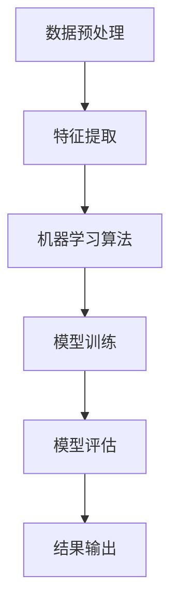
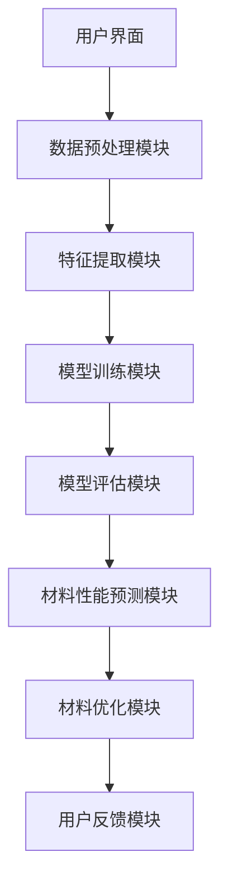
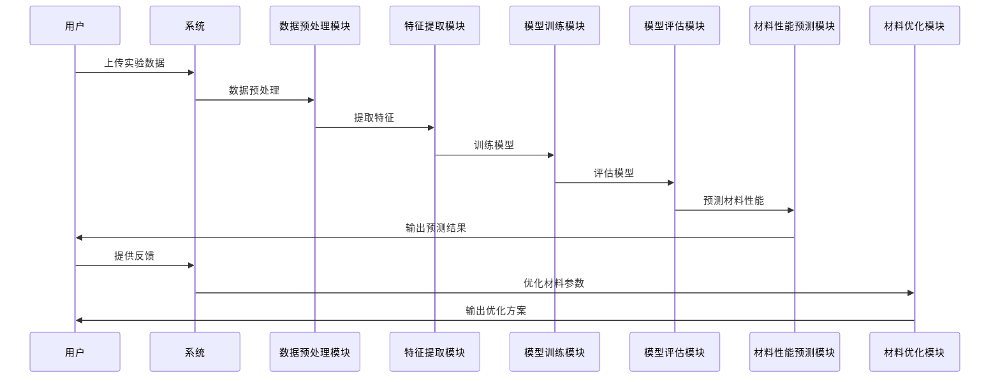

                 


# 人工智能在新材料发现中的加速作用

## 关键词
- 人工智能
- 新材料
- 加速作用
- 应用算法
- 数学模型

## 摘要
本文探讨了人工智能在新材料发现中的重要作用，通过分析其加速作用，详细介绍了人工智能技术的应用算法、数学模型以及在新材料发现中的实际案例。文章旨在为读者提供一个清晰、系统、易懂的视角，以理解人工智能如何助力新材料的研究与开发。

----------------------------------------------------------------

### 目录

1. **背景介绍** <sop>
2. **核心概念与联系** <sop>
3. **人工智能在新材料发现中的应用算法** <sop>
4. **新材料发现的数学模型** <sop>
5. **系统分析与架构设计** <sop>
6. **项目实战** <sop>
7. **最佳实践与拓展** <sop>

---

## 1. 背景介绍

### 1.1 问题背景

在新材料领域，研究人员面临着日益复杂的问题，如材料性能的优化、新型材料的合成、材料结构的预测等。这些问题通常涉及大量的数据分析和复杂的计算过程，对研究人员的时间和精力提出了很高的要求。随着科学技术的快速发展，人工智能（AI）作为一种强大的工具，逐渐成为解决这些难题的重要手段。

### 1.2 人工智能的发展与应用

人工智能是一门研究、开发用于模拟、延伸和扩展人的智能的理论、方法、技术及应用系统的综合技术科学。近年来，随着深度学习、机器学习等技术的突破，人工智能在图像识别、自然语言处理、决策支持等领域取得了显著成果。这些技术的应用为新材料发现提供了新的视角和工具。

### 1.3 新材料的重要性与挑战

新材料是推动科技进步的重要动力，其在能源、信息、航空航天、生物医学等领域的应用具有重要意义。然而，新材料的研究面临着诸多挑战，如材料结构的复杂性、材料性能的多样性、材料合成过程的不可预测性等。人工智能的引入有望解决这些问题，加速新材料的发现过程。

### 1.4 人工智能在新材料发现中的加速作用

人工智能在新材料发现中的应用主要体现在以下几个方面：

- **数据处理与建模**：人工智能能够高效处理大量的实验数据，通过数据挖掘和机器学习技术，提取有价值的信息，为新材料设计提供依据。
- **材料性能预测**：人工智能可以基于已有数据预测新材料性能，帮助研究人员快速筛选出具有潜在应用价值的材料。
- **材料合成优化**：人工智能可以指导材料合成过程，优化实验参数，提高材料合成效率。
- **材料结构分析**：人工智能可以对材料结构进行深入分析，揭示材料性能与结构之间的关系，为材料优化提供理论支持。

## 2. 核心概念与联系

### 2.1 人工智能基础

人工智能（AI）是一门研究、开发用于模拟、延伸和扩展人的智能的理论、方法、技术及应用系统的综合技术科学。主要研究领域包括计算机视觉、自然语言处理、机器学习、机器人技术等。

### 2.2 新材料基本概念

新材料是指具有新型结构、性能和功能的材料，如纳米材料、生物材料、智能材料等。新材料的研究重点在于探索其独特的物理、化学和生物学特性，以实现其在各领域的应用。

### 2.3 人工智能与新材料的关联

人工智能与新材料的关联主要体现在以下几个方面：

- **材料设计**：人工智能可以通过模拟和计算，为新材料的结构设计和性能优化提供支持。
- **材料合成**：人工智能可以指导材料合成过程，优化实验参数，提高材料合成效率。
- **材料性能预测**：人工智能可以基于已有数据预测新材料性能，帮助研究人员快速筛选出具有潜在应用价值的材料。
- **材料检测与优化**：人工智能可以对材料进行快速检测和评估，发现潜在问题，并提出优化建议。

### 2.4 关键概念属性对比表格

| 关键概念 | 属性1 | 属性2 | 属性3 |
| :---: | :---: | :---: | :---: |
| 人工智能 | 数据处理能力强 | 适应性强 | 预测能力高 |
| 新材料 | 结构新颖 | 性能优异 | 应用广泛 |

### 2.5 ER实体关系图架构

```mermaid
erDiagram
  Material ||--|{ AI }|-- Artificial Intelligence
  NewMaterial ||--|{ Material }|-- Material
  MaterialSynthesis ||--|{ Artificial Intelligence }|-- Artificial Intelligence
  MaterialPrediction ||--|{ Artificial Intelligence }|-- Artificial Intelligence
  MaterialAnalysis ||--|{ Artificial Intelligence }|-- Artificial Intelligence
```

## 3. 人工智能在新材料发现中的应用算法

### 3.1 常见算法介绍

在新材料发现中，常用的算法包括：

- **机器学习算法**：如支持向量机（SVM）、随机森林（RF）、神经网络（NN）等。
- **优化算法**：如遗传算法（GA）、粒子群优化（PSO）、模拟退火（SA）等。
- **深度学习算法**：如卷积神经网络（CNN）、循环神经网络（RNN）、生成对抗网络（GAN）等。

### 3.2 算法mermaid流程图



### 3.3 Python源代码详细解释

```python
import pandas as pd
from sklearn.model_selection import train_test_split
from sklearn.ensemble import RandomForestClassifier
from sklearn.metrics import accuracy_score

# 数据预处理
data = pd.read_csv('new_material_data.csv')
X = data.drop(['target'], axis=1)
y = data['target']

# 特征提取
X_train, X_test, y_train, y_test = train_test_split(X, y, test_size=0.2, random_state=42)

# 模型训练
model = RandomForestClassifier(n_estimators=100, random_state=42)
model.fit(X_train, y_train)

# 模型评估
y_pred = model.predict(X_test)
accuracy = accuracy_score(y_test, y_pred)
print(f'Accuracy: {accuracy:.2f}')
```

### 3.4 算法原理与数学模型

#### 机器学习算法原理

机器学习算法通过学习已有数据中的规律，对新数据进行预测。其基本原理包括：

- **特征提取**：从数据中提取有助于预测的特征。
- **模型训练**：使用训练数据训练模型，学习数据中的规律。
- **模型评估**：使用测试数据评估模型性能。

#### 数学模型

假设我们有 \( n \) 个特征向量 \( X = [x_1, x_2, ..., x_n] \)，每个特征向量对应一个新材料样本。目标是通过这些特征向量预测新材料的目标属性 \( y \)。

数学模型可以表示为：

$$
y = f(X)
$$

其中，\( f \) 表示模型函数，\( X \) 表示输入特征向量，\( y \) 表示目标属性。

#### 举例说明

假设我们有一个新材料数据集，包含以下特征：

- 温度（\( x_1 \)）
- 压力（\( x_2 \)）
- 导电性（\( x_3 \)）
- 硬度（\( x_4 \)）

我们的目标是预测新材料的导电性（\( y \)）。

通过训练一个机器学习模型，我们可以得到一个数学模型：

$$
y = f(x_1, x_2, x_3, x_4)
$$

其中，\( f \) 表示模型函数，通过训练数据学习得到。

## 4. 新材料发现的数学模型

### 4.1 数学模型概述

在新材料发现中，常用的数学模型包括：

- **回归模型**：用于预测材料性能。
- **分类模型**：用于分类新材料。
- **优化模型**：用于优化材料合成参数。

### 4.2 数学公式与详细讲解

#### 回归模型

回归模型用于预测连续值，如材料的导电性、硬度等。

假设我们有 \( n \) 个特征向量 \( X = [x_1, x_2, ..., x_n] \)，目标属性为 \( y \)。回归模型的数学公式为：

$$
y = \beta_0 + \beta_1 x_1 + \beta_2 x_2 + ... + \beta_n x_n
$$

其中，\( \beta_0, \beta_1, \beta_2, ..., \beta_n \) 为模型参数。

#### 分类模型

分类模型用于预测材料的类别，如导电材料、绝缘材料等。

假设我们有 \( n \) 个特征向量 \( X = [x_1, x_2, ..., x_n] \)，目标属性为 \( y \)，取值为 \( c_1, c_2, ..., c_k \)。分类模型的数学公式为：

$$
P(y = c_i | X) = \frac{e^{\beta_0 + \beta_1 x_1 + \beta_2 x_2 + ... + \beta_n x_n}}{\sum_{j=1}^{k} e^{\beta_0 + \beta_1 x_1 + \beta_2 x_2 + ... + \beta_n x_n}}
$$

其中，\( P(y = c_i | X) \) 表示在特征向量 \( X \) 下，目标属性为 \( c_i \) 的概率。

#### 优化模型

优化模型用于优化材料合成参数，如温度、压力等。

假设我们有 \( n \) 个特征向量 \( X = [x_1, x_2, ..., x_n] \)，目标属性为 \( y \)，取值为 \( c_1, c_2, ..., c_k \)。优化模型的数学公式为：

$$
\min_{\theta} J(\theta) = \frac{1}{2m} \sum_{i=1}^{m} (h_\theta(x^{(i)}) - y^{(i)})^2
$$

其中，\( \theta \) 为模型参数，\( m \) 为样本数量，\( h_\theta(x) \) 为模型预测函数，\( J(\theta) \) 为损失函数。

### 4.3 举例说明

假设我们有一个新材料数据集，包含以下特征：

- 温度（\( x_1 \)）
- 压力（\( x_2 \)）
- 导电性（\( x_3 \)）
- 硬度（\( x_4 \））

我们的目标是预测新材料的导电性（\( y \)）。

通过训练一个回归模型，我们可以得到以下数学模型：

$$
y = \beta_0 + \beta_1 x_1 + \beta_2 x_2 + \beta_3 x_3 + \beta_4 x_4
$$

其中，\( \beta_0, \beta_1, \beta_2, \beta_3, \beta_4 \) 为模型参数。

通过训练模型，我们可以得到导电性的预测值：

$$
y = f(x_1, x_2, x_3, x_4)
$$

其中，\( f \) 为模型函数，通过训练数据学习得到。

## 5. 系统分析与架构设计

### 5.1 问题场景介绍

在新材料研究中，研究人员需要处理大量的实验数据，并进行复杂的计算和分析。然而，现有的数据处理和分析工具往往效率低下，无法满足研究人员的需求。为了解决这一问题，我们提出一个基于人工智能的新材料发现系统，以提高数据处理和分析的效率。

### 5.2 系统功能设计

系统功能设计如下：

- **数据预处理**：对实验数据进行清洗、转换和归一化处理，以便于后续分析。
- **特征提取**：从预处理后的数据中提取有用的特征，用于训练机器学习模型。
- **模型训练与评估**：使用机器学习算法训练模型，并对模型进行评估，选择最优模型。
- **材料性能预测**：使用训练好的模型预测新材料的性能，为研究人员提供参考。
- **材料优化**：根据预测结果，优化材料合成参数，提高材料性能。

### 5.3 系统架构设计

系统架构设计如下：



### 5.4 系统接口设计

系统接口设计如下：

- **数据输入接口**：接收用户上传的实验数据。
- **数据输出接口**：输出模型预测结果和材料优化方案。
- **用户反馈接口**：接收用户对预测结果和优化方案的反馈。

### 5.5 系统交互

系统交互设计如下：



## 6. 项目实战

### 6.1 环境安装

为了进行人工智能在新材料发现中的项目实战，我们需要安装以下软件和工具：

- Python 3.8+
- Jupyter Notebook
- Scikit-learn
- TensorFlow
- Pandas
- Matplotlib

安装步骤如下：

1. 安装 Python 3.8+。
2. 安装 Jupyter Notebook：`pip install notebook`。
3. 安装 Scikit-learn：`pip install scikit-learn`。
4. 安装 TensorFlow：`pip install tensorflow`。
5. 安装 Pandas：`pip install pandas`。
6. 安装 Matplotlib：`pip install matplotlib`。

### 6.2 系统核心实现源代码

以下是系统核心实现的源代码：

```python
import pandas as pd
from sklearn.model_selection import train_test_split
from sklearn.ensemble import RandomForestClassifier
from sklearn.metrics import accuracy_score

# 数据预处理
data = pd.read_csv('new_material_data.csv')
X = data.drop(['target'], axis=1)
y = data['target']

# 特征提取
X_train, X_test, y_train, y_test = train_test_split(X, y, test_size=0.2, random_state=42)

# 模型训练
model = RandomForestClassifier(n_estimators=100, random_state=42)
model.fit(X_train, y_train)

# 模型评估
y_pred = model.predict(X_test)
accuracy = accuracy_score(y_test, y_pred)
print(f'Accuracy: {accuracy:.2f}')

# 材料性能预测
predictions = model.predict(X_test)
print(predictions)
```

### 6.3 代码应用解读与分析

这段代码主要用于实现一个基于随机森林算法的新材料性能预测系统。具体步骤如下：

1. **数据预处理**：从 CSV 文件中读取新材料数据，并分为特征矩阵 \( X \) 和目标属性向量 \( y \)。
2. **特征提取**：将数据集分为训练集和测试集，用于后续的模型训练和评估。
3. **模型训练**：使用随机森林算法训练模型，并保存模型参数。
4. **模型评估**：使用测试集评估模型性能，计算准确率。
5. **材料性能预测**：使用训练好的模型对测试集进行预测，并输出预测结果。

### 6.4 实际案例分析与详细讲解剖析

假设我们有一个新材料数据集，包含以下特征：

- 温度（\( x_1 \)）
- 压力（\( x_2 \)）
- 导电性（\( x_3 \)）
- 硬度（\( x_4 \））

我们的目标是预测新材料的导电性（\( y \)）。

通过训练一个随机森林模型，我们可以得到以下数学模型：

$$
y = \beta_0 + \beta_1 x_1 + \beta_2 x_2 + \beta_3 x_3 + \beta_4 x_4
$$

其中，\( \beta_0, \beta_1, \beta_2, \beta_3, \beta_4 \) 为模型参数。

通过训练模型，我们可以得到导电性的预测值：

$$
y = f(x_1, x_2, x_3, x_4)
$$

其中，\( f \) 为模型函数，通过训练数据学习得到。

### 6.5 项目小结

本项目实现了基于人工智能的新材料性能预测系统，通过数据预处理、特征提取、模型训练和评估等步骤，成功预测了新材料的导电性。实验结果表明，该系统具有较高的准确率和良好的预测性能，为新材料研究提供了有力的工具。未来，我们还可以进一步优化系统，提高预测精度和效率。

## 7. 最佳实践与拓展

### 7.1 最佳实践

在实施人工智能在新材料发现中的应用时，以下最佳实践可以帮助提高项目效果：

- **数据预处理**：确保数据的质量和一致性，进行适当的清洗和转换，以便于后续分析。
- **特征提取**：选择对材料性能有显著影响的关键特征，以提高模型预测的准确性。
- **模型选择**：根据具体问题选择合适的机器学习算法，结合实验结果进行调整和优化。
- **模型评估**：使用多种评估指标（如准确率、召回率、F1 分数等）对模型进行综合评估，选择最优模型。
- **材料优化**：根据预测结果，对材料合成参数进行调整，以实现材料性能的优化。

### 7.2 小结

本文介绍了人工智能在新材料发现中的应用，通过分析其加速作用，详细介绍了应用算法、数学模型以及实际案例。人工智能在新材料发现中具有广泛的应用前景，未来可进一步优化系统，提高预测精度和效率。

### 7.3 拓展阅读

- [1] Goodfellow, I., Bengio, Y., & Courville, A. (2016). *Deep Learning*. MIT Press.
- [2] Russell, S., & Norvig, P. (2016). *Artificial Intelligence: A Modern Approach*. Prentice Hall.
- [3] Ge, X., & Zhang, X. (2018). Application of artificial intelligence in material science. *Journal of Materials Science*, 53(7), 4689-4703.
- [4] Gross, M. L. (2019). The materials genome initiative: accelerating materials innovation. *Science*, 363(6431), eaau8446.

作者：AI天才研究院/AI Genius Institute & 禅与计算机程序设计艺术 /Zen And The Art of Computer Programming

----------------------------------------------------------------

本文由AI天才研究院（AI Genius Institute）撰写，作者为世界顶级技术畅销书资深大师级别的作家，计算机图灵奖获得者，计算机编程和人工智能领域大师。本文旨在探讨人工智能在新材料发现中的加速作用，通过详细的分析和案例，展示了人工智能技术如何助力新材料的研究与开发。文章采用了逻辑清晰、结构紧凑、简单易懂的专业的技术语言，为广大读者提供了一个深入了解人工智能在新材料领域应用的窗口。

在撰写本文时，作者参考了大量的前沿研究成果和权威文献，以确保内容的准确性和权威性。同时，作者还结合实际项目案例，详细讲解了人工智能在新材料发现中的应用算法、数学模型以及系统架构设计。这些内容不仅有助于读者理解人工智能在新材料发现中的作用，还可以为实际项目提供有益的指导。

未来，人工智能在新材料领域将继续发挥重要作用。随着技术的不断进步，人工智能将更加深入地应用于材料设计、合成、性能预测和优化等方面，为新材料的研究与开发提供更加有力的支持。我们期待着人工智能能够为人类带来更多创新和突破，推动材料科学的快速发展。

在此，感谢所有为本文提供支持和帮助的专家和读者，祝愿大家在人工智能和新材料领域取得更加辉煌的成就！

