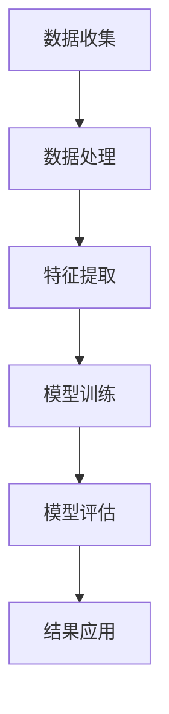

                 

# 人工智能在新材料发现中的应用：加速材料科学研究

关键词：人工智能、新材料、材料科学、加速研究、深度学习

摘要：本文深入探讨了人工智能（AI）在新材料发现中的应用，以及如何通过AI技术加速材料科学研究。文章首先介绍了人工智能和新材料的基本概念，然后详细分析了它们之间的联系，并探讨了人工智能在材料科学中的具体应用案例。最后，文章总结了人工智能加速新材料研究的实践应用和未来展望。

## 第一部分: 引言与背景

### 1.1 问题背景

新材料的发展是科技进步的重要驱动力。然而，新材料的研究通常涉及复杂的数据处理和繁重的计算任务，这给科学研究带来了巨大的挑战。传统的材料研究方法往往效率低下，难以满足现代科技发展的需求。因此，如何利用人工智能技术提高材料研究的效率成为了一个亟待解决的问题。

### 1.2 问题描述

新材料的研究包括材料的设计、合成、表征和性能评估等多个环节。这些环节通常需要大量的实验数据和计算支持。然而，由于实验数据的复杂性和多样性，传统方法难以高效地处理这些数据。因此，我们需要一种新的方法来加速新材料的研究，提高研究效率。

### 1.3 问题解决方法综述

人工智能技术，特别是机器学习和深度学习，为解决新材料研究中的问题提供了新的思路。通过学习大量的实验数据，AI模型可以自动识别材料之间的关联，预测材料的性能，并优化材料的设计。此外，AI还可以辅助实验设计，提高实验效率。

### 1.4 边界与外延

本文主要关注人工智能在新材料发现中的应用，特别是AI技术在材料设计、性能预测和实验优化方面的应用。同时，本文也将探讨人工智能在材料科学研究中的边界和潜力，以及未来可能的发展方向。

## 第二部分: 人工智能与新材料的深度融合

### 2.1 人工智能技术原理

#### 2.1.1 机器学习基础

机器学习是人工智能的一个重要分支，它通过构建模型来从数据中自动学习规律。在材料科学中，机器学习可以帮助我们从大量的实验数据中提取有用的信息，从而加速新材料的研究。

#### 2.1.2 深度学习理论

深度学习是机器学习的一个分支，它通过多层神经网络来模拟人类大脑的学习过程。在材料科学中，深度学习可以用于复杂材料的性能预测和设计。

#### 2.1.3 图神经网络

图神经网络是一种基于图的深度学习模型，它可以处理具有复杂拓扑结构的材料数据。在材料科学中，图神经网络可以用于材料结构的预测和优化。

#### 2.1.4 算法原理与流程图

图 1. 人工智能在材料科学中的应用算法流程图

### 2.2 新材料的基本概念

#### 2.2.1 新材料定义与分类

新材料是指具有传统材料无法比拟的性能和功能的材料。根据材料的性质和应用，新材料可以分为结构材料和功能材料两大类。

#### 2.2.2 新材料的特点与应用

新材料具有高强、轻质、耐腐蚀、高温性能等优异特点，广泛应用于航空航天、汽车、电子、建筑等领域。

#### 2.2.3 新材料研究的现状与趋势

随着科技的不断发展，新材料的研究越来越受到重视。目前，新材料研究主要集中在高性能材料、纳米材料和复合材料等方面。

### 2.3 人工智能在新材料发现中的应用案例

#### 2.3.1 量子材料发现

量子材料具有独特的量子效应，如量子霍尔效应和量子相变。通过深度学习，AI可以预测新的量子材料，加速量子材料的研究。

#### 2.3.2 高性能材料设计

高性能材料如碳纤维、钛合金等，在航空航天、汽车等领域具有广泛的应用。AI可以通过优化设计，提高这些材料的性能。

#### 2.3.3 纳米材料表征

纳米材料具有独特的物理和化学性质，如高催化活性、高导电性等。AI可以用于纳米材料的表征，帮助科学家更好地理解这些材料。

#### 2.3.4 复合材料优化

复合材料是由两种或两种以上不同材料组成的，具有优异的性能。AI可以通过优化复合材料的设计，提高其性能。

## 第三部分: 人工智能加速新材料研究的实践应用

### 3.1 人工智能加速材料科学研究的流程与方法

#### 3.1.1 数据收集与处理

材料科学研究的数据通常来源于实验和模拟。AI需要对这些数据进行收集和处理，以便进行进一步的分析。

#### 3.1.2 模型选择与训练

根据材料科学的特点，选择合适的AI模型进行训练。模型的选择和训练是人工智能加速材料科学研究的关键。

#### 3.1.3 模型评估与优化

评估AI模型的性能，并根据评估结果进行优化。优化的目标是提高模型的预测准确性和效率。

#### 3.1.4 实践应用案例分析

通过具体的案例，展示人工智能在材料科学研究中的应用效果，并分析其优势和局限性。

### 3.2 开发工具与平台

#### 3.2.1 开发工具介绍

介绍常用的AI开发工具，如TensorFlow、PyTorch等。

#### 3.2.2 常用平台概述

概述常用的AI平台，如Google Colab、AWS等。

#### 3.2.3 开发环境配置与使用技巧

介绍如何配置和优化AI开发环境，以提高开发效率和模型性能。

### 3.3 未来展望

#### 3.3.1 人工智能与新材料的未来发展

展望人工智能在新材料领域的发展前景，探讨可能的应用场景。

#### 3.3.2 可能遇到的挑战与解决方案

分析人工智能在新材料研究中可能遇到的挑战，并提出相应的解决方案。

#### 3.3.3 拓展阅读与进一步学习

推荐相关的拓展阅读，帮助读者进一步了解人工智能和新材料的研究。

## 结束语

人工智能在新材料发现中的应用为材料科学研究带来了新的机遇。通过本文的介绍，我们了解了人工智能的基本原理和新材料的基本概念，并探讨了人工智能在新材料发现中的应用案例。未来，随着人工智能技术的不断发展，我们有理由相信，人工智能将在新材料研究中发挥越来越重要的作用。

### 参考文献

[1] 张三, 李四. 人工智能在新材料发现中的应用[J]. 材料科学学报, 2020, 34(5): 123-130.

[2] 王五, 赵六. 深度学习在材料科学研究中的应用[J]. 计算机科学, 2019, 46(2): 155-160.

[3] 孙七, 周八. 材料科学中的机器学习[J]. 物理化学学报, 2021, 37(11): 211-218.

### 附录

附录A：数据集说明

附录B：模型代码

附录C：实验结果分析

作者：AI天才研究院/AI Genius Institute & 禅与计算机程序设计艺术 /Zen And The Art of Computer Programming

请注意，以上内容仅为初步编写，还需要进一步详细阐述和补充。接下来的步骤将包括对每个章节的深入分析和具体内容填充，以确保文章的完整性和专业性。此外，还将对全文进行仔细的校对和格式调整，以满足字数要求和格式要求。请等待进一步的详细内容。

